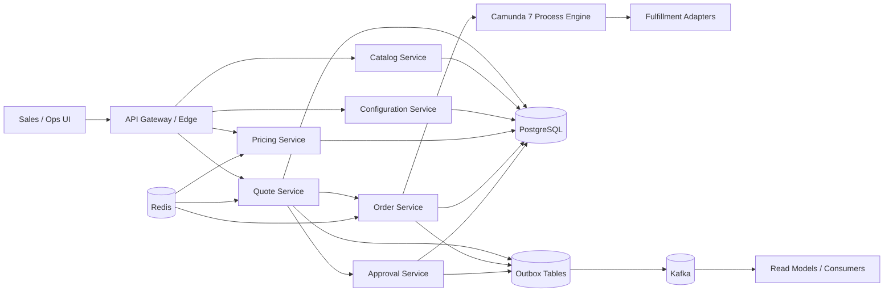
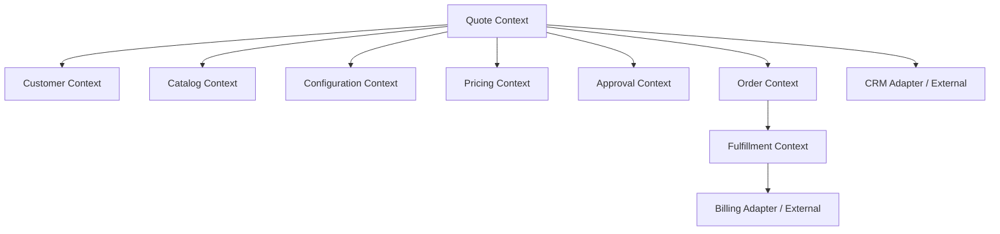
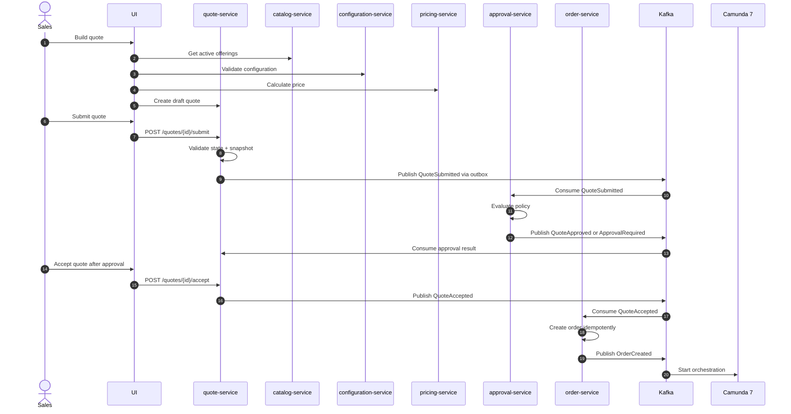
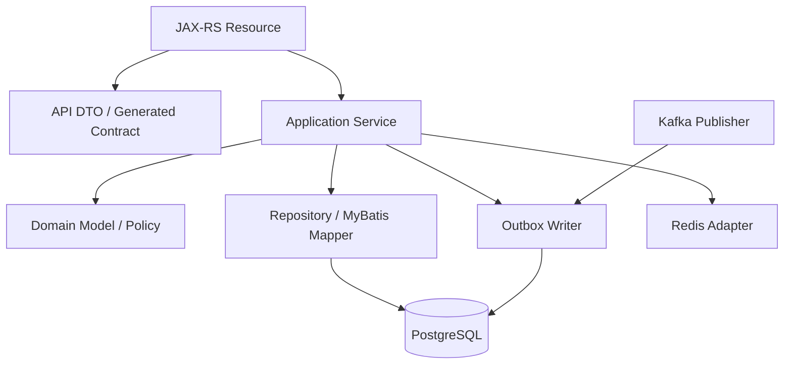
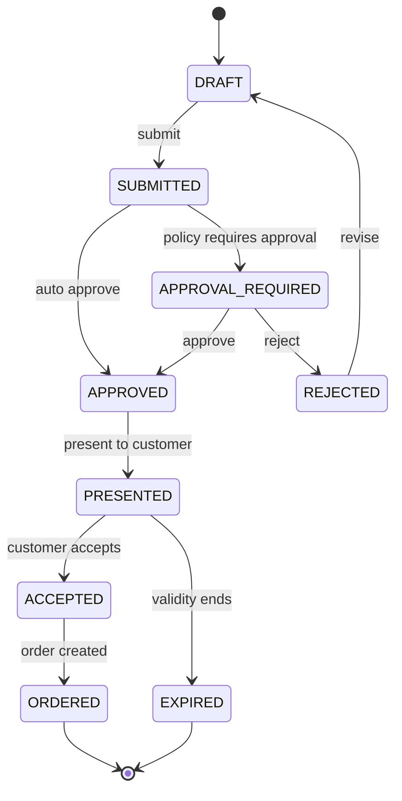
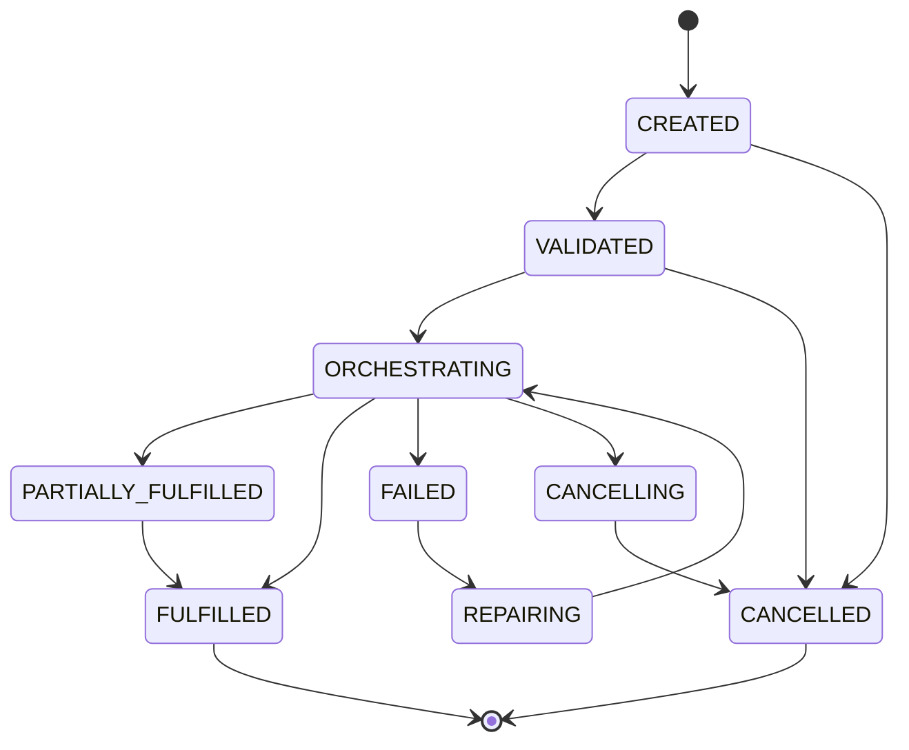

# Part 001 — Kaufman Skill Map and Target Architecture

## 1. Tujuan Part Ini

Kita tidak sedang belajar "cara membuat CRUD microservice". Kita sedang membangun mental model dan blueprint untuk platform **CPQ (Configure, Price, Quote) + OMS (Order Management System)** yang bisa bertahan di lingkungan nyata: banyak dependency, banyak state, banyak actor, perubahan bisnis cepat, workflow panjang, integrasi gagal, data harus defensible, dan keputusan sistem harus bisa diaudit.

Target akhir seri ini adalah kemampuan untuk mendesain dan membangun platform dengan kualitas internal engineering handbook:

- kontrak API jelas dan versionable;
- model domain eksplisit, bukan sekadar tabel database;
- state machine dapat dijelaskan dan diuji;
- pricing deterministik dan dapat diaudit;
- workflow order bisa pulih dari partial failure;
- eventing reliable walaupun service crash;
- cache mempercepat sistem tanpa merusak kebenaran;
- observability menjawab pertanyaan operasional, bukan hanya menghasilkan log;
- deployment dan runbook siap untuk production;
- desain punya migration seam, terutama karena Camunda 7 perlu diperlakukan sebagai teknologi legacy yang masih mungkin dipakai di enterprise.

Part ini menjawab empat pertanyaan besar:

1. Skill apa sebenarnya yang perlu dikuasai?
2. Bagaimana cara memecahnya agar bisa dipelajari efektif?
3. Arsitektur target seperti apa yang akan kita bangun?
4. Apa batasan dan prinsip teknis yang akan menjaga seri ini tetap tajam?

---

## 2. Cara Membaca Seri Ini

Seri ini disusun sebagai **build-from-scratch handbook**. Artinya setiap part harus bisa menjawab:

- apa masalah nyata yang sedang diselesaikan;
- model mental apa yang harus dimiliki;
- keputusan desain apa yang tersedia;
- trade-off apa yang harus diterima;
- failure mode apa yang harus dipikirkan;
- bagaimana menerjemahkannya ke implementasi Java microservices.

Kita akan menghindari dua jebakan umum.

Pertama, **framework-first learning**. Banyak engineer belajar CPQ/OMS dengan langsung memilih Spring, Camunda, Kafka, Redis, dan PostgreSQL, lalu membuat service. Hasilnya sering tampak berjalan, tetapi domain-nya rapuh. Pada platform seperti ini, domain yang salah akan lebih mahal daripada framework yang salah.

Kedua, **diagram-only architecture**. Diagram bagus untuk komunikasi, tetapi tidak cukup. Setiap kotak di diagram harus punya ownership, kontrak, state, persistence model, event behavior, failure behavior, dan operational signal.

---

## 3. Translasi Framework Kaufman ke Seri Ini

Josh Kaufman menekankan bahwa untuk mempelajari skill dengan cepat, kita perlu memecah skill menjadi sub-skill, fokus pada komponen paling penting, belajar cukup untuk self-correct, menghilangkan friction praktik, lalu berlatih secara deliberate.

Untuk platform CPQ/OMS, skill utamanya bukan "menghafal teknologi". Skill utamanya adalah:

> Mampu mengubah proses komersial kompleks menjadi sistem terdistribusi yang benar secara domain, dapat dioperasikan, dan dapat berevolusi.

Kita pecah menjadi beberapa sub-skill.

| Sub-skill | Pertanyaan Kunci | Bukti Penguasaan |
|---|---|---|
| Domain decomposition | Di mana batas catalog, pricing, quote, approval, order, fulfillment? | Bisa menjelaskan mengapa entity tertentu tidak boleh dimiliki dua service. |
| Contract design | Apa yang boleh berubah tanpa merusak consumer? | OpenAPI dan schema punya compatibility rule. |
| State modeling | State apa yang valid, invalid, terminal, recoverable? | State machine bisa diuji dan tidak bergantung pada asumsi UI. |
| Transaction design | Operasi mana yang harus atomic dan mana yang eventually consistent? | Outbox/inbox digunakan untuk efek lintas-service. |
| Workflow orchestration | Kapan memakai BPMN, kapan cukup code, kapan event choreography? | Proses Camunda tidak menjadi tempat menyimpan semua business logic. |
| Persistence design | Apa yang harus dinormalisasi, disnapshot, diaudit, atau diproyeksikan? | Database constraint menjaga invariant penting. |
| Event design | Event merepresentasikan fakta apa? Siapa consumer-nya? | Event bisa direplay tanpa efek samping liar. |
| Runtime acceleration | Data apa yang aman dicache? | Redis mempercepat read/idempotency/rate-limit tanpa menjadi source of truth palsu. |
| Observability | Ketika order stuck, sinyal apa yang menunjukkan penyebabnya? | Trace/log/metric menjawab pertanyaan bisnis-operasional. |
| Operational recovery | Bagaimana memperbaiki data/workflow tanpa merusak audit? | Ada runbook dan repair command yang aman. |

---

## 4. Definisi “Top 1%” untuk Seri Ini

Dalam konteks ini, “top 1%” bukan berarti memakai teknologi paling banyak. Engineer kuat justru tahu kapan **tidak** memakai teknologi tertentu.

Kualitas yang kita kejar:

1. **Domain clarity** — bisa menjelaskan perbedaan antara product, product offering, configured product, quote line, order line, fulfillment task, dan commercial snapshot.
2. **Invariant discipline** — tahu aturan mana yang wajib ditegakkan di API, database, event consumer, dan workflow.
3. **Failure literacy** — selalu bisa menjawab “apa yang terjadi kalau request dikirim dua kali?”, “apa yang terjadi kalau Kafka publish berhasil tapi DB commit gagal?”, “apa yang terjadi kalau Camunda job retry habis?”.
4. **Operational empathy** — desain tidak hanya untuk developer, tetapi juga untuk support engineer, SRE, business approver, auditor, dan incident commander.
5. **Evolutionary architecture** — desain bisa berubah tanpa rewrite besar, termasuk jika Camunda 7 perlu diganti, pricing engine dipisah, atau tenant isolation diperketat.

---

## 5. Platform yang Akan Kita Bangun

Secara konseptual, platform ini menangani alur berikut:

1. Sales memilih customer dan product offering.
2. Sistem mengambil catalog dan configuration rules.
3. User melakukan konfigurasi produk.
4. Pricing engine menghitung harga.
5. Quote dibuat, direvisi, dikunci, dan diajukan.
6. Approval dipicu jika diskon, margin, risiko, atau kebijakan tertentu terpenuhi.
7. Quote diterima customer.
8. Order dibuat dari quote yang sudah diterima.
9. OMS memecah order ke fulfillment plan.
10. Camunda 7 mengorkestrasi proses order yang panjang.
11. Kafka menyebarkan fakta domain ke service lain.
12. Redis membantu idempotency, cache, lock ringan, dan rate limiting bila aman.
13. PostgreSQL menjadi source of truth untuk state penting.
14. Observability dan audit menjawab apa yang terjadi dan mengapa.

Diagram high-level:



Diagram ini sengaja belum membahas detail network, deployment, atau framework internal. Part awal harus menjaga fokus pada ownership dan information flow.

---

## 6. Stack Teknologi dan Perannya

Kita akan memakai stack berikut secara sengaja.

| Teknologi | Peran | Yang Tidak Boleh Disalahpahami |
|---|---|---|
| Java | Bahasa utama service backend | Java bukan sekadar syntax; kita akan fokus pada boundary, concurrency, typing, dan reliability. |
| JAX-RS / Jakarta REST | API Java untuk RESTful services | Resource class bukan tempat business logic besar. |
| Jersey | Implementasi JAX-RS | Jersey memberi runtime REST, tetapi contract governance tetap di OpenAPI. |
| OpenAPI First | Kontrak HTTP API | OpenAPI bukan dokumentasi pasca-code; ia adalah input desain. |
| Schema First | Kontrak data | Schema harus memaksa kita berpikir tentang compatibility dan semantics. |
| PostgreSQL | Source of truth transactional | Jangan jadikan Kafka atau Redis sebagai sumber kebenaran untuk state kritis. |
| MyBatis | Explicit SQL persistence | MyBatis memberi kontrol SQL, bukan alasan untuk menyebar query liar di seluruh codebase. |
| Camunda 7 | Workflow orchestration | BPMN mengorkestrasi proses, bukan menggantikan domain model. |
| Kafka | Event backbone | Kafka membawa fakta domain, bukan command RPC tersembunyi. |
| Redis | Runtime acceleration | Redis mempercepat, bukan memperbaiki model konsistensi yang buruk. |
| Docker Compose | Local development stack | Local stack harus reproducible, bukan “works on my machine”. |
| Testcontainers | Integration test dependencies | Test harus memakai dependency nyata untuk behavior penting. |
| OpenTelemetry | Trace/metric/log correlation | Observability harus dirancang sejak awal, bukan dipasang di akhir. |
| Resilience4j | Resilience primitives | Retry/circuit breaker harus berbasis failure semantics, bukan ditempel generik. |

---

## 7. Mengapa OpenAPI First dan Schema First Penting

Pada CPQ/OMS, API bukan sekadar endpoint. API adalah kontrak antar tim, antar service, antar UI, bahkan antar organisasi.

OpenAPI-first berarti:

1. kita mendesain kontrak sebelum implementasi;
2. request/response/error model didiskusikan sebelum code;
3. generated code boleh dipakai, tetapi tidak menggantikan review desain;
4. compatibility menjadi bagian dari engineering process;
5. API dapat dites, didokumentasikan, dan divalidasi secara otomatis.

Schema-first berarti:

1. tipe data domain dibuat eksplisit;
2. monetary value tidak dibiarkan sebagai `double` liar;
3. enum diberi evolution policy;
4. timestamp, timezone, ID, status, dan reason code tidak ambigu;
5. event dan API payload punya bahasa yang konsisten.

Contoh prinsip schema:

```yaml
Money:
  type: object
  required: [amount, currency]
  properties:
    amount:
      type: string
      pattern: "^-?[0-9]+(\\.[0-9]{1,6})?$"
      description: Decimal string, never floating point.
    currency:
      type: string
      minLength: 3
      maxLength: 3
      example: USD
```

Kenapa `amount` string? Karena uang tidak boleh kehilangan presisi karena floating point. Di Java, ini akan dipetakan ke `BigDecimal` dengan aturan rounding yang eksplisit.

---

## 8. Domain Pertama, Teknologi Kedua

Kesalahan umum dalam microservices adalah memecah sistem berdasarkan kata benda teknis:

- `user-service`
- `product-service`
- `price-service`
- `order-service`
- `workflow-service`

Nama seperti ini belum salah, tetapi belum cukup. Pertanyaan yang lebih penting:

- Siapa pemilik kebenaran product offering?
- Apakah quote menyimpan referensi price atau snapshot price?
- Apakah order boleh berubah ketika quote berubah?
- Apakah approval adalah state quote atau entity terpisah?
- Apakah fulfillment failure mengubah order state atau hanya order line state?
- Apakah Kafka event dibuat sebelum atau setelah commit database?

Dalam sistem CPQ/OMS, domain model harus menjawab **kapan sesuatu menjadi fakta**.

Contoh:

- Product catalog published adalah fakta.
- Price calculated belum tentu fakta permanen.
- Quote submitted adalah fakta.
- Quote approved adalah fakta.
- Customer accepted quote adalah fakta.
- Order created adalah fakta.
- Fulfillment task failed adalah fakta.

Sistem yang kuat membedakan **calculation**, **proposal**, **commitment**, dan **execution**.

---

## 9. Bounded Context Awal

Untuk seri ini, kita akan menggunakan bounded context berikut sebagai baseline. Ini bukan satu-satunya desain yang benar, tetapi cukup realistis untuk enterprise CPQ/OMS.



### 9.1 Customer Context

Menyediakan identitas customer, segment, account status, eligibility, dan risk attributes. Dalam seri ini, kita tidak akan membangun CRM penuh. Kita akan mendesain adapter dan data contract yang cukup untuk CPQ.

### 9.2 Catalog Context

Mengelola product offering, lifecycle, compatibility, commercial availability, dan publish version. Catalog bukan sekadar tabel product. Catalog adalah sumber kebenaran untuk apa yang boleh dijual.

### 9.3 Configuration Context

Mengelola rules untuk konfigurasi. Ini menjawab pertanyaan: kombinasi option mana yang valid, required, optional, mutually exclusive, atau dependent.

### 9.4 Pricing Context

Menghitung harga berdasarkan product, configuration, customer, channel, contract, campaign, dan discount. Pricing harus deterministik, explainable, dan snapshot-friendly.

### 9.5 Quote Context

Mengelola proposal komersial. Quote adalah boundary di mana konfigurasi dan harga berubah menjadi penawaran yang bisa dikirim, disetujui, diterima, atau kedaluwarsa.

### 9.6 Approval Context

Mengelola keputusan manusia atau kebijakan otomatis. Approval harus defensible: siapa menyetujui apa, kapan, berdasarkan data apa, dan dengan alasan apa.

### 9.7 Order Context

Mengubah accepted quote menjadi instruksi eksekusi. Order bukan quote dengan nama lain. Order adalah commitment untuk dipenuhi.

### 9.8 Fulfillment Context

Mengelola eksekusi downstream: provisioning, shipping, activation, installation, atau integrasi sistem eksternal.

---

## 10. Target Microservice Map

Baseline service map:

| Service | Primary Responsibility | Owns DB? | Publishes Events? | Consumes Events? |
|---|---|---:|---:|---:|
| `catalog-service` | Product offering, catalog version, availability | Yes | Yes | Optional |
| `configuration-service` | Configuration rules and validation | Yes | Yes | Catalog events |
| `pricing-service` | Price calculation and price explanation | Yes | Yes | Catalog/customer events |
| `quote-service` | Quote lifecycle and commercial snapshot | Yes | Yes | Approval/order events |
| `approval-service` | Approval policy and decision records | Yes | Yes | Quote events |
| `order-service` | Order lifecycle and line state | Yes | Yes | Quote accepted events |
| `workflow-service` | Camunda 7 process deployment and orchestration integration | Yes/Shared carefully | Yes | Order events |
| `fulfillment-adapter-service` | Downstream system calls | Yes | Yes | Workflow/order commands |
| `projection-service` | Read models for UI/search/reporting | Yes | Optional | Domain events |

Catatan penting: `workflow-service` tidak boleh menjadi tempat semua business logic. Ia menjadi boundary antara domain service dan Camunda process engine.

---

## 11. Service Ownership Rules

Agar sistem tidak berubah menjadi distributed monolith, kita butuh rule eksplisit.

### Rule 1 — Satu Source of Truth per State

Jika `quote-service` pemilik quote status, service lain tidak boleh mengubah quote status langsung melalui database. Mereka harus menggunakan API, command, atau event yang disepakati.

### Rule 2 — Jangan Share Database Antar Service

PostgreSQL boleh berada dalam cluster yang sama, tetapi schema ownership harus jelas. Cross-service join langsung adalah smell. Jika UI butuh data gabungan, gunakan projection/read model.

### Rule 3 — Event adalah Fakta, Bukan Request Tersembunyi

`QuoteSubmitted` adalah fakta. `PleaseApproveQuote` lebih mirip command. Keduanya punya tempat, tetapi jangan dicampur.

### Rule 4 — Workflow Mengorkestrasi, Domain Service Memutuskan

Camunda boleh menentukan langkah proses. Tetapi validasi apakah order boleh cancel, apakah quote boleh approve, atau apakah line item boleh fulfill tetap harus dimiliki domain service.

### Rule 5 — Cache Tidak Boleh Mengubah Kebenaran

Redis boleh menyimpan idempotency key, cache catalog read, rate limit counter, atau short-lived pricing input. Tetapi state penting seperti `ORDER_COMPLETED` harus berada di PostgreSQL.

---

## 12. Target Runtime Flow: Quote to Order



Diagram ini menunjukkan satu pilihan desain: order dibuat dari event `QuoteAccepted`. Alternatifnya, quote-service bisa synchronous call ke order-service. Kita akan membahas trade-off tersebut di part saga dan consistency.

---

## 13. Layering Dalam Satu Service

Setiap microservice akan mengikuti struktur konseptual berikut:



Prinsipnya:

- Resource layer hanya menangani HTTP concern.
- Application service mengatur use case dan transaction boundary.
- Domain model menyimpan invariant dan transition rule.
- Repository menyembunyikan detail SQL, tetapi SQL tetap eksplisit.
- Outbox ditulis dalam transaksi yang sama dengan state change.
- Kafka publisher membaca outbox setelah commit.
- Redis adapter tidak boleh dipakai langsung dari domain model.

---

## 14. Data Ownership dan Transaction Boundary

Salah satu keputusan paling menentukan adalah batas transaksi.

Dalam monolith, kita bisa membuat satu transaksi besar:

```text
create quote -> calculate price -> request approval -> create order -> start workflow
```

Dalam microservices, ini berbahaya. Kita tidak akan membuat distributed transaction lintas service. Kita akan memakai kombinasi:

- local ACID transaction di PostgreSQL;
- transactional outbox;
- idempotent consumer;
- saga orchestration/choreography;
- reconciliation job;
- manual repair path.

Contoh transaction boundary pada `quote-service`:

```text
BEGIN
  update quote set status = 'SUBMITTED'
  insert quote_status_history
  insert outbox_event(type='QuoteSubmitted', aggregate_id=quote_id, payload=...)
COMMIT
```

Kafka publish terjadi setelah commit melalui outbox publisher. Dengan begitu, jika service crash setelah commit tetapi sebelum publish, event masih bisa dipublish nanti.

---

## 15. State Machine sebagai Tulang Punggung

CPQ/OMS bukan sistem data entry. Ia adalah sistem stateful.

Quote lifecycle awal:



Order lifecycle awal:



State machine ini akan berubah ketika kita masuk detail. Yang penting di part ini: kita tidak boleh menyimpan state sebagai string tanpa transition rule.

---

## 16. CPQ/OMS sebagai Sistem Snapshot dan Fakta

Platform ini penuh dengan data yang berubah:

- catalog berubah;
- price book berubah;
- discount policy berubah;
- customer risk berubah;
- approval delegation berubah;
- tax rule berubah;
- fulfillment availability berubah.

Tetapi quote dan order membutuhkan stabilitas. Karena itu kita harus membedakan **reference** dan **snapshot**.

| Data | Saat Draft | Saat Submit Quote | Saat Accept Quote | Saat Create Order |
|---|---|---|---|---|
| Catalog item | Referenced | Snapshotted | Snapshotted | Copied to order snapshot |
| Configuration | Editable | Locked or versioned | Locked | Copied |
| Price | Recalculatable | Snapshotted | Locked | Copied |
| Discount | Editable | Requires approval | Locked | Copied |
| Approval | Not applicable | Created/evaluated | Must be valid | Evidence copied |
| Customer | Referenced | Key attributes snapshotted | Validated | Copied minimally |

Rule penting:

> Accepted quote harus cukup lengkap untuk membuat order walaupun catalog/pricing berubah setelahnya.

---

## 17. Failure Model Awal

Kita akan mendesain platform dengan asumsi failure adalah normal.

| Failure | Contoh | Desain yang Dibutuhkan |
|---|---|---|
| Duplicate request | User double-click submit quote | Idempotency key + state transition guard |
| Concurrent update | Dua sales edit quote sama | Optimistic locking + version field |
| Stale price | Price book berubah setelah quote dihitung | Price snapshot + recalculation policy |
| Approval race | Quote direvisi saat approval berjalan | Approval tied to quote version |
| Publish failure | DB commit sukses, Kafka publish gagal | Transactional outbox |
| Consumer retry | Consumer crash setelah side effect | Inbox/deduplication |
| Workflow stuck | Camunda job retries exhausted | Incident handling + repair command |
| Cache stale | Redis menyimpan catalog lama | TTL + versioned cache key + source-of-truth fallback |
| Downstream unavailable | Fulfillment system timeout | Retry classification + circuit breaker + manual queue |
| Partial order failure | 3 dari 5 line fulfilled | Line-level state + compensation policy |

Topik-topik ini akan diulang dalam konteks yang lebih konkret, tetapi tidak sebagai teori umum. Setiap failure akan dikaitkan dengan design decision.

---

## 18. Anti-Architecture yang Harus Dihindari

### 18.1 Distributed CRUD

Microservices yang hanya memindahkan CRUD ke banyak service akan menghasilkan latency tinggi dan consistency rendah tanpa manfaat domain.

Gejala:

- setiap screen membutuhkan 15 API call;
- tidak ada owner state yang jelas;
- UI mengandung workflow logic;
- service saling query untuk join data;
- bug consistency diperbaiki dengan cache tambahan.

### 18.2 Workflow God Service

Camunda sering disalahgunakan sebagai pusat semua keputusan. BPMN berisi terlalu banyak expression, script, business rule, dan data mutation.

Gejala:

- mengubah rule kecil perlu redeploy process besar;
- unit test domain sulit;
- process variable menjadi database bayangan;
- incident sulit dijelaskan oleh domain service.

### 18.3 Event Soup

Kafka dipakai untuk semua hal tanpa taxonomy.

Gejala:

- event tidak punya owner;
- event payload berubah sembarangan;
- consumer bergantung pada field internal;
- replay menghasilkan side effect tidak aman;
- event bernama `OrderUpdated` tanpa menjelaskan apa yang berubah.

### 18.4 Cache as Truth

Redis dipakai untuk menyimpan state penting karena cepat.

Gejala:

- order status berbeda antara Redis dan PostgreSQL;
- TTL menghapus data yang masih diperlukan;
- cache invalidation menjadi business logic;
- recovery setelah restart sulit.

---

## 19. Baseline Non-Functional Requirements

Kita akan menggunakan NFR realistis sebagai anchor.

| Area | Baseline Target | Catatan |
|---|---|---|
| API latency | p95 quote read < 300 ms untuk read model | Core calculation bisa lebih mahal. |
| Pricing calculation | p95 < 1 s untuk quote normal | Complex enterprise bundle mungkin async. |
| Quote submit | Idempotent dan atomic di quote-service | Publish event via outbox. |
| Order creation | Exactly-once business effect | Bukan exactly-once infrastructure fantasy. |
| Audit | Semua transition penting tercatat | Termasuk actor, reason, request ID. |
| Availability | Critical read path degraded gracefully | Write path harus lebih konservatif. |
| Recovery | Stuck order bisa ditemukan dan diperbaiki | Runbook wajib. |
| Compatibility | API/event tidak breaking tanpa version plan | Schema governance wajib. |
| Security | Tenant boundary tidak bergantung pada UI | Enforced server-side dan database-side bila perlu. |

---

## 20. Minimum Buildable Platform

Agar seri ini tetap konkret, kita akan membangun target secara bertahap.

### Phase 1 — Skeleton

- repository structure;
- service template;
- OpenAPI contract;
- generated DTO;
- Jersey resource;
- PostgreSQL migration;
- MyBatis mapper;
- health endpoint;
- structured logging;
- local Docker Compose.

### Phase 2 — CPQ Core

- product catalog;
- configuration validation;
- pricing calculation;
- quote draft;
- quote submit;
- quote approval;
- quote accept.

### Phase 3 — OMS Core

- order creation from accepted quote;
- order line state;
- Camunda process start;
- fulfillment task dispatch;
- retry and incident handling.

### Phase 4 — Distributed Reliability

- transactional outbox;
- Kafka topic design;
- idempotent consumer;
- Redis idempotency key;
- reconciliation job;
- repair command.

### Phase 5 — Production Readiness

- contract tests;
- integration tests;
- observability;
- resilience;
- performance testing;
- deployment topology;
- runbook;
- compliance/audit.

---

## 21. Reference Implementation Naming

Untuk konsistensi, kita akan memakai nama module seperti berikut:

```text
cpq-oms-platform/
  platform-bom/
  platform-common/
  platform-openapi/
  platform-observability/
  platform-persistence/
  catalog-service/
  configuration-service/
  pricing-service/
  quote-service/
  approval-service/
  order-service/
  workflow-service/
  fulfillment-adapter-service/
  projection-service/
  local-dev/
  docs/
```

Di part berikutnya kita akan memperdalam domain sebelum masuk repository.

---

## 22. Decision Records yang Akan Kita Buat

Platform serius butuh catatan keputusan. Selama seri ini, kita akan membuat ADR untuk hal-hal seperti:

- mengapa OpenAPI-first;
- mengapa MyBatis bukan JPA;
- mengapa PostgreSQL sebagai source of truth;
- mengapa Kafka event menggunakan outbox;
- kapan Redis boleh dipakai;
- mengapa Camunda 7 hanya untuk orchestration;
- mengapa quote/order memakai snapshot;
- bagaimana versioning API dan event dilakukan;
- bagaimana tenant isolation ditegakkan;
- bagaimana migration seam dari Camunda 7 disiapkan.

Template ADR sederhana:

```md
# ADR-000X: <Decision Title>

## Status
Accepted | Proposed | Deprecated

## Context
Apa masalahnya dan constraint-nya?

## Decision
Apa keputusan yang diambil?

## Consequences
Apa manfaat, trade-off, dan risiko?

## Alternatives Considered
Apa alternatif yang ditolak dan mengapa?
```

---

## 23. Practical Exercise

Sebelum lanjut ke Part 002, jawab pertanyaan berikut sebagai latihan desain.

1. Apakah quote line harus menyimpan `productOfferingId` saja, atau snapshot product offering?
2. Apakah pricing-service boleh menyimpan hasil kalkulasi harga?
3. Jika quote direvisi setelah approval dimulai, apakah approval lama masih valid?
4. Apakah order harus dibuat synchronous ketika customer accept quote?
5. Apakah Camunda process boleh langsung update tabel `orders`?
6. Jika Kafka event `QuoteAccepted` dikonsumsi dua kali, apa yang mencegah double order?
7. Jika Redis cache hilang total, apakah platform tetap benar?
8. Jika catalog berubah setelah quote diterima, apakah order boleh berubah?

Jawaban awal yang baik tidak harus panjang, tetapi harus eksplisit tentang invariant.

---

## 24. Checklist Part 001

Kamu siap lanjut jika bisa menjelaskan:

- perbedaan CPQ dan OMS;
- mengapa quote dan order harus dipisah;
- mengapa snapshot penting;
- mengapa distributed transaction tidak menjadi baseline;
- mengapa outbox diperlukan;
- mengapa workflow engine bukan domain model;
- mengapa Redis bukan source of truth;
- mengapa API contract harus mendahului implementasi;
- service apa saja yang menjadi baseline platform;
- failure mode awal yang harus selalu diuji.

---

## 25. Sources

- OpenAPI Specification: https://swagger.io/specification/
- OpenAPI Initiative Learning: https://learn.openapis.org/
- Jakarta RESTful Web Services: https://jakarta.ee/specifications/restful-ws/
- Eclipse Jersey: https://jersey.github.io/
- PostgreSQL Current Documentation: https://www.postgresql.org/docs/current/index.html
- MyBatis Introduction: https://mybatis.org/mybatis-3/
- Camunda 7 Enterprise EOL Extension: https://camunda.com/blog/2025/02/camunda-7-enterprise-end-of-life-extension/
- Apache Kafka 4.3.0 Release Announcement: https://kafka.apache.org/blog/2026/05/22/apache-kafka-4.3.0-release-announcement/
- Redis Documentation: https://redis.io/docs/latest/

---

## 26. Next Part

Part 002 akan membahas **CPQ/OMS Domain Model and Business Invariants**. Kita akan masuk ke vocabulary, aggregate, entity boundary, lifecycle, invariant, dan failure scenario yang harus menjadi dasar sebelum satu baris kode service dibuat.
