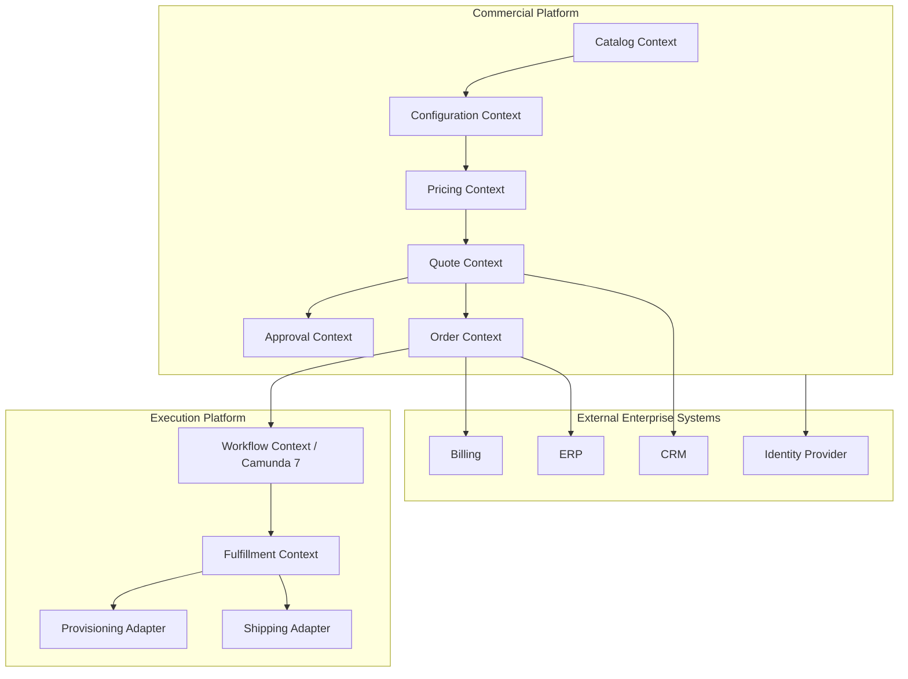
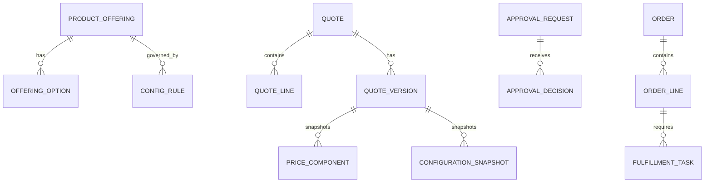
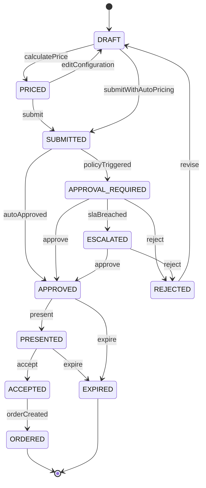
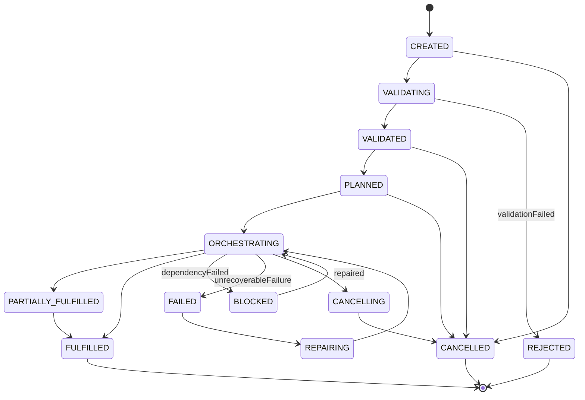
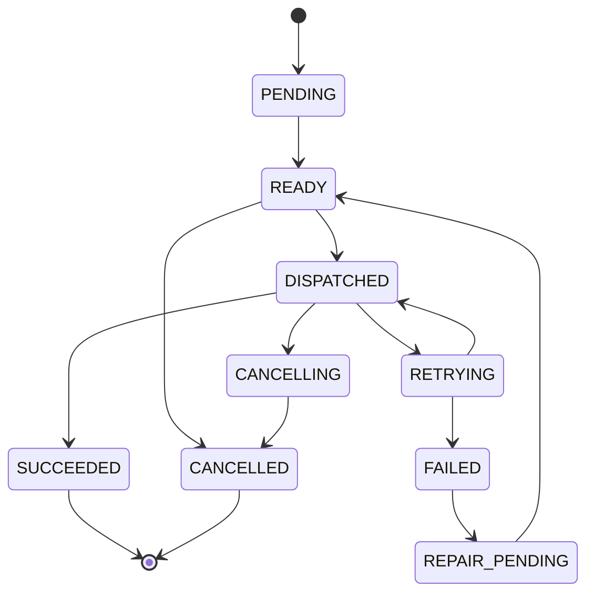

# Part 002 — CPQ/OMS Domain Model and Business Invariants

## 1. Tujuan Part Ini

Part ini membangun fondasi domain. Sebelum membuat OpenAPI, tabel PostgreSQL, mapper MyBatis, BPMN Camunda, Kafka topic, atau Redis cache, kita harus memastikan satu hal: **kita tahu apa yang sedang dimodelkan**.

CPQ/OMS adalah sistem yang mudah terlihat sederhana dari luar:

```text
configure product -> calculate price -> create quote -> approve -> create order -> fulfill
```

Namun di dalam enterprise platform, setiap kata di alur itu membawa konsekuensi:

- konfigurasi bisa invalid karena dependency antar option;
- harga bisa berubah karena waktu, channel, contract, customer segment, promotion, atau discount;
- quote bisa direvisi setelah approval dimulai;
- approval bisa valid hanya untuk versi quote tertentu;
- order harus tetap berjalan meskipun downstream system gagal;
- order line bisa berhasil sebagian;
- fulfillment bisa asynchronous dan long-running;
- audit harus menjelaskan siapa melakukan apa, kapan, dan berdasarkan data apa.

Part ini akan membahas:

1. vocabulary domain;
2. bounded context;
3. aggregate dan entity ownership;
4. lifecycle quote dan order;
5. snapshot vs reference;
6. business invariant;
7. failure mode domain;
8. keputusan modeling yang akan memengaruhi semua part berikutnya.

---

## 2. Mental Model Utama: Dari Possibility ke Commitment

CPQ/OMS adalah pipeline perubahan status komersial.

```mermaid id="part002-commitment-pipeline"
flowchart LR
    Possibility[Possibility: product can be sold]
    Configuration[Configuration: product can be assembled]
    Calculation[Calculation: price can be computed]
    Proposal[Proposal: quote can be presented]
    Approval[Approval: business accepts risk]
    Commitment[Commitment: customer accepts offer]
    Execution[Execution: order must be fulfilled]

    Possibility --> Configuration
    Configuration --> Calculation
    Calculation --> Proposal
    Proposal --> Approval
    Approval --> Commitment
    Commitment --> Execution
```



Setiap tahap mengubah derajat komitmen:

| Tahap | Makna | Boleh Berubah? | Perlu Audit? |
|---|---|---:|---:|
| Product availability | Barang/jasa mungkin dijual | Ya | Ya, untuk publish/unpublish |
| Configuration | Kombinasi option valid | Ya | Untuk rule change |
| Price calculation | Harga terhitung | Ya | Ya, jika menjadi quote |
| Quote draft | Proposal belum final | Ya | Minimal history |
| Quote submitted | Proposal masuk approval/sales process | Terbatas | Ya |
| Quote approved | Risiko bisnis disetujui | Tidak untuk versi itu | Ya, kuat |
| Quote accepted | Customer menerima | Tidak | Ya, kuat |
| Order created | Eksekusi wajib dilakukan | Perubahan via controlled transition | Ya, sangat kuat |

Kesalahan desain paling umum adalah memperlakukan semua tahap sebagai data mutable biasa. Pada platform CPQ/OMS, sebagian data adalah draft, sebagian adalah fakta, sebagian adalah evidence.

---

## 3. Core Vocabulary

Kita mulai dari bahasa yang akan dipakai konsisten sepanjang seri.

| Term | Definisi | Catatan Modeling |
|---|---|---|
| Product | Entitas konseptual yang merepresentasikan barang/jasa. | Belum tentu bisa dijual langsung. |
| Product Offering | Bentuk komersial dari product yang bisa dijual pada channel/segment tertentu. | Biasanya punya lifecycle dan availability. |
| Option | Pilihan konfigurasi dalam offering. | Bisa required, optional, mutually exclusive. |
| Configuration | Hasil pemilihan option untuk offering tertentu. | Harus valid terhadap rule versi tertentu. |
| Price Book | Kumpulan aturan harga yang berlaku. | Bisa berdasarkan region, channel, contract, waktu. |
| Price Component | Bagian harga: recurring charge, one-time charge, discount, fee. | Harus explainable. |
| Quote | Proposal komersial kepada customer. | Mengandung snapshot konfigurasi dan harga. |
| Quote Line | Item dalam quote. | Bisa bundle, child line, add-on, discount line. |
| Approval Request | Permintaan persetujuan atas risiko/kebijakan tertentu. | Harus tied to quote version. |
| Approval Decision | Keputusan approve/reject/escalate/delegate. | Evidence penting. |
| Order | Instruksi eksekusi dari accepted quote. | Bukan quote mutable. |
| Order Line | Unit eksekusi order. | Punya lifecycle sendiri. |
| Fulfillment Task | Pekerjaan downstream untuk memenuhi order line. | Bisa retry, fail, compensate. |
| Commercial Snapshot | Salinan data komersial pada saat komitmen. | Melindungi order dari perubahan masa depan. |
| Domain Event | Fakta yang sudah terjadi dalam domain. | Harus immutable dan versioned. |

---

## 4. Bounded Context Detail

Bounded context bukan sekadar service. Ia adalah batas bahasa, ownership, dan invariant.



### 4.1 Catalog Context

Catalog menjawab:

- offering apa yang tersedia;
- siapa yang boleh membeli;
- kapan offering aktif;
- version mana yang dipakai;
- dependency antar product offering;
- product mana yang deprecated tapi masih valid untuk existing quote/order.

Invariant contoh:

- offering tidak boleh dijual jika status bukan `PUBLISHED`;
- offering tidak boleh dipakai untuk quote baru jika melewati `sellEndDate`;
- published catalog version immutable;
- unpublished draft catalog tidak boleh terlihat di sales channel production.

### 4.2 Configuration Context

Configuration menjawab:

- option apa yang wajib;
- option apa yang tidak boleh digabung;
- option apa yang bergantung pada option lain;
- apakah konfigurasi valid untuk catalog version tertentu;
- bagaimana menjelaskan error konfigurasi ke user.

Invariant contoh:

- configuration harus mengacu pada exact catalog version;
- required option harus terisi sebelum quote submit;
- mutually exclusive options tidak boleh aktif bersamaan;
- configuration result harus explainable, bukan hanya `valid=false`.

### 4.3 Pricing Context

Pricing menjawab:

- harga dasar;
- discount;
- charge recurring/one-time;
- proration;
- campaign;
- contract price;
- margin/risk signal;
- price explanation.

Invariant contoh:

- monetary amount tidak boleh memakai floating point;
- total quote harus sama dengan agregasi line price component;
- discount manual harus memiliki reason;
- price snapshot pada submitted quote tidak boleh berubah diam-diam.

### 4.4 Quote Context

Quote menjawab:

- siapa customer-nya;
- apa item yang ditawarkan;
- berapa harga final;
- status proposal;
- kapan valid;
- versi berapa yang disetujui;
- apakah sudah diterima customer.

Invariant contoh:

- quote accepted harus berasal dari quote approved atau policy yang tidak butuh approval;
- quote tidak boleh accepted jika expired;
- quote revision harus menaikkan version;
- approval untuk quote version lama tidak berlaku untuk version baru.

### 4.5 Approval Context

Approval menjawab:

- kebijakan apa yang terpicu;
- siapa approver yang valid;
- apa SLA-nya;
- apa alasan approve/reject;
- apakah approval harus escalate;
- apakah approval masih valid.

Invariant contoh:

- approval decision harus tied to immutable quote version;
- approver tidak boleh approve request yang ia tidak berwenang setujui;
- rejection harus memiliki reason code;
- override harus tercatat sebagai privileged action.

### 4.6 Order Context

Order menjawab:

- accepted quote mana yang menjadi sumber;
- line item apa yang harus dieksekusi;
- state eksekusi apa saat ini;
- apa yang berhasil, gagal, atau menunggu;
- apa yang boleh dibatalkan;
- apa yang perlu direpair.

Invariant contoh:

- satu accepted quote tidak boleh menghasilkan dua active order;
- order harus menyimpan commercial snapshot;
- fulfilled order line tidak boleh diubah sembarangan;
- order terminal tidak boleh kembali ke active state kecuali melalui explicit amendment/reopen process.

### 4.7 Workflow Context

Workflow context menghubungkan Order Context ke Camunda 7.

Ia menjawab:

- process definition apa yang dipakai;
- process instance mana yang terkait order;
- task mana yang sedang berjalan;
- incident apa yang terjadi;
- retry apa yang masih tersedia.

Invariant contoh:

- workflow process instance harus mengacu pada order id;
- process variable tidak boleh menjadi source of truth utama untuk order state;
- service task harus idempotent;
- incident harus bisa dipetakan ke order atau fulfillment task.

---

## 5. Aggregate Design

Dalam DDD, aggregate adalah consistency boundary. Dalam microservices, aggregate juga sering menjadi unit optimistic locking dan event emission.

Baseline aggregate:



### 5.1 ProductOffering Aggregate

Root: `ProductOffering`

Children:

- offering attributes;
- option definitions;
- lifecycle state;
- availability rules;
- publication metadata.

Key rule: published version immutable.

### 5.2 Configuration Aggregate

Ada dua pilihan modeling:

1. configuration sebagai aggregate sendiri;
2. configuration sebagai value object/snapshot di quote line.

Untuk platform ini, kita gunakan hybrid:

- configuration rules dimiliki `configuration-service`;
- hasil konfigurasi pada quote line disimpan sebagai `ConfigurationSnapshot`.

Alasannya: quote harus tetap valid secara historis walaupun rule berubah.

### 5.3 Pricing Aggregate

Pricing calculation sering tidak cocok menjadi aggregate permanen untuk semua request, karena banyak kalkulasi bersifat transient. Namun saat harga masuk quote, hasilnya harus disnapshot.

Kita akan membedakan:

- `PriceCalculation` sebagai transient result;
- `PriceSnapshot` sebagai value object dalam quote version;
- `PriceComponent` sebagai breakdown auditable.

### 5.4 Quote Aggregate

Root: `Quote`

Children:

- quote version;
- quote line;
- configuration snapshot;
- price snapshot;
- status history;
- customer snapshot;
- approval linkage.

Key rule: state transition quote dikontrol oleh root.

### 5.5 ApprovalRequest Aggregate

Root: `ApprovalRequest`

Children:

- policy trigger;
- approval step;
- decision;
- escalation;
- delegation.

Key rule: approval request mengacu pada `quoteId + quoteVersion`.

### 5.6 Order Aggregate

Root: `Order`

Children:

- order line;
- commercial snapshot;
- order state history;
- fulfillment plan linkage;
- workflow linkage.

Key rule: order dibuat idempotently dari accepted quote.

### 5.7 FulfillmentTask Aggregate

Root: `FulfillmentTask`

Children:

- target system;
- request payload snapshot;
- attempt history;
- response history;
- retry state.

Key rule: external side effect harus idempotent atau dibungkus dengan idempotency key.

---

## 6. Quote Lifecycle Detail

Quote adalah proposal komersial. Ia tidak sama dengan cart. Cart bisa transient. Quote membawa evidence.



### 6.1 Quote State Semantics

| State | Meaning | Editable? | Important Invariant |
|---|---|---:|---|
| `DRAFT` | Quote sedang dibentuk | Yes | Tidak boleh dikirim ke customer sebagai final. |
| `PRICED` | Harga sudah dihitung | Yes, but invalidates price | Price result harus punya calculation timestamp/version. |
| `SUBMITTED` | Quote diajukan | No direct commercial edit | Submit membuat quote version immutable. |
| `APPROVAL_REQUIRED` | Butuh approval | No | Approval tied to submitted version. |
| `ESCALATED` | SLA atau policy escalation | No | Escalation reason wajib. |
| `APPROVED` | Disetujui | No commercial edit | Approval evidence harus tersedia. |
| `PRESENTED` | Diberikan ke customer | No | Validity period aktif. |
| `ACCEPTED` | Customer menerima | No | Order creation boleh dimulai. |
| `ORDERED` | Order dibuat | No | Quote tidak boleh menghasilkan active order kedua. |
| `EXPIRED` | Tidak berlaku | No | Tidak boleh accepted. |
| `REJECTED` | Ditolak | No, kecuali revise | Revisi membuat version baru. |

### 6.2 Quote Versioning

Quote harus punya version.

Contoh:

```text
Quote Q-1001
  version 1: draft -> submitted -> rejected
  version 2: revised -> submitted -> approved -> accepted -> ordered
```

Approval version 1 tidak boleh dipakai untuk version 2.

Rule:

```text
ApprovalDecision.quoteId == Quote.id
ApprovalDecision.quoteVersion == Quote.currentSubmittedVersion
```

Jika quote berubah, approval lama menjadi historical evidence, bukan authorization untuk accept.

---

## 7. Order Lifecycle Detail

Order adalah eksekusi. Order harus lebih konservatif daripada quote.



### 7.1 Order State Semantics

| State | Meaning | Important Invariant |
|---|---|---|
| `CREATED` | Order shell dibuat dari accepted quote | Harus idempotent per quote. |
| `VALIDATING` | Pre-fulfillment validation | Tidak boleh fulfill sebelum valid. |
| `VALIDATED` | Siap direncanakan | Semua required line valid. |
| `PLANNED` | Fulfillment plan dibuat | Dependency antar line diketahui. |
| `ORCHESTRATING` | Workflow berjalan | Camunda process instance harus ada. |
| `PARTIALLY_FULFILLED` | Sebagian line berhasil | Line-level state menjadi sumber detail. |
| `BLOCKED` | Menunggu repair/dependency | Reason wajib. |
| `FAILED` | Tidak bisa lanjut otomatis | Manual action diperlukan. |
| `REPAIRING` | Sedang diperbaiki | Semua repair harus auditable. |
| `FULFILLED` | Semua required line selesai | Terminal. |
| `CANCELLING` | Pembatalan sedang diproses | Compensation mungkin berjalan. |
| `CANCELLED` | Dibatalkan | Terminal. |
| `REJECTED` | Tidak valid untuk dieksekusi | Terminal. |

### 7.2 Order Line State

Order-level state tidak cukup. Order line harus punya state sendiri.



Order bisa `PARTIALLY_FULFILLED` ketika sebagian line `SUCCEEDED` dan sebagian masih `PENDING`, `RETRYING`, atau `FAILED`.

---

## 8. Snapshot vs Reference

Ini salah satu konsep terpenting.

### 8.1 Reference

Reference menyimpan ID ke data lain.

Contoh:

```json
{
  "productOfferingId": "po_mobile_plan_100gb"
}
```

Reference cocok jika data boleh berubah dan kita ingin nilai terbaru.

### 8.2 Snapshot

Snapshot menyimpan salinan data pada waktu tertentu.

Contoh:

```json
{
  "productOfferingId": "po_mobile_plan_100gb",
  "productOfferingVersion": 12,
  "name": "Mobile Plan 100GB",
  "billingFrequency": "MONTHLY",
  "baseRecurringPrice": {
    "amount": "49.99",
    "currency": "USD"
  }
}
```

Snapshot cocok jika data harus menjadi evidence.

### 8.3 Rule Umum

| Data | Reference | Snapshot | Alasan |
|---|---:|---:|---|
| Customer ID | Yes | Yes for key attributes | Customer tetap direferensikan, tetapi quote/order butuh historical info. |
| Product offering | Yes | Yes at submit/accept | Catalog bisa berubah. |
| Configuration | No for final | Yes | Konfigurasi final harus auditable. |
| Price | No for final | Yes | Harga quote/order tidak boleh berubah diam-diam. |
| Approval | Reference + evidence | Yes for decision facts | Approval harus defensible. |
| Fulfillment result | Reference to task | Yes for response summary | Audit dan recovery. |

Rule praktis:

> Semakin dekat data ke customer commitment atau external side effect, semakin besar kebutuhan snapshot.

---

## 9. Business Invariants

Invariant adalah aturan yang harus selalu benar. Jika invariant dilanggar, sistem bisa menghasilkan data yang tidak dapat dipercaya.

Kita kelompokkan invariant berdasarkan domain.

### 9.1 Universal Invariants

1. Setiap aggregate punya stable ID.
2. Setiap aggregate punya version untuk optimistic locking.
3. Setiap state transition penting tercatat di history.
4. Setiap command mutating punya actor dan correlation ID.
5. Setiap external side effect punya idempotency key atau deduplication strategy.
6. Setiap event domain merepresentasikan fakta setelah commit.
7. Setiap tenant-scoped data membawa tenant ID.
8. Tidak ada monetary calculation memakai binary floating point.
9. Terminal state tidak boleh berubah tanpa explicit reversal process.
10. Manual repair tidak boleh menghapus evidence.

### 9.2 Catalog Invariants

1. Published catalog version immutable.
2. Offering draft tidak boleh dipakai quote production.
3. Offering deprecated boleh tetap muncul untuk historical quote/order.
4. Offering unpublished tidak boleh masuk quote baru.
5. Option code harus unik dalam offering version.
6. Compatibility rule harus versioned.
7. Catalog publish harus atomic per version.

### 9.3 Configuration Invariants

1. Configuration mengacu pada offering version tertentu.
2. Required option harus terisi sebelum quote submit.
3. Mutually exclusive option tidak boleh aktif bersamaan.
4. Dependent option tidak boleh aktif jika parent condition tidak terpenuhi.
5. Configuration validation harus menghasilkan error explainable.
6. Submitted quote menyimpan configuration snapshot.

### 9.4 Pricing Invariants

1. Price calculation harus punya input hash atau equivalent trace.
2. Price component total harus sama dengan line total.
3. Quote total harus sama dengan agregasi line total.
4. Discount manual harus punya actor dan reason.
5. Discount di atas threshold harus memicu approval.
6. Currency mismatch tidak boleh digabung tanpa explicit conversion policy.
7. Rounding policy harus eksplisit.
8. Submitted quote menyimpan price snapshot.

### 9.5 Quote Invariants

1. Quote harus punya customer.
2. Quote draft boleh berubah; submitted version immutable.
3. Quote submit membutuhkan valid configuration dan valid price.
4. Quote approval tied to quote version.
5. Quote accepted harus approved atau auto-approved sesuai policy.
6. Quote expired tidak boleh accepted.
7. Quote accepted tidak boleh direvisi langsung.
8. Satu quote accepted hanya boleh menghasilkan satu active order.
9. Quote status transition harus valid.
10. Quote history tidak boleh dihapus.

### 9.6 Approval Invariants

1. Approval request mengacu pada quote version immutable.
2. Approver harus authorized pada saat decision dibuat.
3. Approval decision harus punya timestamp.
4. Rejection harus punya reason.
5. Delegation harus tercatat.
6. Escalation harus punya trigger reason.
7. Approval expired tidak boleh dipakai untuk accept quote.

### 9.7 Order Invariants

1. Order harus berasal dari accepted quote atau explicit manual order process.
2. Order harus menyimpan quote snapshot.
3. Order line harus mengacu pada order.
4. Order state harus hasil dari valid transition.
5. Fulfilled line tidak boleh diubah tanpa compensation/amendment.
6. Cancelled order tidak boleh fulfill.
7. Order terminal tidak boleh re-enter active state tanpa process baru.
8. Order creation dari quote harus idempotent.
9. Order state summary harus konsisten dengan line states.

### 9.8 Workflow Invariants

1. Camunda process instance harus linked ke order ID.
2. Process variable bukan source of truth final untuk order state.
3. Service task handler harus idempotent.
4. Retry exhaustion harus menghasilkan incident yang bisa dipetakan ke domain.
5. BPMN deployment version harus bisa ditelusuri dari order/workflow record.
6. Manual task completion harus punya actor.

### 9.9 Event Invariants

1. Event ID unik.
2. Event type versioned.
3. Event publish setelah state commit.
4. Consumer harus idempotent.
5. Event payload tidak boleh bergantung pada private database schema.
6. Replay tidak boleh menghasilkan duplicate business effect.
7. Event harus memiliki aggregate ID dan occurredAt.
8. Event harus punya correlation ID/causation ID untuk traceability.

---

## 10. State Transition Guard

State transition harus dimodelkan sebagai rule, bukan if scattered di resource class.

Contoh pseudo-model:

```java
public enum QuoteStatus {
    DRAFT,
    PRICED,
    SUBMITTED,
    APPROVAL_REQUIRED,
    ESCALATED,
    APPROVED,
    REJECTED,
    PRESENTED,
    ACCEPTED,
    ORDERED,
    EXPIRED
}
```

Transition guard konseptual:

```java
public final class QuoteStateMachine {
    private static final Map<QuoteStatus, Set<QuoteStatus>> ALLOWED = Map.of(
        QuoteStatus.DRAFT, Set.of(QuoteStatus.PRICED, QuoteStatus.SUBMITTED),
        QuoteStatus.PRICED, Set.of(QuoteStatus.DRAFT, QuoteStatus.SUBMITTED),
        QuoteStatus.SUBMITTED, Set.of(QuoteStatus.APPROVAL_REQUIRED, QuoteStatus.APPROVED),
        QuoteStatus.APPROVAL_REQUIRED, Set.of(QuoteStatus.APPROVED, QuoteStatus.REJECTED, QuoteStatus.ESCALATED),
        QuoteStatus.ESCALATED, Set.of(QuoteStatus.APPROVED, QuoteStatus.REJECTED),
        QuoteStatus.REJECTED, Set.of(QuoteStatus.DRAFT),
        QuoteStatus.APPROVED, Set.of(QuoteStatus.PRESENTED, QuoteStatus.EXPIRED),
        QuoteStatus.PRESENTED, Set.of(QuoteStatus.ACCEPTED, QuoteStatus.EXPIRED),
        QuoteStatus.ACCEPTED, Set.of(QuoteStatus.ORDERED)
    );

    public void assertCanMove(QuoteStatus from, QuoteStatus to) {
        if (!ALLOWED.getOrDefault(from, Set.of()).contains(to)) {
            throw new InvalidStateTransitionException(from, to);
        }
    }
}
```

Ini belum final implementation. Nanti kita akan memasukkan reason, actor, command type, policy, dan invariant check.

---

## 11. Domain Events Awal

Kita akan mulai dengan event taxonomy berikut.

### Catalog Events

- `ProductOfferingPublished`
- `ProductOfferingDeprecated`
- `CatalogVersionActivated`

### Configuration Events

- `ConfigurationValidated`
- `ConfigurationRulePublished`

### Pricing Events

- `PriceCalculated`
- `PriceBookPublished`
- `ManualDiscountApplied`

### Quote Events

- `QuoteCreated`
- `QuotePriced`
- `QuoteSubmitted`
- `QuoteApprovalRequired`
- `QuoteApproved`
- `QuoteRejected`
- `QuotePresented`
- `QuoteAccepted`
- `QuoteExpired`
- `QuoteOrdered`

### Approval Events

- `ApprovalRequested`
- `ApprovalEscalated`
- `ApprovalDecisionRecorded`
- `ApprovalExpired`

### Order Events

- `OrderCreated`
- `OrderValidated`
- `OrderPlanned`
- `OrderOrchestrationStarted`
- `OrderLineDispatched`
- `OrderLineFulfilled`
- `OrderLineFailed`
- `OrderPartiallyFulfilled`
- `OrderFulfilled`
- `OrderBlocked`
- `OrderCancelled`

Event naming rule:

> Gunakan past tense untuk fakta domain. Jangan gunakan event untuk menyamarkan command.

Buruk:

```text
ApproveQuoteRequestedEvent
DoFulfillmentEvent
OrderServiceCallEvent
```

Lebih baik:

```text
ApprovalRequested
QuoteApproved
FulfillmentTaskDispatched
FulfillmentTaskSucceeded
```

---

## 12. Domain Failure Scenarios

### 12.1 Stale Catalog Saat Quote Submit

Scenario:

1. User membuat draft quote memakai offering version 10.
2. Catalog publish version 11.
3. User submit draft lama.

Pilihan desain:

- reject submit dan minta recalculation;
- allow jika version 10 masih within grace period;
- auto-migrate configuration ke version 11;
- allow hanya untuk customer tertentu.

Rule baseline seri ini:

```text
Quote submit memakai offering version yang ada di draft.
Jika offering version masih sellable dan belum retired, submit boleh.
Jika sudah retired, submit ditolak dengan reason jelas.
```

### 12.2 Price Drift Setelah Approval

Scenario:

1. Quote version 3 disetujui.
2. Price book berubah.
3. Customer accept quote version 3.

Rule baseline:

```text
Accepted quote memakai approved price snapshot.
Price book baru tidak mengubah quote yang sudah approved dalam validity period.
```

### 12.3 Quote Revisi Saat Approval Berjalan

Scenario:

1. Quote version 2 masuk approval.
2. Sales mengubah discount.
3. Approver approve request lama.

Rule baseline:

```text
Revisi membuat version baru.
Approval request lama tidak berlaku untuk version baru.
Approval lama ditandai superseded.
```

### 12.4 Duplicate Quote Acceptance

Scenario:

1. Customer click accept dua kali.
2. Dua request masuk bersamaan.

Rule baseline:

```text
Accept quote harus idempotent.
Jika quote sudah ACCEPTED, response boleh mengembalikan accepted state yang sama.
Order creation tetap hanya satu.
```

### 12.5 Duplicate Order Creation Event

Scenario:

1. `QuoteAccepted` dipublish.
2. Order-service consume event.
3. Consumer crash sebelum commit offset.
4. Event dikonsumsi ulang.

Rule baseline:

```text
Order-service memiliki unique constraint pada sourceQuoteId.
Consumer inbox mencatat processed event ID.
Command create order idempotent.
```

### 12.6 Fulfillment Partial Failure

Scenario:

1. Order memiliki 5 lines.
2. 3 berhasil.
3. 2 gagal karena downstream timeout.

Rule baseline:

```text
Order state menjadi PARTIALLY_FULFILLED atau BLOCKED tergantung criticality.
Line yang berhasil tidak diulang tanpa idempotency key.
Line yang gagal masuk retry/repair flow.
```

---

## 13. Database Implication dari Domain Model

Walaupun kita belum mendesain schema penuh, beberapa konsekuensi sudah jelas.

### 13.1 Optimistic Locking

Aggregate mutable seperti quote dan order butuh version.

```sql
version integer not null
```

Update harus conditional:

```sql
update quotes
set status = ?, version = version + 1
where id = ? and version = ?;
```

Jika affected row = 0, berarti concurrent modification atau stale command.

### 13.2 Unique Constraint untuk Idempotency

Order dari quote:

```sql
unique(source_quote_id)
```

Outbox event:

```sql
unique(event_id)
```

Inbox consumer:

```sql
unique(consumer_name, event_id)
```

### 13.3 History Tables

State history bukan optional.

```text
quote_status_history
order_status_history
approval_decision_history
fulfillment_attempt_history
```

History memungkinkan audit dan incident debugging.

### 13.4 Snapshot Columns

Snapshot bisa disimpan sebagai relational tables atau JSONB. Pilihan bergantung pada query need.

Rule awal:

- data yang sering difilter/report: relational column/table;
- data evidence yang jarang diquery detail: JSONB snapshot boleh;
- monetary totals tetap column eksplisit;
- ID dan version snapshot tetap column eksplisit.

---

## 14. API Implication dari Domain Model

Domain model akan membentuk API.

Contoh command endpoint:

```http
POST /quotes/{quoteId}/submit
POST /quotes/{quoteId}/revise
POST /quotes/{quoteId}/present
POST /quotes/{quoteId}/accept
POST /orders/{orderId}/cancel
POST /orders/{orderId}/repair-actions
```

Kenapa bukan hanya:

```http
PATCH /quotes/{quoteId}
```

Karena state transition penting perlu command semantics. `submit`, `accept`, dan `cancel` bukan sekadar update field. Mereka memicu invariant check, event, audit, dan mungkin workflow.

---

## 15. Camunda Implication dari Domain Model

Camunda 7 akan dipakai untuk proses long-running, terutama order orchestration.

Tetapi domain model memberi batas:

- Camunda tidak memutuskan apakah order valid;
- Camunda tidak menjadi source of truth order state;
- Camunda task harus memanggil domain service atau application service;
- process instance ID disimpan sebagai linkage;
- incident harus dipetakan ke fulfillment task/order line;
- retry policy harus sesuai failure type.

Contoh mapping:

| Domain Event | Workflow Action |
|---|---|
| `OrderCreated` | Start process instance |
| `OrderValidated` | Continue fulfillment planning |
| `FulfillmentTaskFailed` | Retry, compensate, or create incident |
| `OrderCancelled` | Trigger cancellation process |
| `RepairActionSubmitted` | Resume blocked workflow |

---

## 16. Kafka Implication dari Domain Model

Kafka topic tidak boleh dibuat hanya berdasarkan service tanpa event taxonomy.

Baseline topic design awal:

```text
cpq.catalog.events.v1
cpq.quote.events.v1
cpq.approval.events.v1
oms.order.events.v1
oms.fulfillment.events.v1
```

Partition key baseline:

| Event | Key |
|---|---|
| Quote events | `quoteId` |
| Approval events | `quoteId` atau `approvalRequestId`, tergantung ordering need |
| Order events | `orderId` |
| Fulfillment task events | `orderId` jika perlu order-level ordering |

Rule:

> Pilih key berdasarkan ordering invariant, bukan distribusi random semata.

---

## 17. Redis Implication dari Domain Model

Redis akan dipakai untuk hal yang aman jika hilang.

Aman:

- idempotency request cache dengan TTL;
- rate limit counter;
- short-lived catalog cache;
- pricing input hash cache;
- distributed lock ringan untuk mengurangi duplicate work, selama DB tetap menjaga invariant;
- session-like workflow hints yang bisa dibangun ulang.

Tidak aman sebagai satu-satunya source:

- quote status;
- order status;
- approval decision;
- fulfillment result;
- audit trail;
- monetary snapshot.

Rule:

```text
Jika Redis flush menyebabkan data bisnis hilang atau salah, berarti desainnya salah.
```

---

## 18. Modeling Anti-Patterns

### 18.1 Quote sebagai Cart

Cart bisa dibuang. Quote adalah proposal bisnis. Jika quote diperlakukan seperti cart, audit dan approval akan lemah.

### 18.2 Order sebagai Copy Dangkal dari Quote

Order memang berasal dari quote, tetapi order punya lifecycle eksekusi. Jangan hanya copy quote table lalu tambah status.

### 18.3 Approval sebagai Boolean

`approved=true` tidak cukup. Kita butuh siapa, kapan, policy apa, reason apa, version apa, dan apakah decision masih valid.

### 18.4 Price sebagai Total Saja

Total tanpa breakdown tidak explainable. Enterprise pricing membutuhkan price component dan reason.

### 18.5 State sebagai String Bebas

Status harus punya transition rule. Kalau tidak, data akan berisi kombinasi mustahil.

### 18.6 Event `Updated`

`QuoteUpdated` terlalu kabur. Consumer tidak tahu apakah price berubah, status berubah, atau metadata berubah.

---

## 19. Minimal Domain Model untuk Implementasi Awal

Agar build-from-scratch tetap manageable, MVP domain kita:

### Catalog

```text
ProductOffering
OfferingOption
CatalogVersion
```

### Configuration

```text
ConfigurationRule
ConfigurationSnapshot
ValidationResult
```

### Pricing

```text
PriceBook
PriceComponent
PriceSnapshot
DiscountPolicy
```

### Quote

```text
Quote
QuoteVersion
QuoteLine
QuoteStatusHistory
```

### Approval

```text
ApprovalRequest
ApprovalStep
ApprovalDecision
```

### Order

```text
Order
OrderLine
OrderStatusHistory
FulfillmentPlan
```

### Workflow/Fulfillment

```text
WorkflowInstanceLink
FulfillmentTask
FulfillmentAttempt
```

---

## 20. Practical Modeling Exercise

Ambil scenario berikut:

```text
Customer A ingin membeli bundle internet + device.
Device memiliki pilihan warna dan storage.
Internet plan memiliki contract 24 bulan.
Sales memberi manual discount 18%.
Policy menyatakan discount > 15% butuh manager approval.
Quote disetujui, dikirim ke customer, lalu diterima.
Order dibuat.
Device shipping berhasil.
Internet activation gagal karena downstream provisioning timeout.
```

Jawab dengan model part ini:

1. Entity apa saja yang tercipta?
2. Snapshot apa saja yang wajib disimpan?
3. Event apa saja yang keluar?
4. State quote berubah dari apa ke apa?
5. State order berubah dari apa ke apa?
6. State order line device dan internet berbeda bagaimana?
7. Invariant apa yang mencegah approval discount 18% dipakai setelah quote direvisi ke discount 25%?
8. Data apa yang tidak boleh hanya ada di Redis?
9. Apa yang terjadi jika event `QuoteAccepted` dikonsumsi dua kali?
10. Apa yang perlu muncul di audit trail?

---

## 21. Checklist Part 002

Kamu siap lanjut ke Part 003 jika bisa menjelaskan:

- perbedaan product, offering, configuration, quote line, dan order line;
- mengapa quote version penting;
- mengapa approval harus tied to quote version;
- mengapa order butuh line-level state;
- kapan memakai snapshot dan kapan reference;
- invariant utama quote, approval, order, event, dan workflow;
- mengapa Camunda process variable bukan source of truth;
- mengapa Kafka event harus past tense dan versioned;
- mengapa Redis hanya runtime acceleration;
- bagaimana duplicate request dan duplicate event dicegah secara domain.

---

## 22. Sources

- OpenAPI Specification: https://swagger.io/specification/
- Jakarta RESTful Web Services: https://jakarta.ee/specifications/restful-ws/
- Eclipse Jersey: https://jersey.github.io/
- PostgreSQL Current Documentation: https://www.postgresql.org/docs/current/index.html
- MyBatis Introduction: https://mybatis.org/mybatis-3/
- Camunda 7 Enterprise EOL Extension: https://camunda.com/blog/2025/02/camunda-7-enterprise-end-of-life-extension/
- Apache Kafka Documentation and Releases: https://kafka.apache.org/community/downloads/
- Redis Documentation: https://redis.io/docs/latest/

---

## 23. Next Part

Part 003 akan membahas **Requirements to Executable Platform Blueprint**: bagaimana mengubah requirement CPQ/OMS menjadi bounded context, OpenAPI surface, schema contract, database module, BPMN process, event stream, dan operational SLO yang bisa dieksekusi oleh tim engineering.
