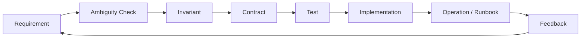
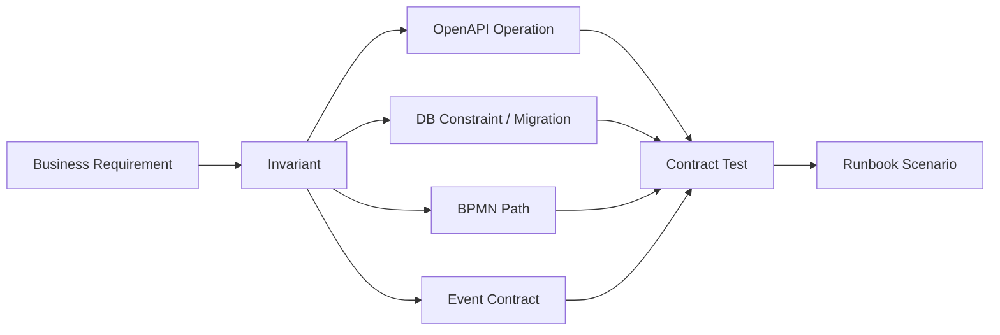
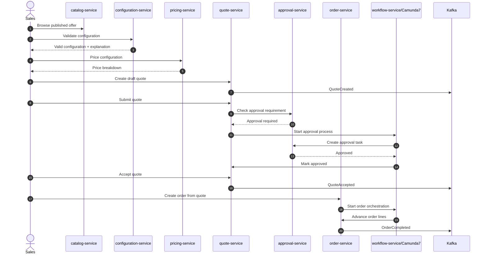
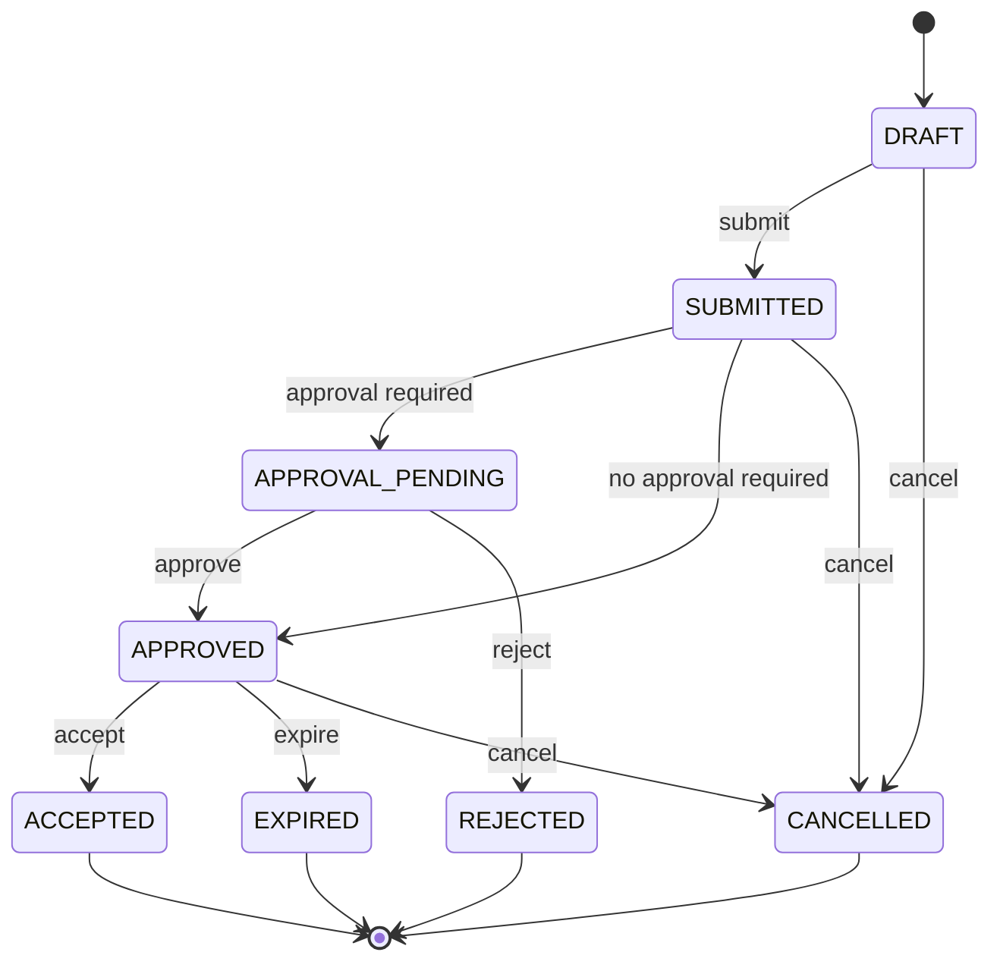
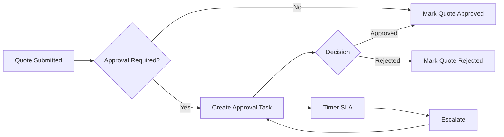
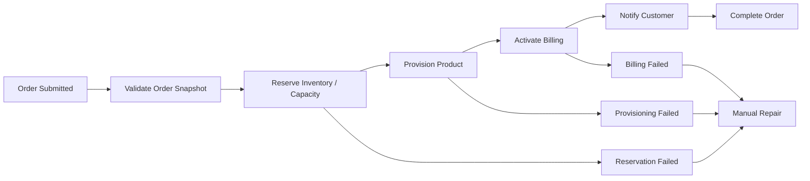

------
title: Learn Java Microservices CPQ OMS Platform - Part 003
description: Transform CPQ and order-management requirements into executable architecture artifacts: contracts, schemas, process models, migrations, event contracts, tests, and runbooks.
series: learn-java-microservices-cpq-oms-platform
seriesTitle: Learn Java Microservices CPQ OMS Platform
order: 3
partTitle: Requirements to Executable Platform Blueprint
tags:
- java
- microservices
- cpq
- oms
- openapi
- schema-first
- architecture
- kaufman
- series
date: 2026-07-02
---

# Part 003 — Requirements to Executable Platform Blueprint

> Target kemampuan: mampu mengubah requirement CPQ/OMS yang biasanya ambigu menjadi blueprint platform yang bisa dikodekan, dites, dioperasikan, diaudit, dan dipertahankan saat terjadi incident.

Di part sebelumnya kita membangun domain model dan invariant. Sekarang kita naik satu level: **bagaimana requirement berubah menjadi executable platform blueprint**.

Pada platform CPQ/OMS, requirement yang terlihat sederhana biasanya menyembunyikan konsekuensi besar:

- “Sales bisa memberi diskon” berarti ada pricing policy, approval threshold, audit evidence, quote recalculation, dan defensible override.
- “Order harus diproses otomatis” berarti ada orchestration, retries, idempotency, compensation, partial failure, dan manual repair.
- “Catalog bisa berubah” berarti ada versioning, published snapshot, quote immutability, backward compatibility, dan effective dating.
- “API harus aman” berarti ada tenant boundary, authorization model, PII handling, privileged action review, dan traceability.

Blueprint yang baik bukan dokumen arsitektur statis. Blueprint yang baik adalah kumpulan artefak yang memaksa sistem tetap benar.

---

## 1. Posisi Part Ini Dalam Skill Map Kaufman

Framework Kaufman mendorong kita untuk memecah skill kompleks menjadi sub-skill kecil yang bisa dilatih cepat. Untuk CPQ/OMS, sub-skill yang sedang kita latih adalah:

1. membaca requirement;
2. mengidentifikasi ambiguity;
3. mengubah requirement menjadi invariant;
4. mengubah invariant menjadi kontrak;
5. mengubah kontrak menjadi test;
6. mengubah test menjadi implementasi;
7. mengubah implementasi menjadi runbook operasi.

Dengan kata lain:



Part ini bukan tentang membuat diagram cantik. Part ini tentang memastikan setiap requirement penting punya **jejak eksekusi** sampai ke runtime.

---

## 2. Masalah Utama: Requirement Tidak Bisa Dieksekusi

Requirement bisnis biasanya datang dalam bentuk narasi:

> Sales dapat membuat quote dari product catalog, menghitung harga, meminta approval jika diskon tinggi, lalu mengubah quote menjadi order setelah customer menerima penawaran.

Kalimat ini belum cukup untuk engineer senior. Kita perlu memecahnya menjadi pertanyaan yang bisa diuji:

- Apa definisi “membuat quote”?
- Product catalog versi mana yang dipakai?
- Apakah harga berubah jika price book berubah setelah quote dibuat?
- Diskon tinggi dihitung per line, per quote, per customer segment, atau per contract?
- Approval diperlukan sebelum submit, sebelum accept, atau sebelum convert to order?
- Siapa yang boleh override?
- Apa yang terjadi jika approval workflow gagal?
- Apa yang terjadi jika order sudah dibuat tetapi fulfillment gagal?
- Apakah conversion quote-to-order boleh diulang?
- Apakah order boleh dibuat dua kali dari quote yang sama?

Requirement yang belum menjawab pertanyaan ini belum siap menjadi software.

---

## 3. Definisi “Executable Blueprint”

Dalam seri ini, **executable blueprint** berarti blueprint yang memiliki artefak konkret dan dapat diverifikasi.

| Blueprint Layer | Artefak | Dapat Diuji Dengan |
|---|---|---|
| Domain | aggregate, invariant, state machine | domain unit test, property-style test |
| API | OpenAPI spec, request/response schema, error model | API contract test, generated server/client validation |
| Data | PostgreSQL DDL, migration, constraints, indexes | migration test, integration test, query plan review |
| Process | BPMN, DMN/rule placeholder, process variables | Camunda process test, incident simulation |
| Event | event schema, topic map, producer/consumer contract | async contract test, replay test |
| Runtime | config, container, health check, readiness check | deployment smoke test |
| Operation | dashboard, alert, runbook, repair command | game day, failure drill |
| Compliance | audit log, decision record, evidence model | audit reconstruction test |

Semua layer ini harus saling terhubung. Jika tidak, tim akan punya banyak dokumen tetapi sistem tetap rapuh.

---

## 4. Requirement Taxonomy Untuk CPQ/OMS

Agar tidak tersesat, klasifikasikan requirement ke kategori berikut.

### 4.1 Commercial Requirement

Ini requirement yang memengaruhi revenue:

- product eligibility;
- bundle compatibility;
- base price;
- recurring charge;
- one-time charge;
- discount;
- tax boundary;
- quote validity;
- customer-specific contract;
- amendment dan renewal.

Pertanyaan utamanya:

> Apakah sistem bisa menjelaskan mengapa sebuah harga muncul dan siapa yang menyetujui perubahan komersialnya?

### 4.2 Lifecycle Requirement

Ini requirement yang mengatur state transition:

- quote draft;
- quote submitted;
- quote approved;
- quote accepted;
- quote expired;
- order submitted;
- order in progress;
- order partially fulfilled;
- order completed;
- order failed;
- order cancelled.

Pertanyaan utamanya:

> Transition mana yang legal, siapa yang boleh menjalankan, dan apa efek sampingnya?

### 4.3 Orchestration Requirement

Ini requirement yang melibatkan proses panjang:

- approval routing;
- provisioning;
- fulfillment;
- billing activation;
- notification;
- manual task;
- escalation timer;
- retry;
- compensation.

Pertanyaan utamanya:

> Apakah proses bisa berhenti, dilanjutkan, diperbaiki, dan dijelaskan tanpa kehilangan state?

### 4.4 Integration Requirement

Ini requirement yang menyentuh sistem luar:

- CRM;
- billing;
- tax engine;
- payment;
- inventory;
- provisioning;
- document generation;
- e-signature;
- notification provider.

Pertanyaan utamanya:

> Apakah integrasi dilindungi oleh anti-corruption layer dan idempotency?

### 4.5 Operational Requirement

Ini requirement yang baru terasa saat production:

- latency;
- throughput;
- availability;
- disaster recovery;
- deployment strategy;
- observability;
- incident handling;
- data repair;
- replay;
- reconciliation.

Pertanyaan utamanya:

> Saat sistem gagal, apakah operator tahu apa yang terjadi dan apa yang aman dilakukan?

### 4.6 Compliance Requirement

Ini requirement yang menentukan defensibility:

- audit trail;
- approval evidence;
- pricing explainability;
- PII minimization;
- retention;
- legal hold;
- separation of duties;
- manual override reason.

Pertanyaan utamanya:

> Apakah keputusan bisnis penting bisa direkonstruksi dari data yang tersimpan?

---

## 5. Requirement-to-Artifact Matrix

Gunakan matrix ini sebagai tool utama.

| Requirement | Invariant | API Contract | Data Contract | Process Contract | Event Contract | Test | Runbook |
|---|---|---|---|---|---|---|---|
| Sales creates quote | quote starts as Draft | `POST /quotes` | `quotes.status = DRAFT` | none | `QuoteCreated` | create quote test | duplicate request handling |
| Submit quote | only valid quote can be submitted | `POST /quotes/{id}/submit` | state transition row | optional approval trigger | `QuoteSubmitted` | invalid config rejected | stuck submitted quote |
| High discount needs approval | quote cannot be accepted before approval | `POST /quotes/{id}/approval-request` | approval request table | approval BPMN | `ApprovalRequested` | threshold test | approval stuck timer |
| Convert accepted quote to order | one accepted quote creates at most one order | `POST /orders/from-quote` | unique quote-order link | order orchestration start | `OrderSubmitted` | idempotent conversion | duplicate order repair |
| Fulfill order line | line state cannot skip required predecessor | internal command | order line state table | fulfillment BPMN | `OrderLineFulfilled` | state machine test | failed line retry |

Setiap requirement besar wajib memiliki baris seperti ini. Jika satu kolom kosong, itu bukan selalu salah, tetapi harus disengaja.

---

## 6. From Requirement to Invariant

Requirement naratif sering terlalu longgar. Invariant membuatnya tajam.

### 6.1 Contoh: Quote Validity

Requirement:

> Quote berlaku selama 30 hari.

Ini belum cukup.

Invariant yang lebih baik:

1. Quote memiliki `validUntil` yang dihitung saat quote submitted atau approved, bukan saat draft dibuat.
2. Quote yang sudah expired tidak bisa accepted.
3. Quote yang sudah accepted tidak otomatis menjadi invalid walaupun tanggal validUntil lewat setelah acceptance.
4. Perubahan validity policy tidak mengubah quote lama yang sudah dibuat.
5. Expiration harus bisa dijalankan oleh scheduled job atau lazy validation saat action dilakukan.

Kontrak turunannya:

```yaml
Quote:
  type: object
  required:
    - id
    - status
    - validUntil
    - version
  properties:
    id:
      type: string
      format: uuid
    status:
      type: string
      enum: [DRAFT, SUBMITTED, APPROVAL_PENDING, APPROVED, ACCEPTED, EXPIRED, CANCELLED]
    validUntil:
      type: string
      format: date-time
    version:
      type: integer
      format: int64
```

Test turunannya:

- accepting expired quote returns business error;
- accepted quote remains accepted after validity date;
- validity is snapshotted;
- recalculation does not silently extend validity.

### 6.2 Contoh: One Quote One Order

Requirement:

> Customer menerima quote dan sistem membuat order.

Invariant:

1. Hanya quote `ACCEPTED` yang bisa dikonversi ke order.
2. Satu quote accepted hanya boleh menghasilkan satu commercial order.
3. Repeated request dengan idempotency key yang sama mengembalikan order yang sama.
4. Repeated request dengan idempotency key berbeda tetap tidak boleh membuat order kedua dari quote yang sama.
5. Conversion harus menyimpan commercial snapshot dari quote, bukan mengambil harga terbaru.

Database constraint:

```sql
CREATE UNIQUE INDEX uq_orders_source_quote_id
ON orders(source_quote_id)
WHERE source_quote_id IS NOT NULL;
```

Ini contoh blueprint yang benar: requirement berubah menjadi invariant, lalu menjadi constraint yang bisa dipaksakan database.

---

## 7. Capability Map

Capability map membantu kita tidak langsung lompat ke microservice. Capability dulu, service kemudian.

```mermaid id="part003-capability-map"
flowchart TB
    CPQ[CPQ Platform]

    CPQ --> CAT[Catalog Management]
    CPQ --> CFG[Configuration]
    CPQ --> PRC[Pricing]
    CPQ --> QTE[Quote Management]
    CPQ --> APR[Approval]
    CPQ --> DOC[Document Generation]
    CPQ --> ORD[Order Management]
    CPQ --> ORC[Workflow Orchestration]
    CPQ --> INT[Integration]
    CPQ --> AUD[Audit & Compliance]
    CPQ --> OPS[Operations]

    CAT --> CAT1[Product Definition]
    CAT --> CAT2[Offer Publishing]
    CAT --> CAT3[Compatibility Rules]

    CFG --> CFG1[Configuration Session]
    CFG --> CFG2[Validation]
    CFG --> CFG3[Explanation]

    PRC --> PRC1[Price Book]
    PRC --> PRC2[Discounting]
    PRC --> PRC3[Price Snapshot]

    ORD --> ORD1[Order Capture]
    ORD --> ORD2[Order State Machine]
    ORD --> ORD3[Fulfillment Tracking]
```



Capability map ini nanti menjadi basis service decomposition.

---

## 8. Service Blueprint Awal

Untuk build-from-scratch, jangan membuat service terlalu banyak terlalu awal. Tetapi kita tetap perlu memisahkan ownership.

| Service | Primary Responsibility | Owns Data? | Publishes Events? | Notes |
|---|---:|---:|---:|---|
| `catalog-service` | product, offer, compatibility metadata | yes | yes | published catalog only; avoid direct mutable dependency by quote |
| `configuration-service` | validate product configuration | yes, for sessions/rules | yes | may consume catalog published view |
| `pricing-service` | deterministic pricing and discounts | yes | yes | must produce explainable price breakdown |
| `quote-service` | quote aggregate and lifecycle | yes | yes | commercial snapshot boundary |
| `approval-service` | approval request, decision, delegation | yes | yes | can be orchestrated by Camunda or own workflow facade |
| `order-service` | order aggregate, order lines, lifecycle | yes | yes | owns quote-to-order conversion invariant |
| `workflow-service` | Camunda 7 process deployment/runtime facade | yes, Camunda DB | yes | isolate Camunda 7 coupling |
| `integration-service` | external systems anti-corruption layer | yes, integration logs | yes | avoids leaking external models inward |
| `audit-service` | audit evidence and reconstruction | yes | usually consumes | append-only orientation |

Important: `workflow-service` should not become the domain brain. It coordinates process, but domain services remain source of truth for business invariants.

---

## 9. Ownership Rules

A mature platform has ownership rules that prevent accidental coupling.

### 9.1 Data Ownership

Rules:

1. A service owns its database schema.
2. Other services cannot read tables directly.
3. Cross-service reads use API or replicated read model.
4. Events carry facts, not commands disguised as facts.
5. Shared database is allowed only for local modular monolith stage, not as final microservice boundary.

Bad:

```text
quote-service reads catalog.product table directly
order-service updates quote.status directly
workflow-service updates order_lines table directly
```

Good:

```text
quote-service calls catalog-service or consumes CatalogPublished view
order-service calls quote-service to validate accepted quote snapshot
workflow-service sends command to order-service to advance order line
```

### 9.2 Process Ownership

Camunda process can coordinate, but cannot own domain truth.

| Concern | Owner |
|---|---|
| Whether quote can be accepted | quote-service |
| Whether approval is required | approval/policy component |
| Whether process waits for approval | workflow-service / BPMN |
| Whether order line can move to fulfilled | order-service |
| Whether retry is safe | command handler + idempotency design |

### 9.3 Contract Ownership

Each service owns:

- its OpenAPI file;
- its event schemas;
- its DB migrations;
- its domain tests;
- its operational dashboard assumptions;
- its runbook.

Platform team may own conventions, templates, and shared tooling, but not the meaning of each domain.

---

## 10. Traceability Model

Traceability bukan birokrasi. Untuk CPQ/OMS, traceability adalah survival mechanism.

Minimal traceability chain:



Contoh:

| Trace ID | Requirement | Invariant | Artifact |
|---|---|---|---|
| `REQ-QTE-001` | Create quote | quote starts as draft | `POST /quotes`, `quotes.status`, `QuoteCreated` |
| `REQ-QTE-009` | Accept quote | expired quote cannot be accepted | `POST /quotes/{id}/accept`, state transition test |
| `REQ-ORD-003` | Convert quote to order | one quote creates at most one order | unique index, idempotency test |
| `REQ-APR-002` | High discount approval | approval required before acceptance | BPMN approval path, approval decision table |

Setiap part implementasi nanti harus bisa menunjuk ke traceability ini.

---

## 11. Canonical End-to-End Journey

Kita akan memakai satu canonical journey untuk menjaga semua part tetap terhubung.



Journey ini akan digunakan sebagai capstone. Semua service, DB schema, event, BPMN, dan test harus mendukung journey ini.

---

## 12. Command, Event, and State Vocabulary

Sebelum coding, vocabulary harus jelas.

### 12.1 Commands

Command adalah request untuk melakukan aksi.

Examples:

- `CreateQuote`
- `AddQuoteLine`
- `RecalculateQuote`
- `SubmitQuote`
- `RequestApproval`
- `ApproveQuote`
- `AcceptQuote`
- `CreateOrderFromQuote`
- `StartOrderFulfillment`
- `MarkOrderLineFulfilled`
- `CancelOrder`

Command bisa gagal karena business rule.

### 12.2 Events

Event adalah fakta yang sudah terjadi.

Examples:

- `QuoteCreated`
- `QuoteSubmitted`
- `ApprovalRequested`
- `QuoteApproved`
- `QuoteAccepted`
- `OrderSubmitted`
- `OrderLineFulfillmentStarted`
- `OrderLineFulfilled`
- `OrderCompleted`
- `OrderFailed`

Event tidak boleh dinamai seperti perintah. Hindari `ProcessOrderEvent`. Itu ambiguous.

### 12.3 State

State adalah ringkasan posisi entity saat ini.

Example quote state:



State machine harus menjadi artifact yang diuji, bukan hanya diagram.

---

## 13. API Blueprint

OpenAPI-first berarti API contract ditulis sebelum implementation detail.

### 13.1 Minimal API Groups

```text
/catalog/offers
/catalog/products
/configurations
/prices
/quotes
/quotes/{quoteId}/lines
/quotes/{quoteId}/submit
/quotes/{quoteId}/accept
/approvals
/orders
/orders/from-quote
/orders/{orderId}/lines
/workflows/process-instances
/audit/records
```

### 13.2 Standard Request Concerns

Semua mutating API harus punya:

- `Idempotency-Key` untuk operation yang bisa diulang;
- `X-Correlation-Id` untuk tracing;
- authenticated principal;
- tenant context;
- validation error response;
- business error response;
- optimistic concurrency token jika mengubah aggregate yang sudah ada.

Example header contract:

```yaml
parameters:
  IdempotencyKey:
    name: Idempotency-Key
    in: header
    required: false
    schema:
      type: string
      maxLength: 128
  CorrelationId:
    name: X-Correlation-Id
    in: header
    required: false
    schema:
      type: string
      maxLength: 128
```

### 13.3 Standard Error Model

Jangan biarkan setiap service membuat error shape sendiri.

```yaml
ErrorResponse:
  type: object
  required:
    - code
    - message
    - correlationId
  properties:
    code:
      type: string
      example: QUOTE_EXPIRED
    message:
      type: string
    correlationId:
      type: string
    details:
      type: array
      items:
        $ref: '#/components/schemas/ErrorDetail'

ErrorDetail:
  type: object
  required:
    - field
    - reason
  properties:
    field:
      type: string
    reason:
      type: string
    rejectedValue:
      type: string
```

Mapping:

| Error Type | HTTP Status | Example Code |
|---|---:|---|
| malformed JSON | 400 | `BAD_REQUEST` |
| validation failure | 422 | `VALIDATION_FAILED` |
| auth missing | 401 | `UNAUTHENTICATED` |
| forbidden action | 403 | `FORBIDDEN` |
| aggregate not found | 404 | `QUOTE_NOT_FOUND` |
| version conflict | 409 | `VERSION_CONFLICT` |
| business state conflict | 409 | `ILLEGAL_STATE_TRANSITION` |
| dependency unavailable | 503 | `DEPENDENCY_UNAVAILABLE` |

---

## 14. Data Blueprint

Database blueprint tidak dimulai dari tabel. Mulai dari ownership dan invariant.

### 14.1 Data Categories

| Category | Example | Storage Behavior |
|---|---|---|
| Master/reference | product, offer, price book | versioned, published, controlled changes |
| Transactional | quote, order, approval request | strongly consistent within aggregate |
| Process state | Camunda runtime/history | controlled by engine, not manually mutated |
| Event/outbox | domain event | append-only until published/retained |
| Audit | decision record, manual override | append-only, high integrity |
| Cache | catalog read view, idempotency token | TTL or invalidation strategy |

### 14.2 Baseline Schema Ownership

```text
catalog_service:
  catalog.products
  catalog.offers
  catalog.offer_versions
  catalog.compatibility_rules

pricing_service:
  pricing.price_books
  pricing.price_book_versions
  pricing.price_rules

quote_service:
  quote.quotes
  quote.quote_lines
  quote.quote_price_snapshots
  quote.quote_state_transitions
  quote.outbox_events

order_service:
  orders.orders
  orders.order_lines
  orders.order_state_transitions
  orders.outbox_events

approval_service:
  approval.approval_requests
  approval.approval_decisions
  approval.delegations

workflow_service:
  camunda.ACT_*
```

The schema naming is illustrative. The important principle is ownership.

### 14.3 Constraint-first Thinking

If an invariant can be enforced by database constraint, prefer enforcing it there too.

Examples:

```sql
ALTER TABLE quote_lines
ADD CONSTRAINT ck_quote_line_quantity_positive
CHECK (quantity > 0);

CREATE UNIQUE INDEX uq_orders_source_quote_id
ON orders(source_quote_id)
WHERE source_quote_id IS NOT NULL;

ALTER TABLE quotes
ADD CONSTRAINT ck_quote_status
CHECK (status IN (
  'DRAFT',
  'SUBMITTED',
  'APPROVAL_PENDING',
  'APPROVED',
  'ACCEPTED',
  'EXPIRED',
  'CANCELLED',
  'REJECTED'
));
```

Application validation is not enough. Race conditions happen at the database boundary.

---

## 15. Process Blueprint

Camunda 7 enters where business process becomes long-running, asynchronous, or human-involved.

Use BPMN for:

- approval workflow;
- order orchestration;
- fulfillment tracking;
- timers and escalations;
- manual repair tasks;
- compensation paths.

Do not use BPMN for:

- simple CRUD;
- pure synchronous validation;
- pricing calculation;
- tight loops over large data;
- domain rule enforcement that belongs inside aggregate.

### 15.1 Approval Process Sketch



### 15.2 Order Orchestration Sketch



Blueprint rule:

> BPMN coordinates commands. Domain services decide whether commands are legal.

---

## 16. Event Blueprint

Kafka is the backbone for facts that other services may need.

### 16.1 Topic Naming

Use stable topic names by domain, not by implementation class.

```text
cpq.catalog.events.v1
cpq.pricing.events.v1
cpq.quote.events.v1
cpq.approval.events.v1
oms.order.events.v1
platform.audit.events.v1
```

### 16.2 Event Envelope

```json
{
  "eventId": "018f5a36-0ff2-7b42-a4c5-0ce6b4758f21",
  "eventType": "QuoteAccepted",
  "eventVersion": 1,
  "occurredAt": "2026-07-02T10:15:30Z",
  "producer": "quote-service",
  "tenantId": "tenant-001",
  "correlationId": "corr-123",
  "aggregateType": "Quote",
  "aggregateId": "quote-123",
  "aggregateVersion": 12,
  "payload": {
    "quoteId": "quote-123",
    "customerId": "customer-456",
    "acceptedAt": "2026-07-02T10:15:30Z"
  }
}
```

### 16.3 Event Rules

1. Event must represent something already committed.
2. Event must include enough identity for consumers to correlate.
3. Event payload should not expose internal table shape.
4. Event must be backward compatible within version line.
5. Event publishing must be tied to transaction through outbox.
6. Consumers must be idempotent.

---

## 17. Runtime Blueprint

Runtime blueprint menjawab: bagaimana service berjalan?

Minimum runtime contract per service:

```text
service:
  name: quote-service
  port: 8080
  health:
    liveness: /health/live
    readiness: /health/ready
  dependencies:
    postgres: required
    kafka: required for publishing
    redis: optional for idempotency/cache
    workflow-service: required for approval start
  config:
    databaseUrl
    kafkaBootstrapServers
    redisUrl
    tokenIssuer
  observability:
    structuredLogs: true
    metrics: true
    tracing: true
```

Readiness must check dependencies needed to serve traffic. Liveness should not fail because Kafka is briefly unavailable; otherwise orchestrator may restart healthy processes during transient dependency failures.

---

## 18. SLO and NFR Blueprint

Top-tier engineering treats non-functional requirements as first-class.

### 18.1 Example Latency Budget

These numbers are illustrative starting targets. Real values must come from business needs and load tests.

| Operation | Suggested Initial Target | Notes |
|---|---:|---|
| browse catalog offer | p95 < 200 ms | cache/read model candidate |
| validate configuration | p95 < 500 ms | rule complexity dependent |
| price quote | p95 < 700 ms | must remain deterministic |
| create quote | p95 < 300 ms | transactional write |
| submit quote | p95 < 500 ms | may trigger async approval |
| convert quote to order | p95 < 700 ms | must be idempotent |
| order fulfillment | async | measured as lifecycle duration |

Do not optimize blindly. Use these budgets to force architecture discussion.

### 18.2 Correctness SLO

For CPQ/OMS, correctness often matters more than raw latency.

Examples:

- zero duplicate commercial orders from same quote;
- zero accepted quote without valid approval when approval is required;
- zero fulfilled order line without valid order state predecessor;
- all manual overrides require actor, reason, timestamp, and previous value;
- all externally visible commercial decisions are reconstructable.

### 18.3 Operability SLO

Examples:

- stuck workflow detected within N minutes;
- outbox lag visible;
- Kafka consumer lag visible;
- failed integration call visible by dependency and error class;
- manual repair path documented for each non-terminal failure state.

---

## 19. Security Blueprint

Security must be embedded in the platform contract.

| Concern | Blueprint Decision |
|---|---|
| Authentication | central identity provider; services validate token or gateway verifies and forwards trusted claims |
| Authorization | domain-level checks inside service; gateway-only auth is insufficient |
| Tenant isolation | tenant ID required in aggregate and query boundary |
| PII | avoid leaking PII into Kafka events and logs |
| Privileged action | separate permission and audit reason |
| Service-to-service | mTLS or trusted network + signed token, depending environment maturity |
| Secrets | never in repo; injected by runtime secret manager |

Security invariant examples:

- A user cannot approve their own quote if separation-of-duties is required.
- A user cannot access quote from another tenant.
- A system integration cannot mutate quote price without a traceable command.
- A manual override must include actor and reason.

---

## 20. Audit Blueprint

Audit model harus bisa menjawab:

1. who did it;
2. what changed;
3. when it happened;
4. from where;
5. under which approval/policy;
6. what previous state was;
7. why it was allowed.

Audit record sketch:

```json
{
  "auditId": "audit-001",
  "tenantId": "tenant-001",
  "actorType": "USER",
  "actorId": "user-123",
  "action": "QUOTE_DISCOUNT_OVERRIDDEN",
  "aggregateType": "Quote",
  "aggregateId": "quote-123",
  "before": {
    "discountPercent": "10.00"
  },
  "after": {
    "discountPercent": "18.00"
  },
  "reason": "Strategic enterprise renewal",
  "approvalRequestId": "apr-123",
  "correlationId": "corr-789",
  "occurredAt": "2026-07-02T10:15:30Z"
}
```

Do not rely only on application logs for audit. Logs are operational evidence; audit records are domain evidence.

---

## 21. Blueprint Folder Layout

Before Part 004 deep-dives repo architecture, here is the artifact layout we want:

```text
platform-blueprint/
  requirements/
    req-catalog.md
    req-quote.md
    req-order.md
    req-approval.md
  invariants/
    quote-invariants.md
    order-invariants.md
    pricing-invariants.md
  api/
    catalog-service.openapi.yaml
    pricing-service.openapi.yaml
    quote-service.openapi.yaml
    order-service.openapi.yaml
  schemas/
    events/
      quote-events.schema.json
      order-events.schema.json
    common/
      money.schema.json
      error.schema.json
  data/
    quote-service/
      migrations/
    order-service/
      migrations/
  process/
    approval-process.bpmn
    order-fulfillment-process.bpmn
  tests/
    acceptance/
      quote-to-order.feature
    contracts/
  operations/
    runbooks/
      duplicate-order.md
      stuck-approval.md
      failed-fulfillment.md
  decisions/
    adr-0001-service-boundaries.md
    adr-0002-camunda7-isolation.md
```

This is not final repo structure yet. It is the conceptual blueprint.

---

## 22. Architecture Decision Records

For this platform, ADRs are mandatory for decisions that become expensive to reverse.

### 22.1 ADR Template

```md
# ADR-000X: <Decision Title>

## Status
Accepted | Proposed | Deprecated | Superseded

## Context
What problem are we solving? What constraints matter?

## Decision
What did we decide?

## Consequences
What improves? What gets worse? What must be monitored?

## Alternatives Considered
What did we reject and why?

## Operational Notes
How does this affect deployment, monitoring, incident response, or migration?
```

### 22.2 Initial ADR List

| ADR | Decision |
|---|---|
| ADR-0001 | Use OpenAPI-first for synchronous service APIs |
| ADR-0002 | Use schema-first event contracts for Kafka payloads |
| ADR-0003 | Use PostgreSQL per service schema/database boundary |
| ADR-0004 | Use MyBatis for explicit SQL persistence |
| ADR-0005 | Isolate Camunda 7 behind workflow-service |
| ADR-0006 | Use transactional outbox for event publishing |
| ADR-0007 | Treat Redis as runtime accelerator, not source of truth |
| ADR-0008 | Use domain-owned authorization checks |

---

## 23. Anti-Patterns at Blueprint Stage

### 23.1 Building Microservices Before Invariants

Bad sign:

> “We need 12 services because architecture diagram looks modern.”

Better:

> “We need this boundary because product publishing, quote snapshot, and order lifecycle have different consistency and ownership rules.”

### 23.2 Putting Domain Logic in Camunda BPMN

Bad:

```text
BPMN gateway decides whether quote price is valid using copied pricing logic.
```

Good:

```text
BPMN calls quote-service/pricing-service; domain service decides validity; process routes based on result.
```

### 23.3 Treating Kafka as RPC

Bad:

```text
quote-service publishes CalculatePriceRequested and waits as if Kafka were synchronous RPC.
```

Good:

```text
quote-service calls pricing-service synchronously when user needs immediate price;
pricing-service emits PriceBookPublished for async propagation.
```

### 23.4 Shared `common-domain.jar`

Bad:

```text
common-domain.jar contains Quote, Order, Product, Price, Approval domain models used by all services.
```

Good:

```text
common-contracts contains primitive schema conventions only;
each service owns its domain model.
```

### 23.5 Ignoring Manual Repair

Bad:

> “Retry will solve it.”

Better:

> “Every non-terminal failure state has owner, dashboard, command, authorization, and audit trail.”

---

## 24. Minimum Blueprint Deliverables Before Coding

Before writing service implementation, require these deliverables:

1. capability map;
2. service ownership table;
3. aggregate list;
4. state machine for quote and order;
5. OpenAPI skeleton for core commands;
6. event envelope standard;
7. initial DB migration sketch;
8. BPMN sketch for approval and order orchestration;
9. error model;
10. idempotency policy;
11. audit model;
12. first ten acceptance scenarios;
13. initial ADRs.

This sounds heavy, but it prevents months of rework.

---

## 25. First Ten Acceptance Scenarios

Use these scenarios as the learning harness.

### Scenario 1 — Create Draft Quote

Given a valid customer and published offer, when sales creates a quote, then quote status is `DRAFT`, quote version is `1`, and `QuoteCreated` is published.

### Scenario 2 — Reject Invalid Configuration

Given incompatible product options, when sales validates configuration, then system rejects it with explainable validation errors.

### Scenario 3 — Deterministic Pricing

Given same catalog version, price book version, customer segment, and configuration, when pricing is calculated twice, then result is identical.

### Scenario 4 — Submit Quote Requiring Approval

Given discount exceeds threshold, when sales submits quote, then quote enters `APPROVAL_PENDING` and approval process starts.

### Scenario 5 — Accept Approved Quote

Given quote is approved and not expired, when customer accepts, then quote becomes `ACCEPTED`.

### Scenario 6 — Reject Expired Quote Acceptance

Given quote is expired, when accept is requested, then system rejects with `QUOTE_EXPIRED`.

### Scenario 7 — Convert Quote to Order Idempotently

Given accepted quote, when create-order-from-quote is called twice with same idempotency key, then one order is created and same response is returned.

### Scenario 8 — Prevent Duplicate Order Across Different Keys

Given accepted quote already converted, when conversion is called with different idempotency key, then no second order is created.

### Scenario 9 — Fulfillment Failure Creates Repairable State

Given order line provisioning fails, when integration returns retryable failure, then order enters non-terminal repairable state with incident metadata.

### Scenario 10 — Audit Reconstruction

Given a quote with discount override and approval, when auditor requests decision trail, then system can reconstruct actor, policy, old value, new value, decision, and timestamp.

---

## 26. Practical Exercise

Create a small blueprint file set for the quote-to-order journey.

Required outputs:

```text
blueprint/
  invariants/quote.md
  invariants/order.md
  api/quote-service.openapi.yaml
  api/order-service.openapi.yaml
  events/quote-events.schema.json
  events/order-events.schema.json
  process/order-fulfillment.bpmn.md
  tests/quote-to-order.acceptance.md
  decisions/adr-0001-service-boundaries.md
```

Focus on clarity, not completeness.

---

## 27. Review Checklist

A blueprint is acceptable when:

- every critical requirement maps to at least one invariant;
- every invariant maps to at least one contract or test;
- every mutating command has idempotency decision;
- every aggregate has owner;
- every process has failure path;
- every async event has producer and consumer assumptions;
- every external integration has anti-corruption boundary;
- every manual override has audit requirement;
- every non-terminal failure has repair path;
- every expensive decision has ADR.

---

## 28. Key Takeaways

- Requirement is not ready until it can be tested.
- CPQ/OMS platform quality depends on invariants more than framework selection.
- OpenAPI, schema, DB constraints, BPMN, Kafka events, and runbooks are not separate documents; they are different projections of the same business truth.
- Camunda should coordinate long-running processes, not replace domain services.
- Kafka should distribute committed facts, not become hidden synchronous RPC.
- Redis should accelerate runtime behavior, not become the source of truth.
- Blueprint discipline is what lets a team build fast without losing control.

---

## References

- OpenAPI Initiative, OpenAPI Specification: formal standard for describing HTTP APIs.
- Jakarta RESTful Web Services documentation: annotation-based REST service programming model.
- Jersey User Guide: JAX-RS implementation mechanics including providers and exception mapping.
- Camunda 7 documentation and migration guidance: process engine, job executor, and Camunda 7 lifecycle considerations.
- Apache Kafka documentation: event streaming platform and release baseline.
- PostgreSQL documentation: relational database behavior and DDL/constraint semantics.
- Redis documentation: data structures, streams/pub-sub, and production usage patterns.
