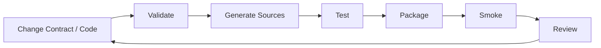
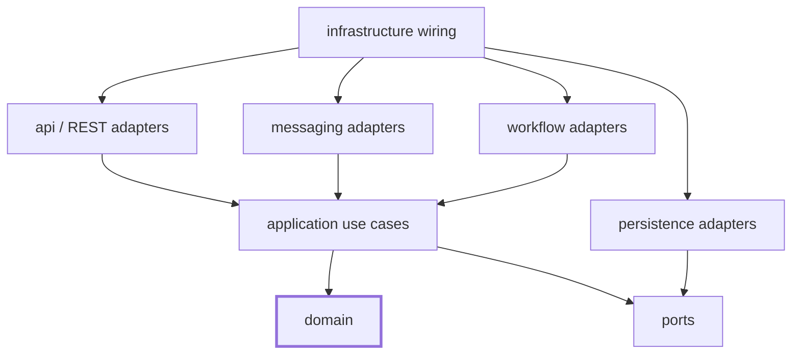
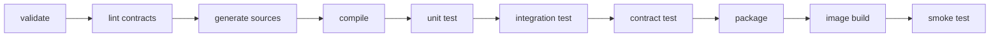
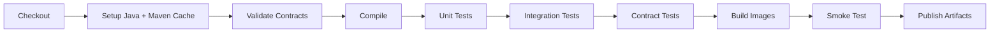

------
title: Learn Java Microservices CPQ OMS Platform - Part 004
description: Design the repository architecture and Maven build system for a production-grade Java microservices CPQ/OMS platform without creating common-library coupling or build chaos.
series: learn-java-microservices-cpq-oms-platform
seriesTitle: Learn Java Microservices CPQ OMS Platform
order: 4
partTitle: Repository Architecture and Build System
tags:
- java
- microservices
- cpq
- oms
- maven
- repository-architecture
- build-system
- ci
- series
date: 2026-07-02
---

# Part 004 — Repository Architecture and Build System

> Target kemampuan: mampu merancang repository dan build system untuk platform Java microservices CPQ/OMS yang bisa berkembang tanpa berubah menjadi dependency tangle, generated-code chaos, atau shared-domain coupling.

Part 003 mengubah requirement menjadi executable blueprint. Sekarang kita butuh tempat untuk menaruh blueprint itu dengan benar: repository, module, build lifecycle, generated code, dependency governance, test layout, dan CI gates.

Dalam platform enterprise, repository architecture bukan preferensi kosmetik. Repository menentukan:

- seberapa cepat developer bisa build dan test;
- seberapa mudah API/schema berubah tanpa merusak consumer;
- seberapa kuat dependency boundary antar service;
- seberapa cepat bug bisa dilacak ke owner;
- seberapa aman generated code dipakai;
- seberapa mudah service dipackage dan dideploy;
- seberapa besar risiko “common library hell”.

---

## 1. Posisi Part Ini Dalam Skill Map Kaufman

Dalam kerangka Kaufman, kita sedang menghilangkan hambatan praktik. Engineer tidak bisa belajar build-from-scratch secara efektif jika setiap eksperimen tersendat karena build lambat, dependency kacau, module ambigu, atau environment tidak reproducible.

Sub-skill yang dilatih:

1. merancang repository boundary;
2. memisahkan source, contract, generated code, dan runtime config;
3. mengontrol dependency dengan BOM dan Maven Enforcer;
4. mencegah shared domain model;
5. membuat build lifecycle yang repeatable;
6. membuat quality gate otomatis;
7. menjaga local development tetap cepat.



Tujuan akhir: repository menjadi learning lab sekaligus production seed.

---

## 2. Monorepo vs Polyrepo Untuk Seri Ini

Untuk build-from-scratch learning series, gunakan **monorepo modular** terlebih dahulu.

Alasannya:

- easier cross-service refactoring selama desain masih bergerak;
- single command untuk build/test local;
- easier contract visibility;
- easier end-to-end test orchestration;
- easier consistency untuk Maven plugin, Java version, lint, dan Docker Compose;
- mengurangi overhead awal dari multi-repo CI/CD.

Namun monorepo tidak berarti semua service boleh saling import domain model. Boundary tetap harus ditegakkan.

### 2.1 Decision

```text
Use monorepo for learning and platform bootstrap.
Keep service boundaries explicit.
Do not allow direct dependency from one service implementation to another service implementation.
Allow extraction to polyrepo later if team scale, release independence, or compliance requires it.
```

### 2.2 Extraction Criteria

Service boleh diekstrak ke repo terpisah jika:

- lifecycle release-nya berbeda drastis;
- ownership team berbeda;
- build/test terlalu berat;
- compliance memerlukan access boundary;
- deployment cadence berbeda;
- service sudah memiliki stable API/event contract.

Jangan mulai dari polyrepo hanya karena ingin terlihat modern.

---

## 3. Repository Topology

Baseline repository:

```text
learn-java-microservices-cpq-oms-platform/
  README.md
  pom.xml
  .editorconfig
  .gitignore
  .mvn/
    maven.config
    wrapper/
  mvnw
  mvnw.cmd

  docs/
    architecture/
    decisions/
    runbooks/
    diagrams/

  platform/
    platform-bom/
    platform-parent/
    platform-testing/
    platform-observability/
    platform-web/
    platform-persistence/

  contracts/
    openapi/
      catalog-service.yaml
      configuration-service.yaml
      pricing-service.yaml
      quote-service.yaml
      approval-service.yaml
      order-service.yaml
      workflow-service.yaml
    schemas/
      common/
      events/
        quote-events.schema.json
        order-events.schema.json
    examples/
      quote/
      order/

  services/
    catalog-service/
    configuration-service/
    pricing-service/
    quote-service/
    approval-service/
    order-service/
    workflow-service/
    integration-service/
    audit-service/

  processes/
    approval/
      approval-process.bpmn
    order/
      order-fulfillment-process.bpmn

  database/
    catalog-service/
      migrations/
    pricing-service/
      migrations/
    quote-service/
      migrations/
    order-service/
      migrations/
    approval-service/
      migrations/
    workflow-service/
      migrations/

  deploy/
    docker-compose/
    kubernetes/
    helm/

  tools/
    scripts/
    codegen/
    lint/

  tests/
    acceptance/
    contract/
    performance/
```

This layout separates conceptually different artifacts:

- `contracts/` for API and schema contracts;
- `services/` for executable applications;
- `platform/` for constrained technical utilities;
- `database/` for migration ownership;
- `processes/` for BPMN assets;
- `tests/` for cross-service tests;
- `docs/` for ADR and runbooks;
- `deploy/` for runtime packaging.

---

## 4. Maven Root Strategy

Use a root aggregator POM.

```xml
<project xmlns="http://maven.apache.org/POM/4.0.0"
         xmlns:xsi="http://www.w3.org/2001/XMLSchema-instance"
         xsi:schemaLocation="http://maven.apache.org/POM/4.0.0 https://maven.apache.org/xsd/maven-4.0.0.xsd">
  <modelVersion>4.0.0</modelVersion>

  <groupId>com.example.cpqoms</groupId>
  <artifactId>cpq-oms-platform</artifactId>
  <version>0.1.0-SNAPSHOT</version>
  <packaging>pom</packaging>

  <modules>
    <module>platform/platform-bom</module>
    <module>platform/platform-parent</module>
    <module>platform/platform-web</module>
    <module>platform/platform-persistence</module>
    <module>platform/platform-testing</module>
    <module>services/catalog-service</module>
    <module>services/configuration-service</module>
    <module>services/pricing-service</module>
    <module>services/quote-service</module>
    <module>services/approval-service</module>
    <module>services/order-service</module>
    <module>services/workflow-service</module>
  </modules>
</project>
```

Root POM aggregates. It should not become a dumping ground for every plugin behavior. Push shared build rules into `platform-parent` and dependency versions into `platform-bom`.

---

## 5. BOM vs Parent POM

Do not confuse BOM and parent POM.

| Artifact | Purpose | Contains |
|---|---|---|
| BOM | dependency version alignment | `dependencyManagement` only |
| Parent POM | build behavior | plugins, compiler config, surefire/failsafe, enforcer |
| Root Aggregator | multi-module build orchestration | `modules` |

### 5.1 Platform BOM

```xml
<project xmlns="http://maven.apache.org/POM/4.0.0"
         xmlns:xsi="http://www.w3.org/2001/XMLSchema-instance"
         xsi:schemaLocation="http://maven.apache.org/POM/4.0.0 https://maven.apache.org/xsd/maven-4.0.0.xsd">
  <modelVersion>4.0.0</modelVersion>

  <groupId>com.example.cpqoms.platform</groupId>
  <artifactId>platform-bom</artifactId>
  <version>0.1.0-SNAPSHOT</version>
  <packaging>pom</packaging>

  <dependencyManagement>
    <dependencies>
      <dependency>
        <groupId>org.glassfish.jersey</groupId>
        <artifactId>jersey-bom</artifactId>
        <version>${jersey.version}</version>
        <type>pom</type>
        <scope>import</scope>
      </dependency>

      <dependency>
        <groupId>org.junit</groupId>
        <artifactId>junit-bom</artifactId>
        <version>${junit.version}</version>
        <type>pom</type>
        <scope>import</scope>
      </dependency>
    </dependencies>
  </dependencyManagement>
</project>
```

### 5.2 Platform Parent

```xml
<project xmlns="http://maven.apache.org/POM/4.0.0"
         xmlns:xsi="http://www.w3.org/2001/XMLSchema-instance"
         xsi:schemaLocation="http://maven.apache.org/POM/4.0.0 https://maven.apache.org/xsd/maven-4.0.0.xsd">
  <modelVersion>4.0.0</modelVersion>

  <groupId>com.example.cpqoms.platform</groupId>
  <artifactId>platform-parent</artifactId>
  <version>0.1.0-SNAPSHOT</version>
  <packaging>pom</packaging>

  <dependencyManagement>
    <dependencies>
      <dependency>
        <groupId>com.example.cpqoms.platform</groupId>
        <artifactId>platform-bom</artifactId>
        <version>${project.version}</version>
        <type>pom</type>
        <scope>import</scope>
      </dependency>
    </dependencies>
  </dependencyManagement>

  <build>
    <pluginManagement>
      <plugins>
        <plugin>
          <groupId>org.apache.maven.plugins</groupId>
          <artifactId>maven-compiler-plugin</artifactId>
          <version>${maven.compiler.plugin.version}</version>
          <configuration>
            <release>${java.version}</release>
          </configuration>
        </plugin>
      </plugins>
    </pluginManagement>
  </build>
</project>
```

The point is not exact versions yet. The point is separation of concerns.

---

## 6. Java Version Policy

Pick one Java runtime baseline for the platform. For a modern enterprise Java build, use Java 21 LTS as a strong default unless your organization has a different support constraint.

Policy:

```text
java.version = 21
all services compile with --release 21
all containers use the same runtime family
CI enforces exact runtime version
local dev uses Maven Wrapper
```

Do not let different services drift to random Java versions unless there is a documented reason.

---

## 7. Maven Version Policy

Use Maven Wrapper so the team does not depend on whatever Maven happens to be installed locally.

```bash
./mvnw -version
./mvnw clean verify
```

As of current Maven documentation, Maven 3.9.x remains the stable GA line, while Maven 4 has release-candidate documentation and migration notes. For this series, the safe default is:

```text
Use Maven 3.9.x for the main learning path.
Keep Maven 4 migration as an optional later hardening exercise.
```

Rationale:

- reproducibility matters more than novelty;
- plugin ecosystem compatibility matters;
- Maven 4 migration should be deliberate, not accidental.

---

## 8. Service Module Layout

Each service should have predictable layout.

```text
services/quote-service/
  pom.xml
  src/
    main/
      java/
        com/example/cpqoms/quote/
          QuoteApplication.java
          api/
          application/
          domain/
          infrastructure/
          persistence/
          messaging/
          workflow/
      resources/
        application.yaml
        mybatis/
          QuoteMapper.xml
    test/
      java/
        com/example/cpqoms/quote/
          domain/
          application/
          api/
    integration-test/
      java/
        com/example/cpqoms/quote/
  generated/
    openapi/
  README.md
```

### 8.1 Package Responsibility

| Package | Responsibility |
|---|---|
| `api` | JAX-RS resources, request/response adapters |
| `application` | use cases, command handlers, transaction scripts |
| `domain` | aggregate, value object, domain service, invariant enforcement |
| `persistence` | MyBatis mappers, repositories, SQL-facing model |
| `messaging` | Kafka producer/consumer adapters, outbox integration |
| `workflow` | Camunda command adapter, process callbacks |
| `infrastructure` | wiring, config, health, technical adapters |

The `domain` package must not depend on Jersey, MyBatis, Kafka, Redis, or Camunda.

---

## 9. Dependency Direction

Use inward dependency rule.



Allowed:

```text
api -> application -> domain
application -> ports
persistence -> ports
messaging -> application
workflow -> application
```

Forbidden:

```text
domain -> api
domain -> persistence
domain -> camunda
domain -> kafka
quote-service -> order-service implementation module
order-service -> quote-service persistence module
```

---

## 10. No Shared Domain Jar

This is one of the most important rules.

Bad structure:

```text
platform/common-domain/
  Product.java
  Quote.java
  Order.java
  Price.java
  Approval.java
```

Why it fails:

- all services become coupled to one release cycle;
- domain terms lose bounded-context meaning;
- changes become high-blast-radius;
- internal model leaks into API/event contracts;
- teams stop owning their models.

Acceptable shared modules:

```text
platform/platform-web
  CorrelationIdFilter
  ProblemDetailsResponse
  ExceptionMapper conventions

platform/platform-persistence
  TransactionRunner
  Pagination primitives
  Database health check helper

platform/platform-testing
  Testcontainers helpers
  Contract test utilities
  Fixture builders for primitive concepts only

platform/platform-observability
  Logging field constants
  Metrics naming conventions
```

Shared module rule:

> Share technical mechanics. Do not share business meaning.

---

## 11. Contract Placement Strategy

Contracts should be first-class.

```text
contracts/openapi/quote-service.yaml
contracts/schemas/events/quote-events.schema.json
contracts/examples/quote/create-quote-request.json
contracts/examples/quote/create-quote-response.json
```

Each service can consume its own contract through Maven plugin code generation.

Two patterns are possible:

### 11.1 Central Contract Directory

Pros:

- easy discovery;
- easy cross-service review;
- simple linting.

Cons:

- service ownership can become blurry.

### 11.2 Contract Inside Service

```text
services/quote-service/src/main/openapi/quote-service.yaml
```

Pros:

- ownership is obvious;
- contract changes version with service.

Cons:

- harder global governance.

### 11.3 Recommended Hybrid

For this series:

```text
contracts/openapi/*.yaml are canonical during learning.
services/* consume contracts via relative path.
Later, contracts can move into service repos or contract registry.
```

---

## 12. Generated Code Policy

Generated code is useful but dangerous if unmanaged.

Rules:

1. Generated code must go into `target/generated-sources`, not manually edited directories.
2. Generated interfaces are allowed; generated domain models are risky.
3. Service domain model must remain hand-written.
4. API DTOs may be generated from OpenAPI.
5. Mapping between API DTO and domain command must be explicit.
6. Generated code should not be committed unless your organization has a specific reason.

Bad:

```text
OpenAPI-generated QuoteDto becomes domain Quote aggregate.
```

Good:

```text
CreateQuoteRequestDto -> CreateQuoteCommand -> Quote aggregate
```

Mapping layer may feel repetitive, but it protects the domain.

---

## 13. Build Lifecycle

Target lifecycle:



Maven phases mapping:

| Phase | Work |
|---|---|
| `validate` | check Java/Maven version, dependency convergence, contract lint |
| `generate-sources` | OpenAPI/JAX-RS DTO generation, schema codegen if used |
| `compile` | compile production code |
| `test` | unit tests |
| `integration-test` | Testcontainers-backed service tests |
| `verify` | contract tests, coverage, static analysis |
| `package` | build service artifact |

Avoid putting expensive integration tests in the default inner-loop if they make every small change painful. Use profiles.

---

## 14. Maven Profiles

Profiles should optimize workflows without hiding correctness.

```text
-Pquick       compile + unit tests only
-Pcontracts   run API/event contract checks
-Pit          run integration tests with Testcontainers
-Pe2e         run cross-service acceptance tests
-Pci          full verification gate
```

Example:

```bash
./mvnw -Pquick clean test
./mvnw -Pit verify
./mvnw -Pcontracts verify
./mvnw -Pci clean verify
```

Rule:

> Local quick path may skip expensive tests; CI main branch must not.

---

## 15. Dependency Governance

Dependency governance protects the platform from drift.

### 15.1 Enforce Dependency Convergence

Use Maven Enforcer concepts:

```xml
<plugin>
  <groupId>org.apache.maven.plugins</groupId>
  <artifactId>maven-enforcer-plugin</artifactId>
  <executions>
    <execution>
      <id>enforce</id>
      <goals>
        <goal>enforce</goal>
      </goals>
      <configuration>
        <rules>
          <requireJavaVersion>
            <version>[21,22)</version>
          </requireJavaVersion>
          <requireMavenVersion>
            <version>[3.9.0,4.0.0)</version>
          </requireMavenVersion>
          <dependencyConvergence />
          <banDuplicatePomDependencyVersions />
        </rules>
      </configuration>
    </execution>
  </executions>
</plugin>
```

### 15.2 Dependency Scope Discipline

| Scope | Use |
|---|---|
| `compile` | required at compile/runtime |
| `runtime` | needed only at runtime |
| `test` | unit/integration test only |
| `provided` | only if runtime container provides it |
| `import` | BOM only |

Do not add dependencies casually. Every dependency increases security, upgrade, and compatibility surface.

### 15.3 Banned Dependency Patterns

- service implementation depending on another service implementation;
- domain depending on framework;
- test fixtures leaking into production;
- generated DTO package imported inside domain;
- transitive dependency relied on directly;
- multiple JSON libraries without explicit reason.

---

## 16. Platform Modules

Platform modules should be small and boring.

### 16.1 `platform-web`

Contains:

- correlation ID filter;
- request logging filter;
- exception mapper base conventions;
- error response factory;
- validation response mapper;
- pagination parameter helper.

Does not contain:

- quote logic;
- order logic;
- approval logic;
- pricing logic.

### 16.2 `platform-persistence`

Contains:

- transaction boundary helper;
- MyBatis session factory wiring helper;
- database health check;
- outbox polling primitive, if generic enough;
- pagination value object.

Does not contain:

- generic repository for all entities;
- base aggregate class with business fields;
- dynamic query DSL that hides SQL.

### 16.3 `platform-testing`

Contains:

- PostgreSQL Testcontainers setup;
- Kafka Testcontainers setup;
- Redis Testcontainers setup;
- fixture clock;
- assertion helpers;
- API client test base.

Does not contain:

- full quote fixtures reused by all services;
- order domain factory used in production;
- business rules.

---

## 17. Service POM Pattern

Example `quote-service/pom.xml`:

```xml
<project xmlns="http://maven.apache.org/POM/4.0.0"
         xmlns:xsi="http://www.w3.org/2001/XMLSchema-instance"
         xsi:schemaLocation="http://maven.apache.org/POM/4.0.0 https://maven.apache.org/xsd/maven-4.0.0.xsd">
  <modelVersion>4.0.0</modelVersion>

  <parent>
    <groupId>com.example.cpqoms.platform</groupId>
    <artifactId>platform-parent</artifactId>
    <version>0.1.0-SNAPSHOT</version>
    <relativePath>../../platform/platform-parent/pom.xml</relativePath>
  </parent>

  <artifactId>quote-service</artifactId>
  <packaging>jar</packaging>

  <dependencies>
    <dependency>
      <groupId>com.example.cpqoms.platform</groupId>
      <artifactId>platform-web</artifactId>
    </dependency>
    <dependency>
      <groupId>com.example.cpqoms.platform</groupId>
      <artifactId>platform-persistence</artifactId>
    </dependency>
    <dependency>
      <groupId>org.mybatis</groupId>
      <artifactId>mybatis</artifactId>
    </dependency>
    <dependency>
      <groupId>org.postgresql</groupId>
      <artifactId>postgresql</artifactId>
      <scope>runtime</scope>
    </dependency>
    <dependency>
      <groupId>org.junit.jupiter</groupId>
      <artifactId>junit-jupiter</artifactId>
      <scope>test</scope>
    </dependency>
  </dependencies>
</project>
```

Notice what is absent:

```text
order-service dependency
catalog-service implementation dependency
common-domain dependency
camunda engine dependency inside domain
```

---

## 18. API Code Generation Boundary

For OpenAPI-first, generation should happen predictably.

Example conceptual plugin configuration:

```xml
<plugin>
  <groupId>org.openapitools</groupId>
  <artifactId>openapi-generator-maven-plugin</artifactId>
  <executions>
    <execution>
      <id>generate-quote-api</id>
      <phase>generate-sources</phase>
      <goals>
        <goal>generate</goal>
      </goals>
      <configuration>
        <inputSpec>${project.basedir}/../../contracts/openapi/quote-service.yaml</inputSpec>
        <generatorName>jaxrs-spec</generatorName>
        <output>${project.build.directory}/generated-sources/openapi</output>
        <apiPackage>com.example.cpqoms.quote.generated.api</apiPackage>
        <modelPackage>com.example.cpqoms.quote.generated.model</modelPackage>
        <generateSupportingFiles>false</generateSupportingFiles>
      </configuration>
    </execution>
  </executions>
</plugin>
```

Design rule:

> Generated API is an adapter boundary, not the application core.

---

## 19. Database Migration Placement

Each service owns its migrations.

```text
database/quote-service/migrations/
  V001__create_quotes.sql
  V002__create_quote_lines.sql
  V003__create_quote_price_snapshots.sql
  V004__create_quote_outbox.sql
```

Alternative colocated style:

```text
services/quote-service/src/main/resources/db/migration/
```

Recommended for this series:

```text
Keep canonical migrations under database/<service>/migrations.
During packaging, copy or reference them from service runtime.
```

This makes cross-service DB ownership visible.

### 19.1 Migration Rules

1. Never edit an already-applied versioned migration.
2. Prefer additive changes.
3. Use expand-and-contract for breaking changes.
4. Backfill with controlled batch jobs.
5. Add constraints only after data is clean.
6. Test migration against realistic data volume.
7. Include rollback or forward-fix strategy in ADR/runbook.

---

## 20. Test Layout

Testing should match architecture boundaries.

```text
services/quote-service/src/test/java/...
  domain/
    QuoteStateMachineTest.java
    QuoteInvariantsTest.java
  application/
    SubmitQuoteUseCaseTest.java
  api/
    QuoteResourceValidationTest.java

services/quote-service/src/integration-test/java/...
  QuoteRepositoryIT.java
  QuoteApiIT.java
  QuoteOutboxIT.java

tests/contract/
  quote-service/
    QuoteApiContractTest.java
    QuoteEventsContractTest.java

tests/acceptance/
  QuoteToOrderJourneyTest.java
```

### 20.1 Unit Tests

Fast, no network, no DB.

Targets:

- aggregate behavior;
- state transitions;
- pricing calculation fragments;
- command validation;
- mapper functions.

### 20.2 Integration Tests

Use real dependencies through containers where possible.

Targets:

- PostgreSQL constraints;
- MyBatis mapping;
- transaction boundaries;
- outbox write/publish;
- Redis TTL behavior;
- Kafka producer/consumer serialization.

### 20.3 Contract Tests

Targets:

- OpenAPI examples match schema;
- provider returns documented response;
- event payload matches schema;
- backward compatibility rules.

### 20.4 Acceptance Tests

Targets:

- cross-service quote-to-order journey;
- approval path;
- failed fulfillment repair path;
- audit reconstruction.

---

## 21. CI Pipeline Blueprint

A good CI pipeline is staged.



### 21.1 Pull Request Gate

PR should run:

- formatting/lint check;
- Maven validate;
- compile;
- unit tests;
- changed service integration tests;
- OpenAPI/schema validation;
- dependency vulnerability scan if available;
- architecture rule tests.

### 21.2 Main Branch Gate

Main branch should run:

- full build;
- all integration tests;
- all contract tests;
- acceptance smoke;
- container image build;
- SBOM generation if used;
- publish artifacts.

### 21.3 Nightly Gate

Nightly should run:

- full acceptance suite;
- performance baseline;
- dependency update report;
- database migration rehearsal;
- replay/reconciliation test;
- long-running Camunda process simulation.

---

## 22. Architecture Rule Tests

Use automated checks to enforce boundaries. The tool can vary, but the rules matter.

Example rules:

```text
No class in ..domain.. may depend on jakarta.ws.rs..*
No class in ..domain.. may depend on org.mybatis..*
No class in ..domain.. may depend on org.apache.kafka..*
No service may depend on another service implementation artifact
No generated model may be used inside ..domain..
No package outside persistence may access mapper interfaces
```

This catches erosion early.

Pseudo-test:

```java
class ArchitectureRulesTest {

    @Test
    void domainMustNotDependOnFrameworks() {
        // Assert domain package does not depend on Jersey, MyBatis, Kafka, Redis, or Camunda.
    }

    @Test
    void serviceMustNotDependOnOtherServiceImplementation() {
        // Assert service dependency graph does not include services/* implementation artifacts.
    }
}
```

---

## 23. Local Development Commands

Make common tasks obvious.

```text
./mvnw -Pquick clean test
./mvnw -Pit -pl services/quote-service verify
./mvnw -Pcontracts verify
./tools/scripts/dev-up.sh
./tools/scripts/dev-down.sh
./tools/scripts/reset-db.sh quote-service
./tools/scripts/generate-openapi.sh quote-service
```

Optional `Makefile`:

```makefile
quick:
	./mvnw -Pquick clean test

verify:
	./mvnw -Pci clean verify

dev-up:
	./tools/scripts/dev-up.sh

dev-down:
	./tools/scripts/dev-down.sh

quote-it:
	./mvnw -Pit -pl services/quote-service verify
```

Do not hide complex magic in scripts. Scripts should orchestrate, not obscure.

---

## 24. Configuration Management

Separate build-time and runtime configuration.

### 24.1 Build-time

Examples:

- Java version;
- plugin versions;
- dependency versions;
- code generation settings;
- contract paths.

These live in POM/properties.

### 24.2 Runtime

Examples:

- database URL;
- Kafka bootstrap servers;
- Redis URL;
- token issuer;
- feature flags;
- timeout values;
- pool sizes.

These live in environment variables, config files, or runtime config provider.

### 24.3 Rule

> A service artifact should be environment-neutral. Environment changes should not require rebuilding the JAR.

---

## 25. Versioning Strategy

Versioning has multiple layers.

| Layer | Example | Policy |
|---|---|---|
| platform artifact | `0.1.0-SNAPSHOT` | Maven artifact version |
| service API | `/v1/quotes` | backward compatibility within major version |
| event schema | `QuoteAccepted` version `1` | additive change preferred |
| database migration | `V001__...sql` | immutable once applied |
| container image | git SHA + semantic tag | traceable to source |
| BPMN process | process definition key/version | deploy with migration awareness |

Do not pretend one version number solves all layers.

---

## 26. Branching and Review Strategy

For learning and early platform work:

```text
main: always buildable
feature/*: short-lived branches
adr/*: architecture decision changes
contract/*: API/schema changes
```

Review checklist:

- Does this change alter a public API?
- Does this change alter event schema?
- Does this change require DB migration?
- Does this change affect a state transition?
- Does this change affect authorization?
- Does this change affect audit evidence?
- Does this change require runbook update?
- Does this change add dependency risk?

---

## 27. Handling Generated Clients

Generated clients can help internal calls, but be careful.

Allowed:

```text
quote-service uses generated catalog-service client interface for synchronous catalog lookup.
```

But:

- wrap generated client behind an application port;
- do not leak generated DTOs into domain;
- configure timeouts;
- classify errors;
- add idempotency/correlation headers;
- test fallback behavior.

Bad:

```java
class Quote {
    private CatalogOfferResponse offer; // generated external DTO inside domain
}
```

Good:

```java
record OfferSnapshot(
    OfferId offerId,
    CatalogVersion catalogVersion,
    String name,
    List<ConfiguredAttribute> attributes
) {}
```

---

## 28. Build Performance

A slow build kills learning and delivery.

Strategies:

- use Maven reactor options: `-pl`, `-am`;
- keep unit tests fast;
- separate integration tests by profile;
- avoid excessive annotation processors;
- cache Maven repository in CI;
- avoid committing large generated artifacts;
- split acceptance tests from service tests;
- measure build time per module.

Useful commands:

```bash
./mvnw -pl services/quote-service -am test
./mvnw -pl services/order-service -am -Pit verify
./mvnw -DskipTests package
```

Do not use `-DskipTests` as a normal development habit. It is for packaging checks, not confidence.

---

## 29. Security and Supply Chain Basics

Repository should support supply-chain hygiene early.

Minimum practices:

- Maven Wrapper committed;
- dependency versions controlled centrally;
- no secrets in repo;
- dependency vulnerability scanning in CI;
- reproducible container base image policy;
- SBOM generation where required;
- signed release artifacts if organizationally required;
- CODEOWNERS for critical areas.

Sensitive paths:

```text
contracts/openapi/
database/*/migrations/
processes/**/*.bpmn
services/*/src/main/java/**/security/
services/*/src/main/java/**/authorization/
docs/decisions/
```

These should require senior review.

---

## 30. CODEOWNERS Example

```text
# Contracts
/contracts/openapi/ @platform-api-reviewers
/contracts/schemas/ @platform-api-reviewers

# Database migrations
/database/ @data-architecture-reviewers

# Workflow definitions
/processes/ @workflow-reviewers

# Security-sensitive code
/services/**/security/ @security-reviewers
/services/**/authorization/ @security-reviewers

# Architecture decisions
/docs/decisions/ @architecture-reviewers
```

CODEOWNERS is not a substitute for good engineering judgment. It is a guardrail.

---

## 31. Commit and Change Discipline

Commit messages should reveal intent.

Good:

```text
Add quote acceptance state transition invariant
Add order source quote uniqueness migration
Introduce OpenAPI error response schema
Isolate Camunda process start behind workflow port
```

Bad:

```text
fix stuff
update code
wip
changes
```

For this series, each meaningful part should produce commits grouped by artifact type:

1. contract;
2. domain;
3. persistence;
4. API adapter;
5. integration;
6. test;
7. docs/runbook.

---

## 32. Initial Implementation Order

Do not implement every service at once.

Recommended order:

1. root Maven structure;
2. platform BOM/parent;
3. platform-web minimal error/correlation support;
4. quote-service skeleton;
5. order-service skeleton;
6. OpenAPI contract generation;
7. PostgreSQL migration wiring;
8. MyBatis repository test;
9. Kafka outbox module;
10. Camunda workflow-service skeleton;
11. acceptance test harness.

This order creates vertical slices early.

---

## 33. First Vertical Slice

The first vertical slice should be simple but architecture-representative.

Target:

```text
POST /quotes
  -> validate request
  -> create Quote aggregate
  -> persist to PostgreSQL through MyBatis
  -> write QuoteCreated to outbox
  -> return response with correlation ID
  -> integration test verifies DB row and outbox row
```

This slice exercises:

- OpenAPI DTO;
- JAX-RS resource;
- application command handler;
- domain aggregate;
- MyBatis mapper;
- PostgreSQL migration;
- outbox table;
- error model;
- test harness.

It does not need Kafka publishing yet. First persist outbox correctly.

---

## 34. Repository Smell Catalog

Watch for these signs.

### 34.1 `common` Keeps Growing

Symptom:

```text
platform-common has 200 classes and every service depends on it.
```

Likely cause:

- team is sharing business concepts instead of contracts.

Fix:

- split technical helpers;
- move domain concepts back to owning service;
- use API/event schema for cross-service contract.

### 34.2 Generated Code Is Edited

Symptom:

```text
Developer modifies generated DTO to add business method.
```

Fix:

- regenerate from contract;
- move method into mapper/domain object;
- prevent generated folder from being manually edited.

### 34.3 Tests Require Entire Platform

Symptom:

```text
Quote domain test starts PostgreSQL, Kafka, Redis, and Camunda.
```

Fix:

- isolate domain tests;
- push container usage to integration tests;
- use ports/fakes for application tests.

### 34.4 Service Imports Another Service Implementation

Symptom:

```text
order-service imports com.example.cpqoms.quote.domain.Quote
```

Fix:

- replace with quote API client or consumed event/read model;
- create local `QuoteSnapshot` value object;
- add architecture rule test.

### 34.5 Build Requires Local Manual Setup

Symptom:

```text
Works only if developer manually created DB, topics, users, env vars.
```

Fix:

- Maven Wrapper;
- Docker Compose;
- Testcontainers;
- documented scripts;
- default local config.

---

## 35. Practical Exercise

Create the initial repository skeleton.

Required files:

```text
pom.xml
platform/platform-bom/pom.xml
platform/platform-parent/pom.xml
platform/platform-web/pom.xml
platform/platform-persistence/pom.xml
services/quote-service/pom.xml
services/order-service/pom.xml
contracts/openapi/quote-service.yaml
contracts/openapi/order-service.yaml
database/quote-service/migrations/V001__create_quotes.sql
database/order-service/migrations/V001__create_orders.sql
docs/decisions/adr-0001-monorepo-modular-boundary.md
```

Acceptance criteria:

- `./mvnw -Pquick clean test` works;
- quote-service does not depend on order-service;
- order-service does not depend on quote-service implementation;
- domain package has no framework dependency;
- API contract exists before resource implementation;
- migration exists before repository implementation.

---

## 36. Review Checklist

Repository architecture is acceptable when:

- root POM aggregates but does not hide domain logic;
- BOM controls dependency versions;
- parent POM controls build behavior;
- services have explicit ownership;
- no shared domain model exists;
- generated code is isolated;
- OpenAPI and schema contracts are first-class;
- DB migrations are service-owned;
- tests are separated by speed and scope;
- CI gates match risk;
- local development is reproducible;
- architecture rules prevent dependency erosion.

---

## 37. Key Takeaways

- Repository structure is architecture in executable form.
- Monorepo is acceptable if boundaries are enforced.
- BOM, parent POM, and root aggregator solve different problems.
- Generated code should stay at the boundary.
- Shared technical helpers are fine; shared domain model is dangerous.
- Build lifecycle must support both fast learning and production confidence.
- A platform that cannot be built, tested, and run reproducibly is not production-ready.

---

## References

- Apache Maven documentation: Maven releases, wrapper, build lifecycle, dependency management, and Maven 4 migration notes.
- OpenAPI Initiative and Swagger documentation: OpenAPI as machine-readable HTTP API contract.
- Jersey User Guide: JAX-RS implementation mechanics, providers, and exception mapping.
- PostgreSQL documentation: DDL, constraints, indexes, and migration implications.
- MyBatis documentation: SQL mapper and persistence mapping model.
- Camunda 7 documentation: process application, process engine, job executor, and deployment behavior.
