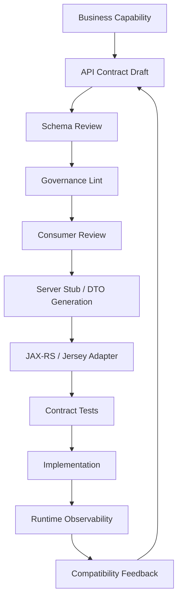
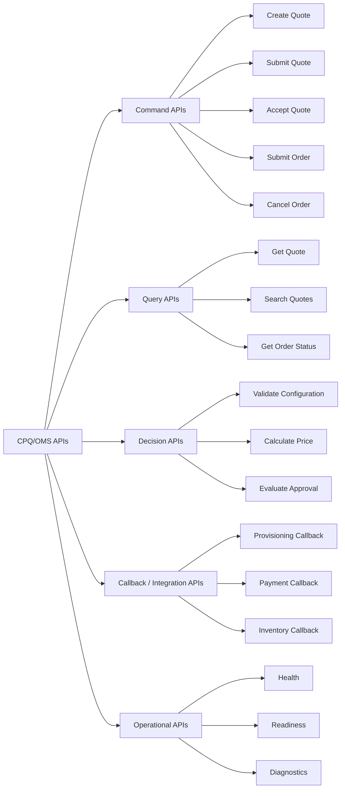
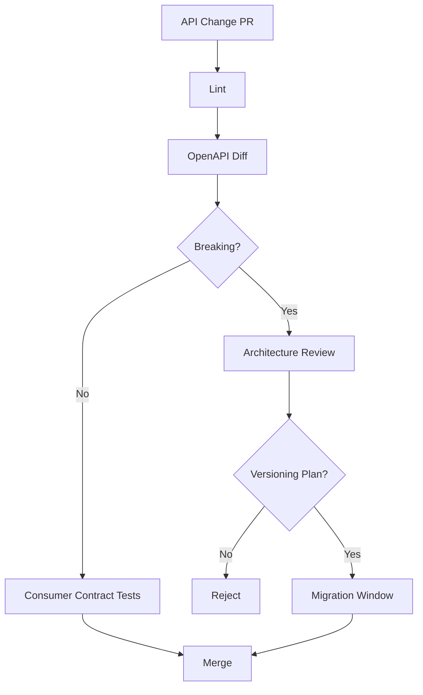

# Part 005 — OpenAPI First API Governance

Part ini membahas bagaimana kita mendesain HTTP API untuk platform CPQ/OMS secara **OpenAPI First**: kontrak ditulis, direview, dilint, dites, dan dinegosiasikan sebelum implementasi service dianggap benar.

Tujuannya bukan sekadar punya file `openapi.yaml`. Tujuannya adalah membangun **API governance system** yang membuat service Java/JAX-RS/Jersey kita stabil, evolvable, mudah dites, dan aman untuk dipakai banyak consumer.

Dalam platform CPQ/OMS, API bukan hanya endpoint CRUD. API adalah batas kontrak untuk keputusan bisnis: validasi konfigurasi, kalkulasi harga, approval quote, submit order, cancel order, amend order, dan query status. Kesalahan kecil pada API design dapat menghasilkan quote yang salah, order ganda, audit trail lemah, atau integrasi enterprise yang rapuh.

## 1. Baseline Mental Model

OpenAPI Specification mendefinisikan format standar, language-agnostic, untuk mendeskripsikan HTTP API sehingga manusia dan mesin dapat memahami capability sebuah service tanpa membaca source code atau network traffic.

Dalam seri ini, OpenAPI dipakai sebagai **source of truth untuk HTTP interface**, bukan dokumentasi sekunder.

Artinya:

1. API contract dibuat sebelum resource Jersey final.
2. Contract direview seperti code.
3. Generated code boleh dipakai, tetapi domain logic tidak boleh bocor ke generated layer.
4. Compatibility rules wajib eksplisit.
5. API tests diturunkan dari contract.
6. Breaking change tidak boleh masuk tanpa versioning/migration plan.



## 2. Why OpenAPI First Matters in CPQ/OMS

CPQ/OMS API memiliki karakteristik yang lebih berat daripada API produk internal sederhana:

| Area | Risiko Jika API Tidak Digovern |
|---|---|
| Quote creation | Quote dibuat tanpa commercial snapshot yang cukup. |
| Configuration validation | Consumer tidak tahu kenapa konfigurasi invalid. |
| Pricing | Rounding, currency, discount stacking, dan effective date tidak eksplisit. |
| Approval | Action tidak idempotent, escalation sulit diaudit. |
| Order submission | Retry dari client dapat membuat duplicate order. |
| Order status | State tidak konsisten antara order header dan order line. |
| Integration | Partner/BSS/CRM memakai semantic yang berbeda. |
| Audit | Tidak ada stable request identity, actor identity, dan decision trail. |

OpenAPI First membuat kita memaksa pertanyaan desain sebelum implementation bias mengambil alih.

Contoh pertanyaan yang harus dijawab sebelum coding:

- Apakah `submitQuote` idempotent?
- Apakah `quoteId` dibuat oleh server atau client?
- Apakah harga dihitung ulang saat quote diterima?
- Apakah client boleh mengirim discount manual?
- Apa bentuk error saat product incompatible?
- Bagaimana API menunjukkan approval sedang menunggu siapa?
- Apakah cancel order berlaku untuk seluruh order atau line tertentu?
- Apa response saat request yang sama dikirim ulang?

## 3. Kaufman Deconstruction: Skill yang Sebenarnya Dipelajari

Skill besar part ini adalah: **mendesain API enterprise yang bisa berevolusi tanpa menghancurkan consumer dan tanpa melemahkan invariant bisnis**.

Kita pecah menjadi sub-skill:

| Sub-skill | Praktik Utama | Output |
|---|---|---|
| Capability framing | Menentukan use case, actor, command/query boundary | API capability map |
| Resource modeling | Menentukan resource, action, lifecycle, identity | Endpoint map |
| Schema modeling | Request/response DTO, validation, enum, money, time | Component schemas |
| Error design | Error taxonomy, field errors, business errors | Standard error model |
| Idempotency | Idempotency key, replay response, duplicate semantics | Idempotent command policy |
| Compatibility | Backward-compatible change rules | API evolution policy |
| Governance automation | Lint, diff, contract test, generated code | CI quality gate |

Target part ini: setelah selesai, kita tidak hanya bisa menulis OpenAPI spec, tetapi bisa menjelaskan **kenapa** suatu API aman atau tidak aman secara lifecycle.

## 4. API Taxonomy untuk CPQ/OMS

Jangan mulai dari endpoint. Mulai dari taxonomy capability.



### 4.1 Command APIs

Command API mengubah state. Di CPQ/OMS, command API harus hampir selalu memiliki:

- stable request identity,
- actor identity,
- tenant context,
- idempotency behavior,
- validation result,
- audit effect,
- deterministic response shape.

Contoh command:

```http
POST /v1/quotes
POST /v1/quotes/{quoteId}/submit
POST /v1/quotes/{quoteId}/approve
POST /v1/quotes/{quoteId}/accept
POST /v1/orders
POST /v1/orders/{orderId}/cancel
```

### 4.2 Query APIs

Query API membaca state. Tantangan query API bukan hanya pagination, tetapi juga **projection correctness**.

Contoh:

```http
GET /v1/quotes/{quoteId}
GET /v1/quotes?customerId=...&status=...
GET /v1/orders/{orderId}
GET /v1/orders/{orderId}/timeline
```

Query API boleh memakai read model yang optimized, tetapi response harus jelas apakah datanya strongly consistent atau eventually consistent.

### 4.3 Decision APIs

Decision API tidak selalu menyimpan aggregate final, tetapi menghasilkan keputusan penting.

Contoh:

```http
POST /v1/configurations/validate
POST /v1/prices/calculate
POST /v1/approval-policies/evaluate
```

Decision API wajib explainable. Jika konfigurasi invalid, client harus mendapat alasan yang bisa dipakai UI dan audit.

### 4.4 Callback APIs

Callback APIs menerima sinyal dari sistem eksternal. Ini rawan duplicate, out-of-order, dan untrusted payload.

Contoh:

```http
POST /v1/integration/provisioning/callbacks
POST /v1/integration/payment/callbacks
```

Callback API wajib:

- authenticate source,
- verify signature bila tersedia,
- deduplicate external event ID,
- tolerate retry,
- map external state ke internal transition secara eksplisit.

### 4.5 Operational APIs

Operational API bukan API bisnis. Jangan campur dengan public business API.

Contoh:

```http
GET /health/live
GET /health/ready
GET /internal/diagnostics/orders/{orderId}
```

Operational API harus dibatasi network/security policy. Jangan membuka endpoint repair tanpa authorization kuat.

## 5. Resource Design: Noun, Command, atau Workflow Action?

Rule praktis:

1. Gunakan noun resource untuk lifecycle entity utama.
2. Gunakan sub-resource untuk collection atau timeline.
3. Gunakan action endpoint ketika business action tidak natural sebagai CRUD.
4. Hindari memaksa semua hal menjadi `PUT` hanya demi terlihat RESTful.

Dalam CPQ/OMS, action endpoint sering lebih jujur:

```http
POST /v1/quotes/{quoteId}/submit
POST /v1/quotes/{quoteId}/accept
POST /v1/orders/{orderId}/cancel
POST /v1/orders/{orderId}/resume
```

Ini lebih jelas daripada:

```http
PATCH /v1/quotes/{quoteId}
{ "status": "SUBMITTED" }
```

Mengubah status secara langsung melemahkan invariant karena status transition bukan sekadar update field. Ia adalah command dengan rules, authorization, audit, dan side effect.

## 6. Endpoint Naming Standard

Gunakan standard naming berikut di series ini:

| Concern | Standard |
|---|---|
| Version prefix | `/v1` |
| Resource name | plural noun: `/quotes`, `/orders` |
| ID path param | `{quoteId}`, `{orderId}` |
| Action | verb sub-resource: `/submit`, `/accept`, `/cancel` |
| Search | `GET /resources?...` untuk simple search; `POST /resources/search` untuk complex criteria |
| Timeline | `/resources/{id}/timeline` |
| Internal endpoint | `/internal/...` |
| Health endpoint | `/health/live`, `/health/ready` |

### 6.1 Do

```http
POST /v1/quotes/{quoteId}/submit
POST /v1/orders/{orderId}/cancel
GET /v1/orders/{orderId}/timeline
```

### 6.2 Avoid

```http
POST /v1/submitQuote
POST /v1/orderCancellation
PATCH /v1/orders/{orderId}/status
GET /v1/getQuoteById?id=...
```

## 7. OpenAPI Document Structure

Untuk service besar, satu file `openapi.yaml` akan cepat sulit dirawat. Gunakan modular layout.

```text
services/
  quote-service/
    api/
      openapi.yaml
      paths/
        quotes.yaml
        quote-actions.yaml
      components/
        schemas/
          quote.yaml
          quote-line.yaml
          money.yaml
          error.yaml
        parameters/
          pagination.yaml
        responses/
          errors.yaml
        security/
          bearer-auth.yaml
```

Root document tetap mudah dibaca:

```yaml
openapi: 3.1.1
info:
  title: Quote Service API
  version: 1.0.0
  description: API contract for managing CPQ quote lifecycle.
servers:
  - url: https://api.example.com/quote-service
paths:
  /v1/quotes:
    $ref: './paths/quotes.yaml'
  /v1/quotes/{quoteId}/submit:
    $ref: './paths/quote-actions.yaml#/submitQuote'
components:
  securitySchemes:
    bearerAuth:
      $ref: './components/security/bearer-auth.yaml'
```

The key is not modularity itself. The key is to make ownership visible:

- path owner,
- schema owner,
- review owner,
- compatibility reviewer,
- generated-code consumer.

## 8. Standard Metadata

Every OpenAPI document must define:

```yaml
openapi: 3.1.1
info:
  title: Quote Service API
  version: 1.0.0
  description: >
    Contract for quote lifecycle management in the CPQ/OMS platform.
  contact:
    name: CPQ Platform Team
    email: cpq-platform@example.com
  license:
    name: Internal Use Only
servers:
  - url: https://api.example.com/quote-service
    description: Production
  - url: https://staging-api.example.com/quote-service
    description: Staging
```

Use `info.version` for API contract release. Do not confuse it with service build version.

| Version Type | Example | Meaning |
|---|---|---|
| API contract version | `1.3.0` | Contract compatibility version |
| Service artifact version | `quote-service-2026.07.02.12` | Runtime deployable version |
| Business policy version | `pricing-policy-2026-Q3` | Effective business rules |
| Event schema version | `QuoteSubmitted.v2` | Async contract version |

## 9. OperationId Governance

`operationId` is not decorative. It affects generated clients, test naming, docs, and traceability.

Use deterministic operation IDs:

```yaml
operationId: createQuote
operationId: submitQuote
operationId: getQuoteById
operationId: searchQuotes
operationId: cancelOrder
```

Avoid:

```yaml
operationId: quotePost
operationId: doSubmit
operationId: handleAction
operationId: orderController_cancel
```

Rules:

1. Must be unique across the service.
2. Must be stable across compatible changes.
3. Must express business capability.
4. Must not include framework/controller names.
5. Must not change unless the operation is removed or intentionally replaced.

## 10. Request Identity and Correlation Headers

In CPQ/OMS, request headers are part of the governance model.

Minimum standard headers:

| Header | Required | Purpose |
|---|---:|---|
| `X-Correlation-Id` | recommended/requested | Trace a business flow across services. |
| `X-Request-Id` | yes for commands | Unique request attempt identity. |
| `Idempotency-Key` | yes for unsafe commands | Deduplicate client retries. |
| `X-Tenant-Id` | depends on auth model | Explicit tenant context if not fully derived from token. |
| `X-Actor-Id` | no if token-derived | Human/system actor context. |

Example parameter component:

```yaml
components:
  parameters:
    CorrelationId:
      name: X-Correlation-Id
      in: header
      required: false
      schema:
        type: string
        minLength: 8
        maxLength: 128
      description: Correlation identifier propagated across services.
    IdempotencyKey:
      name: Idempotency-Key
      in: header
      required: true
      schema:
        type: string
        minLength: 16
        maxLength: 128
      description: Stable key used to deduplicate retry of unsafe commands.
```

### 10.1 Correlation ID vs Request ID vs Idempotency Key

These are not the same.

| Identifier | Scope | Stable Across Retry? | Used For |
|---|---|---:|---|
| Correlation ID | Business flow | yes | distributed tracing, logs |
| Request ID | individual HTTP attempt | no | request diagnostics |
| Idempotency key | business command attempt | yes | duplicate prevention |

Example:

A browser times out while submitting an order. It retries.

- Same `Idempotency-Key`
- Same or related `X-Correlation-Id`
- Different `X-Request-Id`

If you mix these concepts, observability and correctness both degrade.

## 11. Idempotency Governance

Every unsafe command must declare idempotency behavior.

Unsafe command means:

- creates aggregate,
- changes state,
- triggers process,
- publishes event,
- calls external dependency,
- starts Camunda process,
- creates order/provisioning side effect.

### 11.1 Recommended Policy

For commands like `POST /v1/orders`, require `Idempotency-Key`.

```yaml
/v1/orders:
  post:
    operationId: submitOrder
    summary: Submit an accepted quote as an order.
    parameters:
      - $ref: '#/components/parameters/IdempotencyKey'
      - $ref: '#/components/parameters/CorrelationId'
    requestBody:
      required: true
      content:
        application/json:
          schema:
            $ref: '#/components/schemas/SubmitOrderRequest'
    responses:
      '201':
        description: Order created.
      '200':
        description: Existing result for an idempotent retry.
      '409':
        description: Same idempotency key used with a different request fingerprint.
```

### 11.2 Idempotency Storage Model

At implementation level:

```text
idempotency_record
- tenant_id
- idempotency_key
- request_fingerprint
- command_type
- aggregate_id
- response_status
- response_body_snapshot
- expires_at
- created_at
```

Rules:

1. Same key + same request fingerprint returns previous result.
2. Same key + different request fingerprint returns `409 Conflict`.
3. Key TTL must exceed realistic client retry window.
4. For high-risk commands, persist response snapshot.
5. Idempotency record creation must be transactionally aligned with aggregate creation.

## 12. Standard Error Contract

Do not let every service invent its own error response.

Use one standard error envelope:

```yaml
ErrorResponse:
  type: object
  required:
    - errorId
    - code
    - message
    - category
    - retryable
    - timestamp
  properties:
    errorId:
      type: string
      description: Unique error instance identifier for support and logs.
    code:
      type: string
      description: Stable machine-readable error code.
      examples: [QUOTE_NOT_FOUND, CONFIGURATION_INVALID]
    message:
      type: string
      description: Human-readable summary safe for clients.
    category:
      type: string
      enum:
        - VALIDATION
        - BUSINESS_RULE
        - AUTHORIZATION
        - CONFLICT
        - RATE_LIMIT
        - DEPENDENCY
        - INTERNAL
    retryable:
      type: boolean
    fieldErrors:
      type: array
      items:
        $ref: '#/components/schemas/FieldError'
    details:
      type: object
      additionalProperties: true
    timestamp:
      type: string
      format: date-time
```

Field error:

```yaml
FieldError:
  type: object
  required:
    - field
    - code
    - message
  properties:
    field:
      type: string
      examples: ["lineItems[0].quantity"]
    code:
      type: string
      examples: [MINIMUM_VALUE, REQUIRED, INCOMPATIBLE_PRODUCT]
    message:
      type: string
```

### 12.1 Error Code Rules

Error codes must be:

- stable,
- uppercase snake case,
- documented,
- not coupled to Java exception class names,
- safe to show to clients,
- testable in contract tests.

Good:

```text
QUOTE_NOT_FOUND
QUOTE_NOT_EDITABLE
CONFIGURATION_INVALID
PRICE_EXPIRED
ORDER_ALREADY_SUBMITTED
IDEMPOTENCY_KEY_REUSED_WITH_DIFFERENT_PAYLOAD
```

Bad:

```text
NullPointerException
IllegalStateException
DB_ERROR_1002
SomethingWentWrong
ValidationFailed
```

## 13. HTTP Status Code Policy

Status code alone is not enough, but it still matters.

| Status | Use |
|---:|---|
| `200 OK` | Successful read or idempotent replay result. |
| `201 Created` | New resource created. |
| `202 Accepted` | Command accepted asynchronously. |
| `204 No Content` | Successful command with no body. Use sparingly. |
| `400 Bad Request` | Syntactically invalid or structurally invalid request. |
| `401 Unauthorized` | Missing/invalid authentication. |
| `403 Forbidden` | Authenticated but not allowed. |
| `404 Not Found` | Resource not found or intentionally hidden. |
| `409 Conflict` | State conflict, concurrency conflict, idempotency conflict. |
| `422 Unprocessable Entity` | Valid JSON but invalid business semantics. |
| `429 Too Many Requests` | Rate limited. |
| `500 Internal Server Error` | Unexpected server failure. |
| `502/503/504` | Dependency or availability failure. |

### 13.1 Business Validation: 400 or 422?

Use this rule:

- `400`: request cannot be parsed or violates generic schema constraints.
- `422`: request is structurally valid but violates business rules.

Example:

| Request Problem | Status |
|---|---:|
| malformed JSON | 400 |
| missing required `customerId` | 400 |
| quantity is string instead of integer | 400 |
| product is incompatible with selected bundle | 422 |
| discount exceeds approval threshold | 422 or 202 depending flow |
| quote is already accepted | 409 |

## 14. Pagination, Sorting, and Filtering

Search APIs must be consistent.

### 14.1 Offset Pagination

Offset pagination is simple but unstable for fast-changing data.

```http
GET /v1/quotes?page=0&pageSize=50&sort=createdAt:desc
```

Suitable for admin screens with modest data movement.

### 14.2 Cursor Pagination

Cursor pagination is better for high-volume, time-ordered data.

```http
GET /v1/orders?limit=50&cursor=eyJjcmVhdGVkQXQiOiIyMDI2LTA3LTAy..."
```

Recommended for event-like/timeline query.

### 14.3 Standard Search Response

```yaml
PagedResponse:
  type: object
  required:
    - items
    - pageInfo
  properties:
    items:
      type: array
      items: {}
    pageInfo:
      $ref: '#/components/schemas/PageInfo'

PageInfo:
  type: object
  required:
    - limit
    - hasNext
  properties:
    limit:
      type: integer
      minimum: 1
      maximum: 500
    hasNext:
      type: boolean
    nextCursor:
      type: string
      nullable: true
```

In OpenAPI 3.1, prefer JSON Schema union style over older nullable patterns where toolchain supports it. If generator support is inconsistent, define a platform convention and enforce it.

## 15. Money, Currency, and Precision

Never model money as floating point.

Bad:

```yaml
amount:
  type: number
  format: double
```

Better:

```yaml
Money:
  type: object
  required:
    - amount
    - currency
  properties:
    amount:
      type: string
      pattern: '^-?\\d+(\\.\\d{1,6})?$'
      description: Decimal amount encoded as string to avoid floating point loss.
    currency:
      type: string
      minLength: 3
      maxLength: 3
      examples: [USD, IDR, EUR]
```

Why string?

Because JSON number does not preserve decimal scale semantics across all runtimes. Java can map to `BigDecimal`, but JavaScript clients may lose precision or scale intent.

### 15.1 Monetary Governance Rules

1. Currency is always required.
2. Amount is serialized as decimal string.
3. Tax-inclusive vs tax-exclusive must be explicit.
4. Recurring vs one-time charge must be explicit.
5. Rounding mode must be decided by pricing engine, not client.
6. Quote stores price snapshot, not only price reference.

## 16. Time and Effective Dating

Use `date-time` for instants, but be explicit about semantic meaning.

```yaml
createdAt:
  type: string
  format: date-time
  description: UTC instant when the quote was created.

priceEffectiveAt:
  type: string
  format: date-time
  description: Business instant used to select price book and promotion rules.

validUntil:
  type: string
  format: date-time
  description: UTC instant after which the quote can no longer be accepted.
```

Avoid ambiguous fields:

```yaml
createdDate: string
expiry: string
time: string
```

### 16.1 Time Governance Rules

1. Store instants in UTC.
2. Include timezone/offset in API timestamp.
3. Use `date` only for date-only business concepts.
4. Do not let client decide server-side effective date unless explicitly authorized.
5. Price validity, quote expiry, and SLA timers must be independently modeled.

## 17. Enum Evolution

Enums are dangerous in distributed systems because consumers often assume exhaustive values.

Example:

```yaml
QuoteStatus:
  type: string
  enum:
    - DRAFT
    - SUBMITTED
    - APPROVAL_PENDING
    - APPROVED
    - ACCEPTED
    - EXPIRED
    - CANCELLED
```

Governance rules:

1. Adding enum value can be breaking for strict clients.
2. Use documentation to tell clients to tolerate unknown values.
3. For external APIs, consider `x-extensible-enum` convention if supported by tooling.
4. Avoid exposing internal micro-states if they are not stable.
5. Separate public status from internal process state.

Good separation:

```yaml
OrderStatus:
  type: string
  enum: [RECEIVED, IN_PROGRESS, PARTIALLY_COMPLETED, COMPLETED, CANCELLED, FAILED]

OrderLineStatus:
  type: string
  enum: [PENDING, IN_PROGRESS, COMPLETED, CANCELLED, FAILED, MANUAL_REVIEW]
```

Do not expose Camunda activity IDs as public order status.

## 18. Versioning Strategy

API versioning is a compatibility strategy, not a URL decoration.

Use major version in URL:

```http
/v1/quotes
/v2/quotes
```

Use semantic version in OpenAPI `info.version`:

```yaml
info:
  version: 1.4.2
```

### 18.1 Compatible Changes

Usually compatible:

- adding optional response field,
- adding optional request field with default behavior,
- adding new endpoint,
- adding new error detail field,
- adding pagination metadata field,
- relaxing validation rule.

Potentially breaking:

- adding required request field,
- removing field,
- renaming field,
- changing field type,
- changing enum semantics,
- changing default sort order,
- changing idempotency behavior,
- changing error code,
- changing monetary precision,
- returning async `202` where client expects sync `201`.

### 18.2 Change Classification Table

| Change | Classification | Required Action |
|---|---|---|
| Add optional `quoteName` | minor | Contract diff + docs |
| Add required `salesChannel` | breaking | New API version or compatibility default |
| Rename `lineItems` to `items` | breaking | New API version |
| Add new `OrderStatus` | risky | Consumer compatibility review |
| Change `amount` from number to string | breaking | New API version |
| Add `Retry-After` header to 429 | compatible | Docs update |
| Change 409 to 422 for same condition | breaking-ish | Consumer review |

## 19. Security Contract

OpenAPI must describe authentication and authorization expectations enough for consumers and tests.

Example:

```yaml
components:
  securitySchemes:
    bearerAuth:
      type: http
      scheme: bearer
      bearerFormat: JWT
security:
  - bearerAuth: []
```

But authentication scheme is not sufficient. For sensitive commands, document authorization behavior.

```yaml
/v1/quotes/{quoteId}/approve:
  post:
    operationId: approveQuote
    summary: Approve a quote pending approval.
    description: >
      Requires quote approval permission for the tenant and approval policy level.
      The actor must be eligible for the current approval task.
```

### 19.1 Security Governance Rules

1. Never trust tenant ID only from request body.
2. Prefer tenant from token claims or gateway context.
3. Do not expose internal IDs that bypass tenant scope.
4. Avoid endpoints that allow arbitrary status mutation.
5. Separate operator repair APIs from business APIs.
6. Audit every privileged command.

## 20. JAX-RS/Jersey Adapter Boundary

OpenAPI First should not lead to domain logic living inside generated DTOs or Jersey resource classes.

Use this boundary:


Rules:

1. Generated DTOs are transport models.
2. Domain models are handwritten.
3. Resource methods are thin.
4. Validation occurs at multiple layers:
   - schema validation,
   - bean validation,
   - application validation,
   - domain invariant enforcement.
5. Exception mapper translates domain/application errors to standard error contract.

Example resource shape:

```java
@Path("/v1/quotes")
@Consumes(MediaType.APPLICATION_JSON)
@Produces(MediaType.APPLICATION_JSON)
public class QuoteResource {

    private final QuoteApplicationService quoteService;
    private final QuoteApiMapper mapper;

    @POST
    public Response createQuote(
            @HeaderParam("Idempotency-Key") String idempotencyKey,
            @HeaderParam("X-Correlation-Id") String correlationId,
            CreateQuoteRequest request) {

        CreateQuoteCommand command = mapper.toCommand(
                request,
                idempotencyKey,
                correlationId
        );

        QuoteResult result = quoteService.createQuote(command);
        return Response.status(Response.Status.CREATED)
                .entity(mapper.toResponse(result))
                .build();
    }
}
```

The resource is not where pricing, approval, or order rules live.

## 21. API Linting Rules

A mature platform enforces API quality automatically.

Minimum lint rules:

| Rule | Reason |
|---|---|
| Every operation has `operationId` | Generated client stability |
| Every operation has summary/description | Documentation quality |
| Every command declares idempotency behavior | Retry safety |
| No inline complex schemas | Reuse and reviewability |
| Error responses use standard error model | Cross-service consistency |
| No undocumented 5xx only response | Consumer clarity |
| Path parameters use lower camel ID names | Consistency |
| Date-time fields have semantic description | Avoid ambiguous time semantics |
| Money uses standard `Money` schema | Precision safety |
| Security scheme declared | Access control visibility |
| No raw `object` without documented additional properties | Avoid contract holes |

Example CI step:

```bash
spectral lint services/quote-service/api/openapi.yaml
openapi-diff previous.yaml current.yaml --fail-on-incompatible
mvn -pl services/quote-service test
```

The exact tool can vary. The invariant is: **API contract must fail CI before broken implementation can merge**.

## 22. Contract Diff Governance

Every API change should be classified.



A diff tool cannot understand all semantic breakage. Human review is still required for:

- enum semantics,
- field meaning,
- default value behavior,
- monetary precision,
- idempotency semantics,
- state transition behavior,
- authorization behavior.

## 23. Example: Quote API Contract Slice

```yaml
openapi: 3.1.1
info:
  title: Quote Service API
  version: 1.0.0
paths:
  /v1/quotes:
    post:
      operationId: createQuote
      summary: Create a new draft quote.
      parameters:
        - $ref: '#/components/parameters/IdempotencyKey'
        - $ref: '#/components/parameters/CorrelationId'
      requestBody:
        required: true
        content:
          application/json:
            schema:
              $ref: '#/components/schemas/CreateQuoteRequest'
      responses:
        '201':
          description: Quote created.
          content:
            application/json:
              schema:
                $ref: '#/components/schemas/QuoteResponse'
        '400':
          $ref: '#/components/responses/BadRequest'
        '409':
          $ref: '#/components/responses/Conflict'
        '422':
          $ref: '#/components/responses/BusinessValidationError'
components:
  parameters:
    IdempotencyKey:
      name: Idempotency-Key
      in: header
      required: true
      schema:
        type: string
        minLength: 16
        maxLength: 128
    CorrelationId:
      name: X-Correlation-Id
      in: header
      required: false
      schema:
        type: string
        minLength: 8
        maxLength: 128
  schemas:
    CreateQuoteRequest:
      type: object
      required:
        - customerId
        - salesChannel
        - lineItems
      properties:
        customerId:
          type: string
        salesChannel:
          type: string
          enum: [DIRECT, PARTNER, ONLINE, CALL_CENTER]
        lineItems:
          type: array
          minItems: 1
          items:
            $ref: '#/components/schemas/CreateQuoteLineRequest'
    CreateQuoteLineRequest:
      type: object
      required:
        - productCode
        - quantity
      properties:
        productCode:
          type: string
        quantity:
          type: integer
          minimum: 1
```

This is intentionally not complete. In real service, we would extract schemas and define standard error components.

## 24. Example: Submit Quote Contract

Submitting a quote is a state transition, not a field update.

```yaml
/v1/quotes/{quoteId}/submit:
  post:
    operationId: submitQuote
    summary: Submit a draft quote for validation, pricing, and approval evaluation.
    parameters:
      - name: quoteId
        in: path
        required: true
        schema:
          type: string
      - $ref: '#/components/parameters/IdempotencyKey'
      - $ref: '#/components/parameters/CorrelationId'
    requestBody:
      required: true
      content:
        application/json:
          schema:
            $ref: '#/components/schemas/SubmitQuoteRequest'
    responses:
      '200':
        description: Quote submitted or previous idempotent result returned.
        content:
          application/json:
            schema:
              $ref: '#/components/schemas/SubmitQuoteResponse'
      '409':
        description: Quote is not in a submittable state or idempotency conflict.
      '422':
        description: Quote cannot be submitted due to business validation failure.
```

The semantics must define:

- required source status: `DRAFT`,
- possible target status: `SUBMITTED`, `APPROVAL_PENDING`, `APPROVED`,
- whether price is recalculated,
- whether approval policy is evaluated synchronously,
- whether event is published,
- whether idempotent retry returns same result.

## 25. API Review Checklist

Use this before implementing any endpoint.

### 25.1 Business Semantics

- Does the endpoint represent a real business capability?
- Is it command, query, decision, callback, or operational API?
- What aggregate owns the change?
- What state transition happens?
- What invariant can be violated?
- What audit record is required?

### 25.2 Contract Shape

- Are request and response schemas explicit?
- Are all required fields justified?
- Are IDs stable and scoped?
- Are enums safe to evolve?
- Are monetary and temporal fields modeled precisely?
- Is error response standard?

### 25.3 Distributed Behavior

- Is the command idempotent?
- What happens on retry after timeout?
- Can response be replayed?
- Does command publish event?
- Is eventual consistency visible?
- Does it start or interact with Camunda process?

### 25.4 Consumer Compatibility

- Would existing clients break?
- Is field removal avoided?
- Is enum addition safe?
- Is default behavior unchanged?
- Is error code stable?
- Is migration path documented?

### 25.5 Operations

- Does endpoint expose correlation ID?
- Are metrics and logs identifiable by operation ID?
- Are rate limits needed?
- Are dependency failures classified?
- Is authorization clear?
- Are repair/runbook implications understood?

## 26. Anti-Patterns

### 26.1 CRUD API Over Workflow Domain

Bad:

```http
PATCH /v1/orders/{orderId}
{ "status": "COMPLETED" }
```

Why bad:

- bypasses lifecycle rules,
- hides actor intent,
- weak audit,
- hard to validate side effects,
- can conflict with Camunda process state.

Better:

```http
POST /v1/orders/{orderId}/complete-line
POST /v1/orders/{orderId}/cancel
POST /v1/orders/{orderId}/manual-repair
```

### 26.2 Generated DTO as Domain Model

Bad:

```java
public void submitQuote(QuoteResponse quoteResponse) { ... }
```

Better:

```java
public SubmitQuoteResult submitQuote(SubmitQuoteCommand command) { ... }
```

### 26.3 Silent Optional Field Semantics

Bad:

```yaml
discount:
  type: number
```

Questions left unanswered:

- Is null different from zero?
- Is it percentage or amount?
- Who is allowed to set it?
- Does it require approval?
- Does it stack with promotion?

Better:

```yaml
ManualDiscountRequest:
  type: object
  required:
    - discountType
    - value
    - reasonCode
  properties:
    discountType:
      type: string
      enum: [PERCENTAGE, FIXED_AMOUNT]
    value:
      type: string
      pattern: '^\\d+(\\.\\d{1,6})?$'
    reasonCode:
      type: string
```

### 26.4 Error as Free Text

Bad:

```json
{
  "error": "Quote invalid"
}
```

Better:

```json
{
  "errorId": "err-01J...",
  "code": "CONFIGURATION_INVALID",
  "message": "The quote contains invalid product configuration.",
  "category": "BUSINESS_RULE",
  "retryable": false,
  "fieldErrors": [
    {
      "field": "lineItems[1].productCode",
      "code": "INCOMPATIBLE_PRODUCT",
      "message": "Product ADDON_BACKUP requires BASE_STORAGE."
    }
  ],
  "timestamp": "2026-07-02T10:15:30Z"
}
```

## 27. Practice Lab

Build an API governance slice for `quote-service`.

### 27.1 Task

Create OpenAPI definitions for:

1. `POST /v1/quotes`
2. `GET /v1/quotes/{quoteId}`
3. `POST /v1/quotes/{quoteId}/submit`
4. `POST /v1/quotes/{quoteId}/accept`
5. `GET /v1/quotes/{quoteId}/timeline`

### 27.2 Required Artifacts

```text
services/quote-service/api/openapi.yaml
services/quote-service/api/components/schemas/money.yaml
services/quote-service/api/components/schemas/error.yaml
services/quote-service/api/components/schemas/quote.yaml
services/quote-service/api/paths/quotes.yaml
services/quote-service/api/paths/quote-actions.yaml
```

### 27.3 Acceptance Criteria

- All command endpoints require `Idempotency-Key`.
- All operations have stable `operationId`.
- All errors use `ErrorResponse`.
- Quote monetary values use `Money` schema.
- Quote status is not directly patchable.
- Submit and accept are modeled as commands.
- `409` and `422` are both used intentionally.
- API diff can be run in CI.

## 28. Production Readiness Signals

An API is production-ready when:

1. Contract can be consumed without reading server code.
2. Error codes are stable enough for UI/partner handling.
3. Idempotent retry behavior is deterministic.
4. Contract tests fail when implementation drifts.
5. Breaking changes are detected before merge.
6. Observability uses operation ID and correlation ID.
7. Authorization behavior is explicit.
8. Business invariants are visible in the API design.
9. Consumer teams know what changes are safe.
10. Operations team can debug a failed request using error ID and correlation ID.

## 29. Common Interview/Architecture Review Questions

### 29.1 Why not just generate OpenAPI from code?

Code-first generation is useful for documentation, but it usually discovers the API after implementation. For CPQ/OMS, that is too late. We need review before code because the API expresses business lifecycle, compatibility, and integration semantics.

### 29.2 Is OpenAPI enough for distributed contract safety?

No. OpenAPI covers HTTP contract shape, not all business semantics. We still need:

- contract tests,
- schema validation,
- API diff,
- consumer review,
- business invariant tests,
- event contract governance.

### 29.3 Should every service expose public APIs?

No. Some services should have internal APIs only. External API composition may live behind an API gateway or BFF. Do not leak internal decomposition to consumers without reason.

### 29.4 Should we expose Camunda process IDs?

Usually no. Process instance IDs are operational identifiers, not stable business identifiers. Public API should expose order/quote IDs and timeline/status projections.

## 30. Key Takeaways

- OpenAPI First is an engineering control system, not documentation theater.
- CPQ/OMS APIs must model lifecycle commands, not direct status mutation.
- Idempotency is mandatory for unsafe commands.
- Standard error contract is essential for UI, partner integration, and operations.
- Money and time must be modeled precisely.
- API compatibility requires both automated diffing and human semantic review.
- Generated code must stay at the adapter boundary.
- Public API state should not leak internal Camunda or database state.

## 31. Reference Baseline

- OpenAPI Specification v3.1.1, official specification.
- OpenAPI Initiative, formal standard for describing HTTP APIs.
- JSON Schema Draft 2020-12, current JSON Schema baseline.
- Jakarta REST/JAX-RS and Jersey will be used in later parts for implementation of the HTTP adapter layer.

