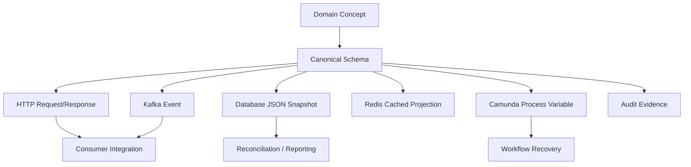
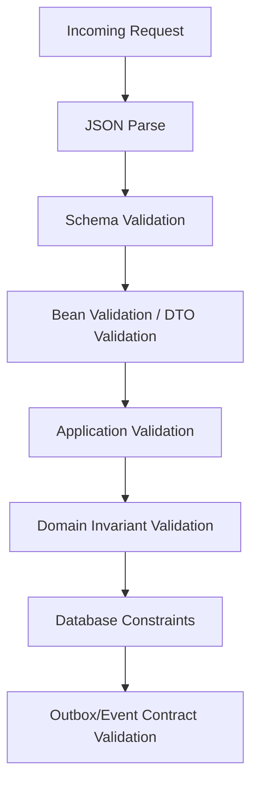

# Part 006 — Schema First Domain Contracts

Part sebelumnya membahas **OpenAPI First API Governance**. Part ini memperdalam sisi schema: bagaimana kita mendesain kontrak data secara eksplisit sebelum data bergerak melewati HTTP API, Kafka event, database boundary, Redis cache, Camunda variable, atau integration adapter.

Dalam CPQ/OMS, schema bukan hanya bentuk JSON. Schema adalah pagar agar konsep bisnis tetap konsisten:

- quote line tidak kehilangan product snapshot,
- price tidak kehilangan currency dan scale,
- order line tidak ambigu terhadap fulfillment target,
- approval decision tidak kehilangan actor dan reason,
- event replay tidak merusak consumer lama,
- Camunda process variable tidak berubah diam-diam,
- audit record tetap bisa dijelaskan bertahun-tahun kemudian.

## 1. Mental Model: Schema as Contract, Not DTO

A common mistake is treating schema as a DTO generator input. That is too shallow.

Dalam platform enterprise, schema adalah **semantic agreement**.



A schema is good when it preserves meaning across boundaries.

A schema is weak when it only makes serialization compile.

## 2. Why Schema First Matters in CPQ/OMS

CPQ/OMS has high semantic density. One field can carry significant business meaning.

Example:

```json
{
  "amount": 100
}
```

This is not enough.

Questions:

- Is it IDR, USD, EUR?
- Is it tax-inclusive?
- Is it recurring or one-time?
- Is it monthly or annual?
- Is scale fixed?
- Is rounding already applied?
- Is it list price, net price, discount, tax, or total?
- Is it recalculable or snapshot?

Schema-first design forces these questions earlier.

## 3. Kaufman Deconstruction: Skill Components

The skill in this part is: **designing schema contracts that preserve business meaning under evolution**.

| Sub-skill | What We Practice | Failure Prevented |
|---|---|---|
| Canonical concept modeling | Define reusable Money, Period, Actor, Snapshot, Decision | inconsistent payloads |
| Semantic naming | Field names reveal business meaning | ambiguous integrations |
| Validation layering | Split structural, business, and invariant validation | over-trusting JSON schema |
| Evolution planning | Additive change, deprecation, compatibility | consumer breakage |
| Snapshot discipline | Preserve historical commercial truth | audit/pricing disputes |
| Boundary-specific projection | HTTP/event/cache/process variable schemas differ intentionally | leaky abstraction |
| Contract testing | Validate producer/consumer expectations | runtime drift |

## 4. Schema Surfaces in the Platform

There are multiple schema surfaces. Do not force all of them to be identical.

| Surface | Purpose | Stability Requirement | Example |
|---|---|---|---|
| HTTP request schema | Client command input | high | `CreateQuoteRequest` |
| HTTP response schema | Client projection | high | `QuoteResponse` |
| Kafka event schema | Integration and async processing | very high | `QuoteSubmittedEvent` |
| Database table schema | Transactional persistence | internal but critical | `quote_line` |
| Database JSON snapshot | Historical evidence | very high | `price_snapshot` |
| Redis cache schema | Performance projection | medium | `QuoteSummaryCache` |
| Camunda variable schema | Workflow state handoff | high internally | `OrderOrchestrationContext` |
| Audit schema | Evidence and defensibility | very high | `AuditDecisionRecord` |

Key rule:

> A canonical concept can be shared, but boundary schemas must be allowed to differ.

For example, `Money` can be canonical. But `QuoteResponse`, `QuoteSubmittedEvent`, and `quote_price_snapshot` are different contracts.

## 5. Canonical Schema Library

Create a small canonical schema library for cross-cutting concepts.

```text
contracts/
  canonical/
    money.schema.json
    actor.schema.json
    tenant.schema.json
    period.schema.json
    audit.schema.json
    error.schema.json
    quantity.schema.json
    effective-date.schema.json
  http/
    quote-service/
      create-quote-request.schema.json
      quote-response.schema.json
  events/
    quote/
      quote-submitted.v1.schema.json
      quote-accepted.v1.schema.json
  workflow/
    order-orchestration-context.v1.schema.json
```

Keep canonical library intentionally small. If everything is canonical, nothing is.

### 5.1 Good Canonical Candidates

- Money
- Currency
- Quantity
- Time period
- Actor reference
- Tenant reference
- External reference
- Audit metadata
- Error detail
- Address/contact shape if heavily reused

### 5.2 Bad Canonical Candidates

- Entire quote aggregate
- Entire order aggregate
- Internal pricing calculation graph
- Service-specific request command
- Camunda process context
- Database row model

Those are boundary-specific and should not become shared global models.

## 6. JSON Schema Baseline

JSON Schema Draft 2020-12 is used as the baseline for standalone schemas. OpenAPI 3.1 aligns much more closely with JSON Schema than OpenAPI 3.0 did, but tool support can still vary. Therefore, the platform should define an explicit compatibility profile.

A schema should declare its dialect:

```json
{
  "$schema": "https://json-schema.org/draft/2020-12/schema",
  "$id": "https://contracts.example.com/canonical/money.schema.json",
  "title": "Money",
  "type": "object",
  "required": ["amount", "currency"],
  "properties": {
    "amount": {
      "type": "string",
      "pattern": "^-?\\d+(\\.\\d{1,6})?$"
    },
    "currency": {
      "type": "string",
      "minLength": 3,
      "maxLength": 3
    }
  },
  "additionalProperties": false
}
```

## 7. Platform Schema Profile

A schema profile is a subset of JSON Schema features the platform officially allows.

Why? Because not every generator, validator, and codegen pipeline supports every JSON Schema feature equally.

### 7.1 Allowed by Default

| Feature | Allowed | Notes |
|---|---:|---|
| `type` | yes | Required for every field unless using composition. |
| `required` | yes | Must be explicit. |
| `properties` | yes | Standard object modeling. |
| `additionalProperties` | yes | Prefer `false` unless map semantics needed. |
| `enum` | yes | Use carefully; evolution risk. |
| `pattern` | yes | Use for IDs, decimal strings, codes. |
| `minimum`/`maximum` | yes | Numeric constraints. |
| `minLength`/`maxLength` | yes | String constraints. |
| `minItems`/`maxItems` | yes | Array constraints. |
| `$ref` | yes | Prefer local/canonical references. |
| `oneOf` | controlled | Requires discriminator strategy. |
| `anyOf` | controlled | Avoid unless toolchain supports it well. |
| `allOf` | controlled | Avoid inheritance-like abuse. |

### 7.2 Restricted

| Feature | Risk |
|---|---|
| Deep recursive schemas | Codegen and validation complexity |
| Ambiguous `oneOf` | Runtime validation confusion |
| Free-form objects | Contract holes |
| Large unbounded arrays | Memory/performance risk |
| Stringly-typed generic payloads | Weak semantic contract |
| Exposing internal enum exhaustively | Consumer breakage on evolution |

## 8. Naming Rules

Schema names should encode business meaning.

Good:

```text
CreateQuoteRequest
QuoteResponse
QuoteLineResponse
PriceSnapshot
ApprovalDecision
SubmitOrderRequest
OrderSubmittedEvent
OrderLineFulfillmentState
```

Bad:

```text
QuoteDTO
RequestObject
ResponseData
Payload
StatusInfo
Item
Entity
```

### 8.1 Field Naming

Use lower camel case in JSON.

Good:

```json
{
  "quoteId": "quo_123",
  "customerId": "cus_456",
  "validUntil": "2026-07-31T23:59:59Z"
}
```

Bad:

```json
{
  "QUOTE_ID": "quo_123",
  "cust": "cus_456",
  "expiry": "2026-07-31"
}
```

### 8.2 Suffix Rules

| Suffix | Use |
|---|---|
| `Request` | HTTP input from consumer |
| `Response` | HTTP output projection |
| `Command` | internal application input, usually not external schema |
| `Event` | Kafka/event payload |
| `Snapshot` | historical immutable record |
| `Reference` | lightweight identity reference |
| `Summary` | list/search projection |
| `Context` | workflow/process handoff |
| `Record` | audit or historical evidence |

## 9. Identity Modeling

IDs should be explicit and scoped.

```json
{
  "$id": "https://contracts.example.com/canonical/entity-reference.schema.json",
  "title": "EntityReference",
  "type": "object",
  "required": ["id", "type"],
  "properties": {
    "id": {
      "type": "string",
      "minLength": 1,
      "maxLength": 128
    },
    "type": {
      "type": "string",
      "enum": ["CUSTOMER", "QUOTE", "ORDER", "PRODUCT", "ACCOUNT"]
    },
    "externalRef": {
      "type": "string",
      "maxLength": 256
    }
  },
  "additionalProperties": false
}
```

### 9.1 ID Governance Rules

1. Do not expose database sequence IDs as public IDs.
2. Public IDs should be stable and non-guessable enough for external use.
3. Tenant scoping must not rely on ID shape alone.
4. External IDs must be distinguished from internal IDs.
5. Do not overload one field to carry multiple identity types.

Bad:

```json
{
  "id": "123"
}
```

Better:

```json
{
  "quoteId": "quo_01JZ...",
  "customerId": "cus_01JZ...",
  "sourceSystemReference": {
    "system": "CRM",
    "externalId": "OPP-90210"
  }
}
```

## 10. Money Schema

Money is one of the most important canonical schemas in CPQ.

```json
{
  "$schema": "https://json-schema.org/draft/2020-12/schema",
  "$id": "https://contracts.example.com/canonical/money.schema.json",
  "title": "Money",
  "type": "object",
  "required": ["amount", "currency"],
  "properties": {
    "amount": {
      "type": "string",
      "pattern": "^-?\\d+(\\.\\d{1,6})?$",
      "description": "Decimal amount serialized as string."
    },
    "currency": {
      "type": "string",
      "minLength": 3,
      "maxLength": 3,
      "description": "ISO-like currency code such as USD, EUR, IDR."
    }
  },
  "additionalProperties": false
}
```

### 10.1 Why Not Number?

Because CPQ prices require precision and auditability. A JSON number may be parsed differently by different clients. Java can use `BigDecimal`, but JavaScript and other consumers may not preserve decimal intent in the same way.

### 10.2 Price Component Schema

A quote line rarely has one price.

```json
{
  "$id": "https://contracts.example.com/cpq/price-component.schema.json",
  "title": "PriceComponent",
  "type": "object",
  "required": ["componentType", "amount", "calculationBasis"],
  "properties": {
    "componentType": {
      "type": "string",
      "enum": ["LIST_PRICE", "DISCOUNT", "NET_PRICE", "TAX", "TOTAL"]
    },
    "amount": {
      "$ref": "../canonical/money.schema.json"
    },
    "calculationBasis": {
      "type": "string",
      "enum": ["ONE_TIME", "RECURRING_MONTHLY", "RECURRING_ANNUAL"]
    },
    "reasonCode": {
      "type": "string",
      "maxLength": 64
    }
  },
  "additionalProperties": false
}
```

## 11. Quantity and Unit Modeling

Quantity is not always just integer.

Examples:

- 3 devices,
- 1 license,
- 250 GB,
- 99.5 service units,
- 12 months commitment.

Use explicit unit when needed:

```json
{
  "$id": "https://contracts.example.com/canonical/quantity.schema.json",
  "title": "Quantity",
  "type": "object",
  "required": ["value", "unit"],
  "properties": {
    "value": {
      "type": "string",
      "pattern": "^\\d+(\\.\\d{1,6})?$"
    },
    "unit": {
      "type": "string",
      "enum": ["EACH", "GB", "MONTH", "USER", "LICENSE", "SERVICE_UNIT"]
    }
  },
  "additionalProperties": false
}
```

For line item quantity where only whole units are valid, use integer explicitly:

```json
{
  "quantity": {
    "type": "integer",
    "minimum": 1,
    "maximum": 999999
  }
}
```

Do not model every quantity as decimal just because some quantities are decimal.

## 12. Product Snapshot vs Product Reference

This is one of the most important CPQ/OMS schema distinctions.

### 12.1 Product Reference

A reference points to current catalog identity.

```json
{
  "productCode": "CLOUD_STORAGE_PRO",
  "catalogVersion": "2026-Q3"
}
```

### 12.2 Product Snapshot

A snapshot preserves what was sold/quoted at decision time.

```json
{
  "productCode": "CLOUD_STORAGE_PRO",
  "productName": "Cloud Storage Pro",
  "catalogVersion": "2026-Q3",
  "attributes": [
    {
      "code": "STORAGE_TIER",
      "label": "Storage Tier",
      "value": "PREMIUM"
    }
  ]
}
```

### 12.3 Rule

Use product reference for validation and lookup.
Use product snapshot for quote, order, audit, invoice handoff, and dispute resolution.

A quote line should not depend on a future catalog mutation to remain understandable.

## 13. Quote Schema Design

A quote response is a projection, not necessarily the internal aggregate.

```json
{
  "$id": "https://contracts.example.com/http/quote-service/quote-response.schema.json",
  "title": "QuoteResponse",
  "type": "object",
  "required": [
    "quoteId",
    "customerId",
    "status",
    "lineItems",
    "totals",
    "createdAt",
    "validUntil"
  ],
  "properties": {
    "quoteId": {
      "type": "string"
    },
    "customerId": {
      "type": "string"
    },
    "status": {
      "type": "string",
      "enum": [
        "DRAFT",
        "SUBMITTED",
        "APPROVAL_PENDING",
        "APPROVED",
        "ACCEPTED",
        "EXPIRED",
        "CANCELLED"
      ]
    },
    "lineItems": {
      "type": "array",
      "items": {
        "$ref": "quote-line-response.schema.json"
      }
    },
    "totals": {
      "$ref": "quote-totals.schema.json"
    },
    "createdAt": {
      "type": "string",
      "format": "date-time"
    },
    "validUntil": {
      "type": "string",
      "format": "date-time"
    }
  },
  "additionalProperties": false
}
```

### 13.1 Internal Aggregate Can Be Richer

The internal Java model may include:

- version for optimistic locking,
- tenant ID,
- price calculation trace,
- approval evaluation result,
- audit metadata,
- outbox publication state,
- internal lifecycle flags.

Do not expose all of it.

## 14. Quote Line Schema

```json
{
  "$id": "https://contracts.example.com/http/quote-service/quote-line-response.schema.json",
  "title": "QuoteLineResponse",
  "type": "object",
  "required": [
    "quoteLineId",
    "productSnapshot",
    "quantity",
    "priceComponents",
    "lineTotal"
  ],
  "properties": {
    "quoteLineId": {
      "type": "string"
    },
    "parentLineId": {
      "type": ["string", "null"]
    },
    "productSnapshot": {
      "$ref": "product-snapshot.schema.json"
    },
    "quantity": {
      "type": "integer",
      "minimum": 1
    },
    "priceComponents": {
      "type": "array",
      "items": {
        "$ref": "price-component.schema.json"
      }
    },
    "lineTotal": {
      "$ref": "../canonical/money.schema.json"
    }
  },
  "additionalProperties": false
}
```

### 14.1 Parent/Child Line Modeling

Bundles, add-ons, and dependent products often need line hierarchy.

Rules:

1. Child line cannot exist without parent line when dependency is mandatory.
2. Parent cancellation may cascade to dependent child lines.
3. Price may be attached to parent, child, or both depending product model.
4. Schema should expose enough relation to render UI and explain order decomposition.

## 15. Configuration Validation Schema

Configuration validation should return explainable results.

```json
{
  "$id": "https://contracts.example.com/http/configuration-service/configuration-validation-result.schema.json",
  "title": "ConfigurationValidationResult",
  "type": "object",
  "required": ["valid", "violations"],
  "properties": {
    "valid": {
      "type": "boolean"
    },
    "violations": {
      "type": "array",
      "items": {
        "$ref": "configuration-violation.schema.json"
      }
    }
  },
  "additionalProperties": false
}
```

Violation:

```json
{
  "$id": "https://contracts.example.com/http/configuration-service/configuration-violation.schema.json",
  "title": "ConfigurationViolation",
  "type": "object",
  "required": ["code", "message", "severity"],
  "properties": {
    "code": {
      "type": "string",
      "examples": ["REQUIRES_PARENT_PRODUCT", "INCOMPATIBLE_ATTRIBUTE"]
    },
    "message": {
      "type": "string"
    },
    "severity": {
      "type": "string",
      "enum": ["ERROR", "WARNING"]
    },
    "affectedLineId": {
      "type": ["string", "null"]
    },
    "affectedAttribute": {
      "type": ["string", "null"]
    }
  },
  "additionalProperties": false
}
```

Do not return only `valid: false`. The UI, salesperson, support team, and audit trail need explanation.

## 16. Approval Decision Schema

Approval decisions must be defensible.

```json
{
  "$id": "https://contracts.example.com/cpq/approval-decision.schema.json",
  "title": "ApprovalDecision",
  "type": "object",
  "required": [
    "decisionId",
    "quoteId",
    "decision",
    "actor",
    "decidedAt"
  ],
  "properties": {
    "decisionId": {
      "type": "string"
    },
    "quoteId": {
      "type": "string"
    },
    "decision": {
      "type": "string",
      "enum": ["APPROVED", "REJECTED", "RETURNED_FOR_REWORK"]
    },
    "actor": {
      "$ref": "../canonical/actor-reference.schema.json"
    },
    "reasonCode": {
      "type": "string",
      "maxLength": 64
    },
    "comment": {
      "type": "string",
      "maxLength": 4000
    },
    "decidedAt": {
      "type": "string",
      "format": "date-time"
    }
  },
  "additionalProperties": false
}
```

Rules:

1. A decision without actor is invalid.
2. A rejection should require a reason code.
3. Approval level should be traceable.
4. Delegation should be explicit if applicable.
5. Manual override must be distinguishable from normal approval.

## 17. Order Schema Design

Orders are not just accepted quotes. They are operational commitments.

```json
{
  "$id": "https://contracts.example.com/http/order-service/order-response.schema.json",
  "title": "OrderResponse",
  "type": "object",
  "required": [
    "orderId",
    "sourceQuoteId",
    "status",
    "lineItems",
    "submittedAt"
  ],
  "properties": {
    "orderId": {
      "type": "string"
    },
    "sourceQuoteId": {
      "type": "string"
    },
    "status": {
      "type": "string",
      "enum": [
        "RECEIVED",
        "IN_PROGRESS",
        "PARTIALLY_COMPLETED",
        "COMPLETED",
        "CANCELLED",
        "FAILED"
      ]
    },
    "lineItems": {
      "type": "array",
      "items": {
        "$ref": "order-line-response.schema.json"
      }
    },
    "submittedAt": {
      "type": "string",
      "format": "date-time"
    }
  },
  "additionalProperties": false
}
```

### 17.1 Header State vs Line State

Header state summarizes. Line state explains.

```json
{
  "orderId": "ord_123",
  "status": "PARTIALLY_COMPLETED",
  "lineItems": [
    {
      "orderLineId": "ol_1",
      "status": "COMPLETED"
    },
    {
      "orderLineId": "ol_2",
      "status": "MANUAL_REVIEW"
    }
  ]
}
```

Do not model only header state. OMS needs line-level truth.

## 18. Event Schema Design

Kafka event schema is a contract with stronger evolution requirements than many HTTP responses because events may be retained, replayed, and consumed by unknown future consumers.

Use event envelope:

```json
{
  "$id": "https://contracts.example.com/events/envelope.v1.schema.json",
  "title": "EventEnvelopeV1",
  "type": "object",
  "required": [
    "eventId",
    "eventType",
    "eventVersion",
    "occurredAt",
    "producer",
    "tenantId",
    "correlationId",
    "payload"
  ],
  "properties": {
    "eventId": {
      "type": "string"
    },
    "eventType": {
      "type": "string"
    },
    "eventVersion": {
      "type": "integer",
      "minimum": 1
    },
    "occurredAt": {
      "type": "string",
      "format": "date-time"
    },
    "producer": {
      "type": "string"
    },
    "tenantId": {
      "type": "string"
    },
    "correlationId": {
      "type": "string"
    },
    "causationId": {
      "type": ["string", "null"]
    },
    "payload": {
      "type": "object"
    }
  },
  "additionalProperties": false
}
```

### 18.1 QuoteSubmitted Event

```json
{
  "$id": "https://contracts.example.com/events/quote/quote-submitted.v1.schema.json",
  "title": "QuoteSubmittedEventV1",
  "type": "object",
  "required": [
    "quoteId",
    "customerId",
    "status",
    "submittedAt",
    "submittedBy",
    "totalAmount"
  ],
  "properties": {
    "quoteId": {
      "type": "string"
    },
    "customerId": {
      "type": "string"
    },
    "status": {
      "type": "string",
      "const": "SUBMITTED"
    },
    "submittedAt": {
      "type": "string",
      "format": "date-time"
    },
    "submittedBy": {
      "$ref": "../../canonical/actor-reference.schema.json"
    },
    "totalAmount": {
      "$ref": "../../canonical/money.schema.json"
    },
    "requiresApproval": {
      "type": "boolean"
    }
  },
  "additionalProperties": false
}
```

### 18.2 Event Naming Rules

Use past-tense facts:

Good:

```text
QuoteCreated
QuoteSubmitted
QuoteApproved
QuoteAccepted
OrderSubmitted
OrderLineCompleted
OrderCancelled
```

Bad:

```text
SubmitQuote
ProcessOrder
QuoteEvent
OrderStatusChanged
DoFulfillment
```

`OrderStatusChanged` is often too vague. Prefer business-specific facts when possible.

## 19. Command Schema vs Event Schema

A command requests a change.
An event records that a change happened.

Command:

```json
{
  "quoteId": "quo_123",
  "acceptanceChannel": "ONLINE",
  "acceptedBy": "user_456"
}
```

Event:

```json
{
  "quoteId": "quo_123",
  "orderIntentId": "ord_intent_789",
  "acceptedAt": "2026-07-02T10:15:30Z",
  "acceptedBy": {
    "actorId": "user_456",
    "actorType": "USER"
  },
  "commercialSnapshotHash": "sha256:..."
}
```

Do not publish command payload as event payload. Events need enough historical fact to be useful without re-calling the source service.

## 20. Database JSON Snapshot Schema

Relational tables hold normalized transactional state. JSON snapshots hold historical evidence where structure can vary or where preserving exact commercial context matters.

Example `quote_price_snapshot` JSON:

```json
{
  "pricingPolicyVersion": "pricing-2026-q3",
  "pricedAt": "2026-07-02T10:15:30Z",
  "currency": "USD",
  "linePrices": [
    {
      "quoteLineId": "ql_1",
      "components": [
        {
          "componentType": "LIST_PRICE",
          "amount": {
            "amount": "100.00",
            "currency": "USD"
          },
          "calculationBasis": "RECURRING_MONTHLY"
        }
      ]
    }
  ]
}
```

Rules:

1. JSON snapshot schema must be versioned.
2. Store schema version with snapshot.
3. Do not mutate historical snapshot in place.
4. New reads must tolerate old snapshot versions.
5. Snapshot is not a replacement for critical relational constraints.

Possible table shape:

```sql
create table quote_price_snapshot (
    quote_id uuid not null,
    snapshot_version integer not null,
    snapshot_json jsonb not null,
    snapshot_hash text not null,
    created_at timestamptz not null,
    primary key (quote_id, snapshot_version)
);
```

## 21. Camunda Process Variable Schema

Camunda variables should not become an ungoverned object dump.

Bad:

```java
runtimeService.startProcessInstanceByKey(
    "order_orchestration",
    Map.of("order", hugeOrderObject)
);
```

Better:

```json
{
  "orderId": "ord_123",
  "tenantId": "tenant_1",
  "sourceQuoteId": "quo_456",
  "orchestrationVersion": 1,
  "linePlan": [
    {
      "orderLineId": "ol_1",
      "fulfillmentType": "DIGITAL_PROVISIONING",
      "dependsOn": []
    }
  ]
}
```

Rules:

1. Process variables should be minimal.
2. Use IDs and explicit orchestration context, not full aggregate dumps.
3. Version the process context schema.
4. Avoid storing large payloads in Camunda runtime variables.
5. Ensure variables can survive process migration/repair.

## 22. Redis Cache Schema

Redis projections are performance artifacts, but they still need schema discipline.

Example quote summary cache:

```json
{
  "quoteId": "quo_123",
  "customerId": "cus_456",
  "status": "APPROVAL_PENDING",
  "totalAmount": {
    "amount": "1200.00",
    "currency": "USD"
  },
  "validUntil": "2026-07-31T23:59:59Z",
  "cachedAt": "2026-07-02T10:15:30Z",
  "sourceVersion": 17
}
```

Rules:

1. Cache schema can be simpler than source projection.
2. Include `cachedAt` and source version when stale data matters.
3. Use TTL intentionally.
4. Do not treat cache as source of truth.
5. Cache invalidation should be tied to aggregate version/event.

## 23. Validation Layers

JSON Schema validates structure. It does not replace domain validation.



### 23.1 Structural Validation

Examples:

- field required,
- type mismatch,
- string too long,
- array empty,
- invalid enum.

### 23.2 Business Validation

Examples:

- product not orderable,
- discount exceeds allowed threshold,
- quote expired,
- invalid state transition,
- customer not eligible.

### 23.3 Invariant Validation

Examples:

- accepted quote must have immutable price snapshot,
- order cannot be submitted twice,
- order line terminal state cannot return to in-progress,
- approval decision must have actor.

### 23.4 Database Constraint

Examples:

- unique order per accepted quote,
- foreign key quote line to quote,
- check quantity > 0,
- unique idempotency key per tenant.

Do not rely on only one layer.

## 24. Schema Evolution Rules

### 24.1 Generally Compatible

- Add optional field.
- Add optional object with default absent behavior.
- Add new event type.
- Add new endpoint response metadata.
- Increase max length if downstream supports it.
- Add new nullable field if consumer tolerates it.

### 24.2 Risky or Breaking

- Remove field.
- Rename field.
- Change type.
- Change semantic meaning.
- Add required field.
- Tighten validation.
- Change enum meaning.
- Change date-time semantics.
- Change money serialization.
- Reuse event type for different payload.

### 24.3 Compatibility Matrix

| Change | HTTP Request | HTTP Response | Kafka Event | DB Snapshot |
|---|---:|---:|---:|---:|
| Add optional field | usually safe | usually safe | usually safe | safe with reader tolerance |
| Add required field | breaking | maybe safe if response only | breaking | new version needed |
| Remove field | breaking | breaking | breaking | never mutate old snapshot |
| Rename field | breaking | breaking | breaking | new version needed |
| Add enum value | risky | risky | risky | depends reader |
| Tighten max length | breaking | maybe safe | breaking | risky |
| Change number to string | breaking | breaking | breaking | new version needed |

## 25. Versioning Strategy

Use version where it communicates compatibility boundary.

| Contract | Version Location |
|---|---|
| OpenAPI document | `info.version` + URL major version |
| HTTP schema | schema ID or package version |
| Event schema | event type + event version |
| Snapshot schema | snapshot version column/field |
| Camunda context | `orchestrationVersion` |
| Redis cache projection | cache key namespace/version |

Examples:

```text
quote-submitted.v1.schema.json
quote-submitted.v2.schema.json
quote:summary:v1:{quoteId}
OrderOrchestrationContextV1
price_snapshot_version = 1
```

## 26. Schema Registry Thinking

Even if we start with JSON files in Git, think like a schema registry:

- schemas are versioned,
- schemas are immutable once released,
- producers validate before publishing,
- consumers validate in tests,
- compatibility policy is enforced,
- owner is explicit,
- deprecation is tracked.

Possible repository layout:

```text
contracts/
  schemas/
    canonical/
      money/1.0.0/schema.json
    events/
      quote-submitted/1/schema.json
      quote-accepted/1/schema.json
    http/
      quote-service/1.0.0/openapi.yaml
  compatibility/
    quote-submitted.yaml
  owners.yaml
```

## 27. Java Mapping Strategy

Do not let generated schema classes dominate domain design.

### 27.1 Boundary DTO

Generated or handwritten DTO for HTTP/event boundary.

```java
public record MoneyDto(
        String amount,
        String currency
) {}
```

### 27.2 Domain Value Object

Handwritten domain object with behavior/invariants.

```java
public final class Money {
    private final BigDecimal amount;
    private final Currency currency;

    private Money(BigDecimal amount, Currency currency) {
        this.amount = amount;
        this.currency = currency;
    }

    public static Money of(String amount, String currencyCode) {
        if (amount == null || currencyCode == null) {
            throw new DomainValidationException("Money amount and currency are required");
        }
        return new Money(new BigDecimal(amount), Currency.getInstance(currencyCode));
    }

    public Money add(Money other) {
        if (!this.currency.equals(other.currency)) {
            throw new DomainValidationException("Cannot add money with different currencies");
        }
        return new Money(this.amount.add(other.amount), this.currency);
    }
}
```

### 27.3 Mapper

```java
public final class MoneyMapper {
    public Money toDomain(MoneyDto dto) {
        return Money.of(dto.amount(), dto.currency());
    }

    public MoneyDto toDto(Money money) {
        return new MoneyDto(
                money.amount().toPlainString(),
                money.currency().getCurrencyCode()
        );
    }
}
```

The mapping layer is boring by design. Boring boundaries are good.

## 28. MyBatis and Schema Boundary

MyBatis gives explicit SQL control. That also means we must be explicit about mapping.

Bad:

```java
Map<String, Object> quote = mapper.selectQuote(id);
```

Better:

```java
public record QuoteRow(
        UUID quoteId,
        UUID tenantId,
        String status,
        long version,
        OffsetDateTime createdAt,
        OffsetDateTime updatedAt
) {}
```

For JSON snapshots:

```java
public record PriceSnapshotRow(
        UUID quoteId,
        int snapshotVersion,
        String snapshotJson,
        String snapshotHash,
        OffsetDateTime createdAt
) {}
```

Rules:

1. SQL row model is not API response model.
2. JSON snapshot should validate against schema before insert.
3. Snapshot version should be persisted.
4. Type handlers can help but must not hide semantics.
5. Avoid storing arbitrary unvalidated maps.

## 29. Event Producer Validation

Before publishing event:

1. Build domain event.
2. Map to event payload schema.
3. Validate payload against schema.
4. Store in outbox with schema version.
5. Publisher sends serialized event.


Outbox row should include:

```text
event_id
event_type
event_version
aggregate_type
aggregate_id
payload_json
payload_schema_id
occurred_at
published_at
```

## 30. Consumer Tolerance

Consumers should be tolerant readers.

They should:

- ignore unknown fields,
- not assume enum exhaustiveness unless explicitly versioned,
- handle absent optional fields,
- validate required fields,
- fail safely on unsupported event version,
- route poison messages to dead-letter/retry handling.

But producer should not abuse tolerant consumers. Governance still matters.

## 31. Schema-First Test Strategy

### 31.1 Contract Validation Test

Validate sample payloads against schema.

```java
@Test
void quoteSubmittedEvent_shouldMatchSchema() {
    String payload = fixture("events/quote-submitted.valid.json");
    schemaValidator.validate("quote-submitted.v1.schema.json", payload);
}
```

### 31.2 Negative Fixture Test

```java
@Test
void quoteSubmittedEvent_withoutQuoteId_shouldFailSchema() {
    String payload = fixture("events/quote-submitted.missing-quote-id.json");
    assertThatThrownBy(() -> schemaValidator.validate("quote-submitted.v1.schema.json", payload))
            .hasMessageContaining("quoteId");
}
```

### 31.3 Golden Master Pricing Snapshot

For pricing, schema correctness is not enough. We need deterministic calculation fixtures.

```text
pricing-fixtures/
  simple-bundle/input.json
  simple-bundle/expected-price-snapshot.json
  tiered-discount/input.json
  tiered-discount/expected-price-snapshot.json
```

### 31.4 Backward Compatibility Test

Old payloads must remain readable.

```text
compatibility-fixtures/
  quote-submitted/v1/payload-2026-01.json
  quote-submitted/v1/payload-2026-03.json
  quote-submitted/v2/payload-2026-07.json
```

## 32. Schema Review Checklist

### 32.1 Semantic Review

- Does each field have clear business meaning?
- Is it reference or snapshot?
- Is the owner service clear?
- Is tenant scope clear?
- Is actor identity clear?
- Is time semantic explicit?
- Is monetary precision safe?

### 32.2 Evolution Review

- Can this schema add fields later?
- Are enums safe?
- Are required fields minimal?
- Are optional fields documented?
- Is null meaningful or just accidental?
- Is version stored/published?

### 32.3 Boundary Review

- Is this schema for HTTP, event, database snapshot, cache, or workflow?
- Is the boundary-specific shape justified?
- Are internal details hidden?
- Are external references explicit?
- Is schema validation automated?

### 32.4 Operational Review

- Can this payload be logged safely?
- Does it contain PII?
- Does it need redaction?
- Can support identify aggregate and correlation ID?
- Can replay/reconciliation use it?
- Can audit explain the decision later?

## 33. Anti-Patterns

### 33.1 One Global Quote DTO

Bad:

```text
QuoteDTO used by:
- HTTP API
- Kafka event
- database JSON
- Redis cache
- Camunda variable
- audit log
```

Why bad:

- one consumer's need pollutes all surfaces,
- internal fields leak externally,
- evolution becomes impossible,
- cache fields become public contract accidentally,
- process migration becomes fragile.

Better:

```text
QuoteResponse
QuoteSubmittedEventV1
QuotePriceSnapshotV1
QuoteSummaryCacheV1
OrderOrchestrationContextV1
QuoteAuditRecord
```

### 33.2 Free-Form Metadata Everywhere

Bad:

```json
{
  "metadata": {
    "anything": "goes"
  }
}
```

Sometimes extension maps are needed. But they must be scoped.

Better:

```json
{
  "externalAttributes": {
    "type": "object",
    "additionalProperties": {
      "type": "string",
      "maxLength": 512
    },
    "description": "String-only external attributes used for partner-specific routing. Not used for pricing or lifecycle decisions."
  }
}
```

### 33.3 Null Without Meaning

Bad:

```json
{
  "approvedAt": null
}
```

Does null mean not approved, approval not required, unknown, or hidden?

Better:

```json
{
  "approvalStatus": "NOT_REQUIRED"
}
```

or:

```json
{
  "approval": {
    "required": false,
    "status": "NOT_REQUIRED"
  }
}
```

### 33.4 Event Payload Too Thin

Bad:

```json
{
  "quoteId": "quo_123"
}
```

This forces every consumer to call back to quote-service, creating temporal coupling.

Better:

```json
{
  "quoteId": "quo_123",
  "customerId": "cus_456",
  "submittedAt": "2026-07-02T10:15:30Z",
  "totalAmount": {
    "amount": "1200.00",
    "currency": "USD"
  },
  "requiresApproval": true
}
```

## 34. Practice Lab

Build schema contracts for the initial platform.

### 34.1 Create Canonical Schemas

```text
contracts/canonical/money.schema.json
contracts/canonical/actor-reference.schema.json
contracts/canonical/entity-reference.schema.json
contracts/canonical/quantity.schema.json
contracts/canonical/audit-metadata.schema.json
```

### 34.2 Create Quote HTTP Schemas

```text
contracts/http/quote-service/create-quote-request.schema.json
contracts/http/quote-service/quote-response.schema.json
contracts/http/quote-service/quote-line-response.schema.json
contracts/http/quote-service/quote-totals.schema.json
```

### 34.3 Create Event Schemas

```text
contracts/events/quote/quote-created.v1.schema.json
contracts/events/quote/quote-submitted.v1.schema.json
contracts/events/quote/quote-accepted.v1.schema.json
```

### 34.4 Create Workflow Schema

```text
contracts/workflow/order-orchestration-context.v1.schema.json
```

### 34.5 Acceptance Criteria

- Money is never JSON number.
- Every schema has `$id` and `$schema` where standalone.
- Every event has envelope metadata.
- Quote response uses product snapshot, not product reference only.
- Approval decision includes actor and time.
- Order response has line-level state.
- Additional properties are rejected unless extension map is intentional.
- Schema versioning strategy is explicit.
- Old event fixture can still be validated/read.

## 35. Production Readiness Signals

A schema system is mature when:

1. Every boundary schema has an owner.
2. Every released event schema is immutable.
3. HTTP schemas and event schemas are not accidentally identical.
4. Canonical schemas are small and stable.
5. Money, time, actor, tenant, and audit metadata are consistent.
6. Snapshot schemas preserve historical truth.
7. Camunda variable schemas are versioned and minimal.
8. Redis cache schemas include staleness/version metadata where needed.
9. Schema validation exists in tests and producer paths.
10. Compatibility breakage is caught before deployment.

## 36. Key Takeaways

- Schema-first design protects business meaning across distributed boundaries.
- Canonical schemas should exist, but only for stable cross-cutting concepts.
- HTTP, event, database snapshot, cache, workflow, and audit schemas have different purposes.
- Money must be modeled precisely.
- Product snapshot and product reference are different concepts.
- Commands and events must not reuse payloads blindly.
- Camunda variables need schema discipline to support recovery and migration.
- Schema evolution requires explicit compatibility rules, not hope.
- Generated DTOs are boundary artifacts, not domain models.

## 37. Reference Baseline

- JSON Schema Draft 2020-12 is the standalone schema baseline.
- OpenAPI 3.1.x aligns with JSON Schema much better than OpenAPI 3.0.x, but platform tooling support should still be governed explicitly.
- Later parts will connect these schemas to Jersey resource adapters, MyBatis persistence, Kafka outbox publishing, Redis projections, and Camunda 7 orchestration.

