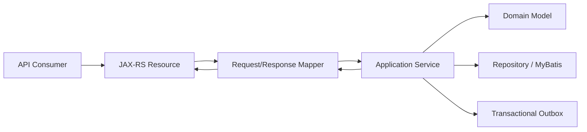
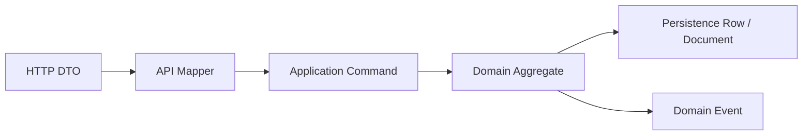
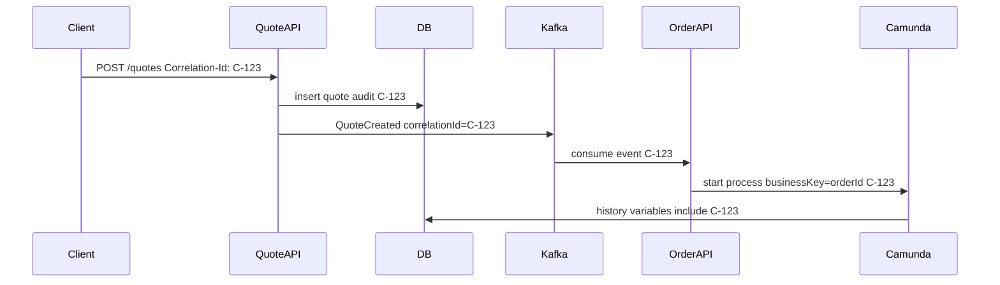
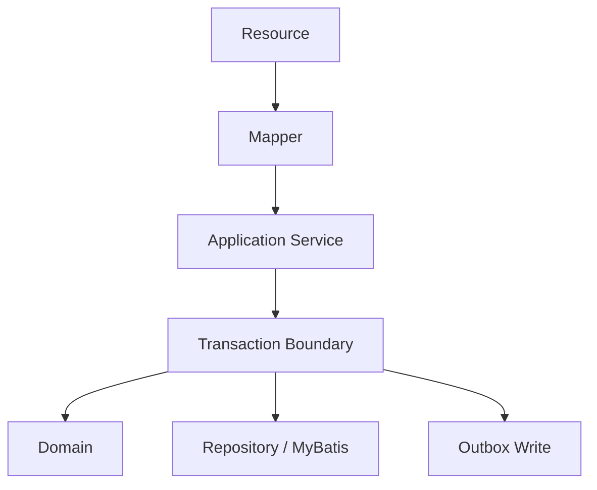

# Part 007 — JAX-RS and Jersey Service Foundation

## 1. Tujuan Part Ini

Pada part sebelumnya kita sudah membangun kontrak API dan schema-first contracts. Sekarang kita masuk ke lapisan implementasi HTTP service menggunakan **JAX-RS/Jakarta REST** dan **Jersey**.

Target part ini bukan sekadar membuat endpoint:

```java
@GET
@Path("/quotes/{quoteId}")
public QuoteResponse getQuote(@PathParam("quoteId") UUID quoteId) { ... }
```

Itu terlalu dangkal. Untuk platform CPQ/OMS, HTTP layer adalah **contract enforcement boundary**. Di sinilah request dari dunia luar harus diterjemahkan menjadi command/query internal yang aman, valid, idempotent, observable, dan dapat diaudit.

Part ini akan membangun service foundation yang bisa dipakai oleh service seperti:

- `catalog-service`
- `configuration-service`
- `pricing-service`
- `quote-service`
- `approval-service`
- `order-service`
- `orchestration-adapter-service`
- `audit-service`

Kita akan fokus pada:

1. mental model JAX-RS/Jersey sebagai adapter layer;
2. struktur resource class yang tidak bocor ke domain;
3. request/response mapping;
4. validation dan error model;
5. filters untuk correlation, idempotency, auth context, dan observability;
6. exception mapping yang konsisten dengan OpenAPI;
7. transaction boundary;
8. test strategy untuk API layer;
9. failure modes yang sering muncul di enterprise CPQ/OMS.

Jakarta REST adalah spesifikasi API berbasis anotasi untuk membangun RESTful web services. Jersey adalah salah satu implementasi yang umum dipakai untuk menjalankan resource, provider, filter, dan extension point JAX-RS/Jakarta REST. Dalam seri ini, kita memperlakukan Jersey sebagai **HTTP runtime adapter**, bukan sebagai tempat logika bisnis.

---

## 2. Mental Model: HTTP Layer Bukan Domain Layer

Kesalahan umum dalam microservice Java adalah menganggap resource class sebagai service bisnis.

Contoh buruk:

```java
@Path("/quotes")
public class QuoteResource {

    @POST
    public Response createQuote(CreateQuoteRequest request) {
        // validate product
        // calculate price
        // insert quote
        // call approval
        // publish kafka event
        // build response
    }
}
```

Kode seperti ini mudah dibuat, tetapi rusak secara arsitektur. Resource class menjadi tempat semua hal: validasi, orchestration, persistence, eventing, audit, dan error handling.

Model yang lebih baik:



Boundary rule:

> JAX-RS resource menerima HTTP, menerapkan contract-level concerns, lalu mendelegasikan command/query ke application service. Ia tidak memutuskan business truth.

Resource class boleh melakukan:

- membaca path/query/header/body;
- memanggil validator;
- membentuk command/query object;
- mengambil request context;
- memanggil application service;
- mengubah result menjadi response DTO;
- memilih HTTP status sesuai kontrak;
- membiarkan exception mapper menangani error.

Resource class tidak boleh:

- menulis SQL langsung;
- mengakses Kafka producer langsung;
- menjalankan BPMN process langsung tanpa application boundary;
- membuat pricing rule;
- memodifikasi aggregate internal secara bebas;
- menangkap semua exception dan mengembalikan `500` generik;
- membangun business audit sendiri tanpa domain/application service.

---

## 3. Version dan Compatibility Strategy

Karena seri ini build-from-scratch pada 2026, baseline modern yang masuk akal adalah:

| Layer | Modern Baseline | Catatan |
|---|---:|---|
| Java | 21 LTS atau minimal 17 LTS | Java 21 lebih baik untuk platform baru; Java 17 mungkin lebih aman untuk enterprise compatibility. |
| Jakarta REST | 4.0 jika target Jakarta EE 11 | Jakarta REST 4.0 adalah bagian dari Jakarta EE 11. |
| Jersey | 4.x untuk Jakarta EE 11 | Jersey 4.0.x adalah jalur terbaru yang kompatibel dengan Jakarta REST 4.0. |
| Alternative compatibility | Jakarta REST 3.1 + Jersey 3.x | Pilih ini jika runtime masih di Jakarta EE 10 / Java 17-only enterprise stack. |
| Camunda 7 integration | separate adapter boundary | Jangan membuat JAX-RS services tergantung langsung pada engine internals. |

Important nuance:

> Jangan memilih versi JAX-RS/Jersey hanya karena “latest”. Pilih versi berdasarkan runtime, container, Java version, dependency graph, dan security support.

Jika perusahaan masih menjalankan stack Java 17 + Jakarta EE 10, `jakarta.ws.rs-api:3.1.x` dan Jersey 3.x bisa lebih aman. Jika platform baru mengarah ke Jakarta EE 11, Jersey 4.x masuk akal. Untuk materi ini, konsep arsitekturnya sama; perbedaan utamanya ada pada dependency version dan beberapa perubahan ecosystem.

---

## 4. Service Foundation Layout

Kita ingin setiap service punya struktur konsisten, tetapi tidak menyalin logika boilerplate berulang secara membabi buta.

Contoh module layout untuk `quote-service`:

```text
quote-service/
  pom.xml
  src/main/java/com/acme/cpq/quote/
    QuoteServiceApplication.java
    api/
      QuoteResource.java
      QuoteLineResource.java
      QuoteApprovalResource.java
      dto/
        CreateQuoteRequest.java
        CreateQuoteResponse.java
        QuoteResponse.java
        SubmitQuoteRequest.java
      mapper/
        QuoteApiMapper.java
    app/
      QuoteApplicationService.java
      command/
        CreateQuoteCommand.java
        SubmitQuoteCommand.java
      query/
        GetQuoteQuery.java
      result/
        CreateQuoteResult.java
    domain/
      Quote.java
      QuoteLine.java
      QuoteStatus.java
      Money.java
      QuotePolicy.java
    infra/
      persistence/
        QuoteRepository.java
        mybatis/
          QuoteMapper.java
      event/
        QuoteOutboxWriter.java
      idempotency/
        IdempotencyRepository.java
    platform/
      http/
        ErrorResponseMapper.java
        CorrelationFilter.java
        RequestContextFilter.java
        ValidationExceptionMapper.java
```

Dalam multi-service repository, ada dua pilihan:

1. membuat `platform-http` module bersama;
2. menyalin foundation minimal ke setiap service.

Untuk enterprise platform, pilihan terbaik biasanya hybrid:

- shared module hanya untuk primitive platform yang benar-benar stabil;
- service-specific code tetap berada di service;
- tidak ada shared domain object antar service.

Shared module boleh berisi:

- `ProblemDetails` response model;
- `CorrelationId` utilities;
- base exception mapper;
- request context abstraction;
- common validation helpers;
- Jackson configuration;
- health check primitives;
- OpenTelemetry filter wiring.

Shared module tidak boleh berisi:

- `QuoteStatus`;
- `OrderStatus`;
- `ProductOffering`;
- pricing rule;
- approval policy;
- MyBatis mapper untuk domain service lain;
- Kafka topic enum yang memaksa semua service deploy bersama.

---

## 5. Minimal Jersey Application Bootstrap

Jersey service biasanya dimulai dengan `ResourceConfig`.

```java
package com.acme.cpq.quote;

import com.acme.cpq.quote.api.QuoteResource;
import com.acme.cpq.quote.platform.http.CorrelationFilter;
import com.acme.cpq.quote.platform.http.ErrorResponseMapper;
import jakarta.ws.rs.ApplicationPath;
import org.glassfish.jersey.server.ResourceConfig;

@ApplicationPath("/api")
public final class QuoteServiceApplication extends ResourceConfig {

    public QuoteServiceApplication() {
        register(QuoteResource.class);
        register(CorrelationFilter.class);
        register(ErrorResponseMapper.class);
        register(ObjectMapperProvider.class);
        register(ValidationExceptionMapper.class);
    }
}
```

Namun untuk production service, bootstrap tidak boleh hanya daftar class. Ia harus eksplisit menjawab:

- provider apa yang aktif;
- format JSON apa yang dipakai;
- bagaimana exception dikonversi;
- bagaimana correlation ID dibuat;
- bagaimana auth principal dibaca;
- bagaimana request logging dikontrol;
- bagaimana metrics/tracing di-hook;
- bagaimana dependency injection dilakukan;
- bagaimana lifecycle resource dikelola.

Jersey dapat dikombinasikan dengan HK2, CDI, atau manual factory. Untuk platform yang ingin sederhana dan testable, jangan langsung menyembunyikan dependency graph terlalu dalam.

Contoh resource dengan constructor injection:

```java
@Path("/v1/quotes")
@Consumes(MediaType.APPLICATION_JSON)
@Produces(MediaType.APPLICATION_JSON)
public final class QuoteResource {

    private final QuoteApplicationService quoteService;
    private final QuoteApiMapper mapper;

    public QuoteResource(QuoteApplicationService quoteService, QuoteApiMapper mapper) {
        this.quoteService = quoteService;
        this.mapper = mapper;
    }

    @POST
    public Response createQuote(
            @HeaderParam("Idempotency-Key") String idempotencyKey,
            @Valid CreateQuoteRequest request,
            @Context SecurityContext securityContext,
            @Context HttpHeaders headers) {

        CreateQuoteCommand command = mapper.toCreateCommand(
                request,
                RequestActor.from(securityContext),
                IdempotencyKey.required(idempotencyKey),
                RequestMetadata.from(headers));

        CreateQuoteResult result = quoteService.createQuote(command);

        URI location = URI.create("/api/v1/quotes/" + result.quoteId());
        return Response.created(location)
                .entity(mapper.toCreateResponse(result))
                .build();
    }
}
```

Perhatikan pola penting:

- header idempotency dibaca di resource;
- requirement idempotency dipaksakan sebelum application service;
- resource tidak menghitung price;
- resource tidak tahu cara persist quote;
- resource tidak publish event;
- `Response.created` dipilih karena kontrak create resource;
- DTO output dibentuk oleh mapper.

---

## 6. Resource Design Untuk CPQ/OMS

HTTP API CPQ/OMS harus jelas membedakan:

- resource API;
- command API;
- query API;
- decision API;
- workflow action API.

Tidak semua operasi harus dipaksakan menjadi CRUD.

### 6.1 Catalog API

Catalog relatif cocok sebagai resource/query API:

```text
GET /v1/product-offerings
GET /v1/product-offerings/{offeringId}
GET /v1/product-offerings/{offeringId}/configuration-schema
POST /v1/catalog-publications
```

Catalog publication adalah command, bukan update biasa. Karena publikasi catalog mengubah visibility dan mungkin memengaruhi konfigurasi/pricing downstream.

### 6.2 Configuration API

Configuration engine biasanya decision API:

```text
POST /v1/configurations/validate
POST /v1/configurations/explain
POST /v1/configurations/complete
```

Kenapa `POST` untuk validate? Karena request body bisa kompleks, tidak idempotent secara HTTP cache semantics, dan hasilnya tergantung versi catalog/pricing context.

### 6.3 Pricing API

Pricing juga decision API:

```text
POST /v1/prices/calculate
POST /v1/prices/explain
```

Pricing API harus deterministic untuk input yang sama. Kalau hasil pricing berubah karena waktu, catalog version, customer segment, atau campaign, itu harus terlihat dalam request context atau response metadata.

### 6.4 Quote API

Quote punya resource plus command actions:

```text
POST /v1/quotes
GET /v1/quotes/{quoteId}
PATCH /v1/quotes/{quoteId}
POST /v1/quotes/{quoteId}/lines
DELETE /v1/quotes/{quoteId}/lines/{lineId}
POST /v1/quotes/{quoteId}/submit
POST /v1/quotes/{quoteId}/accept
POST /v1/quotes/{quoteId}/expire
POST /v1/quotes/{quoteId}/clone
```

`submit`, `accept`, dan `expire` bukan CRUD. Itu state transition. Buat eksplisit.

### 6.5 Order API

Order API harus sangat hati-hati karena mengubah sistem downstream:

```text
POST /v1/orders
GET /v1/orders/{orderId}
GET /v1/orders/{orderId}/lines
POST /v1/orders/{orderId}/cancel
POST /v1/orders/{orderId}/resume
POST /v1/orders/{orderId}/repair-actions
```

Repair actions biasanya internal/operator API, bukan public API.

---

## 7. DTO, Command, Domain: Tiga Bahasa Berbeda

Jangan memakai satu class untuk semua layer.



### 7.1 HTTP DTO

HTTP DTO mengikuti OpenAPI schema. Ia harus stabil untuk consumer.

```java
public record CreateQuoteRequest(
        String customerId,
        String salesChannel,
        List<CreateQuoteLineRequest> lines,
        String currency,
        Map<String, String> attributes
) {}
```

DTO boleh punya string karena berasal dari JSON. Tetapi jangan biarkan string mentah masuk domain.

### 7.2 Application Command

Command adalah intent internal yang sudah divalidasi secara structural.

```java
public record CreateQuoteCommand(
        CustomerId customerId,
        SalesChannel salesChannel,
        List<CreateQuoteLineCommand> lines,
        CurrencyCode currency,
        IdempotencyKey idempotencyKey,
        RequestActor actor,
        RequestMetadata metadata
) {}
```

### 7.3 Domain Aggregate

Domain aggregate menjaga invariant.

```java
public final class Quote {

    private final QuoteId id;
    private QuoteStatus status;
    private final List<QuoteLine> lines;
    private Money totalPrice;
    private long version;

    public void submit(Clock clock, QuotePolicy policy) {
        if (status != QuoteStatus.DRAFT) {
            throw new InvalidQuoteTransition(id, status, QuoteStatus.SUBMITTED);
        }
        if (lines.isEmpty()) {
            throw new QuoteMustHaveAtLeastOneLine(id);
        }
        if (!policy.isSubmittable(this)) {
            throw new QuotePolicyViolation(id, "Quote is not submittable");
        }
        this.status = QuoteStatus.SUBMITTED;
    }
}
```

The rule:

> DTO validates shape. Command validates intent. Domain validates truth.

---

## 8. Request Validation Strategy

Validation harus berlapis.

| Layer | Contoh Validasi | Failure Response |
|---|---|---|
| HTTP parsing | malformed JSON | `400 Bad Request` |
| Schema/Bean validation | missing field, invalid enum shape | `400 Bad Request` |
| Application validation | idempotency key missing, unsupported actor | `400/401/403` |
| Domain validation | invalid quote transition | `409 Conflict` |
| Business policy validation | discount needs approval | `422 Unprocessable Entity` atau domain-specific response |
| Dependency validation | product not found | `404` atau `422` tergantung konteks |

Jangan menyamakan semua validasi menjadi `400`.

### 8.1 Bean Validation Untuk Shape

```java
public record CreateQuoteRequest(
        @NotBlank String customerId,
        @NotBlank String salesChannel,
        @NotEmpty List<@Valid CreateQuoteLineRequest> lines,
        @Pattern(regexp = "^[A-Z]{3}$") String currency
) {}
```

Bagus untuk:

- required field;
- string length;
- numeric min/max;
- collection size;
- simple pattern.

Buruk untuk:

- product compatibility;
- pricing eligibility;
- quote status transition;
- tenant ownership;
- approval policy.

### 8.2 Domain Validation Harus Tetap di Domain

Contoh anti-pattern:

```java
if (!quote.status().equals("DRAFT")) {
    return Response.status(400).build();
}
```

Masalah:

- status dibanding string;
- domain rule bocor ke resource;
- HTTP code salah;
- error tidak punya reason code;
- audit trail kemungkinan hilang.

Lebih baik:

```java
try {
    result = quoteService.submitQuote(command);
} catch (InvalidQuoteTransition e) {
    throw e; // mapped by ExceptionMapper
}
```

---

## 9. Standard Error Contract

Part 005 sudah menetapkan error model. Di JAX-RS layer kita harus mengimplementasikan mapping-nya secara konsisten.

Gunakan model mirip RFC 7807/Problem Details, tetapi disesuaikan untuk platform.

```json
{
  "type": "https://api.acme.local/problems/invalid-state-transition",
  "title": "Invalid state transition",
  "status": 409,
  "code": "QUOTE_INVALID_STATE_TRANSITION",
  "detail": "Quote Q-123 cannot transition from ACCEPTED to SUBMITTED.",
  "correlationId": "01JZ2VMBH7T8VM5M4HPZPF7T5J",
  "violations": [
    {
      "field": "status",
      "reason": "Expected DRAFT but was ACCEPTED"
    }
  ]
}
```

### 9.1 Exception Hierarchy

```java
public abstract class PlatformException extends RuntimeException {
    private final String code;
    private final int httpStatus;

    protected PlatformException(String code, int httpStatus, String message) {
        super(message);
        this.code = code;
        this.httpStatus = httpStatus;
    }

    public String code() {
        return code;
    }

    public int httpStatus() {
        return httpStatus;
    }
}
```

Domain exception example:

```java
public final class InvalidQuoteTransition extends PlatformException {
    public InvalidQuoteTransition(QuoteId quoteId, QuoteStatus from, QuoteStatus to) {
        super(
            "QUOTE_INVALID_STATE_TRANSITION",
            409,
            "Quote " + quoteId.value() + " cannot transition from " + from + " to " + to
        );
    }
}
```

### 9.2 Exception Mapper

```java
@Provider
public final class PlatformExceptionMapper implements ExceptionMapper<PlatformException> {

    @Context
    private HttpHeaders headers;

    @Override
    public Response toResponse(PlatformException exception) {
        ProblemResponse problem = ProblemResponse.from(
                exception,
                Correlation.currentId());

        return Response.status(exception.httpStatus())
                .type(MediaType.APPLICATION_JSON_TYPE)
                .entity(problem)
                .build();
    }
}
```

### 9.3 Validation Exception Mapper

```java
@Provider
public final class ConstraintViolationExceptionMapper
        implements ExceptionMapper<ConstraintViolationException> {

    @Override
    public Response toResponse(ConstraintViolationException exception) {
        List<FieldViolation> violations = exception.getConstraintViolations()
                .stream()
                .map(v -> new FieldViolation(
                        v.getPropertyPath().toString(),
                        v.getMessage()))
                .toList();

        ProblemResponse problem = ProblemResponse.validationFailed(
                "REQUEST_VALIDATION_FAILED",
                "Request validation failed",
                400,
                Correlation.currentId(),
                violations);

        return Response.status(Response.Status.BAD_REQUEST)
                .entity(problem)
                .build();
    }
}
```

### 9.4 Catch-All Mapper

Catch-all mapper harus ada, tetapi jangan bocorkan detail internal.

```java
@Provider
public final class UnhandledExceptionMapper implements ExceptionMapper<Throwable> {

    private static final Logger log = LoggerFactory.getLogger(UnhandledExceptionMapper.class);

    @Override
    public Response toResponse(Throwable exception) {
        String correlationId = Correlation.currentId();

        log.error("Unhandled API exception. correlationId={}", correlationId, exception);

        ProblemResponse problem = ProblemResponse.internalError(
                "INTERNAL_SERVER_ERROR",
                "Internal server error",
                500,
                correlationId);

        return Response.status(Response.Status.INTERNAL_SERVER_ERROR)
                .entity(problem)
                .build();
    }
}
```

Critical rule:

> Log internal exception detail server-side, return stable problem code client-side.

---

## 10. Correlation ID Filter

Distributed CPQ/OMS failure investigation requires correlation IDs from first HTTP hop to Kafka event to Camunda process to SQL audit row.



### 10.1 Filter Implementation

```java
@Provider
@Priority(Priorities.AUTHENTICATION - 100)
public final class CorrelationFilter implements ContainerRequestFilter, ContainerResponseFilter {

    public static final String HEADER = "Correlation-Id";

    @Override
    public void filter(ContainerRequestContext requestContext) {
        String inbound = requestContext.getHeaderString(HEADER);
        String correlationId = CorrelationIdPolicy.normalizeOrGenerate(inbound);

        Correlation.setCurrentId(correlationId);
        requestContext.setProperty("correlationId", correlationId);
    }

    @Override
    public void filter(ContainerRequestContext requestContext,
                       ContainerResponseContext responseContext) {
        String correlationId = (String) requestContext.getProperty("correlationId");
        if (correlationId != null) {
            responseContext.getHeaders().putSingle(HEADER, correlationId);
        }
        Correlation.clear();
    }
}
```

Use `ThreadLocal` carefully. It is acceptable for request-scoped synchronous processing, but dangerous with async execution or thread pools unless context propagation is explicit.

Better abstraction:

```java
public record RequestContext(
        String correlationId,
        String tenantId,
        RequestActor actor,
        Instant receivedAt,
        String sourceIp,
        String userAgent
) {}
```

Then pass `RequestContext` into application command.

---

## 11. Idempotency Key Handling

CPQ/OMS command APIs must be idempotent because clients retry, load balancers retry, networks fail, and humans double-click.

Commands that should require idempotency:

- create quote;
- submit quote;
- accept quote;
- create order;
- cancel order;
- approve/reject approval task;
- start orchestration;
- repair action.

### 11.1 Idempotency Semantics

Idempotency key should be scoped by:

- tenant;
- actor/client;
- endpoint/operation;
- request fingerprint.

Bad design:

```text
idempotency_key unique globally
```

Better:

```sql
unique(tenant_id, actor_id, operation, idempotency_key)
```

Include request fingerprint to detect conflicting reuse.

```sql
create table api_idempotency_record (
    id bigserial primary key,
    tenant_id uuid not null,
    actor_id text not null,
    operation text not null,
    idempotency_key text not null,
    request_fingerprint text not null,
    response_status integer,
    response_body jsonb,
    resource_id text,
    state text not null,
    created_at timestamptz not null default now(),
    completed_at timestamptz,
    unique (tenant_id, actor_id, operation, idempotency_key)
);
```

### 11.2 Where To Enforce It

Resource layer can require header presence. Application service should own actual idempotency semantics because it must participate in transaction and business command execution.

```java
@POST
public Response createQuote(@HeaderParam("Idempotency-Key") String key,
                            @Valid CreateQuoteRequest request) {
    IdempotencyKey idempotencyKey = IdempotencyKey.required(key);
    CreateQuoteCommand command = mapper.toCommand(request, idempotencyKey, RequestContext.current());
    CreateQuoteResult result = quoteService.createQuote(command);
    return Response.status(result.wasReplayed() ? 200 : 201)
            .entity(mapper.toResponse(result))
            .build();
}
```

Important distinction:

- first successful create returns `201 Created`;
- replayed same request may return stored `201` or normalized `200`, depending contract;
- conflicting reuse returns `409 Conflict`.

Make this explicit in OpenAPI.

---

## 12. Authentication and Authorization Boundary

Part ini tidak membangun full security stack, tetapi JAX-RS layer harus punya tempat yang jelas untuk auth context.

Minimal security context:

```java
public record RequestActor(
        String actorId,
        ActorType actorType,
        String tenantId,
        Set<String> roles,
        Set<String> permissions
) {}
```

Resource boleh membaca `SecurityContext`, tetapi authorization decision sebaiknya ada di application/policy layer.

Contoh:

```java
public SubmitQuoteResult submitQuote(SubmitQuoteCommand command) {
    authorization.require(command.actor(), Permission.SUBMIT_QUOTE, command.quoteId());

    Quote quote = quoteRepository.getForUpdate(command.quoteId());
    quote.submit(clock, quotePolicy);
    quoteRepository.save(quote);
    outbox.write(QuoteSubmittedEvent.from(quote, command.context()));

    return SubmitQuoteResult.from(quote);
}
```

Kenapa bukan di resource?

Karena authorization untuk CPQ/OMS sering bergantung pada:

- quote owner;
- sales region;
- discount threshold;
- approval delegation;
- tenant;
- order state;
- customer risk segment;
- source channel.

Resource layer tidak boleh mengambil semua data ini hanya untuk auth.

---

## 13. Content Negotiation dan JSON Policy

CPQ/OMS API harus stabil. Jangan biarkan serializer default menentukan kontrak.

### 13.1 Jackson ObjectMapper Provider

```java
@Provider
public final class ObjectMapperProvider implements ContextResolver<ObjectMapper> {

    private final ObjectMapper mapper;

    public ObjectMapperProvider() {
        this.mapper = JsonMapper.builder()
                .addModule(new JavaTimeModule())
                .disable(SerializationFeature.WRITE_DATES_AS_TIMESTAMPS)
                .disable(DeserializationFeature.ADJUST_DATES_TO_CONTEXT_TIME_ZONE)
                .enable(DeserializationFeature.FAIL_ON_TRAILING_TOKENS)
                .build();
    }

    @Override
    public ObjectMapper getContext(Class<?> type) {
        return mapper;
    }
}
```

Recommended policy:

| Concern | Rule |
|---|---|
| Time | Use ISO-8601 with offset or UTC instant. |
| Money | Use decimal string or structured object; avoid floating point. |
| Unknown fields | Decide per API maturity. Strict for commands, tolerant for events/read models. |
| Null fields | Avoid ambiguous null; prefer omitted optional fields or explicit nullable schema. |
| Enum evolution | Use explicit unknown handling for consumers. |
| BigDecimal | Preserve precision; never serialize as binary float. |

### 13.2 Unknown Fields Policy

For command APIs, strict unknown-field rejection can catch client bugs early.

For long-lived public APIs, strict rejection may harm forward compatibility.

Practical compromise:

- internal command APIs: reject unknown fields;
- public/partner APIs: tolerate unknown fields but log contract drift;
- event consumers: tolerate unknown fields;
- generated clients: regenerate on versioned contract changes.

---

## 14. Pagination and Query Resource Pattern

Query endpoints must be designed deliberately.

Bad:

```text
GET /v1/quotes?customerId=...&status=...&page=1&size=999999
```

Problems:

- offset pagination breaks under concurrent writes;
- large size causes memory pressure;
- no deterministic ordering;
- ambiguous status semantics;
- no tenant constraint shown.

Better:

```text
GET /v1/quotes?customerId=C-123&status=SUBMITTED&limit=50&pageToken=eyJ...
```

Response:

```json
{
  "items": [],
  "nextPageToken": "eyJjdXJzb3IiOiIyMDI2LTA3LTAyVDEwOjE1OjAwWiJ9",
  "sort": "createdAt:desc,quoteId:desc"
}
```

Resource implementation:

```java
@GET
public QuoteSearchResponse searchQuotes(
        @QueryParam("customerId") String customerId,
        @QueryParam("status") QuoteStatus status,
        @DefaultValue("50") @QueryParam("limit") int limit,
        @QueryParam("pageToken") String pageToken) {

    SearchQuotesQuery query = QuoteSearchQueryParser.parse(
            customerId,
            status,
            limit,
            pageToken,
            RequestContext.current());

    return mapper.toSearchResponse(quoteService.searchQuotes(query));
}
```

Pagination invariant:

> Every search endpoint must define a stable sort order and a maximum page size.

---

## 15. Partial Update Semantics

`PATCH` is dangerous if semantics are vague.

For quote draft updates, there are at least three options:

1. JSON Merge Patch;
2. JSON Patch;
3. domain-specific update command.

For CPQ/OMS, domain-specific update command is usually safer.

```text
PATCH /v1/quotes/{quoteId}
```

```json
{
  "expectedVersion": 7,
  "customerReference": "PO-2026-001",
  "expirationDate": "2026-08-01",
  "attributes": {
    "salesCampaign": "Q3_ENTERPRISE"
  }
}
```

Why include `expectedVersion`?

Because quote editing is collaboration-prone. Two sales users can edit the same quote. Optimistic concurrency should be explicit.

Resource:

```java
@PATCH
@Path("/{quoteId}")
public QuoteResponse updateQuote(@PathParam("quoteId") UUID quoteId,
                                 @Valid UpdateQuoteRequest request) {
    UpdateQuoteCommand command = mapper.toCommand(quoteId, request, RequestContext.current());
    return mapper.toResponse(quoteService.updateQuote(command));
}
```

Domain/application service should throw:

- `QuoteNotFound` -> `404`;
- `QuoteVersionConflict` -> `409`;
- `QuoteNotEditable` -> `409`;
- `InvalidExpirationDate` -> `422`.

---

## 16. Status Code Discipline

A consistent status code policy matters because clients, dashboards, retries, and SLOs depend on it.

| Case | Status | Example |
|---|---:|---|
| Created new quote | 201 | `POST /quotes` first success |
| Replayed idempotent create | 200 or stored 201 | Must be documented |
| Synchronous command accepted but not finished | 202 | start long-running order process |
| Query success | 200 | `GET /quotes/{id}` |
| Validation shape error | 400 | missing field |
| Unauthorized | 401 | no/invalid token |
| Forbidden | 403 | actor lacks permission |
| Not found | 404 | quote does not exist or hidden by tenant policy |
| Conflict | 409 | state/version/idempotency conflict |
| Semantic business violation | 422 | invalid configuration, unsupported product mix |
| Rate limited | 429 | too many pricing requests |
| Dependency unavailable | 503 | catalog/pricing dependency down |

Common CPQ/OMS mistake:

> Returning `200 OK` for command failure with `{ "success": false }`.

Do not do this for platform APIs. It breaks HTTP semantics, retry behavior, metrics, and client logic.

---

## 17. Long-Running Commands

Order creation often starts a workflow. The API should not block until all downstream fulfillment is done.

Pattern:

```text
POST /v1/orders
```

Returns:

```http
202 Accepted
Location: /api/v1/orders/ORD-123
```

Response:

```json
{
  "orderId": "ORD-123",
  "status": "SUBMITTED",
  "processId": "PROC-789",
  "message": "Order accepted for processing"
}
```

Application behavior:

1. validate accepted quote;
2. create order record;
3. write outbox event or start process through controlled adapter;
4. return accepted response.

JAX-RS resource should not wait for:

- provisioning completion;
- shipment completion;
- external billing confirmation;
- all Kafka consumers to finish;
- Camunda process end.

---

## 18. Health, Readiness, and Operational Endpoints

Operational endpoints are part of the service foundation.

Recommended endpoints:

```text
GET /health/live
GET /health/ready
GET /internal/build-info
GET /internal/openapi
GET /internal/config-digest
```

Definitions:

| Endpoint | Should Check | Should Not Check |
|---|---|---|
| `/health/live` | process can respond | database, Kafka, Redis |
| `/health/ready` | dependencies needed to serve traffic | long-running external workflows |
| `/internal/build-info` | git commit, version, build time | secrets |
| `/internal/config-digest` | safe config hash/details | passwords/tokens |

Readiness can include:

- PostgreSQL connection check;
- migration version check;
- Kafka producer metadata availability;
- Redis ping if required for serving traffic;
- Camunda adapter availability if required for commands.

But do not make readiness too aggressive. If Redis is used only for optional acceleration, Redis down should not always remove service from traffic.

---

## 19. Request Logging Without Leaking Sensitive Data

CPQ/OMS request payloads may contain:

- customer identity;
- negotiated price;
- discount justification;
- billing information;
- approval comments;
- internal commercial terms.

Do not log raw request/response body by default.

Log fields like:

```json
{
  "timestamp": "2026-07-02T10:15:00Z",
  "level": "INFO",
  "service": "quote-service",
  "method": "POST",
  "pathTemplate": "/v1/quotes/{quoteId}/submit",
  "status": 409,
  "latencyMs": 42,
  "tenantId": "T-123",
  "actorId": "A-456",
  "correlationId": "C-789",
  "errorCode": "QUOTE_INVALID_STATE_TRANSITION"
}
```

Important:

- log route template, not raw path where possible;
- redact headers like `Authorization`;
- do not log full pricing payload by default;
- never log idempotency response body if it may include sensitive data unless encrypted/redacted;
- include error code and correlation ID.

---

## 20. Metrics and Tracing Hooks

At API boundary, record metrics that answer operational questions.

HTTP metrics:

- request count by service, method, route, status family;
- latency histogram by method and route;
- validation failure count by error code;
- idempotency replay count;
- rate limit rejection count;
- dependency failure surfaced at API.

Business-adjacent metrics:

- quote created count;
- quote submit failure by reason;
- order accepted count;
- order create idempotency conflict count;
- approval action latency.

Do not put high-cardinality values as metric labels:

- no quote ID;
- no order ID;
- no customer ID;
- no idempotency key;
- no raw correlation ID.

Good labels:

- service;
- route template;
- status family;
- error code;
- tenant tier, if bounded;
- channel, if bounded.

---

## 21. Rate Limiting and Backpressure Boundary

Pricing and configuration endpoints can be expensive. Without rate limiting, one misbehaving client can degrade the whole platform.

Rate limit dimensions:

- tenant;
- client application;
- actor;
- endpoint family;
- request cost class.

Example:

```text
pricing.calculate small cart: cost 1
pricing.calculate large cart: cost 5
configuration.complete: cost 3
quote.create: cost 2
```

JAX-RS filter can enforce simple request admission:

```java
@Provider
@Priority(Priorities.AUTHORIZATION + 100)
public final class RateLimitFilter implements ContainerRequestFilter {

    private final RateLimiterService rateLimiter;

    @Override
    public void filter(ContainerRequestContext context) {
        RequestContext request = RequestContext.current();
        ApiOperation operation = ApiOperation.from(context);

        RateLimitDecision decision = rateLimiter.tryAcquire(request.tenantId(), operation);
        if (!decision.allowed()) {
            throw new RateLimitExceeded(decision.retryAfterSeconds());
        }
    }
}
```

But avoid putting complex distributed rate limiting logic directly in filter. The filter should call a small service abstraction.

---

## 22. Transaction Boundary

A JAX-RS resource should not start a transaction directly unless your architecture deliberately uses transaction-per-request.

For CPQ/OMS, better pattern:



Application service controls transaction:

```java
public CreateQuoteResult createQuote(CreateQuoteCommand command) {
    return transactionTemplate.execute(() -> {
        IdempotencyDecision decision = idempotency.begin(command.idempotencyKey(), command.fingerprint());
        if (decision.isReplay()) {
            return decision.replayedResult(CreateQuoteResult.class);
        }

        Quote quote = Quote.create(command, pricingService.calculate(command));
        quoteRepository.insert(quote);
        outbox.write(QuoteCreatedEvent.from(quote, command.context()));
        idempotency.complete(command.idempotencyKey(), quote.id(), quote.version());

        return CreateQuoteResult.created(quote.id(), quote.version());
    });
}
```

Do not make external HTTP calls inside DB transaction unless there is a strong reason and timeout is tightly controlled.

For pricing call in quote create, decide:

- pricing is same service/module: can be inside transaction;
- pricing is remote service: call before transaction or use reserved quote calculation snapshot;
- pricing can fail: expose deterministic error and do not partially create quote.

---

## 23. Generated Code vs Handwritten Code

OpenAPI-first often generates server stubs. This is useful, but dangerous if generated classes become architecture center.

Recommended boundary:

```text
generated-openapi/
  api interfaces
  dto classes

service-api/
  JAX-RS resource adapters
  mapper classes

service-app/
  application service
  command/query/result

service-domain/
  domain model
```

Rule:

> Generated DTOs may be used at the edge. They must not become domain objects.

If generated code is ugly or unstable, wrap it.

Example:

```java
public final class QuoteApiMapper {
    public CreateQuoteCommand toCommand(CreateQuoteRequest request, RequestContext context) {
        return new CreateQuoteCommand(
                CustomerId.parse(request.getCustomerId()),
                SalesChannel.parse(request.getSalesChannel()),
                request.getLines().stream().map(this::toLineCommand).toList(),
                CurrencyCode.of(request.getCurrency()),
                context.idempotencyKey(),
                context.actor(),
                context.metadata());
    }
}
```

Generated code should be replaceable without rewriting domain.

---

## 24. API Compatibility Tests

Every resource should be checked against OpenAPI contract.

Test layers:

1. resource unit test;
2. Jersey in-memory/container test;
3. OpenAPI contract validation;
4. consumer-driven contract test;
5. end-to-end flow test.

Example Jersey test concept:

```java
class QuoteResourceTest extends JerseyTest {

    @Override
    protected Application configure() {
        return new ResourceConfig()
                .register(new QuoteResource(fakeQuoteService(), new QuoteApiMapper()))
                .register(PlatformExceptionMapper.class)
                .register(ValidationExceptionMapper.class);
    }

    @Test
    void createQuoteReturns201() {
        Response response = target("/v1/quotes")
                .request()
                .header("Idempotency-Key", "test-key-1")
                .post(Entity.json(validCreateQuoteRequest()));

        assertEquals(201, response.getStatus());
    }
}
```

Contract validation should verify:

- required fields;
- enum values;
- error response shape;
- status codes;
- content type;
- header presence;
- examples still valid.

---

## 25. Testing Error Semantics

Error mapping must be tested like normal features.

Test cases for `submitQuote`:

| Scenario | Expected |
|---|---|
| Missing idempotency key | `400`, code `IDEMPOTENCY_KEY_REQUIRED` |
| Quote not found | `404`, code `QUOTE_NOT_FOUND` |
| Quote already accepted | `409`, code `QUOTE_INVALID_STATE_TRANSITION` |
| Actor lacks permission | `403`, code `ACCESS_DENIED` |
| Malformed body | `400`, code `MALFORMED_JSON` |
| Unhandled DB exception | `500`, code `INTERNAL_SERVER_ERROR`, no stack trace in response |

Do not only test happy path.

For a platform engineer, error path correctness is part of API quality.

---

## 26. CPQ/OMS Specific Resource Anti-Patterns

### 26.1 “God Quote Resource”

```text
QuoteResource handles catalog lookup, pricing, discount, approval, order creation, and audit.
```

Fix:

- resource delegates to quote application service;
- application service coordinates domain components;
- remote workflows go through adapters.

### 26.2 “Everything Is PUT”

```text
PUT /quotes/{id} with entire quote state, including status and price.
```

Problem:

- client can accidentally mutate server-owned fields;
- pricing snapshot can be overwritten;
- lifecycle transition is unclear.

Fix:

- separate draft update from state transition;
- server owns price calculation;
- use explicit commands.

### 26.3 “HTTP 200 For Business Failure”

```json
{
  "success": false,
  "error": "not allowed"
}
```

Fix:

- use 4xx/5xx correctly;
- stable error code;
- problem response;
- correlation ID.

### 26.4 “DTO Reused As SQL Row”

```java
CreateQuoteRequest request = mapper.selectQuote(...);
```

Fix:

- API DTO at boundary;
- persistence record for SQL;
- domain aggregate in core.

### 26.5 “No Idempotency On Order Submit”

This creates duplicate orders under retry.

Fix:

- require idempotency key;
- store command fingerprint;
- return replayed result;
- make order number allocation transactional.

---

## 27. Service Foundation Checklist

Use this checklist before creating any new CPQ/OMS service.

### API Contract

- [ ] OpenAPI path exists before resource implementation.
- [ ] Operation ID is stable and meaningful.
- [ ] Request/response examples exist.
- [ ] Error responses are declared.
- [ ] Idempotency requirement is documented.
- [ ] Pagination semantics are documented if endpoint searches.
- [ ] Resource state transitions are explicit command endpoints.

### Resource Layer

- [ ] Resource contains no SQL.
- [ ] Resource contains no Kafka producer logic.
- [ ] Resource contains no Camunda engine internals.
- [ ] Resource maps HTTP input to command/query.
- [ ] Resource delegates to application service.
- [ ] Resource returns correct status and headers.

### Validation

- [ ] Shape validation is applied.
- [ ] Domain invariant validation remains in domain/application layer.
- [ ] Error mapper returns standard problem response.
- [ ] Field violations are structured.

### Operational

- [ ] Correlation ID is accepted/generated and returned.
- [ ] Request logs are structured and redacted.
- [ ] Metrics use bounded labels.
- [ ] Readiness endpoint reflects actual dependency needs.
- [ ] Unhandled exceptions are logged but not leaked.

### Compatibility

- [ ] Generated code is isolated.
- [ ] DTO does not leak into domain.
- [ ] OpenAPI contract test exists.
- [ ] Error contract test exists.

---

## 28. Mini Implementation Blueprint: Quote Submit Endpoint

Let us assemble a production-shaped endpoint.

### 28.1 OpenAPI Concept

```yaml
post:
  operationId: submitQuote
  summary: Submit a draft quote for validation and approval evaluation
  parameters:
    - name: quoteId
      in: path
      required: true
      schema:
        type: string
        format: uuid
    - name: Idempotency-Key
      in: header
      required: true
      schema:
        type: string
        minLength: 8
        maxLength: 128
  responses:
    '200':
      description: Quote submitted or idempotent replay
    '400':
      description: Invalid request
    '403':
      description: Actor cannot submit this quote
    '404':
      description: Quote not found
    '409':
      description: Invalid quote state or version conflict
```

### 28.2 Resource

```java
@Path("/v1/quotes")
@Consumes(MediaType.APPLICATION_JSON)
@Produces(MediaType.APPLICATION_JSON)
public final class QuoteResource {

    private final QuoteApplicationService service;
    private final QuoteApiMapper mapper;

    public QuoteResource(QuoteApplicationService service, QuoteApiMapper mapper) {
        this.service = service;
        this.mapper = mapper;
    }

    @POST
    @Path("/{quoteId}/submit")
    public Response submitQuote(
            @PathParam("quoteId") UUID quoteId,
            @HeaderParam("Idempotency-Key") String idempotencyKey,
            @Valid SubmitQuoteRequest request) {

        SubmitQuoteCommand command = mapper.toSubmitCommand(
                quoteId,
                request,
                IdempotencyKey.required(idempotencyKey),
                RequestContext.current());

        SubmitQuoteResult result = service.submitQuote(command);

        return Response.ok(mapper.toSubmitResponse(result))
                .header("ETag", "\"" + result.version() + "\"")
                .build();
    }
}
```

### 28.3 Application Service

```java
public final class QuoteApplicationService {

    private final TransactionTemplate tx;
    private final QuoteRepository quoteRepository;
    private final AuthorizationService authorization;
    private final IdempotencyService idempotency;
    private final OutboxWriter outbox;
    private final Clock clock;

    public SubmitQuoteResult submitQuote(SubmitQuoteCommand command) {
        return tx.execute(() -> {
            IdempotencyDecision decision = idempotency.begin(command.idempotencyScope());
            if (decision.isReplay()) {
                return decision.resultAs(SubmitQuoteResult.class);
            }

            Quote quote = quoteRepository.getById(command.quoteId())
                    .orElseThrow(() -> new QuoteNotFound(command.quoteId()));

            authorization.require(command.actor(), Permission.SUBMIT_QUOTE, quote);

            quote.submit(clock, command.expectedVersion());
            quoteRepository.save(quote);
            outbox.write(QuoteSubmittedEvent.from(quote, command.context()));

            SubmitQuoteResult result = SubmitQuoteResult.from(quote);
            idempotency.complete(command.idempotencyScope(), result);
            return result;
        });
    }
}
```

This design gives us:

- explicit HTTP contract;
- idempotent command handling;
- state transition in domain;
- authorization in application context;
- outbox write in same transaction;
- standard error mapping;
- testable resource and application layers.

---

## 29. Failure Mode Table

| Failure | Bad Design Outcome | Better Design Response |
|---|---|---|
| Client retries create order after timeout | Duplicate order | Idempotency key + stored result |
| Quote submit races with quote edit | Lost update | Expected version + `409` |
| Product no longer sellable | Invalid order later | Validate against catalog version at submit/accept boundary |
| Resource catches all exceptions | Loss of error semantics | Exception mapper by exception type |
| Pricing response uses floating point | Rounding drift | `BigDecimal`/decimal string money model |
| Correlation ID not propagated | Incident impossible to trace | Request context passed into outbox/event/audit |
| DTO used as domain | Invariants bypassed | DTO -> command -> aggregate mapping |
| Redis unavailable | All API down | Define Redis as required or optional per endpoint |
| Kafka unavailable during request | Lost event or failed request | Transactional outbox, async publisher |
| Camunda process start fails after DB commit | Stuck order | Outbox/process-start retry and reconciliation |

---

## 30. Kaufman Deliberate Practice

To internalize this part, build only one endpoint deeply:

```text
POST /v1/quotes/{quoteId}/submit
```

Requirements:

1. OpenAPI contract exists.
2. Resource maps HTTP to command.
3. Bean validation catches missing fields.
4. Domain catches invalid status transition.
5. Exception mapper returns problem response.
6. Correlation ID is returned.
7. Idempotency key is required.
8. Application service writes outbox event.
9. Test covers success, replay, invalid state, missing header, malformed JSON.

A top engineer should be able to explain every behavior above without saying “because framework”.

---

## 31. References

- Jakarta RESTful Web Services specification page: `https://jakarta.ee/specifications/restful-ws/`
- Jakarta RESTful Web Services 4.0 release: `https://projects.eclipse.org/projects/ee4j.rest/releases/4.0.0`
- Jersey project documentation: `https://jersey.github.io/`
- OpenAPI Specification 3.1.1: `https://spec.openapis.org/oas/v3.1.1.html`
- RFC 7807 Problem Details: `https://www.rfc-editor.org/rfc/rfc7807`

---

## 32. Ringkasan

JAX-RS/Jersey service foundation untuk CPQ/OMS harus diperlakukan sebagai **adapter boundary**, bukan domain engine.

Yang paling penting:

- resource class harus tipis;
- DTO, command, dan domain harus dipisah;
- validation harus berlapis;
- error response harus standar;
- idempotency harus menjadi default untuk command;
- correlation ID harus ikut ke SQL, Kafka, audit, dan workflow;
- generated OpenAPI code tidak boleh menguasai domain;
- HTTP status code harus disiplin;
- resource test harus menguji failure semantics.

Dengan fondasi ini, setiap service CPQ/OMS akan punya API boundary yang stabil dan bisa dioperasikan. Part berikutnya masuk ke **PostgreSQL Data Architecture**, tempat kita menerjemahkan domain invariant menjadi schema, constraint, index, transaction, audit, dan query model yang benar.
