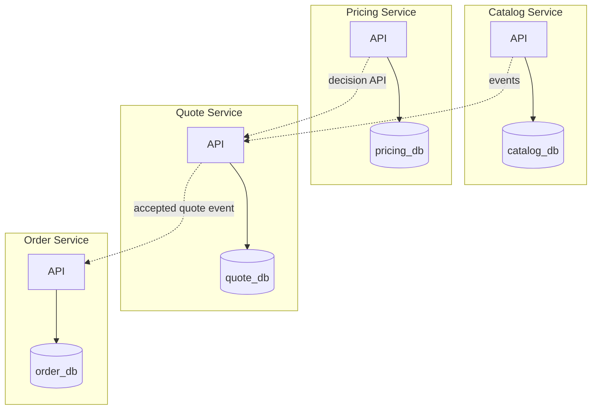
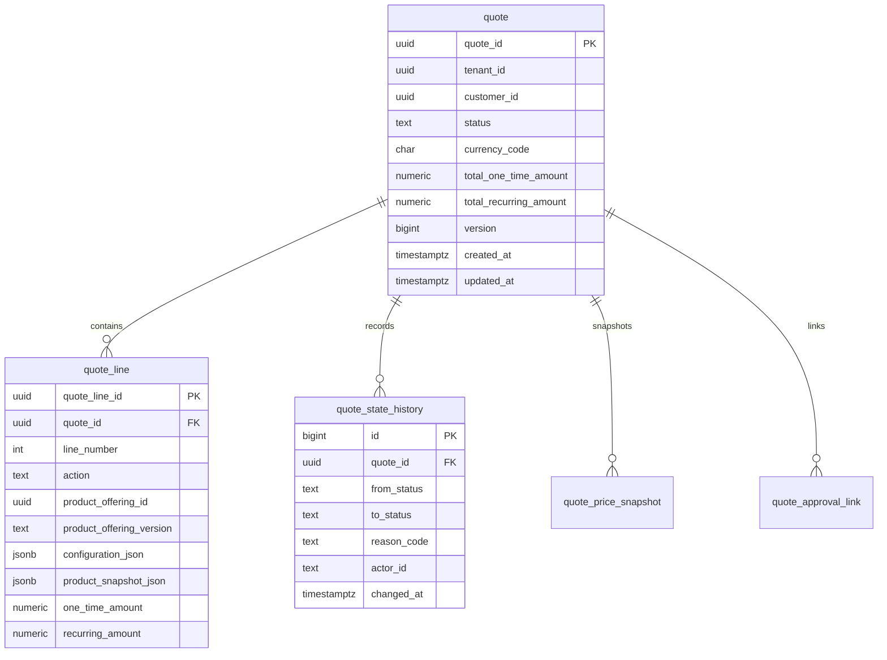
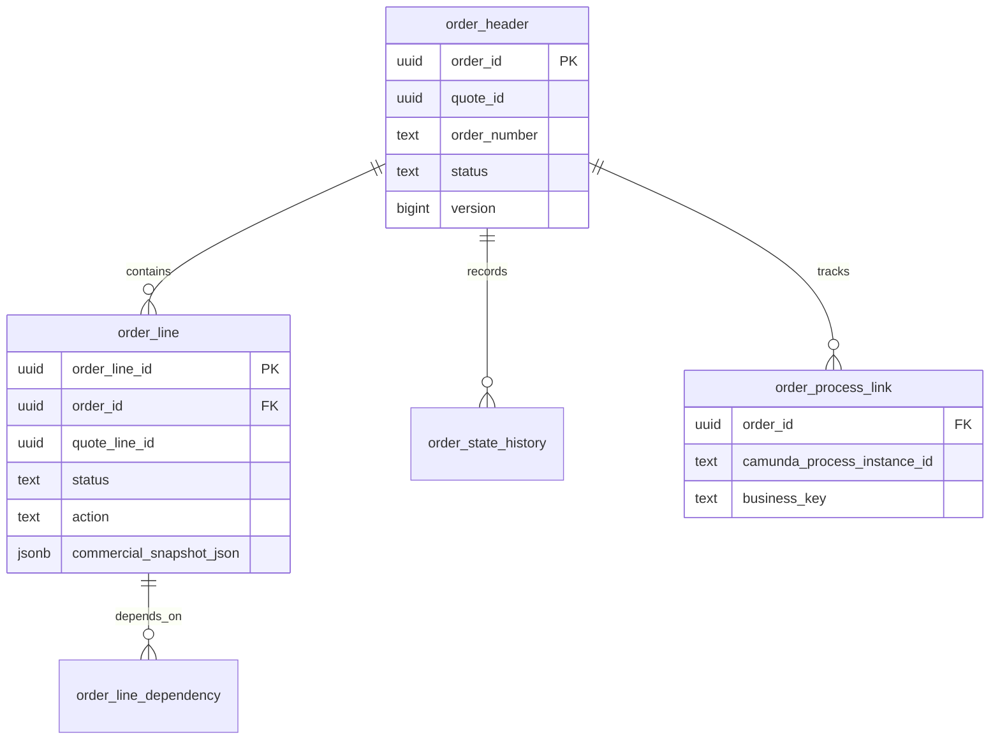
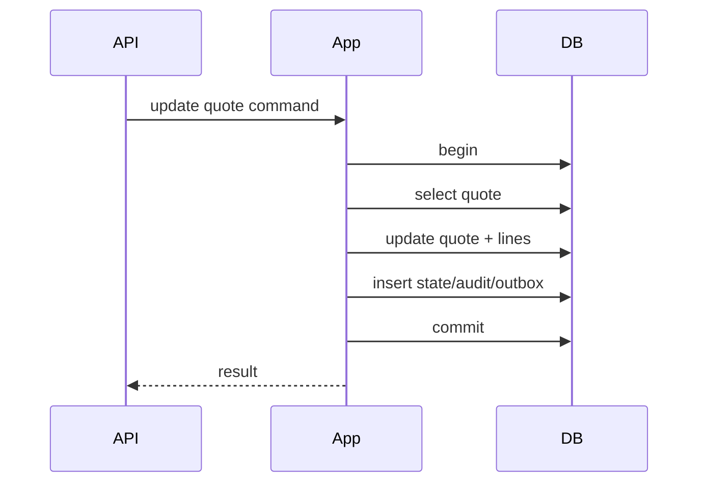
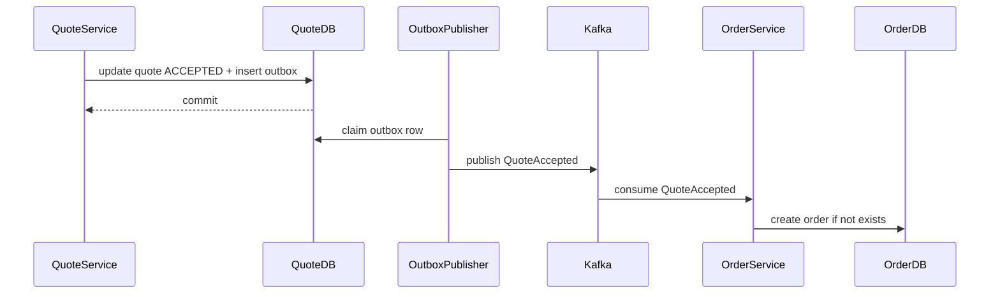

# Part 008 — PostgreSQL Data Architecture

## 1. Tujuan Part Ini

Pada part ini kita membangun **arsitektur data PostgreSQL** untuk platform CPQ/OMS.

Kita tidak sedang belajar PostgreSQL basic. Kita akan membahas bagaimana PostgreSQL dipakai sebagai source of truth untuk sistem komersial yang penuh state, invariant, harga, approval, order lifecycle, audit, dan integrasi asynchronous.

Target utama:

1. menentukan database ownership per service;
2. memodelkan aggregate CPQ/OMS ke relational schema;
3. memakai constraint untuk menjaga kebenaran, bukan hanya validasi aplikasi;
4. mendesain transaction boundary;
5. mengelola concurrency dan optimistic locking;
6. menggunakan JSONB secara tepat, bukan sebagai pelarian dari desain schema;
7. membangun auditability dan temporal snapshot;
8. menyiapkan indexing, partitioning, dan query model;
9. mendukung transactional outbox;
10. menghindari failure mode database yang umum di microservices.

PostgreSQL adalah database relasional yang matang, kuat untuk integrity constraint, indexing, transaction, JSONB, partitioning, dan extensibility. Dalam CPQ/OMS, PostgreSQL bukan sekadar storage. Ia adalah **truth enforcement engine** untuk bagian domain yang harus konsisten.

---

## 2. Mental Model: Database Sebagai Boundary Kebenaran

Banyak microservice gagal karena menggunakan database hanya sebagai tempat menyimpan object. Untuk CPQ/OMS, ini berbahaya.

Contoh invariant:

- quote accepted tidak boleh diedit;
- order tidak boleh dibuat dua kali dari quote acceptance yang sama;
- order line total harus konsisten dengan line snapshot;
- product reference harus punya catalog version;
- approval decision harus immutable setelah final;
- idempotency key tidak boleh menghasilkan dua command berbeda;
- outbox event tidak boleh hilang setelah business transaction sukses.

Sebagian invariant harus dijaga di domain model. Tetapi sebagian juga harus dijaga oleh database karena:

- aplikasi bisa bug;
- ada race condition;
- beberapa instance service berjalan paralel;
- retry bisa terjadi setelah timeout;
- operator repair bisa salah;
- future code bisa melanggar asumsi lama.

Prinsip utama:

> Business invariant penting harus punya minimal dua pagar: domain/application rule dan database constraint.

---

## 3. Database Ownership Dalam Microservices

Untuk seri ini, baseline architecture adalah **database-per-service secara ownership**, bukan satu database bersama yang semua service bebas query.



Ownership rule:

- service owns its database schema;
- other services cannot directly query tables;
- cross-service data moves through API, events, or replicated read models;
- reporting uses dedicated analytical/read pipeline, not random cross-service joins.

Physical deployment can vary:

| Pattern | Description | Acceptable? |
|---|---|---|
| Separate PostgreSQL cluster per service | Strong isolation | Best for mature platform, higher ops cost |
| Same cluster, separate database per service | Good isolation | Practical default |
| Same database, separate schema per service | Sometimes acceptable early | Requires strict grants and discipline |
| Same schema shared by all services | Shared database anti-pattern | Avoid |

For build-from-scratch learning, use same PostgreSQL instance with separate databases locally. In production, choose based on isolation, cost, compliance, performance, and operational maturity.

---

## 4. CPQ/OMS Data Categories

Not all data has the same consistency and lifecycle.

| Category | Examples | Storage Concern |
|---|---|---|
| Reference data | product offering, price book, approval matrix | versioning, publication lifecycle |
| Transactional aggregate | quote, order, approval request | consistency, state, concurrency |
| Snapshot data | quote price snapshot, product snapshot | immutability, auditability |
| Process data | workflow instance mapping, task state | correlation with Camunda |
| Integration data | outbox, inbox, external call attempts | retry, deduplication |
| Operational data | idempotency records, locks, repair queue | TTL, cleanup, observability |
| Audit data | decision log, actor actions, state transitions | immutable append, retention |
| Read model | search projection, dashboard view | query performance, rebuildability |

Design mistake:

> Storing all categories in one giant `quote` JSONB column.

Better:

- relational columns for identity, state, ownership, version, totals, timestamps;
- normalized child tables for line items and decisions;
- JSONB for flexible attributes, snapshots, and explainability payloads where structure evolves;
- outbox tables for reliable eventing;
- audit append tables for defensibility.

---

## 5. Naming and Schema Convention

Use boring, consistent naming.

Recommended conventions:

- table names singular or plural, choose one and keep it. This series uses singular domain-root tables like `quote`, `order_header`, `approval_request`;
- primary key column: `id` if table-local, or domain-specific `quote_id`, `order_id` if frequently joined/read;
- foreign keys: `<entity>_id`;
- timestamps: `created_at`, `updated_at`, `submitted_at`, `accepted_at`;
- status column: `status`, with check constraint or lookup table;
- optimistic lock column: `version`;
- tenant column: `tenant_id` on tenant-scoped tables;
- audit actor columns: `created_by`, `updated_by` where appropriate;
- JSONB columns end with `_json` or clearly named like `price_snapshot`.

Example:

```sql
create table quote (
    quote_id uuid primary key,
    tenant_id uuid not null,
    customer_id uuid not null,
    status text not null,
    currency_code char(3) not null,
    total_one_time_amount numeric(19, 4) not null,
    total_recurring_amount numeric(19, 4) not null,
    version bigint not null default 0,
    created_at timestamptz not null default now(),
    updated_at timestamptz not null default now(),
    submitted_at timestamptz,
    accepted_at timestamptz,
    expires_at timestamptz,
    created_by text not null,
    updated_by text not null,
    constraint quote_status_ck check (
        status in ('DRAFT', 'SUBMITTED', 'APPROVAL_REQUIRED', 'APPROVED', 'REJECTED', 'ACCEPTED', 'EXPIRED', 'CANCELLED')
    ),
    constraint quote_amount_non_negative_ck check (
        total_one_time_amount >= 0 and total_recurring_amount >= 0
    ),
    constraint quote_expiry_after_creation_ck check (
        expires_at is null or expires_at > created_at
    )
);
```

---

## 6. Identity Strategy

CPQ/OMS platform needs stable identity across services, events, audit, and support tools.

### 6.1 UUID vs Sequence vs Business Number

Use separate concepts:

| Concept | Example | Purpose |
|---|---|---|
| Technical ID | UUID | internal references, joins, events |
| Business number | `Q-2026-000123` | human-facing identifier |
| External reference | partner/customer ID | integration correlation |

Do not use business number as primary key.

```sql
create table quote_number_sequence (
    tenant_id uuid primary key,
    next_value bigint not null
);

create table quote (
    quote_id uuid primary key,
    quote_number text not null,
    tenant_id uuid not null,
    ...,
    unique (tenant_id, quote_number)
);
```

Business number generation must be:

- transactional;
- tenant-aware if needed;
- monotonic enough for users;
- not a source of cross-service coupling.

### 6.2 ID Generation Location

Preferred:

- service generates UUID before insert;
- database enforces uniqueness;
- business number allocated in transaction.

Why generate UUID in application?

- allows event/outbox payload creation before insert;
- easier aggregate construction;
- easier correlation in logs;
- no need to round-trip for generated ID.

Why not rely only on application uniqueness?

Because two service instances can generate conflicting business numbers or duplicate external references if database does not enforce uniqueness.

---

## 7. Tenant Isolation

Every tenant-scoped table should include `tenant_id`, unless data is explicitly global reference data.

Bad:

```sql
select * from quote where quote_id = ?;
```

Better:

```sql
select * from quote
where tenant_id = ?
  and quote_id = ?;
```

Indexes should reflect tenant access:

```sql
create index quote_tenant_customer_status_idx
    on quote (tenant_id, customer_id, status, created_at desc);

create index quote_tenant_status_created_idx
    on quote (tenant_id, status, created_at desc, quote_id desc);
```

Tenant isolation options:

| Option | Pros | Cons |
|---|---|---|
| Tenant column | simple, efficient | requires discipline everywhere |
| Row-level security | strong DB-side protection | complexity, performance/testing overhead |
| Schema per tenant | isolation | operational complexity |
| Database per tenant | strongest isolation | cost and migrations complexity |

For CPQ/OMS SaaS with many tenants, start with tenant column plus strong repository tests. Add RLS if regulatory/compliance need justifies the complexity.

---

## 8. Quote Aggregate Schema

Quote is a transaction aggregate with editable draft state and immutable commercial snapshot after acceptance.



### 8.1 Quote Table

```sql
create table quote (
    quote_id uuid primary key,
    tenant_id uuid not null,
    quote_number text not null,
    customer_id uuid not null,
    status text not null,
    sales_channel text not null,
    currency_code char(3) not null,
    total_one_time_amount numeric(19,4) not null default 0,
    total_recurring_amount numeric(19,4) not null default 0,
    version bigint not null default 0,
    created_at timestamptz not null default now(),
    updated_at timestamptz not null default now(),
    submitted_at timestamptz,
    accepted_at timestamptz,
    expires_at timestamptz,
    created_by text not null,
    updated_by text not null,
    unique (tenant_id, quote_number),
    constraint quote_status_ck check (
        status in ('DRAFT', 'SUBMITTED', 'APPROVAL_REQUIRED', 'APPROVED', 'REJECTED', 'ACCEPTED', 'EXPIRED', 'CANCELLED')
    ),
    constraint quote_currency_upper_ck check (currency_code = upper(currency_code)),
    constraint quote_total_amount_ck check (
        total_one_time_amount >= 0 and total_recurring_amount >= 0
    )
);
```

### 8.2 Quote Line Table

```sql
create table quote_line (
    quote_line_id uuid primary key,
    quote_id uuid not null references quote(quote_id),
    tenant_id uuid not null,
    line_number integer not null,
    action text not null,
    product_offering_id uuid not null,
    product_offering_version text not null,
    configuration_json jsonb not null,
    product_snapshot_json jsonb not null,
    one_time_amount numeric(19,4) not null,
    recurring_amount numeric(19,4) not null,
    created_at timestamptz not null default now(),
    updated_at timestamptz not null default now(),
    unique (quote_id, line_number),
    constraint quote_line_action_ck check (action in ('ADD', 'CHANGE', 'DISCONNECT', 'RENEW')),
    constraint quote_line_amount_ck check (one_time_amount >= 0 and recurring_amount >= 0)
);

create index quote_line_quote_idx on quote_line (quote_id, line_number);
create index quote_line_tenant_product_idx on quote_line (tenant_id, product_offering_id);
```

Why repeat `tenant_id` on child table?

- query filtering;
- partitioning possibility;
- defense-in-depth;
- easier audit/reporting;
- tenant-scoped indexes.

But foreign key alone does not ensure child tenant matches parent tenant. Use composite FK if you want DB-enforced tenant consistency:

```sql
alter table quote add constraint quote_tenant_quote_unique unique (tenant_id, quote_id);

alter table quote_line add constraint quote_line_quote_tenant_fk
    foreign key (tenant_id, quote_id)
    references quote(tenant_id, quote_id);
```

This is more verbose but stronger.

---

## 9. Order Aggregate Schema

Order is not just accepted quote. It is operational commitment with lifecycle and downstream fulfillment.



### 9.1 Order Header

```sql
create table order_header (
    order_id uuid primary key,
    tenant_id uuid not null,
    order_number text not null,
    quote_id uuid not null,
    quote_number text not null,
    customer_id uuid not null,
    status text not null,
    currency_code char(3) not null,
    total_one_time_amount numeric(19,4) not null,
    total_recurring_amount numeric(19,4) not null,
    version bigint not null default 0,
    submitted_at timestamptz not null,
    completed_at timestamptz,
    cancelled_at timestamptz,
    created_at timestamptz not null default now(),
    updated_at timestamptz not null default now(),
    created_by text not null,
    unique (tenant_id, order_number),
    unique (tenant_id, quote_id),
    constraint order_status_ck check (
        status in ('SUBMITTED', 'IN_PROGRESS', 'PARTIALLY_COMPLETED', 'COMPLETED', 'CANCELLING', 'CANCELLED', 'FAILED', 'REQUIRES_MANUAL_REPAIR')
    ),
    constraint order_amount_ck check (
        total_one_time_amount >= 0 and total_recurring_amount >= 0
    )
);
```

`unique (tenant_id, quote_id)` enforces:

> One accepted quote can create at most one order per tenant.

This is a critical invariant. Do not rely only on application code.

### 9.2 Order Line

```sql
create table order_line (
    order_line_id uuid primary key,
    tenant_id uuid not null,
    order_id uuid not null,
    quote_line_id uuid not null,
    line_number integer not null,
    action text not null,
    status text not null,
    product_offering_id uuid not null,
    product_offering_version text not null,
    commercial_snapshot_json jsonb not null,
    fulfillment_payload_json jsonb,
    created_at timestamptz not null default now(),
    updated_at timestamptz not null default now(),
    unique (order_id, line_number),
    foreign key (tenant_id, order_id) references order_header(tenant_id, order_id),
    constraint order_line_status_ck check (
        status in ('PENDING', 'READY', 'IN_PROGRESS', 'COMPLETED', 'FAILED', 'SKIPPED', 'CANCELLED')
    ),
    constraint order_line_action_ck check (action in ('ADD', 'CHANGE', 'DISCONNECT', 'RENEW'))
);
```

Order line owns execution state. Quote line owns commercial proposal. Do not mutate quote line to represent fulfillment progress.

---

## 10. Status Modeling: Check Constraint vs Lookup Table vs Enum

PostgreSQL supports enum types, but for business lifecycle status we often prefer `text + check constraint` or lookup table.

| Option | Pros | Cons |
|---|---|---|
| PostgreSQL enum | strong type, compact | harder lifecycle evolution |
| `text` + check constraint | easy to read, migration friendly | constraint migration needed |
| lookup table | metadata, descriptions, order | more joins, can be overkill |

For CPQ/OMS status, use `text + check constraint` at first.

Why?

- status evolves during implementation;
- migration is simpler;
- Java enum can still exist;
- check constraint catches invalid values.

For reference data with UI metadata, use lookup/reference table.

---

## 11. Monetary Data

Never use floating point for money.

Recommended:

```sql
amount numeric(19,4) not null
currency_code char(3) not null
```

But model carefully:

| Case | Columns |
|---|---|
| simple total | `amount`, `currency_code` |
| recurring price | `recurring_amount`, `billing_period`, `currency_code` |
| tax estimate | separate tax table or snapshot field |
| discount | `discount_amount`, `discount_percent`, reason |
| multi-currency quote | avoid unless explicitly required; otherwise one quote currency |

Example line price breakdown:

```sql
create table quote_line_price_component (
    price_component_id uuid primary key,
    tenant_id uuid not null,
    quote_line_id uuid not null references quote_line(quote_line_id),
    component_type text not null,
    charge_type text not null,
    amount numeric(19,4) not null,
    currency_code char(3) not null,
    pricing_rule_id text,
    explanation_json jsonb not null,
    created_at timestamptz not null default now(),
    constraint price_component_type_ck check (
        component_type in ('BASE_PRICE', 'DISCOUNT', 'SURCHARGE', 'TAX_ESTIMATE')
    ),
    constraint price_charge_type_ck check (
        charge_type in ('ONE_TIME', 'RECURRING')
    )
);
```

Do not store only total if users need price explainability.

---

## 12. JSONB: Use It Deliberately

PostgreSQL JSONB is powerful. It is also a common way to destroy data quality.

Good JSONB use cases in CPQ/OMS:

- product snapshot at quote time;
- pricing explanation payload;
- dynamic configuration attributes;
- external fulfillment payload copy;
- event payload in outbox;
- audit diff details;
- read model denormalized document.

Bad JSONB use cases:

- status;
- tenant ID;
- quote ID;
- order ID;
- totals used for filtering/sorting;
- lifecycle timestamps;
- frequently joined foreign keys;
- fields needed in unique constraints.

Rule:

> If a field participates in identity, lifecycle, ownership, authorization, filtering, sorting, uniqueness, or join behavior, make it a real column.

### 12.1 JSONB Constraint Example

You can still add shape constraints for critical JSONB fields.

```sql
alter table quote_line
add constraint quote_line_configuration_is_object_ck
check (jsonb_typeof(configuration_json) = 'object');
```

For required JSON key:

```sql
alter table quote_line
add constraint quote_line_configuration_has_product_ck
check (configuration_json ? 'selectedOptions');
```

Use this sparingly. Too many JSON path constraints can become brittle.

### 12.2 JSONB Indexing

If you query JSONB fields, index deliberately.

```sql
create index quote_line_configuration_gin_idx
    on quote_line using gin (configuration_json);
```

But GIN index is not free:

- larger index size;
- slower writes;
- maintenance cost;
- not always used by planner.

For frequently queried JSON key, prefer expression index:

```sql
create index quote_line_region_expr_idx
    on quote_line ((configuration_json ->> 'region'));
```

Before indexing JSONB, ask:

1. Is this really query-critical?
2. Should this field be a column instead?
3. What is the cardinality?
4. What query pattern will use it?
5. What write overhead is acceptable?

---

## 13. Temporal Modeling and Snapshots

CPQ/OMS must answer historical questions:

- Why was this price offered?
- Which catalog version was used?
- Who approved this discount?
- What did the customer accept?
- What changed between quote revisions?
- Which order state transition happened before failure?

### 13.1 Snapshot Over Reference

Quote line should store product snapshot, not only product ID.

```sql
product_offering_id uuid not null,
product_offering_version text not null,
product_snapshot_json jsonb not null
```

Why?

Catalog changes after quote creation. If quote only references current catalog, historical quote becomes unstable.

Snapshot invariant:

> Commercial documents must remain explainable even if reference data changes later.

### 13.2 State History

```sql
create table quote_state_history (
    id bigserial primary key,
    tenant_id uuid not null,
    quote_id uuid not null references quote(quote_id),
    from_status text,
    to_status text not null,
    reason_code text,
    actor_id text not null,
    actor_type text not null,
    correlation_id text not null,
    changed_at timestamptz not null default now(),
    metadata_json jsonb not null default '{}'::jsonb
);

create index quote_state_history_quote_idx
    on quote_state_history (quote_id, changed_at);
```

This table is not optional if platform needs auditability.

---

## 14. Audit Model

Audit is not the same as logging.

Logs answer:

> What happened operationally?

Audit answers:

> Who did what, to which business object, from what state to what state, under what authority, with what evidence?

Generic audit table:

```sql
create table audit_event (
    audit_event_id uuid primary key,
    tenant_id uuid not null,
    aggregate_type text not null,
    aggregate_id uuid not null,
    event_type text not null,
    actor_id text not null,
    actor_type text not null,
    source_system text not null,
    correlation_id text not null,
    causation_id text,
    occurred_at timestamptz not null,
    reason_code text,
    before_json jsonb,
    after_json jsonb,
    evidence_json jsonb not null default '{}'::jsonb,
    created_at timestamptz not null default now()
);

create index audit_event_aggregate_idx
    on audit_event (tenant_id, aggregate_type, aggregate_id, occurred_at);

create index audit_event_actor_idx
    on audit_event (tenant_id, actor_id, occurred_at desc);
```

Audit events should be append-only. If correction is needed, append correction event. Do not update history silently.

For regulatory defensibility, audit should capture:

- actor;
- authority/permission basis;
- timestamp;
- correlation ID;
- previous and new state when applicable;
- reason code;
- source system;
- evidence reference;
- policy version if decision was automated.

---

## 15. Optimistic Locking

Quote editing should use optimistic locking.

SQL update pattern:

```sql
update quote
set status = ?,
    version = version + 1,
    updated_at = now(),
    updated_by = ?
where tenant_id = ?
  and quote_id = ?
  and version = ?;
```

If affected row count is zero:

- quote not found;
- tenant mismatch;
- version conflict.

Application should disambiguate carefully if needed.

Java repository pattern:

```java
public void updateQuote(Quote quote, long expectedVersion) {
    int updated = mapper.updateQuote(
            quote.id().value(),
            quote.tenantId().value(),
            quote.status().name(),
            expectedVersion,
            quote.updatedBy());

    if (updated == 0) {
        throw new QuoteVersionConflict(quote.id(), expectedVersion);
    }
}
```

Never ignore update row count.

---

## 16. Pessimistic Locking For Specific Cases

Sometimes optimistic locking is not enough. Examples:

- allocate tenant-scoped quote number;
- prevent duplicate order creation from same quote;
- process a repair queue item once;
- outbox publisher claiming rows;
- order line dependency scheduling.

Use row-level locking deliberately:

```sql
select * from quote_number_sequence
where tenant_id = ?
for update;
```

For worker queues:

```sql
select outbox_event_id
from outbox_event
where status = 'PENDING'
order by created_at
limit 100
for update skip locked;
```

`skip locked` is useful for concurrent workers, but understand the trade-off:

- improves throughput;
- avoids blocking;
- can starve old rows if not managed carefully;
- requires retry/backoff and monitoring.

---

## 17. Transaction Boundary Patterns

### 17.1 Single Aggregate Transaction

Quote draft update:



This is straightforward.

### 17.2 Cross-Service Transaction Is Not Available

Quote accepted -> Order created should not be one distributed DB transaction.

Use event/outbox:



Database architecture must support this from the beginning.

---

## 18. Transactional Outbox Table

Outbox is mandatory for reliable event publishing.

```sql
create table outbox_event (
    outbox_event_id uuid primary key,
    tenant_id uuid not null,
    aggregate_type text not null,
    aggregate_id uuid not null,
    event_type text not null,
    event_version integer not null,
    topic text not null,
    partition_key text not null,
    payload_json jsonb not null,
    headers_json jsonb not null default '{}'::jsonb,
    status text not null default 'PENDING',
    attempt_count integer not null default 0,
    next_attempt_at timestamptz not null default now(),
    locked_by text,
    locked_at timestamptz,
    published_at timestamptz,
    created_at timestamptz not null default now(),
    constraint outbox_status_ck check (
        status in ('PENDING', 'PUBLISHING', 'PUBLISHED', 'FAILED')
    )
);

create index outbox_pending_idx
    on outbox_event (status, next_attempt_at, created_at)
    where status in ('PENDING', 'FAILED');

create index outbox_aggregate_idx
    on outbox_event (aggregate_type, aggregate_id, created_at);
```

Outbox write happens in same transaction as business change:

```sql
begin;
update quote set status = 'ACCEPTED', version = version + 1 where ...;
insert into quote_state_history (...);
insert into audit_event (...);
insert into outbox_event (...);
commit;
```

This guarantees:

- if quote update commits, event intent exists;
- if transaction rolls back, no event is published for nonexistent state;
- publisher can retry independently.

---

## 19. Inbox / Deduplication Table

Consumers need idempotency too.

```sql
create table inbox_message (
    message_id text primary key,
    tenant_id uuid not null,
    topic text not null,
    partition integer,
    offset_value bigint,
    event_type text not null,
    consumed_at timestamptz not null default now(),
    handler_name text not null,
    status text not null,
    error_json jsonb,
    constraint inbox_status_ck check (status in ('PROCESSED', 'FAILED'))
);
```

Consumer transaction:

1. check/insert inbox message;
2. apply business effect;
3. commit;
4. acknowledge Kafka offset after commit.

If duplicate message arrives, no duplicate order should be created.

Order creation from accepted quote should also have unique DB constraint:

```sql
unique (tenant_id, quote_id)
```

Do not depend on inbox alone.

---

## 20. Idempotency Table

API idempotency is separate from Kafka inbox.

```sql
create table api_idempotency_record (
    idempotency_record_id uuid primary key,
    tenant_id uuid not null,
    actor_id text not null,
    operation text not null,
    idempotency_key text not null,
    request_fingerprint text not null,
    response_status integer,
    response_body_json jsonb,
    resource_type text,
    resource_id uuid,
    state text not null,
    created_at timestamptz not null default now(),
    completed_at timestamptz,
    expires_at timestamptz not null,
    unique (tenant_id, actor_id, operation, idempotency_key),
    constraint api_idempotency_state_ck check (state in ('IN_PROGRESS', 'COMPLETED', 'FAILED'))
);

create index api_idempotency_expiry_idx
    on api_idempotency_record (expires_at);
```

Retention policy:

- keep for expected client retry window;
- archive/delete after TTL;
- ensure cleanup does not block hot table;
- never store sensitive response bodies unless encrypted/redacted.

---

## 21. Approval Data Model

Approval is a decision record, not just a status field.

```sql
create table approval_request (
    approval_request_id uuid primary key,
    tenant_id uuid not null,
    aggregate_type text not null,
    aggregate_id uuid not null,
    policy_id text not null,
    policy_version text not null,
    status text not null,
    requested_by text not null,
    requested_at timestamptz not null,
    due_at timestamptz,
    completed_at timestamptz,
    decision_summary_json jsonb not null,
    constraint approval_status_ck check (
        status in ('PENDING', 'APPROVED', 'REJECTED', 'CANCELLED', 'EXPIRED')
    )
);

create table approval_decision (
    approval_decision_id uuid primary key,
    tenant_id uuid not null,
    approval_request_id uuid not null references approval_request(approval_request_id),
    approver_id text not null,
    decision text not null,
    reason_code text,
    comment text,
    decided_at timestamptz not null,
    evidence_json jsonb not null default '{}'::jsonb,
    constraint approval_decision_ck check (decision in ('APPROVED', 'REJECTED', 'DELEGATED'))
);
```

Critical invariant:

- final approval request should not receive new final decision;
- approver must be authorized by policy version;
- decision must be traceable.

Database constraints can enforce uniqueness:

```sql
create unique index approval_final_decision_once_idx
    on approval_decision (approval_request_id)
    where decision in ('APPROVED', 'REJECTED');
```

This prevents two final decisions for the same approval request.

---

## 22. Index Design For CPQ/OMS

Indexes should be driven by access patterns, not guesses.

### 22.1 Quote Access Patterns

Common queries:

- get quote by ID and tenant;
- search quotes by customer;
- search quotes by status;
- find expiring quotes;
- find quotes needing approval;
- list recent quotes for sales user.

Indexes:

```sql
create index quote_tenant_customer_created_idx
    on quote (tenant_id, customer_id, created_at desc, quote_id desc);

create index quote_tenant_status_created_idx
    on quote (tenant_id, status, created_at desc, quote_id desc);

create index quote_expiring_idx
    on quote (expires_at)
    where status in ('DRAFT', 'SUBMITTED', 'APPROVAL_REQUIRED', 'APPROVED');
```

Partial index is useful for operational queries with narrow active set.

### 22.2 Order Access Patterns

```sql
create index order_tenant_customer_created_idx
    on order_header (tenant_id, customer_id, created_at desc, order_id desc);

create index order_tenant_status_updated_idx
    on order_header (tenant_id, status, updated_at desc, order_id desc);

create index order_requires_repair_idx
    on order_header (updated_at desc)
    where status = 'REQUIRES_MANUAL_REPAIR';
```

### 22.3 Avoid Index Explosion

Each index has cost:

- write overhead;
- disk space;
- vacuum/maintenance;
- planner complexity;
- migration time.

Use indexes for known access patterns and verify with `EXPLAIN`. Do not create indexes for every column.

---

## 23. Partitioning Strategy

PostgreSQL declarative partitioning can help for very large tables, but premature partitioning adds complexity.

Good partition candidates:

- audit events;
- outbox history;
- inbox history;
- state history;
- high-volume operational logs;
- maybe order history in very large systems.

Usually not first candidates:

- product catalog reference data;
- active quote table;
- small approval table.

Time-based partition example for audit:

```sql
create table audit_event (
    audit_event_id uuid not null,
    tenant_id uuid not null,
    aggregate_type text not null,
    aggregate_id uuid not null,
    event_type text not null,
    actor_id text not null,
    occurred_at timestamptz not null,
    evidence_json jsonb not null default '{}'::jsonb,
    primary key (audit_event_id, occurred_at)
) partition by range (occurred_at);

create table audit_event_2026_07
    partition of audit_event
    for values from ('2026-07-01') to ('2026-08-01');
```

Partitioning requires operational discipline:

- create future partitions before needed;
- monitor partition pruning;
- index partitions appropriately;
- handle retention/drop;
- test migrations with partitions.

---

## 24. Retention and Archival

CPQ/OMS data has different retention needs.

| Data | Typical Retention Direction |
|---|---|
| quote/order commercial records | long retention, compliance dependent |
| audit events | long retention, often immutable/archive |
| idempotency records | short TTL |
| outbox published records | short-to-medium retention |
| inbox messages | medium retention for dedupe/replay |
| workflow history | compliance and operational retention |
| search projections | rebuildable, can be shorter |

Do not delete business records casually. Prefer status transitions and archival.

For large audit/outbox tables:

- partition by time;
- drop/archive old partitions;
- avoid huge `delete where created_at < ...` on hot tables;
- make retention policy explicit.

---

## 25. Read Models and Search Projections

Transactional schema is not always ideal for search UI.

Quote search page may need:

- quote number;
- customer name;
- status;
- total;
- sales owner;
- pending approval indicator;
- expiration risk;
- last activity;
- product summary.

Do not force every search query to join 12 normalized tables.

Create projection table:

```sql
create table quote_search_projection (
    tenant_id uuid not null,
    quote_id uuid not null,
    quote_number text not null,
    customer_id uuid not null,
    customer_name text not null,
    status text not null,
    sales_owner_id text not null,
    total_one_time_amount numeric(19,4) not null,
    total_recurring_amount numeric(19,4) not null,
    currency_code char(3) not null,
    product_summary text,
    pending_approval boolean not null default false,
    expires_at timestamptz,
    last_activity_at timestamptz not null,
    updated_at timestamptz not null,
    primary key (tenant_id, quote_id)
);

create index quote_search_owner_status_idx
    on quote_search_projection (tenant_id, sales_owner_id, status, last_activity_at desc);
```

Projection can be updated:

- synchronously in same transaction if local and simple;
- asynchronously from outbox events if decoupled;
- rebuilt from source tables if corrupted.

Projection rule:

> Read model may be denormalized, but source of truth must remain clear.

---

## 26. Migration Strategy

Every schema change should be treated as production code.

Migration rules:

1. backward-compatible first;
2. deploy code that can read old and new shape;
3. backfill safely;
4. switch writes;
5. remove old columns later;
6. avoid long locks;
7. test migration on production-sized clone.

### 26.1 Expand-Contract Example

Need to split `total_amount` into `total_one_time_amount` and `total_recurring_amount`.

Step 1: expand

```sql
alter table quote add column total_one_time_amount numeric(19,4);
alter table quote add column total_recurring_amount numeric(19,4);
```

Step 2: deploy code that writes both old and new.

Step 3: backfill in batches.

```sql
update quote
set total_one_time_amount = total_amount,
    total_recurring_amount = 0
where total_one_time_amount is null
limit ...;
```

PostgreSQL does not support `limit` directly in update in the same way some databases do; use CTE batch pattern:

```sql
with batch as (
    select quote_id
    from quote
    where total_one_time_amount is null
    order by created_at
    limit 1000
)
update quote q
set total_one_time_amount = q.total_amount,
    total_recurring_amount = 0
from batch
where q.quote_id = batch.quote_id;
```

Step 4: add not-null constraints after backfill.

Step 5: switch reads.

Step 6: remove old column in later release.

---

## 27. Constraints as Executable Invariants

Database constraints document and enforce truth.

Examples:

### 27.1 One Order Per Quote

```sql
alter table order_header
add constraint order_quote_once_uk unique (tenant_id, quote_id);
```

### 27.2 Valid Expiration

```sql
alter table quote
add constraint quote_expiration_ck
check (expires_at is null or expires_at > created_at);
```

### 27.3 Approval Final Decision Once

```sql
create unique index approval_final_once_idx
on approval_decision (approval_request_id)
where decision in ('APPROVED', 'REJECTED');
```

### 27.4 Outbox Payload Must Be Object

```sql
alter table outbox_event
add constraint outbox_payload_object_ck
check (jsonb_typeof(payload_json) = 'object');
```

### 27.5 Non-Negative Amounts

```sql
alter table quote_line
add constraint quote_line_amount_non_negative_ck
check (one_time_amount >= 0 and recurring_amount >= 0);
```

Constraint naming matters. When constraint fails, error should be mappable to domain error if possible.

---

## 28. Database Error Mapping

PostgreSQL constraint violation should not leak raw SQL error to API consumer.

Repository/application layer should translate known constraint violations.

Example mapping:

| Constraint | Domain Error | HTTP |
|---|---|---:|
| `order_quote_once_uk` | `OrderAlreadyExistsForQuote` | 409 |
| `quote_status_ck` | internal bug or invalid command | 500/409 depending path |
| `approval_final_once_idx` | `ApprovalAlreadyFinalized` | 409 |
| idempotency unique key | replay or conflict | 200/409 |

Do not expose:

```text
duplicate key value violates unique constraint "order_quote_once_uk"
```

Expose:

```json
{
  "code": "ORDER_ALREADY_EXISTS_FOR_QUOTE",
  "status": 409,
  "correlationId": "..."
}
```

---

## 29. Data Repair and Reconciliation

Production CPQ/OMS needs repair paths.

Examples:

- outbox row stuck in `PUBLISHING`;
- order process started but order state not updated;
- quote accepted but order not created;
- approval request expired but quote still waiting;
- projection out of sync;
- idempotency record stuck `IN_PROGRESS` after crash.

Design repair queries from day one.

### 29.1 Stuck Outbox

```sql
update outbox_event
set status = 'PENDING',
    locked_by = null,
    locked_at = null,
    next_attempt_at = now()
where status = 'PUBLISHING'
  and locked_at < now() - interval '10 minutes';
```

### 29.2 Accepted Quote Without Order

```sql
select q.quote_id, q.tenant_id, q.accepted_at
from quote q
left join order_header o
  on o.tenant_id = q.tenant_id
 and o.quote_id = q.quote_id
where q.status = 'ACCEPTED'
  and o.order_id is null
  and q.accepted_at < now() - interval '5 minutes';
```

This query can drive reconciliation.

### 29.3 Stuck Idempotency

```sql
update api_idempotency_record
set state = 'FAILED'
where state = 'IN_PROGRESS'
  and created_at < now() - interval '15 minutes';
```

But be careful: changing idempotency state affects client retry semantics. Repair logic must be designed per operation.

---

## 30. Operational PostgreSQL Concerns

Database design is not complete without operational thinking.

### 30.1 Connection Pooling

Every service instance should use bounded connection pool.

Bad:

```text
50 services * 20 pods * 30 connections = 30,000 DB connections
```

This will break PostgreSQL.

Design:

- estimate max pods;
- set pool size per service based on workload;
- use PgBouncer if appropriate;
- monitor wait time for connections;
- set query timeout;
- set statement timeout.

### 30.2 Timeouts

Use defensive timeouts:

```sql
set statement_timeout = '5s';
set lock_timeout = '1s';
```

At application level:

- short timeout for API commands;
- longer timeout for backoffice batch if isolated;
- separate pool for outbox publisher if needed.

### 30.3 Vacuum and Bloat

High-write tables like outbox, inbox, and idempotency can bloat.

Mitigations:

- partition high-volume history;
- avoid frequent update of large JSONB rows;
- use append/insert patterns where possible;
- monitor dead tuples;
- tune autovacuum per table if needed.

### 30.4 Lock Awareness

Schema migrations can lock tables. Avoid risky migrations during peak.

Examples of dangerous actions on large tables:

- adding column with volatile default in older patterns;
- adding not-null without backfill strategy;
- creating index without `concurrently`;
- large single-transaction backfill;
- changing column type in-place.

Prefer:

```sql
create index concurrently quote_status_created_idx
    on quote (tenant_id, status, created_at desc);
```

Remember: `create index concurrently` cannot run inside a regular transaction block.

---

## 31. MyBatis Implication

Part 009 will go deep into MyBatis, but database architecture already affects mapper design.

Repository should expose domain operations, not arbitrary SQL access.

Bad mapper-centric design:

```java
quoteMapper.updateStatus(quoteId, "ACCEPTED");
quoteMapper.insertOutbox(...);
quoteMapper.insertAudit(...);
```

Scattered across service.

Better repository/application transaction:

```java
transaction.execute(() -> {
    Quote quote = quoteRepository.getForUpdate(command.quoteId());
    quote.accept(command.actor(), clock);
    quoteRepository.save(quote);
    auditRepository.append(AuditEvent.from(quote));
    outboxRepository.append(QuoteAcceptedEvent.from(quote));
});
```

MyBatis mapper can still use explicit SQL, but application service owns business transaction.

---

## 32. Database Testing Strategy

Test database behavior with real PostgreSQL, not H2 pretending to be PostgreSQL.

Test categories:

| Test | Purpose |
|---|---|
| migration test | schema can build from zero |
| constraint test | DB rejects invalid invariant |
| repository test | mapper SQL works with real DB |
| concurrency test | version conflict and locks behave correctly |
| outbox test | business change and event intent commit atomically |
| query plan smoke test | critical query uses expected index |

Example constraint test:

```java
@Test
void cannotCreateTwoOrdersForSameQuote() {
    orderRepository.createOrder(orderFromQuote(quoteId));

    assertThrows(OrderAlreadyExistsForQuote.class, () ->
            orderRepository.createOrder(orderFromQuote(quoteId)));
}
```

This should ultimately verify database unique constraint, not only Java pre-check.

---

## 33. Failure Mode Table

| Failure | Root Cause | Database Architecture Defense |
|---|---|---|
| Duplicate order from retry | no unique quote/order constraint | `unique(tenant_id, quote_id)` |
| Lost quote edit | no optimistic locking | `version` checked on update |
| Invalid status persisted | no DB status constraint | `check(status in ...)` |
| Historical quote changes after catalog update | only product ID stored | product snapshot JSON + version |
| Event lost after commit | direct Kafka publish outside transaction | transactional outbox |
| Duplicate event effect | no inbox/dedup | inbox table + business unique constraint |
| Slow search page | transactional join-heavy query | read projection + indexes |
| Audit incomplete | logs used as audit | append-only audit table |
| Tenant data leak | missing tenant predicate | tenant in PK/FK/index/repository tests |
| Migration outage | blocking DDL | expand-contract + concurrent index + batch backfill |
| JSONB query slow | unindexed dynamic field | expression/GIN index or real column |
| DB exhausted | unbounded pools | connection budget + pooling strategy |

---

## 34. Kaufman Deliberate Practice

Build a minimal but correct quote/order database slice.

### Exercise

Create migrations for:

1. `quote`
2. `quote_line`
3. `quote_state_history`
4. `order_header`
5. `order_line`
6. `outbox_event`
7. `api_idempotency_record`
8. `audit_event`

Then write repository tests proving:

- quote cannot have invalid status;
- quote update with wrong version fails;
- accepted quote cannot produce duplicate order;
- outbox event is inserted in same transaction as quote acceptance;
- quote line configuration must be JSON object;
- search query uses tenant/status index;
- idempotency key conflict is detected.

The goal is not to create many tables. The goal is to make PostgreSQL enforce the same truths your domain model claims to enforce.

---

## 35. Production Readiness Checklist

### Schema

- [ ] Every tenant-scoped table has `tenant_id`.
- [ ] Critical status fields have constraints.
- [ ] Business uniqueness is enforced by unique constraints.
- [ ] Monetary fields use `numeric`, not floating point.
- [ ] Lifecycle timestamps are explicit columns.
- [ ] JSONB is not used for identity/status/ownership fields.

### Transactions

- [ ] Application service owns transaction boundary.
- [ ] Outbox writes happen in same transaction as business changes.
- [ ] External calls are not made inside DB transaction unless deliberate.
- [ ] Optimistic locking is used for editable aggregates.
- [ ] Pessimistic locking is limited to specific cases.

### Query and Performance

- [ ] Indexes match real access patterns.
- [ ] Search endpoints have stable sort and pagination.
- [ ] Critical query plans are checked.
- [ ] High-volume tables have retention/partition strategy.
- [ ] Connection pool budget is calculated.

### Audit and Operations

- [ ] State history exists for quote/order/approval.
- [ ] Audit event captures actor, authority, correlation, evidence.
- [ ] Repair queries exist for stuck outbox/order/idempotency.
- [ ] Migration strategy follows expand-contract.
- [ ] No service bypasses owning service database.

---

## 36. References

- PostgreSQL current documentation: `https://www.postgresql.org/docs/current/index.html`
- PostgreSQL JSON types: `https://www.postgresql.org/docs/current/datatype-json.html`
- PostgreSQL JSON functions and operators: `https://www.postgresql.org/docs/current/functions-json.html`
- PostgreSQL table partitioning: `https://www.postgresql.org/docs/current/ddl-partitioning.html`
- PostgreSQL constraints: `https://www.postgresql.org/docs/current/ddl-constraints.html`
- PostgreSQL indexes: `https://www.postgresql.org/docs/current/indexes.html`

---

## 37. Ringkasan

PostgreSQL data architecture untuk CPQ/OMS harus menjaga **kebenaran domain**, bukan hanya menyimpan object.

Prinsip paling penting:

- service owns its database;
- database constraint adalah executable invariant;
- quote dan order harus punya lifecycle, history, version, dan snapshot;
- monetary data harus presisi;
- JSONB berguna, tetapi tidak boleh menggantikan schema untuk field kritis;
- outbox/inbox/idempotency adalah bagian dari desain data, bukan tambahan belakangan;
- audit table berbeda dari log;
- index dan partitioning harus mengikuti access pattern;
- migration harus backward-compatible;
- repair query harus didesain sejak awal.

Part berikutnya akan masuk ke **MyBatis Persistence Layer**, yaitu cara menerjemahkan arsitektur data ini menjadi repository Java dengan explicit SQL, mapper yang aman, transaction handling, dan query discipline yang tidak berubah menjadi ORM setengah matang.
