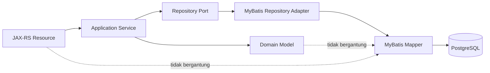
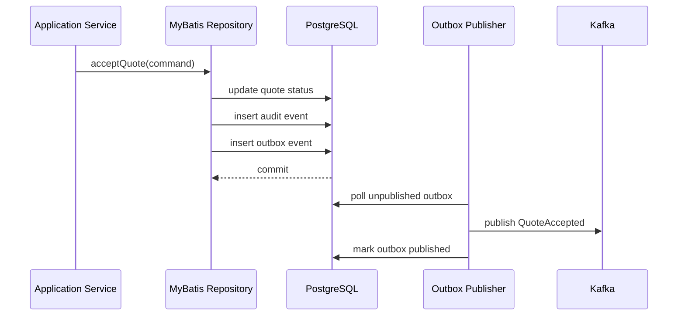
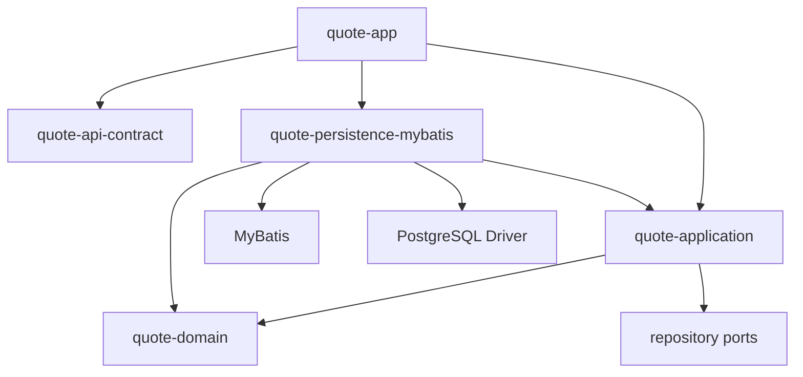
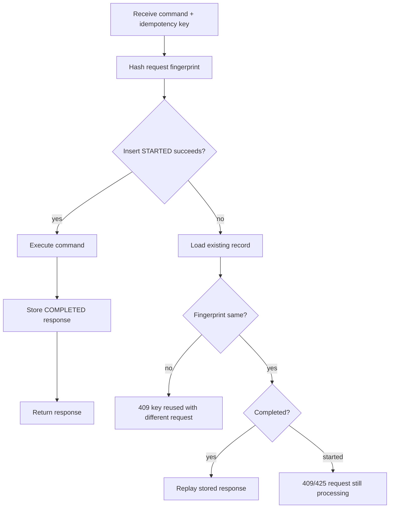
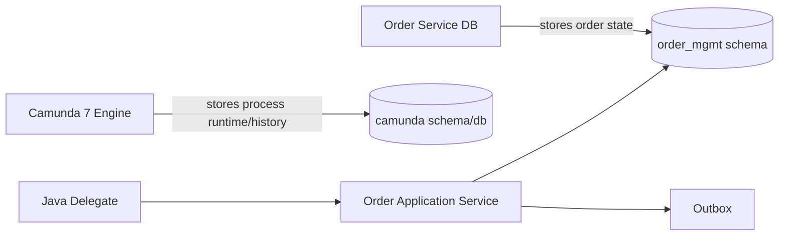
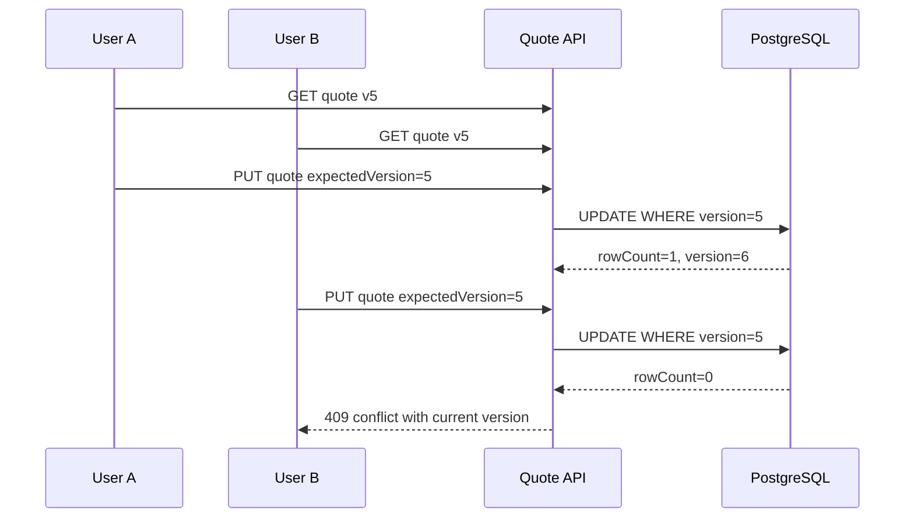

# Part 009 — MyBatis Persistence Layer

## 1. Tujuan Part Ini

Pada part ini kita membangun **persistence layer berbasis MyBatis** untuk platform Java microservices CPQ/OMS.

Kita tidak sedang belajar MyBatis basic. Fokus kita adalah bagaimana memakai MyBatis sebagai **explicit SQL boundary** untuk sistem komersial yang harus benar, dapat diaudit, stabil di production, dan mudah dioperasikan ketika terjadi failure.

Target utama:

1. memahami posisi MyBatis dalam arsitektur CPQ/OMS;
2. memisahkan domain model, row model, command model, dan API DTO;
3. merancang mapper interface dan XML mapper yang maintainable;
4. mengelola transaction boundary secara eksplisit;
5. membuat type handler untuk UUID, money, JSONB, enum, dan timestamp;
6. menerapkan optimistic concurrency control;
7. membuat idempotency persistence yang aman terhadap retry;
8. menyimpan outbox event dalam transaksi yang sama dengan state change;
9. menghindari dynamic SQL yang liar;
10. membangun observability untuk SQL latency, error, dan row count;
11. menguji persistence layer menggunakan real PostgreSQL, bukan mock berlebihan.

MyBatis cocok untuk seri ini karena CPQ/OMS penuh dengan query yang perlu dikontrol:

- quote search dengan filter dinamis;
- order line dependency traversal;
- approval decision history;
- outbox polling;
- idempotency check;
- audit query;
- state transition update dengan conditional predicate;
- reference data lookup berdasarkan catalog version;
- read projection yang berbeda dari write model.

ORM yang terlalu otomatis sering menyembunyikan query shape. Dalam platform seperti ini, query shape adalah bagian dari desain.

> Pada sistem CPQ/OMS, SQL bukan detail implementasi. SQL adalah bagian dari kontrak konsistensi, performa, dan auditability.

---

## 2. Mental Model: MyBatis Sebagai Adapter, Bukan Domain Model

Kesalahan paling umum ketika memakai MyBatis adalah memperlakukan mapper sebagai tempat business logic. Itu salah.

MyBatis harus berada di sisi adapter persistence:



Boundary yang benar:

| Layer | Boleh tahu MyBatis? | Boleh tahu SQL? | Tanggung jawab |
|---|---:|---:|---|
| JAX-RS Resource | Tidak | Tidak | HTTP contract, auth context, validation surface |
| Application Service | Tidak | Tidak | Use case, transaction orchestration, idempotency call |
| Domain Model | Tidak | Tidak | Invariant, state transition, business rule |
| Repository Port | Tidak | Tidak | Interface persistence kebutuhan domain |
| MyBatis Repository Adapter | Ya | Sedikit | Translate port call ke mapper call |
| Mapper Interface/XML | Ya | Ya | SQL statement dan row mapping |

Prinsip:

> Domain tidak boleh dioptimalkan untuk MyBatis. Mapper-lah yang harus beradaptasi dengan domain.

---

## 3. Kenapa MyBatis Dalam CPQ/OMS?

MyBatis bukan pilihan default untuk semua sistem. Untuk CPQ/OMS, ia masuk akal karena beberapa alasan.

### 3.1 Query Shape Harus Eksplisit

Quote search bisa melibatkan filter:

- tenant;
- customer;
- owner;
- quote status;
- approval status;
- created range;
- expiration range;
- total amount range;
- currency;
- product family;
- order conversion status.

Jika query shape disembunyikan oleh ORM, engineer sering tidak sadar bahwa filter kecil bisa menghasilkan query mahal.

Dengan MyBatis, query terlihat:

```sql
SELECT q.quote_id,
       q.quote_number,
       q.status,
       q.customer_id,
       q.currency,
       q.total_amount_minor,
       q.created_at
FROM quote.quote q
WHERE q.tenant_id = #{tenantId}
  AND q.status = ANY(#{statuses})
  AND q.created_at >= #{createdFrom}
ORDER BY q.created_at DESC
LIMIT #{limit}
```

Kita bisa review index, predicate, sort, dan pagination secara langsung.

### 3.2 State Transition Perlu Conditional Update

State transition yang aman biasanya bukan:

```sql
UPDATE quote SET status = 'ACCEPTED' WHERE quote_id = ?
```

Yang benar:

```sql
UPDATE quote.quote
SET status = 'ACCEPTED',
    version = version + 1,
    accepted_at = #{acceptedAt},
    updated_at = #{now}
WHERE tenant_id = #{tenantId}
  AND quote_id = #{quoteId}
  AND status = 'APPROVED'
  AND version = #{expectedVersion}
```

Row count menjadi sinyal domain:

- `1` berarti transition berhasil;
- `0` berarti stale version, wrong state, quote tidak ada, atau tenant mismatch.

MyBatis membuat pola ini natural.

### 3.3 Snapshot dan Reference Data Butuh Mapping Terkontrol

CPQ/OMS menyimpan banyak snapshot:

- product snapshot;
- pricing snapshot;
- discount snapshot;
- approval policy snapshot;
- commercial terms snapshot;
- fulfillment instruction snapshot.

Sebagian cocok disimpan sebagai normalized relational rows. Sebagian cocok sebagai JSONB snapshot. MyBatis memberi kontrol penuh untuk keduanya.

### 3.4 Audit dan Outbox Harus Satu Transaksi

Business state change dan event outbox harus commit bersama.



Jika event dipublish langsung ke Kafka sebelum DB commit, event bisa keluar walau transaksi gagal. Jika DB commit tanpa outbox, event bisa hilang saat service crash. MyBatis tidak menyelesaikan problem ini sendiri, tetapi membuat SQL transaksionalnya eksplisit.

---

## 4. Modul Persistence Dalam Repository

Baseline module per service:

```txt
services/quote-service/
  quote-api-contract/
    openapi/quote-api.yaml
    schemas/
  quote-domain/
    src/main/java/com/acme/cpq/quote/domain/
  quote-application/
    src/main/java/com/acme/cpq/quote/application/
  quote-persistence-mybatis/
    src/main/java/com/acme/cpq/quote/persistence/
    src/main/resources/mybatis/
    src/main/resources/sql/
  quote-app/
    src/main/java/com/acme/cpq/quote/app/
```

Pemisahan ini penting.

`quote-domain` tidak boleh depend ke MyBatis. `quote-application` depend ke repository port. `quote-persistence-mybatis` mengimplementasikan port.

Dependency direction:



Aturan:

- domain boleh dipakai persistence untuk reconstruct aggregate;
- persistence tidak boleh mengubah invariant domain secara diam-diam;
- mapper row class tidak boleh bocor ke application service;
- generated OpenAPI DTO tidak boleh masuk mapper;
- SQL file berada di persistence module, bukan app module.

---

## 5. Struktur Package Persistence

Contoh package untuk quote service:

```txt
com.acme.cpq.quote.persistence
  config/
    DataSourceFactory.java
    MyBatisSqlSessionFactory.java
    TransactionManager.java
  mapper/
    QuoteMapper.java
    QuoteLineMapper.java
    QuoteSearchMapper.java
    IdempotencyMapper.java
    OutboxMapper.java
    AuditMapper.java
  row/
    QuoteRow.java
    QuoteLineRow.java
    QuoteChargeRow.java
    QuoteSnapshotRow.java
    IdempotencyRow.java
    OutboxRow.java
  repository/
    MyBatisQuoteRepository.java
    MyBatisIdempotencyRepository.java
    MyBatisOutboxRepository.java
  typehandler/
    UuidTypeHandler.java
    MoneyTypeHandler.java
    JsonbTypeHandler.java
    InstantTypeHandler.java
    QuoteStatusTypeHandler.java
  tx/
    TransactionBoundary.java
    SqlSessionUnitOfWork.java
  error/
    SqlErrorClassifier.java
    PersistenceExceptionMapper.java
```

Naming convention:

| Suffix | Makna |
|---|---|
| `Mapper` | MyBatis interface, dekat dengan SQL |
| `Row` | Struktur hasil query atau parameter DB |
| `Repository` | Implementasi port application/domain |
| `TypeHandler` | Mapping tipe Java ke JDBC/PostgreSQL |
| `TransactionBoundary` | Menjalankan use case dalam transaksi |
| `SqlErrorClassifier` | Mengubah SQL exception ke error domain/application |

---

## 6. Domain Model vs Row Model

Jangan map table langsung ke domain aggregate jika aggregate memiliki invariant kompleks.

### 6.1 Domain Model

```java
package com.acme.cpq.quote.domain;

public final class Quote {
    private final QuoteId id;
    private final TenantId tenantId;
    private final QuoteStatus status;
    private final Version version;
    private final Money total;
    private final List<QuoteLine> lines;
    private final Instant expiresAt;

    public Quote accept(Instant now) {
        if (status != QuoteStatus.APPROVED) {
            throw new InvalidQuoteTransition(status, QuoteStatus.ACCEPTED);
        }
        if (!expiresAt.isAfter(now)) {
            throw new QuoteExpired(id);
        }
        return new Quote(id, tenantId, QuoteStatus.ACCEPTED, version.next(), total, lines, expiresAt);
    }
}
```

Domain model menjaga invariant.

### 6.2 Row Model

```java
package com.acme.cpq.quote.persistence.row;

public record QuoteRow(
    UUID tenantId,
    UUID quoteId,
    String quoteNumber,
    String status,
    String currency,
    long totalAmountMinor,
    int currencyScale,
    int version,
    Instant createdAt,
    Instant updatedAt,
    Instant expiresAt
) {}
```

Row model hanya mewakili data persistence.

### 6.3 Mapper Antara Row dan Domain

```java
final class QuoteRowMapper {
    Quote toDomain(QuoteRow header, List<QuoteLineRow> lineRows, List<QuoteChargeRow> chargeRows) {
        var lines = lineRows.stream()
            .map(line -> toLine(line, chargesFor(line.lineId(), chargeRows)))
            .toList();

        return Quote.rehydrate(
            new TenantId(header.tenantId()),
            new QuoteId(header.quoteId()),
            QuoteStatus.valueOf(header.status()),
            Version.of(header.version()),
            Money.ofMinor(header.currency(), header.totalAmountMinor(), header.currencyScale()),
            lines,
            header.expiresAt()
        );
    }
}
```

`rehydrate` harus tetap validasi structural invariant, tetapi tidak boleh memicu side effect.

---

## 7. Repository Port

Repository port harus berbicara dalam bahasa use case, bukan dalam bahasa SQL.

```java
public interface QuoteRepository {
    Optional<Quote> findById(TenantId tenantId, QuoteId quoteId);

    QuoteSaveResult saveDraft(Quote quote, ExpectedVersion expectedVersion);

    TransitionResult transitionStatus(
        TenantId tenantId,
        QuoteId quoteId,
        QuoteStatus from,
        QuoteStatus to,
        ExpectedVersion expectedVersion,
        Instant now
    );

    Page<QuoteSummary> search(QuoteSearchCriteria criteria, PageRequest pageRequest);
}
```

Hindari port seperti ini:

```java
// buruk
List<QuoteRow> selectByStatus(String status);
int updateQuoteStatus(UUID quoteId, String status);
```

Kenapa buruk?

- application service jadi tahu struktur table;
- status transition tidak punya semantic guard;
- tenant boundary mudah lupa;
- row count tidak diterjemahkan menjadi domain result;
- refactor schema jadi mahal.

---

## 8. Mapper Interface

Mapper interface berorientasi SQL operation.

```java
public interface QuoteMapper {
    QuoteRow findHeaderById(@Param("tenantId") UUID tenantId,
                            @Param("quoteId") UUID quoteId);

    List<QuoteLineRow> findLinesByQuoteId(@Param("tenantId") UUID tenantId,
                                           @Param("quoteId") UUID quoteId);

    int insertHeader(QuoteRow row);

    int updateHeaderIfVersionMatches(@Param("row") QuoteRow row,
                                     @Param("expectedVersion") int expectedVersion);

    int transitionStatus(@Param("tenantId") UUID tenantId,
                         @Param("quoteId") UUID quoteId,
                         @Param("fromStatus") String fromStatus,
                         @Param("toStatus") String toStatus,
                         @Param("expectedVersion") int expectedVersion,
                         @Param("now") Instant now);
}
```

Mapper interface boleh low-level karena ia bukan API publik domain.

---

## 9. XML Mapper Convention

Untuk query penting dan kompleks, gunakan XML. Annotation boleh untuk query kecil, tetapi XML lebih mudah direview untuk SQL panjang.

Contoh struktur:

```txt
src/main/resources/mybatis/mapper/QuoteMapper.xml
src/main/resources/mybatis/mapper/QuoteLineMapper.xml
src/main/resources/mybatis/mapper/OutboxMapper.xml
src/main/resources/mybatis/mapper/IdempotencyMapper.xml
```

Contoh XML:

```xml
<?xml version="1.0" encoding="UTF-8" ?>
<!DOCTYPE mapper
  PUBLIC "-//mybatis.org//DTD Mapper 3.0//EN"
  "https://mybatis.org/dtd/mybatis-3-mapper.dtd">

<mapper namespace="com.acme.cpq.quote.persistence.mapper.QuoteMapper">

  <resultMap id="quoteHeaderResultMap" type="com.acme.cpq.quote.persistence.row.QuoteRow">
    <constructor>
      <arg column="tenant_id" javaType="java.util.UUID" />
      <arg column="quote_id" javaType="java.util.UUID" />
      <arg column="quote_number" javaType="java.lang.String" />
      <arg column="status" javaType="java.lang.String" />
      <arg column="currency" javaType="java.lang.String" />
      <arg column="total_amount_minor" javaType="long" />
      <arg column="currency_scale" javaType="int" />
      <arg column="version" javaType="int" />
      <arg column="created_at" javaType="java.time.Instant" />
      <arg column="updated_at" javaType="java.time.Instant" />
      <arg column="expires_at" javaType="java.time.Instant" />
    </constructor>
  </resultMap>

  <select id="findHeaderById" resultMap="quoteHeaderResultMap">
    SELECT tenant_id,
           quote_id,
           quote_number,
           status,
           currency,
           total_amount_minor,
           currency_scale,
           version,
           created_at,
           updated_at,
           expires_at
    FROM quote.quote
    WHERE tenant_id = #{tenantId}
      AND quote_id = #{quoteId}
  </select>

</mapper>
```

Prinsip XML mapper:

1. satu mapper namespace untuk satu area table/query;
2. gunakan `resultMap` untuk mapping eksplisit;
3. hindari `SELECT *`;
4. selalu sebut kolom dengan urutan stabil;
5. setiap query multi-tenant wajib punya `tenant_id` predicate;
6. query write harus mengembalikan row count yang diperiksa;
7. dynamic SQL harus terbatas dan diuji.

---

## 10. ResultMap Untuk Aggregate

MyBatis bisa melakukan nested mapping, tetapi untuk aggregate kompleks, sering lebih aman melakukan beberapa query eksplisit dan assemble di repository.

Pilihan:

| Pendekatan | Cocok Untuk | Risiko |
|---|---|---|
| Single join besar | Read model flat | Duplikasi row, sulit maintain |
| Nested resultMap | Struktur kecil/stabil | Mapping kompleks tersembunyi |
| Multiple query eksplisit | Aggregate write model | Lebih banyak query, tapi jelas |
| Projection query khusus | Search/report | Duplikasi SQL intentional |

Untuk quote aggregate:

```java
public Optional<Quote> findById(TenantId tenantId, QuoteId quoteId) {
    var header = quoteMapper.findHeaderById(tenantId.value(), quoteId.value());
    if (header == null) {
        return Optional.empty();
    }

    var lines = quoteLineMapper.findLinesByQuoteId(tenantId.value(), quoteId.value());
    var charges = quoteChargeMapper.findChargesByQuoteId(tenantId.value(), quoteId.value());
    var approvals = approvalMapper.findDecisionHistory(tenantId.value(), quoteId.value());

    return Optional.of(rowMapper.toDomain(header, lines, charges, approvals));
}
```

Ini lebih verbose, tetapi sangat jelas.

Trade-off:

- jika aggregate terlalu besar, jangan selalu load semua;
- buat repository method sesuai use case;
- jangan pakai lazy loading implisit;
- untuk search page, gunakan projection khusus, bukan aggregate penuh.

---

## 11. Query Projection Untuk Search

Search API tidak perlu domain aggregate penuh.

```java
public record QuoteSummaryRow(
    UUID quoteId,
    String quoteNumber,
    String status,
    UUID customerId,
    String customerName,
    String currency,
    long totalAmountMinor,
    Instant createdAt,
    Instant expiresAt,
    int version
) {}
```

XML dynamic SQL:

```xml
<select id="searchQuotes" resultMap="quoteSummaryResultMap">
  SELECT q.quote_id,
         q.quote_number,
         q.status,
         q.customer_id,
         c.display_name AS customer_name,
         q.currency,
         q.total_amount_minor,
         q.created_at,
         q.expires_at,
         q.version
  FROM quote.quote q
  JOIN customer.customer_projection c
    ON c.tenant_id = q.tenant_id
   AND c.customer_id = q.customer_id
  <where>
    q.tenant_id = #{criteria.tenantId}
    <if test="criteria.statuses != null and criteria.statuses.size() > 0">
      AND q.status IN
      <foreach item="status" collection="criteria.statuses" open="(" separator="," close=")">
        #{status}
      </foreach>
    </if>
    <if test="criteria.customerId != null">
      AND q.customer_id = #{criteria.customerId}
    </if>
    <if test="criteria.createdFrom != null">
      AND q.created_at &gt;= #{criteria.createdFrom}
    </if>
    <if test="criteria.createdTo != null">
      AND q.created_at &lt; #{criteria.createdTo}
    </if>
  </where>
  ORDER BY q.created_at DESC, q.quote_id DESC
  LIMIT #{page.limit}
</select>
```

Catatan:

- sorting field tidak boleh langsung dari user input;
- gunakan allowlist sort mapping;
- offset pagination mahal untuk page dalam;
- gunakan keyset pagination untuk data besar;
- search projection boleh denormalized jika memang read path dominan.

---

## 12. Sorting Aman

Jangan lakukan ini:

```xml
ORDER BY ${sortBy} ${sortDirection}
```

`${}` melakukan text substitution dan membuka risiko SQL injection jika tidak dikontrol ketat.

Gunakan allowlist di Java:

```java
public enum QuoteSortField {
    CREATED_AT("q.created_at"),
    EXPIRES_AT("q.expires_at"),
    TOTAL_AMOUNT("q.total_amount_minor"),
    QUOTE_NUMBER("q.quote_number");

    private final String sqlExpression;

    QuoteSortField(String sqlExpression) {
        this.sqlExpression = sqlExpression;
    }

    public String sqlExpression() {
        return sqlExpression;
    }
}
```

Lalu mapper parameter hanya menerima expression dari enum internal.

```xml
ORDER BY ${page.sortExpression} ${page.sortDirection}, q.quote_id DESC
```

Ini masih memakai `${}`, tetapi input-nya bukan raw user input. Ia hasil mapping allowlist internal.

Rule:

> `#{}` untuk value binding. `${}` hanya boleh untuk SQL identifier/expression yang berasal dari allowlist internal.

---

## 13. Type Handler

CPQ/OMS memakai tipe domain yang tidak selalu cocok dengan tipe JDBC default.

Contoh tipe:

- `TenantId` sebagai UUID;
- `QuoteId` sebagai UUID;
- `Money` sebagai currency + amount minor + scale;
- `QuoteStatus` sebagai enum;
- `Instant` sebagai `timestamptz`;
- snapshot sebagai JSONB;
- idempotency fingerprint sebagai hash string/binary.

### 13.1 UUID Type Handler

Biasanya PostgreSQL JDBC sudah mendukung UUID. Tetapi untuk wrapper domain seperti `QuoteId`, kita perlu mapping manual di repository, bukan type handler global.

```java
public record QuoteId(UUID value) {
    public QuoteId {
        Objects.requireNonNull(value);
    }
}
```

Mapper tetap menerima UUID:

```java
quoteMapper.findHeaderById(tenantId.value(), quoteId.value());
```

Ini lebih eksplisit daripada membuat MyBatis otomatis tahu semua wrapper ID.

### 13.2 Enum Type Handler

Jangan simpan enum ordinal.

```java
public enum QuoteStatus {
    DRAFT,
    SUBMITTED,
    APPROVAL_PENDING,
    APPROVED,
    ACCEPTED,
    EXPIRED,
    CANCELLED
}
```

Simpan sebagai text atau PostgreSQL enum dengan strategi evolusi hati-hati. Untuk microservices yang schema-nya sering berevolusi, text + check constraint sering lebih fleksibel.

```sql
ALTER TABLE quote.quote
ADD CONSTRAINT quote_status_ck
CHECK (status IN (
  'DRAFT',
  'SUBMITTED',
  'APPROVAL_PENDING',
  'APPROVED',
  'ACCEPTED',
  'EXPIRED',
  'CANCELLED'
));
```

### 13.3 JSONB Type Handler

Snapshot sering disimpan sebagai JSONB.

```java
public final class JsonbTypeHandler extends BaseTypeHandler<JsonNode> {
    private final ObjectMapper objectMapper;

    public JsonbTypeHandler(ObjectMapper objectMapper) {
        this.objectMapper = objectMapper;
    }

    @Override
    public void setNonNullParameter(
        PreparedStatement ps,
        int i,
        JsonNode parameter,
        JdbcType jdbcType
    ) throws SQLException {
        PGobject jsonObject = new PGobject();
        jsonObject.setType("jsonb");
        jsonObject.setValue(parameter.toString());
        ps.setObject(i, jsonObject);
    }

    @Override
    public JsonNode getNullableResult(ResultSet rs, String columnName) throws SQLException {
        String value = rs.getString(columnName);
        return parse(value);
    }

    @Override
    public JsonNode getNullableResult(ResultSet rs, int columnIndex) throws SQLException {
        String value = rs.getString(columnIndex);
        return parse(value);
    }

    @Override
    public JsonNode getNullableResult(CallableStatement cs, int columnIndex) throws SQLException {
        String value = cs.getString(columnIndex);
        return parse(value);
    }

    private JsonNode parse(String value) throws SQLException {
        if (value == null) {
            return null;
        }
        try {
            return objectMapper.readTree(value);
        } catch (JsonProcessingException e) {
            throw new SQLException("Invalid JSONB payload", e);
        }
    }
}
```

Rule:

- JSONB untuk snapshot, metadata, explainability payload;
- jangan jadikan JSONB sebagai pengganti relational model untuk invariant penting;
- jika field sering difilter, pertimbangkan promoted column;
- simpan `schema_version` di dalam snapshot.

---

## 14. Money Mapping

Money jangan memakai floating point.

Skema umum:

```sql
currency CHAR(3) NOT NULL,
total_amount_minor BIGINT NOT NULL,
currency_scale SMALLINT NOT NULL,
CHECK (currency_scale >= 0 AND currency_scale <= 6)
```

Java:

```java
public record Money(String currency, long amountMinor, int scale) {
    public Money {
        if (currency == null || !currency.matches("[A-Z]{3}")) {
            throw new IllegalArgumentException("Invalid currency");
        }
        if (scale < 0 || scale > 6) {
            throw new IllegalArgumentException("Invalid scale");
        }
    }
}
```

Mapper tidak perlu type handler tunggal karena money tersebar dalam beberapa kolom. Gunakan row mapper:

```java
Money total = new Money(
    row.currency(),
    row.totalAmountMinor(),
    row.currencyScale()
);
```

Kenapa bukan PostgreSQL `money` type?

- formatnya locale-sensitive;
- sulit untuk multi-currency rules;
- explicit minor unit lebih mudah diuji;
- charge calculation butuh deterministic rounding policy.

---

## 15. Transaction Boundary

MyBatis bisa berjalan dengan beberapa model transaction. Dalam seri ini, kita gunakan konsep eksplisit: application service menjalankan use case dalam transaction boundary.

```java
public final class TransactionBoundary {
    private final SqlSessionFactory sqlSessionFactory;

    public <T> T required(Function<SqlSession, T> work) {
        try (SqlSession session = sqlSessionFactory.openSession(false)) {
            try {
                T result = work.apply(session);
                session.commit();
                return result;
            } catch (RuntimeException | Error e) {
                session.rollback();
                throw e;
            }
        }
    }
}
```

Application service:

```java
public AcceptQuoteResult accept(AcceptQuoteCommand command) {
    return tx.required(session -> {
        var quoteRepository = repositoryFactory.quoteRepository(session);
        var idempotencyRepository = repositoryFactory.idempotencyRepository(session);
        var outboxRepository = repositoryFactory.outboxRepository(session);

        var idem = idempotencyRepository.tryStart(command.idempotencyKey(), command.fingerprint());
        if (idem.isReplay()) {
            return idem.cachedResponse(AcceptQuoteResult.class);
        }

        var quote = quoteRepository.findById(command.tenantId(), command.quoteId())
            .orElseThrow(() -> new QuoteNotFound(command.quoteId()));

        var accepted = quote.accept(command.now());
        quoteRepository.saveAccepted(accepted, command.expectedVersion());

        outboxRepository.append(OutboxEvent.quoteAccepted(accepted));
        idempotencyRepository.complete(command.idempotencyKey(), AcceptQuoteResult.accepted(accepted.id()));

        return AcceptQuoteResult.accepted(accepted.id());
    });
}
```

Catatan:

- repository dibuat dari `SqlSession` yang sama;
- idempotency, state update, audit, outbox commit bersama;
- jangan buka session baru di dalam repository;
- jangan publish Kafka di dalam transaksi DB;
- jangan lakukan network call panjang di dalam transaksi.

---

## 16. Transaction Scope Yang Sehat

Transaksi harus cukup besar untuk menjaga invariant, tetapi cukup kecil agar tidak mengunci sistem terlalu lama.

Dalam quote acceptance, transaksi boleh mencakup:

1. read quote header/lines;
2. validate version dan status;
3. update quote status;
4. insert order request record jika applicable;
5. insert audit;
6. insert outbox;
7. store idempotency result.

Transaksi tidak boleh mencakup:

- call payment gateway;
- call external fulfillment system;
- generate PDF berat;
- publish Kafka langsung;
- wait approval human;
- sleep/retry network.

Rule:

> Database transaction menjaga consistency boundary lokal. Long-running business process dikelola oleh state machine, BPMN, event, dan reconciliation, bukan oleh DB transaction panjang.

---

## 17. Optimistic Locking Dengan Version Column

Semua aggregate write model penting punya `version`.

```sql
CREATE TABLE quote.quote (
    tenant_id UUID NOT NULL,
    quote_id UUID NOT NULL,
    status TEXT NOT NULL,
    version INTEGER NOT NULL DEFAULT 0,
    updated_at TIMESTAMPTZ NOT NULL,
    PRIMARY KEY (tenant_id, quote_id)
);
```

Update:

```xml
<update id="updateHeaderIfVersionMatches">
  UPDATE quote.quote
  SET status = #{row.status},
      total_amount_minor = #{row.totalAmountMinor},
      version = version + 1,
      updated_at = #{row.updatedAt}
  WHERE tenant_id = #{row.tenantId}
    AND quote_id = #{row.quoteId}
    AND version = #{expectedVersion}
</update>
```

Repository:

```java
int updated = mapper.updateHeaderIfVersionMatches(row, expectedVersion.value());
if (updated != 1) {
    throw new OptimisticConcurrencyConflict(quote.id(), expectedVersion);
}
```

Jangan abaikan row count.

Row count adalah bagian dari domain signal.

---

## 18. State Transition Update

Untuk lifecycle, version saja tidak cukup. Gunakan status predicate juga.

```xml
<update id="transitionStatus">
  UPDATE quote.quote
  SET status = #{toStatus},
      version = version + 1,
      updated_at = #{now}
  WHERE tenant_id = #{tenantId}
    AND quote_id = #{quoteId}
    AND status = #{fromStatus}
    AND version = #{expectedVersion}
</update>
```

Repository:

```java
public TransitionResult transitionStatus(
    TenantId tenantId,
    QuoteId quoteId,
    QuoteStatus from,
    QuoteStatus to,
    ExpectedVersion expectedVersion,
    Instant now
) {
    int updated = mapper.transitionStatus(
        tenantId.value(),
        quoteId.value(),
        from.name(),
        to.name(),
        expectedVersion.value(),
        now
    );

    if (updated == 1) {
        return TransitionResult.changed();
    }

    var current = mapper.findHeaderById(tenantId.value(), quoteId.value());
    if (current == null) {
        return TransitionResult.notFound();
    }
    if (current.version() != expectedVersion.value()) {
        return TransitionResult.versionConflict(current.version());
    }
    return TransitionResult.invalidState(current.status());
}
```

Ini memberi error yang lebih berguna daripada sekadar `update failed`.

---

## 19. Idempotency Persistence

API command seperti `POST /quotes/{id}/accept` dan `POST /orders` harus idempotent.

Table:

```sql
CREATE TABLE quote.idempotency_record (
    tenant_id UUID NOT NULL,
    idempotency_key TEXT NOT NULL,
    request_fingerprint TEXT NOT NULL,
    status TEXT NOT NULL,
    response_code INTEGER,
    response_body JSONB,
    created_at TIMESTAMPTZ NOT NULL,
    completed_at TIMESTAMPTZ,
    expires_at TIMESTAMPTZ NOT NULL,
    PRIMARY KEY (tenant_id, idempotency_key),
    CHECK (status IN ('STARTED', 'COMPLETED', 'FAILED'))
);
```

Try start:

```xml
<insert id="insertIdempotencyStart">
  INSERT INTO quote.idempotency_record (
      tenant_id,
      idempotency_key,
      request_fingerprint,
      status,
      created_at,
      expires_at
  ) VALUES (
      #{tenantId},
      #{key},
      #{fingerprint},
      'STARTED',
      #{now},
      #{expiresAt}
  )
  ON CONFLICT (tenant_id, idempotency_key) DO NOTHING
</insert>
```

Flow:



Important:

- idempotency key scope harus tenant + endpoint/action;
- fingerprint harus mencakup command payload penting;
- jangan replay response untuk request berbeda;
- simpan response minimal, bukan data sensitif besar;
- record punya TTL/retention.

---

## 20. Outbox Mapper

Outbox event harus ditulis dalam transaksi yang sama.

Table:

```sql
CREATE TABLE quote.outbox_event (
    tenant_id UUID NOT NULL,
    outbox_id UUID NOT NULL,
    aggregate_type TEXT NOT NULL,
    aggregate_id UUID NOT NULL,
    event_type TEXT NOT NULL,
    event_version INTEGER NOT NULL,
    event_key TEXT NOT NULL,
    payload JSONB NOT NULL,
    headers JSONB NOT NULL,
    status TEXT NOT NULL,
    attempts INTEGER NOT NULL DEFAULT 0,
    next_attempt_at TIMESTAMPTZ NOT NULL,
    created_at TIMESTAMPTZ NOT NULL,
    published_at TIMESTAMPTZ,
    PRIMARY KEY (tenant_id, outbox_id),
    CHECK (status IN ('PENDING', 'IN_PROGRESS', 'PUBLISHED', 'FAILED'))
);
```

Insert:

```xml
<insert id="insertOutboxEvent">
  INSERT INTO quote.outbox_event (
      tenant_id,
      outbox_id,
      aggregate_type,
      aggregate_id,
      event_type,
      event_version,
      event_key,
      payload,
      headers,
      status,
      attempts,
      next_attempt_at,
      created_at
  ) VALUES (
      #{tenantId},
      #{outboxId},
      #{aggregateType},
      #{aggregateId},
      #{eventType},
      #{eventVersion},
      #{eventKey},
      #{payload,typeHandler=com.acme.cpq.quote.persistence.typehandler.JsonbTypeHandler},
      #{headers,typeHandler=com.acme.cpq.quote.persistence.typehandler.JsonbTypeHandler},
      'PENDING',
      0,
      #{createdAt},
      #{createdAt}
  )
</insert>
```

Poller query dengan `FOR UPDATE SKIP LOCKED`:

```xml
<select id="claimPendingEvents" resultMap="outboxResultMap">
  UPDATE quote.outbox_event
  SET status = 'IN_PROGRESS',
      attempts = attempts + 1,
      next_attempt_at = #{nextAttemptAt}
  WHERE (tenant_id, outbox_id) IN (
      SELECT tenant_id, outbox_id
      FROM quote.outbox_event
      WHERE status IN ('PENDING', 'FAILED')
        AND next_attempt_at &lt;= #{now}
      ORDER BY created_at ASC
      LIMIT #{limit}
      FOR UPDATE SKIP LOCKED
  )
  RETURNING tenant_id,
            outbox_id,
            aggregate_type,
            aggregate_id,
            event_type,
            event_version,
            event_key,
            payload,
            headers,
            attempts,
            created_at
</select>
```

Catatan:

- poller bisa horizontal jika pakai `SKIP LOCKED`;
- event publish ke Kafka terjadi setelah claim commit atau dalam transaksi kecil terpisah;
- mark published harus idempotent;
- consumer tetap harus idempotent karena publisher bisa crash setelah publish sebelum mark published.

---

## 21. Inbox Mapper Untuk Consumer

Consumer idempotency membutuhkan inbox table.

```sql
CREATE TABLE order_mgmt.inbox_event (
    tenant_id UUID NOT NULL,
    consumer_name TEXT NOT NULL,
    message_id TEXT NOT NULL,
    event_type TEXT NOT NULL,
    event_key TEXT NOT NULL,
    processed_at TIMESTAMPTZ NOT NULL,
    PRIMARY KEY (tenant_id, consumer_name, message_id)
);
```

Insert-first pattern:

```xml
<insert id="insertInboxRecord">
  INSERT INTO order_mgmt.inbox_event (
      tenant_id,
      consumer_name,
      message_id,
      event_type,
      event_key,
      processed_at
  ) VALUES (
      #{tenantId},
      #{consumerName},
      #{messageId},
      #{eventType},
      #{eventKey},
      #{processedAt}
  )
  ON CONFLICT (tenant_id, consumer_name, message_id) DO NOTHING
</insert>
```

If insert returns 0, event already processed.

Rule:

> Kafka offset commit bukan pengganti business idempotency.

---

## 22. Error Classification

Jangan bocorkan SQL exception mentah ke application layer.

Klasifikasi umum:

| SQL failure | Kemungkinan arti domain/application |
|---|---|
| unique violation | duplicate idempotency key, duplicate order, duplicate quote number |
| foreign key violation | invalid reference, stale reference data, bug ordering write |
| check violation | invariant gagal di database |
| not null violation | mapper bug atau command invalid |
| serialization failure | retryable transaction conflict |
| deadlock detected | retryable dengan jitter, lalu investigasi lock order |
| connection timeout | infrastructure degradation |

Implementasi:

```java
public final class SqlErrorClassifier {
    public PersistenceFailure classify(SQLException exception) {
        String sqlState = exception.getSQLState();
        return switch (sqlState) {
            case "23505" -> PersistenceFailure.uniqueViolation(exception);
            case "23503" -> PersistenceFailure.foreignKeyViolation(exception);
            case "23514" -> PersistenceFailure.checkViolation(exception);
            case "40001" -> PersistenceFailure.serializationFailure(exception);
            case "40P01" -> PersistenceFailure.deadlock(exception);
            default -> PersistenceFailure.unknown(exception);
        };
    }
}
```

Tidak semua error boleh diretry.

Retryable:

- serialization failure;
- deadlock detected, dengan batas;
- transient connection failure;
- lock timeout, tergantung command.

Tidak retryable:

- check constraint violation;
- invalid enum;
- not null violation;
- foreign key violation karena command invalid;
- unique violation untuk request berbeda.

---

## 23. Dynamic SQL Policy

Dynamic SQL sangat berguna, tetapi bisa menjadi chaos.

Allowed:

- optional filters;
- `IN` list dari enum/UUID validated;
- tenant-aware search;
- update partial projection internal;
- keyset pagination predicate.

Restricted:

- raw where clause dari user;
- dynamic table name dari request;
- dynamic order by tanpa allowlist;
- dynamic join berdasarkan user input;
- query builder yang menghasilkan puluhan shape tanpa index review.

Checklist setiap dynamic query:

1. Apakah semua path punya `tenant_id` predicate?
2. Apakah setiap optional filter punya index strategy?
3. Apakah sort field allowlisted?
4. Apakah query plan dicek untuk kombinasi filter utama?
5. Apakah limit wajib?
6. Apakah ada maximum page size?
7. Apakah empty list handling benar?
8. Apakah SQL injection impossible by construction?

---

## 24. Batch Operation

Batch insert/update berguna untuk quote lines atau charges.

Contoh insert lines:

```xml
<insert id="insertLines">
  INSERT INTO quote.quote_line (
      tenant_id,
      quote_id,
      line_id,
      line_number,
      product_id,
      product_version,
      quantity,
      status,
      created_at
  ) VALUES
  <foreach item="line" collection="lines" separator=",">
    (
      #{line.tenantId},
      #{line.quoteId},
      #{line.lineId},
      #{line.lineNumber},
      #{line.productId},
      #{line.productVersion},
      #{line.quantity},
      #{line.status},
      #{line.createdAt}
    )
  </foreach>
</insert>
```

Caveat:

- batch terlalu besar bisa membuat SQL statement besar;
- batasi chunk size;
- urutan insert harus menghormati FK;
- error batch perlu diklasifikasi;
- jangan batch update state transition tanpa domain reasoning.

Untuk charge calculation, sering lebih aman:

1. delete draft charges untuk quote version tertentu;
2. insert charges baru;
3. update total;
4. increment version.

Tetapi hanya untuk quote draft. Jangan melakukan delete-reinsert pada accepted quote snapshot.

---

## 25. Delete Strategy

Dalam CPQ/OMS, hard delete jarang cocok untuk aggregate bisnis.

Pilihan:

| Strategy | Cocok Untuk | Catatan |
|---|---|---|
| Hard delete | temporary draft sub-row sebelum publish | Hati-hati audit |
| Soft delete | user-facing removal | Butuh unique constraint partial |
| Status terminal | quote/order lifecycle | Paling defensible |
| Retention archive | data lama | Pindahkan atau partisi |

Quote accepted tidak boleh dihapus. Order tidak boleh dihapus. Yang benar adalah terminal state, retention, atau legal archive.

Partial unique example:

```sql
CREATE UNIQUE INDEX quote_number_active_uq
ON quote.quote (tenant_id, quote_number)
WHERE deleted_at IS NULL;
```

---

## 26. MyBatis Configuration

Minimal configuration:

```xml
<?xml version="1.0" encoding="UTF-8" ?>
<!DOCTYPE configuration
  PUBLIC "-//mybatis.org//DTD Config 3.0//EN"
  "https://mybatis.org/dtd/mybatis-3-config.dtd">

<configuration>
  <settings>
    <setting name="mapUnderscoreToCamelCase" value="true" />
    <setting name="defaultStatementTimeout" value="5" />
    <setting name="jdbcTypeForNull" value="NULL" />
    <setting name="localCacheScope" value="STATEMENT" />
  </settings>

  <typeHandlers>
    <typeHandler handler="com.acme.cpq.quote.persistence.typehandler.JsonbTypeHandler" />
  </typeHandlers>

  <mappers>
    <mapper resource="mybatis/mapper/QuoteMapper.xml" />
    <mapper resource="mybatis/mapper/QuoteLineMapper.xml" />
    <mapper resource="mybatis/mapper/IdempotencyMapper.xml" />
    <mapper resource="mybatis/mapper/OutboxMapper.xml" />
  </mappers>
</configuration>
```

Catatan:

- set statement timeout default;
- hindari session cache yang membuat behavior tidak jelas;
- jangan aktifkan second-level cache untuk aggregate transactional kecuali benar-benar dipahami;
- mapper resource harus eksplisit agar reviewable;
- config per service, bukan global magic.

---

## 27. DataSource dan Connection Pool

Gunakan connection pool seperti HikariCP.

Parameter yang harus dipikirkan:

| Parameter | Dampak |
|---|---|
| maximumPoolSize | jumlah koneksi paralel service |
| minimumIdle | baseline idle connection |
| connectionTimeout | waktu menunggu koneksi |
| idleTimeout | kapan idle connection ditutup |
| maxLifetime | rotasi koneksi sebelum server menutup |
| leakDetectionThreshold | mendeteksi connection leak |

Pola sizing kasar:

```txt
pool_size_per_instance * instance_count <= safe_database_connection_budget
```

Jangan sizing pool hanya berdasarkan jumlah thread HTTP. Database punya limit.

Contoh:

```txt
PostgreSQL max useful app connections: 120
Quote service instances: 6
Reserved for migrations/admin/replication: 20
Budget for quote service: 40
Pool per instance: 6
```

Lebih banyak koneksi tidak selalu lebih cepat. Query contention bisa makin buruk.

---

## 28. Query Timeout dan Lock Timeout

Timeout harus ada di beberapa level:

1. HTTP request timeout;
2. application command timeout;
3. SQL statement timeout;
4. lock timeout;
5. connection acquisition timeout.

PostgreSQL setting per session bisa dipakai:

```sql
SET LOCAL statement_timeout = '5s';
SET LOCAL lock_timeout = '500ms';
```

Dalam MyBatis, bisa disisipkan saat membuka transaksi atau memakai interceptor.

Rule:

> Timeout bukan hanya untuk performa. Timeout adalah control plane untuk mencegah failure menyebar.

---

## 29. MyBatis Interceptor Untuk Observability

Kita perlu tahu:

- statement id;
- latency;
- row count;
- error type;
- tenant;
- trace/correlation ID;
- slow query sample.

Conceptual interceptor:

```java
@Intercepts({
    @Signature(type = Executor.class, method = "update", args = {MappedStatement.class, Object.class}),
    @Signature(type = Executor.class, method = "query", args = {
        MappedStatement.class, Object.class, RowBounds.class, ResultHandler.class
    })
})
public final class SqlObservationInterceptor implements Interceptor {
    @Override
    public Object intercept(Invocation invocation) throws Throwable {
        long start = System.nanoTime();
        MappedStatement statement = (MappedStatement) invocation.getArgs()[0];
        try {
            Object result = invocation.proceed();
            long elapsedMs = TimeUnit.NANOSECONDS.toMillis(System.nanoTime() - start);
            recordSuccess(statement.getId(), elapsedMs, result);
            return result;
        } catch (Throwable t) {
            long elapsedMs = TimeUnit.NANOSECONDS.toMillis(System.nanoTime() - start);
            recordFailure(statement.getId(), elapsedMs, t);
            throw t;
        }
    }
}
```

Metric names:

```txt
sql.statement.duration
sql.statement.errors
sql.statement.rows
sql.connection.acquire.duration
sql.transaction.duration
```

Tag cardinality harus dikontrol:

- boleh: service, statement id, operation group, outcome;
- jangan: raw SQL, quote ID, customer ID, tenant ID jika high-cardinality.

---

## 30. Logging SQL Dengan Aman

SQL log berguna, tetapi bisa membocorkan data sensitif.

Guideline:

- log statement id, bukan full SQL di production default;
- log duration dan row count;
- sample slow SQL dengan parameter redaction;
- jangan log customer name, price detail, approval comment mentah;
- korelasikan dengan trace ID;
- simpan full query plan hanya di diagnostic mode terbatas.

Contoh log:

```json
{
  "level": "WARN",
  "message": "Slow SQL statement",
  "service": "quote-service",
  "statementId": "QuoteSearchMapper.searchQuotes",
  "durationMs": 842,
  "rowCount": 50,
  "tenantScoped": true,
  "traceId": "..."
}
```

---

## 31. Testing Persistence Layer

Mock mapper tidak cukup untuk query penting.

Test categories:

| Test | Tujuan |
|---|---|
| Mapper integration test | SQL valid terhadap PostgreSQL nyata |
| Repository test | row-domain mapping dan error mapping |
| Transaction test | commit/rollback behavior |
| Concurrency test | optimistic lock dan unique constraint |
| Migration test | schema tersedia sebelum mapper jalan |
| Performance smoke test | query plan tidak jelas-jelas buruk |

Gunakan PostgreSQL nyata di test environment, misalnya via Testcontainers.

Test contoh:

```java
@Test
void transitionStatus_shouldReturnChangedOnlyWhenStateAndVersionMatch() {
    var quote = fixture.insertApprovedQuote();

    var result = repository.transitionStatus(
        quote.tenantId(),
        quote.id(),
        QuoteStatus.APPROVED,
        QuoteStatus.ACCEPTED,
        ExpectedVersion.of(quote.version()),
        clock.instant()
    );

    assertThat(result).isEqualTo(TransitionResult.changed());

    var stale = repository.transitionStatus(
        quote.tenantId(),
        quote.id(),
        QuoteStatus.APPROVED,
        QuoteStatus.ACCEPTED,
        ExpectedVersion.of(quote.version()),
        clock.instant()
    );

    assertThat(stale).isInstanceOf(TransitionResult.VersionConflict.class);
}
```

---

## 32. Test Fixtures

Fixture harus mencerminkan domain, bukan sekadar insert random row.

```java
public final class QuotePersistenceFixture {
    public PersistedQuote insertApprovedQuote() {
        var tenantId = UUID.randomUUID();
        var quoteId = UUID.randomUUID();
        jdbc.update("""
            INSERT INTO quote.quote (
                tenant_id,
                quote_id,
                quote_number,
                status,
                currency,
                total_amount_minor,
                currency_scale,
                version,
                created_at,
                updated_at,
                expires_at
            ) VALUES (?, ?, ?, 'APPROVED', 'USD', 120000, 2, 3, now(), now(), now() + interval '7 day')
            """,
            tenantId,
            quoteId,
            "Q-10001"
        );
        return new PersistedQuote(new TenantId(tenantId), new QuoteId(quoteId), 3);
    }
}
```

Fixture rules:

- gunakan factory semantik: `insertApprovedQuote`, `insertExpiredQuote`, `insertSubmittedQuote`;
- hindari copy-paste SQL besar di setiap test;
- tetap pakai database constraint;
- jangan disable FK/check constraint di test;
- test data harus mudah dibersihkan.

---

## 33. Anti-Pattern MyBatis Dalam Microservices

### 33.1 Mapper Dipakai Langsung Dari Resource

Buruk:

```java
@Path("/quotes")
public class QuoteResource {
    private final QuoteMapper mapper;
}
```

Akibat:

- HTTP layer tahu SQL;
- transaction boundary kabur;
- invariant domain dilewati;
- sulit membuat audit/outbox konsisten.

### 33.2 Satu Mapper Raksasa

Buruk:

```txt
CpqMapper.xml
```

Berisi 200 query untuk quote, order, product, pricing, approval.

Akibat:

- konflik merge tinggi;
- ownership tidak jelas;
- statement id tidak informatif;
- review query sulit.

### 33.3 Domain Logic Dalam SQL Tersembunyi

SQL boleh enforce invariant, tetapi jangan membuat business rule utama tersembunyi total di `CASE WHEN` besar tanpa domain counterpart.

Rule:

> Jika business rule penting ada di SQL, harus ada nama, test, dokumentasi, dan padanan domain/application reasoning.

### 33.4 N+1 Manual

MyBatis tidak otomatis menyelamatkan dari N+1.

Buruk:

```java
for (QuoteSummary q : quotes) {
    q.setLines(lineMapper.findByQuoteId(q.id()));
}
```

Solusi:

- query join/projection;
- batch load by IDs;
- limit aggregate loading;
- gunakan read model.

### 33.5 SQL XML Tanpa Test

Setiap query penting harus punya integration test. XML typo baru ketahuan runtime.

---

## 34. Persistence Untuk Product Catalog

Catalog service memiliki karakter berbeda:

- banyak read;
- reference data versioned;
- publish workflow;
- compatibility rules;
- product attribute metadata;
- cacheable projection.

Mapper pattern:

```java
public interface ProductCatalogMapper {
    ProductVersionRow findProductVersion(@Param("tenantId") UUID tenantId,
                                         @Param("productId") UUID productId,
                                         @Param("version") int version);

    List<ProductAttributeRow> findAttributes(@Param("tenantId") UUID tenantId,
                                             @Param("productId") UUID productId,
                                             @Param("version") int version);

    List<CompatibilityRuleRow> findCompatibilityRules(@Param("tenantId") UUID tenantId,
                                                      @Param("catalogVersion") String catalogVersion);
}
```

Important:

- published catalog version immutable;
- draft catalog boleh diubah;
- quote menyimpan product version reference dan snapshot;
- mapper harus bisa load catalog by effective date/version;
- jangan update published product row in place.

---

## 35. Persistence Untuk Pricing

Pricing engine memiliki kebutuhan:

- deterministic recalculation;
- price book version;
- tiered pricing;
- discount rules;
- eligibility;
- snapshot output.

Query harus hati-hati karena pricing path hot.

```sql
SELECT price_book_id,
       price_book_version,
       product_id,
       charge_type,
       currency,
       amount_minor,
       scale,
       effective_from,
       effective_to
FROM pricing.price_entry
WHERE tenant_id = #{tenantId}
  AND product_id = #{productId}
  AND currency = #{currency}
  AND effective_from <= #{pricingAt}
  AND (effective_to IS NULL OR effective_to > #{pricingAt})
ORDER BY effective_from DESC
LIMIT 1
```

Index:

```sql
CREATE INDEX price_entry_lookup_idx
ON pricing.price_entry (
    tenant_id,
    product_id,
    currency,
    effective_from DESC
);
```

Rule:

- calculation result disimpan sebagai quote price snapshot;
- price book reference disimpan untuk explainability;
- raw pricing rule boleh berubah, quote accepted tidak berubah.

---

## 36. Persistence Untuk Order Management

Order service lebih state-heavy.

Mapper harus mendukung:

- order header;
- order lines;
- dependency graph;
- lifecycle event;
- fulfillment task;
- orchestration correlation;
- Camunda process instance ID;
- compensation state.

State transition contoh:

```xml
<update id="markLineCompleted">
  UPDATE order_mgmt.order_line
  SET status = 'COMPLETED',
      completed_at = #{completedAt},
      version = version + 1,
      updated_at = #{now}
  WHERE tenant_id = #{tenantId}
    AND order_id = #{orderId}
    AND line_id = #{lineId}
    AND status IN ('IN_PROGRESS', 'PENDING_COMPLETION')
    AND version = #{expectedVersion}
</update>
```

Line-level transition tidak otomatis berarti order completed. Repository atau application service harus menghitung apakah semua line terminal.

---

## 37. Camunda 7 Persistence Boundary

Camunda 7 punya database sendiri untuk runtime/history engine. Jangan campur table domain dengan table Camunda.

Pattern:



Rules:

- jangan query table Camunda runtime langsung untuk business truth;
- simpan `process_instance_id` sebagai correlation reference;
- order state tetap di order DB;
- BPMN process mengoordinasi, bukan menggantikan domain state;
- delegate harus idempotent.

---

## 38. Repository Implementation Pattern

Contoh repository implementation:

```java
public final class MyBatisQuoteRepository implements QuoteRepository {
    private final QuoteMapper quoteMapper;
    private final QuoteLineMapper lineMapper;
    private final QuoteChargeMapper chargeMapper;
    private final QuoteRowMapper rowMapper;

    public MyBatisQuoteRepository(SqlSession session, QuoteRowMapper rowMapper) {
        this.quoteMapper = session.getMapper(QuoteMapper.class);
        this.lineMapper = session.getMapper(QuoteLineMapper.class);
        this.chargeMapper = session.getMapper(QuoteChargeMapper.class);
        this.rowMapper = rowMapper;
    }

    @Override
    public Optional<Quote> findById(TenantId tenantId, QuoteId quoteId) {
        var header = quoteMapper.findHeaderById(tenantId.value(), quoteId.value());
        if (header == null) {
            return Optional.empty();
        }
        var lines = lineMapper.findByQuoteId(tenantId.value(), quoteId.value());
        var charges = chargeMapper.findByQuoteId(tenantId.value(), quoteId.value());
        return Optional.of(rowMapper.toDomain(header, lines, charges));
    }

    @Override
    public QuoteSaveResult saveDraft(Quote quote, ExpectedVersion expectedVersion) {
        var row = rowMapper.toHeaderRow(quote);
        int updated = quoteMapper.updateHeaderIfVersionMatches(row, expectedVersion.value());
        if (updated != 1) {
            return QuoteSaveResult.conflict();
        }
        lineMapper.deleteDraftLines(quote.tenantId().value(), quote.id().value());
        lineMapper.insertLines(rowMapper.toLineRows(quote));
        chargeMapper.insertCharges(rowMapper.toChargeRows(quote));
        return QuoteSaveResult.saved(quote.version());
    }
}
```

Perhatikan:

- repository menerima `SqlSession` yang sudah dibuat transaction boundary;
- mapper didapat dari session yang sama;
- row mapper terpisah;
- row count diperiksa;
- delete-reinsert hanya untuk draft.

---

## 39. Concurrency Scenario: Two Users Edit Quote

Scenario:

1. User A open quote version 5.
2. User B open quote version 5.
3. User A mengubah discount dan save, version menjadi 6.
4. User B mengubah quantity dan save dengan expected version 5.
5. Update User B harus gagal.

Mermaid:



Response harus membantu client:

```json
{
  "type": "https://errors.acme.com/concurrency-conflict",
  "title": "Quote has changed",
  "status": 409,
  "detail": "Quote version 5 is stale. Current version is 6.",
  "currentVersion": 6
}
```

---

## 40. Performance Review Untuk Mapper

Setiap mapper penting harus punya performance note:

```md
## Query: QuoteSearchMapper.searchQuotes

Purpose:
- Search quote summaries for back-office quote list.

Expected cardinality:
- Tenant: 10k to 5M quotes.
- Result page: 20-100 rows.

Predicates:
- tenant_id mandatory
- status optional
- customer_id optional
- created_at range optional

Sort:
- created_at desc, quote_id desc

Indexes:
- quote_search_created_idx (tenant_id, created_at desc, quote_id desc)
- quote_search_status_created_idx (tenant_id, status, created_at desc)
- quote_customer_created_idx (tenant_id, customer_id, created_at desc)

Failure signal:
- p95 > 200ms under normal load
- sequential scan on quote table for tenant search
```

Letakkan performance note dekat mapper atau dalam ADR.

---

## 41. Security Boundary

Persistence layer harus enforce tenant scope.

Patterns:

- semua primary key composite dengan tenant;
- semua query punya tenant predicate;
- repository method selalu menerima `TenantId`;
- jangan punya method `findById(UUID id)` tanpa tenant;
- DB role per service dibatasi schema privilege;
- migration user berbeda dari runtime user;
- read-only connection untuk projection/report jika perlu.

Mapper lint idea:

- scan XML mapper untuk query tanpa `tenant_id`;
- fail CI untuk table tenant-scoped tanpa predicate;
- allowlist untuk global reference table.

---

## 42. Operational Failure Modes

| Failure | Gejala | Mitigasi |
|---|---|---|
| Connection pool exhausted | HTTP latency naik, timeout | pool sizing, query timeout, backpressure |
| Slow quote search | p95/p99 tinggi | index review, keyset pagination, projection |
| Deadlock | transaksi gagal acak | lock order konsisten, retry terbatas |
| Duplicate order | dua order dari quote sama | unique constraint + idempotency |
| Missing event | state berubah tanpa Kafka event | transactional outbox |
| Poison outbox event | outbox stuck | retry limit, DLQ table, repair UI |
| Mapper wrong column | runtime error | integration tests |
| Tenant leak | data cross-tenant terlihat | tenant predicate, DB constraints, tests |
| JSONB schema drift | consumer gagal parse | schema version, validation, migration |

---

## 43. Review Checklist

Sebelum mapper baru diterima:

- [ ] Query punya owner use case yang jelas.
- [ ] Query tenant-scoped jika table tenant-scoped.
- [ ] Tidak ada `SELECT *`.
- [ ] Sorting user input lewat allowlist.
- [ ] Dynamic SQL punya test untuk kombinasi utama.
- [ ] Row count write diperiksa.
- [ ] Optimistic lock dipakai untuk aggregate update.
- [ ] State transition update punya `from_status` predicate.
- [ ] SQL timeout masuk akal.
- [ ] Query plan sudah dicek untuk data realistis.
- [ ] Mapper integration test memakai PostgreSQL nyata.
- [ ] Error mapping jelas.
- [ ] Audit/outbox ikut transaksi jika ada state change.
- [ ] Tidak ada domain logic tersembunyi tanpa test.

---

## 44. Latihan Implementasi

Untuk menguasai part ini, implementasikan persistence layer minimal untuk quote service:

1. Buat schema `quote.quote`, `quote.quote_line`, `quote.quote_charge`.
2. Buat `QuoteRepository` port.
3. Buat `MyBatisQuoteRepository`.
4. Buat mapper XML untuk:
   - find quote header;
   - find quote lines;
   - update quote draft with version;
   - transition quote status;
   - search quote summaries.
5. Buat idempotency table dan repository.
6. Buat outbox table dan repository.
7. Buat integration test dengan PostgreSQL nyata.
8. Buat concurrency test untuk update stale version.
9. Buat test untuk duplicate idempotency key.
10. Buat observability interceptor sederhana untuk log statement duration.

Definition of done:

- semua write path memeriksa row count;
- accepted quote tidak bisa diedit;
- duplicate accept request tidak membuat duplicate order request;
- outbox event selalu muncul ketika quote accepted;
- mapper test gagal jika kolom/table berubah tidak kompatibel;
- query search punya limit dan sort allowlist.

---

## 45. Ringkasan

MyBatis memberi kekuatan besar karena SQL terlihat dan bisa dikontrol. Tetapi kekuatan ini harus dibungkus dengan disiplin architecture.

Yang harus diingat:

- MyBatis adalah persistence adapter, bukan domain layer.
- Domain model tidak boleh bergantung ke mapper atau row.
- Repository port berbicara dalam bahasa use case.
- XML mapper cocok untuk query penting karena reviewable.
- Dynamic SQL harus dibatasi dan diuji.
- Row count adalah sinyal domain.
- Optimistic locking wajib untuk aggregate penting.
- Idempotency dan outbox harus berada dalam transaksi yang sama dengan state change.
- Integration test dengan PostgreSQL nyata jauh lebih berharga daripada mock mapper.
- Observability SQL harus dibangun sejak awal.

Pada part berikutnya, kita akan membangun **database migration dan reference data discipline**. Ini penting karena persistence layer yang bagus tetap akan gagal jika schema berubah tanpa governance, migration tidak aman, atau reference data berubah tanpa versioning.
