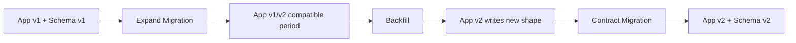
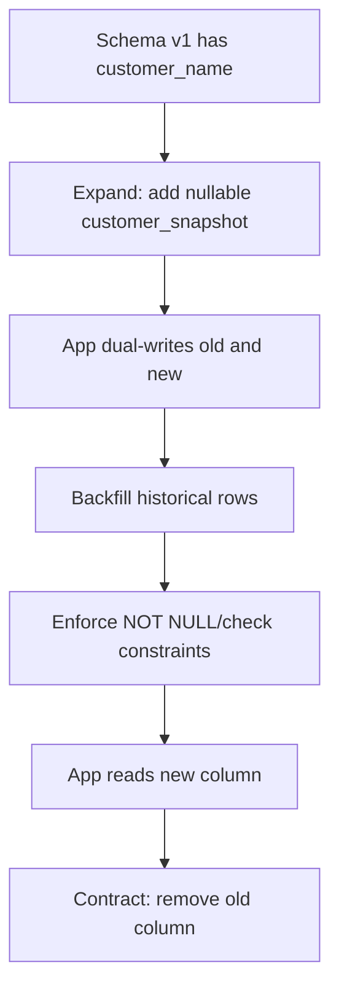
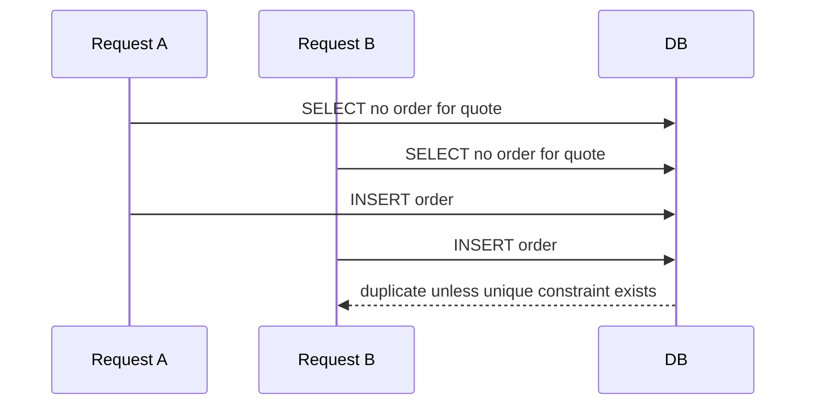
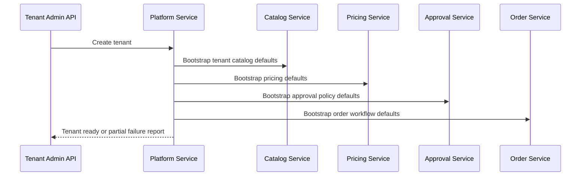
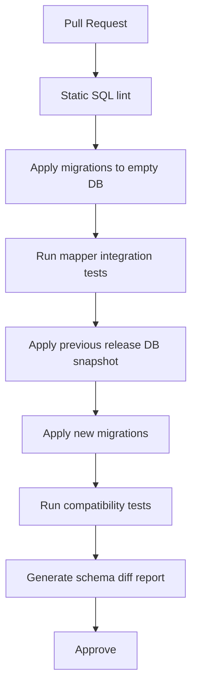
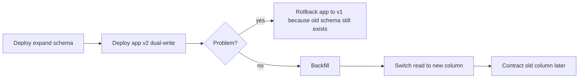
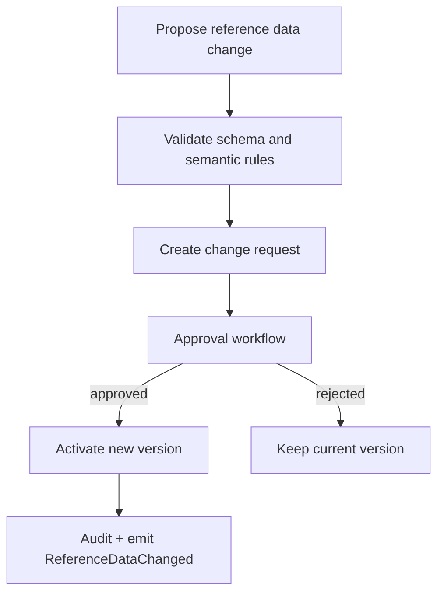

# Part 010 — Database Migrations and Reference Data

## 1. Tujuan Part Ini

Pada part ini kita membangun **database migration dan reference data discipline** untuk platform CPQ/OMS.

Kita sudah mendesain PostgreSQL schema pada Part 008 dan persistence layer MyBatis pada Part 009. Sekarang pertanyaannya: bagaimana schema itu berubah secara aman ketika platform berjalan di banyak environment, banyak service, banyak tenant, dan banyak release?

Target utama:

1. memahami migration sebagai bagian dari delivery system, bukan tugas DBA manual;
2. membedakan versioned migration, repeatable migration, seed data, dan reference data;
3. membuat naming, ordering, review, dan ownership migration;
4. menerapkan expand-contract untuk zero/minimal downtime;
5. mengelola constraint rollout secara aman;
6. melakukan backfill pada table besar tanpa menghancurkan production;
7. mendesain reference data yang versioned dan auditable;
8. melakukan tenant bootstrap secara reproducible;
9. membangun CI/CD gate untuk migration;
10. menyiapkan rollback/roll-forward policy yang realistis;
11. membuat runbook saat migration gagal.

Migration adalah salah satu area yang membedakan sistem demo dan sistem production. Demo bisa drop-create database. Production tidak bisa.

> Dalam CPQ/OMS, schema migration adalah perubahan kontrak bisnis. Ia harus direview seperti code, diuji seperti code, dan dioperasikan seperti deployment.

---

## 2. Mental Model: Database Sebagai Shared Time Machine

Database production bukan hanya state hari ini. Ia menyimpan sejarah keputusan bisnis.

Dalam CPQ/OMS, database berisi:

- quote draft;
- accepted quote snapshot;
- pricing decision;
- discount approval;
- customer commitment;
- order lifecycle;
- fulfillment state;
- audit evidence;
- outbox/inbox event;
- idempotency record;
- reference data version.

Schema migration berarti mengubah cara kita membaca dan menulis sejarah tersebut.



Prinsip:

- database sering hidup lebih lama dari versi aplikasi;
- migration harus kompatibel dengan rolling deployment;
- data lama harus tetap bisa dibaca;
- audit/history tidak boleh rusak;
- schema evolution harus punya strategi rollback atau roll-forward.

---

## 3. Migration Tooling Baseline

Seri ini memakai gaya Flyway-like migration discipline:

- versioned migration untuk perubahan berurutan yang dijalankan sekali;
- repeatable migration untuk object yang boleh dibuat ulang ketika checksum berubah, seperti view/function tertentu;
- schema history table untuk melacak migration yang sudah diterapkan;
- checksum untuk mendeteksi perubahan file migration yang sudah pernah berjalan.

Contoh struktur:

```txt
services/quote-service/quote-persistence-mybatis/src/main/resources/db/migration/
  V001__create_quote_schema.sql
  V002__create_quote_tables.sql
  V003__create_quote_idempotency.sql
  V004__create_quote_outbox.sql
  V005__add_quote_expiration_index.sql
  R__quote_search_projection_view.sql
```

Catatan penting:

- migration yang sudah berjalan di environment permanen tidak diedit;
- perubahan baru dibuat sebagai migration baru;
- repeatable migration harus aman dijalankan berulang;
- migration bukan tempat menyembunyikan business rule tanpa test.

---

## 4. Jenis Perubahan Database

Tidak semua file SQL adalah migration yang sama.

| Jenis | Contoh | Sifat | Risiko |
|---|---|---|---|
| Schema migration | create table, add column, add index | structural | lock, compatibility |
| Constraint migration | add check, FK, unique | invariant enforcement | existing bad data |
| Data migration | backfill column, normalize data | data transformation | slow, irreversible |
| Reference data migration | add status reason, product rule code | business configuration | semantic drift |
| Repeatable object | view/function | replaceable | dependency break |
| Test seed | fixture dev/test | non-production | false confidence |
| Tenant bootstrap | initial tenant rows | operational | partial bootstrap |

Jangan mencampur semuanya tanpa label.

---

## 5. Migration Ownership Dalam Microservices

Rule utama:

> Service yang memiliki schema adalah satu-satunya pihak yang boleh memigrasikan schema tersebut.

Contoh:

```txt
quote-service owns:       quote.*
order-service owns:       order_mgmt.*
pricing-service owns:     pricing.*
catalog-service owns:     catalog.*
approval-service owns:    approval.*
```

Service lain tidak boleh membuat migration ke schema yang bukan miliknya.

Jika order service butuh quote data, pilihan yang benar:

- API call ke quote service;
- Kafka event projection;
- replicated read model milik order service;
- shared analytical warehouse, bukan operational coupling.

Buruk:

```sql
-- order-service migration, buruk
ALTER TABLE quote.quote ADD COLUMN order_id UUID;
```

Lebih baik:

```sql
-- quote-service migration
ALTER TABLE quote.quote ADD COLUMN converted_order_id UUID;
```

Atau order service menyimpan correlation sendiri:

```sql
CREATE TABLE order_mgmt.order_quote_reference (
    tenant_id UUID NOT NULL,
    order_id UUID NOT NULL,
    quote_id UUID NOT NULL,
    quote_number TEXT NOT NULL,
    accepted_quote_snapshot JSONB NOT NULL,
    PRIMARY KEY (tenant_id, order_id)
);
```

---

## 6. Repository Layout

Setiap service membawa migration-nya sendiri.

```txt
services/order-service/
  order-persistence-mybatis/
    src/main/resources/db/migration/
      V001__create_order_schema.sql
      V002__create_order_tables.sql
      V003__create_fulfillment_task_tables.sql
      V004__create_outbox.sql
      V005__create_inbox.sql
      R__order_search_projection.sql
    src/test/resources/db/testdata/
      T001__insert_basic_order_fixture.sql
```

Global/shared migration harus dihindari kecuali untuk database-level extension atau platform-level bootstrap yang benar-benar dimiliki platform infra.

Contoh platform migration:

```txt
platform/database/
  V001__create_service_roles.sql
  V002__create_common_extensions.sql
```

Tetapi table bisnis tetap milik service.

---

## 7. Naming Convention

Gunakan nama yang menjelaskan outcome.

Baik:

```txt
V001__create_quote_schema.sql
V002__create_quote_header_table.sql
V003__create_quote_line_table.sql
V004__add_quote_status_check_constraint.sql
V005__add_quote_search_created_index.sql
V006__add_quote_acceptance_idempotency_table.sql
```

Buruk:

```txt
V001__init.sql
V002__changes.sql
V003__fix.sql
V004__more_fix.sql
```

Untuk big team, gunakan timestamp version:

```txt
V20260702103000__add_quote_expiration_index.sql
```

Keuntungan timestamp:

- mengurangi konflik parallel branch;
- urutan global lebih jelas;
- mudah trace ke deployment window.

Kekurangan:

- lebih panjang;
- perlu tooling helper.

Pilih satu konvensi dan konsisten.

---

## 8. Baseline Schema Creation

Migration awal quote service:

```sql
CREATE SCHEMA IF NOT EXISTS quote;

CREATE TABLE quote.quote (
    tenant_id UUID NOT NULL,
    quote_id UUID NOT NULL,
    quote_number TEXT NOT NULL,
    customer_id UUID NOT NULL,
    status TEXT NOT NULL,
    currency CHAR(3) NOT NULL,
    total_amount_minor BIGINT NOT NULL,
    currency_scale SMALLINT NOT NULL,
    version INTEGER NOT NULL DEFAULT 0,
    created_at TIMESTAMPTZ NOT NULL,
    updated_at TIMESTAMPTZ NOT NULL,
    expires_at TIMESTAMPTZ NOT NULL,
    accepted_at TIMESTAMPTZ,
    cancelled_at TIMESTAMPTZ,
    PRIMARY KEY (tenant_id, quote_id),
    UNIQUE (tenant_id, quote_number),
    CHECK (currency_scale >= 0 AND currency_scale <= 6),
    CHECK (status IN (
        'DRAFT',
        'SUBMITTED',
        'APPROVAL_PENDING',
        'APPROVED',
        'ACCEPTED',
        'EXPIRED',
        'CANCELLED'
    ))
);
```

Baseline table harus memiliki:

- primary key;
- tenant boundary;
- lifecycle status;
- version;
- created/updated timestamp;
- meaningful constraints;
- index strategy minimal.

---

## 9. Migration Review Checklist

Setiap migration harus direview dengan pertanyaan:

1. Apakah backward compatible dengan app version yang masih berjalan?
2. Apakah forward compatible dengan app version berikutnya?
3. Apakah ada lock berat?
4. Apakah migration membaca/menulis table besar?
5. Apakah constraint baru punya existing data validation?
6. Apakah index dibuat dengan strategi aman?
7. Apakah migration idempotent jika perlu?
8. Apakah migration bisa diobservasi?
9. Apakah ada rollback atau roll-forward plan?
10. Apakah runbook failure jelas?
11. Apakah service owner menyetujui?
12. Apakah test migration berjalan dari empty DB dan dari previous version DB?

---

## 10. Expand-Contract Pattern

Perubahan breaking harus dibagi.

Contoh: mengganti `quote.customer_name` menjadi `customer_snapshot JSONB`.

### 10.1 Buruk: Big Bang

```sql
ALTER TABLE quote.quote DROP COLUMN customer_name;
ALTER TABLE quote.quote ADD COLUMN customer_snapshot JSONB NOT NULL;
```

Aplikasi lama langsung rusak. Existing rows tidak punya snapshot.

### 10.2 Baik: Expand

Migration 1:

```sql
ALTER TABLE quote.quote
ADD COLUMN customer_snapshot JSONB;
```

App v1 masih memakai `customer_name`. App v2 mulai dual-write `customer_name` dan `customer_snapshot`.

### 10.3 Backfill

Migration/job:

```sql
UPDATE quote.quote
SET customer_snapshot = jsonb_build_object(
    'schemaVersion', 1,
    'displayName', customer_name
)
WHERE customer_snapshot IS NULL;
```

Untuk table besar, jangan satu UPDATE raksasa. Gunakan chunked backfill.

### 10.4 Enforce

Setelah semua row terisi:

```sql
ALTER TABLE quote.quote
ALTER COLUMN customer_snapshot SET NOT NULL;
```

### 10.5 Contract

Setelah semua app version tidak memakai `customer_name`:

```sql
ALTER TABLE quote.quote
DROP COLUMN customer_name;
```

Flow:



---

## 11. Add Column Safely

Adding column seems simple, but production nuance matters.

Safe usually:

```sql
ALTER TABLE quote.quote
ADD COLUMN source_channel TEXT;
```

Risky:

```sql
ALTER TABLE quote.quote
ADD COLUMN source_channel TEXT NOT NULL DEFAULT 'DIRECT';
```

Depending on database version and table size, default/backfill behavior can create lock or rewrite risk. Safer pattern:

1. add nullable column;
2. deploy app that writes it;
3. backfill old rows;
4. add default if needed;
5. set not null;
6. add check constraint.

Example:

```sql
ALTER TABLE quote.quote
ADD COLUMN source_channel TEXT;

ALTER TABLE quote.quote
ADD CONSTRAINT quote_source_channel_ck
CHECK (source_channel IN ('DIRECT', 'PARTNER', 'RENEWAL')) NOT VALID;
```

Then validate:

```sql
ALTER TABLE quote.quote
VALIDATE CONSTRAINT quote_source_channel_ck;
```

---

## 12. Constraint Rollout

Constraints are valuable because they enforce invariants. But adding them to existing data can fail.

Pattern:

1. detect bad data;
2. repair or quarantine;
3. add constraint as not validated if supported;
4. validate constraint;
5. monitor violation errors after release.

Example data check:

```sql
SELECT tenant_id, quote_id, status
FROM quote.quote
WHERE status NOT IN (
    'DRAFT',
    'SUBMITTED',
    'APPROVAL_PENDING',
    'APPROVED',
    'ACCEPTED',
    'EXPIRED',
    'CANCELLED'
);
```

If result non-empty, do not add constraint blindly.

Migration:

```sql
ALTER TABLE quote.quote
ADD CONSTRAINT quote_status_ck
CHECK (status IN (
    'DRAFT',
    'SUBMITTED',
    'APPROVAL_PENDING',
    'APPROVED',
    'ACCEPTED',
    'EXPIRED',
    'CANCELLED'
)) NOT VALID;

ALTER TABLE quote.quote
VALIDATE CONSTRAINT quote_status_ck;
```

Constraint is not just database decoration. It is production guardrail.

---

## 13. Index Migration

Index creation can be expensive.

For PostgreSQL production, consider concurrent index creation for large active tables:

```sql
CREATE INDEX CONCURRENTLY quote_created_search_idx
ON quote.quote (tenant_id, created_at DESC, quote_id DESC);
```

Caveat:

- concurrent index creation cannot run inside a normal transaction block;
- migration tool configuration must support non-transactional migration for that file;
- if it fails, invalid index may need cleanup;
- index creation consumes IO/CPU;
- schedule carefully for very large tables.

Index review questions:

1. Query apa yang membutuhkan index ini?
2. Apakah index prefix sesuai predicate?
3. Apakah sort order sesuai query?
4. Apakah index duplikat dengan index lain?
5. Apakah write overhead acceptable?
6. Apakah index punya observability setelah deploy?

---

## 14. Unique Constraint Untuk Business Invariant

Idempotency dan duplicate prevention harus dijaga database.

Quote number:

```sql
ALTER TABLE quote.quote
ADD CONSTRAINT quote_number_uq UNIQUE (tenant_id, quote_number);
```

Order from quote:

```sql
CREATE UNIQUE INDEX order_from_quote_once_uq
ON order_mgmt.customer_order (tenant_id, accepted_quote_id)
WHERE accepted_quote_id IS NOT NULL;
```

Idempotency:

```sql
ALTER TABLE order_mgmt.idempotency_record
ADD CONSTRAINT idempotency_key_uq
UNIQUE (tenant_id, idempotency_key);
```

Do not rely on application `SELECT before INSERT` alone.

Race condition:



---

## 15. Data Backfill Strategy

Backfill adalah operation, bukan hanya SQL.

Bad:

```sql
UPDATE quote.quote
SET customer_snapshot = ...
WHERE customer_snapshot IS NULL;
```

Jika table besar, ini bisa:

- lock lama;
- generate WAL besar;
- membuat replication lag;
- membuat autovacuum kewalahan;
- menurunkan latency API.

Better: chunked backfill.

```sql
WITH batch AS (
    SELECT tenant_id, quote_id
    FROM quote.quote
    WHERE customer_snapshot IS NULL
    ORDER BY created_at ASC
    LIMIT 1000
)
UPDATE quote.quote q
SET customer_snapshot = jsonb_build_object(
    'schemaVersion', 1,
    'displayName', q.customer_name
)
FROM batch b
WHERE q.tenant_id = b.tenant_id
  AND q.quote_id = b.quote_id;
```

Backfill runner:

```txt
while rows_updated > 0:
  update next batch
  commit
  sleep small interval
  emit metric
  stop if error budget pressure high
```

Metrics:

```txt
backfill.rows.updated
backfill.batch.duration
backfill.remaining.estimate
backfill.error.count
replication.lag
api.latency.p95
```

---

## 16. Backfill Ownership

Backfill dapat dilakukan sebagai:

1. migration SQL;
2. one-off admin job;
3. service background job;
4. separate data migration tool;
5. operational script with runbook.

Untuk table kecil, migration SQL cukup.

Untuk table besar, gunakan job yang:

- bisa pause/resume;
- punya checkpoint;
- punya metric;
- idempotent;
- bisa dijalankan ulang;
- tidak berjalan bersamaan tanpa lock/lease;
- tidak melanggar business invariant.

Checkpoint table:

```sql
CREATE TABLE platform.data_migration_checkpoint (
    migration_name TEXT PRIMARY KEY,
    last_processed_key TEXT,
    status TEXT NOT NULL,
    rows_processed BIGINT NOT NULL DEFAULT 0,
    updated_at TIMESTAMPTZ NOT NULL
);
```

---

## 17. Reference Data: Definisi

Reference data adalah data yang dipakai sistem untuk mengambil keputusan tetapi bukan transaksi bisnis utama.

Contoh CPQ/OMS:

- quote status reason code;
- order cancellation reason;
- approval policy type;
- discount reason;
- product category;
- eligibility rule code;
- fulfillment provider code;
- escalation SLA profile;
- currency metadata;
- tax region placeholder;
- channel code;
- tenant plan type.

Reference data bukan sekadar seed data.

Seed data sering hanya untuk dev/test. Reference data mempengaruhi production behavior.

---

## 18. Reference Data Modeling

Contoh table:

```sql
CREATE TABLE quote.quote_status_reason_ref (
    tenant_id UUID,
    reason_code TEXT NOT NULL,
    display_name TEXT NOT NULL,
    applies_to_status TEXT NOT NULL,
    is_active BOOLEAN NOT NULL,
    effective_from TIMESTAMPTZ NOT NULL,
    effective_to TIMESTAMPTZ,
    version INTEGER NOT NULL,
    created_at TIMESTAMPTZ NOT NULL,
    updated_at TIMESTAMPTZ NOT NULL,
    PRIMARY KEY (tenant_id, reason_code, version),
    CHECK (applies_to_status IN ('CANCELLED', 'EXPIRED', 'REJECTED')),
    CHECK (effective_to IS NULL OR effective_to > effective_from)
);
```

`tenant_id` nullable dapat berarti global default. Tetapi ini harus diputuskan secara eksplisit.

Alternative:

- global table terpisah;
- tenant override table;
- effective-dated row;
- versioned immutable row.

---

## 19. Reference Data Versioning

Jika reference data mempengaruhi quote/order decision, simpan version yang dipakai.

Contoh approval policy:

```sql
CREATE TABLE approval.approval_policy (
    tenant_id UUID NOT NULL,
    policy_id UUID NOT NULL,
    policy_version INTEGER NOT NULL,
    policy_code TEXT NOT NULL,
    rule_payload JSONB NOT NULL,
    effective_from TIMESTAMPTZ NOT NULL,
    effective_to TIMESTAMPTZ,
    status TEXT NOT NULL,
    PRIMARY KEY (tenant_id, policy_id, policy_version)
);
```

Quote approval request menyimpan:

```sql
CREATE TABLE approval.approval_request (
    tenant_id UUID NOT NULL,
    approval_request_id UUID NOT NULL,
    quote_id UUID NOT NULL,
    policy_id UUID NOT NULL,
    policy_version INTEGER NOT NULL,
    policy_snapshot JSONB NOT NULL,
    status TEXT NOT NULL,
    created_at TIMESTAMPTZ NOT NULL,
    PRIMARY KEY (tenant_id, approval_request_id)
);
```

Kenapa snapshot?

- policy bisa berubah setelah decision;
- audit perlu menjawab “aturan apa yang berlaku saat itu?”;
- regulator/internal reviewer tidak boleh bergantung pada current policy;
- replay calculation harus deterministic.

---

## 20. Reference Data Delivery Options

| Option | Cocok Untuk | Risiko |
|---|---|---|
| SQL migration | small static ref data | deploy required for business config |
| Admin UI | business-managed config | perlu approval/audit kuat |
| Config repository | GitOps-style reference | delay + operational complexity |
| API-managed | multi-tenant dynamic config | versioning dan authorization wajib |

Untuk build-from-scratch awal, gunakan kombinasi:

- SQL migration untuk system codes yang jarang berubah;
- admin API/UI untuk tenant policy/config yang berubah;
- semua production-changing reference data harus auditable.

---

## 21. Insert Reference Data Dengan Idempotent Upsert

Untuk reference data global yang aman diulang:

```sql
INSERT INTO quote.quote_status_reason_ref (
    tenant_id,
    reason_code,
    display_name,
    applies_to_status,
    is_active,
    effective_from,
    version,
    created_at,
    updated_at
) VALUES
    (NULL, 'CUSTOMER_REQUEST', 'Customer Request', 'CANCELLED', true, '2026-01-01T00:00:00Z', 1, now(), now()),
    (NULL, 'QUOTE_EXPIRED', 'Quote Expired', 'EXPIRED', true, '2026-01-01T00:00:00Z', 1, now(), now())
ON CONFLICT (tenant_id, reason_code, version) DO UPDATE
SET display_name = EXCLUDED.display_name,
    applies_to_status = EXCLUDED.applies_to_status,
    is_active = EXCLUDED.is_active,
    updated_at = now();
```

Caveat:

- upsert bisa mengubah history jika table dimaksud immutable;
- untuk reference data versioned, lebih baik insert version baru;
- update in place hanya untuk typo display name yang tidak mempengaruhi decision;
- perubahan semantic harus version baru.

---

## 22. Immutable vs Mutable Reference Data

| Data | Mutable? | Strategy |
|---|---:|---|
| Display label typo | Ya, terbatas | update in place dengan audit |
| Approval threshold | Tidak untuk historical decision | version baru |
| Discount reason code | Biasanya append-only | deactivate old, add new |
| Fulfillment provider endpoint | Ya | config version + audit |
| Currency metadata | Sangat hati-hati | effective dated |
| Product compatibility rule | Tidak untuk published catalog | catalog version baru |

Rule:

> Jika perubahan reference data bisa mengubah hasil decision masa lalu, jangan update in place.

---

## 23. Tenant Bootstrap

Tenant baru membutuhkan initial data.

Bootstrap steps:

1. create tenant record;
2. create service-level tenant schema rows;
3. create default catalog visibility;
4. create default pricing policy;
5. create default approval policy;
6. create default order workflow config;
7. create roles/permissions;
8. create idempotent bootstrap marker;
9. emit tenant bootstrapped event.

Bootstrap table:

```sql
CREATE TABLE platform.tenant_bootstrap_status (
    tenant_id UUID NOT NULL,
    service_name TEXT NOT NULL,
    bootstrap_version INTEGER NOT NULL,
    status TEXT NOT NULL,
    started_at TIMESTAMPTZ NOT NULL,
    completed_at TIMESTAMPTZ,
    error_message TEXT,
    PRIMARY KEY (tenant_id, service_name, bootstrap_version)
);
```

Flow:



Bootstrap must be idempotent. If it fails halfway, rerun should complete, not duplicate.

---

## 24. Seed Data Untuk Development dan Test

Jangan campur production reference data dengan test fixture.

Production migration:

```txt
src/main/resources/db/migration/V010__insert_global_reason_codes.sql
```

Test fixture:

```txt
src/test/resources/db/testdata/T001__insert_quote_test_fixture.sql
```

Dev demo data:

```txt
src/dev/resources/db/demo/D001__insert_demo_catalog.sql
```

Rules:

- production migration tidak boleh bergantung pada test seed;
- test seed boleh reset database;
- demo data tidak boleh masuk production classpath;
- fixture harus kecil dan semantik;
- test data harus bisa dibuat dari factory juga, bukan hanya SQL besar.

---

## 25. Migration Dalam CI

CI gate minimal:



CI checks:

- migration file naming valid;
- no edited applied migration baseline;
- migrations run from empty DB;
- migrations run from previous release DB;
- MyBatis mapper tests pass;
- OpenAPI/schema compatibility tests pass if DB changes affect API;
- dangerous operations flagged;
- repeatable migrations idempotent;
- SQL formatting/linting pass.

---

## 26. Dangerous Operation Detection

Flag otomatis jika migration mengandung:

```txt
DROP TABLE
DROP COLUMN
ALTER COLUMN ... TYPE
ALTER COLUMN ... SET NOT NULL
UPDATE without WHERE
DELETE without WHERE
CREATE INDEX without CONCURRENTLY on large table
ALTER TABLE large_table ADD COLUMN ... NOT NULL
TRUNCATE
```

Tidak semua dilarang, tetapi harus butuh explicit review.

Example PR template:

```md
## Database Migration Review

- [ ] Backward compatible with current app version
- [ ] Forward compatible with next app version
- [ ] Expand-contract plan included
- [ ] Backfill plan included if needed
- [ ] Lock risk assessed
- [ ] Roll-forward plan included
- [ ] Runbook added/updated
- [ ] Data quality pre-check included
- [ ] Owner approved
```

---

## 27. Runtime Migration Strategy

Ada beberapa strategi menjalankan migration:

| Strategy | Cara | Kelebihan | Risiko |
|---|---|---|---|
| App runs migration at startup | service start menjalankan migration | sederhana | multiple instance race, startup lambat |
| Dedicated migration job | CI/CD menjalankan job sebelum app deploy | kontrol tinggi | butuh orchestration |
| Manual DBA run | operator menjalankan SQL | kontrol manual | drift, human error |
| GitOps DB deploy | migration sebagai pipeline terpisah | auditable | kompleks |

Untuk platform ini, baseline production:

1. dedicated migration job per service;
2. app startup melakukan validation, bukan migration berat;
3. app gagal start jika schema version incompatible;
4. migration job punya log, metric, dan approval gate.

---

## 28. App-Schema Compatibility

Aplikasi harus tahu minimal schema version yang ia butuhkan.

Table history disediakan migration tool, tetapi app bisa punya compatibility check sendiri:

```sql
CREATE TABLE platform.service_schema_version (
    service_name TEXT PRIMARY KEY,
    schema_version TEXT NOT NULL,
    updated_at TIMESTAMPTZ NOT NULL
);
```

App startup:

```java
public void verifySchemaCompatibility() {
    var actual = schemaVersionRepository.currentVersion("quote-service");
    if (!actual.isAtLeast(MIN_REQUIRED_SCHEMA_VERSION)) {
        throw new IllegalStateException(
            "quote-service requires schema >= " + MIN_REQUIRED_SCHEMA_VERSION + " but found " + actual
        );
    }
}
```

Namun jangan membuat duplicate source of truth yang membingungkan. Jika memakai Flyway schema history, compatibility checker bisa membaca history atau marker yang ditulis migration.

---

## 29. Rollback vs Roll-Forward

Rollback database tidak semudah rollback aplikasi.

Masalah rollback:

- data sudah ditulis dalam shape baru;
- column lama sudah dihapus;
- migration sudah mengubah semantic data;
- event sudah dipublish;
- app lama tidak bisa membaca data baru;
- migration undo belum tentu aman.

Karena itu, strategi utama production adalah **roll-forward**.

Design untuk roll-forward:

- expand-contract;
- jangan drop cepat;
- dual-read/dual-write sementara;
- feature flag;
- keep old column selama satu atau beberapa release;
- migration reversible secara semantic jika memungkinkan;
- backup sebelum operasi besar.

Rollback app bisa dilakukan jika schema masih backward compatible.



---

## 30. Migration Failure Runbook

Jika migration gagal:

1. stop deployment pipeline;
2. capture error message, SQL state, migration version;
3. check whether transaction rolled back;
4. inspect partial object creation;
5. check schema history table;
6. determine safe fix:
   - rerun same migration if no partial state;
   - create repair migration;
   - manually clean invalid index/object with approval;
   - restore backup only for catastrophic case;
7. communicate environment impact;
8. update runbook/CI to prevent recurrence.

Do not immediately edit already-run migration unless environment is disposable.

---

## 31. Drift Detection

Schema drift terjadi ketika database production berbeda dari migration-defined schema.

Penyebab:

- manual hotfix SQL;
- failed migration partial state;
- environment-specific patch;
- migration edited after applied;
- extension/object created manually;
- reference data changed outside system.

Mitigation:

- restrict production DDL privilege;
- migration user only in pipeline;
- runtime user no DDL;
- nightly schema diff;
- schema history checksum validation;
- audit manual changes;
- reference data admin API with audit.

---

## 32. Reference Data Audit

Reference data change harus punya audit trail.

Audit table:

```sql
CREATE TABLE platform.reference_data_audit (
    audit_id UUID PRIMARY KEY,
    tenant_id UUID,
    reference_type TEXT NOT NULL,
    reference_key TEXT NOT NULL,
    old_value JSONB,
    new_value JSONB NOT NULL,
    change_reason TEXT NOT NULL,
    changed_by TEXT NOT NULL,
    changed_at TIMESTAMPTZ NOT NULL,
    approval_id UUID
);
```

Captured fields:

- who changed;
- when;
- what changed;
- why;
- approval reference;
- before/after;
- tenant scope;
- effective date;
- source system.

For regulatory defensibility, “we changed the config” is not enough. You need evidence.

---

## 33. Reference Data Approval Workflow

Some reference data changes should require approval.

Examples:

- max discount threshold;
- auto-approval policy;
- escalation SLA;
- cancellation fee rule;
- fulfillment routing rule;
- price book activation;
- product compatibility rule.

Flow:



Implementation options:

- simple approval table in owning service;
- Camunda process for high-risk policy changes;
- admin API with maker-checker;
- GitOps pull request for config repository.

---

## 34. Effective Dating

Reference data often needs effective periods.

Example price book:

```sql
CREATE TABLE pricing.price_book (
    tenant_id UUID NOT NULL,
    price_book_id UUID NOT NULL,
    price_book_version INTEGER NOT NULL,
    status TEXT NOT NULL,
    effective_from TIMESTAMPTZ NOT NULL,
    effective_to TIMESTAMPTZ,
    created_at TIMESTAMPTZ NOT NULL,
    PRIMARY KEY (tenant_id, price_book_id, price_book_version),
    CHECK (effective_to IS NULL OR effective_to > effective_from)
);
```

Prevent overlap using exclusion constraint if needed:

```sql
-- Conceptual. Requires proper range type modeling.
-- Prevent two active price book versions overlapping for same tenant/book.
```

Application rule:

- quote uses price book effective at pricing time;
- accepted quote stores price book version and price snapshot;
- future price book changes do not mutate accepted quote.

---

## 35. Status Code Reference Data

Lifecycle statuses are often code, but not always reference data.

Core state machine status should usually be code enum + DB check constraint:

```txt
DRAFT
SUBMITTED
APPROVAL_PENDING
APPROVED
ACCEPTED
EXPIRED
CANCELLED
```

Reason codes are better as reference data:

```txt
CUSTOMER_REQUEST
PRICE_TOO_HIGH
DUPLICATE_QUOTE
QUOTE_EXPIRED
POLICY_REJECTED
```

Why?

- state machine status controls code path;
- reason code explains business decision;
- reason codes change more often;
- reason codes may be tenant-specific;
- status explosion is harmful.

Do not turn every reason into a status.

---

## 36. Migration and MyBatis Coupling

Every mapper assumes schema shape.

If migration changes a column:

1. update SQL mapper;
2. update row model;
3. update row-domain mapper;
4. update integration test;
5. update API/schema if exposed;
6. update projection index if query changed;
7. update runbook if operational semantics changed.

Checklist for column rename:

- add new column;
- dual-write;
- dual-read fallback;
- backfill;
- switch read;
- remove old read;
- remove old write;
- drop old column later.

MyBatis XML makes coupling visible. Use that visibility.

---

## 37. Migration and Kafka Event Contracts

DB schema changes can affect event payload.

Example:

- DB adds `customer_snapshot`;
- event `QuoteAccepted` now includes customer snapshot;
- old consumers may not understand new field;
- event schema must evolve compatibly.

Rules:

- DB migration does not automatically change event contract;
- event versioning is separate;
- outbox payload builder must support compatibility;
- event schema tests must run with migration tests;
- if historical events are replayed, consumers must handle old payload.

---

## 38. Migration and Camunda 7

Camunda 7 has its own schema lifecycle. Treat it separately.

Rules:

- business service migration must not alter Camunda engine tables;
- Camunda schema migration follows Camunda-supported path;
- process variable schema is application responsibility;
- store business truth in service DB, not only Camunda variables;
- BPMN deployment version and DB schema version need compatibility planning.

Example:

Order service adds `fulfillment_batch_id`.

Safe plan:

1. add nullable column in order DB;
2. deploy delegate that can write it if present;
3. deploy BPMN version that supplies it;
4. support old process instances without it;
5. later enforce not null only for new process version if needed.

Long-running process instances make migration more complex.

---

## 39. Multi-Tenant Migration Concerns

Schema-per-tenant and shared-schema tenancy have different migration costs.

This series baseline: shared schema with `tenant_id`.

Benefits:

- one migration per service DB;
- easier cross-tenant operations;
- simpler connection management;
- consistent indexes.

Costs:

- every query must tenant-scope;
- table can become very large;
- noisy tenant risk;
- backfill must account for tenant distribution.

Backfill by tenant:

```sql
WITH batch AS (
    SELECT tenant_id, quote_id
    FROM quote.quote
    WHERE tenant_id = #{tenantId}
      AND customer_snapshot IS NULL
    ORDER BY created_at ASC
    LIMIT #{limit}
)
UPDATE quote.quote q
SET customer_snapshot = ...
FROM batch b
WHERE q.tenant_id = b.tenant_id
  AND q.quote_id = b.quote_id;
```

Tenant-aware backfill lets you pause problematic tenants and protect high-priority tenants.

---

## 40. Environment Promotion

Migration should be promoted through environments:

```txt
local -> CI -> dev -> integration -> staging -> production
```

But beware: empty database tests are not enough.

You need:

- empty DB migration test;
- previous release DB migration test;
- realistic volume test for risky migration;
- masked production snapshot test for major migration;
- rollback/roll-forward rehearsal.

Production-like data reveals issues that synthetic empty DB cannot.

---

## 41. Zero-Downtime Deployment Sequence

For backward-compatible migration:

```txt
1. Run expand migration.
2. Deploy app version that can use old and new schema.
3. Observe.
4. Backfill if needed.
5. Switch read path with feature flag.
6. Observe.
7. Contract old schema in later release.
```

For non-compatible migration, redesign until it becomes compatible. Most breaking DB changes can be decomposed.

---

## 42. Example: Adding Quote Expiration Reason

Requirement:

> When quote expires, store an expiration reason and expose it in audit/reporting.

Bad migration:

```sql
ALTER TABLE quote.quote
ADD COLUMN expiration_reason TEXT NOT NULL;
```

This fails existing rows.

Better sequence:

### Migration 1: Expand

```sql
ALTER TABLE quote.quote
ADD COLUMN expiration_reason TEXT;

ALTER TABLE quote.quote
ADD CONSTRAINT quote_expiration_reason_ck
CHECK (
    expiration_reason IS NULL OR expiration_reason IN (
        'TIME_ELAPSED',
        'SUPERSEDED',
        'CUSTOMER_INACTIVE'
    )
) NOT VALID;
```

### App v2

- writes `expiration_reason` when status becomes `EXPIRED`;
- can read null for old expired quotes;
- API returns null or `UNKNOWN_LEGACY` depending contract.

### Backfill

```sql
UPDATE quote.quote
SET expiration_reason = 'TIME_ELAPSED'
WHERE status = 'EXPIRED'
  AND expiration_reason IS NULL
  AND expires_at < now();
```

For large data, do chunked.

### Validate

```sql
ALTER TABLE quote.quote
VALIDATE CONSTRAINT quote_expiration_reason_ck;
```

### Optional Contract

If rule becomes “all expired quotes must have reason,” use conditional constraint:

```sql
ALTER TABLE quote.quote
ADD CONSTRAINT quote_expired_has_reason_ck
CHECK (status <> 'EXPIRED' OR expiration_reason IS NOT NULL) NOT VALID;
```

Validate after backfill.

---

## 43. Example: Splitting Order Address

Old:

```sql
shipping_address TEXT
```

New:

```sql
shipping_address_snapshot JSONB
```

Plan:

1. add nullable JSONB column;
2. update app to write both;
3. parser backfill old text into structured JSON with parse confidence;
4. rows that cannot parse get `schemaVersion=legacy-text`;
5. read path supports both;
6. business validation only strict for new orders;
7. contract old column after retention window.

Key lesson:

> Not every legacy value can be perfectly migrated. Sometimes the defensible migration is preserving legacy shape explicitly.

---

## 44. Migration Documentation

Every non-trivial migration should have a mini ADR:

```md
# ADR: Add customer_snapshot to quote

## Context
Quote currently stores customer_name only. Accepted quote needs customer snapshot for audit.

## Decision
Add nullable customer_snapshot JSONB, dual-write, backfill, switch read, drop customer_name later.

## Compatibility
App v1 ignores new column. App v2 writes both.

## Backfill
Chunk by created_at, 1000 rows per batch, pause if replication lag > threshold.

## Roll-forward
If app v2 fails, rollback app. Schema is still compatible.

## Risks
Legacy customer_name may be incomplete. Snapshot schema marks legacy source.
```

This is not bureaucracy. It prevents future engineers from guessing.

---

## 45. Operational Metrics

Migration pipeline should emit:

```txt
db.migration.started
db.migration.completed
db.migration.failed
db.migration.duration
db.migration.version
db.migration.lock_wait
db.migration.rows_changed
backfill.rows.remaining
backfill.lag.seconds
```

Dashboards should show:

- current schema version per service/environment;
- failed migration by environment;
- long-running migration;
- backfill progress;
- replication lag;
- DB CPU/IO during migration;
- app error rate after migration.

---

## 46. Security and Privileges

Use separate DB users:

| User | Privilege |
|---|---|
| migration user | DDL + DML for owned schema |
| runtime user | DML only, no DDL |
| read-only user | SELECT only for diagnostics/reporting |
| admin break-glass | restricted/manual approval |

Runtime service should not be able to `ALTER TABLE`.

Migration pipeline should authenticate with short-lived secret where possible.

Manual production DDL should require approval and produce audit entry.

---

## 47. Disaster Recovery Considerations

Before high-risk migration:

- confirm backup freshness;
- confirm restore procedure has been tested;
- estimate restore time;
- know replication topology;
- know point-in-time recovery capability;
- export affected reference data if needed;
- define go/no-go metrics.

Backup is not a rollback strategy if restore time exceeds business tolerance. But for catastrophic migration, it may be the only recovery path.

---

## 48. Anti-Patterns

### 48.1 Editing Applied Migration

Bad:

```txt
V004__create_outbox.sql edited after staging/prod applied it
```

Result:

- checksum mismatch;
- environment drift;
- production uncertainty.

Create new migration instead.

### 48.2 Drop Column In Same Release

Bad:

```sql
ALTER TABLE quote.quote DROP COLUMN customer_name;
```

while old app version may still run.

Use contract release later.

### 48.3 Reference Data Without Version

Bad:

```sql
UPDATE approval_policy SET threshold = 30 WHERE code = 'STANDARD_DISCOUNT';
```

Past approval decisions become ambiguous.

Use versioned policy.

### 48.4 Test Only Empty Database

Migration from empty DB can pass while migration from real previous version fails.

### 48.5 One Giant Migration

Big migration combining schema, data, index, constraints, and reference data is hard to review and hard to recover.

Split by intent.

---

## 49. Implementation Blueprint

Minimal implementation for quote service:

```txt
quote-persistence-mybatis/
  src/main/resources/db/migration/
    V001__create_quote_schema.sql
    V002__create_quote_tables.sql
    V003__create_quote_line_tables.sql
    V004__create_quote_charge_tables.sql
    V005__create_idempotency_table.sql
    V006__create_outbox_table.sql
    V007__create_quote_search_indexes.sql
    V008__insert_quote_reason_reference_data.sql
    R__quote_search_projection.sql
  src/test/java/.../migration/
    QuoteMigrationEmptyDatabaseTest.java
    QuoteMigrationPreviousVersionTest.java
    QuoteReferenceDataTest.java
```

Pipeline:

```txt
mvn verify
  -> start PostgreSQL test container
  -> apply migrations
  -> run mapper tests
  -> run repository tests
  -> run migration compatibility tests
```

---

## 50. Latihan Implementasi

Implementasikan migration discipline berikut:

1. Buat migration awal untuk quote schema.
2. Buat table quote, quote_line, quote_charge.
3. Buat idempotency dan outbox table.
4. Buat reference table untuk cancellation reason.
5. Tambahkan migration expand untuk `quote.source_channel`.
6. Tambahkan app-level dual-write placeholder.
7. Buat backfill script chunked untuk source channel.
8. Tambahkan check constraint sebagai `NOT VALID`, lalu validate.
9. Tambahkan index untuk quote search.
10. Buat CI test yang apply migration ke empty DB.
11. Buat CI test yang apply migration ke previous schema fixture.
12. Buat script drift detection sederhana.
13. Buat runbook migration failure.

Definition of done:

- migration dapat dijalankan dari kosong;
- migration dapat dijalankan dari previous version;
- reference data punya version/effective date jika mempengaruhi decision;
- dangerous migration terdeteksi di PR;
- runtime user tidak punya DDL privilege;
- rollback/roll-forward plan ditulis untuk migration berisiko;
- MyBatis mapper test berjalan setelah migration.

---

## 51. Ringkasan

Database migration bukan pekerjaan pinggiran. Untuk CPQ/OMS, migration adalah bagian dari cara sistem menjaga kebenaran bisnis sepanjang waktu.

Yang harus diingat:

- migration adalah code dan harus masuk review/test/CI;
- service owner memigrasikan schema miliknya sendiri;
- jangan edit migration yang sudah diterapkan di environment permanen;
- gunakan expand-contract untuk perubahan breaking;
- constraint adalah guardrail, tetapi rollout-nya harus aman;
- backfill table besar adalah operation yang perlu metric dan pause/resume;
- reference data yang mempengaruhi decision harus versioned dan auditable;
- tenant bootstrap harus idempotent;
- rollback database sulit, maka desain roll-forward;
- migration failure harus punya runbook.

Dengan Part 009 dan Part 010, fondasi persistence kita sudah lengkap: **SQL mapping yang eksplisit** dan **schema evolution yang disiplin**. Pada part berikutnya, kita mulai membangun domain capability pertama: **Product Catalog Service**.
