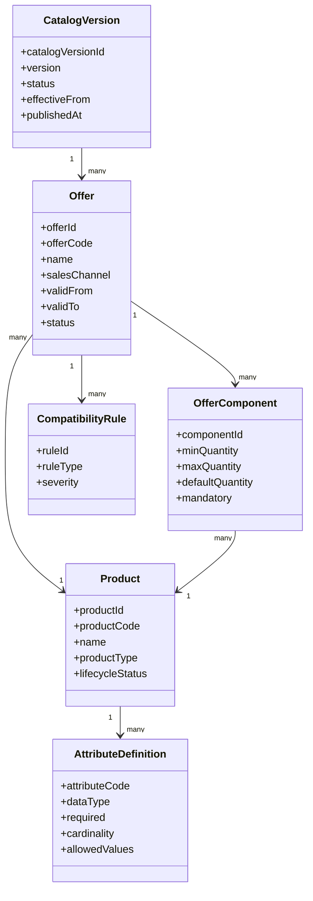
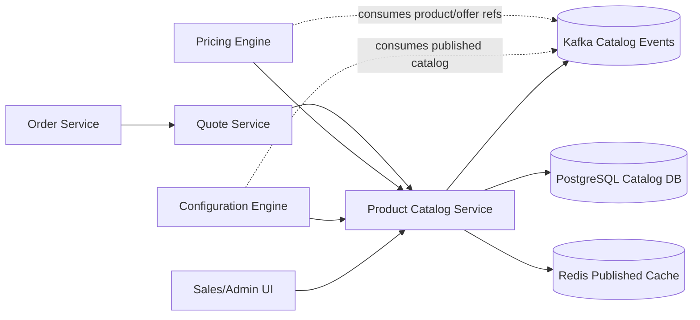
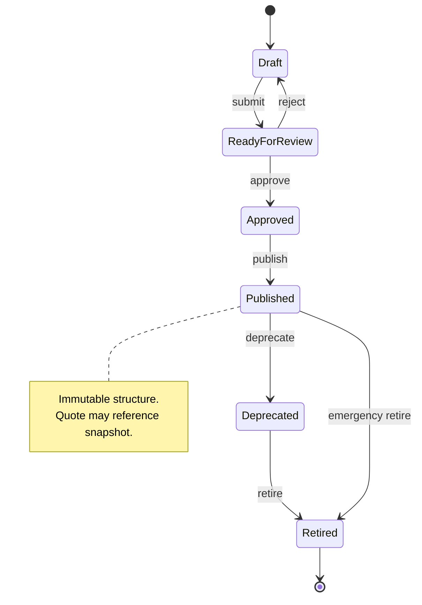
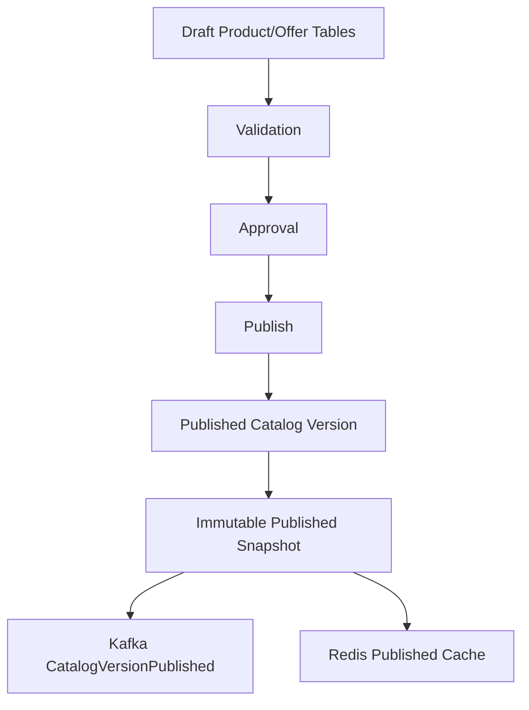
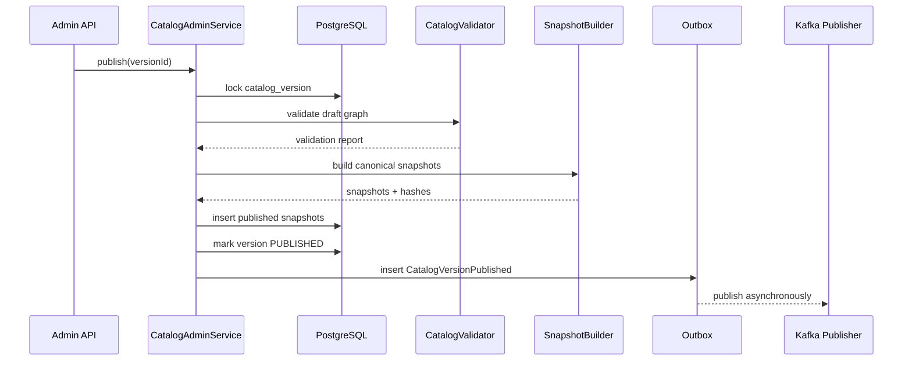
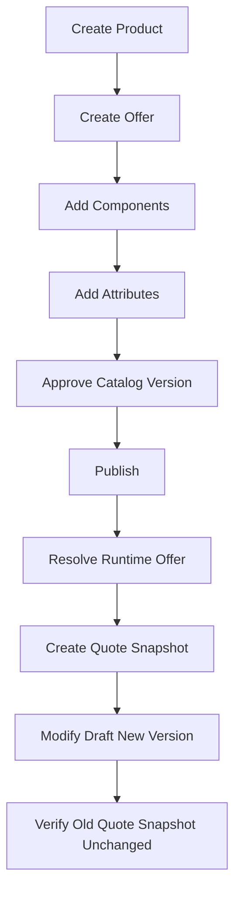

# Part 011 — Product Catalog Service

## 1. Tujuan Part Ini

Pada part ini kita mulai membangun capability domain pertama: **Product Catalog Service**.

Jangan membayangkan catalog service sebagai tabel produk sederhana. Dalam CPQ/OMS, catalog adalah **sumber kebenaran komersial** untuk apa yang boleh dijual, bagaimana ia disusun, kapan valid, aturan konfigurasi dasar, atribut yang wajib diisi, dan versi mana yang dipakai ketika quote dibuat.

Target utama:

1. memahami catalog sebagai domain model, bukan master data dump;
2. membedakan product, offer, bundle, component, attribute, rule, price reference, dan fulfillment reference;
3. mendesain lifecycle catalog dari draft sampai retired;
4. menerapkan temporal versioning agar quote lama tetap valid;
5. membuat contract API catalog yang stabil untuk configuration, pricing, quote, dan order;
6. mendesain PostgreSQL schema yang menjaga invariant catalog;
7. membuat persistence layer MyBatis yang eksplisit dan tidak bocor ke domain;
8. menerbitkan catalog events untuk downstream read model;
9. menggunakan Redis secara aman untuk read acceleration;
10. menyiapkan failure model, auditability, dan operational runbook.

> Catalog menentukan ruang kemungkinan bisnis. Configuration memilih kombinasi valid. Pricing memberi nilai komersial. Quote mengunci komitmen. Order mengeksekusi komitmen.

---

## 2. Kaufman Lens: Skill yang Harus Dikuasai

Jika memakai pendekatan Kaufman, kita tidak mulai dari semua fitur catalog yang mungkin. Kita pecah skill menjadi sub-skill yang paling menentukan performa platform.

### 2.1 Sub-skill inti

| Sub-skill | Kenapa penting |
|---|---|
| Commercial product modeling | Tanpa model yang benar, semua engine setelahnya akan menanggung kompleksitas yang salah. |
| Temporal versioning | Quote dan order membutuhkan snapshot historis, bukan hanya current catalog. |
| Catalog lifecycle | Tidak semua produk yang ada boleh dijual. Draft, published, deprecated, retired harus berbeda. |
| Attribute metadata | Configuration engine butuh metadata yang konsisten: type, cardinality, allowed values, requiredness. |
| Compatibility boundary | Catalog harus tahu relasi dasar, tapi tidak menjadi rule engine universal. |
| API contract | Consumer catalog banyak: config, pricing, quote, order, UI, admin, audit. Contract harus stabil. |
| Data constraint | Catalog corruption biasanya berdampak masif. Constraint harus menangkap invalid state sedini mungkin. |
| Publishing model | Perubahan catalog tidak boleh langsung menghancurkan quote in-flight. |
| Cache invalidation | Catalog adalah read-heavy, tetapi salah cache bisa menyebabkan transaksi bisnis salah. |
| Audit evidence | Siapa mengubah apa, kapan berlaku, dan versi mana dipakai quote harus dapat dibuktikan. |

### 2.2 Target 20 jam praktik

Untuk mencapai keluwesan, latihan minimum bukan membaca pattern, tetapi membangun slice nyata:

1. definisikan offer bundle dengan 3 component;
2. publish catalog version;
3. expose API search dan detail;
4. resolve effective catalog per tanggal;
5. validate attribute metadata;
6. emit `CatalogVersionPublished` event;
7. cache published catalog di Redis;
8. create quote yang mengambil catalog snapshot;
9. ubah catalog setelah quote dibuat;
10. buktikan quote lama tetap memakai snapshot lama.

---

## 3. Mental Model Catalog

Catalog harus menjawab empat pertanyaan:

1. **Apa yang dijual?**
2. **Dalam bentuk apa ia dijual?**
3. **Kapan ia boleh dijual?**
4. **Data apa yang wajib ada sebelum bisa dihitung harga dan dikonversi menjadi order?**



Satu kesalahan umum: menyamakan **product** dengan **offer**.

Dalam banyak domain, product adalah kemampuan atau item komersial dasar. Offer adalah cara product dijual kepada segmen, channel, wilayah, atau periode tertentu. Satu product dapat muncul dalam beberapa offer. Satu offer dapat membungkus banyak product/component.

---

## 4. Catalog Boundary Dalam CPQ/OMS

Catalog service tidak boleh menjadi semua hal. Boundary-nya harus tajam.



Catalog owns:

- product identity;
- offer identity;
- commercial structure;
- attribute metadata;
- lifecycle state;
- effective period;
- publish workflow;
- catalog version;
- catalog audit;
- lightweight compatibility metadata.

Catalog does **not** own:

- final configured selection;
- price calculation;
- discount approval;
- quote acceptance;
- order orchestration;
- fulfillment execution;
- tax calculation;
- inventory reservation.

Catalog may reference external concepts, but should not become owner of those domains.

---

## 5. Product, Offer, Bundle, Component

### 5.1 Product

A product is the stable commercial object.

Example:

- `FIBER_INTERNET`
- `STATIC_IP`
- `ROUTER_DEVICE`
- `PREMIUM_SUPPORT`
- `INSTALLATION_SERVICE`

Product fields:

| Field | Meaning |
|---|---|
| `product_id` | Internal immutable ID. |
| `product_code` | Human/business stable code. |
| `name` | Display name. |
| `product_type` | `SERVICE`, `DEVICE`, `ADDON`, `FEE`, `DISCOUNTABLE_COMPONENT`. |
| `lifecycle_status` | `DRAFT`, `ACTIVE`, `DEPRECATED`, `RETIRED`. |
| `fulfillment_code` | Optional reference used by OMS/fulfillment mapping. |
| `created_at`, `updated_at` | Operational timestamps. |

### 5.2 Offer

An offer is a sellable proposition.

Example:

- `FIBER_100_HOME_PROMO_2026`
- `FIBER_1G_BUSINESS_PLUS`
- `STATIC_IP_ADDON_BUSINESS`

Offer fields:

| Field | Meaning |
|---|---|
| `offer_id` | Internal immutable ID. |
| `offer_code` | Business code used by sales/product team. |
| `catalog_version_id` | Version that contains this offer. |
| `root_product_id` | Main product represented by this offer. |
| `sales_channel` | Optional channel constraint. |
| `customer_segment` | Optional segment constraint. |
| `valid_from`, `valid_to` | Valid selling period. |
| `status` | `DRAFT`, `PUBLISHED`, `DEPRECATED`, `RETIRED`. |

### 5.3 Bundle

A bundle is an offer with component composition.

Example:

`FIBER_1G_BUSINESS_PLUS` includes:

- internet access product;
- static IP addon;
- router device;
- installation service;
- optional premium support.

Composition is not just a list. It has cardinality and constraints.

### 5.4 Component

An offer component describes what may or must exist inside an offer.

| Field | Example |
|---|---|
| `component_code` | `ROUTER_INCLUDED` |
| `component_product_id` | `ROUTER_DEVICE` |
| `mandatory` | `true` |
| `min_quantity` | `1` |
| `max_quantity` | `1` |
| `default_quantity` | `1` |
| `selection_mode` | `FIXED`, `OPTIONAL`, `CHOICE_GROUP` |

---

## 6. Business Invariants Catalog

Catalog must protect invariants. This is where top-tier engineers differ from template implementers.

### 6.1 Identity invariants

1. `product_id` is immutable.
2. `product_code` cannot be reused for a different semantic product.
3. `offer_code` cannot point to two active/published offers in the same catalog version.
4. External fulfillment references must be versioned or mapped explicitly.

### 6.2 Lifecycle invariants

1. A `DRAFT` offer cannot be sold.
2. A `PUBLISHED` offer cannot be structurally mutated in place.
3. A `RETIRED` offer cannot be newly quoted.
4. A quote that already references a retired offer remains valid if it has a captured snapshot.
5. A published catalog version is immutable.

### 6.3 Temporal invariants

1. An offer is sellable only if `valid_from <= quote_requested_at < valid_to`.
2. No two published catalog versions should create ambiguous resolution for the same channel/segment/date unless precedence is explicit.
3. Effective date must be stored using a clear time-zone policy.
4. Quote snapshots must preserve the catalog version used during calculation.

### 6.4 Composition invariants

1. Mandatory components must exist in any valid configuration.
2. `default_quantity` must be between `min_quantity` and `max_quantity`.
3. `max_quantity` must be greater than or equal to `min_quantity`.
4. A component must reference an active product at publish time.
5. Cyclic bundles must be rejected.

### 6.5 Attribute invariants

1. Attribute code is unique per product version.
2. Required attribute must have a clear validation rule.
3. Allowed values must match attribute data type.
4. Attribute deprecation cannot break accepted quote snapshots.
5. Sensitive attribute metadata must be classified.

---

## 7. Lifecycle Model



### 7.1 Why publish must be explicit

A product manager may edit product data for days before it is ready. If every save immediately affects sales flow, then quote results may change unpredictably.

Therefore:

- draft changes are mutable;
- published versions are immutable;
- a publish action creates a stable release of catalog data;
- downstream services consume published versions;
- quote service captures snapshots.

### 7.2 Deprecate vs retire

Deprecation means:

- stop promoting for new sale;
- existing quotes may continue;
- amendment rules may allow limited change.

Retirement means:

- no new quote;
- no amendment adding the offer;
- existing order remains historically valid;
- replacement offer may be suggested.

---

## 8. Versioning Strategy

There are two common models.

### 8.1 Mutable draft plus immutable published version

This is the recommended baseline.



Pros:

- easier authoring;
- stable published contract;
- simple quote snapshot;
- clear audit trail.

Cons:

- publishing pipeline is more complex;
- draft/published data may duplicate some structure;
- validation must happen before publish.

### 8.2 Fully temporal row versioning

Every row has validity period.

Pros:

- powerful time travel;
- one table can represent versions;
- useful in highly regulated catalog domains.

Cons:

- queries become harder;
- uniqueness constraints become harder;
- accidental overlap is common;
- application logic becomes more complex.

For this series, we use **mutable draft + immutable published snapshot** as the primary architecture, with temporal fields on published offers.

---

## 9. API Surface

Catalog APIs should be split by intent.

### 9.1 Admin command APIs

These mutate catalog draft state.

```http
POST /catalog-admin/products
PATCH /catalog-admin/products/{productId}
POST /catalog-admin/offers
PATCH /catalog-admin/offers/{offerId}
POST /catalog-admin/catalog-versions/{versionId}/submit
POST /catalog-admin/catalog-versions/{versionId}/approve
POST /catalog-admin/catalog-versions/{versionId}/publish
POST /catalog-admin/offers/{offerId}/deprecate
POST /catalog-admin/offers/{offerId}/retire
```

### 9.2 Runtime query APIs

These are read-heavy and consumed by configuration, pricing, quote, order, and UI.

```http
GET /catalog-runtime/catalog-versions/current?channel=direct&segment=business&asOf=2026-07-02T10:00:00Z
GET /catalog-runtime/offers?channel=direct&segment=business&asOf=2026-07-02T10:00:00Z
GET /catalog-runtime/offers/{offerCode}?asOf=2026-07-02T10:00:00Z
GET /catalog-runtime/products/{productCode}/attributes?catalogVersion=2026.07.01
```

### 9.3 Internal snapshot API

Quote service needs a stable snapshot.

```http
POST /catalog-runtime/snapshots/resolve
```

Example request:

```json
{
  "tenantId": "tenant-001",
  "offerCode": "FIBER_1G_BUSINESS_PLUS",
  "channel": "direct",
  "segment": "business",
  "asOf": "2026-07-02T10:00:00Z"
}
```

Example response:

```json
{
  "catalogVersion": "2026.07.01",
  "offer": {
    "offerId": "off_01J...",
    "offerCode": "FIBER_1G_BUSINESS_PLUS",
    "name": "Business Fiber 1G Plus",
    "validFrom": "2026-07-01T00:00:00Z",
    "validTo": null
  },
  "components": [
    {
      "componentCode": "INTERNET_ACCESS",
      "productCode": "FIBER_INTERNET",
      "mandatory": true,
      "minQuantity": 1,
      "maxQuantity": 1
    }
  ],
  "attributes": [
    {
      "productCode": "FIBER_INTERNET",
      "attributeCode": "bandwidthMbps",
      "dataType": "INTEGER",
      "required": true,
      "allowedValues": [100, 300, 500, 1000]
    }
  ],
  "snapshotHash": "sha256:..."
}
```

---

## 10. OpenAPI Contract Shape

Catalog API should reuse problem response, correlation ID, idempotency, and pagination conventions from Part 005.

```yaml
openapi: 3.1.0
info:
  title: Product Catalog API
  version: 1.0.0
paths:
  /catalog-runtime/offers/{offerCode}:
    get:
      operationId: getRuntimeOfferByCode
      parameters:
        - name: offerCode
          in: path
          required: true
          schema:
            type: string
        - name: asOf
          in: query
          required: true
          schema:
            type: string
            format: date-time
        - name: channel
          in: query
          required: false
          schema:
            type: string
        - name: segment
          in: query
          required: false
          schema:
            type: string
      responses:
        '200':
          description: Offer resolved successfully.
          content:
            application/json:
              schema:
                $ref: '#/components/schemas/RuntimeOfferResponse'
        '404':
          description: Offer not found or not sellable at requested time.
components:
  schemas:
    RuntimeOfferResponse:
      type: object
      required:
        - catalogVersion
        - offer
        - components
        - snapshotHash
      properties:
        catalogVersion:
          type: string
        offer:
          $ref: '#/components/schemas/OfferSnapshot'
        components:
          type: array
          items:
            $ref: '#/components/schemas/OfferComponentSnapshot'
        snapshotHash:
          type: string
```

A top-tier API contract avoids leaking database details. It returns runtime concepts: resolved offer, effective version, component structure, and snapshot hash.

---

## 11. PostgreSQL Schema

### 11.1 Catalog version

```sql
create table catalog_version (
    catalog_version_id uuid primary key,
    tenant_id uuid not null,
    version_code text not null,
    status text not null check (status in ('DRAFT', 'READY_FOR_REVIEW', 'APPROVED', 'PUBLISHED', 'RETIRED')),
    effective_from timestamptz,
    published_at timestamptz,
    published_by text,
    snapshot_hash text,
    created_at timestamptz not null default now(),
    updated_at timestamptz not null default now(),
    constraint uq_catalog_version_code unique (tenant_id, version_code),
    constraint chk_published_has_effective_from check (
        status <> 'PUBLISHED' or effective_from is not null
    )
);
```

### 11.2 Product

```sql
create table catalog_product (
    product_id uuid primary key,
    tenant_id uuid not null,
    product_code text not null,
    name text not null,
    product_type text not null check (product_type in ('SERVICE', 'DEVICE', 'ADDON', 'FEE')),
    lifecycle_status text not null check (lifecycle_status in ('DRAFT', 'ACTIVE', 'DEPRECATED', 'RETIRED')),
    fulfillment_code text,
    created_at timestamptz not null default now(),
    updated_at timestamptz not null default now(),
    version bigint not null default 0,
    constraint uq_product_code unique (tenant_id, product_code)
);
```

### 11.3 Offer

```sql
create table catalog_offer (
    offer_id uuid primary key,
    tenant_id uuid not null,
    catalog_version_id uuid not null references catalog_version(catalog_version_id),
    offer_code text not null,
    name text not null,
    root_product_id uuid not null references catalog_product(product_id),
    status text not null check (status in ('DRAFT', 'PUBLISHED', 'DEPRECATED', 'RETIRED')),
    sales_channel text,
    customer_segment text,
    valid_from timestamptz not null,
    valid_to timestamptz,
    created_at timestamptz not null default now(),
    updated_at timestamptz not null default now(),
    version bigint not null default 0,
    constraint uq_offer_code_per_version unique (tenant_id, catalog_version_id, offer_code),
    constraint chk_offer_valid_period check (valid_to is null or valid_to > valid_from)
);
```

### 11.4 Offer component

```sql
create table catalog_offer_component (
    offer_component_id uuid primary key,
    tenant_id uuid not null,
    offer_id uuid not null references catalog_offer(offer_id),
    component_code text not null,
    component_product_id uuid not null references catalog_product(product_id),
    mandatory boolean not null,
    selection_mode text not null check (selection_mode in ('FIXED', 'OPTIONAL', 'CHOICE_GROUP')),
    min_quantity integer not null,
    max_quantity integer not null,
    default_quantity integer,
    display_order integer not null default 0,
    constraint uq_component_code unique (tenant_id, offer_id, component_code),
    constraint chk_component_quantity check (
        min_quantity >= 0 and max_quantity >= min_quantity and
        (default_quantity is null or (default_quantity >= min_quantity and default_quantity <= max_quantity))
    )
);
```

### 11.5 Attribute definition

```sql
create table catalog_attribute_definition (
    attribute_definition_id uuid primary key,
    tenant_id uuid not null,
    product_id uuid not null references catalog_product(product_id),
    attribute_code text not null,
    display_name text not null,
    data_type text not null check (data_type in ('STRING', 'INTEGER', 'DECIMAL', 'BOOLEAN', 'DATE', 'ENUM')),
    required boolean not null default false,
    cardinality text not null check (cardinality in ('SINGLE', 'MULTI')),
    allowed_values jsonb,
    validation_expression jsonb,
    sensitive boolean not null default false,
    created_at timestamptz not null default now(),
    updated_at timestamptz not null default now(),
    constraint uq_attribute_per_product unique (tenant_id, product_id, attribute_code)
);
```

### 11.6 Published snapshot

Runtime should avoid reconstructing a published catalog by joining draft-like tables every time. Store a canonical snapshot.

```sql
create table catalog_published_snapshot (
    catalog_snapshot_id uuid primary key,
    tenant_id uuid not null,
    catalog_version_id uuid not null references catalog_version(catalog_version_id),
    offer_code text not null,
    snapshot_json jsonb not null,
    snapshot_hash text not null,
    effective_from timestamptz not null,
    effective_to timestamptz,
    created_at timestamptz not null default now(),
    constraint uq_published_snapshot unique (tenant_id, catalog_version_id, offer_code)
);

create index idx_catalog_snapshot_lookup
    on catalog_published_snapshot (tenant_id, offer_code, effective_from desc);
```

This table is not a dumping ground. It is a runtime contract snapshot.

---

## 12. MyBatis Mapper Design

### 12.1 Row model

```java
public record CatalogOfferRow(
    UUID offerId,
    UUID tenantId,
    UUID catalogVersionId,
    String offerCode,
    String name,
    UUID rootProductId,
    String status,
    String salesChannel,
    String customerSegment,
    OffsetDateTime validFrom,
    OffsetDateTime validTo,
    long version
) {}
```

### 12.2 Mapper interface

```java
public interface CatalogOfferMapper {
    Optional<CatalogOfferRow> findById(
        @Param("tenantId") UUID tenantId,
        @Param("offerId") UUID offerId
    );

    Optional<CatalogOfferRow> findPublishedByCode(
        @Param("tenantId") UUID tenantId,
        @Param("offerCode") String offerCode,
        @Param("asOf") OffsetDateTime asOf,
        @Param("channel") String channel,
        @Param("segment") String segment
    );

    int insert(CatalogOfferRow row);

    int updateDraft(CatalogOfferRow row);

    int markDeprecated(
        @Param("tenantId") UUID tenantId,
        @Param("offerId") UUID offerId,
        @Param("expectedVersion") long expectedVersion
    );
}
```

### 12.3 Mapper XML

```xml
<select id="findPublishedByCode" resultMap="CatalogOfferRowMap">
  select
    offer_id,
    tenant_id,
    catalog_version_id,
    offer_code,
    name,
    root_product_id,
    status,
    sales_channel,
    customer_segment,
    valid_from,
    valid_to,
    version
  from catalog_offer
  where tenant_id = #{tenantId}
    and offer_code = #{offerCode}
    and status = 'PUBLISHED'
    and valid_from &lt;= #{asOf}
    and (valid_to is null or valid_to &gt; #{asOf})
    and (sales_channel is null or sales_channel = #{channel})
    and (customer_segment is null or customer_segment = #{segment})
  order by valid_from desc
  limit 1
</select>
```

---

## 13. Domain Service Design

Catalog application service should be use-case oriented.

```java
public final class CatalogAdminService {
    private final CatalogVersionRepository versionRepository;
    private final ProductRepository productRepository;
    private final OfferRepository offerRepository;
    private final CatalogPublisher publisher;
    private final AuditWriter auditWriter;

    public ProductId createProduct(CreateProductCommand command) {
        command.validate();

        Product product = Product.create(
            command.tenantId(),
            command.productCode(),
            command.name(),
            command.productType(),
            command.fulfillmentCode()
        );

        productRepository.insert(product);
        auditWriter.record("PRODUCT_CREATED", product.productId(), command.actor());
        return product.productId();
    }

    public void publishCatalog(PublishCatalogCommand command) {
        CatalogVersion version = versionRepository.findDraftForUpdate(
            command.tenantId(),
            command.catalogVersionId()
        ).orElseThrow(CatalogVersionNotFound::new);

        version.assertPublishable();

        CatalogValidationReport report = publisher.validate(version.id());
        if (!report.isValid()) {
            throw new CatalogValidationException(report);
        }

        PublishedCatalog published = publisher.buildSnapshot(version.id());
        publisher.persistSnapshotAndEmitEvent(version, published, command.actor());
    }
}
```

Important details:

- validation happens before publish;
- published snapshot is deterministic;
- event emission uses outbox;
- audit is part of the transaction;
- runtime read path does not depend on mutable draft state.

---

## 14. Publishing Algorithm

Publishing must be deterministic and repeatable.



### 14.1 Validation steps

1. version exists;
2. version status is `APPROVED`;
3. all offers have valid root product;
4. all component products exist;
5. mandatory components are valid;
6. no cyclic bundle graph;
7. attribute definitions are type-valid;
8. effective date is valid;
9. no ambiguous runtime resolution;
10. snapshot hash is deterministic.

### 14.2 Cycle detection

Bundle cycles are dangerous:

```text
Offer A includes Product B
Offer B includes Product C
Offer C includes Product A
```

A simple DFS can detect this before publish.

```java
final class BundleCycleDetector {
    boolean hasCycle(Map<String, List<String>> graph) {
        Set<String> visiting = new HashSet<>();
        Set<String> visited = new HashSet<>();

        for (String node : graph.keySet()) {
            if (visit(node, graph, visiting, visited)) {
                return true;
            }
        }
        return false;
    }

    private boolean visit(
        String node,
        Map<String, List<String>> graph,
        Set<String> visiting,
        Set<String> visited
    ) {
        if (visited.contains(node)) return false;
        if (!visiting.add(node)) return true;

        for (String next : graph.getOrDefault(node, List.of())) {
            if (visit(next, graph, visiting, visited)) {
                return true;
            }
        }

        visiting.remove(node);
        visited.add(node);
        return false;
    }
}
```

---

## 15. Snapshot Hash

A snapshot hash allows quote, pricing, audit, and reconciliation to prove what catalog structure was used.

Rules:

1. canonical JSON field ordering;
2. no volatile fields like `generatedAt` inside hash input;
3. include catalog version, offer, components, attributes, and rule references;
4. use stable encoding;
5. store hash in both catalog snapshot and quote snapshot.

```java
public final class SnapshotHasher {
    public String hash(CatalogSnapshot snapshot) {
        String canonicalJson = canonicalJsonWriter.write(snapshot.withoutVolatileFields());
        byte[] digest = MessageDigest.getInstance("SHA-256")
            .digest(canonicalJson.getBytes(StandardCharsets.UTF_8));
        return "sha256:" + HexFormat.of().formatHex(digest);
    }
}
```

The hash is not a security boundary by itself. It is an integrity and audit tool.

---

## 16. Kafka Events

Catalog events should be coarse enough to avoid flooding, but precise enough for downstream systems to react.

### 16.1 Event taxonomy

| Event | Purpose |
|---|---|
| `CatalogVersionPublished` | Downstream services refresh runtime catalog views. |
| `OfferDeprecated` | UI/config/quote can stop suggesting offer. |
| `OfferRetired` | New quote creation should block retired offer. |
| `ProductChangedInDraft` | Usually internal/admin only; not always needed in Kafka. |
| `CatalogVersionRetired` | Downstream services can clean old cache/read models after retention. |

### 16.2 Event envelope

```json
{
  "eventId": "evt_01J...",
  "eventType": "CatalogVersionPublished",
  "eventVersion": 1,
  "occurredAt": "2026-07-02T10:00:00Z",
  "tenantId": "tenant-001",
  "producer": "product-catalog-service",
  "correlationId": "corr_01J...",
  "payload": {
    "catalogVersionId": "catver_01J...",
    "versionCode": "2026.07.01",
    "effectiveFrom": "2026-07-01T00:00:00Z",
    "snapshotHash": "sha256:...",
    "offerCount": 124
  }
}
```

### 16.3 Topic design

Baseline topic:

```text
catalog.events.v1
```

Key:

```text
tenantId + ':' + catalogVersionId
```

Why not key by `offerCode`? Because catalog version publishing is a version-level event. Offer-specific changes can use a different key if needed.

---

## 17. Redis Caching Strategy

Catalog runtime read is read-heavy. Redis is useful, but must not become a second source of truth.

### 17.1 Cache keys

```text
catalog:runtime:{tenantId}:current:{channel}:{segment}:{asOfBucket}
catalog:offer:{tenantId}:{catalogVersion}:{offerCode}
catalog:snapshot:{tenantId}:{snapshotHash}
```

Use `asOfBucket` carefully. If exact `asOf` is used as a key, cache cardinality explodes. For current published catalog, most traffic can resolve using active catalog version rather than arbitrary timestamp.

### 17.2 Cache policy

| Data | TTL | Invalidation |
|---|---:|---|
| current catalog version | short, e.g. 1-5 min | publish event |
| offer snapshot | medium/long | immutable by hash/version |
| search results | short | publish/deprecate/retire event |
| draft/admin data | usually no Redis | direct DB |

### 17.3 Safe cache-aside

```java
public RuntimeOffer resolveOffer(ResolveOfferQuery query) {
    String cacheKey = cacheKey(query);
    Optional<RuntimeOffer> cached = redis.get(cacheKey, RuntimeOffer.class);
    if (cached.isPresent()) {
        return cached.get();
    }

    RuntimeOffer offer = repository.resolvePublishedOffer(query)
        .orElseThrow(OfferNotSellableException::new);

    redis.set(cacheKey, offer, Duration.ofMinutes(5));
    return offer;
}
```

Critical point: the DB remains source of truth.

---

## 18. JAX-RS Resource Example

```java
@Path("/catalog-runtime/offers")
@Produces(MediaType.APPLICATION_JSON)
public final class RuntimeOfferResource {
    private final CatalogRuntimeService service;

    @GET
    @Path("/{offerCode}")
    public Response getOffer(
        @PathParam("offerCode") String offerCode,
        @QueryParam("asOf") String asOf,
        @QueryParam("channel") String channel,
        @QueryParam("segment") String segment,
        @Context SecurityContext securityContext,
        @Context ContainerRequestContext requestContext
    ) {
        TenantId tenantId = TenantContext.from(securityContext);
        CorrelationId correlationId = CorrelationId.from(requestContext);

        ResolveOfferQuery query = new ResolveOfferQuery(
            tenantId,
            offerCode,
            OffsetDateTime.parse(asOf),
            channel,
            segment,
            correlationId
        );

        RuntimeOfferResponse response = RuntimeOfferResponse.from(service.resolveOffer(query));
        return Response.ok(response).build();
    }
}
```

The resource layer should not contain:

- SQL;
- publish logic;
- lifecycle transition rules;
- pricing logic;
- configuration validation logic.

---

## 19. Failure Modes

### 19.1 Published offer references invalid product

Cause:

- validation gap;
- manual DB edit;
- migration bug.

Prevention:

- foreign key;
- publish validation;
- migration CI;
- no manual production edits.

Recovery:

- block new publish;
- mark version invalid if not used;
- if already used by quotes, create repair version and preserve snapshot history.

### 19.2 Quote uses wrong catalog version

Cause:

- runtime resolution ambiguity;
- timezone bug;
- cache stale beyond acceptable window;
- missing `asOf` discipline.

Prevention:

- explicit `asOf`;
- deterministic resolution;
- snapshot hash stored in quote;
- short TTL for current resolver;
- publish event invalidation.

Recovery:

- compare quote snapshot hash;
- classify affected quotes;
- recalculate only if quote status allows;
- produce audit correction note.

### 19.3 Cache returns retired offer

Cause:

- long TTL;
- failed invalidation;
- key misses status dimension.

Prevention:

- immutable versioned cache keys;
- short TTL for current sellable views;
- cache invalidation from outbox event;
- fallback DB validation for critical operation.

Recovery:

- purge key pattern by tenant/version;
- disable cache for runtime resolver temporarily;
- run quote impact query.

### 19.4 Catalog publish partially completed

Cause:

- transaction boundary mistake;
- event publish outside outbox;
- crash after snapshot but before status update.

Prevention:

- single DB transaction for version status, snapshot rows, outbox row;
- asynchronous publisher only after commit;
- idempotent publish command.

Recovery:

- detect inconsistent version state;
- retry publish if safe;
- mark failed publish attempt with audit entry.

---

## 20. Audit Model

Every catalog change should answer:

1. who changed it;
2. what changed;
3. when changed;
4. why changed;
5. what effective date applies;
6. what approval was used;
7. which downstream version was published;
8. which quotes/orders were affected.

Example audit table:

```sql
create table catalog_audit_log (
    audit_id uuid primary key,
    tenant_id uuid not null,
    entity_type text not null,
    entity_id uuid not null,
    action text not null,
    actor text not null,
    reason text,
    before_json jsonb,
    after_json jsonb,
    correlation_id text,
    created_at timestamptz not null default now()
);

create index idx_catalog_audit_entity
    on catalog_audit_log (tenant_id, entity_type, entity_id, created_at desc);
```

Audit should not be optional for lifecycle transitions.

---

## 21. Search and Read Model

Runtime search must not scan complex graph every time.

A practical approach:

1. publish canonical snapshots;
2. build a searchable projection table;
3. cache hot lookups;
4. keep draft/admin queries separate.

```sql
create table catalog_offer_search_projection (
    tenant_id uuid not null,
    catalog_version_id uuid not null,
    offer_code text not null,
    name text not null,
    sales_channel text,
    customer_segment text,
    product_type text,
    status text not null,
    effective_from timestamptz not null,
    effective_to timestamptz,
    searchable_text text not null,
    snapshot_hash text not null,
    primary key (tenant_id, catalog_version_id, offer_code)
);

create index idx_offer_search_text
    on catalog_offer_search_projection using gin (to_tsvector('english', searchable_text));
```

The search projection may be rebuilt from published snapshots. That makes it repairable.

---

## 22. Test Strategy

### 22.1 Unit tests

Test pure domain rules:

- product code validation;
- offer lifecycle transition;
- component quantity invariant;
- attribute type validation;
- snapshot hash determinism;
- bundle cycle detection.

### 22.2 Integration tests

Use PostgreSQL via Testcontainers:

- unique constraint behavior;
- publish transaction;
- optimistic locking;
- query resolution by `asOf`;
- JSONB snapshot persistence;
- index-friendly lookup.

### 22.3 Contract tests

- runtime API response schema;
- admin command error response;
- event schema;
- backward compatibility for snapshot response.

### 22.4 End-to-end slice



---

## 23. Implementation Checklist

### 23.1 Minimum implementation

- [ ] catalog version table;
- [ ] product table;
- [ ] offer table;
- [ ] component table;
- [ ] attribute definition table;
- [ ] published snapshot table;
- [ ] OpenAPI admin and runtime APIs;
- [ ] JAX-RS resources;
- [ ] MyBatis mappers;
- [ ] publish service;
- [ ] snapshot hash;
- [ ] outbox event;
- [ ] Redis cache-aside for runtime offer;
- [ ] audit log;
- [ ] integration tests.

### 23.2 Production readiness

- [ ] publish idempotency;
- [ ] no mutable published rows;
- [ ] catalog validation report;
- [ ] admin approval audit;
- [ ] runtime cache invalidation;
- [ ] operational dashboard;
- [ ] repair script for search projection;
- [ ] impact query for retired/deprecated offers;
- [ ] explicit tenant isolation;
- [ ] migration test with real data volume.

---

## 24. Common Anti-Patterns

### 24.1 Treating catalog as a generic key-value store

This avoids design temporarily but moves all complexity to configuration, pricing, quote, and order.

### 24.2 Mutating published offers in place

This destroys historical correctness. Quote snapshots become unverifiable.

### 24.3 Putting all rules in catalog

Catalog should provide metadata and simple structural constraints. Complex selection logic belongs to configuration engine.

### 24.4 No effective date

Without effective time, you cannot explain why a quote used a certain product structure.

### 24.5 Cache without version key

A cache key that ignores catalog version will eventually return wrong commercial data.

### 24.6 Product code reuse

Never reuse a code for a different semantic product. Deprecate and create a new code.

---

## 25. Operational Queries

### 25.1 Find currently sellable offers

```sql
select offer_code, name, sales_channel, customer_segment, valid_from, valid_to
from catalog_offer
where tenant_id = :tenant_id
  and status = 'PUBLISHED'
  and valid_from <= now()
  and (valid_to is null or valid_to > now())
order by offer_code;
```

### 25.2 Find offers using a product

```sql
select o.offer_code, o.name, c.component_code
from catalog_offer_component c
join catalog_offer o on o.offer_id = c.offer_id
where c.tenant_id = :tenant_id
  and c.component_product_id = :product_id;
```

### 25.3 Find quotes affected by retiring an offer

```sql
select quote_id, quote_number, status, created_at, catalog_version, offer_code
from quote_snapshot
where tenant_id = :tenant_id
  and offer_code = :offer_code
  and status in ('DRAFT', 'SUBMITTED', 'APPROVED');
```

This query belongs in an impact analysis runbook before retirement.

---

## 26. What Good Looks Like

A good Product Catalog Service has these properties:

1. published catalog is immutable;
2. runtime lookup is deterministic;
3. quote can store catalog snapshot;
4. all critical lifecycle transitions are audited;
5. invalid composition cannot be published;
6. cache is an acceleration layer, not source of truth;
7. API response does not leak database shape;
8. downstream systems can rebuild projections from events/snapshots;
9. product/offer identity is stable;
10. deprecation and retirement are explainable.

---

## 27. Latihan Implementasi

Bangun slice berikut:

1. create `FIBER_INTERNET` product;
2. create `STATIC_IP` product;
3. create `ROUTER_DEVICE` product;
4. create offer `FIBER_1G_BUSINESS_PLUS`;
5. add mandatory internet component;
6. add optional static IP component;
7. add mandatory router component;
8. add attribute `bandwidthMbps` with allowed values `[100, 300, 500, 1000]`;
9. approve and publish catalog version `2026.07.01`;
10. resolve offer at runtime;
11. store snapshot hash;
12. publish `CatalogVersionPublished` event via outbox;
13. cache runtime offer in Redis;
14. change draft version `2026.08.01`;
15. prove old snapshot hash remains unchanged.

---

## 28. Ringkasan

Product Catalog Service adalah fondasi CPQ/OMS. Ia tidak hanya menyimpan daftar produk. Ia mengendalikan kemungkinan bisnis yang dapat dikonfigurasi, dihitung harganya, dikutip, dan dijalankan sebagai order.

Kunci desainnya:

- bedakan product, offer, bundle, component, attribute;
- gunakan lifecycle yang eksplisit;
- gunakan immutable published version;
- selalu simpan snapshot untuk quote;
- gunakan PostgreSQL constraint untuk invariant keras;
- gunakan MyBatis untuk query eksplisit;
- gunakan Kafka event untuk downstream projection;
- gunakan Redis hanya untuk acceleration;
- audit semua lifecycle transition;
- jangan pernah mutasi published structure in-place.

Part berikutnya membangun **Configuration Engine**, yaitu capability yang memakai catalog untuk menentukan apakah pilihan customer valid sebelum masuk ke Pricing Engine dan Quote Service.
