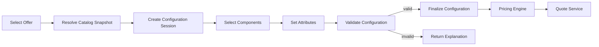
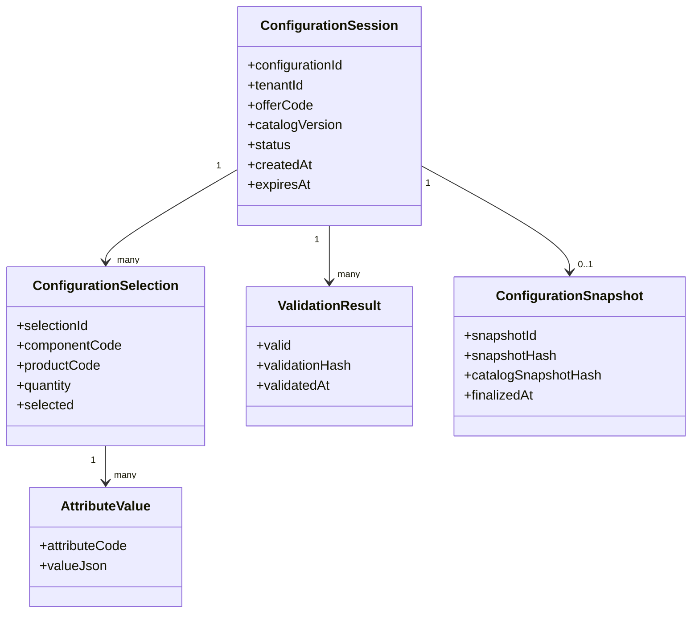
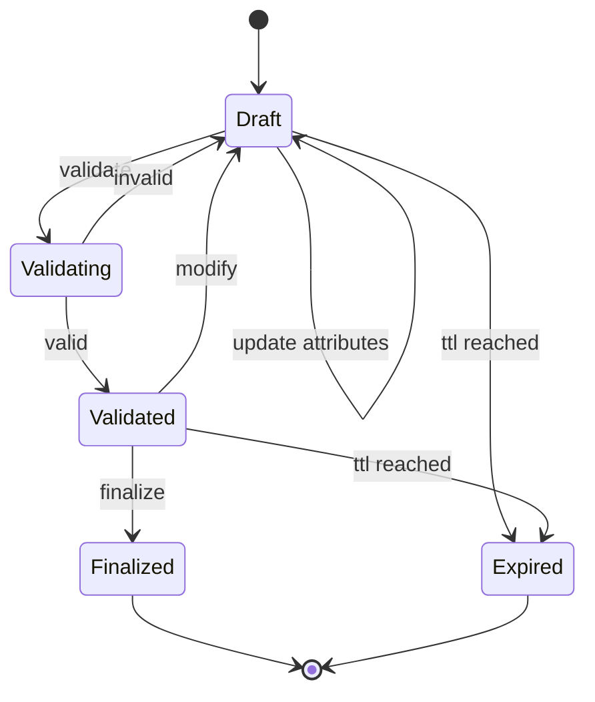
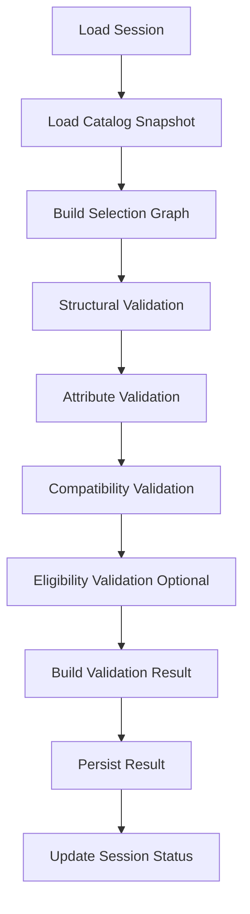
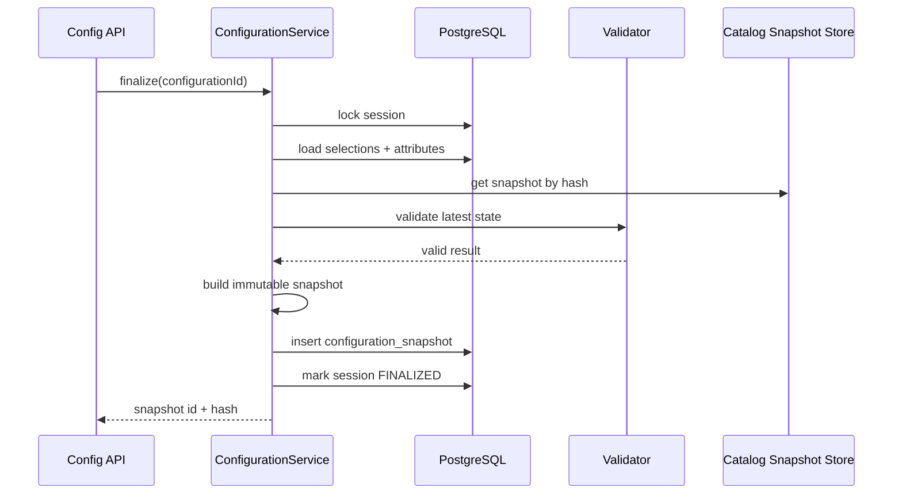
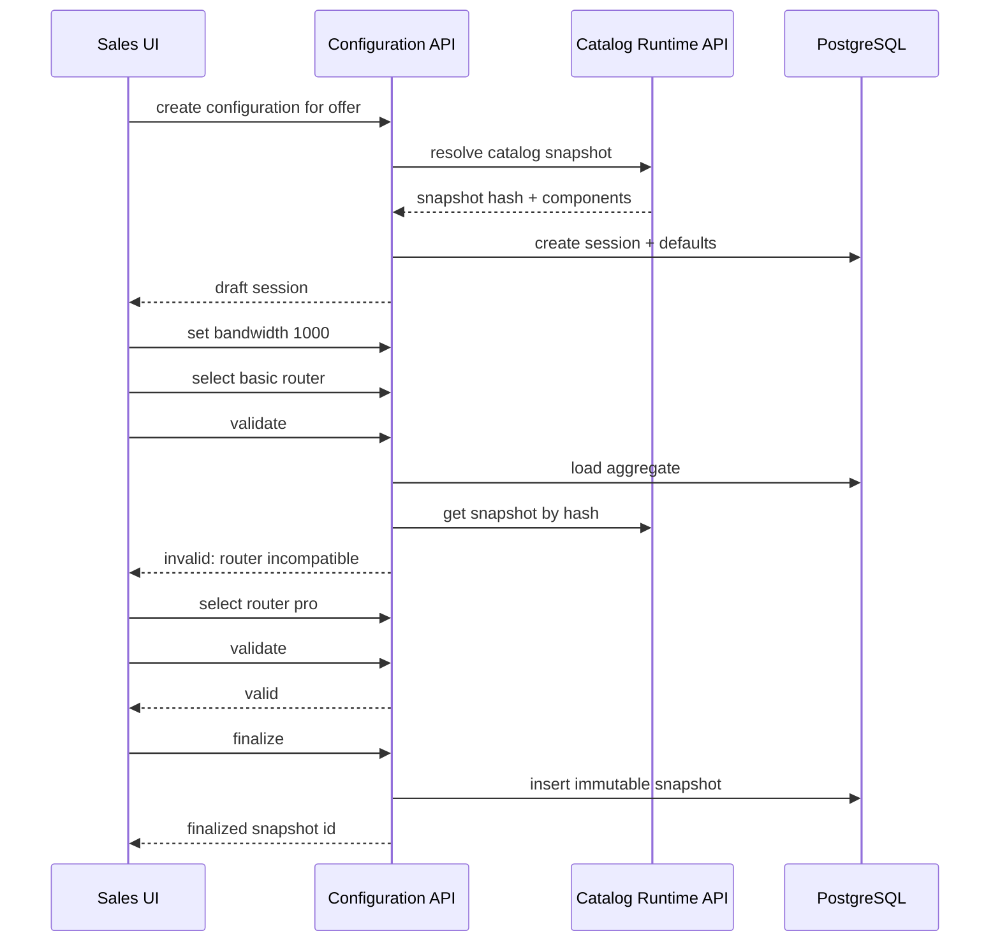

# Part 012 — Configuration Engine

## 1. Tujuan Part Ini

Pada part sebelumnya kita membangun **Product Catalog Service** sebagai sumber kebenaran tentang apa yang boleh dijual. Sekarang kita membangun **Configuration Engine**: komponen yang menjawab apakah pilihan customer terhadap offer tersebut valid.

Configuration Engine bukan Pricing Engine. Ia tidak menghitung harga. Ia memastikan struktur pilihan memenuhi aturan catalog dan constraint bisnis sebelum pricing dilakukan.

Target utama:

1. memahami configuration sebagai graph of selections, bukan form input biasa;
2. membedakan structural rules, attribute rules, compatibility rules, eligibility rules, dan pricing rules;
3. membangun model configuration session dan configuration snapshot;
4. mendesain validation pipeline yang deterministik dan explainable;
5. membuat API configure/validate/finalize yang idempotent;
6. menyimpan state configuration dengan PostgreSQL dan MyBatis;
7. memakai Redis hanya untuk ephemeral acceleration;
8. mengintegrasikan Catalog Service tanpa membuat coupling runtime yang rapuh;
9. menghasilkan error yang dapat dipahami sales/user dan dapat diaudit;
10. menyiapkan test matrix, failure model, dan operational runbook.

> Catalog mendefinisikan ruang kemungkinan. Configuration memilih satu titik di dalam ruang itu dan membuktikan titik tersebut valid.

---

## 2. Kaufman Lens: Skill yang Harus Dikuasai

Configuration terlihat seperti form validation, tetapi sebenarnya ia adalah kombinasi dari graph modeling, rule evaluation, user journey, consistency, dan explainability.

### 2.1 Sub-skill inti

| Sub-skill | Kenapa penting |
|---|---|
| Selection graph modeling | Bundle, component, option, dan dependency tidak selalu linear. |
| Rule classification | Salah memisahkan rule membuat engine sulit dirawat dan sulit diaudit. |
| Deterministic validation | Hasil validasi harus sama untuk input dan catalog snapshot yang sama. |
| Explainable errors | Sales tidak butuh stack trace; mereka butuh alasan dan tindakan korektif. |
| Snapshot discipline | Quote harus tahu konfigurasi valid berdasarkan catalog versi apa. |
| Incremental validation | UI perlu feedback cepat saat user memilih opsi. |
| Finalization boundary | Configuration draft boleh berubah; finalized configuration harus stabil. |
| Idempotency | Repeated submit/validate/finalize tidak boleh membuat state ganda. |
| Cache discipline | Cache mempercepat rule/catalog access, bukan mengganti source of truth. |
| Failure modeling | Catalog berubah, session expired, rule bug, dan concurrent edit harus punya perilaku jelas. |

### 2.2 Target praktik 20 jam

Slice minimum:

1. resolve offer snapshot dari catalog;
2. create configuration session;
3. select mandatory dan optional components;
4. set attributes;
5. validate cardinality;
6. validate attribute type/value;
7. validate compatibility rule;
8. return explainable error;
9. finalize configuration;
10. create immutable configuration snapshot untuk quote.

---

## 3. Configuration Dalam Flow CPQ



Configuration Engine menerima input user, tetapi output-nya harus menjadi data yang bisa dipercaya oleh Pricing dan Quote.

---

## 4. Boundary Configuration Engine

Configuration owns:

- configuration session;
- selected components;
- selected quantities;
- attribute values;
- validation result;
- configuration snapshot;
- explainable validation error;
- finalization state.

Configuration does **not** own:

- product/offer source of truth;
- price calculation;
- discount approval;
- order capture;
- fulfillment execution;
- catalog publishing;
- customer eligibility master data.

It may call or consume:

- Product Catalog Service;
- Customer/Profile service if eligibility is needed;
- Pricing Engine after valid configuration;
- Kafka catalog events for cache/projection refresh.

---

## 5. Rule Taxonomy

A major design mistake is putting all rules into one generic bucket.

### 5.1 Structural rules

Derived from catalog composition.

Examples:

- mandatory component must exist;
- quantity must be within min/max;
- choice group must select exactly one;
- bundle cannot contain unsupported component.

### 5.2 Attribute rules

Derived from attribute metadata.

Examples:

- `bandwidthMbps` required;
- `contractTermMonths` must be one of `[12, 24, 36]`;
- `installationDate` must be date;
- `staticIpCount` must be integer.

### 5.3 Compatibility rules

Derived from product relationship.

Examples:

- static IP requires business segment;
- premium support requires contract term >= 12 months;
- router model X incompatible with bandwidth > 500 Mbps.

### 5.4 Eligibility rules

Usually external/customer-related.

Examples:

- offer available only for certain region;
- customer credit class eligible for device financing;
- regulated product requires customer certification.

Eligibility can be integrated, but avoid mixing it with catalog structural rules.

### 5.5 Pricing rules

Examples:

- 10% discount if term is 24 months;
- installation fee waived for promo;
- device rental recurring charge.

Pricing rules belong to Pricing Engine. Configuration may produce input facts used by pricing, but should not calculate price.

---

## 6. Configuration Data Model



Key design point: session is mutable; snapshot is immutable.

---

## 7. State Machine



Invariants:

1. only `Draft` and `Validated` sessions can be modified;
2. modifying a `Validated` session returns it to `Draft`;
3. only latest valid result can be finalized;
4. finalized snapshot cannot be mutated;
5. expired session cannot be finalized;
6. quote can only use finalized configuration snapshot.

---

## 8. API Surface

### 8.1 Create session

```http
POST /configurations
Idempotency-Key: idem-001
```

Request:

```json
{
  "tenantId": "tenant-001",
  "offerCode": "FIBER_1G_BUSINESS_PLUS",
  "channel": "direct",
  "segment": "business",
  "asOf": "2026-07-02T10:00:00Z"
}
```

Response:

```json
{
  "configurationId": "cfg_01J...",
  "status": "DRAFT",
  "catalogVersion": "2026.07.01",
  "catalogSnapshotHash": "sha256:...",
  "expiresAt": "2026-07-02T11:00:00Z",
  "requiredActions": [
    {
      "type": "SET_ATTRIBUTE",
      "componentCode": "INTERNET_ACCESS",
      "attributeCode": "bandwidthMbps"
    }
  ]
}
```

### 8.2 Update selection

```http
PUT /configurations/{configurationId}/selections/{componentCode}
```

```json
{
  "selected": true,
  "quantity": 1
}
```

### 8.3 Set attribute

```http
PUT /configurations/{configurationId}/selections/{componentCode}/attributes/{attributeCode}
```

```json
{
  "value": 1000
}
```

### 8.4 Validate

```http
POST /configurations/{configurationId}/validate
```

Response if invalid:

```json
{
  "configurationId": "cfg_01J...",
  "valid": false,
  "errors": [
    {
      "code": "ATTRIBUTE_REQUIRED",
      "severity": "ERROR",
      "message": "Bandwidth is required for Internet Access.",
      "path": "/selections/INTERNET_ACCESS/attributes/bandwidthMbps",
      "actionHint": "Choose one of: 100, 300, 500, 1000."
    }
  ]
}
```

### 8.5 Finalize

```http
POST /configurations/{configurationId}/finalize
Idempotency-Key: idem-finalize-001
```

Response:

```json
{
  "configurationId": "cfg_01J...",
  "configurationSnapshotId": "cfgsnap_01J...",
  "status": "FINALIZED",
  "configurationSnapshotHash": "sha256:...",
  "catalogSnapshotHash": "sha256:..."
}
```

---

## 9. OpenAPI Contract Fragment

```yaml
openapi: 3.1.0
info:
  title: Configuration API
  version: 1.0.0
paths:
  /configurations/{configurationId}/validate:
    post:
      operationId: validateConfiguration
      parameters:
        - name: configurationId
          in: path
          required: true
          schema:
            type: string
      responses:
        '200':
          description: Validation completed.
          content:
            application/json:
              schema:
                $ref: '#/components/schemas/ConfigurationValidationResponse'
components:
  schemas:
    ConfigurationValidationResponse:
      type: object
      required:
        - configurationId
        - valid
        - errors
      properties:
        configurationId:
          type: string
        valid:
          type: boolean
        validationHash:
          type: string
        errors:
          type: array
          items:
            $ref: '#/components/schemas/ValidationError'
    ValidationError:
      type: object
      required:
        - code
        - severity
        - message
        - path
      properties:
        code:
          type: string
        severity:
          type: string
          enum: [ERROR, WARNING]
        message:
          type: string
        path:
          type: string
        actionHint:
          type: string
```

The API must support machine validation and human correction.

---

## 10. PostgreSQL Schema

### 10.1 Configuration session

```sql
create table configuration_session (
    configuration_id uuid primary key,
    tenant_id uuid not null,
    offer_code text not null,
    catalog_version text not null,
    catalog_snapshot_hash text not null,
    status text not null check (status in ('DRAFT', 'VALIDATED', 'FINALIZED', 'EXPIRED')),
    channel text,
    customer_segment text,
    created_by text not null,
    created_at timestamptz not null default now(),
    updated_at timestamptz not null default now(),
    expires_at timestamptz not null,
    version bigint not null default 0
);

create index idx_configuration_session_tenant_status
    on configuration_session (tenant_id, status, updated_at desc);
```

### 10.2 Selection

```sql
create table configuration_selection (
    selection_id uuid primary key,
    tenant_id uuid not null,
    configuration_id uuid not null references configuration_session(configuration_id),
    component_code text not null,
    product_code text not null,
    selected boolean not null,
    quantity integer not null,
    created_at timestamptz not null default now(),
    updated_at timestamptz not null default now(),
    constraint uq_configuration_component unique (tenant_id, configuration_id, component_code),
    constraint chk_selection_quantity check (quantity >= 0)
);
```

### 10.3 Attribute value

```sql
create table configuration_attribute_value (
    attribute_value_id uuid primary key,
    tenant_id uuid not null,
    configuration_id uuid not null references configuration_session(configuration_id),
    component_code text not null,
    attribute_code text not null,
    value_json jsonb not null,
    created_at timestamptz not null default now(),
    updated_at timestamptz not null default now(),
    constraint uq_configuration_attribute unique (
        tenant_id,
        configuration_id,
        component_code,
        attribute_code
    )
);
```

### 10.4 Validation result

```sql
create table configuration_validation_result (
    validation_result_id uuid primary key,
    tenant_id uuid not null,
    configuration_id uuid not null references configuration_session(configuration_id),
    valid boolean not null,
    validation_hash text not null,
    errors_json jsonb not null,
    validated_at timestamptz not null default now()
);

create index idx_configuration_validation_latest
    on configuration_validation_result (tenant_id, configuration_id, validated_at desc);
```

### 10.5 Finalized snapshot

```sql
create table configuration_snapshot (
    configuration_snapshot_id uuid primary key,
    tenant_id uuid not null,
    configuration_id uuid not null references configuration_session(configuration_id),
    catalog_version text not null,
    catalog_snapshot_hash text not null,
    configuration_snapshot_hash text not null,
    snapshot_json jsonb not null,
    finalized_at timestamptz not null default now(),
    finalized_by text not null,
    constraint uq_configuration_snapshot unique (tenant_id, configuration_id),
    constraint uq_configuration_snapshot_hash unique (tenant_id, configuration_snapshot_hash)
);
```

### 10.6 Idempotency

```sql
create table configuration_idempotency_key (
    tenant_id uuid not null,
    idempotency_key text not null,
    request_hash text not null,
    response_json jsonb,
    status text not null check (status in ('IN_PROGRESS', 'COMPLETED', 'FAILED')),
    created_at timestamptz not null default now(),
    updated_at timestamptz not null default now(),
    primary key (tenant_id, idempotency_key)
);
```

---

## 11. Validation Pipeline



### 11.1 Pipeline principles

1. validation reads a stable catalog snapshot;
2. rules run in deterministic order;
3. every error has code, path, severity, and action hint;
4. validation result is persisted;
5. validation hash is computed from catalog snapshot + configuration input;
6. finalization requires latest validation hash.

### 11.2 Validation context

```java
public record ValidationContext(
    TenantId tenantId,
    ConfigurationSession session,
    CatalogSnapshot catalogSnapshot,
    List<ConfigurationSelection> selections,
    Map<ComponentCode, Map<AttributeCode, JsonNode>> attributeValues,
    OffsetDateTime now
) {}
```

### 11.3 Rule interface

```java
public interface ConfigurationRule {
    String code();

    RuleCategory category();

    List<ValidationError> validate(ValidationContext context);
}
```

Categories:

```java
public enum RuleCategory {
    STRUCTURAL,
    ATTRIBUTE,
    COMPATIBILITY,
    ELIGIBILITY
}
```

---

## 12. Structural Rule Implementation

### 12.1 Mandatory component rule

```java
public final class MandatoryComponentRule implements ConfigurationRule {
    @Override
    public String code() {
        return "MANDATORY_COMPONENT_REQUIRED";
    }

    @Override
    public RuleCategory category() {
        return RuleCategory.STRUCTURAL;
    }

    @Override
    public List<ValidationError> validate(ValidationContext context) {
        Map<String, ConfigurationSelection> selectionsByComponent = context.selections()
            .stream()
            .collect(Collectors.toMap(
                s -> s.componentCode().value(),
                Function.identity()
            ));

        List<ValidationError> errors = new ArrayList<>();

        for (CatalogComponent component : context.catalogSnapshot().components()) {
            if (!component.mandatory()) {
                continue;
            }

            ConfigurationSelection selection = selectionsByComponent.get(component.componentCode());
            if (selection == null || !selection.selected()) {
                errors.add(ValidationError.error(
                    "MANDATORY_COMPONENT_REQUIRED",
                    "/selections/" + component.componentCode(),
                    component.displayName() + " is required.",
                    "Add the required component."
                ));
            }
        }

        return errors;
    }
}
```

### 12.2 Quantity rule

```java
public final class QuantityRangeRule implements ConfigurationRule {
    @Override
    public String code() {
        return "QUANTITY_OUT_OF_RANGE";
    }

    @Override
    public RuleCategory category() {
        return RuleCategory.STRUCTURAL;
    }

    @Override
    public List<ValidationError> validate(ValidationContext context) {
        Map<String, CatalogComponent> catalogByComponent = context.catalogSnapshot()
            .components()
            .stream()
            .collect(Collectors.toMap(CatalogComponent::componentCode, Function.identity()));

        List<ValidationError> errors = new ArrayList<>();

        for (ConfigurationSelection selection : context.selections()) {
            CatalogComponent component = catalogByComponent.get(selection.componentCode().value());
            if (component == null) {
                errors.add(ValidationError.error(
                    "UNKNOWN_COMPONENT",
                    "/selections/" + selection.componentCode().value(),
                    "Selected component is not part of the offer.",
                    "Remove this component or refresh the configuration."
                ));
                continue;
            }

            if (selection.quantity() < component.minQuantity() || selection.quantity() > component.maxQuantity()) {
                errors.add(ValidationError.error(
                    "QUANTITY_OUT_OF_RANGE",
                    "/selections/" + selection.componentCode().value() + "/quantity",
                    "Quantity must be between " + component.minQuantity() + " and " + component.maxQuantity() + ".",
                    "Choose a valid quantity."
                ));
            }
        }

        return errors;
    }
}
```

---

## 13. Attribute Validation

Attribute validation should use catalog metadata, not hard-coded UI assumptions.

```java
public final class AttributeRequiredRule implements ConfigurationRule {
    @Override
    public String code() {
        return "ATTRIBUTE_REQUIRED";
    }

    @Override
    public RuleCategory category() {
        return RuleCategory.ATTRIBUTE;
    }

    @Override
    public List<ValidationError> validate(ValidationContext context) {
        List<ValidationError> errors = new ArrayList<>();

        for (CatalogAttribute attribute : context.catalogSnapshot().attributes()) {
            if (!attribute.required()) {
                continue;
            }

            JsonNode value = context.attributeValues()
                .getOrDefault(new ComponentCode(attribute.componentCode()), Map.of())
                .get(new AttributeCode(attribute.attributeCode()));

            if (value == null || value.isNull()) {
                errors.add(ValidationError.error(
                    "ATTRIBUTE_REQUIRED",
                    "/selections/" + attribute.componentCode() + "/attributes/" + attribute.attributeCode(),
                    attribute.displayName() + " is required.",
                    buildHint(attribute)
                ));
            }
        }

        return errors;
    }

    private String buildHint(CatalogAttribute attribute) {
        if (attribute.allowedValues().isEmpty()) {
            return "Provide a value for this attribute.";
        }
        return "Choose one of: " + attribute.allowedValues();
    }
}
```

### 13.1 Type validation

| Data type | Validation |
|---|---|
| `STRING` | JSON string, optional regex/max length. |
| `INTEGER` | JSON integer, optional min/max. |
| `DECIMAL` | JSON number, scale rules. |
| `BOOLEAN` | JSON boolean. |
| `DATE` | ISO date string. |
| `ENUM` | value belongs to allowed values. |

Never rely only on UI validation. API must enforce the same rules.

---

## 14. Compatibility Rules

There are several ways to implement compatibility.

### 14.1 Hard-coded Java rules

Good for critical rules that rarely change.

Pros:

- type-safe;
- testable;
- observable;
- easier to debug.

Cons:

- requires deployment;
- less friendly for product operations.

### 14.2 Data-driven declarative rules

Good for product-managed rules.

Example rule document:

```json
{
  "ruleCode": "STATIC_IP_REQUIRES_BUSINESS",
  "severity": "ERROR",
  "if": {
    "selectedComponent": "STATIC_IP"
  },
  "then": {
    "customerSegmentIn": ["business", "enterprise"]
  },
  "message": "Static IP is available only for business or enterprise customers."
}
```

Pros:

- product team can modify within guardrails;
- easier to publish with catalog;
- can be included in snapshot.

Cons:

- interpreter complexity;
- harder static analysis;
- unsafe if expression language is too powerful.

### 14.3 Hybrid approach

Recommended baseline:

- structural and attribute rules are engine-native;
- common compatibility operators are data-driven;
- exceptional/regulated rules are Java-coded plugins;
- every rule has code, owner, test, and explanation.

---

## 15. Rule Evaluation Safety

If you allow arbitrary expression execution, you are building a security problem.

Safe rule engine constraints:

1. no arbitrary Java execution;
2. no reflection;
3. no database access from rule expression;
4. no network calls inside rule evaluation;
5. bounded execution time;
6. bounded expression size;
7. versioned rule schema;
8. deterministic function set;
9. explicit error on unknown fields;
10. full audit of rule version used.

A configuration engine should be boring and deterministic.

---

## 16. MyBatis Persistence

### 16.1 Mapper interface

```java
public interface ConfigurationSessionMapper {
    int insert(ConfigurationSessionRow row);

    Optional<ConfigurationSessionRow> findById(
        @Param("tenantId") UUID tenantId,
        @Param("configurationId") UUID configurationId
    );

    Optional<ConfigurationSessionRow> findByIdForUpdate(
        @Param("tenantId") UUID tenantId,
        @Param("configurationId") UUID configurationId
    );

    int updateStatus(
        @Param("tenantId") UUID tenantId,
        @Param("configurationId") UUID configurationId,
        @Param("expectedVersion") long expectedVersion,
        @Param("newStatus") String newStatus
    );
}
```

### 16.2 Update with optimistic locking

```xml
<update id="updateStatus">
  update configuration_session
  set status = #{newStatus},
      updated_at = now(),
      version = version + 1
  where tenant_id = #{tenantId}
    and configuration_id = #{configurationId}
    and version = #{expectedVersion}
</update>
```

If update count is zero, throw concurrency exception.

### 16.3 Upsert selection

```xml
<insert id="upsertSelection">
  insert into configuration_selection (
    selection_id,
    tenant_id,
    configuration_id,
    component_code,
    product_code,
    selected,
    quantity
  ) values (
    #{selectionId},
    #{tenantId},
    #{configurationId},
    #{componentCode},
    #{productCode},
    #{selected},
    #{quantity}
  )
  on conflict (tenant_id, configuration_id, component_code)
  do update set
    selected = excluded.selected,
    quantity = excluded.quantity,
    updated_at = now()
</insert>
```

---

## 17. Application Service

```java
public final class ConfigurationService {
    private final CatalogClient catalogClient;
    private final ConfigurationRepository repository;
    private final ConfigurationValidator validator;
    private final SnapshotHasher snapshotHasher;
    private final AuditWriter auditWriter;

    public CreateConfigurationResponse create(CreateConfigurationCommand command) {
        command.validate();

        CatalogSnapshot catalog = catalogClient.resolveSnapshot(
            command.tenantId(),
            command.offerCode(),
            command.channel(),
            command.segment(),
            command.asOf()
        );

        ConfigurationSession session = ConfigurationSession.create(
            command.tenantId(),
            command.offerCode(),
            catalog.catalogVersion(),
            catalog.snapshotHash(),
            command.actor(),
            command.channel(),
            command.segment()
        );

        List<ConfigurationSelection> defaults = DefaultSelectionBuilder.from(catalog);

        repository.createSessionWithDefaults(session, defaults);
        auditWriter.record("CONFIGURATION_CREATED", session.id(), command.actor());

        return CreateConfigurationResponse.from(session, catalog.requiredActions(defaults));
    }

    public ValidationResponse validate(ValidateConfigurationCommand command) {
        ConfigurationAggregate aggregate = repository.loadForValidation(
            command.tenantId(),
            command.configurationId()
        );

        aggregate.assertValidatable(command.now());

        CatalogSnapshot catalog = catalogClient.getSnapshotByHash(
            aggregate.catalogSnapshotHash()
        );

        ValidationResult result = validator.validate(aggregate, catalog, command.now());
        repository.persistValidationResultAndStatus(aggregate, result);

        return ValidationResponse.from(result);
    }
}
```

Important: catalog is resolved at session creation and referenced by snapshot hash. Validation should not silently switch to a newer catalog version.

---

## 18. Finalization Algorithm



Finalization should revalidate or verify latest validation hash. Do not trust an old validation result after modifications.

---

## 19. Configuration Snapshot

Example snapshot:

```json
{
  "configurationSnapshotId": "cfgsnap_01J...",
  "configurationId": "cfg_01J...",
  "catalogVersion": "2026.07.01",
  "catalogSnapshotHash": "sha256:catalog...",
  "offerCode": "FIBER_1G_BUSINESS_PLUS",
  "selections": [
    {
      "componentCode": "INTERNET_ACCESS",
      "productCode": "FIBER_INTERNET",
      "selected": true,
      "quantity": 1,
      "attributes": {
        "bandwidthMbps": 1000,
        "contractTermMonths": 24
      }
    },
    {
      "componentCode": "STATIC_IP",
      "productCode": "STATIC_IP",
      "selected": true,
      "quantity": 1,
      "attributes": {
        "ipCount": 1
      }
    }
  ],
  "validation": {
    "validationHash": "sha256:validation...",
    "validatedAt": "2026-07-02T10:10:00Z"
  }
}
```

The snapshot becomes input to Pricing and Quote.

---

## 20. Hashing Strategy

Configuration hash should include:

- tenant ID;
- offer code;
- catalog version;
- catalog snapshot hash;
- selected components;
- quantities;
- attribute values;
- validation rule version if data-driven rules are used.

It should exclude:

- volatile timestamps;
- request ID;
- correlation ID;
- ordering differences that do not change meaning.

```java
public String configurationHash(ConfigurationSnapshot snapshot) {
    CanonicalConfiguration canonical = CanonicalConfiguration.from(snapshot);
    String canonicalJson = canonicalJsonWriter.write(canonical);
    return sha256(canonicalJson);
}
```

---

## 21. Redis Acceleration

Configuration has two cache use cases:

1. catalog snapshot cache by hash;
2. short-lived session view cache.

### 21.1 Catalog snapshot cache

```text
catalog:snapshot:{tenantId}:{catalogSnapshotHash}
```

Safe because snapshot is immutable.

### 21.2 Session view cache

```text
configuration:session-view:{tenantId}:{configurationId}
```

Use short TTL because session is mutable.

### 21.3 What not to cache

Do not cache finalization decision without checking session version. Do not treat Redis as lock authority for business correctness. PostgreSQL transaction remains final authority.

---

## 22. Kafka Integration

Configuration Engine does not need to emit an event for every field update. That would create noise.

Useful events:

| Event | Purpose |
|---|---|
| `ConfigurationFinalized` | Pricing/quote can consume if asynchronous flow is used. |
| `ConfigurationExpired` | Cleanup/analytics. |
| `ConfigurationValidationFailed` | Optional operational/analytics event, avoid leaking sensitive inputs. |
| `CatalogVersionPublished` consumed | Refresh local catalog projection/cache. |

Example event:

```json
{
  "eventId": "evt_01J...",
  "eventType": "ConfigurationFinalized",
  "eventVersion": 1,
  "occurredAt": "2026-07-02T10:12:00Z",
  "tenantId": "tenant-001",
  "producer": "configuration-service",
  "correlationId": "corr_01J...",
  "payload": {
    "configurationId": "cfg_01J...",
    "configurationSnapshotId": "cfgsnap_01J...",
    "configurationSnapshotHash": "sha256:...",
    "catalogVersion": "2026.07.01",
    "catalogSnapshotHash": "sha256:...",
    "offerCode": "FIBER_1G_BUSINESS_PLUS"
  }
}
```

Use outbox for event emission.

---

## 23. Explainable Error Design

A validation error should be useful to four audiences:

1. sales user;
2. frontend developer;
3. backend support engineer;
4. auditor/product owner.

Recommended shape:

```json
{
  "code": "COMPONENT_INCOMPATIBLE",
  "severity": "ERROR",
  "message": "Router Basic cannot be selected with 1000 Mbps bandwidth.",
  "path": "/selections/ROUTER/attributes/model",
  "relatedPaths": [
    "/selections/INTERNET_ACCESS/attributes/bandwidthMbps"
  ],
  "ruleCode": "ROUTER_BASIC_MAX_500MBPS",
  "actionHint": "Choose Router Pro or reduce bandwidth to 500 Mbps."
}
```

Avoid errors like:

```json
{
  "message": "Validation failed"
}
```

That is technically true and operationally useless.

---

## 24. Expiration and Cleanup

Configuration sessions are often abandoned. They need TTL.

Rules:

1. draft sessions expire after configured duration;
2. finalized sessions do not expire before retention policy;
3. expired sessions cannot be revived unless explicitly cloned;
4. cleanup should be batch-based and observable;
5. cleanup should not delete audit-critical snapshots.

Example cleanup query:

```sql
update configuration_session
set status = 'EXPIRED',
    updated_at = now(),
    version = version + 1
where tenant_id = :tenant_id
  and status in ('DRAFT', 'VALIDATED')
  and expires_at < now()
limit 1000;
```

PostgreSQL does not support `limit` directly in `update` in this form, so implement via CTE:

```sql
with expired as (
    select configuration_id
    from configuration_session
    where tenant_id = :tenant_id
      and status in ('DRAFT', 'VALIDATED')
      and expires_at < now()
    order by expires_at
    limit 1000
)
update configuration_session s
set status = 'EXPIRED',
    updated_at = now(),
    version = version + 1
from expired e
where s.configuration_id = e.configuration_id;
```

---

## 25. Concurrency Model

### 25.1 Problem

Two browser tabs update the same configuration.

### 25.2 Baseline solution

Use optimistic locking on session version.

- client receives `version`;
- update request includes expected version;
- if DB update count is zero, return `409 Conflict`;
- client reloads latest state.

### 25.3 JAX-RS response

```java
throw new ConflictException(
    ProblemDetails.of(
        "CONFIGURATION_CONCURRENT_MODIFICATION",
        "Configuration was modified by another request.",
        "Reload the configuration and apply your change again."
    )
);
```

Do not silently merge complex configuration changes unless rules are simple and deterministic.

---

## 26. Failure Modes

### 26.1 Catalog snapshot missing

Cause:

- catalog retention too aggressive;
- cache miss with DB inconsistency;
- wrong snapshot hash.

Prevention:

- retain catalog snapshots as long as quote/order retention requires;
- quote/config references by hash;
- integration test retention policy.

Recovery:

- restore snapshot from backup;
- rebuild from published catalog if deterministic;
- block finalization until resolved.

### 26.2 Configuration validated against newer catalog

Cause:

- validation resolves current catalog instead of session snapshot;
- cache key ignores snapshot hash.

Prevention:

- session stores catalog snapshot hash;
- validation always loads by hash;
- tests publish new catalog after session creation.

Recovery:

- identify affected sessions;
- invalidate validation results;
- require revalidation.

### 26.3 Rule bug invalidates valid customer flow

Cause:

- bad rule deployment;
- untested data-driven rule;
- expression interpreter bug.

Prevention:

- rule test pack;
- canary publish;
- rule versioning;
- rollback/retire rule capability.

Recovery:

- disable problematic rule version;
- revalidate affected sessions;
- audit correction.

### 26.4 Finalized configuration mutated

Cause:

- missing DB constraint;
- code path updates snapshot;
- manual DB change.

Prevention:

- immutable snapshot table;
- no update mapper for snapshot;
- DB privileges;
- audit triggers if needed.

Recovery:

- compare snapshot hash;
- restore from audit/backup;
- reprice/requote only if business allows.

---

## 27. Testing Strategy

### 27.1 Rule unit tests

Test every rule with:

- valid input;
- missing input;
- boundary values;
- incompatible combinations;
- unknown component;
- unknown attribute;
- warning vs error.

### 27.2 Golden configuration tests

Store fixture pairs:

```text
/catalog-fixtures/fiber-1g-business-plus/catalog-snapshot.json
/catalog-fixtures/fiber-1g-business-plus/valid-configuration.json
/catalog-fixtures/fiber-1g-business-plus/invalid-router-basic.json
/catalog-fixtures/fiber-1g-business-plus/expected-errors.json
```

Golden tests protect behavior when rules evolve.

### 27.3 Integration tests

- create session from catalog snapshot;
- update selection;
- set attributes;
- validate;
- finalize;
- duplicate finalize idempotency;
- concurrent update returns 409;
- expired session cannot finalize;
- old session keeps old catalog hash after new catalog publish.

### 27.4 Contract tests

- validation error schema;
- finalize response schema;
- problem details for conflict;
- event schema for `ConfigurationFinalized`.

---

## 28. Performance Considerations

Configuration can become CPU-heavy if rule evaluation is careless.

### 28.1 Hot paths

- session load;
- catalog snapshot load;
- attribute validation;
- compatibility evaluation;
- finalization hash computation;
- UI incremental validation.

### 28.2 Optimization principles

1. load full aggregate once per validation;
2. index selections by component code;
3. index attributes by component + attribute code;
4. precompile data-driven rules if safe;
5. cache immutable catalog snapshot;
6. avoid network calls inside rule evaluation;
7. separate quick UI validation from final authoritative validation if necessary.

### 28.3 Metrics

Track:

- validation latency p50/p95/p99;
- number of rules evaluated;
- errors by code;
- finalization latency;
- cache hit ratio for catalog snapshot;
- concurrent modification count;
- expired session count;
- abandoned session ratio.

---

## 29. Observability

Logs should include:

- `correlationId`;
- `tenantId`;
- `configurationId`;
- `catalogSnapshotHash`;
- `configurationStatus`;
- `validationHash`;
- `errorCodes`;
- `ruleCount`;
- duration.

Example structured log:

```json
{
  "event": "configuration_validated",
  "tenantId": "tenant-001",
  "configurationId": "cfg_01J...",
  "catalogSnapshotHash": "sha256:catalog...",
  "valid": false,
  "errorCodes": ["ATTRIBUTE_REQUIRED", "COMPONENT_INCOMPATIBLE"],
  "durationMs": 42,
  "correlationId": "corr_01J..."
}
```

Avoid logging sensitive attribute values unless explicitly classified safe.

---

## 30. Security and Authorization

Configuration operations need authorization:

| Operation | Required permission |
|---|---|
| create session | `configuration:create` |
| view session | owner/team/tenant access |
| update selection | `configuration:update` |
| validate | `configuration:validate` |
| finalize | `configuration:finalize` |
| override warning | special permission if supported |

Tenant isolation must be enforced in every query.

Never trust `tenantId` from request body alone. Derive tenant context from authenticated principal or gateway context.

---

## 31. Implementation Checklist

### 31.1 Minimum capability

- [ ] create configuration session API;
- [ ] update selection API;
- [ ] set attribute API;
- [ ] validate API;
- [ ] finalize API;
- [ ] session table;
- [ ] selection table;
- [ ] attribute table;
- [ ] validation result table;
- [ ] snapshot table;
- [ ] MyBatis mappers;
- [ ] catalog snapshot client;
- [ ] structural rules;
- [ ] attribute rules;
- [ ] compatibility rule example;
- [ ] immutable snapshot hash;
- [ ] idempotency for create/finalize;
- [ ] integration tests.

### 31.2 Production readiness

- [ ] rule versioning;
- [ ] error code catalog;
- [ ] rule metrics;
- [ ] snapshot retention policy;
- [ ] session cleanup job;
- [ ] cache hit/miss monitoring;
- [ ] tenant isolation tests;
- [ ] sensitive attribute classification;
- [ ] rule rollback strategy;
- [ ] manual support view for failed configuration.

---

## 32. Common Anti-Patterns

### 32.1 Making UI the source of validation truth

UI validation improves UX, but backend validation is authoritative.

### 32.2 Re-resolving current catalog during finalization

This silently changes the meaning of a user configuration. Always use session catalog snapshot.

### 32.3 Storing only valid/invalid boolean

You lose explainability. Store structured error details.

### 32.4 Allowing arbitrary scripting in rules

This creates security, performance, and determinism problems.

### 32.5 Mutating finalized snapshot

Quote and pricing trust snapshot immutability. Do not break it.

### 32.6 Overusing Kafka for every interaction

Configuration editing is usually request/response. Events are useful for finalized state and projections, not every keystroke.

---

## 33. End-to-End Example

Scenario:

- offer: `FIBER_1G_BUSINESS_PLUS`;
- mandatory internet access;
- optional static IP;
- router choice basic/pro;
- `bandwidthMbps = 1000`;
- rule: basic router supports max 500 Mbps.

Flow:



The important thing is not the happy path. The important thing is that every invalid path is explainable and recoverable.

---

## 34. What Good Looks Like

A good Configuration Engine has these properties:

1. session is mutable, snapshot is immutable;
2. validation is deterministic;
3. validation uses catalog snapshot, not current mutable catalog;
4. rule taxonomy is explicit;
5. errors are explainable;
6. finalization is idempotent;
7. concurrent edits are handled;
8. abandoned sessions expire;
9. sensitive values are protected;
10. pricing receives a stable, validated configuration snapshot.

---

## 35. Ringkasan

Configuration Engine adalah bridge antara catalog dan pricing. Ia mengambil offer yang dipublikasikan, menerima pilihan customer, menjalankan rule validation, lalu menghasilkan snapshot final yang dapat dihitung harganya dan dimasukkan ke quote.

Kunci desain:

- jangan campur configuration dengan pricing;
- jangan jadikan UI sebagai authority;
- gunakan catalog snapshot hash;
- pisahkan structural, attribute, compatibility, eligibility, dan pricing rules;
- buat error yang bisa ditindaklanjuti;
- finalization harus immutable dan idempotent;
- Redis hanya acceleration;
- PostgreSQL tetap authority;
- setiap rule penting harus punya test dan observability.

Part berikutnya membangun **Pricing Engine**, yaitu capability yang menghitung nilai komersial dari konfigurasi yang sudah valid.
