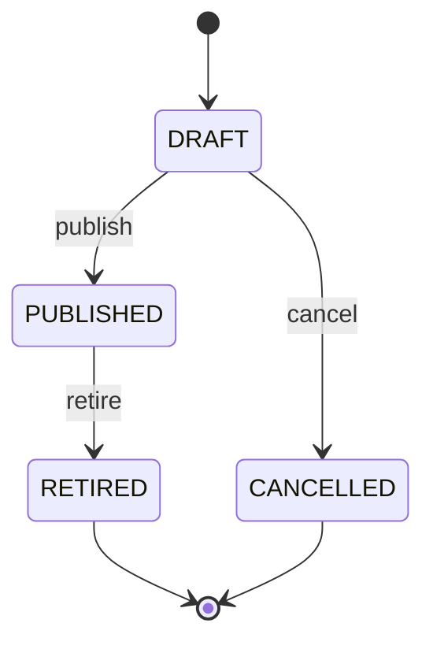

# Part 013 — Pricing Engine

## 1. Tujuan Part Ini

Pada part sebelumnya kita membangun **Configuration Engine**: memastikan konfigurasi produk valid berdasarkan catalog snapshot. Sekarang kita membangun **Pricing Engine**: komponen yang menghitung nilai komersial dari konfigurasi yang valid.

Pricing Engine bukan sekadar fungsi `price = qty * unitPrice`. Di CPQ nyata, pricing harus menangani price book, charge type, recurring charge, one-time charge, tiering, effective date, eligibility, discount, override, currency, rounding, approval trigger, quote snapshot, recalculation, dan auditability.

Target part ini:

1. memahami pricing sebagai deterministic rating pipeline;
2. membedakan catalog price, list price, adjusted price, discounted price, tax placeholder, dan quote price snapshot;
3. mendesain charge model untuk one-time, recurring, usage-estimated, dan adjustment;
4. menangani money secara benar: currency, scale, rounding, dan tax boundary;
5. membuat price book dan price rule yang versioned dan effective-dated;
6. membangun discount stacking policy yang eksplisit;
7. menyimpan pricing result sebagai snapshot yang dapat diaudit;
8. membuat API pricing yang aman untuk quote draft dan recalculation;
9. menghubungkan PostgreSQL, MyBatis, Redis, dan Kafka secara disiplin;
10. membangun test matrix yang menangkap regression pricing.

> Pricing Engine harus menjawab dua pertanyaan: “berapa harganya?” dan “mengapa harganya segitu?” Jika hanya bisa menjawab yang pertama, engine belum production-grade.

---

## 2. Kaufman Lens: Skill yang Harus Dikuasai

Pricing adalah salah satu bagian CPQ yang paling sering gagal bukan karena kode rumit, tetapi karena aturan bisnis tidak dimodelkan secara eksplisit. Mengikuti pendekatan Kaufman, kita pecah skill pricing menjadi sub-skill kecil yang dapat dilatih.

### 2.1 Sub-skill inti

| Sub-skill | Kenapa penting |
|---|---|
| Monetary modeling | Kesalahan presisi dan rounding bisa langsung berdampak finansial. |
| Charge taxonomy | One-time, recurring, usage, adjustment, dan credit punya lifecycle berbeda. |
| Effective dating | Harga berubah dari waktu ke waktu; quote harus tahu harga versi apa yang dipakai. |
| Price book resolution | Harga tidak selalu global; bisa tergantung market, segment, channel, tenant, atau contract. |
| Pricing pipeline | Pipeline eksplisit membuat hasil deterministik dan bisa diuji. |
| Discount stacking | Diskon tidak boleh “kebetulan urut”; precedence harus formal. |
| Override governance | Manual override harus punya reason, permission, approval impact, dan audit trail. |
| Snapshot discipline | Accepted quote tidak boleh berubah karena price book berubah besok. |
| Explainability | Sales, approval, finance, dan support perlu melihat breakdown harga. |
| Regression testing | Pricing rule berubah sedikit bisa menghancurkan margin. |

### 2.2 Target praktik 20 jam

Slice minimum Pricing Engine:

1. buat price book version;
2. buat price entry untuk offer/component;
3. submit finalized configuration;
4. resolve applicable price book;
5. calculate list price;
6. apply quantity;
7. apply discount policy;
8. generate pricing breakdown;
9. persist pricing snapshot;
10. publish `PricingCalculated` event;
11. test golden master pricing scenario;
12. verify recalculation determinism.

---

## 3. Mental Model: Pricing sebagai Pure-ish Pipeline

Pricing idealnya diperlakukan seperti pipeline deterministik. Input yang sama, price book version yang sama, rule version yang sama, timestamp effective yang sama, dan currency yang sama harus menghasilkan output yang sama.


Kata “pure-ish” penting. Pipeline pricing seharusnya tidak melakukan side effect sampai tahap persist/publish. Ia boleh membaca price book, catalog snapshot, contract terms, atau customer segment, tetapi calculation core sebaiknya bebas dari I/O agar mudah diuji.

### 3.1 Input Pricing Engine

Input pricing bukan hanya product ID.

```json
{
  "tenantId": "tenant-001",
  "requestId": "req-20260702-001",
  "configurationSnapshotId": "cfgsnap-001",
  "customerId": "cust-001",
  "market": "ID",
  "channel": "DIRECT_SALES",
  "currency": "IDR",
  "pricingDate": "2026-07-02",
  "contractTermMonths": 24,
  "quantity": 10
}
```

### 3.2 Output Pricing Engine

Output harus bisa dipakai oleh Quote Service tanpa perlu menghitung ulang.

```json
{
  "pricingSnapshotId": "pricesnap-001",
  "currency": "IDR",
  "listTotal": "12000000.00",
  "discountTotal": "1200000.00",
  "netTotal": "10800000.00",
  "recurringMonthlyTotal": "450000.00",
  "oneTimeTotal": "0.00",
  "effectiveDate": "2026-07-02",
  "priceBookVersion": "PB-ID-2026-Q3-v4",
  "breakdown": []
}
```

---

## 4. Boundary Pricing Engine

Pricing Engine harus punya batas jelas.

| Di dalam Pricing Engine | Di luar Pricing Engine |
|---|---|
| Resolve applicable price book | Menentukan apakah configuration valid secara struktural |
| Hitung list price | Menentukan tax final, kecuali engine memang tax-aware |
| Hitung recurring dan one-time charge | Menghasilkan invoice aktual |
| Apply discount policy | Menyetujui diskon di luar authority |
| Generate pricing breakdown | Fulfillment atau provisioning |
| Persist pricing snapshot | Order state machine |
| Publish pricing event | Payment collection |

### 4.1 Tax boundary

Untuk seri ini, Pricing Engine menyediakan **tax placeholder boundary**, bukan tax engine penuh.

Alasannya:

1. tax punya regulasi lokal, exemption, invoice rule, dan reporting sendiri;
2. tax sering butuh integrasi eksternal;
3. quote mungkin hanya butuh estimate;
4. order/invoice mungkin butuh tax final saat fulfillment/billing.

Model yang disarankan:

| Field | Makna |
|---|---|
| `netAmount` | Amount setelah diskon sebelum tax. |
| `estimatedTaxAmount` | Optional estimate, tidak final kecuali policy menyatakan final. |
| `grossAmount` | Net + estimated tax. |
| `taxCalculationMode` | `NONE`, `ESTIMATED`, `EXTERNAL_FINAL`. |
| `taxSnapshotRef` | Reference ke tax engine jika ada. |

---

## 5. Charge Taxonomy

Charge adalah unit komersial terkecil yang dihitung.

### 5.1 Charge type

| Charge type | Contoh | Perilaku |
|---|---|---|
| `ONE_TIME` | Installation fee | Ditagih sekali. |
| `RECURRING` | Monthly subscription | Ditagih periodik. |
| `USAGE_ESTIMATED` | Estimated API calls | Estimasi untuk quote, bukan billing final. |
| `ADJUSTMENT` | Manual fee/credit | Harus punya reason dan authority. |
| `CREDIT` | Service credit | Mengurangi total dengan rule khusus. |

### 5.2 Charge period

Recurring charge harus punya period.

| Period | Makna |
|---|---|
| `MONTHLY` | Monthly recurring charge. |
| `QUARTERLY` | Quarterly recurring charge. |
| `ANNUAL` | Annual recurring charge. |
| `TERM` | Charge untuk seluruh contract term. |

### 5.3 Charge basis

Basis menjelaskan cara charge dihitung.

| Basis | Rumus umum |
|---|---|
| `FLAT` | fixed amount |
| `PER_UNIT` | unit price × quantity |
| `PER_USER` | user price × user count |
| `TIERED_VOLUME` | one tier based on total quantity |
| `TIERED_GRADUATED` | multiple tiers by range |
| `PERCENTAGE` | base amount × percentage |

---

## 6. Monetary Modeling

Money harus dimodelkan sebagai value object, bukan `double`.

### 6.1 Java money object sederhana

```java
public record Money(String currency, BigDecimal amount) {

    public Money {
        if (currency == null || !currency.matches("[A-Z]{3}")) {
            throw new IllegalArgumentException("currency must be ISO-like 3 uppercase letters");
        }
        if (amount == null) {
            throw new IllegalArgumentException("amount is required");
        }
        amount = amount.setScale(2, RoundingMode.HALF_UP);
    }

    public Money add(Money other) {
        requireSameCurrency(other);
        return new Money(currency, amount.add(other.amount));
    }

    public Money subtract(Money other) {
        requireSameCurrency(other);
        return new Money(currency, amount.subtract(other.amount));
    }

    public Money multiply(BigDecimal multiplier) {
        return new Money(currency, amount.multiply(multiplier));
    }

    private void requireSameCurrency(Money other) {
        if (!currency.equals(other.currency)) {
            throw new IllegalArgumentException("currency mismatch");
        }
    }
}
```

### 6.2 Scale policy

Jangan hard-code semua currency menjadi scale 2 jika bisnis lintas negara. Tetapi untuk build awal, buat policy eksplisit.

```java
public interface CurrencyScalePolicy {
    int scaleOf(String currency);
    RoundingMode roundingModeOf(String currency);
}
```

### 6.3 Amount yang perlu dibedakan

| Amount | Makna |
|---|---|
| `baseAmount` | Harga dasar sebelum quantity/term. |
| `listAmount` | Harga catalog/price book setelah quantity/term. |
| `adjustedAmount` | Setelah surcharge/adjustment. |
| `discountAmount` | Total diskon. |
| `netAmount` | Harga setelah diskon sebelum tax. |
| `grossAmount` | Harga setelah tax estimate/final. |
| `marginAmount` | Optional, biasanya restricted. |

---

## 7. Price Book Model

Price Book adalah kumpulan harga yang berlaku untuk context tertentu.

### 7.1 Price book dimension

| Dimension | Contoh |
|---|---|
| Tenant | `tenant-001` |
| Market | `ID`, `SG`, `US` |
| Channel | `DIRECT`, `PARTNER`, `ONLINE` |
| Customer segment | `ENTERPRISE`, `SMB`, `PUBLIC_SECTOR` |
| Currency | `IDR`, `USD` |
| Effective period | `2026-07-01` sampai `2026-09-30` |
| Status | `DRAFT`, `PUBLISHED`, `RETIRED` |

### 7.2 Price book state



### 7.3 PostgreSQL schema

```sql
create table price_book (
    price_book_id uuid primary key,
    tenant_id uuid not null,
    code text not null,
    version int not null,
    market text not null,
    channel text not null,
    customer_segment text,
    currency char(3) not null,
    effective_from date not null,
    effective_to date,
    status text not null,
    created_at timestamptz not null default now(),
    published_at timestamptz,
    unique (tenant_id, code, version),
    check (status in ('DRAFT', 'PUBLISHED', 'RETIRED', 'CANCELLED')),
    check (effective_to is null or effective_to >= effective_from)
);

create index idx_price_book_resolution
    on price_book (tenant_id, market, channel, currency, status, effective_from desc);
```

### 7.4 Price entry schema

```sql
create table price_entry (
    price_entry_id uuid primary key,
    tenant_id uuid not null,
    price_book_id uuid not null references price_book(price_book_id),
    item_ref_type text not null,
    item_ref_id text not null,
    charge_type text not null,
    charge_period text,
    charge_basis text not null,
    unit_amount numeric(19, 4) not null,
    min_quantity numeric(19, 4),
    max_quantity numeric(19, 4),
    metadata jsonb not null default '{}'::jsonb,
    created_at timestamptz not null default now(),
    check (item_ref_type in ('OFFER', 'COMPONENT', 'OPTION', 'ATTRIBUTE')),
    check (charge_type in ('ONE_TIME', 'RECURRING', 'USAGE_ESTIMATED', 'ADJUSTMENT', 'CREDIT')),
    check (charge_basis in ('FLAT', 'PER_UNIT', 'PER_USER', 'TIERED_VOLUME', 'TIERED_GRADUATED', 'PERCENTAGE'))
);

create index idx_price_entry_lookup
    on price_entry (tenant_id, price_book_id, item_ref_type, item_ref_id);
```

---

## 8. Pricing Context Resolution

Pricing context menentukan price book yang berlaku.

```java
public record PricingContext(
    UUID tenantId,
    String market,
    String channel,
    String customerSegment,
    String currency,
    LocalDate pricingDate,
    int contractTermMonths
) {}
```

Resolution harus deterministik. Jika dua price book sama-sama match, sistem harus gagal dengan error eksplisit, bukan memilih random.

### 8.1 Resolution rule

Urutan specificity:

1. exact tenant;
2. exact market;
3. exact channel;
4. exact customer segment;
5. exact currency;
6. effective date range;
7. highest published version.

### 8.2 Failure cases

| Failure | Response |
|---|---|
| Tidak ada price book | `PRICE_BOOK_NOT_FOUND` |
| Lebih dari satu equally specific price book | `AMBIGUOUS_PRICE_BOOK` |
| Currency unsupported | `UNSUPPORTED_CURRENCY` |
| Pricing date outside effective period | `PRICE_BOOK_NOT_EFFECTIVE` |
| Price book draft | Jangan dipakai untuk quote resmi kecuali sandbox mode. |

---

## 9. Pricing Pipeline Detail

### 9.1 Pipeline interface

```java
public interface PricingPipeline {
    PricingResult calculate(PricingRequest request);
}
```

### 9.2 Request model

```java
public record PricingRequest(
    UUID tenantId,
    UUID requestId,
    UUID configurationSnapshotId,
    UUID customerId,
    PricingContext context,
    List<SelectedItem> selectedItems,
    List<RequestedDiscount> requestedDiscounts,
    List<ManualAdjustment> manualAdjustments
) {}
```

### 9.3 Result model

```java
public record PricingResult(
    UUID pricingSnapshotId,
    UUID priceBookId,
    String priceBookVersion,
    String currency,
    List<PricedLine> lines,
    PriceTotals totals,
    List<PricingExplanation> explanations,
    List<ApprovalSignal> approvalSignals
) {}
```

### 9.4 Pipeline stages

| Stage | Input | Output | Rule |
|---|---|---|---|
| Context validation | request | normalized context | Reject invalid currency/date/term. |
| Price book resolution | context | price book | Must be unique. |
| Price entry resolution | selected items | entries | Missing mandatory price is fatal. |
| Charge construction | entries | charge lines | Preserve item lineage. |
| Quantity/term application | charge lines | list lines | Deterministic calculation. |
| Adjustment application | manual adjustments | adjusted lines | Permission and reason required. |
| Discount application | discounts | discounted lines | Follow stacking policy. |
| Totaling | lines | totals | Currency-safe aggregation. |
| Explanation building | all stages | explanations | Human/audit readable. |
| Snapshot persistence | result | pricing snapshot | Immutable. |

---

## 10. Discount Model

Discounts are dangerous because they directly affect revenue and approval.

### 10.1 Discount type

| Type | Example | Behavior |
|---|---|---|
| `PERCENTAGE` | 10% off subscription | base × percentage |
| `FIXED_AMOUNT` | IDR 500,000 off | subtract fixed amount |
| `FREE_MONTHS` | 2 months free | reduce recurring total over term |
| `PRICE_OVERRIDE` | set line price to amount | usually approval-required |
| `PROMOTION` | campaign discount | eligibility bound |

### 10.2 Discount scope

| Scope | Meaning |
|---|---|
| `LINE` | Applies to one line. |
| `BUNDLE` | Applies to bundle and children. |
| `QUOTE` | Applies to whole quote. |
| `CHARGE_TYPE` | Applies only to recurring or one-time charge. |

### 10.3 Stacking policy

Discount stacking must be explicit.

```yaml
discountStackingPolicy:
  sequence:
    - PROMOTION
    - CONTRACTUAL
    - SALES_DISCRETIONARY
    - MANUAL_OVERRIDE
  allowMultipleSameType: false
  maxEffectiveDiscountPercent: 35
  approvalThresholdPercent: 20
```

### 10.4 Bad stacking example

Wrong:

```text
100 - 10% - 20 fixed = 70
100 - 20 fixed - 10% = 72
```

Both look plausible. Only one can be the platform rule. Production systems fail when this rule is tribal knowledge.

### 10.5 Discount table

```sql
create table discount_policy (
    discount_policy_id uuid primary key,
    tenant_id uuid not null,
    code text not null,
    version int not null,
    discount_type text not null,
    discount_scope text not null,
    priority int not null,
    max_percent numeric(9, 4),
    requires_approval boolean not null default false,
    eligibility_expression jsonb not null default '{}'::jsonb,
    effective_from date not null,
    effective_to date,
    status text not null,
    unique (tenant_id, code, version),
    check (discount_type in ('PERCENTAGE', 'FIXED_AMOUNT', 'FREE_MONTHS', 'PRICE_OVERRIDE', 'PROMOTION')),
    check (discount_scope in ('LINE', 'BUNDLE', 'QUOTE', 'CHARGE_TYPE')),
    check (status in ('DRAFT', 'PUBLISHED', 'RETIRED'))
);
```

---

## 11. Pricing Snapshot

Quote tidak menyimpan pointer ke harga yang berubah. Quote menyimpan snapshot.

### 11.1 Snapshot table

```sql
create table pricing_snapshot (
    pricing_snapshot_id uuid primary key,
    tenant_id uuid not null,
    request_id uuid not null,
    configuration_snapshot_id uuid not null,
    price_book_id uuid not null,
    price_book_version text not null,
    currency char(3) not null,
    list_total numeric(19, 4) not null,
    discount_total numeric(19, 4) not null,
    net_total numeric(19, 4) not null,
    estimated_tax_total numeric(19, 4),
    gross_total numeric(19, 4),
    contract_term_months int not null,
    pricing_date date not null,
    calculation_hash text not null,
    created_at timestamptz not null default now(),
    unique (tenant_id, request_id)
);

create table pricing_snapshot_line (
    pricing_snapshot_line_id uuid primary key,
    pricing_snapshot_id uuid not null references pricing_snapshot(pricing_snapshot_id),
    line_ref text not null,
    item_ref_type text not null,
    item_ref_id text not null,
    charge_type text not null,
    charge_period text,
    quantity numeric(19, 4) not null,
    unit_amount numeric(19, 4) not null,
    list_amount numeric(19, 4) not null,
    discount_amount numeric(19, 4) not null,
    net_amount numeric(19, 4) not null,
    explanation jsonb not null
);
```

### 11.2 Calculation hash

Calculation hash membantu mendeteksi determinism regression.

```java
public String calculationHash(PricingResult result) {
    String canonical = canonicalJson(result.withoutGeneratedIdsAndTimestamps());
    return sha256(canonical);
}
```

Gunakan canonical serialization. Jangan hash JSON sembarang karena field order dapat berubah.

---

## 12. OpenAPI Contract

### 12.1 Calculate pricing endpoint

```yaml
paths:
  /pricing/calculate:
    post:
      operationId: calculatePricing
      summary: Calculate pricing for a finalized configuration snapshot
      parameters:
        - name: Idempotency-Key
          in: header
          required: true
          schema:
            type: string
      requestBody:
        required: true
        content:
          application/json:
            schema:
              $ref: '#/components/schemas/CalculatePricingRequest'
      responses:
        '201':
          description: Pricing snapshot created
          content:
            application/json:
              schema:
                $ref: '#/components/schemas/PricingSnapshot'
        '200':
          description: Existing pricing snapshot returned for same idempotency key
        '409':
          description: Conflicting idempotent request
        '422':
          description: Pricing cannot be calculated from provided input
```

### 12.2 Reprice endpoint

```yaml
  /pricing-snapshots/{pricingSnapshotId}/reprice-preview:
    post:
      operationId: previewRepricing
      summary: Preview repricing without mutating an accepted quote
```

Reprice harus preview by default. Mutasi quote harus dilakukan oleh Quote Service dengan state machine control.

---

## 13. JAX-RS Resource Boundary

```java
@Path("/pricing")
@Consumes(MediaType.APPLICATION_JSON)
@Produces(MediaType.APPLICATION_JSON)
public class PricingResource {

    private final PricingApplicationService pricingApplicationService;

    @POST
    @Path("/calculate")
    public Response calculate(
        @HeaderParam("Idempotency-Key") String idempotencyKey,
        CalculatePricingRequestDto request
    ) {
        CalculatePricingCommand command = CalculatePricingCommand.from(idempotencyKey, request);
        PricingSnapshotDto result = pricingApplicationService.calculate(command);
        return Response.status(result.reused() ? Response.Status.OK : Response.Status.CREATED)
            .entity(result)
            .build();
    }
}
```

Resource tidak menghitung harga. Ia hanya mengubah HTTP request menjadi command dan mengembalikan response.

---

## 14. MyBatis Mapper

### 14.1 Price book mapper

```xml
<select id="findApplicablePriceBooks" resultMap="PriceBookRowMap">
    select *
    from price_book
    where tenant_id = #{tenantId}
      and market = #{market}
      and channel = #{channel}
      and currency = #{currency}
      and status = 'PUBLISHED'
      and effective_from <= #{pricingDate}
      and (effective_to is null or effective_to >= #{pricingDate})
      and (customer_segment = #{customerSegment} or customer_segment is null)
    order by
      case when customer_segment = #{customerSegment} then 0 else 1 end,
      version desc
</select>
```

Application service harus memvalidasi uniqueness. Jangan membiarkan query `limit 1` menyembunyikan ambiguity.

### 14.2 Insert pricing snapshot

```xml
<insert id="insertPricingSnapshot">
    insert into pricing_snapshot (
        pricing_snapshot_id,
        tenant_id,
        request_id,
        configuration_snapshot_id,
        price_book_id,
        price_book_version,
        currency,
        list_total,
        discount_total,
        net_total,
        estimated_tax_total,
        gross_total,
        contract_term_months,
        pricing_date,
        calculation_hash
    ) values (
        #{pricingSnapshotId},
        #{tenantId},
        #{requestId},
        #{configurationSnapshotId},
        #{priceBookId},
        #{priceBookVersion},
        #{currency},
        #{listTotal},
        #{discountTotal},
        #{netTotal},
        #{estimatedTaxTotal},
        #{grossTotal},
        #{contractTermMonths},
        #{pricingDate},
        #{calculationHash}
    )
</insert>
```

---

## 15. Redis Usage

Redis boleh mempercepat resolution, tetapi tidak boleh menjadi source of truth.

### 15.1 Good cache targets

| Cache key | Value | TTL |
|---|---|---|
| `pricebook:{tenant}:{market}:{channel}:{currency}:{date}` | applicable price book id | 5-15 minutes |
| `pricebook-entry:{priceBookId}` | entries by item ref | 5-15 minutes |
| `discount-policy:{tenant}:{date}` | published policies | 5-15 minutes |
| `pricing-idem:{tenant}:{idempotencyKey}` | request/result pointer | aligned with idempotency policy |

### 15.2 Cache invalidation

When price book is published or retired:

1. commit DB transaction;
2. write outbox event `PriceBookPublished` or `PriceBookRetired`;
3. publisher emits Kafka event;
4. cache invalidator consumes event;
5. Redis keys are evicted by prefix/indexed key registry.

Do not evict cache before DB commit.

---

## 16. Kafka Events

### 16.1 PricingCalculated

```json
{
  "eventId": "evt-001",
  "eventType": "PricingCalculated",
  "eventVersion": 1,
  "tenantId": "tenant-001",
  "occurredAt": "2026-07-02T10:15:30Z",
  "aggregateType": "PricingSnapshot",
  "aggregateId": "pricesnap-001",
  "payload": {
    "pricingSnapshotId": "pricesnap-001",
    "configurationSnapshotId": "cfgsnap-001",
    "priceBookVersion": "PB-ID-2026-Q3-v4",
    "currency": "IDR",
    "listTotal": "12000000.00",
    "discountTotal": "1200000.00",
    "netTotal": "10800000.00",
    "approvalSignals": [
      {
        "code": "DISCOUNT_ABOVE_THRESHOLD",
        "severity": "APPROVAL_REQUIRED"
      }
    ]
  }
}
```

### 16.2 Event key

Use `tenantId + pricingSnapshotId` as key if event stream is about pricing snapshot lifecycle. If Quote Service consumes pricing result as part of quote construction, it should still verify the snapshot belongs to the expected configuration/quote context.

---

## 17. Approval Signals

Pricing Engine should not approve a quote. It emits signals.

| Signal | Trigger |
|---|---|
| `DISCOUNT_ABOVE_THRESHOLD` | Effective discount exceeds policy threshold. |
| `NEGATIVE_MARGIN_RISK` | Net price below floor or margin guardrail. |
| `MANUAL_OVERRIDE_USED` | Sales rep changed calculated amount. |
| `NON_STANDARD_TERM` | Contract term outside standard allowed values. |
| `EXPIRED_PRICE_BOOK` | Pricing attempted outside effective period. |

```java
public record ApprovalSignal(
    String code,
    String severity,
    String message,
    Map<String, Object> evidence
) {}
```

Quote Service and Approval Service decide workflow impact.

---

## 18. Idempotency

Calculate pricing must be idempotent because UI/network retries are normal.

### 18.1 Idempotency table

```sql
create table pricing_idempotency_key (
    tenant_id uuid not null,
    idempotency_key text not null,
    request_hash text not null,
    pricing_snapshot_id uuid,
    status text not null,
    created_at timestamptz not null default now(),
    primary key (tenant_id, idempotency_key),
    check (status in ('IN_PROGRESS', 'COMPLETED', 'FAILED'))
);
```

### 18.2 Behavior

| Condition | Behavior |
|---|---|
| New key | Reserve key and calculate. |
| Same key, same request hash, completed | Return existing snapshot. |
| Same key, different request hash | Return `409 CONFLICT`. |
| Same key, in progress | Return `409` or retry-after response. |
| Failed | Either allow safe retry or require new key depending policy. |

---

## 19. Repricing Rules

Repricing is not always allowed.

| Quote state | Repricing allowed? | Notes |
|---|---|---|
| `DRAFT` | Yes | Normal recalculation. |
| `SUBMITTED` | Preview only | Mutating may invalidate approval. |
| `APPROVED` | Restricted | Could require reapproval. |
| `ACCEPTED` | No direct mutation | Create amendment or new quote version. |
| `EXPIRED` | New quote/version | Do not silently revive. |

Pricing Engine can calculate a new snapshot, but Quote Service decides whether to attach it.

---

## 20. Failure Modes

| Failure | Bad design | Better design |
|---|---|---|
| Missing price entry | Default to zero | Fail with `PRICE_ENTRY_MISSING`. |
| Ambiguous price book | Pick latest by accident | Fail with `AMBIGUOUS_PRICE_BOOK`. |
| Discount order unclear | Apply in request order | Formal stacking policy. |
| Currency mismatch | Convert implicitly | Require explicit FX/tax service boundary. |
| Price book changed | Quote total changes silently | Immutable pricing snapshot. |
| Rounding drift | Round only at final total | Define line and total rounding policy. |
| Reprice accepted quote | Mutate accepted commercial record | Use amendment/version. |
| Cache stale | Trust Redis blindly | Cache only published lookup, verify critical version. |
| Rule bug | No evidence | Store explanation and calculation hash. |

---

## 21. Testing Strategy

### 21.1 Unit tests

Test pure calculation functions:

1. flat charge;
2. per-unit charge;
3. tiered volume;
4. tiered graduated;
5. percentage discount;
6. fixed amount discount;
7. stacking order;
8. rounding;
9. currency mismatch;
10. approval signal generation.

### 21.2 Golden master tests

Golden master pricing tests store canonical input and expected output.

```text
pricing-golden/
  enterprise-internet-24m-standard-discount/
    input.json
    expected-output.json
  bundle-with-optional-components/
    input.json
    expected-output.json
```

When expected output changes, reviewer must know whether it is intended policy change or regression.

### 21.3 Integration tests

Use real PostgreSQL and MyBatis mapper tests:

1. price book resolution;
2. unique ambiguity detection;
3. price entry lookup;
4. pricing snapshot insert;
5. idempotency conflict;
6. outbox event write in same transaction.

### 21.4 Contract tests

Test OpenAPI response shape and event schema compatibility.

---

## 22. Observability

### 22.1 Metrics

| Metric | Type | Purpose |
|---|---|---|
| `pricing_calculation_count` | counter | Throughput. |
| `pricing_calculation_latency_ms` | histogram | Performance. |
| `pricing_pricebook_not_found_count` | counter | Data/config issue. |
| `pricing_discount_approval_signal_count` | counter | Approval load prediction. |
| `pricing_cache_hit_ratio` | gauge | Redis effectiveness. |
| `pricing_snapshot_created_count` | counter | Business flow signal. |

### 22.2 Logs

Log explanation summary, not sensitive margin internals.

```json
{
  "event": "pricing_calculated",
  "tenantId": "tenant-001",
  "pricingSnapshotId": "pricesnap-001",
  "priceBookVersion": "PB-ID-2026-Q3-v4",
  "lineCount": 8,
  "approvalSignals": 1,
  "durationMs": 42
}
```

---

## 23. Security and Authorization

Pricing APIs reveal commercial data. Access must be controlled.

| Action | Required permission |
|---|---|
| Calculate pricing | `pricing:calculate` |
| View pricing snapshot | `pricing:read` |
| View margin/floor | `pricing:read-sensitive` |
| Apply manual override | `pricing:override` |
| Publish price book | `pricing:publish` |
| Retire price book | `pricing:retire` |

Do not expose floor price, margin, cost, or confidential discount rules to regular sales UI unless policy explicitly allows it.

---

## 24. Implementation Sequence

Build in this order:

1. Money value object;
2. price book table;
3. price entry table;
4. price book resolver;
5. simple flat/per-unit charge calculation;
6. pricing snapshot persistence;
7. calculate API;
8. idempotency key;
9. outbox event;
10. discount policy;
11. approval signals;
12. Redis cache;
13. golden master tests;
14. repricing preview.

This avoids building a generic rule engine before the business model is stable.

---

## 25. Common Anti-patterns

| Anti-pattern | Why it hurts |
|---|---|
| Using `double` for money | Precision drift and inconsistent rounding. |
| Calculating quote price dynamically every read | Old quote changes when price book changes. |
| Storing only final total | No explainability. |
| Treating discount as negative price entry only | Loses approval semantics. |
| One giant pricing rule JSON blob | Hard to test and audit. |
| Silent fallback to zero price | Revenue leakage. |
| Reusing billing engine as CPQ pricing engine without boundary | Quote estimate and invoice finalization have different responsibilities. |
| Runtime dependency on Catalog for every line lookup | Latency and availability coupling. Use snapshots. |

---

## 26. Practical Exercise

Implement a vertical slice:

1. Create `price_book` and `price_entry` migrations.
2. Seed one published price book.
3. Add one offer with one recurring monthly charge.
4. Add one optional component with one-time charge.
5. Implement `POST /pricing/calculate`.
6. Persist immutable pricing snapshot and lines.
7. Return breakdown with list, discount, and net totals.
8. Generate approval signal when discount exceeds 20%.
9. Publish outbox event.
10. Add golden master test for the scenario.

Acceptance criteria:

1. same request and same idempotency key returns same snapshot;
2. same key and different body returns conflict;
3. missing price entry fails clearly;
4. discount order is deterministic;
5. snapshot survives price book update;
6. calculation hash is stable.

---

## 27. Review Checklist

Before moving to Quote Service:

- [ ] Money never uses floating point.
- [ ] Price book resolution is deterministic.
- [ ] Ambiguous price book fails explicitly.
- [ ] Missing price entry fails explicitly.
- [ ] Discount stacking policy is documented and tested.
- [ ] Pricing snapshot is immutable.
- [ ] Pricing result includes human-readable explanation.
- [ ] Approval signals are emitted but not approved by Pricing Engine.
- [ ] Repricing accepted quote is not allowed as direct mutation.
- [ ] Outbox event is written in same transaction as snapshot.
- [ ] Golden master tests protect high-value pricing scenarios.
- [ ] Redis cache can be disabled without correctness loss.

---

## 28. Ringkasan

Pricing Engine adalah financial decision system, bukan helper function. Ia harus deterministik, explainable, testable, dan snapshot-based. Dalam CPQ/OMS, Pricing Engine menghasilkan commercial evidence yang akan dipakai Quote Service, Approval Service, Order Service, Finance, dan audit.

Prinsip utama:

1. price book harus versioned dan effective-dated;
2. money harus explicit dan currency-safe;
3. discount stacking harus formal;
4. quote harus menyimpan pricing snapshot;
5. approval signal bukan approval decision;
6. cache tidak boleh menggantikan source of truth;
7. golden master test adalah pagar utama pricing regression.

Pada part berikutnya kita akan membangun **Quote Service Lifecycle**: bagaimana configuration snapshot dan pricing snapshot menjadi quote aggregate yang memiliki state machine, lifecycle, approval hook, expiration, acceptance, versioning, dan audit trail.
