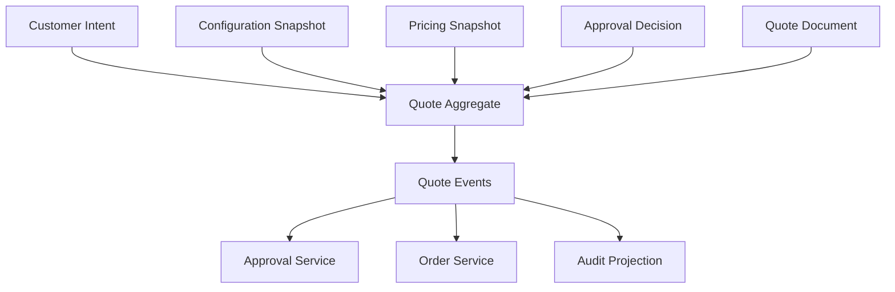
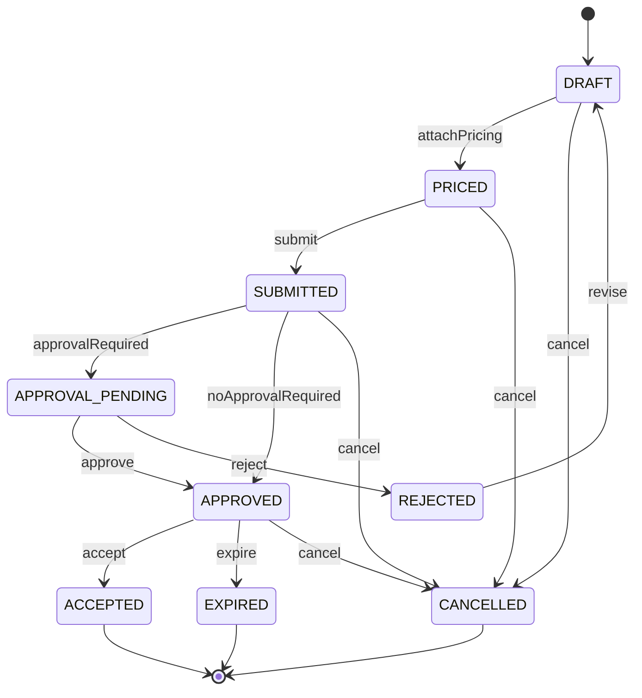
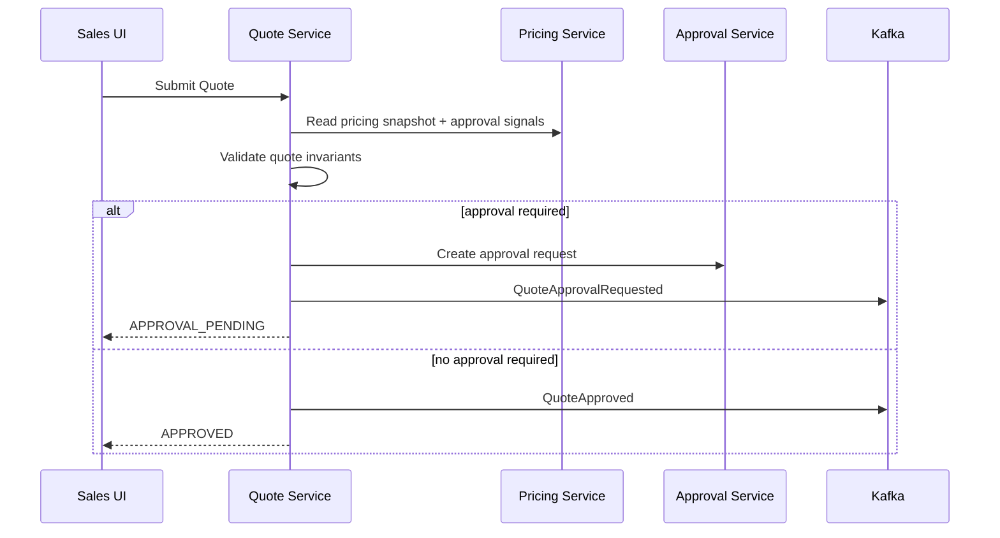
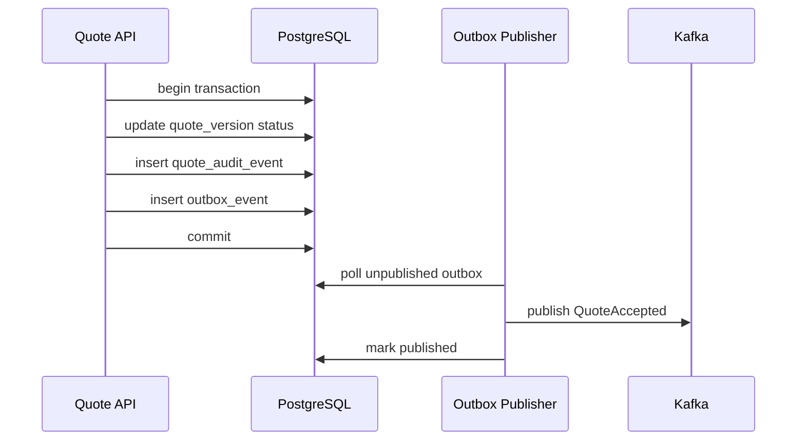

# Part 014 — Quote Service Lifecycle

## 1. Tujuan Part Ini

Pada part sebelumnya kita membangun **Pricing Engine** yang menghasilkan pricing snapshot. Sekarang kita membangun **Quote Service**: pusat lifecycle komersial yang mengikat customer intent, configuration snapshot, pricing snapshot, approval status, quote document, expiration, acceptance, dan conversion ke order.

Quote bukan sekadar PDF penawaran. Quote adalah **commercial commitment candidate**. Ia belum tentu menjadi order, tetapi ia harus cukup kuat untuk dipertanggungjawabkan ketika customer menerima penawaran.

Target part ini:

1. memahami quote sebagai aggregate lifecycle, bukan DTO biasa;
2. mendesain state machine quote yang eksplisit;
3. mengikat configuration snapshot dan pricing snapshot secara immutable;
4. menangani draft, submit, approve, reject, revise, accept, expire, cancel;
5. membangun optimistic concurrency dan idempotent command handling;
6. membuat approval hook tanpa mencampur approval policy ke Quote Service;
7. mendesain quote versioning dan amendment boundary;
8. menyimpan quote document metadata dan commercial evidence;
9. menerbitkan Kafka events yang aman dikonsumsi Order Service;
10. membuat test matrix untuk state transition dan failure mode.

> Quote Service adalah tempat bisnis bertanya: “penawaran apa yang benar-benar kita buat, berdasarkan data apa, disetujui oleh siapa, berlaku sampai kapan, dan diterima kapan?”

---

## 2. Kaufman Lens: Skill yang Harus Dikuasai

Quote lifecycle mudah terlihat seperti CRUD. Itu jebakan. Quote adalah stateful business object dengan konsekuensi finansial dan legal.

### 2.1 Sub-skill inti

| Sub-skill | Kenapa penting |
|---|---|
| Aggregate modeling | Quote harus menjaga invariant lintas line, snapshot, approval, dan customer. |
| State machine design | Tanpa state machine, lifecycle akan bocor ke if-else acak. |
| Snapshot binding | Quote harus stabil walau catalog/pricing berubah. |
| Approval integration | Approval harus dipicu oleh signal, bukan hard-code di semua endpoint. |
| Versioning | Revisi harus traceable; accepted quote tidak boleh diubah sembarangan. |
| Expiration | Quote punya validity window yang mempengaruhi acceptance. |
| Optimistic concurrency | Sales UI dan automation bisa mengubah quote bersamaan. |
| Idempotency | Submit/accept retry tidak boleh membuat double order. |
| Auditability | Commercial decision harus bisa direkonstruksi. |
| Event design | Order Service butuh event yang lengkap tapi tidak terlalu coupled. |

### 2.2 Target praktik 20 jam

Slice minimum Quote Service:

1. create quote draft;
2. attach configuration snapshot;
3. attach pricing snapshot;
4. submit quote;
5. emit approval request signal jika perlu;
6. approve quote;
7. generate quote document metadata;
8. accept quote idempotently;
9. publish `QuoteAccepted`;
10. prevent mutation after acceptance;
11. expire quote by scheduler;
12. test invalid transitions.

---

## 3. Quote Aggregate Mental Model

Quote adalah aggregate root. Semua perubahan penting harus melewati command yang menjaga invariant.



Quote tidak memiliki Catalog secara langsung. Quote menyimpan referensi/snapshot yang sudah dibekukan.

### 3.1 Quote owns lifecycle, not calculation

| Capability | Owner |
|---|---|
| Product validity | Configuration Engine |
| Price calculation | Pricing Engine |
| Commercial lifecycle | Quote Service |
| Approval policy/decision | Approval Service |
| Order fulfillment lifecycle | Order Service |
| Quote PDF rendering | Document Service or Quote Document module |

---

## 4. Quote State Machine

### 4.1 Core states



### 4.2 State meaning

| State | Meaning | Mutable? |
|---|---|---|
| `DRAFT` | Quote being assembled. | Yes. |
| `PRICED` | Has valid configuration and pricing snapshot. | Limited. |
| `SUBMITTED` | Sent for validation/approval decision. | No direct commercial mutation. |
| `APPROVAL_PENDING` | Waiting for approval decision. | No. |
| `REJECTED` | Approval rejected. | Can revise into new draft/version. |
| `APPROVED` | Commercially approved and offerable. | No price/config mutation. |
| `ACCEPTED` | Customer accepted. | Terminal for this quote version. |
| `EXPIRED` | Validity window passed. | Terminal. |
| `CANCELLED` | Withdrawn. | Terminal. |

### 4.3 Why `PRICED` exists

Some systems jump from `DRAFT` to `SUBMITTED`. Adding `PRICED` makes explicit that a quote has a coherent configuration and pricing snapshot, but has not yet entered approval/offer flow.

This helps avoid submitting quote with stale or partial pricing.

---

## 5. Quote Invariants

Quote Service must enforce invariants.

| Invariant | Why it matters |
|---|---|
| Quote must belong to exactly one tenant. | Prevent cross-tenant leakage. |
| Quote must reference one customer/account. | Commercial party must be clear. |
| Quote cannot be submitted without configuration snapshot. | Cannot price invalid unknown configuration. |
| Quote cannot be submitted without pricing snapshot. | Cannot approve unknown commercial value. |
| Pricing snapshot must match configuration snapshot. | Prevent price/config mismatch. |
| Quote currency must match pricing snapshot currency. | Prevent invalid totals. |
| Approved quote cannot change price/config. | Commercial evidence must remain stable. |
| Accepted quote cannot be accepted twice with different request. | Prevent double order. |
| Expired quote cannot be accepted. | Validity window must be enforced. |
| Rejected quote cannot become approved without new approval decision. | Approval integrity. |
| Terminal quote cannot return to active state. | Lifecycle defensibility. |

---

## 6. Quote Versioning

Quote versioning is not optional in real CPQ.

### 6.1 Version model

| Concept | Meaning |
|---|---|
| `quote_id` | Stable quote family identifier. |
| `quote_version_id` | Specific commercial version. |
| `version_number` | Human-visible version counter. |
| `previous_version_id` | Revision lineage. |
| `superseded_by_version_id` | Forward lineage. |

### 6.2 Version behavior

| Action | Behavior |
|---|---|
| Edit draft | Same quote version. |
| Revise rejected quote | New version from previous. |
| Reprice approved quote | New version or reapproval flow. |
| Amend accepted quote | New amendment quote/order amendment, not mutation. |
| Clone quote | New quote family with copied snapshots as references or cloned payload depending policy. |

### 6.3 Version state relation

Only one active offerable version should exist per quote family unless business explicitly supports alternatives.

```sql
create unique index uq_one_active_approved_quote_version
    on quote_version (tenant_id, quote_id)
    where status in ('APPROVED');
```

Be careful: this index is simple but may conflict with complex approval flows. Use it only if the business invariant is true.

---

## 7. PostgreSQL Data Model

### 7.1 Quote family table

```sql
create table quote (
    quote_id uuid primary key,
    tenant_id uuid not null,
    quote_number text not null,
    customer_id uuid not null,
    opportunity_ref text,
    created_by uuid not null,
    created_at timestamptz not null default now(),
    unique (tenant_id, quote_number)
);
```

### 7.2 Quote version table

```sql
create table quote_version (
    quote_version_id uuid primary key,
    tenant_id uuid not null,
    quote_id uuid not null references quote(quote_id),
    version_number int not null,
    status text not null,
    configuration_snapshot_id uuid,
    pricing_snapshot_id uuid,
    currency char(3),
    list_total numeric(19, 4),
    discount_total numeric(19, 4),
    net_total numeric(19, 4),
    valid_from timestamptz,
    valid_until timestamptz,
    approval_required boolean not null default false,
    approval_status text,
    document_id uuid,
    accepted_at timestamptz,
    accepted_by text,
    cancelled_at timestamptz,
    expired_at timestamptz,
    previous_version_id uuid,
    superseded_by_version_id uuid,
    row_version bigint not null default 0,
    created_at timestamptz not null default now(),
    updated_at timestamptz not null default now(),
    unique (tenant_id, quote_id, version_number),
    check (status in ('DRAFT', 'PRICED', 'SUBMITTED', 'APPROVAL_PENDING', 'REJECTED', 'APPROVED', 'ACCEPTED', 'EXPIRED', 'CANCELLED')),
    check (approval_status is null or approval_status in ('NOT_REQUIRED', 'PENDING', 'APPROVED', 'REJECTED'))
);

create index idx_quote_version_status
    on quote_version (tenant_id, status, updated_at desc);
```

### 7.3 Quote line table

Quote lines are often stored as denormalized snapshot lines for read/query and document generation.

```sql
create table quote_line (
    quote_line_id uuid primary key,
    tenant_id uuid not null,
    quote_version_id uuid not null references quote_version(quote_version_id),
    line_number int not null,
    parent_line_id uuid,
    item_ref_type text not null,
    item_ref_id text not null,
    display_name text not null,
    quantity numeric(19, 4) not null,
    charge_type text not null,
    charge_period text,
    unit_amount numeric(19, 4) not null,
    list_amount numeric(19, 4) not null,
    discount_amount numeric(19, 4) not null,
    net_amount numeric(19, 4) not null,
    snapshot jsonb not null,
    unique (quote_version_id, line_number)
);
```

### 7.4 Quote event audit table

```sql
create table quote_audit_event (
    quote_audit_event_id uuid primary key,
    tenant_id uuid not null,
    quote_version_id uuid not null,
    event_type text not null,
    actor_id uuid,
    actor_type text not null,
    reason text,
    before_state text,
    after_state text,
    evidence jsonb not null default '{}'::jsonb,
    created_at timestamptz not null default now()
);
```

Do not rely only on application logs for audit. Logs are operational; audit table is business evidence.

---

## 8. Command Model

Quote Service should expose commands, not generic patch everything endpoint.

| Command | Allowed from | Result |
|---|---|---|
| `CreateQuoteDraft` | none | `DRAFT` quote version |
| `AttachConfiguration` | `DRAFT` | config snapshot linked |
| `AttachPricing` | `DRAFT`, `PRICED` | `PRICED` quote version |
| `SubmitQuote` | `PRICED` | `SUBMITTED` or `APPROVAL_PENDING` |
| `RecordApprovalDecision` | `APPROVAL_PENDING` | `APPROVED` or `REJECTED` |
| `ReviseQuote` | `REJECTED`, maybe `APPROVED` | new `DRAFT` version |
| `AcceptQuote` | `APPROVED` | `ACCEPTED` |
| `ExpireQuote` | `APPROVED` | `EXPIRED` |
| `CancelQuote` | active states | `CANCELLED` |

### 8.1 Command example

```java
public record SubmitQuoteCommand(
    UUID tenantId,
    UUID quoteVersionId,
    UUID actorId,
    long expectedRowVersion,
    String idempotencyKey
) {}
```

Do not let command omit `expectedRowVersion`. Otherwise the UI can overwrite another user's changes without noticing.

---

## 9. Aggregate Implementation

### 9.1 QuoteVersion aggregate

```java
public final class QuoteVersion {
    private final UUID quoteVersionId;
    private final UUID tenantId;
    private QuoteStatus status;
    private UUID configurationSnapshotId;
    private UUID pricingSnapshotId;
    private MoneyTotals totals;
    private boolean approvalRequired;
    private ApprovalStatus approvalStatus;
    private Instant validUntil;
    private long rowVersion;

    public void attachPricing(PricingSnapshot snapshot) {
        requireStatus(QuoteStatus.DRAFT, QuoteStatus.PRICED);
        requireConfigurationMatches(snapshot.configurationSnapshotId());
        this.pricingSnapshotId = snapshot.pricingSnapshotId();
        this.totals = snapshot.totals();
        this.status = QuoteStatus.PRICED;
    }

    public SubmitOutcome submit(List<ApprovalSignal> signals, Instant now) {
        requireStatus(QuoteStatus.PRICED);
        requirePricingSnapshot();
        requireConfigurationSnapshot();

        this.approvalRequired = !signals.isEmpty();
        if (approvalRequired) {
            this.status = QuoteStatus.APPROVAL_PENDING;
            this.approvalStatus = ApprovalStatus.PENDING;
            return SubmitOutcome.approvalRequired(signals);
        }

        this.status = QuoteStatus.APPROVED;
        this.approvalStatus = ApprovalStatus.NOT_REQUIRED;
        this.validUntil = now.plus(Duration.ofDays(30));
        return SubmitOutcome.approvedWithoutApproval();
    }

    public void accept(Instant now, String acceptedBy) {
        requireStatus(QuoteStatus.APPROVED);
        if (validUntil != null && now.isAfter(validUntil)) {
            throw new DomainException("QUOTE_EXPIRED");
        }
        this.status = QuoteStatus.ACCEPTED;
    }
}
```

### 9.2 Avoid anemic state mutation

Bad:

```java
quote.setStatus(request.status());
quoteMapper.update(quote);
```

Better:

```java
quote.accept(clock.instant(), command.acceptedBy());
quoteRepository.save(quote, command.expectedRowVersion());
```

State transition belongs in aggregate behavior.

---

## 10. OpenAPI Contract

### 10.1 Create quote draft

```yaml
paths:
  /quotes:
    post:
      operationId: createQuoteDraft
      parameters:
        - name: Idempotency-Key
          in: header
          required: true
          schema:
            type: string
      requestBody:
        required: true
        content:
          application/json:
            schema:
              $ref: '#/components/schemas/CreateQuoteDraftRequest'
      responses:
        '201':
          description: Quote draft created
```

### 10.2 Attach pricing

```yaml
  /quote-versions/{quoteVersionId}/pricing:
    put:
      operationId: attachPricingSnapshot
      parameters:
        - name: If-Match
          in: header
          required: true
          schema:
            type: string
      requestBody:
        required: true
        content:
          application/json:
            schema:
              type: object
              required: [pricingSnapshotId]
              properties:
                pricingSnapshotId:
                  type: string
                  format: uuid
      responses:
        '200':
          description: Pricing attached
        '409':
          description: Invalid quote state or stale row version
        '422':
          description: Pricing snapshot does not match quote configuration
```

### 10.3 Submit quote

```yaml
  /quote-versions/{quoteVersionId}/submit:
    post:
      operationId: submitQuote
      parameters:
        - name: Idempotency-Key
          in: header
          required: true
          schema:
            type: string
        - name: If-Match
          in: header
          required: true
          schema:
            type: string
      responses:
        '200':
          description: Quote submitted
```

### 10.4 Accept quote

```yaml
  /quote-versions/{quoteVersionId}/accept:
    post:
      operationId: acceptQuote
      parameters:
        - name: Idempotency-Key
          in: header
          required: true
          schema:
            type: string
      requestBody:
        required: true
        content:
          application/json:
            schema:
              $ref: '#/components/schemas/AcceptQuoteRequest'
      responses:
        '200':
          description: Quote accepted
        '409':
          description: Quote cannot be accepted in current state
        '410':
          description: Quote expired
```

---

## 11. JAX-RS Resource Boundary

```java
@Path("/quote-versions")
@Consumes(MediaType.APPLICATION_JSON)
@Produces(MediaType.APPLICATION_JSON)
public class QuoteVersionResource {

    private final QuoteApplicationService quoteApplicationService;

    @POST
    @Path("/{quoteVersionId}/submit")
    public Response submit(
        @PathParam("quoteVersionId") UUID quoteVersionId,
        @HeaderParam("Idempotency-Key") String idempotencyKey,
        @HeaderParam("If-Match") String ifMatch
    ) {
        SubmitQuoteCommand command = new SubmitQuoteCommand(
            RequestContext.tenantId(),
            quoteVersionId,
            RequestContext.actorId(),
            RowVersionHeader.parse(ifMatch),
            idempotencyKey
        );
        QuoteVersionDto result = quoteApplicationService.submit(command);
        return Response.ok(result).build();
    }
}
```

Resource layer remains thin. All state transition and invariant logic lives in application/domain layer.

---

## 12. MyBatis Persistence

### 12.1 Load aggregate

```xml
<select id="findQuoteVersionForUpdate" resultMap="QuoteVersionRowMap">
    select *
    from quote_version
    where tenant_id = #{tenantId}
      and quote_version_id = #{quoteVersionId}
</select>
```

For most command flows, optimistic concurrency is enough. Use `for update` only for critical sections where double transition must be blocked inside the transaction and expected contention is acceptable.

### 12.2 Optimistic update

```xml
<update id="updateQuoteVersion">
    update quote_version
    set status = #{status},
        configuration_snapshot_id = #{configurationSnapshotId},
        pricing_snapshot_id = #{pricingSnapshotId},
        currency = #{currency},
        list_total = #{listTotal},
        discount_total = #{discountTotal},
        net_total = #{netTotal},
        valid_until = #{validUntil},
        approval_required = #{approvalRequired},
        approval_status = #{approvalStatus},
        accepted_at = #{acceptedAt},
        accepted_by = #{acceptedBy},
        row_version = row_version + 1,
        updated_at = now()
    where tenant_id = #{tenantId}
      and quote_version_id = #{quoteVersionId}
      and row_version = #{expectedRowVersion}
</update>
```

If affected row count is zero, return stale version conflict.

---

## 13. Approval Hook

Quote Service does not own approval policy. It receives approval signals from Pricing Engine or policy evaluation and asks Approval Service to decide.



### 13.1 Approval request payload

```json
{
  "quoteVersionId": "qv-001",
  "customerId": "cust-001",
  "netTotal": "10800000.00",
  "currency": "IDR",
  "signals": [
    {
      "code": "DISCOUNT_ABOVE_THRESHOLD",
      "severity": "APPROVAL_REQUIRED",
      "evidence": {
        "effectiveDiscountPercent": "25.00",
        "thresholdPercent": "20.00"
      }
    }
  ]
}
```

---

## 14. Quote Document

Quote document should be generated from snapshots, not live catalog/pricing.

### 14.1 Document metadata

```sql
create table quote_document (
    document_id uuid primary key,
    tenant_id uuid not null,
    quote_version_id uuid not null references quote_version(quote_version_id),
    document_type text not null,
    storage_uri text not null,
    content_hash text not null,
    generated_at timestamptz not null default now(),
    generated_by uuid,
    check (document_type in ('CUSTOMER_QUOTE_PDF', 'INTERNAL_REVIEW_PDF'))
);
```

### 14.2 Document invariant

A quote document generated for an approved quote should be immutable. If quote is revised, create a new quote version and new document.

---

## 15. Kafka Events

### 15.1 Event taxonomy

| Event | When |
|---|---|
| `QuoteDraftCreated` | Draft created. |
| `QuotePricingAttached` | Pricing snapshot attached. |
| `QuoteSubmitted` | Quote submitted. |
| `QuoteApprovalRequested` | Approval needed. |
| `QuoteApproved` | Approved or no approval needed. |
| `QuoteRejected` | Approval rejected. |
| `QuoteRevised` | New version created. |
| `QuoteAccepted` | Customer accepted. |
| `QuoteExpired` | Validity passed. |
| `QuoteCancelled` | Withdrawn. |

### 15.2 QuoteAccepted event

```json
{
  "eventId": "evt-quote-accepted-001",
  "eventType": "QuoteAccepted",
  "eventVersion": 1,
  "tenantId": "tenant-001",
  "occurredAt": "2026-07-02T11:00:00Z",
  "aggregateType": "QuoteVersion",
  "aggregateId": "qv-001",
  "payload": {
    "quoteId": "quote-001",
    "quoteVersionId": "qv-001",
    "quoteNumber": "Q-2026-00001",
    "customerId": "cust-001",
    "configurationSnapshotId": "cfgsnap-001",
    "pricingSnapshotId": "pricesnap-001",
    "currency": "IDR",
    "netTotal": "10800000.00",
    "acceptedAt": "2026-07-02T11:00:00Z",
    "acceptedBy": "customer@example.com"
  }
}
```

Order Service should consume `QuoteAccepted`, validate idempotency, then create order capture record.

---

## 16. Transactional Outbox

Quote status update and event emission must be atomic from business perspective.



Never publish Kafka event before transaction commit.

---

## 17. Redis Usage

Redis is optional acceleration.

| Use case | Recommended? | Notes |
|---|---|---|
| Quote read cache | Sometimes | Only for non-sensitive summary and short TTL. |
| Idempotency fast lookup | Yes | Backed by DB table. |
| Draft editing session | Maybe | Source of truth remains PostgreSQL. |
| Distributed lock for accept | Usually avoid | Prefer DB idempotency and optimistic concurrency. |
| Expiration queue | Maybe | DB scheduler is simpler initially. |

### 17.1 Quote cache key

```text
quote-summary:{tenantId}:{quoteVersionId}
```

Invalidate on every quote event. If cache fails, correctness must remain intact.

---

## 18. Idempotent Acceptance

Accept quote is high-risk. Duplicate accept must not create duplicate order.

### 18.1 Acceptance idempotency table

```sql
create table quote_acceptance_idempotency (
    tenant_id uuid not null,
    quote_version_id uuid not null,
    idempotency_key text not null,
    request_hash text not null,
    status text not null,
    accepted_at timestamptz,
    created_order_ref text,
    created_at timestamptz not null default now(),
    primary key (tenant_id, quote_version_id, idempotency_key),
    check (status in ('IN_PROGRESS', 'ACCEPTED', 'FAILED'))
);
```

### 18.2 Acceptance behavior

| Condition | Behavior |
|---|---|
| Approved, not expired, new key | Accept and publish event. |
| Same key, same body, already accepted | Return accepted result. |
| Same key, different body | Return conflict. |
| Quote already accepted by same accepted evidence | Return accepted result. |
| Quote accepted with different evidence | Return conflict/manual review. |
| Quote expired | Reject acceptance. |

---

## 19. Expiration Model

Quote expiration is a lifecycle transition, not a read-time cosmetic label.

### 19.1 Expiration job

```sql
select quote_version_id
from quote_version
where tenant_id = #{tenantId}
  and status = 'APPROVED'
  and valid_until < now()
order by valid_until
limit #{batchSize};
```

For each quote:

1. load aggregate;
2. call `expire(now)`;
3. update status with optimistic concurrency;
4. insert audit event;
5. insert outbox event `QuoteExpired`.

### 19.2 Race: accept vs expire

If acceptance and expiration happen simultaneously, the DB transaction and condition decide.

Acceptance update should include:

```sql
where status = 'APPROVED'
  and valid_until >= now()
```

Expiration update should include:

```sql
where status = 'APPROVED'
  and valid_until < now()
```

Only one wins.

---

## 20. Failure Modes

| Failure | Bad design | Better design |
|---|---|---|
| Quote submitted without pricing | Allow and fix later | Reject submission. |
| Pricing/config mismatch | Trust client IDs | Verify snapshot relation. |
| Approved quote edited | Update row in place | Create revision/new version. |
| Duplicate accept | Create duplicate order | Acceptance idempotency + QuoteAccepted event dedup. |
| Expired quote accepted | Check only in UI | Enforce in DB/domain. |
| Approval callback late | Apply blindly | Verify quote still pending and approval request matches. |
| Quote PDF regenerated from live data | Commercial mismatch | Generate from snapshots. |
| Status set via generic PATCH | Invalid transitions | Command-specific endpoints. |
| Kafka publish before commit | Phantom order | Transactional outbox. |

---

## 21. Testing Strategy

### 21.1 State transition tests

| From | Command | Expected |
|---|---|---|
| `DRAFT` | attach pricing | `PRICED` |
| `DRAFT` | submit | error |
| `PRICED` | submit no signals | `APPROVED` |
| `PRICED` | submit with signals | `APPROVAL_PENDING` |
| `APPROVAL_PENDING` | approve | `APPROVED` |
| `APPROVAL_PENDING` | reject | `REJECTED` |
| `APPROVED` | accept before expiry | `ACCEPTED` |
| `APPROVED` | accept after expiry | error |
| `ACCEPTED` | attach pricing | error |
| `EXPIRED` | accept | error |

### 21.2 Integration tests

1. create draft and version row;
2. attach pricing snapshot;
3. optimistic update conflict;
4. submit with approval signal;
5. approval callback;
6. accept idempotency;
7. outbox event generated;
8. expiration job race with accept;
9. quote line snapshot read;
10. audit event evidence.

### 21.3 Contract tests

1. `POST /quotes` response shape;
2. `PUT /quote-versions/{id}/pricing` conflict behavior;
3. `POST /quote-versions/{id}/submit` state transitions;
4. `POST /quote-versions/{id}/accept` idempotency;
5. `QuoteAccepted` event schema compatibility.

---

## 22. Observability

### 22.1 Metrics

| Metric | Type | Purpose |
|---|---|---|
| `quote_created_count` | counter | Funnel volume. |
| `quote_submitted_count` | counter | Sales activity. |
| `quote_approval_required_count` | counter | Approval load. |
| `quote_accepted_count` | counter | Conversion. |
| `quote_expired_count` | counter | Lost opportunity signal. |
| `quote_state_transition_latency_ms` | histogram | Lifecycle performance. |
| `quote_optimistic_conflict_count` | counter | Collaboration/contention signal. |

### 22.2 Business funnel

Track:

```text
DRAFT -> PRICED -> SUBMITTED -> APPROVED -> ACCEPTED
```

The funnel is not only product analytics. It reveals engineering problems too. For example, high `PRICED -> SUBMITTED` drop-off may mean quote validation is too slow or errors are hard to understand.

---

## 23. Security and Authorization

| Action | Permission |
|---|---|
| Create quote | `quote:create` |
| View quote | `quote:read` |
| Attach pricing | `quote:price` |
| Submit quote | `quote:submit` |
| Approve quote | usually Approval Service permission |
| Accept quote | `quote:accept` or customer token validation |
| Cancel quote | `quote:cancel` |
| View internal margin evidence | `quote:read-sensitive` |

Quote customer acceptance may happen via external tokenized link. That flow must verify token, validity, quote identity, and acceptance evidence.

---

## 24. Practical Exercise

Implement vertical slice:

1. migration for `quote`, `quote_version`, `quote_line`, `quote_audit_event`;
2. `POST /quotes` create draft;
3. `PUT /quote-versions/{id}/configuration` attach configuration snapshot;
4. `PUT /quote-versions/{id}/pricing` attach pricing snapshot;
5. `POST /quote-versions/{id}/submit`;
6. approval signal handling;
7. `POST /quote-versions/{id}/approval-decisions` internal callback;
8. `POST /quote-versions/{id}/accept`;
9. transactional outbox for `QuoteAccepted`;
10. test duplicate accept.

Acceptance criteria:

1. invalid state transitions fail;
2. stale row version fails;
3. quote cannot submit without pricing;
4. quote cannot accept after expiry;
5. accepted quote cannot mutate commercial terms;
6. `QuoteAccepted` is emitted once;
7. audit event exists for every state transition.

---

## 25. Common Anti-patterns

| Anti-pattern | Consequence |
|---|---|
| Treating quote as CRUD table | Invalid lifecycle and inconsistent states. |
| Mutating approved quote in place | Audit and legal risk. |
| Generating document from live catalog | Customer sees different data than approved. |
| Accept endpoint without idempotency | Duplicate orders. |
| Approval policy embedded everywhere | Inconsistent approval behavior. |
| State transition hidden in mapper update | Impossible to reason about business rules. |
| No quote versioning | Revisions destroy history. |
| Expiration checked only by frontend | Invalid accepted quotes. |
| Event emitted without outbox | Downstream order mismatch. |

---

## 26. Review Checklist

Before moving to Approval Policy and Escalation Model:

- [ ] Quote has explicit state machine.
- [ ] Quote versioning is implemented or intentionally deferred with migration plan.
- [ ] Approved and accepted quote cannot mutate price/config.
- [ ] Configuration snapshot and pricing snapshot relation is validated.
- [ ] Submit command rejects incomplete quote.
- [ ] Approval signal integration is separated from approval decision.
- [ ] Accept command is idempotent.
- [ ] Expiration is enforced server-side and database-side where necessary.
- [ ] Every state transition writes audit event.
- [ ] Every important transition writes outbox event.
- [ ] Quote document is generated from snapshots.
- [ ] OpenAPI exposes command-specific endpoints.

---

## 27. Ringkasan

Quote Service adalah lifecycle authority untuk penawaran komersial. Ia bukan tempat menghitung konfigurasi atau harga, tetapi ia mengikat hasil keduanya menjadi commercial record yang bisa disubmit, disetujui, diterima, atau kadaluarsa.

Prinsip utama:

1. Quote adalah aggregate dengan state machine eksplisit;
2. quote menyimpan snapshot references, bukan live lookup;
3. approved/accepted quote tidak boleh berubah in place;
4. acceptance harus idempotent;
5. approval policy harus terpisah tetapi terintegrasi;
6. quote document harus berasal dari evidence yang sama dengan approval;
7. `QuoteAccepted` adalah boundary event penting menuju Order Service.

Pada part berikutnya kita akan membangun **Approval Policy and Escalation Model**: bagaimana discount threshold, risk signal, delegation, SLA timer, manual override, escalation, dan audit decision history dimodelkan secara defensible.
