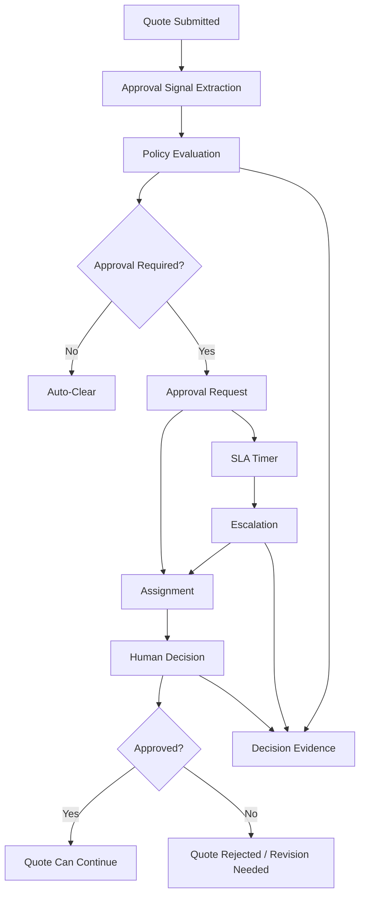
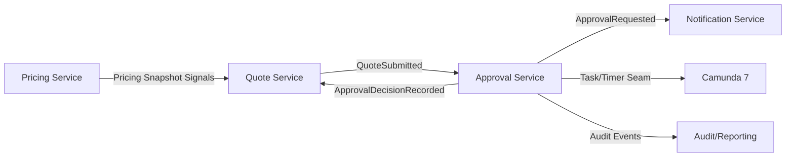
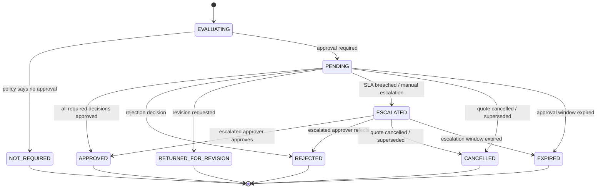
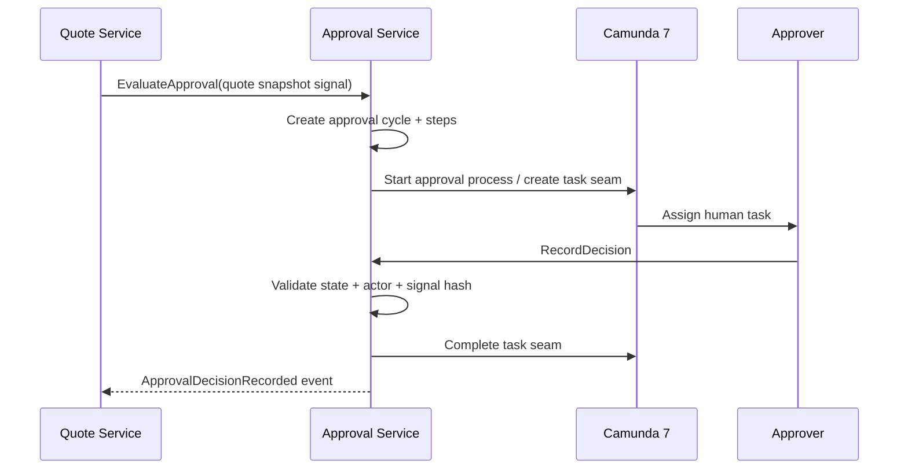

# Part 015 — Approval Policy and Escalation Model

## 1. Tujuan Part Ini

Pada part sebelumnya kita membangun **Quote Service Lifecycle**. Quote sudah bisa dibuat, diberi configuration snapshot, diberi pricing snapshot, disubmit, disetujui, ditolak, diterima, atau kedaluwarsa. Namun satu bagian penting masih belum cukup tajam: **approval**.

Approval bukan sekadar tombol “approve”. Dalam CPQ/OMS, approval adalah sistem pengambilan keputusan yang menentukan apakah sebuah quote boleh menjadi komitmen komersial. Approval harus menjawab:

- kenapa quote ini perlu approval;
- siapa yang boleh approve;
- berdasarkan policy versi berapa keputusan dibuat;
- berapa lama SLA-nya;
- apa yang terjadi jika approver tidak merespons;
- apakah approval bisa didelegasikan;
- apakah approval bisa di-override;
- bukti apa yang disimpan untuk audit;
- bagaimana quote melanjutkan lifecycle setelah keputusan keluar.

Target part ini:

1. memodelkan approval sebagai **decision system**, bukan sekadar workflow task;
2. memisahkan policy evaluation, assignment, human decision, escalation, dan audit;
3. membuat approval request state machine yang eksplisit;
4. membangun approval matrix berbasis risk signal, discount, margin, product, tenant, dan customer segment;
5. mendesain SLA timer, escalation chain, delegation, dan override;
6. menyimpan evidence yang cukup untuk rekonstruksi keputusan;
7. menyiapkan seam integrasi dengan Camunda 7 tanpa membuat domain approval bergantung total pada BPMN;
8. menerbitkan Kafka event yang aman untuk Quote Service, reporting, dan audit;
9. membuat test matrix untuk policy, state transition, race condition, dan failure mode.

> Approval yang buruk membuat sales lambat. Approval yang terlalu longgar membuat bisnis rugi. Approval yang tidak audit-friendly membuat keputusan tidak defensible.

---

## 2. Kaufman Lens: Skill yang Harus Dikuasai

Dalam kerangka Kaufman, skill “membangun approval system” perlu didekonstruksi menjadi sub-skill kecil yang dapat dilatih. Jangan mulai dari BPMN. Mulai dari keputusan bisnis.

### 2.1 Sub-skill inti

| Sub-skill | Kenapa penting |
|---|---|
| Approval signal modeling | Sistem harus tahu alasan approval dibutuhkan, bukan hanya status `PENDING`. |
| Policy versioning | Keputusan approval harus bisa direkonstruksi berdasarkan policy saat itu. |
| State machine discipline | Tanpa state machine, approval akan berubah menjadi kombinasi flag yang rapuh. |
| Assignment model | “Siapa approver” sering lebih kompleks daripada role tunggal. |
| Delegation and substitution | Real-world approver bisa cuti, pindah role, atau tidak tersedia. |
| Escalation modeling | SLA harus menghasilkan tindakan, bukan hanya laporan terlambat. |
| Audit evidence | Keputusan approval harus punya alasan, actor, waktu, dan context. |
| Idempotent decision handling | Klik approve/reject berulang tidak boleh menghasilkan state aneh. |
| Race handling | Two approvers can act near-simultaneously; state transition must remain valid. |
| Workflow seam | Camunda dapat mengorkestrasi task/timer, tetapi domain tetap harus punya invariant sendiri. |

### 2.2 Skill outcome

Setelah part ini, kita ingin bisa melihat approval requirement seperti ini:

> Quote dengan discount lebih dari 20%, margin kurang dari 12%, produk regulated, dan customer enterprise harus disetujui oleh Sales Director dan Finance Manager dalam 24 jam. Jika tidak ada respons, eskalasi ke VP Sales. Jika margin di bawah 5%, approval manual tidak cukup dan perlu Commercial Risk Board.

Lalu mengubahnya menjadi:

- policy rule;
- decision signal;
- approval request;
- approver assignment;
- SLA timer;
- escalation route;
- event contract;
- audit record;
- test case;
- operational query.

---

## 3. Mental Model: Approval sebagai Decision System

Approval sering salah dipahami sebagai “human workflow”. Itu hanya satu sisi. Approval yang benar punya lima lapisan:



### 3.1 Lima lapisan approval

| Layer | Pertanyaan | Output |
|---|---|---|
| Signal extraction | Apa yang berisiko dari quote ini? | Discount signal, margin signal, product risk, customer risk. |
| Policy evaluation | Berdasarkan policy, apakah perlu approval? | Required/not required + approval path. |
| Assignment | Siapa yang harus mengambil keputusan? | Approver candidate, role, group, quorum. |
| Decision | Apa keputusan manusia/sistem? | Approved, rejected, returned for revision, overridden. |
| Evidence | Bagaimana keputusan dibuktikan? | Policy version, actor, reason, timestamp, snapshot hash. |

### 3.2 Rule penting

Approval Service tidak boleh menghitung ulang pricing. Ia menerima **pricing signal** dari Pricing Engine atau Quote Service. Jika Approval Service menghitung ulang harga sendiri, maka satu quote bisa punya dua kebenaran komersial.

Approval Service boleh mengevaluasi policy terhadap snapshot dan signal. Tetapi source of truth untuk:

- price calculation ada di Pricing Service;
- quote lifecycle ada di Quote Service;
- approval decision ada di Approval Service;
- orchestration/timer bisa berada di Camunda;
- notification bisa berada di Notification Service.

---

## 4. Bounded Context dan Ownership

Approval Service harus punya ownership yang jelas.



### 4.1 Ownership table

| Concern | Owner | Catatan |
|---|---|---|
| Quote state | Quote Service | Approval tidak boleh langsung mengubah quote table. |
| Approval request | Approval Service | Satu quote bisa punya beberapa approval cycle. |
| Approval policy | Approval Service | Policy harus versioned. |
| Approver decision | Approval Service | Actor, reason, timestamp, evidence wajib. |
| Human task/timer | Camunda 7 or task subsystem | Hanya orchestration seam. Domain state tetap di Approval Service. |
| Notification | Notification Service | Email/Slack/in-app bukan domain approval. |
| Audit projection | Audit/reporting | Consumer event, bukan owner decision. |

### 4.2 Anti-corruption boundary

Quote Service tidak boleh bertanya:

```text
isDiscountAboveDirectorThreshold && isMarginLow && userHasRole("SALES_DIRECTOR")
```

Quote Service cukup bertanya atau menerima event:

```text
ApprovalDecisionRecorded(quoteId, approvalCycleId, decision=APPROVED)
```

Alasan: policy approval berubah lebih sering daripada lifecycle quote. Jika policy tersebar di Quote Service, UI, BPMN, dan reporting, maka setiap perubahan akan menjadi distributed refactoring.

---

## 5. Approval Lifecycle State Machine

Approval request punya lifecycle sendiri. Jangan jadikan approval sebagai boolean di quote.



### 5.1 State definition

| State | Meaning | Terminal? |
|---|---|---|
| `EVALUATING` | Policy sedang dievaluasi. | No |
| `NOT_REQUIRED` | Approval tidak dibutuhkan untuk quote snapshot ini. | Yes |
| `PENDING` | Approval dibutuhkan dan menunggu decision. | No |
| `ESCALATED` | SLA/task dialihkan ke level lebih tinggi. | No |
| `APPROVED` | Semua approval obligation terpenuhi. | Yes |
| `REJECTED` | Quote tidak boleh lanjut dalam bentuk saat ini. | Yes |
| `RETURNED_FOR_REVISION` | Quote harus direvisi, bukan sekadar ditolak final. | Yes |
| `CANCELLED` | Approval cycle dibatalkan karena quote dibatalkan/superseded. | Yes |
| `EXPIRED` | Approval tidak selesai dalam window yang diizinkan. | Yes |

### 5.2 Approval cycle vs approval request

Gunakan istilah berikut:

- **approval cycle**: satu putaran approval untuk satu versi quote;
- **approval request**: representasi domain yang menunggu keputusan;
- **approval step**: tahap atau obligation tertentu;
- **approval decision**: tindakan approve/reject/return oleh actor tertentu;
- **approval evidence**: data immutable untuk membuktikan keputusan.

Quote revision harus membuat approval cycle baru. Jangan recycle approval lama untuk quote yang isinya berubah.

---

## 6. Approval Signal Model

Approval policy sebaiknya dievaluasi terhadap signal, bukan membaca semua raw payload tanpa struktur.

### 6.1 Signal taxonomy

| Signal | Source | Contoh |
|---|---|---|
| Commercial signal | Pricing snapshot | Discount 24%, margin 8%, total contract value 2.5B IDR. |
| Product signal | Catalog/configuration | Regulated product, custom bundle, unsupported combination. |
| Customer signal | CRM/customer service | Strategic account, high-risk customer, delinquent account. |
| Contract signal | Quote metadata | Non-standard payment term, long validity, custom clause. |
| Operational signal | OMS capability | Fulfillment depends on manual provisioning. |
| Compliance signal | Regulatory rules | Restricted geography, export control, industry restriction. |

### 6.2 Example approval signal schema

```json
{
  "quoteId": "quo_01HZX...",
  "quoteVersion": 4,
  "pricingSnapshotId": "prs_01HZX...",
  "customerSegment": "ENTERPRISE",
  "currency": "IDR",
  "totalContractValue": "2500000000.00",
  "maxDiscountPercent": "24.50",
  "grossMarginPercent": "8.25",
  "containsRegulatedProduct": true,
  "containsCustomTerm": true,
  "requestedValidityDays": 60,
  "riskFlags": [
    "DISCOUNT_ABOVE_THRESHOLD",
    "LOW_MARGIN",
    "CUSTOM_TERM"
  ]
}
```

### 6.3 Design rule

Approval signal harus immutable untuk approval cycle. Jika quote direvisi, buat signal baru. Jika policy berubah setelah approval request dibuat, decision tetap harus merujuk policy version yang digunakan saat cycle dibuat.

---

## 7. Approval Policy Model

Policy approval jangan dipendam dalam kode `if/else` acak. Minimal, simpan policy metadata dan rule expression versioned.

### 7.1 Policy structure

| Field | Meaning |
|---|---|
| `policy_id` | ID stabil policy. |
| `policy_version` | Versi policy yang dievaluasi. |
| `tenant_id` | Tenant atau market scope. |
| `effective_from` | Kapan policy mulai berlaku. |
| `effective_to` | Kapan policy selesai berlaku. |
| `priority` | Urutan evaluasi jika policy overlap. |
| `condition` | Ekspresi kondisi terhadap signal. |
| `approval_path` | Steps/roles/quorum jika policy match. |
| `sla` | Target waktu decision. |
| `escalation_path` | Route eskalasi. |
| `status` | Draft, active, retired. |

### 7.2 Example policy as JSON document

```json
{
  "policyCode": "LOW_MARGIN_ENTERPRISE_QUOTE",
  "version": 7,
  "condition": {
    "all": [
      { "field": "customerSegment", "op": "eq", "value": "ENTERPRISE" },
      { "field": "grossMarginPercent", "op": "lt", "value": "12.00" }
    ]
  },
  "approvalPath": [
    {
      "stepCode": "SALES_DIRECTOR_APPROVAL",
      "mode": "ANY_ONE",
      "role": "SALES_DIRECTOR",
      "slaHours": 24
    },
    {
      "stepCode": "FINANCE_MANAGER_APPROVAL",
      "mode": "ANY_ONE",
      "role": "FINANCE_MANAGER",
      "slaHours": 24
    }
  ],
  "escalation": [
    {
      "afterHours": 24,
      "role": "VP_SALES"
    },
    {
      "afterHours": 48,
      "role": "COMMERCIAL_RISK_BOARD"
    }
  ]
}
```

### 7.3 Rule expression approach

Untuk build-from-scratch, jangan langsung membuat DSL terlalu kompleks. Mulai dengan JSON expression tree terbatas:

- `all`, `any`, `not`;
- operators: `eq`, `neq`, `gt`, `gte`, `lt`, `lte`, `contains`, `in`;
- typed values: string, decimal, boolean, date;
- no arbitrary script execution;
- no reflection-based field access yang tidak dikontrol;
- semua field harus whitelisted dari approval signal schema.

Ini memberi fleksibilitas tanpa membuka risiko arbitrary code execution atau policy yang tidak dapat di-test.

---

## 8. Approval Matrix

Approval matrix adalah hasil dari policy evaluation, bukan pengganti policy model.

### 8.1 Matrix example

| Condition | Approver | SLA | Escalation |
|---|---|---:|---|
| Discount > 10% | Sales Manager | 8h | Sales Director |
| Discount > 20% | Sales Director | 24h | VP Sales |
| Margin < 12% | Finance Manager | 24h | Finance Director |
| Margin < 5% | Commercial Risk Board | 48h | CFO |
| Regulated product | Compliance Officer | 24h | Head of Compliance |
| Custom term | Legal Counsel | 48h | General Counsel |

### 8.2 Multiple matched policies

Jika beberapa policy match, ada tiga pendekatan:

| Strategy | Behavior | Cocok untuk |
|---|---|---|
| Highest priority wins | Hanya policy prioritas tertinggi dipakai. | Simple market-specific rule. |
| Union of obligations | Semua approval step digabung. | CPQ enterprise dengan banyak risk signal. |
| Decision tree | Policy menghasilkan path berdasarkan branching. | Proses legal/compliance kompleks. |

Untuk CPQ/OMS enterprise, default yang lebih aman adalah **union of obligations**, dengan deduplication step. Jika quote punya low margin dan regulated product, maka Finance dan Compliance sama-sama harus terlibat.

### 8.3 Deduplication rule

Jika dua policy meminta role yang sama:

- gunakan SLA paling ketat;
- simpan semua reasons;
- jangan buat duplicate task untuk actor yang sama kecuali step berbeda secara semantik;
- evidence harus menunjukkan semua policy yang match.

---

## 9. PostgreSQL Data Model

### 9.1 Tables

```sql
CREATE TABLE approval_policy (
    policy_id UUID PRIMARY KEY,
    tenant_id UUID NOT NULL,
    policy_code TEXT NOT NULL,
    policy_version INTEGER NOT NULL,
    status TEXT NOT NULL CHECK (status IN ('DRAFT', 'ACTIVE', 'RETIRED')),
    priority INTEGER NOT NULL DEFAULT 100,
    effective_from TIMESTAMPTZ NOT NULL,
    effective_to TIMESTAMPTZ,
    condition_json JSONB NOT NULL,
    approval_path_json JSONB NOT NULL,
    escalation_json JSONB NOT NULL DEFAULT '[]'::jsonb,
    created_at TIMESTAMPTZ NOT NULL DEFAULT now(),
    created_by TEXT NOT NULL,
    UNIQUE (tenant_id, policy_code, policy_version)
);

CREATE INDEX idx_approval_policy_active
    ON approval_policy (tenant_id, status, effective_from, effective_to);
```

```sql
CREATE TABLE approval_cycle (
    approval_cycle_id UUID PRIMARY KEY,
    tenant_id UUID NOT NULL,
    quote_id UUID NOT NULL,
    quote_version INTEGER NOT NULL,
    pricing_snapshot_id UUID,
    signal_hash TEXT NOT NULL,
    signal_json JSONB NOT NULL,
    state TEXT NOT NULL CHECK (state IN (
        'EVALUATING',
        'NOT_REQUIRED',
        'PENDING',
        'ESCALATED',
        'APPROVED',
        'REJECTED',
        'RETURNED_FOR_REVISION',
        'CANCELLED',
        'EXPIRED'
    )),
    evaluation_result_json JSONB NOT NULL,
    created_at TIMESTAMPTZ NOT NULL DEFAULT now(),
    updated_at TIMESTAMPTZ NOT NULL DEFAULT now(),
    completed_at TIMESTAMPTZ,
    version INTEGER NOT NULL DEFAULT 0,
    UNIQUE (tenant_id, quote_id, quote_version)
);
```

```sql
CREATE TABLE approval_step (
    approval_step_id UUID PRIMARY KEY,
    approval_cycle_id UUID NOT NULL REFERENCES approval_cycle(approval_cycle_id),
    tenant_id UUID NOT NULL,
    step_code TEXT NOT NULL,
    step_order INTEGER NOT NULL,
    required_role TEXT NOT NULL,
    mode TEXT NOT NULL CHECK (mode IN ('ANY_ONE', 'ALL', 'QUORUM')),
    quorum_count INTEGER,
    state TEXT NOT NULL CHECK (state IN (
        'PENDING', 'APPROVED', 'REJECTED', 'RETURNED_FOR_REVISION', 'SKIPPED', 'ESCALATED'
    )),
    reasons JSONB NOT NULL DEFAULT '[]'::jsonb,
    sla_due_at TIMESTAMPTZ NOT NULL,
    escalated_to_role TEXT,
    completed_at TIMESTAMPTZ,
    created_at TIMESTAMPTZ NOT NULL DEFAULT now(),
    version INTEGER NOT NULL DEFAULT 0,
    UNIQUE (approval_cycle_id, step_code)
);
```

```sql
CREATE TABLE approval_decision (
    approval_decision_id UUID PRIMARY KEY,
    approval_cycle_id UUID NOT NULL REFERENCES approval_cycle(approval_cycle_id),
    approval_step_id UUID NOT NULL REFERENCES approval_step(approval_step_id),
    tenant_id UUID NOT NULL,
    actor_id TEXT NOT NULL,
    actor_role TEXT NOT NULL,
    decision TEXT NOT NULL CHECK (decision IN (
        'APPROVE', 'REJECT', 'RETURN_FOR_REVISION', 'OVERRIDE_APPROVE', 'OVERRIDE_REJECT'
    )),
    reason_code TEXT,
    comment TEXT,
    decided_at TIMESTAMPTZ NOT NULL DEFAULT now(),
    policy_evidence_json JSONB NOT NULL,
    request_id TEXT NOT NULL,
    UNIQUE (approval_step_id, actor_id, request_id)
);
```

```sql
CREATE TABLE approval_outbox (
    outbox_id UUID PRIMARY KEY,
    tenant_id UUID NOT NULL,
    aggregate_type TEXT NOT NULL,
    aggregate_id UUID NOT NULL,
    event_type TEXT NOT NULL,
    event_version INTEGER NOT NULL,
    event_key TEXT NOT NULL,
    payload JSONB NOT NULL,
    created_at TIMESTAMPTZ NOT NULL DEFAULT now(),
    published_at TIMESTAMPTZ,
    publish_attempts INTEGER NOT NULL DEFAULT 0
);

CREATE INDEX idx_approval_outbox_unpublished
    ON approval_outbox (created_at)
    WHERE published_at IS NULL;
```

### 9.2 Why signal hash matters

`signal_hash` digunakan untuk membuktikan bahwa approval dibuat untuk exact commercial snapshot tertentu. Jika quote berubah, signal hash berubah dan approval lama tidak bisa dipakai.

---

## 10. Domain Model Java

### 10.1 ApprovalCycle aggregate

```java
public final class ApprovalCycle {
    private final ApprovalCycleId id;
    private final TenantId tenantId;
    private final QuoteId quoteId;
    private final int quoteVersion;
    private final SignalHash signalHash;
    private ApprovalState state;
    private final List<ApprovalStep> steps;
    private final List<MatchedPolicy> matchedPolicies;
    private int version;

    public void recordDecision(ApprovalDecisionCommand command, Clock clock) {
        ensureDecisionAllowed(command);

        ApprovalStep step = findPendingStep(command.stepId());
        step.recordDecision(command, clock);

        if (step.isRejected()) {
            this.state = ApprovalState.REJECTED;
            return;
        }

        if (step.isReturnedForRevision()) {
            this.state = ApprovalState.RETURNED_FOR_REVISION;
            return;
        }

        if (allStepsApproved()) {
            this.state = ApprovalState.APPROVED;
        }
    }

    public void escalate(ApprovalStepId stepId, Role targetRole, Instant now) {
        if (state != ApprovalState.PENDING && state != ApprovalState.ESCALATED) {
            throw new InvalidApprovalTransition("Cannot escalate state " + state);
        }

        ApprovalStep step = findPendingStep(stepId);
        step.escalateTo(targetRole, now);
        this.state = ApprovalState.ESCALATED;
    }
}
```

### 10.2 Explicit transition guard

```java
private void ensureDecisionAllowed(ApprovalDecisionCommand command) {
    if (state != ApprovalState.PENDING && state != ApprovalState.ESCALATED) {
        throw new InvalidApprovalTransition(
            "Approval decision is not allowed when cycle state is " + state
        );
    }

    if (!command.signalHash().equals(this.signalHash)) {
        throw new StaleApprovalDecision(
            "Decision refers to a different approval signal"
        );
    }
}
```

### 10.3 Policy evaluator interface

```java
public interface ApprovalPolicyEvaluator {
    ApprovalEvaluationResult evaluate(
        TenantId tenantId,
        ApprovalSignal signal,
        Instant evaluationTime
    );
}
```

The evaluator returns a deterministic result:

```java
public record ApprovalEvaluationResult(
    boolean approvalRequired,
    List<MatchedPolicy> matchedPolicies,
    List<ApprovalStepPlan> stepPlans,
    String evaluationHash
) {}
```

---

## 11. JAX-RS API Surface

### 11.1 Evaluate approval

```http
POST /v1/approval-cycles:evaluate
Idempotency-Key: req-123
Content-Type: application/json
```

Request:

```json
{
  "tenantId": "6b4a...",
  "quoteId": "7d2f...",
  "quoteVersion": 4,
  "pricingSnapshotId": "b4b2...",
  "signal": {
    "customerSegment": "ENTERPRISE",
    "grossMarginPercent": "8.25",
    "maxDiscountPercent": "24.50",
    "containsCustomTerm": true
  }
}
```

Response:

```json
{
  "approvalCycleId": "8d88...",
  "state": "PENDING",
  "approvalRequired": true,
  "matchedPolicies": [
    "LOW_MARGIN_ENTERPRISE_QUOTE@7",
    "HIGH_DISCOUNT_ENTERPRISE_QUOTE@3"
  ],
  "steps": [
    {
      "stepCode": "SALES_DIRECTOR_APPROVAL",
      "requiredRole": "SALES_DIRECTOR",
      "slaDueAt": "2026-07-03T10:00:00Z"
    },
    {
      "stepCode": "FINANCE_MANAGER_APPROVAL",
      "requiredRole": "FINANCE_MANAGER",
      "slaDueAt": "2026-07-03T10:00:00Z"
    }
  ]
}
```

### 11.2 Record decision

```http
POST /v1/approval-cycles/{approvalCycleId}/decisions
Idempotency-Key: decision-001
Content-Type: application/json
```

```json
{
  "approvalStepId": "7a3e...",
  "actorId": "user-1042",
  "decision": "APPROVE",
  "reasonCode": "COMMERCIAL_EXCEPTION_ACCEPTED",
  "comment": "Strategic customer renewal. Margin exception approved for 12-month term.",
  "signalHash": "sha256:..."
}
```

### 11.3 Query pending approvals

```http
GET /v1/approval-tasks?assigneeRole=FINANCE_MANAGER&state=PENDING&limit=50
```

Query API should be optimized for UI and task inbox. Do not expose raw table shape.

---

## 12. MyBatis Persistence

### 12.1 Mapper interface

```java
public interface ApprovalCycleMapper {
    ApprovalCycleRow findByIdForUpdate(@Param("approvalCycleId") UUID approvalCycleId);

    int insertCycle(ApprovalCycleRow row);

    int updateCycleState(
        @Param("approvalCycleId") UUID approvalCycleId,
        @Param("expectedVersion") int expectedVersion,
        @Param("newState") String newState,
        @Param("completedAt") Instant completedAt
    );

    int insertDecision(ApprovalDecisionRow row);

    List<ApprovalStepRow> findSteps(@Param("approvalCycleId") UUID approvalCycleId);
}
```

### 12.2 XML update with optimistic locking

```xml
<update id="updateCycleState">
  UPDATE approval_cycle
  SET state = #{newState},
      completed_at = #{completedAt},
      updated_at = now(),
      version = version + 1
  WHERE approval_cycle_id = #{approvalCycleId}
    AND version = #{expectedVersion}
</update>
```

If affected row count is zero, treat it as concurrent modification. Reload cycle and decide whether the command is idempotent duplicate or conflict.

---

## 13. Kafka Events

Approval events should be business meaningful and stable.

### 13.1 Event taxonomy

| Event | Key | Consumer |
|---|---|---|
| `ApprovalNotRequired` | `quoteId` | Quote Service |
| `ApprovalRequested` | `approvalCycleId` or `quoteId` | Notification, task UI, audit |
| `ApprovalStepEscalated` | `approvalCycleId` | Notification, reporting |
| `ApprovalDecisionRecorded` | `quoteId` | Quote Service, audit |
| `ApprovalCycleCancelled` | `quoteId` | Task UI, audit |
| `ApprovalCycleExpired` | `quoteId` | Quote Service, reporting |

### 13.2 ApprovalDecisionRecorded payload

```json
{
  "eventId": "evt_01...",
  "eventType": "ApprovalDecisionRecorded",
  "eventVersion": 1,
  "occurredAt": "2026-07-02T10:00:00Z",
  "tenantId": "6b4a...",
  "quoteId": "7d2f...",
  "quoteVersion": 4,
  "approvalCycleId": "8d88...",
  "approvalState": "APPROVED",
  "decisionSummary": {
    "approvedSteps": ["SALES_DIRECTOR_APPROVAL", "FINANCE_MANAGER_APPROVAL"],
    "rejectedSteps": [],
    "returnedForRevision": false
  },
  "signalHash": "sha256:...",
  "policyEvidenceHash": "sha256:..."
}
```

### 13.3 Event design rules

- Do not put private approver comment into broad Kafka topic unless required.
- Include IDs and summary; detailed evidence can remain queryable via Approval Service or audit store.
- Use `quoteId` as key for events that Quote Service consumes to preserve order per quote.
- Make event idempotent for consumers.
- Include `quoteVersion` and `signalHash` to prevent stale approval from approving a changed quote.

---

## 14. Redis Usage

Redis is optional but useful for high-read task inbox and policy cache. Do not use Redis as source of truth.

### 14.1 Good Redis use cases

| Use case | Key | TTL |
|---|---|---:|
| Active policy cache | `approval:policy:{tenantId}` | 5–15 minutes |
| User task inbox cache | `approval:tasks:{actorId}` | 30–120 seconds |
| Idempotency response cache | `idempotency:approval:{key}` | 24 hours |
| SLA due soon leaderboard | sorted set by due timestamp | derived/rebuildable |

### 14.2 Redis anti-patterns

- storing approval decision only in Redis;
- using Redis lock to compensate for missing DB state guard;
- caching policy without version awareness;
- using long TTL for task inbox after decision is recorded;
- assuming Redis cache invalidation event will always arrive.

---

## 15. Camunda 7 Integration Seam

Approval can use Camunda for human task and timer orchestration, but the domain decision must remain in Approval Service.



### 15.1 Important seam rules

- Camunda process instance ID is not the approval cycle ID.
- Approval Service should remain able to answer current state even if Camunda is temporarily down.
- Human decision endpoint should call Approval Service, not write Camunda variables directly as source of truth.
- BPMN timer can trigger escalation command, but Approval Service must validate whether escalation is still valid.
- If Camunda task completion succeeds but Approval Service update fails, the system loses domain truth. Therefore domain write should happen first, then orchestration completion should be retried safely.

---

## 16. SLA and Escalation Model

### 16.1 SLA fields

Each approval step should know:

- `created_at`;
- `sla_due_at`;
- `first_reminder_at`;
- `escalation_due_at`;
- `escalated_at`;
- `escalated_to_role`;
- `completed_at`.

### 16.2 Escalation command

```java
public record EscalateApprovalStepCommand(
    ApprovalCycleId approvalCycleId,
    ApprovalStepId stepId,
    Role targetRole,
    String reason,
    String triggerSource,
    Instant triggeredAt
) {}
```

### 16.3 Escalation guard

Escalation must check:

- cycle state is `PENDING` or `ESCALATED`;
- step is still pending;
- current time is after allowed threshold;
- quote is not cancelled/superseded;
- target role is valid for current policy evidence;
- command idempotency key has not already produced another escalation.

---

## 17. Delegation, Substitution, and Quorum

### 17.1 Delegation model

Real organizations need delegation. But delegation must be auditable.

```sql
CREATE TABLE approval_delegation (
    delegation_id UUID PRIMARY KEY,
    tenant_id UUID NOT NULL,
    delegator_actor_id TEXT NOT NULL,
    delegate_actor_id TEXT NOT NULL,
    role_code TEXT NOT NULL,
    effective_from TIMESTAMPTZ NOT NULL,
    effective_to TIMESTAMPTZ NOT NULL,
    reason TEXT NOT NULL,
    created_by TEXT NOT NULL,
    created_at TIMESTAMPTZ NOT NULL DEFAULT now(),
    CHECK (effective_to > effective_from)
);
```

### 17.2 Delegation rules

- Delegation does not erase original responsibility.
- Decision evidence must show actual actor and delegated authority.
- Delegation should be time-bound.
- Delegation should be role-scoped.
- Delegation cannot grant authority higher than delegator authority.

### 17.3 Quorum

For board-style approval, use quorum:

```json
{
  "stepCode": "COMMERCIAL_RISK_BOARD",
  "mode": "QUORUM",
  "role": "COMMERCIAL_RISK_BOARD_MEMBER",
  "quorumCount": 3,
  "slaHours": 48
}
```

Decision logic:

- approve when approve count >= quorum;
- reject immediately if rejection is veto-capable;
- otherwise reject when remaining possible approvals cannot reach quorum;
- store all decisions.

---

## 18. Override Model

Override is dangerous but often needed. Design it explicitly.

### 18.1 Override types

| Type | Meaning |
|---|---|
| `OVERRIDE_APPROVE` | Approves despite unmet normal approval path. |
| `OVERRIDE_REJECT` | Rejects despite partial approvals. |
| `POLICY_EXCEPTION` | Allows special policy exception but records reason. |
| `SYSTEM_REPAIR` | Used by authorized operator to repair inconsistent state. |

### 18.2 Override guardrails

Override requires:

- stronger permission;
- explicit reason code;
- free-text justification;
- policy evidence;
- actor identity;
- second-person approval for high-risk cases if required;
- immutable audit event;
- dashboard visibility.

Never hide override under normal `APPROVE` decision.

---

## 19. Failure Modes

| Failure | Example | Guardrail |
|---|---|---|
| Stale approval | Approver approves quote v3 after quote v4 exists. | Quote version + signal hash guard. |
| Double decision | User double-clicks approve. | Idempotency key + unique constraint. |
| Race decision | Two approvers update final state concurrently. | Row lock or optimistic locking. |
| Policy drift | Policy changed after request created. | Store policy version and evidence. |
| Invisible escalation | SLA breached but no one knows. | Timer job + due query + alert. |
| Camunda mismatch | BPMN task complete but domain pending. | Domain-first write + reconciliation. |
| Over-caching | Task remains visible after decision. | Short TTL + event invalidation + source-of-truth query. |
| Unauthorized approval | Actor approves without authority. | Authorization at command boundary + evidence. |
| Orphan approval | Quote cancelled but approval still pending. | Cancel command/event from Quote Service. |
| Missing audit | Decision has no reason/evidence. | NOT NULL + command validation. |

---

## 20. Testing Strategy

### 20.1 Unit tests

Test policy evaluator:

- discount below threshold -> not required;
- discount above threshold -> Sales Manager required;
- margin below threshold -> Finance required;
- multiple policies -> union of obligations;
- duplicate role -> dedup with merged reasons;
- expired policy -> ignored;
- future policy -> ignored;
- retired policy -> ignored.

### 20.2 Aggregate transition tests

| Initial state | Command | Expected |
|---|---|---|
| `PENDING` | approve last step | `APPROVED` |
| `PENDING` | reject any required step | `REJECTED` |
| `PENDING` | return for revision | `RETURNED_FOR_REVISION` |
| `APPROVED` | approve again same idempotency key | same result |
| `APPROVED` | reject | conflict |
| `CANCELLED` | approve | conflict |
| `PENDING` | stale signal hash | conflict |

### 20.3 Integration tests

Use PostgreSQL integration tests for:

- unique quote/version approval cycle;
- optimistic locking collision;
- JSONB persistence;
- outbox insert in same transaction;
- due approval query;
- policy active window query.

### 20.4 Contract tests

- `ApprovalRequested` event contains quote ID, quote version, steps, SLA.
- `ApprovalDecisionRecorded` contains final state and signal hash.
- Quote Service ignores approval event with stale quote version.
- Notification Service handles unknown future fields.

---

## 21. Implementation Slice

Build the first vertical slice:

1. `POST /approval-cycles:evaluate`;
2. active policy lookup;
3. policy evaluation against approval signal;
4. create cycle + steps;
5. publish `ApprovalRequested` or `ApprovalNotRequired`;
6. `POST /approval-cycles/{id}/decisions`;
7. state transition and decision persistence;
8. publish `ApprovalDecisionRecorded`;
9. Quote Service consumes final approval event;
10. dashboard query for pending approvals.

Do not implement delegation, quorum, and override first. Model them in schema and domain extension points, but implement after basic decision path is correct.

---

## 22. Production Checklist

- [ ] Approval policy is versioned.
- [ ] Approval decision stores policy evidence.
- [ ] Approval cycle is tied to quote version and signal hash.
- [ ] Policy evaluation is deterministic.
- [ ] State machine rejects invalid transitions.
- [ ] Decision command is idempotent.
- [ ] Approval event is written through outbox.
- [ ] Quote Service rejects stale approval event.
- [ ] SLA due query exists.
- [ ] Escalation command is idempotent.
- [ ] Override requires special permission and reason.
- [ ] Delegation is time-bound and auditable.
- [ ] Camunda task state can be reconciled with domain state.
- [ ] Dashboard shows pending, overdue, escalated, rejected, and overridden decisions.

---

## 23. Latihan

1. Buat policy evaluator sederhana untuk `all`, `any`, `gt`, `lt`, `eq`, dan `in`.
2. Buat approval matrix untuk discount, margin, regulated product, dan custom term.
3. Buat PostgreSQL migration untuk `approval_policy`, `approval_cycle`, `approval_step`, dan `approval_decision`.
4. Implementasikan endpoint evaluate approval dengan idempotency key.
5. Implementasikan endpoint record decision dengan optimistic locking.
6. Buat test race condition: dua approver submit decision pada waktu hampir sama.
7. Buat event `ApprovalDecisionRecorded` dan consumer dummy Quote Service.
8. Buat query overdue approval untuk operational dashboard.
9. Tambahkan escalation command dan pastikan tidak bisa mengeksekusi step yang sudah approved.
10. Tulis runbook: “approval stuck karena Camunda task mismatch”.

---

## 24. Ringkasan

Approval system yang kuat tidak dimulai dari BPMN. Ia dimulai dari domain decision:

- signal apa yang membuat approval dibutuhkan;
- policy mana yang match;
- actor mana yang berwenang;
- state transition apa yang valid;
- evidence apa yang disimpan;
- event apa yang diterbitkan;
- bagaimana failure direkonsiliasi.

Approval Service harus menjadi sumber kebenaran approval decision. Camunda boleh mengatur task dan timer, Redis boleh mempercepat read path, Kafka boleh mendistribusikan event, tetapi domain invariant approval tetap berada di service ini.

Pada part berikutnya kita akan menggunakan accepted/approved quote untuk membangun **Order Capture and Order Normalization**: boundary kritis yang mengubah commercial commitment menjadi operational order tanpa kehilangan snapshot, idempotency, dan auditability.
