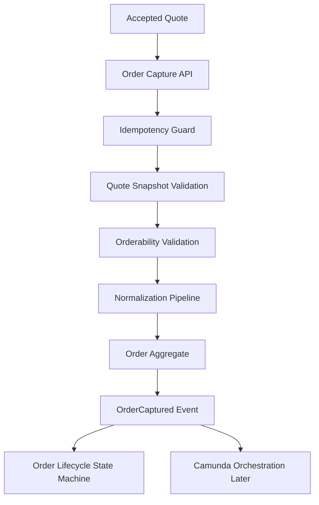
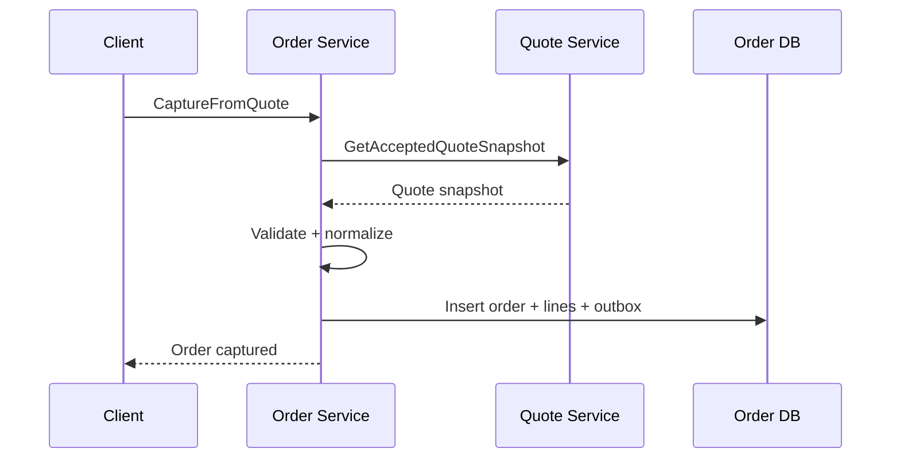
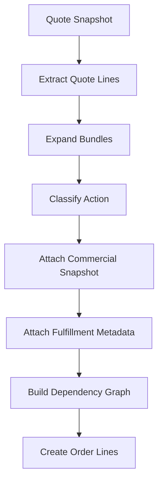
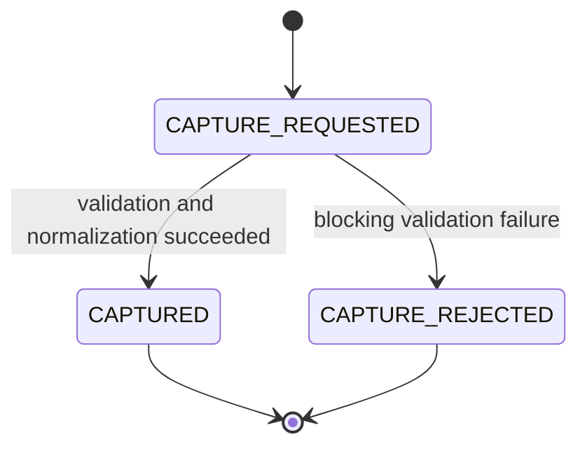
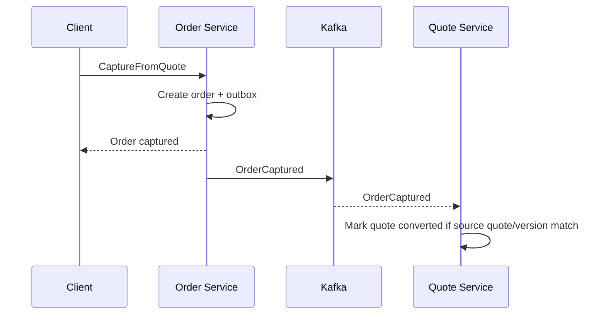

# Part 016 — Order Capture and Order Normalization

## 1. Tujuan Part Ini

Pada part sebelumnya kita membangun **Approval Policy and Escalation Model**. Sekarang quote sudah bisa dinilai, disetujui, ditolak, atau dikembalikan untuk revisi. Setelah quote diterima customer, platform harus mengubahnya menjadi order.

Ini terlihat sederhana: “copy quote menjadi order”. Itu salah besar.

Order capture adalah boundary paling kritis antara dunia komersial dan dunia operasional. Quote menjawab:

> Apa yang kita tawarkan kepada customer?

Order menjawab:

> Apa yang harus benar-benar dipenuhi, diprovide, ditagih, dikirim, diaktivasi, atau dikerjakan?

Target part ini:

1. memahami quote-to-order sebagai **irreversible business boundary**;
2. membedakan commercial snapshot, order intent, dan normalized order;
3. memastikan accepted quote tidak hilang context saat menjadi order;
4. menerapkan idempotent order submission agar tidak terjadi duplicate order;
5. membangun normalization pipeline dari quote lines ke order lines;
6. mendesain orderability validation sebelum order dibuat;
7. menyimpan order aggregate awal dengan PostgreSQL dan MyBatis;
8. menerbitkan Kafka events yang aman untuk orchestration;
9. mempersiapkan Order Lifecycle dan Camunda orchestration pada part berikutnya;
10. membuat test matrix untuk race, stale quote, duplicate submission, partial validation, dan auditability.

> Order capture bukan CRUD. Ia adalah proses transformasi yang harus menjaga janji komersial sekaligus menghasilkan instruksi operasional yang dapat dijalankan.

---

## 2. Kaufman Lens: Skill yang Harus Dikuasai

Dalam kerangka Kaufman, kita pecah skill order capture menjadi sub-skill yang bisa dilatih.

### 2.1 Sub-skill inti

| Sub-skill | Kenapa penting |
|---|---|
| Boundary modeling | Quote dan order punya semantic berbeda. |
| Snapshot preservation | Order harus membuktikan berasal dari quote versi tertentu. |
| Idempotency | Retry dari UI/API tidak boleh membuat duplicate order. |
| Normalization | Quote line komersial harus diubah menjadi order line operasional. |
| Orderability validation | Tidak semua accepted quote bisa langsung fulfilled. |
| Aggregate creation | Order harus punya root dan line lifecycle sendiri. |
| Source traceability | Setiap order line harus traceable ke quote line/configuration/price. |
| Event design | Orchestration butuh event yang cukup lengkap dan stable. |
| Failure classification | Invalid quote, stale quote, duplicate request, dependency failure harus dibedakan. |
| Audit evidence | Customer acceptance dan approval evidence harus ikut terikat. |

### 2.2 Outcome yang diinginkan

Setelah part ini, kita ingin mampu mengimplementasikan flow:

```text
Accepted Quote + Customer Acceptance Evidence
        ↓
Order Capture Command
        ↓
Idempotency Guard
        ↓
Quote Snapshot Validation
        ↓
Orderability Validation
        ↓
Normalization Pipeline
        ↓
Order Aggregate Created
        ↓
OrderCaptured Event
        ↓
Order Lifecycle / Camunda Orchestration
```

---

## 3. Mental Model: Quote Is Commercial, Order Is Operational

Quote dan order tidak boleh diperlakukan sebagai entity yang sama dengan status berbeda.

| Dimension | Quote | Order |
|---|---|---|
| Purpose | Menawarkan komitmen komersial. | Mengeksekusi komitmen. |
| Mutability | Draft/revision sebelum acceptance. | Setelah capture, perubahan lewat amendment/cancel. |
| Owner | Sales/CPQ. | OMS/fulfillment. |
| Primary invariant | Harga dan term yang ditawarkan harus benar. | Instruksi operasional harus dapat dieksekusi. |
| State machine | Draft, submitted, approved, accepted, expired. | Captured, validating, in progress, completed, failed, cancelled. |
| Snapshot | Catalog/configuration/pricing. | Commercial snapshot + operational decomposition. |
| Failure impact | Bisa revisi quote. | Bisa memicu recovery, compensation, manual repair. |

### 3.1 Boundary diagram



---

## 4. Core Invariants

Order capture harus menjaga invariant berikut.

### 4.1 Quote eligibility invariants

1. Quote must exist.
2. Quote must belong to tenant.
3. Quote must be in `ACCEPTED` state.
4. Quote version must match command.
5. Quote must not be expired at acceptance time.
6. Quote must have valid approval outcome if approval was required.
7. Quote must have pricing snapshot.
8. Quote must have configuration snapshot.
9. Quote must not already be converted to order, unless request is idempotent duplicate.
10. Customer acceptance evidence must exist.

### 4.2 Snapshot invariants

1. Order stores source quote ID and version.
2. Order stores pricing snapshot ID and/or pricing snapshot content hash.
3. Order stores configuration snapshot ID and/or configuration snapshot content hash.
4. Order stores accepted commercial terms.
5. Order line stores source quote line ID.
6. Order line stores normalized operational action.
7. Order creation does not recalculate price.
8. Order creation may validate orderability, but must not silently change commercial price.

### 4.3 Idempotency invariants

1. Same idempotency key and same request body returns same order.
2. Same idempotency key and different request body is conflict.
3. Same quote cannot create two active initial orders.
4. Retry after server timeout must be safe.
5. Kafka consumer retry must not create duplicate downstream effects.

---

## 5. Order Capture API

### 5.1 Command endpoint

```http
POST /v1/orders:capture-from-quote
Idempotency-Key: cap-20260702-001
Content-Type: application/json
```

Request:

```json
{
  "tenantId": "6b4a...",
  "quoteId": "7d2f...",
  "quoteVersion": 4,
  "customerAcceptance": {
    "acceptedBy": "customer-user-908",
    "acceptedAt": "2026-07-02T10:00:00Z",
    "acceptanceChannel": "PORTAL",
    "acceptanceEvidenceRef": "doc_acceptance_01H..."
  },
  "requestedStartDate": "2026-07-15",
  "externalReference": "PO-2026-7781"
}
```

Response:

```json
{
  "orderId": "ord_01J...",
  "orderNumber": "ORD-2026-000182",
  "state": "CAPTURED",
  "sourceQuoteId": "7d2f...",
  "sourceQuoteVersion": 4,
  "capturedAt": "2026-07-02T10:00:01Z"
}
```

### 5.2 Why command endpoint, not CRUD POST /orders?

`POST /orders` terlalu ambigu. Order dapat berasal dari:

- accepted quote;
- amendment;
- migration;
- bulk import;
- renewal;
- partner order;
- admin repair.

Gunakan command-specific endpoint agar invariant dan audit jelas:

```text
POST /orders:capture-from-quote
POST /orders:capture-amendment
POST /orders:import-migrated-order
```

---

## 6. Idempotency Design

### 6.1 Idempotency table

```sql
CREATE TABLE order_idempotency_key (
    tenant_id UUID NOT NULL,
    idempotency_key TEXT NOT NULL,
    request_hash TEXT NOT NULL,
    order_id UUID,
    response_json JSONB,
    status TEXT NOT NULL CHECK (status IN ('IN_PROGRESS', 'COMPLETED', 'FAILED')),
    created_at TIMESTAMPTZ NOT NULL DEFAULT now(),
    completed_at TIMESTAMPTZ,
    PRIMARY KEY (tenant_id, idempotency_key)
);
```

### 6.2 Algorithm

```java
public CaptureOrderResponse captureFromQuote(CaptureOrderCommand command) {
    RequestHash hash = hashCanonicalRequest(command);

    IdempotencyRecord record = idempotencyRepository.tryStart(
        command.tenantId(),
        command.idempotencyKey(),
        hash
    );

    if (record.isCompletedWithSameHash(hash)) {
        return record.responseAs(CaptureOrderResponse.class);
    }

    if (record.existsWithDifferentHash(hash)) {
        throw new IdempotencyConflict("Same key used for different request body");
    }

    Order order = createOrderInTransaction(command);

    CaptureOrderResponse response = CaptureOrderResponse.from(order);
    idempotencyRepository.complete(command.tenantId(), command.idempotencyKey(), response);
    return response;
}
```

### 6.3 Handling IN_PROGRESS

If a duplicate request arrives while the first request is still `IN_PROGRESS`:

- return `409 Conflict` with retry-after semantics; or
- block briefly and poll; or
- return `202 Accepted` with operation status URL.

For CPQ/OMS, prefer `409 Conflict` or `202 Accepted` depending on UX. Do not create a second order.

---

## 7. Quote Snapshot Validation

Order Capture Service needs enough quote data to validate capture. There are two design options.

### 7.1 Option A: Synchronous query to Quote Service



Pros:

- simple first implementation;
- gets latest authoritative quote state;
- avoids stale local projection.

Cons:

- capture depends on Quote Service availability;
- synchronous coupling;
- harder under high throughput.

### 7.2 Option B: Local accepted quote projection

Order Service consumes `QuoteAccepted` events and stores projection.

Pros:

- capture can run even if Quote Service is down;
- faster read path;
- supports replay/reconciliation.

Cons:

- eventual consistency;
- needs projection freshness checks;
- more moving parts.

### 7.3 Practical build-from-scratch choice

Start with synchronous query plus store the full source snapshot on order. Add local projection later when needed.

Important: the order must store what it used, not only reference remote quote.

---

## 8. Orderability Validation

A quote can be commercially accepted but operationally problematic. Orderability validation catches this before order lifecycle starts.

### 8.1 Validation categories

| Category | Example | Blocking? |
|---|---|---|
| Product orderability | Product retired after quote acceptance but before capture. | Usually blocking unless quote has override. |
| Date validity | Requested start date before allowed lead time. | Blocking or adjustment required. |
| Customer eligibility | Customer account suspended. | Blocking. |
| Resource availability | Inventory/capacity unavailable. | May be reservation-dependent. |
| Dependency validity | Parent bundle missing required child. | Blocking. |
| Regulatory | Product cannot be fulfilled in geography. | Blocking. |
| Duplicate order | Quote already converted. | Blocking unless idempotent duplicate. |

### 8.2 Validation result

```json
{
  "valid": false,
  "errors": [
    {
      "code": "ORDERABILITY_PRODUCT_RETIRED",
      "path": "/lines/2/productId",
      "message": "Product is no longer orderable for new captures.",
      "severity": "BLOCKING"
    }
  ],
  "warnings": [
    {
      "code": "START_DATE_AFTER_RECOMMENDED_WINDOW",
      "path": "/requestedStartDate",
      "message": "Requested start date is later than standard fulfillment window.",
      "severity": "WARNING"
    }
  ]
}
```

### 8.3 Validation rule

Orderability validation may reject capture, but it must not mutate the quote. If commercial data needs changing, create quote revision or amendment flow.

---

## 9. Normalization Pipeline

Quote line is commercial. Order line is operational.



### 9.1 Pipeline steps

| Step | Input | Output |
|---|---|---|
| Extract lines | Quote snapshot | Raw quote line list. |
| Expand bundles | Bundle/composite offers | Operationally meaningful components. |
| Classify action | Quote line intent | `ADD`, `CHANGE`, `REMOVE`, `RENEW`, `NO_OP`. |
| Preserve commercial data | Price snapshot | Charge snapshot on order line. |
| Attach fulfillment metadata | Catalog/orderability | Provisioning type, dependency group, resource hint. |
| Build dependency graph | Parent/child relationships | Line dependency edges. |
| Assign order line numbers | Normalized sequence | Stable line identity. |

### 9.2 Example transformation

Quote line:

```json
{
  "quoteLineId": "ql_100",
  "offerCode": "BUSINESS_INTERNET_BUNDLE",
  "quantity": 1,
  "monthlyRecurringCharge": "1500000.00",
  "children": [
    { "quoteLineId": "ql_101", "productCode": "FIBER_ACCESS_100MBPS" },
    { "quoteLineId": "ql_102", "productCode": "STATIC_IP" }
  ]
}
```

Order lines:

```json
[
  {
    "orderLineId": "ol_001",
    "sourceQuoteLineId": "ql_101",
    "action": "ADD",
    "fulfillmentType": "NETWORK_PROVISIONING",
    "dependsOn": []
  },
  {
    "orderLineId": "ol_002",
    "sourceQuoteLineId": "ql_102",
    "action": "ADD",
    "fulfillmentType": "IP_ASSIGNMENT",
    "dependsOn": ["ol_001"]
  }
]
```

---

## 10. Order Aggregate

### 10.1 Order root

Order root owns:

- order identity;
- tenant;
- customer;
- source quote reference;
- commercial snapshot reference;
- state;
- order lines;
- acceptance evidence;
- external reference;
- audit metadata;
- optimistic version.

### 10.2 Initial state

For this part, initial state is `CAPTURED`. Part 017 will expand lifecycle.



### 10.3 Java aggregate sketch

```java
public final class Order {
    private final OrderId id;
    private final TenantId tenantId;
    private final CustomerId customerId;
    private final SourceQuote sourceQuote;
    private final CommercialSnapshot commercialSnapshot;
    private final List<OrderLine> lines;
    private OrderState state;
    private final CustomerAcceptance acceptance;
    private final Instant capturedAt;
    private int version;

    public static Order capture(CaptureContext context, NormalizedOrder normalized, Clock clock) {
        ensureAcceptedQuote(context.quoteSnapshot());
        ensureNotEmpty(normalized.lines());

        return new Order(
            OrderId.newId(),
            context.tenantId(),
            context.quoteSnapshot().customerId(),
            SourceQuote.from(context.quoteSnapshot()),
            CommercialSnapshot.from(context.quoteSnapshot()),
            normalized.lines(),
            OrderState.CAPTURED,
            context.customerAcceptance(),
            clock.instant(),
            0
        );
    }
}
```

---

## 11. PostgreSQL Data Model

### 11.1 Order table

```sql
CREATE TABLE customer_order (
    order_id UUID PRIMARY KEY,
    tenant_id UUID NOT NULL,
    order_number TEXT NOT NULL,
    customer_id UUID NOT NULL,
    state TEXT NOT NULL CHECK (state IN (
        'CAPTURED',
        'VALIDATING',
        'IN_PROGRESS',
        'PARTIALLY_COMPLETED',
        'COMPLETED',
        'FAILED',
        'CANCELLING',
        'CANCELLED'
    )),
    source_quote_id UUID NOT NULL,
    source_quote_version INTEGER NOT NULL,
    source_quote_hash TEXT NOT NULL,
    pricing_snapshot_id UUID,
    pricing_snapshot_hash TEXT NOT NULL,
    configuration_snapshot_id UUID,
    configuration_snapshot_hash TEXT NOT NULL,
    commercial_snapshot_json JSONB NOT NULL,
    acceptance_json JSONB NOT NULL,
    external_reference TEXT,
    captured_at TIMESTAMPTZ NOT NULL,
    created_at TIMESTAMPTZ NOT NULL DEFAULT now(),
    updated_at TIMESTAMPTZ NOT NULL DEFAULT now(),
    version INTEGER NOT NULL DEFAULT 0,
    UNIQUE (tenant_id, order_number),
    UNIQUE (tenant_id, source_quote_id, source_quote_version)
);
```

### 11.2 Order line table

```sql
CREATE TABLE customer_order_line (
    order_line_id UUID PRIMARY KEY,
    tenant_id UUID NOT NULL,
    order_id UUID NOT NULL REFERENCES customer_order(order_id),
    line_number INTEGER NOT NULL,
    source_quote_line_id UUID NOT NULL,
    parent_order_line_id UUID,
    action TEXT NOT NULL CHECK (action IN ('ADD', 'CHANGE', 'REMOVE', 'RENEW', 'NO_OP')),
    product_id UUID,
    offer_code TEXT,
    quantity NUMERIC(18, 6) NOT NULL,
    state TEXT NOT NULL CHECK (state IN (
        'CAPTURED',
        'WAITING_DEPENDENCY',
        'READY',
        'IN_PROGRESS',
        'COMPLETED',
        'FAILED',
        'SKIPPED',
        'CANCELLED'
    )),
    fulfillment_type TEXT NOT NULL,
    commercial_line_snapshot_json JSONB NOT NULL,
    fulfillment_metadata_json JSONB NOT NULL DEFAULT '{}'::jsonb,
    created_at TIMESTAMPTZ NOT NULL DEFAULT now(),
    updated_at TIMESTAMPTZ NOT NULL DEFAULT now(),
    version INTEGER NOT NULL DEFAULT 0,
    UNIQUE (order_id, line_number),
    UNIQUE (order_id, source_quote_line_id, action)
);
```

### 11.3 Dependency table

```sql
CREATE TABLE customer_order_line_dependency (
    tenant_id UUID NOT NULL,
    order_id UUID NOT NULL REFERENCES customer_order(order_id),
    order_line_id UUID NOT NULL REFERENCES customer_order_line(order_line_id),
    depends_on_order_line_id UUID NOT NULL REFERENCES customer_order_line(order_line_id),
    dependency_type TEXT NOT NULL CHECK (dependency_type IN ('HARD', 'SOFT', 'SEQUENCING')),
    created_at TIMESTAMPTZ NOT NULL DEFAULT now(),
    PRIMARY KEY (order_line_id, depends_on_order_line_id)
);
```

### 11.4 Outbox

```sql
CREATE TABLE order_outbox (
    outbox_id UUID PRIMARY KEY,
    tenant_id UUID NOT NULL,
    aggregate_type TEXT NOT NULL,
    aggregate_id UUID NOT NULL,
    event_type TEXT NOT NULL,
    event_version INTEGER NOT NULL,
    event_key TEXT NOT NULL,
    payload JSONB NOT NULL,
    created_at TIMESTAMPTZ NOT NULL DEFAULT now(),
    published_at TIMESTAMPTZ,
    publish_attempts INTEGER NOT NULL DEFAULT 0
);

CREATE INDEX idx_order_outbox_unpublished
    ON order_outbox (created_at)
    WHERE published_at IS NULL;
```

---

## 12. MyBatis Persistence

### 12.1 Mapper interface

```java
public interface OrderMapper {
    int insertOrder(CustomerOrderRow row);

    int insertOrderLine(CustomerOrderLineRow row);

    int insertLineDependency(CustomerOrderLineDependencyRow row);

    CustomerOrderRow findBySourceQuote(
        @Param("tenantId") UUID tenantId,
        @Param("quoteId") UUID quoteId,
        @Param("quoteVersion") int quoteVersion
    );

    CustomerOrderRow findById(@Param("orderId") UUID orderId);
}
```

### 12.2 Insert order XML

```xml
<insert id="insertOrder">
  INSERT INTO customer_order (
    order_id,
    tenant_id,
    order_number,
    customer_id,
    state,
    source_quote_id,
    source_quote_version,
    source_quote_hash,
    pricing_snapshot_id,
    pricing_snapshot_hash,
    configuration_snapshot_id,
    configuration_snapshot_hash,
    commercial_snapshot_json,
    acceptance_json,
    external_reference,
    captured_at,
    version
  ) VALUES (
    #{orderId},
    #{tenantId},
    #{orderNumber},
    #{customerId},
    #{state},
    #{sourceQuoteId},
    #{sourceQuoteVersion},
    #{sourceQuoteHash},
    #{pricingSnapshotId},
    #{pricingSnapshotHash},
    #{configurationSnapshotId},
    #{configurationSnapshotHash},
    CAST(#{commercialSnapshotJson} AS jsonb),
    CAST(#{acceptanceJson} AS jsonb),
    #{externalReference},
    #{capturedAt},
    0
  )
</insert>
```

### 12.3 Transaction boundary

Order capture must persist in one transaction:

1. idempotency key `IN_PROGRESS`;
2. order root;
3. order lines;
4. line dependencies;
5. outbox event;
6. idempotency response `COMPLETED`.

If steps 2–5 succeed but response write fails, retry should detect existing order by source quote/version and repair idempotency record.

---

## 13. Normalizer Design

### 13.1 Interface

```java
public interface OrderNormalizer {
    NormalizedOrder normalize(
        AcceptedQuoteSnapshot quoteSnapshot,
        OrderCaptureOptions options
    );
}
```

### 13.2 Composable pipeline

```java
public final class DefaultOrderNormalizer implements OrderNormalizer {
    private final List<OrderNormalizationStep> steps;

    @Override
    public NormalizedOrder normalize(AcceptedQuoteSnapshot quoteSnapshot, OrderCaptureOptions options) {
        NormalizationContext context = NormalizationContext.from(quoteSnapshot, options);

        for (OrderNormalizationStep step : steps) {
            context = step.apply(context);
        }

        return context.toNormalizedOrder();
    }
}
```

### 13.3 Step examples

```java
public interface OrderNormalizationStep {
    NormalizationContext apply(NormalizationContext context);
}

public final class BundleExpansionStep implements OrderNormalizationStep { }
public final class ActionClassificationStep implements OrderNormalizationStep { }
public final class CommercialSnapshotAttachmentStep implements OrderNormalizationStep { }
public final class FulfillmentMetadataStep implements OrderNormalizationStep { }
public final class DependencyGraphStep implements OrderNormalizationStep { }
public final class LineNumberAssignmentStep implements OrderNormalizationStep { }
```

### 13.4 Determinism requirement

For the same quote snapshot and options, normalization must produce the same normalized order. This supports:

- idempotency;
- reproducible tests;
- audit reconstruction;
- debugging;
- replay.

Avoid random ordering, current time inside normalizer, or non-deterministic map iteration.

---

## 14. Kafka Events

### 14.1 OrderCaptured event

```json
{
  "eventId": "evt_01J...",
  "eventType": "OrderCaptured",
  "eventVersion": 1,
  "occurredAt": "2026-07-02T10:00:01Z",
  "tenantId": "6b4a...",
  "orderId": "ord_01J...",
  "orderNumber": "ORD-2026-000182",
  "customerId": "cus_01J...",
  "sourceQuote": {
    "quoteId": "7d2f...",
    "quoteVersion": 4,
    "quoteHash": "sha256:..."
  },
  "commercialSnapshot": {
    "pricingSnapshotId": "prs_01J...",
    "pricingSnapshotHash": "sha256:...",
    "configurationSnapshotId": "cfg_01J...",
    "configurationSnapshotHash": "sha256:..."
  },
  "lineCount": 6,
  "capturedAt": "2026-07-02T10:00:01Z"
}
```

### 14.2 Event key

Use `orderId` as event key for order lifecycle events. If a Quote Service consumes order capture events to mark quote converted, it can still use payload source quote ID.

### 14.3 Do not publish before commit

Use transactional outbox. Publishing `OrderCaptured` before DB commit can create orchestration for an order that does not exist.

---

## 15. Interaction with Quote Service

### 15.1 Quote conversion marking

There are two choices:

1. Order Service synchronously calls Quote Service to mark quote converted.
2. Quote Service consumes `OrderCaptured` event and marks quote converted asynchronously.

Prefer event-based update with idempotent consumer.



### 15.2 Quote Service guard

Quote Service should mark quote converted only when:

- quote ID matches;
- quote version matches;
- quote state is `ACCEPTED`;
- quote not already converted to another order;
- event is not stale;
- order ID is stored as conversion reference.

---

## 16. Redis Usage

Redis can help but is not required.

| Use case | Key | TTL | Notes |
|---|---|---:|---|
| Idempotency response cache | `order:capture:idempotency:{tenant}:{key}` | 24h | DB remains source of truth. |
| Quote snapshot cache | `quote:accepted-snapshot:{quoteId}:{version}` | 5–15m | Must include hash. |
| Orderability metadata cache | `orderability:product:{productId}` | 5m | Invalidate on catalog publish. |
| Capture lock hint | `order:capture:quote:{quoteId}:{version}` | short | Only optimization; DB unique constraint is guard. |

Do not rely on Redis lock as the only duplicate-order protection. Use PostgreSQL unique constraint on `(tenant_id, source_quote_id, source_quote_version)`.

---

## 17. Failure Modes

| Failure | Example | Response | Guardrail |
|---|---|---|---|
| Quote not accepted | Quote still `APPROVED` but not customer accepted. | 409 conflict | Quote state validation. |
| Quote expired | Acceptance after expiry. | 409 conflict | Acceptance timestamp check. |
| Duplicate capture | Same quote captured twice. | Existing order or conflict | Unique source quote/version. |
| Same idempotency key different body | Key reused incorrectly. | 409 conflict | Request hash. |
| Quote Service unavailable | Cannot fetch accepted snapshot. | 503 or async retry | Projection later. |
| Product no longer orderable | Accepted quote contains retired product. | Capture rejected/manual override | Orderability validation. |
| Partial DB insert | Lines fail after order insert. | Transaction rollback | Single transaction. |
| Event publish failure | Order created but no event published. | Outbox retry | Outbox monitoring. |
| Stale approval | Approval event belonged to older quote version. | Reject capture | Quote version + signal hash. |
| Normalizer non-determinism | Retry creates different lines. | Audit mismatch | Deterministic normalizer tests. |

---

## 18. Operational Queries

### 18.1 Find duplicate capture attempts

```sql
SELECT tenant_id, source_quote_id, source_quote_version, count(*)
FROM customer_order
GROUP BY tenant_id, source_quote_id, source_quote_version
HAVING count(*) > 1;
```

This should always return zero because of the unique constraint.

### 18.2 Find orders with unpublished captured event

```sql
SELECT o.order_id, o.order_number, o.captured_at, ob.outbox_id, ob.publish_attempts
FROM customer_order o
JOIN order_outbox ob ON ob.aggregate_id = o.order_id
WHERE ob.event_type = 'OrderCaptured'
  AND ob.published_at IS NULL
ORDER BY o.captured_at ASC;
```

### 18.3 Find captured orders not yet marked converted in quote projection

This depends on whether Order Service maintains quote projection. At minimum, reporting should compare `OrderCaptured` events against Quote Service conversion state.

---

## 19. Testing Strategy

### 19.1 Unit tests

| Test | Expected |
|---|---|
| Accepted quote normalizes to deterministic lines | Same output every run. |
| Bundle line expands into component order lines | Parent/child dependencies created. |
| Static IP depends on access line | Dependency edge exists. |
| Price is copied, not recalculated | Snapshot values preserved. |
| Requested start date invalid | Blocking validation error. |
| Empty quote lines | Capture rejected. |

### 19.2 Integration tests

Use PostgreSQL integration tests for:

- unique source quote/version;
- idempotency key same request returns same response;
- idempotency key different request returns conflict;
- order + lines + dependencies inserted transactionally;
- outbox event inserted in same transaction;
- rollback leaves no partial order.

### 19.3 Race tests

Simulate:

- two concurrent capture requests same quote with different idempotency keys;
- same idempotency key arriving simultaneously;
- event publisher retry after commit;
- client timeout then retry.

Expected result: one order only.

### 19.4 Contract tests

- Order Capture API returns stable error model.
- `OrderCaptured` event is backward compatible.
- Quote Service ignores unknown fields.
- Quote Service rejects stale quote version conversion.

---

## 20. Implementation Slice

Build this vertical slice:

1. `POST /v1/orders:capture-from-quote`;
2. idempotency table;
3. synchronous `GetAcceptedQuoteSnapshot` client;
4. orderability validator with 3 rules;
5. normalizer for simple product + bundle;
6. order/order_line/dependency tables;
7. MyBatis mapper inserts;
8. transactional outbox insert;
9. outbox publisher to Kafka;
10. Quote Service consumer for `OrderCaptured`.

Keep fulfillment orchestration out of this part. The next part will build Order Lifecycle state machine.

---

## 21. Production Checklist

- [ ] Capture endpoint requires idempotency key.
- [ ] Request hash prevents key reuse with different body.
- [ ] Quote state must be `ACCEPTED`.
- [ ] Quote version must match.
- [ ] Customer acceptance evidence is required.
- [ ] Approval evidence is checked when approval was required.
- [ ] Commercial snapshot is stored on order.
- [ ] Price is not recalculated during capture.
- [ ] Order lines trace back to quote lines.
- [ ] Bundle decomposition is deterministic.
- [ ] Source quote/version unique constraint exists.
- [ ] Order and outbox are committed together.
- [ ] `OrderCaptured` event includes source quote and snapshot hashes.
- [ ] Capture race tests pass.
- [ ] Operational query exists for unpublished outbox rows.

---

## 22. Latihan

1. Buat OpenAPI endpoint `POST /v1/orders:capture-from-quote`.
2. Implementasikan idempotency table dan request hash.
3. Buat fake Quote Service client yang mengembalikan accepted quote snapshot.
4. Implementasikan orderability validator untuk expired quote, retired product, dan invalid start date.
5. Implementasikan normalizer untuk simple product dan bundle.
6. Buat schema PostgreSQL `customer_order`, `customer_order_line`, dan dependency table.
7. Buat MyBatis mapper untuk insert order dan line.
8. Tulis integration test: duplicate capture dengan dua request paralel.
9. Implementasikan outbox event `OrderCaptured`.
10. Buat consumer di Quote Service yang menandai quote converted secara idempotent.

---

## 23. Ringkasan

Order capture adalah boundary yang mengubah accepted quote menjadi order operasional. Boundary ini harus menjaga:

- accepted quote state;
- quote version;
- approval evidence;
- customer acceptance evidence;
- commercial snapshot;
- deterministic normalization;
- idempotent submission;
- unique order per quote version;
- transactional event publication.

Jangan membuat order dengan cara “copy quote table”. Quote adalah commercial commitment. Order adalah operational execution aggregate. Keduanya terkait erat, tetapi punya invariant, owner, lifecycle, dan failure mode yang berbeda.

Pada part berikutnya kita akan membangun **Order State Machine and Lifecycle**: bagaimana order dan order line bergerak dari captured ke in progress, completed, failed, cancelled, dan repaired.
