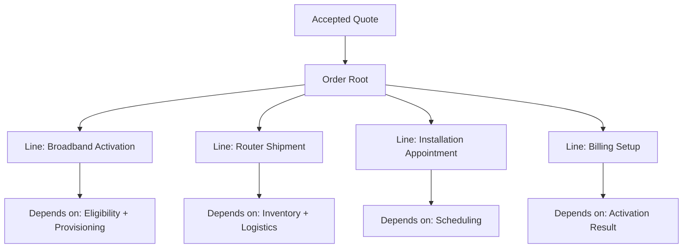
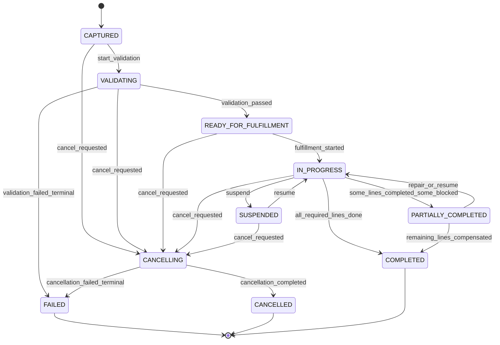
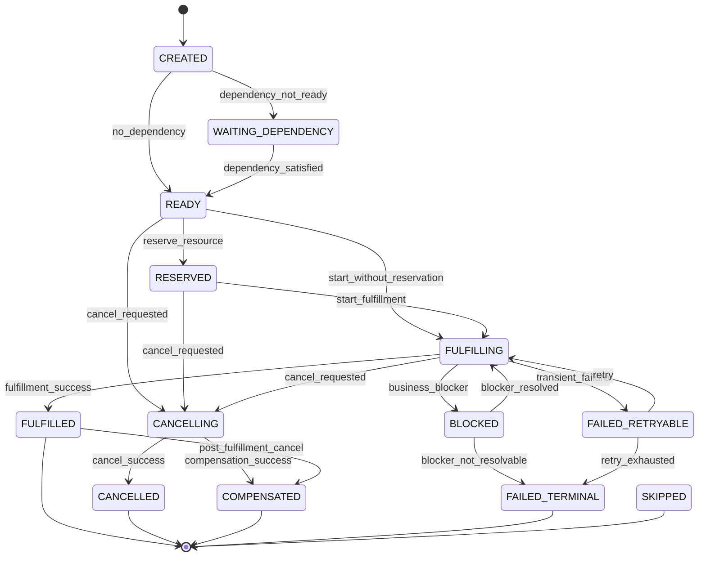
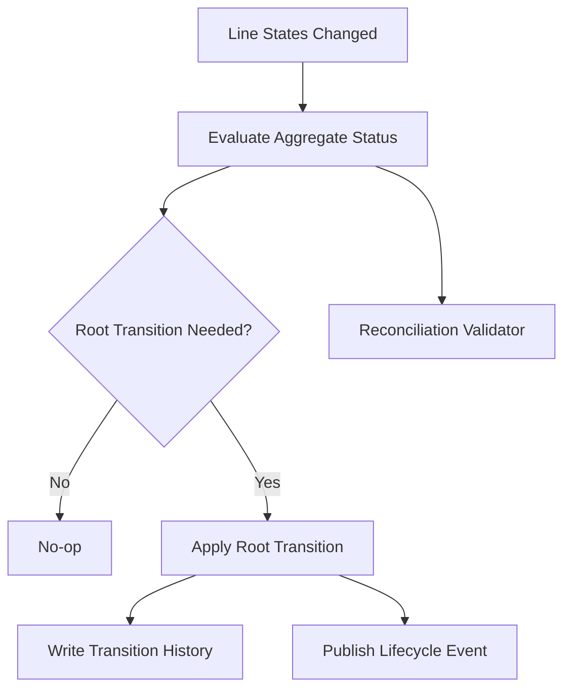
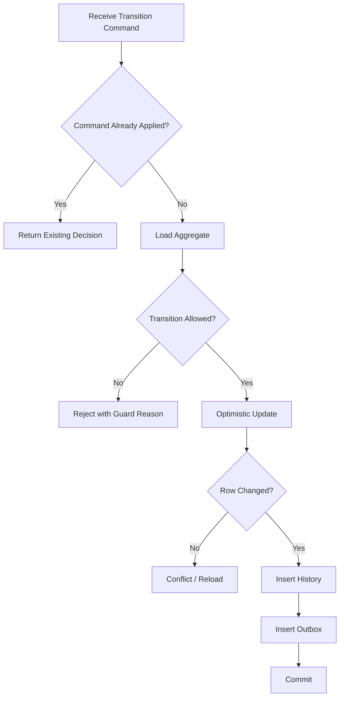
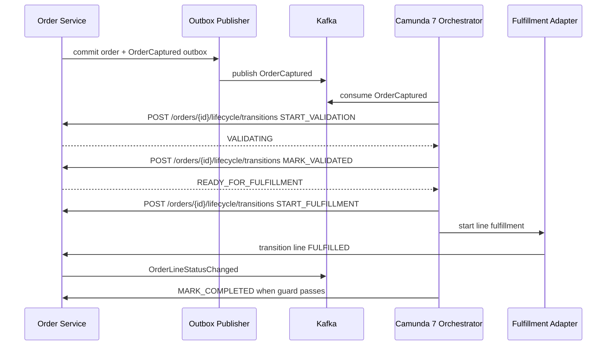

# Part 017 — Order State Machine and Lifecycle

## 1. Tujuan Part Ini

Pada part sebelumnya kita membangun **Order Capture and Order Normalization**. Accepted quote sudah diubah menjadi order aggregate awal yang punya commercial snapshot, source traceability, idempotency boundary, dan event `OrderCaptured`.

Sekarang kita masuk ke bagian yang jauh lebih berbahaya: **order lifecycle**.

Order lifecycle bukan sekadar kolom `status`. Dalam CPQ/OMS, order adalah janji operasional yang berjalan melintasi banyak dependency: payment, inventory, provisioning, shipping, activation, billing, compliance check, partner system, dan human exception handling. Satu status global sering menipu karena order root bisa terlihat `IN_PROGRESS`, sementara satu line sudah complete, satu line gagal, satu line menunggu dependency, dan satu line harus dibatalkan.

Target part ini:

1. memahami order sebagai **long-running stateful business aggregate**;
2. mendesain state machine root dan line-level secara eksplisit;
3. membedakan business state, process state, technical retry state, dan external fulfillment state;
4. menghindari state explosion dengan state hierarchy dan derived status;
5. membuat transition guard yang defensible;
6. menyimpan transition history sebagai audit evidence;
7. menerapkan transition command dengan PostgreSQL dan MyBatis;
8. menerbitkan Kafka event lifecycle yang aman;
9. menyiapkan seam menuju Camunda 7 orchestration di part berikutnya;
10. membuat test matrix untuk race, cancellation, partial fulfillment, retry, compensation, dan terminal state.

> Order lifecycle adalah kontrak antara platform dan realita operasional. Ia harus bisa menjawab: “apa yang sedang terjadi, apa yang boleh dilakukan sekarang, siapa/apa yang membuat perubahan, dan bagaimana kita memulihkan ketika terjadi kegagalan?”

---

## 2. Kaufman Lens: Sub-skill yang Harus Dikuasai

Kaufman menyarankan skill besar dipecah menjadi unit kecil yang bisa dilatih. Untuk order lifecycle, sub-skill-nya adalah:

| Sub-skill | Kenapa penting |
|---|---|
| State vocabulary | Tim harus punya bahasa yang sama untuk `captured`, `accepted`, `in progress`, `blocked`, `completed`, dan `failed`. |
| Transition modeling | Status hanya hasil; yang penting adalah event/command yang mengubah status. |
| Guard design | Tidak semua aksi boleh dilakukan di semua state. |
| Line-level lifecycle | Order root jarang punya satu lifecycle sederhana. |
| Dependency graph | Fulfillment line bisa bergantung pada line lain. |
| Partial completion | Platform harus menangani sebagian berhasil, sebagian gagal. |
| Cancellation semantics | Cancel sebelum fulfillment berbeda dari cancel setelah partial fulfillment. |
| Suspension/resumption | Hold karena fraud, compliance, payment, atau customer request harus eksplisit. |
| Terminal state discipline | Terminal state tidak boleh berubah sembarangan. |
| Repairability | Production system harus bisa diperbaiki tanpa merusak audit. |

Outcome part ini adalah state model yang bisa dipakai oleh service, database, API, Kafka, dan Camunda tanpa setiap layer membuat interpretasi sendiri.

---

## 3. Mental Model: Order Root vs Order Line

Order root merepresentasikan **keseluruhan janji customer**. Order line merepresentasikan **unit fulfillment operasional**.

Contoh:

- customer membeli bundle internet + router + installation;
- quote memiliki satu commercial bundle;
- order normalization menghasilkan beberapa line:
  - broadband service activation;
  - router shipment;
  - installation appointment;
  - recurring billing setup.

Jika router shipment gagal, bukan berarti seluruh order langsung gagal. Tetapi order root belum bisa `COMPLETED` sampai semua line wajib selesai atau ada kompensasi yang sah.



Prinsip:

1. root state adalah **summary state**, bukan satu-satunya kebenaran;
2. line state adalah **operational state** yang lebih presisi;
3. process engine boleh mengorkestrasi, tetapi domain service tetap memiliki invariant;
4. external system state tidak boleh langsung mengganti internal business state tanpa validasi;
5. event lifecycle harus membawa cukup context agar consumer tidak menebak.

---

## 4. Empat Jenis State yang Tidak Boleh Dicampur

Kesalahan umum platform OMS adalah mencampur semua jenis status menjadi satu enum besar. Hasilnya status menjadi kabur dan sulit dioperasikan.

Kita pisahkan empat jenis state.

| Jenis state | Contoh | Pemilik | Keterangan |
|---|---|---|---|
| Business state | `CAPTURED`, `IN_PROGRESS`, `COMPLETED`, `CANCELLED` | Order service | State yang berarti secara bisnis. |
| Line state | `READY`, `WAITING_DEPENDENCY`, `FULFILLING`, `FULFILLED`, `FAILED` | Order service | State operasional per line. |
| Process state | BPMN execution token, job retries, incident | Camunda | State orchestration, bukan domain truth. |
| Technical state | retry count, lock owner, last error code | Runtime/service | Detail eksekusi teknis. |
| External state | carrier status, provisioning status, payment status | External systems | Harus diterjemahkan ke domain event internal. |

Anti-pattern:

```text
order.status = "CAMUNDA_JOB_RETRY_2"
order.status = "HTTP_503_FROM_PROVISIONING"
order.status = "DHL_PENDING_PICKUP"
```

State seperti ini mencampur business, technical, dan external state. Sebagai gantinya:

```text
order_line.state = FULFILLING
order_line.last_external_status = DHL_PENDING_PICKUP
order_line.last_error_code = null
camunda_job.retry_count = 2
```

---

## 5. Root Order State Machine

Root state harus ringkas. Ia mewakili lifecycle order secara keseluruhan.

| State | Arti |
|---|---|
| `CAPTURED` | Order sudah dibuat dari accepted quote, tetapi orchestration belum dimulai. |
| `VALIDATING` | Order sedang menjalani validasi operasional awal. |
| `READY_FOR_FULFILLMENT` | Order valid dan siap diorkestrasi. |
| `IN_PROGRESS` | Setidaknya satu line sedang/akan dipenuhi. |
| `SUSPENDED` | Order dihentikan sementara karena hold yang sah. |
| `PARTIALLY_COMPLETED` | Sebagian line selesai, tetapi ada line non-terminal/non-success. |
| `COMPLETED` | Semua mandatory line selesai atau diselesaikan dengan kompensasi yang valid. |
| `CANCELLING` | Cancellation sedang diproses. |
| `CANCELLED` | Order dibatalkan secara sah. |
| `FAILED` | Order gagal secara terminal dan butuh business resolution. |

State root yang terlalu banyak biasanya tanda bahwa line state atau process state bocor ke root.



---

## 6. Transition Guard untuk Root State

State machine tanpa guard hanyalah diagram. Guard adalah rule yang membuat transition sah atau ditolak.

Contoh guard:

| Transition | Guard |
|---|---|
| `CAPTURED -> VALIDATING` | Order belum pernah divalidasi; idempotency key valid; tidak terminal. |
| `VALIDATING -> READY_FOR_FULFILLMENT` | Semua validation check mandatory pass. |
| `READY_FOR_FULFILLMENT -> IN_PROGRESS` | At least one mandatory line eligible to start. |
| `IN_PROGRESS -> COMPLETED` | Semua mandatory line `FULFILLED`, `SKIPPED_VALID`, atau `COMPENSATED_VALID`. |
| `IN_PROGRESS -> SUSPENDED` | Hold reason valid dan actor authorized. |
| `SUSPENDED -> IN_PROGRESS` | Hold sudah resolved dan tidak ada blocking terminal failure. |
| `* -> CANCELLING` | State cancellable dan cancellation policy mengizinkan. |
| `CANCELLING -> CANCELLED` | Semua required cancellation action selesai atau waived dengan approval. |

Guard harus ada di domain service, bukan hanya UI, BPMN, atau database trigger.

Pseudo-code:

```java
public Order transition(OrderTransitionCommand command) {
    Order order = orderRepository.findForUpdate(command.orderId());

    OrderTransition transition = transitionRegistry.resolve(
        order.status(),
        command.action()
    );

    if (transition == null) {
        throw new InvalidOrderTransitionException(order.status(), command.action());
    }

    TransitionDecision decision = transition.evaluate(order, command);

    if (!decision.allowed()) {
        throw new TransitionGuardViolationException(decision.reasonCode(), decision.message());
    }

    Order changed = order.apply(decision.nextStatus(), command);
    orderRepository.saveTransition(changed, command, decision);
    outboxRepository.insert(OrderLifecycleEvent.from(changed, command, decision));

    return changed;
}
```

---

## 7. Line-level State Machine

Line-level state lebih detail karena fulfillment terjadi di line.

| State | Arti |
|---|---|
| `CREATED` | Line dibuat dari normalization. |
| `WAITING_DEPENDENCY` | Line belum bisa mulai karena menunggu line lain atau external prerequisite. |
| `READY` | Line bisa mulai dipenuhi. |
| `RESERVED` | Resource/inventory/capacity sudah direserved. |
| `FULFILLING` | Fulfillment sedang berjalan. |
| `FULFILLED` | Fulfillment berhasil. |
| `BLOCKED` | Line tertahan tetapi masih recoverable. |
| `FAILED_RETRYABLE` | Gagal sementara dan bisa dicoba ulang. |
| `FAILED_TERMINAL` | Gagal terminal, perlu compensation/manual resolution. |
| `CANCELLING` | Cancellation line sedang berjalan. |
| `CANCELLED` | Line dibatalkan. |
| `COMPENSATED` | Line sudah dikompensasi setelah partial action. |
| `SKIPPED` | Line dilewati karena rule valid. |



Line state adalah pusat banyak invariant.

---

## 8. Dependency Graph antar Line

Order line sering punya dependency. Billing setup mungkin baru boleh dimulai setelah activation berhasil. Installation mungkin butuh router shipment confirmed. Dependency harus dimodelkan, bukan disembunyikan dalam urutan hard-coded Camunda.

Table dependency:

```sql
create table order_line_dependency (
    order_id uuid not null,
    dependent_line_id uuid not null,
    prerequisite_line_id uuid not null,
    dependency_type varchar(40) not null,
    required_state varchar(40) not null,
    created_at timestamptz not null default now(),
    primary key (dependent_line_id, prerequisite_line_id),
    foreign key (order_id, dependent_line_id) references order_line(order_id, order_line_id),
    foreign key (order_id, prerequisite_line_id) references order_line(order_id, order_line_id),
    check (dependent_line_id <> prerequisite_line_id)
);
```

Dependency type:

| Type | Meaning |
|---|---|
| `MUST_COMPLETE_BEFORE_START` | Dependent line tidak boleh mulai sebelum prerequisite fulfilled. |
| `MUST_RESERVE_BEFORE_START` | Dependent line butuh resource reservation dari prerequisite. |
| `MUST_NOT_FAIL` | Jika prerequisite terminal failed, dependent harus blocked/cancelled. |
| `OPTIONAL_ACCELERATOR` | Jika prerequisite selesai, dependent bisa memakai data tambahan, tetapi tidak mandatory. |

Cycle harus ditolak saat normalization.

```java
public void assertAcyclic(List<OrderLine> lines, List<OrderLineDependency> dependencies) {
    DirectedGraph<UUID> graph = DirectedGraph.from(dependencies);
    if (graph.hasCycle()) {
        throw new InvalidOrderGraphException("ORDER_LINE_DEPENDENCY_CYCLE");
    }
}
```

---

## 9. Derived Root Status

Root status bisa explicit, tetapi beberapa status sebaiknya derived dari line state. Contohnya `PARTIALLY_COMPLETED`.

Rule sederhana:

```text
if all mandatory lines are successful_terminal:
    root = COMPLETED
else if any line is in failure_terminal and no repair plan exists:
    root = FAILED
else if any line is active_or_pending and at least one line is fulfilled:
    root = PARTIALLY_COMPLETED
else if any line is active_or_pending:
    root = IN_PROGRESS
```

Namun jangan hanya memakai derivation saat read. Simpan root state sebagai decision record ketika transition terjadi, lalu gunakan derived evaluator sebagai validator/reconciliation.



---

## 10. PostgreSQL Schema untuk Lifecycle

Kita lanjutkan schema dari part sebelumnya.

### 10.1 Order table

```sql
create table customer_order (
    order_id uuid primary key,
    tenant_id uuid not null,
    customer_id uuid not null,
    source_quote_id uuid not null,
    source_quote_version int not null,
    status varchar(40) not null,
    status_reason_code varchar(80),
    lifecycle_version bigint not null default 0,
    submitted_at timestamptz not null,
    started_at timestamptz,
    completed_at timestamptz,
    cancelled_at timestamptz,
    failed_at timestamptz,
    created_at timestamptz not null default now(),
    updated_at timestamptz not null default now(),
    check (status in (
        'CAPTURED',
        'VALIDATING',
        'READY_FOR_FULFILLMENT',
        'IN_PROGRESS',
        'SUSPENDED',
        'PARTIALLY_COMPLETED',
        'COMPLETED',
        'CANCELLING',
        'CANCELLED',
        'FAILED'
    ))
);

create index idx_customer_order_tenant_status
    on customer_order (tenant_id, status, updated_at desc);

create index idx_customer_order_source_quote
    on customer_order (tenant_id, source_quote_id, source_quote_version);
```

### 10.2 Order line table

```sql
create table order_line (
    order_id uuid not null,
    order_line_id uuid not null,
    tenant_id uuid not null,
    source_quote_line_id uuid not null,
    line_type varchar(60) not null,
    fulfillment_type varchar(60) not null,
    status varchar(40) not null,
    status_reason_code varchar(80),
    mandatory boolean not null default true,
    sequence_no int not null,
    lifecycle_version bigint not null default 0,
    external_system varchar(80),
    external_reference varchar(160),
    last_external_status varchar(120),
    last_error_code varchar(120),
    last_error_message text,
    ready_at timestamptz,
    started_at timestamptz,
    fulfilled_at timestamptz,
    cancelled_at timestamptz,
    failed_at timestamptz,
    created_at timestamptz not null default now(),
    updated_at timestamptz not null default now(),
    primary key (order_id, order_line_id),
    check (status in (
        'CREATED',
        'WAITING_DEPENDENCY',
        'READY',
        'RESERVED',
        'FULFILLING',
        'FULFILLED',
        'BLOCKED',
        'FAILED_RETRYABLE',
        'FAILED_TERMINAL',
        'CANCELLING',
        'CANCELLED',
        'COMPENSATED',
        'SKIPPED'
    ))
);

create index idx_order_line_status
    on order_line (tenant_id, status, updated_at desc);

create index idx_order_line_external_ref
    on order_line (tenant_id, external_system, external_reference)
    where external_reference is not null;
```

### 10.3 Transition history

Transition history adalah audit backbone.

```sql
create table order_transition_history (
    transition_id uuid primary key,
    tenant_id uuid not null,
    order_id uuid not null,
    order_line_id uuid,
    entity_type varchar(20) not null,
    from_status varchar(40),
    to_status varchar(40) not null,
    action varchar(80) not null,
    reason_code varchar(120),
    reason_message text,
    actor_type varchar(40) not null,
    actor_id varchar(160) not null,
    command_id uuid not null,
    correlation_id varchar(120),
    causation_id varchar(120),
    metadata jsonb not null default '{}'::jsonb,
    occurred_at timestamptz not null default now(),
    check (entity_type in ('ORDER', 'ORDER_LINE'))
);

create index idx_order_transition_history_order
    on order_transition_history (tenant_id, order_id, occurred_at asc);

create unique index uq_order_transition_command
    on order_transition_history (tenant_id, command_id, entity_type, coalesce(order_line_id, '00000000-0000-0000-0000-000000000000'::uuid));
```

Audit harus append-only secara aplikasi. Untuk hardening, batasi permission update/delete di production.

---

## 11. Transition Command Model

Setiap perubahan state harus masuk lewat command.

```java
public record OrderTransitionCommand(
    UUID commandId,
    UUID tenantId,
    UUID orderId,
    OrderAction action,
    String reasonCode,
    String reasonMessage,
    Actor actor,
    String correlationId,
    String causationId,
    Map<String, Object> metadata,
    Long expectedLifecycleVersion
) {}
```

Line command:

```java
public record OrderLineTransitionCommand(
    UUID commandId,
    UUID tenantId,
    UUID orderId,
    UUID orderLineId,
    OrderLineAction action,
    String externalSystem,
    String externalReference,
    String externalStatus,
    String errorCode,
    String errorMessage,
    Actor actor,
    String correlationId,
    String causationId,
    Long expectedLifecycleVersion
) {}
```

Command harus membawa:

- identity command untuk idempotency;
- expected lifecycle version untuk optimistic concurrency;
- actor untuk audit;
- reason code untuk explainability;
- correlation/causation ID untuk trace;
- metadata untuk context tambahan, tetapi metadata tidak boleh mengganti field penting.

---

## 12. MyBatis Transition Mapper

Optimistic update:

```xml
<update id="transitionOrderStatus">
  update customer_order
  set status = #{toStatus},
      status_reason_code = #{reasonCode},
      lifecycle_version = lifecycle_version + 1,
      updated_at = now(),
      started_at = case
          when #{toStatus} = 'IN_PROGRESS' and started_at is null then now()
          else started_at
      end,
      completed_at = case
          when #{toStatus} = 'COMPLETED' then now()
          else completed_at
      end,
      cancelled_at = case
          when #{toStatus} = 'CANCELLED' then now()
          else cancelled_at
      end,
      failed_at = case
          when #{toStatus} = 'FAILED' then now()
          else failed_at
      end
  where tenant_id = #{tenantId}
    and order_id = #{orderId}
    and status = #{fromStatus}
    and lifecycle_version = #{expectedLifecycleVersion}
</update>
```

Insert history:

```xml
<insert id="insertTransitionHistory">
  insert into order_transition_history (
      transition_id,
      tenant_id,
      order_id,
      order_line_id,
      entity_type,
      from_status,
      to_status,
      action,
      reason_code,
      reason_message,
      actor_type,
      actor_id,
      command_id,
      correlation_id,
      causation_id,
      metadata
  ) values (
      #{transitionId},
      #{tenantId},
      #{orderId},
      #{orderLineId},
      #{entityType},
      #{fromStatus},
      #{toStatus},
      #{action},
      #{reasonCode},
      #{reasonMessage},
      #{actorType},
      #{actorId},
      #{commandId},
      #{correlationId},
      #{causationId},
      #{metadata,typeHandler=com.acme.platform.mybatis.JsonbTypeHandler}
  )
</insert>
```

Repository harus memeriksa row count update:

```java
int changed = mapper.transitionOrderStatus(params);
if (changed == 0) {
    throw new OptimisticLifecycleConflictException(command.orderId(), command.expectedLifecycleVersion());
}
```

---

## 13. Valid Transition Registry

Simpan transition matrix di code sebagai domain policy, bukan tersebar di beberapa `if`.

```java
public final class OrderTransitionRegistry {

    private final Map<OrderStatus, Map<OrderAction, OrderTransition>> transitions;

    public OrderTransitionRegistry() {
        this.transitions = Map.of(
            OrderStatus.CAPTURED, Map.of(
                OrderAction.START_VALIDATION, transitionTo(OrderStatus.VALIDATING, this::canStartValidation),
                OrderAction.REQUEST_CANCEL, transitionTo(OrderStatus.CANCELLING, this::canCancelBeforeStart)
            ),
            OrderStatus.VALIDATING, Map.of(
                OrderAction.MARK_VALIDATED, transitionTo(OrderStatus.READY_FOR_FULFILLMENT, this::validationPassed),
                OrderAction.MARK_VALIDATION_FAILED, transitionTo(OrderStatus.FAILED, this::validationTerminalFailed),
                OrderAction.REQUEST_CANCEL, transitionTo(OrderStatus.CANCELLING, this::canCancelDuringValidation)
            ),
            OrderStatus.READY_FOR_FULFILLMENT, Map.of(
                OrderAction.START_FULFILLMENT, transitionTo(OrderStatus.IN_PROGRESS, this::hasStartableLines),
                OrderAction.REQUEST_CANCEL, transitionTo(OrderStatus.CANCELLING, this::canCancelBeforeFulfillment)
            ),
            OrderStatus.IN_PROGRESS, Map.of(
                OrderAction.SUSPEND, transitionTo(OrderStatus.SUSPENDED, this::hasValidHoldReason),
                OrderAction.MARK_COMPLETED, transitionTo(OrderStatus.COMPLETED, this::allRequiredLinesDone),
                OrderAction.REQUEST_CANCEL, transitionTo(OrderStatus.CANCELLING, this::canCancelInProgress)
            ),
            OrderStatus.SUSPENDED, Map.of(
                OrderAction.RESUME, transitionTo(OrderStatus.IN_PROGRESS, this::holdResolved),
                OrderAction.REQUEST_CANCEL, transitionTo(OrderStatus.CANCELLING, this::canCancelSuspended)
            )
        );
    }
}
```

Rule: transition registry harus testable tanpa database.

---

## 14. Kafka Lifecycle Events

Event lifecycle harus cukup spesifik agar consumer tidak perlu diff database.

Contoh event envelope:

```json
{
  "eventId": "0191fb7e-3e61-7db8-81a4-cf0bd521d7a2",
  "eventType": "OrderStatusChanged",
  "eventVersion": 1,
  "occurredAt": "2026-07-02T10:15:30Z",
  "tenantId": "6b98f40b-6c4e-4ce2-8932-9e39e2eab981",
  "aggregateType": "ORDER",
  "aggregateId": "4d3c6a3b-0d9f-4c2b-94fb-390d7bcb2b3a",
  "aggregateVersion": 8,
  "correlationId": "req-8d318",
  "causationId": "cmd-fd912",
  "payload": {
    "fromStatus": "READY_FOR_FULFILLMENT",
    "toStatus": "IN_PROGRESS",
    "action": "START_FULFILLMENT",
    "reasonCode": "FULFILLMENT_STARTED",
    "actor": {
      "type": "SYSTEM",
      "id": "order-orchestrator"
    }
  }
}
```

Events yang disarankan:

| Event | Producer | Consumer utama |
|---|---|---|
| `OrderStatusChanged` | Order service | Notification, reporting, orchestration read model |
| `OrderLineStatusChanged` | Order service | Orchestrator, fulfillment adapters, analytics |
| `OrderSuspended` | Order service | Case management, notification |
| `OrderResumed` | Order service | Orchestrator |
| `OrderCancellationRequested` | Order service | Camunda/order orchestrator |
| `OrderCompleted` | Order service | Billing, customer notification, analytics |
| `OrderFailedTerminal` | Order service | Exception management, operations |

Do not emit `OrderCompleted` hanya karena Camunda process selesai. Emit setelah domain guard membuktikan semua mandatory line sudah fulfilled/compensated/skipped secara sah.

---

## 15. Idempotency untuk Transition

Retry bisa datang dari API, Kafka consumer, Camunda delegate, atau manual repair tool. Transition harus idempotent.

Policy:

1. command ID unik per intended transition;
2. duplicate command menghasilkan response sama atau no-op sah;
3. command berbeda yang mencoba transition sama harus diperiksa guard;
4. terminal state transition harus sangat ketat;
5. history unique constraint menjadi guard terakhir.

Pseudo-flow:



---

## 16. Cancellation Semantics

Cancellation adalah salah satu bagian paling sering diremehkan.

Cancellation types:

| Type | Meaning |
|---|---|
| `PRE_FULFILLMENT_CANCEL` | Order belum menjalankan fulfillment. Biasanya simple cancel. |
| `IN_FLIGHT_CANCEL` | Sebagian fulfillment sedang berjalan. Butuh coordination. |
| `POST_FULFILLMENT_CANCEL` | Fulfillment sudah terjadi. Sering bukan cancel, tetapi compensate/return/disconnect. |
| `PARTIAL_CANCEL` | Hanya beberapa line dibatalkan. Root mungkin tetap jalan. |
| `ADMIN_FORCE_CANCEL` | Manual override dengan audit ketat. |

Cancellation request bukan langsung `CANCELLED`. Biasanya:

```text
IN_PROGRESS -> CANCELLING -> CANCELLED
```

Line-level cancellation bisa berbeda:

```text
FULFILLED -> COMPENSATED
FULFILLING -> CANCELLING -> CANCELLED
READY -> CANCELLED
FAILED_TERMINAL -> COMPENSATED or FAILED remains
```

Cancellation command harus membawa reason:

```json
{
  "action": "REQUEST_CANCEL",
  "reasonCode": "CUSTOMER_REQUEST",
  "requestedBy": "user:agent-123",
  "scope": "ORDER",
  "requestedAt": "2026-07-02T10:00:00Z"
}
```

---

## 17. Suspension and Resume

Suspension berarti order sengaja dihentikan sementara. Jangan gunakan `SUSPENDED` untuk technical retry biasa.

Valid hold reasons:

| Reason | Description |
|---|---|
| `PAYMENT_HOLD` | Payment belum clear. |
| `FRAUD_REVIEW` | Fraud/compliance review. |
| `CUSTOMER_REQUEST_HOLD` | Customer meminta hold sementara. |
| `MISSING_INFORMATION` | Data fulfillment belum lengkap. |
| `OPERATIONAL_BLACKOUT` | Fulfillment sedang blackout. |

Resume guard:

- hold reason sudah resolved;
- actor authorized;
- tidak ada terminal failure yang belum ditangani;
- cancellation tidak sedang aktif;
- line yang blocked punya recovery path.

Suspension harus visible ke operations dan customer communication system.

---

## 18. Failure Classification

Tidak semua failure sama.

| Failure class | Example | Action |
|---|---|---|
| `TRANSIENT_TECHNICAL` | Timeout, temporary 503 | Retry with backoff. |
| `EXTERNAL_BUSINESS_BLOCKER` | Inventory unavailable | Block, wait, substitute, or cancel. |
| `INVALID_ORDER_DATA` | Missing mandatory operational attribute | Terminal validation failure or manual repair. |
| `DEPENDENCY_FAILURE` | Prerequisite line failed | Block dependent line. |
| `POLICY_FAILURE` | Compliance denied | Suspend, reject, or cancel. |
| `UNKNOWN` | Unclassified exception | Incident and manual triage. |

State mapping:

```text
TRANSIENT_TECHNICAL -> FAILED_RETRYABLE
EXTERNAL_BUSINESS_BLOCKER -> BLOCKED
INVALID_ORDER_DATA -> FAILED_TERMINAL
DEPENDENCY_FAILURE -> BLOCKED or FAILED_TERMINAL
POLICY_FAILURE -> SUSPENDED or FAILED
UNKNOWN -> FAILED_RETRYABLE + incident
```

Never map all exceptions to `FAILED`.

---

## 19. Manual Repair Model

Top-tier systems assume failure will happen. Manual repair must be designed, not improvised.

Repair actions:

| Action | Meaning |
|---|---|
| `RETRY_LINE` | Re-run a retryable line. |
| `PATCH_OPERATIONAL_DATA` | Correct missing non-commercial fulfillment data. |
| `MARK_EXTERNAL_CONFIRMED` | Attach evidence that external fulfillment succeeded. |
| `SKIP_LINE_WITH_APPROVAL` | Skip non-mandatory line. |
| `COMPENSATE_LINE` | Execute compensation. |
| `FORCE_TERMINAL_FAILURE` | Close unrecoverable order with evidence. |

Rules:

1. repair action must be a command;
2. repair actor must be recorded;
3. repair cannot mutate commercial snapshot;
4. repair must create transition history;
5. repair must publish lifecycle event;
6. repair must be queryable by audit/compliance.

---

## 20. API Surface untuk Lifecycle

JAX-RS resource contoh:

```java
@Path("/v1/orders/{orderId}/lifecycle")
@Consumes(MediaType.APPLICATION_JSON)
@Produces(MediaType.APPLICATION_JSON)
public class OrderLifecycleResource {

    @POST
    @Path("transitions")
    public Response transitionOrder(
        @PathParam("orderId") UUID orderId,
        @HeaderParam("Idempotency-Key") String idempotencyKey,
        OrderTransitionRequest request
    ) {
        OrderTransitionResult result = lifecycleService.transitionOrder(
            mapper.toCommand(orderId, idempotencyKey, request)
        );
        return Response.ok(mapper.toResponse(result)).build();
    }

    @POST
    @Path("lines/{lineId}/transitions")
    public Response transitionLine(
        @PathParam("orderId") UUID orderId,
        @PathParam("lineId") UUID lineId,
        @HeaderParam("Idempotency-Key") String idempotencyKey,
        OrderLineTransitionRequest request
    ) {
        OrderLineTransitionResult result = lifecycleService.transitionLine(
            mapper.toCommand(orderId, lineId, idempotencyKey, request)
        );
        return Response.ok(mapper.toResponse(result)).build();
    }
}
```

Important endpoints:

| Endpoint | Use |
|---|---|
| `GET /v1/orders/{id}` | Current root + line status. |
| `GET /v1/orders/{id}/transitions` | Audit trail. |
| `POST /v1/orders/{id}/lifecycle/transitions` | Root transition command. |
| `POST /v1/orders/{id}/lifecycle/lines/{lineId}/transitions` | Line transition command. |
| `POST /v1/orders/{id}/cancellation-requests` | Business cancellation request. |
| `POST /v1/orders/{id}/holds` | Suspend/hold. |
| `DELETE /v1/orders/{id}/holds/{holdId}` | Resolve hold/resume candidate. |

Do not expose arbitrary `PATCH /orders/{id}/status`.

---

## 21. Interaction dengan Camunda 7

Part berikutnya akan membahas Camunda 7 secara detail. Di sini cukup tentukan boundary.

Camunda boleh:

- memulai order orchestration setelah `OrderCaptured`;
- memanggil command API order service;
- menunggu message/event external;
- membuat timer, retry, escalation;
- membuat incident untuk operator;
- menyimpan process state.

Camunda tidak boleh:

- menjadi satu-satunya sumber kebenaran order status;
- mengubah status langsung di database order service;
- menyimpan commercial snapshot sebagai process variable utama;
- membuat business invariant hanya di BPMN;
- membuat compensation tanpa domain command.



---

## 22. Reconciliation Jobs

Reconciliation menjaga database reality tetap konsisten.

Examples:

| Job | Query |
|---|---|
| Root status reconciliation | Root `IN_PROGRESS` tetapi semua mandatory line terminal success. |
| Stuck line detection | Line `FULFILLING` terlalu lama tanpa external heartbeat. |
| Dependency unblock | Line `WAITING_DEPENDENCY` padahal prerequisite sudah fulfilled. |
| Cancellation stuck | Root `CANCELLING` terlalu lama. |
| Missing outbox event | Transition history ada tetapi event outbox tidak ada. |

Query contoh:

```sql
select o.order_id
from customer_order o
where o.status = 'IN_PROGRESS'
  and not exists (
      select 1
      from order_line l
      where l.order_id = o.order_id
        and l.mandatory = true
        and l.status not in ('FULFILLED', 'COMPENSATED', 'SKIPPED')
  );
```

Reconciliation tidak boleh diam-diam mengubah state tanpa transition history.

---

## 23. Testing Strategy

### 23.1 Transition matrix tests

```java
@ParameterizedTest
@MethodSource("validTransitions")
void validTransitionsAreAllowed(OrderStatus from, OrderAction action, OrderStatus to) {
    OrderTransition transition = registry.resolve(from, action);
    assertThat(transition).isNotNull();
    assertThat(transition.nextStatus()).isEqualTo(to);
}
```

### 23.2 Invalid transition tests

Examples:

- `COMPLETED -> IN_PROGRESS` rejected;
- `CANCELLED -> RESUME` rejected;
- `FAILED -> MARK_COMPLETED` rejected;
- `IN_PROGRESS -> COMPLETED` rejected when mandatory line not done.

### 23.3 Concurrency tests

Use PostgreSQL/Testcontainers:

1. same order, two commands with same expected version;
2. one wins;
3. second gets conflict;
4. retry reloads and re-evaluates guard.

### 23.4 Idempotency tests

- duplicate command ID returns same transition;
- same command after commit does not insert duplicate history;
- duplicate external callback does not double-fulfill line.

### 23.5 Property-based lifecycle tests

Generate random valid action sequences and assert invariants:

- terminal state never leaves terminal;
- completed order has all mandatory lines successful terminal;
- cancelled order has no active mandatory line;
- every status change has transition history;
- every transition history has actor.

---

## 24. Observability

Metrics:

| Metric | Purpose |
|---|---|
| `order_transition_total{from,to,action}` | Lifecycle movement. |
| `order_transition_rejected_total{reason}` | Guard violations. |
| `order_status_count{status}` | Operational backlog. |
| `order_line_status_count{status,fulfillmentType}` | Fulfillment pressure. |
| `order_stuck_duration_seconds` | Aging detection. |
| `order_cancellation_duration_seconds` | Cancellation SLA. |
| `order_terminal_failure_total{reason}` | Failure trend. |

Logs must include:

- `tenantId`;
- `orderId`;
- `orderLineId` if applicable;
- `commandId`;
- `correlationId`;
- `fromStatus`;
- `toStatus`;
- `actorType`;
- `reasonCode`.

---

## 25. Common Anti-patterns

| Anti-pattern | Dampak |
|---|---|
| Single string `status` without transition history | Tidak bisa audit dan sulit debug. |
| UI controls lifecycle rules | API/Kafka/Camunda bisa bypass. |
| Camunda process state as order truth | Sulit query, sulit repair, coupling tinggi. |
| Terminal state mutable | Audit rusak. |
| No line-level state | Partial fulfillment tidak terlihat. |
| No dependency graph | Orchestration hard-coded dan rapuh. |
| All failures become `FAILED` | Recovery impossible. |
| Direct DB status update for repair | Audit hilang. |
| No idempotency | Duplicate completion/cancellation. |

---

## 26. Production Checklist

Sebelum lanjut ke Camunda orchestration, order lifecycle harus memenuhi checklist ini:

- [ ] Root state machine eksplisit.
- [ ] Line state machine eksplisit.
- [ ] Transition registry punya unit test.
- [ ] Guard tidak hanya ada di UI/BPMN.
- [ ] Transition command punya idempotency.
- [ ] Optimistic concurrency diterapkan.
- [ ] Transition history append-only.
- [ ] Kafka lifecycle events diterbitkan via outbox.
- [ ] Terminal states dilindungi.
- [ ] Cancellation punya intermediate state.
- [ ] Suspension/resume punya reason dan actor.
- [ ] Failure classification tidak generik.
- [ ] Manual repair melewati command.
- [ ] Reconciliation job tidak silent mutation.
- [ ] Metrics dan logs cukup untuk operasi.

---

## 27. Latihan Implementasi

Implementasikan subset berikut sebelum lanjut:

1. Buat enum `OrderStatus`, `OrderAction`, `OrderLineStatus`, `OrderLineAction`.
2. Buat `OrderTransitionRegistry` dan `OrderLineTransitionRegistry`.
3. Buat table `customer_order`, `order_line`, `order_line_dependency`, `order_transition_history`.
4. Buat MyBatis mapper untuk optimistic transition.
5. Buat JAX-RS endpoint transition root dan line.
6. Buat outbox event untuk `OrderStatusChanged` dan `OrderLineStatusChanged`.
7. Tulis test invalid transition.
8. Tulis test concurrent transition.
9. Tulis reconciliation query untuk stuck order.
10. Buat Mermaid state diagram di repo docs.

---

## 28. Recap

Pada part ini kita membangun order lifecycle sebagai stateful business model, bukan kolom status sederhana. Kita memisahkan root state, line state, process state, technical state, dan external state. Kita mendesain transition guard, dependency graph, cancellation semantics, suspension/resume, failure classification, manual repair, transition history, Kafka lifecycle event, dan reconciliation job.

Mental model terpenting:

> Order state tidak boleh hanya menjawab “statusnya apa?” Ia harus menjawab “mengapa status itu sah, siapa/apa yang mengubahnya, apa yang boleh terjadi berikutnya, dan bagaimana sistem bisa dipulihkan jika realita berbeda dari ekspektasi.”

Di part berikutnya kita akan masuk ke **Camunda 7 Process Engine Architecture**: bagaimana engine bekerja, bagaimana ia menyimpan runtime/history state, bagaimana job executor dan transaction boundary bekerja, serta bagaimana menempatkannya dengan aman di platform CPQ/OMS modern.
