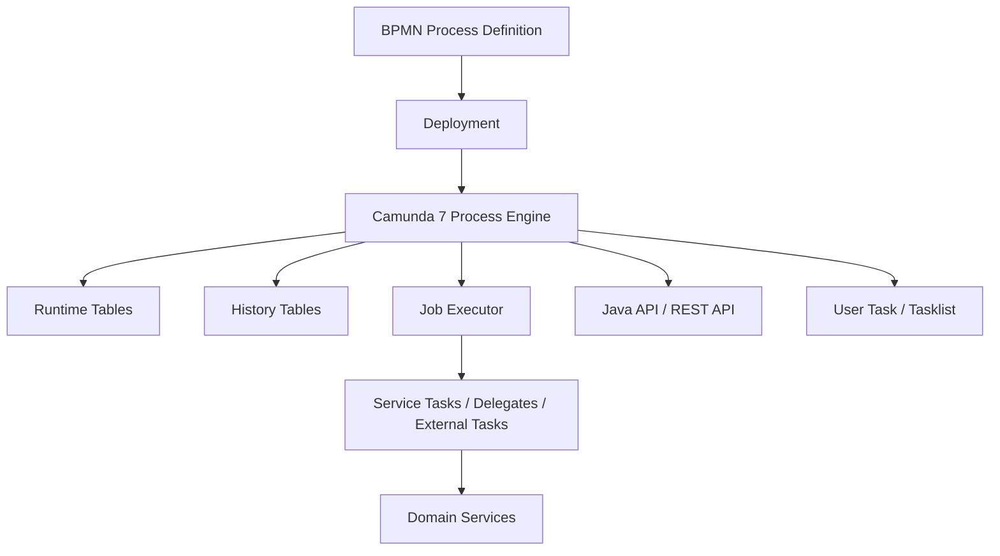
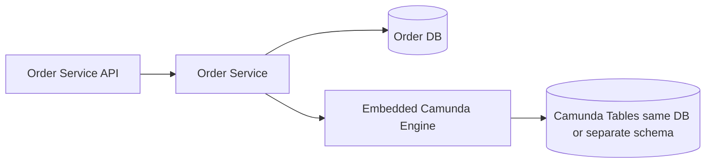
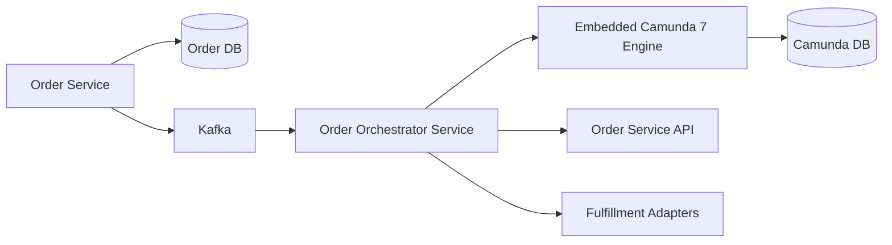
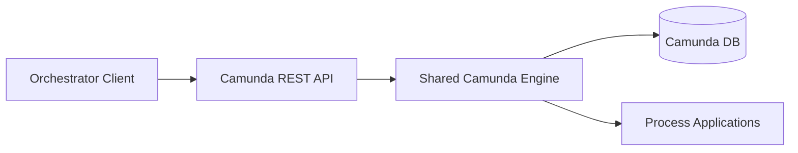
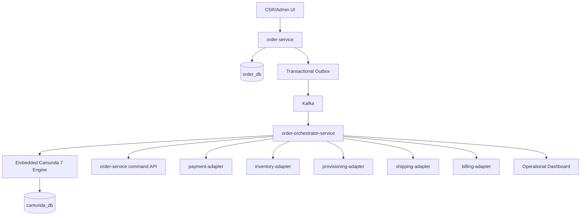
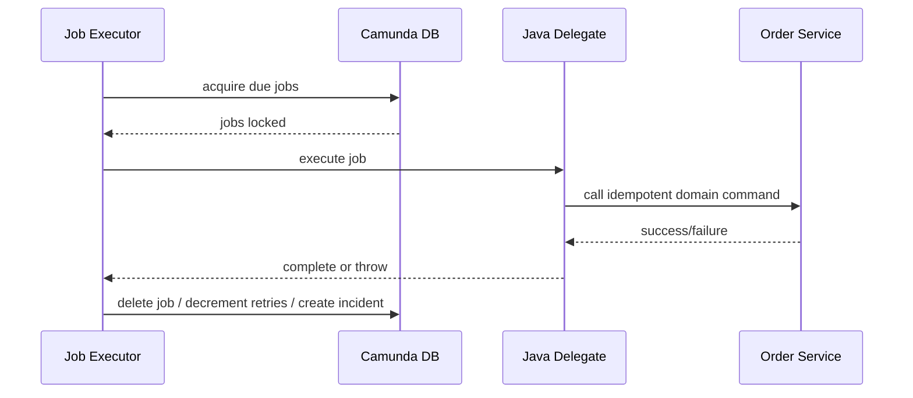
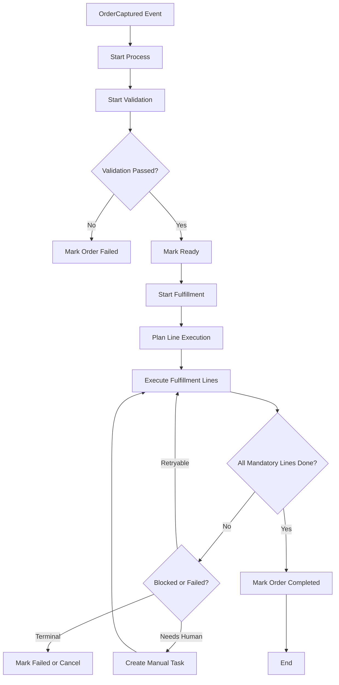
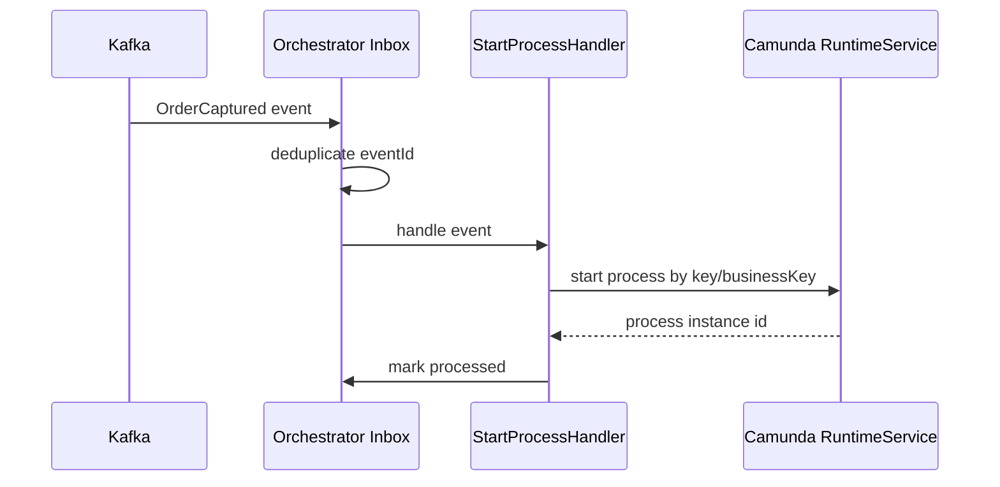

# Part 018 — Camunda 7 Process Engine Architecture

## 1. Tujuan Part Ini

Pada part sebelumnya kita membangun **Order State Machine and Lifecycle**. Order service sudah menjadi pemilik business state, line lifecycle, transition guard, audit history, dan lifecycle event.

Sekarang kita masuk ke **Camunda 7 Process Engine Architecture**.

Camunda 7 berguna untuk long-running orchestration: BPMN, timers, retries, human tasks, incidents, message correlation, and operational visibility. Namun dalam platform CPQ/OMS modern, Camunda 7 harus diposisikan dengan disiplin. Ia bukan pengganti domain model. Ia bukan tempat menyembunyikan business invariant. Ia adalah orchestration runtime.

Ada constraint penting: Camunda 7 Community Edition sudah berada di jalur end-of-life setelah final 7.24 LTS/last minor release. Enterprise Edition memiliki jalur maintenance lebih panjang, tetapi fitur baru tidak lagi menjadi arah utama. Karena itu, desain kita harus punya **migration seam** sejak awal.

Target part ini:

1. memahami komponen inti Camunda 7 process engine;
2. membedakan runtime state, history state, domain state, dan integration state;
3. memilih engine topology untuk microservices CPQ/OMS;
4. memahami embedded engine, shared engine, remote REST, dan orchestrator service;
5. mendesain process application boundary;
6. memahami transaction boundary, wait state, async continuation, dan job executor;
7. memahami incident, retry, timer, message correlation, dan deployment awareness;
8. menentukan data ownership antara Camunda database dan domain database;
9. membuat integration contract dengan Order Service;
10. membuat migration seam agar platform tidak terkunci permanen ke Camunda 7.

> Camunda 7 harus menjadi runtime orchestration yang dapat diganti, bukan pusat gravitasi seluruh domain.

---

## 2. Current Reality: Camunda 7 sebagai Legacy-compatible Engine

Untuk platform baru, kita harus realistis:

- Camunda 7 sangat matang untuk BPMN-style orchestration di ekosistem Java.
- Camunda 7 memiliki process engine, job executor, runtime DB, history DB, REST API, tasklist/admin tooling, dan banyak integrasi lama.
- Camunda 7 banyak dipakai di enterprise yang punya proses panjang dan human workflow.
- Namun Camunda 7 CE tidak lagi cocok diperlakukan sebagai teknologi greenfield tanpa lifecycle risk.
- Desain baru harus mengisolasi dependensi Camunda 7 agar migrasi ke Camunda 8, Temporal, custom orchestrator, atau engine lain tetap mungkin.

Prinsip seri ini:

```text
Use Camunda 7 for orchestration.
Do not use Camunda 7 as the domain database.
Do not leak Camunda concepts into public APIs.
Do not let BPMN become the only place where business rules live.
```

---

## 3. Camunda 7 Mental Model

Camunda 7 process engine mengeksekusi BPMN process definition. Ia menyimpan state proses di relational database. Ia menjalankan work sinkron dalam transaction, dan menjalankan work asynchronous melalui job executor.



Key concepts:

| Concept | Meaning |
|---|---|
| Process definition | Versioned BPMN model deployed to engine. |
| Process instance | One running execution of a process definition. |
| Execution | Token/path of execution inside process instance. |
| Activity | BPMN element such as task, event, gateway. |
| Job | Asynchronous work item, often timer or async continuation. |
| Incident | Operational failure record when job/message cannot proceed. |
| Variable | Process-scoped data used by the engine. |
| History | Audit/record of completed activities, variables, incidents, tasks. |

---

## 4. Domain Truth vs Process Truth

Dalam CPQ/OMS, Order Service tetap menjadi domain truth.

| Concern | Owner |
|---|---|
| Order root status | Order Service |
| Order line status | Order Service |
| Transition guard | Order Service |
| Commercial snapshot | Order Service / Quote Service |
| Audit evidence | Domain services + audit store |
| Process token location | Camunda 7 |
| Timer/retry job | Camunda 7 |
| BPMN incident | Camunda 7 |
| Human task assignment | Camunda 7 or Task service depending architecture |
| External fulfillment call orchestration | Camunda 7 process + adapter services |

Bad design:

```text
GET /orders/{id} -> query Camunda runtime variables to determine order status
```

Good design:

```text
GET /orders/{id} -> Order Service database
GET /orders/{id}/process -> orchestration view joins/correlates Camunda process state for operations
```

---

## 5. Engine Topology Options

### 5.1 Embedded engine inside Order Service



Pros:

- low latency Java API access;
- simpler local transaction integration;
- fewer runtime components;
- good for modular monolith or small platform.

Cons:

- tight coupling between domain service and engine;
- scaling order API also scales job executor unless carefully configured;
- deployment of BPMN and domain code coupled;
- migration away from Camunda harder;
- process engine failure may affect order API process.

Use only if:

- platform is small;
- team understands Camunda internals;
- you intentionally accept coupling;
- you configure job executor carefully;
- migration horizon is low-risk.

### 5.2 Dedicated orchestration service with embedded engine



Pros:

- clear separation between domain and orchestration;
- order service remains domain truth;
- process engine scaling separated from API scaling;
- easier migration seam;
- easier to replace orchestrator later.

Cons:

- distributed transaction impossible between order DB and Camunda DB;
- need idempotency and outbox/inbox;
- more moving parts;
- operational team must monitor orchestrator separately.

This is the recommended topology for this series.

### 5.3 Shared standalone engine via REST



Pros:

- centralized Camunda operation;
- multiple process clients;
- language-agnostic via REST;
- simpler engine patching in some orgs.

Cons:

- network hop for all engine interactions;
- versioning/deployment complexity;
- shared engine multi-tenancy risk;
- harder to isolate noisy processes;
- deployment-aware job executor complexity.

Use only if organization already runs Camunda 7 as central BPM platform.

---

## 6. Recommended Topology for This Series

We use a dedicated **order-orchestrator-service** with embedded Camunda 7 engine and separate Camunda schema/database.



Key rule:

> Camunda processes call domain commands. They do not mutate domain tables.

---

## 7. Process Application Boundary

A process application packages:

- BPMN models;
- DMN models if used;
- Java delegates/listeners;
- deployment metadata;
- process version compatibility assumptions;
- tests for process behavior.

For this series:

```text
services/order-orchestrator-service/
  src/main/java/com/acme/cpq/oms/orchestrator/
    process/
      StartOrderProcessHandler.java
      CorrelationKey.java
    delegate/
      StartValidationDelegate.java
      StartFulfillmentDelegate.java
      RequestLineFulfillmentDelegate.java
      MarkOrderCompletedDelegate.java
    adapter/
      OrderCommandClient.java
      FulfillmentClient.java
    config/
      CamundaEngineConfig.java
  src/main/resources/bpmn/
    order-fulfillment-v1.bpmn
    order-cancellation-v1.bpmn
  src/main/resources/dmn/
    fulfillment-routing-v1.dmn
  src/test/java/...
```

Do not put product catalog, pricing, quote, or order aggregate logic inside process application.

---

## 8. Camunda Database Ownership

Camunda database stores engine state. It is not an application reporting database.

| Table family | Meaning |
|---|---|
| `ACT_RU_*` | Runtime state such as executions, tasks, jobs, variables. |
| `ACT_HI_*` | History records depending history level. |
| `ACT_RE_*` | Repository/deployment/process definition data. |
| `ACT_GE_*` | General engine data. |
| `ACT_ID_*` | Identity tables if Camunda identity used. |

Rules:

1. application code must not update Camunda tables directly;
2. operational queries may read with care, but prefer API/history views;
3. Camunda tables should be in separate schema/database from order service tables;
4. backups and retention policy must consider long-running instances;
5. engine version upgrade must be tested with real process data.

Bad:

```sql
update ACT_RU_JOB set RETRIES_ = 3 where ID_ = ...;
```

Good:

```java
managementService.setJobRetries(jobId, 3);
```

---

## 9. Process Variables Discipline

Process variables are convenient and dangerous.

Use process variables for:

- correlation keys;
- order ID;
- tenant ID;
- process flags;
- small decision results;
- external task metadata;
- retry classifications.

Do not use variables for:

- full order payload;
- full quote snapshot;
- pricing details;
- large customer profile;
- sensitive PII unless explicitly protected;
- data that belongs in domain service.

Recommended variable shape:

```json
{
  "tenantId": "6b98f40b-6c4e-4ce2-8932-9e39e2eab981",
  "orderId": "4d3c6a3b-0d9f-4c2b-94fb-390d7bcb2b3a",
  "orderVersion": 12,
  "correlationId": "ord-4d3c6a3b",
  "fulfillmentPlanVersion": 1,
  "lastKnownOrderStatus": "IN_PROGRESS"
}
```

The process should fetch current domain state when needed.

---

## 10. Transaction Boundary in Camunda 7

Camunda 7 executes commands within transactions. A sequence of synchronous activities can be part of the same transaction until the engine reaches a wait state or async boundary.

Important concepts:

| Concept | Meaning |
|---|---|
| Wait state | Engine persists state and waits: user task, receive task, timer, external task, etc. |
| Async before | Creates a job before activity execution. |
| Async after | Creates a job after activity execution. |
| Job executor | Acquires and executes async jobs. |
| Retry | Failed job can be retried according to config. |
| Incident | Created when retries exhausted or certain failures occur. |

Without async boundary, too much work may happen in one transaction.

Bad process:

```text
Start -> Validate -> Reserve Inventory -> Provision -> Bill -> End
```

If all service tasks are synchronous delegates, one failure can roll back earlier engine state and create confusing retry behavior.

Better:

```text
Start -> async before Validate -> wait -> async before Reserve -> wait -> async before Provision -> wait -> async before Bill -> End
```

---

## 11. Async Continuation Strategy

For order orchestration, use async boundaries deliberately.

| Activity | Async before? | Async after? | Why |
|---|---:|---:|---|
| Process start after `OrderCaptured` | Yes | No | Decouple Kafka consumer from process execution. |
| Validate order | Yes | Yes | Persist before and after external/domain command. |
| Reserve inventory | Yes | Yes | External dependency. |
| Start provisioning | Yes | No | Long-running external call. |
| Wait for provisioning callback | N/A | N/A | Receive/message wait state. |
| Mark line fulfilled | Yes | Yes | Domain command must be retry-safe. |
| Complete order | Yes | No | Guard may reject; retry/incident needed. |

Rule of thumb:

> Put async boundaries around non-trivial external interactions and domain command calls. Do not create async everywhere blindly; each async job has DB and operational cost.

---

## 12. Job Executor Mental Model

The job executor polls/acquires jobs and executes them. Jobs include timers and async continuations. Under load, job acquisition, lock time, retry policy, and exclusive job behavior matter.



Important settings/concepts to understand:

| Area | Meaning |
|---|---|
| acquisition wait time | How often job executor polls. |
| max jobs per acquisition | Batch size acquired per cycle. |
| lock time | How long a job is locked by executor. |
| retries | Number of execution attempts. |
| retry time cycle | Backoff/retry schedule. |
| exclusive jobs | Avoid concurrent execution of jobs for same process instance. |
| deployment aware | Executor only runs jobs for deployments known to the node. |

Production issue pattern:

- jobs pile up;
- executor acquires too few;
- lock duration too short/long;
- external call blocks worker threads;
- retries hammer dependency;
- incidents explode without classification.

---

## 13. Delegate Design

Java delegate should be thin.

Bad delegate:

```java
public class FulfillOrderDelegate implements JavaDelegate {
    public void execute(DelegateExecution execution) {
        // loads order tables directly
        // computes pricing again
        // mutates line status directly
        // calls external systems
        // writes audit tables manually
    }
}
```

Good delegate:

```java
public class StartFulfillmentDelegate implements JavaDelegate {

    private final OrderCommandClient orderCommandClient;

    @Override
    public void execute(DelegateExecution execution) {
        UUID tenantId = ProcessVariables.tenantId(execution);
        UUID orderId = ProcessVariables.orderId(execution);
        String correlationId = ProcessVariables.correlationId(execution);

        orderCommandClient.transitionOrder(new TransitionOrderRequest(
            orderId,
            "START_FULFILLMENT",
            "ORCHESTRATOR_STARTED_FULFILLMENT",
            correlationId,
            execution.getProcessInstanceId()
        ));
    }
}
```

Delegate rules:

1. delegate calls an idempotent API;
2. delegate does not own business invariant;
3. delegate maps BPMN context to domain command;
4. delegate throws classified exception;
5. delegate logs correlation context;
6. delegate avoids long blocking call where external task/message pattern is better.

---

## 14. Error Handling Strategy

Camunda BPMN has multiple error mechanisms:

| Mechanism | Use |
|---|---|
| Java exception | Technical failure, job retry/incident. |
| BPMN error | Expected business error path. |
| Escalation | Non-fatal escalation to human/process branch. |
| Incident | Operational failure requiring attention. |
| Timer boundary event | SLA timeout or wait expiry. |
| Compensation event | Undo/compensate completed work. |

Do not model every exception as BPMN error. Do not model every business rejection as Java exception.

Example classification:

| Condition | Camunda handling |
|---|---|
| Order service timeout | Throw technical exception, retry. |
| Order transition guard rejected because already completed | Treat as idempotent success or BPMN path depending context. |
| Inventory unavailable | BPMN business path: wait, substitute, or cancel. |
| Payment declined | BPMN business path to customer/payment task. |
| Serialization bug | Technical incident. |
| Unknown external callback | Technical/business incident depending source. |

---

## 15. Incident Design

An incident must be actionable.

Bad incident message:

```text
NullPointerException
```

Good incident context:

```text
ORDER_FULFILLMENT_TRANSITION_FAILED
orderId=4d3c6a3b...
lineId=83a1...
action=MARK_LINE_FULFILLED
reason=ORDER_LINE_ALREADY_TERMINAL
correlationId=req-9281
suggestedAction=Check duplicate external callback or reconciliation status.
```

For production, include:

- process instance ID;
- business key;
- tenant ID;
- order ID;
- line ID;
- failed activity ID;
- error code;
- retry count;
- next retry time;
- remediation suggestion.

---

## 16. Business Key and Correlation

Every process instance should have a stable business key.

Recommended:

```text
businessKey = tenantId + ":order:" + orderId
```

Why:

- easier Cockpit/operations search;
- easier duplicate start detection;
- easier message correlation;
- easier logs/traces;
- easier audit mapping.

Start process idempotently:

```java
public void startOrderProcess(OrderCapturedEvent event) {
    String businessKey = businessKey(event.tenantId(), event.orderId());

    if (processInstanceRepository.existsByBusinessKey(businessKey)) {
        return;
    }

    runtimeService.startProcessInstanceByKey(
        "orderFulfillmentV1",
        businessKey,
        Map.of(
            "tenantId", event.tenantId().toString(),
            "orderId", event.orderId().toString(),
            "correlationId", event.correlationId()
        )
    );
}
```

Camunda may not enforce unique business key in every topology; protect idempotency in orchestrator inbox table.

---

## 17. Message Correlation

Message correlation connects external/domain events to waiting process instances.

Example:

- process waits for `OrderLineFulfilledMessage`;
- Kafka consumer receives `OrderLineStatusChanged`;
- if line is fulfilled, correlate message to process instance using business key and line ID.

```java
runtimeService
    .createMessageCorrelation("OrderLineFulfilledMessage")
    .processInstanceBusinessKey(businessKey)
    .setVariable("fulfilledLineId", lineId.toString())
    .correlateWithResult();
```

Rules:

1. do not correlate raw external events directly if they have not been normalized by domain service;
2. make correlation idempotent;
3. handle “no matching execution” as either duplicate/late event or incident depending state;
4. include tenant/order/line in variables or local variables;
5. avoid ambiguous correlation criteria.

---

## 18. BPMN Boundary for Order Fulfillment

High-level process:



At each step, BPMN calls Order Service command API.

---

## 19. Human Tasks

Human tasks are useful for manual review, exception handling, cancellation approval, and repair.

However, human task completion should not directly mutate order state without domain command.

Flow:

```text
User completes Camunda task -> delegate validates task payload -> call Order Service repair/transition command -> process continues based on result
```

Human task variables should include:

- order ID;
- line ID if relevant;
- reason code;
- allowed actions;
- evidence attachment reference, not raw large file;
- assignee/group candidate;
- due date/SLA.

---

## 20. Timers and SLA

Timers are one of Camunda's strengths.

Use timers for:

- approval timeout;
- inventory reservation expiry;
- customer response deadline;
- fulfillment callback timeout;
- cancellation SLA;
- retry delay where BPMN path matters.

Do not use BPMN timers as the only operational SLA tracking. Mirror important SLA state into domain/operations metrics.

Example:

```text
Wait for ProvisioningCallback
  boundary timer PT4H -> Check external status -> retry/wait/escalate
```

---

## 21. Deployment Strategy

Process definition versioning matters.

Rules:

1. never change semantics of a deployed process definition silently;
2. deploy new process version for behavior changes;
3. running instances continue on old definition unless migrated intentionally;
4. maintain delegates backward-compatible with old process variables;
5. use feature flags carefully at process start, not randomly mid-instance;
6. test migration of running instances separately.

Version naming:

```text
order-fulfillment-v1.bpmn
process id: orderFulfillment
versionTag: 2026.07.02
```

Use deployment metadata:

- git commit;
- build version;
- schema contract version;
- compatible order-service API version;
- compatible event version.

---

## 22. Deployment-aware Job Executor

In clustered deployments, not every node may have every process application/delegate. Deployment-aware job execution can prevent a node from acquiring jobs for deployments it cannot execute.

Use it when:

- heterogeneous orchestrator nodes exist;
- multiple process applications share one engine/database;
- rolling deployments may run different process definitions/delegates.

Avoid relying on it as a substitute for clean deployment topology.

Better:

- one orchestrator service owns one bounded set of BPMN definitions;
- homogeneous nodes for that service;
- blue/green or rolling deploy with compatibility constraints;
- process definitions versioned.

---

## 23. History Level and Retention

Camunda history is useful, but can become large.

Questions:

- what history level is required for operations?
- what is required for audit?
- what can be stored in domain audit instead?
- how long do process instances run?
- how large are variables?
- are variables PII-sensitive?

Rules:

1. do not rely only on Camunda history for regulatory audit;
2. avoid storing large process variables;
3. apply history cleanup policy;
4. export operational metrics/events if long-term analytics needed;
5. test DB growth with realistic process volume.

---

## 24. Database Migration and Upgrade

Camunda engine upgrades can involve database schema changes. Treat Camunda DB migration separately from domain DB migration.

Release checklist:

- validate Camunda version compatibility;
- backup Camunda DB;
- run migration in staging with production-like data;
- verify existing process definitions;
- verify running process instances;
- verify job executor acquisition;
- verify history queries;
- verify Cockpit/Admin if used;
- verify rollback/roll-forward plan.

Never casually mix Camunda engine schema changes with business table migration in one uncontrolled deploy.

---

## 25. Integration with Kafka

Camunda 7 itself is not Kafka-native in the way our architecture needs. Use an orchestrator service boundary.

Pattern:



Do not start process directly in Kafka consumer without inbox/idempotency.

Inbox table:

```sql
create table orchestrator_inbox_event (
    event_id uuid primary key,
    event_type varchar(120) not null,
    aggregate_id uuid not null,
    business_key varchar(240) not null,
    received_at timestamptz not null default now(),
    processed_at timestamptz,
    status varchar(30) not null,
    error_code varchar(120),
    error_message text,
    payload jsonb not null,
    check (status in ('RECEIVED', 'PROCESSED', 'FAILED_RETRYABLE', 'FAILED_TERMINAL'))
);
```

---

## 26. External Task vs Java Delegate

Camunda 7 supports external task pattern, where workers pull tasks. This can reduce coupling between engine and workers.

| Pattern | Use when |
|---|---|
| Java delegate | Same Java service owns orchestration code; low-latency internal command; controlled deployment. |
| External task | Worker should be decoupled; long-running work; non-Java worker; independent scaling. |
| Message event | Waiting for asynchronous domain/external event. |
| REST API call from delegate | Fine for domain command if idempotent and timeout-controlled. |

For this series:

- use Java delegates for thin domain command calls;
- use message events for asynchronous callbacks;
- use external tasks selectively for long-running or separately deployed workers;
- never put complex domain logic in delegate or worker.

---

## 27. Security Boundary

Camunda operations expose sensitive process data and control actions.

Protect:

- REST API;
- Cockpit/Admin/Tasklist if deployed;
- process variables with PII;
- manual task actions;
- retry/incident resolution operations;
- deployment endpoints.

Rules:

1. do not expose Camunda REST API publicly;
2. use service-to-service authentication;
3. map user task authorization to platform RBAC/ABAC;
4. avoid storing secrets in variables;
5. avoid storing raw access tokens in process context;
6. audit manual task completion and incident repair actions.

---

## 28. Observability

Metrics:

| Metric | Meaning |
|---|---|
| `camunda_jobs_available` | Jobs waiting. |
| `camunda_jobs_acquired_total` | Acquisition throughput. |
| `camunda_job_execution_duration_seconds` | Job runtime. |
| `camunda_job_failures_total{activityId,errorCode}` | Failure trend. |
| `camunda_incidents_open{processDefinition,activityId}` | Operational blockers. |
| `camunda_process_instances_active{processDefinition}` | Active workload. |
| `orchestrator_inbox_lag_seconds` | Event-to-process delay. |
| `order_process_duration_seconds` | Business process duration. |

Logs must include:

- process instance ID;
- process definition key/version;
- business key;
- tenant ID;
- order ID;
- activity ID;
- job ID where available;
- correlation ID;
- delegate name;
- error code.

Tracing:

```text
Kafka event -> orchestrator handler -> Camunda start -> delegate -> Order Service command -> outbox event -> message correlation
```

---

## 29. Failure Modes

| Failure | Detection | Recovery |
|---|---|---|
| Duplicate `OrderCaptured` event | Inbox unique event/business key | Idempotent no-op. |
| Process started but inbox not marked processed | Reprocess event; detect existing business key. | Mark processed. |
| Delegate timeout calling Order Service | Job retry/incident | Retry with backoff; check idempotency. |
| Domain command rejected | BPMN business path or incident | Classify guard reason. |
| Job executor backlog | Metrics/jobs query | Tune acquisition, scale workers, reduce blocking. |
| Incident flood | Incident metrics | Circuit break dependency; pause process start. |
| Message correlation not found | Consumer logs/retry | Check late/duplicate event; create incident if expected. |
| Camunda DB unavailable | Health checks | Stop consuming new events; recover DB. |
| Process variable schema drift | Delegate exception | Backward-compatible variable reader. |
| Running instance on old BPMN | Process definition version report | Maintain old delegates or migrate intentionally. |

---

## 30. Migration Seam Away from Camunda 7

Because Camunda 7 has lifecycle constraints, every new platform should have an exit strategy.

Seams:

| Seam | Design |
|---|---|
| Public API | No Camunda types in external API. |
| Domain command | BPMN calls Order Service commands. |
| Events | Kafka event contracts independent of Camunda. |
| Process variables | Minimal variables: IDs and flags only. |
| Business state | Owned by Order Service. |
| Human task | Task abstraction can be wrapped. |
| Incident | Operational incidents mapped to platform incident model. |
| BPMN models | Process semantics documented outside engine. |

Migration path options:

1. keep domain services unchanged;
2. introduce new orchestrator consuming same events;
3. route new orders to new orchestrator by feature flag;
4. let old Camunda 7 instances drain;
5. migrate only active long-running instances when business value justifies it;
6. keep process history exported for audit.

---

## 31. Minimal Implementation Blueprint

### 31.1 Dependencies

Conceptual Maven dependencies:

```xml
<dependencies>
  <dependency>
    <groupId>org.camunda.bpm</groupId>
    <artifactId>camunda-engine</artifactId>
  </dependency>
  <dependency>
    <groupId>org.camunda.bpm</groupId>
    <artifactId>camunda-engine-plugin-spin</artifactId>
  </dependency>
  <dependency>
    <groupId>org.postgresql</groupId>
    <artifactId>postgresql</artifactId>
  </dependency>
</dependencies>
```

Use exact versions from your governed BOM, and align with the Camunda 7.24 LTS/support policy used by your organization.

### 31.2 Engine configuration class

```java
public final class CamundaEngineFactory {

    public ProcessEngine build(DataSource dataSource) {
        StandaloneProcessEngineConfiguration config =
            new StandaloneProcessEngineConfiguration();

        config.setDataSource(dataSource);
        config.setDatabaseSchemaUpdate(ProcessEngineConfiguration.DB_SCHEMA_UPDATE_FALSE);
        config.setHistory("audit");
        config.setJobExecutorActivate(true);
        config.setMetricsEnabled(true);
        config.setTelemetryReporterActivate(false);

        return config.buildProcessEngine();
    }
}
```

Production note:

- use explicit schema migration, not auto-update;
- configure history intentionally;
- configure job executor based on load test;
- disable telemetry if policy requires;
- ensure engine lifecycle aligns with service lifecycle.

---

## 32. Testing Strategy

### 32.1 Process unit tests

Use process engine tests to verify BPMN paths:

- happy path order completes;
- validation failure marks order failed;
- inventory unavailable goes to wait/escalation;
- timeout creates escalation;
- cancellation enters cancellation subprocess;
- duplicate event does not create duplicate instance.

### 32.2 Delegate tests

Mock Order Command Client:

- delegate sends correct command;
- idempotency key generated/stable;
- guard rejection mapped correctly;
- timeout throws retryable exception;
- terminal domain rejection maps to BPMN business path.

### 32.3 Integration tests

With real PostgreSQL:

- deploy BPMN;
- start process from inbox event;
- execute async jobs;
- verify order service mock/real test service receives command;
- publish line fulfilled event;
- correlate message;
- process reaches completion.

### 32.4 Migration tests

- deploy v1 process;
- start instance;
- deploy v2;
- ensure v1 still runs;
- ensure delegate compatibility;
- test process instance migration if required.

---

## 33. Operational Runbook Skeleton

### 33.1 Stuck jobs

1. Check job due date and retries.
2. Check activity ID.
3. Check delegate logs by process instance ID.
4. Check downstream service health.
5. Decide retry, wait, or incident escalation.
6. Do not directly mutate engine tables.

### 33.2 Incident resolution

1. Classify technical vs business incident.
2. Verify domain state in Order Service.
3. If duplicate/late event, mark process path appropriately.
4. If downstream recovered, retry job via management API/tooling.
5. If business repair needed, complete manual repair task with evidence.
6. Record operational note.

### 33.3 Duplicate process instance

1. Search by business key.
2. Identify canonical process instance.
3. Suspend/terminate duplicate only after checking domain state.
4. Add incident note.
5. Fix inbox idempotency if needed.

---

## 34. Common Anti-patterns

| Anti-pattern | Why it hurts |
|---|---|
| Camunda variables as order database | Large variables, poor ownership, hard migration. |
| BPMN contains all business rules | Rules become untestable and invisible to APIs/events. |
| Direct table mutation of `ACT_*` | Engine corruption risk. |
| No business key | Operations cannot correlate process to order. |
| No async boundary around external calls | Huge transaction, bad retry semantics. |
| Async everywhere | Job overhead and operational noise. |
| Delegates contain domain logic | Coupling and duplicate invariants. |
| Public API exposes process instance IDs | Leaks implementation detail. |
| No running-instance compatibility | Deploy breaks old orders. |
| No migration seam | Platform trapped on Camunda 7. |

---

## 35. Production Checklist

Before implementing order BPMN in detail, ensure:

- [ ] Camunda topology chosen intentionally.
- [ ] Orchestrator service separated from Order Service.
- [ ] Camunda DB separated from domain DB.
- [ ] Order Service remains domain truth.
- [ ] Process variables minimal.
- [ ] Business key policy defined.
- [ ] Inbox idempotency exists for Kafka events.
- [ ] Delegates call idempotent domain commands.
- [ ] Async boundary policy documented.
- [ ] Job executor settings load-tested.
- [ ] Incident classification exists.
- [ ] History level and cleanup configured.
- [ ] Deployment/versioning strategy documented.
- [ ] Running process compatibility tested.
- [ ] Migration seam away from Camunda 7 exists.

---

## 36. References

Use these as factual anchors when implementing the real platform:

- Camunda Platform 7 documentation and announcements.
- Camunda 7.24 LTS/release policy and Enterprise support announcements.
- Camunda transaction handling and job executor documentation.
- BPMN 2.0 modeling reference.
- PostgreSQL documentation for production database operation.
- Kafka documentation for event/inbox/outbox integration.

---

## 37. Recap

Pada part ini kita menempatkan Camunda 7 sebagai orchestration runtime yang kuat tetapi harus dibatasi. Kita memilih dedicated order-orchestrator-service dengan embedded engine, Camunda DB terpisah, minimal process variables, business key yang stabil, inbox idempotency, command API ke Order Service, async boundaries yang disengaja, job executor yang dipahami, dan migration seam agar platform tidak terkunci.

Mental model terpenting:

> Camunda menjalankan proses. Order Service memiliki kebenaran bisnis. Kafka menghubungkan perubahan. PostgreSQL menjaga invariant. Operator membutuhkan incident yang actionable. Arsitektur yang baik membuat semua boundary ini eksplisit.

Di part berikutnya kita akan masuk ke **BPMN for Order Orchestration**: membuat proses order fulfillment yang executable, mengatur gateway, service task, receive task, timer, compensation, cancellation subprocess, dan manual exception handling.
