------
title: Learn Java Microservices CPQ/OMS Platform - Part 019
description: BPMN design for order orchestration in a Java microservices CPQ/OMS platform using Camunda 7, with state-machine alignment, idempotency, compensation, incidents, message correlation, timers, and failure-aware process modeling.
series: learn-java-microservices-cpq-oms-platform
seriesTitle: Learn Java Microservices CPQ/OMS Platform
order: 19
partTitle: BPMN for Order Orchestration
tags:
- java
- microservices
- cpq
- oms
- camunda-7
- bpmn
- orchestration
- state-machine
- kafka
- postgresql
date: 2026-07-02
---

# Part 019 — BPMN for Order Orchestration

## 1. What This Part Solves

In the previous part, we established **Camunda 7 Process Engine Architecture**: where the process engine lives, what it should own, how it persists runtime/history state, and why CPQ/OMS should not hide domain truth inside BPMN variables.

This part answers a more dangerous question:

> How do we model order orchestration in BPMN without turning the process diagram into an unmaintainable distributed transaction script?

A CPQ/OMS order is not a simple CRUD object. It has:

- commercial commitments from the accepted quote,
- line-level dependencies,
- provisioning or fulfillment steps,
- asynchronous external responses,
- timers,
- retries,
- manual intervention,
- compensation,
- cancellation,
- suspension,
- auditability,
- and operational repair paths.

BPMN is useful because it gives a visual, executable model of long-running coordination. But BPMN becomes harmful when it becomes the only place where business truth exists.

The core rule for this series:

> **The order service owns order state. Camunda owns orchestration progress. Kafka owns event distribution. PostgreSQL owns durable business truth. Redis owns temporary acceleration only.**

---

## 2. Kaufman Deconstruction

For this skill, we do not learn “all BPMN”. We learn the subset that determines production correctness.

| Skill Sub-area | Why It Matters |
|---|---|
| Start events | Define when orchestration begins and what business preconditions exist |
| Service tasks | Execute side effects through retry-safe application commands |
| Receive/message events | Wait for asynchronous external or cross-service responses |
| Timers | Model SLA, timeout, expiry, escalation, and retry delays |
| Gateways | Route based on already-validated domain facts |
| Error events | Represent expected business/technical failures |
| Compensation | Undo or neutralize completed side effects where feasible |
| Subprocesses | Encapsulate line provisioning, payment, activation, fulfillment, cancellation |
| Incidents | Surface unrecoverable orchestration problems for operations |
| Correlation | Match incoming events/messages to the correct process instance |
| Variable discipline | Keep process variables small, stable, and reconstructable |

The target is not beautiful diagrams. The target is **reliable execution under failure**.

---

## 3. BPMN Is Not the Order State Machine

This distinction is non-negotiable.

A common mistake is to let BPMN become the source of truth for order status:

```text
Process token is at "Provision Service" => therefore order status is PROVISIONING.
```

That is fragile.

The correct interpretation:

```text
Order database says order.status = FULFILLING.
Camunda token says orchestration is currently waiting for fulfillment completion.
```

The order service state machine remains authoritative.

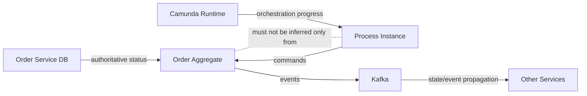

### 3.1 Ownership Boundary

| Concern | Owner |
|---|---|
| Order status | Order Service |
| Order line status | Order Service |
| Legal/commercial snapshot | Order Service |
| Process token location | Camunda |
| Retry schedule for orchestration step | Camunda job executor |
| Published integration events | Kafka + Outbox |
| Process correlation key | Order ID / orchestration ID |
| User task ownership | Workflow/Approval module or Camunda task boundary |
| Audit decision evidence | Domain audit table, not only Camunda history |

---

## 4. Target Order Orchestration Model

A realistic order orchestration is usually hierarchical:

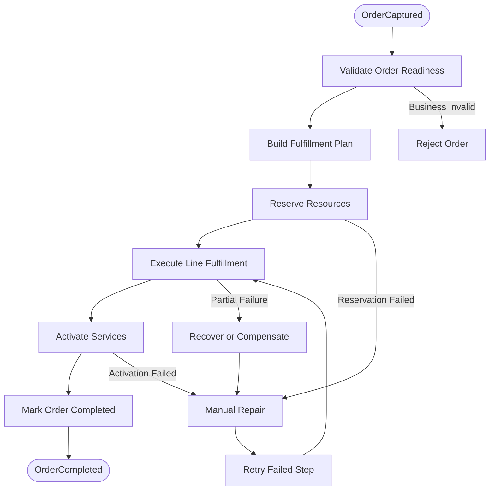

This is intentionally **not** a huge diagram with every integration system inside it. The process is a skeleton of orchestration. Details live in service handlers and subprocesses.

---

## 5. Process Instance Identity

Each order orchestration process instance needs stable identity.

Recommended variables:

| Variable | Type | Purpose |
|---|---|---|
| `orderId` | String/UUID | Business key and primary correlation key |
| `tenantId` | String/UUID | Tenant boundary |
| `orchestrationId` | String/UUID | Unique process orchestration ID |
| `orderVersion` | Long | Optional concurrency/debug context |
| `fulfillmentPlanId` | String/UUID | Links to generated plan |
| `initiatedBy` | String | Audit/debug context |
| `traceId` | String | Observability bridge |
| `startedAt` | ISO timestamp | Diagnostics |
| `schemaVersion` | Integer/String | Variable contract version |

Avoid storing:

- full order JSON,
- full quote snapshot,
- product catalog snapshot,
- large line item arrays,
- pricing breakdown,
- customer PII,
- credentials,
- documents,
- or arbitrary DTOs.

Store IDs and minimal routing facts. Reconstruct rich context from services.

---

## 6. Business Key Strategy

Use `orderId` as Camunda business key when there is exactly one active orchestration per order.

```java
runtimeService
    .createProcessInstanceByKey("order-orchestration-v1")
    .businessKey(orderId.toString())
    .setVariable("orderId", orderId.toString())
    .setVariable("tenantId", tenantId.toString())
    .setVariable("orchestrationId", orchestrationId.toString())
    .execute();
```

If the system allows multiple orchestrations for one order, such as amendment flows or repair flows, use a composite discipline:

```text
businessKey = orderId
orchestrationId = separate variable
processDefinitionKey = order-orchestration-v1 / order-amendment-v1 / order-repair-v1
```

Do not encode business semantics into a brittle business key string such as:

```text
TENANT-A|ORDER-123|FLOW-9|TRY-4|SPECIAL
```

That becomes hard to query and hard to evolve.

---

## 7. Starting the Process

The process should start after the order aggregate is durably captured.

Preferred sequence:

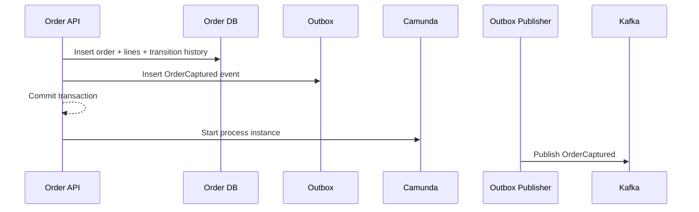

This sequence is acceptable when process start failure is recoverable by a reconciliation job. The stronger variant is to represent **process start intent** in the database and let a reliable worker start Camunda.

### 7.1 Safer Start Intent Pattern

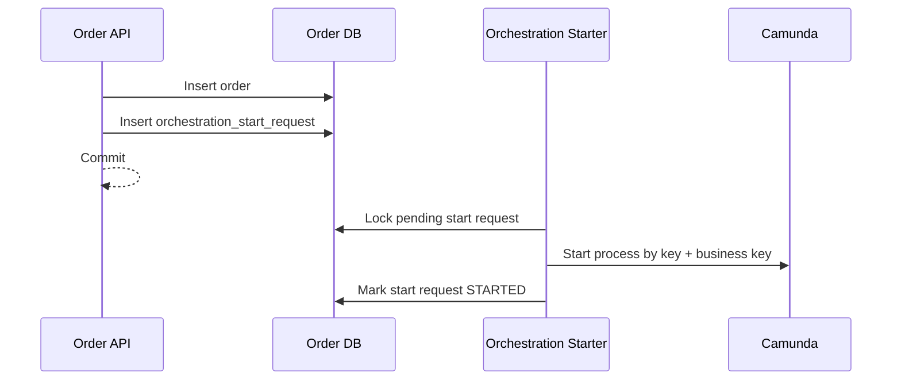

Use this when losing a process start would be operationally expensive.

---

## 8. BPMN Skeleton

A useful first version:

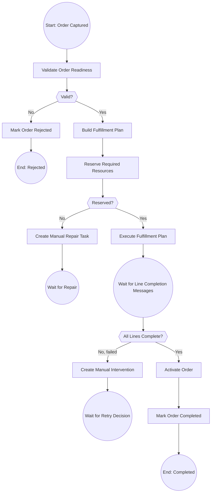

In actual BPMN, `Wait for Line Completion Messages` may be implemented with event subprocesses, multi-instance subprocesses, or explicit receive tasks depending on line topology.

---

## 9. Service Task Design

A service task should execute one application-level command.

Good service task names:

- `Validate Order Readiness`
- `Build Fulfillment Plan`
- `Reserve Inventory`
- `Submit Fulfillment Request`
- `Mark Line Fulfilled`
- `Create Manual Repair Task`
- `Complete Order`

Bad service task names:

- `Do Stuff`
- `Call API`
- `Update Status`
- `Process Order`
- `Handle Error`

### 9.1 Handler Contract

Each handler should be:

- idempotent,
- observable,
- retry-safe,
- small enough to reason about,
- backed by domain service methods,
- and able to classify failures.

```java
public interface WorkflowCommandHandler<C extends WorkflowCommand, R extends WorkflowResult> {
    R handle(C command);
}
```

Example:

```java
public final class ReserveResourcesCommand {
    private final UUID tenantId;
    private final UUID orderId;
    private final UUID orchestrationId;
    private final String activityId;
    private final String idempotencyKey;

    // constructor/getters
}
```

The idempotency key can be derived:

```text
processInstanceId:activityId:orderId
```

But when commands affect business state, prefer a domain-specific key:

```text
reserve-resources:orderId:fulfillmentPlanId
```

---

## 10. Gateways Should Route on Facts, Not Compute Them

A gateway should not hide complex business logic.

Bad:

```text
Gateway condition:
discount > 30 && customer.segment == "ENTERPRISE" && product.type != "TRIAL" && ...
```

Good:

```text
Service Task: Evaluate Approval Policy
Gateway: approvalRequired == true
```

For order orchestration:

```text
Service Task: Evaluate Fulfillment Outcome
Gateway:
- outcome == COMPLETE
- outcome == PARTIAL_FAILURE
- outcome == RETRYABLE_FAILURE
- outcome == BUSINESS_REJECTED
```

The computation belongs in versioned Java domain logic. BPMN should route based on the result.

---

## 11. Message Correlation

Order fulfillment is asynchronous. External systems will respond later.

A response event must be correlated to the right process instance.

Recommended correlation keys:

| Message Type | Correlation Key |
|---|---|
| `LineFulfillmentCompleted` | `orderId` + `orderLineId` |
| `ReservationConfirmed` | `orderId` + `reservationId` |
| `ActivationCompleted` | `orderId` |
| `ManualRepairSubmitted` | `orderId` + `repairTaskId` |
| `CancellationAcknowledged` | `orderId` + `cancellationId` |

### 11.1 Correlation Handler Pattern

```java
public final class FulfillmentMessageCorrelator {

    private final RuntimeService runtimeService;

    public void correlate(LineFulfillmentCompleted event) {
        runtimeService.createMessageCorrelation("LineFulfillmentCompleted")
            .processInstanceBusinessKey(event.orderId().toString())
            .localVariableEquals("orderLineId", event.orderLineId().toString())
            .setVariable("lastFulfillmentEventId", event.eventId().toString())
            .correlateWithResult();
    }
}
```

The event should already be deduplicated through an inbox table before correlation.

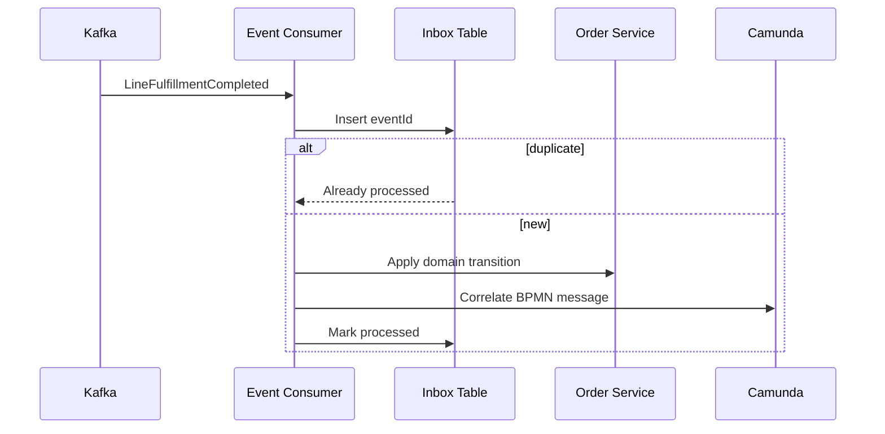

---

## 12. Receive Task vs Message Catch Event

Both can be used to wait for external input.

| Construct | Use When |
|---|---|
| Receive task | Waiting for one expected message as a normal step |
| Intermediate message catch event | Waiting between activities |
| Event subprocess | Message can arrive while main process is in many states |
| Boundary message event | Message interrupts or modifies a specific activity |

For cancellation, an event subprocess is often better because cancellation can arrive during many stages.

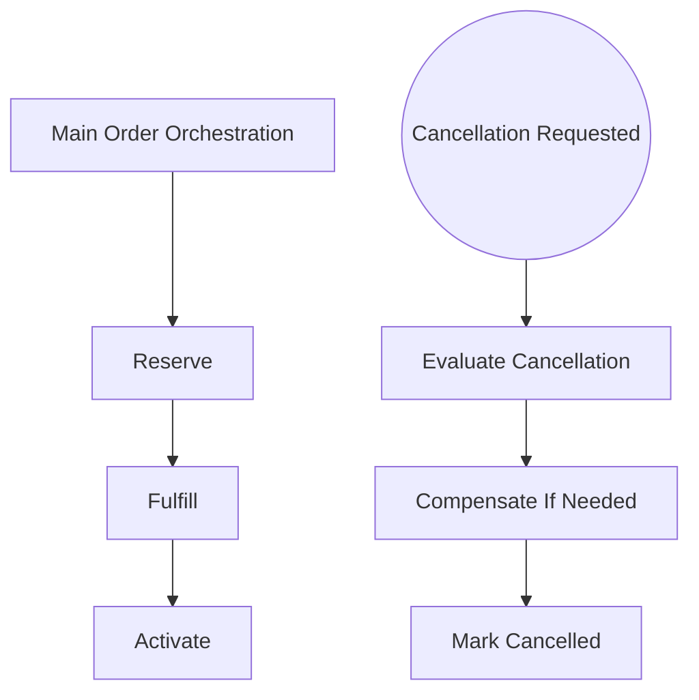

---

## 13. Timers and SLA

Timers are not just reminders. They are part of the business process.

Examples:

| Timer | Meaning |
|---|---|
| Reservation timeout | Inventory/resource reservation did not complete in time |
| Fulfillment timeout | Downstream fulfillment did not respond |
| Customer activation timeout | Activation did not complete within SLA |
| Manual repair escalation | Human task was not handled |
| Order expiry | Order can no longer proceed |

### 13.1 Timer Semantics

A timer must declare:

- what starts it,
- what stops it,
- whether it escalates or fails,
- whether it changes domain state,
- whether it emits an event,
- whether it creates a user task,
- and how it is audited.

Bad timer:

```text
Wait 2 days, then send email.
```

Good timer:

```text
If line fulfillment has not reached a terminal line state within 48 hours, mark line as FULFILLMENT_TIMEOUT, create repair case, publish OrderLineFulfillmentTimedOut, and escalate to operations queue.
```

---

## 14. Error Handling in BPMN

There are two major classes:

| Error Type | Example | BPMN Treatment |
|---|---|---|
| Business error | Product no longer orderable | Model explicitly |
| Technical error | HTTP timeout to fulfillment service | Retry/incident |
| Permanent integration error | Downstream rejected unknown product code | Business/repair path |
| Data inconsistency | Order line missing snapshot | Incident + repair |
| Authorization error | Handler lacks permission | Incident/security alert |

Do not model every transient timeout as a BPMN business error. Let the job executor retry controlled technical failures.

### 14.1 Business Error Boundary

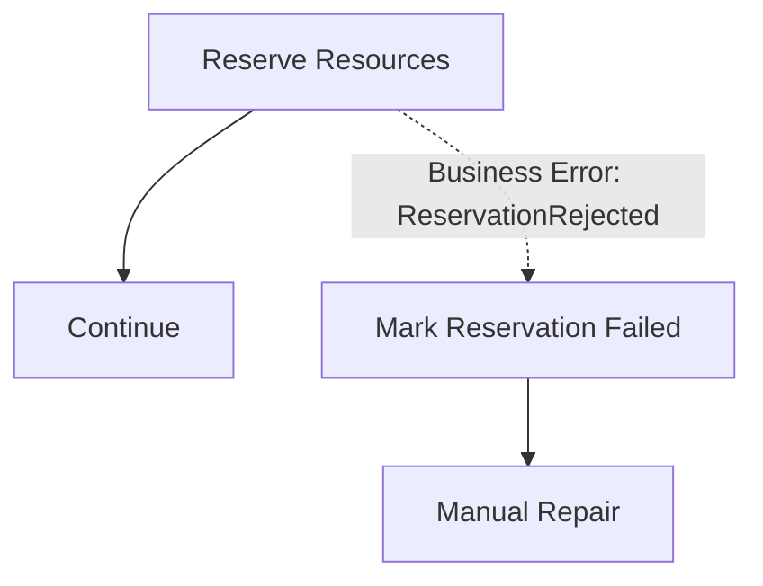

### 14.2 Technical Failure

A technical exception from a Java delegate should usually trigger Camunda retry and eventually incident:

```text
R3/PT5M, R2/PT30M, R1/PT2H
```

Meaning:

- retry 3 times every 5 minutes,
- retry 2 times every 30 minutes,
- retry 1 time after 2 hours.

Exact retry expression support depends on Camunda 7 configuration and BPMN extension use. The important design principle is to define retry policy per activity class, not randomly.

---

## 15. Compensation

Compensation is not magic rollback.

In distributed systems, compensation means **a new forward action that neutralizes or reverses a previous effect as much as the business allows**.

Examples:

| Completed Step | Compensation |
|---|---|
| Resource reserved | Release reservation |
| Fulfillment request submitted | Submit cancellation request |
| Activation completed | Submit deactivation request |
| Invoice generated | Generate credit note/reversal request |
| Notification sent | Usually cannot be undone; send correction |

### 15.1 Compensation Feasibility Matrix

| Side Effect | Reversible? | Notes |
|---|---:|---|
| Internal DB status update | Usually yes | Via state transition, not raw update |
| Kafka event publication | No | Publish compensating event |
| External reservation | Usually yes | If external system supports release |
| External activation | Maybe | Requires domain-specific deactivation |
| Customer email | No | Send follow-up correction |
| Legal acceptance record | No | Preserve and supersede |

---

## 16. Multi-Instance Line Fulfillment

Order lines often run in parallel but with dependencies.

Example:

```text
Line A: Internet Access
Line B: Static IP depends on Line A
Line C: Router shipment can run in parallel
```

Represent dependencies in the fulfillment plan, not only in BPMN.

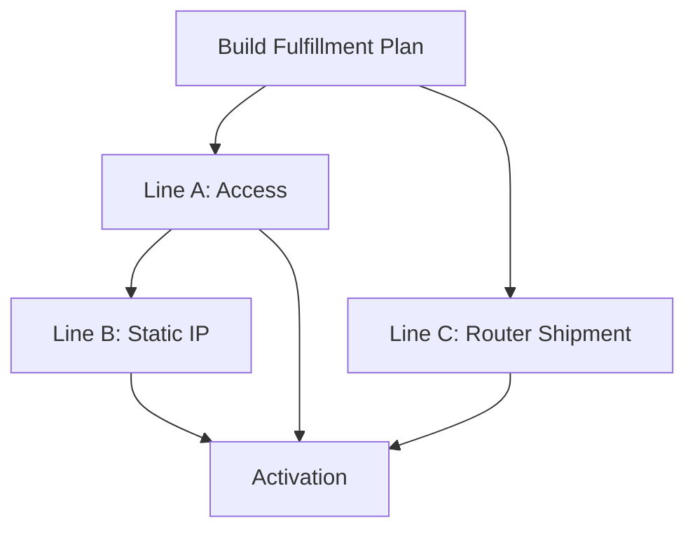

BPMN can execute plan steps, but the plan is domain data.

### 16.1 Fulfillment Plan Table

```sql
create table fulfillment_plan_step (
    step_id uuid primary key,
    order_id uuid not null,
    order_line_id uuid not null,
    step_type text not null,
    status text not null,
    depends_on_step_ids jsonb not null default '[]'::jsonb,
    attempt_count integer not null default 0,
    created_at timestamptz not null,
    updated_at timestamptz not null
);
```

This allows operational queries and repair without decoding BPMN internals.

---

## 17. Human Tasks

Human tasks are useful for:

- manual approval,
- manual repair,
- exception classification,
- override,
- data correction,
- cancellation decision,
- and escalation.

But they must not become unstructured dumping grounds.

A human task should include:

| Field | Purpose |
|---|---|
| task type | What kind of work this is |
| reason code | Why it exists |
| order ID | Business context |
| line ID | Optional targeted context |
| required action | What the user must decide |
| allowed decisions | Prevent free-form process mutation |
| SLA due time | Escalation |
| assignee/group | Routing |
| evidence link | Auditability |
| completion schema | Structured outcome |

### 17.1 Structured Completion

Bad:

```text
Comment: "fixed it, retry pls"
```

Good:

```json
{
  "decision": "RETRY_STEP",
  "reasonCode": "DOWNSTREAM_CONFIGURATION_FIXED",
  "evidenceRef": "case-attachment-123",
  "operatorId": "ops-998"
}
```

---

## 18. Order Cancellation Process

Cancellation is one of the hardest flows because it can happen in many states.

### 18.1 Cancellation Policy

Cancellation behavior depends on progress:

| Order State | Cancellation Behavior |
|---|---|
| Captured | Cancel directly |
| Validating | Cancel directly or after validation completes |
| Reserved | Release reservation |
| Fulfilling | Cancel pending steps; compensate completed reversible steps |
| Activated | Deactivate or create termination order |
| Completed | Usually amendment/termination, not cancellation |
| Failed | Cancel if no irreversible side effects remain |

### 18.2 Cancellation BPMN Shape

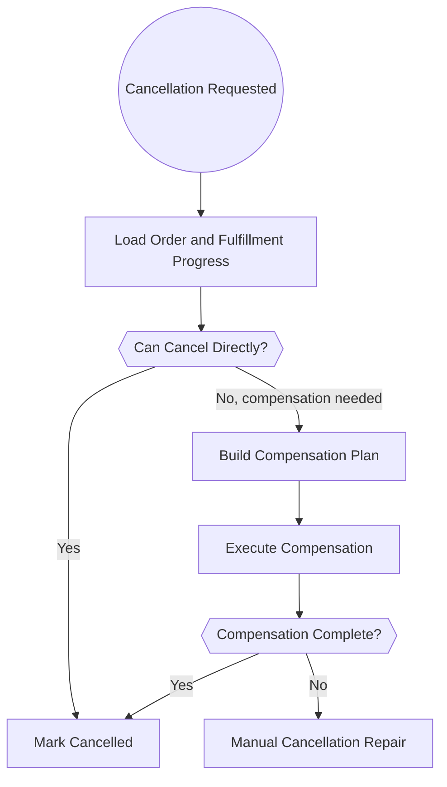

A cancellation request must also update the domain state. Do not merely move the BPMN token.

---

## 19. Suspension and Resume

Suspension is different from failure.

A suspended order is intentionally paused:

- customer requested hold,
- fraud/risk investigation,
- missing document,
- dependency not ready,
- regulatory/compliance review,
- payment hold.

Recommended states:

```text
FULFILLING -> SUSPENDED
SUSPENDED -> FULFILLING
SUSPENDED -> CANCELLED
SUSPENDED -> FAILED
```

The BPMN process can wait at a receive task or event-based gateway for:

- resume requested,
- cancel requested,
- timeout/escalation,
- manual decision.

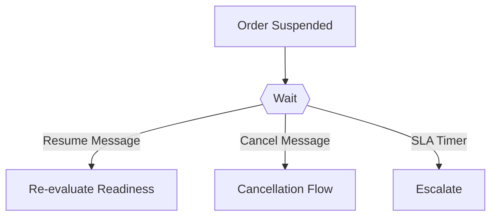

---

## 20. BPMN Variable Contract

Process variables should be versioned.

```json
{
  "schemaVersion": 1,
  "orderId": "018f7c84-2bbd-7c3e-b228-6a9416d338d2",
  "tenantId": "018f7c84-2bbd-7c3e-b228-6a9416d338d1",
  "orchestrationId": "018f7c84-2bbd-7c3e-b228-6a9416d338d3",
  "fulfillmentPlanId": "018f7c84-2bbd-7c3e-b228-6a9416d338d4",
  "traceId": "6d41c02b7a8d4f7e"
}
```

### 20.1 Variable Naming

Use stable names:

- `orderId`
- `tenantId`
- `orchestrationId`
- `fulfillmentPlanId`
- `lineFailureCount`
- `lastFailureCode`
- `repairTaskId`

Avoid:

- `x`
- `data`
- `payload`
- `order`
- `fullOrder`
- `tmp`
- `response`

---

## 21. Process Versioning

Never assume a running long-lived process instance will upgrade cleanly.

A running order may remain on process definition version 1 while new orders use version 2.

Recommended strategy:

| Change Type | Strategy |
|---|---|
| Add new optional variable | Safe with defaults |
| Add new task in future path | Usually safe for new instances |
| Change meaning of existing task | Create new process version |
| Remove wait state | Dangerous for running instances |
| Change correlation message name | Requires migration strategy |
| Change variable type | Avoid; introduce new variable |
| Change compensation semantics | Version explicitly |

### 21.1 Versioned Process Key

```text
order-orchestration-v1
order-orchestration-v2
```

This is less elegant than a single key, but operationally clearer.

---

## 22. Process and Domain Audit

Camunda history is not enough for regulatory-grade audit.

Camunda can say:

```text
Activity X started at 10:01, ended at 10:02.
```

The domain audit must say:

```text
Order line 3 transitioned from RESERVED to FULFILLING because reservation R-123 was confirmed by system InventoryAdapter using event E-777.
```

Keep both.

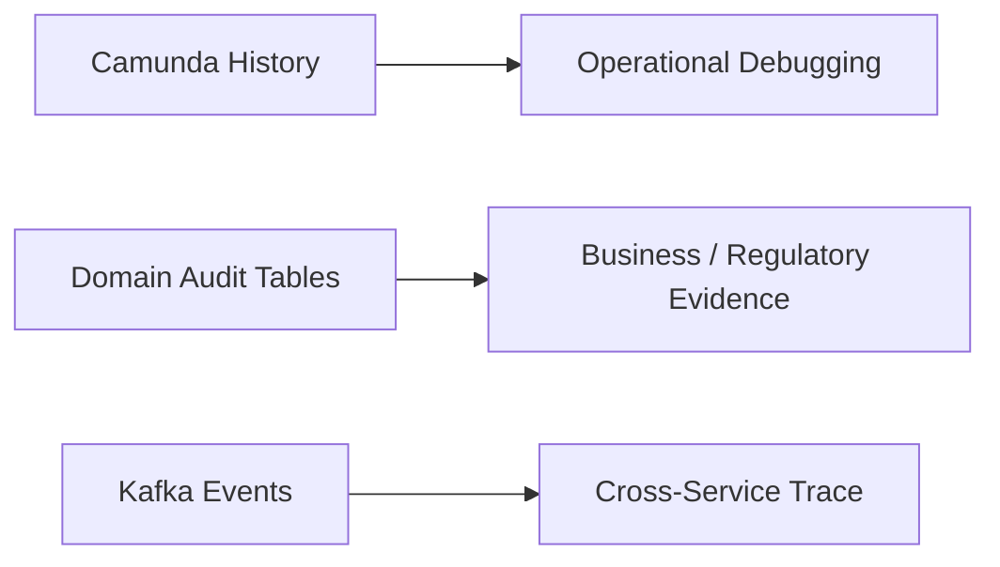

---

## 23. Incident Handling

An incident means the process engine cannot proceed automatically.

Every incident should map to:

- impacted tenant,
- order ID,
- process definition,
- activity ID,
- failure code,
- retry count,
- last exception summary,
- whether domain state changed,
- operator playbook,
- safe retry condition.

### 23.1 Incident Classification

| Incident | Likely Cause | Safe Action |
|---|---|---|
| Delegate exception | transient service/database failure | retry after dependency recovers |
| Optimistic lock | concurrent process/domain update | retry |
| Correlation failure | message arrived before wait state or wrong key | check inbox/retry correlation |
| Serialization failure | variable type changed | migrate variable or repair instance |
| Missing data | domain invariant broken | repair domain data before retry |
| External rejection | invalid downstream request | classify as business failure |

---

## 24. Reconciliation

BPMN cannot be your only recovery strategy.

Build reconciliation jobs that compare:

- order state,
- line state,
- process instance state,
- fulfillment plan state,
- outbox/inbox state,
- external system state where possible.

Example checks:

```sql
-- Orders marked FULFILLING but no active process instance recorded
select o.order_id
from orders o
left join order_orchestration oo on oo.order_id = o.order_id
where o.status = 'FULFILLING'
  and (oo.status is null or oo.status not in ('STARTED', 'WAITING', 'RUNNING'));
```

```sql
-- Fulfillment steps stuck too long
select step_id, order_id, order_line_id, status, updated_at
from fulfillment_plan_step
where status in ('SUBMITTED', 'RUNNING')
  and updated_at < now() - interval '2 hours';
```

---

## 25. BPMN Modeling Anti-Patterns

| Anti-pattern | Why It Fails |
|---|---|
| Giant process with every detail | Impossible to test and evolve |
| Business truth only in variables | Hard to query, repair, audit |
| Full order JSON in variables | Serialization/versioning pain |
| Gateway with complex domain logic | Hidden unversioned business rules |
| No idempotency in delegates | Retry creates duplicate side effects |
| No correlation strategy | Messages fail or hit wrong process |
| No manual repair path | Operations edit database manually |
| No compensation classification | Cancellation becomes unsafe |
| No process version strategy | Running instances break on deploy |
| Treating incident as rare | Incidents are normal in distributed workflows |

---

## 26. Implementation Blueprint

A practical first implementation:

```text
services/
  order-service/
    src/main/java/.../workflow/
      OrderProcessStarter.java
      OrderProcessMessages.java
      OrderBpmnVariables.java
      FulfillmentMessageCorrelator.java
      CancellationMessageCorrelator.java

    src/main/java/.../workflow/delegate/
      ValidateOrderReadinessDelegate.java
      BuildFulfillmentPlanDelegate.java
      ReserveResourcesDelegate.java
      SubmitFulfillmentDelegate.java
      CompleteOrderDelegate.java
      CreateManualRepairTaskDelegate.java

    src/main/resources/bpmn/
      order-orchestration-v1.bpmn
      order-cancellation-v1.bpmn
```

The BPMN files are deployment artifacts. The Java handlers are testable domain adapters.

---

## 27. Testing BPMN Behavior

Test at three levels.

### 27.1 Pure Domain Tests

Test order state transitions without Camunda.

```text
captured order + valid plan -> FULFILLING
fulfilling order + all lines complete -> COMPLETED
fulfilling order + cancellation request -> CANCELLATION_REQUESTED
```

### 27.2 Delegate Tests

Test each delegate with fake command handler and persistence.

```text
given process variables
when ValidateOrderReadinessDelegate executes
then command ValidateOrderReadiness is invoked with tenantId/orderId
and BPMN variable readinessOutcome is set
```

### 27.3 Process Tests

Test process path:

```text
OrderCaptured starts process
valid order builds plan
reservation success submits fulfillment
line completion messages move process to activation
activation success completes order
```

Use process tests to verify orchestration shape, not every domain rule.

---

## 28. Production Checklist

Before shipping an order orchestration process:

- [ ] Every service task has an idempotent handler.
- [ ] Every external side effect has a stable idempotency key.
- [ ] Every wait state has a correlation key.
- [ ] Every timer has business meaning.
- [ ] Every manual task has structured completion schema.
- [ ] Every irreversible side effect is explicitly marked.
- [ ] Every compensation path declares feasibility.
- [ ] Every BPMN variable is small and versioned.
- [ ] Every domain state change is recorded outside Camunda.
- [ ] Every incident has a runbook.
- [ ] Every process version has migration/retirement policy.
- [ ] Reconciliation can detect order/process divergence.

---

## 29. Practice Exercise

Build `order-orchestration-v1.bpmn` with this minimal path:

1. Start by `OrderCaptured`.
2. Validate order readiness.
3. Build fulfillment plan.
4. Reserve resources.
5. Submit fulfillment.
6. Wait for `LineFulfillmentCompleted`.
7. Activate order.
8. Mark completed.
9. Include timer for fulfillment timeout.
10. Include manual repair path.
11. Include cancellation event subprocess.
12. Add process variables:
    - `orderId`
    - `tenantId`
    - `orchestrationId`
    - `fulfillmentPlanId`
    - `schemaVersion`

Then implement a reconciliation query that detects:

- captured orders without process,
- process running for completed order,
- process waiting but order cancelled,
- line failed but process not in repair path.

---

## 30. Key Takeaways

- BPMN is the orchestration model, not the source of business truth.
- The order service owns order and line state.
- Camunda owns process progress, waits, timers, retries, and incidents.
- Message correlation must be designed before the first production event.
- Compensation is forward business action, not rollback.
- Timers must have explicit domain semantics.
- Human tasks need structured decision output.
- Long-running process versioning is a production architecture concern, not a release afterthought.
- Reconciliation is mandatory for serious CPQ/OMS systems.
