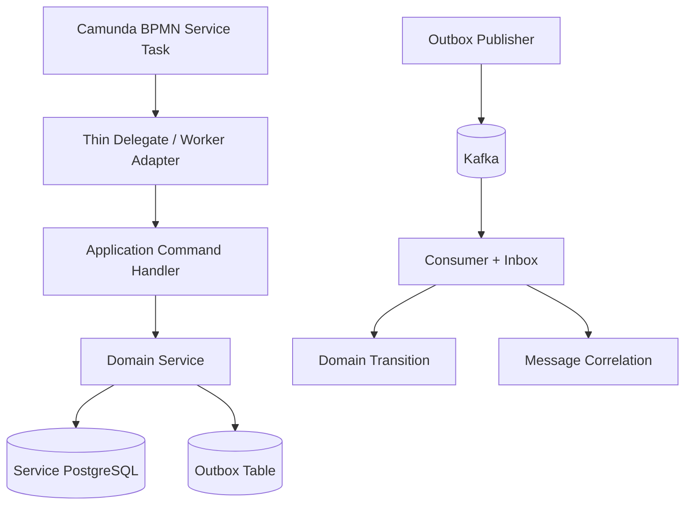
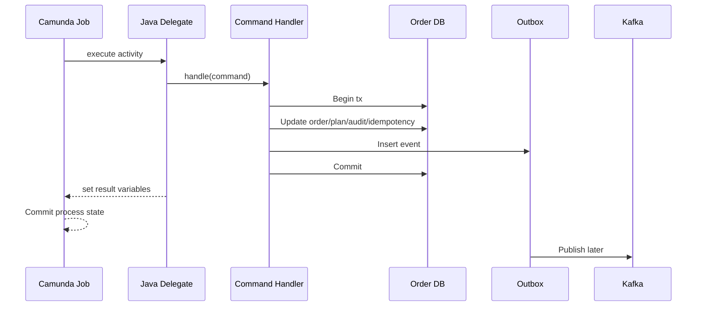
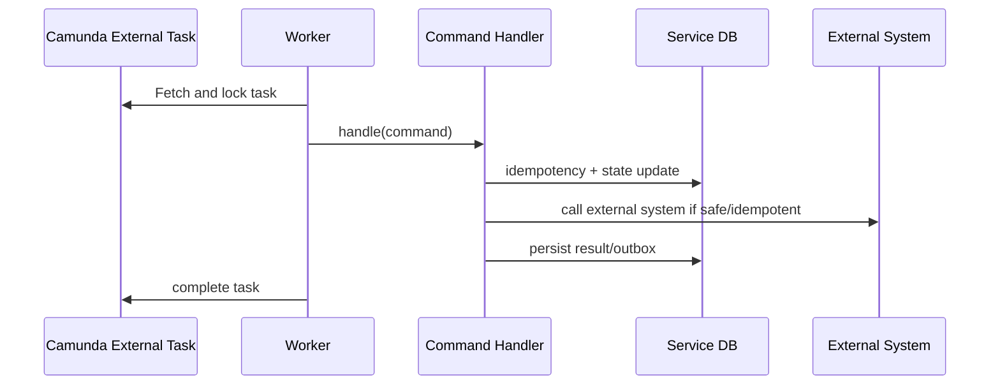
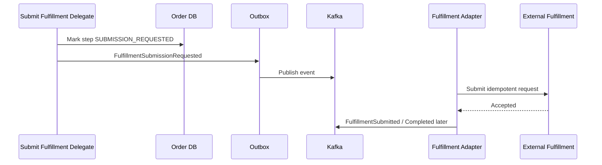
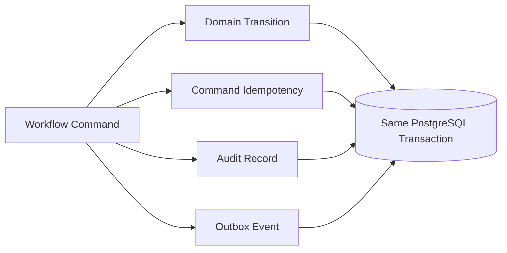
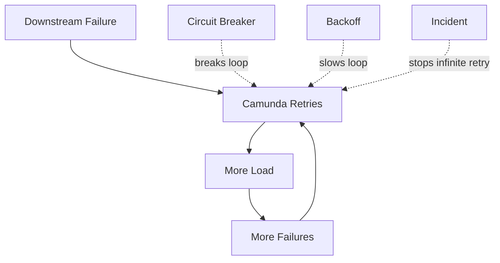
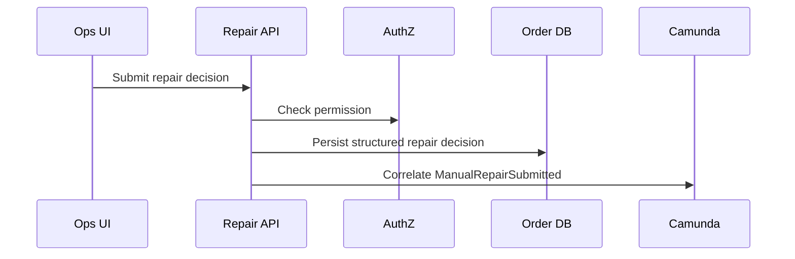

------
title: Learn Java Microservices CPQ/OMS Platform - Part 020
description: Designing Camunda 7 Java delegates, workers, command handlers, transaction boundaries, idempotency, retries, outbox/inbox, and failure classification for production-grade CPQ/OMS orchestration.
series: learn-java-microservices-cpq-oms-platform
seriesTitle: Learn Java Microservices CPQ/OMS Platform
order: 20
partTitle: Camunda Workers, Delegates, and Transaction Boundaries
tags:
- java
- microservices
- cpq
- oms
- camunda-7
- delegates
- external-task
- transaction-boundary
- idempotency
- kafka
- postgresql
date: 2026-07-02
---

# Part 020 — Camunda Workers, Delegates, and Transaction Boundaries

## 1. What This Part Solves

In Part 019, we designed the BPMN shape for order orchestration. This part goes one layer deeper:

> How should Java code execute Camunda steps without corrupting order state, duplicating side effects, or coupling business logic to the workflow engine?

The key danger is that Camunda can retry jobs. Retrying is useful only if handlers are idempotent and transaction boundaries are explicit.

The core rule:

> **A Camunda delegate should be a thin adapter. Business behavior belongs in application services and command handlers. Durable side effects must be idempotent. Published events must go through outbox/inbox discipline.**

---

## 2. The Three Execution Styles

Camunda 7 can interact with Java logic in several ways. For this platform, think in three categories.

| Style | Description | Good For | Risk |
|---|---|---|---|
| Java Delegate | Engine calls Java class inside process execution | Simple internal service task | Tight coupling to engine transaction |
| Delegate Expression | Engine resolves bean and invokes it | DI-friendly internal command adapter | Hidden bean lifecycle/config issues |
| External Task Worker | Worker polls and completes work externally | Decoupled long-running/external integration | More moving parts and lock handling |

In CPQ/OMS, use:

- Java delegates for small internal domain commands.
- External tasks for slow, unstable, or separately scaled integration work.
- Message events for responses from async systems.
- Kafka consumers for event-to-domain updates and event-to-Camunda correlation.

Do not use one execution style for everything.

---

## 3. Target Runtime Interaction



The delegate does not publish directly to Kafka. It inserts durable business state and outbox records within the same service transaction.

---

## 4. Delegate as Adapter, Not Domain Logic

Bad delegate:

```java
public class ReserveResourcesDelegate implements JavaDelegate {
    @Override
    public void execute(DelegateExecution execution) {
        // loads order
        // calculates rules
        // updates many tables
        // calls external inventory API
        // publishes Kafka event
        // catches exceptions randomly
        // sets process variables
    }
}
```

Good delegate:

```java
public final class ReserveResourcesDelegate implements JavaDelegate {

    private final ReserveResourcesHandler handler;
    private final BpmnVariableReader variableReader;
    private final BpmnVariableWriter variableWriter;

    @Override
    public void execute(DelegateExecution execution) {
        ReserveResourcesCommand command = variableReader.reserveResourcesCommand(execution);
        ReserveResourcesResult result = handler.handle(command);
        variableWriter.writeReserveResourcesResult(execution, result);
    }
}
```

The delegate is now:

- small,
- testable,
- replaceable,
- free from SQL details,
- and not the source of domain rules.

---

## 5. Command Handler Contract

A command handler should represent a single workflow activity.

```java
public interface WorkflowCommandHandler<C, R> {
    R handle(C command);
}
```

Example command:

```java
public record ReserveResourcesCommand(
    UUID tenantId,
    UUID orderId,
    UUID orchestrationId,
    UUID fulfillmentPlanId,
    String idempotencyKey,
    String traceId
) {}
```

Example result:

```java
public record ReserveResourcesResult(
    ReserveOutcome outcome,
    String reasonCode,
    UUID reservationId,
    boolean retryable
) {}

public enum ReserveOutcome {
    RESERVED,
    BUSINESS_REJECTED,
    RETRYABLE_FAILURE,
    NEEDS_MANUAL_REPAIR
}
```

The command/result boundary is important because it prevents the delegate from passing raw Camunda objects deeper into the application.

---

## 6. Camunda Object Containment

Do not let these types escape into domain/application layers:

- `DelegateExecution`
- `ProcessEngine`
- `RuntimeService`
- `TaskService`
- `HistoryService`
- `ExternalTask`
- `ExternalTaskService`

Allowed layer:

```text
workflow adapter package
```

Forbidden layer:

```text
domain model
application command handler
repository
pricing engine
order aggregate
catalog logic
```

Recommended package boundary:

```text
com.example.order.workflow.camunda      // Camunda-specific adapters
com.example.order.workflow.command      // Camunda-neutral workflow commands
com.example.order.application           // business application services
com.example.order.domain                // domain model
com.example.order.persistence           // MyBatis/repositories
```

---

## 7. Transaction Boundary Models

There are four important transaction scopes.

### 7.1 Camunda Engine Transaction

The process engine transaction persists:

- activity progress,
- variables,
- jobs,
- incidents,
- task state.

### 7.2 Service Database Transaction

The order service transaction persists:

- order aggregate changes,
- line transitions,
- fulfillment plan changes,
- audit records,
- idempotency records,
- outbox events.

### 7.3 External System Transaction

A downstream system may persist:

- reservation,
- provisioning request,
- shipment order,
- activation request,
- billing request.

### 7.4 Kafka Publication

Kafka publication is not part of the PostgreSQL transaction unless using a carefully designed integration pattern. In this series, domain events are written to outbox first.



There is no single global transaction here. Correctness comes from idempotency, durable state, retry, and reconciliation.

---

## 8. The Dangerous Gap

Consider this sequence:

```text
1. Delegate updates order DB.
2. Delegate returns to Camunda.
3. Camunda fails to commit process transaction.
4. Camunda retries delegate.
5. Delegate updates order DB again.
```

Without idempotency, this creates duplicate side effects.

Therefore every delegate that changes durable state needs an idempotency guard.

---

## 9. Idempotency Table for Workflow Commands

```sql
create table workflow_command_execution (
    command_key text primary key,
    tenant_id uuid not null,
    order_id uuid not null,
    command_type text not null,
    status text not null,
    result_json jsonb,
    failure_code text,
    created_at timestamptz not null,
    updated_at timestamptz not null
);
```

Execution states:

```text
STARTED
COMPLETED
FAILED_RETRYABLE
FAILED_PERMANENT
```

### 9.1 Idempotent Handler Shape

```java
public ReserveResourcesResult handle(ReserveResourcesCommand command) {
    return workflowCommandExecutor.execute(
        command.idempotencyKey(),
        "RESERVE_RESOURCES",
        command.tenantId(),
        command.orderId(),
        () -> reserveResourcesOnce(command),
        ReserveResourcesResult.class
    );
}
```

The executor:

1. tries to insert `STARTED`,
2. if existing `COMPLETED`, returns stored result,
3. if existing `STARTED` and stale, applies safe recovery policy,
4. executes once,
5. stores result,
6. commits in the same transaction as domain changes where possible.

---

## 10. Idempotency Key Design

A weak key creates either duplicates or false conflicts.

| Command | Idempotency Key |
|---|---|
| Validate readiness | `validate-readiness:{orderId}:{orderVersion}` |
| Build fulfillment plan | `build-plan:{orderId}` |
| Reserve resources | `reserve:{orderId}:{fulfillmentPlanId}` |
| Submit line fulfillment | `submit-line:{orderId}:{orderLineId}:{stepId}` |
| Activate order | `activate-order:{orderId}` |
| Complete order | `complete-order:{orderId}` |
| Create repair task | `repair-task:{orderId}:{failureCode}:{activityId}` |

Do not base keys only on Camunda job ID. A retried or migrated process may have different engine-level IDs while representing the same business command.

---

## 11. Retry Classification

Retries only help when the failure is transient.

| Failure | Retry? | Example |
|---|---:|---|
| Database connection failure | Yes | DB temporarily unavailable |
| HTTP timeout | Yes | Fulfillment API timeout |
| Kafka broker unavailable for outbox publisher | Yes | Publisher retries separately |
| Optimistic lock | Yes | Concurrent line transition |
| Invalid product code | No | Catalog/order mismatch |
| Missing required snapshot | No | Data corruption |
| Unauthorized downstream request | No until fixed | Credential/config problem |
| Customer not eligible | No | Business rejection |
| Serialization incompatible variable | No automatic retry | Migration/repair needed |

### 11.1 Exception Taxonomy

```java
public class WorkflowRetryableException extends RuntimeException {
    public WorkflowRetryableException(String message, Throwable cause) {
        super(message, cause);
    }
}

public class WorkflowBusinessException extends RuntimeException {
    private final String reasonCode;

    public WorkflowBusinessException(String reasonCode, String message) {
        super(message);
        this.reasonCode = reasonCode;
    }

    public String reasonCode() {
        return reasonCode;
    }
}

public class WorkflowIncidentException extends RuntimeException {
    private final String incidentCode;

    public WorkflowIncidentException(String incidentCode, String message, Throwable cause) {
        super(message, cause);
        this.incidentCode = incidentCode;
    }

    public String incidentCode() {
        return incidentCode;
    }
}
```

The adapter decides how to map exception to BPMN result, BPMN error, or Camunda incident.

---

## 12. Business Failure vs Technical Incident

Do not throw generic exceptions for expected business outcomes.

Bad:

```java
throw new RuntimeException("Reservation rejected");
```

Good:

```java
return new ReserveResourcesResult(
    ReserveOutcome.BUSINESS_REJECTED,
    "RESOURCE_UNAVAILABLE",
    null,
    false
);
```

The BPMN gateway routes based on `outcome`.

Technical incident:

```java
throw new WorkflowRetryableException("Inventory service timed out", cause);
```

Permanent data corruption:

```java
throw new WorkflowIncidentException(
    "ORDER_SNAPSHOT_MISSING",
    "Order cannot be fulfilled because commercial snapshot is missing",
    null
);
```

---

## 13. BPMN Error Usage

Use BPMN errors for expected alternate business paths.

Example:

```java
throw new BpmnError("RESERVATION_REJECTED", "Inventory rejected reservation");
```

But be careful: overusing BPMN errors makes Java code depend heavily on process model details.

Alternative:

- command returns structured result,
- delegate sets `reserveOutcome`,
- BPMN gateway routes.

For CPQ/OMS, prefer structured result for most decision paths. Use BPMN error when the alternate path is truly a process-level exception and should be visually explicit.

---

## 14. Java Delegate Example

```java
public final class ValidateOrderReadinessDelegate implements JavaDelegate {

    private final ValidateOrderReadinessHandler handler;

    public ValidateOrderReadinessDelegate(ValidateOrderReadinessHandler handler) {
        this.handler = handler;
    }

    @Override
    public void execute(DelegateExecution execution) {
        WorkflowVariables vars = WorkflowVariables.from(execution);

        ValidateOrderReadinessCommand command = new ValidateOrderReadinessCommand(
            vars.tenantId(),
            vars.orderId(),
            vars.orchestrationId(),
            "validate-readiness:" + vars.orderId(),
            vars.traceId()
        );

        ValidateOrderReadinessResult result = handler.handle(command);

        execution.setVariable("readinessOutcome", result.outcome().name());
        execution.setVariable("readinessReasonCode", result.reasonCode());
    }
}
```

Notice:

- no SQL in delegate,
- no domain rule in delegate,
- no Kafka publishing in delegate,
- no full order object in variables.

---

## 15. Application Handler Example

```java
public final class ValidateOrderReadinessHandler {

    private final OrderRepository orderRepository;
    private final WorkflowCommandExecutionRepository executionRepository;
    private final OutboxRepository outboxRepository;
    private final Clock clock;

    public ValidateOrderReadinessResult handle(ValidateOrderReadinessCommand command) {
        return executionRepository.executeIdempotently(
            command.idempotencyKey(),
            command.tenantId(),
            command.orderId(),
            "VALIDATE_ORDER_READINESS",
            ValidateOrderReadinessResult.class,
            () -> validateOnce(command)
        );
    }

    private ValidateOrderReadinessResult validateOnce(ValidateOrderReadinessCommand command) {
        Order order = orderRepository.findForUpdate(command.tenantId(), command.orderId());

        ValidateOrderReadinessResult result = order.validateReadiness();

        orderRepository.appendTransitionHistory(
            command.orderId(),
            "READINESS_EVALUATED",
            result.outcome().name(),
            result.reasonCode(),
            clock.instant()
        );

        outboxRepository.insert(OrderReadinessEvaluatedEvent.from(command, result));

        return result;
    }
}
```

In reality, `executeIdempotently` and `validateOnce` must participate in the same transaction.

---

## 16. MyBatis Mapper for Idempotency

```xml
<insert id="insertStarted">
  insert into workflow_command_execution (
      command_key,
      tenant_id,
      order_id,
      command_type,
      status,
      created_at,
      updated_at
  )
  values (
      #{commandKey},
      #{tenantId},
      #{orderId},
      #{commandType},
      'STARTED',
      now(),
      now()
  )
</insert>

<select id="findByCommandKey" resultMap="WorkflowCommandExecutionMap">
  select command_key,
         tenant_id,
         order_id,
         command_type,
         status,
         result_json,
         failure_code,
         created_at,
         updated_at
  from workflow_command_execution
  where command_key = #{commandKey}
</select>

<update id="markCompleted">
  update workflow_command_execution
  set status = 'COMPLETED',
      result_json = #{resultJson, typeHandler=com.example.JsonbTypeHandler},
      updated_at = now()
  where command_key = #{commandKey}
</update>
```

---

## 17. External Task Worker Pattern

External tasks are useful when:

- the work is slow,
- worker needs independent scaling,
- worker runtime differs from process app,
- integration calls are unstable,
- or you want stronger isolation from engine transaction.



Dangerous gap remains:

```text
handler succeeds, worker fails to complete external task, Camunda unlocks, worker retries.
```

Therefore external task handlers also need idempotency.

---

## 18. External Side Effects

Calling external systems is the hardest boundary.

### 18.1 Preferred Pattern: Submit Request Once, Wait for Event



This decouples the process engine from direct network instability.

### 18.2 Acceptable Pattern: Delegate Calls External Idempotent API

Only acceptable if:

- external API has idempotency key,
- timeout behavior is understood,
- duplicate request is safe,
- response is persisted,
- retry policy is bounded,
- reconciliation can query external status.

---

## 19. Outbox Inside Workflow Command

A workflow command that changes domain state should usually write an outbox event.

Example:

```sql
insert into outbox_event (
    event_id,
    aggregate_type,
    aggregate_id,
    event_type,
    event_version,
    payload_json,
    idempotency_key,
    status,
    created_at
)
values (
    gen_random_uuid(),
    'ORDER',
    :orderId,
    'OrderReadinessEvaluated',
    1,
    :payloadJson,
    :idempotencyKey,
    'PENDING',
    now()
);
```

The same transaction must include:

- domain state change,
- command execution state,
- audit record,
- outbox event.



---

## 20. Inbox Before Correlation

When Kafka events resume a BPMN process, use inbox first.

```sql
create table inbox_event (
    event_id uuid primary key,
    event_type text not null,
    aggregate_id uuid not null,
    received_at timestamptz not null,
    processed_at timestamptz,
    status text not null,
    failure_code text
);
```

Processing:

1. insert event into inbox,
2. if duplicate, stop,
3. apply domain transition,
4. correlate Camunda message,
5. mark inbox processed.

If correlation fails because the process is not ready, classify it:

| Situation | Action |
|---|---|
| Process not yet at wait state, event valid | retry correlation later |
| Process already completed, event duplicate | mark ignored |
| Wrong order/process key | incident |
| Domain state already terminal | ignore or audit |
| Message version unsupported | dead-letter/repair |

---

## 21. Variable Writing Discipline

Only write variables needed by BPMN routing or diagnostics.

Good:

```java
execution.setVariable("reserveOutcome", "RESERVED");
execution.setVariable("reservationId", reservationId.toString());
execution.setVariable("reserveReasonCode", null);
```

Bad:

```java
execution.setVariable("reservationResponse", hugeExternalApiResponse);
execution.setVariable("order", orderDomainObject);
execution.setVariable("handler", handlerInstance);
```

### 21.1 Serialization Safety

Avoid serializing arbitrary Java objects as process variables. Store primitives and JSON strings only when necessary.

Recommended types:

- String
- Boolean
- Integer/Long
- ISO timestamp string
- UUID as string
- small enum string
- compact JSON with explicit schema version

---

## 22. Process Variable Reader/Writer

Centralize variable access.

```java
public final class WorkflowVariables {

    private final UUID tenantId;
    private final UUID orderId;
    private final UUID orchestrationId;
    private final String traceId;

    public static WorkflowVariables from(DelegateExecution execution) {
        return new WorkflowVariables(
            UUID.fromString(requiredString(execution, "tenantId")),
            UUID.fromString(requiredString(execution, "orderId")),
            UUID.fromString(requiredString(execution, "orchestrationId")),
            optionalString(execution, "traceId")
        );
    }

    private static String requiredString(DelegateExecution execution, String name) {
        Object value = execution.getVariable(name);
        if (!(value instanceof String s) || s.isBlank()) {
            throw new WorkflowIncidentException(
                "MISSING_PROCESS_VARIABLE",
                "Required process variable missing: " + name,
                null
            );
        }
        return s;
    }
}
```

This prevents scattered variable parsing logic.

---

## 23. Timeout Budget

Camunda job retry is not a substitute for timeout design.

For each delegate/worker:

| Activity | Max Execution Time | Retry Policy | Incident Threshold |
|---|---:|---|---|
| Validate order readiness | < 1s | retry DB errors | after 3 attempts |
| Build fulfillment plan | < 2s | retry DB/catalog cache errors | after 3 attempts |
| Reserve resources | < 5s or async | retry transient external error | after bounded attempts |
| Submit fulfillment | Prefer async | retry publish/adapter error | after bounded attempts |
| Complete order | < 1s | retry DB optimistic locks | after 3 attempts |

If an activity needs minutes, it should probably not be a synchronous Java delegate.

---

## 24. Retry Storm Prevention

A failed downstream system can cause Camunda jobs to retry aggressively.

Controls:

- exponential backoff,
- per-activity retry policy,
- circuit breaker in adapter,
- bulkhead for external calls,
- queue depth alerts,
- incident threshold,
- operator pause/suspension,
- idempotent command guard,
- and reconciliation.



---

## 25. Locking and Concurrency

Camunda can execute parallel paths. Multiple delegates may touch the same order.

Protect domain state with:

- aggregate version,
- row-level lock where needed,
- unique constraints,
- transition guards,
- idempotency keys,
- and command serialization for sensitive operations.

Example:

```sql
update orders
set status = 'COMPLETED',
    version = version + 1,
    updated_at = now()
where order_id = :orderId
  and tenant_id = :tenantId
  and status = 'ACTIVATING'
  and version = :expectedVersion;
```

If update count is zero, reload and classify:

- already completed: idempotent success,
- cancelled: business conflict,
- different state: incident or retry depending on transition.

---

## 26. Delegate Retry and Domain Transition

A state transition method should be idempotent where business semantics allow.

```java
public CompleteOrderResult completeOrder(UUID orderId, String idempotencyKey) {
    Order order = orderRepository.findForUpdate(orderId);

    if (order.status() == OrderStatus.COMPLETED) {
        return CompleteOrderResult.alreadyCompleted();
    }

    if (order.status() != OrderStatus.ACTIVATING) {
        throw new WorkflowBusinessException(
            "INVALID_ORDER_STATE",
            "Order cannot be completed from state " + order.status()
        );
    }

    order.complete();
    orderRepository.save(order);
    outboxRepository.insert(OrderCompletedEvent.from(order, idempotencyKey));

    return CompleteOrderResult.completed();
}
```

---

## 27. Deployment Boundary

If Camunda is embedded in the order service, deployment couples:

- BPMN version,
- delegate classes,
- service configuration,
- process engine library,
- and order service release.

If Camunda is shared/remote, deployment couples differently:

- process app deployment,
- shared engine availability,
- service adapters,
- job executor configuration,
- classpath isolation.

For this build-from-scratch series, a pragmatic baseline:

```text
Order process application contains BPMN + workflow adapters.
Order service contains domain/application/persistence.
Shared libraries contain only stable platform abstractions.
```

Avoid deploying BPMN that references delegate classes not present in runtime.

---

## 28. Backward Compatibility of Delegates

Long-running process instances may execute old activity IDs after new code is deployed.

Do not rename activity IDs casually.

Safe practices:

- version process definitions,
- keep old delegate beans until old instances finish,
- avoid changing variable meanings,
- add defaults for new variables,
- keep mapper compatibility for old result schemas,
- maintain support for old event names until drained.

---

## 29. Observability

Each delegate/worker execution should log:

- process instance ID,
- process definition key/version,
- activity ID,
- business key,
- order ID,
- tenant ID,
- command key,
- trace ID,
- attempt count if available,
- outcome,
- duration,
- failure code.

Example structured log:

```json
{
  "event": "workflow_command_completed",
  "processDefinitionKey": "order-orchestration-v1",
  "activityId": "reserve-resources",
  "businessKey": "018f7c84-2bbd-7c3e-b228-6a9416d338d2",
  "orderId": "018f7c84-2bbd-7c3e-b228-6a9416d338d2",
  "tenantId": "018f7c84-2bbd-7c3e-b228-6a9416d338d1",
  "commandKey": "reserve:018f7c84-2bbd-7c3e-b228-6a9416d338d2:018f7c84-2bbd-7c3e-b228-6a9416d338d4",
  "outcome": "RESERVED",
  "durationMs": 184
}
```

Metrics:

| Metric | Purpose |
|---|---|
| `workflow.delegate.duration` | Detect slow handlers |
| `workflow.delegate.failure.count` | Detect broken activities |
| `workflow.command.idempotent_hit.count` | Detect retries/duplicates |
| `workflow.incident.count` | Operations alert |
| `workflow.message.correlation.failure.count` | Event/process mismatch |
| `workflow.external_task.lock_expired.count` | Worker too slow or crashing |

---

## 30. Security Boundary

A delegate runs with system authority, but business actions still need accountability.

Track:

- process initiator,
- command actor type,
- user/system origin,
- tenant ID,
- reason code,
- approval evidence,
- repair operator ID.

Do not let a Camunda task completion directly mutate domain state without application authorization checks.

Human task completion flow:



Avoid exposing Camunda REST API directly to business users for domain-changing operations unless wrapped with domain authorization and validation.

---

## 31. Failure Matrix

| Failure Point | Example | Required Protection |
|---|---|---|
| Before handler starts | Camunda job retry | no side effect yet |
| After DB commit, before Camunda commit | Duplicate delegate execution | idempotency table |
| After external call, before DB commit | Unknown external side effect | external idempotency + reconciliation |
| After outbox insert, before Kafka publish | Event pending | outbox publisher retry |
| After Kafka consume, before Camunda correlation | Domain updated, process not resumed | inbox retry |
| After Camunda correlation, before inbox mark processed | duplicate consume | inbox idempotency |
| Worker crashes after completing external side effect | duplicate task execution | idempotent external request |
| Variable schema changed | process incident | variable versioning/migration |

---

## 32. Repairability

Every failed workflow command should answer:

1. Did domain state change?
2. Did external side effect happen?
3. Was outbox event written?
4. Was Kafka event published?
5. Was Camunda process advanced?
6. Can the command be retried?
7. Does retry create duplicate effect?
8. Is manual repair required?
9. What operator evidence is needed?
10. Which reconciliation job can verify it?

If you cannot answer these, the workflow is not production-ready.

---

## 33. Testing Strategy

### 33.1 Delegate Unit Test

```java
@Test
void validateReadinessSetsOutcomeVariable() {
    DelegateExecution execution = fakeExecution()
        .withVariable("tenantId", tenantId.toString())
        .withVariable("orderId", orderId.toString())
        .withVariable("orchestrationId", orchestrationId.toString());

    when(handler.handle(any()))
        .thenReturn(new ValidateOrderReadinessResult(READY, null));

    delegate.execute(execution);

    assertThat(execution.getVariable("readinessOutcome")).isEqualTo("READY");
}
```

### 33.2 Handler Integration Test

Use PostgreSQL/Testcontainers-style integration:

```text
given captured order
when ValidateOrderReadinessHandler handles command
then workflow_command_execution is COMPLETED
and transition history is inserted
and outbox event exists
```

### 33.3 Retry Test

```text
given command completed once
when same command key is handled again
then stored result is returned
and no duplicate outbox event is inserted
```

### 33.4 Unknown External Outcome Test

```text
given external API timed out after receiving idempotency key
when worker retries
then adapter queries external status or resubmits same idempotency key
and does not create duplicate reservation
```

---

## 34. Production Checklist

- [ ] Delegates contain adapter logic only.
- [ ] Command handlers are Camunda-neutral.
- [ ] Domain state changes and outbox writes are in one transaction.
- [ ] Kafka publishing is not done directly from delegate.
- [ ] Every side-effecting command has idempotency key.
- [ ] Every external request uses idempotency or reconciliation.
- [ ] BPMN variables are primitive/small/versioned.
- [ ] Business failures are not generic exceptions.
- [ ] Retryable and permanent failures are classified.
- [ ] Long-running work uses async/event/external-task design.
- [ ] Old process versions can still find required delegate code.
- [ ] Message consumers use inbox before correlation.
- [ ] Incidents contain enough data for safe repair.
- [ ] Logs/metrics include process, activity, order, tenant, and command key.
- [ ] Human task completion goes through domain API and authorization.

---

## 35. Practice Exercise

Implement these artifacts:

```text
workflow/
  camunda/
    ValidateOrderReadinessDelegate.java
    BuildFulfillmentPlanDelegate.java
    ReserveResourcesDelegate.java
    WorkflowVariables.java
    WorkflowResultWriter.java

  command/
    ValidateOrderReadinessCommand.java
    ValidateOrderReadinessResult.java
    ReserveResourcesCommand.java
    ReserveResourcesResult.java
    WorkflowCommandHandler.java

application/
  ValidateOrderReadinessHandler.java
  ReserveResourcesHandler.java

persistence/
  WorkflowCommandExecutionMapper.xml
  OutboxEventMapper.xml
```

Then prove:

1. A Camunda retry after DB commit does not duplicate business effects.
2. A duplicate Kafka event does not duplicate domain transition.
3. A failed external call is classified retryable/permanent correctly.
4. A business rejection routes through BPMN without creating an incident.
5. A missing required variable creates a controlled incident.
6. A handler can be unit tested without Camunda.

---

## 36. Key Takeaways

- Camunda delegates should be thin adapters.
- Business logic belongs in command handlers and domain services.
- Camunda transaction, service DB transaction, external side effect, and Kafka publication are separate concerns.
- Idempotency is mandatory for every side-effecting workflow command.
- Outbox/inbox is the backbone of reliable event-driven orchestration.
- BPMN errors are for process-level alternate paths, not random Java exceptions.
- Long-running or unstable work should be async, message-driven, or external-task based.
- Process variables should be small, stable, and versioned.
- Production workflow design is mostly about failure classification, retry safety, and repairability.
