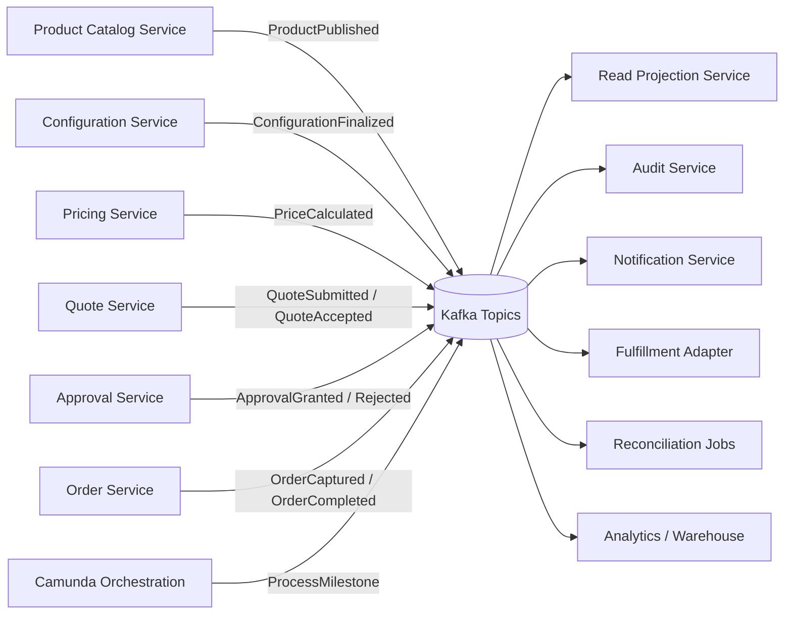
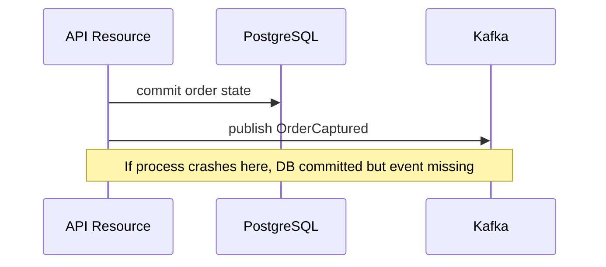
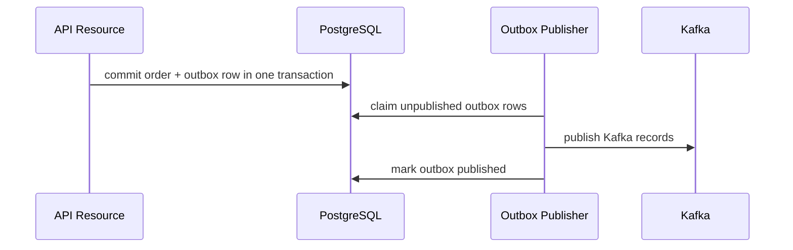
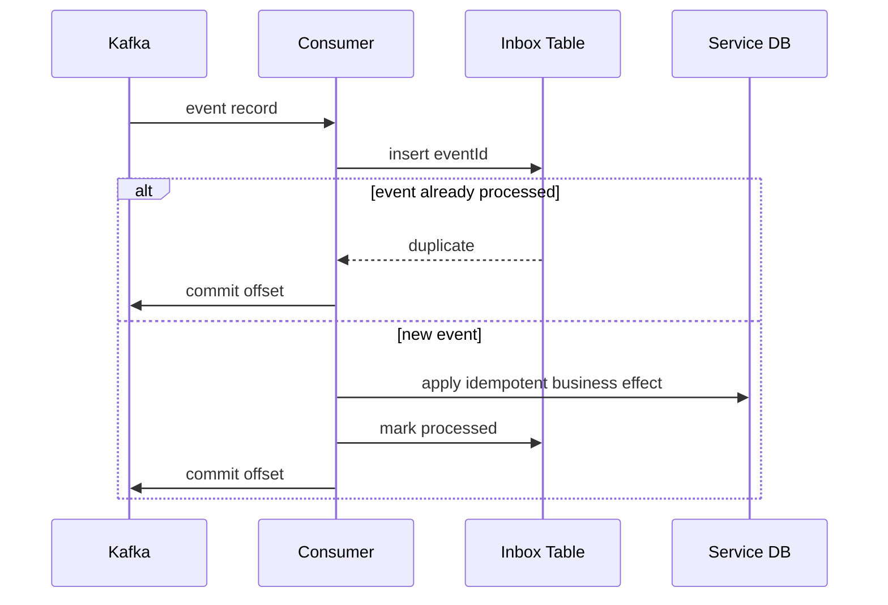
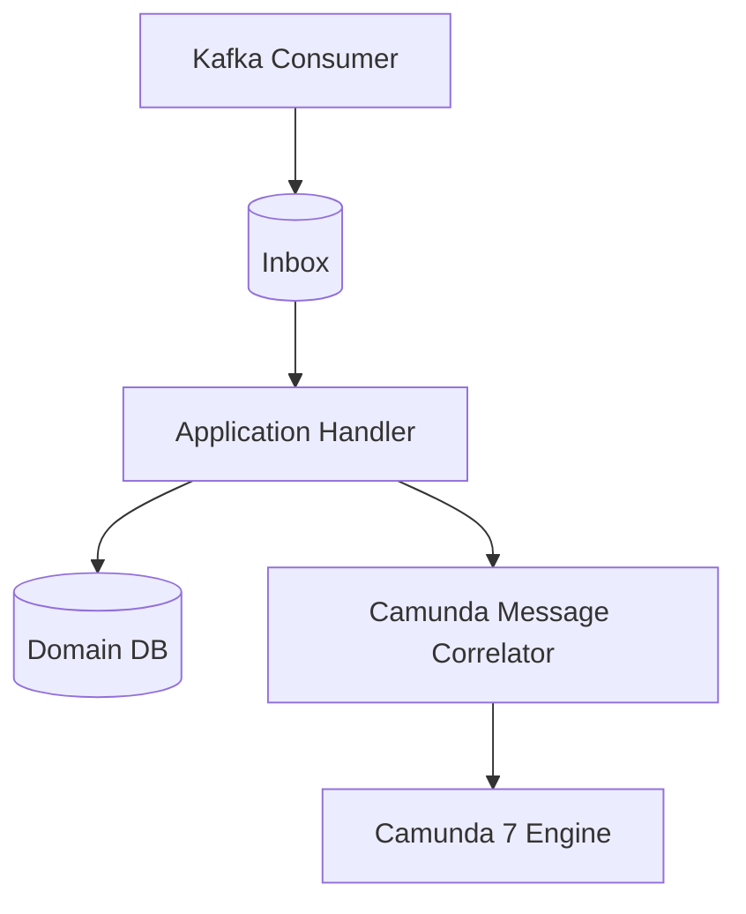
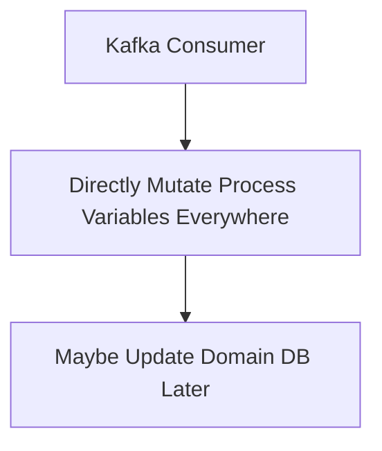
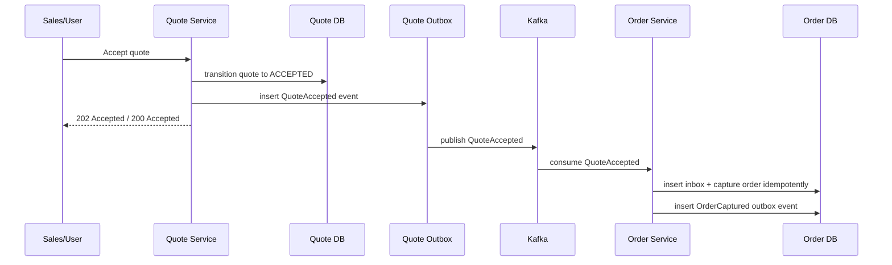
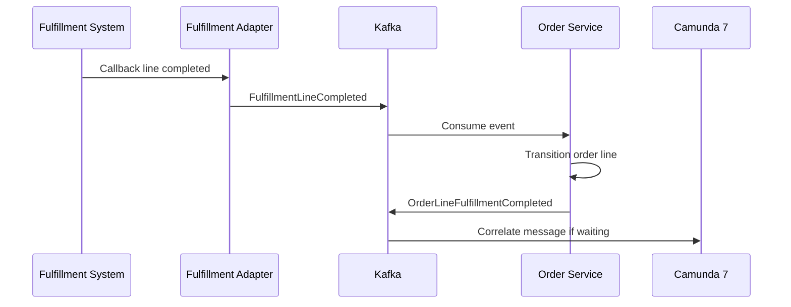

------
title: Learn Java Microservices CPQ/OMS Platform - Part 021
description: Designing Kafka as the event backbone for a Java microservices CPQ and order management platform: topic taxonomy, event envelope, partitioning, producer/consumer contracts, ordering, replay, and operational guardrails.
series: learn-java-microservices-cpq-oms-platform
seriesTitle: Learn Java Microservices CPQ/OMS Platform
order: 21
partTitle: Kafka Event Backbone
tags:
- java
- microservices
- cpq
- oms
- kafka
- event-driven-architecture
- event-contracts
- distributed-systems
- outbox
- observability
date: 2026-07-02
---

# Part 021 — Kafka Event Backbone

## 1. What This Part Solves

In Part 020, we placed Camunda delegates and workers behind explicit transaction boundaries.
Now we need a durable event backbone that lets services communicate facts without turning every service into a synchronous dependency of every other service.

This part answers:

> How should Kafka be used in a CPQ/OMS platform so that events are stable contracts, ordering is intentional, consumers are idempotent, and operations can replay or repair without inventing business state?

The main rule:

> **Kafka is not a distributed method call. Kafka is a durable log of business facts and integration signals. Design every topic, key, event envelope, and consumer as if it will be replayed during a real incident.**

For this platform, Kafka carries facts such as:

- `ProductPublished`
- `ConfigurationFinalized`
- `PriceCalculated`
- `QuoteSubmitted`
- `QuoteApproved`
- `OrderCaptured`
- `OrderLineFulfillmentRequested`
- `OrderLineFulfillmentCompleted`
- `OrderCompleted`

Kafka must not become:

- a hidden RPC bus;
- a dumping ground for arbitrary JSON;
- a place where command semantics and event semantics are mixed carelessly;
- a substitute for service-owned transactional data;
- a mechanism for bypassing domain invariants.

---

## 2. Kaufman Skill Deconstruction

To become effective with Kafka in this platform, do not start from broker internals.
Start from the business and operational skill you need.

| Skill Area | Concrete Capability | Why It Matters |
|---|---|---|
| Event modeling | Model facts, not intentions | Prevents command/event confusion |
| Topic ownership | Assign topic ownership to producing service | Prevents shared integration chaos |
| Key design | Preserve ordering where business needs it | Prevents invalid lifecycle transitions |
| Schema discipline | Evolve events without breaking consumers | Enables long-lived platform evolution |
| Producer reliability | Publish only after DB commit | Prevents ghost events |
| Consumer reliability | Make every effect idempotent | Handles redelivery and replay |
| Replay discipline | Rebuild projections safely | Enables recovery and analytics |
| Operational visibility | Monitor lag, errors, DLTs, and throughput | Prevents silent data drift |

A top-tier engineer does not merely know how to call `producer.send()`.
A top-tier engineer can explain what business fact an event represents, why it belongs to a topic, why its key was chosen, what happens when the consumer fails halfway, and how to replay it without corrupting the platform.

---

## 3. Kafka Mental Model for CPQ/OMS

Kafka is best treated as a set of ordered append-only logs.
A topic is split into partitions.
Records inside a partition are ordered.
Records across different partitions are not globally ordered.

For CPQ/OMS, this has a direct architectural consequence:

> **If two events must be processed in order for the same business entity, they must use the same topic partitioning key.**

For example:

- quote lifecycle events should usually be keyed by `quoteId`;
- order lifecycle events should usually be keyed by `orderId`;
- order line events may be keyed by `orderId` if cross-line coordination matters;
- catalog publication events may be keyed by `catalogVersionId` or `productId`, depending on the consumer pattern;
- approval events may be keyed by `approvalCaseId` or `quoteId`, depending on the state machine owner.

A Kafka record should be treated as durable evidence that something happened, not as a temporary notification.

---

## 4. Target Event Architecture



The event backbone connects services without forcing synchronous availability.
But each service still owns its own data and its own invariants.

Kafka should not own business truth.
Kafka distributes committed truth.

---

## 5. Topic Taxonomy

A CPQ/OMS platform needs topic categories, not ad hoc topic names.

| Topic Category | Example | Purpose | Retention Style |
|---|---|---|---|
| Domain events | `cpq.quote.events.v1` | Facts emitted by aggregate owner | Long retention |
| Integration events | `oms.fulfillment.integration.v1` | Events crossing external system boundary | Medium/long retention |
| Projection rebuild | Same as domain topics | Rebuild read models | Long enough for rebuild |
| Retry topics | `cpq.quote.events.retry.5m.v1` | Delayed retry pipeline | Short/medium |
| Dead-letter topics | `cpq.quote.events.dlt.v1` | Failed records requiring triage | Medium/long |
| Audit export topics | `audit.business-events.v1` | Compliance/audit stream | Long retention or downstream archive |
| Operational topics | `platform.service-health.v1` | Non-domain operational messages | Short retention |

Prefer service-owned domain topics:

```text
cpq.catalog.events.v1
cpq.configuration.events.v1
cpq.pricing.events.v1
cpq.quote.events.v1
cpq.approval.events.v1
oms.order.events.v1
oms.orchestration.events.v1
oms.fulfillment.events.v1
```

Avoid topic names like:

```text
events
notifications
orders
updates
backend-events
misc
```

Those names hide ownership and semantics.

---

## 6. Public vs Private Topics

Not every event deserves to become a public platform contract.

| Topic Type | Visibility | Compatibility Requirement | Example |
|---|---|---|---|
| Public domain topic | Cross-service consumers allowed | Strong | `oms.order.events.v1` |
| Private service topic | Owned by one service internals | Moderate | `quote.internal.reprice-requests.v1` |
| Integration topic | Boundary with external system | Strong + mapped to partner contract | `oms.fulfillment.integration.v1` |
| Operational topic | Platform/internal visibility | Low/moderate | `platform.dead-letter-alerts.v1` |

A public topic is an API.
Changing it carelessly is equivalent to breaking a public HTTP endpoint.

---

## 7. Event Naming Rules

Events should be past-tense facts.

Good names:

```text
QuoteSubmitted
QuoteApprovalRequested
QuoteApproved
QuoteRejected
QuoteAccepted
OrderCaptured
OrderValidated
OrderSubmittedForFulfillment
OrderLineFulfillmentCompleted
OrderCompleted
```

Poor names:

```text
SubmitQuote
ApproveQuote
ProcessOrder
DoFulfillment
UpdateOrder
SyncData
```

The difference matters.

- `SubmitQuote` sounds like a command.
- `QuoteSubmitted` says the quote owner already committed the transition.
- `UpdateOrder` is too vague to be useful for replay or audit.

Event names should answer:

1. What business fact happened?
2. Which aggregate owns that fact?
3. Is this fact stable enough for other services to react to?
4. Is the event meaningful without reading the producer database?

---

## 8. Standard Event Envelope

Every public event should have a stable envelope.
The payload can vary by event type, but the envelope should be boring and consistent.

```json
{
  "eventId": "01JZ9XFKNTZCMA8T2GDF5NJ7HG",
  "eventType": "OrderCaptured",
  "eventVersion": 1,
  "occurredAt": "2026-07-02T08:15:30.481Z",
  "publishedAt": "2026-07-02T08:15:31.002Z",
  "producer": "order-service",
  "tenantId": "tenant_001",
  "aggregateType": "Order",
  "aggregateId": "ord_9f5c0b4a",
  "aggregateVersion": 3,
  "correlationId": "corr_5c6df2",
  "causationId": "evt_quote_accepted_123",
  "traceId": "4bf92f3577b34da6a3ce929d0e0e4736",
  "schemaRef": "schema://oms.order.events/OrderCaptured/1",
  "payload": {
    "orderId": "ord_9f5c0b4a",
    "quoteId": "q_6a71",
    "customerId": "cust_1001",
    "capturedAt": "2026-07-02T08:15:30.481Z",
    "lineCount": 3,
    "commercialSnapshotHash": "sha256:..."
  },
  "metadata": {
    "sourceCommandId": "cmd_851",
    "idempotencyKey": "acceptance-req-7781",
    "actorType": "USER",
    "actorId": "user_42"
  }
}
```

### Envelope Field Rules

| Field | Rule |
|---|---|
| `eventId` | Globally unique and stable across retries |
| `eventType` | Past-tense fact name |
| `eventVersion` | Payload contract version, not aggregate version |
| `occurredAt` | Time the business fact happened |
| `publishedAt` | Time publisher emitted it to Kafka |
| `producer` | Service that owns the event |
| `tenantId` | Required for multi-tenant processing and audit |
| `aggregateId` | Entity whose lifecycle this event belongs to |
| `aggregateVersion` | Version after transition, useful for ordering checks |
| `correlationId` | End-to-end business request correlation |
| `causationId` | Event/command that caused this event |
| `traceId` | Observability trace propagation |
| `schemaRef` | Machine-readable schema identity |
| `payload` | Business-specific data |
| `metadata` | Operational/business metadata, not hidden domain state |

---

## 9. Event Payload Granularity

There are three common payload styles.

| Style | Description | Pros | Cons |
|---|---|---|---|
| Thin event | Only IDs and minimal facts | Small, stable | Consumers call back producer, creating coupling |
| Fat event | Includes full useful snapshot | Replay-friendly, fewer synchronous calls | Larger payload, more schema governance |
| Delta event | Includes changed fields only | Compact | Hard to replay, order-sensitive |

For CPQ/OMS public domain events, prefer **business-sufficient fat events**.
Not every event must contain the entire aggregate, but it should contain enough information for intended consumers to work without immediate synchronous callback.

Example:

- `QuoteSubmitted` should include quote id, version, customer, total, currency, validity period, approval signals, and snapshot hashes.
- `OrderCaptured` should include order id, quote id, customer id, line summaries, commercial snapshot hash, and accepted evidence reference.
- `ProductPublished` may include catalog version and product/offer summaries, while large full catalog data may be accessed from catalog read APIs or object storage.

The key question:

> Can a consumer rebuild its projection from the event stream without depending on the current mutable state of the producer?

If not, the event is probably too thin.

---

## 10. Topic Design for CPQ/OMS

### 10.1 Catalog Events

```text
Topic: cpq.catalog.events.v1
Key: catalogVersionId or productId depending on event type
Events:
- ProductDraftCreated
- ProductPublished
- ProductRetired
- OfferPublished
- CatalogVersionPublished
```

Catalog events are often consumed by configuration, pricing, search, and audit services.

Important design rule:

> A catalog publication event must identify a stable catalog version. Consumers should not infer current product validity from mutable current catalog rows.

### 10.2 Configuration Events

```text
Topic: cpq.configuration.events.v1
Key: configurationId
Events:
- ConfigurationStarted
- ConfigurationValidated
- ConfigurationFinalized
- ConfigurationExpired
```

Configuration events are mostly consumed by pricing and quote services.

Important design rule:

> `ConfigurationFinalized` must include a stable configuration snapshot hash.

### 10.3 Pricing Events

```text
Topic: cpq.pricing.events.v1
Key: pricingRunId or quoteId
Events:
- PriceCalculated
- PriceCalculationRejected
- PriceBookPublished
```

Pricing events must preserve deterministic calculation evidence.

Important design rule:

> Price events should include calculation inputs, selected price book version, discount policy version, currency, totals, and explanation references.

### 10.4 Quote Events

```text
Topic: cpq.quote.events.v1
Key: quoteId
Events:
- QuoteDraftCreated
- QuoteSubmitted
- QuoteApprovalRequested
- QuoteApproved
- QuoteRejected
- QuoteAccepted
- QuoteExpired
- QuoteCancelled
```

Quote events are a critical bridge between CPQ and OMS.

Important design rule:

> `QuoteAccepted` is not a casual notification. It is the primary fact that order capture may consume.

### 10.5 Order Events

```text
Topic: oms.order.events.v1
Key: orderId
Events:
- OrderCaptured
- OrderValidated
- OrderActivated
- OrderLineStarted
- OrderLineFulfillmentRequested
- OrderLineFulfillmentCompleted
- OrderLineFailed
- OrderCompleted
- OrderCancelled
```

Order events drive fulfillment adapters, customer notifications, audit, analytics, and internal read models.

Important design rule:

> Order lifecycle events should be keyed by `orderId` unless a downstream use case requires independent line ordering. If line events are keyed by `lineId`, consumers must not assume total order across lines.

---

## 11. Partition Key Strategy

Partition key choice is one of the most important Kafka decisions.
It controls ordering, parallelism, and hot-spot risk.

| Event Family | Recommended Key | Ordering Guarantee | Risk |
|---|---|---|---|
| Quote lifecycle | `quoteId` | All quote transitions ordered | Hot quote unlikely |
| Approval case lifecycle | `approvalCaseId` | Approval steps ordered | Join with quote requires correlation |
| Order lifecycle | `orderId` | All order transitions ordered | Large enterprise order can be hot |
| Order line lifecycle | `orderId` or `orderLineId` | Depends on chosen key | Cross-line ordering trade-off |
| Product publication | `productId` or `catalogVersionId` | Product/catalog update order | Large catalog publication burst |
| Customer-level events | `customerId` | Customer ordering | Large customers can be hot |

### 11.1 Rule of Thumb

Use the aggregate id as key when:

- events represent one aggregate lifecycle;
- transitions must be processed in order;
- aggregate write volume is not extreme.

Use a coarser key when:

- cross-aggregate ordering matters;
- a process coordinates multiple entities.

Use a finer key when:

- parallelism matters more than cross-entity ordering;
- consumers can tolerate eventual aggregation.

---

## 12. Ordering Invariants

Kafka ordering is partition-local.
A consumer group processes partitions in parallel.
Therefore, platform-level ordering must be explicit.

### 12.1 Quote Ordering

Invariant:

> A quote consumer must not apply `QuoteAccepted` before `QuoteApproved` for the same `quoteId` unless the quote policy allows auto-approval.

Implementation:

- key quote events by `quoteId`;
- include `aggregateVersion`;
- consumers track last processed version per quote;
- out-of-order version is parked or rejected.

### 12.2 Order Ordering

Invariant:

> An order cannot be completed until all required order lines are terminal-success or explicitly waived.

Implementation:

- key order lifecycle by `orderId`;
- include order version;
- line events include line id and order id;
- order state transition happens inside order service database, not in a random consumer projection.

### 12.3 Fulfillment Ordering

Invariant:

> A fulfillment adapter must not fulfill a line before its dependencies are satisfied.

Implementation:

- order service emits `OrderLineFulfillmentRequested` only after dependency check;
- fulfillment adapter treats event as request to external system;
- completion returns through integration event or callback;
- order service remains lifecycle owner.

---

## 13. Event Contract Example: OrderCaptured

```yaml
type: object
required:
  - eventId
  - eventType
  - eventVersion
  - occurredAt
  - producer
  - tenantId
  - aggregateType
  - aggregateId
  - payload
properties:
  eventId:
    type: string
  eventType:
    const: OrderCaptured
  eventVersion:
    const: 1
  occurredAt:
    type: string
    format: date-time
  producer:
    const: order-service
  tenantId:
    type: string
  aggregateType:
    const: Order
  aggregateId:
    type: string
  aggregateVersion:
    type: integer
    minimum: 1
  correlationId:
    type: string
  causationId:
    type: string
  payload:
    type: object
    required:
      - orderId
      - quoteId
      - customerId
      - capturedAt
      - currency
      - totals
      - lineSummaries
      - commercialSnapshotHash
    properties:
      orderId:
        type: string
      quoteId:
        type: string
      customerId:
        type: string
      capturedAt:
        type: string
        format: date-time
      currency:
        type: string
        minLength: 3
        maxLength: 3
      totals:
        type: object
        required: [oneTimeTotal, recurringTotal]
        properties:
          oneTimeTotal:
            type: string
            pattern: "^-?[0-9]+\\.[0-9]{2,6}$"
          recurringTotal:
            type: string
            pattern: "^-?[0-9]+\\.[0-9]{2,6}$"
      lineSummaries:
        type: array
        minItems: 1
        items:
          type: object
          required: [orderLineId, quoteLineId, offerId, action]
          properties:
            orderLineId:
              type: string
            quoteLineId:
              type: string
            offerId:
              type: string
            action:
              enum: [ADD, MODIFY, REMOVE]
      commercialSnapshotHash:
        type: string
```

This event is intentionally not just:

```json
{ "orderId": "ord_123" }
```

A thin ID-only event forces every consumer to call order service immediately.
That turns asynchronous eventing back into synchronous coupling.

---

## 14. Producer Design

A producer in this platform should not directly publish from business code after a database write.
That creates a dangerous gap:



Instead, use transactional outbox.
Part 022 covers it deeply, but the producer shape matters here:



The event backbone assumes events originate from committed domain state.

---

## 15. Producer Configuration Baseline

A Java Kafka producer for domain events should be conservative.

```java
Properties props = new Properties();
props.put(ProducerConfig.BOOTSTRAP_SERVERS_CONFIG, bootstrapServers);
props.put(ProducerConfig.CLIENT_ID_CONFIG, "order-service-outbox-publisher");
props.put(ProducerConfig.KEY_SERIALIZER_CLASS_CONFIG, StringSerializer.class.getName());
props.put(ProducerConfig.VALUE_SERIALIZER_CLASS_CONFIG, StringSerializer.class.getName());

props.put(ProducerConfig.ACKS_CONFIG, "all");
props.put(ProducerConfig.ENABLE_IDEMPOTENCE_CONFIG, "true");
props.put(ProducerConfig.RETRIES_CONFIG, Integer.toString(Integer.MAX_VALUE));
props.put(ProducerConfig.DELIVERY_TIMEOUT_MS_CONFIG, "120000");
props.put(ProducerConfig.REQUEST_TIMEOUT_MS_CONFIG, "30000");
props.put(ProducerConfig.LINGER_MS_CONFIG, "10");
props.put(ProducerConfig.BATCH_SIZE_CONFIG, "32768");
props.put(ProducerConfig.COMPRESSION_TYPE_CONFIG, "zstd");
```

Important notes:

- `acks=all` favors durability over lower latency.
- idempotent producer reduces duplicate records caused by producer retries.
- retries should not be used without understanding delivery timeout.
- compression reduces network and broker storage pressure.
- producer configuration does not replace business idempotency.

Even with idempotent producers, consumers must still be idempotent.

---

## 16. Outbox Publisher Skeleton

```java
public final class KafkaOutboxPublisher {
    private final OutboxRepository outboxRepository;
    private final KafkaProducer<String, String> producer;
    private final EventSerializer serializer;

    public void publishBatch(int batchSize) {
        List<OutboxRecord> records = outboxRepository.claimBatch(batchSize);

        for (OutboxRecord record : records) {
            ProducerRecord<String, String> kafkaRecord = new ProducerRecord<>(
                record.topic(),
                record.partitionKey(),
                serializer.serialize(record.eventEnvelope())
            );

            kafkaRecord.headers().add("eventId", record.eventId().getBytes(StandardCharsets.UTF_8));
            kafkaRecord.headers().add("eventType", record.eventType().getBytes(StandardCharsets.UTF_8));
            kafkaRecord.headers().add("correlationId", record.correlationId().getBytes(StandardCharsets.UTF_8));

            try {
                RecordMetadata metadata = producer.send(kafkaRecord).get();
                outboxRepository.markPublished(
                    record.outboxId(),
                    metadata.topic(),
                    metadata.partition(),
                    metadata.offset()
                );
            } catch (Exception ex) {
                outboxRepository.markPublishFailed(record.outboxId(), classify(ex), ex.getMessage());
            }
        }
    }
}
```

This skeleton is intentionally simple.
Production code should include:

- bounded concurrency;
- publisher instance identity;
- claim timeout;
- exponential backoff;
- shutdown handling;
- metrics per topic/event type;
- publish latency histogram;
- failure classification;
- parking of poison records.

---

## 17. Consumer Design

A consumer should treat every consumed record as possibly duplicated.

Consumer rule:

> **Processing a record twice must not produce a different business outcome than processing it once.**

Target consumer flow:



A consumer should not commit Kafka offset before the durable business effect is complete.

---

## 18. Consumer Group Strategy

Consumer groups define independent processing progress.

Example consumer groups:

```text
quote-service.pricing-events.consumer
order-service.quote-events.consumer
orchestration-service.order-events.consumer
notification-service.business-events.consumer
audit-service.all-domain-events.consumer
projection-service.order-read-model.consumer
```

Rules:

- One logical application instance group should use one stable group id.
- Do not share one group id across unrelated applications.
- Do not create random group ids per deploy unless replay is intended.
- Use separate consumer groups for separate business responsibilities.
- Monitor lag per group and topic.

---

## 19. Consumer Offset and Database Transaction Boundary

Kafka offset commits and PostgreSQL commits are not one atomic transaction in the usual application design.
Therefore, the consumer must be safe under these cases:

| Failure Point | Result | Required Protection |
|---|---|---|
| Crash before DB write | Offset not committed; record redelivered | Idempotent consumer |
| Crash after DB write before offset commit | Record redelivered | Inbox dedupe |
| Crash after offset commit before DB write | Event lost from this consumer | Never commit before effect |
| DB write succeeds but side-effect call fails | Partial effect | Outbox or retryable command table |
| Consumer poison record | Repeated failure | Retry/DLT policy |

The safest default:

1. Poll record.
2. Start DB transaction.
3. Insert inbox row using `eventId` unique constraint.
4. Apply business effect.
5. Mark inbox processed.
6. Commit DB transaction.
7. Commit Kafka offset.

If step 7 fails, Kafka redelivers the event.
The inbox row prevents duplicate effect.

---

## 20. Example Consumer: QuoteAccepted to Order Capture

```java
public final class QuoteAcceptedConsumer {
    private final InboxRepository inboxRepository;
    private final OrderCaptureService orderCaptureService;
    private final TransactionTemplate tx;

    public void handle(ConsumerRecord<String, String> record) {
        EventEnvelope<QuoteAcceptedPayload> event = parse(record.value());

        tx.executeWithoutResult(status -> {
            boolean firstSeen = inboxRepository.tryStart(
                event.eventId(),
                "order-service.quote-accepted-consumer",
                record.topic(),
                record.partition(),
                record.offset()
            );

            if (!firstSeen) {
                return;
            }

            orderCaptureService.captureFromAcceptedQuote(new CaptureOrderFromQuoteCommand(
                event.payload().quoteId(),
                event.tenantId(),
                event.eventId(),
                event.correlationId(),
                event.payload().acceptedBy(),
                event.payload().acceptedAt()
            ));

            inboxRepository.markProcessed(event.eventId());
        });
    }
}
```

`captureFromAcceptedQuote` must also be idempotent.
The inbox protects event reprocessing.
The order service command idempotency protects duplicate commands caused by other channels.

---

## 21. Retry Topic Strategy

There are two kinds of retries:

1. broker/consumer-level immediate retry;
2. application-level delayed retry.

Immediate retry is useful for short transient failures.
Delayed retry is better for external dependency outages.

Example topic chain:

```text
oms.order.events.v1
oms.order.events.retry.1m.v1
oms.order.events.retry.15m.v1
oms.order.events.retry.1h.v1
oms.order.events.dlt.v1
```

Do not retry every failure forever.
Classify failures.

| Failure Type | Example | Action |
|---|---|---|
| Transient infrastructure | DB connection timeout | Retry |
| External dependency outage | Fulfillment API 503 | Delayed retry |
| Contract violation | Missing required field | DLT |
| Unknown event version | Consumer cannot parse | DLT or park until upgrade |
| Business rejection | Quote not acceptable | Publish rejection event, not retry |
| Authorization/tenant violation | Wrong tenant data | DLT + security alert |

---

## 22. Dead-Letter Topic Design

A DLT record should preserve enough information for triage.

```json
{
  "failedAt": "2026-07-02T09:00:00Z",
  "sourceTopic": "oms.order.events.v1",
  "sourcePartition": 4,
  "sourceOffset": 229031,
  "consumerGroup": "notification-service.order-events.consumer",
  "eventId": "evt_123",
  "eventType": "OrderCaptured",
  "errorClass": "SCHEMA_VALIDATION_FAILED",
  "errorMessage": "payload.customerId is required",
  "attemptCount": 5,
  "originalRecord": {
    "key": "ord_123",
    "headers": {},
    "value": "..."
  }
}
```

DLT policy:

- DLT is not a trash bin.
- DLT must have owner, alert, dashboard, and runbook.
- DLT replay should require validation and controlled tooling.
- DLT records must include enough metadata to reproduce failure.

---

## 23. Event Replay Strategy

Replay is one of Kafka's strongest benefits, but unsafe replay can corrupt systems.

Replay is valid when:

- consumer effects are idempotent;
- projection can be rebuilt from scratch;
- event schemas are still supported;
- retention contains required history;
- downstream side effects can be disabled or controlled.

Replay is dangerous when:

- consumer sends emails or external orders without dedupe;
- consumer depends on current mutable state rather than event snapshot;
- old event versions are no longer parseable;
- consumer changes behavior without migration planning;
- replay is run against production side-effect adapters.

### 23.1 Projection Replay

For read model rebuild:

```text
1. Create new projection table: order_projection_v2.
2. Start replay consumer group from earliest offset.
3. Apply events idempotently to v2 table.
4. Compare v1 vs v2 counts and checksums.
5. Switch read path to v2.
6. Keep old projection temporarily.
```

### 23.2 Side-Effect Replay

For side-effecting consumers:

```text
1. Disable external side effects.
2. Replay into staging table.
3. Diff with current state.
4. Generate repair commands.
5. Execute repair through normal service APIs/commands.
```

Never replay production events directly into an external billing or fulfillment adapter without a dedupe and dry-run mechanism.

---

## 24. Event Versioning

Event versioning should be boring.

Rules:

- Add optional fields when possible.
- Do not remove fields used by public consumers.
- Do not change field meaning without a new version.
- Do not reuse event names for different facts.
- Keep old consumers tolerant of unknown fields.
- Keep new consumers tolerant of missing optional fields.

### 24.1 Compatible Change

```json
{
  "eventType": "OrderCaptured",
  "eventVersion": 1,
  "payload": {
    "orderId": "ord_123",
    "quoteId": "q_123",
    "customerId": "cust_1",
    "salesChannel": "PARTNER_PORTAL"
  }
}
```

Adding `salesChannel` as optional is usually compatible.

### 24.2 Breaking Change

```json
{
  "eventType": "OrderCaptured",
  "eventVersion": 1,
  "payload": {
    "customer": {
      "id": "cust_1"
    }
  }
}
```

Replacing `customerId` with nested `customer.id` is breaking if consumers expect `customerId`.
That requires versioning or dual publishing.

---

## 25. Event Compatibility Matrix

| Change | Compatible? | Notes |
|---|---:|---|
| Add optional field | Usually yes | Consumers ignore unknown fields |
| Add required field | No | Old producers cannot populate it |
| Remove optional field | Maybe | Only if consumers do not rely on it |
| Remove required field | No | Breaks consumers |
| Rename field | No | Add new field first, deprecate old later |
| Change enum semantics | No | Especially dangerous for state transitions |
| Add enum value | Risky | Consumers may not handle unknown value |
| Change numeric precision | Risky/no | Money must be stable |
| Change timestamp meaning | No | Use new field |

---

## 26. Topic Retention Strategy

Retention is a product decision, not only an infrastructure setting.

| Topic | Suggested Retention | Reason |
|---|---:|---|
| Catalog events | Long / archival | Rebuild catalog projections and audit product history |
| Quote events | Long / archival | Commercial and approval evidence |
| Order events | Long / archival | Operational and audit trail |
| Fulfillment integration events | Medium/long | Repair external sync issues |
| Retry topics | Short/medium | Temporary retry pipeline |
| DLT topics | Long enough for incident SLA | Triage and replay |
| Operational telemetry topics | Short | Not source of business truth |

For regulated or audit-heavy domains, Kafka retention alone is not sufficient.
Events should also be persisted into an audit store or archive with explicit retention policy.

---

## 27. Compaction: Use Carefully

Log compaction keeps the latest record per key.
It is useful for state snapshots, not lifecycle evidence.

Good compaction candidates:

```text
cpq.catalog.product-current-state.v1
cpq.pricebook.current-state.v1
customer.entitlement-current-state.v1
```

Poor compaction candidates:

```text
oms.order.events.v1
cpq.quote.events.v1
cpq.approval.events.v1
```

Why?

Order and quote lifecycle topics are evidence streams.
Compacting them loses the history that explains how the entity reached its current state.

---

## 28. Event Headers

Headers are useful for routing and observability, but they should not contain hidden business payload.

Recommended headers:

```text
eventId
eventType
eventVersion
correlationId
causationId
traceparent
tenantId
schemaRef
producer
```

Do not put core business fields only in headers.
A consumer should be able to reconstruct the event from the value.

---

## 29. Kafka and Camunda Integration

Kafka and Camunda should be integrated through explicit adapters.



Avoid this:



Correct rule:

> Kafka events may correlate Camunda messages, but domain state remains owned by domain services.

Examples:

- `OrderCaptured` starts or correlates an orchestration process.
- `FulfillmentCompleted` correlates a waiting receive task.
- `OrderCancelled` triggers cancellation path.
- `ApprovalGranted` resumes quote/order flow.

But Camunda should not be the only place where order status exists.

---

## 30. Event-Driven API Boundary

Synchronous APIs and asynchronous events should complement each other.

| Use Synchronous API When | Use Kafka Event When |
|---|---|
| Caller needs immediate validation response | Consumer can react asynchronously |
| User is waiting for result | System-to-system propagation |
| Transaction should fail fast | Workflow should continue later |
| Request is a command | Fact already happened |
| Data needs strong read-after-write | Read model can lag |

Example:

- User accepts quote through HTTP command: `POST /quotes/{id}/acceptance`.
- Quote service commits `QuoteAccepted`.
- Outbox publishes `QuoteAccepted`.
- Order service consumes event and captures order.
- Client can poll order status or receive notification.

---

## 31. Schema Registry or Schema Catalog

The platform needs a central way to discover event contracts.
It can be a schema registry, repository-based schema catalog, or both.

Required capabilities:

- schema version lookup;
- compatibility checks in CI;
- producer validation;
- consumer contract tests;
- changelog per event;
- owner metadata;
- deprecation policy.

Example schema catalog structure:

```text
schemas/
  events/
    oms.order.events/
      OrderCaptured/
        v1.schema.json
        examples/
          minimal.json
          full.json
      OrderCompleted/
        v1.schema.json
    cpq.quote.events/
      QuoteSubmitted/
        v1.schema.json
      QuoteAccepted/
        v1.schema.json
```

---

## 32. Event Ownership Document

Every public event should have an ownership record.

```yaml
eventType: OrderCaptured
topic: oms.order.events.v1
ownerService: order-service
businessOwner: Order Management
technicalOwner: OMS Platform Team
key: orderId
retention: 365 days plus archive
payloadSchema: schema://oms.order.events/OrderCaptured/1
compatibility: backward-compatible additive changes only
containsPII: false
consumers:
  - orchestration-service
  - notification-service
  - audit-service
  - analytics-ingestion-service
replaySafe: true
sideEffectWarning: notification-service must dedupe by eventId
```

This is not bureaucracy.
It prevents production incidents caused by unknown consumers and silent event changes.

---

## 33. Observability Requirements

Kafka observability must include both infrastructure and business dimensions.

### 33.1 Producer Metrics

Track:

- records produced per topic/event type;
- publish latency;
- outbox age;
- outbox pending count;
- publish failure count;
- serialization failure count;
- broker error count;
- batch size and compression ratio.

### 33.2 Consumer Metrics

Track:

- consumer lag;
- processing latency;
- event age at processing time;
- processing success/failure count;
- retry count;
- DLT count;
- inbox duplicate count;
- schema validation failure count.

### 33.3 Business Metrics

Track:

- quote accepted to order captured latency;
- order captured to orchestration started latency;
- order line requested to completed latency;
- number of stuck orders by state;
- DLT records by business event type;
- projection freshness.

---

## 34. Alerting Rules

Good alerts reflect user/business impact.

| Condition | Severity | Why |
|---|---|---|
| Outbox oldest unpublished > 5 minutes | Warning/Critical | Events not leaving service |
| Order consumer lag growing for 15 minutes | Warning | Downstream stale |
| DLT count > 0 for domain topic | Warning/Critical | Data contract or business failure |
| QuoteAccepted to OrderCaptured p95 > SLO | Critical | Sales-to-order flow degraded |
| Consumer repeatedly failing same event | Warning | Poison event |
| No events produced during business hours | Warning | Possible stuck producer |

Avoid alerts such as “Kafka CPU > 70%” without context.
Useful as infrastructure signal, but not sufficient as product alert.

---

## 35. Security and Privacy

Event streams tend to spread data widely.
Treat them as sensitive integration contracts.

Rules:

- Do not include raw secrets in events.
- Minimize PII in public topics.
- Include tenant id and enforce authorization in consumers.
- Restrict topic ACLs by service identity.
- Separate production, staging, and development clusters or namespaces.
- Encrypt in transit and at rest according to platform policy.
- Treat DLTs as sensitive because they contain failed payloads.
- Audit who can consume high-value topics.

For CPQ/OMS, the most sensitive payloads are often:

- customer commercial terms;
- negotiated discounts;
- approval decisions;
- pricing policy references;
- partner/customer identifiers;
- order fulfillment details.

---

## 36. Data Classification by Event Type

| Event | Data Sensitivity | Notes |
|---|---|---|
| `ProductPublished` | Low/medium | May contain internal product strategy |
| `PriceCalculated` | High | Contains commercial pricing evidence |
| `QuoteSubmitted` | High | Contains customer and negotiated terms |
| `QuoteApproved` | High | Contains approval decision evidence |
| `OrderCaptured` | High | Contains commercial snapshot references |
| `OrderCompleted` | Medium/high | Operational result and customer context |
| `FulfillmentFailed` | Medium/high | May include external error details |

Do not allow low-trust consumers to subscribe to high-sensitivity topics only because “Kafka makes it easy”.

---

## 37. Failure Mode Matrix

| Failure | Symptom | Protection | Recovery |
|---|---|---|---|
| Producer crashes after DB commit | Missing Kafka event | Outbox | Publisher resumes |
| Producer sends duplicate | Duplicate record | Event id + consumer inbox | Deduped processing |
| Consumer crashes after DB commit | Event redelivered | Inbox unique key | Duplicate skipped |
| Consumer commits offset too early | Lost processing | Commit after DB transaction | Manual replay if possible |
| Schema break | Consumer fails parsing | Compatibility CI + DLT | Fix schema/consumer, replay |
| Hot partition | High lag on one partition | Key review, partition strategy | Split stream or redesign key |
| Poison event | Same event fails repeatedly | Retry limit + DLT | Triage and replay |
| Slow consumer | Lag grows | Scaling + optimization | Add instances/partitions/fix DB |
| Broker outage | Publish/consume unavailable | Backoff + outbox buffer | Resume after recovery |
| Rebalance storm | Throughput unstable | Consumer tuning | Stabilize deployment/scaling |

---

## 38. Anti-Patterns

### 38.1 Event as RPC

```text
Service A publishes GetPriceRequest
Service B publishes GetPriceResponse
Service A waits synchronously
```

This is RPC with extra latency and harder failure modes.
Use HTTP/gRPC for synchronous request-response.
Use Kafka for durable facts and asynchronous processing.

### 38.2 Shared Topic for Everything

```text
platform.events.v1
```

This destroys ownership, retention policy, compatibility boundaries, and consumer clarity.

### 38.3 Consumers Reading Producer Database

```text
Order service consumes QuoteAccepted then reads quote service database directly.
```

This violates service ownership.
Use API or event payloads.

### 38.4 Event Payload Without Schema

```json
{
  "type": "update",
  "data": {}
}
```

This is not a contract.
It is a future incident.

### 38.5 Business Logic in Kafka Consumer Only

If the only place an order state transition exists is inside a consumer callback, repair and testing become difficult.
Consumers should call application services that enforce domain invariants.

---

## 39. Implementation Blueprint

A reusable Kafka module should provide infrastructure, not domain shortcuts.

```text
platform-kafka/
  src/main/java/com/acme/platform/kafka/
    EventEnvelope.java
    EventSerializer.java
    EventDeserializer.java
    KafkaHeaders.java
    ProducerFactory.java
    ConsumerFactory.java
    RetryPolicy.java
    DeadLetterPublisher.java
    ConsumerRunner.java
    ConsumerMetrics.java
```

Service-specific modules should define events:

```text
order-service/
  src/main/java/com/acme/order/events/
    OrderCapturedEvent.java
    OrderCompletedEvent.java
    OrderEventMapper.java
  src/main/resources/schemas/events/
    OrderCaptured.v1.schema.json
    OrderCompleted.v1.schema.json
```

Do not create a massive shared `domain-events.jar` containing all service internals.
Use shared envelope and tooling, not shared mutable domain model.

---

## 40. Java Event Envelope Model

```java
public record EventEnvelope<T>(
    String eventId,
    String eventType,
    int eventVersion,
    Instant occurredAt,
    Instant publishedAt,
    String producer,
    String tenantId,
    String aggregateType,
    String aggregateId,
    long aggregateVersion,
    String correlationId,
    String causationId,
    String traceId,
    String schemaRef,
    T payload,
    Map<String, String> metadata
) {
    public EventEnvelope {
        Objects.requireNonNull(eventId, "eventId");
        Objects.requireNonNull(eventType, "eventType");
        Objects.requireNonNull(occurredAt, "occurredAt");
        Objects.requireNonNull(producer, "producer");
        Objects.requireNonNull(tenantId, "tenantId");
        Objects.requireNonNull(aggregateId, "aggregateId");
        Objects.requireNonNull(payload, "payload");
    }
}
```

This record is a transport contract, not a domain aggregate.

---

## 41. Testing Strategy

### 41.1 Producer Contract Tests

Verify:

- produced event validates against schema;
- event type and version are correct;
- key selection is correct;
- required headers are present;
- event id is stable across outbox retry;
- payload contains sufficient business snapshot.

### 41.2 Consumer Contract Tests

Verify:

- consumer handles current version;
- consumer ignores unknown optional fields;
- consumer rejects invalid required fields;
- consumer handles duplicate `eventId`;
- consumer handles replay;
- consumer handles out-of-order aggregate version if applicable.

### 41.3 Integration Tests

Use real Kafka where possible.
For each critical flow:

```text
QuoteAccepted -> OrderCaptured
OrderCaptured -> Camunda process started
OrderLineFulfillmentCompleted -> OrderLine completed
All lines completed -> OrderCompleted
```

Assert database state and emitted events, not only consumed callback invocation.

---

## 42. Local Development Topology

A local stack should include:

```text
PostgreSQL
Kafka broker/controller
Kafka UI or CLI tools
Redis
Camunda 7
Mock fulfillment service
Mock notification service
```

Local Kafka topics should be created deterministically:

```bash
kafka-topics.sh --bootstrap-server localhost:9092 \
  --create \
  --topic oms.order.events.v1 \
  --partitions 12 \
  --replication-factor 1
```

In production, replication factor and cluster topology must be different.
Do not copy local durability settings into production.

---

## 43. Production Topic Provisioning Example

Topic definitions should be infrastructure-as-code.

```yaml
topics:
  - name: oms.order.events.v1
    partitions: 24
    replicationFactor: 3
    cleanupPolicy: delete
    retentionMs: 31536000000
    minInSyncReplicas: 2
    owner: order-service
    dataClassification: high
  - name: oms.order.events.dlt.v1
    partitions: 12
    replicationFactor: 3
    cleanupPolicy: delete
    retentionMs: 7776000000
    minInSyncReplicas: 2
    owner: platform-operations
    dataClassification: high
```

Provisioning by manual CLI command is acceptable for experiments, not for a production platform.

---

## 44. Partition Count Decision

Partition count affects parallelism and operational overhead.

Ask:

1. How much write throughput is expected?
2. How much consumer parallelism is needed?
3. What is the largest expected tenant/customer/order skew?
4. Can partition count be increased later without disturbing key distribution assumptions?
5. Does ordering per aggregate depend on stable keying, not partition number?

Do not create thousands of partitions by default.
Do not create one partition because ordering seems simpler.

For initial production sizing, prefer capacity modeling:

```text
peak events/sec = accepted quote rate + order line transition rate + fulfillment callbacks + retries
consumer processing ms/event = measured from integration test/load test
required consumers = peak events/sec * processing ms/event / 1000
required partitions >= required consumers, with headroom
```

---

## 45. Business Scenario: Quote Accepted to Order Captured



Important invariant:

> Order capture must not depend on the user keeping the HTTP request open until downstream processing finishes.

---

## 46. Business Scenario: Fulfillment Callback



The adapter does not directly complete the order.
Order service owns order lifecycle.

---

## 47. Runbook: Consumer Lag on Order Events

When `order-service.quote-events.consumer` lag grows:

1. Check consumer instances are running.
2. Check DB connection pool saturation.
3. Check inbox table locks and slow queries.
4. Check poison event logs.
5. Check Kafka partition distribution.
6. Check whether one key dominates traffic.
7. Check recent deployments.
8. Pause non-critical consumers if broker pressure exists.
9. Scale consumers only up to partition count.
10. If lag is caused by poison records, move to DLT through controlled policy.

Do not blindly add consumer instances if the bottleneck is PostgreSQL or one hot partition.

---

## 48. Runbook: Missing Event

Symptom: quote is accepted but no order is captured.

Checks:

1. Quote state is `ACCEPTED` in quote DB.
2. Quote outbox has `QuoteAccepted` row.
3. Outbox row is published or pending.
4. Kafka topic contains event by `quoteId` key.
5. Order consumer group offset passed event offset.
6. Order inbox contains event id.
7. Order capture command idempotency table contains command.
8. Order table contains captured order.
9. DLT contains failed event.

Recovery:

- If outbox pending, restart/fix publisher.
- If event published but not consumed, fix consumer and replay.
- If inbox failed, repair business error and retry.
- If order already captured, fix projection/notification.

---

## 49. Design Review Checklist

Before approving a new topic/event:

- [ ] Is the event a past-tense fact?
- [ ] Is the producing service the owner of the aggregate?
- [ ] Is the topic name ownership clear?
- [ ] Is the partition key justified?
- [ ] Does the event include `eventId`, `eventType`, `eventVersion`, `tenantId`, `aggregateId`, and timestamps?
- [ ] Does the payload contain enough business data for intended consumers?
- [ ] Is the schema versioned and validated?
- [ ] Are known consumers documented?
- [ ] Is retention appropriate?
- [ ] Is the event replay-safe?
- [ ] Are DLT and retry policies defined?
- [ ] Are producer and consumer metrics defined?
- [ ] Is sensitive data classified?
- [ ] Is there an incident runbook?

---

## 50. Practice: Implement the Order Event Backbone

Build this slice:

1. Create `oms.order.events.v1` topic.
2. Define `OrderCaptured.v1.schema.json`.
3. Add `EventEnvelope<T>`.
4. Insert `OrderCaptured` into outbox when order is captured.
5. Implement outbox publisher.
6. Implement a projection consumer that builds `order_summary_projection`.
7. Add inbox dedupe.
8. Add DLT handling for schema validation failure.
9. Replay the projection from earliest offset.
10. Demonstrate that replay does not duplicate orders.

Expected proof:

- DB state after first processing and replay is identical.
- Duplicate event id is ignored.
- Invalid event lands in DLT.
- Consumer lag and processing metrics are visible.

---

## 51. Mental Model Recap

Kafka in CPQ/OMS is not about “making services async”.
It is about preserving and distributing committed business facts.

The most important ideas:

- events are contracts;
- topics need ownership;
- keys define ordering;
- payloads need enough business context;
- producers should use outbox;
- consumers must be idempotent;
- replay must be designed before incidents;
- DLTs need ownership and runbooks;
- Kafka does not replace domain state machines;
- Kafka and Camunda must be connected through explicit adapters.

In the next part, we will go deeper into the most important reliability pattern behind this event backbone: **Transactional Outbox, Inbox, and exactly-once thinking at the business level**.
