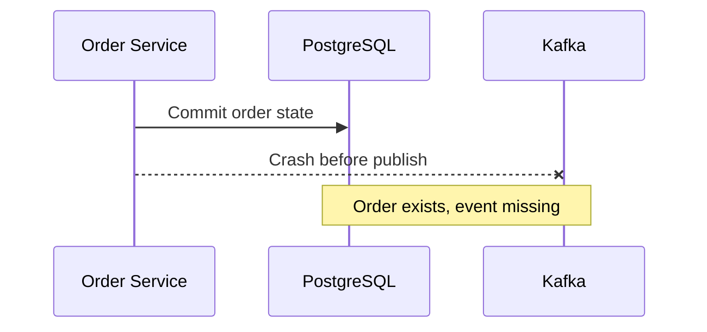
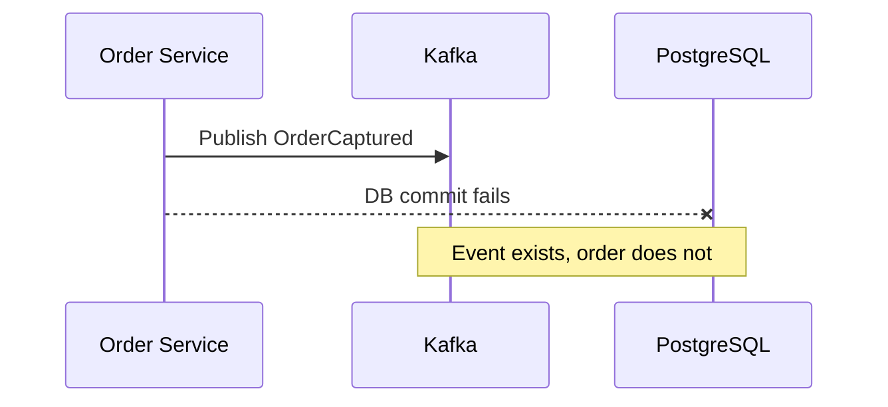
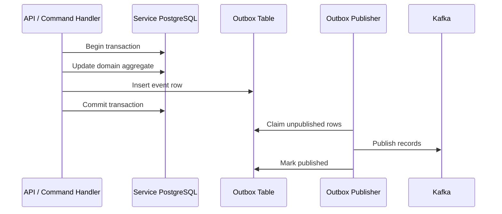
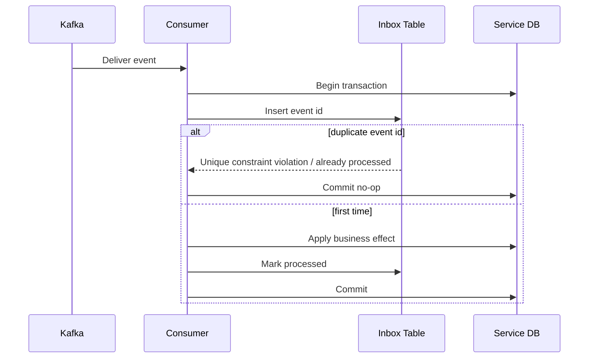
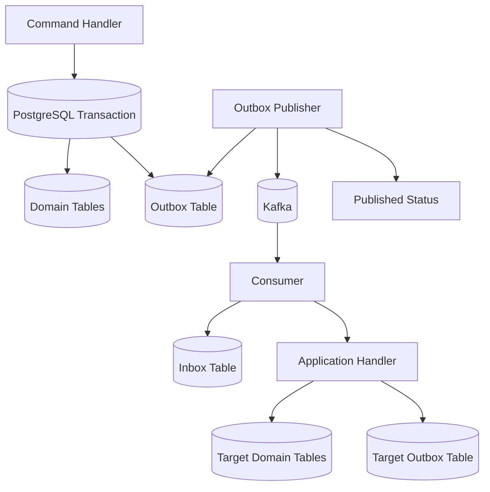
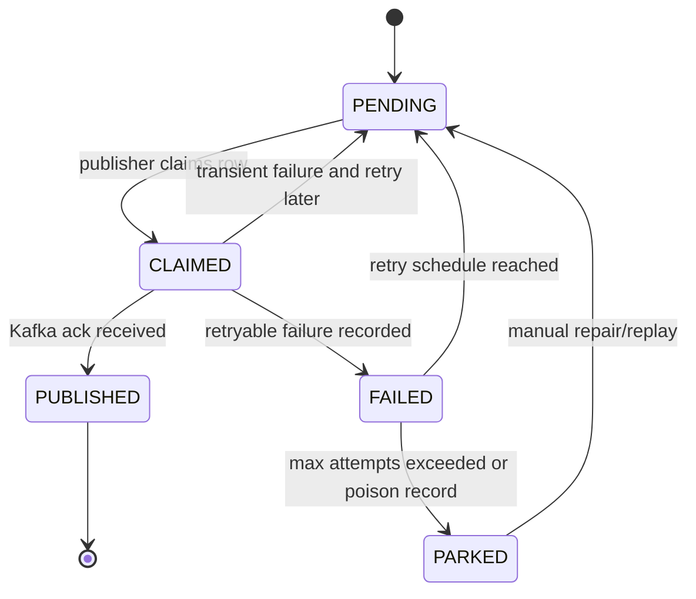
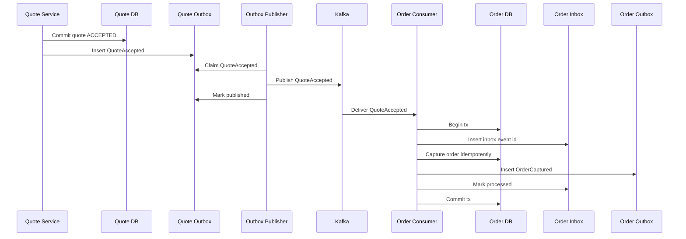
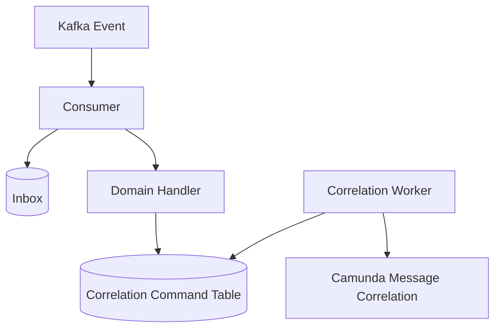

------
title: Learn Java Microservices CPQ/OMS Platform - Part 022
description: Implementing transactional outbox, inbox, idempotency, deduplication, retry, replay, and effectively-once business semantics for a Java microservices CPQ and order management platform.
series: learn-java-microservices-cpq-oms-platform
seriesTitle: Learn Java Microservices CPQ/OMS Platform
order: 22
partTitle: Transactional Outbox, Inbox, and Exactly-Once Thinking
tags:
- java
- microservices
- cpq
- oms
- kafka
- transactional-outbox
- inbox
- idempotency
- postgresql
- mybatis
- distributed-systems
date: 2026-07-02
---

# Part 022 — Transactional Outbox, Inbox, and Exactly-Once Thinking

## 1. What This Part Solves

Part 021 designed Kafka as the platform event backbone.
But Kafka alone does not solve the hardest reliability problem:

> How do we commit business state and publish an event without losing one or duplicating the other?

The practical answer for this platform is:

> **Use transactional outbox on the producing side, inbox/deduplication on the consuming side, and design business operations to be idempotent.**

This part builds the reliability layer behind CPQ/OMS flows such as:

- quote accepted → order captured;
- order captured → orchestration started;
- order line fulfillment requested → external system called;
- fulfillment completed → order line completed;
- all lines completed → order completed;
- approval timeout → escalation triggered.

The phrase “exactly once” is dangerous when used loosely.
A better engineering target is:

> **Effectively-once business outcome under at-least-once delivery.**

That means a message may be delivered more than once, but the business effect happens once.

---

## 2. Why Dual Writes Fail

A dual write happens when one operation changes two durable systems without a single atomic transaction.

Example:

```java
orderRepository.save(order);
kafkaProducer.send(orderCapturedEvent);
```

This looks innocent.
It is not.



Or the reverse:



Both are unacceptable.

For CPQ/OMS, these failures become real business problems:

- accepted quote never becomes order;
- order is fulfilled but missing from order DB;
- customer receives notification for order that was rolled back;
- audit trail contradicts operational state;
- Camunda process waits forever;
- downstream service processes a fact that never committed.

---

## 3. Transactional Outbox Mental Model

Transactional outbox solves the producing-side dual-write problem by writing the domain change and event record into the same service database transaction.



The key invariant:

> **If the domain state commits, the outbox row commits. If the domain state rolls back, the outbox row rolls back.**

Kafka publication becomes asynchronous but recoverable.

---

## 4. Transactional Inbox Mental Model

Transactional inbox solves the consuming-side duplicate-processing problem.



The key invariant:

> **A consumed event id can cause the business effect at most once per consumer responsibility.**

The same event may be consumed by many services.
Each service needs its own inbox boundary.

---

## 5. “Exactly Once” vs “Effectively Once”

Kafka has producer idempotence and transaction features.
Those features are useful, but they do not magically make your business operation exactly once across Kafka, PostgreSQL, Camunda, Redis, and external systems.

In CPQ/OMS, the real problem is broader:

```text
Kafka record -> Java consumer -> PostgreSQL update -> Camunda correlation -> external fulfillment call -> audit event
```

No single Kafka setting makes this whole chain exactly once.

Use precise language:

| Term | Meaning in This Series |
|---|---|
| At-most-once delivery | May lose events, no duplicate processing guarantee |
| At-least-once delivery | Event can be redelivered, consumer must dedupe |
| Kafka exactly-once processing | Kafka-specific read-process-write atomicity under configured transactions |
| Business exactly-once | Usually impossible to guarantee globally with external effects |
| Effectively-once business outcome | Duplicates may occur, but durable business effect is idempotent |

The target for CPQ/OMS is **effectively-once business outcome**.

---

## 6. Reliability Architecture



The same service may be both producer and consumer.
For example, order service consumes `QuoteAccepted`, creates an order, and produces `OrderCaptured`.

---

## 7. Outbox Table Design

A practical PostgreSQL outbox table:

```sql
CREATE TABLE outbox_event (
    outbox_id UUID PRIMARY KEY,
    event_id TEXT NOT NULL UNIQUE,
    tenant_id TEXT NOT NULL,
    aggregate_type TEXT NOT NULL,
    aggregate_id TEXT NOT NULL,
    aggregate_version BIGINT NOT NULL,
    event_type TEXT NOT NULL,
    event_version INTEGER NOT NULL,
    topic TEXT NOT NULL,
    partition_key TEXT NOT NULL,
    payload JSONB NOT NULL,
    headers JSONB NOT NULL DEFAULT '{}'::jsonb,
    status TEXT NOT NULL,
    available_at TIMESTAMPTZ NOT NULL DEFAULT now(),
    attempt_count INTEGER NOT NULL DEFAULT 0,
    claimed_by TEXT NULL,
    claimed_at TIMESTAMPTZ NULL,
    published_at TIMESTAMPTZ NULL,
    kafka_topic TEXT NULL,
    kafka_partition INTEGER NULL,
    kafka_offset BIGINT NULL,
    last_error_code TEXT NULL,
    last_error_message TEXT NULL,
    created_at TIMESTAMPTZ NOT NULL DEFAULT now(),
    updated_at TIMESTAMPTZ NOT NULL DEFAULT now(),
    CONSTRAINT outbox_event_status_chk CHECK (
        status IN ('PENDING', 'CLAIMED', 'PUBLISHED', 'FAILED', 'PARKED')
    )
);

CREATE INDEX idx_outbox_pending
ON outbox_event (available_at, created_at)
WHERE status = 'PENDING';

CREATE INDEX idx_outbox_aggregate
ON outbox_event (aggregate_type, aggregate_id, aggregate_version);

CREATE INDEX idx_outbox_status_created
ON outbox_event (status, created_at);
```

Design notes:

- `event_id` is the durable event identity.
- `outbox_id` is the row identity.
- `partition_key` is stored, not recomputed later.
- `payload` is the full event envelope or value payload, depending on serializer design.
- `headers` stores Kafka headers to publish.
- `aggregate_version` supports lifecycle diagnostics.
- `status` supports operational state.
- Kafka metadata is stored after successful publish.

---

## 8. Outbox Status State Machine



State rules:

- `PENDING` rows are eligible for publishing.
- `CLAIMED` rows belong temporarily to one publisher instance.
- `FAILED` rows are retryable after `available_at`.
- `PARKED` rows require manual action.
- `PUBLISHED` rows are immutable evidence.

---

## 9. Creating Outbox Events Inside Domain Transaction

Example: order capture.

```java
public final class OrderCaptureService {
    private final OrderRepository orderRepository;
    private final OutboxRepository outboxRepository;
    private final IdempotencyRepository idempotencyRepository;
    private final Clock clock;

    public OrderCaptureResult captureOrder(CaptureOrderCommand command) {
        return transactionTemplate.execute(status -> {
            IdempotencyDecision decision = idempotencyRepository.start(
                command.tenantId(),
                "CAPTURE_ORDER",
                command.idempotencyKey()
            );

            if (decision.isDuplicateCompleted()) {
                return decision.previousResultAs(OrderCaptureResult.class);
            }

            Order order = Order.capture(command, clock.instant());
            orderRepository.insert(order);

            EventEnvelope<OrderCapturedPayload> event = OrderEvents.captured(order, command);
            outboxRepository.insert(OutboxEvent.from(event, "oms.order.events.v1", order.id()));

            idempotencyRepository.complete(
                command.tenantId(),
                "CAPTURE_ORDER",
                command.idempotencyKey(),
                OrderCaptureResult.from(order)
            );

            return OrderCaptureResult.from(order);
        });
    }
}
```

The transaction commits:

- idempotency record;
- order aggregate;
- outbox event.

No Kafka call is needed inside the domain transaction.

---

## 10. MyBatis Mapper for Outbox Insert

```xml
<insert id="insert" parameterType="com.acme.platform.outbox.OutboxEventRow">
  INSERT INTO outbox_event (
      outbox_id,
      event_id,
      tenant_id,
      aggregate_type,
      aggregate_id,
      aggregate_version,
      event_type,
      event_version,
      topic,
      partition_key,
      payload,
      headers,
      status,
      available_at,
      created_at,
      updated_at
  ) VALUES (
      #{outboxId},
      #{eventId},
      #{tenantId},
      #{aggregateType},
      #{aggregateId},
      #{aggregateVersion},
      #{eventType},
      #{eventVersion},
      #{topic},
      #{partitionKey},
      #{payload, typeHandler=com.acme.mybatis.JsonbTypeHandler}::jsonb,
      #{headers, typeHandler=com.acme.mybatis.JsonbTypeHandler}::jsonb,
      'PENDING',
      #{availableAt},
      #{createdAt},
      #{updatedAt}
  )
</insert>
```

The mapper should not generate the event.
It persists an event created by application/domain logic.

---

## 11. Claiming Outbox Rows Safely

Multiple publisher instances may run concurrently.
They must not publish the same row at the same time.

PostgreSQL pattern:

```sql
WITH candidate AS (
    SELECT outbox_id
    FROM outbox_event
    WHERE status IN ('PENDING', 'FAILED')
      AND available_at <= now()
    ORDER BY created_at
    FOR UPDATE SKIP LOCKED
    LIMIT #{limit}
)
UPDATE outbox_event o
SET status = 'CLAIMED',
    claimed_by = #{publisherId},
    claimed_at = now(),
    attempt_count = attempt_count + 1,
    updated_at = now()
FROM candidate c
WHERE o.outbox_id = c.outbox_id
RETURNING o.*;
```

Why this works:

- `FOR UPDATE SKIP LOCKED` lets concurrent publishers claim different rows.
- `ORDER BY created_at` roughly preserves publication order.
- `LIMIT` bounds transaction size.
- `claimed_by` supports diagnostics.

Caveat:

> Outbox order inside one aggregate is important. If multiple events for the same aggregate are claimed by different publishers, publishing order can be disturbed.

Mitigations:

- publish per aggregate sequentially;
- use one publisher per service if throughput is modest;
- enforce aggregate-version ordering in claim query;
- rely on Kafka key ordering only after publish order is correct;
- detect out-of-order aggregate versions in consumers.

---

## 12. Preserving Aggregate Event Order

Suppose order service writes:

```text
OrderCaptured aggregateVersion=1
OrderValidated aggregateVersion=2
OrderActivated aggregateVersion=3
```

If outbox publisher publishes version 3 before version 2, consumers may see invalid transitions.

Safer claim strategy:

```sql
WITH candidate AS (
    SELECT o.outbox_id
    FROM outbox_event o
    WHERE o.status IN ('PENDING', 'FAILED')
      AND o.available_at <= now()
      AND NOT EXISTS (
          SELECT 1
          FROM outbox_event earlier
          WHERE earlier.aggregate_type = o.aggregate_type
            AND earlier.aggregate_id = o.aggregate_id
            AND earlier.aggregate_version < o.aggregate_version
            AND earlier.status <> 'PUBLISHED'
      )
    ORDER BY o.created_at
    FOR UPDATE SKIP LOCKED
    LIMIT #{limit}
)
UPDATE outbox_event o
SET status = 'CLAIMED',
    claimed_by = #{publisherId},
    claimed_at = now(),
    attempt_count = attempt_count + 1,
    updated_at = now()
FROM candidate c
WHERE o.outbox_id = c.outbox_id
RETURNING o.*;
```

This is more expensive but safer for lifecycle streams.
Use it where aggregate ordering matters.

---

## 13. Marking Published

```xml
<update id="markPublished">
  UPDATE outbox_event
  SET status = 'PUBLISHED',
      published_at = now(),
      kafka_topic = #{kafkaTopic},
      kafka_partition = #{kafkaPartition},
      kafka_offset = #{kafkaOffset},
      last_error_code = NULL,
      last_error_message = NULL,
      updated_at = now()
  WHERE outbox_id = #{outboxId}
    AND status = 'CLAIMED'
</update>
```

Do not delete published rows immediately.
Published outbox rows are operational evidence.
Retention can be applied later.

---

## 14. Handling Publish Failure

```java
public void handlePublishFailure(OutboxEvent event, Exception ex) {
    FailureClass failureClass = failureClassifier.classify(ex);

    switch (failureClass) {
        case TRANSIENT -> outboxRepository.reschedule(
            event.outboxId(),
            RetryBackoff.nextAvailableAt(event.attemptCount()),
            "TRANSIENT_PUBLISH_FAILURE",
            safeMessage(ex)
        );
        case SERIALIZATION_BUG -> outboxRepository.park(
            event.outboxId(),
            "SERIALIZATION_BUG",
            safeMessage(ex)
        );
        case AUTHORIZATION -> outboxRepository.park(
            event.outboxId(),
            "KAFKA_AUTHORIZATION_FAILURE",
            safeMessage(ex)
        );
        default -> outboxRepository.reschedule(
            event.outboxId(),
            RetryBackoff.nextAvailableAt(event.attemptCount()),
            "UNKNOWN_PUBLISH_FAILURE",
            safeMessage(ex)
        );
    }
}
```

Failure classification matters.
Retrying a serialization bug one million times is not resilience.
It is noise.

---

## 15. Stale Claim Recovery

A publisher can crash after claiming rows but before publishing.
Those rows may remain `CLAIMED` forever unless recovered.

```sql
UPDATE outbox_event
SET status = 'PENDING',
    claimed_by = NULL,
    claimed_at = NULL,
    updated_at = now(),
    last_error_code = 'STALE_CLAIM_RECOVERED',
    last_error_message = 'Claim expired and was returned to pending'
WHERE status = 'CLAIMED'
  AND claimed_at < now() - interval '5 minutes';
```

Run as scheduled maintenance.
The timeout should exceed normal maximum publish duration.

---

## 16. Inbox Table Design

A practical consumer inbox:

```sql
CREATE TABLE inbox_event (
    inbox_id UUID PRIMARY KEY,
    consumer_name TEXT NOT NULL,
    event_id TEXT NOT NULL,
    event_type TEXT NOT NULL,
    event_version INTEGER NOT NULL,
    tenant_id TEXT NOT NULL,
    aggregate_type TEXT NOT NULL,
    aggregate_id TEXT NOT NULL,
    source_topic TEXT NOT NULL,
    source_partition INTEGER NOT NULL,
    source_offset BIGINT NOT NULL,
    status TEXT NOT NULL,
    received_at TIMESTAMPTZ NOT NULL DEFAULT now(),
    processed_at TIMESTAMPTZ NULL,
    failed_at TIMESTAMPTZ NULL,
    attempt_count INTEGER NOT NULL DEFAULT 0,
    last_error_code TEXT NULL,
    last_error_message TEXT NULL,
    created_at TIMESTAMPTZ NOT NULL DEFAULT now(),
    updated_at TIMESTAMPTZ NOT NULL DEFAULT now(),
    CONSTRAINT inbox_status_chk CHECK (
        status IN ('RECEIVED', 'PROCESSING', 'PROCESSED', 'FAILED', 'PARKED')
    ),
    CONSTRAINT uq_inbox_consumer_event UNIQUE (consumer_name, event_id)
);

CREATE INDEX idx_inbox_consumer_status
ON inbox_event (consumer_name, status, received_at);

CREATE INDEX idx_inbox_source_offset
ON inbox_event (source_topic, source_partition, source_offset);
```

Why `consumer_name` is part of uniqueness:

- notification service and order projection service may process the same `eventId` independently;
- each consumer responsibility needs its own dedupe boundary.

---

## 17. Consumer Processing Template

```java
public final class ReliableEventConsumer<T> {
    private final InboxRepository inboxRepository;
    private final EventHandler<T> handler;
    private final TransactionTemplate tx;

    public void onRecord(ConsumerRecord<String, String> record) {
        EventEnvelope<T> event = deserialize(record.value());

        tx.executeWithoutResult(status -> {
            InboxStartResult start = inboxRepository.tryStart(
                consumerName(),
                event,
                record.topic(),
                record.partition(),
                record.offset()
            );

            if (start == InboxStartResult.DUPLICATE_PROCESSED) {
                return;
            }

            if (start == InboxStartResult.DUPLICATE_IN_PROGRESS) {
                throw new RetryLaterException("Event is already in progress");
            }

            handler.handle(event);
            inboxRepository.markProcessed(consumerName(), event.eventId());
        });
    }
}
```

The handler should call application services, not mutate tables casually.

---

## 18. Inbox Try-Start SQL

```sql
INSERT INTO inbox_event (
    inbox_id,
    consumer_name,
    event_id,
    event_type,
    event_version,
    tenant_id,
    aggregate_type,
    aggregate_id,
    source_topic,
    source_partition,
    source_offset,
    status,
    attempt_count,
    created_at,
    updated_at
) VALUES (
    #{inboxId},
    #{consumerName},
    #{eventId},
    #{eventType},
    #{eventVersion},
    #{tenantId},
    #{aggregateType},
    #{aggregateId},
    #{sourceTopic},
    #{sourcePartition},
    #{sourceOffset},
    'PROCESSING',
    1,
    now(),
    now()
)
ON CONFLICT (consumer_name, event_id)
DO NOTHING;
```

If insert count is 1, this consumer is processing the event for the first time.
If insert count is 0, read existing row and decide:

| Existing Status | Action |
|---|---|
| `PROCESSED` | Skip and commit offset |
| `PROCESSING` and fresh | Retry later or skip until timeout |
| `PROCESSING` and stale | Recover or retry with lock |
| `FAILED` | Retry according to policy |
| `PARKED` | Do not auto-process |

---

## 19. Idempotency Is Not Only Inbox

Inbox deduplicates events.
Business commands still need idempotency.

Example:

- `QuoteAccepted` event is delivered twice.
- Inbox dedupes it for `order-service.quote-accepted-consumer`.
- But order capture may also be triggered through a repair command.
- Order capture itself must reject duplicate capture for same quote.

Use layered idempotency:

```text
External/API idempotency key
Consumer inbox event id
Domain unique constraint
Command idempotency record
Business invariant check
```

For order capture:

```sql
CREATE UNIQUE INDEX uq_order_source_quote
ON customer_order (tenant_id, source_quote_id)
WHERE source_quote_id IS NOT NULL;
```

This database constraint protects the business invariant:

> One accepted quote should not produce multiple active orders unless amendment policy explicitly allows it.

---

## 20. Command Idempotency Table

```sql
CREATE TABLE command_idempotency (
    idempotency_id UUID PRIMARY KEY,
    tenant_id TEXT NOT NULL,
    command_type TEXT NOT NULL,
    idempotency_key TEXT NOT NULL,
    status TEXT NOT NULL,
    request_hash TEXT NOT NULL,
    response_payload JSONB NULL,
    locked_until TIMESTAMPTZ NULL,
    created_at TIMESTAMPTZ NOT NULL DEFAULT now(),
    updated_at TIMESTAMPTZ NOT NULL DEFAULT now(),
    CONSTRAINT uq_command_idempotency UNIQUE (tenant_id, command_type, idempotency_key),
    CONSTRAINT command_idempotency_status_chk CHECK (
        status IN ('STARTED', 'COMPLETED', 'FAILED')
    )
);
```

Rules:

- same key + same request hash may return previous response;
- same key + different request hash is a client error;
- stale `STARTED` records need recovery policy;
- do not store sensitive full request unless required and protected.

---

## 21. Example: Idempotent Order Capture From QuoteAccepted

```java
public OrderCaptureResult captureFromQuoteAccepted(EventEnvelope<QuoteAcceptedPayload> event) {
    CaptureOrderCommand command = new CaptureOrderCommand(
        event.tenantId(),
        event.payload().quoteId(),
        "QuoteAccepted:" + event.eventId(),
        event.correlationId(),
        event.payload().acceptedAt(),
        event.payload().acceptedBy()
    );

    return orderCaptureService.capture(command);
}
```

The idempotency key is derived from the event.
If the event is redelivered, the command is stable.

But still add the unique database constraint on source quote.
Never rely on application logic alone for critical duplicate prevention.

---

## 22. Outbox + Inbox Flow: Quote Accepted to Order Captured



If the order consumer crashes after committing order but before committing Kafka offset, the event is redelivered.
The inbox and order unique constraint prevent duplicate order capture.

---

## 23. Camunda Correlation With Inbox

Camunda message correlation is a side effect.
Treat it carefully.

Preferred flow:



Why not always correlate Camunda directly inside consumer transaction?

- Camunda may be unavailable.
- Correlation may be retryable.
- DB transaction with business state should not depend on long external calls.
- Repairing failed correlations is easier from a command table.

For simple same-database embedded Camunda deployments, direct correlation may be acceptable.
But the production-safe pattern is to persist a correlation command and process it idempotently.

---

## 24. Correlation Command Table

```sql
CREATE TABLE camunda_correlation_command (
    command_id UUID PRIMARY KEY,
    tenant_id TEXT NOT NULL,
    business_key TEXT NOT NULL,
    message_name TEXT NOT NULL,
    correlation_key TEXT NOT NULL,
    payload JSONB NOT NULL,
    status TEXT NOT NULL,
    attempt_count INTEGER NOT NULL DEFAULT 0,
    available_at TIMESTAMPTZ NOT NULL DEFAULT now(),
    completed_at TIMESTAMPTZ NULL,
    last_error_code TEXT NULL,
    last_error_message TEXT NULL,
    created_at TIMESTAMPTZ NOT NULL DEFAULT now(),
    updated_at TIMESTAMPTZ NOT NULL DEFAULT now(),
    CONSTRAINT uq_camunda_correlation UNIQUE (tenant_id, message_name, correlation_key),
    CONSTRAINT camunda_correlation_status_chk CHECK (
        status IN ('PENDING', 'PROCESSING', 'COMPLETED', 'FAILED', 'PARKED')
    )
);
```

This table allows:

- retrying failed correlations;
- deduping duplicate messages;
- observing process integration health;
- repairing stuck orchestration without faking Kafka offsets.

---

## 25. External Side Effects

External side effects are harder than database writes.
Examples:

- sending email;
- calling billing;
- sending fulfillment request;
- provisioning resource;
- notifying partner system.

Rule:

> External side effects must have their own idempotency key or durable command table.

Example fulfillment request table:

```sql
CREATE TABLE fulfillment_request (
    request_id UUID PRIMARY KEY,
    tenant_id TEXT NOT NULL,
    order_id TEXT NOT NULL,
    order_line_id TEXT NOT NULL,
    external_system TEXT NOT NULL,
    idempotency_key TEXT NOT NULL,
    request_payload JSONB NOT NULL,
    status TEXT NOT NULL,
    external_reference TEXT NULL,
    attempt_count INTEGER NOT NULL DEFAULT 0,
    available_at TIMESTAMPTZ NOT NULL DEFAULT now(),
    created_at TIMESTAMPTZ NOT NULL DEFAULT now(),
    updated_at TIMESTAMPTZ NOT NULL DEFAULT now(),
    CONSTRAINT uq_fulfillment_idempotency UNIQUE (external_system, idempotency_key)
);
```

The worker sends the external request.
If it crashes, it can retry the same idempotency key.

---

## 26. Failure Classification

Reliability depends on classifying failures correctly.

| Failure | Example | Retry? | Destination |
|---|---|---:|---|
| Serialization bug | event cannot be serialized | No | Park outbox |
| Kafka unavailable | broker/network outage | Yes | Reschedule outbox |
| Authorization failure | producer lacks topic ACL | No until config fixed | Park + alert |
| Consumer schema invalid | required field missing | No | DLT/park inbox |
| Consumer DB timeout | transient DB issue | Yes | Retry |
| Business invariant violation | quote already captured | Usually no-op or business rejection | Mark processed with outcome |
| Camunda correlation missing | process not waiting yet | Maybe delayed retry | Correlation command retry |
| External 503 | fulfillment down | Yes delayed | Fulfillment request retry |
| External validation error | product code rejected | No automatic retry | Business failure event |

Retry should be reserved for failures likely to succeed later.

---

## 27. Parking vs Dead Letter

`PARKED` and DLT are related but not identical.

| Mechanism | Location | Use |
|---|---|---|
| Outbox `PARKED` | Producer DB | Event cannot be published safely |
| Inbox `PARKED` | Consumer DB | Event cannot be processed safely |
| Kafka DLT | Kafka topic | Record failed consumer pipeline and needs triage |
| Command `PARKED` | Service DB | Side-effect command needs manual repair |

Use both database state and Kafka DLT where useful.
The database state supports service repair.
The DLT supports stream-level triage and replay.

---

## 28. Handling Poison Events

A poison event is one that repeatedly fails processing.

Consumer policy:

```text
1. Validate schema.
2. Validate tenant and event type support.
3. Try processing.
4. Retry transient failures with bounded attempts.
5. Park or DLT non-retryable failures.
6. Alert owner.
7. Provide replay tool after repair.
```

Do not let one poison event block an entire partition forever.
But also do not skip it silently.

For lifecycle-critical topics, skipping may require business approval because later events may depend on it.

---

## 29. Replay Safety

Replay means reprocessing old records.
It is only safe when handlers are idempotent and side effects are controlled.

Replay checklist:

- [ ] Consumer group is new or offset reset is intentional.
- [ ] Target tables can be rebuilt or deduped.
- [ ] External side effects are disabled or idempotent.
- [ ] Old event versions are supported.
- [ ] Replay window is defined.
- [ ] Metrics and logs identify replay mode.
- [ ] Business owner approves replay for high-impact streams.

Projection replay example:

```java
ProjectionMode mode = ProjectionMode.REBUILD;

if (mode == ProjectionMode.REBUILD) {
    notificationSender.disable();
    projectionRepository.writeToShadowTable("order_projection_rebuild_20260702");
}
```

---

## 30. Ordering During Replay

Replay preserves Kafka partition ordering, not global ordering.

If a projection aggregates across partitions, it must tolerate interleaving.

For order projections keyed by `orderId`, partition ordering is usually enough.
For customer-level dashboards aggregating many orders, projection should be eventually consistent.

Use aggregate version checks:

```sql
UPDATE order_projection
SET status = #{newStatus},
    aggregate_version = #{aggregateVersion},
    updated_at = now()
WHERE tenant_id = #{tenantId}
  AND order_id = #{orderId}
  AND aggregate_version < #{aggregateVersion};
```

This prevents older replayed events from overwriting newer projection state.

---

## 31. Exactly-Once Thinking for Business Invariants

Instead of asking:

> Can Kafka deliver exactly once?

Ask:

> What durable invariant prevents duplicate business effect?

Examples:

| Business Operation | Duplicate Risk | Invariant |
|---|---|---|
| Capture order from quote | Two orders for one quote | Unique `(tenant_id, source_quote_id)` |
| Submit fulfillment line | Duplicate external request | Unique external idempotency key |
| Send approval escalation | Multiple escalation tasks | Unique `(approval_case_id, escalation_level)` |
| Complete order line | Double completion transition | State machine guard |
| Generate invoice request | Duplicate billing request | Unique billing command key |
| Send email notification | Duplicate email | Notification idempotency key |

Database constraints are often the final line of defense.

---

## 32. Idempotent State Machine Transition

Order line completion should be idempotent.

```java
public void markLineCompleted(MarkLineCompletedCommand command) {
    OrderLine line = orderLineRepository.findForUpdate(command.orderLineId());

    if (line.status() == OrderLineStatus.COMPLETED) {
        return;
    }

    if (!line.status().canTransitionTo(OrderLineStatus.COMPLETED)) {
        throw new InvalidTransitionException(line.status(), OrderLineStatus.COMPLETED);
    }

    line.complete(command.completedAt(), command.externalReference());
    orderLineRepository.update(line);
    outboxRepository.insert(OrderEvents.lineCompleted(line));
}
```

Redelivery of the same completion event should not produce multiple completion transitions.

---

## 33. Idempotent Notification

Notification is a classic duplicate side effect.

```sql
CREATE TABLE notification_delivery (
    delivery_id UUID PRIMARY KEY,
    tenant_id TEXT NOT NULL,
    notification_type TEXT NOT NULL,
    recipient TEXT NOT NULL,
    idempotency_key TEXT NOT NULL,
    channel TEXT NOT NULL,
    status TEXT NOT NULL,
    sent_at TIMESTAMPTZ NULL,
    created_at TIMESTAMPTZ NOT NULL DEFAULT now(),
    CONSTRAINT uq_notification_idempotency UNIQUE (tenant_id, channel, idempotency_key)
);
```

For an `OrderCaptured` notification:

```text
idempotencyKey = "OrderCaptured:" + eventId + ":" + recipient
```

If replay runs, duplicate notifications are skipped.

---

## 34. Outbox Cleanup and Retention

Outbox grows forever unless managed.

Retention options:

| Data | Suggested Policy |
|---|---|
| `PUBLISHED` rows | Keep operational window, archive older rows |
| `PARKED` rows | Keep until resolved |
| `FAILED` retryable rows | Keep while retrying |
| Kafka metadata | Keep with published row for traceability |
| payload | Archive or redact based on data classification |

Cleanup job:

```sql
DELETE FROM outbox_event
WHERE status = 'PUBLISHED'
  AND published_at < now() - interval '30 days';
```

For regulated environments, do not delete blindly.
Archive first if event publication evidence is required.

---

## 35. Inbox Cleanup and Retention

Inbox is dedupe evidence.
If you delete too early, old duplicates may reprocess.

Retention should exceed:

- Kafka retention;
- maximum replay window;
- maximum expected duplicate delay;
- audit requirement for consumer effects.

For high-value events, keep processed inbox metadata longer than payload.

```sql
UPDATE inbox_event
SET last_error_message = NULL
WHERE status = 'PROCESSED'
  AND processed_at < now() - interval '90 days';
```

This keeps dedupe facts while reducing sensitive detail.

---

## 36. Performance Considerations

Outbox/inbox adds database writes.
That is intentional.
It buys reliability.

Optimize carefully:

- batch outbox publishing;
- use partial indexes for pending rows;
- avoid large JSON payload indexes unless needed;
- partition outbox by date for high volume;
- keep claim transactions short;
- limit publisher concurrency;
- monitor table bloat;
- vacuum/analyze appropriately;
- keep payload size bounded.

Do not optimize by removing durable dedupe from critical flows.

---

## 37. Batch Publishing

Publisher can improve throughput with batches.

```java
public void publishBatch(int limit) {
    List<OutboxEventRow> rows = outboxRepository.claim(limit, publisherId);

    Map<UUID, CompletableFuture<RecordMetadata>> futures = new LinkedHashMap<>();

    for (OutboxEventRow row : rows) {
        ProducerRecord<String, String> record = toProducerRecord(row);
        futures.put(row.outboxId(), producer.send(record));
    }

    producer.flush();

    for (Map.Entry<UUID, CompletableFuture<RecordMetadata>> entry : futures.entrySet()) {
        try {
            RecordMetadata metadata = entry.getValue().get();
            outboxRepository.markPublished(entry.getKey(), metadata);
        } catch (Exception ex) {
            outboxRepository.markFailed(entry.getKey(), classify(ex), safeMessage(ex));
        }
    }
}
```

Batching must not hide per-record failure.

---

## 38. Publisher Deployment Model

Options:

| Model | Description | Pros | Cons |
|---|---|---|---|
| In-service background thread | Publisher runs inside service process | Simple deployment | Coupled lifecycle |
| Separate publisher process | Same codebase, separate runtime | Scales independently | More deployment units |
| Shared platform publisher | Generic publisher reads many outboxes | Centralized | Can become too generic/coupled |
| CDC-based publisher | Debezium-like capture from DB log | Low app polling | More infrastructure and schema discipline |

For this build-from-scratch series, start with a service-owned publisher process or background worker.
Keep interface clean enough to move to CDC later if needed.

---

## 39. Polling Outbox vs CDC

| Approach | Good For | Watch Out |
|---|---|---|
| Polling outbox | Simpler app-owned reliability | Poll interval, DB load, ordering |
| CDC outbox | High-throughput event publication | Connector operations, schema changes, delete handling |

Polling is easier to reason about early.
CDC can be excellent at scale, but it is not magic.
You still need event schema discipline, idempotent consumers, and failure runbooks.

---

## 40. Observability

### 40.1 Outbox Metrics

Track:

```text
outbox.pending.count{service,eventType}
outbox.oldest.pending.age.seconds{service}
outbox.publish.success.count{service,eventType,topic}
outbox.publish.failure.count{service,errorCode}
outbox.parked.count{service,eventType}
outbox.publish.latency.ms{service,topic}
```

### 40.2 Inbox Metrics

Track:

```text
inbox.processed.count{consumer,eventType}
inbox.duplicate.count{consumer,eventType}
inbox.failed.count{consumer,eventType,errorCode}
inbox.parked.count{consumer,eventType}
inbox.processing.latency.ms{consumer,eventType}
inbox.event.age.seconds{consumer,eventType}
```

### 40.3 Business Metrics

Track:

```text
quote.accepted.to.order.captured.seconds
order.captured.to.orchestration.started.seconds
order.line.requested.to.fulfilled.seconds
approval.timeout.to.escalation.seconds
```

Reliability metrics should map to business flow health.

---

## 41. Alerting

| Alert | Threshold Example | Meaning |
|---|---:|---|
| Oldest outbox pending age | > 5 minutes | Producer not publishing |
| Outbox parked count | > 0 | Manual action required |
| Inbox parked count | > 0 | Consumer cannot process event |
| DLT count | > 0 critical topics | Contract/logic failure |
| Duplicate inbox spike | abnormal increase | Upstream retry/replay issue |
| QuoteAccepted to OrderCaptured SLO breach | p95 > target | Revenue flow degraded |

Alerts should include runbook links.

---

## 42. Runbook: Outbox Stuck

Symptom: `outbox.oldest.pending.age.seconds` exceeds threshold.

Steps:

1. Check publisher process health.
2. Check DB claim query latency.
3. Check rows by status.
4. Check Kafka connectivity.
5. Check authorization errors.
6. Check serialization errors.
7. Check `PARKED` rows.
8. Check stale `CLAIMED` rows.
9. Recover stale claims if safe.
10. Restart publisher only after understanding if it is safe.

Useful query:

```sql
SELECT status, event_type, count(*), min(created_at) AS oldest
FROM outbox_event
GROUP BY status, event_type
ORDER BY oldest;
```

---

## 43. Runbook: Duplicate Business Effect

Symptom: duplicate orders, duplicate notifications, duplicate fulfillment requests.

Steps:

1. Identify duplicated business entity.
2. Find source event ids.
3. Check inbox rows for relevant consumer.
4. Check command idempotency table.
5. Check domain unique constraints.
6. Check whether repair tool bypassed normal command path.
7. Check replay job configuration.
8. Stop side-effecting consumers if duplicate is ongoing.
9. Repair data through approved compensating command.
10. Add missing invariant test and DB constraint.

Root cause is usually not “Kafka duplicated a message”.
Kafka redelivery is expected.
The platform failed to make the effect idempotent.

---

## 44. Runbook: Event Published But Consumer Did Nothing

Steps:

1. Locate event in Kafka by key/event id.
2. Check consumer group lag and offset.
3. Check inbox table for event id.
4. If inbox missing, consumer may not have read event.
5. If inbox `PROCESSED`, check domain effect and projection.
6. If inbox `FAILED` or `PARKED`, inspect error.
7. If offset passed but inbox missing, check early offset commit bug.
8. Replay with controlled consumer group if safe.

Early offset commit without durable effect is one of the most severe consumer bugs.

---

## 45. Testing Outbox

Test cases:

1. Domain transaction commits → outbox row exists.
2. Domain transaction rolls back → no outbox row.
3. Publisher publishes row → status becomes `PUBLISHED`.
4. Publisher crashes after claim → stale claim recovery returns row to `PENDING`.
5. Kafka send fails transiently → row is rescheduled.
6. Serialization failure → row is parked.
7. Duplicate publisher instances do not claim same row.
8. Events for same aggregate are not published out of order.

Use real PostgreSQL for concurrency tests.
Mocks will not catch lock behavior.

---

## 46. Testing Inbox

Test cases:

1. First event processing applies business effect.
2. Same `eventId` redelivered → no duplicate effect.
3. Crash after DB commit before offset commit → redelivery skipped.
4. Invalid schema → DLT/park.
5. Transient DB failure → retry.
6. Business invariant violation → expected no-op or rejection.
7. Replay from earliest offset → final state unchanged.
8. Two consumer instances process same event → unique constraint dedupes.

Use database constraints as part of the test.

---

## 47. Property-Based Reliability Thinking

For critical flows, define properties rather than only examples.

Example properties:

- For any number of duplicate `QuoteAccepted` deliveries, at most one order is created.
- For any crash point after order transaction commit, `OrderCaptured` eventually becomes publishable.
- For any duplicate `FulfillmentCompleted`, order line is completed at most once.
- For any replay of order lifecycle events, projection final state equals state from single pass.
- For any event version with unknown optional fields, consumer does not fail.

These properties can be tested with generated scenarios or explicit chaos-style integration tests.

---

## 48. Chaos Scenarios

Inject failures at these points:

```text
Before DB commit
After DB commit before outbox publish
After outbox claim before Kafka send
After Kafka send before mark published
After consumer DB commit before offset commit
During Camunda correlation
During external fulfillment call
During notification send
```

Expected behavior:

- no lost committed business facts;
- no duplicate business effects;
- failed side effects are retryable or parked;
- operators can locate the stuck item;
- repair uses normal command paths.

---

## 49. Security and Compliance

Outbox and inbox tables contain business event evidence.
Treat them as sensitive.

Rules:

- restrict direct database access;
- avoid storing secrets in payload;
- redact sensitive error messages;
- classify payload data;
- encrypt storage according to policy;
- audit manual replay/repair actions;
- define retention explicitly;
- avoid copying production payloads to development.

For CPQ/OMS, outbox/inbox may contain:

- negotiated pricing;
- quote approval evidence;
- customer identifiers;
- product configuration details;
- fulfillment details;
- actor metadata.

---

## 50. Implementation Package Structure

```text
platform-reliability/
  src/main/java/com/acme/platform/reliability/outbox/
    OutboxEvent.java
    OutboxRepository.java
    OutboxPublisher.java
    OutboxFailureClassifier.java
    OutboxClaimService.java
  src/main/java/com/acme/platform/reliability/inbox/
    InboxEvent.java
    InboxRepository.java
    ReliableEventConsumer.java
    InboxDecision.java
  src/main/java/com/acme/platform/reliability/idempotency/
    IdempotencyRepository.java
    IdempotencyDecision.java
    IdempotencyViolationException.java
```

Service-specific code:

```text
order-service/
  src/main/java/com/acme/order/application/
    OrderCaptureService.java
  src/main/java/com/acme/order/events/
    OrderEvents.java
    QuoteAcceptedConsumer.java
  src/main/resources/db/migration/
    V021__create_order_outbox.sql
    V022__create_order_inbox.sql
```

Keep platform reliability primitives generic.
Keep business event construction service-specific.

---

## 51. End-to-End Example: Order Service Consumes QuoteAccepted

```java
public final class QuoteAcceptedHandler implements EventHandler<QuoteAcceptedPayload> {
    private final OrderCaptureService orderCaptureService;

    @Override
    public void handle(EventEnvelope<QuoteAcceptedPayload> event) {
        orderCaptureService.capture(new CaptureOrderCommand(
            event.tenantId(),
            event.payload().quoteId(),
            "QuoteAccepted:" + event.eventId(),
            event.correlationId(),
            event.payload().acceptedAt(),
            event.payload().acceptedBy()
        ));
    }
}
```

The reliable consumer wrapper handles inbox.
The order capture service handles command idempotency and domain invariants.
The order repository enforces unique source quote.
The order service outbox emits `OrderCaptured`.

This layered defense is what makes the flow production-grade.

---

## 52. Design Review Checklist

Before approving a new event-driven flow:

- [ ] Does the producer write domain state and outbox in one DB transaction?
- [ ] Is the outbox event id stable and unique?
- [ ] Is the Kafka partition key stored in the outbox row?
- [ ] Can publisher recover stale claims?
- [ ] Are aggregate event ordering rules defined?
- [ ] Does consumer use inbox dedupe?
- [ ] Does business command have idempotency beyond inbox?
- [ ] Is there a database constraint for critical uniqueness?
- [ ] Are external side effects idempotent?
- [ ] Are retries classified?
- [ ] Are poison records parked or sent to DLT?
- [ ] Is replay safe or explicitly blocked?
- [ ] Are outbox/inbox metrics and alerts defined?
- [ ] Are manual repair operations audited?
- [ ] Is retention defined for outbox and inbox records?

---

## 53. Practice: Build Reliable Quote-to-Order

Implement this exercise:

1. Add `outbox_event` table to quote service.
2. Emit `QuoteAccepted` through outbox when quote is accepted.
3. Build quote outbox publisher to `cpq.quote.events.v1`.
4. Add `inbox_event` table to order service.
5. Consume `QuoteAccepted` with reliable inbox wrapper.
6. Add command idempotency for `CAPTURE_ORDER`.
7. Add unique constraint `(tenant_id, source_quote_id)` on order.
8. Emit `OrderCaptured` through order service outbox.
9. Kill the order consumer after DB commit but before offset commit.
10. Restart and prove no duplicate order is created.
11. Replay `QuoteAccepted` and prove result is unchanged.
12. Break event schema intentionally and prove it lands in DLT/parked state.

Expected deliverables:

- migration files;
- MyBatis mappers;
- Java reliability wrapper;
- integration tests with PostgreSQL and Kafka;
- runbook for stuck outbox/inbox;
- metrics dashboard screenshot or metric output.

---

## 54. Mental Model Recap

The reliable eventing model is simple but strict:

- never dual-write DB and Kafka directly;
- write domain state and outbox together;
- publish outbox asynchronously;
- consume with inbox dedupe;
- make business commands idempotent;
- enforce critical invariants with database constraints;
- classify retries;
- park poison records;
- design replay before incidents;
- treat “exactly once” as a business outcome, not a slogan.

In the next part, we will focus on **event schema evolution and contracts** so that these reliable events can survive years of platform changes without breaking consumers.
