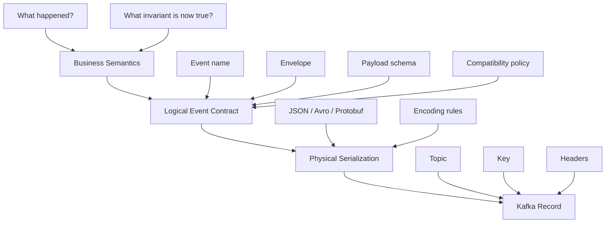
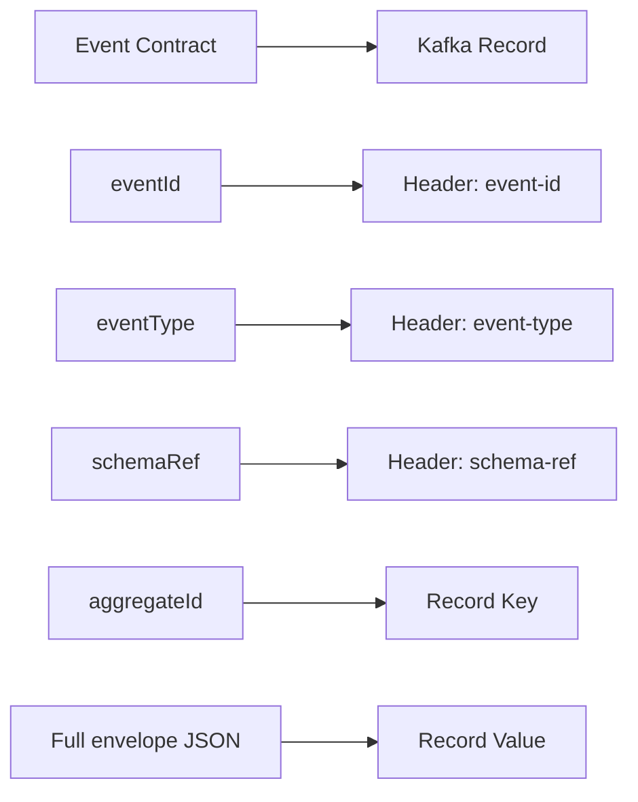
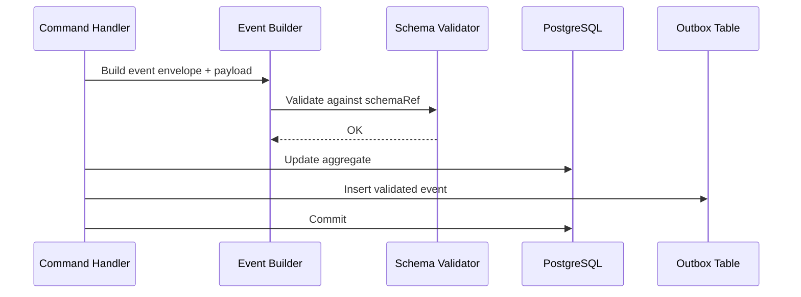
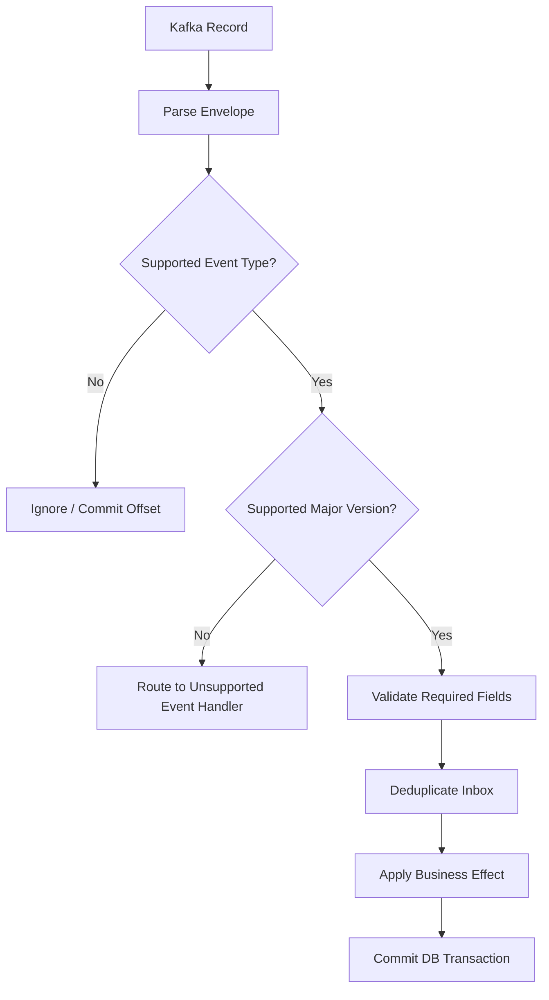
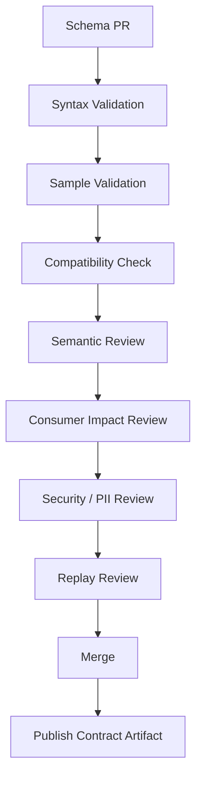
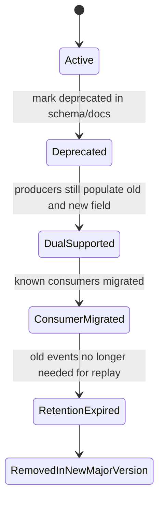
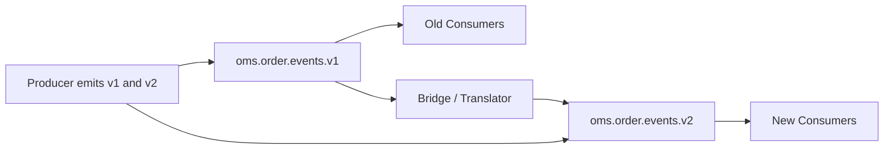

------
title: Learn Java Microservices CPQ/OMS Platform - Part 023
description: Designing event schema evolution, compatibility, contract governance, replay-safe consumers, and schema validation for a Java microservices CPQ and order management platform.
series: learn-java-microservices-cpq-oms-platform
seriesTitle: Learn Java Microservices CPQ/OMS Platform
order: 23
partTitle: Event Schema Evolution and Contracts
tags:
- java
- microservices
- cpq
- oms
- kafka
- schema-evolution
- json-schema
- openapi
- contract-testing
- event-driven-architecture
date: 2026-07-02
---

# Part 023 — Event Schema Evolution and Contracts

## 1. What This Part Solves

Part 021 designed Kafka as the durable event backbone.
Part 022 added transactional outbox and inbox so published facts are recoverable and consumer effects are idempotent.

This part solves the next production problem:

> **How do we evolve events without breaking consumers, replay, audit, and long-running business processes?**

In a CPQ/OMS platform, event contracts are not just integration payloads.
They become durable business records used by:

- downstream services;
- read projections;
- reconciliation jobs;
- Camunda message correlation;
- audit reports;
- data lake ingestion;
- compliance investigation;
- customer notification;
- support tooling;
- replay and repair workflows.

If event schemas are weak, every consumer becomes a hidden parser with undocumented assumptions.
That is how a platform becomes fragile.

The target capability for this part:

> **Design Kafka event contracts that can evolve safely while preserving semantic meaning, replay behavior, compatibility, and operational debuggability.**

---

## 2. Kaufman Skill Slice

Using Kaufman's learning approach, we deconstruct the skill into a small set of high-value sub-skills.

| Sub-skill | Why It Matters |
|---|---|
| Event semantic modeling | Prevents vague events such as `OrderUpdated` from becoming unmaintainable integration dumps. |
| Envelope design | Makes every event traceable, versioned, attributable, and deduplicable. |
| Compatibility reasoning | Lets producers evolve without breaking old consumers. |
| Consumer tolerance | Keeps services resilient to additive change and unknown fields. |
| Replay safety | Prevents old events from corrupting new projections. |
| Schema governance | Turns event changes into reviewable engineering artifacts. |
| Contract tests | Detects breaking event changes before deployment. |

The effective practice loop:

1. Pick one important domain event.
2. Define its semantic contract in English.
3. Write JSON Schema.
4. Write sample events.
5. Write producer validation.
6. Write consumer contract tests.
7. Evolve it twice.
8. Replay old samples through the new consumer.
9. Record the compatibility decision.

---

## 3. Event Contract Mental Model

An event contract has three layers.



Do not start with serialization.
Start with business semantics.

Bad event:

```json
{
  "eventType": "OrderUpdated",
  "data": {
    "status": "IN_PROGRESS"
  }
}
```

Better event:

```json
{
  "eventType": "OrderFulfillmentStarted",
  "eventVersion": 1,
  "aggregateType": "Order",
  "aggregateId": "ord_01JZ...",
  "occurredAt": "2026-07-02T10:15:30Z",
  "payload": {
    "orderId": "ord_01JZ...",
    "orderVersion": 4,
    "fulfillmentPlanId": "fp_01JZ...",
    "startedByProcessInstanceId": "camunda_..."
  }
}
```

The difference is not cosmetic.
The second event says exactly what became true.

---

## 4. Event Taxonomy for CPQ/OMS

Use a small, explicit event taxonomy.

| Category | Meaning | Examples |
|---|---|---|
| Domain fact | Something became true inside a bounded context. | `QuoteSubmitted`, `OrderCaptured`, `OrderLineCompleted` |
| Decision fact | A policy decision was made. | `ApprovalRequired`, `ApprovalGranted`, `DiscountRejected` |
| Process signal | A workflow-level milestone happened. | `OrderOrchestrationStarted`, `FulfillmentTimedOut` |
| Integration command | A service requests another system to act. | `ProvisioningRequested`, `BillingActivationRequested` |
| Integration result | External system reports an outcome. | `ProvisioningCompleted`, `BillingActivationFailed` |
| Projection event | Internal event optimized for read model updates. | `OrderSummaryProjectionInvalidated` |
| Audit evidence | Durable evidence for defensibility. | `ManualOverrideRecorded`, `ApprovalEvidenceCaptured` |

Important rule:

> **Public Kafka events should represent business facts, not internal persistence deltas.**

Avoid these names for public integration events:

- `QuoteUpdated`
- `OrderChanged`
- `LineItemModified`
- `StatusChanged`
- `ProcessAdvanced`
- `DatabaseRowUpdated`

These names force every consumer to infer meaning by diffing payloads.

---

## 5. Event Naming Policy

Use past-tense fact names for domain events.

Good:

- `ProductCatalogPublished`
- `ConfigurationFinalized`
- `PriceCalculated`
- `QuoteSubmitted`
- `QuoteApproved`
- `QuoteAccepted`
- `OrderCaptured`
- `OrderOrchestrationStarted`
- `OrderLineFulfillmentRequested`
- `OrderLineCompleted`
- `OrderCompleted`
- `OrderCancelled`

Avoid command-like names for facts:

- `SubmitQuote`
- `ApproveQuote`
- `StartOrder`
- `CompleteLine`

Those are commands, not events.

Command names are allowed only when the topic is explicitly command-oriented:

- `ProvisioningRequested`
- `BillingActivationRequested`
- `DocumentGenerationRequested`

Even then, the event is better interpreted as:

> A request fact was recorded and emitted.

---

## 6. Envelope Design

Every event should have a consistent envelope.

```json
{
  "eventId": "evt_01JZ7D8P3M5X2Q8Z3Q7K9N2Y4F",
  "eventType": "OrderCaptured",
  "eventVersion": 1,
  "eventTime": "2026-07-02T10:15:30.123Z",
  "producer": "order-service",
  "environment": "prod",
  "tenantId": "tenant_01JZ...",
  "aggregateType": "Order",
  "aggregateId": "ord_01JZ...",
  "aggregateVersion": 1,
  "correlationId": "corr_01JZ...",
  "causationId": "evt_01JZ...",
  "traceId": "4bf92f3577b34da6a3ce929d0e0e4736",
  "schemaRef": "cpq.oms.order-captured.v1",
  "payload": {}
}
```

Envelope fields:

| Field | Required | Purpose |
|---|---:|---|
| `eventId` | yes | Global deduplication and audit lookup. |
| `eventType` | yes | Human-readable event semantic. |
| `eventVersion` | yes | Major payload contract version. |
| `eventTime` | yes | When the business fact occurred, not when Kafka received it. |
| `producer` | yes | Service that owns the fact. |
| `tenantId` | usually | Tenant isolation and partitioning. |
| `aggregateType` | yes | Aggregate root type. |
| `aggregateId` | yes | Aggregate root ID. |
| `aggregateVersion` | yes | Domain optimistic version after transition. |
| `correlationId` | yes | Request or business process correlation. |
| `causationId` | optional | Event/command that caused this event. |
| `traceId` | optional | Distributed trace link. |
| `schemaRef` | yes | Registry or repository schema reference. |
| `payload` | yes | Event-specific body. |

The envelope must be boring.
Boring is good.
Consumers should not need to rediscover metadata conventions per event type.

---

## 7. Kafka Record Mapping

Map event contract fields intentionally to Kafka record fields.



Recommended mapping for this platform:

| Kafka Element | Value |
|---|---|
| Topic | Public topic by domain stream, for example `cpq.order.events.v1`. |
| Key | Stable aggregate ID, usually `orderId` or `quoteId`. |
| Value | Full event envelope and payload. |
| Header `event-id` | Same as envelope `eventId`. |
| Header `event-type` | Same as envelope `eventType`. |
| Header `schema-ref` | Same as envelope `schemaRef`. |
| Header `correlation-id` | Same as envelope `correlationId`. |
| Header `tenant-id` | Same as envelope `tenantId` where applicable. |

Do not put critical business data only in headers.
Headers help routing and diagnostics, but the value should remain self-contained for replay and archival.

---

## 8. Topic and Subject Naming

Use topic names that reveal ownership and compatibility boundary.

Recommended pattern:

```text
<domain>.<bounded-context>.<stream>.<major-version>
```

Examples:

```text
cpq.catalog.events.v1
cpq.configuration.events.v1
cpq.pricing.events.v1
cpq.quote.events.v1
oms.order.events.v1
oms.fulfillment.events.v1
oms.billing-integration.events.v1
```

Avoid per-event topics unless throughput, retention, or access control truly requires it.

Bad:

```text
OrderCaptured
OrderCompleted
OrderCancelled
```

Better:

```text
oms.order.events.v1
```

Why?

- Preserves per-order ordering with `orderId` key.
- Keeps related order lifecycle facts together.
- Simplifies replay of one domain stream.
- Reduces topic sprawl.
- Makes ACLs manageable.

Schema subject naming depends on your registry/tooling.
For JSON Schema repository-based governance, use stable logical names:

```text
oms.order.order-captured.v1
oms.order.order-line-completed.v1
cpq.quote.quote-accepted.v1
```

For registry-backed governance, make the subject strategy explicit.
Never let clients accidentally invent subject naming conventions.

---

## 9. Logical Versioning Model

Separate three kinds of versioning.

| Version | Example | Meaning |
|---|---|---|
| Event semantic version | `OrderCaptured v1` | Contract meaning and payload shape. |
| Schema revision | Git commit / registry version | Concrete schema artifact revision. |
| Topic major version | `oms.order.events.v1` | Stream-level compatibility boundary. |

The most important rule:

> **Do not bump event major version for every additive field.**

Use major version bump only when the old semantic contract cannot safely represent the new fact.

Examples of additive compatible change:

- add optional field `salesChannel`;
- add optional field `quoteDocumentId`;
- add new enum value only if consumers are designed to tolerate unknown enum values;
- add nullable object `customerAcceptanceEvidence`.

Examples of breaking change:

- rename `orderId` to `salesOrderId`;
- change money amount from minor units to decimal string without compatibility adapter;
- remove required field;
- change timestamp semantics;
- change event meaning from “order captured” to “order validated”;
- change partition key;
- split one event into multiple events without bridge publication.

---

## 10. Compatibility Rules

Use explicit compatibility language.

| Change | Compatibility | Notes |
|---|---|---|
| Add optional field | Usually compatible | Consumers must ignore unknown fields. |
| Add required field | Breaking for old producers | Only safe with defaulting or version bump. |
| Remove optional field | Breaking for consumers relying on it | Deprecate first. |
| Remove required field | Breaking | Requires new major version. |
| Rename field | Breaking | Add new field, deprecate old, dual-publish for a period. |
| Change field type | Breaking | Use new field name or version bump. |
| Widen numeric range | Usually compatible | Validate downstream assumptions. |
| Narrow numeric range | Potentially breaking | Old data may fail validation. |
| Add enum value | Risky | Consumers must have unknown-value handling. |
| Change enum value meaning | Breaking | Never reuse semantic labels. |
| Add event type to topic | Compatible if consumers filter by eventType | Consumers must ignore irrelevant types. |
| Change key strategy | Breaking operationally | Ordering and partition assignment change. |

Compatibility must be tested with old event samples.
Do not rely on theoretical schema rules alone.

---

## 11. Consumer Tolerance Rules

A robust consumer has explicit tolerance rules.

Consumer rules for public events:

1. Ignore unknown envelope fields.
2. Ignore unknown payload fields.
3. Reject missing required fields.
4. Reject invalid field types.
5. Handle unknown enum values with `UNKNOWN` or `UNSUPPORTED` branch.
6. Ignore event types it does not consume.
7. Reject unsupported major event versions.
8. Process duplicate `eventId` idempotently.
9. Process stale aggregate versions safely.
10. Never assume event arrival is globally ordered across aggregates.

Example Java enum mapping:

```java
public enum OrderLifecycleState {
    CAPTURED,
    ORCHESTRATING,
    IN_PROGRESS,
    COMPLETED,
    CANCELLED,
    FAILED,
    UNKNOWN;

    public static OrderLifecycleState fromWire(String value) {
        if (value == null || value.isBlank()) {
            return UNKNOWN;
        }
        try {
            return OrderLifecycleState.valueOf(value);
        } catch (IllegalArgumentException ex) {
            return UNKNOWN;
        }
    }
}
```

For decision-critical logic, `UNKNOWN` should usually route to a safe failure branch, not silently continue.

---

## 12. JSON Schema Profile for Events

Use a constrained JSON Schema profile.
Powerful schema features are useful, but unrestricted schema creativity hurts maintainability.

Recommended profile:

- use Draft 2020-12 baseline where possible;
- define reusable components for money, IDs, timestamps, and references;
- prefer explicit object schemas;
- require `additionalProperties: false` for producer-side schema validation;
- allow consumer deserializers to ignore unknown fields for forward compatibility;
- avoid excessive polymorphism;
- avoid deep recursive schemas;
- avoid ambiguous `oneOf` unless discriminator is explicit;
- model decimals as strings or minor units, not floating-point numbers;
- keep event payloads as snapshots of the fact, not arbitrary aggregate dumps.

Example reusable money schema:

```json
{
  "$id": "https://schemas.example.com/common/money-v1.schema.json",
  "$schema": "https://json-schema.org/draft/2020-12/schema",
  "title": "MoneyV1",
  "type": "object",
  "additionalProperties": false,
  "required": ["currency", "amountMinor"],
  "properties": {
    "currency": {
      "type": "string",
      "pattern": "^[A-Z]{3}$"
    },
    "amountMinor": {
      "type": "integer"
    },
    "scale": {
      "type": "integer",
      "minimum": 0,
      "maximum": 6,
      "default": 2
    }
  }
}
```

Why `amountMinor`?

- avoids binary floating point errors;
- makes equality deterministic;
- works well with database numeric/long mapping;
- keeps event payloads stable across languages.

---

## 13. Base Event Envelope Schema

```json
{
  "$id": "https://schemas.example.com/events/event-envelope-v1.schema.json",
  "$schema": "https://json-schema.org/draft/2020-12/schema",
  "title": "EventEnvelopeV1",
  "type": "object",
  "additionalProperties": false,
  "required": [
    "eventId",
    "eventType",
    "eventVersion",
    "eventTime",
    "producer",
    "aggregateType",
    "aggregateId",
    "aggregateVersion",
    "correlationId",
    "schemaRef",
    "payload"
  ],
  "properties": {
    "eventId": {
      "type": "string",
      "pattern": "^evt_[0-9A-HJKMNP-TV-Z]{26}$"
    },
    "eventType": {
      "type": "string",
      "minLength": 3,
      "maxLength": 120
    },
    "eventVersion": {
      "type": "integer",
      "minimum": 1
    },
    "eventTime": {
      "type": "string",
      "format": "date-time"
    },
    "producer": {
      "type": "string",
      "pattern": "^[a-z][a-z0-9-]+$"
    },
    "environment": {
      "type": "string",
      "enum": ["local", "dev", "test", "staging", "prod"]
    },
    "tenantId": {
      "type": "string"
    },
    "aggregateType": {
      "type": "string"
    },
    "aggregateId": {
      "type": "string"
    },
    "aggregateVersion": {
      "type": "integer",
      "minimum": 1
    },
    "correlationId": {
      "type": "string"
    },
    "causationId": {
      "type": "string"
    },
    "traceId": {
      "type": "string"
    },
    "schemaRef": {
      "type": "string"
    },
    "payload": {
      "type": "object"
    }
  }
}
```

The envelope is not enough by itself.
Each event type still needs a payload schema.

---

## 14. Example: `OrderCaptured` Payload Schema

```json
{
  "$id": "https://schemas.example.com/oms/order/order-captured-v1.schema.json",
  "$schema": "https://json-schema.org/draft/2020-12/schema",
  "title": "OrderCapturedPayloadV1",
  "type": "object",
  "additionalProperties": false,
  "required": [
    "orderId",
    "orderNumber",
    "quoteId",
    "quoteVersion",
    "customerId",
    "currency",
    "lines",
    "capturedAt"
  ],
  "properties": {
    "orderId": {
      "type": "string",
      "pattern": "^ord_"
    },
    "orderNumber": {
      "type": "string"
    },
    "quoteId": {
      "type": "string",
      "pattern": "^quo_"
    },
    "quoteVersion": {
      "type": "integer",
      "minimum": 1
    },
    "customerId": {
      "type": "string",
      "pattern": "^cus_"
    },
    "currency": {
      "type": "string",
      "pattern": "^[A-Z]{3}$"
    },
    "salesChannel": {
      "type": "string"
    },
    "capturedAt": {
      "type": "string",
      "format": "date-time"
    },
    "lines": {
      "type": "array",
      "minItems": 1,
      "items": {
        "type": "object",
        "additionalProperties": false,
        "required": ["orderLineId", "quoteLineId", "offerId", "quantity", "action"],
        "properties": {
          "orderLineId": {
            "type": "string",
            "pattern": "^oln_"
          },
          "quoteLineId": {
            "type": "string",
            "pattern": "^qln_"
          },
          "offerId": {
            "type": "string"
          },
          "quantity": {
            "type": "integer",
            "minimum": 1
          },
          "action": {
            "type": "string",
            "enum": ["ADD", "CHANGE", "REMOVE", "NO_CHANGE"]
          },
          "parentOrderLineId": {
            "type": "string"
          },
          "fulfillmentGroup": {
            "type": "string"
          }
        }
      }
    }
  }
}
```

Notice what is not included:

- full product catalog;
- full customer profile;
- internal database row IDs;
- mutable pricing rule objects;
- Camunda internal execution entity;
- arbitrary JSON dump of the aggregate.

The event contains the fact and enough immutable context for consumers.

---

## 15. Example Event Instance

```json
{
  "eventId": "evt_01JZ7D8P3M5X2Q8Z3Q7K9N2Y4F",
  "eventType": "OrderCaptured",
  "eventVersion": 1,
  "eventTime": "2026-07-02T10:15:30.123Z",
  "producer": "order-service",
  "environment": "prod",
  "tenantId": "tenant_01JZ7CYV8Y5JZ7Z7MXQ3E1VJ3S",
  "aggregateType": "Order",
  "aggregateId": "ord_01JZ7D8J2DBZSKK20AH3KZRGN2",
  "aggregateVersion": 1,
  "correlationId": "corr_01JZ7D7W6FAE9VZP9M8D39DQG1",
  "causationId": "evt_01JZ7D6A1Q6Z0M5KJQ0BTKS9WV",
  "traceId": "4bf92f3577b34da6a3ce929d0e0e4736",
  "schemaRef": "oms.order.order-captured.v1",
  "payload": {
    "orderId": "ord_01JZ7D8J2DBZSKK20AH3KZRGN2",
    "orderNumber": "SO-2026-000001",
    "quoteId": "quo_01JZ7BX6V8RGSN4QFJJDK7BQ4A",
    "quoteVersion": 3,
    "customerId": "cus_01JZ72BX6PRRPN2J6BR9QBGFRQ",
    "currency": "USD",
    "salesChannel": "DIRECT",
    "capturedAt": "2026-07-02T10:15:30.100Z",
    "lines": [
      {
        "orderLineId": "oln_01JZ7D8QSR7FY1B6H5PEPSW0J9",
        "quoteLineId": "qln_01JZ7C3M1WMV2W91E5T87Q9M4X",
        "offerId": "offer-enterprise-connectivity",
        "quantity": 1,
        "action": "ADD",
        "fulfillmentGroup": "network-provisioning"
      }
    ]
  }
}
```

This sample should be committed with the schema.
Samples are executable documentation.

---

## 16. Compatible Evolution Example

Version 1 has no `customerPurchaseOrderNumber`.
Version 1.1 adds it as optional.

```json
{
  "customerPurchaseOrderNumber": {
    "type": "string",
    "minLength": 1,
    "maxLength": 80
  }
}
```

This is usually compatible because:

- old consumers ignore it;
- new consumers treat it as optional;
- replay of old events still validates against consumer expectations;
- producer can start populating it without topic migration.

But this is only true if consumer deserialization tolerates unknown fields.

Example Jackson configuration:

```java
ObjectMapper mapper = JsonMapper.builder()
    .disable(DeserializationFeature.FAIL_ON_UNKNOWN_PROPERTIES)
    .enable(DeserializationFeature.READ_UNKNOWN_ENUM_VALUES_USING_DEFAULT_VALUE)
    .build();
```

For producer validation, keep strict validation against the schema that the producer claims to emit.

---

## 17. Breaking Evolution Example

Suppose `amountMinor` is replaced by `amount` decimal string.

Old:

```json
{
  "amountMinor": 129900,
  "currency": "USD"
}
```

New:

```json
{
  "amount": "1299.00",
  "currency": "USD"
}
```

This is breaking because old consumers expecting `amountMinor` fail or silently compute wrong values.

Safe migration:

1. Add `amount` as optional while keeping `amountMinor`.
2. Update consumers to prefer `amount` when present, fallback to `amountMinor`.
3. Run compatibility tests against old and new samples.
4. Deploy all consumers.
5. Mark `amountMinor` deprecated in schema docs.
6. Keep dual fields for retention/replay window.
7. Create new major version only when old field can be removed.

Do not remove the old field while retained events still need replay into old tools.

---

## 18. Event Schema Repository Layout

Use a dedicated contract module or repository path.

```text
contracts/
  events/
    common/
      event-envelope-v1.schema.json
      money-v1.schema.json
      party-reference-v1.schema.json
    cpq/
      catalog/
        product-catalog-published-v1.schema.json
        samples/
          product-catalog-published.valid.json
      quote/
        quote-submitted-v1.schema.json
        quote-approved-v1.schema.json
        quote-accepted-v1.schema.json
        samples/
    oms/
      order/
        order-captured-v1.schema.json
        order-line-completed-v1.schema.json
        order-completed-v1.schema.json
        samples/
  asyncapi/
    cpq-oms-events.yaml
  compatibility/
    rules.yaml
```

Minimum artifacts per public event:

- schema;
- valid sample;
- invalid sample;
- semantic documentation;
- owning service;
- topic;
- key strategy;
- compatibility mode;
- retention expectation;
- PII classification;
- replay policy.

---

## 19. Event Catalog Entry

Example catalog entry:

```yaml
eventType: OrderCaptured
eventVersion: 1
owner: order-service
topic: oms.order.events.v1
key: payload.orderId
schemaRef: oms.order.order-captured.v1
compatibility: backward
retention: 365d
piiClassification: internal-business
semantic: >
  Emitted after an accepted quote has been converted into a durable order aggregate.
  The event means the order exists, has an order number, and is ready for orchestration.
producerRules:
  - Emit once per order capture transaction.
  - Must be committed with the order aggregate through transactional outbox.
  - Must not be emitted for failed duplicate capture attempts.
consumerRules:
  - Consumers must deduplicate by eventId.
  - Consumers must tolerate unknown optional fields.
  - Consumers must not infer order completion from this event.
replayRules:
  - Safe to replay into projections.
  - Starting orchestration from replay requires inbox guard by orderId.
```

This looks bureaucratic.
It prevents production ambiguity.

---

## 20. Producer-Side Validation

Producer should validate before inserting into outbox.



Java contract:

```java
public interface DomainEventValidator {
    void validate(DomainEvent event);
}
```

Example event publication helper:

```java
public final class OutboxEventWriter {
    private final DomainEventValidator validator;
    private final OutboxMapper outboxMapper;
    private final ObjectMapper objectMapper;

    public void append(DomainEvent event) {
        validator.validate(event);
        String payloadJson = serialize(event);
        outboxMapper.insert(new OutboxRow(
            event.eventId(),
            event.aggregateType(),
            event.aggregateId(),
            event.aggregateVersion(),
            event.eventType(),
            event.eventVersion(),
            event.schemaRef(),
            payloadJson,
            event.eventTime()
        ));
    }

    private String serialize(DomainEvent event) {
        try {
            return objectMapper.writeValueAsString(event);
        } catch (JsonProcessingException ex) {
            throw new EventSerializationException(event.eventType(), ex);
        }
    }
}
```

Producer validation prevents malformed events from becoming durable outbox facts.

---

## 21. Consumer-Side Validation

Consumer validation is different.
It should protect the consumer without making forward-compatible evolution impossible.

Recommended consumer pipeline:



Consumer should not validate with the producer's newest strict schema if that schema now contains new optional fields the old consumer does not know about.

Instead:

- parse envelope minimally;
- check event type/version;
- deserialize known fields;
- validate required fields for this consumer's logic;
- tolerate unknown fields;
- deduplicate by `eventId`;
- apply state-machine guard.

---

## 22. Consumer Contract Test Example

Create fixtures for old and new producer samples.

```text
src/test/resources/contracts/events/order-captured/
  v1-original.json
  v1-with-sales-channel.json
  v1-with-customer-po-number.json
  v1-unknown-enum.json
  invalid-missing-order-id.json
```

JUnit example:

```java
class OrderCapturedConsumerContractTest {

    private final OrderCapturedHandler handler = new OrderCapturedHandler(...);

    @ParameterizedTest
    @ValueSource(strings = {
        "v1-original.json",
        "v1-with-sales-channel.json",
        "v1-with-customer-po-number.json"
    })
    void consumesBackwardCompatibleOrderCapturedEvents(String fixture) {
        DomainEvent event = fixtureLoader.load("order-captured/" + fixture);

        assertDoesNotThrow(() -> handler.handle(event));
    }

    @Test
    void rejectsMissingRequiredBusinessKey() {
        DomainEvent event = fixtureLoader.load("order-captured/invalid-missing-order-id.json");

        assertThrows(InvalidEventException.class, () -> handler.handle(event));
    }
}
```

Contract tests should run in producer and consumer pipelines.

---

## 23. Schema Governance Pipeline

Every event schema change should pass gates.



Gate definitions:

| Gate | What It Checks |
|---|---|
| Syntax validation | Schema is valid JSON Schema and follows repo conventions. |
| Sample validation | Valid samples pass; invalid samples fail. |
| Compatibility check | New schema does not break configured compatibility mode. |
| Semantic review | Event name and meaning are precise. |
| Consumer impact review | Known consumers can tolerate the change. |
| Security/PII review | Event does not leak sensitive fields unnecessarily. |
| Replay review | Old retained events and new events can be replayed safely. |

A schema PR without samples should fail.

---

## 24. Semantic Review Checklist

Before accepting a new event:

- What exactly became true?
- Which aggregate owns the fact?
- Is the event public or private?
- Is the name past tense?
- Is it too generic?
- Is it too implementation-specific?
- Is it emitted once per state transition?
- Can a consumer act on it without querying the producer?
- Does it expose PII?
- Does it include a stable business key?
- Can it be replayed safely?
- What is the partition key?
- What is the retention requirement?
- What happens if it is delivered twice?
- What happens if it is delivered late?

---

## 25. AsyncAPI as Event Documentation

For platform-level event documentation, maintain an AsyncAPI document or equivalent event catalog.

Example simplified AsyncAPI fragment:

```yaml
asyncapi: '3.0.0'
info:
  title: CPQ/OMS Event Contracts
  version: '1.0.0'
channels:
  oms.order.events.v1:
    address: oms.order.events.v1
    messages:
      OrderCaptured:
        $ref: '#/components/messages/OrderCaptured'
components:
  messages:
    OrderCaptured:
      name: OrderCaptured
      title: Order Captured
      contentType: application/json
      headers:
        type: object
        properties:
          event-id:
            type: string
          event-type:
            const: OrderCaptured
      payload:
        $ref: './events/oms/order/order-captured-v1.schema.json'
```

The purpose is not documentation theater.
The purpose is discoverability, review, and generated tests/tools where useful.

---

## 26. Event Deprecation Policy

Never delete a public event field casually.

Deprecation lifecycle:



Policy:

1. Mark deprecated in schema description.
2. Publish migration note.
3. Keep producing old field until all known consumers migrate.
4. Keep old field until retention/replay window is satisfied.
5. Remove only in a new major version if removal is necessary.

A field can be ugly and still cheaper to keep than to break replay.

---

## 27. Replay Safety

Replay is where weak event contracts fail.

Replay questions for every event:

- Can this event be consumed twice?
- Does replay call external systems again?
- Does replay start Camunda processes again?
- Does replay send customer notifications again?
- Does replay mutate operational state or only rebuild projections?
- Does consumer know whether it is in replay mode?
- Does consumer use inbox deduplication?
- Does event contain enough state for projection rebuild?
- Does event reference mutable data that may have changed?

Recommended rule:

> **Replay into projections is normal. Replay into side effects requires explicit guardrails.**

Example replay-safe projection handler:

```java
public void apply(OrderCaptured event) {
    projectionMapper.upsertOrderSummary(
        event.payload().orderId(),
        event.payload().orderNumber(),
        event.payload().customerId(),
        event.eventTime()
    );
}
```

Example dangerous replay handler:

```java
public void handle(OrderCaptured event) {
    emailClient.sendOrderConfirmation(event.payload().customerId(), event.payload().orderNumber());
}
```

Customer notification must be guarded by inbox, business idempotency, and replay mode.

---

## 28. Event Payload Snapshot vs Reference

Decide which fields are snapshots and which fields are references.

| Data | Snapshot or Reference? | Reason |
|---|---|---|
| Order ID | Reference | Stable identity. |
| Quote ID/version | Reference + version | Traceability to source quote. |
| Customer legal name | Usually snapshot only when needed | Customer name may change. Audit may require accepted value. |
| Product offer ID | Reference | Catalog identity. |
| Product display name | Snapshot when displayed on documents | Product names may change. |
| Price amount | Snapshot | Pricing rules change; quote/order price must remain stable. |
| Tax result | Snapshot if computed | Tax rules change; business record needs original result. |
| Approval decision | Snapshot | Audit evidence. |
| Fulfillment system ID | Reference | External correlation. |

Rule:

> **If a future change would make old business evidence misleading, snapshot it.**

---

## 29. Handling PII and Sensitive Data

Events are often widely replicated.
Treat them as durable distributed records.

PII rules:

- Do not publish full customer profile in public events.
- Use stable customer reference IDs.
- Snapshot only legally or operationally necessary values.
- Classify every event field.
- Avoid secrets, tokens, credentials, and raw documents.
- Encrypt sensitive payloads only if consumers and operations can handle key rotation and debugging constraints.
- Define retention per topic.
- Ensure data lake ingestion respects field classification.

Example field classification:

```yaml
fields:
  payload.customerId:
    classification: internal-reference
  payload.customerLegalName:
    classification: pii
    justification: required for legally binding quote/order document reconstruction
  payload.totalAmountMinor:
    classification: confidential-business
```

---

## 30. Schema Registry vs Git-Based Contracts

Both models are valid.

| Approach | Strength | Weakness |
|---|---|---|
| Schema Registry | Runtime discovery, compatibility checks, producer/consumer integration. | Operational dependency, subject strategy complexity. |
| Git-based contracts | Strong review workflow, easy PR governance, samples as docs. | Needs custom publishing and runtime lookup if desired. |
| Hybrid | Best of both: Git as source, registry as runtime distribution. | More tooling to maintain. |

For this platform, a strong approach is:

1. Contract source in Git.
2. CI validates schemas and compatibility.
3. CI publishes schemas to registry/artifact repository.
4. Producers embed `schemaRef`.
5. Consumers pin compatible schema versions in tests.

The registry is not the governance source.
The contract repository is.

---

## 31. Event Bridge for Breaking Changes

When a breaking version is unavoidable, introduce a bridge.



Migration choices:

1. Dual-publish v1 and v2 from producer.
2. Publish v2 only and run a v2-to-v1 compatibility bridge.
3. Keep v1 topic and add new event types.
4. Create v2 topic and migrate consumers gradually.

Prefer dual-publish only when:

- producer can guarantee both events represent the same committed fact;
- outbox stores both events in one transaction;
- operational metrics can detect divergence;
- decommission date is tracked.

---

## 32. Event Contract in the Outbox Table

Outbox rows should store schema metadata.

```sql
create table outbox_event (
    outbox_id uuid primary key,
    event_id text not null unique,
    aggregate_type text not null,
    aggregate_id text not null,
    aggregate_version bigint not null,
    event_type text not null,
    event_version integer not null,
    schema_ref text not null,
    topic text not null,
    partition_key text not null,
    payload_json jsonb not null,
    status text not null,
    created_at timestamptz not null default now(),
    published_at timestamptz,
    claim_owner text,
    claimed_at timestamptz
);

create index ix_outbox_event_pending
    on outbox_event (created_at)
    where status = 'PENDING';

create index ix_outbox_event_aggregate
    on outbox_event (aggregate_type, aggregate_id, aggregate_version);
```

This lets operations answer:

- which schema was used?;
- which topic was intended?;
- which aggregate version emitted this event?;
- was event publication delayed?;
- did a schema migration correlate with event failures?

---

## 33. Event Contract and Camunda Correlation

Camunda message correlation must not depend on unstable payload interpretation.

Recommended event-to-process signal mapping:

| Event | Correlation Key | BPMN Message |
|---|---|---|
| `OrderCaptured` | `orderId` | `OrderCapturedMessage` |
| `ProvisioningCompleted` | `orderLineId` | `ProvisioningCompletedMessage` |
| `ProvisioningFailed` | `orderLineId` | `ProvisioningFailedMessage` |
| `BillingActivated` | `orderLineId` | `BillingActivatedMessage` |
| `OrderCancelled` | `orderId` | `OrderCancelledMessage` |

Do not correlate using mutable display values such as order number when immutable ID is available.

Camunda handler should:

1. Validate supported event type/version.
2. Deduplicate inbox event.
3. Find process instance by business key/correlation key.
4. Correlate message idempotently.
5. Record correlation result.

---

## 34. Observability for Event Contracts

Metrics:

- events produced by type/version;
- events consumed by type/version;
- schema validation failures;
- unsupported event versions;
- unknown event types;
- deserialization failures;
- consumer contract test coverage;
- replay volume by topic;
- dead-letter count by event type;
- outbox publish latency by schema version.

Log fields:

```json
{
  "eventId": "evt_...",
  "eventType": "OrderCaptured",
  "eventVersion": 1,
  "schemaRef": "oms.order.order-captured.v1",
  "topic": "oms.order.events.v1",
  "partitionKey": "ord_...",
  "consumer": "order-orchestration-consumer",
  "correlationId": "corr_...",
  "validationOutcome": "accepted"
}
```

Dashboards should show event versions.
A hidden schema rollout is an avoidable incident.

---

## 35. Failure Modes

| Failure | Likely Cause | Mitigation |
|---|---|---|
| Consumer fails after producer adds field | Strict deserializer rejects unknown properties. | Configure tolerant deserialization and contract tests. |
| Projection corrupt after replay | Event referenced mutable data instead of snapshot. | Include required snapshot fields. |
| New enum value crashes consumer | Consumer switch statement lacks default. | Unknown enum handling and safe fallback. |
| Camunda correlation fails | Correlation key changed or missing. | Contract-required immutable correlation key. |
| Schema registry accepts but business meaning breaks | Structural compatibility is not semantic compatibility. | Human semantic review. |
| Data lake has inconsistent event shapes | Untracked schema changes. | Registry/artifact publishing and schemaRef enforcement. |
| Old events cannot be replayed | Consumer only supports latest schema. | Retain backward-compatible adapters. |
| Duplicate events create duplicate side effects | Missing inbox/business idempotency. | Inbox table and idempotency key. |
| Topic v2 migration stalls | No consumer inventory. | Contract ownership and deprecation tracking. |

---

## 36. Anti-Patterns

### 36.1 Generic `EntityChanged` Events

```json
{
  "entity": "ORDER",
  "id": "ord_123",
  "changes": {
    "status": ["CAPTURED", "IN_PROGRESS"]
  }
}
```

This shifts domain semantics to every consumer.
Avoid it for public events.

### 36.2 Full Aggregate Dump

```json
{
  "eventType": "OrderChanged",
  "payload": {
    "order": { "...": "entire database row graph" }
  }
}
```

This leaks internal structure and makes refactoring impossible.

### 36.3 Breaking Rename Without Bridge

Changing `orderId` to `salesOrderId` without dual field or version bump is a production incident waiting to happen.

### 36.4 Schema Without Samples

A schema without examples is hard to review.
A sample without schema is hard to validate.
Need both.

### 36.5 Compatibility as Tool-Only Decision

A schema tool can say a change is compatible while the business meaning is not.
Example: changing `capturedAt` from customer acceptance time to database insert time may be structurally compatible but semantically breaking.

---

## 37. Implementation Checklist

For every public event:

- [ ] Event name is past-tense business fact.
- [ ] Owning service is explicit.
- [ ] Topic is explicit.
- [ ] Partition key is explicit.
- [ ] Envelope fields are complete.
- [ ] Payload schema exists.
- [ ] Valid sample exists.
- [ ] Invalid sample exists.
- [ ] Compatibility mode is documented.
- [ ] Producer validates before outbox insert.
- [ ] Consumer contract tests exist.
- [ ] Unknown field behavior is tested.
- [ ] Unknown enum behavior is tested.
- [ ] Duplicate event behavior is tested.
- [ ] Replay behavior is documented.
- [ ] PII classification is complete.
- [ ] Retention requirement is documented.
- [ ] Deprecation policy is known.

---

## 38. Practice: Evolve `QuoteAccepted`

Exercise:

1. Define `QuoteAccepted v1` schema.
2. Include:
   - `quoteId`;
   - `quoteVersion`;
   - `customerId`;
   - `acceptedAt`;
   - `acceptedBy`;
   - `totalAmountMinor`;
   - `currency`.
3. Add optional `customerPurchaseOrderNumber`.
4. Add optional `acceptanceEvidenceDocumentId`.
5. Write old and new samples.
6. Write consumer test proving old sample still works.
7. Add a breaking change proposal: rename `totalAmountMinor` to `amount`.
8. Design the safe migration.

Expected result:

- additive fields do not break consumers;
- breaking rename is rejected or migrated with dual-field strategy;
- replay of old accepted quote events remains valid.

---

## 39. Part Summary

Event schema evolution is the discipline that keeps event-driven architecture from becoming distributed guesswork.

The core rules:

- events are durable business contracts;
- model semantics before serialization;
- use a boring envelope;
- use stable topic and key strategy;
- make compatibility rules explicit;
- write samples;
- validate producers strictly;
- make consumers tolerant;
- test replay;
- never treat structural compatibility as sufficient semantic compatibility;
- deprecate slowly;
- preserve audit and operational meaning.

The next part applies similar discipline to Redis.
Redis will be used not as a database of record, but as a runtime acceleration layer for cache, idempotency, rate limiting, locks, sessions, and short-lived coordination patterns.
