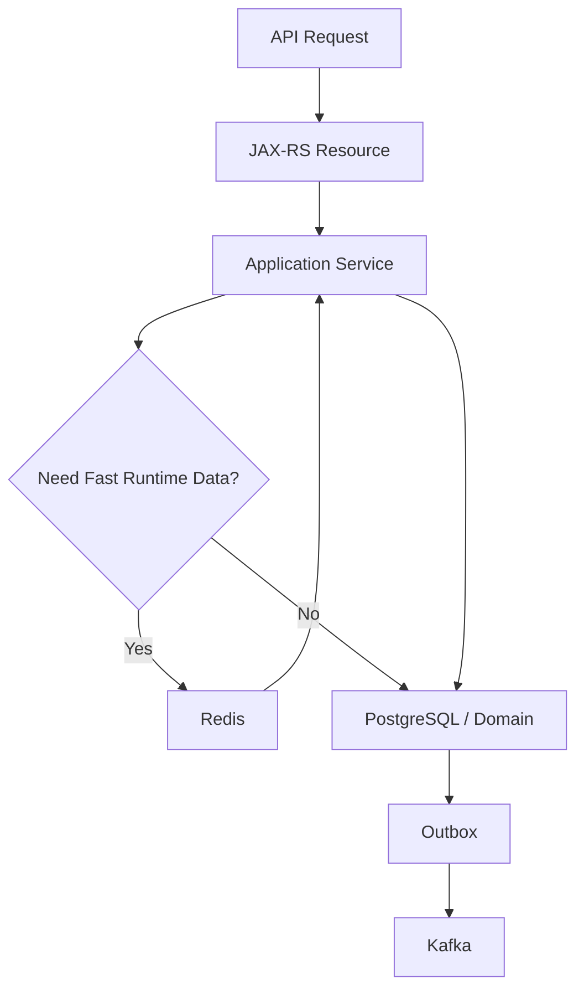
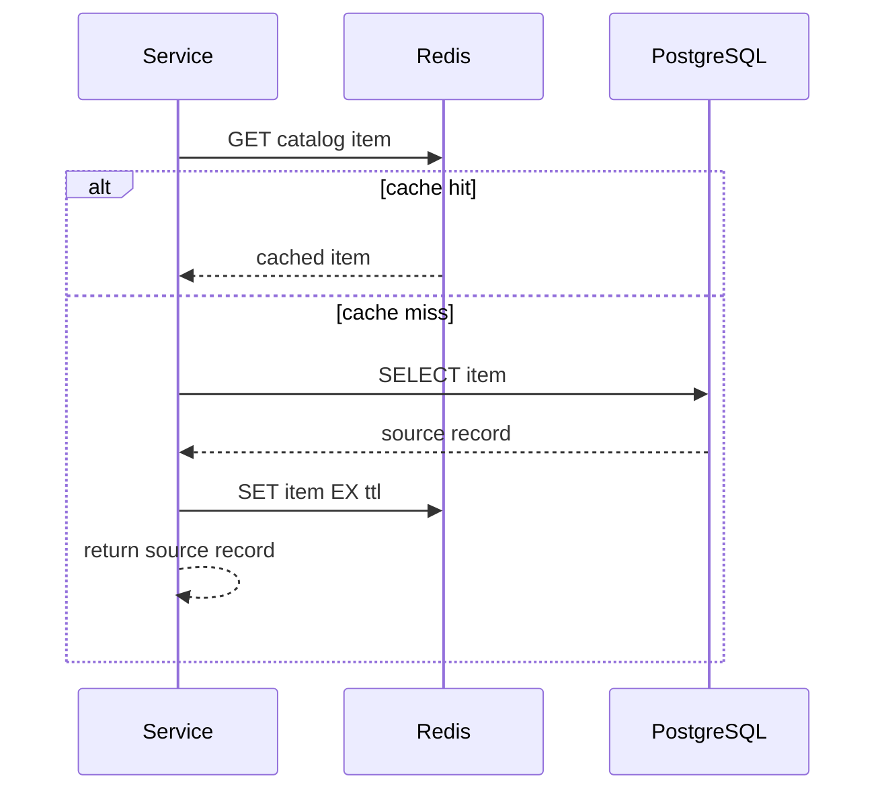
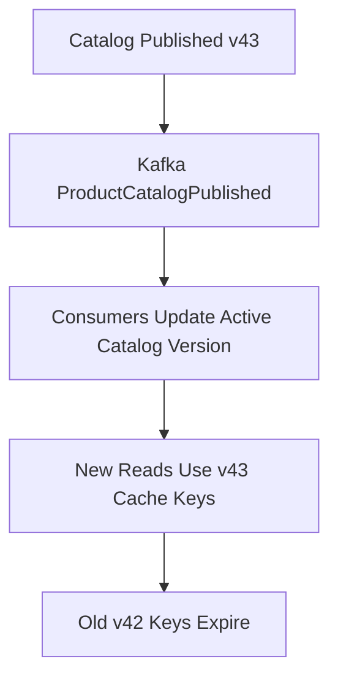
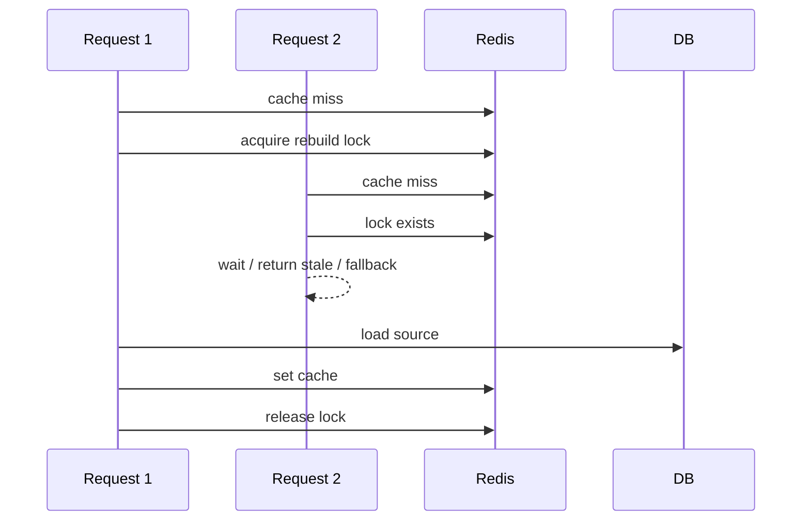
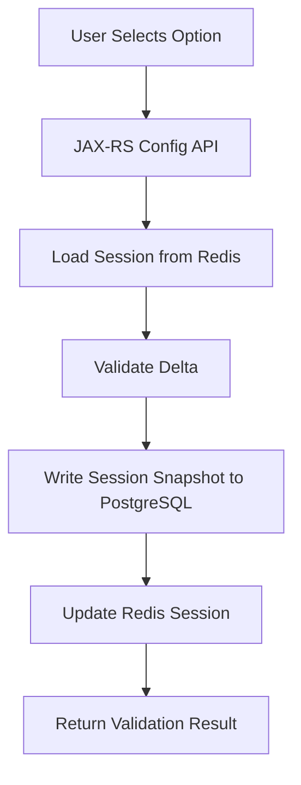
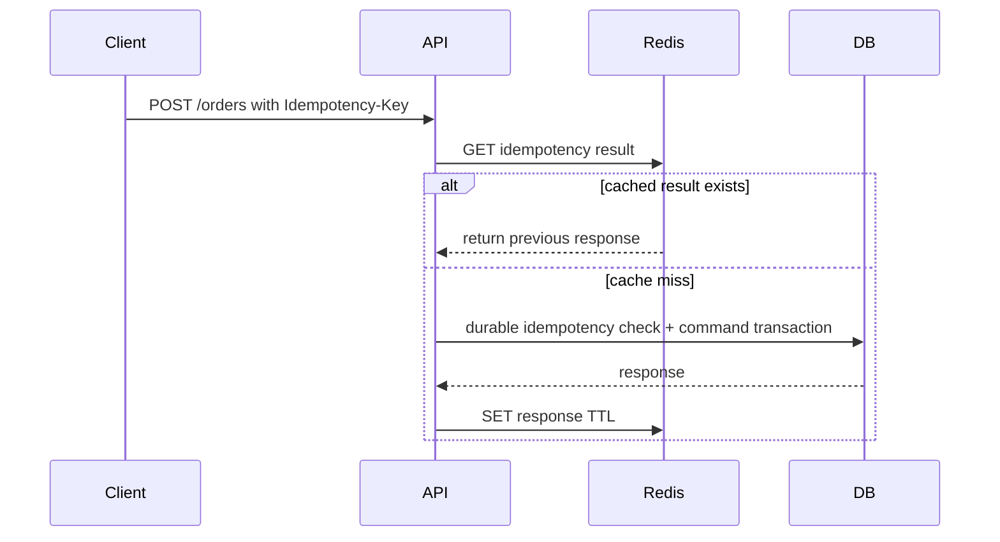
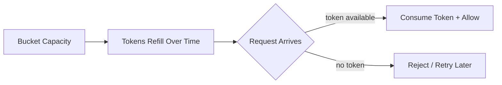
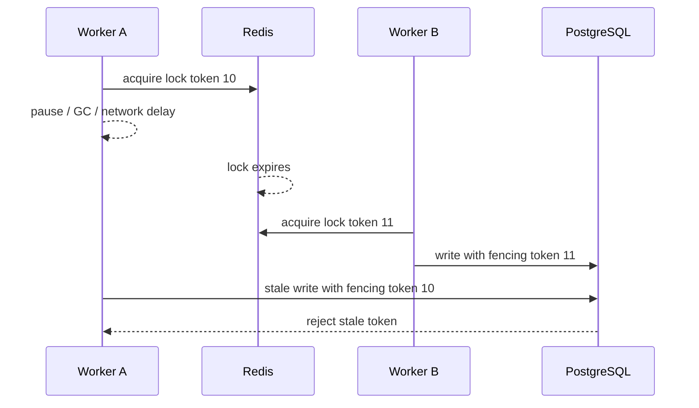
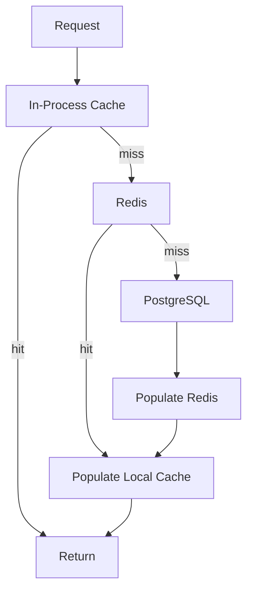

------
title: Learn Java Microservices CPQ/OMS Platform - Part 024
description: Applying Redis runtime patterns for caching, idempotency, rate limiting, locks, sessions, short-lived coordination, and operational resilience in a Java microservices CPQ and order management platform.
series: learn-java-microservices-cpq-oms-platform
seriesTitle: Learn Java Microservices CPQ/OMS Platform
order: 24
partTitle: Redis Runtime Patterns
tags:
- java
- microservices
- cpq
- oms
- redis
- caching
- rate-limiting
- idempotency
- distributed-systems
- performance
date: 2026-07-02
---

# Part 024 — Redis Runtime Patterns

## 1. What This Part Solves

The platform now has:

- OpenAPI and schema contracts;
- PostgreSQL as source of truth;
- MyBatis persistence boundaries;
- CPQ core services;
- order lifecycle;
- Camunda 7 orchestration;
- Kafka events;
- outbox/inbox reliability;
- event schema governance.

This part introduces Redis as a runtime acceleration and coordination layer.

The key sentence:

> **Redis is not the source of truth for CPQ/OMS commercial state. Redis is a fast, bounded, observable runtime tool.**

Use Redis where it improves latency, throughput, load shedding, or short-lived coordination.
Do not use Redis to bypass core invariants that belong in PostgreSQL, Kafka, or the domain model.

---

## 2. Redis Role in This Platform

Recommended Redis use cases:

| Use Case | Good Fit? | Source of Truth? |
|---|---:|---:|
| Product catalog read cache | yes | no |
| Price book cache | yes | no |
| Configuration session acceleration | yes | PostgreSQL remains source |
| Idempotency key short-term cache | yes | PostgreSQL for durable idempotency |
| API rate limiting | yes | Redis runtime state |
| Token bucket quota | yes | Redis runtime state |
| Distributed lock for cache rebuild | careful | no |
| Process orchestration state | no | Camunda/PostgreSQL |
| Order state machine | no | PostgreSQL |
| Event backbone | no | Kafka |
| Durable audit trail | no | PostgreSQL/audit store |
| Pub/Sub for critical event delivery | no | Kafka |
| Ephemeral notification fanout | maybe | no |

The platform principle:

> **A Redis outage may degrade performance or temporarily reject traffic, but it must not corrupt quote/order truth.**

---

## 3. Mental Model: Hot Path Accelerator

Redis sits beside services, not above the domain model.



Redis should accelerate:

- repeated reads;
- small state machines with short TTL;
- rate checks;
- locks with clear expiry;
- duplicate request suppression;
- expensive computation reuse;
- stampede prevention.

Redis should not own:

- final quote status;
- final order status;
- approval decision record;
- price audit trail;
- fulfillment evidence;
- payment state;
- regulatory evidence.

---

## 4. Key Design Principles

1. **Every key has an owner.**
2. **Every key has a TTL unless there is a strong reason not to.**
3. **Every cached value has a source of truth.**
4. **Every cache has an invalidation strategy.**
5. **Every lock has a timeout and fencing strategy where needed.**
6. **Every Redis call has a timeout budget.**
7. **Every Redis failure has a fallback decision.**
8. **No critical state transition depends only on Redis.**
9. **No unbounded high-cardinality key growth.**
10. **No sensitive data without classification and retention policy.**

---

## 5. Key Naming Convention

Use names that encode ownership, tenant, domain, and purpose.

Pattern:

```text
<env>:<service>:<tenant>:<domain>:<purpose>:<id>
```

Examples:

```text
prod:catalog-service:tenant_123:catalog:published:v42
prod:pricing-service:tenant_123:pricebook:offer-enterprise:v17
prod:config-service:tenant_123:config-session:sess_01JZ...
prod:quote-service:tenant_123:idempotency:accept-quote:req_abc
prod:api-gateway:tenant_123:rate:user:user_456:minute:202607021015
```

For Redis Cluster, use hash tags when multi-key Lua scripts require keys in the same slot:

```text
prod:quote-service:{tenant_123:req_abc}:idempotency
prod:quote-service:{tenant_123:req_abc}:result
```

Key naming is architecture.
Poor naming makes operations impossible.

---

## 6. Serialization Policy

Recommended value formats:

| Value Type | Format | Notes |
|---|---|---|
| Simple counters | integer string | `INCR`, `DECR`, Lua operations. |
| Small structured object | JSON | Human-readable and easy to debug. |
| High-volume binary payload | MessagePack/CBOR only if justified | Harder debugging. |
| Cached schema-bound object | JSON with schema version | Enables migration. |
| Lock value | random token + metadata | Needed for safe release. |

Example cached value:

```json
{
  "schemaVersion": 1,
  "catalogVersion": 42,
  "offerId": "offer-enterprise-connectivity",
  "cachedAt": "2026-07-02T10:15:30Z",
  "ttlSeconds": 900,
  "payload": {
    "displayName": "Enterprise Connectivity",
    "status": "ACTIVE",
    "eligibleActions": ["ADD", "CHANGE"]
  }
}
```

Never cache Java serialization blobs.
They are hard to inspect, fragile across deployment versions, and hostile to polyglot consumers.

---

## 7. Cache-Aside Pattern

Cache-aside is the default pattern for catalog and price book reads.



Java-shaped interface:

```java
public interface RuntimeCache {
    <T> Optional<T> get(String key, Class<T> type);
    void put(String key, Object value, Duration ttl);
    void evict(String key);
}
```

Application service:

```java
public ProductOfferView getOffer(String tenantId, String offerId, long catalogVersion) {
    String key = keys.catalogOffer(tenantId, offerId, catalogVersion);

    return cache.get(key, ProductOfferView.class)
        .orElseGet(() -> {
            ProductOfferView view = catalogMapper.findPublishedOffer(tenantId, offerId, catalogVersion)
                .orElseThrow(() -> new NotFoundException("Offer not found"));
            cache.put(key, view, Duration.ofMinutes(15));
            return view;
        });
}
```

The cache is an optimization.
The database remains source of truth.

---

## 8. Cache Invalidation Strategy

Cache invalidation must be designed, not hoped for.

For CPQ/OMS, prefer versioned cache keys.

```text
catalog:published:v42:offer:offer-enterprise
catalog:published:v43:offer:offer-enterprise
```

When catalog v43 is published, consumers naturally read different keys.
Old keys expire by TTL.

This avoids broad delete storms.



Invalidation patterns:

| Pattern | Use For | Risk |
|---|---|---|
| TTL only | Non-critical fast-changing hints | Stale data within TTL. |
| Versioned keys | Catalog, price book, rules | More keys until expiry. |
| Explicit delete | Small known key set | Missed delete causes stale data. |
| Pub/Sub invalidation | Local near-cache invalidation | At-most-once delivery risk. |
| Kafka invalidation event | Cross-service durable invalidation | Slightly higher latency. |

For critical cross-service invalidation, prefer Kafka event plus versioned keys.

---

## 9. Cache Stampede Prevention

When a hot key expires, many requests may rebuild it at once.

Mitigations:

1. Add TTL jitter.
2. Use single-flight lock.
3. Serve stale value briefly while refreshing.
4. Pre-warm on publish event.
5. Use versioned keys to avoid synchronized invalidation.

TTL jitter:

```java
Duration withJitter(Duration base) {
    long jitterSeconds = ThreadLocalRandom.current().nextLong(0, 60);
    return base.plusSeconds(jitterSeconds);
}
```

Single-flight logic:



Use this only for expensive rebuilds.
Locking every cache miss creates unnecessary latency.

---

## 10. Pricing Cache Pattern

Pricing has stricter correctness requirements than catalog display reads.

Cache safe inputs:

- price book version;
- offer ID;
- customer segment;
- region;
- currency;
- term;
- quantity tier;
- rule version.

Cache key:

```text
prod:pricing-service:tenant_123:price:v17:offer_abc:USD:term_36:tier_1:segment_enterprise
```

Do not cache:

- final quote total without including every input dimension;
- discount approval outcome;
- tax result unless tax input version is included;
- customer-specific negotiated price without authorization boundary.

Pricing cache value should include the inputs used to compute it:

```json
{
  "schemaVersion": 1,
  "priceBookVersion": 17,
  "currency": "USD",
  "termMonths": 36,
  "calculatedAt": "2026-07-02T10:15:30Z",
  "amountMinor": 129900,
  "explanation": [
    "base_price:150000",
    "term_discount:-20100"
  ]
}
```

A cached price without explanation is hard to debug.

---

## 11. Configuration Session Acceleration

Configuration sessions are often interactive.
The user selects options, receives validation feedback, changes attributes, and repeats.

Redis can improve latency for draft session state.



Important rule:

> **Redis may hold the latest interactive session copy, but PostgreSQL must periodically or transactionally receive durable session snapshots.**

Session key:

```text
prod:config-service:tenant_123:config-session:sess_01JZ...
```

TTL:

- 30 minutes for inactive session;
- extend on activity;
- expire abandoned draft;
- preserve finalized configuration in PostgreSQL.

Session value:

```json
{
  "schemaVersion": 1,
  "sessionId": "sess_01JZ...",
  "version": 12,
  "catalogVersion": 42,
  "lastValidatedAt": "2026-07-02T10:15:30Z",
  "selectedOptions": [
    { "offerId": "offer-router", "quantity": 1 }
  ],
  "validationSummary": {
    "valid": true,
    "warnings": []
  }
}
```

Use optimistic versioning even in Redis.
Interactive sessions can have multiple tabs.

---

## 12. Idempotency Key Cache

Part 007 and Part 016 introduced idempotency for HTTP commands.
PostgreSQL is the durable idempotency record.
Redis can reduce repeated DB reads for hot retries.

Pattern:



Key:

```text
prod:order-service:tenant_123:idempotency:capture-order:req_01JZ...
```

Value:

```json
{
  "schemaVersion": 1,
  "requestHash": "sha256:...",
  "status": "COMPLETED",
  "httpStatus": 201,
  "resourceId": "ord_01JZ...",
  "responseBody": {
    "orderId": "ord_01JZ...",
    "orderNumber": "SO-2026-000001"
  },
  "createdAt": "2026-07-02T10:15:30Z"
}
```

Never rely only on Redis for critical idempotency.
A Redis eviction must not allow duplicate order capture.

---

## 13. Rate Limiting

Redis is a strong fit for runtime rate limiting because counters and TTLs are fast and atomic operations can be bundled with Lua.

Use cases:

- protect quote pricing endpoint;
- limit configuration validation spam;
- throttle login/token-related endpoints;
- prevent one tenant from overwhelming shared resources;
- protect downstream external integration adapters.

Rate limit dimensions:

| Dimension | Example |
|---|---|
| Tenant | 10,000 quote validations/minute per tenant. |
| User | 300 configuration updates/minute per user. |
| API client | 1,000 order capture attempts/minute. |
| Endpoint | `/pricing/calculate` has stricter limit than read-only catalog. |
| External adapter | 100 provisioning calls/minute per provider. |

---

## 14. Fixed Window Rate Limiter

Simple but has boundary burst behavior.

Key:

```text
prod:api-gateway:tenant_123:rate:pricing:202607021015
```

Lua script:

```lua
local key = KEYS[1]
local limit = tonumber(ARGV[1])
local ttl = tonumber(ARGV[2])

local current = redis.call('INCR', key)
if current == 1 then
  redis.call('EXPIRE', key, ttl)
end

if current > limit then
  return {0, current, redis.call('TTL', key)}
end

return {1, current, redis.call('TTL', key)}
```

Java wrapper:

```java
public RateLimitDecision check(String key, int limit, Duration window) {
    List<Long> result = redis.evalsha(
        fixedWindowScriptSha,
        List.of(key),
        List.of(String.valueOf(limit), String.valueOf(window.toSeconds()))
    );

    boolean allowed = result.get(0) == 1L;
    long used = result.get(1);
    long retryAfterSeconds = result.get(2);

    return new RateLimitDecision(allowed, used, limit, retryAfterSeconds);
}
```

Good for:

- simple protection;
- low sensitivity endpoints;
- operational simplicity.

Bad for:

- strict fairness;
- high-value paid quota;
- avoiding boundary bursts.

---

## 15. Token Bucket Rate Limiter

Token bucket allows controlled bursts.

Mental model:



Use token bucket for:

- partner API quota;
- downstream adapter protection;
- burst-tolerant user actions;
- fair-but-flexible tenant control.

Store:

- current token count;
- last refill timestamp.

Key:

```text
prod:api-gateway:tenant_123:bucket:pricing
```

Design caution:

- use server-side time consistently;
- avoid client clock dependence;
- use Lua for atomic refill and consume;
- keep TTL long enough for inactive buckets to disappear;
- expose `Retry-After` headers.

---

## 16. Sliding Window Rate Limiter

Sliding window gives better fairness.

Sorted set approach:

```text
key: prod:api-gateway:tenant_123:sliding:pricing:user_456
value: sorted set of request timestamps
```

Lua pseudocode:

```lua
local key = KEYS[1]
local now = tonumber(ARGV[1])
local window = tonumber(ARGV[2])
local limit = tonumber(ARGV[3])
local member = ARGV[4]

redis.call('ZREMRANGEBYSCORE', key, 0, now - window)
local count = redis.call('ZCARD', key)

if count >= limit then
  return {0, count}
end

redis.call('ZADD', key, now, member)
redis.call('EXPIRE', key, math.ceil(window / 1000))
return {1, count + 1}
```

Trade-off:

| Algorithm | Accuracy | Memory | Complexity |
|---|---:|---:|---:|
| Fixed window | low/medium | low | low |
| Sliding window counter | medium/high | low | medium |
| Sliding window log | high | high | medium |
| Token bucket | medium | low | medium |

Use the simplest algorithm that satisfies business need.

---

## 17. Distributed Locking: Use Carefully

Redis locks are useful for short-lived coordination.
They are not a replacement for database constraints or state-machine guards.

Good uses:

- prevent duplicate cache rebuild;
- prevent concurrent expensive projection rebuild;
- single scheduler leader for non-critical cleanup;
- guard one-time short operation where duplicate work is tolerable but wasteful.

Risky uses:

- protecting money movement;
- ensuring only one order capture ever occurs;
- replacing unique constraints;
- replacing idempotency table;
- protecting long-running fulfillment workflow.

Basic safe lock properties:

1. `SET key value NX PX ttl`.
2. Value is random token.
3. Release only if token matches.
4. TTL is short and bounded.
5. Critical operation is shorter than TTL or uses extension safely.
6. System remains correct if lock expires early.

Release script:

```lua
if redis.call('GET', KEYS[1]) == ARGV[1] then
  return redis.call('DEL', KEYS[1])
else
  return 0
end
```

Java-shaped usage:

```java
try (RedisLease lease = lockClient.tryAcquire(key, Duration.ofSeconds(10))
        .orElseThrow(() -> new BusyException("Resource rebuild already in progress"))) {
    rebuildProjection();
}
```

If correctness depends on the lock, rethink the design.

---

## 18. Fencing Tokens

A lock can expire while the old holder is still running.
Then a second holder may acquire the lock.
Without fencing, stale writes can win.



Fencing token strategy:

- Redis increments a monotonic token on acquire;
- downstream resource stores latest accepted token;
- stale lower token writes are rejected.

For PostgreSQL-backed truth, database constraints are still stronger than cache locks.

---

## 19. Redis Pub/Sub

Redis Pub/Sub is useful for ephemeral fanout.
It is not durable.

Good uses:

- notify app nodes to evict local near-cache;
- ephemeral operational signal;
- local development fanout;
- websocket push hint where missing a message is acceptable.

Bad uses:

- order lifecycle event delivery;
- quote accepted event delivery;
- fulfillment completion;
- audit evidence;
- process correlation where message loss matters.

Use Kafka for durable business events.
Use Redis Pub/Sub only when at-most-once delivery is acceptable.

---

## 20. Redis Streams vs Kafka

Redis Streams can provide stream-like behavior with consumer groups.
But in this platform, Kafka is already the durable event backbone.

Use Redis Streams only for narrowly scoped runtime queues when:

- message volume is local to one service;
- retention is short;
- losing long-term replay is acceptable;
- operational team is comfortable running the pattern;
- it does not duplicate Kafka architecture.

Possible use:

- background cache warmup queue;
- non-critical async scoring jobs;
- local notification fanout within one bounded context.

Avoid using Redis Streams for:

- cross-service domain events;
- order fulfillment commands;
- audit history;
- replay-critical projections.

Do not build a second event backbone accidentally.

---

## 21. Near-Cache Pattern

For very hot catalog/pricing reads, services may use in-process cache plus Redis.



Near-cache rules:

- keep TTL short;
- include version in key;
- never store tenant-unsafe data under shared key;
- observe hit ratio and memory use;
- invalidate through Kafka or Redis Pub/Sub if required;
- keep fallback to Redis/DB.

Near-cache is easy to add and hard to reason about.
Use it only after measurement.

---

## 22. Redis for Deduplication Windows

Kafka consumers already use durable inbox in PostgreSQL.
Redis can add short-term fast deduplication for high-volume non-critical flows.

Pattern:

```text
SET dedup:event:<eventId> 1 NX EX 86400
```

If result is set, process continues.
If key already exists, skip.

Use for:

- noisy notification signals;
- metrics event compaction;
- short-lived UI push suppression.

Do not use as the only dedup mechanism for:

- order capture;
- fulfillment commands;
- billing activation;
- audit events.

Redis dedup is a speed layer.
Inbox is a correctness layer.

---

## 23. Redis and Camunda 7

Do not store Camunda process truth in Redis.
Camunda runtime/history tables own process truth.

Redis can help around Camunda:

| Pattern | Use |
|---|---|
| Process correlation cache | Map order ID to process instance ID for fast lookup, with fallback to Camunda query. |
| Incident dashboard cache | Cache derived incident summary for UI. |
| Duplicate start suppression | Short-term guard before durable idempotency check. |
| Job storm rate limiter | Protect external systems from too many delegate calls. |
| Worker throttling | Limit concurrent calls per downstream provider. |

Example key:

```text
prod:orchestration-service:tenant_123:camunda:order-process:ord_01JZ...
```

Value:

```json
{
  "schemaVersion": 1,
  "orderId": "ord_01JZ...",
  "processInstanceId": "3f2c...",
  "businessKey": "ord_01JZ...",
  "processDefinitionKey": "order-orchestration",
  "cachedAt": "2026-07-02T10:15:30Z"
}
```

Fallback must query Camunda or service database.

---

## 24. TTL Policy

TTL is part of the contract.

| Key Type | TTL |
|---|---:|
| Published catalog item | 15-60 minutes, versioned key. |
| Price cache | 5-30 minutes, versioned by price book/rule. |
| Configuration session | 30 minutes inactivity, extend on write. |
| Idempotency result cache | 24 hours or aligned with durable idempotency. |
| Rate limit counter | Window length plus small buffer. |
| Distributed lock | Seconds, rarely minutes. |
| Near-cache invalidation marker | Minutes. |
| Dedup window | Based on expected duplicate interval. |

Avoid keys without TTL unless they are carefully bounded and operationally owned.

Operational query:

```text
Which key families can grow without bound?
```

If the answer is unclear, the design is not production-ready.

---

## 25. Failure Behavior Matrix

| Redis Failure | Safe Behavior |
|---|---|
| Cache read timeout | Fall back to PostgreSQL or return degraded response. |
| Cache write timeout | Continue with source-of-truth result, log metric. |
| Idempotency cache miss | Fall back to PostgreSQL durable idempotency. |
| Rate limiter unavailable | Fail open or fail closed based on endpoint risk. |
| Lock acquire fails | Skip rebuild, return stale, or retry later. |
| Redis cluster resharding latency | Keep timeouts low and fallback paths clear. |
| Eviction of cached price | Recompute from source. |
| Eviction of idempotency cache | Durable DB still prevents duplicate. |
| Pub/Sub message missed | TTL/versioned keys prevent permanent stale state. |

Decide fail-open vs fail-closed per endpoint.

Examples:

| Endpoint | Redis Rate Limit Failure |
|---|---|
| `GET /catalog/offers` | fail open with DB fallback. |
| `POST /pricing/calculate` | fail closed or degraded if pricing engine is under attack. |
| `POST /orders` | do not depend solely on Redis; use DB idempotency. |
| `POST /auth/token` | fail closed is usually safer. |

---

## 26. Timeout Budget

Redis is fast until it is not.
Every Redis call needs a timeout.

Example budget:

| Operation | Timeout |
|---|---:|
| In-process cache lookup | <1 ms typical |
| Redis cache GET | 5-20 ms |
| Redis cache SET | 5-20 ms |
| Rate limit Lua script | 10-30 ms |
| Lock acquire | 10-30 ms |
| PostgreSQL fallback | endpoint-specific |

Do not let Redis timeout consume the entire API budget.

For a 200 ms pricing API budget:

```text
JAX-RS overhead: 10 ms
Redis cache attempt: 15 ms
Pricing calculation: 120 ms
PostgreSQL lookup: 40 ms
Response serialization: 15 ms
```

If Redis waits 500 ms, the endpoint is already broken.

---

## 27. Java Client Boundary

Keep Redis client usage behind application ports.
Do not scatter Redis operations across domain code.

Ports:

```java
public interface CatalogRuntimeCache {
    Optional<ProductOfferView> getOffer(String tenantId, String offerId, long catalogVersion);
    void putOffer(String tenantId, String offerId, long catalogVersion, ProductOfferView view);
}

public interface RateLimiter {
    RateLimitDecision check(RateLimitSubject subject, RateLimitPolicy policy);
}

public interface DistributedLeaseManager {
    Optional<Lease> tryAcquire(String key, Duration ttl);
}
```

Adapter:

```java
public final class RedisCatalogRuntimeCache implements CatalogRuntimeCache {
    private final RedisCommands<String, String> redis;
    private final ObjectMapper objectMapper;
    private final CacheKeyFactory keys;

    @Override
    public Optional<ProductOfferView> getOffer(String tenantId, String offerId, long catalogVersion) {
        String json = redis.get(keys.catalogOffer(tenantId, offerId, catalogVersion));
        if (json == null) {
            return Optional.empty();
        }
        return Optional.of(read(json, ProductOfferView.class));
    }

    @Override
    public void putOffer(String tenantId, String offerId, long catalogVersion, ProductOfferView view) {
        String key = keys.catalogOffer(tenantId, offerId, catalogVersion);
        redis.setex(key, 900, write(view));
    }
}
```

The domain layer should not know Redis exists.

---

## 28. Local Development Setup

Docker Compose service:

```yaml
services:
  redis:
    image: redis:7-alpine
    command: ["redis-server", "--appendonly", "yes"]
    ports:
      - "6379:6379"
    healthcheck:
      test: ["CMD", "redis-cli", "ping"]
      interval: 5s
      timeout: 3s
      retries: 10
```

Testcontainers example:

```java
static GenericContainer<?> redis = new GenericContainer<>(DockerImageName.parse("redis:7-alpine"))
    .withExposedPorts(6379);

@BeforeAll
static void startRedis() {
    redis.start();
    String host = redis.getHost();
    Integer port = redis.getMappedPort(6379);
    redisClient = RedisClient.create("redis://" + host + ":" + port);
}
```

Tests should cover:

- cache hit/miss;
- TTL expiry;
- lock acquire/release;
- lock release token mismatch;
- rate limit boundary;
- Lua script atomicity;
- Redis unavailable fallback.

---

## 29. Observability

Metrics:

- Redis operation latency by command and key family;
- cache hit ratio by key family;
- cache miss ratio;
- cache set failures;
- fallback-to-DB count;
- rate limit allowed/rejected count;
- lock acquire success/failure;
- lock wait time;
- Lua script errors;
- Redis connection pool usage;
- Redis timeout count;
- Redis memory usage;
- key eviction count;
- expired key count;
- command error count.

Structured log example:

```json
{
  "service": "pricing-service",
  "operation": "redis.cache.get",
  "keyFamily": "pricebook-offer",
  "tenantId": "tenant_123",
  "result": "miss",
  "durationMs": 8,
  "correlationId": "corr_01JZ..."
}
```

Do not log full keys if they contain sensitive IDs.
Log key family and hashed identifiers where appropriate.

---

## 30. Capacity and Memory Modeling

Estimate before production.

Example price cache:

```text
tenants = 100
offers per tenant = 5,000
currencies = 3
terms = 4
segments = 5
average value size = 1 KB
active key fraction = 20%

keys = 100 * 5,000 * 3 * 4 * 5 * 0.2
     = 6,000,000 keys

value memory ≈ 6 GB before Redis overhead
```

This is already large.
You may need:

- lower active fraction;
- shorter TTL;
- precompute only hot offers;
- compress values;
- reduce dimensions;
- local cache for ultra-hot keys;
- separate Redis clusters per workload;
- reconsider what is cached.

Memory model every high-cardinality cache.

---

## 31. Eviction Policy

Eviction policy is an architectural choice.

Common options:

| Policy | Meaning | Use |
|---|---|---|
| `noeviction` | Write fails when memory full. | Safer for coordination/rate limit keys. |
| `allkeys-lru` | Evict least recently used among all keys. | General cache clusters. |
| `volatile-lru` | Evict LRU among keys with TTL. | Cache keys with TTL. |
| `allkeys-lfu` | Evict least frequently used. | Hotspot-aware cache. |
| `volatile-ttl` | Evict keys with shortest TTL. | Special TTL-driven behavior. |

Do not mix critical rate limit state with best-effort massive cache in the same Redis instance without understanding eviction impact.

Separate workloads when necessary:

```text
redis-cache-cluster
redis-rate-limit-cluster
redis-session-cluster
```

---

## 32. Security

Security rules:

- Use TLS where network requires it.
- Use ACLs per service.
- Do not share one global Redis credential across all services.
- Avoid storing secrets in Redis.
- Avoid storing raw PII unless justified.
- Prefix keys by environment and tenant.
- Protect admin commands.
- Monitor suspicious command patterns.
- Treat Redis backups/snapshots as sensitive if enabled.

Example ACL idea:

```text
pricing-service can access prod:pricing-service:* and shared read-only catalog cache.
quote-service can access prod:quote-service:*.
api-gateway can access prod:api-gateway:*.
```

Least privilege is harder with key-value systems, but still worth designing.

---

## 33. Redis Cluster Considerations

Redis Cluster shards by hash slot.
Multi-key operations require keys in the same slot.

Use hash tags:

```text
prod:rate:{tenant_123:user_456}:counter
prod:rate:{tenant_123:user_456}:metadata
```

Cluster concerns:

- multi-key Lua scripts need same slot;
- resharding may create transient latency;
- hot keys can overload one shard;
- key distribution must be measured;
- large values hurt network and memory;
- scatter-gather patterns are expensive.

Avoid hot global keys like:

```text
global:pricing:counter
```

Prefer partitioned keys:

```text
prod:pricing-service:tenant_123:quota:minute:202607021015
```

---

## 34. Operational Runbook

### 34.1 Cache Hit Ratio Drops

Check:

- recent deployment changed key format;
- catalog/price version changed too frequently;
- TTL too short;
- Redis eviction increased;
- serialization failure prevents cache writes;
- tenant traffic shifted to cold data.

Actions:

- compare key family cardinality before/after deploy;
- inspect sample keys;
- check cache set errors;
- review deployment diff;
- temporarily increase TTL if safe;
- pre-warm hot keys.

### 34.2 Redis Latency Spikes

Check:

- large values;
- slow Lua scripts;
- network latency;
- CPU saturation;
- memory fragmentation;
- cluster resharding;
- connection pool exhaustion.

Actions:

- reduce timeout;
- enable fallback path;
- isolate noisy key family;
- disable expensive cache warming;
- split workload if needed.

### 34.3 Memory Near Limit

Check:

- high-cardinality keys;
- missing TTL;
- large value payloads;
- new feature introduced per-request keys;
- abandoned sessions not expiring.

Actions:

- identify top key families;
- reduce TTL;
- add TTL to missing families;
- delete safe abandoned keys;
- scale memory;
- split cluster by workload.

---

## 35. Failure Modes

| Failure | Cause | Mitigation |
|---|---|---|
| Stale catalog data | TTL too long, invalidation missed. | Versioned keys and publish-version lookup. |
| Duplicate order capture | Redis idempotency evicted. | Durable PostgreSQL idempotency. |
| Cache stampede | Hot key expiry. | TTL jitter, single-flight, pre-warm. |
| Lock releases another owner's lock | Delete without token check. | Token-based release Lua script. |
| Stale lock holder writes | Lock expired mid-operation. | Fencing token or DB constraint. |
| Rate limit bypass | Redis unavailable and endpoint fails open. | Endpoint-specific fail-open/fail-closed policy. |
| Memory explosion | High-cardinality keys without model. | Capacity model, TTL, key family metrics. |
| Pub/Sub message loss | Subscriber disconnected. | Use Pub/Sub only for non-critical signals. |
| Hot shard | Poor key distribution. | Hash key design and cluster metrics. |
| Sensitive data leak | PII cached broadly. | Field classification and encryption/avoidance. |

---

## 36. Anti-Patterns

### 36.1 Redis as Order Database

Bad:

```text
order state stored in Redis hash; PostgreSQL updated later eventually
```

Why bad:

- order state needs durable constraints;
- audit and recovery become weak;
- eviction/failover semantics can break truth;
- state machine invariants are harder to enforce.

### 36.2 No TTL on High-Cardinality Keys

Bad:

```text
prod:quote-service:tenant_123:request:req_...
```

without expiry.

This becomes invisible memory debt.

### 36.3 Redis Lock as Correctness Mechanism

Bad:

```text
Use Redis lock to ensure only one order is created.
```

Correct:

- database unique constraint;
- durable idempotency record;
- state transition guard;
- Redis only as optional fast pre-check.

### 36.4 Cache Key Missing Version

Bad:

```text
catalog:offer:offer-router
```

Better:

```text
catalog:v42:offer:offer-router
```

Without version, stale data becomes hard to reason about.

### 36.5 One Redis for Everything

A massive cache workload can evict or delay rate limiter keys.
Separate when operational blast radius matters.

---

## 37. Implementation Checklist

For each Redis key family:

- [ ] Owner service is known.
- [ ] Key naming follows convention.
- [ ] Tenant isolation is explicit.
- [ ] TTL is defined.
- [ ] Source of truth is documented.
- [ ] Serialization format is documented.
- [ ] Schema version is included for structured values.
- [ ] Invalidation strategy is defined.
- [ ] Fallback behavior is defined.
- [ ] Timeout is configured.
- [ ] Metrics exist.
- [ ] Sensitive data classification is complete.
- [ ] Capacity model exists.
- [ ] Eviction impact is understood.
- [ ] Testcontainers coverage exists.
- [ ] Runbook section exists.

---

## 38. Practice: Pricing Cache + Rate Limiter

Build two Redis adapters.

### 38.1 Pricing Cache

Requirements:

- key includes tenant, price book version, offer ID, currency, term, segment;
- value includes schema version and calculation inputs;
- TTL has jitter;
- fallback to PostgreSQL/calculation on miss;
- cache write failure does not fail pricing response;
- metrics record hit/miss/set failure.

### 38.2 Rate Limiter

Requirements:

- fixed window Lua script;
- per-tenant and per-user keys;
- `Retry-After` response calculation;
- fail-closed for pricing calculation after threshold;
- fail-open for catalog reads;
- Testcontainers test for boundary behavior.

Expected result:

- Redis improves hot-path performance;
- Redis failure does not corrupt commercial truth;
- rate limits protect expensive endpoints;
- operational metrics reveal cache behavior.

---

## 39. Part Summary

Redis is extremely useful in this CPQ/OMS platform when it is placed in the correct role.

Use Redis for:

- catalog and price read acceleration;
- configuration session acceleration;
- idempotency response cache;
- rate limiting;
- short-lived locks;
- near-cache invalidation hints;
- runtime counters and throttles.

Do not use Redis as:

- source of truth for orders;
- audit log;
- workflow engine;
- durable event backbone;
- replacement for database constraints;
- replacement for Kafka;
- replacement for PostgreSQL idempotency.

The next part connects everything into cross-service consistency and saga design.
That is where quote, order, Camunda, Kafka, PostgreSQL, and Redis must work together under failure.
