# Part 025 — Cross-Service Consistency and Saga Design

Pada part sebelumnya kita sudah membangun event backbone, outbox/inbox, schema evolution, dan Redis runtime patterns. Sekarang kita masuk ke bagian yang sering membedakan sistem microservices yang hanya "terpisah secara deployment" dari sistem microservices yang benar-benar **mampu bertahan saat sebagian komponen gagal**: **cross-service consistency**.

Dalam CPQ/OMS, tidak ada satu transaksi database tunggal yang bisa meliputi semua hal berikut sekaligus:

- quote sudah accepted,
- order sudah captured,
- order line sudah dinormalisasi,
- workflow Camunda sudah berjalan,
- fulfillment sudah dimulai,
- billing/accounting sudah menerima event,
- customer notification sudah terkirim,
- audit evidence sudah tersimpan.

Jika kita mencoba memaksa semuanya menjadi satu transaksi global, desain akan rapuh, lambat, sulit dioperasikan, dan biasanya tetap gagal pada boundary eksternal. Pola yang lebih realistis adalah mengubah long-running business transaction menjadi rangkaian **local transaction** yang terhubung oleh event, command, state machine, dan kompensasi yang eksplisit.

Itulah inti saga.

> Mental model utama: saga bukan "workflow diagram" saja. Saga adalah model konsistensi bisnis yang menjawab: *ketika sistem tidak bisa atomik secara teknis, apa yang tetap harus benar secara bisnis?*

---

## Learning Goals

Setelah menyelesaikan part ini, kita harus mampu:

1. Membedakan **ACID transaction**, **business transaction**, **process instance**, **saga**, dan **state machine**.
2. Mendesain saga CPQ/OMS tanpa membuat distributed transaction palsu.
3. Memilih choreography, orchestration, atau hybrid orchestration secara sadar.
4. Menentukan compensating action yang benar-benar aman secara domain.
5. Mendesain consistency window, reconciliation, dan repair operation.
6. Menghubungkan saga dengan PostgreSQL, MyBatis, Kafka, Camunda 7, Redis, outbox, dan inbox.
7. Membuat failure matrix yang bisa dipakai untuk production runbook.
8. Menghindari anti-pattern seperti "rollback everything", "Kafka as RPC", dan "Camunda owns all states".

---

## Kaufman Deconstruction

Kita pecah skill "cross-service consistency" menjadi subskill yang bisa dilatih:

| Subskill | Pertanyaan Kunci | Output Praktis |
|---|---|---|
| Boundary modeling | Apa yang harus atomik dalam satu database? | Aggregate + transaction boundary |
| Event causality | Event apa yang menyebabkan efek downstream? | Event chain + causation/correlation id |
| Saga ownership | Siapa yang memutuskan next step? | Orchestrator/choreography decision |
| Compensation design | Apa yang bisa dibatalkan dan apa yang hanya bisa dikoreksi? | Compensation catalog |
| Idempotency | Apakah command/event aman diproses ulang? | Idempotency key + inbox/outbox |
| Failure classification | Gagal teknis atau gagal bisnis? sementara atau permanen? | Retry/error policy |
| Reconciliation | Bagaimana menemukan dan memperbaiki drift? | Reconciliation job + repair command |
| Observability | Bagaimana tahu saga sedang stuck? | Saga timeline + metrics + alerts |

Latihan utama part ini bukan menghafal pattern. Latihan utamanya adalah mengambil satu flow bisnis, lalu menulis **failure matrix** sampai kita tahu apa yang terjadi jika setiap step gagal.

---

## The Consistency Problem in CPQ/OMS

Mari ambil flow sederhana:

1. Customer accepts quote.
2. Quote service marks quote as `ACCEPTED`.
3. Order service captures order.
4. Order service emits `OrderCaptured`.
5. Camunda process starts order orchestration.
6. Fulfillment service reserves resources.
7. Billing service prepares charges.
8. Notification service sends confirmation.

Secara bisnis, user melihat ini sebagai satu transaksi: "saya menerima quote dan order saya dibuat".

Secara teknis, ini adalah banyak local transaction.

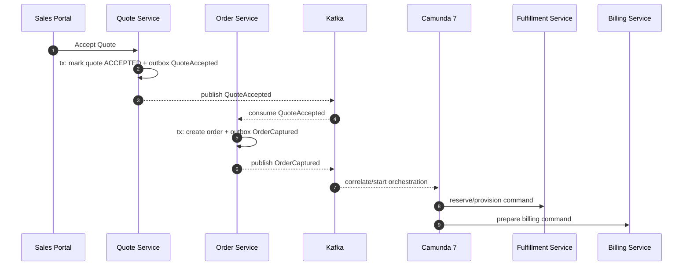

Masalahnya: setiap panah bisa gagal.

- Quote accepted, tetapi event belum published.
- Event published, tetapi order consumer mati.
- Order dibuat, tetapi Camunda process belum dimulai.
- Camunda process dimulai dua kali.
- Fulfillment berhasil, billing gagal.
- Billing berhasil, notification gagal.
- Customer membatalkan order saat sebagian line sudah provisioned.

Sistem top-tier tidak menghindari kondisi ini dengan berharap semuanya berhasil. Sistem top-tier mendesain **state, idempotency, compensation, timeout, dan repair** sejak awal.

---

## Vocabulary: Jangan Campur Istilah

### ACID Transaction

ACID transaction adalah unit atomic di dalam satu resource manager, misalnya satu PostgreSQL database. Dalam platform kita, local transaction biasanya dilakukan di service database masing-masing.

Contoh:

```sql
BEGIN;

UPDATE quote
SET status = 'ACCEPTED',
    accepted_at = now(),
    version = version + 1
WHERE tenant_id = :tenant_id
  AND quote_id = :quote_id
  AND status = 'APPROVED'
  AND version = :expected_version;

INSERT INTO outbox_event (...)
VALUES (...);

COMMIT;
```

Yang harus atomik di sini:

- status quote berubah,
- acceptance evidence tersimpan,
- event intent tersimpan di outbox.

Yang tidak atomik:

- event benar-benar sudah sampai Kafka,
- order sudah dibuat,
- workflow sudah jalan,
- billing sudah disiapkan.

### Business Transaction

Business transaction adalah proses bisnis end-to-end yang user pedulikan. Contoh: quote acceptance sampai order aktif.

Business transaction bisa berlangsung detik, menit, jam, bahkan hari. Tidak realistis menjadikannya satu database transaction.

### State Machine

State machine mendefinisikan state legal dan transition legal untuk aggregate tertentu.

Contoh order:

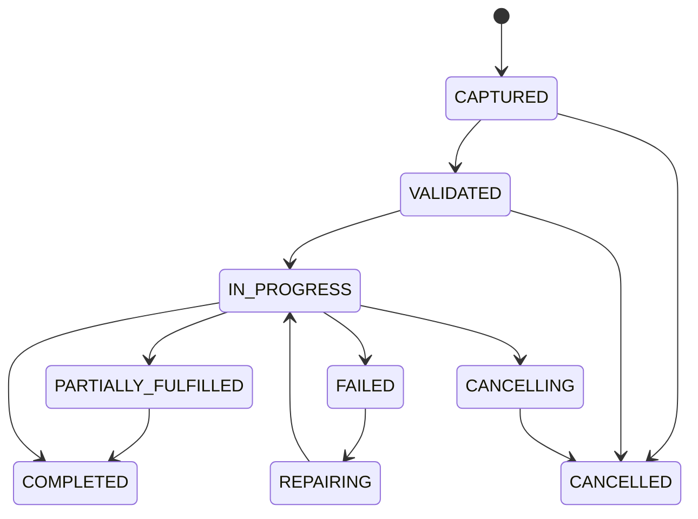

State machine menjawab: "aggregate ini boleh berubah dari state A ke state B?"

### Saga

Saga adalah rangkaian local transaction yang membentuk business transaction lintas service. Jika salah satu step gagal karena alasan bisnis, saga menjalankan compensating action.

Contoh saga quote-to-order:

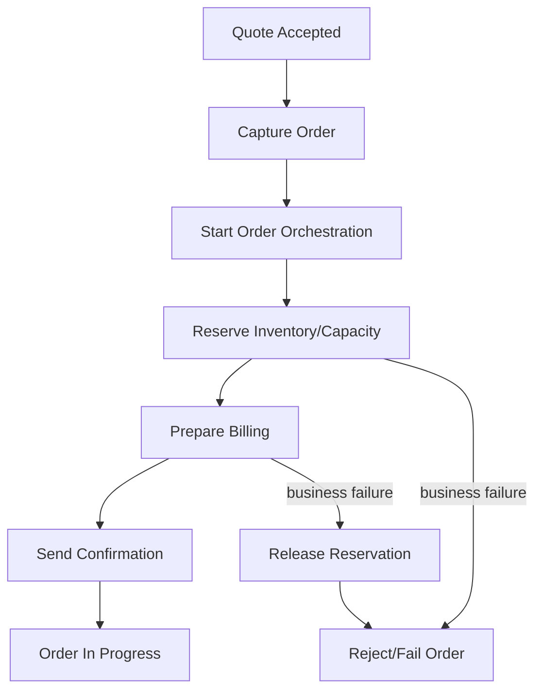

Saga menjawab: "bagaimana business transaction berjalan dan apa yang terjadi jika step tertentu gagal?"

### Process Instance

Process instance adalah runtime representation di workflow engine seperti Camunda. Process instance bisa menjadi implementasi saga, tetapi bukan satu-satunya sumber kebenaran.

Untuk CPQ/OMS yang defensible:

- Order database menyimpan state order.
- Camunda menyimpan orchestration progress.
- Kafka menyimpan event stream.
- Audit menyimpan evidence.

Jangan membuat Camunda menjadi satu-satunya tempat status bisnis hidup.

---

## Consistency Models yang Relevan

### Strong Consistency dalam Satu Service

Gunakan strong consistency untuk invariant yang tidak boleh dilanggar dalam satu aggregate.

Contoh:

- quote tidak boleh accepted dua kali,
- order tidak boleh dibuat dua kali dari quote acceptance yang sama,
- order line tidak boleh punya parent yang tidak ada,
- approval decision tidak boleh dibuat oleh approver yang tidak eligible.

Strong consistency dicapai dengan:

- PostgreSQL constraint,
- transaction,
- unique key,
- row lock,
- optimistic version,
- MyBatis command mapper yang eksplisit.

### Eventual Consistency Antar Service

Gunakan eventual consistency untuk proyeksi dan efek downstream.

Contoh:

- Sales portal mungkin melihat order beberapa detik setelah quote accepted.
- Reporting read model mungkin terlambat dari source of truth.
- Notification bisa dikirim setelah order captured.

Eventual consistency bukan alasan untuk desain sloppy. Kita tetap perlu:

- consistency window yang diketahui,
- monitoring lag,
- retry policy,
- reconciliation.

### Causal Consistency

Dalam CPQ/OMS, causality lebih penting daripada timestamp global.

Contoh:

- `OrderCaptured` harus berasal dari `QuoteAccepted` tertentu.
- `FulfillmentStarted` harus berasal dari `OrderValidated` tertentu.
- `OrderCompleted` tidak boleh terjadi sebelum semua mandatory line terminal success.

Gunakan metadata:

```json
{
  "eventId": "evt_01J...",
  "eventType": "OrderCaptured",
  "tenantId": "tenant_001",
  "aggregateType": "ORDER",
  "aggregateId": "ord_123",
  "aggregateVersion": 1,
  "correlationId": "corr_quote_accept_789",
  "causationId": "evt_quote_accepted_456",
  "occurredAt": "2026-07-02T10:15:30Z",
  "producer": "order-service",
  "schemaVersion": 1,
  "payload": {}
}
```

### Read-Your-Writes UX Consistency

User sering berharap setelah click "Accept Quote", layar langsung menunjukkan order.

Tetapi backend mungkin eventual.

Solusi UX/API:

1. Quote acceptance endpoint mengembalikan accepted quote state dan `operationId`.
2. UI polling operation/order projection.
3. Backend menyediakan operation status.
4. Jika order capture async belum selesai, tampilkan `ACCEPTED_PENDING_ORDER_CAPTURE`.

Jangan pura-pura synchronous jika pipeline sebenarnya asynchronous.

---

## Saga Design Options

Ada tiga pendekatan utama.

### 1. Choreography

Setiap service bereaksi terhadap event dan menerbitkan event berikutnya.

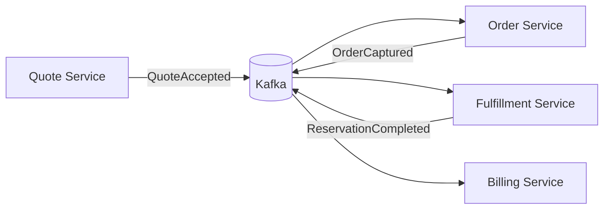

Kelebihan:

- low coupling,
- service autonomous,
- cocok untuk flow sederhana,
- tidak ada central orchestrator bottleneck.

Kekurangan:

- sulit melihat end-to-end state,
- logic tersebar,
- compensation chain sulit dilacak,
- debugging production lebih susah,
- perubahan flow memerlukan koordinasi banyak service.

Gunakan choreography untuk:

- event projection,
- notification,
- reporting,
- side effect non-critical,
- simple follow-up action.

### 2. Orchestration

Satu orchestrator menentukan step berikutnya.

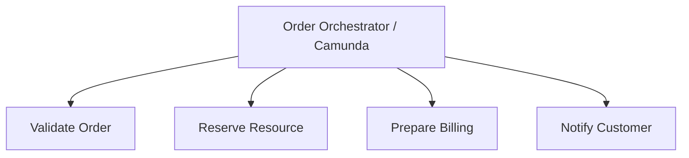

Kelebihan:

- flow eksplisit,
- easier operational visibility,
- compensation lebih mudah dikontrol,
- cocok untuk long-running workflow,
- human task/timer/escalation lebih natural.

Kekurangan:

- orchestrator bisa menjadi god service,
- risiko coupling ke service internals,
- process definition bisa menjadi tempat business logic berlebihan,
- migration dari workflow engine bisa mahal jika boundary buruk.

Gunakan orchestration untuk:

- order lifecycle,
- approval escalation,
- provisioning yang punya timer/compensation,
- human-in-the-loop process,
- long-running transaction dengan state eksplisit.

### 3. Hybrid

Praktik production biasanya hybrid.

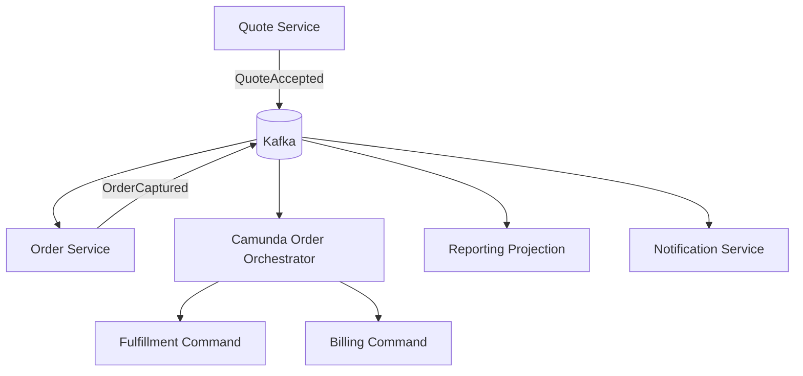

Pattern yang disarankan untuk platform ini:

- Quote-to-order capture: event-driven with strict idempotency.
- Order orchestration: Camunda-managed process.
- Reporting/search/notification: choreographed event consumers.
- Repair/reconciliation: explicit command + admin tooling.

---

## Recommended CPQ/OMS Saga Boundaries

Jangan buat satu mega-saga untuk semua hal. Pecah berdasarkan business transaction.

| Saga | Trigger | Owner | Terminal Success | Terminal Failure |
|---|---|---|---|---|
| Quote Acceptance Saga | `AcceptQuoteCommand` | Quote/Order boundary | Order captured | Quote accepted but order capture failed, repair needed |
| Order Activation Saga | `OrderCaptured` | Order orchestrator | Order active/completed | Order failed/cancelled/requires repair |
| Approval Saga | `QuoteSubmitted` | Approval service/Camunda | Quote approved/rejected | Approval expired/escalation failed |
| Amendment Saga | `AmendOrderCommand` | Order service | Amendment applied | Amendment rejected/compensated |
| Cancellation Saga | `CancelOrderCommand` | Order orchestrator | Order cancelled | Cancellation failed/manual intervention |
| Billing Preparation Saga | `OrderReadyForBilling` | Billing service/orchestrator | Billing prepared | Billing blocked/retry/manual review |

Prinsip:

- Setiap saga punya owner.
- Setiap saga punya correlation id.
- Setiap saga punya terminal state.
- Setiap saga punya timeout policy.
- Setiap saga bisa direkonsiliasi.

---

## Quote Acceptance Saga

Quote acceptance adalah boundary penting karena customer commitment terjadi di sini.

### Desired Business Semantics

Ketika customer menerima quote:

1. Quote harus berubah menjadi `ACCEPTED` sekali saja.
2. Acceptance evidence harus immutable.
3. Order harus dibuat maksimal satu kali.
4. Jika order creation tertunda, sistem harus bisa melanjutkan tanpa customer submit ulang.
5. Jika order creation gagal permanen, kasus harus masuk repair queue.

### Flow

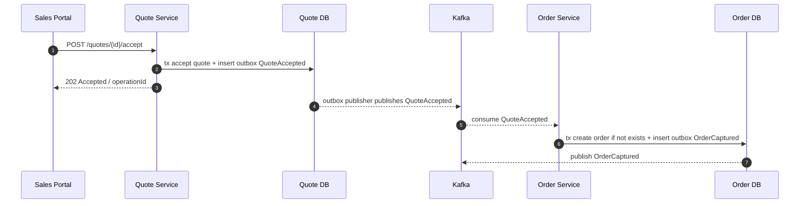

### Local Transaction in Quote Service

```sql
BEGIN;

UPDATE quote
SET status = 'ACCEPTED',
    accepted_at = now(),
    accepted_by = :actor_id,
    acceptance_evidence_id = :evidence_id,
    version = version + 1
WHERE tenant_id = :tenant_id
  AND quote_id = :quote_id
  AND status = 'APPROVED'
  AND expires_at > now()
  AND version = :expected_version;

-- must affect exactly one row

INSERT INTO quote_acceptance_evidence (
    tenant_id,
    evidence_id,
    quote_id,
    actor_id,
    channel,
    ip_address_hash,
    accepted_terms_version,
    accepted_at
) VALUES (
    :tenant_id,
    :evidence_id,
    :quote_id,
    :actor_id,
    :channel,
    :ip_address_hash,
    :terms_version,
    now()
);

INSERT INTO outbox_event (
    tenant_id,
    event_id,
    aggregate_type,
    aggregate_id,
    aggregate_version,
    event_type,
    event_key,
    payload,
    status,
    created_at
) VALUES (
    :tenant_id,
    :event_id,
    'QUOTE',
    :quote_id,
    :new_version,
    'QuoteAccepted',
    :quote_id,
    :payload::jsonb,
    'PENDING',
    now()
);

COMMIT;
```

### Local Transaction in Order Service

Order service harus idempotent terhadap `QuoteAccepted`.

```sql
BEGIN;

INSERT INTO inbox_event (
    tenant_id,
    event_id,
    consumer_name,
    received_at,
    status
) VALUES (
    :tenant_id,
    :event_id,
    'order-service.quote-accepted-consumer',
    now(),
    'PROCESSING'
)
ON CONFLICT (tenant_id, event_id, consumer_name) DO NOTHING;

-- if no row inserted, duplicate event. exit safely.

INSERT INTO customer_order (
    tenant_id,
    order_id,
    source_quote_id,
    source_quote_version,
    status,
    commercial_snapshot,
    created_at
) VALUES (
    :tenant_id,
    :order_id,
    :quote_id,
    :quote_version,
    'CAPTURED',
    :commercial_snapshot::jsonb,
    now()
)
ON CONFLICT (tenant_id, source_quote_id) DO NOTHING;

INSERT INTO outbox_event (...)
VALUES (... 'OrderCaptured' ...)
ON CONFLICT (tenant_id, event_id) DO NOTHING;

UPDATE inbox_event
SET status = 'PROCESSED', processed_at = now()
WHERE tenant_id = :tenant_id
  AND event_id = :event_id
  AND consumer_name = 'order-service.quote-accepted-consumer';

COMMIT;
```

Critical invariant:

```sql
ALTER TABLE customer_order
ADD CONSTRAINT uq_order_source_quote
UNIQUE (tenant_id, source_quote_id);
```

Ini mencegah order ganda dari quote yang sama, bahkan jika consumer diproses ulang.

---

## Order Activation Saga

Order activation biasanya lebih kompleks karena melibatkan fulfillment, billing, provisioning, dan kadang external system.

### Simplified State Machine

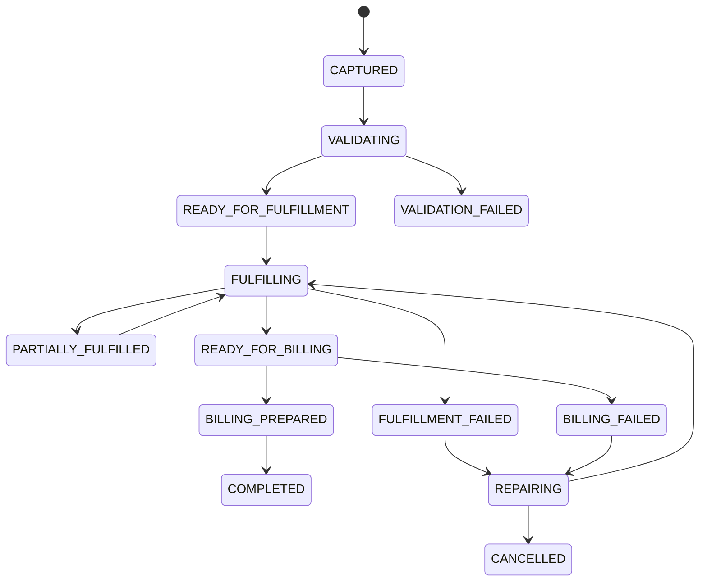

### Orchestrated BPMN View

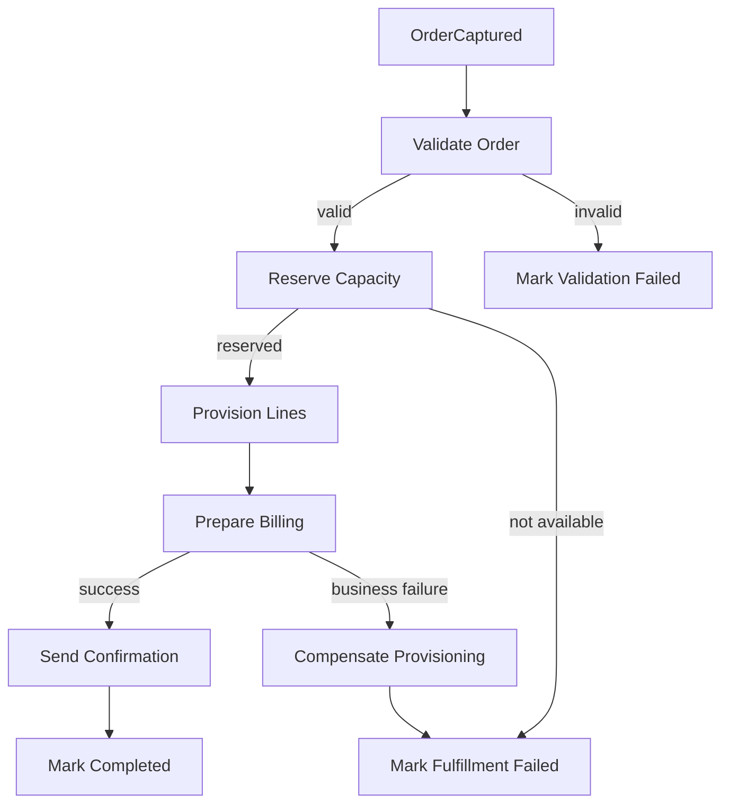

### Implementation Principle

Camunda may orchestrate, but Order Service owns order state transitions.

Camunda should call commands like:

- `ValidateOrderCommand`
- `ReserveOrderCapacityCommand`
- `StartLineFulfillmentCommand`
- `MarkBillingPreparedCommand`
- `CompleteOrderCommand`

Camunda should not directly mutate order tables.

---

## Compensation Is Not Rollback

Salah satu kesalahan paling umum adalah berpikir compensation sama dengan rollback.

Rollback terjadi sebelum local transaction committed.

Compensation terjadi setelah efek bisnis sudah terjadi.

Contoh:

| Action | Rollback Possible? | Compensation |
|---|---:|---|
| Insert draft order before commit | Yes | Not needed |
| Reserve inventory | Usually no | Release reservation |
| Provision service | No | Deprovision or suspend |
| Send email | No | Send correction email |
| Charge customer | No | Refund/credit note |
| Publish event | No | Publish correcting event |
| Approve quote | Usually no | Revoke approval with audit trail |

### Compensation Must Be Domain-Specific

Bad compensation:

```text
If billing fails, delete order.
```

Better compensation:

```text
If billing preparation fails after fulfillment reservation, release reservation if no provisioning has started. If provisioning has started, suspend order and route to billing repair queue.
```

### Compensation Catalog

Untuk setiap saga step, definisikan:

| Step | Side Effect | Failure After Step | Compensation | Idempotent Key |
|---|---|---|---|---|
| Reserve capacity | Reservation created | Billing fails | Release reservation | `orderId:reservationId` |
| Provision line | External service active | Billing fails | Suspend/deprovision line | `orderLineId:provisioningId` |
| Prepare billing | Billing schedule created | Notification fails | No compensation; retry notification | `orderId:billingVersion` |
| Send notification | Email sent | Later correction | Send correction notification | `orderId:notificationType` |

### Compensation Safety Rules

A compensating action must be:

1. **Idempotent** — safe to retry.
2. **Audited** — record why it happened.
3. **State-guarded** — only legal from certain states.
4. **Semantically correct** — not just technical undo.
5. **Observable** — failures must trigger alert/runbook.

---

## Failure Classification

A saga cannot handle failures correctly if every exception is treated the same.

### Technical Transient Failure

Examples:

- network timeout,
- temporary DB connection failure,
- Kafka rebalance,
- external API 503,
- Camunda optimistic locking exception.

Policy:

- retry with backoff,
- preserve idempotency,
- alert only if threshold exceeded,
- do not compensate immediately.

### Technical Permanent Failure

Examples:

- invalid schema,
- missing required field,
- incompatible event version,
- authentication misconfiguration,
- invalid endpoint config.

Policy:

- stop processing,
- route to DLT/incident,
- require fix + replay/repair,
- do not blindly retry forever.

### Business Retryable Failure

Examples:

- capacity temporarily unavailable,
- credit check pending,
- approver not assigned yet,
- external system maintenance window.

Policy:

- wait/timer,
- escalate after SLA,
- keep business state visible.

### Business Terminal Failure

Examples:

- product no longer orderable,
- customer not eligible,
- approval rejected,
- quote expired before acceptance,
- payment authorization declined permanently.

Policy:

- transition to terminal or blocked state,
- execute compensation if needed,
- record business reason.

---

## Saga State Table

Even when using Camunda, it is useful to have a service-owned saga tracking table for business visibility and reconciliation.

```sql
CREATE TABLE order_saga (
    tenant_id text NOT NULL,
    saga_id uuid NOT NULL,
    saga_type text NOT NULL,
    business_key text NOT NULL,
    order_id uuid,
    quote_id uuid,
    status text NOT NULL,
    current_step text NOT NULL,
    correlation_id text NOT NULL,
    camunda_process_instance_id text,
    started_at timestamptz NOT NULL DEFAULT now(),
    updated_at timestamptz NOT NULL DEFAULT now(),
    completed_at timestamptz,
    failed_reason_code text,
    failure_classification text,
    version bigint NOT NULL DEFAULT 0,
    PRIMARY KEY (tenant_id, saga_id),
    UNIQUE (tenant_id, saga_type, business_key)
);

CREATE INDEX idx_order_saga_status
ON order_saga (tenant_id, status, updated_at);
```

This table does not replace Camunda runtime tables. It gives the domain/service a stable view independent of workflow engine internals.

### Saga Step Table

```sql
CREATE TABLE order_saga_step (
    tenant_id text NOT NULL,
    saga_id uuid NOT NULL,
    step_name text NOT NULL,
    attempt_no int NOT NULL,
    status text NOT NULL,
    started_at timestamptz NOT NULL DEFAULT now(),
    completed_at timestamptz,
    error_code text,
    error_message text,
    command_id text,
    event_id text,
    compensation_required boolean NOT NULL DEFAULT false,
    compensation_status text,
    PRIMARY KEY (tenant_id, saga_id, step_name, attempt_no)
);
```

This is useful for:

- dashboard,
- audit,
- retry history,
- SLA monitoring,
- manual repair.

---

## Saga Command Model

Commands should be explicit and idempotent.

```java
public record ReserveCapacityCommand(
    String tenantId,
    UUID commandId,
    UUID orderId,
    long expectedOrderVersion,
    String correlationId,
    String causationId,
    Instant requestedAt
) {}
```

Command handler:

```java
public final class ReserveCapacityHandler {
    private final OrderMapper orderMapper;
    private final IdempotencyMapper idempotencyMapper;
    private final OutboxMapper outboxMapper;

    public ReserveCapacityResult handle(ReserveCapacityCommand command) {
        return transaction.inTx(() -> {
            var inserted = idempotencyMapper.tryStart(
                command.tenantId(),
                command.commandId().toString(),
                "ReserveCapacityCommand"
            );

            if (!inserted) {
                return idempotencyMapper.loadPreviousResult(
                    command.tenantId(),
                    command.commandId().toString(),
                    ReserveCapacityResult.class
                );
            }

            var order = orderMapper.lockById(command.tenantId(), command.orderId());
            order.ensureCanReserveCapacity(command.expectedOrderVersion());

            var reservation = reserveInDomain(order);
            order.markCapacityReservationStarted(reservation.reservationId());

            orderMapper.update(order);
            outboxMapper.insert(OrderCapacityReservationStarted.from(order, command));

            var result = ReserveCapacityResult.started(reservation.reservationId());
            idempotencyMapper.markCompleted(command.tenantId(), command.commandId().toString(), result);
            return result;
        });
    }
}
```

Key properties:

- duplicate command returns previous result,
- aggregate state guards transition,
- outbox event committed in same transaction,
- handler does not depend on Camunda classes.

---

## Choreography with Inbox and Outbox

A choreographed consumer should follow a strict template.

```java
public final class QuoteAcceptedConsumer {
    public void onMessage(QuoteAccepted event) {
        transaction.inTx(() -> {
            if (!inboxMapper.tryStart(event.metadata().tenantId(), event.metadata().eventId(), CONSUMER)) {
                return;
            }

            try {
                var command = OrderCaptureCommand.from(event);
                var result = orderCaptureHandler.handle(command);

                inboxMapper.markProcessed(
                    event.metadata().tenantId(),
                    event.metadata().eventId(),
                    CONSUMER,
                    result.orderId().toString()
                );
            } catch (BusinessTerminalException e) {
                inboxMapper.markFailed(
                    event.metadata().tenantId(),
                    event.metadata().eventId(),
                    CONSUMER,
                    e.code(),
                    "BUSINESS_TERMINAL"
                );
                throw e;
            } catch (TransientTechnicalException e) {
                inboxMapper.markRetryable(
                    event.metadata().tenantId(),
                    event.metadata().eventId(),
                    CONSUMER,
                    e.code()
                );
                throw e;
            }
        });
    }
}
```

Consumer should not:

- call multiple services synchronously inside one Kafka handler,
- mutate another service database,
- swallow errors without marking inbox,
- publish events outside local transaction,
- depend on wall-clock event order across partitions.

---

## Orchestrated Saga with Camunda 7

Camunda is useful for order orchestration, but we should treat it as orchestration state, not domain authority.

### Process Variables

Keep variables small and stable:

```json
{
  "tenantId": "tenant_001",
  "orderId": "ord_123",
  "sagaId": "saga_789",
  "correlationId": "corr_456",
  "orderVersion": 4,
  "commercialRiskTier": "MEDIUM"
}
```

Do not store full quote/order snapshot as process variable unless there is a strict reason.

### Delegate Pattern

```java
public final class ValidateOrderDelegate implements JavaDelegate {
    private final ValidateOrderHandler handler;

    @Override
    public void execute(DelegateExecution execution) throws Exception {
        var command = new ValidateOrderCommand(
            (String) execution.getVariable("tenantId"),
            UUID.fromString((String) execution.getVariable("orderId")),
            UUID.fromString((String) execution.getVariable("sagaId")),
            execution.getProcessInstanceId(),
            execution.getCurrentActivityId(),
            Instant.now()
        );

        var result = handler.handle(command);
        execution.setVariable("orderVersion", result.newOrderVersion());
    }
}
```

Delegate only adapts Camunda execution into domain command.

### Async Continuations

Use async boundaries around external effects and potentially failing service tasks.

```text
OrderCaptured
  -> asyncBefore ValidateOrder
  -> asyncBefore ReserveCapacity
  -> asyncBefore ProvisionLines
  -> asyncBefore PrepareBilling
```

This allows Camunda job executor to retry and incident failures without rolling back the entire process start.

---

## Cancellation Saga

Cancellation is not a boolean flag. It is often its own saga.

### Cancellation Rules

| Current State | Cancellation Behavior |
|---|---|
| `CAPTURED` | Mark cancelled directly |
| `VALIDATED` | Cancel directly or cancel validation reservation |
| `FULFILLING` | Start cancellation saga, stop new work, compensate active work |
| `PARTIALLY_FULFILLED` | Cancel remaining work, reverse possible completed work, manual review possible |
| `COMPLETED` | Not cancellation; use termination/amendment/return process |
| `FAILED` | Cancel if no irreversible external effect remains |

### Cancellation Flow

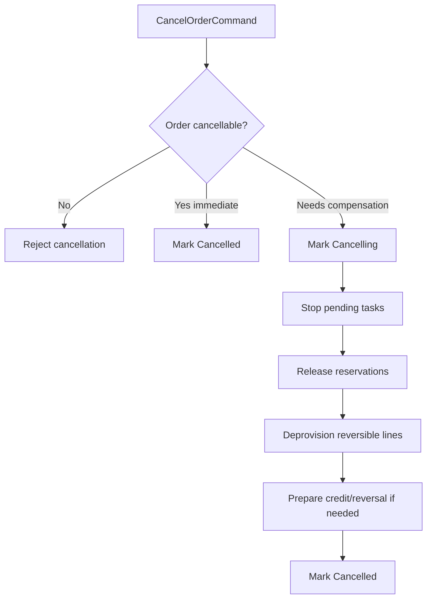

### Key Invariant

Once cancellation begins, no new fulfillment work may start.

Enforce in command handler:

```java
if (order.status() == OrderStatus.CANCELLING || order.status() == OrderStatus.CANCELLED) {
    throw new BusinessTerminalException("ORDER_NOT_FULFILLABLE_DURING_CANCELLATION");
}
```

Enforce in SQL where possible:

```sql
UPDATE order_line
SET status = 'FULFILLMENT_STARTED', version = version + 1
WHERE tenant_id = :tenant_id
  AND order_id = :order_id
  AND order_line_id = :line_id
  AND status = 'READY_FOR_FULFILLMENT'
  AND NOT EXISTS (
      SELECT 1
      FROM customer_order o
      WHERE o.tenant_id = order_line.tenant_id
        AND o.order_id = order_line.order_id
        AND o.status IN ('CANCELLING', 'CANCELLED')
  );
```

---

## Amendment Saga

CPQ/OMS sering memiliki amendment: customer ingin mengubah order setelah quote/order berjalan.

Amendment adalah sumber kompleksitas besar.

### Amendment Types

| Type | Meaning | Typical Saga |
|---|---|---|
| Add | Add new product/line | Configure + price delta + approve + fulfill new line |
| Modify | Change quantity/attribute | Validate compatibility + price delta + update fulfillment |
| Remove | Remove product/line | Check dependency + cancel/deprovision line |
| Suspend | Temporarily stop service | Suspend fulfillment/billing state |
| Resume | Resume suspended service | Reactivate service + billing |

### Amendment Principle

Do not mutate original order snapshot destructively.

Use:

- amendment order,
- delta line items,
- reference to original order,
- effective date,
- approval and pricing snapshot for delta.

```sql
CREATE TABLE order_amendment (
    tenant_id text NOT NULL,
    amendment_id uuid NOT NULL,
    original_order_id uuid NOT NULL,
    amendment_type text NOT NULL,
    status text NOT NULL,
    requested_by text NOT NULL,
    effective_at timestamptz,
    created_at timestamptz NOT NULL DEFAULT now(),
    PRIMARY KEY (tenant_id, amendment_id)
);
```

Amendment saga should not pretend to be the same as original order activation saga. It has different invariants.

---

## Reconciliation: The Safety Net

Every saga design must include reconciliation.

Reconciliation answers:

> What facts in the system should match, and how do we find cases where they do not?

### Reconciliation Examples

| Check | Query Meaning | Repair |
|---|---|---|
| Accepted quote without order | Quote status accepted but no order exists | Re-emit `QuoteAccepted` or run capture command |
| Order captured without process | Order exists but no Camunda instance | Start process with same business key |
| Process active but order terminal | Camunda still running for cancelled/completed order | Correlate cancellation/terminate process |
| Outbox stuck | Event pending too long | Republish/mark poison |
| Inbox processing stuck | Consumer started but never completed | Reset if lease expired |
| Fulfillment success not reflected | External system active but order line not fulfilled | Pull status and apply correction command |

### Reconciliation Job Pattern

```java
public final class AcceptedQuoteWithoutOrderReconciler {
    public void run() {
        var candidates = quoteReadMapper.findAcceptedQuotesWithoutOrder(Duration.ofMinutes(5), 100);

        for (var candidate : candidates) {
            try {
                repairCommandBus.submit(new EnsureOrderCapturedCommand(
                    candidate.tenantId(),
                    candidate.quoteId(),
                    "reconciler.accepted-quote-without-order"
                ));
            } catch (Exception e) {
                log.warn("failed to repair accepted quote without order", e);
            }
        }
    }
}
```

### Reconciliation Query Example

If quote and order are in separate databases, this query may need a reporting/control-plane projection. Within a service boundary, the idea looks like:

```sql
SELECT q.tenant_id, q.quote_id, q.accepted_at
FROM quote_projection q
LEFT JOIN order_projection o
  ON o.tenant_id = q.tenant_id
 AND o.source_quote_id = q.quote_id
WHERE q.status = 'ACCEPTED'
  AND q.accepted_at < now() - interval '5 minutes'
  AND o.order_id IS NULL
ORDER BY q.accepted_at
LIMIT 100;
```

Important: reconciliation should use safety windows. Do not repair a flow that is still normally in progress.

---

## Repair Commands

Manual repair must not mean manually editing database rows.

Expose explicit repair commands.

Examples:

- `EnsureOrderCapturedCommand`
- `RestartOrderProcessCommand`
- `ReemitOrderCapturedEventCommand`
- `MarkOrderLineFulfilledFromExternalEvidenceCommand`
- `ReleaseStaleReservationCommand`
- `ForceFailOrderWithReasonCommand`

Each repair command must:

1. Require authorization.
2. Capture reason/evidence.
3. Validate current state.
4. Be idempotent.
5. Emit audit event.
6. Be visible in admin timeline.

### Repair Table

```sql
CREATE TABLE repair_action (
    tenant_id text NOT NULL,
    repair_id uuid NOT NULL,
    target_type text NOT NULL,
    target_id text NOT NULL,
    action_type text NOT NULL,
    requested_by text NOT NULL,
    reason text NOT NULL,
    evidence jsonb NOT NULL,
    status text NOT NULL,
    created_at timestamptz NOT NULL DEFAULT now(),
    completed_at timestamptz,
    PRIMARY KEY (tenant_id, repair_id)
);
```

---

## Consistency Window and SLA

Not every inconsistency is an incident. Some are expected during normal async processing.

Define windows:

| Flow | Expected Window | Warning | Critical |
|---|---:|---:|---:|
| Quote accepted -> order captured | < 10s | > 1m | > 5m |
| Order captured -> process started | < 10s | > 1m | > 5m |
| Order validated -> fulfillment started | < 30s | > 5m | > 15m |
| Fulfillment completed -> billing prepared | < 5m | > 30m | > 2h |
| Outbox pending publish | < 5s | > 1m | > 5m |
| Inbox processing | < 10s | > 2m | > 10m |

These values are examples. Real values come from business needs and operational capability.

### Metrics

Recommended metrics:

```text
cpq_saga_active_total{saga_type,status}
cpq_saga_step_duration_seconds{saga_type,step}
cpq_saga_stuck_total{saga_type,step}
cpq_outbox_pending_age_seconds{service}
cpq_inbox_processing_age_seconds{service,consumer}
cpq_reconciliation_candidates_total{check_name}
cpq_repair_actions_total{action_type,status}
cpq_compensation_total{saga_type,step,status}
```

---

## Saga Timeline

Every order should have a timeline that combines:

- API commands,
- domain state changes,
- Kafka events,
- Camunda process steps,
- external callbacks,
- repair actions,
- compensation actions.

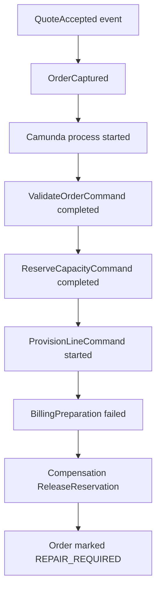

Timeline is not only for UI. It is an engineering tool.

### Timeline Event Schema

```json
{
  "timelineId": "tl_01J...",
  "tenantId": "tenant_001",
  "targetType": "ORDER",
  "targetId": "ord_123",
  "eventKind": "SAGA_STEP_COMPLETED",
  "eventName": "ReserveCapacity",
  "actorType": "SYSTEM",
  "actorId": "order-orchestrator",
  "correlationId": "corr_456",
  "causationId": "evt_789",
  "occurredAt": "2026-07-02T11:00:00Z",
  "summary": "Capacity reservation completed",
  "details": {
    "reservationId": "res_123",
    "attempt": 1
  }
}
```

---

## Saga and Tenant Isolation

Saga must never cross tenant boundaries accidentally.

Every event, command, row, cache key, and process business key must include tenant id.

Bad business key:

```text
ord_123
```

Better business key:

```text
tenant_001:order:ord_123
```

Every command handler must validate:

- command tenant matches aggregate tenant,
- event tenant matches inbox tenant,
- process variable tenant matches order tenant,
- external callback tenant/context maps to correct tenant.

This will connect directly to Part 026.

---

## Saga and Redis

Redis can support saga execution, but must not become source of truth.

Good Redis uses:

- short-lived idempotency cache to reduce DB hits,
- operation status cache,
- distributed rate limiting,
- lock with fencing token for scheduled jobs,
- cache of saga dashboard summaries.

Dangerous Redis uses:

- storing only copy of saga state,
- lock without fencing token,
- long-lived business facts,
- queue semantics where Kafka/durable DB is required.

### Operation Status Cache

```text
key: tenant:{tenantId}:operation:{operationId}
value: {
  "status": "IN_PROGRESS",
  "targetType": "ORDER",
  "targetId": "ord_123",
  "currentStep": "CAPTURE_ORDER",
  "updatedAt": "2026-07-02T11:02:00Z"
}
ttl: 15 minutes
```

The database remains authoritative.

---

## Saga and Kafka Partitioning

Ordering is only guaranteed per partition. Therefore event key matters.

Recommended keys:

| Topic | Event Key |
|---|---|
| `cpq.quote.events.v1` | `tenantId:quoteId` |
| `oms.order.events.v1` | `tenantId:orderId` |
| `oms.order-line.events.v1` | `tenantId:orderId` if order-level order matters; otherwise `tenantId:orderLineId` |
| `approval.events.v1` | `tenantId:approvalRequestId` |

Do not depend on global ordering between quote and order topics. Use causation metadata and state guards.

---

## Saga Failure Matrix

A serious design review should include a failure matrix.

### Quote Acceptance Failure Matrix

| Step | Failure | Detection | Safe Retry? | Compensation | Repair |
|---|---|---|---:|---|---|
| Accept quote DB tx | DB timeout before commit | API error + no accepted state | Yes | None | User retry |
| Accept quote DB tx | Commit succeeds but API times out | Quote accepted, response lost | Yes via idempotency | None | Return current accepted state |
| Outbox publish | Publisher down | outbox pending age | Yes | None | Restart publisher |
| Order consumer | Consumer down | Kafka lag | Yes | None | Restart consumer |
| Create order | Duplicate event | inbox/unique conflict | Yes | None | Return existing order |
| Create order | Invalid commercial snapshot | inbox failed | No | Possibly mark quote order capture failed | Repair schema/data |
| Publish OrderCaptured | Outbox stuck | outbox metric | Yes | None | Republish |
| Start Camunda process | Process already exists | business key conflict | Yes | None | Load existing process |
| Start Camunda process | Engine unavailable | stuck order captured | Yes | None | Reconciler starts process |

### Fulfillment/Billing Failure Matrix

| Step | Failure | Failure Class | Retry | Compensation | Terminal State |
|---|---|---|---:|---|---|
| Reserve capacity | 503 external | technical transient | Yes | None | Still pending |
| Reserve capacity | capacity unavailable | business retryable/terminal depending policy | Maybe | None | Backordered or failed |
| Provision line | timeout unknown result | technical ambiguous | Query status first | Maybe | Pending verification |
| Provision line | product incompatible | business terminal | No | Release reservations | Failed |
| Prepare billing | downstream 500 | technical transient | Yes | None | Pending billing |
| Prepare billing | tax/account config missing | business/config terminal | No until fix | Suspend fulfillment if needed | Repair required |
| Send notification | SMTP failure | technical transient | Yes | None | Order still valid |

---

## Business Invariants Across Services

Cross-service invariant cannot be enforced with a single foreign key. We enforce it through local constraints, events, and reconciliation.

### Invariant 1: One Accepted Quote Creates At Most One Order

Enforcement:

- Quote state transition guarded.
- Order unique constraint on `(tenant_id, source_quote_id)`.
- QuoteAccepted event idempotent.
- Reconciliation for accepted quote without order.

### Invariant 2: Order Completion Requires Mandatory Lines Terminal Success

Enforcement:

- Order service query checks line states.
- Command handler rejects completion if mandatory line not terminal success.
- Camunda gateway may branch, but service command is final guard.

```sql
SELECT count(*)
FROM order_line
WHERE tenant_id = :tenant_id
  AND order_id = :order_id
  AND mandatory = true
  AND status NOT IN ('FULFILLED', 'SKIPPED_BY_POLICY');
```

### Invariant 3: Billing Must Use Accepted Commercial Snapshot

Enforcement:

- Order stores immutable commercial snapshot.
- Billing event references snapshot hash/version.
- Billing service rejects event if required snapshot metadata missing.
- Audit records snapshot hash.

### Invariant 4: Tenant Context Must Be Preserved

Enforcement:

- Tenant id in every command/event/table/cache key.
- RLS or query guard.
- authorization service validates tenant membership.
- correlation id alone is never trusted.

---

## Saga Testing Strategy

### Unit Tests

Test state transitions and compensation rules.

```java
@Test
void cannotCompleteOrderWhenMandatoryLineStillPending() {
    var order = OrderFixture.inProgress()
        .withMandatoryLine("line-1", LineStatus.FULFILLING)
        .build();

    assertThatThrownBy(order::complete)
        .isInstanceOf(BusinessInvariantViolation.class)
        .hasMessageContaining("MANDATORY_LINE_NOT_FULFILLED");
}
```

### Integration Tests

Use real PostgreSQL and Kafka where possible.

Test:

- outbox event committed with domain update,
- duplicate event does not create duplicate order,
- consumer crash after insert but before mark processed,
- stale inbox lease recovery,
- reconciliation finds missing process.

### Process Tests

For Camunda:

- process starts with business key,
- service task calls command handler,
- BPMN error takes expected path,
- timer escalation triggers,
- incident is created on technical failure.

### Chaos Scenarios

Run intentionally broken flows:

1. Kill outbox publisher after quote accepted.
2. Pause order consumer for 10 minutes.
3. Start same Camunda process twice.
4. Force fulfillment timeout after external side effect.
5. Send duplicate `QuoteAccepted` event.
6. Reorder events in test topic.
7. Expire Redis operation cache mid-saga.

Expected outcome: system converges or exposes repairable stuck state.

---

## Anti-Patterns

### Anti-Pattern: Distributed Transaction by REST Calls

```text
Quote service starts transaction
  -> calls order service
  -> calls billing service
  -> calls fulfillment service
commit if all succeed
```

This fails because remote calls are not part of the DB transaction. You get locks, timeouts, partial failures, and unclear rollback behavior.

### Anti-Pattern: Kafka as Synchronous RPC

```text
send event and wait for response event in HTTP request thread
```

This creates hidden distributed blocking with worse debuggability.

Use async operation status instead.

### Anti-Pattern: Camunda Owns All Domain State

If order status lives only as process variable, downstream services and database constraints cannot protect the domain.

Camunda should orchestrate; domain services should own state.

### Anti-Pattern: Compensation Means Delete Rows

Deleting rows destroys evidence and breaks audit. Use explicit reversal states/actions.

### Anti-Pattern: No Reconciliation Because "Kafka Is Reliable"

Kafka can durably store records, but your application can still fail to process, commit offsets incorrectly, poison itself on bad data, or fail after side effects.

---

## Production Readiness Checklist

Before calling saga design production-ready, verify:

- [ ] Every saga has named owner.
- [ ] Every saga has start event/command.
- [ ] Every saga has terminal success states.
- [ ] Every saga has terminal failure states.
- [ ] Every step has failure classification.
- [ ] Every external side effect has idempotency key.
- [ ] Every irreversible side effect has explicit compensation/correction policy.
- [ ] Every event consumer has inbox or equivalent deduplication.
- [ ] Every producer uses outbox or equivalent atomic publish intent.
- [ ] Every cross-service invariant has reconciliation.
- [ ] Every stuck state has runbook.
- [ ] Every repair action is authorized and audited.
- [ ] Every business key includes tenant context.
- [ ] Camunda process variables are minimal and schema-controlled.
- [ ] Order state is owned by Order Service, not Camunda alone.
- [ ] Metrics expose lag, stuck sagas, failed compensation, and repair counts.

---

## Implementation Drill

Build a minimal quote-to-order saga:

1. `POST /quotes/{quoteId}/accept` accepts an approved quote.
2. Quote service writes `QuoteAccepted` to outbox.
3. Order service consumes `QuoteAccepted`.
4. Order service creates exactly one order for the quote.
5. Order service writes `OrderCaptured` to outbox.
6. Camunda process starts from `OrderCaptured`.
7. Reconciler detects accepted quote without order after 5 minutes.
8. Duplicate `QuoteAccepted` must not create duplicate order.
9. Simulate consumer crash after order insert but before inbox processed.
10. Add admin repair command `EnsureOrderCapturedCommand`.

Success criteria:

- all commands are idempotent,
- all domain transitions are state-guarded,
- no cross-service DB writes,
- every failure has visible state,
- reconciliation can repair missing downstream effects.

---

## Top 1% Review Questions

Use these questions during architecture review:

1. What is atomically true after each local transaction?
2. What can be temporarily inconsistent, and for how long?
3. What event or command resumes the saga after failure?
4. What if this event is delivered twice?
5. What if this event is never delivered?
6. What if this command succeeds but response is lost?
7. What if compensation fails?
8. What is the manual repair path?
9. Where is the audit evidence?
10. Which service owns the business state?
11. What happens during deployment when process definition and service code are different versions?
12. How do we detect a saga stuck for 30 minutes?
13. Can an operator repair without direct SQL update?
14. Can the customer see a truthful status while processing is async?
15. What happens if tenant context is wrong or missing?

---

## Summary

Cross-service consistency in CPQ/OMS is not achieved by pretending distributed systems are atomic. It is achieved by designing local transactions, events, idempotent commands, state machines, compensation, reconciliation, and repair as one coherent model.

The practical target is not "everything is always consistent immediately". The target is:

- important local invariants are strongly enforced,
- cross-service effects are eventually consistent within known windows,
- duplicate/reordered/missing events are survivable,
- failures become visible states,
- compensation is domain-correct,
- repair is explicit, authorized, and audited.

This is the mental shift from framework-level microservices to production-grade business platform engineering.

---

## References

- Chris Richardson, Microservices.io — Saga Pattern: https://microservices.io/patterns/data/saga.html
- Chris Richardson, Microservices.io — Transactional Outbox Pattern: https://microservices.io/patterns/data/transactional-outbox.html
- Apache Kafka Documentation: https://kafka.apache.org/documentation/
- Camunda 7 Documentation: https://docs.camunda.org/manual/latest/
- PostgreSQL Documentation: https://www.postgresql.org/docs/current/
