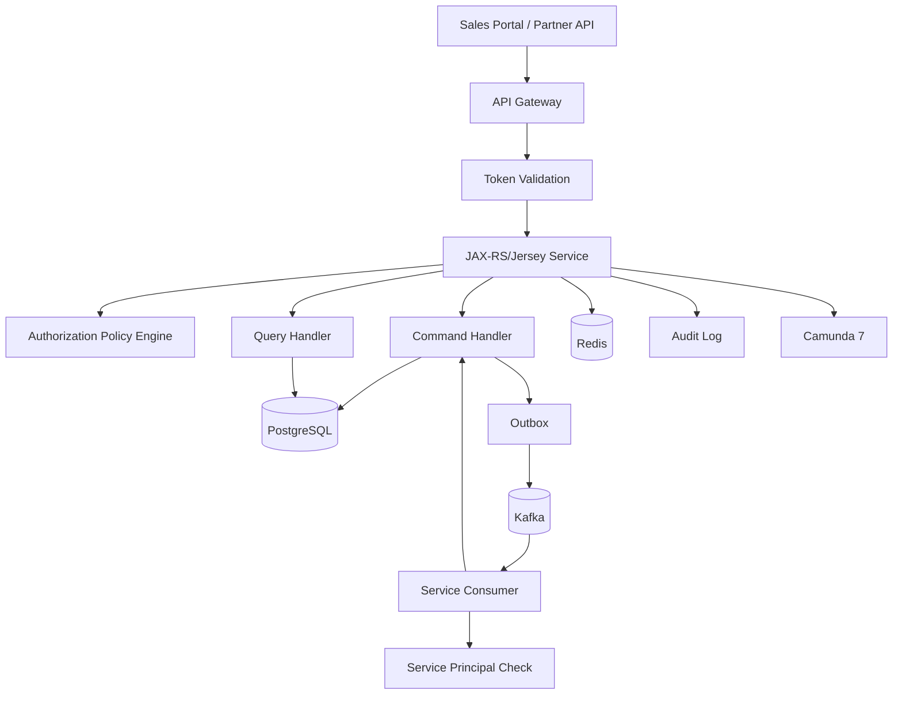

# Part 026 — Security, Authorization, and Tenant Isolation

CPQ/OMS bukan sekadar aplikasi CRUD. Platform ini menyimpan commercial terms, discount strategy, customer contract data, order lifecycle, approval evidence, dan sering kali informasi yang sensitif secara bisnis maupun regulasi. Karena itu security tidak boleh ditempel di ujung sebagai middleware login.

Security di platform seperti ini harus menjawab tiga pertanyaan besar:

1. **Who are you?** — authentication.
2. **What are you allowed to do?** — authorization.
3. **Which tenant/customer/business object are you allowed to touch?** — object and tenant isolation.

Banyak breach API tidak terjadi karena tidak ada login. Banyak breach terjadi karena user sudah login tetapi bisa mengakses object yang bukan miliknya, tenant yang salah, action yang tidak sesuai role, atau endpoint internal yang kebuka.

> Mental model utama: dalam CPQ/OMS, authorization bukan boolean `isAuthenticated`. Authorization adalah business decision yang dipengaruhi actor, tenant, role, ownership, quote/order state, approval policy, channel, risk, dan evidence.

---

## Learning Goals

Setelah menyelesaikan part ini, kita harus mampu:

1. Mendesain authentication boundary menggunakan OAuth2/JWT tanpa mencampur identity provider logic ke domain service.
2. Membedakan RBAC, ABAC, ReBAC, object-level authorization, dan tenant isolation.
3. Menempatkan authorization check di API, command handler, query handler, event consumer, dan repair/admin action.
4. Mendesain tenant isolation di request context, database, Kafka, Redis, Camunda, logs, metrics, dan audit.
5. Memakai PostgreSQL constraints/RLS secara realistis sebagai defense-in-depth.
6. Membuat security model yang tetap bekerja untuk async/event-driven flows.
7. Menghindari broken object-level authorization dan confused deputy problem.
8. Menyusun checklist security production untuk platform CPQ/OMS.

---

## Kaufman Deconstruction

Skill security kita pecah menjadi bagian yang bisa dipraktikkan:

| Subskill | Pertanyaan Kunci | Output Praktis |
|---|---|---|
| Identity boundary | Dari mana actor identity berasal? | JWT validation + principal model |
| Tenant resolution | Tenant mana yang aktif untuk request ini? | Tenant context resolver |
| Permission model | Action apa yang diizinkan? | Permission catalog |
| Object authorization | Apakah actor boleh mengakses quote/order ini? | Policy check per aggregate |
| Data isolation | Bagaimana mencegah cross-tenant read/write? | Query guard + constraint + optional RLS |
| Async security | Event/consumer memakai trust boundary apa? | Signed/internal event + service principal |
| Auditability | Bagaimana membuktikan keputusan authorization? | Audit event + decision reason |
| Operational security | Bagaimana secret, log, metric, repair diamankan? | Runbook + controls |

Security yang kuat bukan berarti setiap hal menjadi rumit. Security yang kuat berarti rule penting ditempatkan di boundary yang benar dan bisa diuji.

---

## Threat Model CPQ/OMS

Kita mulai dari ancaman nyata untuk domain ini.

### High-Value Assets

| Asset | Why It Matters |
|---|---|
| Quote price snapshot | Mengandung harga, diskon, margin, terms |
| Approval decision | Evidence untuk discount/risk/compliance |
| Product catalog | Bisa mengandung commercial strategy |
| Customer account | Mengandung PII dan contract relation |
| Order lifecycle | Berpengaruh ke fulfillment, billing, entitlement |
| Repair/admin action | Bisa memaksa state bisnis melewati normal control |
| Kafka event stream | Mengandung business facts lintas service |
| Camunda process variables | Bisa bocor jika menyimpan payload besar/sensitif |
| Redis cache | Bisa mengandung snapshot sementara, idempotency, session state |

### Common Attack/Fault Scenarios

1. Sales rep tenant A mengakses quote tenant B melalui manipulated URL.
2. User dengan role viewer memanggil endpoint approve/reject.
3. Approver meng-approve quote yang tidak ada di assignment-nya.
4. Internal service menerima event palsu atau replay event lama.
5. Kafka consumer memproses event tenant salah karena topic/key/payload mismatch.
6. Redis key tidak memasukkan tenant id, menyebabkan cache bleed.
7. Admin repair endpoint bisa dipakai tanpa strong authorization.
8. Logs menyimpan full JWT, PII, atau commercial snapshot.
9. Camunda cockpit/admin terlalu luas aksesnya.
10. Generated OpenAPI endpoint lupa memasang permission check.
11. Query endpoint filter `tenantId` dikirim client lalu dipercaya begitu saja.
12. Background job berjalan tanpa tenant scoping.

### Security Principle

Never trust user-supplied tenant, role, or ownership claim without verifying against trusted context.

---

## Security Architecture Overview



Boundary responsibilities:

| Layer | Responsibility |
|---|---|
| API Gateway | TLS termination, coarse routing, coarse auth, rate limit, WAF-like controls |
| JAX-RS Filter | JWT validation result, request context, correlation id, tenant context |
| Resource Method | Endpoint-level permission annotation/readability |
| Command Handler | Final business authorization and state guard |
| Query Handler | Object and tenant filtering, field-level redaction |
| Database | Tenant columns, constraints, optional RLS, least privilege credentials |
| Kafka Consumer | Event authenticity, schema validation, tenant consistency |
| Redis Client | Tenant-aware keys, TTL, no sensitive data without reason |
| Camunda Adapter | Minimal variables, process access control, service principal |
| Audit | Immutable evidence of security-relevant decisions |

---

## Authentication Boundary

Authentication tells us who the caller is. It does not decide everything the caller can do.

A typical model:

- External users authenticate through an Identity Provider.
- Access token is a JWT or opaque token validated by gateway/service.
- Services receive a principal with subject, issuer, audience, tenant memberships, scopes/roles, and authentication strength.

### JWT Claims Example

```json
{
  "iss": "https://identity.example.com",
  "sub": "user_123",
  "aud": "cpq-api",
  "exp": 1782987600,
  "iat": 1782984000,
  "scope": "quote:read quote:write order:read",
  "tenant_memberships": [
    {
      "tenantId": "tenant_001",
      "roles": ["SALES_REP"]
    }
  ],
  "amr": ["pwd", "mfa"],
  "jti": "token_abc"
}
```

Use JWT claims carefully:

- `sub` identifies actor.
- `iss` must be trusted.
- `aud` must match this API/service.
- `exp` must be enforced.
- `scope` is coarse capability, not object permission.
- tenant membership claim may need freshness validation for sensitive actions.

### Java Principal Model

```java
public record SecurityPrincipal(
    String subject,
    String issuer,
    Set<String> audiences,
    Set<String> scopes,
    Set<TenantMembership> tenantMemberships,
    AuthenticationStrength authStrength,
    Optional<String> serviceName,
    Instant authenticatedAt,
    String tokenId
) {
    public boolean isServicePrincipal() {
        return serviceName.isPresent();
    }
}

public record TenantMembership(
    String tenantId,
    Set<String> roles,
    Set<String> groups
) {}
```

Avoid passing raw JWT everywhere. Convert it at boundary to a safe principal object.

---

## Tenant Resolution

Tenant resolution is a security-sensitive operation.

### Bad Pattern

```http
GET /quotes/quote_123?tenantId=tenant_999
Authorization: Bearer <token-for-tenant-001>
```

If service trusts query parameter blindly, attacker can switch tenant.

### Better Pattern

Use URL or header only as requested tenant context, then verify membership.

```http
GET /tenants/tenant_001/quotes/quote_123
Authorization: Bearer <token>
```

Resolution steps:

1. Extract requested tenant from path/header.
2. Verify principal is member of requested tenant.
3. Store tenant in request context.
4. Ensure all command/query uses resolved tenant, not arbitrary DTO field.
5. Reject mismatched tenant in payload.

### Tenant Context

```java
public record TenantContext(
    String tenantId,
    String source,
    boolean verified
) {}

public final class RequestContext {
    private final SecurityPrincipal principal;
    private final TenantContext tenant;
    private final String correlationId;
    private final String requestId;
}
```

### JAX-RS Filter

```java
@Provider
@Priority(Priorities.AUTHENTICATION)
public final class SecurityContextFilter implements ContainerRequestFilter {
    @Override
    public void filter(ContainerRequestContext request) {
        var principal = tokenValidator.validate(request.getHeaderString("Authorization"));
        var requestedTenant = tenantResolver.resolveFromPathOrHeader(request);

        if (!principalHasTenant(principal, requestedTenant)) {
            throw new ForbiddenException("TENANT_ACCESS_DENIED");
        }

        var ctx = new RequestContext(
            principal,
            new TenantContext(requestedTenant, "PATH", true),
            correlationId(request),
            requestId(request)
        );

        request.setProperty("requestContext", ctx);
    }
}
```

---

## Authorization Model: RBAC, ABAC, ReBAC

### RBAC

Role-Based Access Control maps users to roles.

Examples:

- `SALES_REP`
- `SALES_MANAGER`
- `PRICING_ANALYST`
- `APPROVER`
- `ORDER_OPERATOR`
- `TENANT_ADMIN`
- `PLATFORM_SUPPORT`

RBAC is easy to reason about but insufficient alone.

### ABAC

Attribute-Based Access Control uses attributes:

- actor department,
- quote region,
- discount percentage,
- quote status,
- customer segment,
- risk tier,
- channel,
- time,
- MFA presence.

Example:

```text
A SALES_MANAGER may approve a quote only when:
  tenant matches,
  quote region is within manager region,
  discount <= manager threshold,
  quote status = SUBMITTED_FOR_APPROVAL,
  actor is not the quote creator,
  MFA is present for high-risk approval.
```

### ReBAC

Relationship-Based Access Control uses graph relationships.

Examples:

- user owns account,
- user is assigned to opportunity,
- approver is assigned to approval request,
- operator belongs to fulfillment team for region.

CPQ/OMS often needs all three.

---

## Permission Catalog

Do not scatter string permissions randomly.

Create a permission catalog:

| Permission | Meaning | Typical Role |
|---|---|---|
| `quote.read` | View quote summary/details | Sales, approver, support |
| `quote.create` | Create draft quote | Sales |
| `quote.modify` | Modify draft quote | Quote owner/sales |
| `quote.submit` | Submit quote for approval | Quote owner/sales |
| `quote.approve` | Approve assigned quote | Approver/manager |
| `quote.reject` | Reject assigned quote | Approver/manager |
| `quote.accept` | Customer/sales acceptance action | Authorized customer/sales with evidence |
| `pricing.override` | Apply/manual override price | Pricing analyst/admin |
| `order.read` | View order | Sales/order ops/support |
| `order.capture` | Create order from accepted quote | System/service |
| `order.cancel` | Cancel eligible order | Sales/order ops/customer role |
| `order.repair` | Repair stuck order | Authorized support engineer |
| `catalog.publish` | Publish catalog version | Catalog admin |
| `admin.impersonate` | Support impersonation | Highly restricted |

Keep permission names action-oriented and stable.

---

## Object-Level Authorization

Broken object-level authorization is one of the most dangerous API issues for CPQ/OMS.

### Example Problem

```http
GET /tenants/tenant_001/quotes/quote_999
```

The user is member of `tenant_001`, but does the user have access to `quote_999`?

Tenant membership is not enough.

### Quote Read Policy

```java
public final class QuoteAuthorizationPolicy {
    public AuthorizationDecision canReadQuote(SecurityPrincipal principal, TenantContext tenant, Quote quote) {
        if (!quote.tenantId().equals(tenant.tenantId())) {
            return AuthorizationDecision.deny("TENANT_MISMATCH");
        }

        if (principal.hasPermission(tenant.tenantId(), "quote.read.all")) {
            return AuthorizationDecision.allow("QUOTE_READ_ALL");
        }

        if (quote.ownerUserId().equals(principal.subject())
            && principal.hasPermission(tenant.tenantId(), "quote.read.own")) {
            return AuthorizationDecision.allow("QUOTE_OWNER");
        }

        if (quote.hasAssignedApprover(principal.subject())
            && principal.hasPermission(tenant.tenantId(), "quote.read.assigned_approval")) {
            return AuthorizationDecision.allow("ASSIGNED_APPROVER");
        }

        return AuthorizationDecision.deny("NO_QUOTE_RELATIONSHIP");
    }
}
```

### Command Handler Must Recheck

Endpoint-level annotation is not enough.

```java
public SubmitQuoteResult submit(SubmitQuoteCommand command, RequestContext ctx) {
    return tx.inTx(() -> {
        var quote = quoteMapper.lockById(ctx.tenant().tenantId(), command.quoteId())
            .orElseThrow(NotFoundException::new);

        var decision = quotePolicy.canSubmitQuote(ctx.principal(), ctx.tenant(), quote);
        if (decision.denied()) {
            auditAuthzDenied(ctx, "quote.submit", quote.id(), decision);
            throw new ForbiddenException(decision.reasonCode());
        }

        quote.submitForApproval(ctx.principal().subject());
        quoteMapper.update(quote);
        outbox.insert(QuoteSubmittedEvent.from(quote, ctx));
        auditAuthzAllowed(ctx, "quote.submit", quote.id(), decision);
        return SubmitQuoteResult.from(quote);
    });
}
```

Why recheck inside command handler?

- Resource method may be bypassed by internal call.
- Background job may invoke same command.
- Generated code may miss annotation.
- Object state can change between initial query and command.

---

## Policy Decision Object

Authorization should return explainable decisions.

```java
public record AuthorizationDecision(
    boolean allowed,
    String reasonCode,
    Map<String, Object> attributes
) {
    public static AuthorizationDecision allow(String reasonCode) {
        return new AuthorizationDecision(true, reasonCode, Map.of());
    }

    public static AuthorizationDecision deny(String reasonCode) {
        return new AuthorizationDecision(false, reasonCode, Map.of());
    }

    public boolean denied() {
        return !allowed;
    }
}
```

Do not expose all internal details to client. But do record enough for audit.

API response:

```json
{
  "type": "https://errors.example.com/forbidden",
  "title": "Forbidden",
  "status": 403,
  "code": "QUOTE_APPROVAL_NOT_ASSIGNED",
  "correlationId": "corr_123"
}
```

Audit detail:

```json
{
  "action": "quote.approve",
  "decision": "DENY",
  "reasonCode": "QUOTE_APPROVAL_NOT_ASSIGNED",
  "actorId": "user_123",
  "tenantId": "tenant_001",
  "targetType": "QUOTE",
  "targetId": "quote_999",
  "attributes": {
    "quoteStatus": "SUBMITTED_FOR_APPROVAL",
    "assignedApproverIdsHash": ["hash_abc"]
  }
}
```

---

## Approval Authorization

Approval is a special case because it combines authorization and business policy.

### Approval Rules

An approver may approve only if:

1. Tenant matches.
2. Approval request is active.
3. Actor is assigned or belongs to eligible approver group.
4. Actor is not blocked by segregation-of-duty rule.
5. Actor approval limit covers discount/risk.
6. MFA requirement is satisfied if high risk.
7. Quote snapshot hash matches approval request.

### Segregation of Duties

```java
if (quote.createdBy().equals(principal.subject())) {
    return AuthorizationDecision.deny("CREATOR_CANNOT_APPROVE_OWN_QUOTE");
}
```

### Approval Limit

```java
if (quote.discountPercent().compareTo(approverLimit.maxDiscountPercent()) > 0) {
    return AuthorizationDecision.deny("DISCOUNT_EXCEEDS_APPROVER_LIMIT");
}
```

### Snapshot Guard

Approval should apply to the submitted snapshot, not a mutated quote.

```java
if (!approvalRequest.quoteSnapshotHash().equals(quote.currentSnapshotHash())) {
    return AuthorizationDecision.deny("QUOTE_CHANGED_AFTER_APPROVAL_REQUEST");
}
```

---

## Tenant Isolation in PostgreSQL

### Minimum Standard: Tenant Column Everywhere

Every tenant-owned table must include `tenant_id`.

```sql
CREATE TABLE quote (
    tenant_id text NOT NULL,
    quote_id uuid NOT NULL,
    owner_user_id text NOT NULL,
    status text NOT NULL,
    created_at timestamptz NOT NULL DEFAULT now(),
    version bigint NOT NULL DEFAULT 0,
    PRIMARY KEY (tenant_id, quote_id)
);
```

Foreign keys should include tenant id.

```sql
CREATE TABLE quote_line (
    tenant_id text NOT NULL,
    quote_id uuid NOT NULL,
    quote_line_id uuid NOT NULL,
    product_id text NOT NULL,
    status text NOT NULL,
    PRIMARY KEY (tenant_id, quote_id, quote_line_id),
    FOREIGN KEY (tenant_id, quote_id)
        REFERENCES quote (tenant_id, quote_id)
);
```

This prevents cross-tenant references.

### Query Guard

Every query must include tenant id.

Bad:

```sql
SELECT * FROM quote WHERE quote_id = #{quoteId};
```

Good:

```sql
SELECT *
FROM quote
WHERE tenant_id = #{tenantId}
  AND quote_id = #{quoteId};
```

### MyBatis Mapper Pattern

```xml
<select id="findQuoteById" resultMap="QuoteResultMap">
  SELECT tenant_id, quote_id, owner_user_id, status, created_at, version
  FROM quote
  WHERE tenant_id = #{tenantId}
    AND quote_id = #{quoteId}
</select>
```

Avoid mapper methods that do not require tenant id for tenant-owned data.

```java
Optional<QuoteRow> findQuoteById(
    @Param("tenantId") String tenantId,
    @Param("quoteId") UUID quoteId
);
```

### Optional Defense: PostgreSQL Row-Level Security

PostgreSQL row-level security can restrict which rows are visible or modifiable based on policy. It is useful as defense-in-depth, especially where direct SQL access or shared service roles could create risk.

Example:

```sql
ALTER TABLE quote ENABLE ROW LEVEL SECURITY;

CREATE POLICY quote_tenant_isolation_policy
ON quote
USING (tenant_id = current_setting('app.current_tenant_id'))
WITH CHECK (tenant_id = current_setting('app.current_tenant_id'));
```

Set context per transaction:

```sql
SELECT set_config('app.current_tenant_id', :tenant_id, true);
```

Caveats:

- Connection pools must reset context correctly.
- Superusers/table owners may bypass unless configured carefully.
- RLS does not replace application authorization.
- Debugging query behavior can become harder.
- Migration/admin jobs need explicit policy strategy.

Recommended approach:

- tenant column + composite keys as baseline,
- mapper enforcement and tests,
- RLS for high-risk tables or shared access patterns,
- database roles with least privilege.

---

## Tenant Isolation in Kafka

Every event must carry tenant id in metadata and payload where applicable.

```json
{
  "metadata": {
    "eventId": "evt_123",
    "tenantId": "tenant_001",
    "eventType": "OrderCaptured",
    "aggregateType": "ORDER",
    "aggregateId": "ord_123",
    "correlationId": "corr_456"
  },
  "payload": {
    "orderId": "ord_123",
    "sourceQuoteId": "quote_789"
  }
}
```

Consumer checks:

```java
if (!event.metadata().tenantId().equals(event.payload().tenantIdIfPresent())) {
    throw new InvalidEventException("TENANT_METADATA_PAYLOAD_MISMATCH");
}
```

Topic strategy:

| Option | Pros | Cons |
|---|---|---|
| Shared topic, tenant in event | fewer topics, easier operations | strict app isolation required |
| Topic per tenant | stronger operational isolation | topic explosion, harder governance |
| Cluster per tenant | strongest isolation | expensive, complex |

For most SaaS CPQ/OMS platforms, shared topics with strict metadata, ACL, encryption, schema validation, and consumer guard are common. High-security tenants may require dedicated topic/cluster.

### Event ACL

Service principals should only produce/consume topics they own or are approved to read.

Example policy:

| Service | Produce | Consume |
|---|---|---|
| quote-service | `cpq.quote.events.v1` | catalog/pricing events it needs |
| order-service | `oms.order.events.v1` | `cpq.quote.events.v1` |
| billing-service | `billing.events.v1` | `oms.order.events.v1` subset |
| reporting-service | reporting topics/projections | approved public business events |

---

## Tenant Isolation in Redis

Redis keys must always include tenant id for tenant-scoped data.

Bad:

```text
quote:quote_123
pricing:product_456
operation:op_789
```

Good:

```text
tenant:tenant_001:quote:quote_123
tenant:tenant_001:pricing:product_456
tenant:tenant_001:operation:op_789
```

### Redis Data Classification

| Data | Store in Redis? | Rule |
|---|---:|---|
| Operation status | Yes | TTL, tenant key |
| Pricing cache | Yes | TTL, snapshot hash, no raw sensitive margin unless required |
| Idempotency short cache | Yes | DB remains source of truth |
| Full quote commercial snapshot | Avoid | Store only if encrypted/short TTL/necessary |
| JWT | No | Do not cache raw tokens unless strict reason |
| Approval evidence | No | Store in DB/audit, not Redis |

### Cache Bleed Test

Create a test that writes same object id under two tenants and verifies no cross-read.

```java
@Test
void cacheKeyMustIncludeTenant() {
    cache.put("tenant_a", "quote_123", QuoteSummary.of("tenant_a"));
    cache.put("tenant_b", "quote_123", QuoteSummary.of("tenant_b"));

    assertThat(cache.get("tenant_a", "quote_123").tenantId()).isEqualTo("tenant_a");
    assertThat(cache.get("tenant_b", "quote_123").tenantId()).isEqualTo("tenant_b");
}
```

---

## Tenant Isolation in Camunda 7

Camunda process instances must carry tenant context.

### Business Key

```text
tenant_001:order:ord_123
```

### Process Variables

```json
{
  "tenantId": "tenant_001",
  "orderId": "ord_123",
  "sagaId": "saga_456",
  "correlationId": "corr_789"
}
```

### Rules

- Never start process without verified tenant id.
- Never correlate message using only order id if tenant id is required.
- Keep sensitive data out of process variables where possible.
- Restrict Camunda admin/cockpit access by role/environment.
- Do not allow arbitrary process variable editing in production without audit.

### Message Correlation

```java
runtimeService.createMessageCorrelation("OrderCancelled")
    .processInstanceBusinessKey("tenant_001:order:ord_123")
    .setVariable("cancelReason", reasonCode)
    .correlateWithResult();
```

---

## Service-to-Service Security

Internal does not mean trusted.

### Service Principal

Background consumers and internal services should use service principals.

```java
public record ServicePrincipal(
    String serviceName,
    Set<String> scopes,
    String environment,
    String workloadIdentity
) {}
```

Example service permissions:

| Service | Permission |
|---|---|
| order-service | `order.capture.system`, `order.state.write` |
| quote-service | `quote.write`, `quote.event.publish` |
| fulfillment-service | `fulfillment.command.execute` |
| billing-service | `billing.prepare` |
| repair-service | `order.repair.execute` |

### Confused Deputy Problem

A service must not use its powerful internal permissions to perform action on behalf of a user without checking user authority.

Bad:

```text
User asks support-service to cancel any order.
Support-service has order.cancel.system and cancels it.
```

Better:

1. Support-service authenticates user.
2. Support-service checks user permission/object access.
3. Support-service calls order-service with both service principal and original actor context.
4. Order-service records actor and service.
5. Order-service enforces policy for delegated action.

### Actor Context Propagation

```json
{
  "servicePrincipal": "support-service",
  "actor": {
    "type": "USER",
    "subject": "user_123",
    "tenantId": "tenant_001"
  },
  "reason": "customer requested cancellation",
  "correlationId": "corr_123"
}
```

---

## API Security Controls

### Endpoint Classification

| Endpoint Type | Example | Control |
|---|---|---|
| Public authenticated | quote read/create | JWT + tenant + object auth |
| Partner API | quote submit/order status | client auth + scopes + rate limit |
| Internal service API | order capture | service principal + mTLS/workload identity |
| Admin/repair API | force repair | strong role + MFA + reason + audit |
| Health/readiness | `/health` | no sensitive detail |
| Metrics | `/metrics` | internal network/auth only |

### JAX-RS Permission Annotation

```java
@NameBinding
@Retention(RUNTIME)
@Target({TYPE, METHOD})
public @interface RequiresPermission {
    String value();
}
```

Resource:

```java
@Path("/tenants/{tenantId}/quotes")
public final class QuoteResource {
    @POST
    @RequiresPermission("quote.create")
    public Response createQuote(@PathParam("tenantId") String tenantId, CreateQuoteRequest request) {
        var ctx = requestContextProvider.current();
        var command = mapper.toCommand(ctx, request);
        var result = createQuoteHandler.handle(command, ctx);
        return Response.status(201).entity(result).build();
    }
}
```

Filter:

```java
@Provider
@RequiresPermission("")
public final class PermissionFilter implements ContainerRequestFilter {
    @Override
    public void filter(ContainerRequestContext requestContext) {
        var permission = resolveRequiredPermission(requestContext);
        var ctx = requestContextProvider.current();

        if (!coarsePermissionService.hasPermission(ctx.principal(), ctx.tenant(), permission)) {
            throw new ForbiddenException("MISSING_PERMISSION:" + permission);
        }
    }
}
```

Remember: this is coarse permission. Object-level policy still belongs in command/query handler.

---

## Query Authorization and Redaction

Read APIs are not automatically safe.

### Quote Search

A user may search only quotes they can see.

```xml
<select id="searchVisibleQuotes" resultMap="QuoteSummaryResultMap">
  SELECT q.tenant_id,
         q.quote_id,
         q.status,
         q.owner_user_id,
         q.customer_account_id,
         q.total_amount,
         q.currency_code,
         q.created_at
  FROM quote q
  WHERE q.tenant_id = #{tenantId}
    <choose>
      <when test="canReadAll">
        -- no owner predicate
      </when>
      <otherwise>
        AND (
          q.owner_user_id = #{actorId}
          OR EXISTS (
            SELECT 1
            FROM approval_request ar
            WHERE ar.tenant_id = q.tenant_id
              AND ar.quote_id = q.quote_id
              AND ar.assigned_approver_id = #{actorId}
              AND ar.status = 'PENDING'
          )
        )
      </otherwise>
    </choose>
  ORDER BY q.created_at DESC
  LIMIT #{limit}
</select>
```

### Field-Level Redaction

Some roles can see quote summary but not margin/internal price breakdown.

```java
public QuoteResponse toResponse(Quote quote, RequestContext ctx) {
    var canViewMargin = permissionService.hasPermission(ctx, "pricing.margin.read");

    return new QuoteResponse(
        quote.id(),
        quote.status(),
        quote.customerFacingTotal(),
        canViewMargin ? quote.internalMargin() : null,
        quote.lines().stream().map(line -> mapLine(line, canViewMargin)).toList()
    );
}
```

Do not rely on frontend hiding fields.

---

## Async/Event-Driven Authorization

Events are not user requests, but they still require security controls.

### Event Consumer Trust Boundary

When Order Service consumes `QuoteAccepted`, it should trust that:

- event came from approved topic,
- producer identity is quote-service,
- schema is valid,
- event signature/header is valid if used,
- tenant id is present and consistent,
- event causation chain is valid enough for this action.

### Original Actor in Event

For audit, event should carry original actor summary, but consumers should not blindly use it as authorization proof.

```json
{
  "metadata": {
    "eventType": "QuoteAccepted",
    "tenantId": "tenant_001",
    "producer": "quote-service"
  },
  "actor": {
    "actorType": "USER",
    "actorId": "user_123",
    "channel": "SALES_PORTAL"
  },
  "payload": {}
}
```

Order service uses service authorization to process quote events, while preserving original actor for audit.

---

## Repair/Admin Security

Repair actions are dangerous because they can bypass normal flow.

### Repair Control Requirements

Every repair action must require:

- strong role,
- tenant scope,
- object authorization,
- reason text,
- evidence reference,
- optional second approval for high-risk action,
- immutable audit event,
- rate limit,
- production environment restrictions.

### Repair Command Example

```java
public record ForceFailOrderCommand(
    String tenantId,
    UUID orderId,
    String reasonCode,
    String reasonText,
    String evidenceUrl,
    UUID commandId
) {}
```

Policy:

```java
public AuthorizationDecision canForceFailOrder(SecurityPrincipal principal, TenantContext tenant, Order order) {
    if (!principal.hasPermission(tenant.tenantId(), "order.repair.force_fail")) {
        return AuthorizationDecision.deny("MISSING_REPAIR_PERMISSION");
    }

    if (!principal.hasMfa()) {
        return AuthorizationDecision.deny("MFA_REQUIRED_FOR_REPAIR");
    }

    if (order.status().isTerminalSuccess()) {
        return AuthorizationDecision.deny("CANNOT_FORCE_FAIL_COMPLETED_ORDER");
    }

    return AuthorizationDecision.allow("REPAIR_OPERATOR_ALLOWED");
}
```

---

## Audit Model

Security decisions should be auditable.

### Audit Events

| Event | When |
|---|---|
| `AUTHENTICATION_FAILED` | invalid token/session |
| `AUTHORIZATION_DENIED` | permission/object policy denial |
| `AUTHORIZATION_ALLOWED_HIGH_RISK` | high-risk action allowed |
| `TENANT_CONTEXT_RESOLVED` | optional debug/security event |
| `ADMIN_REPAIR_REQUESTED` | repair action requested |
| `ADMIN_REPAIR_EXECUTED` | repair action completed |
| `SERVICE_PRINCIPAL_USED` | sensitive internal action |
| `IMPERSONATION_STARTED` | support impersonation begins |
| `IMPERSONATION_ENDED` | support impersonation ends |

### Audit Table

```sql
CREATE TABLE security_audit_event (
    tenant_id text,
    audit_event_id uuid NOT NULL,
    event_type text NOT NULL,
    actor_type text NOT NULL,
    actor_id text,
    service_name text,
    target_type text,
    target_id text,
    action text NOT NULL,
    decision text,
    reason_code text,
    correlation_id text NOT NULL,
    ip_address_hash text,
    user_agent_hash text,
    details jsonb NOT NULL DEFAULT '{}'::jsonb,
    occurred_at timestamptz NOT NULL DEFAULT now(),
    PRIMARY KEY (audit_event_id)
);

CREATE INDEX idx_security_audit_tenant_target
ON security_audit_event (tenant_id, target_type, target_id, occurred_at DESC);
```

Do not store secrets, raw tokens, or unnecessary PII in audit details.

---

## Secrets and Configuration

Secrets include:

- database passwords,
- JWT signing keys/public key trust config,
- Kafka credentials,
- Redis credentials,
- external API keys,
- Camunda admin credentials,
- encryption keys.

Rules:

1. Never commit secrets to repo.
2. Use environment-specific secret manager.
3. Rotate credentials.
4. Use least privilege per service.
5. Separate read/write DB roles where possible.
6. Avoid logging config values.
7. Treat local dev secrets as low-trust and isolated.

### Service DB Roles

Example:

| Service | DB Role | Privileges |
|---|---|---|
| quote-service | `quote_app` | DML on quote schema only |
| quote-migration | `quote_migration` | DDL during migration only |
| reporting-service | `reporting_read` | read projections only |
| support-tool | `support_app` | execute repair functions/API only, not raw table updates |

---

## Data Classification

Classify data before designing logs/cache/events.

| Classification | Examples | Controls |
|---|---|---|
| Public | product display name | normal API controls |
| Internal | product margin category, rule ids | restrict by role |
| Confidential | quote price, discount, customer contract | encrypt in transit, restrict, audit |
| Sensitive PII | personal contact, email, phone | minimize, redact, retention policy |
| Security secret | credentials, tokens, keys | never log, secret manager |
| Regulated evidence | acceptance, approval decision | immutable audit, retention |

### Event Data Minimization

Do not put full object in every event.

Bad:

```json
{
  "eventType": "QuoteAccepted",
  "payload": {
    "fullQuote": { "...": "entire quote including margin and customer PII" }
  }
}
```

Better:

```json
{
  "eventType": "QuoteAccepted",
  "payload": {
    "quoteId": "quote_123",
    "quoteVersion": 7,
    "quoteSnapshotHash": "sha256:...",
    "acceptedAt": "2026-07-02T10:00:00Z",
    "sourceChannel": "SALES_PORTAL"
  }
}
```

Consumers fetch details through authorized service API if needed.

---

## Logging Security

Structured logs are essential, but logs can become data leaks.

### Safe Log Context

```json
{
  "level": "INFO",
  "message": "quote submitted",
  "tenantId": "tenant_001",
  "quoteId": "quote_123",
  "actorId": "user_123",
  "correlationId": "corr_456",
  "status": "SUBMITTED_FOR_APPROVAL"
}
```

### Do Not Log

- raw JWT/access token,
- password/API key,
- full customer PII,
- full commercial snapshot unless explicitly approved and redacted,
- payment information,
- authorization headers,
- Redis payload if sensitive.

### Redaction Utility

```java
public final class SensitiveValueRedactor {
    private static final Set<String> SENSITIVE_KEYS = Set.of(
        "authorization", "access_token", "password", "apiKey", "secret", "ssn", "cardNumber"
    );

    public Map<String, Object> redact(Map<String, Object> input) {
        return input.entrySet().stream().collect(Collectors.toMap(
            Map.Entry::getKey,
            e -> SENSITIVE_KEYS.contains(e.getKey()) ? "***REDACTED***" : e.getValue()
        ));
    }
}
```

---

## Rate Limiting and Abuse Control

Rate limits should exist at multiple levels:

| Level | Example |
|---|---|
| IP/client | prevent unauthenticated abuse |
| user | prevent runaway user/API client |
| tenant | protect noisy tenant from impacting others |
| endpoint/action | protect expensive pricing/configuration endpoints |
| repair/admin | prevent accidental repeated repair |

Redis token bucket example was covered in Part 024. Security-specific addition: rate limit key must include tenant/client/action.

```text
rate-limit:tenant:{tenantId}:actor:{actorId}:action:quote.accept
```

---

## OpenAPI Security Contract

OpenAPI should document security expectations.

```yaml
components:
  securitySchemes:
    bearerAuth:
      type: http
      scheme: bearer
      bearerFormat: JWT

paths:
  /tenants/{tenantId}/quotes/{quoteId}/submit:
    post:
      operationId: submitQuote
      security:
        - bearerAuth: []
      parameters:
        - name: tenantId
          in: path
          required: true
          schema:
            type: string
        - name: quoteId
          in: path
          required: true
          schema:
            type: string
            format: uuid
      responses:
        '200':
          description: Quote submitted
        '401':
          description: Unauthenticated
        '403':
          description: Forbidden
        '404':
          description: Not found or not visible
```

For object existence, prefer not leaking cross-tenant existence. It can be acceptable to return 404 instead of 403 when object is not visible. Choose a consistent policy.

---

## HTTP Status Policy

| Scenario | Status | Notes |
|---|---:|---|
| Missing/invalid token | 401 | authentication failed |
| Authenticated but missing permission | 403 | authorization denied |
| Object not visible | 404 or 403 | avoid tenant/object enumeration |
| Invalid state transition | 409 | authenticated and authorized, but state invalid |
| Validation error | 400/422 | depends API policy |
| Rate limited | 429 | include retry metadata if safe |
| Admin action needs MFA | 403 | reason code `MFA_REQUIRED` |

---

## Security Testing Strategy

### Unit Tests

Test policy logic directly.

```java
@Test
void creatorCannotApproveOwnQuote() {
    var principal = PrincipalFixture.salesManager("user_1", "tenant_1");
    var quote = QuoteFixture.submitted().createdBy("user_1").build();

    var decision = policy.canApprove(principal, tenant("tenant_1"), quote);

    assertThat(decision.denied()).isTrue();
    assertThat(decision.reasonCode()).isEqualTo("CREATOR_CANNOT_APPROVE_OWN_QUOTE");
}
```

### Integration Tests

- request with token tenant A cannot read tenant B object,
- user with role viewer cannot submit quote,
- approver cannot approve unassigned quote,
- admin repair requires MFA claim,
- MyBatis mapper without tenant id is forbidden by code review/static check,
- Redis cache does not bleed across tenants,
- Kafka consumer rejects tenant mismatch,
- Camunda message correlation requires tenant business key.

### Negative API Tests

Create a matrix:

| Test | Expected |
|---|---|
| Change path tenant id | 403/404 |
| Change quote id to another user | 403/404 |
| Use expired token | 401 |
| Use wrong audience token | 401 |
| Submit quote with viewer role | 403 |
| Approve own quote | 403 |
| Cancel completed order | 409 |
| Repair without reason | 400 |
| Repair without permission | 403 |

### Property-Based Tenant Test

For every tenant-owned resource endpoint:

```text
Given actor belongs to tenant A
And resource belongs to tenant B
When actor requests resource id from tenant B through tenant A or tenant B path
Then access is denied or hidden
```

---

## Deployment and Operational Controls

### Environment Separation

- dev/stage/prod must use separate IdP clients, secrets, Kafka clusters/topics, DBs, Redis, and Camunda engines or namespaces.
- prod support access should be time-limited and audited.
- break-glass access should require explicit approval and post-incident review.

### Metrics

Security metrics:

```text
cpq_authentication_failed_total{reason}
cpq_authorization_denied_total{action,reason}
cpq_tenant_mismatch_total{service,boundary}
cpq_admin_repair_total{action,status}
cpq_impersonation_active_total
cpq_token_validation_latency_seconds
cpq_policy_decision_latency_seconds{policy}
cpq_cross_tenant_attempt_total{endpoint}
```

### Alerts

Alert on:

- spike in tenant mismatch,
- repeated access to invisible objects,
- admin repair action outside maintenance window,
- repeated token validation failure from one client,
- Kafka event tenant mismatch,
- unusual quote approval denial rate,
- Redis cache key policy violation in tests/build.

---

## Security Anti-Patterns

### Anti-Pattern: Tenant ID from Client Is Trusted

Client input is request, not proof.

### Anti-Pattern: Role Check Only at Controller

Command handlers and query handlers need final policy enforcement.

### Anti-Pattern: `admin=true`

Avoid broad boolean admin flags. Use scoped permissions and high-risk controls.

### Anti-Pattern: Full Object in Events

Events should be purposeful, minimal, and classified.

### Anti-Pattern: Shared Redis Keys Without Tenant Prefix

This causes cache bleed and is hard to detect after the fact.

### Anti-Pattern: Support Engineers Update DB Directly

Repair should be explicit command with audit, not direct SQL edit.

### Anti-Pattern: Camunda Cockpit as Production Admin Tool for Business Repair

Camunda admin tools are not domain-safe repair interfaces. Build domain repair operations.

---

## Production Readiness Checklist

- [ ] Every tenant-owned table has `tenant_id`.
- [ ] Every tenant-owned primary/foreign key includes tenant id where appropriate.
- [ ] Every MyBatis mapper for tenant data requires tenant id.
- [ ] Every endpoint resolves tenant from verified context.
- [ ] Every command handler performs object-level authorization.
- [ ] Every query handler applies visibility filtering/redaction.
- [ ] Every high-risk action emits audit event.
- [ ] Every repair action requires reason/evidence.
- [ ] Every repair action is permissioned and audited.
- [ ] JWT validation enforces issuer, audience, expiration, and signature.
- [ ] Tokens are not logged.
- [ ] OpenAPI declares security schemes and 401/403 behavior.
- [ ] Kafka events include tenant id and producer metadata.
- [ ] Consumers validate tenant consistency.
- [ ] Redis keys include tenant id.
- [ ] Camunda business key includes tenant id.
- [ ] Sensitive data is not stored unnecessarily in process variables.
- [ ] Logs redact secrets and sensitive values.
- [ ] Metrics do not expose PII/commercial secrets.
- [ ] Service DB users follow least privilege.
- [ ] Secrets are managed outside repo and rotated.
- [ ] Security negative tests run in CI.

---

## Implementation Drill

Build security for quote submit/approve/order repair:

1. Add `SecurityPrincipal`, `TenantContext`, and `RequestContext`.
2. Implement JAX-RS auth filter that validates token and tenant membership.
3. Add `@RequiresPermission` for coarse permission.
4. Implement `QuoteAuthorizationPolicy` for read/submit/approve.
5. Enforce policy in command handler.
6. Add tenant id to every quote/order mapper method.
7. Add integration test for cross-tenant access denial.
8. Add approval rule: creator cannot approve own quote.
9. Add repair command requiring `order.repair` + MFA + reason.
10. Add security audit table and event writer.
11. Add Redis cache bleed test.
12. Add Kafka event tenant mismatch rejection test.
13. Add Camunda business key format validation.

Success criteria:

- no tenant-owned query can run without tenant id,
- object-level authorization is enforced after aggregate load,
- high-risk decisions are auditable,
- async processing preserves tenant and actor context,
- security tests fail when tenant guard is removed.

---

## Top 1% Review Questions

1. Can a user enumerate quote ids across tenants?
2. Is tenant id accepted from client or resolved and verified?
3. Does every query include tenant scope?
4. Does every command recheck object authorization?
5. Can an approver approve their own quote?
6. Can support repair an order without reason/evidence?
7. Are raw JWTs or secrets present in logs?
8. Can Redis return tenant A data to tenant B because of key design?
9. Can Kafka event from one tenant trigger action in another tenant?
10. Can Camunda correlate message to wrong tenant order?
11. Does audit explain why access was denied or allowed?
12. Are service principals least-privileged?
13. Are admin tools safer than direct SQL modification?
14. What happens when token role membership is stale?
15. How are emergency access and impersonation reviewed?

---

## Summary

Security for CPQ/OMS must be built into the platform's core execution model. Authentication identifies actor, but authorization decides whether the actor can perform a specific action on a specific object in a specific tenant and state.

The practical design is layered:

- API gateway and JAX-RS filters validate identity and tenant context.
- Resource methods declare coarse permission.
- Command/query handlers enforce business and object-level authorization.
- PostgreSQL schema and optional RLS provide data isolation defense-in-depth.
- Kafka, Redis, and Camunda carry verified tenant context.
- Repair/admin actions are controlled, justified, and audited.
- Logs, metrics, and events minimize sensitive data.

The goal is not simply "secure endpoints". The goal is a platform where business actions are traceable, tenant boundaries are hard to cross, and high-risk operations leave evidence that can survive audit and incident review.

---

## References

- OWASP API Security Top 10: https://owasp.org/API-Security/
- RFC 9068 — JSON Web Token Profile for OAuth 2.0 Access Tokens: https://datatracker.ietf.org/doc/html/rfc9068
- PostgreSQL Row Security Policies: https://www.postgresql.org/docs/current/ddl-rowsecurity.html
- PostgreSQL CREATE POLICY: https://www.postgresql.org/docs/current/sql-createpolicy.html
- Jakarta RESTful Web Services: https://jakarta.ee/specifications/restful-ws/
- Apache Kafka Security Documentation: https://kafka.apache.org/documentation/#security
- Redis Security Documentation: https://redis.io/docs/latest/operate/oss_and_stack/management/security/
- Camunda 7 Security Instructions: https://docs.camunda.org/manual/latest/user-guide/security/
