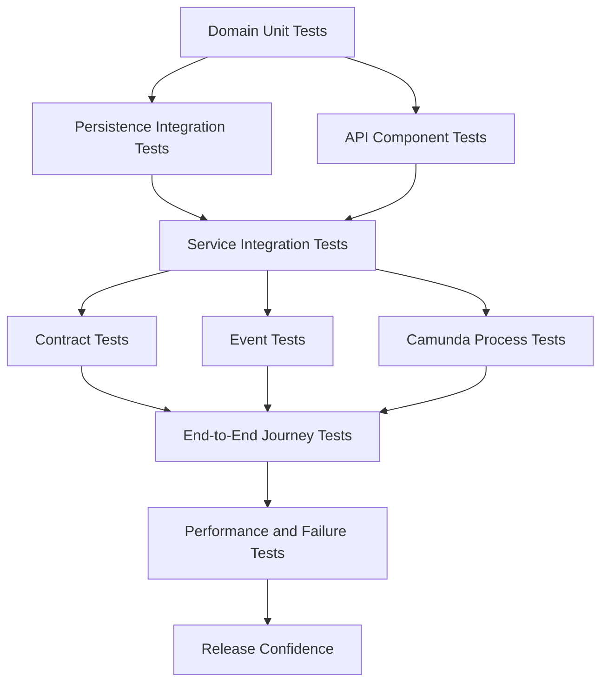
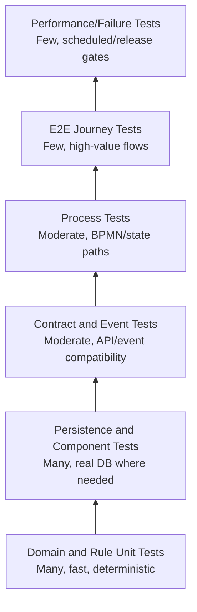
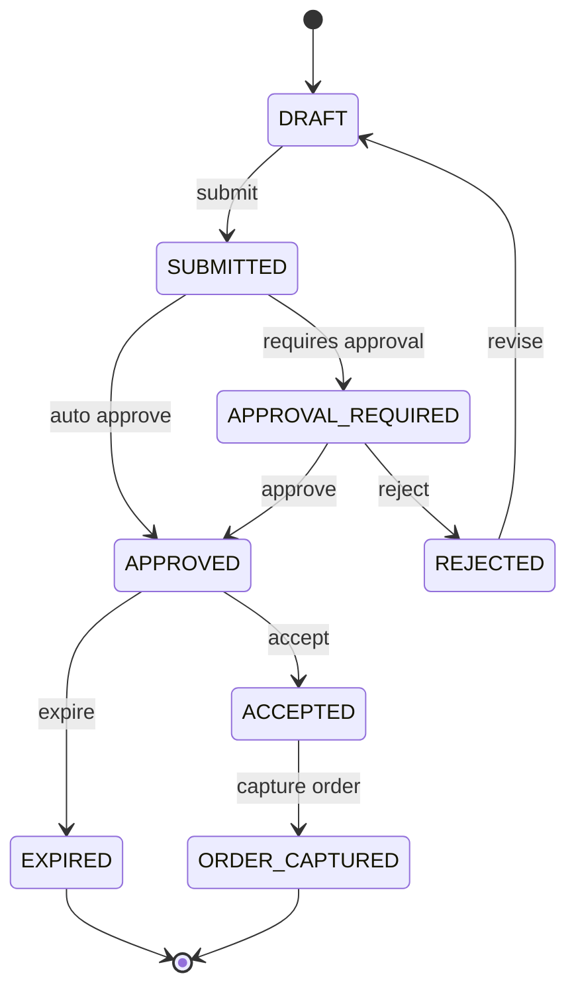
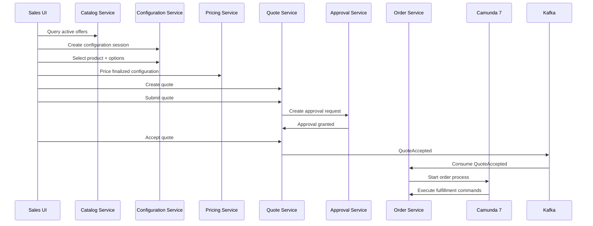
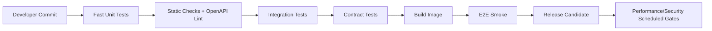

# Part 027 — Testing Strategy: Unit, Integration, Contract, E2E

Testing CPQ/OMS tidak boleh dipahami sebagai aktivitas mencari bug setelah implementasi selesai. Untuk platform seperti ini, testing adalah cara kita **membuktikan invariant bisnis, kontrak integrasi, dan failure behavior** sebelum sistem menerima traffic nyata.

CPQ/OMS punya karakteristik yang membuat strategi testing biasa sering gagal:

1. Banyak rule bisnis yang conditional: product eligibility, compatibility, discount threshold, approval matrix, fulfillment dependency.
2. Banyak state machine: quote, approval request, order, order line, saga, BPMN process instance.
3. Banyak boundary: HTTP, database, Kafka, Redis, Camunda, external fulfillment, identity provider, document generation.
4. Banyak consistency window: event eventually delivered, projection eventually updated, approval task eventually escalated.
5. Banyak failure mode yang legal secara teknis tetapi ilegal secara bisnis: double order capture, stale quote acceptance, duplicate fulfillment, cross-tenant read, repeated approval.

> Mental model utama: test suite CPQ/OMS bukan hanya mengecek apakah method benar. Test suite harus menjadi executable specification untuk contract, invariant, transition, and recovery.

---

## Learning Goals

Setelah menyelesaikan part ini, kita harus mampu:

1. Mendesain test strategy multi-layer untuk platform CPQ/OMS.
2. Membedakan unit, component, integration, contract, process, event, E2E, performance, security, dan chaos test.
3. Menulis test yang memverifikasi invariant domain, bukan hanya branch coverage.
4. Menggunakan JUnit, Testcontainers, Pact/contract test, Kafka test harness, dan Camunda process test secara tepat.
5. Mendesain fixture/test data yang deterministic, maintainable, dan tidak menipu.
6. Menguji idempotency, concurrency, retry, timeout, dan compensation.
7. Membuat CI pipeline yang cepat untuk inner loop, tetapi tetap kuat untuk release gate.
8. Menghindari test suite yang flaky, lambat, dan tidak dipercaya engineer.

---

## Kaufman Deconstruction

Kaufman menekankan deconstruction: pecah skill besar menjadi subskill kecil yang bisa dipraktikkan cepat. Skill testing CPQ/OMS kita pecah sebagai berikut:

| Subskill | Pertanyaan Kunci | Artefak Praktis |
|---|---|---|
| Domain invariant testing | Apa yang tidak boleh pernah dilanggar? | Unit/property/golden tests |
| Contract testing | Apakah boundary berubah secara aman? | OpenAPI/Pact/event schema tests |
| Persistence testing | Apakah SQL + constraint benar? | PostgreSQL Testcontainers tests |
| Process testing | Apakah BPMN mengikuti lifecycle yang benar? | Camunda process tests |
| Event testing | Apakah event published/consumed idempotent? | Kafka integration tests |
| E2E testing | Apakah quote-to-order berjalan sebagai user journey? | Scenario tests |
| Failure testing | Apa yang terjadi saat dependency gagal? | Retry/idempotency/compensation tests |
| CI feedback loop | Test mana berjalan kapan? | Maven profiles + pipeline gates |

Prinsipnya: kita tidak menulis semua test di semua layer. Kita menempatkan test di layer termurah yang bisa membuktikan risiko tertentu.

---

## Testing Architecture Overview



Test suite yang sehat punya beberapa karakteristik:

1. **Fast inner loop**: domain unit tests, mapper smoke tests, API validation tests.
2. **Real dependency confidence**: PostgreSQL, Kafka, Redis, Camunda dijalankan secara disposable untuk integration tests.
3. **Contract-first confidence**: OpenAPI dan event schema menjadi gate, bukan dokumentasi pasif.
4. **Few but meaningful E2E tests**: E2E tidak dipakai untuk semua edge case.
5. **Operational failure tests**: retry, duplicate, timeout, stale event, crash recovery diuji secara eksplisit.

---

## Test Taxonomy for CPQ/OMS

| Test Type | Scope | Real Dependency? | Speed | What It Proves | Example |
|---|---:|---:|---:|---|---|
| Domain unit | Single class/aggregate | No | Very fast | Business invariant | Quote cannot be accepted after expiry |
| Rule unit | Rule evaluator | No | Very fast | Rule correctness | Bundle requires mandatory add-on |
| Golden master | Pure deterministic engine | No/fixture | Fast | Complex calculation stability | Pricing output for known catalog |
| Persistence integration | Mapper + DB | PostgreSQL | Medium | SQL, constraint, transaction | Optimistic lock rejects stale update |
| API component | Resource + handler | Optional DB | Medium | HTTP contract and error mapping | POST quote returns Problem response |
| Consumer contract | Consumer expectation | Mock provider | Fast/medium | Consumer uses valid API subset | Order service expects quote acceptance API |
| Provider contract | Provider verification | Service + DB | Medium | Provider still satisfies consumers | Quote service satisfies order consumer |
| Event contract | Event producer/consumer | Schema validator | Fast/medium | Event compatibility | `QuoteAccepted.v1` schema remains compatible |
| Kafka integration | Producer/consumer + broker | Kafka | Medium/slow | Ordering, idempotency, retry | Duplicate event is ignored |
| Camunda process | BPMN + delegates mocked/real | Camunda DB optional | Medium | Process path and incident behavior | Order fulfillment timer escalates |
| E2E journey | Multiple services | Full stack | Slow | Critical business journey | Configure -> price -> quote -> approve -> order |
| Performance | Hot path/load | Full/partial stack | Slow | Capacity and latency | Pricing p95 under threshold |
| Security | Boundary/permission | Partial/full | Medium | Authz/isolation | Cross-tenant quote read denied |
| Chaos/failure | Fault injection | Full/partial | Slow | Recovery behavior | Kafka down during order capture |

---

## Test Pyramid Adapted for CPQ/OMS

Generic test pyramid sering terlalu sederhana untuk distributed systems. CPQ/OMS butuh pyramid yang memisahkan domain, contract, event, dan process tests.



Rules of placement:

1. Jika rule bisa diuji sebagai pure function, jangan uji lewat E2E.
2. Jika risiko ada di SQL/constraint/transaction, pakai PostgreSQL nyata.
3. Jika risiko ada di API compatibility, pakai contract tests dan OpenAPI validation.
4. Jika risiko ada di Kafka ordering/idempotency, pakai broker nyata.
5. Jika risiko ada di BPMN timer/error/incident, pakai process test.
6. Jika risiko ada di user journey lintas service, baru pakai E2E.

---

## Repository Test Layout

Gunakan layout yang membuat intent test terlihat dari path, bukan hanya nama class.

```text
services/
  quote-service/
    src/
      main/java/...
      test/java/...
        domain/
          QuoteStateMachineTest.java
          QuoteInvariantTest.java
        pricing/
          DiscountPolicyTest.java
        application/
          SubmitQuoteCommandHandlerTest.java
        api/
          QuoteResourceValidationTest.java
      integrationTest/java/...
        persistence/
          QuoteMapperIT.java
          QuoteOutboxMapperIT.java
        api/
          QuoteApiComponentIT.java
        kafka/
          QuoteEventPublisherIT.java
        camunda/
          QuoteApprovalProcessIT.java
      contractTest/java/...
        consumer/
          OrderServiceQuoteApiPactTest.java
        provider/
          QuoteServiceProviderPactIT.java
      e2eTest/java/...
        QuoteToOrderJourneyE2E.java
    src/test/resources/
      fixtures/
      golden/
      openapi/
      schemas/
```

Maven profile minimum:

```xml
<profiles>
  <profile>
    <id>unit</id>
    <properties>
      <skip.integration.tests>true</skip.integration.tests>
      <skip.contract.tests>true</skip.contract.tests>
      <skip.e2e.tests>true</skip.e2e.tests>
    </properties>
  </profile>

  <profile>
    <id>integration</id>
    <properties>
      <skip.integration.tests>false</skip.integration.tests>
    </properties>
  </profile>

  <profile>
    <id>contract</id>
    <properties>
      <skip.contract.tests>false</skip.contract.tests>
    </properties>
  </profile>

  <profile>
    <id>e2e</id>
    <properties>
      <skip.e2e.tests>false</skip.e2e.tests>
    </properties>
  </profile>
</profiles>
```

Naming convention:

| Suffix | Meaning | Example |
|---|---|---|
| `Test` | Fast unit/component test | `QuoteStateMachineTest` |
| `IT` | Integration test with real dependency | `QuoteMapperIT` |
| `ContractTest` | Consumer/provider/API/event contract | `QuoteApiContractTest` |
| `E2E` | Full journey test | `QuoteToOrderJourneyE2E` |
| `PerfTest` | Performance/load test | `PricingEnginePerfTest` |

---

## Domain Invariant Tests

Domain tests harus membuktikan invariant bisnis. Jangan hanya mengecek getter/setter.

Contoh invariant quote:

| Invariant | Test |
|---|---|
| Draft quote can be edited | `draftQuote_allowsLineChange` |
| Submitted quote cannot mutate line items | `submittedQuote_rejectsLineChange` |
| Expired quote cannot be accepted | `expiredQuote_rejectsAcceptance` |
| Accepted quote can be captured only once | `acceptedQuote_captureIsIdempotent` |
| Approval required if discount exceeds threshold | `highDiscount_requiresApproval` |
| Version mismatch rejects update | `staleVersion_rejected` |

Contoh JUnit-style test:

```java
class QuoteStateMachineTest {

    private final Clock fixedClock = Clock.fixed(
        Instant.parse("2026-07-02T00:00:00Z"),
        ZoneOffset.UTC
    );

    @Test
    void expiredQuoteCannotBeAccepted() {
        Quote quote = QuoteFixture.approvedQuote()
            .expiresAt(Instant.parse("2026-07-01T00:00:00Z"))
            .build();

        DomainException ex = assertThrows(
            DomainException.class,
            () -> quote.accept(new AcceptQuoteCommand(
                quote.id(),
                quote.version(),
                "customer-signature-001"
            ), fixedClock)
        );

        assertThat(ex.code()).isEqualTo("QUOTE_EXPIRED");
        assertThat(quote.status()).isEqualTo(QuoteStatus.APPROVED);
    }

    @Test
    void submittedQuoteCannotChangeCommercialLines() {
        Quote quote = QuoteFixture.submittedQuote().build();

        DomainException ex = assertThrows(
            DomainException.class,
            () -> quote.replaceLine(new ReplaceQuoteLineCommand(
                quote.id(),
                quote.version(),
                QuoteLineFixture.standardInternetAccess()
            ))
        );

        assertThat(ex.code()).isEqualTo("QUOTE_NOT_EDITABLE");
    }
}
```

Critical discipline:

1. Domain tests should not know HTTP.
2. Domain tests should not know PostgreSQL.
3. Domain tests should not know Kafka.
4. Domain tests should use fixed clock.
5. Domain tests should assert state and emitted domain events.

---

## State Machine Transition Tests

State machine bugs biasanya tidak terlihat dari happy path. Kita perlu matriks transition.



Build a transition table test:

```java
@ParameterizedTest
@MethodSource("invalidTransitions")
void invalidTransitionsAreRejected(QuoteStatus from, QuoteAction action) {
    Quote quote = QuoteFixture.quoteInStatus(from).build();

    DomainException ex = assertThrows(
        DomainException.class,
        () -> QuoteTransitionExecutor.apply(quote, action)
    );

    assertThat(ex.code()).isEqualTo("INVALID_QUOTE_TRANSITION");
}

static Stream<Arguments> invalidTransitions() {
    return Stream.of(
        arguments(QuoteStatus.DRAFT, QuoteAction.ACCEPT),
        arguments(QuoteStatus.REJECTED, QuoteAction.ACCEPT),
        arguments(QuoteStatus.EXPIRED, QuoteAction.SUBMIT),
        arguments(QuoteStatus.ORDER_CAPTURED, QuoteAction.CANCEL)
    );
}
```

Jangan hanya test allowed transition. Test illegal transition juga wajib karena platform ini akan menerima retry, duplicate command, stale UI action, dan manual repair.

---

## Pricing Golden Master Tests

Pricing engine biasanya punya kombinasi rule yang besar. Golden master tests membantu menjaga determinisme.

Golden master cocok untuk:

1. Multi-line bundle pricing.
2. Recurring + one-time charges.
3. Discount stacking.
4. Proration.
5. Contract term multiplier.
6. Approval signal derivation.
7. Currency rounding.

Struktur fixture:

```text
src/test/resources/golden/pricing/
  enterprise-internet-v1/
    input.json
    expected-output.json
  bundle-with-addon-discount-v1/
    input.json
    expected-output.json
  high-discount-approval-v1/
    input.json
    expected-output.json
```

Test example:

```java
@ParameterizedTest
@ValueSource(strings = {
    "enterprise-internet-v1",
    "bundle-with-addon-discount-v1",
    "high-discount-approval-v1"
})
void pricingGoldenMaster(String scenario) throws Exception {
    PricingRequest request = JsonFixture.load(
        "golden/pricing/" + scenario + "/input.json",
        PricingRequest.class
    );

    PricingResult actual = pricingEngine.price(request);

    JsonAssert.assertEqualsIgnoringFieldOrder(
        "golden/pricing/" + scenario + "/expected-output.json",
        actual
    );
}
```

Golden master rule:

- Update expected output only via review.
- Include explanation in PR: rule change or bug fix?
- Snapshot hash should change only when commercial outcome changes.
- Avoid random IDs and timestamps in expected output.

---

## Property-Based Testing for Domain Rules

Property-based testing berguna untuk rule yang punya ruang kombinasi besar.

Contoh property pricing:

1. Total price must never be negative unless credit line type explicitly allows negative amount.
2. Increasing quantity should not reduce gross recurring price before discount.
3. Discount percent must stay within allowed policy range.
4. Sum of line net amounts must equal quote total net amount.
5. Currency scale must never exceed configured minor units.

Pseudo-test:

```java
@Property
void totalNetEqualsSumOfLineNetAmounts(@ForAll("validPricingRequests") PricingRequest request) {
    PricingResult result = pricingEngine.price(request);

    Money sum = result.lines().stream()
        .map(PricedLine::netAmount)
        .reduce(Money.zero(result.currency()), Money::add);

    assertThat(result.totalNetAmount()).isEqualTo(sum);
}
```

Property-based testing bukan pengganti golden master. Golden master menjaga known business scenarios; property tests mencari edge case tidak terduga.

---

## Persistence Integration Tests with PostgreSQL

Persistence tests harus memakai PostgreSQL nyata, bukan H2, karena:

1. JSONB behavior berbeda.
2. Constraint behavior berbeda.
3. Locking behavior berbeda.
4. `SKIP LOCKED` behavior penting untuk outbox.
5. Indexing/query plan butuh engine asli.

Testcontainers pattern:

```java
@Testcontainers
class QuoteMapperIT {

    @Container
    static PostgreSQLContainer<?> postgres = new PostgreSQLContainer<>("postgres:18")
        .withDatabaseName("quote_service")
        .withUsername("quote")
        .withPassword("quote");

    private QuoteMapper quoteMapper;

    @BeforeAll
    static void migrate() {
        Flyway.configure()
            .dataSource(postgres.getJdbcUrl(), postgres.getUsername(), postgres.getPassword())
            .locations("classpath:db/migration")
            .load()
            .migrate();
    }

    @Test
    void optimisticLockRejectsStaleUpdate() {
        QuoteRow row = QuoteRowFixture.draft().build();
        quoteMapper.insert(row);

        int updated = quoteMapper.updateStatus(
            row.quoteId(),
            row.version(),
            "SUBMITTED",
            Instant.now()
        );
        assertThat(updated).isEqualTo(1);

        int stale = quoteMapper.updateStatus(
            row.quoteId(),
            row.version(),
            "APPROVED",
            Instant.now()
        );
        assertThat(stale).isEqualTo(0);
    }
}
```

Persistence test checklist:

- Migration is applied exactly like production.
- Constraint violation is asserted as domain error mapping.
- Query uses tenant guard.
- Optimistic locking is tested.
- Outbox insert happens in same transaction as aggregate mutation.
- Pagination order is deterministic.
- JSONB field is validated at app boundary before insert.
- Index-critical query has at least smoke `EXPLAIN` coverage for hot paths.

---

## MyBatis Mapper Tests

Mapper tests should verify actual SQL contract.

Example cases:

| Mapper | Test |
|---|---|
| `QuoteMapper.insert` | Insert complete quote snapshot |
| `QuoteMapper.findByIdForTenant` | Cross-tenant query returns empty |
| `QuoteMapper.updateStatus` | Version mismatch returns 0 |
| `OutboxMapper.claimBatch` | Multiple workers do not claim same row |
| `InboxMapper.markProcessed` | Duplicate event rejected by unique key |
| `IdempotencyMapper.reserve` | Same key returns existing response |

Example outbox claim test:

```java
@Test
void concurrentOutboxClaimDoesNotReturnSameRows() throws Exception {
    outboxMapper.insertBatch(OutboxFixture.pendingEvents(20));

    ExecutorService pool = Executors.newFixedThreadPool(2);

    Future<List<OutboxRow>> first = pool.submit(() ->
        tx.execute(status -> outboxMapper.claimBatch("publisher-a", 10))
    );

    Future<List<OutboxRow>> second = pool.submit(() ->
        tx.execute(status -> outboxMapper.claimBatch("publisher-b", 10))
    );

    Set<UUID> claimedIds = Stream.concat(first.get().stream(), second.get().stream())
        .map(OutboxRow::id)
        .collect(Collectors.toSet());

    assertThat(claimedIds).hasSize(20);
}
```

This test proves the publisher can scale horizontally without duplicate row claim.

---

## API Component Tests

API tests verify boundary behavior:

1. Request validation.
2. Authentication/authorization mapping.
3. Idempotency header behavior.
4. Error response format.
5. Status code discipline.
6. OpenAPI compatibility.
7. DTO-command mapping.

Example API validation test:

```java
@Test
void submitQuoteRejectsMissingIdempotencyKey() {
    given()
        .contentType("application/json")
        .body("""
        {
          "quoteId": "018ffd4f-62a0-7f4f-b9df-3d8c8d61e001"
        }
        """)
    .when()
        .post("/v1/quotes/{quoteId}/submit", quoteId)
    .then()
        .statusCode(400)
        .body("type", equalTo("https://errors.example.com/missing-idempotency-key"))
        .body("code", equalTo("MISSING_IDEMPOTENCY_KEY"));
}
```

API tests should assert response contract, not internal class names.

---

## OpenAPI Contract Tests

OpenAPI-first means implementation must be validated against the contract.

Test categories:

1. **Spec linting**: operationId, error response, security, examples, versioning.
2. **Request validation**: generated schemas reject invalid payloads.
3. **Response validation**: service responses conform to OpenAPI.
4. **Backward compatibility**: new spec does not break previous consumers.
5. **Example validation**: examples in docs are executable.

CI gate example:

```bash
# lint style and governance
spectral lint openapi/**/*.yaml

# check breaking changes
openapi-diff old/openapi.yaml new/openapi.yaml

# validate examples
openapi-examples-validator openapi/quote-service.yaml
```

For CPQ/OMS, OpenAPI contract must include:

| Contract Area | Why It Matters |
|---|---|
| Error model | UI and integrators need stable error codes |
| Idempotency headers | Prevent duplicate quote/order operations |
| ETag/version fields | Prevent stale updates |
| Pagination | Avoid hidden load risks |
| Security schemes | Prevent undocumented auth assumptions |
| Money schema | Prevent floating-point drift |
| State enums | Prevent invalid lifecycle transition |

---

## Consumer-Driven Contract Tests

Consumer-driven contract testing is useful when services evolve independently.

Example interactions:

| Consumer | Provider | Contract |
|---|---|---|
| Order service | Quote service | Fetch accepted quote snapshot |
| Quote service | Pricing service | Calculate price for configuration |
| Approval service | Quote service | Notify approval decision |
| UI/BFF | Catalog service | Query published catalog offers |
| Fulfillment service | Order service | Fetch order line dependencies |

Consumer test pseudo-example:

```java
@Pact(consumer = "order-service", provider = "quote-service")
RequestResponsePact acceptedQuoteSnapshot(PactDslWithProvider builder) {
    return builder
        .given("quote Q-100 is accepted for tenant T-1")
        .uponReceiving("request accepted quote snapshot")
            .method("GET")
            .path("/v1/quotes/Q-100/snapshot")
            .headers("Authorization", "Bearer test-token")
        .willRespondWith()
            .status(200)
            .headers(Map.of("Content-Type", "application/json"))
            .body(newJsonBody(body -> {
                body.stringType("quoteId", "Q-100");
                body.stringType("status", "ACCEPTED");
                body.stringType("currency", "IDR");
                body.array("lines", lines -> lines.object(line -> {
                    line.stringType("lineId", "L-1");
                    line.stringType("productCode", "ENT-INTERNET");
                }));
            }).build())
        .toPact();
}
```

Provider verification then runs against quote-service. If quote-service changes response shape, the contract fails before production.

Important nuance:

- Pact is strong for consumer/provider HTTP boundary.
- OpenAPI is strong for public API governance.
- Use both when needed, not as duplicate bureaucracy.

---

## Event Contract Tests

Kafka event tests must validate schema and semantic contract.

Example `QuoteAccepted.v1` event contract:

```json
{
  "eventId": "018ffd4f-62a0-7f4f-b9df-3d8c8d61e777",
  "eventType": "QuoteAccepted",
  "eventVersion": 1,
  "occurredAt": "2026-07-02T10:00:00Z",
  "tenantId": "tenant-001",
  "aggregateType": "Quote",
  "aggregateId": "quote-001",
  "aggregateVersion": 7,
  "correlationId": "corr-001",
  "causationId": "cmd-001",
  "payload": {
    "quoteId": "quote-001",
    "acceptedAt": "2026-07-02T10:00:00Z",
    "acceptedBy": "customer-user-001",
    "commercialSnapshotId": "snap-001"
  }
}
```

Event contract tests should check:

1. Required envelope fields are present.
2. `eventType` and `eventVersion` match schema catalog.
3. `aggregateId` and Kafka key match partition strategy.
4. Payload validates against schema.
5. PII classification is respected.
6. Consumer ignores unknown fields.
7. Consumer handles duplicate `eventId` idempotently.

Consumer tolerance example:

```java
@Test
void consumerIgnoresUnknownForwardCompatibleFields() {
    String eventJson = Fixture.load("events/quote-accepted-v1-with-extra-field.json");

    assertDoesNotThrow(() -> quoteAcceptedConsumer.handle(eventJson));
}
```

---

## Kafka Integration Tests

Use real Kafka for these risks:

1. Topic creation and config.
2. Partition key behavior.
3. Consumer group behavior.
4. Retry topic flow.
5. DLT routing.
6. Serialization/deserialization.
7. Outbox publisher behavior.

Example:

```java
@Testcontainers
class QuoteEventPublisherIT {

    @Container
    static KafkaContainer kafka = new KafkaContainer(
        DockerImageName.parse("apache/kafka:4.3.0")
    );

    @Test
    void quoteAcceptedEventIsPublishedWithQuoteIdAsKey() {
        QuoteAcceptedEvent event = QuoteEventFixture.accepted().build();

        publisher.publish(event);

        ConsumerRecord<String, String> record = kafkaTestConsumer.readOne("quote.public.events.v1");

        assertThat(record.key()).isEqualTo(event.quoteId().toString());
        assertThat(record.value()).contains("QuoteAccepted");
    }
}
```

Do not overuse Kafka integration tests for pure business logic. Keep business rule tests at domain layer.

---

## Inbox Idempotency Tests

Consumer idempotency is mandatory.

```java
@Test
void duplicateEventIsProcessedOnce() {
    QuoteAcceptedEvent event = QuoteEventFixture.accepted()
        .eventId(UUID.fromString("018ffd4f-62a0-7f4f-b9df-3d8c8d61e777"))
        .build();

    consumer.handle(event);
    consumer.handle(event);

    assertThat(orderRepository.countOrdersForQuote(event.quoteId())).isEqualTo(1);
    assertThat(inboxRepository.find(event.eventId()).status()).isEqualTo("PROCESSED");
}
```

This test should pass even if the duplicate event arrives after service restart.

---

## Camunda Process Tests

Camunda process tests should prove orchestration behavior, not domain logic.

Testable process concerns:

1. Correct process starts with business key.
2. Correct path selected by gateway.
3. Service task failure creates retry/incident as expected.
4. BPMN error routes to business failure path.
5. Timer boundary event escalates.
6. Message correlation resumes waiting process.
7. Compensation path is triggered when downstream step fails.
8. Process variables stay minimal and serializable.

Example process test shape:

```java
class OrderFulfillmentProcessTest {

    @Test
    void activationFailureRoutesToManualReview() {
        ProcessInstance process = runtimeService.startProcessInstanceByKey(
            "order-fulfillment-v1",
            "order-001",
            Map.of(
                "tenantId", "tenant-001",
                "orderId", "order-001"
            )
        );

        execute(job("reserveInventory"));
        failJob("activateService", new BpmnError("ACTIVATION_REJECTED"));

        assertThat(process).isWaitingAt("manualReviewTask");
    }
}
```

Keep process tests small. The process should call application commands; command behavior is tested elsewhere.

---

## E2E Journey Tests

E2E tests should cover few critical business journeys:

1. Happy path quote-to-order.
2. Quote requires approval then becomes order.
3. Order partial fulfillment failure routes to repair.
4. Stale quote acceptance is rejected.
5. Duplicate order capture is idempotent.
6. Cross-tenant access is denied.

Example journey:



E2E assertion should verify business state, not UI pixels:

```java
@Test
void highDiscountQuoteRequiresApprovalThenCapturesOrder() {
    CatalogOffer offer = catalogApi.findOffer("ENT-INTERNET");

    ConfigurationResponse configuration = configApi.createSession()
        .selectOffer(offer.id())
        .setAttribute("bandwidth", "1Gbps")
        .finalizeConfiguration();

    PricingResponse pricing = pricingApi.price(configuration.snapshotId(), discountPercent("25"));
    assertThat(pricing.approvalSignals()).contains("DISCOUNT_ABOVE_THRESHOLD");

    QuoteResponse quote = quoteApi.createQuote(configuration.snapshotId(), pricing.snapshotId());
    quoteApi.submit(quote.quoteId(), idempotencyKey("submit-001"));

    approvalApi.approvePendingRequest(quote.quoteId(), "manager-001");
    quoteApi.accept(quote.quoteId(), idempotencyKey("accept-001"));

    Awaitility.await().untilAsserted(() -> {
        OrderResponse order = orderApi.findByQuoteId(quote.quoteId());
        assertThat(order.status()).isIn("CAPTURED", "IN_PROGRESS", "COMPLETED");
    });
}
```

E2E test anti-patterns:

- Testing every validation error through E2E.
- Depending on sleep instead of polling condition.
- Sharing mutable test data across tests.
- Ignoring cleanup/reset strategy.
- Asserting internal implementation details.

---

## Test Data Strategy

Bad fixtures destroy test quality. CPQ/OMS fixtures need to be explicit and composable.

Use layered fixture builders:

```java
public final class QuoteFixture {

    public static QuoteBuilder draftQuote() {
        return new QuoteBuilder()
            .tenantId(TenantId.of("tenant-001"))
            .status(QuoteStatus.DRAFT)
            .currency(CurrencyUnit.IDR)
            .expiresAt(Instant.parse("2026-08-01T00:00:00Z"))
            .line(QuoteLineFixture.enterpriseInternet());
    }

    public static QuoteBuilder approvedQuote() {
        return draftQuote()
            .status(QuoteStatus.APPROVED)
            .approvalEvidenceId("approval-001");
    }
}
```

Fixture rules:

1. Default fixture must be valid.
2. Test-specific mutation should be visible in test body.
3. Avoid global mutable fixture.
4. Use deterministic IDs when asserting exact values.
5. Use random IDs only when independence matters.
6. Never hide business-critical values inside large JSON blobs without naming them.

---

## Time, Clock, and Determinism

Time is a major source of flaky tests.

CPQ/OMS time-sensitive cases:

1. Quote expiry.
2. Approval SLA.
3. Order timeout.
4. Retry backoff.
5. Cache TTL.
6. Idempotency retention.
7. Event occurredAt.
8. Audit timestamp.

Inject `Clock` everywhere:

```java
public final class QuoteService {
    private final Clock clock;

    public QuoteService(Clock clock) {
        this.clock = clock;
    }

    public void expireQuotes() {
        Instant now = clock.instant();
        quoteRepository.expireBefore(now);
    }
}
```

Test with fixed clock:

```java
Clock fixedClock = Clock.fixed(
    Instant.parse("2026-07-02T10:00:00Z"),
    ZoneOffset.UTC
);
```

For async tests, prefer controllable scheduler or Awaitility-style polling with clear timeout.

---

## Concurrency Tests

Concurrency bugs in CPQ/OMS are common:

1. Two users submit same quote.
2. Two processes capture order from same accepted quote.
3. Two publishers claim same outbox row.
4. Two consumers process same event.
5. Approval decision races with quote cancellation.
6. Fulfillment callback arrives after cancellation.

Example duplicate order capture test:

```java
@Test
void concurrentQuoteAcceptedEventsCreateOneOrder() throws Exception {
    QuoteAcceptedEvent event = QuoteEventFixture.accepted().build();

    ExecutorService pool = Executors.newFixedThreadPool(2);
    Future<?> first = pool.submit(() -> orderConsumer.handle(event));
    Future<?> second = pool.submit(() -> orderConsumer.handle(event));

    first.get();
    second.get();

    assertThat(orderRepository.countByQuoteId(event.quoteId())).isEqualTo(1);
}
```

Concurrency tests should assert durable outcomes in database, not only in-memory flags.

---

## Failure-Mode Tests

Each critical operation needs a failure matrix.

Example quote acceptance:

| Failure | Expected Behavior | Test |
|---|---|---|
| Client retries same accept command | Same result returned | Idempotency replay test |
| Client sends stale version | 409 conflict | Optimistic lock test |
| Quote expired | 422 business error | Domain invariant test |
| DB commits but Kafka publish fails | Outbox remains pending | Outbox recovery test |
| Kafka publishes duplicate event | Order created once | Inbox idempotency test |
| Order service down | Event remains consumable/retry | Consumer restart test |

Example outbox recovery:

```java
@Test
void committedOutboxEventIsPublishedAfterPublisherRestart() {
    UUID quoteId = quoteService.acceptQuote(command);

    outboxPublisher.claimButCrashBeforeMarkingPublished();

    outboxPublisher.restartAndPublishPending();

    assertThat(kafkaProbe.findEvent("QuoteAccepted", quoteId)).isPresent();
    assertThat(outboxRepository.findByAggregateId(quoteId).status()).isEqualTo("PUBLISHED");
}
```

---

## Security Tests

Security tests must be automated, not only reviewed.

Minimum security test cases:

1. Missing token returns 401.
2. Valid token without permission returns 403.
3. User from tenant A cannot read tenant B quote.
4. Service token cannot perform human approval action.
5. Admin repair action requires privileged permission.
6. Event consumer rejects event with invalid tenant context.
7. Logs do not expose sensitive PII/commercial secrets.
8. OpenAPI documents security schemes for protected endpoints.

Example:

```java
@Test
void crossTenantQuoteReadIsDenied() {
    Quote quote = quoteFixture.createForTenant("tenant-a");

    given()
        .auth().oauth2(tokenForTenant("tenant-b"))
    .when()
        .get("/v1/quotes/{quoteId}", quote.id())
    .then()
        .statusCode(404); // hide existence across tenant boundary
}
```

For multi-tenant systems, returning 404 for cross-tenant object access often avoids leaking existence. Internal audit should still record denied access with reason.

---

## Performance Tests

Performance tests should target hot paths:

1. Catalog offer query.
2. Configuration validation.
3. Pricing calculation.
4. Quote submission.
5. Order capture.
6. Outbox publisher throughput.
7. Kafka consumer lag recovery.
8. Camunda job executor throughput.

Do not run heavy performance tests on every commit. Use scheduled or release-gate runs.

Example performance acceptance:

| Flow | Target |
|---|---|
| Catalog search p95 | under defined local benchmark threshold |
| Pricing p95 | bounded by offer/rule complexity |
| Quote submit p95 | stable under concurrent users |
| Outbox publish lag | drains backlog within defined time |
| Order capture duplicate rate | zero duplicate orders under retry storm |

Performance test should always record:

- dataset size,
- hardware/container resource limit,
- JVM version,
- database size,
- index state,
- Kafka partition count,
- concurrency level,
- p50/p95/p99,
- error rate,
- saturation signals.

---

## Test Execution Strategy in CI



Recommended gates:

| Gate | Runs On | Must Include |
|---|---|---|
| Pre-commit/local | Developer | Unit + changed module tests |
| PR fast gate | Every PR | Unit, lint, OpenAPI/schema compatibility |
| PR integration gate | Every PR or selected paths | PostgreSQL/MyBatis, Kafka, Redis integration |
| Contract gate | Every PR touching API/event | Consumer/provider/event contracts |
| E2E smoke | Merge/release branch | Quote-to-order critical path |
| Nightly | Scheduled | Full E2E, performance smoke, security scan |
| Release gate | Before prod | Migration test, rollback/roll-forward drill, load/failure scenarios |

---

## Flaky Test Prevention

Flaky tests reduce trust. Once engineers stop trusting tests, CI becomes theater.

Common flakiness sources:

| Source | Fix |
|---|---|
| Real time sleeps | Poll condition with timeout |
| Shared state | Isolate DB/schema/topic per test suite |
| Random IDs in assertions | Use deterministic IDs where needed |
| Async event timing | Await durable state, not message timing |
| Container startup race | Use health checks/wait strategies |
| Parallel tests sharing tenant | Unique tenant/test namespace |
| Clock dependency | Inject fixed clock |
| Order-dependent tests | Reset state or isolate resources |

Anti-pattern:

```java
Thread.sleep(5000);
assertThat(orderApi.find(orderId).status()).isEqualTo("COMPLETED");
```

Better:

```java
Awaitility.await()
    .atMost(Duration.ofSeconds(20))
    .pollInterval(Duration.ofMillis(250))
    .untilAsserted(() ->
        assertThat(orderApi.find(orderId).status()).isEqualTo("COMPLETED")
    );
```

---

## Mutation Testing

Coverage percentage is weak. Mutation testing asks: if code is slightly changed, do tests fail?

Good candidates:

1. Pricing rules.
2. Approval thresholds.
3. State transition guards.
4. Authorization predicates.
5. Money rounding.
6. Idempotency guard.

Example mutation risk:

```java
if (discount.compareTo(maxAllowedDiscount) > 0) {
    requireApproval();
}
```

A mutation changes `>` to `>=` or `<`. If tests still pass, approval boundary is under-tested.

Do not run mutation testing on every commit. Use targeted modules and scheduled gates.

---

## Testing Anti-Patterns

| Anti-Pattern | Why It Hurts | Better Approach |
|---|---|---|
| E2E for every rule | Slow and flaky | Unit/property/golden tests |
| Mocking database behavior | Misses SQL/constraint bugs | PostgreSQL Testcontainers |
| Mocking Kafka for ordering tests | Misses partition/consumer behavior | Kafka Testcontainers |
| Shared mega-fixture | Hidden coupling | Scenario-specific builders |
| Tests assert implementation | Refactor breaks tests without behavior change | Assert public behavior |
| Ignoring negative paths | Invalid states reach prod | Transition matrix tests |
| Snapshot everything | Review becomes impossible | Snapshot only deterministic complex output |
| Sleep-based async tests | Flaky under load | Await durable condition |
| Coverage as goal | Encourages shallow tests | Risk/invariant coverage |

---

## Production Readiness Checklist

A CPQ/OMS service is not test-ready until:

- [ ] Domain invariants are covered by unit tests.
- [ ] State machine valid and invalid transitions are tested.
- [ ] Pricing/configuration complex scenarios have golden master tests.
- [ ] PostgreSQL migrations are executed in integration tests.
- [ ] MyBatis mappers are tested against PostgreSQL.
- [ ] Outbox/inbox idempotency is tested.
- [ ] Kafka producer/consumer integration is tested for critical events.
- [ ] OpenAPI spec is linted and response validation exists.
- [ ] Consumer/provider contracts exist for service-to-service API.
- [ ] Event schemas have compatibility tests.
- [ ] Camunda process paths, timers, errors, and incidents are tested.
- [ ] E2E tests cover top critical business journeys.
- [ ] Security tests cover authz and tenant isolation.
- [ ] Flaky test policy exists.
- [ ] CI profiles separate fast, integration, contract, E2E, performance gates.
- [ ] Test data reset/isolation is deterministic.
- [ ] Test failures produce actionable diagnostics.

---

## Implementation Lab

Build the following test suite for the quote-to-order flow:

1. Domain unit test: accepted quote cannot be modified.
2. Domain unit test: expired quote cannot be accepted.
3. Golden master test: high-discount quote emits approval signal.
4. PostgreSQL integration test: stale quote update fails optimistic lock.
5. MyBatis integration test: outbox row created in same transaction as quote acceptance.
6. API component test: missing idempotency key returns standard error.
7. Contract test: order service can fetch accepted quote snapshot.
8. Event contract test: `QuoteAccepted.v1` validates against schema.
9. Kafka integration test: duplicate `QuoteAccepted` event creates one order.
10. Camunda process test: order process starts with quote ID as business key.
11. E2E test: configure -> price -> submit -> approve -> accept -> order captured.
12. Failure test: DB commit succeeds but publisher crashes; outbox later publishes event.
13. Security test: tenant B cannot fetch tenant A quote.

Done correctly, this lab becomes the confidence backbone for later production hardening.

---

## Key Takeaways

1. CPQ/OMS testing is about proving invariant, contract, transition, and recovery.
2. Most business rules belong in domain/rule tests, not E2E.
3. Persistence tests must use real PostgreSQL for SQL, constraint, locking, and JSONB behavior.
4. Kafka and Camunda require specific integration/process tests because mocks hide real failure modes.
5. Contract tests protect independent service evolution.
6. Idempotency, retries, duplicates, and stale actions are first-class test scenarios.
7. A trusted test suite is an engineering asset; a flaky suite is operational debt.

Next, we will build the local development environment with Docker Compose and Testcontainers so these tests can run against realistic dependencies without slowing the team into paralysis.
