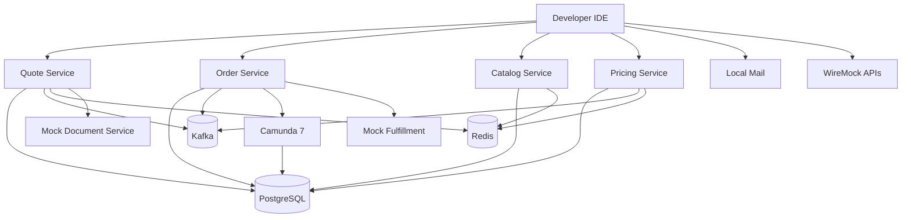

# Part 028 — Local Development with Docker Compose and Testcontainers

Local development environment adalah bagian dari arsitektur. Jika environment lokal lambat, tidak stabil, atau berbeda jauh dari production, engineer akan mengambil shortcut: mock terlalu banyak, skip test, manual seed data, bypass Kafka, bypass Camunda, atau langsung mencoba di shared staging. Itu bukan masalah tooling kecil. Itu masalah engineering system.

Untuk CPQ/OMS, local environment harus memungkinkan engineer menjalankan quote-to-order flow secara realistis:

1. PostgreSQL untuk persistence, constraint, migration, outbox/inbox.
2. Kafka untuk event backbone.
3. Redis untuk cache, idempotency, rate limit, runtime acceleration.
4. Camunda 7 untuk BPMN orchestration.
5. Mock external systems untuk fulfillment, identity, notification, document generation.
6. Observability minimum untuk logs, metrics, traces, and message inspection.
7. Deterministic seed/reset untuk test data.

> Mental model utama: Docker Compose adalah local product runtime; Testcontainers adalah test runtime. Keduanya boleh berbagi image/config concept, tetapi jangan dicampur sampai test menjadi tergantung pada environment manual.

---

## Learning Goals

Setelah menyelesaikan part ini, kita harus mampu:

1. Mendesain local CPQ/OMS stack yang repeatable dan realistis.
2. Menentukan service mana dijalankan via IDE, container, atau mock.
3. Menulis Docker Compose untuk PostgreSQL, Kafka, Redis, Camunda 7, dan mock services.
4. Menyiapkan migration, seed data, health check, topic bootstrap, dan data reset.
5. Menggunakan Testcontainers untuk integration tests tanpa shared environment.
6. Mengelola local developer workflow: start, stop, reset, logs, debug, profile.
7. Menghindari environment drift antara local, CI, dan production-like runtime.
8. Mendiagnosis masalah umum: port conflict, stale volume, migration drift, Kafka topic mismatch, Camunda incident, Redis eviction.

---

## Kaufman Deconstruction

Skill local development kita pecah seperti ini:

| Subskill | Pertanyaan Kunci | Output Praktis |
|---|---|---|
| Runtime topology | Dependency apa yang dibutuhkan untuk local flow? | Compose topology |
| Service execution mode | Service mana jalan di IDE vs container? | Dev profile |
| Data bootstrap | Bagaimana data catalog/tenant/user dibuat? | Seed scripts |
| Test isolation | Bagaimana test tidak bergantung local manual stack? | Testcontainers |
| Reset strategy | Bagaimana kembali ke state bersih? | Reset command |
| Observability | Bagaimana melihat request/event/process? | Local dashboard/logs |
| Failure simulation | Bagaimana mensimulasikan dependency down? | Fault commands |
| Developer ergonomics | Bagaimana satu command menjalankan flow? | Makefile/task runner |

---

## Local Environment Architecture



Execution modes:

| Mode | Use Case | Services |
|---|---|---|
| Infra-only | Normal coding/debugging | PostgreSQL, Kafka, Redis, Camunda, mocks |
| Full-container | Demo/smoke local flow | Infra + all CPQ/OMS services |
| Testcontainers | Automated integration tests | Test-specific dependencies |
| Hybrid | Debug one service in IDE | Infra in Compose, one service local JVM |

Recommended daily mode: **infra-only + service under development in IDE**. This gives fast debug and realistic dependencies.

---

## Directory Layout

```text
platform/
  docker/
    compose/
      compose.infra.yml
      compose.services.yml
      compose.observability.yml
      compose.mocks.yml
    postgres/
      init/
        001-create-databases.sql
        002-create-users.sql
      seed/
        catalog-seed.sql
        tenant-seed.sql
    kafka/
      topics.sh
    camunda/
      bpmns/
      application.yaml
    redis/
      redis.conf
    wiremock/
      mappings/
      __files/
  scripts/
    dev-up.sh
    dev-down.sh
    dev-reset.sh
    dev-logs.sh
    kafka-create-topics.sh
    db-migrate-all.sh
  services/
    catalog-service/
    configuration-service/
    pricing-service/
    quote-service/
    approval-service/
    order-service/
```

Keep local infrastructure outside service modules so all services use the same baseline.

---

## Docker Compose Baseline

A minimal infra stack:

```yaml
services:
  postgres:
    image: postgres:18
    container_name: cpqoms-postgres
    environment:
      POSTGRES_USER: platform
      POSTGRES_PASSWORD: platform
      POSTGRES_DB: platform_admin
    ports:
      - "5432:5432"
    volumes:
      - postgres-data:/var/lib/postgresql/data
      - ../postgres/init:/docker-entrypoint-initdb.d:ro
    healthcheck:
      test: ["CMD-SHELL", "pg_isready -U platform -d platform_admin"]
      interval: 5s
      timeout: 3s
      retries: 20

  kafka:
    image: apache/kafka:4.3.0
    container_name: cpqoms-kafka
    ports:
      - "9092:9092"
    environment:
      KAFKA_NODE_ID: 1
      KAFKA_PROCESS_ROLES: broker,controller
      KAFKA_CONTROLLER_QUORUM_VOTERS: 1@kafka:9093
      KAFKA_LISTENERS: PLAINTEXT://:9092,CONTROLLER://:9093
      KAFKA_ADVERTISED_LISTENERS: PLAINTEXT://localhost:9092
      KAFKA_CONTROLLER_LISTENER_NAMES: CONTROLLER
      KAFKA_INTER_BROKER_LISTENER_NAME: PLAINTEXT
      KAFKA_OFFSETS_TOPIC_REPLICATION_FACTOR: 1
      KAFKA_TRANSACTION_STATE_LOG_REPLICATION_FACTOR: 1
      KAFKA_TRANSACTION_STATE_LOG_MIN_ISR: 1
    healthcheck:
      test: ["CMD-SHELL", "/opt/kafka/bin/kafka-topics.sh --bootstrap-server localhost:9092 --list >/dev/null 2>&1"]
      interval: 10s
      timeout: 5s
      retries: 20

  redis:
    image: redis:8
    container_name: cpqoms-redis
    command: ["redis-server", "/usr/local/etc/redis/redis.conf"]
    ports:
      - "6379:6379"
    volumes:
      - ../redis/redis.conf:/usr/local/etc/redis/redis.conf:ro
    healthcheck:
      test: ["CMD", "redis-cli", "ping"]
      interval: 5s
      timeout: 3s
      retries: 20

  camunda:
    image: camunda/camunda-bpm-platform:run-7.24.0
    container_name: cpqoms-camunda
    ports:
      - "8088:8080"
    environment:
      DB_DRIVER: org.postgresql.Driver
      DB_URL: jdbc:postgresql://postgres:5432/camunda
      DB_USERNAME: camunda
      DB_PASSWORD: camunda
      WAIT_FOR: postgres:5432
    depends_on:
      postgres:
        condition: service_healthy

volumes:
  postgres-data:
```

Important notes:

1. Use KRaft Kafka for local modern Kafka; avoid ZooKeeper unless legacy compatibility requires it.
2. Use explicit image tags. Avoid `latest`.
3. Use health checks. `depends_on` without readiness is not enough.
4. Keep local credentials simple but never reuse them in shared/non-local environments.
5. Persist volumes for daily dev, but provide reset command.

---

## Database Initialization

Create separate databases/users per service to reinforce ownership.

```sql
-- docker/postgres/init/001-create-databases.sql
CREATE DATABASE catalog_service;
CREATE DATABASE configuration_service;
CREATE DATABASE pricing_service;
CREATE DATABASE quote_service;
CREATE DATABASE approval_service;
CREATE DATABASE order_service;
CREATE DATABASE camunda;

CREATE USER catalog WITH PASSWORD 'catalog';
CREATE USER configuration WITH PASSWORD 'configuration';
CREATE USER pricing WITH PASSWORD 'pricing';
CREATE USER quote WITH PASSWORD 'quote';
CREATE USER approval WITH PASSWORD 'approval';
CREATE USER orders WITH PASSWORD 'orders';
CREATE USER camunda WITH PASSWORD 'camunda';

GRANT ALL PRIVILEGES ON DATABASE catalog_service TO catalog;
GRANT ALL PRIVILEGES ON DATABASE configuration_service TO configuration;
GRANT ALL PRIVILEGES ON DATABASE pricing_service TO pricing;
GRANT ALL PRIVILEGES ON DATABASE quote_service TO quote;
GRANT ALL PRIVILEGES ON DATABASE approval_service TO approval;
GRANT ALL PRIVILEGES ON DATABASE order_service TO orders;
GRANT ALL PRIVILEGES ON DATABASE camunda TO camunda;
```

This local setup should mirror service ownership:

| Service | Database | User |
|---|---|---|
| Catalog | `catalog_service` | `catalog` |
| Configuration | `configuration_service` | `configuration` |
| Pricing | `pricing_service` | `pricing` |
| Quote | `quote_service` | `quote` |
| Approval | `approval_service` | `approval` |
| Order | `order_service` | `orders` |
| Camunda | `camunda` | `camunda` |

Do not let every service use `platform` superuser. That hides permission bugs.

---

## Migration Bootstrap

Each service owns its migrations.

```text
services/quote-service/src/main/resources/db/migration/
  V001__create_quote_tables.sql
  V002__create_quote_outbox.sql
  V003__create_idempotency_table.sql
```

Local migration script:

```bash
#!/usr/bin/env bash
set -euo pipefail

SERVICES=(catalog configuration pricing quote approval order)

for svc in "${SERVICES[@]}"; do
  echo "Migrating ${svc}-service"
  ./mvnw -pl services/${svc}-service -Pflyway-local flyway:migrate

done
```

Migration discipline:

1. Compose starts infrastructure.
2. Migration command runs explicitly.
3. Seed command runs after migration.
4. Services fail fast if schema version is incompatible.
5. Reset command drops local volumes or truncates owned databases.

---

## Kafka Topic Bootstrap

Create topics explicitly. Do not rely on auto-create for platform topics.

```bash
#!/usr/bin/env bash
set -euo pipefail

BOOTSTRAP=${BOOTSTRAP:-localhost:9092}
KAFKA_TOPICS=/opt/kafka/bin/kafka-topics.sh

docker exec cpqoms-kafka ${KAFKA_TOPICS} \
  --bootstrap-server ${BOOTSTRAP} \
  --create --if-not-exists \
  --topic quote.public.events.v1 \
  --partitions 6 \
  --replication-factor 1

docker exec cpqoms-kafka ${KAFKA_TOPICS} \
  --bootstrap-server ${BOOTSTRAP} \
  --create --if-not-exists \
  --topic order.public.events.v1 \
  --partitions 6 \
  --replication-factor 1

docker exec cpqoms-kafka ${KAFKA_TOPICS} \
  --bootstrap-server ${BOOTSTRAP} \
  --create --if-not-exists \
  --topic platform.retry.events.v1 \
  --partitions 6 \
  --replication-factor 1

docker exec cpqoms-kafka ${KAFKA_TOPICS} \
  --bootstrap-server ${BOOTSTRAP} \
  --create --if-not-exists \
  --topic platform.dlt.events.v1 \
  --partitions 6 \
  --replication-factor 1
```

Local topic config can differ in replication factor, but not in naming, partitions strategy assumptions, key policy, or schema contract.

---

## Redis Local Configuration

Local Redis should make cache behavior visible.

```conf
# docker/redis/redis.conf
appendonly no
save ""
maxmemory 256mb
maxmemory-policy allkeys-lru
notify-keyspace-events Ex
```

For CPQ/OMS local dev, useful key namespaces:

| Namespace | Example | Purpose |
|---|---|---|
| `catalog:offer:{id}` | `catalog:offer:off-001` | Offer cache |
| `pricing:result:{hash}` | `pricing:result:sha256...` | Deterministic pricing cache |
| `config:session:{id}` | `config:session:cfg-001` | Configuration session |
| `idempotency:{svc}:{key}` | `idempotency:quote:accept-001` | Short-lived idempotency acceleration |
| `rate:{tenant}:{actor}` | `rate:tenant-1:user-1` | Local rate limit testing |

Local dev command:

```bash
redis-cli --scan --pattern 'pricing:*'
redis-cli ttl 'config:session:cfg-001'
redis-cli get 'idempotency:quote:accept-001'
```

---

## Camunda 7 Local Setup

Camunda 7 should run as a separate local dependency unless the service embeds the engine. For this series, we model Camunda as an orchestration component with explicit boundary.

Local concerns:

1. Use PostgreSQL-backed Camunda DB, not in-memory DB.
2. Deploy BPMN through service startup or explicit deployment script.
3. Use business key consistently: order ID or saga ID.
4. Keep process variables minimal.
5. Enable history level appropriate for local debugging.
6. Provide cleanup/reset for runtime and history tables.

Example process deployment command:

```bash
curl -X POST http://localhost:8088/engine-rest/deployment/create \
  -F deployment-name=order-processes-local \
  -F enable-duplicate-filtering=true \
  -F deploy-changed-only=true \
  -F order-fulfillment.bpmn=@docker/camunda/bpmns/order-fulfillment.bpmn
```

Camunda local debug checklist:

- Cockpit reachable.
- Process definition deployed.
- Process instance has expected business key.
- Incident has meaningful message.
- Failed job retry count is visible.
- Variables are small and not leaking sensitive data.
- Service task handler logs correlation ID.

---

## Mock External Systems

Do not call real external systems from local dev. Use mocks that preserve contract shape.

Mock candidates:

| External System | Local Replacement |
|---|---|
| Identity provider | Static JWT issuer / mock OAuth server |
| Fulfillment provider | WireMock |
| Document generation | Stub document service |
| Email notification | Mailpit/MailHog |
| Payment/billing | WireMock |
| Address/eligibility API | WireMock |

WireMock mapping example:

```json
{
  "request": {
    "method": "POST",
    "urlPath": "/fulfillment/v1/reservations"
  },
  "response": {
    "status": 201,
    "headers": {
      "Content-Type": "application/json"
    },
    "jsonBody": {
      "reservationId": "res-local-001",
      "status": "RESERVED"
    }
  }
}
```

Also create failure mappings:

```json
{
  "request": {
    "method": "POST",
    "urlPath": "/fulfillment/v1/activations",
    "bodyPatterns": [
      { "matchesJsonPath": "$.simulateFailure" }
    ]
  },
  "response": {
    "status": 503,
    "jsonBody": {
      "code": "FULFILLMENT_UNAVAILABLE"
    }
  }
}
```

Local mocks must support happy path and failure path.

---

## Service Configuration for Local Mode

Example config:

```yaml
server:
  port: 8104

service:
  name: quote-service
  environment: local

postgres:
  jdbcUrl: jdbc:postgresql://localhost:5432/quote_service
  username: quote
  password: quote

kafka:
  bootstrapServers: localhost:9092
  clientId: quote-service-local
  topics:
    quoteEvents: quote.public.events.v1

redis:
  uri: redis://localhost:6379

security:
  issuer: http://localhost:8090/mock-issuer
  audience: cpq-oms-local
  enforceJwtSignature: false

idempotency:
  retention: PT24H

clock:
  mode: system
```

Rules:

1. Local config must be explicit.
2. No production URL fallback.
3. Service should fail if required config missing.
4. Use environment prefix if loading from env vars.
5. Never commit real secrets.

---

## Developer Commands

Use a simple command layer. It can be Makefile, Justfile, Taskfile, or shell scripts.

```makefile
.PHONY: up down reset migrate seed topics logs ps test-it

up:
	docker compose -f docker/compose/compose.infra.yml \
	  -f docker/compose/compose.mocks.yml up -d

down:
	docker compose -f docker/compose/compose.infra.yml \
	  -f docker/compose/compose.mocks.yml down

reset:
	./scripts/dev-reset.sh

migrate:
	./scripts/db-migrate-all.sh

seed:
	./scripts/dev-seed.sh

topics:
	./scripts/kafka-create-topics.sh

logs:
	docker compose -f docker/compose/compose.infra.yml logs -f --tail=200

test-it:
	./mvnw verify -Pintegration
```

Target developer flow:

```bash
make up
make migrate
make seed
make topics
./mvnw -pl services/quote-service jersey:run
```

Or:

```bash
make up migrate seed topics
./scripts/run-local-flow.sh quote-to-order
```

---

## Data Reset Strategy

There are two reset modes:

| Mode | Command | Use Case |
|---|---|---|
| Soft reset | Truncate service tables and seed | Daily development |
| Hard reset | Drop volumes and rebuild | Schema drift/corruption |

Soft reset example:

```sql
TRUNCATE TABLE quote_outbox CASCADE;
TRUNCATE TABLE quote_inbox CASCADE;
TRUNCATE TABLE quote_idempotency CASCADE;
TRUNCATE TABLE quote_transition_history CASCADE;
TRUNCATE TABLE quote_line CASCADE;
TRUNCATE TABLE quote CASCADE;
```

Hard reset:

```bash
docker compose -f docker/compose/compose.infra.yml down -v
make up
make migrate
make seed
make topics
```

Reset rules:

1. Reset must not require manual SQL from memory.
2. Seed data must be versioned.
3. Seed data should create stable tenant/user/product IDs.
4. Kafka topics may need deletion/recreation for clean event tests.
5. Redis can be flushed safely in local reset.
6. Camunda runtime/history cleanup must be included.

---

## Testcontainers Role

Testcontainers should power automated tests. It must not rely on manually running Compose.

Use Testcontainers for:

1. PostgreSQL mapper/integration tests.
2. Kafka producer/consumer tests.
3. Redis integration tests.
4. WireMock/mock external tests.
5. Optional Compose-based multi-dependency component tests.

Example PostgreSQL container:

```java
@Testcontainers
class PricingRepositoryIT {

    @Container
    static PostgreSQLContainer<?> postgres = new PostgreSQLContainer<>("postgres:18")
        .withDatabaseName("pricing_service")
        .withUsername("pricing")
        .withPassword("pricing");

    @BeforeAll
    static void migrate() {
        Flyway.configure()
            .dataSource(postgres.getJdbcUrl(), postgres.getUsername(), postgres.getPassword())
            .locations("classpath:db/migration")
            .load()
            .migrate();
    }
}
```

Example Redis container:

```java
@Container
static GenericContainer<?> redis = new GenericContainer<>(DockerImageName.parse("redis:8"))
    .withExposedPorts(6379)
    .waitingFor(Wait.forLogMessage(".*Ready to accept connections.*", 1));
```

Example Kafka container:

```java
@Container
static KafkaContainer kafka = new KafkaContainer(
    DockerImageName.parse("apache/kafka:4.3.0")
);
```

Testcontainers principles:

1. Test owns dependency lifecycle.
2. Test applies migrations.
3. Test creates topics/schema required by itself.
4. Test does not assume local ports.
5. Test reads mapped ports dynamically.
6. Test data is isolated per test/suite.

---

## Testcontainers with Docker Compose

For a service component test that needs multiple dependencies, ComposeContainer can be useful.

```java
@Testcontainers
class QuoteServiceComponentIT {

    @Container
    static ComposeContainer environment = new ComposeContainer(
        DockerImageName.parse("docker:25.0.5"),
        new File("src/test/resources/compose/quote-component.yml")
    )
        .withExposedService("postgres-1", 5432)
        .withExposedService("kafka-1", 9092)
        .withExposedService("redis-1", 6379);

    @Test
    void submitQuotePublishesQuoteSubmittedEvent() {
        // arrange, act, assert
    }
}
```

Use this sparingly. A full Compose stack per test can become slow. Prefer direct containers for most integration tests.

---

## Local Observability

A local stack should expose enough signals to debug without guessing.

Minimum local observability:

| Signal | Tooling |
|---|---|
| Structured logs | stdout + correlation ID |
| HTTP access | service logs / reverse proxy logs |
| Kafka topics | CLI or UI tool |
| PostgreSQL query/data | psql/admin UI |
| Redis keys | redis-cli |
| Camunda processes | Cockpit/REST API |
| Traces | OpenTelemetry collector + Jaeger/Tempo optional |
| Metrics | Prometheus/Grafana optional |

Optional Compose observability:

```yaml
services:
  otel-collector:
    image: otel/opentelemetry-collector:latest
    ports:
      - "4317:4317"
      - "4318:4318"
    volumes:
      - ../observability/otel-collector.yaml:/etc/otelcol/config.yaml:ro

  jaeger:
    image: jaegertracing/all-in-one:latest
    ports:
      - "16686:16686"
      - "14250:14250"
```

Do not make observability stack mandatory for every local start if it slows daily development. Put it behind `compose.observability.yml`.

---

## Local Quote-to-Order Smoke Flow

A local smoke script should prove the platform is connected.

```bash
#!/usr/bin/env bash
set -euo pipefail

TOKEN=$(./scripts/local-token.sh sales-user tenant-001)

curl -s -H "Authorization: Bearer ${TOKEN}" \
  http://localhost:8101/v1/catalog/offers?status=ACTIVE | jq .

CONFIG_ID=$(curl -s -X POST http://localhost:8102/v1/configurations \
  -H "Authorization: Bearer ${TOKEN}" \
  -H "Content-Type: application/json" \
  -d @fixtures/local/create-configuration.json | jq -r .configurationId)

PRICE_ID=$(curl -s -X POST http://localhost:8103/v1/pricing/calculate \
  -H "Authorization: Bearer ${TOKEN}" \
  -H "Content-Type: application/json" \
  -d "{\"configurationId\":\"${CONFIG_ID}\"}" | jq -r .pricingSnapshotId)

QUOTE_ID=$(curl -s -X POST http://localhost:8104/v1/quotes \
  -H "Authorization: Bearer ${TOKEN}" \
  -H "Content-Type: application/json" \
  -d "{\"configurationId\":\"${CONFIG_ID}\",\"pricingSnapshotId\":\"${PRICE_ID}\"}" | jq -r .quoteId)

curl -s -X POST http://localhost:8104/v1/quotes/${QUOTE_ID}/submit \
  -H "Authorization: Bearer ${TOKEN}" \
  -H "Idempotency-Key: local-submit-${QUOTE_ID}"

echo "Created and submitted quote ${QUOTE_ID}"
```

A good local smoke flow:

1. Uses public APIs.
2. Uses local token.
3. Uses deterministic seed data.
4. Emits correlation ID.
5. Prints next debugging commands.
6. Can be run repeatedly through idempotency keys or reset.

---

## Running One Service in IDE

When debugging quote-service locally:

1. Start infra stack.
2. Migrate quote database.
3. Seed catalog/pricing dependencies if needed.
4. Start dependent services or mocks.
5. Run quote-service from IDE with `local` profile.
6. Attach debugger.
7. Trigger API/event flow.

Do not run all services in debugger. That makes feedback slow. Debug the service under change; keep the rest as containers or stable local JVMs.

Example JVM args:

```bash
-Dapp.profile=local \
-Dpostgres.jdbcUrl=jdbc:postgresql://localhost:5432/quote_service \
-Dkafka.bootstrapServers=localhost:9092 \
-Dredis.uri=redis://localhost:6379 \
-Dcamunda.baseUrl=http://localhost:8088/engine-rest
```

---

## Dependency Version Discipline

Local dependency versions must be declared centrally:

```yaml
x-versions:
  postgres: &postgres_version postgres:18
  kafka: &kafka_version apache/kafka:4.3.0
  redis: &redis_version redis:8
  camunda: &camunda_version camunda/camunda-bpm-platform:run-7.24.0
```

Or use `.env`:

```dotenv
POSTGRES_IMAGE=postgres:18
KAFKA_IMAGE=apache/kafka:4.3.0
REDIS_IMAGE=redis:8
CAMUNDA_IMAGE=camunda/camunda-bpm-platform:run-7.24.0
```

Rules:

1. Pin versions.
2. Upgrade intentionally.
3. Run compatibility tests after upgrade.
4. Document breaking changes.
5. Avoid per-service image version drift.

---

## Avoiding Environment Drift

Drift happens when local, CI, staging, and production use different assumptions.

| Drift Type | Example | Prevention |
|---|---|---|
| Version drift | Local PostgreSQL 15, prod 18 | Pin image and align major versions |
| Config drift | Auto-create Kafka topics locally only | Explicit topic bootstrap everywhere |
| Schema drift | Local DB manually patched | Always run migrations |
| Security drift | Auth disabled locally | Use mock tokens but still enforce authz |
| Data drift | Local seed not versioned | Versioned seed scripts |
| Behavior drift | Mock returns unrealistic response | Contract-backed mocks |
| Observability drift | Local no correlation ID | Same logging/tracing middleware |

Local does not need production scale. Local does need production semantics for critical behavior.

---

## Local Failure Simulation

The local environment should support failure drills.

| Failure | Command | Expected Learning |
|---|---|---|
| Kafka down | `docker stop cpqoms-kafka` | Outbox accumulates pending events |
| Redis down | `docker stop cpqoms-redis` | Service degrades or fails fast by policy |
| Fulfillment 503 | WireMock failure mapping | Camunda retry/incident behavior |
| PostgreSQL restart | `docker restart cpqoms-postgres` | Connection pool recovery |
| Camunda down | `docker stop cpqoms-camunda` | Order orchestration unavailable behavior |
| Duplicate event | Replay same Kafka record | Inbox idempotency |

Failure drill script example:

```bash
./scripts/failure/kafka-down-during-quote-acceptance.sh
./scripts/failure/replay-quote-accepted-event.sh
./scripts/failure/fulfillment-activation-503.sh
```

A top-tier local setup makes failure easy to reproduce.

---

## Troubleshooting Guide

### PostgreSQL Port Conflict

Symptom:

```text
Bind for 0.0.0.0:5432 failed: port is already allocated
```

Fix:

```bash
lsof -i :5432
# either stop local PostgreSQL or map Compose to another port
```

Better: allow override via `.env`:

```yaml
ports:
  - "${POSTGRES_PORT:-5432}:5432"
```

### Migration Checksum Mismatch

Symptom:

```text
Validate failed: Migration checksum mismatch
```

Cause:

- Versioned migration edited after already applied.

Fix:

- In local only: hard reset volume.
- In shared/prod: create new migration; do not edit old one.

### Kafka Advertised Listener Problem

Symptom:

- Service connects but producer/consumer hangs.

Likely cause:

- Kafka advertises container hostname not reachable from host JVM.

Fix:

- For host JVM local mode, set advertised listener to `localhost:9092`.
- For container-to-container full mode, use internal listener `kafka:9092`.

### Camunda Cannot Connect to DB

Checklist:

1. Is `camunda` database created?
2. Does `camunda` user have privileges?
3. Is PostgreSQL healthy before Camunda starts?
4. Is JDBC URL using Compose service name `postgres`, not `localhost`, inside container?

### Redis Data Looks Stale

Commands:

```bash
redis-cli --scan --pattern '*quote*'
redis-cli ttl '<key>'
redis-cli flushdb
```

If cache invalidation bug appears locally, do not hide it by flushing manually. Add invalidation event handling or TTL policy test.

---

## Security for Local Development

Local environment is not production, but it must not train bad habits.

Rules:

1. Use fake local credentials only.
2. Never use production tokens locally.
3. Keep auth middleware enabled.
4. Use mock JWT issuer or static signed test tokens.
5. Enforce tenant isolation locally.
6. Never mount developer home directory into containers unnecessarily.
7. Do not commit secrets in Compose files.
8. Do not expose local services publicly.

Example mock token payload:

```json
{
  "iss": "http://localhost:8090/mock-issuer",
  "sub": "sales-user-001",
  "aud": "cpq-oms-local",
  "tenant_id": "tenant-001",
  "roles": ["SALES_REP"],
  "permissions": [
    "quote:create",
    "quote:submit",
    "catalog:read"
  ]
}
```

Security tests should run with this local token model so authorization paths are always exercised.

---

## CI and Local Alignment

CI should use the same container strategy but not rely on long-lived local volumes.

| Concern | Local | CI |
|---|---|---|
| PostgreSQL | Compose persistent volume | Testcontainers/ephemeral |
| Kafka | Compose persistent for dev | Ephemeral per job/suite |
| Redis | Compose local | Ephemeral per test/suite |
| Camunda | Compose local | Ephemeral or process test engine |
| Migrations | Explicit command | Automatic in test setup |
| Seed | Versioned local seed | Test-specific seed |
| Ports | Fixed human-friendly | Dynamic mapped ports |
| Logs | Interactive | Stored as artifacts |

CI should collect artifacts:

1. Service logs.
2. Container logs.
3. Test reports.
4. OpenAPI diff output.
5. Contract verification output.
6. Failed BPMN incident details if available.

---

## Docker Compose Watch and Inner Loop

For services running inside containers, Compose Watch can improve inner loop by syncing source or rebuilding on changes. Use it only where it helps.

Example:

```yaml
services:
  quote-service:
    build:
      context: ../../services/quote-service
    develop:
      watch:
        - action: rebuild
          path: ../../services/quote-service/src
        - action: sync
          path: ../../services/quote-service/config/local
          target: /app/config
```

Practical advice:

1. Java backend debugging is often better from IDE than container rebuild loop.
2. Compose Watch is more useful for UI/BFF or lightweight services.
3. Do not make watch mandatory for the whole platform.
4. Keep infra stable; restart only service under change.

---

## Production Readiness Checklist for Local Stack

Local development setup is ready when:

- [ ] One command starts required infrastructure.
- [ ] One command stops infrastructure.
- [ ] One command resets data.
- [ ] PostgreSQL runs with service-owned databases/users.
- [ ] Migrations run exactly like service runtime expects.
- [ ] Kafka topics are created explicitly.
- [ ] Redis is available with visible TTL/cache behavior.
- [ ] Camunda 7 runs with PostgreSQL-backed persistence.
- [ ] Mock external systems support happy and failure paths.
- [ ] Local auth still exercises authorization logic.
- [ ] Testcontainers tests do not depend on manual Compose stack.
- [ ] E2E smoke flow can be run repeatedly.
- [ ] Logs include correlation ID and tenant ID.
- [ ] Failure drills can be executed locally.
- [ ] Troubleshooting guide exists and is kept updated.
- [ ] Versions are pinned and upgraded intentionally.

---

## Implementation Lab

Build the local platform foundation:

1. Create `compose.infra.yml` with PostgreSQL, Kafka, Redis, Camunda 7.
2. Create service-owned PostgreSQL databases and users.
3. Add migration profile for catalog, pricing, quote, order services.
4. Add explicit Kafka topic bootstrap script.
5. Add Redis config with visible maxmemory and TTL behavior.
6. Add WireMock mapping for fulfillment reservation and activation.
7. Add local token generator for tenant/user/permission simulation.
8. Add `make up`, `make down`, `make reset`, `make migrate`, `make seed`, `make topics`.
9. Add Testcontainers PostgreSQL integration test for quote mapper.
10. Add Testcontainers Kafka test for `QuoteAccepted` event publish.
11. Add Testcontainers Redis test for pricing cache TTL.
12. Add local quote-to-order smoke script.
13. Add failure drill: Kafka down during quote acceptance, then publisher recovery.

Done correctly, a new engineer should be able to clone the repository, run the documented commands, and execute a local quote-to-order flow without access to shared staging.

---

## Key Takeaways

1. Local environment is part of platform architecture, not developer convenience only.
2. Docker Compose is best for human-operated local runtime; Testcontainers is best for automated test runtime.
3. CPQ/OMS local stack must include PostgreSQL, Kafka, Redis, Camunda, and realistic mocks.
4. Do not hide production semantics locally: keep authz, tenant isolation, migrations, topic bootstrap, idempotency, and outbox behavior active.
5. Reset, seed, and failure simulation are as important as startup.
6. A strong local stack reduces dependence on shared staging and increases engineering speed.

Next, we will move into observability: structured logging, metrics, tracing, business telemetry, Kafka lag, SQL visibility, Camunda incidents, and how to make quote-to-order behavior explainable in production.
