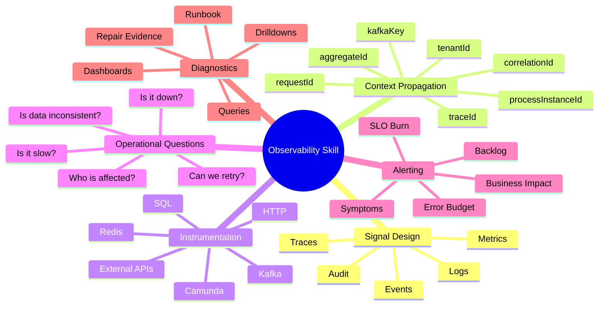
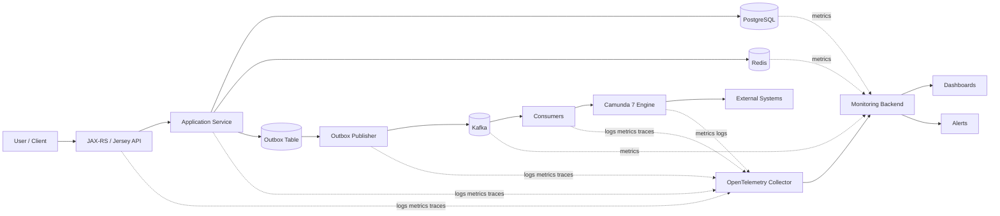
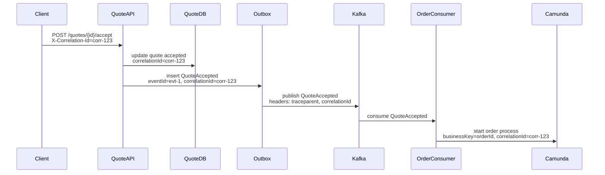
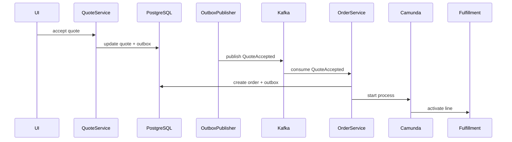
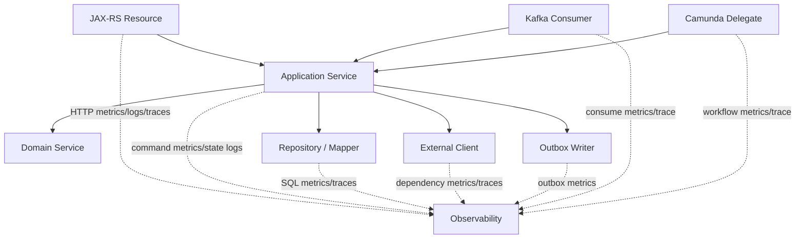

------
title: Learn Java Microservices CPQ/OMS Platform - Part 029
description: Observability architecture for a Java microservices CPQ and order management platform: structured logs, business metrics, traces, correlation, dashboards, alerts, and operational diagnostics.
series: learn-java-microservices-cpq-oms-platform
seriesTitle: Learn Java Microservices CPQ/OMS Platform
order: 29
partTitle: Observability: Logging, Metrics, Tracing
tags:
  - java
  - microservices
  - cpq
  - order-management
  - observability
  - opentelemetry
  - logging
  - metrics
  - tracing
  - kafka
  - camunda
  - postgresql
date: 2026-07-02
---

# Part 029 — Observability: Logging, Metrics, Tracing

Observability untuk platform CPQ/OMS bukan sekadar “punya log” atau “punya dashboard”. Platform ini menjalankan keputusan bisnis bernilai tinggi: konfigurasi produk, kalkulasi harga, approval, quote acceptance, order capture, orchestration, fulfillment, cancellation, amendment, dan repair. Ketika terjadi kegagalan, engineer harus bisa menjawab pertanyaan operasional dan bisnis dengan cepat:

- Quote ini dihitung dengan versi catalog, pricing policy, dan approval policy yang mana?
- Kenapa order berhenti di state tertentu?
- Apakah kegagalan terjadi di HTTP API, database, Kafka consumer, Camunda job executor, Redis cache, atau external system?
- Apakah problem berdampak pada satu tenant, satu customer, satu product family, satu Kafka partition, atau seluruh platform?
- Apakah user bisa retry dengan aman?
- Apakah data sudah konsisten, perlu replay, atau perlu manual repair?

Observability yang baik membuat platform **debuggable under pressure**. Observability yang buruk membuat tim hanya punya tebakan.

OpenTelemetry akan dipakai sebagai baseline konseptual karena menyediakan API, SDK, agent, dan collector untuk menghasilkan, mengumpulkan, dan mengekspor telemetry seperti traces, metrics, dan logs. Untuk Java, dokumentasi resmi OpenTelemetry Java menjelaskan penggunaan API/SDK untuk menghasilkan telemetry data: metrics, logs, dan traces. Namun, materi ini tidak akan bergantung pada satu vendor observability. Fokus kita adalah desain sinyal, boundary, cardinality, dan runbook.

## 1. Tujuan Pembelajaran

Setelah menyelesaikan part ini, kita ingin mampu:

1. Merancang observability architecture untuk platform Java microservices CPQ/OMS.
2. Membedakan log, metric, trace, event audit, dan business event.
3. Mendesain correlation model lintas HTTP, Kafka, Camunda, PostgreSQL, Redis, dan external systems.
4. Menentukan metric yang benar-benar berguna untuk operasi CPQ/OMS.
5. Membuat structured logging yang aman, searchable, dan tidak bocor data sensitif.
6. Mendesain distributed tracing yang membantu root cause analysis tanpa menjadi noise.
7. Membuat dashboard dan alert yang actionable, bukan vanity monitoring.
8. Menghubungkan telemetry teknis dengan state machine bisnis.
9. Mendeteksi failure mode: stuck order, retry storm, Kafka lag, DB contention, pricing regression, process incident.
10. Menyiapkan observability checklist untuk production readiness.

## 2. Kaufman Deconstruction: Observability Skill Map

Dalam kerangka Kaufman, observability perlu dipecah menjadi sub-skill yang bisa dilatih secara terpisah.



Minimum useful skill bukan “menguasai semua tool observability”, tetapi mampu membangun jawaban untuk pertanyaan:

> Untuk setiap request, command, event, process, dan state transition penting, apakah kita bisa menjelaskan apa yang terjadi, kapan terjadi, kenapa gagal, siapa terdampak, dan apakah aman diperbaiki?

## 3. Mental Model: Five Planes of Observability

Untuk platform CPQ/OMS, kita gunakan lima plane.

| Plane | Pertanyaan | Contoh Sinyal |
|---|---|---|
| User/API plane | Apakah user berhasil memakai platform? | HTTP latency, HTTP error, validation error, idempotency conflict |
| Domain plane | Apakah lifecycle bisnis bergerak benar? | quote submitted, approval pending, order stuck, line failed |
| Workflow plane | Apakah orchestration sehat? | Camunda job failure, incident, timer backlog, process duration |
| Messaging plane | Apakah event propagation sehat? | Kafka lag, retry topic depth, DLT count, outbox backlog |
| Infrastructure plane | Apakah substrate sehat? | DB connection pool, lock wait, Redis timeout, CPU, memory |

Kesalahan umum adalah hanya mengamati infrastructure plane. Padahal CPQ/OMS bisa “server up” tetapi bisnis down: order tidak bergerak, approval timer tidak jalan, quote acceptance duplicate, atau Kafka consumer mati diam-diam.

## 4. Observability Architecture



Prinsipnya:

1. **Application emits telemetry**: service Java mengeluarkan log, metric, trace.
2. **Collector decouples vendor**: exporter bisa diganti tanpa ubah aplikasi.
3. **Business context travels everywhere**: tenant, quoteId, orderId, processInstanceId, eventId, correlationId.
4. **Metrics alert symptoms**: alert harus berdasarkan impact, bukan semua error teknis.
5. **Logs explain incidents**: log dipakai untuk drilldown, bukan primary alert.
6. **Traces explain path**: trace menunjukkan perjalanan request/command/event.
7. **Audit remains separate**: audit adalah bukti bisnis/legal, bukan observability ephemeral.

## 5. Signal Taxonomy

### 5.1 Logs

Logs menjawab: **apa yang terjadi dalam bentuk narasi terstruktur?**

Gunakan log untuk:

- command accepted/rejected,
- state transition,
- external call result,
- retry classification,
- process incident handling,
- manual repair execution,
- unexpected exception,
- security denial.

Jangan gunakan log untuk:

- menyimpan audit legal utama,
- menyimpan payload penuh berisi PII,
- mengganti metric,
- mengganti event business.

### 5.2 Metrics

Metrics menjawab: **berapa sering, seberapa lambat, berapa banyak, seberapa buruk?**

Gunakan metric untuk:

- latency API,
- error rate,
- Kafka lag,
- outbox backlog,
- quote submission count,
- pricing duration,
- approval pending age,
- order stuck count,
- Camunda incident count,
- DB pool exhaustion.

Jangan buat metric dengan cardinality liar seperti:

- `quote_id`,
- `order_id`,
- `customer_id`,
- `email`,
- raw exception message,
- full endpoint path dengan UUID.

### 5.3 Traces

Traces menjawab: **request atau command ini melewati komponen mana saja, durasinya berapa, dan error muncul di span mana?**

Gunakan trace untuk:

- API request path,
- command handling,
- SQL critical path,
- Kafka publish/consume,
- Redis access,
- Camunda delegate execution,
- external API call.

Jangan trace terlalu detail hingga semua method internal menjadi span. Trace harus menjelaskan boundary penting, bukan call stack mentah.

### 5.4 Audit Records

Audit menjawab: **siapa melakukan apa, terhadap objek apa, kapan, berdasarkan aturan apa, dan apa hasilnya?**

Audit harus durable, queryable, retention-aware, dan legal/compliance-safe. Audit bukan log.

### 5.5 Business Events

Business event menjawab: **fakta domain apa yang sudah terjadi?**

Contoh:

- `QuoteSubmitted`
- `QuoteApproved`
- `OrderCaptured`
- `OrderLineActivated`
- `OrderFailed`
- `ApprovalEscalated`

Event bukan metric. Event bukan log. Event adalah fakta integrasi domain.

## 6. Correlation Model

Correlation model adalah backbone observability.

| Identifier | Scope | Kapan Dibuat | Dipakai Untuk |
|---|---|---|---|
| `requestId` | satu HTTP request | API gateway/service edge | debugging request tunggal |
| `traceId` | distributed trace | OpenTelemetry runtime | trace correlation |
| `correlationId` | business journey | client atau service entry | quote-to-order journey |
| `tenantId` | tenant boundary | auth/token resolver | isolation dan impact analysis |
| `actorId` | user/service actor | auth context | audit dan security |
| `quoteId` | quote aggregate | quote service | quote diagnostics |
| `orderId` | order aggregate | order service | order diagnostics |
| `processInstanceId` | Camunda process | Camunda engine | workflow diagnostics |
| `eventId` | event instance | outbox publisher | dedup/replay/debug |
| `causationId` | penyebab event | command/event producer | causal graph |

### 6.1 Correlation Propagation



Setiap boundary harus melakukan propagation:

- HTTP headers: `traceparent`, `X-Correlation-Id`, `Idempotency-Key`
- Kafka headers: `traceparent`, `correlationId`, `causationId`, `tenantId`, `eventId`
- Camunda variables: minimal process correlation fields
- Logs: MDC context
- Audit: actor/tenant/correlation/business object

## 7. Structured Logging Design

Log harus structured JSON, bukan string bebas.

### 7.1 Standard Log Fields

```json
{
  "timestamp": "2026-07-02T10:15:30.123Z",
  "level": "INFO",
  "service": "quote-service",
  "environment": "prod",
  "message": "Quote submitted",
  "eventType": "quote.submitted",
  "traceId": "4bf92f3577b34da6a3ce929d0e0e4736",
  "spanId": "00f067aa0ba902b7",
  "correlationId": "corr-123",
  "requestId": "req-456",
  "tenantId": "tenant-a",
  "actorId": "user-789",
  "quoteId": "q-1001",
  "orderId": null,
  "processInstanceId": null,
  "idempotencyKeyHash": "sha256:...",
  "outcome": "SUCCESS",
  "durationMs": 47
}
```

### 7.2 Log Levels

| Level | Kriteria | Contoh |
|---|---|---|
| TRACE | detail lokal yang biasanya off | low-level mapper debug |
| DEBUG | diagnostik dev/staging | rule evaluation detail sampled |
| INFO | business/technical milestone | quote submitted, order captured |
| WARN | recoverable anomaly | retry scheduled, duplicate command ignored |
| ERROR | failed operation membutuhkan investigasi | state transition failed unexpectedly |

Jangan menjadikan validation error user sebagai `ERROR`. Misalnya konfigurasi invalid karena rule bisnis seharusnya `INFO` atau `WARN` tergantung konteks, bukan incident.

### 7.3 Java MDC Filter untuk Jersey

```java
@Provider
@Priority(Priorities.AUTHENTICATION)
public final class CorrelationFilter implements ContainerRequestFilter, ContainerResponseFilter {

    private static final String CORRELATION_HEADER = "X-Correlation-Id";
    private static final String REQUEST_HEADER = "X-Request-Id";

    @Override
    public void filter(ContainerRequestContext requestContext) {
        String correlationId = firstNonBlank(
            requestContext.getHeaderString(CORRELATION_HEADER),
            UUID.randomUUID().toString()
        );
        String requestId = firstNonBlank(
            requestContext.getHeaderString(REQUEST_HEADER),
            UUID.randomUUID().toString()
        );

        MDC.put("correlationId", correlationId);
        MDC.put("requestId", requestId);
        MDC.put("http.method", requestContext.getMethod());
        MDC.put("http.pathTemplate", resolvePathTemplate(requestContext));
    }

    @Override
    public void filter(ContainerRequestContext requestContext, ContainerResponseContext responseContext) {
        responseContext.getHeaders().putSingle(CORRELATION_HEADER, MDC.get("correlationId"));
        responseContext.getHeaders().putSingle(REQUEST_HEADER, MDC.get("requestId"));
        MDC.clear();
    }

    private static String firstNonBlank(String value, String fallback) {
        return value == null || value.isBlank() ? fallback : value;
    }
}
```

### 7.4 Logging Command Outcome

```java
public final class SubmitQuoteHandler {
    private static final Logger log = LoggerFactory.getLogger(SubmitQuoteHandler.class);

    public SubmitQuoteResult handle(SubmitQuoteCommand command) {
        long startNanos = System.nanoTime();
        try {
            SubmitQuoteResult result = submit(command);
            log.info("Quote submitted tenantId={} quoteId={} quoteVersion={} outcome={} durationMs={}",
                command.tenantId(),
                command.quoteId(),
                result.version(),
                "SUCCESS",
                elapsedMs(startNanos));
            return result;
        } catch (BusinessRuleViolation ex) {
            log.info("Quote submission rejected tenantId={} quoteId={} reasonCode={} outcome={} durationMs={}",
                command.tenantId(),
                command.quoteId(),
                ex.reasonCode(),
                "REJECTED",
                elapsedMs(startNanos));
            throw ex;
        } catch (Exception ex) {
            log.error("Quote submission failed tenantId={} quoteId={} outcome={} durationMs={}",
                command.tenantId(),
                command.quoteId(),
                "FAILED",
                elapsedMs(startNanos),
                ex);
            throw ex;
        }
    }
}
```

Prinsip penting:

- log command outcome satu kali di boundary use case,
- log external call outcome di adapter,
- jangan log exception berulang di semua layer,
- jangan log payload penuh,
- gunakan reason code stabil, bukan message bebas.

## 8. Safe Logging and Data Classification

CPQ/OMS sering memuat data sensitif:

- customer name,
- address,
- contact,
- negotiated discount,
- pricing agreement,
- internal approval comment,
- tenant identifier,
- contract term,
- commercial risk indicator.

### 8.1 Field Policy

| Field Type | Boleh di Log? | Catatan |
|---|---:|---|
| technical ID | ya | quoteId, orderId, processInstanceId |
| tenant ID | ya, jika internal stable ID | jangan log nama tenant sensitif jika tidak perlu |
| actor ID | ya | hindari email jika bisa pakai internal ID |
| discount amount | hati-hati | lebih baik range/category untuk metric/log |
| customer PII | tidak | pakai redaction/masking |
| access token | tidak pernah | wajib sanitize |
| full request body | tidak default | hanya sampled redacted di non-prod |

### 8.2 Redaction Utility

```java
public final class SafeLog {
    private static final Pattern TOKEN_PATTERN = Pattern.compile("Bearer\\s+[A-Za-z0-9._~+/-]+=*");

    private SafeLog() {}

    public static String redact(String input) {
        if (input == null) return null;
        return TOKEN_PATTERN.matcher(input).replaceAll("Bearer <redacted>");
    }

    public static String hashForLog(String value) {
        if (value == null) return null;
        return "sha256:" + Sha256.shortHash(value);
    }
}
```

## 9. Metrics Design

Metrics harus menjawab operasi sistem dan bisnis.

### 9.1 Metric Naming

Gunakan naming yang konsisten:

```text
cpq_http_server_requests_total
cpq_http_server_request_duration_seconds
cpq_quote_commands_total
cpq_quote_command_duration_seconds
cpq_pricing_calculation_duration_seconds
cpq_pricing_calculations_total
cpq_order_state_transitions_total
cpq_order_stuck_total
cpq_outbox_pending_total
cpq_outbox_publish_duration_seconds
cpq_kafka_consumer_lag
cpq_camunda_incidents_total
cpq_camunda_job_execution_duration_seconds
cpq_redis_operations_total
cpq_postgresql_query_duration_seconds
```

### 9.2 Recommended Labels

| Label | Good? | Reason |
|---|---:|---|
| `service` | yes | bounded cardinality |
| `operation` | yes | finite operation names |
| `tenant_tier` | yes | low-cardinality impact analysis |
| `result` | yes | success/failure/rejected |
| `reason_code` | maybe | only if bounded |
| `quote_id` | no | unbounded cardinality |
| `order_id` | no | unbounded cardinality |
| `customer_id` | no | unbounded and sensitive |
| `exception_message` | no | unbounded |

### 9.3 RED Metrics

Untuk HTTP dan command:

- **Rate**: request/command per second
- **Errors**: failure rate by class
- **Duration**: latency distribution

```text
sum(rate(cpq_quote_commands_total{operation="submit",result="success"}[5m]))
sum(rate(cpq_quote_commands_total{operation="submit",result="failed"}[5m]))
histogram_quantile(0.95, sum(rate(cpq_quote_command_duration_seconds_bucket[5m])) by (le, operation))
```

### 9.4 USE Metrics

Untuk resource:

- **Utilization**: DB pool usage, CPU, memory
- **Saturation**: queue depth, thread pool queue, outbox pending
- **Errors**: connection errors, timeout, deadlock

### 9.5 Business Metrics

Business metrics adalah pembeda CPQ/OMS observability.

| Metric | Meaning |
|---|---|
| `cpq_quotes_created_total` | volume quote baru |
| `cpq_quotes_submitted_total` | quote masuk approval/order funnel |
| `cpq_quotes_approval_pending_total` | approval backlog |
| `cpq_quote_approval_age_seconds` | umur approval pending |
| `cpq_orders_captured_total` | quote-to-order conversion |
| `cpq_orders_in_fulfillment_total` | active fulfillment load |
| `cpq_orders_stuck_total` | order butuh investigasi |
| `cpq_order_line_failures_total` | line fulfillment failure |
| `cpq_manual_repairs_total` | manual repair frequency |
| `cpq_reconciliation_mismatches_total` | consistency issue |

### 9.6 Micrometer/OpenTelemetry Style Instrumentation

```java
public final class PricingMetrics {
    private final MeterRegistry meterRegistry;

    public PricingMetrics(MeterRegistry meterRegistry) {
        this.meterRegistry = meterRegistry;
    }

    public <T> T recordCalculation(String productFamily, Supplier<T> action) {
        Timer.Sample sample = Timer.start(meterRegistry);
        try {
            T result = action.get();
            meterRegistry.counter(
                "cpq_pricing_calculations_total",
                "product_family", safeProductFamily(productFamily),
                "result", "success"
            ).increment();
            return result;
        } catch (BusinessRuleViolation ex) {
            meterRegistry.counter(
                "cpq_pricing_calculations_total",
                "product_family", safeProductFamily(productFamily),
                "result", "rejected",
                "reason_code", ex.reasonCode()
            ).increment();
            throw ex;
        } catch (RuntimeException ex) {
            meterRegistry.counter(
                "cpq_pricing_calculations_total",
                "product_family", safeProductFamily(productFamily),
                "result", "failed"
            ).increment();
            throw ex;
        } finally {
            sample.stop(Timer.builder("cpq_pricing_calculation_duration_seconds")
                .tag("product_family", safeProductFamily(productFamily))
                .register(meterRegistry));
        }
    }
}
```

Catatan: label `product_family` harus bounded. Jangan pakai `product_id` jika jumlahnya besar.

## 10. Distributed Tracing Design

Trace harus mengikuti causal path.

### 10.1 Trace Boundary

Buat span untuk:

- HTTP inbound request,
- use case command handler,
- repository query penting,
- Redis cache get/set penting,
- Kafka publish,
- Kafka consume,
- Camunda delegate/external task,
- external API call.

Jangan buat span untuk:

- getter/setter,
- internal pure function kecil,
- setiap mapper helper,
- loop per line item jika bisa aggregate.

### 10.2 Trace Context Across Kafka

Kafka headers harus membawa trace context.

```java
public final class KafkaTraceHeaders {
    public static ProducerRecord<String, byte[]> withContext(
        ProducerRecord<String, byte[]> record,
        String correlationId,
        String causationId,
        String tenantId
    ) {
        record.headers().add("correlationId", correlationId.getBytes(StandardCharsets.UTF_8));
        record.headers().add("causationId", causationId.getBytes(StandardCharsets.UTF_8));
        record.headers().add("tenantId", tenantId.getBytes(StandardCharsets.UTF_8));
        // W3C traceparent injection should be handled by OpenTelemetry instrumentation.
        return record;
    }
}
```

### 10.3 Trace Attributes

Span attributes harus berguna dan tidak high-cardinality secara sembrono.

```java
Span.current().setAttribute("cpq.tenant_id", tenantId.value());
Span.current().setAttribute("cpq.aggregate_type", "quote");
Span.current().setAttribute("cpq.operation", "submit_quote");
Span.current().setAttribute("cpq.quote_state_before", before.name());
Span.current().setAttribute("cpq.quote_state_after", after.name());
Span.current().setAttribute("cpq.result", "success");
```

Untuk ID seperti quote/order, gunakan dengan hati-hati. Trace attributes boleh punya ID untuk debugging spesifik jika backend dan policy mendukung, tetapi jangan jadikan metric label.

### 10.4 Trace for Quote-to-Order



Idealnya trace bisa memperlihatkan path di atas, meski asynchronous boundary sering menghasilkan trace yang tampak terpisah tergantung instrumentation. Yang penting `correlationId`, `eventId`, `orderId`, dan `processInstanceId` tetap bisa menghubungkan semuanya.

## 11. HTTP/API Observability

### 11.1 API Metrics

```text
http.server.request.duration
http.server.requests.total
http.server.errors.total
cpq_api_validation_errors_total
cpq_api_idempotency_conflicts_total
cpq_api_authz_denials_total
```

### 11.2 Status Classification

| Status | Observability Meaning |
|---|---|
| 2xx | success |
| 400 | caller error / validation |
| 401/403 | auth/authz failure |
| 404 | missing resource, may be probing/noise |
| 409 | business concurrency/state conflict |
| 422 | semantic validation failed |
| 429 | rate limited |
| 5xx | service failure |

409 dan 422 jangan digabung dengan 500. Untuk CPQ/OMS, banyak “failure” adalah valid business rejection.

### 11.3 Problem Response with Trace

```json
{
  "type": "https://errors.example.com/cpq/quote-invalid-state",
  "title": "Quote cannot be submitted from current state",
  "status": 409,
  "code": "QUOTE_INVALID_STATE",
  "correlationId": "corr-123",
  "traceId": "4bf92f3577b34da6a3ce929d0e0e4736",
  "details": {
    "currentState": "EXPIRED",
    "requiredState": "DRAFT"
  }
}
```

## 12. PostgreSQL Observability

Database adalah sumber banyak failure CPQ/OMS: lock wait, slow query, missing index, deadlock, pool exhaustion, migration drift.

### 12.1 Application-Level SQL Metrics

Instrument:

- query duration by mapper operation,
- rows returned/affected,
- transaction duration,
- lock timeout count,
- deadlock count,
- optimistic lock conflict count,
- connection pool acquisition time.

```text
cpq_sql_query_duration_seconds{service="quote-service",mapper="QuoteMapper.findById"}
cpq_sql_transactions_total{service="order-service",result="commit"}
cpq_sql_errors_total{sql_state="40001"}
cpq_db_pool_connections_active
cpq_db_pool_connections_pending
```

### 12.2 SQL State Classification

| SQLSTATE Class | Meaning | Handling |
|---|---|---|
| `23` | integrity constraint violation | usually business/conflict |
| `40` | transaction rollback | retry may be valid |
| `55` | object not in prerequisite state / lock issue | inspect contention |
| `57` | operator intervention | infra/DB event |
| `08` | connection exception | dependency failure |

### 12.3 Lock Wait Diagnostics

Operational query example:

```sql
SELECT
    blocked.pid AS blocked_pid,
    blocked.query AS blocked_query,
    blocking.pid AS blocking_pid,
    blocking.query AS blocking_query,
    now() - blocked.query_start AS blocked_duration
FROM pg_catalog.pg_locks blocked_locks
JOIN pg_catalog.pg_stat_activity blocked
  ON blocked.pid = blocked_locks.pid
JOIN pg_catalog.pg_locks blocking_locks
  ON blocking_locks.locktype = blocked_locks.locktype
 AND blocking_locks.database IS NOT DISTINCT FROM blocked_locks.database
 AND blocking_locks.relation IS NOT DISTINCT FROM blocked_locks.relation
 AND blocking_locks.page IS NOT DISTINCT FROM blocked_locks.page
 AND blocking_locks.tuple IS NOT DISTINCT FROM blocked_locks.tuple
 AND blocking_locks.virtualxid IS NOT DISTINCT FROM blocked_locks.virtualxid
 AND blocking_locks.transactionid IS NOT DISTINCT FROM blocked_locks.transactionid
 AND blocking_locks.classid IS NOT DISTINCT FROM blocked_locks.classid
 AND blocking_locks.objid IS NOT DISTINCT FROM blocked_locks.objid
 AND blocking_locks.objsubid IS NOT DISTINCT FROM blocked_locks.objsubid
 AND blocking_locks.pid != blocked_locks.pid
JOIN pg_catalog.pg_stat_activity blocking
  ON blocking.pid = blocking_locks.pid
WHERE NOT blocked_locks.granted;
```

## 13. Kafka Observability

Kafka failure sering tidak terlihat dari HTTP error. API bisa success tetapi event tidak terkirim atau consumer tertinggal.

### 13.1 Producer Metrics

- outbox pending rows,
- outbox oldest age,
- publish success/failure,
- publish latency,
- serialization failure,
- topic authorization failure.

```text
cpq_outbox_pending_total{service="quote-service"}
cpq_outbox_oldest_age_seconds{service="quote-service"}
cpq_kafka_publish_total{topic="cpq.quote.events",result="success"}
cpq_kafka_publish_duration_seconds{topic="cpq.quote.events"}
```

### 13.2 Consumer Metrics

- consumer lag,
- event processing duration,
- retry count,
- DLT count,
- inbox duplicate count,
- poison event count.

```text
cpq_kafka_consumer_lag{consumer_group="order-service",topic="cpq.quote.events"}
cpq_kafka_consume_total{consumer_group="order-service",result="success"}
cpq_kafka_consume_duration_seconds{consumer_group="order-service",event_type="QuoteAccepted"}
cpq_kafka_dlt_events_total{topic="cpq.quote.events.dlt"}
```

### 13.3 Event Processing Log

```json
{
  "level": "INFO",
  "message": "Kafka event processed",
  "service": "order-service",
  "topic": "cpq.quote.events",
  "partition": 7,
  "offset": 912838,
  "eventId": "evt-1001",
  "eventType": "QuoteAccepted",
  "aggregateId": "q-123",
  "correlationId": "corr-123",
  "tenantId": "tenant-a",
  "result": "SUCCESS",
  "durationMs": 84
}
```

## 14. Camunda 7 Observability

Camunda 7 observability harus menjawab:

- process instance mana yang stuck,
- job mana yang gagal,
- incident apa yang terbuka,
- variable apa yang aman ditampilkan,
- delegate mana yang lambat,
- timer backlog berapa,
- process definition version mana yang bermasalah,
- apakah state order sejalan dengan process state.

### 14.1 Camunda Metrics

```text
cpq_camunda_process_instances_started_total{process="order-fulfillment"}
cpq_camunda_process_instances_completed_total{process="order-fulfillment"}
cpq_camunda_incidents_open_total{process="order-fulfillment"}
cpq_camunda_jobs_failed_total{activity="activateLine"}
cpq_camunda_job_duration_seconds{activity="activateLine"}
cpq_camunda_timer_due_total{process="order-fulfillment"}
```

### 14.2 Incident Query

```sql
SELECT
    i.ID_ AS incident_id,
    i.PROC_INST_ID_ AS process_instance_id,
    i.ACTIVITY_ID_ AS activity_id,
    i.INCIDENT_MSG_ AS message,
    i.CREATE_TIME_ AS created_at,
    e.BUSINESS_KEY_ AS business_key,
    e.PROC_DEF_ID_ AS process_definition_id
FROM ACT_RU_INCIDENT i
JOIN ACT_RU_EXECUTION e ON e.PROC_INST_ID_ = i.PROC_INST_ID_
ORDER BY i.CREATE_TIME_ ASC;
```

### 14.3 Process vs Domain Reconciliation

```sql
SELECT
    o.order_id,
    o.state AS order_state,
    o.process_instance_id,
    i.ID_ AS incident_id,
    i.INCIDENT_MSG_ AS incident_message
FROM oms_order o
LEFT JOIN ACT_RU_INCIDENT i
  ON i.PROC_INST_ID_ = o.process_instance_id
WHERE o.state IN ('FULFILLING', 'SUSPENDED')
  AND o.updated_at < now() - interval '2 hours';
```

Penting: jangan hanya mengandalkan Camunda Cockpit. Platform harus punya query operasional sendiri karena order state adalah source of truth bisnis.

## 15. Redis Observability

Redis biasanya dipakai untuk cache, idempotency fast path, rate limiting, session acceleration, dedup window, atau lock/fencing. Observability Redis harus menjawab:

- Apakah cache membantu atau justru merusak correctness?
- Apakah latency Redis mulai tinggi?
- Apakah eviction terjadi?
- Apakah lock contention tinggi?
- Apakah keyspace tumbuh tidak terkendali?

### 15.1 Metrics

```text
cpq_redis_operations_total{operation="get",result="hit"}
cpq_redis_operations_total{operation="get",result="miss"}
cpq_redis_operation_duration_seconds{operation="set"}
cpq_redis_timeouts_total
cpq_redis_lock_acquire_total{lock="pricing-policy-refresh",result="success"}
cpq_redis_rate_limited_total{scope="tenant"}
```

### 15.2 Cache Correctness Logs

```json
{
  "level": "WARN",
  "message": "Pricing policy cache stale beyond allowed window",
  "service": "pricing-service",
  "tenantId": "tenant-a",
  "policyVersion": "2026.07.01-3",
  "cacheAgeSeconds": 481,
  "maxAllowedAgeSeconds": 300,
  "action": "BYPASS_CACHE"
}
```

## 16. Business State Observability

Teknik observability paling penting untuk CPQ/OMS adalah state visibility.

### 16.1 Quote Lifecycle Metrics

```text
cpq_quote_state_total{state="DRAFT"}
cpq_quote_state_total{state="PENDING_APPROVAL"}
cpq_quote_state_total{state="APPROVED"}
cpq_quote_state_total{state="ACCEPTED"}
cpq_quote_state_age_seconds{state="PENDING_APPROVAL"}
```

### 16.2 Order Lifecycle Metrics

```text
cpq_order_state_total{state="CAPTURED"}
cpq_order_state_total{state="FULFILLING"}
cpq_order_state_total{state="PARTIALLY_FULFILLED"}
cpq_order_state_total{state="COMPLETED"}
cpq_order_state_total{state="FAILED"}
cpq_order_state_age_seconds{state="FULFILLING"}
```

### 16.3 Stuck Order Query

```sql
SELECT
    order_id,
    tenant_id,
    state,
    process_instance_id,
    updated_at,
    now() - updated_at AS age
FROM oms_order
WHERE state IN ('CAPTURED', 'FULFILLING', 'SUSPENDED')
  AND updated_at < now() - interval '1 hour'
ORDER BY updated_at ASC;
```

### 16.4 State Transition Event Log

```json
{
  "level": "INFO",
  "message": "Order state transitioned",
  "eventType": "order.state_transitioned",
  "tenantId": "tenant-a",
  "orderId": "o-1001",
  "previousState": "CAPTURED",
  "nextState": "FULFILLING",
  "transitionReason": "PROCESS_STARTED",
  "commandId": "cmd-777",
  "correlationId": "corr-123",
  "processInstanceId": "cam-456"
}
```

## 17. Dashboard Design

Dashboard harus mengikuti incident workflow.

### 17.1 Executive Health Dashboard

Tujuan: apakah platform sehat secara bisnis?

Panels:

- quote creation/submission rate,
- quote approval pending count and age,
- quote-to-order conversion rate,
- order captured/completed/failed rate,
- stuck order count,
- manual repair count,
- error budget burn,
- affected tenant count.

### 17.2 Service Health Dashboard

Per service:

- API rate/error/duration,
- command duration,
- DB query duration,
- DB pool saturation,
- Redis latency,
- Kafka publish/consume,
- outbox/inbox backlog,
- JVM memory/GC/thread.

### 17.3 Workflow Dashboard

Camunda/order orchestration:

- process started/completed,
- process duration p50/p95/p99,
- open incident count,
- failed job count,
- timer due count,
- activity duration,
- process version breakdown.

### 17.4 Messaging Dashboard

Kafka/outbox:

- consumer lag by group/topic,
- oldest lag age,
- retry topic depth,
- DLT rate,
- outbox pending/age,
- publish failure rate,
- event processing latency.

### 17.5 Database Dashboard

PostgreSQL:

- pool active/pending,
- query p95/p99,
- transaction duration,
- deadlocks,
- lock wait,
- replication lag if applicable,
- table/index bloat approximation,
- migration version.

## 18. Alert Design

Alert harus actionable. Jika engineer tidak tahu apa yang harus dilakukan ketika alert berbunyi, alert itu belum matang.

### 18.1 Symptom-Based Alerts

Prioritaskan symptom:

- API 5xx rate tinggi,
- quote submission unavailable,
- order capture failure,
- order stuck count melewati threshold,
- approval SLA breach,
- outbox oldest age terlalu tinggi,
- Kafka consumer lag age terlalu tinggi,
- Camunda open incidents tinggi,
- DB pool pending tinggi.

### 18.2 Avoid Bad Alerts

Hindari alert:

- CPU > 80% tanpa impact,
- satu exception muncul sekali,
- log contains ERROR tanpa classification,
- Kafka lag count tinggi tapi consumer memang idle dan tidak berdampak,
- validation error user dianggap incident.

### 18.3 Alert Example

```yaml
alert: OrderStuckHigh
expr: cpq_orders_stuck_total{environment="prod"} > 20
for: 10m
labels:
  severity: page
  service: order-service
annotations:
  summary: "High number of stuck orders"
  description: "More than 20 orders have been stuck for over the configured threshold. Check Camunda incidents, Kafka lag, and external fulfillment availability."
  runbook: "https://runbooks.example.com/cpq/order-stuck"
```

### 18.4 SLO-Oriented Alerts

SLO example:

| Capability | SLO |
|---|---|
| Quote submit API | 99.9% successful non-validation requests under 500ms p95 |
| Pricing calculation | 99% under 300ms p95 for standard products |
| Quote acceptance | 99.9% accepted command persisted exactly once |
| Order capture | 99.9% accepted quotes create order within 30s |
| Order orchestration | 99% orders leave CAPTURED within 5m |

Alert on burn rate, not only raw metric.

## 19. Instrumentation Placement



Instrumentation rules:

- resource layer: HTTP status, latency, auth, validation,
- application service: command outcome, business state transition,
- repository: SQL duration and error classification,
- external client: dependency latency/error/timeout,
- Kafka consumer: event processing result,
- Camunda delegate: activity duration and retry classification.

## 20. Operational Drilldowns

### 20.1 “Quote submission is slow”

Check:

1. API p95/p99 latency for `submitQuote`.
2. Pricing recalculation latency if submit triggers pricing validation.
3. DB query p95 for quote/configuration/pricing snapshot.
4. DB pool pending count.
5. Redis hit rate for pricing policy.
6. Recent deployment/version.
7. Tenant/product family breakdown.
8. Trace sample for slow request.

### 20.2 “Accepted quote did not become order”

Check:

1. Quote state: accepted or not?
2. Outbox row for `QuoteAccepted` exists?
3. Outbox published status?
4. Kafka topic has event?
5. Order consumer lag?
6. Inbox row processed?
7. Order row created?
8. Camunda process started?
9. Any DLT or incident?
10. Idempotency conflict or duplicate ignored?

### 20.3 “Order stuck in FULFILLING”

Check:

1. order line states,
2. Camunda process activity,
3. open incident,
4. failed job retry count,
5. external fulfillment error,
6. message correlation pending,
7. timer due date,
8. manual repair history,
9. reconciliation result.

## 21. Observability for Manual Repair

Manual repair is dangerous without observability.

Every repair command must log and audit:

- actor,
- tenant,
- target aggregate,
- pre-state,
- post-state,
- reason code,
- ticket/case reference,
- correlationId,
- dry-run result,
- approval if required.

```json
{
  "level": "WARN",
  "message": "Manual repair executed",
  "eventType": "manual_repair.executed",
  "tenantId": "tenant-a",
  "actorId": "ops-123",
  "orderId": "o-1001",
  "repairType": "RETRY_FAILED_LINE",
  "previousState": "FAILED",
  "nextState": "FULFILLING",
  "reasonCode": "EXTERNAL_SYSTEM_RECOVERED",
  "caseReference": "INC-2026-00091",
  "correlationId": "corr-repair-1"
}
```

## 22. Sampling Strategy

Full tracing semua request bisa mahal.

Sampling strategy:

- always sample errors,
- always sample manual repair,
- always sample high-value flows like quote acceptance,
- sample normal read APIs lower,
- sample slow requests,
- preserve logs/metrics even when trace not sampled.

Tail-based sampling berguna jika backend mendukung: simpan trace jika error, slow, atau mengandung business-critical attributes.

## 23. Failure Modes

| Failure Mode | Signal | Response |
|---|---|---|
| API down | HTTP 5xx, health fail | rollback/dependency check |
| API slow | p95/p99 latency | trace slow path, DB/Redis check |
| quote accepted but no event | outbox backlog | restart publisher, inspect DB |
| event consumed repeatedly | consumer retry metric | classify poison/non-poison |
| event in DLT | DLT count/log | inspect schema/handler failure |
| Camunda incident spike | incident metric | inspect activity/retry/external dep |
| order stuck | state age metric | run reconciliation/repair |
| DB deadlock | SQLSTATE 40P01 | inspect transaction order |
| Redis timeout | Redis timeout metric | degrade/cache bypass |
| high validation errors | 4xx/422 metrics | check client/product rule change |
| approval SLA breach | approval age metric | escalate/notify owner |

## 24. Anti-Patterns

1. **Log-only observability**: tidak ada metrics/trace, semua debugging pakai grep.
2. **Metrics with IDs**: cardinality meledak karena quoteId/orderId sebagai label.
3. **No correlation ID**: asynchronous flow tidak bisa diikuti.
4. **Payload logging**: data sensitif bocor.
5. **Audit as log**: bukti bisnis hilang karena log retention pendek.
6. **Dashboard vanity**: CPU/memory lengkap tapi order stuck tidak terlihat.
7. **Alert on every exception**: pager fatigue.
8. **No runbook link**: alert tidak actionable.
9. **Camunda-only truth**: order state tidak direkonsiliasi dengan process state.
10. **Trace everything**: observability mahal dan noisy.

## 25. Implementation Lab

Bangun observability slice untuk flow `POST /quotes/{quoteId}/accept`.

### 25.1 Requirements

1. API menerima `X-Correlation-Id` dan `Idempotency-Key`.
2. Resource layer mencatat HTTP duration/status.
3. Application service mencatat command outcome.
4. Quote state transition dicatat sebagai structured log.
5. DB repository mencatat query duration.
6. Outbox insert menghasilkan event metadata.
7. Outbox publisher mengirim Kafka event dengan headers correlation.
8. Consumer order service memproses event dan mencatat inbox result.
9. Camunda process start mencatat processInstanceId.
10. Dashboard bisa menunjukkan accepted quote yang belum menjadi order dalam 30 detik.

### 25.2 Acceptance Criteria

- Semua log memiliki `correlationId`.
- Semua business transition memiliki `tenantId` dan aggregate ID.
- Tidak ada PII di log.
- Metric tidak memakai quoteId/orderId sebagai label.
- Kafka event membawa `eventId`, `correlationId`, `causationId`, dan `tenantId`.
- Trace menunjukkan API -> DB -> outbox publish -> Kafka consume -> order create -> Camunda start, atau minimal bisa dikorelasikan lewat IDs.
- Alert simulation untuk outbox backlog bisa diuji.

## 26. Production Readiness Checklist

### 26.1 Logs

- [ ] Structured JSON logs.
- [ ] Standard fields across services.
- [ ] MDC/context propagation.
- [ ] PII/token redaction.
- [ ] Business outcome logs.
- [ ] Security denial logs.
- [ ] Manual repair logs.
- [ ] Log retention policy.

### 26.2 Metrics

- [ ] HTTP RED metrics.
- [ ] Command metrics.
- [ ] Pricing latency metrics.
- [ ] Quote/order state metrics.
- [ ] Outbox/inbox metrics.
- [ ] Kafka lag metrics.
- [ ] Camunda incident/job metrics.
- [ ] DB pool/query metrics.
- [ ] Redis latency/hit/miss metrics.
- [ ] No high-cardinality IDs as labels.

### 26.3 Tracing

- [ ] OpenTelemetry Java instrumentation enabled.
- [ ] Trace context propagated over HTTP.
- [ ] Trace context propagated over Kafka.
- [ ] Important use cases have custom spans.
- [ ] External calls traced.
- [ ] Sampling policy defined.
- [ ] Trace ID included in problem response.

### 26.4 Dashboards and Alerts

- [ ] Business health dashboard.
- [ ] Service health dashboard.
- [ ] Workflow dashboard.
- [ ] Messaging dashboard.
- [ ] Database dashboard.
- [ ] Symptom-based alerts.
- [ ] Runbook links.
- [ ] Alert severity policy.
- [ ] SLO/error budget model.

### 26.5 Operational Diagnostics

- [ ] Stuck quote query.
- [ ] Stuck order query.
- [ ] Outbox backlog query.
- [ ] DLT inspection procedure.
- [ ] Camunda incident query.
- [ ] DB lock query.
- [ ] Redis degradation procedure.
- [ ] Manual repair audit procedure.

## 27. Summary

Observability untuk CPQ/OMS harus dimulai dari domain, bukan dari tool. Tool seperti OpenTelemetry, logging backend, metrics backend, trace backend, dan dashboard hanya berguna jika sinyalnya benar.

Core principles:

1. Logs menjelaskan narasi terstruktur.
2. Metrics mengukur gejala dan tren.
3. Traces menunjukkan path dan latency.
4. Audit menyimpan bukti bisnis/legal.
5. Business events menyebarkan fakta domain.
6. Correlation ID menghubungkan semua plane.
7. Alerts harus berbasis impact dan punya runbook.
8. State machine harus terlihat sebagai metric dan log.
9. Camunda, Kafka, Redis, PostgreSQL, dan external systems harus dikorelasikan dengan quote/order lifecycle.
10. Observability yang benar membuat failure bisa dipahami, bukan hanya ditemukan.

Pada part berikutnya, kita akan membahas resilience: timeout, retry, circuit breaker, bulkhead, rate limiting, degradation, dan failure containment agar platform tetap stabil ketika dependency gagal.

## References

- OpenTelemetry Java Documentation — https://opentelemetry.io/docs/languages/java/
- OpenTelemetry Overview — https://opentelemetry.io/
- OpenTelemetry Traces Concept — https://opentelemetry.io/docs/concepts/signals/traces/
- Kafka Documentation — https://kafka.apache.org/documentation/
- PostgreSQL Documentation — https://www.postgresql.org/docs/current/
- Camunda 7 Documentation — https://docs.camunda.org/manual/latest/
