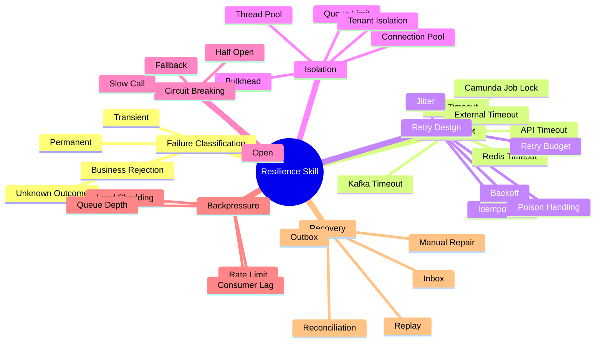
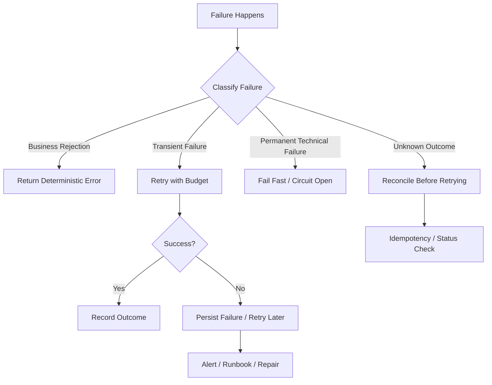
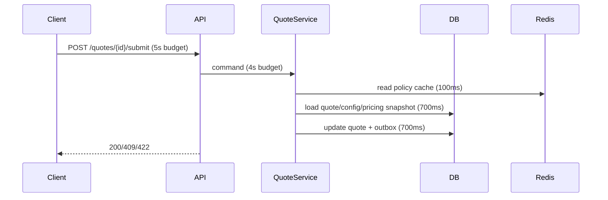
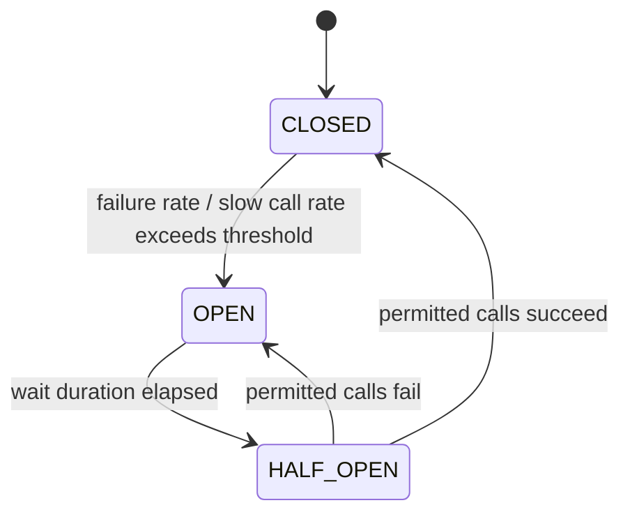
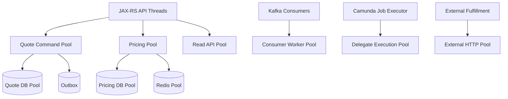
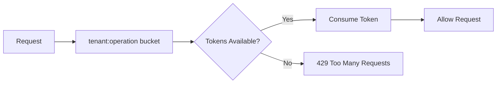
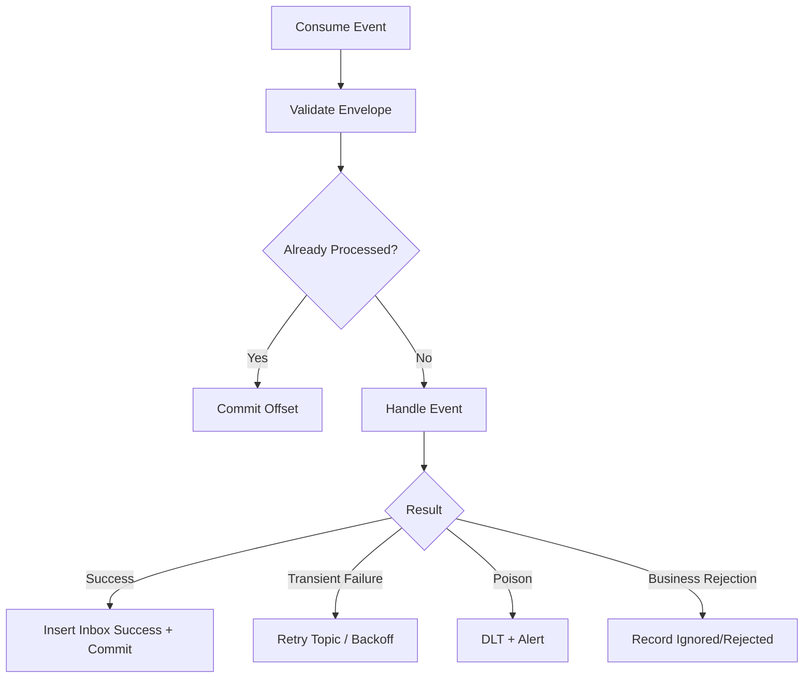
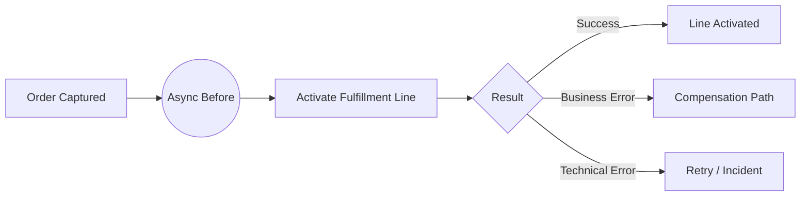
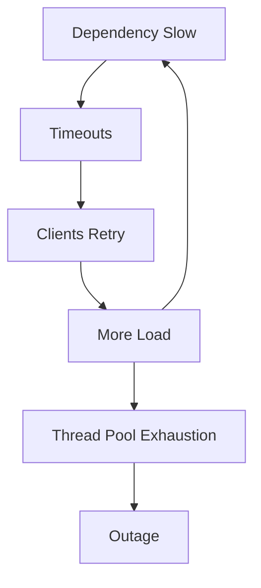

------
title: Learn Java Microservices CPQ/OMS Platform - Part 030
description: Resilience engineering for a Java microservices CPQ and order management platform: timeouts, retries, circuit breakers, bulkheads, rate limits, backpressure, fallback, and failure containment.
series: learn-java-microservices-cpq-oms-platform
seriesTitle: Learn Java Microservices CPQ/OMS Platform
order: 30
partTitle: Resilience: Timeouts, Retries, Circuit Breakers, Bulkheads
tags:
  - java
  - microservices
  - cpq
  - order-management
  - resilience
  - fault-tolerance
  - retries
  - circuit-breaker
  - bulkhead
  - timeout
  - resilience4j
  - kafka
  - camunda
date: 2026-07-02
---

# Part 030 — Resilience: Timeouts, Retries, Circuit Breakers, Bulkheads

Resilience adalah kemampuan platform untuk tetap benar, stabil, dan recoverable ketika dependency gagal, latency naik, database mengalami contention, Kafka consumer tertinggal, Camunda job gagal, Redis timeout, atau external fulfillment system tidak tersedia.

Untuk CPQ/OMS, resilience tidak boleh disamakan dengan “retry terus sampai berhasil”. Banyak operasi memiliki efek bisnis dan harus idempotent, bounded, observable, dan aman secara state machine. Retry yang salah bisa menggandakan order, menggandakan fulfillment, membuat approval dobel, atau menekan dependency yang sedang sakit hingga semakin parah.

Resilience4j adalah salah satu library populer untuk Java yang menyediakan pola fault tolerance seperti circuit breaker, retry, rate limiter, bulkhead, thread-pool bulkhead, dan time limiter. Namun, library hanyalah alat. Resilience yang benar berasal dari model failure, timeout budget, idempotency, consistency boundary, dan operational runbook.

## 1. Tujuan Pembelajaran

Setelah menyelesaikan part ini, kita ingin mampu:

1. Mendesain failure model untuk CPQ/OMS microservices.
2. Membedakan transient failure, permanent failure, business rejection, dan unknown outcome.
3. Menentukan timeout budget end-to-end.
4. Menerapkan retry yang aman dan bounded.
5. Mendesain circuit breaker untuk dependency yang gagal.
6. Menggunakan bulkhead untuk mencegah cascading failure.
7. Menerapkan rate limiting dan backpressure.
8. Mendesain fallback/degradation tanpa melanggar correctness.
9. Menghubungkan resilience dengan idempotency, outbox/inbox, Kafka, Camunda, Redis, dan PostgreSQL.
10. Membuat failure matrix, test scenario, dashboard, dan runbook.

## 2. Kaufman Deconstruction: Resilience Skill Map



Minimum useful skill:

> Untuk setiap remote call, database transaction, message handler, and workflow task, kita tahu timeout-nya, retry policy-nya, idempotency guarantee-nya, failure classification-nya, dan recovery path-nya.

## 3. Resilience Mental Model

Resilience di CPQ/OMS memiliki tiga sasaran:

1. **Correctness**: jangan menciptakan efek bisnis salah.
2. **Containment**: jangan biarkan satu dependency merusak seluruh platform.
3. **Recovery**: sistem harus bisa pulih lewat retry, replay, reconciliation, atau repair.



## 4. Failure Classification

### 4.1 Failure Types

| Type | Meaning | Example | Action |
|---|---|---|---|
| Business rejection | input/state validly rejected | quote expired, discount too high | no retry |
| Validation failure | caller supplied invalid data | missing field, invalid enum | no retry |
| Transient technical failure | temporary dependency issue | timeout, connection reset | retry with budget |
| Permanent technical failure | config or contract broken | 401 to dependency, schema incompatible | fail fast, alert |
| Capacity failure | system overloaded | thread pool full, DB pool exhausted | shed load, backpressure |
| Unknown outcome | request may have succeeded but response lost | external fulfillment timeout after submit | reconcile/status check before retry |
| Poison message | event always fails due to data/bug | incompatible event payload | DLT/repair, no infinite retry |

### 4.2 Why Unknown Outcome Matters

Unknown outcome adalah failure paling berbahaya.

Contoh:

1. Order service memanggil external fulfillment API.
2. External system menerima request dan membuat fulfillment.
3. Network timeout terjadi sebelum response diterima.
4. Jika kita retry tanpa idempotency, fulfillment bisa dobel.

Solusi:

- gunakan idempotency key external,
- simpan external request ID,
- lakukan status check,
- jangan retry non-idempotent side effect tanpa guard.

## 5. Timeout Budget

Timeout harus dirancang dari luar ke dalam.

### 5.1 Bad Pattern

```text
Client timeout: 30s
API timeout: none
DB timeout: none
External timeout: 60s
Kafka publish timeout: 120s
```

Ini buruk karena caller timeout duluan, server masih bekerja, thread tertahan, retry dari client bisa menggandakan beban.

### 5.2 Good Pattern

```text
Client timeout: 5s
Gateway timeout: 4.5s
Service request budget: 4s
DB query timeout: 500ms - 1s
Redis timeout: 50ms - 100ms
External API timeout: 1s - 2s
Kafka publish in request path: avoid, use outbox
```

Untuk CPQ/OMS, banyak efek bisnis sebaiknya dipersist lalu dilanjutkan async, bukan menahan HTTP request hingga seluruh fulfillment selesai.

### 5.3 Timeout Budget Example: Submit Quote



Budget harus menyisakan waktu untuk serialization, validation, logging, and response.

### 5.4 Timeout Rules

1. Set timeout di setiap remote boundary.
2. Timeout caller harus lebih besar dari internal operation budget, tetapi tidak terlalu besar.
3. Jangan biarkan DB query tanpa statement timeout.
4. Jangan melakukan blocking external call panjang di request path jika bisa async.
5. Timeout harus lebih pendek daripada thread starvation threshold.
6. Timeout harus dicatat sebagai metric dan log terklasifikasi.

## 6. Retry Design

Retry bukan default. Retry adalah obat dengan efek samping.

### 6.1 Retry Decision Matrix

| Operation | Retry? | Condition |
|---|---:|---|
| GET catalog snapshot | yes | transient failure, safe |
| POST submit quote | client retry yes | with idempotency key |
| DB serialization failure | yes | short bounded retry |
| DB unique constraint violation | no | handle as conflict/idempotency |
| External create fulfillment | maybe | only with external idempotency/status check |
| Kafka consumer processing | yes | if transient and bounded |
| Pricing validation rejected | no | business result |
| Approval denial | no | business result |
| Camunda delegate timeout | yes | if handler idempotent |

### 6.2 Retry Policy

Good retry has:

- max attempts,
- exponential backoff,
- jitter,
- retryable exception classification,
- total deadline,
- idempotency guarantee,
- observability,
- circuit breaker integration.

Bad retry:

- infinite,
- no jitter,
- retries validation/business errors,
- retries unknown external side effects blindly,
- retries inside transaction for too long,
- retries at every layer simultaneously.

### 6.3 Resilience4j Retry Example

```java
RetryConfig config = RetryConfig.custom()
    .maxAttempts(3)
    .waitDuration(Duration.ofMillis(100))
    .retryExceptions(TransientDependencyException.class, TimeoutException.class)
    .ignoreExceptions(BusinessRuleViolation.class, ValidationException.class)
    .build();

Retry retry = Retry.of("pricing-policy-client", config);

Supplier<PricingPolicy> supplier = Retry.decorateSupplier(
    retry,
    () -> pricingPolicyClient.fetchPolicy(tenantId, policyVersion)
);

PricingPolicy policy = supplier.get();
```

### 6.4 Jitter

Tanpa jitter, semua instance bisa retry bersamaan dan menciptakan thundering herd.

```java
IntervalFunction interval = IntervalFunction
    .ofExponentialRandomBackoff(
        Duration.ofMillis(100),
        2.0,
        0.5
    );
```

### 6.5 Retry Budget

Retry budget membatasi total retry agar dependency tidak makin tertekan.

Rule praktis:

- retry hanya untuk operasi penting dan safe,
- retry attempt maksimum kecil di request path,
- retry async boleh lebih panjang tetapi harus pakai backoff,
- jangan punya nested retry di client, service, Kafka, dan Camunda sekaligus tanpa budget global.

## 7. Idempotency as Resilience Primitive

Idempotency adalah syarat utama resilience.

### 7.1 Command Idempotency

```sql
CREATE TABLE idempotency_record (
    tenant_id text NOT NULL,
    idempotency_key text NOT NULL,
    command_type text NOT NULL,
    request_hash text NOT NULL,
    response_status int,
    response_body jsonb,
    state text NOT NULL,
    created_at timestamptz NOT NULL DEFAULT now(),
    completed_at timestamptz,
    PRIMARY KEY (tenant_id, idempotency_key)
);
```

States:

- `STARTED`
- `COMPLETED`
- `FAILED_RETRYABLE`
- `FAILED_FINAL`

### 7.2 Idempotency Logic

```java
public <T> T executeIdempotently(IdempotencyKey key, Command command, Supplier<T> action) {
    Optional<IdempotencyRecord> existing = repository.find(key);

    if (existing.isPresent()) {
        IdempotencyRecord record = existing.get();
        if (!record.requestHash().equals(command.hash())) {
            throw new IdempotencyConflictException(key);
        }
        if (record.isCompleted()) {
            return responseDeserializer.deserialize(record.responseBody());
        }
        throw new CommandAlreadyInProgressException(key);
    }

    repository.insertStarted(key, command.hash());
    try {
        T result = action.get();
        repository.markCompleted(key, serialize(result));
        return result;
    } catch (BusinessRuleViolation ex) {
        repository.markFinalFailure(key, ex.toProblemResponse());
        throw ex;
    } catch (RuntimeException ex) {
        repository.markRetryableFailure(key, classify(ex));
        throw ex;
    }
}
```

Idempotency record harus berada dalam transaction boundary yang sama dengan state mutation jika memungkinkan.

## 8. Circuit Breaker

Circuit breaker mencegah sistem terus memanggil dependency yang sedang gagal.

### 8.1 States



### 8.2 When to Use

Gunakan circuit breaker untuk:

- external pricing data provider,
- external fulfillment API,
- credit/risk service,
- document generation service,
- email/notification service,
- non-critical dependency yang bisa degrade.

Hati-hati untuk:

- database utama sendiri,
- Kafka producer internal dengan outbox,
- Redis cache yang bisa bypass,
- dependency yang failure-nya harus langsung terlihat.

### 8.3 Resilience4j Circuit Breaker Example

```java
CircuitBreakerConfig config = CircuitBreakerConfig.custom()
    .failureRateThreshold(50)
    .slowCallRateThreshold(50)
    .slowCallDurationThreshold(Duration.ofSeconds(2))
    .waitDurationInOpenState(Duration.ofSeconds(30))
    .permittedNumberOfCallsInHalfOpenState(5)
    .slidingWindowType(CircuitBreakerConfig.SlidingWindowType.COUNT_BASED)
    .slidingWindowSize(50)
    .recordExceptions(TimeoutException.class, TransientDependencyException.class)
    .ignoreExceptions(BusinessRuleViolation.class, ValidationException.class)
    .build();

CircuitBreaker breaker = CircuitBreaker.of("fulfillment-client", config);

Supplier<FulfillmentResponse> guarded = CircuitBreaker.decorateSupplier(
    breaker,
    () -> fulfillmentClient.submit(request)
);
```

### 8.4 Fallback Rules

Fallback harus aman secara domain.

| Dependency | Possible Fallback | Safe? |
|---|---|---:|
| catalog read cache | use recent published snapshot | yes if snapshot version valid |
| pricing policy service | use stale policy | only if business allows |
| fulfillment create | pretend success | no |
| approval policy | skip approval | no |
| document generation | queue async generation | yes |
| notification | retry async later | yes |
| Redis cache | bypass to DB | yes if DB capacity ok |

Untuk CPQ/OMS, fallback tidak boleh mengubah keputusan bisnis tanpa audit dan policy.

## 9. Bulkheads

Bulkhead membatasi kerusakan. Jika satu dependency lambat, thread/connection untuk operasi lain tidak habis.

### 9.1 Bulkhead Types

| Type | Meaning | Use Case |
|---|---|---|
| semaphore bulkhead | limit concurrent calls | short synchronous calls |
| thread-pool bulkhead | isolate blocking calls | slow external client |
| connection pool | isolate DB/HTTP connections | per dependency |
| queue limit | bound backlog | async task queue |
| tenant quota | isolate tenant load | noisy tenant control |

### 9.2 CPQ/OMS Bulkhead Map



### 9.3 Resilience4j Bulkhead Example

```java
BulkheadConfig config = BulkheadConfig.custom()
    .maxConcurrentCalls(20)
    .maxWaitDuration(Duration.ofMillis(50))
    .build();

Bulkhead bulkhead = Bulkhead.of("pricing-calculation", config);

Supplier<PriceResult> guarded = Bulkhead.decorateSupplier(
    bulkhead,
    () -> pricingEngine.calculate(command)
);
```

### 9.4 Bulkhead Rejection

Bulkhead rejection bukan bug; itu load shedding. API harus mengembalikan status yang tepat.

```json
{
  "type": "https://errors.example.com/platform/service-overloaded",
  "title": "Service temporarily overloaded",
  "status": 503,
  "code": "SERVICE_OVERLOADED",
  "retryAfterSeconds": 5,
  "correlationId": "corr-123"
}
```

## 10. Rate Limiting

Rate limiting melindungi platform dari abuse, bug, dan noisy tenant.

### 10.1 Rate Limit Dimensions

- tenant,
- actor,
- client application,
- endpoint/operation,
- product family,
- command type,
- global emergency limit.

### 10.2 Policy Examples

| Operation | Limit Strategy |
|---|---|
| catalog read | generous, cacheable |
| configuration validate | per tenant/actor high but bounded |
| pricing calculate | stricter due CPU/DB cost |
| quote submit | moderate, idempotent |
| quote accept | stricter, high business impact |
| manual repair | very strict, privileged |
| bulk import | separate async quota |

### 10.3 Redis Token Bucket Concept



### 10.4 Rate Limit Response

```json
{
  "type": "https://errors.example.com/platform/rate-limited",
  "title": "Too many requests",
  "status": 429,
  "code": "RATE_LIMITED",
  "retryAfterSeconds": 10,
  "correlationId": "corr-123"
}
```

## 11. Backpressure

Backpressure adalah kemampuan downstream memberi sinyal bahwa upstream harus melambat.

### 11.1 Sources of Backpressure

- DB pool pending,
- Kafka consumer lag,
- outbox pending age,
- Camunda job backlog,
- external dependency latency,
- Redis timeout,
- thread pool queue.

### 11.2 Backpressure Actions

| Signal | Action |
|---|---|
| DB pool saturation | shed expensive reads/writes, reduce concurrency |
| pricing latency high | throttle pricing calculate |
| outbox pending high | slow command acceptance if business requires event freshness |
| Kafka lag high | increase consumers or throttle producers |
| Camunda incidents high | pause new orchestration for affected flow |
| fulfillment dependency down | accept order but keep in pending if policy allows |

### 11.3 Load Shedding

Load shedding lebih baik daripada collapse total.

Prioritization:

1. health/readiness,
2. manual repair/admin critical,
3. quote acceptance/order capture,
4. quote submit,
5. pricing calculate,
6. configuration validate,
7. catalog read,
8. analytics/export.

Namun prioritization tergantung bisnis. Jangan membuat quote acceptance unavailable karena analytics query memakan DB pool.

## 12. Resilience at HTTP Boundary

### 12.1 Jersey Client Timeout

```java
ClientConfig config = new ClientConfig();
config.property(ClientProperties.CONNECT_TIMEOUT, 300);
config.property(ClientProperties.READ_TIMEOUT, 1500);

Client client = ClientBuilder.newClient(config);
```

### 12.2 Dependency Client Wrapper

```java
public final class FulfillmentClient {
    private final WebTarget target;
    private final CircuitBreaker circuitBreaker;
    private final Retry retry;
    private final Bulkhead bulkhead;

    public FulfillmentResponse submit(FulfillmentRequest request) {
        Supplier<FulfillmentResponse> call = () -> target
            .path("/fulfillments")
            .request()
            .header("Idempotency-Key", request.idempotencyKey())
            .post(Entity.json(request), FulfillmentResponse.class);

        Supplier<FulfillmentResponse> guarded = Decorators.ofSupplier(call)
            .withBulkhead(bulkhead)
            .withCircuitBreaker(circuitBreaker)
            .withRetry(retry)
            .decorate();

        return guarded.get();
    }
}
```

Order of decorators matters. A common approach: bulkhead first to limit concurrency, circuit breaker to fail fast, retry around retryable calls. But exact ordering depends on policy and metrics behavior.

## 13. Resilience at Database Boundary

### 13.1 Database Timeouts

Set:

- connection timeout,
- pool acquisition timeout,
- transaction timeout,
- statement timeout,
- lock timeout.

PostgreSQL example:

```sql
SET LOCAL statement_timeout = '800ms';
SET LOCAL lock_timeout = '200ms';
```

### 13.2 Retryable DB Errors

Common retry candidates:

- serialization failure,
- deadlock detected,
- transient connection failure after safe rollback.

Not retry candidates:

- check constraint violation,
- foreign key violation,
- unique violation unless interpreted as idempotency success/conflict,
- not-null violation,
- invalid input syntax.

### 13.3 Transaction Size

Keep transactions short:

- no external API call inside DB transaction,
- no long pricing computation inside lock,
- no Kafka publish inside transaction except outbox insert,
- no waiting for Camunda process completion inside transaction.

## 14. Resilience at Kafka Boundary

Kafka consumers should not crash-loop forever on poison events.

### 14.1 Consumer Flow



### 14.2 Retry Topics

Use retry topics with increasing delay:

```text
cpq.quote.events
cpq.quote.events.retry.1m
cpq.quote.events.retry.10m
cpq.quote.events.retry.1h
cpq.quote.events.dlt
```

### 14.3 Consumer Idempotency

```sql
CREATE TABLE inbox_event (
    tenant_id text NOT NULL,
    event_id text NOT NULL,
    event_type text NOT NULL,
    aggregate_id text NOT NULL,
    status text NOT NULL,
    processed_at timestamptz,
    error_code text,
    PRIMARY KEY (tenant_id, event_id)
);
```

Never rely on Kafka offset alone for business idempotency.

## 15. Resilience at Camunda 7 Boundary

Camunda retry must align with delegate idempotency.

### 15.1 Delegate Failure Policy

| Failure | Delegate Action | BPMN Action |
|---|---|---|
| business condition | throw BPMN error | route expected path |
| transient dependency timeout | throw technical exception | job retry |
| permanent config error | technical exception + incident | ops fix |
| unknown external outcome | persist pending check | do not blindly retry side effect |
| validation impossible | BPMN error or incident | depends on model |

### 15.2 Async Continuation

Use async boundaries around side-effectful tasks to persist process state before executing risky work.



### 15.3 Job Retry Configuration

Example BPMN extension concept:

```xml
<serviceTask id="activateLine" name="Activate Line" camunda:delegateExpression="${activateLineDelegate}">
  <extensionElements>
    <camunda:failedJobRetryTimeCycle>R3/PT5M</camunda:failedJobRetryTimeCycle>
  </extensionElements>
</serviceTask>
```

Do not set aggressive retry like every second for external system failure.

## 16. Resilience at Redis Boundary

Redis should usually be treated as acceleration, not source of truth, unless explicitly designed otherwise.

### 16.1 Redis Failure Policy

| Usage | If Redis Fails |
|---|---|
| catalog cache | bypass to DB or local cache |
| pricing policy cache | bypass if DB can handle; otherwise degrade |
| idempotency fast-path | fallback to PostgreSQL idempotency table |
| rate limiting | fail closed for sensitive operations, fail open for low-risk reads |
| lock/fencing | do not proceed if correctness depends on lock |
| session acceleration | degrade and reload from DB |

### 16.2 Redis Timeout

Keep Redis timeout short. Slow Redis is often worse than no Redis.

```text
connectTimeout: 100ms
commandTimeout: 50ms - 200ms depending on operation
retry: usually low or none in request path
```

## 17. Degradation Strategy

Degradation means reducing functionality while preserving correctness.

### 17.1 Allowed Degradations

| Area | Degradation |
|---|---|
| catalog browsing | serve last published snapshot |
| quote document generation | queue async generation |
| notification | delay notification |
| analytics | disable/export later |
| recommendation/cross-sell | hide recommendation |
| non-critical cache | bypass |

### 17.2 Dangerous Degradations

| Area | Do Not Do |
|---|---|
| pricing | invent price when pricing unavailable |
| approval | skip approval because approval service down |
| order capture | create order without accepted quote |
| fulfillment | assume external success without evidence |
| tenant auth | fail open on authorization failure |
| audit | perform privileged action without audit |

## 18. Tenant-Level Resilience

A noisy tenant should not break all tenants.

### 18.1 Tenant Controls

- per-tenant rate limit,
- per-tenant bulkhead for expensive operations,
- tenant tier priority,
- per-tenant circuit breaker for tenant-specific external configuration,
- per-tenant quota for bulk imports,
- per-tenant dashboard slice.

### 18.2 Tenant Impact Analysis

Every alert should help answer:

- one tenant or all tenants?
- one product family or all?
- one region/environment?
- one service instance?
- one Kafka partition?
- one process version?

## 19. Retry Storm Prevention

Retry storm occurs when many clients/services retry simultaneously and amplify failure.

Prevention:

1. exponential backoff with jitter,
2. circuit breaker,
3. retry budget,
4. rate limiting,
5. server `Retry-After`,
6. bounded queues,
7. consumer pause/resume,
8. dead letter handling,
9. avoid retries at every layer.



Break the loop with circuit breakers, backpressure, and bounded retries.

## 20. Resilience Configuration Catalog

Centralize policies but apply per dependency.

```yaml
resilience:
  dependencies:
    pricing-policy-service:
      timeout: 800ms
      retry:
        maxAttempts: 2
        backoff: exponential-jitter
      circuitBreaker:
        failureRateThreshold: 50
        slowCallDuration: 1s
        waitOpen: 30s
      bulkhead:
        maxConcurrentCalls: 30
    fulfillment-service:
      timeout: 2s
      retry:
        maxAttempts: 1
        reason: "side effect guarded by external idempotency only"
      circuitBreaker:
        failureRateThreshold: 40
        waitOpen: 60s
      bulkhead:
        maxConcurrentCalls: 10
    redis-cache:
      timeout: 100ms
      retry:
        maxAttempts: 1
      fallback: "bypass"
```

Avoid one global retry/circuit policy for all dependencies.

## 21. Observability for Resilience

Every resilience mechanism needs metrics.

```text
cpq_resilience_retries_total{dependency="fulfillment",result="success_after_retry"}
cpq_resilience_retry_exhausted_total{dependency="fulfillment"}
cpq_circuitbreaker_state{dependency="fulfillment",state="open"}
cpq_circuitbreaker_calls_total{dependency="fulfillment",result="not_permitted"}
cpq_bulkhead_rejections_total{dependency="pricing"}
cpq_rate_limited_total{scope="tenant",operation="pricing_calculate"}
cpq_timeouts_total{dependency="redis"}
```

Logs should include:

- dependency name,
- operation,
- timeout budget,
- attempt number,
- classification,
- circuit state,
- correlationId,
- aggregate ID if relevant.

## 22. Failure Matrix for CPQ/OMS

| Scenario | Expected Behavior | Recovery |
|---|---|---|
| Redis down | cache bypass for safe paths | alert if latency rises |
| pricing policy DB slow | pricing command times out | retry limited, circuit/degrade reads |
| quote DB deadlock | transaction rollback | retry command if idempotent |
| outbox publisher down | commands still persist outbox | publisher restart, backlog drains |
| Kafka broker unavailable | outbox grows | alert on oldest age |
| order consumer bug | DLT or retry backlog | fix deploy, replay |
| Camunda job fails transiently | job retry | incident if exhausted |
| external fulfillment down | order line pending/failed | retry later or manual repair |
| approval policy unavailable | quote cannot submit/route | fail closed, alert |
| auth service unavailable | request denied/degraded by token cache policy | fail closed for privileged ops |
| document service down | quote accepted, doc queued | async retry |

## 23. API Response Strategy

### 23.1 Synchronous Command Accepted

For command completed synchronously:

```http
200 OK
```

### 23.2 Async Command Accepted

For long-running command:

```http
202 Accepted
Location: /orders/o-1001
```

### 23.3 Retryable Overload

```http
503 Service Unavailable
Retry-After: 5
```

### 23.4 Rate Limit

```http
429 Too Many Requests
Retry-After: 10
```

### 23.5 State Conflict

```http
409 Conflict
```

Do not return 500 for business conflict.

## 24. Queue and Thread Pool Sizing

Unbounded queues hide failure until memory explodes.

Rules:

1. bound every queue,
2. expose queue depth,
3. reject early when saturated,
4. separate pools for latency-sensitive and batch work,
5. avoid blocking common fork-join pool,
6. size DB pool according to DB capacity, not application desire.

### 24.1 Example

```text
API worker threads: 100
DB pool quote-service: 30
DB pool pricing-service: 20
External fulfillment pool: 10
Kafka consumer worker pool: 20
Camunda job executor: tuned by process workload
```

If API has 100 threads but DB pool 10 and all API requests need DB, pending will rise. Bigger thread pool is not resilience; it can make collapse worse.

## 25. Testing Resilience

### 25.1 Unit Tests

- retry only retryable exception,
- no retry business rejection,
- circuit opens on threshold,
- fallback only for allowed dependency,
- timeout maps to correct error,
- idempotency conflict handled.

### 25.2 Integration Tests

Use Testcontainers/Toxiproxy-style failure injection:

- PostgreSQL latency,
- Redis down,
- Kafka unavailable,
- external service timeout,
- Camunda delegate failure,
- DB deadlock/serialization failure.

### 25.3 Chaos Scenarios

1. Kill Redis during pricing calculate.
2. Stop Kafka broker after quote accepted.
3. Make fulfillment API timeout after receiving request.
4. Add DB lock on order row.
5. Break event schema compatibility.
6. Exhaust Camunda job retries.
7. Simulate noisy tenant pricing storm.
8. Delay outbox publisher for 30 minutes.

### 25.4 Acceptance Criteria

- no duplicate order,
- no duplicate fulfillment,
- no missing audit,
- no infinite retry,
- no global outage from single dependency,
- alert fires with runbook,
- recovery path verified.

## 26. Resilience Review Checklist

### 26.1 Per Dependency

- [ ] What is the timeout?
- [ ] Is the operation idempotent?
- [ ] Is retry allowed?
- [ ] What exception types are retryable?
- [ ] Is there backoff and jitter?
- [ ] Is there a circuit breaker?
- [ ] Is there a bulkhead?
- [ ] What is the fallback?
- [ ] Is fallback domain-safe?
- [ ] What metric proves health?
- [ ] What alert proves impact?
- [ ] What runbook repairs failure?

### 26.2 Per Command

- [ ] Is command idempotent?
- [ ] Is state transition guarded?
- [ ] Are side effects outboxed?
- [ ] Are external calls outside DB transaction?
- [ ] Is unknown outcome handled?
- [ ] Is response status correct?
- [ ] Is failure audited if required?

### 26.3 Per Consumer

- [ ] Is inbox dedup implemented?
- [ ] Is poison event routed to DLT?
- [ ] Is retry bounded?
- [ ] Is ordering requirement documented?
- [ ] Is replay safe?
- [ ] Is consumer lag alert defined?

### 26.4 Per Camunda Task

- [ ] Is delegate idempotent?
- [ ] Is retry time cycle appropriate?
- [ ] Is BPMN error separated from technical failure?
- [ ] Is process variable minimal?
- [ ] Is incident actionable?
- [ ] Is manual repair available?

## 27. Implementation Lab

Build resilience for `OrderFulfillmentClient`.

### 27.1 Requirements

1. External API timeout 2 seconds.
2. External request carries idempotency key derived from `orderLineId + fulfillmentAttempt`.
3. Circuit breaker opens when failure rate exceeds threshold.
4. Bulkhead max concurrent calls 10.
5. Retry is disabled for create call unless external idempotency support is confirmed.
6. Unknown timeout outcome creates `FULFILLMENT_PENDING_CONFIRMATION` state.
7. A status-check job reconciles unknown outcome.
8. Metrics emitted for timeout, circuit open, bulkhead rejection, confirmation success/failure.
9. Camunda delegate throws technical exception only for retry-safe cases.
10. Manual repair command exists for unresolved pending confirmation.

### 27.2 Pseudo Implementation

```java
public FulfillmentResult activateLine(ActivateLineCommand command) {
    String idempotencyKey = fulfillmentKey(command.orderLineId(), command.attempt());

    try {
        return guardedClient.submit(command.toRequest(idempotencyKey));
    } catch (TimeoutException ex) {
        orderLineRepository.markPendingConfirmation(
            command.tenantId(),
            command.orderLineId(),
            idempotencyKey,
            "FULFILLMENT_TIMEOUT_UNKNOWN_OUTCOME"
        );
        throw new PendingConfirmationException(command.orderLineId(), ex);
    } catch (CallNotPermittedException ex) {
        orderLineRepository.markWaitingDependencyRecovery(
            command.tenantId(),
            command.orderLineId(),
            "FULFILLMENT_CIRCUIT_OPEN"
        );
        throw ex;
    } catch (BusinessRejectedByFulfillment ex) {
        orderLineRepository.markFailedFinal(
            command.tenantId(),
            command.orderLineId(),
            ex.reasonCode()
        );
        return FulfillmentResult.finalFailure(ex.reasonCode());
    }
}
```

## 28. Common Anti-Patterns

1. **Retry everything**: creates duplicate side effects and retry storms.
2. **No timeout**: threads hang until system collapses.
3. **Timeout only at gateway**: backend keeps working after caller gave up.
4. **Circuit breaker without fallback**: may fail fast correctly but product behavior unclear.
5. **Fallback violates business policy**: dangerous silent correctness bug.
6. **No idempotency**: every retry risks duplicate mutation.
7. **Infinite Kafka retry**: poison message blocks partition forever.
8. **Unbounded queues**: hides overload until OOM.
9. **No tenant isolation**: one tenant consumes all capacity.
10. **Nested retries everywhere**: exponential amplification.
11. **External call inside DB transaction**: lock held while network waits.
12. **Camunda retry for non-idempotent task**: duplicate side effect.

## 29. Production Runbooks

### 29.1 Fulfillment Dependency Down

1. Check circuit breaker state.
2. Check external API status.
3. Check order line states waiting on fulfillment.
4. Confirm no duplicate external submissions.
5. Pause affected Camunda job if needed.
6. Let circuit half-open after dependency recovery.
7. Run reconciliation for pending confirmation.
8. Resume/retry failed lines.
9. Record incident timeline.

### 29.2 Kafka Consumer Lag High

1. Identify topic/partition/group.
2. Check consumer error rate.
3. Check DLT/retry topic.
4. Check DB latency for consumer handler.
5. Scale consumers only if partitioning allows.
6. Pause producers only if backlog age threatens SLO.
7. Fix poison event if present.
8. Reprocess safely with inbox dedup.

### 29.3 Redis Latency High

1. Check Redis CPU/memory/evictions.
2. Check hot keys.
3. Bypass cache for safe operations.
4. Lower command timeout if request path stalls.
5. Disable non-critical Redis features temporarily.
6. Confirm DB can absorb fallback load.

### 29.4 DB Pool Exhaustion

1. Check pool active/pending.
2. Identify slow queries.
3. Check lock waits.
4. Shed low-priority operations.
5. Reduce consumer concurrency if DB saturated.
6. Roll back bad deployment/query.
7. Add emergency index only after review.

## 30. Summary

Resilience in CPQ/OMS is not about hiding failure. It is about making failure bounded, visible, and recoverable while preserving business correctness.

Core principles:

1. Every remote boundary needs timeout.
2. Retry only when classified and safe.
3. Idempotency is mandatory for retried mutations.
4. Unknown outcome requires reconciliation before blind retry.
5. Circuit breaker protects sick dependencies.
6. Bulkhead prevents cascading failure.
7. Rate limiting and backpressure protect capacity.
8. Fallback must be domain-safe.
9. Kafka, outbox, inbox, and Camunda retries must align.
10. Observability and runbooks are part of resilience, not afterthoughts.

Pada part berikutnya, kita akan membahas performance engineering and capacity modeling: bagaimana menghitung throughput, latency budget, database capacity, Kafka partitioning, Camunda job executor tuning, Redis memory, dan load test untuk platform CPQ/OMS.

## References

- Resilience4j Documentation — https://resilience4j.readme.io/
- Resilience4j Getting Started — https://resilience4j.readme.io/docs/getting-started-3
- Resilience4j GitHub — https://github.com/resilience4j/resilience4j
- OpenTelemetry Java Documentation — https://opentelemetry.io/docs/languages/java/
- Kafka Documentation — https://kafka.apache.org/documentation/
- PostgreSQL Documentation — https://www.postgresql.org/docs/current/
- Camunda 7 Documentation — https://docs.camunda.org/manual/latest/
