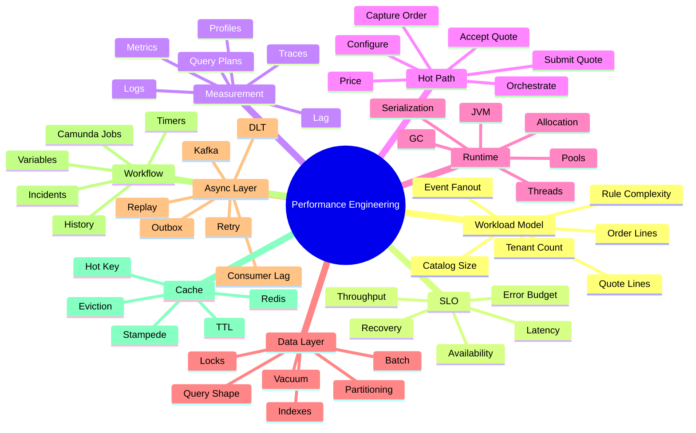
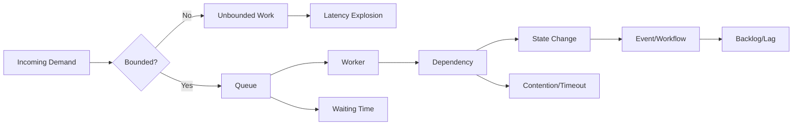
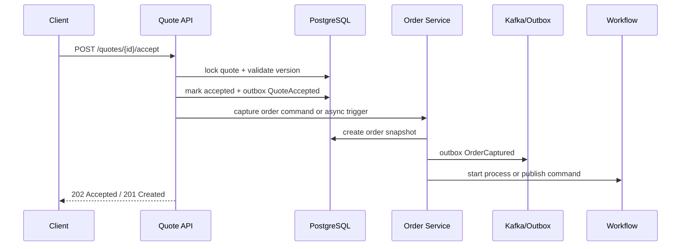

------
title: Learn Java Microservices CPQ/OMS Platform - Part 031
description: Performance engineering and capacity modeling for a Java microservices CPQ and order management platform: workload model, latency budget, throughput, JVM, PostgreSQL, Kafka, Redis, Camunda 7, load testing, and production capacity planning.
series: learn-java-microservices-cpq-oms-platform
seriesTitle: Learn Java Microservices CPQ/OMS Platform
order: 31
partTitle: Performance Engineering and Capacity Modeling
tags:
  - java
  - microservices
  - cpq
  - order-management
  - performance
  - capacity-planning
  - postgresql
  - kafka
  - redis
  - camunda
  - jfr
  - load-testing
date: 2026-07-02
---

# Part 031 — Performance Engineering and Capacity Modeling

Performance engineering untuk CPQ/OMS bukan hanya membuat endpoint cepat. Kita sedang membangun platform bisnis yang menghitung konfigurasi produk, harga, approval, quote, order, orchestration, event publishing, cache, dan audit trail. Platform seperti ini harus cepat, tetapi juga harus benar, stabil, explainable, dan recoverable.

Kesalahan umum engineer adalah langsung mengoptimasi query, menambah cache, atau menaikkan jumlah replica tanpa memahami bentuk beban. Di CPQ/OMS, performa sering ditentukan oleh kombinasi: jumlah tenant, ukuran katalog, kompleksitas konfigurasi, jumlah line item, aturan pricing, jumlah approval signal, fan-out event, backlog workflow, dan pattern akses database. Karena itu, capacity modeling harus dimulai dari workload model, bukan dari CPU graph.

Part ini membangun cara berpikir performance yang sistematis: dari SLO, latency budget, throughput, queueing, profiling, database plan, Kafka lag, Camunda job executor, Redis hot key, sampai load test dan production capacity review.

## 1. Tujuan Pembelajaran

Setelah menyelesaikan part ini, kita ingin mampu:

1. Membuat workload model untuk platform CPQ/OMS.
2. Menentukan SLO dan latency budget per use case.
3. Menghubungkan throughput, concurrency, queue length, dan latency.
4. Mengidentifikasi hot path di catalog, configuration, pricing, quote, order, dan orchestration.
5. Melakukan profiling Java dengan pendekatan evidence-based.
6. Membaca PostgreSQL execution plan untuk query kritis.
7. Mendesain kapasitas Kafka consumer, partition, dan retry/DLT.
8. Menyetel Camunda 7 job executor dan proses workflow tanpa membuat bottleneck.
9. Memakai Redis untuk mengurangi latency tanpa merusak correctness.
10. Mendesain load test, soak test, stress test, dan capacity review.

## 2. Kaufman Deconstruction: Performance Skill Map



Kaufman-style learning target untuk part ini adalah bukan “hafal tuning parameter”, tetapi mampu melakukan loop:

```text
Hypothesis -> Measurement -> Bottleneck Identification -> Controlled Change -> Validation -> Runbook Update
```

Jika kita tidak punya measurement, kita tidak sedang melakukan performance engineering. Kita hanya menebak.

## 3. Mental Model: Performance adalah Queueing + Contention + Shape

Untuk platform CPQ/OMS, performance biasanya memburuk karena salah satu dari lima hal:

1. **Queueing** — request, event, job, atau DB connection menunggu terlalu lama.
2. **Contention** — banyak worker berebut row, lock, partition, key, CPU, thread, atau connection.
3. **Data shape** — query, payload, atau object graph terlalu besar.
4. **Remote dependency** — latency external service masuk ke critical path.
5. **Unbounded work** — endpoint melakukan kerja yang tidak dibatasi oleh page size, line limit, retry budget, atau timeout.



Sistem dengan CPU rendah tetap bisa lambat jika semua request menunggu DB connection. Sistem dengan DB cepat tetap bisa lambat jika Camunda job executor backlog. Sistem dengan cache hit tinggi tetap bisa salah jika cache menyimpan harga yang seharusnya sudah tidak berlaku.

## 4. Performance Principles untuk CPQ/OMS

Gunakan prinsip berikut sebagai invariant engineering:

| Prinsip | Arti Praktis |
|---|---|
| Correctness before speed | Jangan optimasi dengan mengorbankan invariant quote/order. |
| Measure before tuning | Setiap optimasi harus punya baseline dan after-measurement. |
| Bound every dimension | Batasi line item, page size, retry count, payload size, workflow fan-out. |
| Separate read and write path | Query kompleks tidak boleh mengganggu command transaction. |
| Avoid hidden N+1 | MyBatis memberi kontrol SQL, tetapi tidak otomatis mencegah query berulang. |
| Cache only stable facts | Cache pricing/configuration harus punya version key dan invalidation policy. |
| Async is not free | Kafka/Camunda memindahkan latency ke backlog; bukan menghapus kerja. |
| Optimize hot path only | Jangan optimasi code path yang tidak signifikan dalam traffic nyata. |
| Keep repair path fast | Incident recovery butuh query dan tooling yang predictable. |

## 5. Workload Model

Sebelum tuning, definisikan workload. Untuk CPQ/OMS, workload tidak cukup dengan “100 RPS”. Kita perlu mengetahui struktur kerja.

### 5.1 Workload Dimensions

| Dimension | Contoh | Mengapa Penting |
|---|---:|---|
| Tenant aktif | 50 tenant | Mempengaruhi isolation, cache key, DB index selectivity. |
| Catalog size | 100k offer | Mempengaruhi lookup, publish snapshot, cache size. |
| Product attribute count | 200 attribute/product | Mempengaruhi validation dan payload size. |
| Configuration lines | 1–500 line | Mempengaruhi rule evaluation dan pricing. |
| Pricing rules | 100–10k rule | Mempengaruhi latency calculation. |
| Quote versions | 1–100 version/quote | Mempengaruhi storage dan retrieval. |
| Approval signals | 1–50 signal/quote | Mempengaruhi approval path. |
| Order lines | 1–1000 line | Mempengaruhi orchestration fan-out. |
| Fulfillment steps | 3–50 step/line | Mempengaruhi Camunda job count. |
| Event subscribers | 1–20 consumer group | Mempengaruhi fan-out dan schema compatibility. |

### 5.2 Capacity Unit

Untuk CPQ/OMS, gunakan beberapa unit kapasitas, bukan satu angka tunggal:

| Capacity Unit | Definisi |
|---|---|
| `quote_line_calculation` | Satu line item dihitung pricing-nya. |
| `configuration_validation` | Satu konfigurasi divalidasi terhadap rule set dan catalog snapshot. |
| `quote_submission` | Quote draft disubmit untuk approval/acceptance. |
| `order_capture` | Accepted quote dikonversi menjadi order. |
| `order_line_transition` | Satu line order berubah state. |
| `workflow_job_execution` | Satu job Camunda dieksekusi. |
| `event_publication` | Satu domain event dipublish dari outbox ke Kafka. |
| `event_consumption` | Satu event diproses consumer dengan inbox idempotency. |

Contoh:

```text
Peak hour:
- 20k active sales users
- 8k quote recalculation/hour
- average 25 quote lines
- 2.5 pricing recalculation per quote edit

quote_line_calculation/hour = 8,000 * 25 * 2.5 = 500,000
quote_line_calculation/sec  = 138.9 average
peak factor 5x               = 694.5/sec
```

Angka RPS API mungkin terlihat rendah, tetapi kerja pricing line bisa besar.

## 6. SLO dan Latency Budget

SLO harus berbasis use case. Jangan menyamakan endpoint read catalog dengan accept quote atau submit order.

### 6.1 Example SLO Matrix

| Use Case | Target p50 | Target p95 | Target p99 | Catatan |
|---|---:|---:|---:|---|
| Search catalog | 100 ms | 300 ms | 800 ms | Read-heavy, cache/projection friendly. |
| Validate configuration | 150 ms | 600 ms | 1500 ms | Bergantung kompleksitas rule. |
| Calculate price | 200 ms | 800 ms | 2000 ms | Harus deterministic dan explainable. |
| Save quote draft | 80 ms | 250 ms | 700 ms | Write path kecil. |
| Submit quote | 200 ms | 800 ms | 2000 ms | Bisa menghasilkan approval evaluation. |
| Accept quote | 300 ms | 1000 ms | 3000 ms | Harus idempotent; order capture bisa async. |
| Capture order | 500 ms | 2000 ms | 5000 ms | Bisa start orchestration. |
| Process workflow job | 100 ms | 1000 ms | 5000 ms | Tergantung external dependency. |

Angka di atas bukan universal. Ini baseline latihan untuk mengajari cara berpikir. Production SLO harus ditentukan dari kebutuhan bisnis, volume nyata, dan cost envelope.

### 6.2 Latency Budget untuk Accept Quote



Latency budget contoh:

| Segment | Budget |
|---|---:|
| API authentication + authorization | 30 ms |
| Load quote snapshot | 80 ms |
| Version/state guard | 20 ms |
| Acceptance persistence | 80 ms |
| Order capture command | 300 ms |
| Outbox insert | 30 ms |
| Response construction | 20 ms |
| Safety margin | 160 ms |
| **Total p95 budget** | **700 ms** |

Jika order orchestration memanggil external fulfillment system, jangan letakkan seluruh fulfillment di synchronous accept path. Accept quote harus membuat commitment bisnis dan memulai order process, bukan menunggu seluruh fulfillment selesai.

## 7. Little's Law untuk Engineer Backend

Little's Law:

```text
L = λ * W
```

Keterangan:

- `L` = jumlah work-in-progress/concurrent items.
- `λ` = arrival rate/throughput.
- `W` = waktu rata-rata item berada di sistem.

Contoh:

```text
Order workflow arrival rate = 20 order/sec
Average orchestration duration = 15 minutes = 900 sec
Active process instances ≈ 20 * 900 = 18,000
```

Artinya, walaupun API hanya menerima 20 order/sec, runtime Camunda mungkin harus menampung belasan ribu process instance aktif. Ini mempengaruhi runtime table, history table, timer jobs, incident query, dan operation dashboard.

Contoh untuk thread pool:

```text
Pricing API throughput = 500 request/sec
Average service time = 120 ms = 0.12 sec
Concurrent in-flight ≈ 500 * 0.12 = 60
```

Jika thread pool hanya 32 dan dependency tidak stabil, request mulai queueing. Jika thread pool terlalu besar, DB connection pool bisa habis dan latency memburuk.

## 8. Hot Path Platform

### 8.1 Catalog Browse Hot Path

Read-heavy path:

```text
User -> Catalog API -> Redis/Projection -> PostgreSQL fallback -> Response
```

Optimization focus:

- Projection table khusus read.
- Index pada `tenant_id`, `catalog_version_id`, `status`, `category`, `sku`.
- Cache key berbasis `tenant + catalog_version + query_dimension`.
- Page size bounded.
- Hindari join besar untuk list view.

### 8.2 Configuration Validation Hot Path

```text
User Selection -> Load Catalog Snapshot -> Evaluate Rules -> Explain Violations -> Save Session
```

Optimization focus:

- Precompiled rule graph per catalog version.
- Redis cache untuk metadata stabil.
- Batched DB load.
- Explainability tanpa menyimpan object graph besar.
- Limit line count dan attribute count.

### 8.3 Pricing Hot Path

```text
Configuration Snapshot -> Price Book -> Discount Rules -> Charge Breakdown -> Pricing Snapshot
```

Optimization focus:

- Price book version key.
- Deterministic calculation.
- Avoid floating point; gunakan minor unit/decimal.
- Golden master tests.
- Cache price rule lookup, bukan final price jika price sangat context-sensitive.

### 8.4 Quote Submit Hot Path

```text
Draft Quote -> Validate Completeness -> Evaluate Approval Signals -> Persist Submitted -> Emit Event
```

Optimization focus:

- Submit harus state transition kecil.
- Heavy document rendering async.
- Approval policy cache versioned.
- Outbox insert dalam transaksi yang sama.

### 8.5 Order Capture Hot Path

```text
Accepted Quote -> Idempotency Guard -> Snapshot Order -> Create Lines -> Start Workflow
```

Optimization focus:

- Bulk insert line item.
- Stable order reference.
- Idempotency key dari quote acceptance.
- Workflow start harus retry-safe.

## 9. JVM Performance Engineering

### 9.1 Profiling Sebelum Optimasi

Java modern memberi banyak alat observability runtime. Java Flight Recorder menyediakan mekanisme recording untuk memahami CPU, allocation, lock, thread, GC, dan event runtime. Gunakan profiling saat:

- p95/p99 latency naik tanpa sebab jelas.
- CPU tinggi tetapi throughput tidak naik.
- GC pause meningkat.
- thread blocked/waiting meningkat.
- pricing/configuration CPU-bound.
- serialization/deserialization mahal.

Checklist profiling:

1. Ambil baseline traffic representatif.
2. Capture JFR selama window yang cukup.
3. Lihat hot methods, allocation pressure, lock contention, GC, thread states.
4. Hubungkan dengan trace/request ID.
5. Ubah satu variabel.
6. Jalankan ulang test.

### 9.2 Allocation Discipline

CPQ payload sering besar. Hindari pattern berikut:

```java
// Anti-pattern: repeatedly copying large line lists
List<PricedLine> result = new ArrayList<>();
for (QuoteLine line : lines) {
    List<PricedLine> intermediate = new ArrayList<>(result);
    intermediate.add(price(line));
    result = intermediate;
}
```

Gunakan bounded mutable builder di dalam calculation boundary:

```java
List<PricedLine> result = new ArrayList<>(lines.size());
for (QuoteLine line : lines) {
    result.add(price(line));
}
return List.copyOf(result);
```

Immutability bagus untuk safety, tetapi object churn di hot path harus diukur.

### 9.3 Thread Pool dan Connection Pool

Jangan menyetel thread pool secara terpisah dari DB pool.

```text
API worker threads = 200
DB pool = 30
Average DB time = 80 ms
Peak API request = 500 rps
```

Jika 200 thread bisa masuk ke code path yang butuh DB, 170 thread mungkin hanya menunggu connection. Ini menaikkan latency dan memory pressure.

Rule praktis:

- Thread pool inbound harus bounded.
- DB connection pool harus sesuai database capacity.
- External dependency calls harus punya timeout.
- Async executor untuk background job harus dipisahkan dari request executor.
- Per-tenant heavy work perlu limiter.

## 10. JAX-RS/Jersey API Performance

Hotspot umum di service layer:

1. JSON payload terlalu besar.
2. Validation terlalu mahal.
3. Exception mapper membuat stack trace besar untuk error bisnis normal.
4. Request logging menyimpan body besar.
5. Blocking call tanpa timeout.
6. Pagination tidak bounded.
7. Resource method melakukan orchestration terlalu banyak.

Contoh bounded endpoint contract:

```yaml
parameters:
  - name: limit
    in: query
    schema:
      type: integer
      minimum: 1
      maximum: 100
      default: 50
```

Contoh defensive response shaping:

```java
public record QuoteSummaryResponse(
    UUID quoteId,
    String quoteNumber,
    String state,
    String customerName,
    Instant updatedAt,
    MoneyResponse total
) {}
```

List endpoint harus mengembalikan summary, bukan full quote snapshot dengan ratusan line.

## 11. PostgreSQL Performance Engineering

PostgreSQL query planner memilih execution plan untuk setiap query. `EXPLAIN` menunjukkan plan yang dipilih planner, dan `EXPLAIN ANALYZE` mengeksekusi query lalu menambahkan actual runtime statistics. Ini penting untuk membedakan tebakan dari bukti.

### 11.1 Query Shape untuk CPQ/OMS

Bad list query:

```sql
SELECT q.*, ql.*, a.*, e.*
FROM quote q
LEFT JOIN quote_line ql ON ql.quote_id = q.id
LEFT JOIN approval_request a ON a.quote_id = q.id
LEFT JOIN outbox_event e ON e.aggregate_id = q.id
WHERE q.tenant_id = :tenant_id
ORDER BY q.updated_at DESC
LIMIT 50;
```

Masalah:

- Join memperbesar row count.
- Pagination bisa salah karena duplicate quote rows.
- Outbox tidak relevan untuk UI list.
- Query sulit di-cache.

Better:

```sql
SELECT
  q.id,
  q.quote_number,
  q.state,
  q.customer_name,
  q.total_amount_minor,
  q.currency,
  q.updated_at
FROM quote q
WHERE q.tenant_id = :tenant_id
  AND q.state = ANY(:states)
ORDER BY q.updated_at DESC, q.id DESC
LIMIT :limit;
```

Full details dipanggil melalui endpoint detail yang memang butuh lines.

### 11.2 Index Design

Index harus mengikuti access pattern, bukan semua kolom.

```sql
CREATE INDEX idx_quote_tenant_state_updated
ON quote (tenant_id, state, updated_at DESC, id DESC);
```

Untuk order line processing:

```sql
CREATE INDEX idx_order_line_ready
ON order_line (tenant_id, state, dependency_ready_at, id)
WHERE state = 'READY_FOR_FULFILLMENT';
```

Partial index berguna untuk queue-like table jika status tertentu jauh lebih sering dicari dibanding status lain.

### 11.3 Lock dan Contention

Optimistic transition:

```sql
UPDATE order_header
SET state = :next_state,
    version = version + 1,
    updated_at = now()
WHERE tenant_id = :tenant_id
  AND id = :order_id
  AND state = :expected_state
  AND version = :expected_version;
```

Jika affected row = 0, transisi ditolak karena stale version atau invalid state. Ini lebih baik daripada lock panjang.

Untuk worker queue/outbox:

```sql
SELECT id
FROM outbox_event
WHERE status = 'NEW'
ORDER BY created_at
FOR UPDATE SKIP LOCKED
LIMIT 100;
```

`SKIP LOCKED` memungkinkan multiple publisher mengambil batch berbeda tanpa saling menunggu row yang sudah dikunci worker lain. Tetap perlu stale-claim recovery.

### 11.4 MyBatis Performance

Anti-pattern N+1:

```java
List<QuoteRow> quotes = quoteMapper.search(criteria);
for (QuoteRow quote : quotes) {
    quote.setLines(lineMapper.findByQuoteId(quote.id()));
}
```

Better:

```java
List<QuoteRow> quotes = quoteMapper.search(criteria);
List<UUID> ids = quotes.stream().map(QuoteRow::id).toList();
List<QuoteLineRow> lines = lineMapper.findByQuoteIds(ids);
```

Lalu group di memory. Untuk list besar, gunakan pagination dan limit.

### 11.5 Transaction Size

CPQ/OMS write transaction harus kecil:

- Validate command.
- Load aggregate minimum.
- Check invariant.
- Write state change.
- Write audit/outbox.
- Commit.

Jangan render PDF, call external system, publish Kafka langsung, atau evaluate ribuan rule dalam transaksi DB jika bisa dipisah.

## 12. Kafka Performance Engineering

Kafka bottleneck biasanya muncul sebagai consumer lag, rebalance, slow partition, retry storm, atau DLT flood.

### 12.1 Partition Key

| Event | Key yang Disarankan | Alasan |
|---|---|---|
| `QuoteSubmitted` | `quoteId` | Menjaga ordering event quote. |
| `QuoteAccepted` | `quoteId` | Acceptance harus terurut terhadap quote lifecycle. |
| `OrderCaptured` | `orderId` | Order lifecycle butuh ordering per order. |
| `OrderLineStateChanged` | `orderId` atau `orderLineId` | Pilih berdasarkan kebutuhan ordering. |
| `ApprovalEscalated` | `approvalRequestId` | Approval lifecycle lokal. |

Jangan pakai `tenantId` sebagai key untuk semua event jika tenant besar dapat membuat hot partition.

### 12.2 Consumer Capacity

Consumer group parallelism dibatasi oleh jumlah partition topic. Jika topic punya 12 partition, consumer group efektif maksimal 12 active consumer untuk topic itu.

Capacity estimate:

```text
Event arrival = 2,000 events/sec
Average processing time = 20 ms = 0.02 sec
Concurrency needed = 2,000 * 0.02 = 40 in-flight
```

Jika satu consumer process memproses sequential per partition, kita butuh cukup partition dan instance. Namun, menaikkan partition juga meningkatkan operational cost dan complexity. Partition count adalah keputusan arsitektur, bukan angka default.

### 12.3 Producer Batching

Untuk event publikasi outbox:

- Batch publish meningkatkan throughput.
- Batch terlalu besar menaikkan latency dan retry blast radius.
- Gunakan bounded batch size.
- Persist status per event.
- Jangan menghapus outbox sebelum event benar-benar acknowledged.

### 12.4 Lag sebagai Business Risk

Kafka lag bukan hanya angka teknis. Untuk CPQ/OMS:

| Lag Consumer | Dampak Bisnis |
|---|---|
| order-orchestrator lag | Order captured tetapi belum diproses fulfillment. |
| approval-escalation lag | Approval SLA terlambat. |
| search-projection lag | UI menampilkan data stale. |
| billing-integration lag | Revenue recognition terlambat. |
| audit-export lag | Compliance reporting tertunda. |

Dashboard harus menerjemahkan lag menjadi dampak bisnis.

## 13. Camunda 7 Performance Engineering

Camunda 7 sangat kuat untuk workflow, tetapi bisa menjadi bottleneck jika proses didesain sebagai tempat menyimpan semua data dan semua kerja.

### 13.1 Camunda Performance Principles

1. Process instance menyimpan orchestration state, bukan full business aggregate.
2. Variable harus kecil dan versioned.
3. Heavy business logic tetap di service domain.
4. Async continuation digunakan untuk membatasi transaksi dan retry.
5. History level harus sesuai kebutuhan audit dan storage.
6. Incident harus bisa di-query dan diperbaiki.
7. Timer jumlah besar perlu capacity planning.

### 13.2 Job Executor Capacity

Estimate:

```text
Orders/sec = 10
Average jobs/order = 30
Workflow jobs/sec = 300
Average job execution = 50 ms
Concurrency needed = 300 * 0.05 = 15 workers
```

Tambahkan margin untuk retry, timer, incident recovery, dan peak factor.

Jika job execution memanggil external service rata-rata 1 detik:

```text
Concurrency needed = 300 * 1.0 = 300 workers
```

Ini sinyal bahwa external call seharusnya dipindah ke async integration worker atau external task pattern dengan limiter, bukan Java delegate blocking tanpa kontrol.

### 13.3 Camunda Variables

Bad:

```json
{
  "fullQuote": { "lines": [ /* 500 huge lines */ ] },
  "fullOrder": { "lines": [ /* huge */ ] },
  "pricingTrace": { "rules": [ /* huge */ ] }
}
```

Better:

```json
{
  "tenantId": "t-001",
  "orderId": "9a2a...",
  "orderVersion": 7,
  "processSchemaVersion": "order-orchestration.v3",
  "currentPhase": "FULFILLMENT"
}
```

Process engine dapat mengambil snapshot dari Order Service jika butuh detail.

### 13.4 History Table Growth

Workflow platform dengan ribuan order/day akan menghasilkan banyak history rows. Rencanakan:

- history level.
- cleanup policy.
- index untuk operation query.
- retention per process definition.
- export audit jika regulatory retention lebih panjang dari operational retention.
- partitioning/archival jika volume besar.

## 14. Redis Performance Engineering

Redis harus mempercepat runtime, bukan menjadi sumber kebenaran finansial.

### 14.1 Cache Key Design

```text
catalog:{tenantId}:{catalogVersion}:offer:{offerId}
pricing-rule:{tenantId}:{priceBookVersion}:{segment}:{region}
config-session:{tenantId}:{sessionId}
idempotency:{tenantId}:{operation}:{key}
```

Key harus mengandung version jika data bisa berubah melalui publish/versioning. Ini mengurangi invalidation kompleks.

### 14.2 Hot Key

Hot key muncul ketika semua request membaca key yang sama, misalnya:

```text
pricing-rule:default
```

Mitigasi:

- versioned and segmented keys.
- local in-memory near-cache untuk data sangat stabil.
- request coalescing.
- TTL jitter.
- split large object.

### 14.3 Stampede Prevention

Pattern:

```text
Cache Miss -> Try short lock -> One loader hits DB -> Others wait/fallback -> Populate cache with TTL jitter
```

Namun distributed lock harus hati-hati. Untuk pricing correctness, lebih aman membuat cache rebuild idempotent dan membiarkan beberapa duplicate rebuild daripada mengunci path utama terlalu lama.

## 15. Capacity Model Worksheet

Gunakan worksheet ini sebelum performance test.

### 15.1 Business Demand

| Input | Value |
|---|---:|
| Active tenants |  |
| Peak users |  |
| Quote edits/hour |  |
| Average quote lines |  |
| Price recalculation/edit |  |
| Quote submissions/hour |  |
| Quote acceptance/hour |  |
| Average order lines |  |
| Workflow steps/order line |  |
| Event subscribers |  |

### 15.2 Derived Load

```text
pricing_line_calc_per_sec = quote_edits_per_hour * avg_lines * recalculation_per_edit / 3600
order_line_created_per_sec = quote_acceptance_per_hour * avg_order_lines / 3600
workflow_jobs_per_sec = order_line_created_per_sec * workflow_steps_per_line
event_processing_per_sec = domain_events_per_sec * subscribers
```

### 15.3 Resource Estimate

| Resource | Estimate Basis |
|---|---|
| API replicas | request/sec * service time / target utilization |
| DB connections | concurrent DB work, not API threads |
| Kafka partitions | ordering boundary + throughput + future growth |
| Camunda workers | jobs/sec * job duration * peak factor |
| Redis memory | key count * average value size * overhead * growth factor |
| Storage | quote/order/history/outbox/audit retention |

## 16. Load Testing Strategy

### 16.1 Test Types

| Test | Tujuan |
|---|---|
| Smoke test | Membuktikan flow dasar berjalan. |
| Baseline load test | Mengukur performa normal. |
| Stress test | Menemukan titik jenuh. |
| Spike test | Menguji lonjakan tiba-tiba. |
| Soak test | Menemukan leak, table growth, backlog. |
| Scalability test | Membuktikan replica/partition/worker scaling. |
| Failure-injection test | Menguji timeout, retry, recovery. |

### 16.2 Scenario Mix

Contoh production-like mix:

| Scenario | Weight |
|---|---:|
| Catalog search | 35% |
| Configuration validate | 20% |
| Price recalculation | 20% |
| Save quote draft | 10% |
| Submit quote | 5% |
| Accept quote/order capture | 3% |
| Order status read | 5% |
| Admin/repair/read audit | 2% |

Jika hanya menguji accept quote, kita tidak melihat cache/read pressure. Jika hanya menguji read endpoint, kita tidak melihat lock, workflow, outbox, dan Kafka lag.

### 16.3 Test Data Must Be Realistic

Bad test data:

- 1 tenant.
- 10 product.
- 1 quote line.
- semua rule sederhana.
- semua request pakai user sama.
- database kosong.

Better:

- banyak tenant dengan ukuran berbeda.
- catalog besar dengan versioning.
- quote lines bervariasi.
- discount/approval edge cases.
- order line dependency graph.
- existing history/audit/outbox data.
- skewed tenant traffic untuk menguji noisy neighbor.

## 17. Performance Debugging Playbook

### 17.1 API Latency Naik

Langkah:

1. Cek p50/p95/p99 per endpoint.
2. Cek error rate dan timeout.
3. Cek thread pool saturation.
4. Cek DB pool wait time.
5. Cek trace breakdown.
6. Cek slow query.
7. Cek Redis latency/cache miss.
8. Cek external dependency.
9. Cek deployment baru.

### 17.2 Database CPU Tinggi

Langkah:

1. Cek top query by total time.
2. Run `EXPLAIN (ANALYZE, BUFFERS)` di staging/prod-safe replica.
3. Cek missing index/statistics.
4. Cek row count estimate vs actual.
5. Cek lock wait.
6. Cek autovacuum/bloat.
7. Cek new query dari release terbaru.
8. Tambahkan index secara concurrent jika perlu.

### 17.3 Kafka Lag Naik

Langkah:

1. Identifikasi consumer group dan topic.
2. Cek partition skew.
3. Cek processing latency per event type.
4. Cek poison event/retry storm.
5. Cek downstream dependency.
6. Scale consumer jika partition cukup.
7. Pause/resume atau route ke DLT jika perlu.
8. Jalankan replay/reconciliation setelah stabil.

### 17.4 Camunda Incident Flood

Langkah:

1. Kelompokkan incident per process definition/version/activity.
2. Identifikasi error transient/permanent/business.
3. Cek job retry config.
4. Cek external dependency.
5. Cek variable schema mismatch.
6. Stop retry storm jika dependency down.
7. Deploy fix atau repair data.
8. Retry incidents secara batch terkontrol.

## 18. Observability Metrics untuk Performance

### 18.1 API

- request rate per endpoint.
- p50/p95/p99 latency.
- error rate by status/error code.
- request body size.
- response size.
- thread pool active/queued.
- DB pool active/wait.

### 18.2 PostgreSQL

- query total time.
- query mean/p95 time.
- lock wait.
- deadlock count.
- connection count.
- transaction duration.
- table/index hit ratio.
- autovacuum activity.
- table/index size growth.

### 18.3 Kafka

- producer latency.
- outbox age.
- publish rate.
- consumer lag.
- consumer processing latency.
- retry topic rate.
- DLT rate.
- rebalance count.

### 18.4 Camunda

- active process instances.
- jobs acquired/sec.
- job execution latency.
- failed jobs.
- incident count.
- timer due count.
- process duration by definition.
- stuck activity count.

### 18.5 Redis

- command latency.
- hit/miss ratio.
- memory usage.
- evicted keys.
- expired keys.
- hot key indicators.
- connection count.
- timeout count.

## 19. Common Bottlenecks and Fixes

| Symptom | Likely Cause | Better Fix |
|---|---|---|
| Quote list slow | Over-joined query | Summary projection + proper index. |
| Pricing p99 high | Rule graph loaded repeatedly | Versioned rule cache + precompiled rule graph. |
| Submit quote stalls | Approval evaluation too heavy | Split signal calculation and policy decision. |
| Accept quote duplicate order | Missing idempotency | Unique idempotency key + state guard. |
| Kafka lag on one partition | Bad key/hot aggregate | Revisit partition key or split topic. |
| Camunda DB grows fast | Huge variables/history | Reduce variable payload + cleanup policy. |
| Redis memory spikes | Unbounded session/cache | TTL + max object size + eviction policy. |
| DB pool exhausted | Thread pool too high/slow query | Tune query and align pools. |
| CPU high in Java | Serialization/allocation | Profile JFR, reduce payload/copying. |

## 20. Performance Anti-Patterns

1. Caching final price without price book version.
2. Using Camunda variables as document store.
3. Making Kafka partition key equal to tenant for all events.
4. Running PDF generation inside quote submit transaction.
5. Loading full catalog for every configuration validation.
6. Adding indexes blindly without query evidence.
7. Increasing thread pool to hide DB latency.
8. Treating p50 as enough while p99 is broken.
9. Running load test with toy data.
10. Ignoring repair/admin workflows in capacity planning.
11. Using Redis distributed lock as correctness boundary.
12. Using E2E tests as the only performance signal.

## 21. Implementation Lab

Bangun performance lab sederhana:

1. Buat dataset:
   - 10 tenant.
   - 100k offers.
   - 1M quote rows.
   - 5M quote lines.
   - 100k order rows.
   - 2M order lines.
2. Buat scenario:
   - catalog search.
   - validate configuration 10/50/200 lines.
   - price recalculation.
   - submit quote.
   - accept quote.
   - process order workflow jobs.
3. Ukur:
   - API p50/p95/p99.
   - DB slow query.
   - Kafka lag.
   - Camunda job latency.
   - Redis hit ratio.
   - CPU/memory/GC.
4. Lakukan satu optimasi:
   - tambah projection.
   - tambah index.
   - ubah cache key.
   - batch MyBatis query.
   - kecilkan Camunda variables.
5. Tulis before/after report.

## 22. Production Readiness Checklist

Sebelum platform dianggap performance-ready:

- [ ] Ada workload model tertulis.
- [ ] Ada SLO per use case.
- [ ] Ada latency budget untuk hot path.
- [ ] Ada capacity unit untuk pricing/config/order/workflow/event.
- [ ] Ada baseline load test.
- [ ] Ada soak test minimal untuk memory/table/backlog growth.
- [ ] Ada query plan untuk query kritis.
- [ ] Ada index review.
- [ ] Ada DB pool/thread pool alignment.
- [ ] Ada Kafka lag dashboard.
- [ ] Ada outbox age dashboard.
- [ ] Ada Camunda incident/job dashboard.
- [ ] Ada Redis hit/miss/memory dashboard.
- [ ] Ada JFR/profiling runbook.
- [ ] Ada stress limit dan graceful degradation policy.
- [ ] Ada capacity review sebelum major release.

## 23. Reference Baseline

- PostgreSQL documentation: `EXPLAIN`, `EXPLAIN ANALYZE`, indexes, and monitoring database activity.
- Oracle JDK documentation: Java Flight Recorder and Java SE 25 troubleshooting/profiling material.
- Apache Kafka documentation: producer/consumer configuration, topic partitioning, and operational concepts.
- Redis documentation: latency, memory, data structures, caching, and production operation.
- Camunda 7 documentation: job executor, incidents, history, and process engine operation.
- OpenTelemetry Java documentation: metrics, logs, traces, instrumentation, and runtime telemetry.

## 24. Ringkasan

Performance engineering CPQ/OMS harus dimulai dari workload model dan SLO, bukan dari tuning parameter. Platform ini punya banyak hot path: catalog search, configuration validation, pricing calculation, quote submission, order capture, workflow job execution, event publishing, and event consumption.

Kunci top-tier engineering adalah kemampuan menghubungkan angka teknis dengan risiko bisnis:

- API latency berarti sales user menunggu.
- Pricing p99 berarti quote edit terasa berat.
- Kafka lag berarti downstream view/integration stale.
- Camunda backlog berarti order belum bergerak.
- DB lock berarti state transition berebut resource.
- Redis hot key berarti cache justru menjadi bottleneck.

Optimasi yang benar selalu evidence-based: ukur, pahami bottleneck, ubah satu hal, validasi, lalu dokumentasikan runbook.
