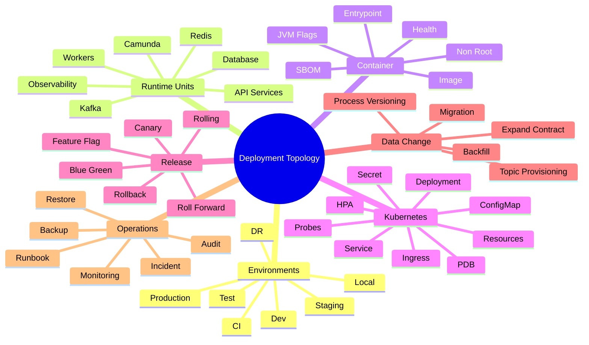
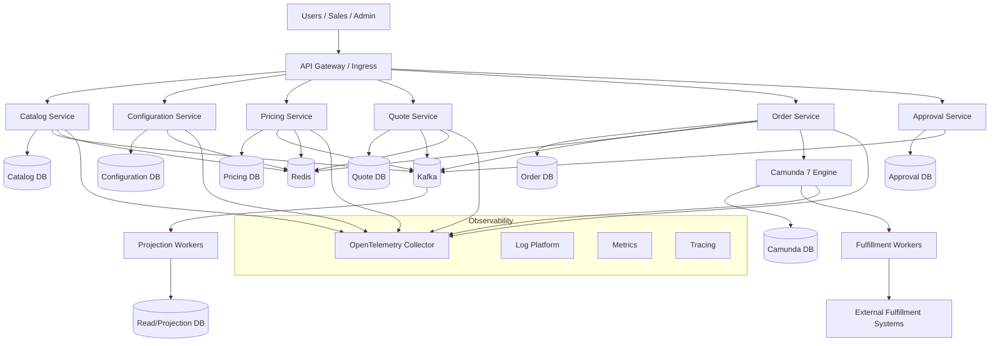
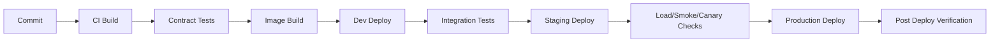
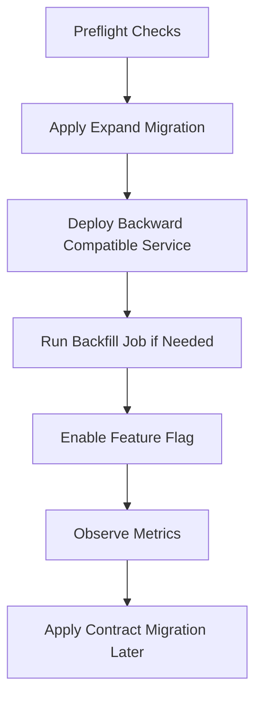
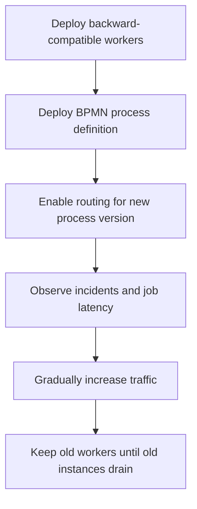
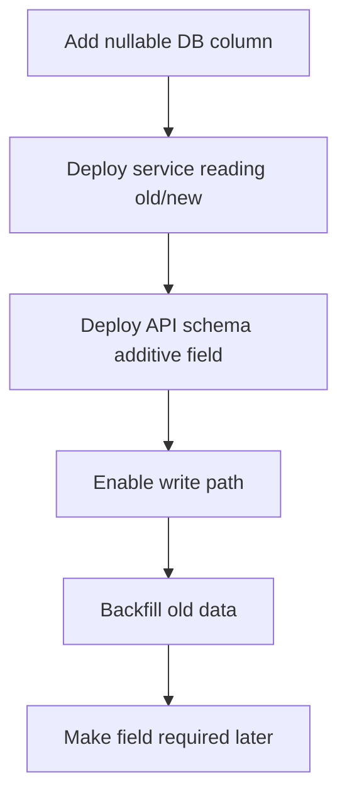
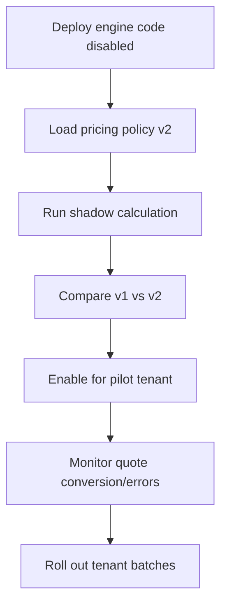
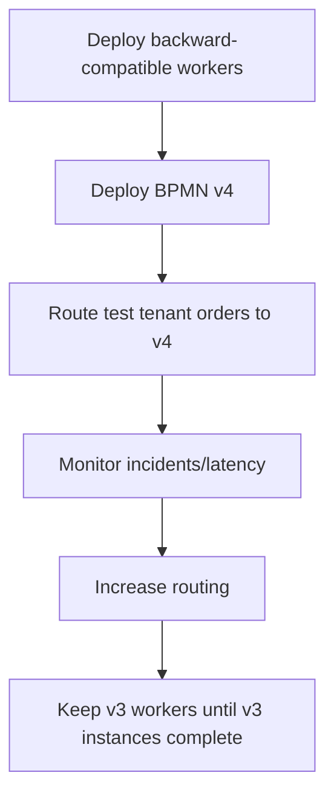

------
title: Learn Java Microservices CPQ/OMS Platform - Part 032
description: Deployment topology and runtime environments for a Java microservices CPQ and order management platform: environments, container images, Kubernetes, configuration, secrets, database migration, Kafka, Redis, Camunda 7, release strategy, and operational readiness.
series: learn-java-microservices-cpq-oms-platform
seriesTitle: Learn Java Microservices CPQ/OMS Platform
order: 32
partTitle: Deployment Topology and Runtime Environments
tags:
  - java
  - microservices
  - cpq
  - order-management
  - deployment
  - kubernetes
  - docker
  - postgresql
  - kafka
  - redis
  - camunda
  - ci-cd
  - runtime
date: 2026-07-02
---

# Part 032 — Deployment Topology and Runtime Environments

Deployment topology adalah bentuk nyata dari arsitektur. Diagram service tidak cukup. Platform CPQ/OMS production-grade membutuhkan keputusan jelas tentang container image, runtime config, secret, database migration, Kafka topic provisioning, Redis topology, Camunda 7 process deployment, environment promotion, release strategy, rollback, observability, dan disaster recovery.

Part ini membangun mental model deployment untuk platform Java microservices CPQ/OMS. Fokusnya bukan sekadar “deploy ke Kubernetes”, tetapi bagaimana membuat topology yang bisa dioperasikan, diaudit, dipulihkan, dan berevolusi tanpa membuat order hilang, quote salah harga, workflow macet, atau tenant bocor.

## 1. Tujuan Pembelajaran

Setelah menyelesaikan part ini, kita ingin mampu:

1. Mendesain deployment topology untuk CPQ/OMS microservices.
2. Memisahkan environment local, CI, dev, test, staging, production, dan disaster recovery.
3. Mendesain container image Java yang aman dan reproducible.
4. Menentukan Kubernetes resource: Deployment, Service, ConfigMap, Secret, probes, resource requests/limits, HPA, PDB.
5. Menyusun runtime configuration dan secret strategy.
6. Menentukan urutan deployment database migration, service, Kafka topic, Redis, dan Camunda process.
7. Menggunakan rolling, blue/green, canary, dan feature flag dengan benar.
8. Menangani deployment Camunda 7 process definition dan compatibility.
9. Mendesain rollback, roll-forward, dan repair strategy.
10. Membuat production readiness checklist sebelum go-live.

## 2. Kaufman Deconstruction: Deployment Skill Map



Kaufman-style target untuk part ini adalah mampu menjawab:

```text
Apa yang berubah saat release?
Apa yang harus compatible selama rolling deploy?
Apa yang terjadi jika release gagal di tengah jalan?
Apa yang bisa di-rollback?
Apa yang harus di-roll-forward?
Apa yang harus tetap benar walaupun ada dua versi service hidup bersamaan?
```

## 3. Target Deployment Topology



Arsitektur ini sengaja memisahkan:

- API services.
- worker services.
- service-owned databases.
- Kafka event backbone.
- Redis runtime acceleration.
- Camunda workflow engine.
- projection/read model.
- observability pipeline.

## 4. Environment Strategy

### 4.1 Environment Types

| Environment | Tujuan | Data | Deployment Policy |
|---|---|---|---|
| Local | Developer feedback loop | Synthetic | Fast reset, mockable. |
| CI | Automated verification | Ephemeral | Disposable dependencies. |
| Dev | Integration work | Synthetic/shared | Frequent deploy. |
| Test/QA | Functional validation | Curated | Controlled deploy. |
| Staging | Production rehearsal | Prod-like masked | Release candidate only. |
| Production | Real business | Real | Change-controlled. |
| DR | Recovery capability | Replicated/restore | Tested periodically. |

Environment parity penting, tetapi tidak berarti semua environment harus sebesar production. Yang harus sama adalah contract, configuration shape, migration process, security posture, dan operational behavior.

### 4.2 Environment Promotion



Artifact harus dipromosikan, bukan di-build ulang di setiap environment. Build once, promote many.

## 5. Deployment Units

Platform CPQ/OMS minimal memiliki unit berikut:

| Unit | Contoh | Deployment Concern |
|---|---|---|
| API service | quote-service | Rolling compatibility, HTTP contract. |
| Worker service | outbox-publisher | Idempotency, concurrency, retry. |
| Process worker | fulfillment-worker | Camunda job/external task behavior. |
| Database schema | quote_db | Migration order, expand-contract. |
| Kafka topic | cpq.quote.public.v1 | Topic provisioning, ACL, retention. |
| Redis namespace | quote:* | TTL, memory, key versioning. |
| Camunda process | order-orchestration.bpmn | Process definition versioning. |
| Projection | quote-search-projection | Replay/backfill. |
| Observability config | dashboards/alerts | Release visibility. |

Jangan deploy semuanya sebagai satu “big bang” jika perubahan tidak atomic. CPQ/OMS perlu release choreography.

## 6. Container Image Design untuk Java Services

### 6.1 Image Principles

1. Reproducible build.
2. Small runtime surface.
3. Non-root user.
4. No secret baked into image.
5. Clear entrypoint.
6. Health endpoint.
7. JVM flags environment-driven.
8. SBOM/scanning in CI.
9. Version metadata label.

Example Dockerfile:

```dockerfile
FROM eclipse-temurin:21-jre AS runtime

WORKDIR /app

RUN addgroup --system app && adduser --system --ingroup app app

COPY target/quote-service.jar /app/app.jar

USER app

ENV JAVA_OPTS="-XX:MaxRAMPercentage=75 -XX:+ExitOnOutOfMemoryError"

EXPOSE 8080

ENTRYPOINT ["sh", "-c", "java $JAVA_OPTS -jar /app/app.jar"]
```

Untuk production, base image, JVM version, license, scanning, dan patch cadence harus disetujui platform/security team.

### 6.2 Image Metadata

```dockerfile
LABEL org.opencontainers.image.title="quote-service"
LABEL org.opencontainers.image.version="1.18.3"
LABEL org.opencontainers.image.revision="$GIT_SHA"
LABEL org.opencontainers.image.source="git@example.com:cpq/quote-service"
```

Metadata ini membantu incident response: operator bisa tahu image yang sedang berjalan berasal dari commit mana.

## 7. Kubernetes Runtime Topology

Kubernetes menyediakan primitives untuk deployment, scaling, service discovery, configuration, secret, dan health. Kubernetes sendiri mendeskripsikan dirinya sebagai sistem open source untuk otomasi deployment, scaling, dan management aplikasi containerized.

### 7.1 Namespace Strategy

Contoh:

```text
cpq-dev
cpq-test
cpq-staging
cpq-prod
cpq-observability
cpq-data
```

Atau per domain:

```text
cpq-commercial-prod
cpq-order-prod
cpq-platform-prod
```

Trade-off:

| Strategy | Kelebihan | Risiko |
|---|---|---|
| Namespace per environment | Sederhana | Isolation domain kurang granular. |
| Namespace per bounded context | Ownership jelas | Config/ops lebih kompleks. |
| Namespace per tenant | Strong isolation | Operational overhead tinggi. |

Untuk CPQ/OMS multi-tenant B2B, namespace per tenant biasanya terlalu berat kecuali tenant sangat besar/regulatory-driven.

### 7.2 Deployment Manifest

```yaml
apiVersion: apps/v1
kind: Deployment
metadata:
  name: quote-service
  labels:
    app: quote-service
    domain: commercial
spec:
  replicas: 3
  selector:
    matchLabels:
      app: quote-service
  strategy:
    type: RollingUpdate
    rollingUpdate:
      maxUnavailable: 0
      maxSurge: 1
  template:
    metadata:
      labels:
        app: quote-service
    spec:
      containers:
        - name: quote-service
          image: registry.example.com/cpq/quote-service:1.18.3
          ports:
            - containerPort: 8080
          envFrom:
            - configMapRef:
                name: quote-service-config
            - secretRef:
                name: quote-service-secret
          readinessProbe:
            httpGet:
              path: /health/ready
              port: 8080
            initialDelaySeconds: 10
            periodSeconds: 5
          livenessProbe:
            httpGet:
              path: /health/live
              port: 8080
            initialDelaySeconds: 30
            periodSeconds: 10
          startupProbe:
            httpGet:
              path: /health/startup
              port: 8080
            failureThreshold: 30
            periodSeconds: 5
          resources:
            requests:
              cpu: "500m"
              memory: "768Mi"
            limits:
              cpu: "2"
              memory: "1536Mi"
```

### 7.3 Probe Semantics

| Probe | Arti | CPQ/OMS Guidance |
|---|---|---|
| Startup | App selesai bootstrap | Cocok untuk service dengan migration check/client init. |
| Readiness | Siap menerima traffic | Fail jika DB required unavailable atau service warming belum selesai. |
| Liveness | App perlu restart | Jangan fail hanya karena dependency sementara down. |

Kesalahan umum: liveness probe mengecek database. Saat DB lambat, semua pod restart, memperburuk incident.

### 7.4 Resource Requests and Limits

Requests mempengaruhi scheduling. Limits membatasi resource runtime. Untuk Java:

- set memory request realistis.
- atur `MaxRAMPercentage`.
- jangan membuat heap terlalu dekat limit container.
- monitor OOMKilled.
- CPU limit terlalu ketat bisa membuat latency p99 buruk.

## 8. Configuration and Secret Strategy

### 8.1 Configuration Categories

| Category | Example | Storage |
|---|---|---|
| Static app config | service name, port | image/default config. |
| Environment config | DB host, Kafka bootstrap | ConfigMap. |
| Secret | DB password, OAuth client secret | Secret/external secret manager. |
| Runtime feature | enable new pricing policy | Feature flag service/config. |
| Tenant config | approval threshold, region policy | Database-owned configuration. |

Jangan menyimpan tenant business policy di Kubernetes ConfigMap jika policy harus diaudit dan berubah oleh business operation.

### 8.2 Secret Rules

Kubernetes Secret memang ditujukan untuk data confidential, tetapi Secret bukan alasan untuk mengabaikan encryption, RBAC, rotation, dan external secret manager. Jangan log secret. Jangan bake secret ke image.

Example:

```yaml
apiVersion: v1
kind: Secret
metadata:
  name: quote-service-secret
type: Opaque
stringData:
  DB_PASSWORD: "replace-by-secret-manager"
  OAUTH_CLIENT_SECRET: "replace-by-secret-manager"
```

Di production, nilai ini biasanya disinkronkan dari secret manager, bukan ditulis manual di Git.

## 9. Database Deployment and Migration

### 9.1 Deployment Order

Untuk service dengan schema sendiri:



CPQ/OMS tidak boleh melakukan breaking schema migration bersamaan dengan rolling deploy service yang masih punya pod versi lama.

### 9.2 Expand-Contract Example

Release N:

```sql
ALTER TABLE quote ADD COLUMN acceptance_channel text;
```

Service N mulai menulis `acceptance_channel` jika tersedia, tetapi masih kompatibel jika null.

Backfill:

```sql
UPDATE quote
SET acceptance_channel = 'UNKNOWN'
WHERE acceptance_channel IS NULL
  AND state = 'ACCEPTED';
```

Release N+1:

```sql
ALTER TABLE quote
ALTER COLUMN acceptance_channel SET NOT NULL;
```

Release N+2:

hapus old column/path jika sudah tidak dipakai.

### 9.3 Migration Failure Policy

| Failure | Response |
|---|---|
| Migration gagal sebelum perubahan | Fix script, rerun. |
| Migration sebagian berhasil | Investigate schema history/checksum, manual repair jika perlu. |
| Data backfill lambat | Pause, batch smaller, resume. |
| Constraint baru gagal | Data quality issue; jangan paksa deploy. |
| Service baru tidak kompatibel | Roll forward atau rollback service jika schema masih compatible. |

Rollback database sering berisiko. Untuk production, lebih aman mendesain migration agar roll-forward mungkin.

## 10. Kafka Deployment

Kafka deployment concern:

1. Topic provisioning.
2. Partition count.
3. Replication factor.
4. Retention.
5. ACL.
6. Schema/event contract.
7. Consumer group naming.
8. DLT/retry topic.

Example topic manifest concept:

```yaml
topic: cpq.order.public.v1
owner: order-service
partitions: 24
retention: 14d
key: orderId
schema: events/order/order-captured.v1.schema.json
consumers:
  - fulfillment-orchestrator
  - audit-exporter
  - customer-notification
```

### 10.1 Topic Compatibility Rule

Service deployment tidak boleh mem-publish event baru yang belum bisa ditoleransi consumer kritis, kecuali:

- event baru additive dan consumer tolerant.
- consumer sudah dideploy lebih dulu.
- event route masih feature-flagged.
- schema compatibility sudah lulus CI.

### 10.2 Consumer Rollout

Untuk consumer:

1. Deploy consumer yang bisa membaca old + new event.
2. Deploy producer yang publish new fields.
3. Observe lag/error.
4. Aktifkan behavior baru.
5. Deprecate old field setelah semua consumer aman.

## 11. Redis Deployment

Redis topology harus dipilih berdasarkan role:

| Role | Topology Consideration |
|---|---|
| Cache catalog/pricing metadata | Memory sizing, eviction, versioned key. |
| Configuration session | Persistence/TTL/availability requirement. |
| Idempotency short window | TTL, consistency fallback to DB. |
| Rate limiting | Latency and atomic operation. |
| Lock/fencing adjunct | Must not be sole correctness authority. |

Deployment rules:

- Key namespace per service.
- TTL wajib untuk ephemeral key.
- Memory usage alert.
- Eviction policy dipahami.
- Redis unavailable path didefinisikan.
- Cache warmup tidak membanjiri DB.

## 12. Camunda 7 Deployment Topology

Camunda 7 deployment adalah bagian tersulit karena process definition, runtime instances, Java delegate compatibility, database schema, job executor, dan business state saling terkait.

### 12.1 Topology Choices

| Topology | Kelebihan | Risiko |
|---|---|---|
| Embedded engine per service | Simple deployment ownership | Coupling service-engine kuat. |
| Shared engine | Centralized operations | Multi-service coupling, versioning lebih sulit. |
| External task workers | Better worker isolation | More infrastructure/latency. |

Untuk CPQ/OMS, pattern yang sering lebih aman:

- Order Service owns order state.
- Camunda owns orchestration state.
- Workers/delegates call domain commands idempotently.
- Process variables contain IDs/version, not full aggregate.

### 12.2 Process Definition Versioning

Camunda process definition versioning harus compatible dengan running instances.

Deployment scenarios:

| Scenario | Guidance |
|---|---|
| New process for new orders | Deploy new BPMN version, route new orders only. |
| Existing instances continue old path | Keep old delegates compatible. |
| Breaking delegate change | Version delegate or route by process definition. |
| Variable schema change | Support old + new variable schema. |
| Incident fix | Patch worker/service idempotently, retry controlled. |

### 12.3 Camunda Release Order



Jangan menghapus worker/delegate lama saat masih ada process instance lama yang membutuhkan behavior tersebut.

## 13. API Gateway and Ingress

Ingress/API gateway responsibilities:

- TLS termination.
- route mapping.
- authentication integration.
- request size limit.
- rate limiting.
- header normalization.
- correlation ID propagation.
- WAF/security filters where applicable.

Tidak semua logic boleh masuk gateway. Authorization object-level tetap di service, karena gateway tidak tahu quote owner, tenant rule, approval delegation, dan order state.

## 14. Release Strategy

### 14.1 Rolling Deployment

Cocok untuk backward-compatible change.

Syarat:

- old + new service version bisa berjalan bersamaan.
- DB schema compatible.
- event schema compatible.
- cache key compatible atau versioned.
- process worker compatible.

### 14.2 Blue/Green

Cocok untuk cutover besar, tetapi hati-hati dengan stateful systems.

Risiko CPQ/OMS:

- dua environment menulis ke DB/event backbone sama.
- idempotency key collision.
- background worker dobel.
- Camunda job executor di blue dan green berebut job.

Jika blue/green digunakan, pastikan hanya satu environment yang aktif untuk worker side-effectful.

### 14.3 Canary

Canary cocok untuk API read/write tertentu dengan tenant/user subset.

Canary rules:

- jangan canary schema breaking.
- jangan canary event breaking tanpa tolerant consumer.
- monitor business metrics, bukan hanya 5xx.
- siapkan fast disable via feature flag.

### 14.4 Feature Flags

Feature flag cocok untuk:

- enable new pricing rule engine.
- route new orders to new BPMN version.
- enable new approval policy version.
- expose UI behavior.

Feature flag tidak boleh menjadi permanent complexity. Setiap flag punya owner, expiry date, rollback plan, dan cleanup ticket.

## 15. Runtime Configuration Matrix

| Config | Example | Change Frequency | Restart? | Owner |
|---|---|---:|---|---|
| DB URL | `jdbc:postgresql://...` | Rare | Yes | Platform |
| DB pool size | `30` | Occasional | Usually yes | Service owner |
| Kafka bootstrap | `broker:9092` | Rare | Yes | Platform |
| Topic name | `cpq.quote.public.v1` | Rare | Yes | Domain owner |
| Redis TTL | `600s` | Occasional | Maybe | Service owner |
| Pricing policy version | `v2026.07` | Business-driven | No | Product ops |
| Approval threshold | `15% discount` | Business-driven | No | Business admin |
| Feature flag | `new_order_bpmn` | Frequent | No | Release owner |

Business policy harus disimpan di audited application store, bukan di environment variable.

## 16. Observability Deployment

Setiap service harus deploy dengan:

- structured logging.
- trace propagation.
- metrics endpoint/exporter.
- dashboard.
- alert rules.
- runbook link.
- deployment metadata labels.

OpenTelemetry Collector dapat menjadi boundary untuk menerima telemetry dari services lalu mengekspor ke backend observability. Service jangan bergantung langsung pada satu vendor-specific endpoint jika portability penting.

Example env:

```yaml
env:
  - name: OTEL_SERVICE_NAME
    value: quote-service
  - name: OTEL_RESOURCE_ATTRIBUTES
    value: deployment.environment=prod,service.version=1.18.3
  - name: OTEL_EXPORTER_OTLP_ENDPOINT
    value: http://otel-collector:4317
```

## 17. Security Runtime

Deployment security minimum:

1. Non-root container.
2. Read-only filesystem where possible.
3. Least privilege service account.
4. NetworkPolicy between services.
5. Secret not stored in image/log.
6. TLS for external traffic.
7. mTLS/service identity for internal calls if required.
8. Image scanning and dependency scanning.
9. RBAC for production deploy.
10. Audit trail for manual operation.

Kubernetes Secret harus diperlakukan sebagai sensitive object; aksesnya perlu RBAC ketat dan idealnya integration dengan secret manager.

## 18. Stateful Dependencies

### 18.1 PostgreSQL

Production concern:

- managed vs self-hosted.
- backup/restore tested.
- point-in-time recovery.
- read replica for analytics if needed.
- connection pooling.
- migration lock.
- maintenance window.
- parameter change policy.

### 18.2 Kafka

Production concern:

- broker capacity.
- replication factor.
- ISR health.
- topic retention.
- consumer lag alert.
- ACL.
- schema compatibility.
- disaster recovery/replication.

### 18.3 Redis

Production concern:

- memory headroom.
- eviction policy.
- persistence if needed.
- cluster/sentinel/managed HA.
- connection limits.
- hot key detection.
- failover behavior.

### 18.4 Camunda 7 Database

Production concern:

- runtime/history table growth.
- incident query performance.
- job executor contention.
- cleanup jobs.
- backup/restore with business DB consistency.
- old process definition retention.

## 19. Deployment Choreography Examples

### 19.1 Add New Quote Field



### 19.2 New Pricing Engine Version



### 19.3 New Order BPMN Version



## 20. Rollback and Roll-Forward

### 20.1 What Can Be Rolled Back?

| Change | Rollback Ease |
|---|---|
| Stateless service image | Usually easy if DB/event compatible. |
| Feature flag | Easy if behavior isolated. |
| Config value | Easy if validated. |
| Additive DB column | Usually safe. |
| Breaking DB migration | Hard/risky. |
| Published Kafka event | Cannot unpublish; must compensate. |
| Started Camunda process instances | Cannot simply erase; must migrate/repair/cancel. |
| External fulfillment call | Cannot assume rollback; needs compensation. |

### 20.2 Roll-Forward Bias

For CPQ/OMS, prefer roll-forward when:

- schema has changed.
- events already published.
- process instances already started.
- external side effects occurred.
- audit trail must remain consistent.

Rollback is still useful for stateless service binary if compatibility remains.

## 21. Disaster Recovery and Backup

DR design harus menjawab:

1. RPO: berapa banyak data boleh hilang?
2. RTO: berapa lama sistem boleh down?
3. Apakah Kafka event log ikut direplikasi?
4. Apakah Redis data ephemeral atau harus direstore?
5. Bagaimana consistency antara business DB dan Camunda DB?
6. Bagaimana memastikan order tidak diproses dobel setelah failover?
7. Bagaimana external fulfillment reconciliation dilakukan?

### 21.1 Backup Set

| Component | Backup Requirement |
|---|---|
| Service DB | PITR, tested restore. |
| Camunda DB | Runtime/history consistency. |
| Kafka | Retention/replication/cluster DR strategy. |
| Redis | Usually ephemeral; confirm per use case. |
| Object storage | Quote documents, exports. |
| Config/secrets | Restore process, not plain backup. |
| BPMN/schema artifacts | Versioned in Git/artifact registry. |

DR drill harus dilakukan. Backup yang belum pernah direstore adalah asumsi, bukan capability.

## 22. Production Deployment Checklist

Sebelum go-live:

- [ ] Image build reproducible.
- [ ] SBOM/security scan tersedia.
- [ ] Non-root container.
- [ ] Probes benar: startup/readiness/liveness.
- [ ] Resource request/limit ditentukan dari load test.
- [ ] DB migrations expand-contract.
- [ ] Migration rollback/roll-forward plan tersedia.
- [ ] Kafka topics provisioned dengan owner, partitions, retention, ACL.
- [ ] Event schema compatibility lulus.
- [ ] Redis TTL/memory/eviction policy jelas.
- [ ] Camunda BPMN deployment versioned.
- [ ] Old Camunda workers tetap tersedia selama old instances hidup.
- [ ] Feature flags punya owner dan cleanup date.
- [ ] Dashboards dan alerts deployed.
- [ ] Runbooks link dari alert.
- [ ] Backup/restore tested.
- [ ] DR procedure tested or scheduled.
- [ ] Security review selesai.
- [ ] Tenant isolation tested.
- [ ] Post-deploy smoke test otomatis.
- [ ] Roll-forward path jelas.

## 23. Common Deployment Anti-Patterns

1. Build ulang image per environment.
2. Menyimpan secret di Git atau image.
3. Liveness probe mengecek semua dependency.
4. DB migration breaking saat rolling deploy.
5. Menghapus worker lama padahal process instance lama masih ada.
6. Blue/green dengan dua worker aktif memproses side effect yang sama.
7. Kafka topic dibuat manual tanpa contract/owner.
8. Redis key tanpa namespace/TTL.
9. Feature flag tidak pernah dibersihkan.
10. Dashboard dibuat setelah incident.
11. Production config berbeda bentuk dari staging.
12. Rollback plan mengabaikan event yang sudah terbit.
13. Tidak ada post-deploy verification berbasis business flow.

## 24. Implementation Lab

Bangun deployment lab untuk dua service: `quote-service` dan `order-service`.

### 24.1 Deliverables

1. Dockerfile untuk masing-masing service.
2. Kubernetes Deployment + Service.
3. ConfigMap + Secret template.
4. Readiness/liveness/startup endpoint.
5. PostgreSQL migration job.
6. Kafka topic manifest/documentation.
7. Redis config/key namespace document.
8. Camunda BPMN deployment procedure.
9. OpenTelemetry env config.
10. Smoke test script:
    - create quote.
    - submit quote.
    - accept quote.
    - capture order.
    - verify order process started.

### 24.2 Deployment Drill

Jalankan skenario:

1. Deploy v1.
2. Create active quote/order data.
3. Add nullable column through migration.
4. Deploy v2 rolling.
5. Enable feature flag.
6. Publish event with additive field.
7. Deploy new BPMN version for new orders.
8. Simulate failure in worker.
9. Roll forward worker fix.
10. Verify old and new process instances still complete.

## 25. Reference Baseline

- Kubernetes documentation: deployments, services, probes, ConfigMaps, Secrets, resource management, and workload management.
- Docker documentation: container image build and Compose/local workflow.
- PostgreSQL documentation: migration implications, constraints, indexes, and operational monitoring.
- Apache Kafka documentation: topic, partition, producer/consumer, and operation concepts.
- Redis documentation: production operation, memory, persistence, and key design.
- Camunda 7 documentation: process applications, deployments, job executor, incidents, and history cleanup.
- OpenTelemetry documentation: Java instrumentation and collector-based telemetry pipeline.

## 26. Ringkasan

Deployment topology adalah arsitektur yang diuji oleh realita. CPQ/OMS platform tidak boleh hanya bisa berjalan di laptop. Ia harus bisa dipromosikan antar environment, dideploy secara bertahap, diobservasi, di-rollback atau di-roll-forward, dan dipulihkan saat dependency gagal.

Hal paling penting:

- Build once, promote many.
- Semua perubahan data harus compatible dengan rolling deployment.
- Kafka event yang sudah publish tidak bisa “di-unpublish”.
- Camunda process instance lama membutuhkan worker/delegate kompatibel.
- Redis mempercepat runtime, tetapi bukan sumber kebenaran finansial.
- Kubernetes probes harus membedakan startup, readiness, dan liveness.
- Production deployment harus punya dashboard, alert, dan runbook sejak awal.

Engineer top-tier tidak hanya bisa menulis service. Ia bisa menjelaskan bagaimana service itu berubah, gagal, pulih, dan tetap menjaga invariant bisnis saat production bergerak.
