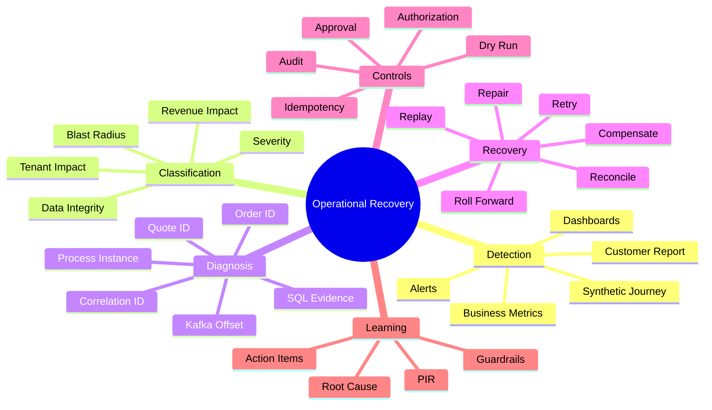
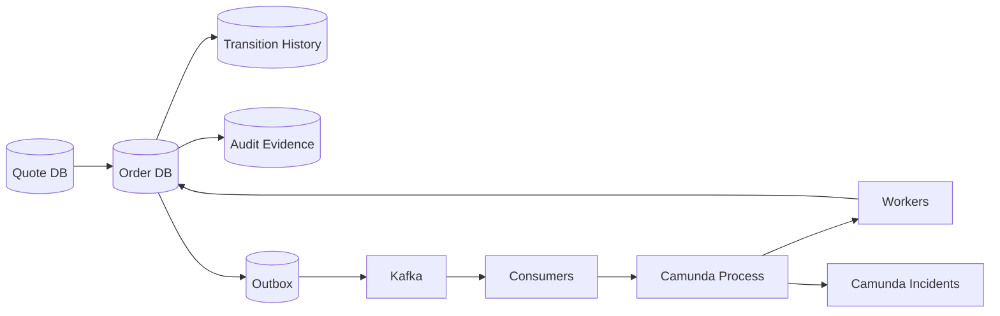
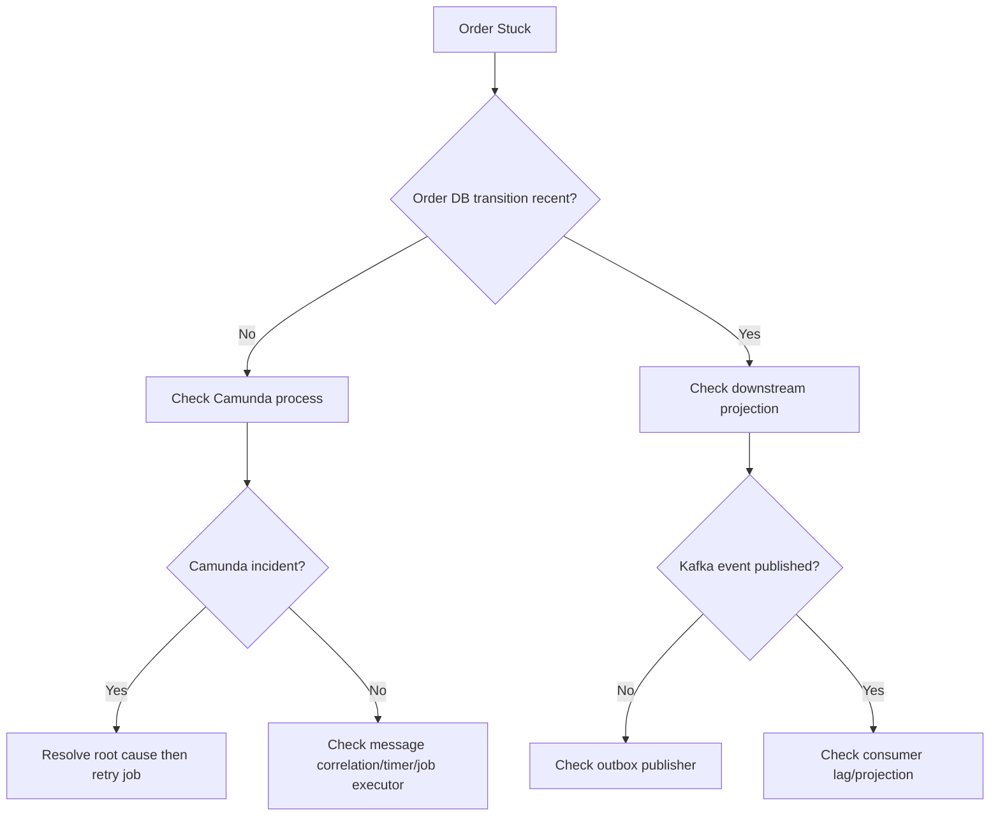
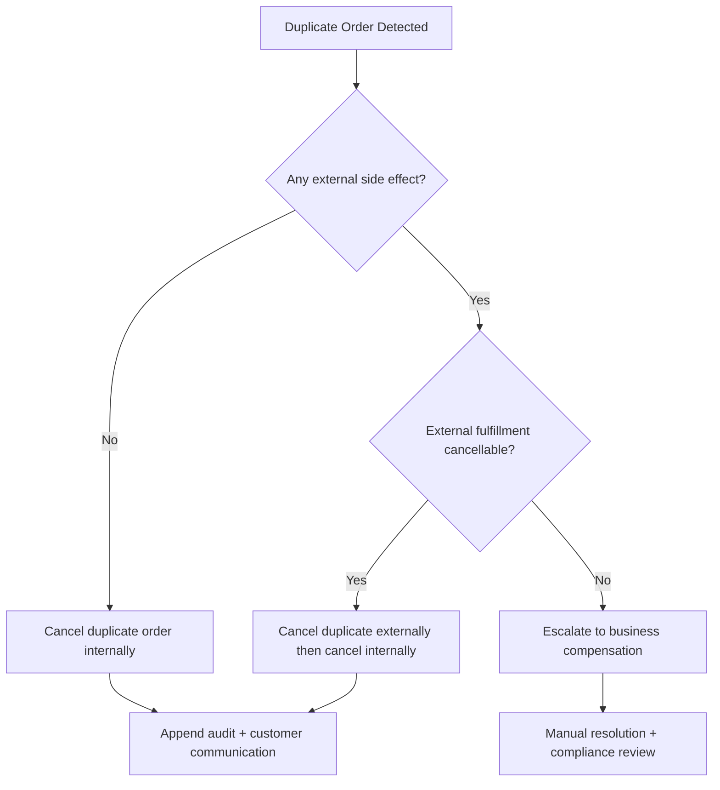
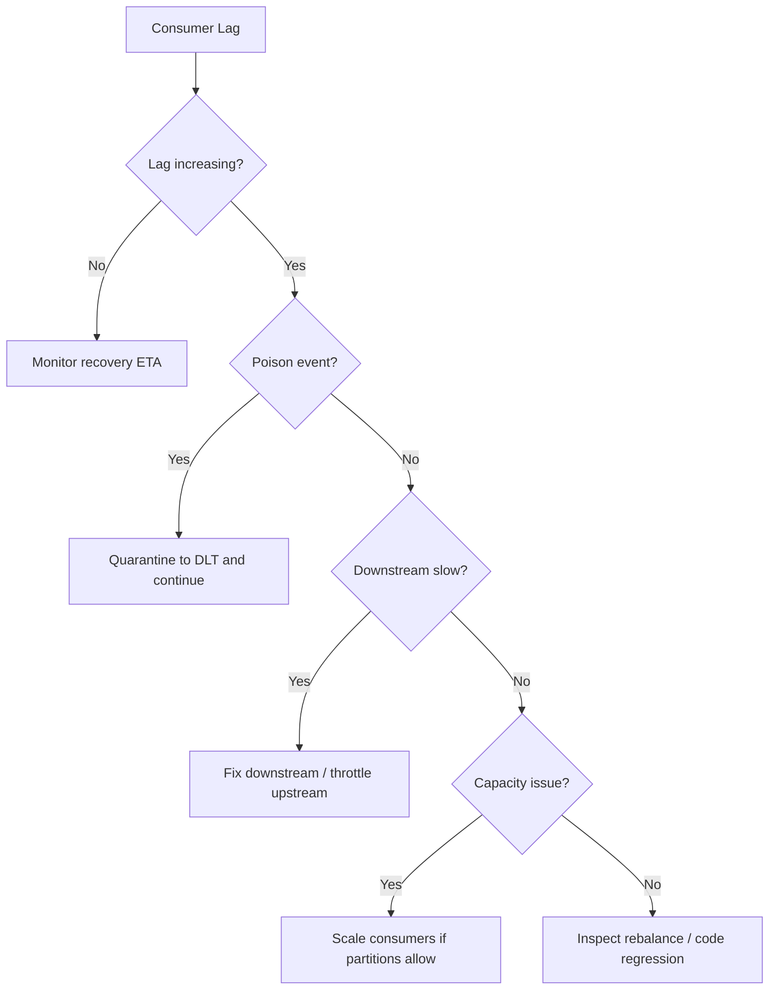

------
title: Learn Java Microservices CPQ/OMS Platform - Part 033
description: Operational runbooks and failure recovery for a Java microservices CPQ and order management platform: incident classification, stuck orders, Camunda incidents, Kafka lag, PostgreSQL recovery, Redis degradation, bad deployment repair, reconciliation, manual repair, and production operations.
series: learn-java-microservices-cpq-oms-platform
seriesTitle: Learn Java Microservices CPQ/OMS Platform
order: 33
partTitle: Operational Runbooks and Failure Recovery
tags:
  - java
  - microservices
  - cpq
  - order-management
  - operations
  - runbook
  - failure-recovery
  - postgresql
  - kafka
  - redis
  - camunda
  - incident-response
  - sre
  - production
  - reliability
date: 2026-07-02
---

# Part 033 — Operational Runbooks and Failure Recovery

Platform CPQ/OMS yang bagus bukan hanya platform yang bisa membuat quote dan order dalam kondisi normal. Platform yang benar-benar production-grade adalah platform yang tetap bisa dijelaskan, dikendalikan, dan dipulihkan ketika sebagian sistem gagal.

Di CPQ/OMS, failure bukan sekadar `500 Internal Server Error`. Failure bisa berupa quote salah harga, approval tidak terkirim, order tersangkut di Camunda, Kafka consumer tertinggal, Redis cache stale, migration setengah jalan, duplicate order, fulfillment vendor timeout, atau operator melakukan repair yang justru melanggar audit trail.

Part ini membangun operating model dan runbook untuk failure recovery. Targetnya adalah membuat engineer mampu menjawab tiga pertanyaan besar:

1. **Apa yang rusak?**
2. **Apa dampaknya terhadap customer, revenue, dan data integrity?**
3. **Bagaimana memulihkannya tanpa membuat state makin tidak konsisten?**

Kita tidak akan mengulang observability dari Part 029 atau resilience pattern dari Part 030. Di sini fokusnya adalah **operational decision-making**, **runbook**, **repair**, **reconciliation**, dan **failure recovery**.

---

## 1. Tujuan Pembelajaran

Setelah menyelesaikan part ini, kita ingin mampu:

1. Mengklasifikasikan incident CPQ/OMS berdasarkan business impact, blast radius, dan recoverability.
2. Mendesain runbook untuk stuck quote, stuck order, failed approval, duplicate order, Kafka lag, Camunda incident, Redis degradation, PostgreSQL lock contention, dan bad deployment.
3. Membedakan retry, replay, repair, reconciliation, rollback, dan compensation.
4. Membuat operational command yang aman, idempotent, authorized, dan auditable.
5. Mendesain repair table, incident table, transition history, dan reconciliation report.
6. Menentukan kapan order boleh diperbaiki otomatis dan kapan wajib human approval.
7. Menangani failure tanpa mengubah audit history secara destruktif.
8. Membuat post-incident review yang menghasilkan perbaikan engineering nyata.

---

## 2. Kaufman Deconstruction: Skill Operasi Production

Menurut pendekatan Kaufman, skill besar perlu dipecah menjadi sub-skill yang bisa dilatih. Untuk operasi CPQ/OMS, sub-skill-nya bukan “hafal command Kubernetes”, melainkan membaca sistem sebagai rangkaian state, side effect, dan evidence.



Minimum effective practice:

1. Ambil satu failure nyata atau simulasi.
2. Cari affected business entity.
3. Klasifikasikan state sekarang.
4. Tentukan recovery action paling kecil yang aman.
5. Jalankan dry-run bila memungkinkan.
6. Catat repair action sebagai event/audit.
7. Tambahkan guardrail agar failure tidak berulang.

---

## 3. Mental Model: System of Record, System of Execution, System of Evidence

Dalam CPQ/OMS, recovery sering kacau karena engineer tidak membedakan tiga jenis sistem:

| Layer | Contoh | Fungsi | Recovery Rule |
|---|---|---|---|
| System of Record | PostgreSQL quote/order DB | Menyimpan state bisnis authoritative | Jangan edit destruktif tanpa audit |
| System of Execution | Camunda runtime, Kafka consumers, workers | Menjalankan proses dan side effect | Boleh retry/restart asal idempotent |
| System of Evidence | audit trail, transition history, event log, document snapshot | Membuktikan kenapa state terjadi | Tidak boleh dihapus untuk “membersihkan” masalah |

Kesalahan umum: memperlakukan Camunda runtime sebagai source of truth order. Untuk platform ini, Camunda adalah **execution coordinator**. Order aggregate tetap source of truth untuk business state.



Recovery harus selalu dimulai dari pertanyaan:

> State bisnis authoritative ada di mana, dan side effect apa saja yang sudah terjadi?

---

## 4. Incident Classification

Tidak semua alert adalah incident. Tidak semua incident perlu page engineer. Tapi di CPQ/OMS, beberapa warning kecil bisa berubah menjadi revenue-impacting failure.

### 4.1 Severity Model

| Severity | Meaning | Example | Response |
|---|---|---|---|
| SEV-1 | Platform-wide critical business flow unavailable or corrupting data | Semua quote acceptance gagal; duplicate order massal | War room, freeze deployment, incident commander |
| SEV-2 | Major tenant or core service degraded | Order orchestration stuck untuk tenant besar | On-call + domain owner |
| SEV-3 | Limited impact, workaround tersedia | Approval notification terlambat | Business-hours response atau low urgency page |
| SEV-4 | Non-urgent operational issue | Dashboard metric missing | Backlog/follow-up |

### 4.2 Business Impact Dimensions

Jangan hanya pakai CPU, memory, atau HTTP 5xx. CPQ/OMS perlu impact dimension berikut:

1. **Revenue impact**: quote tidak bisa diterima, order tidak bisa dicapture, price salah.
2. **Customer impact**: tenant/customer tertentu tidak bisa submit order.
3. **Data integrity impact**: duplicate order, missing transition, stale quote accepted.
4. **Legal/compliance impact**: audit trail hilang, approval evidence tidak lengkap.
5. **Operational impact**: backlog manual work, fulfillment delay.
6. **Blast radius**: single order, single tenant, all tenants, all orders.
7. **Recoverability**: automatic retry, replay, manual repair, data restoration, compensation.

### 4.3 Incident Triage Template

```md
## Incident Triage

- Incident ID:
- Detected at:
- Detected by: alert / synthetic journey / user report / operator
- Severity:
- Affected tenants:
- Affected quote/order IDs:
- First known bad time:
- Last known good time:
- Business capability affected:
- Current customer-visible symptom:
- Suspected technical boundary:
- Data integrity risk:
- Side effects already executed:
- Immediate mitigation:
- Recovery owner:
- Communication owner:
```

---

## 5. Recovery Vocabulary: Retry, Replay, Repair, Reconcile, Compensate

Banyak production failure memburuk karena tim memakai istilah recovery secara longgar.

| Action | Meaning | Safe When | Dangerous When |
|---|---|---|---|
| Retry | Menjalankan kembali operasi yang sama | Operation idempotent dan failure transient | Side effect tidak idempotent |
| Replay | Memproses ulang event/command historis | Consumer idempotent dan state guard kuat | Event schema lama tidak kompatibel |
| Repair | Mengubah state bisnis dengan command khusus | Authorized, audited, validated | Direct SQL update tanpa invariant check |
| Reconcile | Membandingkan source of truth dengan projection/external state | Ada deterministic comparison | Source of truth sendiri corrupt |
| Compensate | Menjalankan aksi bisnis pembalik | Ada business-approved compensation | Aksi asli irreversible atau sudah externally committed |
| Rollback | Mengembalikan deployment/config | Masalah ada di binary/config baru | Schema/data sudah berubah forward-only |
| Roll forward | Deploy fix/migration korektif | Fix jelas dan diuji | Diagnosis belum stabil |

Rule praktis:

> Untuk CPQ/OMS, prefer **roll-forward + repair command + reconciliation** daripada direct rollback database state.

---

## 6. Required Operational Data Model

Runbook hanya efektif jika sistem punya evidence. Minimal platform perlu tabel operasional berikut.

### 6.1 Incident Register

```sql
create table operational_incident (
  incident_id uuid primary key,
  severity text not null,
  status text not null,
  detected_at timestamptz not null,
  detected_by text not null,
  affected_tenant_id uuid,
  affected_entity_type text,
  affected_entity_id uuid,
  summary text not null,
  current_hypothesis text,
  mitigation text,
  resolved_at timestamptz,
  created_by text not null,
  updated_at timestamptz not null default now(),
  check (severity in ('SEV1', 'SEV2', 'SEV3', 'SEV4')),
  check (status in ('OPEN', 'MITIGATED', 'RESOLVED', 'CLOSED'))
);
```

### 6.2 Repair Command Log

```sql
create table repair_command_log (
  repair_id uuid primary key,
  incident_id uuid references operational_incident(incident_id),
  tenant_id uuid not null,
  entity_type text not null,
  entity_id uuid not null,
  command_type text not null,
  dry_run boolean not null,
  requested_by text not null,
  approved_by text,
  reason text not null,
  before_state jsonb not null,
  proposed_change jsonb not null,
  after_state jsonb,
  status text not null,
  executed_at timestamptz,
  created_at timestamptz not null default now(),
  check (status in ('REQUESTED', 'APPROVED', 'REJECTED', 'EXECUTED', 'FAILED'))
);
```

### 6.3 Reconciliation Run

```sql
create table reconciliation_run (
  run_id uuid primary key,
  reconciliation_type text not null,
  tenant_id uuid,
  window_start timestamptz not null,
  window_end timestamptz not null,
  started_at timestamptz not null,
  finished_at timestamptz,
  status text not null,
  checked_count bigint not null default 0,
  mismatch_count bigint not null default 0,
  created_by text not null,
  check (status in ('RUNNING', 'COMPLETED', 'FAILED'))
);

create table reconciliation_mismatch (
  mismatch_id uuid primary key,
  run_id uuid not null references reconciliation_run(run_id),
  entity_type text not null,
  entity_id uuid not null,
  mismatch_type text not null,
  expected_state jsonb not null,
  observed_state jsonb not null,
  suggested_action text,
  status text not null default 'OPEN',
  created_at timestamptz not null default now()
);
```

---

## 7. Universal Runbook Structure

Setiap runbook harus punya struktur seragam agar operator tidak berpikir dari nol saat tekanan tinggi.

```md
# Runbook: <Failure Name>

## Symptoms
- Alert names
- Dashboard signals
- User-visible behavior

## Scope Assessment
- Query affected entities
- Check tenant blast radius
- Check first/last occurrence

## Safety Checks
- Is data integrity at risk?
- Are external side effects already executed?
- Is the operation idempotent?
- Is approval required?

## Immediate Mitigation
- Disable feature flag
- Pause consumer
- Stop scheduler
- Increase worker capacity
- Route to manual queue

## Diagnosis
- Logs
- Metrics
- Traces
- SQL queries
- Kafka offsets
- Camunda incidents

## Recovery
- Preferred path
- Alternative path
- Commands
- Dry-run
- Validation

## Post-Recovery Verification
- Entity state check
- Event check
- External system check
- Customer journey check

## Escalation
- Domain owner
- Platform owner
- Security/compliance owner

## Follow-Up
- Post-incident review
- Permanent fix
- Regression tests
- Alert tuning
```

---

## 8. Runbook: Stuck Order

A stuck order is an order that is non-terminal for longer than expected and has no active forward progress.

### 8.1 Symptoms

1. `orders_stuck_total` meningkat.
2. Order berada di `IN_PROGRESS`, `ORCHESTRATING`, `PARTIALLY_FULFILLED`, atau `PENDING_EXTERNAL` melebihi SLA.
3. Camunda process punya incident atau job retries habis.
4. Kafka consumer lag untuk topic order/fulfillment meningkat.
5. Customer service melaporkan order “tidak bergerak”.

### 8.2 First Query

```sql
select
  o.order_id,
  o.tenant_id,
  o.order_number,
  o.status,
  o.version,
  o.created_at,
  o.updated_at,
  now() - o.updated_at as age_since_update,
  count(ol.order_line_id) as line_count
from sales_order o
join sales_order_line ol on ol.order_id = o.order_id
where o.status in ('CAPTURED', 'ORCHESTRATING', 'IN_PROGRESS', 'PARTIALLY_FULFILLED')
  and o.updated_at < now() - interval '30 minutes'
group by o.order_id
order by age_since_update desc
limit 100;
```

### 8.3 Determine the Stuck Boundary



### 8.4 Safety Checks

Before repair:

1. Is there an external fulfillment request already sent?
2. Was payment/reservation/inventory operation executed?
3. Is order line state internally consistent?
4. Is Camunda process instance still active?
5. Is there a duplicate process instance for same order?
6. Is manual repair allowed by tenant support policy?

### 8.5 Recovery Options

| Situation | Preferred Recovery |
|---|---|
| Camunda job failed due transient downstream timeout | Fix downstream, retry job |
| Camunda job failed due deterministic validation bug | Deploy fix, retry job |
| Outbox event not published | Resume/restart outbox publisher or republish from outbox |
| Event published but consumer lag high | Scale consumers, inspect poison messages |
| Order DB says fulfilled but projection stale | Replay projection event |
| Process instance missing but order captured | Start orchestration via repair command |
| Duplicate process instance | Suspend/terminate duplicate after evidence review |

### 8.6 Safe Repair Command Example

```java
public record ResumeOrderOrchestrationCommand(
    UUID tenantId,
    UUID orderId,
    UUID incidentId,
    String reason,
    boolean dryRun
) {}
```

Handler rules:

1. Load order by `tenant_id + order_id`.
2. Verify order is in resumable state.
3. Verify no active orchestration exists, or existing orchestration is explicitly failed/terminated.
4. Insert repair command log.
5. If dry-run, return proposed action.
6. If execute, start/resume process and append transition history.
7. Publish `OrderOrchestrationRepairRequested` event.

Do not update order status with ad hoc SQL. Repair must go through domain transition logic.

---

## 9. Runbook: Duplicate Order

Duplicate order is one of the highest-risk CPQ/OMS incidents because it can create duplicate fulfillment, billing, and legal exposure.

### 9.1 Symptoms

1. Same quote accepted multiple times.
2. Multiple orders share same `source_quote_id` and acceptance evidence.
3. Customer sees duplicate orders.
4. External fulfillment receives duplicate request.

### 9.2 Detection Query

```sql
select
  tenant_id,
  source_quote_id,
  count(*) as order_count,
  array_agg(order_id order by created_at) as order_ids,
  min(created_at) as first_created_at,
  max(created_at) as last_created_at
from sales_order
where source_quote_id is not null
group by tenant_id, source_quote_id
having count(*) > 1
order by last_created_at desc;
```

If platform was designed correctly, this should be blocked by a unique index:

```sql
create unique index uq_order_source_quote
on sales_order(tenant_id, source_quote_id)
where source_quote_id is not null;
```

### 9.3 Recovery Decision Tree



### 9.4 Repair Rule

The first order is not automatically the valid order. Determine canonical order using:

1. Customer acceptance evidence.
2. Idempotency key.
3. Earliest successful commit.
4. External fulfillment state.
5. Customer-visible communication already sent.
6. Billing/invoice state if any.

Duplicate repair must produce a durable record:

```sql
insert into repair_command_log (
  repair_id,
  incident_id,
  tenant_id,
  entity_type,
  entity_id,
  command_type,
  dry_run,
  requested_by,
  approved_by,
  reason,
  before_state,
  proposed_change,
  status
) values (...);
```

---

## 10. Runbook: Stuck Quote Approval

Approval issues are subtle because the quote may be technically valid but commercially blocked.

### 10.1 Symptoms

1. Quote remains `PENDING_APPROVAL` beyond SLA.
2. Approval task not assigned.
3. Approver cannot see quote.
4. Approval policy version missing or invalid.
5. Camunda timer/escalation did not fire.

### 10.2 Diagnosis Query

```sql
select
  q.quote_id,
  q.tenant_id,
  q.status,
  q.current_version,
  q.updated_at,
  ar.approval_request_id,
  ar.status as approval_status,
  ar.policy_version,
  ar.created_at as approval_created_at,
  ar.due_at,
  now() - ar.due_at as overdue_by
from quote q
join approval_request ar on ar.quote_id = q.quote_id
where q.status = 'PENDING_APPROVAL'
  and ar.status in ('PENDING', 'ESCALATED')
  and ar.due_at < now()
order by ar.due_at asc;
```

### 10.3 Recovery Matrix

| Root Cause | Recovery |
|---|---|
| Approver assignment missing | Re-evaluate assignment with same policy version |
| Policy version deleted/disabled | Restore policy version or repair with approved fallback policy |
| Timer failed | Trigger escalation command |
| Permission issue | Fix authorization mapping, do not bypass approval |
| Quote changed after approval requested | Cancel stale approval and request new approval |
| Approver unavailable | Use delegation/escalation model |

### 10.4 Anti-Pattern

Do not set `quote.status = 'APPROVED'` from SQL because “the manager already approved in Slack”. That loses decision evidence.

Correct repair:

1. Capture external approval evidence as attachment/reference.
2. Create `ManualApprovalEvidenceRecorded` audit event.
3. Execute domain command `ApproveQuoteManually` with reason and approver identity.
4. Transition quote through same invariant path as normal approval.

---

## 11. Runbook: Kafka Consumer Lag

Kafka lag is not always bad. It becomes incident when lag violates business latency or blocks downstream state.

### 11.1 Symptoms

1. Consumer group lag increases continuously.
2. Order projection stale.
3. Camunda correlation consumer is behind.
4. Outbox table grows.
5. Retry/DLT topics grow.

### 11.2 Diagnosis Questions

1. Is lag isolated to one consumer group or all groups?
2. Is lag isolated to one partition?
3. Is one event causing poison-pill behavior?
4. Did a deployment introduce slower processing?
5. Did upstream event volume spike?
6. Are consumers rebalancing frequently?
7. Is PostgreSQL downstream slow?

### 11.3 Recovery Decision Tree



### 11.4 Safe Consumer Pause

Pausing a consumer is acceptable when continuing would corrupt downstream state. But pausing must be explicit and visible.

Operational record:

```md
Consumer paused:
- group:
- topic:
- partitions:
- reason:
- start time:
- owner:
- expected resume condition:
- customer impact:
```

### 11.5 Replay Checklist

Before replaying events:

1. Is consumer idempotent?
2. Is event schema still readable?
3. Are old side effects guarded by inbox/dedup?
4. Is replay limited by tenant/time/entity?
5. Is ordering required?
6. Is downstream projection safe to overwrite?
7. Do we need dry-run comparison first?

---

## 12. Runbook: Outbox Publisher Stuck

Outbox failure creates a dangerous illusion: the database transaction succeeded, but the rest of the system does not know.

### 12.1 Detection Query

```sql
select
  aggregate_type,
  event_type,
  count(*) as pending_count,
  min(created_at) as oldest_pending,
  max(created_at) as newest_pending
from outbox_event
where published_at is null
  and status in ('PENDING', 'FAILED')
group by aggregate_type, event_type
order by oldest_pending;
```

### 12.2 Root Cause Categories

| Category | Signal | Action |
|---|---|---|
| Kafka unavailable | producer errors | Restore Kafka, publisher resumes |
| Serialization bug | same event fails repeatedly | Fix event mapper, republish |
| Bad data | specific event invalid | Repair event payload if allowed, else quarantine |
| Publisher dead | no polling | Restart publisher/deployment |
| Lock contention | claimed but not published | Release stale claim |

### 12.3 Stale Claim Recovery

```sql
update outbox_event
set
  claimed_by = null,
  claimed_at = null,
  status = 'PENDING'
where status = 'PROCESSING'
  and claimed_at < now() - interval '10 minutes'
returning outbox_event_id, aggregate_type, aggregate_id, event_type;
```

Only run after verifying no active publisher instance still owns the claim.

---

## 13. Runbook: Camunda 7 Incidents

In this architecture, Camunda incidents are execution failures that need domain-aware resolution. Do not resolve incident just because you can click “retry”.

### 13.1 Incident Classification

| Incident Type | Example | Recovery |
|---|---|---|
| Transient downstream failure | HTTP 503 from fulfillment | Retry after service recovery |
| Deterministic code bug | null handling error in delegate | Deploy fix then retry |
| Business validation failure | order line invalid | BPMN error/domain repair, not blind retry |
| Missing correlation | event not received | inspect Kafka/outbox/inbox |
| Bad process variable | incompatible schema | repair variable with audit or migrate instance |
| Process model bug | wrong gateway condition | deploy fixed process, migrate/repair instance |

### 13.2 Camunda Incident Runbook

1. Identify process instance by business key.
2. Map process instance to order ID and tenant ID.
3. Read latest order state from Order DB.
4. Inspect failed activity and exception.
5. Classify error: transient, deterministic, business, data, model.
6. Check whether delegate side effect may have partially executed.
7. Fix root cause.
8. Retry only if handler is idempotent.
9. Verify order transition after retry.
10. Record incident resolution note.

### 13.3 Business Key Discipline

Every process instance must have a business key that maps to the domain entity:

```text
tenantId:orderId
```

Never rely solely on Camunda-generated process instance IDs in operational runbooks.

---

## 14. Runbook: PostgreSQL Lock Contention and Slow Queries

Database incidents in CPQ/OMS often manifest as API timeout, Kafka consumer lag, Camunda job failure, or cascading retry storms.

### 14.1 Blocking Query

```sql
select
  blocked.pid as blocked_pid,
  blocked.query as blocked_query,
  blocking.pid as blocking_pid,
  blocking.query as blocking_query,
  now() - blocked.query_start as blocked_duration,
  now() - blocking.query_start as blocking_duration
from pg_catalog.pg_locks blocked_locks
join pg_catalog.pg_stat_activity blocked
  on blocked.pid = blocked_locks.pid
join pg_catalog.pg_locks blocking_locks
  on blocking_locks.locktype = blocked_locks.locktype
 and blocking_locks.database is not distinct from blocked_locks.database
 and blocking_locks.relation is not distinct from blocked_locks.relation
 and blocking_locks.page is not distinct from blocked_locks.page
 and blocking_locks.tuple is not distinct from blocked_locks.tuple
 and blocking_locks.virtualxid is not distinct from blocked_locks.virtualxid
 and blocking_locks.transactionid is not distinct from blocked_locks.transactionid
 and blocking_locks.classid is not distinct from blocked_locks.classid
 and blocking_locks.objid is not distinct from blocked_locks.objid
 and blocking_locks.objsubid is not distinct from blocked_locks.objsubid
 and blocking_locks.pid != blocked_locks.pid
join pg_catalog.pg_stat_activity blocking
  on blocking.pid = blocking_locks.pid
where not blocked_locks.granted;
```

### 14.2 Recovery Actions

| Situation | Action |
|---|---|
| Long idle transaction blocks writes | Terminate session after owner check |
| New query plan regression | Roll forward index/query fix |
| Migration blocking table | Stop migration, assess lock, resume with safer strategy |
| Hot row contention | Reduce concurrent updates, shard operation, change state transition path |
| Vacuum/autovacuum issue | Tune vacuum, reduce long transactions |

### 14.3 Safety Rule

Do not kill database sessions blindly. First determine:

1. Which tenant/entity is affected?
2. Is transaction holding uncommitted business state?
3. Is it a migration session?
4. Is application retry behavior going to stampede after termination?

---

## 15. Runbook: Redis Degradation

Redis in this platform is runtime acceleration, not system of record. That design choice simplifies recovery.

### 15.1 Symptoms

1. Redis latency high.
2. Cache miss ratio spikes.
3. Connection pool exhausted.
4. Hot key detected.
5. Evictions increasing.
6. Rate limiter unavailable.

### 15.2 Recovery Principle

If Redis is degraded:

1. The platform should degrade to PostgreSQL/Kafka/Camunda authoritative path.
2. Cache-dependent optimizations can be disabled.
3. Idempotency must not rely only on Redis.
4. Distributed locks must use fencing token or be avoided.
5. TTL-based runtime sessions need graceful user message.

### 15.3 Recovery Matrix

| Failure | Recovery |
|---|---|
| Cache stale | Invalidate prefix/version, repopulate |
| Hot key | Add request coalescing, partition cache key, reduce TTL churn |
| Eviction storm | Increase memory, adjust TTL, fix cardinality explosion |
| Redis unavailable | Disable optional cache, route to DB path with rate limit |
| Lock key stuck | Use fencing/version check; do not manually delete without checking owner |

---

## 16. Runbook: Bad Deployment

Bad deployment recovery is not always rollback. In distributed systems, rollback can be unsafe if database schema, event schema, or process definition already moved forward.

### 16.1 Deployment Failure Classification

| Failure | Example | Preferred Response |
|---|---|---|
| Binary regression | Null pointer in quote submit | Roll back or roll forward |
| Config regression | Wrong timeout/env var | Restore config |
| Schema regression | Missing index/constraint bug | Roll forward migration |
| Event schema regression | Consumer cannot parse new event | Deploy compatibility fix/bridge |
| BPMN regression | Wrong gateway path | Deploy fixed process definition and migrate/repair active instances |
| Data migration regression | Incorrect backfill | Corrective migration + reconciliation |

### 16.2 Rollback Safety Checklist

Before rollback:

1. Did the new version write data old version cannot read?
2. Did the new version publish events old consumers cannot understand?
3. Did the new version deploy new Camunda process definitions?
4. Did the new version run migrations that cannot be reversed?
5. Did feature flags expose new states?
6. Are there active instances started by new process model?

If any answer is yes, prefer roll-forward or compatibility bridge.

---

## 17. Reconciliation Jobs

Reconciliation is how we find silent failures.

### 17.1 Required Reconciliation Types

| Reconciliation | Purpose |
|---|---|
| Quote vs Approval | Quote pending approval must have active approval request |
| Quote vs Order | Accepted quote should have exactly one order or explicit failure |
| Order vs Camunda | Active order should have active/completed process instance as expected |
| Order vs Outbox | State transition should have event in outbox/published log |
| Kafka vs Projection | Projection should match authoritative aggregate version |
| Order vs Fulfillment | External fulfillment state should match order line state |
| Price Snapshot vs Quote Total | Quote total equals sum of priced line snapshots |
| Audit vs Transition | Every transition has audit/evidence record |

### 17.2 Example: Quote-to-Order Reconciliation

```sql
select
  q.tenant_id,
  q.quote_id,
  q.status,
  q.accepted_at,
  count(o.order_id) as order_count
from quote q
left join sales_order o
  on o.tenant_id = q.tenant_id
 and o.source_quote_id = q.quote_id
where q.status = 'ACCEPTED'
  and q.accepted_at < now() - interval '5 minutes'
group by q.tenant_id, q.quote_id, q.status, q.accepted_at
having count(o.order_id) <> 1;
```

### 17.3 Reconciliation Output

Good reconciliation does not only say “mismatch”. It should produce:

1. entity type
2. entity ID
3. expected state
4. observed state
5. likely cause
6. suggested action
7. safety level
8. whether automatic repair is allowed

---

## 18. Manual Repair API

Manual repair should be an internal privileged API, not a SQL script folder passed around in Slack.

### 18.1 Repair API Shape

```yaml
paths:
  /internal/repairs/order-resume-orchestration:
    post:
      operationId: resumeOrderOrchestrationRepair
      security:
        - serviceAuth: []
      requestBody:
        required: true
        content:
          application/json:
            schema:
              type: object
              required:
                - tenantId
                - orderId
                - incidentId
                - reason
                - dryRun
              properties:
                tenantId:
                  type: string
                  format: uuid
                orderId:
                  type: string
                  format: uuid
                incidentId:
                  type: string
                  format: uuid
                reason:
                  type: string
                  minLength: 20
                dryRun:
                  type: boolean
```

### 18.2 Repair API Rules

1. Internal only.
2. Strong authentication.
3. Fine-grained authorization.
4. Mandatory reason.
5. Mandatory incident link.
6. Dry-run support.
7. Two-person approval for high-risk repair.
8. Audit before and after state.
9. Domain invariant validation.
10. Idempotency key required.

---

## 19. Operational Dashboards

A good dashboard answers questions. It is not a wall of charts.

### 19.1 Executive Operational Dashboard

Shows business health:

1. quote created/submitted/accepted per minute
2. order captured/activated/failed per minute
3. quote-to-order conversion latency
4. stuck orders by tenant
5. approval SLA breach
6. pricing error rate
7. duplicate order count
8. reconciliation mismatch count

### 19.2 Service Owner Dashboard

Shows technical health:

1. HTTP latency/error rate
2. PostgreSQL query latency
3. connection pool usage
4. outbox pending age
5. Kafka consumer lag
6. Camunda incidents
7. Redis latency/miss rate
8. worker retry rate
9. DLT growth

### 19.3 Incident Dashboard

Shows recovery status:

1. open incidents by severity
2. affected tenants
3. active repair commands
4. failed repair attempts
5. unresolved reconciliation mismatches
6. customer-impacting flows disabled

---

## 20. Communication During Incident

Engineering recovery is only one part. CPQ/OMS incidents often affect sales, support, finance, and customer success.

### 20.1 Internal Update Template

```md
Status: Investigating / Mitigating / Recovering / Resolved
Severity:
Started:
Affected capability:
Affected tenants/customers:
Customer impact:
Current hypothesis:
Mitigation applied:
Next update:
Owner:
```

### 20.2 Customer-Facing Principle

Do not expose internal implementation details. Say the capability affected and what customer action is needed.

Bad:

> Camunda job executor failed because Kafka consumer lag caused order worker retries.

Better:

> Some submitted orders are delayed in processing. We have paused affected retries, identified the impacted orders, and are processing them safely. No duplicate orders have been created based on current checks.

---

## 21. Post-Incident Review

Post-incident review is not a blame document. It is a system improvement mechanism.

### 21.1 PIR Template

```md
# Post-Incident Review

## Summary
- What happened?
- Customer/business impact
- Duration
- Severity

## Timeline
- Detection
- Triage
- Mitigation
- Recovery
- Resolution

## Root Cause
- Technical root cause
- Process root cause
- Detection gap
- Prevention gap

## What Worked

## What Did Not Work

## Action Items
| Action | Owner | Due Date | Type | Prevent/Detect/Recover |

## Follow-up Verification
- Test added
- Alert added
- Runbook updated
- Dashboard updated
- Control added
```

### 21.2 Good Action Items

Weak:

> Be more careful with migrations.

Strong:

> Add CI check that prevents destructive migration on tables larger than 1M rows unless migration is marked `expand-contract-reviewed` and includes lock-time estimate.

---

## 22. Failure Drills

Runbooks that are never practiced are fiction.

### 22.1 Required Drills

1. Camunda incident retry drill.
2. Kafka poison event drill.
3. Outbox publisher stuck drill.
4. Duplicate order prevention drill.
5. Redis outage drill.
6. PostgreSQL lock contention drill.
7. Bad deployment rollback/roll-forward drill.
8. Quote approval SLA breach drill.
9. Reconciliation mismatch drill.
10. Manual repair dry-run drill.

### 22.2 Drill Evaluation

After each drill:

1. Was alert triggered?
2. Could operator find affected entity?
3. Was runbook accurate?
4. Was recovery command safe?
5. Was audit evidence complete?
6. Did dashboard show recovery?
7. Did we avoid manual SQL mutation?

---

## 23. Anti-Patterns

### 23.1 SQL Surgery Without Audit

Directly changing status fields bypasses invariants, transition history, event publication, and audit trail.

### 23.2 Retrying Everything

Blind retry can duplicate external side effects and amplify failures.

### 23.3 Treating Camunda as Business Truth

Camunda coordinates process execution. Order DB owns business state.

### 23.4 Deleting Bad Events

Event deletion hides evidence. Prefer quarantine, superseding event, or explicit correction event.

### 23.5 Rebuilding Projection Without Version Awareness

Projection rebuild must respect event order and aggregate version.

### 23.6 Manual Fixes Without Reconciliation

Every repair should be followed by reconciliation to prove state is coherent.

---

## 24. Production Readiness Checklist

Before calling the platform operationally ready:

- [ ] Every core entity has transition history.
- [ ] Every high-risk transition emits outbox event.
- [ ] Outbox has stale claim recovery.
- [ ] Inbox prevents duplicate consumer side effects.
- [ ] Camunda process instances use business key.
- [ ] Camunda incidents are alerted.
- [ ] Kafka consumer lag is alerted by business SLA.
- [ ] DLT has owner and triage process.
- [ ] Redis degradation path is tested.
- [ ] PostgreSQL lock/slow query dashboard exists.
- [ ] Duplicate order detection query is scheduled.
- [ ] Quote-to-order reconciliation exists.
- [ ] Manual repair API requires dry-run, reason, approval, and audit.
- [ ] Runbooks are stored next to service ownership docs.
- [ ] Failure drills are run before go-live.
- [ ] Post-incident review action items are tracked to completion.

---

## 25. Implementation Lab

Build the following for the existing platform:

1. `operational_incident` table.
2. `repair_command_log` table.
3. `reconciliation_run` and `reconciliation_mismatch` tables.
4. Quote-to-order reconciliation job.
5. Stuck order reconciliation job.
6. Internal repair API for `ResumeOrderOrchestration` with dry-run.
7. Outbox stale claim recovery command.
8. Dashboard panels for stuck orders, outbox pending age, Camunda incidents, Kafka lag, and reconciliation mismatch.
9. Runbook markdown files for duplicate order, stuck order, stuck approval, outbox stuck, Kafka lag, Redis outage, and bad deployment.
10. A failure drill where an order is intentionally stuck and recovered through the repair API.

---

## 26. Key Takeaways

1. Production operation is a domain skill, not only infrastructure skill.
2. CPQ/OMS recovery must preserve business evidence.
3. Retry is not recovery unless the operation is idempotent.
4. Camunda incidents require domain-aware resolution.
5. Kafka replay requires schema, ordering, and idempotency discipline.
6. Redis must remain acceleration, not hidden source of truth.
7. Manual repair must be modeled as a governed command, not SQL surgery.
8. Reconciliation is the safety net for silent failure.
9. Every serious incident should improve tests, alerts, runbooks, or architecture.

---

## 27. References

- Camunda 7 operations and incidents: https://docs.camunda.io/docs/8.7/components/best-practices/operations/operating-camunda-c7/
- Apache Kafka operations documentation: https://kafka.apache.org/documentation/
- PostgreSQL monitoring statistics: https://www.postgresql.org/docs/current/monitoring-stats.html
- Redis observability and latency documentation: https://redis.io/docs/latest/operate/oss_and_stack/management/optimization/latency/
- NIST Cybersecurity Framework 2.0: https://www.nist.gov/cyberframework
