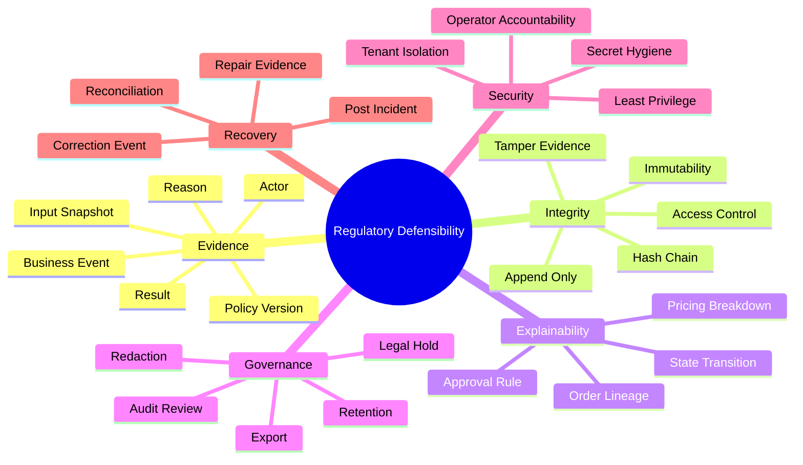
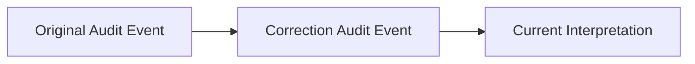
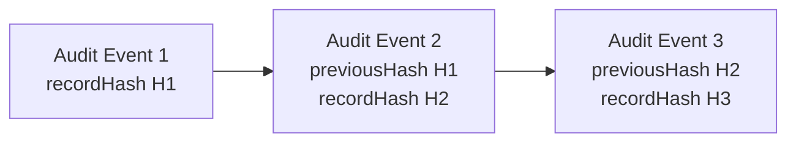
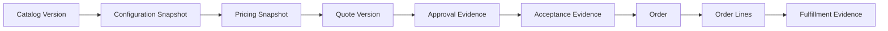

------
title: Learn Java Microservices CPQ/OMS Platform - Part 034
description: Compliance, auditability, and regulatory defensibility for a Java microservices CPQ and order management platform: immutable audit trail, approval evidence, pricing explainability, tenant isolation, data retention, legal hold, operator accountability, security controls, and defensible lifecycle modeling.
series: learn-java-microservices-cpq-oms-platform
seriesTitle: Learn Java Microservices CPQ/OMS Platform
order: 34
partTitle: Compliance, Auditability, and Regulatory Defensibility
tags:
  - java
  - microservices
  - cpq
  - order-management
  - compliance
  - audit
  - regulatory
  - security
  - governance
  - data-retention
  - legal-hold
  - postgresql
  - kafka
  - camunda
  - redis
date: 2026-07-02
---

# Part 034 — Compliance, Auditability, and Regulatory Defensibility

CPQ/OMS bukan hanya sistem transaksi. Ia adalah sistem yang menghasilkan keputusan komersial: harga, diskon, approval, order commitment, cancellation, amendment, dan fulfillment instruction. Keputusan-keputusan itu bisa berdampak pada revenue, customer obligation, contract, audit, compliance, dan dispute resolution.

Platform yang defensible bukan platform yang hanya menyimpan data. Platform yang defensible bisa menjawab:

1. **Apa yang terjadi?**
2. **Kapan terjadi?**
3. **Siapa atau sistem apa yang memicunya?**
4. **Input apa yang dipakai?**
5. **Aturan/policy versi berapa yang dipakai?**
6. **Kenapa keputusan itu valid saat itu?**
7. **Apakah state sekarang bisa direkonstruksi dari evidence?**
8. **Apakah operator repair meninggalkan jejak yang bisa diaudit?**

Part ini membahas compliance, auditability, dan regulatory defensibility sebagai desain sistem, bukan sebagai dokumen tambahan setelah sistem jadi.

> Catatan penting: materi ini adalah panduan engineering, bukan nasihat hukum. Untuk kewajiban hukum spesifik, tetap perlu review legal/compliance organisasi.

---

## 1. Tujuan Pembelajaran

Setelah menyelesaikan part ini, kita ingin mampu:

1. Mendesain audit trail yang immutable, queryable, dan business-readable.
2. Membedakan technical log, business audit, security audit, dan compliance evidence.
3. Menyimpan pricing, configuration, approval, dan order decision evidence secara defensible.
4. Mendesain audit event taxonomy untuk CPQ/OMS.
5. Menentukan data retention, legal hold, redaction, dan archival strategy.
6. Menghubungkan OpenAPI, PostgreSQL, Kafka, Camunda 7, Redis, dan operator tools ke audit model.
7. Mendesain controls untuk privileged action, manual repair, dan override.
8. Membuat compliance review checklist untuk go-live dan audit readiness.

---

## 2. Kaufman Deconstruction: Defensibility Skill Map

Auditability adalah skill lintas domain. Engineer perlu memahami data model, workflow, authorization, evidence, security, dan operasi.



Minimum effective practice:

1. Pilih satu keputusan bisnis penting, misalnya quote approval.
2. Tulis semua input yang memengaruhi keputusan.
3. Simpan snapshot dan policy version.
4. Buat event audit append-only.
5. Pastikan keputusan bisa dijelaskan enam bulan kemudian tanpa menjalankan ulang sistem lama.

---

## 3. Audit Is Not Logging

Technical logging dan audit trail sering dicampur. Ini berbahaya.

| Type | Purpose | Example | Retention | Mutability |
|---|---|---|---|---|
| Application Log | Debugging dan observability | HTTP request failed | Short/medium | Bisa rotate/delete sesuai policy |
| Business Audit | Membuktikan state transition bisnis | Quote approved by manager | Long | Append-only |
| Security Audit | Membuktikan access/control event | Admin exported customer data | Long | Append-only |
| Compliance Evidence | Mendukung audit/legal/regulatory review | Pricing policy version + approval evidence | Long/legal-defined | Controlled retention/legal hold |
| Event Stream | Integration dan replay | `OrderCaptured` | Medium/long sesuai event policy | Append-only secara log, tapi bukan audit lengkap |

Rule:

> Jika data dibutuhkan untuk menjawab sengketa bisnis, jangan hanya simpan di log teknis.

---

## 4. Defensibility Principles

### 4.1 Append-Only Evidence

Audit event tidak boleh di-update untuk “memperbaiki” history. Jika salah, buat correction event.



### 4.2 Snapshot Over Recalculation

Untuk quote/pricing, jangan bergantung pada recalculation dari catalog saat ini. Catalog, price book, discount policy, tax placeholder, and approval rules bisa berubah.

Simpan:

1. product snapshot
2. configuration snapshot
3. price book version
4. pricing input
5. pricing output breakdown
6. discount policy version
7. approval signal
8. final quote document version

### 4.3 Policy Versioning

Keputusan harus merekam versi policy yang digunakan.

Example:

```json
{
  "decisionType": "DISCOUNT_APPROVAL_REQUIRED",
  "policyId": "discount-approval-policy",
  "policyVersion": 17,
  "input": {
    "maxDiscountPercent": 18.5,
    "dealValue": "125000.00",
    "currency": "USD",
    "customerSegment": "ENTERPRISE"
  },
  "result": {
    "approvalRequired": true,
    "approvalLevel": "REGIONAL_FINANCE_DIRECTOR"
  }
}
```

### 4.4 Actor Accountability

Every meaningful action must identify actor type:

| Actor Type | Example |
|---|---|
| Human | sales rep submits quote |
| Service | pricing service recalculates quote |
| Workflow | Camunda timer escalates approval |
| Operator | SRE repairs stuck order |
| External System | fulfillment vendor confirms activation |

Actor identity should include subject, tenant, roles/scopes, authentication method, and delegation context.

### 4.5 Least Privilege for Evidence Access

Audit data often contains sensitive commercial and personal data. Audit access must itself be audited.

---

## 5. Audit Event Taxonomy

Audit events should be business-readable. Avoid raw class names as event names.

### 5.1 CPQ Audit Events

| Event | Meaning |
|---|---|
| `ProductOfferPublished` | Offer became available in catalog version |
| `ConfigurationStarted` | User started configuration session |
| `ConfigurationValidated` | Configuration evaluated and result recorded |
| `ConfigurationFinalized` | Immutable configuration snapshot created |
| `PriceCalculated` | Pricing result generated from inputs |
| `DiscountApplied` | Discount applied with rule/source |
| `QuoteCreated` | Quote aggregate created |
| `QuoteSubmitted` | Quote submitted for approval/acceptance |
| `ApprovalRequested` | Approval process started |
| `ApprovalEscalated` | SLA/delegation escalation occurred |
| `QuoteApproved` | Quote approved by authorized actor |
| `QuoteRejected` | Quote rejected with reason |
| `QuoteAccepted` | Customer accepted quote |
| `QuoteExpired` | Quote expired automatically |

### 5.2 OMS Audit Events

| Event | Meaning |
|---|---|
| `OrderCaptured` | Order created from accepted quote |
| `OrderNormalized` | Order lines normalized and dependency graph created |
| `OrderOrchestrationStarted` | BPMN process started |
| `OrderLineSubmittedToFulfillment` | External fulfillment requested |
| `OrderLineFulfilled` | Line completed |
| `OrderPartiallyFulfilled` | Some lines completed |
| `OrderFulfilled` | Whole order completed |
| `OrderFailed` | Order reached failure state |
| `OrderCancelled` | Order cancelled |
| `OrderRepairRequested` | Operator requested repair |
| `OrderRepairExecuted` | Repair command executed |

### 5.3 Security/Operator Audit Events

| Event | Meaning |
|---|---|
| `PrivilegedAccessGranted` | Temporary elevated access granted |
| `PrivilegedActionExecuted` | Admin/operator action performed |
| `RepairDryRunExecuted` | Repair dry-run evaluated |
| `RepairApproved` | High-risk repair approved |
| `DataExportRequested` | Export of sensitive data requested |
| `DataExportCompleted` | Export produced |
| `AuditRecordViewed` | Sensitive audit record viewed |
| `TenantScopeChanged` | Actor switched tenant/admin scope |

---

## 6. Canonical Audit Event Schema

```json
{
  "auditEventId": "uuid",
  "tenantId": "uuid",
  "occurredAt": "2026-07-02T10:15:30Z",
  "recordedAt": "2026-07-02T10:15:31Z",
  "eventType": "QuoteApproved",
  "entityType": "QUOTE",
  "entityId": "uuid",
  "entityVersion": 12,
  "correlationId": "string",
  "causationId": "string",
  "actor": {
    "actorType": "HUMAN",
    "subject": "user-123",
    "displayName": "A. Manager",
    "tenantId": "uuid",
    "roles": ["QUOTE_APPROVER"],
    "authMethod": "OIDC",
    "delegatedBy": null
  },
  "reason": "Approved within regional discount threshold",
  "beforeState": {
    "status": "PENDING_APPROVAL"
  },
  "afterState": {
    "status": "APPROVED"
  },
  "decisionEvidence": {
    "policyId": "discount-approval-policy",
    "policyVersion": 17,
    "inputHash": "sha256:...",
    "resultHash": "sha256:..."
  },
  "dataClassification": ["COMMERCIAL_CONFIDENTIAL"],
  "retentionClass": "CONTRACT_EVIDENCE",
  "previousHash": "sha256:...",
  "recordHash": "sha256:..."
}
```

Important fields:

| Field | Purpose |
|---|---|
| `occurredAt` | Business time of event |
| `recordedAt` | Time audit record persisted |
| `correlationId` | Trace across API/process/event |
| `causationId` | Direct parent command/event |
| `entityVersion` | State version after/before event |
| `reason` | Human-readable explanation |
| `decisionEvidence` | Policy/input/result proof |
| `previousHash` | Tamper-evident chain support |
| `recordHash` | Integrity check |

---

## 7. PostgreSQL Audit Store

### 7.1 Table Design

```sql
create table audit_event (
  audit_event_id uuid primary key,
  tenant_id uuid not null,
  occurred_at timestamptz not null,
  recorded_at timestamptz not null default now(),
  event_type text not null,
  entity_type text not null,
  entity_id uuid not null,
  entity_version bigint,
  correlation_id text,
  causation_id text,
  actor jsonb not null,
  reason text,
  before_state jsonb,
  after_state jsonb,
  decision_evidence jsonb,
  data_classification text[] not null default '{}',
  retention_class text not null,
  previous_hash text,
  record_hash text not null,
  schema_version integer not null,
  created_at timestamptz not null default now()
);

create index ix_audit_entity
on audit_event(tenant_id, entity_type, entity_id, occurred_at desc);

create index ix_audit_event_type_time
on audit_event(event_type, occurred_at desc);

create index ix_audit_correlation
on audit_event(correlation_id)
where correlation_id is not null;
```

### 7.2 Append-Only Guard

Database permissions should prevent normal application users from updating/deleting audit rows. At the application layer, expose only insert and query.

Optional trigger guard:

```sql
create or replace function prevent_audit_mutation()
returns trigger as $$
begin
  raise exception 'audit_event is append-only';
end;
$$ language plpgsql;

create trigger audit_event_no_update
before update or delete on audit_event
for each row execute function prevent_audit_mutation();
```

For retention deletion, use a separate controlled archival/purge procedure with authorization, legal hold check, and audit of purge metadata.

---

## 8. Hash Chain and Tamper Evidence

Hash chain is not a replacement for access control. It is a tamper-evidence mechanism.



Hash input must be canonicalized. Otherwise formatting differences produce false mismatch.

Example canonical hash input:

```java
public record AuditHashInput(
    UUID tenantId,
    Instant occurredAt,
    String eventType,
    String entityType,
    UUID entityId,
    Long entityVersion,
    JsonNode actor,
    JsonNode beforeState,
    JsonNode afterState,
    JsonNode decisionEvidence,
    String previousHash
) {}
```

Hash chain scope options:

| Scope | Pros | Cons |
|---|---|---|
| Global | Strong simple sequence | Bottleneck, multi-tenant coupling |
| Tenant | Good tenant isolation | More chains to verify |
| Entity | Easy reconstruction | Does not prove global ordering |
| Daily batch Merkle root | Scalable verification | More complex tooling |

Recommended for this platform:

1. Entity-level chain for lifecycle reconstruction.
2. Tenant/day Merkle root for tamper evidence batch verification.
3. Periodic export of root hashes to separate storage.

---

## 9. Pricing Explainability

Pricing is a dispute magnet. The system must explain why a price was produced.

### 9.1 Required Evidence

For every finalized quote price:

1. price book ID and version
2. product offer snapshot
3. configuration snapshot
4. quantity
5. charge type
6. base price
7. discount rules applied
8. manual discount actor/reason
9. rounding rules
10. currency
11. tax boundary/placeholder
12. total calculation
13. approval signals emitted

### 9.2 Pricing Breakdown Example

```json
{
  "lineId": "line-1",
  "offerCode": "FIBER_1G",
  "chargeType": "RECURRING",
  "currency": "USD",
  "quantity": 1,
  "baseAmount": "100.00",
  "adjustments": [
    {
      "type": "CONTRACT_DISCOUNT",
      "ruleId": "enterprise-contract-discount",
      "ruleVersion": 5,
      "amount": "-10.00"
    },
    {
      "type": "MANUAL_DISCOUNT",
      "requestedBy": "sales-123",
      "approvedBy": "manager-456",
      "amount": "-5.00",
      "reason": "Competitive match"
    }
  ],
  "netAmount": "85.00",
  "roundingMode": "HALF_UP",
  "calculationHash": "sha256:..."
}
```

### 9.3 Defensible Pricing Rule

Never answer price disputes by recalculating with current catalog data. Answer with the pricing snapshot attached to the quote version that customer accepted.

---

## 10. Approval Evidence

Approval is not just a status. It is a decision with authority, input, policy, and reason.

### 10.1 Approval Evidence Model

```sql
create table approval_decision_evidence (
  evidence_id uuid primary key,
  tenant_id uuid not null,
  approval_request_id uuid not null,
  quote_id uuid not null,
  policy_id text not null,
  policy_version integer not null,
  decision text not null,
  decided_by text not null,
  decided_at timestamptz not null,
  delegated_by text,
  reason text,
  input_snapshot jsonb not null,
  decision_snapshot jsonb not null,
  attachment_ref text,
  hash text not null,
  created_at timestamptz not null default now(),
  check (decision in ('APPROVED', 'REJECTED', 'ESCALATED', 'OVERRIDDEN'))
);
```

### 10.2 Required Approval Questions

Can we prove:

1. who approved?
2. what authority they had at that time?
3. what quote version they approved?
4. what discount/risk signals they saw?
5. whether approval was delegated?
6. whether approval happened before customer acceptance?
7. whether quote changed after approval?

If not, the approval system is not defensible.

---

## 11. Quote and Order Lineage

A customer order must be traceable back to accepted quote, pricing, configuration, catalog, and approval.



### 11.1 Lineage Query Shape

```sql
select
  o.order_id,
  o.order_number,
  q.quote_id,
  qv.quote_version_id,
  qv.configuration_snapshot_id,
  qv.pricing_snapshot_id,
  ae.evidence_id as approval_evidence_id,
  o.acceptance_evidence_id
from sales_order o
join quote q on q.quote_id = o.source_quote_id
join quote_version qv on qv.quote_id = q.quote_id and qv.version = o.source_quote_version
left join approval_decision_evidence ae on ae.quote_id = q.quote_id
where o.tenant_id = :tenantId
  and o.order_id = :orderId;
```

---

## 12. Data Classification

Not all data has same sensitivity.

| Classification | Examples | Controls |
|---|---|---|
| Public | Public product marketing name | Normal access |
| Internal | internal product code | authenticated internal access |
| Commercial Confidential | price book, discount, quote total | tenant + role + audit |
| Personal Data | contact name, email, address | minimization, masking, retention |
| Security Sensitive | tokens, secrets, privileged audit | restricted access, no logs |
| Legal/Contract Evidence | accepted quote, approval evidence | retention, legal hold, export controls |

Each schema should declare data classification for sensitive fields. This affects logging, audit, export, retention, and masking.

---

## 13. PII and Data Minimization

CPQ/OMS often stores customer contacts, billing contacts, shipping addresses, and sales notes. Do not copy these fields into every event and log.

### 13.1 Minimization Rules

1. Store personal data only where needed.
2. Use references in events when full data is not required.
3. Avoid PII in Kafka event headers.
4. Avoid PII in correlation IDs.
5. Mask PII in application logs.
6. Separate operational metrics from personal identifiers.
7. Tokenize or hash where lookup use case allows.

### 13.2 Bad Event

```json
{
  "eventType": "OrderCaptured",
  "customerEmail": "person@example.com",
  "customerPhone": "+123456789",
  "shippingAddress": "..."
}
```

### 13.3 Better Event

```json
{
  "eventType": "OrderCaptured",
  "tenantId": "uuid",
  "orderId": "uuid",
  "customerAccountId": "uuid",
  "containsPersonalData": false
}
```

Downstream service that needs PII should call the owning service with proper authorization.

---

## 14. Retention and Legal Hold

Retention is not deletion whenever convenient. It is a policy-driven lifecycle.

### 14.1 Retention Classes

| Retention Class | Examples | Policy |
|---|---|---|
| Operational Telemetry | logs/traces/metrics | short/medium retention |
| Business Transaction | quote/order state | long retention |
| Contract Evidence | accepted quote, order commitment | legal/business retention |
| Security Audit | admin access, data export | security/compliance retention |
| Temporary Runtime | Redis session/cache | short TTL |
| Derived Projection | read models | rebuildable, shorter retention possible |

### 14.2 Legal Hold

Legal hold overrides normal deletion/retention purge.

```sql
create table legal_hold (
  legal_hold_id uuid primary key,
  tenant_id uuid not null,
  entity_type text not null,
  entity_id uuid not null,
  reason text not null,
  requested_by text not null,
  approved_by text not null,
  started_at timestamptz not null,
  ended_at timestamptz,
  status text not null,
  created_at timestamptz not null default now(),
  check (status in ('ACTIVE', 'RELEASED'))
);
```

Purge job must check legal hold:

```sql
select 1
from legal_hold
where tenant_id = :tenantId
  and entity_type = :entityType
  and entity_id = :entityId
  and status = 'ACTIVE';
```

---

## 15. Redaction and Erasure

Some regimes may require deletion or anonymization of personal data, but business evidence may need to remain. Design for field-level redaction.

### 15.1 Redaction Event

```json
{
  "eventType": "PersonalDataRedacted",
  "entityType": "CUSTOMER_CONTACT",
  "entityId": "uuid",
  "fieldsRedacted": ["email", "phone"],
  "reason": "RETENTION_POLICY",
  "redactedBy": "system-retention-job",
  "occurredAt": "2026-07-02T10:00:00Z"
}
```

### 15.2 Redaction Rules

1. Do not delete business transaction history if legal policy requires retention.
2. Replace personal fields with redaction markers.
3. Preserve event existence and business meaning.
4. Audit the redaction itself.
5. Ensure search indexes and projections are also redacted.
6. Propagate redaction to downstream systems if needed.

---

## 16. Kafka and Audit

Kafka is excellent for event distribution, but not automatically sufficient for audit evidence.

### 16.1 Kafka Event vs Audit Event

| Aspect | Kafka Domain Event | Audit Event |
|---|---|---|
| Primary purpose | Integration/reaction | Evidence/proof |
| Consumer | Services/projections | Audit/compliance queries |
| Payload | Minimal business event | Rich evidence/context |
| Retention | Operational/event policy | Compliance retention |
| Mutation | Append log, topic retention | Append-only audit store |
| Query | By offset/topic | By entity/actor/time/type |

Recommended pattern:

1. Domain state transition writes audit event and outbox in same transaction.
2. Outbox publishes domain event to Kafka.
3. Audit event stays in audit store.
4. Audit export can publish separate controlled audit stream if needed.

---

## 17. Camunda 7 and Audit

Camunda history is useful, but should not be the only audit source.

### 17.1 What Camunda History Is Good For

1. Process instance execution timeline.
2. Task assignment/completion.
3. Activity duration.
4. Incident/debugging support.
5. Operational process review.

### 17.2 What Business Audit Must Own

1. Quote approval decision evidence.
2. Order state transition evidence.
3. Manual repair evidence.
4. Pricing explanation.
5. Customer acceptance evidence.
6. Business reason for override/cancellation.

Rule:

> Camunda history supports operational traceability. Business audit store supports defensibility.

---

## 18. Redis and Compliance

Redis should not hold compliance-critical evidence because it is usually TTL-driven, memory-oriented, and operationally optimized.

Acceptable Redis data:

1. idempotency cache backed by PostgreSQL
2. pricing cache derived from versioned price book
3. configuration session draft before finalization
4. rate limiter counters
5. short-lived lock/fencing coordination

Unacceptable Redis-only data:

1. approval decision
2. accepted quote evidence
3. order transition evidence
4. manual repair reason
5. legal hold
6. audit trail

---

## 19. Privileged Actions and Operator Accountability

Operator tools are part of the regulated surface.

### 19.1 Privileged Action Controls

| Control | Purpose |
|---|---|
| Strong authentication | Know who acted |
| Just-in-time access | Avoid permanent broad admin power |
| Scope limitation | Tenant/entity/action-specific access |
| Reason required | Human explanation |
| Approval required | Four-eyes control for high-risk action |
| Dry-run | Preview effect |
| Audit before/after | Evidence |
| Replay-safe command | Avoid duplicate side effect |
| Expiring access | Reduce standing privilege |

### 19.2 Operator Command Example

```java
public record OperatorActionContext(
    String subject,
    UUID tenantId,
    Set<String> roles,
    Set<String> scopes,
    String reason,
    UUID incidentId,
    boolean breakGlass,
    Instant accessExpiresAt
) {}
```

Every repair command should require `OperatorActionContext`.

---

## 20. Break-Glass Access

Break-glass access is emergency access that bypasses normal workflow but never bypasses audit.

### 20.1 Break-Glass Rules

1. Time-limited.
2. Incident-linked.
3. Requires explicit reason.
4. Alerts security/compliance owner.
5. All actions recorded.
6. Post-use review required.
7. Not usable for routine support.
8. Does not bypass tenant isolation.

### 20.2 Break-Glass Audit Event

```json
{
  "eventType": "BreakGlassAccessUsed",
  "actor": {
    "subject": "sre-123",
    "actorType": "OPERATOR"
  },
  "incidentId": "uuid",
  "tenantId": "uuid",
  "reason": "Restore stuck high-value order during SEV-2 incident",
  "accessWindow": {
    "start": "2026-07-02T10:00:00Z",
    "end": "2026-07-02T11:00:00Z"
  }
}
```

---

## 21. OpenAPI and Compliance Controls

OpenAPI can encode compliance-relevant API expectations.

### 21.1 Required API Metadata

For sensitive operations:

1. security scheme
2. required scope
3. idempotency requirement
4. audit behavior
5. data classification
6. rate limit class
7. tenant scoping rule
8. error model

Example extension:

```yaml
paths:
  /quotes/{quoteId}/approve:
    post:
      operationId: approveQuote
      x-audit-event: QuoteApproved
      x-data-classification:
        - COMMERCIAL_CONFIDENTIAL
      x-required-scopes:
        - quote.approve
      x-idempotency-required: true
      x-tenant-scoped: true
```

These extensions can feed lint rules and review automation.

---

## 22. Database Controls

### 22.1 Tenant Isolation

All compliance-sensitive tables need tenant scoping unless truly global reference data.

```sql
create index ix_audit_tenant_time
on audit_event(tenant_id, occurred_at desc);
```

### 22.2 Row-Level Security Option

PostgreSQL Row-Level Security can be used as defense-in-depth, but it does not replace application authorization. It also requires careful testing with connection pooling and service accounts.

### 22.3 Database Audit Extension

Database-level audit logging can capture privileged database access, but it does not replace business audit. It answers “who touched database data”, not “why quote was approved”.

---

## 23. Compliance Evidence Export

Auditors and internal investigators need export capability. Export itself is sensitive.

### 23.1 Export Requirements

1. Scope by tenant, entity, time range, event type.
2. Require privileged scope.
3. Require reason.
4. Record export audit event.
5. Include schema version.
6. Include hash/checksum manifest.
7. Redact personal data based on requester purpose.
8. Respect legal hold and retention policy.

### 23.2 Export Manifest

```json
{
  "exportId": "uuid",
  "tenantId": "uuid",
  "requestedBy": "compliance-user-1",
  "reason": "Quarterly approval audit",
  "timeRange": {
    "from": "2026-04-01T00:00:00Z",
    "to": "2026-06-30T23:59:59Z"
  },
  "recordCount": 12045,
  "schemaVersion": 3,
  "exportHash": "sha256:...",
  "createdAt": "2026-07-02T10:00:00Z"
}
```

---

## 24. Audit Query Use Cases

### 24.1 Why Was This Quote Approved?

```sql
select
  occurred_at,
  actor,
  reason,
  decision_evidence,
  before_state,
  after_state
from audit_event
where tenant_id = :tenantId
  and entity_type = 'QUOTE'
  and entity_id = :quoteId
  and event_type in ('QuoteSubmitted', 'ApprovalRequested', 'QuoteApproved', 'QuoteRejected')
order by occurred_at;
```

### 24.2 Who Used Break-Glass Last Month?

```sql
select
  occurred_at,
  actor ->> 'subject' as operator,
  tenant_id,
  reason,
  correlation_id
from audit_event
where event_type = 'BreakGlassAccessUsed'
  and occurred_at >= date_trunc('month', now()) - interval '1 month'
  and occurred_at < date_trunc('month', now())
order by occurred_at desc;
```

### 24.3 Which Orders Were Repaired?

```sql
select
  occurred_at,
  tenant_id,
  entity_id as order_id,
  actor,
  reason,
  before_state,
  after_state
from audit_event
where event_type in ('OrderRepairRequested', 'OrderRepairExecuted')
order by occurred_at desc;
```

---

## 25. Security Framework Mapping

A practical compliance design should map controls to recognized frameworks without letting framework language dominate engineering.

| Control Area | CPQ/OMS Implementation |
|---|---|
| Govern | ownership, policies, risk classification, approval authority |
| Identify | data classification, asset inventory, service ownership |
| Protect | authn/authz, tenant isolation, encryption, secrets, least privilege |
| Detect | audit queries, anomaly alerts, privileged action monitoring |
| Respond | incident runbooks, repair workflow, communication process |
| Recover | reconciliation, replay, backup restore, corrective migration |

This maps well to a modern cybersecurity framework view while keeping the implementation concrete.

---

## 26. Compliance Testing

Compliance controls need tests.

### 26.1 Test Types

| Test | Example |
|---|---|
| Audit emission test | approving quote inserts `QuoteApproved` audit event |
| Authorization negative test | sales rep cannot approve own high-discount quote |
| Tenant isolation test | tenant A cannot read tenant B audit |
| Redaction test | PII removed from projection and export |
| Retention test | purge skips legal hold |
| Repair test | repair command requires reason and incident |
| Hash verification test | audit record hash detects mutation |
| Export test | export creates manifest and export audit event |

### 26.2 Example JUnit Test Shape

```java
@Test
void approvingQuoteWritesDefensibleAuditEvent() {
    var command = new ApproveQuoteCommand(
        tenantId,
        quoteId,
        approverContext,
        "Approved within regional authority"
    );

    quoteService.approve(command);

    var events = auditRepository.findByEntity(tenantId, "QUOTE", quoteId);

    assertThat(events)
        .anySatisfy(event -> {
            assertThat(event.eventType()).isEqualTo("QuoteApproved");
            assertThat(event.actor().subject()).isEqualTo(approverContext.subject());
            assertThat(event.reason()).isNotBlank();
            assertThat(event.decisionEvidence().policyVersion()).isNotNull();
            assertThat(event.recordHash()).startsWith("sha256:");
        });
}
```

---

## 27. Compliance Review Checklist

Before production go-live:

- [ ] Every high-value business transition has audit event.
- [ ] Audit store is append-only for application roles.
- [ ] Audit events include actor, reason, entity, version, time, correlation, and evidence.
- [ ] Pricing snapshot can explain accepted quote price.
- [ ] Approval evidence records policy version and approver authority.
- [ ] Quote-to-order lineage is queryable.
- [ ] Manual repair is controlled by privileged API, not SQL scripts.
- [ ] Break-glass access is time-bound and audited.
- [ ] Tenant isolation tests cover audit queries.
- [ ] PII is classified and minimized in events/logs.
- [ ] Retention classes are defined.
- [ ] Legal hold overrides purge.
- [ ] Redaction is auditable.
- [ ] Compliance export has manifest and audit event.
- [ ] Redis stores no compliance-critical evidence.
- [ ] Camunda history is not sole business audit source.
- [ ] Kafka events are not treated as complete audit evidence unless designed as such.
- [ ] Privileged database access is monitored.
- [ ] Audit integrity verification job exists.
- [ ] Compliance tests run in CI.

---

## 28. Implementation Lab

Add the following to the platform:

1. `audit_event` table with append-only trigger.
2. Audit event writer library that runs inside same transaction as aggregate state transition.
3. Hashing utility with canonical JSON serialization.
4. `QuoteApproved`, `PriceCalculated`, `OrderCaptured`, and `OrderRepairExecuted` audit events.
5. Pricing snapshot with calculation breakdown and hash.
6. Approval decision evidence table.
7. Quote-to-order lineage query/API.
8. Legal hold table and purge guard.
9. Export manifest model.
10. Compliance export endpoint for a single quote/order lineage.
11. Tenant isolation negative tests.
12. Hash verification job.
13. Break-glass audit event.
14. Manual repair audit integration.

---

## 29. Anti-Patterns

### 29.1 “We Have Logs, So We Have Audit”

Logs are often incomplete, short-retention, noisy, and technical. Business audit must be explicit.

### 29.2 Recalculating Old Quotes

Recalculating old quote price with current catalog/policy is not defensible.

### 29.3 Storing Approval as Boolean

`approved = true` is not evidence. Store who, why, what authority, what input, what policy version, and when.

### 29.4 Operator SQL Fixes

SQL fixes without repair command and audit trail create invisible risk.

### 29.5 Kafka as Audit by Accident

Kafka event retention, payload, and query model may not satisfy audit needs unless intentionally designed.

### 29.6 PII Everywhere

Copying personal data into every event, log, and projection multiplies compliance burden.

### 29.7 Legal Hold as Spreadsheet

Legal hold must be enforced by system logic, not remembered manually.

---

## 30. Key Takeaways

1. Regulatory defensibility is an architecture property.
2. Audit events are not the same as logs.
3. CPQ/OMS must preserve pricing, approval, acceptance, order, and repair evidence.
4. Snapshot beats recalculation for historical commercial decisions.
5. Policy versioning is mandatory for explainable decisions.
6. Operator actions must be controlled, scoped, reasoned, approved when needed, and audited.
7. Retention, redaction, and legal hold must be implemented as system behavior.
8. Kafka, Camunda, and Redis each have audit-adjacent roles, but none automatically replaces a business audit store.
9. Compliance controls should be tested like functional requirements.
10. A top-tier engineer designs systems that can survive not only load and failure, but also scrutiny.

---

## 31. References

- NIST Cybersecurity Framework 2.0: https://www.nist.gov/cyberframework
- OWASP API Security Top 10 2023: https://owasp.org/API-Security/editions/2023/en/0x11-t10/
- PostgreSQL Row Security Policies: https://www.postgresql.org/docs/current/ddl-rowsecurity.html
- PostgreSQL Audit Extension: https://pgaudit.org/
- Camunda 7 history and process engine documentation: https://docs.camunda.org/manual/latest/
- OpenAPI Specification: https://spec.openapis.org/oas/latest.html
