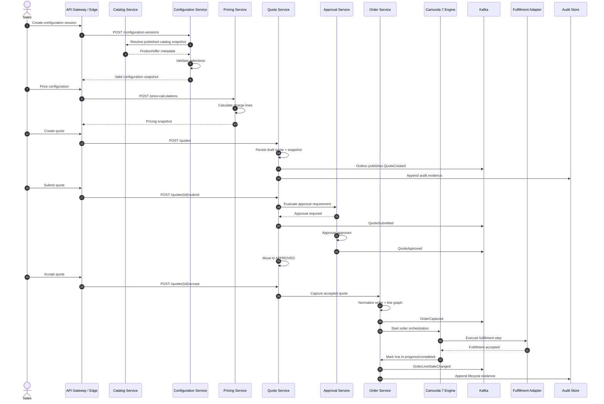
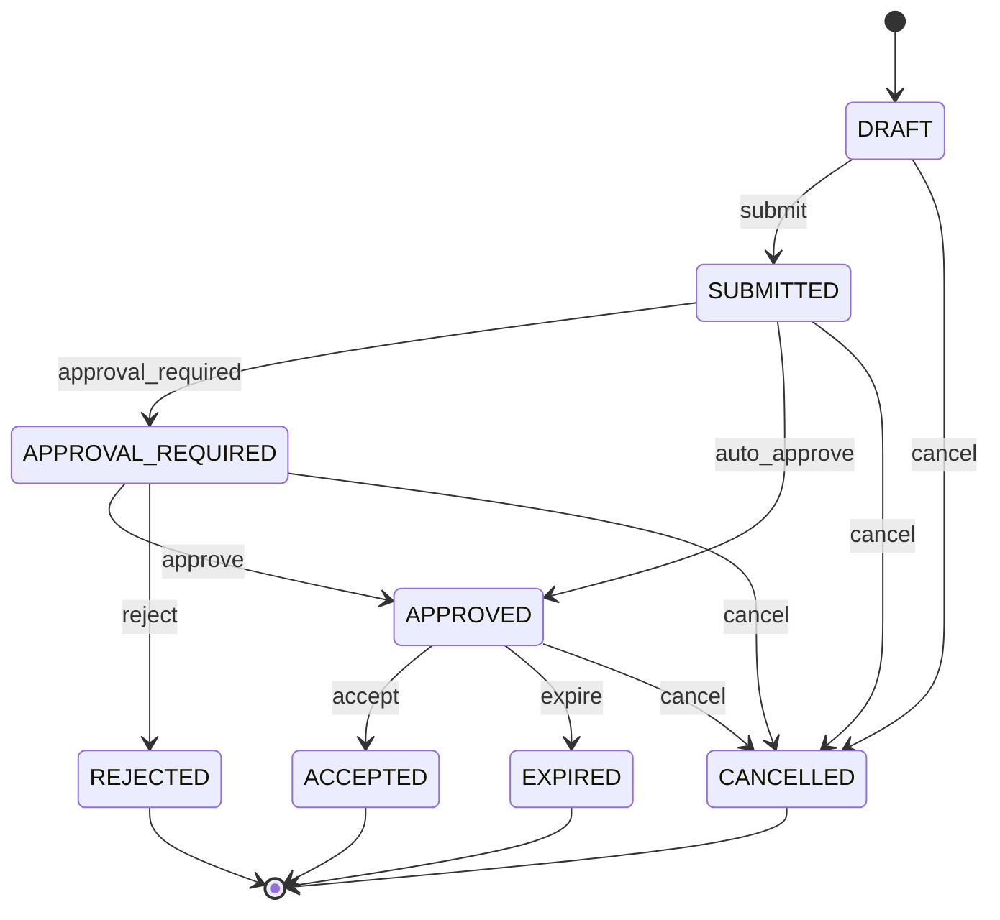
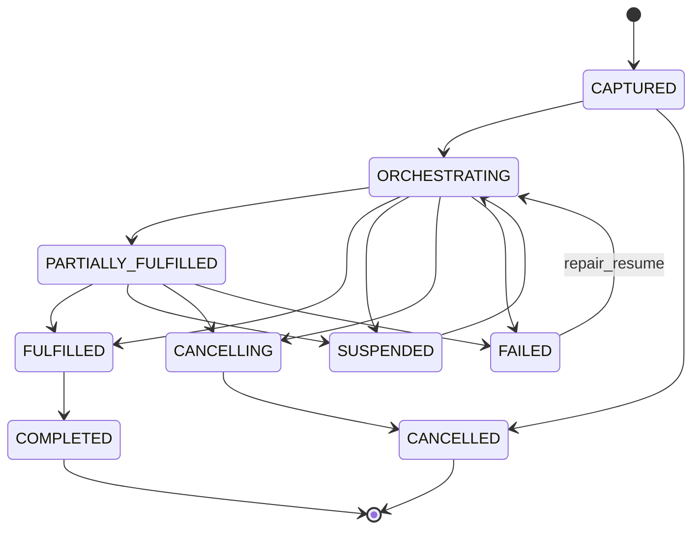
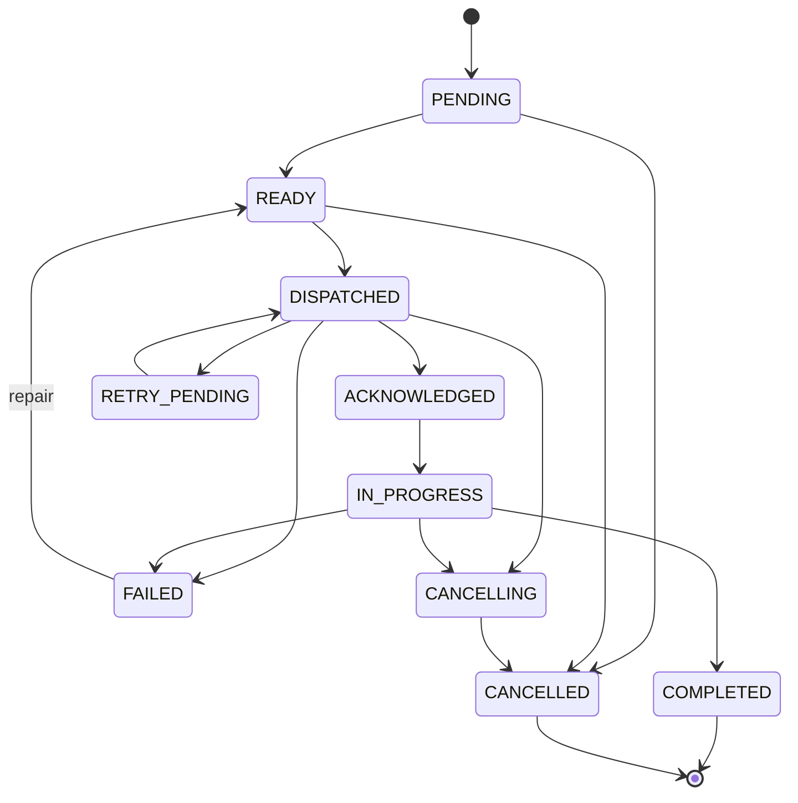
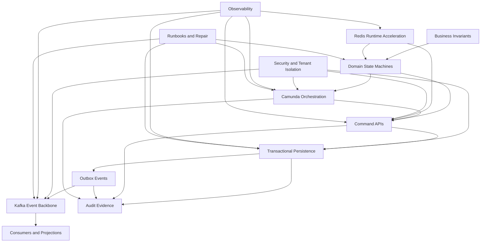

------
title: Learn Java Microservices CPQ OMS Platform - Part 035
description: Capstone akhir untuk membangun, menilai, menguji, dan mengoperasikan platform Java microservices CPQ/OMS secara production-ready dengan OpenAPI First, Schema First, JAX-RS/Jersey, PostgreSQL, MyBatis, Camunda 7, Kafka, Redis, dan praktik engineering tingkat lanjut.
series: learn-java-microservices-cpq-oms-platform
seriesTitle: Learn Java Microservices CPQ OMS Platform
order: 35
partTitle: Capstone, Production Readiness, and Top 1% Review
tags:
- java
- microservices
- cpq
- oms
- openapi
- schema-first
- jax-rs
- jersey
- postgresql
- mybatis
- camunda-7
- kafka
- redis
- production-readiness
- architecture-review
- capstone
date: 2026-07-02
------

# Part 035 — Capstone, Production Readiness, and Top 1% Review

Part ini adalah penutup seri. Tujuannya bukan memperkenalkan teknologi baru, tetapi menyatukan seluruh keputusan engineering dari Part 001 sampai Part 034 menjadi satu cara berpikir yang utuh.

Pada titik ini, kita sudah membangun mental model, kontrak API, schema, persistence layer, catalog, configuration, pricing, quote lifecycle, approval, order lifecycle, Camunda orchestration, Kafka event backbone, outbox/inbox, Redis runtime patterns, security, testing, observability, resilience, performance, deployment, runbook, dan auditability.

Sekarang pertanyaannya berubah.

Bukan lagi:

> “Bagaimana cara membuat service CPQ/OMS?”

Tetapi:

> “Bagaimana membuktikan bahwa platform ini benar, aman, operable, evolvable, dan layak dipakai untuk transaksi bisnis nyata?”

Itulah perbedaan antara engineer yang bisa membuat sistem berjalan dan engineer yang bisa membuat sistem dipercaya.

---

## 1. Kaufman Skill Closure

Dalam kerangka Josh Kaufman, tahap akhir pembelajaran bukan sekadar mengumpulkan informasi. Tahap akhirnya adalah kemampuan melakukan self-correction melalui praktik yang nyata.

Untuk seri ini, self-correction berarti kita mampu menjawab pertanyaan berikut dengan bukti teknis:

1. Apakah lifecycle quote dan order memiliki invariant yang jelas?
2. Apakah setiap command punya idempotency behavior?
3. Apakah setiap state transition bisa diaudit?
4. Apakah setiap event bisa direplay tanpa merusak data?
5. Apakah setiap failure mode punya recovery path?
6. Apakah setiap API change punya compatibility rule?
7. Apakah setiap schema change bisa dimigrasikan aman?
8. Apakah setiap decision penting punya evidence?
9. Apakah setiap service punya ownership data yang jelas?
10. Apakah operator bisa memahami dan memperbaiki sistem saat terjadi incident?

Jika jawabannya hanya “seharusnya bisa”, platform belum matang.

Jika jawabannya “ini query-nya, ini event-nya, ini runbook-nya, ini test-nya, ini dashboard-nya, ini rollback path-nya”, platform mulai masuk kelas production engineering.

---

## 2. Capstone Scenario

Capstone yang akan dipakai adalah satu journey lengkap:

> Sales membuat quote untuk customer enterprise, memilih bundle produk, menjalankan configuration validation, menghitung harga, mengajukan approval karena diskon tinggi, quote disetujui, customer menerima quote, order dibuat, order diorkestrasi dengan Camunda 7, fulfillment line dikirim ke downstream service, event diterbitkan ke Kafka, audit trail tersimpan, dan operator mampu menangani partial failure.

Journey ini cukup kaya karena menyentuh hampir semua boundary:

- HTTP API
- OpenAPI contract
- JSON Schema
- PostgreSQL transaction
- MyBatis mapper
- Redis cache
- pricing calculation
- quote state machine
- approval policy
- order capture
- order normalization
- Camunda BPMN
- Kafka event
- outbox/inbox
- observability
- security
- failure recovery
- audit evidence

Diagram alurnya:



---

## 3. Target Repository at the End of the Series

Pada akhir seri, struktur repository tidak harus identik dengan contoh ini, tetapi minimal harus memiliki boundary yang sama.

```text
learn-java-microservices-cpq-oms-platform/
├── pom.xml
├── platform-bom/
├── platform-parent/
├── contracts/
│   ├── openapi/
│   │   ├── catalog-api.yaml
│   │   ├── configuration-api.yaml
│   │   ├── pricing-api.yaml
│   │   ├── quote-api.yaml
│   │   ├── approval-api.yaml
│   │   └── order-api.yaml
│   ├── json-schema/
│   │   ├── common/
│   │   ├── commands/
│   │   ├── events/
│   │   └── snapshots/
│   └── asyncapi/
│       └── cpq-oms-events.yaml
├── services/
│   ├── catalog-service/
│   ├── configuration-service/
│   ├── pricing-service/
│   ├── quote-service/
│   ├── approval-service/
│   └── order-service/
├── workflow/
│   ├── camunda7/
│   │   ├── bpmn/
│   │   ├── delegates/
│   │   └── process-tests/
├── adapters/
│   ├── fulfillment-adapter/
│   ├── notification-adapter/
│   └── document-adapter/
├── local/
│   ├── docker-compose.yml
│   ├── init-postgres/
│   ├── init-kafka/
│   ├── init-redis/
│   └── mock-services/
├── deployment/
│   ├── kubernetes/
│   ├── helm/
│   └── environments/
├── operations/
│   ├── dashboards/
│   ├── alerts/
│   ├── runbooks/
│   └── failure-drills/
└── docs/
    ├── architecture-decisions/
    ├── threat-model/
    ├── data-classification/
    ├── audit-model/
    └── production-readiness-review/
```

Boundary pentingnya:

- `contracts/` adalah sumber kebenaran public API dan event contract.
- `services/*` menyimpan business capability, bukan shared domain spaghetti.
- `workflow/camunda7/` dipisahkan agar Camunda tidak bocor ke seluruh domain.
- `operations/` diperlakukan sebagai bagian produk, bukan dokumentasi belakangan.
- `docs/architecture-decisions/` menyimpan reasoning, trade-off, dan keputusan irreversible.

---

## 4. End-to-End Artifact Map

Satu capability bisnis harus menghasilkan banyak artifact yang saling konsisten.

Contoh untuk command `AcceptQuote`:

```mermaid
flowchart TD
    A[Business Requirement: Customer accepts approved quote]
    B[OpenAPI Endpoint: POST /quotes/{quoteId}/accept]
    C[Request Schema: AcceptQuoteRequest]
    D[Domain Command: AcceptQuote]
    E[Quote State Transition: APPROVED -> ACCEPTED]
    F[Order Capture Command]
    G[PostgreSQL Transaction]
    H[Outbox Event: QuoteAccepted]
    I[Outbox Event: OrderCaptured]
    J[Camunda Process Start]
    K[Audit Event]
    L[Contract Test]
    M[State Machine Test]
    N[Integration Test]
    O[Runbook Entry]

    A --> B --> C --> D --> E
    E --> F --> G
    G --> H
    G --> I
    I --> J
    G --> K
    B --> L
    E --> M
    G --> N
    J --> O
```

Top-tier engineering tidak melihat artifact ini sebagai hal terpisah. Ia melihatnya sebagai satu chain of evidence.

Jika requirement berubah, kita tahu artifact mana yang terdampak.

Jika bug terjadi, kita tahu bukti mana yang diperiksa.

Jika auditor bertanya, kita tahu state, actor, policy, snapshot, event, dan command yang relevan.

---

## 5. The Final Architecture Review

Architecture review akhir harus menilai platform dari beberapa sudut, bukan hanya diagram service.

### 5.1 Business Capability Review

Pertanyaan utama:

- Apakah setiap service memegang capability yang jelas?
- Apakah service boundary mengikuti perubahan bisnis, bukan sekadar noun decomposition?
- Apakah Quote, Approval, Order, dan Fulfillment tidak saling mencuri responsibility?
- Apakah pricing snapshot cukup kuat untuk sengketa komersial?
- Apakah product catalog snapshot cukup kuat untuk quote lama?
- Apakah order lifecycle bisa menjelaskan partial fulfillment?
- Apakah cancellation, amendment, expiry, dan rejection punya semantic yang jelas?

Red flag:

- `status` string tanpa transition guard.
- Harga quote dihitung ulang dari catalog live.
- Approval hanya menyimpan `approved=true`.
- Order line tidak punya lifecycle sendiri.
- Semua service membaca database yang sama.
- Event dipakai sebagai command tersembunyi tanpa ownership yang jelas.

### 5.2 Contract Review

Contract review menilai apakah API dan event bisa berevolusi aman.

Checklist:

- Semua public endpoint punya OpenAPI spec.
- Semua request/response punya schema eksplisit.
- Error response memakai standard problem model.
- Endpoint command punya idempotency behavior.
- Pagination/filtering/sorting konsisten.
- API versioning rule terdokumentasi.
- Event envelope stabil.
- Event schema punya compatibility rule.
- Breaking change harus lewat explicit migration plan.
- Contract tests berjalan di CI.

Contoh red flag:

```yaml
# Bad: ambiguous event
type: QuoteUpdated
payload:
  quoteId: "..."
  status: "APPROVED"
```

Event seperti ini lemah karena consumer tidak tahu apa yang berubah, mengapa berubah, siapa aktornya, dan apakah ia boleh memicu side effect.

Versi yang lebih kuat:

```json
{
  "eventId": "01J...",
  "eventType": "QuoteApproved",
  "eventVersion": 1,
  "occurredAt": "2026-07-02T10:15:30Z",
  "tenantId": "tenant-001",
  "aggregateType": "Quote",
  "aggregateId": "quote-001",
  "aggregateVersion": 7,
  "causationId": "cmd-accept-001",
  "correlationId": "corr-001",
  "actor": {
    "actorType": "USER",
    "actorId": "user-123"
  },
  "payload": {
    "approvalId": "approval-001",
    "policyVersion": "approval-policy-2026.07",
    "approvedDiscountPercent": "18.50"
  }
}
```

### 5.3 Data Architecture Review

Data architecture review harus dimulai dari invariant.

Pertanyaan:

- Invariant mana yang ditegakkan di domain code?
- Invariant mana yang ditegakkan di database constraint?
- Invariant mana yang ditegakkan oleh state transition?
- Invariant mana yang ditegakkan oleh asynchronous reconciliation?
- Apakah ada invariant penting yang hanya hidup di komentar atau dokumentasi?

Contoh invariant:

```text
A quote cannot be accepted unless:
- quote.state = APPROVED
- quote.expires_at > now
- quote.pricing_snapshot_id is not null
- quote.configuration_snapshot_id is not null
- no existing order_capture exists for the same quote acceptance idempotency key
```

Sebagian invariant ini harus hidup di domain logic. Sebagian lain harus hidup di database.

Contoh PostgreSQL guardrail:

```sql
create unique index uq_order_capture_quote_acceptance
on order_capture (tenant_id, quote_id, acceptance_idempotency_key);
```

Kode domain tanpa constraint ini masih rawan duplicate order saat retry, timeout, atau race condition.

### 5.4 Workflow Review

Camunda 7 harus dilihat sebagai orchestration engine, bukan database bisnis.

Pertanyaan:

- Apakah order state tetap dimiliki Order Service?
- Apakah process instance hanya mengorkestrasi step?
- Apakah process variable tidak menyimpan full aggregate?
- Apakah setiap service task idempotent?
- Apakah retry behavior dibedakan antara transient dan business error?
- Apakah incident punya runbook?
- Apakah process versioning aman untuk instance lama?
- Apakah ada migration seam jika suatu saat keluar dari Camunda 7?

Red flag:

- Camunda variable menjadi sumber kebenaran order.
- BPMN berisi terlalu banyak business rule.
- Delegate langsung menulis banyak database service lain.
- Retry Camunda memanggil external system tanpa idempotency.
- Incident diselesaikan dengan delete process instance tanpa audit.

### 5.5 Event Architecture Review

Kafka bukan tempat untuk membuang semua perubahan.

Pertanyaan:

- Apakah event merepresentasikan fakta bisnis yang sudah terjadi?
- Apakah command dan event dibedakan?
- Apakah topic ownership jelas?
- Apakah partition key menjaga ordering yang dibutuhkan?
- Apakah consumer idempotent?
- Apakah replay aman?
- Apakah DLT punya owner dan runbook?
- Apakah event PII diklasifikasikan?
- Apakah schema evolution policy berlaku?

Red flag:

```text
topic: cpq.events
key: random UUID
event type: AnyDomainEvent
payload: arbitrary JSON
```

Ini bukan event backbone. Ini distributed log dumping ground.

---

## 6. Production Readiness Review

Production readiness review harus dilakukan sebelum sistem dipakai untuk transaksi nyata.

Gunakan scoring sederhana:

| Score | Meaning |
|---:|---|
| 0 | Tidak ada |
| 1 | Ada secara informal |
| 2 | Ada dan terdokumentasi |
| 3 | Ada, diuji, dan dipakai di CI/operasi |
| 4 | Ada, diuji, dipantau, dan pernah divalidasi dengan failure drill |

Target minimal untuk production adalah 3 untuk area kritis. Area seperti order capture, pricing snapshot, approval audit, outbox/inbox, dan incident recovery idealnya mencapai 4.

---

## 7. Production Readiness Checklist

### 7.1 API Readiness

- [ ] Semua endpoint public punya OpenAPI spec.
- [ ] OpenAPI spec dilint di CI.
- [ ] Generated code tidak dimodifikasi manual.
- [ ] Error response konsisten.
- [ ] Idempotency key digunakan untuk command berisiko.
- [ ] Pagination dan filtering konsisten.
- [ ] Authentication dan authorization terdokumentasi di contract.
- [ ] Deprecated endpoint punya sunset plan.
- [ ] API compatibility diuji.

### 7.2 Schema Readiness

- [ ] Semua payload penting punya JSON Schema.
- [ ] Money tidak memakai floating-point.
- [ ] Timestamp memakai format dan timezone policy konsisten.
- [ ] Enum evolution punya rule.
- [ ] Event schema punya compatibility gate.
- [ ] Snapshot schema immutable.
- [ ] PII field diklasifikasikan.
- [ ] Schema changes punya migration plan.

### 7.3 Database Readiness

- [ ] Setiap service memiliki schema ownership jelas.
- [ ] Constraint mendukung invariant penting.
- [ ] Index mendukung query hot path.
- [ ] Migration berjalan di CI.
- [ ] Migration punya expand-contract plan untuk breaking change.
- [ ] Query plan untuk hot path sudah diperiksa.
- [ ] Transaction boundary terdokumentasi.
- [ ] Locking strategy jelas.
- [ ] Backup dan restore diuji.
- [ ] Retention dan archive policy ada.

### 7.4 MyBatis Readiness

- [ ] Mapper tidak mengandung business decision kompleks.
- [ ] SQL hot path punya test.
- [ ] Result map eksplisit.
- [ ] Type handler untuk money/JSON/time jelas.
- [ ] N+1 query dicegah.
- [ ] SQL timing diobservasi.
- [ ] Error SQL diklasifikasikan.
- [ ] Mapper test memakai PostgreSQL nyata, bukan hanya mock.

### 7.5 Catalog Readiness

- [ ] Product/offer lifecycle jelas.
- [ ] Published catalog snapshot immutable.
- [ ] Quote menyimpan catalog reference/snapshot yang cukup.
- [ ] Catalog publish atomic.
- [ ] Catalog cache invalidation aman.
- [ ] Incompatible catalog changes punya migration policy.
- [ ] Catalog event punya schema stabil.

### 7.6 Configuration Readiness

- [ ] Configuration session punya expiry.
- [ ] Validation error explainable.
- [ ] Compatibility rule versioned.
- [ ] Finalized configuration snapshot immutable.
- [ ] Configuration tidak bergantung pada catalog live setelah finalized.
- [ ] Rule evaluation deterministic.
- [ ] Performance untuk large bundle diuji.

### 7.7 Pricing Readiness

- [ ] Price book versioned.
- [ ] Pricing calculation deterministic.
- [ ] Money precision benar.
- [ ] Discount stacking rule eksplisit.
- [ ] Pricing snapshot immutable.
- [ ] Reprice rule jelas.
- [ ] Approval signal dihasilkan dari pricing evidence.
- [ ] Golden master test tersedia.
- [ ] Pricing audit bisa menjelaskan harga akhir.

### 7.8 Quote Readiness

- [ ] Quote state machine eksplisit.
- [ ] Transition guard diuji.
- [ ] Quote versioning ada.
- [ ] Quote acceptance idempotent.
- [ ] Quote expiry job aman.
- [ ] Quote document mencerminkan snapshot, bukan live state.
- [ ] Quote audit lengkap.
- [ ] Duplicate acceptance dicegah.

### 7.9 Approval Readiness

- [ ] Approval policy versioned.
- [ ] Approval requirement explainable.
- [ ] Delegation dan escalation terdokumentasi.
- [ ] Manual override punya evidence.
- [ ] Approval task punya SLA.
- [ ] Approval decision immutable.
- [ ] Approval tidak bisa dilakukan oleh actor yang tidak berwenang.
- [ ] Stuck approval punya runbook.

### 7.10 Order Readiness

- [ ] Order capture idempotent.
- [ ] Order normalized dari quote snapshot.
- [ ] Order line dependency graph valid.
- [ ] Root state dan line state konsisten.
- [ ] Cancellation semantics jelas.
- [ ] Partial failure punya representation.
- [ ] Manual repair command tersedia.
- [ ] Reconciliation job tersedia.
- [ ] Order audit lengkap.

### 7.11 Camunda 7 Readiness

- [ ] BPMN process versioned.
- [ ] Business key konsisten.
- [ ] Process variable minimal dan schema-bound.
- [ ] Delegate idempotent.
- [ ] Async continuation dipakai di boundary yang tepat.
- [ ] Incident handling punya runbook.
- [ ] Job executor tuning diuji.
- [ ] Process instance lama kompatibel saat deployment baru.
- [ ] Exit/migration seam terdokumentasi.

### 7.12 Kafka Readiness

- [ ] Topic ownership jelas.
- [ ] Partition key sesuai ordering invariant.
- [ ] Producer memakai outbox.
- [ ] Consumer memakai inbox/dedup.
- [ ] Retry topic dan DLT ada.
- [ ] DLT punya owner.
- [ ] Consumer lag alert ada.
- [ ] Event replay diuji.
- [ ] Event schema compatibility gate aktif.

### 7.13 Redis Readiness

- [ ] Redis hanya optimization, bukan sumber kebenaran kritis.
- [ ] TTL policy jelas.
- [ ] Cache key punya tenant scope.
- [ ] Stampede prevention ada untuk hot keys.
- [ ] Rate limiter fail-mode ditentukan.
- [ ] Distributed lock memakai fencing jika side effect kritis.
- [ ] Redis degradation diuji.
- [ ] Memory/eviction policy dipantau.

### 7.14 Security Readiness

- [ ] Authentication boundary jelas.
- [ ] Authorization diuji negatif.
- [ ] Tenant isolation diterapkan di semua layer.
- [ ] Object-level authorization ada.
- [ ] Privileged action diaudit.
- [ ] Secrets tidak masuk log.
- [ ] PII masking diterapkan.
- [ ] Service-to-service authorization ada.
- [ ] Break-glass access punya approval dan audit.

### 7.15 Observability Readiness

- [ ] Correlation ID end-to-end.
- [ ] Structured logs konsisten.
- [ ] Metrics untuk API, DB, Kafka, Camunda, Redis ada.
- [ ] Business metrics tersedia.
- [ ] Trace melewati API/process/event boundary.
- [ ] Dashboard untuk quote-to-order journey ada.
- [ ] Alert action-oriented.
- [ ] Runbook terhubung dari alert.

### 7.16 Resilience Readiness

- [ ] Timeout budget tersedia.
- [ ] Retry policy diklasifikasikan.
- [ ] Circuit breaker untuk dependency berisiko.
- [ ] Bulkhead untuk resource kritis.
- [ ] Backpressure strategy ada.
- [ ] Fallback tidak merusak invariant.
- [ ] Retry storm dicegah.
- [ ] Chaos/failure drill dilakukan.

### 7.17 Deployment Readiness

- [ ] Build artifact immutable.
- [ ] Config externalized.
- [ ] Secrets managed.
- [ ] Health/readiness probes benar.
- [ ] DB migration choreography aman.
- [ ] Kafka topic provisioning terkendali.
- [ ] Rollback/roll-forward strategy jelas.
- [ ] Canary atau progressive rollout tersedia untuk perubahan berisiko.
- [ ] Deployment audit ada.

### 7.18 Operations Readiness

- [ ] Runbook stuck order ada.
- [ ] Runbook stuck approval ada.
- [ ] Runbook Kafka lag ada.
- [ ] Runbook Camunda incident ada.
- [ ] Runbook outbox stuck ada.
- [ ] Runbook Redis degradation ada.
- [ ] Manual repair API punya authorization ketat.
- [ ] Reconciliation report dijalankan berkala.
- [ ] Post-incident review template ada.

### 7.19 Compliance Readiness

- [ ] Audit event append-only.
- [ ] Pricing explainability tersedia.
- [ ] Approval evidence lengkap.
- [ ] Quote/order lineage bisa ditelusuri.
- [ ] Retention policy jelas.
- [ ] Legal hold didukung.
- [ ] PII minimization diterapkan.
- [ ] Compliance export tersedia.
- [ ] Audit tamper-evidence dipertimbangkan.

---

## 8. Final Failure Review

Sistem CPQ/OMS yang matang harus dinilai dari kegagalannya.

Berikut failure review yang harus bisa dijawab.

### 8.1 Duplicate Accept Quote

Scenario:

1. User menekan accept quote.
2. Request berhasil di server.
3. Network timeout terjadi sebelum client menerima response.
4. Client retry.
5. Sistem tidak boleh membuat dua order.

Expected controls:

- `Idempotency-Key` di command API.
- Unique constraint di order capture.
- Domain guard quote state.
- Acceptance record.
- Audit event.
- Response replay dari idempotency table.

Pseudo-flow:

```mermaid
flowchart TD
    A[POST /quotes/{id}/accept] --> B{Idempotency key exists?}
    B -- yes --> C[Return stored result]
    B -- no --> D[Lock quote / optimistic version check]
    D --> E{Quote APPROVED and not expired?}
    E -- no --> F[Reject command]
    E -- yes --> G[Insert acceptance record]
    G --> H[Create order]
    H --> I[Insert outbox events]
    I --> J[Commit transaction]
    J --> K[Return order id]
```

### 8.2 Pricing Rule Changed After Quote

Scenario:

1. Quote dibuat tanggal 1.
2. Price book berubah tanggal 2.
3. Customer menerima quote tanggal 3.
4. Order harus memakai harga yang ada di quote, bukan harga live.

Expected controls:

- Pricing snapshot immutable.
- Quote binds to pricing snapshot ID.
- Order capture copies commercial snapshot.
- Audit stores price book version.
- Pricing recalculation hanya terjadi jika explicit reprice command.

### 8.3 Approval Policy Changed During Approval

Scenario:

1. Quote submitted dengan approval policy version A.
2. Policy berubah ke version B.
3. Approver approve quote yang masih berjalan.

Expected controls:

- Approval request stores policy version.
- Decision uses policy version captured at submission time.
- Re-evaluation hanya terjadi via explicit command.
- Audit records policy version and decision actor.

### 8.4 Kafka Event Published but Consumer Fails

Scenario:

1. `OrderCaptured` event published.
2. Fulfillment consumer receives it.
3. Consumer writes partial data.
4. Consumer crashes before committing offset.

Expected controls:

- Inbox table.
- Idempotent handler.
- External side effect idempotency key.
- Consumer offset committed only after durable processing.
- Duplicate event safe.

### 8.5 Camunda Delegate Fails After External Call

Scenario:

1. Camunda delegate calls fulfillment provider.
2. Provider accepts request.
3. Delegate crashes before marking BPMN task complete.
4. Retry calls provider again.

Expected controls:

- External command has idempotency key.
- Delegate records command attempt.
- Fulfillment adapter checks previous result.
- Retry returns existing fulfillment reference.
- BPMN progresses safely.

### 8.6 Redis Unavailable

Scenario:

1. Redis cluster unavailable.
2. Pricing cache, idempotency cache, and rate limiter affected.

Expected controls:

- Source of truth stays PostgreSQL.
- Cache miss falls back to database for critical path.
- Rate limiter fail-mode decided per endpoint.
- Circuit breaker prevents thread exhaustion.
- Alert and runbook available.

### 8.7 PostgreSQL Lock Contention

Scenario:

1. Bulk quote expiry job locks many rows.
2. User quote submit slows down.
3. API latency breaches SLO.

Expected controls:

- Batch processing with small chunks.
- `FOR UPDATE SKIP LOCKED` where appropriate.
- Proper index on expiry query.
- Job runs with timeout.
- Observability on lock waits.
- Kill/retry runbook.

### 8.8 Bad Deployment With Broken Event Consumer

Scenario:

1. New consumer version deployed.
2. It misinterprets event schema.
3. DLT grows.

Expected controls:

- Consumer contract tests.
- Canary deployment.
- Lag and DLT alert.
- Rollback path.
- Replay from offset after fix.
- Consumer tolerance to unknown fields.

---

## 9. Final State Machine Review

State machines are the spine of the platform.

### 9.1 Quote State Machine



Review questions:

- Can a rejected quote be accepted?
- Can an expired quote be accepted?
- Can an accepted quote be cancelled?
- Does approval happen before acceptance?
- Is quote expiry deterministic?
- Is each transition audited?

### 9.2 Order Root State Machine



Review questions:

- Can root order be completed while a mandatory line is failed?
- Can cancellation skip compensation?
- Can repair resume without audit?
- Can order state be derived from line states?
- Is manual override represented as a transition?

### 9.3 Order Line State Machine



Review questions:

- Can dependent line start before parent completes?
- Can failed line be retried safely?
- Is downstream request idempotent?
- Is line state observable by operators?
- Does line failure affect root state correctly?

---

## 10. Final Data Consistency Review

A useful consistency review is not “is everything eventually consistent?” That phrase is too vague.

Use this table instead.

| Boundary | Consistency Need | Mechanism |
|---|---|---|
| Quote acceptance creates order | Strong per quote | DB transaction + unique constraint |
| Quote accepted event publication | Atomic with quote/order write | Transactional outbox |
| Fulfillment consumer processing | Effectively once | Inbox + idempotent side effect |
| Catalog update to quote draft | Eventual | Catalog published event + cache invalidation |
| Price book update to existing quote | No automatic mutation | Immutable pricing snapshot |
| Approval decision to quote state | Strong or controlled eventual | Command transition + event reconciliation |
| Order root state from line states | Controlled derived consistency | State transition service + reconciliation |
| Camunda process to order DB | Eventually consistent with repair | Process message + order command + runbook |
| Redis cache to PostgreSQL | Eventually consistent | TTL + invalidation + source-of-truth fallback |

Top-tier design names the consistency model per boundary. It does not claim one universal consistency mode.

---

## 11. Final Security Review

Security review must test real abuse paths.

### 11.1 Tenant Escape

Question:

> Can a user from tenant A access quote, order, approval, or event data from tenant B?

Required controls:

- tenant ID from trusted token/edge context
- no tenant ID accepted blindly from request body
- tenant predicate in all queries
- object-level authorization
- audit event contains tenant ID
- Kafka event keys and payloads include tenant classification
- Redis keys include tenant namespace
- negative tests for cross-tenant access

### 11.2 Unauthorized Approval

Question:

> Can a sales user approve their own high-discount quote?

Required controls:

- approval policy separates requester and approver
- authorization checks actor attributes
- conflict-of-interest guard
- approval decision stores actor, policy, signal, timestamp
- manual override requires stronger permission
- audit evidence immutable

### 11.3 Privileged Repair Abuse

Question:

> Can an operator “fix” an order in a way that hides commercial or fulfillment reality?

Required controls:

- repair command is explicit
- repair reason required
- before/after state recorded
- dual approval for high-risk repair
- repair does not delete original event
- operator action visible in audit trail
- repair API heavily authorized and rate-limited

### 11.4 PII Leakage

Question:

> Does PII leak into logs, traces, Kafka events, Redis keys, or Camunda variables?

Required controls:

- data classification
- field-level masking
- no raw customer sensitive data in Redis keys
- no full quote payload in Camunda variables
- event payload minimization
- log redaction tests
- trace attribute allowlist

---

## 12. Final Observability Review

A mature CPQ/OMS platform answers business and technical questions quickly.

### 12.1 Business Questions

- How many quotes are stuck in approval?
- Which approval policy causes most escalations?
- How many accepted quotes failed order capture?
- Which product bundle causes most invalid configurations?
- Which pricing rule causes most manual approvals?
- How many orders are partially fulfilled?
- Which downstream fulfillment system causes the most delay?
- What is quote-to-order conversion latency?
- How many orders required manual repair this week?

### 12.2 Technical Questions

- Which API endpoint breaches latency SLO?
- Which SQL query causes lock wait?
- Which Kafka consumer group is lagging?
- Which Camunda job definition creates most incidents?
- Which Redis key pattern is hot?
- Which service has retry storms?
- Which deployment introduced error spike?
- Which tenant is causing abnormal load?

### 12.3 Evidence Chain Query

For a single `orderId`, operators should be able to reconstruct:

```text
orderId
 -> source quoteId
 -> quote version
 -> pricing snapshot
 -> configuration snapshot
 -> approval request
 -> approval decision
 -> order capture command
 -> order normalized lines
 -> Camunda process instance
 -> fulfillment commands
 -> Kafka events
 -> audit events
 -> manual repair actions
```

If this chain requires five people and manual database archaeology, observability is not good enough.

---

## 13. Final Performance Review

Performance engineering should be tied to workload.

Example workload target:

| Flow | Target |
|---|---:|
| Catalog browse p95 | < 150 ms |
| Configuration validation p95 | < 500 ms |
| Pricing calculation p95 | < 700 ms |
| Quote create p95 | < 300 ms |
| Quote submit p95 | < 500 ms |
| Quote accept/order capture p95 | < 800 ms |
| Order orchestration step p95 | < 2 s |
| Event publication lag p95 | < 5 s |
| Approval task creation p95 | < 3 s |

These are example targets, not universal truth. The important point is that every target must have a measurement path.

### 13.1 Capacity Formula

Use Little’s Law as a basic sanity check:

```text
concurrency = throughput × latency
```

If order capture receives 100 requests per second and p95 latency is 800 ms:

```text
concurrency ≈ 100 × 0.8 = 80 in-flight requests
```

Then ask:

- Can the DB connection pool support this?
- Can Camunda process starts support this?
- Can outbox table handle this insert rate?
- Can Kafka publisher drain fast enough?
- Can downstream fulfillment absorb the resulting commands?

### 13.2 Hot Path Review

Hot paths:

- catalog published view lookup
- configuration validation
- price calculation
- quote submit
- quote acceptance
- order state transition
- outbox polling
- Kafka consumer processing
- Camunda job execution

For each hot path, document:

- expected throughput
- p50/p95/p99 latency
- database queries
- indexes
- lock behavior
- cache behavior
- timeout budget
- retry behavior
- fallback behavior
- dashboard link
- runbook link

---

## 14. Final Deployment Review

Deployment review should prove that change can be introduced safely.

### 14.1 Deployment Categories

| Change Type | Risk | Strategy |
|---|---|---|
| Add optional API field | Low | Normal rollout |
| Remove API field | High | Deprecate, migrate, remove later |
| Add nullable DB column | Low | Expand migration |
| Add not-null column | Medium/High | Expand, backfill, enforce |
| Change pricing rule | High | Versioned rule + golden master |
| Change approval policy | High | Versioned policy + simulation |
| Change BPMN process | High | Versioning + instance compatibility |
| Change event schema | Medium/High | Compatibility check + consumer test |
| Change Kafka partition key | Very high | Usually new topic |
| Change tenant isolation logic | Critical | Security review + negative tests |

### 14.2 Rollback Reality

Rollback is not always possible.

For many distributed systems, the safer path is roll-forward. Especially when:

- database migration has already changed data
- event schema has been published
- BPMN process instances have started under new version
- external side effects have happened
- cache invalidation has propagated partially

Therefore every deployment plan needs:

- pre-deploy validation
- migration plan
- rollout strategy
- monitoring window
- abort condition
- rollback or roll-forward path
- data repair plan
- communication plan

---

## 15. Final Compliance Review

Compliance is not only “store logs”.

For CPQ/OMS, defensibility means the platform can explain commercial decisions and operational state changes.

### 15.1 Quote Evidence

A quote must answer:

- Who created it?
- What catalog version was used?
- What configuration was selected?
- Why was configuration valid?
- What price book was used?
- What discounts were applied?
- Why was approval required or not required?
- Who approved it?
- When did the customer accept it?
- What exact terms were accepted?

### 15.2 Order Evidence

An order must answer:

- Which accepted quote created it?
- Was order capture idempotent?
- How were quote lines normalized into order lines?
- Which line depended on which other line?
- Which fulfillment step failed?
- Was it retried?
- Was it manually repaired?
- Who performed repair?
- Was the customer impacted?
- What final state did each line reach?

### 15.3 Audit Properties

Audit evidence should be:

- append-only
- timestamped
- actor-attributed
- tenant-scoped
- correlation-linked
- policy-versioned
- snapshot-backed
- tamper-evident where required
- exportable for investigation
- retained according to policy

---

## 16. Top 1% Review: What Separates Strong Engineers

This section is intentionally direct.

A good engineer can implement endpoints.

A stronger engineer can implement services.

A senior engineer can model boundaries.

A top-tier engineer can explain failure, evolution, and accountability.

### 16.1 They Think in Invariants

Instead of asking:

> “What tables do we need?”

They ask:

> “What must never become false?”

Examples:

- one quote acceptance must not create two orders
- accepted quote price must not drift
- approval decision must be traceable to policy version
- order root state must not contradict line states
- retry must not duplicate external side effects
- tenant data must never cross boundary

Tables, APIs, Kafka topics, and BPMN flows are consequences of these invariants.

### 16.2 They Separate State, Process, and Event

State answers:

> What is true now?

Process answers:

> What should happen next?

Event answers:

> What happened?

Audit answers:

> Why, by whom, and under what rule did it happen?

Confusing these leads to weak systems.

Common mistakes:

- using Kafka as source of command truth without ownership
- using Camunda variables as business database
- using audit log as operational state
- using Redis cache as durable state
- using API response as evidence

### 16.3 They Design for Retry Before Writing Code

Every command should answer:

- What if request is repeated?
- What if response is lost?
- What if transaction commits but event publish fails?
- What if event is consumed twice?
- What if external call succeeds but local handler fails?
- What if operator retries manually?

If there is no answer, the system is not production-ready.

### 16.4 They Treat Manual Repair as a First-Class Capability

Manual repair is not failure of engineering. Hidden repair is failure of engineering.

A mature system provides:

- explicit repair commands
- strict authorization
- required reason
- before/after state
- audit event
- reconciliation validation
- dashboards
- runbooks

### 16.5 They Prefer Explicit Trade-Offs

Bad architecture hides trade-offs.

Good architecture states them.

Example:

```text
Decision:
Use PostgreSQL as source of truth for Quote and Order state.

Consequence:
Kafka events are derived facts, not authoritative state.

Trade-off:
Consumers may lag, but command-side invariants stay strong.

Mitigation:
Outbox, inbox, reconciliation, lag alert, replay runbook.
```

### 16.6 They Avoid Framework-Centric Architecture

The platform is not “a Camunda system” or “a Kafka system” or “a Redis system”.

It is a CPQ/OMS platform with:

- business state
- process orchestration
- event propagation
- persistence
- caching
- observability
- security
- compliance

Frameworks are implementation choices. The domain and invariants are the architecture.

---

## 17. Final Architecture Decision Records

At minimum, the capstone should include ADRs for these decisions:

```text
ADR-001: Service boundaries and bounded contexts
ADR-002: OpenAPI-first contract governance
ADR-003: Schema-first payload and event model
ADR-004: PostgreSQL ownership per service
ADR-005: MyBatis over ORM for explicit SQL control
ADR-006: Quote snapshot strategy
ADR-007: Pricing snapshot and money precision
ADR-008: Approval policy versioning
ADR-009: Order state machine design
ADR-010: Camunda 7 orchestration boundary
ADR-011: Kafka topic and event taxonomy
ADR-012: Transactional outbox/inbox
ADR-013: Redis runtime usage limits
ADR-014: Tenant isolation strategy
ADR-015: Audit event model
ADR-016: Deployment and migration strategy
ADR-017: Manual repair and reconciliation model
ADR-018: Camunda 7 migration seam
```

Example ADR skeleton:

```md
# ADR-010: Camunda 7 Orchestration Boundary

## Status
Accepted

## Context
Order fulfillment is long-running, may involve timers, retries, human intervention, and external systems.

## Decision
Use Camunda 7 to orchestrate process progression, but keep authoritative order state in Order Service PostgreSQL tables.

## Consequences
- BPMN process variables must remain minimal.
- Java delegates must call idempotent service commands.
- Order state transitions remain guarded by Order Service.
- Camunda incidents require runbooks and reconciliation.
- Future migration away from Camunda 7 remains possible.

## Alternatives Considered
- Pure choreography with Kafka
- Custom workflow engine
- Camunda as source of truth

## Validation
- Process tests
- Incident drills
- State reconciliation jobs
- Manual repair flow
```

---

## 18. Final Implementation Lab

The final lab is not one small exercise. It is a staged capstone.

### Stage 1 — Contracts

Build or verify:

- OpenAPI for quote acceptance
- OpenAPI for order lookup
- JSON Schema for quote snapshot
- JSON Schema for order captured event
- JSON Schema for audit event
- AsyncAPI for public events

Acceptance criteria:

- contracts linted
- generated DTOs build
- contract tests pass
- breaking change detected in CI

### Stage 2 — Persistence

Build or verify:

- quote table
- quote version table
- pricing snapshot table
- approval request table
- order table
- order line table
- outbox table
- inbox table
- audit event table
- idempotency table

Acceptance criteria:

- migrations run from empty database
- constraints enforce critical invariants
- hot path indexes exist
- mapper tests pass
- duplicate accept quote fails safely

### Stage 3 — Quote-to-Order Flow

Build or verify:

- create quote
- submit quote
- approve quote
- accept quote
- capture order
- publish outbox event
- start Camunda process

Acceptance criteria:

- full flow works locally
- duplicate accept returns same result
- expired quote cannot be accepted
- rejected quote cannot be accepted
- audit chain complete

### Stage 4 — Orchestration

Build or verify:

- BPMN order orchestration
- service task delegates
- message correlation
- timer retry/escalation
- incident handling
- manual repair/resume

Acceptance criteria:

- process test passes
- delegate retry is idempotent
- incident can be reproduced
- incident runbook resolves test incident
- order state remains authoritative outside Camunda

### Stage 5 — Event Processing

Build or verify:

- outbox publisher
- Kafka topics
- consumer inbox
- retry topic
- DLT
- replay utility

Acceptance criteria:

- duplicate event safe
- consumer crash safe
- DLT alert generated
- replay does not duplicate side effect
- lag dashboard visible

### Stage 6 — Redis Runtime

Build or verify:

- catalog published cache
- pricing cache
- idempotency fast path
- rate limiter
- Redis degradation fallback

Acceptance criteria:

- cache miss falls back safely
- Redis unavailable does not corrupt state
- hot key metrics visible
- rate limiter fail-mode tested

### Stage 7 — Security

Build or verify:

- JWT tenant context
- object-level authorization
- approval authorization
- repair authorization
- PII log redaction
- negative tests

Acceptance criteria:

- cross-tenant access denied
- sales cannot approve own restricted quote
- repair command requires privileged role
- audit records privileged action
- logs do not leak sensitive fields

### Stage 8 — Observability and Operations

Build or verify:

- dashboards
- alerts
- structured logs
- traces
- business metrics
- runbooks
- reconciliation job

Acceptance criteria:

- stuck order detectable
- stuck approval detectable
- Kafka lag detectable
- Camunda incident detectable
- outbox stuck detectable
- operator can reconstruct evidence chain

### Stage 9 — Failure Drills

Run:

- duplicate quote acceptance
- Kafka consumer crash
- Redis unavailable
- Camunda delegate failure
- PostgreSQL lock contention
- bad deployment rollback/roll-forward
- DLT replay
- manual repair

Acceptance criteria:

- system remains consistent
- failure is visible
- runbook works
- audit trail remains complete
- post-drill action items captured

---

## 19. Final Rubric

Use this rubric to self-assess.

| Area | Junior Signal | Senior Signal | Top-Tier Signal |
|---|---|---|---|
| API | Can build endpoint | Can define contract | Can evolve contract safely |
| Schema | Uses DTOs | Separates schemas | Governs compatibility |
| Database | Creates tables | Models transactions | Enforces invariants |
| MyBatis | Writes queries | Structures mappers | Controls SQL performance and correctness |
| Catalog | CRUD products | Publishes catalog | Preserves commercial snapshots |
| Configuration | Validates inputs | Models rules | Explains invalidity and versioning |
| Pricing | Calculates totals | Handles discounts | Produces defensible pricing evidence |
| Quote | Tracks status | Models lifecycle | Prevents invalid transitions under concurrency |
| Approval | Creates task | Applies policy | Provides defensible decision trail |
| Order | Stores order | Models lifecycle | Handles partial failure and repair |
| Camunda | Draws BPMN | Orchestrates flow | Keeps workflow separate from business truth |
| Kafka | Publishes events | Designs topics | Enables replay and idempotency |
| Redis | Caches data | Controls TTL | Prevents cache from becoming hidden truth |
| Security | Adds auth | Applies RBAC | Enforces object/tenant policy everywhere |
| Testing | Unit tests | Integration tests | Contract/failure/invariant tests |
| Observability | Logs errors | Adds metrics | Answers business/debug questions quickly |
| Resilience | Adds retries | Uses circuit breaker | Designs retry-safe side effects |
| Operations | Fixes manually | Writes runbook | Builds repair/reconciliation as product |
| Compliance | Stores logs | Stores audit | Produces explainable evidence chain |

---

## 20. Common Final Anti-Patterns

### 20.1 The Shared Database Platform

All services write the same database schema.

Why it fails:

- ownership unclear
- migrations conflict
- transaction coupling grows
- service boundary becomes fake
- audits become ambiguous

Better:

- service-owned schema
- explicit APIs/events
- read projections when needed
- controlled reporting pipeline

### 20.2 The God Common Library

All services depend on a shared `common-domain` library.

Why it fails:

- hidden coupling
- coordinated deployments
- accidental domain leakage
- version conflicts

Better:

- small technical libraries
- generated contract models
- service-local domain model
- stable shared primitives only

### 20.3 The Workflow-as-Database Trap

Camunda variables store order state.

Why it fails:

- hard query
- weak constraints
- difficult audit
- migration pain
- business logic leaks into BPMN

Better:

- Order Service owns state
- Camunda orchestrates next steps
- variables hold IDs and small process metadata
- reconciliation links process and order state

### 20.4 The Kafka-as-RPC Trap

Service sends event and expects immediate reaction like synchronous call.

Why it fails:

- hidden latency assumptions
- weak error handling
- unclear ownership
- replay danger

Better:

- command API for immediate decision
- event for durable facts
- saga for long-running outcome
- timeout/compensation model

### 20.5 The Cache-as-Truth Trap

Redis contains data that cannot be reconstructed.

Why it fails:

- eviction loses state
- restart loses evidence
- failover corrupts assumptions
- audit impossible

Better:

- PostgreSQL as source of truth
- Redis as acceleration
- TTL and invalidation policy
- fallback path

### 20.6 The Retry Without Idempotency Trap

Retry is added to improve reliability but duplicates side effects.

Why it fails:

- duplicate orders
- duplicate fulfillment
- duplicate notifications
- inconsistent audit

Better:

- idempotency key
- unique constraint
- inbox/outbox
- state transition guard
- external request reference

---

## 21. Final Mental Model

The final mental model can be compressed into this diagram:



Read it from top to bottom:

1. Business invariants define correctness.
2. State machines encode lifecycle.
3. Command APIs request state transitions.
4. PostgreSQL commits durable truth.
5. Outbox emits durable facts.
6. Kafka distributes facts.
7. Camunda orchestrates long-running work but does not own business truth.
8. Redis accelerates but does not define truth.
9. Security constrains every boundary.
10. Observability explains behavior.
11. Runbooks and repair close the loop when reality deviates.

---

## 22. What to Build Next After This Series

After completing this series, natural advanced continuations are:

### 22.1 Build a Rule Engine from Scratch

Useful for:

- pricing rules
- eligibility rules
- approval policy
- configuration constraints

Focus:

- DSL design
- rule compilation
- decision trace
- versioning
- simulation
- explainability
- performance

### 22.2 Build a Workflow Engine from Scratch

Useful for understanding Camunda/Temporal/Zeebe-like systems.

Focus:

- process definition model
- job queue
- timer wheel
- persistence
- retry
- incident
- deterministic execution
- migration

### 22.3 Build a Contract Governance Platform

Useful for large organizations.

Focus:

- OpenAPI registry
- schema registry
- compatibility checker
- API linting
- consumer mapping
- breaking-change workflow
- documentation portal

### 22.4 Build a Multi-Tenant SaaS Control Plane

Useful for enterprise CPQ/OMS.

Focus:

- tenant provisioning
- quota
- feature flag
- entitlement
- data isolation
- billing
- audit
- control plane vs data plane

### 22.5 Build an Operational Repair Console

Useful for real production systems.

Focus:

- stuck order dashboard
- repair command authorization
- evidence timeline
- replay tooling
- reconciliation diff
- operator workflow
- audit export

---

## 23. Final Review Questions

Use these questions to test whether you truly understand the system.

1. Why should accepted quote use pricing snapshot instead of recalculating from current price book?
2. Why is idempotency not enough without database unique constraint?
3. Why should Camunda not be the source of truth for order state?
4. How do outbox and inbox work together?
5. What makes an event replay-safe?
6. How does tenant isolation fail in subtle ways?
7. What is the difference between audit log and application log?
8. How do you handle approval policy changes while approval is in progress?
9. Why can retry make reliability worse?
10. When should a failure become a BPMN incident instead of an automatic retry?
11. How do you prove that quote acceptance did not create duplicate orders?
12. How do you recover a stuck order without hiding the original failure?
13. How do you know whether Redis outage is safe?
14. How do you deploy a not-null database column safely?
15. How do you change an event schema without breaking consumers?
16. How do you design a Kafka partition key for order events?
17. How do you know if order root state contradicts line states?
18. What is the minimum evidence needed to defend a pricing dispute?
19. Why is manual repair a product feature?
20. What would you remove if the system must be simplified without losing correctness?

---

## 24. Completion Criteria

Seri ini dianggap benar-benar selesai secara praktik jika Anda bisa:

- menggambar architecture diagram dari ingatan
- menjelaskan setiap service boundary
- menulis OpenAPI command endpoint yang aman
- mendesain schema event yang evolvable
- menulis PostgreSQL constraint untuk invariant kritis
- menulis MyBatis mapper untuk hot path query
- membangun quote state machine
- membangun order line state machine
- membuat BPMN orchestration yang retry-safe
- menerapkan outbox/inbox
- menjelaskan Redis failure mode
- menulis contract tests
- menjalankan integration tests dengan real dependencies
- mengobservasi quote-to-order flow
- menjalankan failure drill
- memperbaiki stuck order dengan audit trail
- melakukan production readiness review
- menulis ADR untuk keputusan besar
- menjelaskan trade-off tanpa bergantung pada buzzword

---

## 25. Final Summary

Platform CPQ/OMS adalah contoh sempurna dari sistem bisnis kompleks: banyak state, banyak aktor, banyak aturan, banyak integrasi, banyak risiko, dan banyak konsekuensi jika salah.

Membangun sistem seperti ini bukan tentang menggabungkan Java, PostgreSQL, Kafka, Redis, dan Camunda.

Membangun sistem seperti ini adalah tentang menjaga kebenaran bisnis melewati:

- request retry
- stale catalog
- price changes
- approval conflicts
- partial fulfillment
- event duplication
- consumer lag
- cache outage
- workflow incidents
- bad deployments
- operator repair
- audit investigation
- regulatory review

Teknologi adalah alat. Invariant adalah pusatnya.

Jika Anda bisa melihat sistem dari invariant, lifecycle, transaction boundary, event facts, operational recovery, dan defensible evidence, Anda sudah berpikir jauh melampaui implementasi CRUD.

Itulah target seri ini.

---

## Series Completion Notice

Seri **Learn Java Microservices CPQ OMS Platform** sudah mencapai bagian terakhir.

Part ini adalah **Part 035**, sesuai batas maksimal seri besar yang ditentukan.

Status seri: **SELESAI**.
