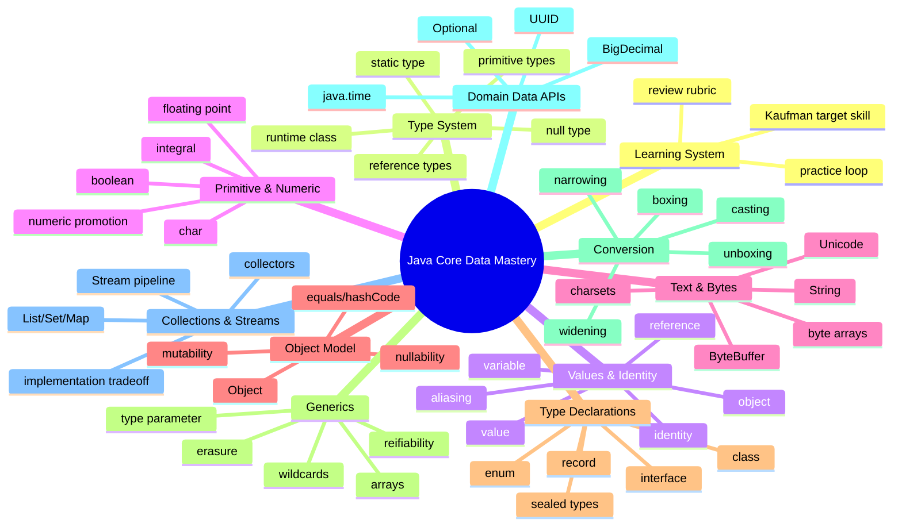
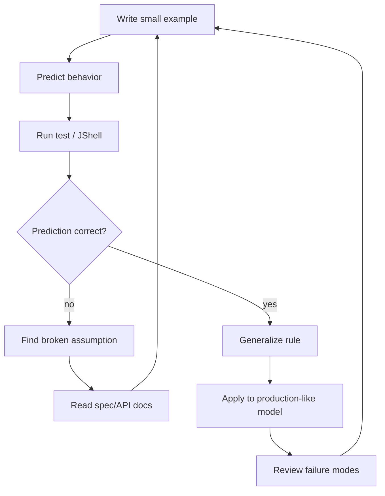

------
title: Learn Java Core Types, Data Model & Data APIs - Part 001
description: Kaufman-style skill map for mastering Java core types, data representation, identity, conversion, collections, streams, and data API semantics.
series: learn-java-core-types
seriesTitle: Learn Java Core Types, Data Model & Data APIs
order: 1
partTitle: Kaufman Skill Map for Java Core Types
tags:
- java
- core-types
- data-model
- kaufman
- advanced
date: 2026-06-27
---

# Kaufman Skill Map for Java Core Types

> Target utama seri ini bukan “hafal tipe data Java”. Targetnya adalah mampu mengambil keputusan representasi data dengan benar ketika sistem makin besar, boundary makin banyak, performance makin sensitif, dan bug makin mahal.

Seri ini membahas Java dari sisi **data model**: bagaimana data direpresentasikan, diberi type, dipindahkan, dikonversi, dibandingkan, disimpan dalam collection, diproses dengan stream, dan dibawa melewati boundary seperti API, database, file, message queue, JSON, dan time zone.

Kita akan menggunakan kerangka Josh Kaufman dari *The First 20 Hours* sebagai cara belajar:

1. tetapkan target skill yang konkret;
2. pecah skill besar menjadi sub-skill kecil;
3. pelajari cukup untuk bisa praktik dan mengoreksi diri;
4. hilangkan friction latihan;
5. lakukan praktik terarah minimal 20 jam.

Namun karena target kita adalah level software engineer senior/top-tier, seri ini tidak berhenti di “20 jam cukup bisa”. Dua puluh jam di sini dipakai sebagai **initial acquisition loop**: cukup untuk membangun peta mental, vocabulary, latihan diagnostik, dan kebiasaan koreksi. Setelah itu, pendalaman terjadi melalui repeated production reasoning.

---

## 1. Apa yang Sebenarnya Dipelajari?

Topik seperti `int`, `String`, `List`, `Map`, `Optional`, `LocalDate`, atau `Stream` sering terlihat sebagai API biasa. Padahal, di sistem besar, pilihan kecil seperti ini menentukan banyak hal:

- apakah data punya identity atau hanya value;
- apakah equality stabil atau rapuh;
- apakah object aman dipakai sebagai key `HashMap`;
- apakah null bisa bocor melewati boundary;
- apakah monetary amount kehilangan presisi;
- apakah timestamp ambigu karena time zone;
- apakah collection mengekspresikan invariant domain;
- apakah stream pipeline deterministik, efisien, dan bebas side effect;
- apakah generics memberi safety atau hanya ilusi akibat erasure;
- apakah conversion terjadi secara eksplisit, implisit, atau berbahaya.

Jadi, “Java Core Types” dalam seri ini berarti:

```text
Data representation + type semantics + conversion rules + object identity + API contracts + failure modes.
```

Kita tidak belajar Java sebagai daftar syntax. Kita belajar Java sebagai sistem aturan untuk membuat data tetap benar.

---

## 2. Target Skill: Bisa Apa Setelah Seri Ini?

Setelah menyelesaikan seri ini, kemampuan yang ditargetkan adalah:

### 2.1 Membaca Kode dari Sisi Type System

Contoh sederhana:

```java
Map<UserId, List<Transaction>> transactionsByUser = loadTransactions();
```

Engineer biasa melihat ini sebagai `Map` dari user ke list transaksi.

Engineer yang kuat membaca lebih dalam:

- Apakah `UserId` immutable?
- Apakah `UserId.equals()` dan `hashCode()` stabil?
- Apakah `List<Transaction>` boleh kosong?
- Apakah urutan transaksi bermakna?
- Apakah list boleh dimodifikasi caller?
- Apakah `Transaction` entity atau value object?
- Apakah timestamp transaksi menggunakan `Instant`, `LocalDateTime`, atau `ZonedDateTime`?
- Apakah amount memakai `BigDecimal`, `long cents`, atau `double`?
- Apakah map merepresentasikan snapshot atau live view?

Kita ingin melatih cara baca seperti ini.

### 2.2 Memilih Representasi Data Secara Defensible

Contoh keputusan:

| Data | Representasi Buruk | Representasi Lebih Baik | Alasan |
|---|---:|---:|---|
| Money | `double` | `BigDecimal` atau domain scalar berbasis minor unit | Presisi dan rounding eksplisit |
| Absence | `null` di semua tempat | `Optional` di return boundary tertentu, explicit nullable di internal boundary | Absence terlihat di API |
| Status domain tertutup | `String` | `enum` atau sealed hierarchy | Exhaustiveness dan valid state |
| Timestamp event | `LocalDateTime` | `Instant` | Timeline global tidak ambigu |
| Ordered unique values | `List` + manual check | `LinkedHashSet` | Contract menyatakan uniqueness + order |
| External ID | `String` mentah | `record UserId(String value)` | Type safety dan validation |

Skill utama bukan mengetahui semua class, tetapi tahu **kenapa** memilih satu representasi dibanding yang lain.

### 2.3 Mendesain API yang Tidak Membocorkan Ambiguitas

API yang lemah:

```java
String getStatus();
List<String> findErrors();
Map<String, Object> metadata();
Date submittedAt();
```

API yang lebih kuat:

```java
enum CaseStatus { DRAFT, SUBMITTED, UNDER_REVIEW, CLOSED }

record ValidationError(String code, String message) {}
record SubmissionInstant(Instant value) {}

CaseStatus status();
List<ValidationError> validationErrors();
Map<MetadataKey, MetadataValue> metadata();
SubmissionInstant submittedAt();
```

Perbedaannya bukan sekadar style. Perbedaannya adalah apakah domain invariant ditaruh di kepala programmer atau di type system.

### 2.4 Mengantisipasi Failure Mode

Seri ini akan terus menanyakan:

```text
Bagaimana kode ini gagal ketika:
- nilainya null?
- collection kosong?
- urutan berubah?
- object mutable?
- key berubah setelah masuk HashMap?
- time zone bergeser karena DST?
- BigDecimal scale berbeda?
- generic type hilang di runtime?
- autoboxing terjadi tanpa disadari?
- stream parallelized?
- equality tidak konsisten dengan ordering?
```

Top-tier engineer bukan hanya menulis happy path. Ia melihat bentuk kegagalan sebelum terjadi.

---

## 3. Anti-Scope: Yang Tidak Akan Diulang

Karena seri sebelumnya sudah membahas Java basic, DSA, dan patterns, seri ini tidak akan mengulang secara panjang:

- syntax dasar Java;
- struktur project dasar;
- OOP introduction;
- algorithmic complexity dasar;
- implementasi data structure dari nol;
- design pattern katalog klasik;
- framework Spring, Hibernate, Kafka, REST secara detail;
- concurrency pattern mendalam.

Namun kita tetap akan menyentuh implikasi topic tersebut jika terkait langsung dengan type/data semantics.

Contoh:

- `ConcurrentHashMap` dibahas dari sisi collection semantics, bukan concurrency internal penuh.
- `record` dibahas dari sisi data carrier dan equality, bukan sebagai pattern DTO generik.
- `BigDecimal` dibahas dari sisi precision dan domain scalar, bukan finance application lengkap.
- `Stream` dibahas dari sisi pipeline semantics dan failure mode, bukan sebagai pengganti semua loop.

---

## 4. Kaufman Deconstruction: Skill Besar Dipecah Jadi Sub-Skill

Skill besar:

```text
Mampu memodelkan, memproses, dan menjaga correctness data di Java production system.
```

Kita pecah menjadi 11 cluster.



Setiap cluster akan dipecah lagi menjadi rule, example, trap, dan decision framework.

---

## 5. Core Mental Model: Java sebagai Sistem Nilai dan Referensi

Sebelum masuk part teknis, kita perlu satu model mental awal.

Di Java, ekspresi menghasilkan **value**.

Value bisa berupa:

1. primitive value, misalnya `42`, `true`, `'A'`, `3.14`;
2. reference value, yaitu reference ke object atau `null`.

Variable menyimpan value sesuai type-nya.

```java
int age = 42;
String name = "Ayu";
```

`age` menyimpan primitive value `42`.

`name` menyimpan reference value yang menunjuk ke object `String`.

Model sederhananya:

```mermaid
flowchart LR
    subgraph StackLike[Variables / Local Slots]
        A[age: int = 42]
        B[name: String = ref#100]
    end

    subgraph HeapLike[Objects]
        S[String object<br/>value = "Ayu"<br/>identity = #100]
    end

    B --> S
```

Diagram ini konseptual. JVM implementation bisa jauh lebih kompleks, tetapi untuk reasoning Java source code, pemisahan ini sangat penting.

### Rule Pertama

```text
Primitive variable stores primitive value.
Reference variable stores reference value, not the object itself.
```

Implikasi:

```java
User a = new User("Ayu");
User b = a;
```

`a` dan `b` bukan dua object. Keduanya menyimpan reference value yang mengarah ke object yang sama.

```java
b.rename("Bima");
System.out.println(a.name()); // Bima, jika User mutable
```

Bug seperti ini bukan bug syntax. Ini bug mental model.

---

## 6. Five-Lens Framework untuk Setiap Type

Setiap kali mempelajari type/API, gunakan lima lensa ini.

### 6.1 Representation Lens

Pertanyaan:

- Data ini disimpan sebagai apa?
- Primitive, object, array, collection, wrapper, record, enum, atau custom type?
- Ada identity atau tidak?
- Ada null atau tidak?
- Ada mutability atau tidak?

Contoh:

```java
record Amount(BigDecimal value) {}
```

Representation-nya bukan sekadar `BigDecimal`. Kita membuat domain scalar `Amount` agar amount tidak tertukar dengan percentage, tax rate, atau discount.

### 6.2 Semantics Lens

Pertanyaan:

- Apa arti equality?
- Apa arti ordering?
- Apa arti kosong?
- Apa arti missing?
- Apa arti duplicate?
- Apa arti time zone?

Contoh:

```java
Set<String> permissions;
```

`Set` berarti tidak ada duplicate dan order tidak semestinya diandalkan kecuali implementasinya menyatakan order, seperti `LinkedHashSet` atau `TreeSet`.

### 6.3 Boundary Lens

Pertanyaan:

- Data datang dari mana?
- Data keluar ke mana?
- Apakah ada serialization/deserialization?
- Apakah format eksternal punya type yang lebih lemah dari Java?
- Apakah null, empty, absent, unknown, dan default dibedakan?

Contoh boundary:

```json
{
  "submittedAt": "2026-06-27T10:15:30+07:00"
}
```

Apakah ini disimpan sebagai `OffsetDateTime`, `ZonedDateTime`, atau dikonversi ke `Instant`? Jawabannya tergantung apakah offset asli penting secara domain.

### 6.4 Cost Lens

Pertanyaan:

- Ada allocation berlebihan?
- Ada boxing/unboxing?
- Ada copy mahal?
- Collection ini cocok untuk read-heavy atau write-heavy?
- Stream pipeline ini lebih jelas atau justru lebih mahal dan sulit debug?

Contoh:

```java
List<Integer> numbers = IntStream.range(0, 1_000_000)
        .boxed()
        .toList();
```

Ini membuat banyak wrapper `Integer`. Kalau hanya agregasi numerik, `IntStream` lebih cocok.

### 6.5 Failure Lens

Pertanyaan:

- Bagaimana jika input null?
- Bagaimana jika string invalid?
- Bagaimana jika number overflow?
- Bagaimana jika time masuk DST gap?
- Bagaimana jika collection dimodifikasi saat iterasi?
- Bagaimana jika key berubah setelah masuk map?

Contoh:

```java
Map<User, Integer> scoreByUser = new HashMap<>();
User user = new User("Ayu");
scoreByUser.put(user, 10);
user.rename("Bima");
scoreByUser.get(user); // bisa gagal jika hashCode bergantung pada name
```

Failure lens memaksa kita menguji contract, bukan hanya output normal.

---

## 7. Decision Stack: Dari Raw Data ke Domain Data

Sistem production jarang mulai dari object yang sudah rapi. Biasanya data datang sebagai string, byte, JSON, row database, event payload, query parameter, atau form input.

Pipeline mental yang akan kita pakai:

```mermaid
flowchart LR
    A[Raw Input<br/>String / byte[] / JSON / DB row] --> B[Parse]
    B --> C[Validate]
    C --> D[Normalize]
    D --> E[Represent]
    E --> F[Protect Invariant]
    F --> G[Process]
    G --> H[Serialize / Persist / Emit]
```

Contoh:

```text
"2026-06-27T10:15:30+07:00"
```

Jangan langsung dianggap sebagai `String timestamp`.

Decision stack:

1. parse sebagai date-time;
2. validasi format;
3. normalisasi ke timeline representation;
4. represent sebagai `Instant` jika domain butuh moment global;
5. simpan invariant bahwa event time tidak boleh future;
6. process dalam collection/stream;
7. serialize dengan format eksplisit.

Kode yang kuat bukan kode yang “bisa parse”. Kode yang kuat menjaga data tetap punya arti setelah melewati banyak boundary.

---

## 8. Type Choice Matrix

Gunakan matrix ini saat memilih representasi.

| Pertanyaan | Sinyal | Kandidat Representasi |
|---|---|---|
| Nilainya numerik kecil dan arithmetic biasa? | Count, index, size | `int`, `long` |
| Nilainya uang/presisi desimal? | Money, tax, rate | `BigDecimal`, custom domain scalar |
| Nilainya ID eksternal? | User ID, Case ID, Transaction ID | `record UserId(String value)` atau `UUID` |
| Nilainya status tertutup? | Draft/submitted/closed | `enum` |
| Nilainya memiliki variasi bentuk tertutup? | Success/failure/pending with data | sealed interface + record implementations |
| Nilainya mungkin tidak ada? | Lookup result | `Optional<T>` untuk return tertentu, explicit null handling di boundary |
| Nilainya sequence dengan urutan bermakna? | Audit trail | `List<T>` |
| Nilainya unik? | Permission set | `Set<T>` |
| Nilainya key-value lookup? | ID to entity | `Map<K, V>` |
| Nilainya waktu global? | Event occurred at | `Instant` |
| Nilainya tanggal manusia tanpa jam? | Birth date, business date | `LocalDate` |
| Nilainya text user-facing? | Name, message | `String`, tapi perhatikan Unicode/normalization/locale |
| Nilainya binary? | File hash, payload | `byte[]`, `ByteBuffer`, domain wrapper |

Matrix bukan aturan absolut. Ia adalah starting point untuk bertanya lebih tajam.

---

## 9. Skill Drill Architecture

Agar pembelajaran tidak pasif, setiap part akan punya latihan kecil. Latihan disusun dalam empat mode.

### 9.1 Explain Drill

Tujuan: memastikan mental model bisa dijelaskan.

Contoh:

```text
Jelaskan perbedaan variable, value, reference, object, dan identity dengan contoh Java.
```

Jika penjelasan masih kabur, lanjut coding biasanya hanya memperbesar kebingungan.

### 9.2 Predict Drill

Tujuan: melatih reasoning sebelum menjalankan kode.

Contoh:

```java
Integer a = 128;
Integer b = 128;
System.out.println(a == b);
System.out.println(a.equals(b));
```

Sebelum run, prediksi output dan alasan. Setelah run, cocokkan dengan model.

### 9.3 Break Drill

Tujuan: sengaja membuat bug untuk memahami boundary.

Contoh:

```java
record UserKey(List<String> roles) {}

Map<UserKey, String> map = new HashMap<>();
List<String> roles = new ArrayList<>(List.of("ADMIN"));
UserKey key = new UserKey(roles);
map.put(key, "allowed");
roles.add("ROOT");
System.out.println(map.get(key));
```

Pertanyaan:

- Mengapa ini berbahaya?
- Apakah `record` otomatis deep immutable?
- Bagaimana memperbaikinya?

### 9.4 Redesign Drill

Tujuan: mengubah representasi yang lemah menjadi representasi kuat.

Input:

```java
class CaseRecord {
    String id;
    String status;
    String submittedAt;
    double penaltyAmount;
    List<String> tags;
}
```

Redesign dengan:

- typed ID;
- enum status;
- `Instant`/`OffsetDateTime` sesuai kebutuhan;
- `BigDecimal` atau money scalar;
- immutable collection;
- validation invariant.

---

## 10. Minimal Practice Project

Untuk mengikuti seri ini, cukup satu project kecil.

Struktur:

```text
learn-java-core-types/
  build.gradle.kts
  src/main/java/dev/learning/coretypes/
  src/test/java/dev/learning/coretypes/
```

Rekomendasi tools:

- Java 25 untuk mengikuti seri versi terbaru;
- JUnit Jupiter untuk latihan cepat;
- JShell untuk eksperimen expression-level;
- IDE debugger;
- optional: JMH jika ingin benchmark serius, tetapi tidak wajib untuk part awal.

Contoh Gradle minimal:

```kotlin
plugins {
    java
}

repositories {
    mavenCentral()
}

dependencies {
    testImplementation(platform("org.junit:junit-bom:5.11.4"))
    testImplementation("org.junit.jupiter:junit-jupiter")
}

tasks.test {
    useJUnitPlatform()
}

java {
    toolchain {
        languageVersion.set(JavaLanguageVersion.of(25))
    }
}
```

Jika environment belum mendukung Java 25, banyak materi tetap bisa dipraktikkan dengan Java 21. Namun part yang menyentuh fitur Java 25/preview akan diberi label.

---

## 11. Self-Correction Loop

Kaufman menekankan belajar cukup untuk bisa mengoreksi diri. Dalam konteks Java type/data model, self-correction berarti punya checklist untuk mendeteksi kesalahan desain.

Gunakan loop berikut:



Contoh self-correction:

```java
BigDecimal a = new BigDecimal("1.0");
BigDecimal b = new BigDecimal("1.00");

System.out.println(a.equals(b));
System.out.println(a.compareTo(b) == 0);
```

Jika prediksi salah, jangan hanya hafal output. Cari broken assumption:

- Apakah `equals` memperhitungkan scale?
- Apakah `compareTo` memperhitungkan numeric value saja?
- Apa implikasinya untuk `HashSet<BigDecimal>` vs `TreeSet<BigDecimal>`?

Model seperti ini lebih penting daripada jawaban satu contoh.

---

## 12. Review Rubric: Apakah Representasi Data Ini Kuat?

Gunakan rubric ini setiap kali membuat model data.

### 12.1 Type Expressiveness

- Apakah type menyatakan domain meaning?
- Apakah `String` dipakai untuk terlalu banyak hal?
- Apakah `Map<String, Object>` dipakai karena cepat atau karena malas modeling?
- Apakah boolean flag menyembunyikan state yang seharusnya enum/sealed type?

### 12.2 Invariant Ownership

- Di mana validation terjadi?
- Apakah constructor/factory menjaga invariant?
- Apakah object bisa masuk state invalid setelah dibuat?
- Apakah setter publik membuka celah invalid state?

### 12.3 Equality and Identity

- Apakah object ini entity atau value object?
- Apakah equality berdasarkan identity, ID, atau seluruh field?
- Apakah `hashCode` stabil selama object ada dalam hash collection?
- Apakah comparator konsisten dengan equals?

### 12.4 Mutability and Sharing

- Apakah collection internal bocor?
- Apakah array internal bocor?
- Apakah record component mutable?
- Apakah caller bisa mengubah state tanpa melewati invariant?

### 12.5 Absence and Nullability

- Apakah `null`, empty, unknown, not-applicable, dan not-loaded dibedakan?
- Apakah `Optional` dipakai di tempat yang tepat?
- Apakah boundary eksternal menangani missing field?

### 12.6 Numeric and Time Correctness

- Apakah numeric type sesuai domain?
- Apakah overflow mungkin?
- Apakah rounding eksplisit?
- Apakah timestamp punya zone/offset/instant semantics yang benar?
- Apakah DST dipertimbangkan?

### 12.7 Collection Contract

- Apakah `List`, `Set`, `Map`, `Queue`, atau `Deque` dipilih karena semantics, bukan kebiasaan?
- Apakah order penting?
- Apakah duplicate boleh?
- Apakah null boleh?
- Apakah mutability collection jelas?

### 12.8 Pipeline Semantics

- Apakah stream pipeline bebas side effect?
- Apakah encounter order penting?
- Apakah parallel stream aman?
- Apakah collector sesuai?
- Apakah loop lebih jelas?

---

## 13. Running Example Sepanjang Seri

Agar pembelajaran terhubung, kita akan memakai domain contoh yang cukup realistis: **case enforcement lifecycle**.

Ini bukan domain tutorial trivial seperti `Person` dan `Car`. Domain ini punya:

- ID;
- status;
- actor;
- timeline;
- evidence;
- penalty amount;
- validation errors;
- state transition;
- audit trail;
- document references;
- optional data;
- collection semantics;
- stream-based reporting.

Versi awal yang buruk:

```java
class EnforcementCaseRaw {
    String id;
    String status;
    String submittedAt;
    String closedAt;
    double penalty;
    List<String> tags;
    Map<String, Object> metadata;
}
```

Target akhir seri:

```java
record CaseId(String value) {
    public CaseId {
        if (value == null || value.isBlank()) {
            throw new IllegalArgumentException("case id must not be blank");
        }
    }
}

enum CaseStatus {
    DRAFT,
    SUBMITTED,
    UNDER_REVIEW,
    ESCALATED,
    CLOSED
}

record MoneyAmount(BigDecimal value) {
    public MoneyAmount {
        Objects.requireNonNull(value, "value");
        if (value.signum() < 0) {
            throw new IllegalArgumentException("money amount must not be negative");
        }
    }
}

record EnforcementCase(
        CaseId id,
        CaseStatus status,
        Instant submittedAt,
        Optional<Instant> closedAt,
        MoneyAmount penalty,
        Set<String> tags,
        Map<String, String> metadata
) {
    public EnforcementCase {
        Objects.requireNonNull(id, "id");
        Objects.requireNonNull(status, "status");
        Objects.requireNonNull(submittedAt, "submittedAt");
        Objects.requireNonNull(closedAt, "closedAt");
        Objects.requireNonNull(penalty, "penalty");
        tags = Set.copyOf(tags);
        metadata = Map.copyOf(metadata);
    }
}
```

Kode ini belum final. Sepanjang seri, kita akan memperbaiki banyak detail:

- apakah `Set<String>` cukup untuk tags?
- apakah metadata perlu typed key?
- apakah `Optional` cocok sebagai record component?
- apakah `MoneyAmount` perlu currency?
- apakah `submittedAt` harus `Instant` atau `OffsetDateTime`?
- apakah `CaseStatus` cukup enum atau perlu sealed transition model?
- apakah state transition harus dipisah dari state snapshot?

Tujuannya bukan membuat model yang paling rumit, tetapi model yang tepat secara semantik.

---

## 14. 20-Hour Practice Plan

Ini rencana awal 20 jam untuk menguasai fondasi seri.

| Jam | Fokus | Output |
|---:|---|---|
| 1 | Membaca peta skill dan setup project | Project siap, JShell/test jalan |
| 2 | Variable, value, reference, object | 10 predict drills |
| 3 | Primitive numeric behavior | Test overflow, promotion, casting |
| 4 | Floating point | Test NaN, infinity, signed zero, precision |
| 5 | Text model | Unicode/code point/string drills |
| 6 | Byte/charset | Encode/decode drills |
| 7 | Object identity/equality | equals/hashCode failure tests |
| 8 | Mutability/defensive copy | Mutable key and leaked collection drills |
| 9 | Null/Optional | Boundary absence redesign |
| 10 | Class/record data modeling | Convert raw class to record/value objects |
| 11 | Enum/sealed domain | Model closed status/transition |
| 12 | Generics and erasure | Raw type/heap pollution examples |
| 13 | Wildcards | Producer/consumer API drills |
| 14 | Arrays vs generics | Reifiability drills |
| 15 | Conversion/casting | Compile-time vs runtime cast drills |
| 16 | Boxing/unboxing | Integer cache/null unboxing/perf traps |
| 17 | BigDecimal/UUID | Domain scalar drills |
| 18 | java.time | Instant/LocalDate/Zone drills |
| 19 | Collections | Contract-based selection drills |
| 20 | Streams | Pipeline redesign and final review |

Setelah 20 jam, kita tidak mengklaim “selesai”. Kita mengklaim cukup kuat untuk membaca dan memperbaiki desain data Java secara sadar.

---

## 15. Cara Menggunakan Seri Ini

Untuk setiap part:

1. baca mental model terlebih dahulu;
2. jalankan minimal 3 contoh kode;
3. buat 1 contoh bug sendiri;
4. tulis ulang 1 model data kecil;
5. jawab review checklist;
6. jangan lanjut jika rule utama masih terasa seperti hafalan.

Pembelajaran efektif bukan berarti cepat pindah bab. Pembelajaran efektif berarti friction rendah, feedback cepat, dan kesalahan mental model cepat terlihat.

---

## 16. Checklist Akhir Part 001

Sebelum lanjut ke Part 002, pastikan bisa menjawab:

- Apa bedanya belajar Java type sebagai syntax dan sebagai data model?
- Mengapa `String`, `double`, `List`, dan `Map<String, Object>` sering menjadi tanda under-modeling?
- Apa lima lensa untuk mengevaluasi type?
- Apa hubungan antara representation, semantics, boundary, cost, dan failure?
- Mengapa variable, value, reference, object, dan identity harus dipisahkan?
- Apa output konkret dari 20-hour practice loop?

Jika jawabanmu masih kabur, ulangi bagian 5 sampai 8. Part berikutnya akan masuk ke peta type system Java secara lebih formal.

---

## Referensi Resmi dan Bacaan

- Java Language Specification, Java SE 25 Edition — terutama Chapter 4, *Types, Values, and Variables*, dan Chapter 5, *Conversions and Contexts*.
- Java SE 25 API Documentation — terutama `java.lang`, `java.lang.reflect.Type`, `java.util`, `java.time`, dan stream package.
- OpenJDK JDK 25 Project Page — status release dan daftar JEP terkait JDK 25.
- Josh Kaufman, *The First 20 Hours: How to Learn Anything ... Fast* — framework deconstruction, deliberate practice, reducing friction, and precommitment.
