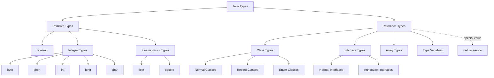
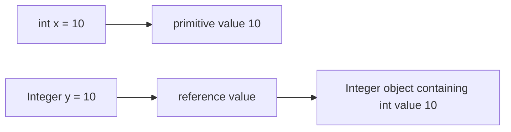
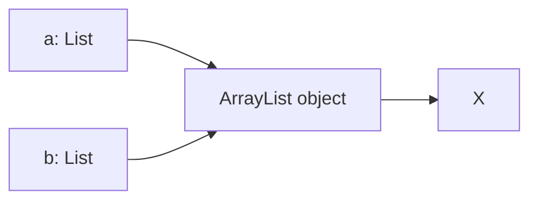
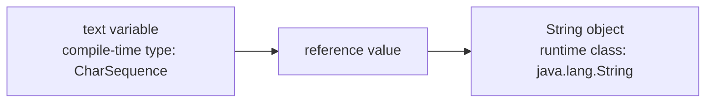
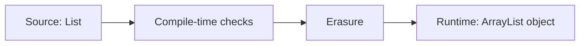
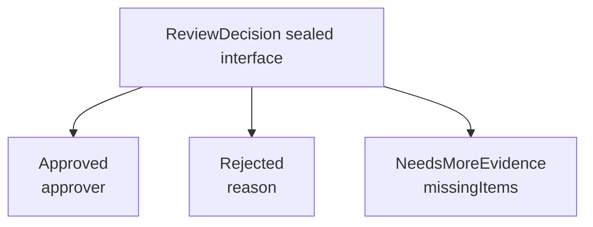
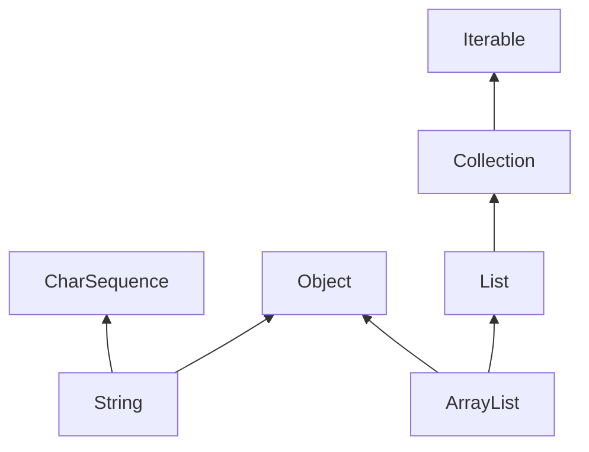

------
title: Learn Java Core Types, Data Model & Data APIs - Part 002
description: A deep mental map of the Java type system: primitive types, reference types, classes, interfaces, arrays, records, enums, null, generics, static types, and runtime classes.
series: learn-java-core-types
seriesTitle: Learn Java Core Types, Data Model & Data APIs
order: 2
partTitle: Java Type System Map
tags:
- java
- type-system
- primitive-types
- reference-types
- jls
- advanced
date: 2026-06-27
---

# Java Type System Map

> Tujuan part ini adalah membangun peta mental Java type system. Setelah peta ini jelas, topik seperti primitive, object, record, enum, interface, generics, casting, boxing, collection, dan stream akan terasa sebagai bagian dari satu sistem, bukan daftar fitur terpisah.

Java adalah bahasa yang statically typed. Artinya, banyak kesalahan type dicegah pada compile time. Tetapi Java juga punya runtime type information, dynamic dispatch, reference conversion, casts, arrays dengan runtime store check, generics dengan erasure, null, reflection, dan preview feature yang terus berevolusi.

Karena itu, Java type system tidak bisa dipahami hanya dengan kalimat “semua adalah object”. Kalimat itu salah. Di Java, **tidak semua adalah object**. Primitive values bukan object. Reference values bisa mengarah ke object atau `null`. Record dan enum adalah bentuk class khusus. Annotation adalah bentuk interface khusus. Array adalah object dengan aturan khusus. Generic type memberi safety compile-time, tetapi sebagian besar informasi generic tidak tersedia sebagai type parameter konkret di runtime karena erasure.

---

## 1. Peta Besar: Kinds of Types

Java Language Specification membagi type menjadi dua keluarga besar:

1. **primitive types**;
2. **reference types**.

Secara konseptual:



Catatan penting:

- `null` adalah literal khusus dan punya type khusus dalam spesifikasi, tetapi tidak bisa dipakai sebagai nama type di source code.
- `String` bukan primitive; `String` adalah class.
- Array adalah object, tetapi syntax dan runtime check-nya punya aturan khusus.
- `record` dan `enum` bukan keluarga type terpisah di level paling atas; keduanya adalah bentuk class khusus.
- Annotation bukan keluarga type terpisah di level paling atas; annotation interface adalah bentuk interface khusus.

---

## 2. Primitive Types: Value Tanpa Identity

Primitive type menyimpan primitive value. Primitive value tidak punya object identity.

Primitive types Java:

| Category | Types | Catatan |
|---|---|---|
| Boolean | `boolean` | hanya `true` dan `false` |
| Integral | `byte`, `short`, `int`, `long`, `char` | `char` adalah unsigned UTF-16 code unit, bukan Unicode character penuh |
| Floating-point | `float`, `double` | approximate numeric values, punya `NaN`, infinity, signed zero |

Contoh:

```java
int a = 10;
int b = 10;
System.out.println(a == b); // true
```

Untuk primitive, `==` membandingkan value.

Tidak ada pertanyaan “apakah `a` dan `b` object yang sama?” karena primitive value tidak punya identity.

### Primitive Bukan Object

Kode ini invalid:

```java
int x = 10;
// x.getClass(); // compile error
```

Namun Java menyediakan wrapper type:

```java
Integer x = 10;
System.out.println(x.getClass()); // class java.lang.Integer
```

Di sini `10` diboxing menjadi object `Integer`. Itu bukan hal yang sama dengan `int`.

### Mental Model



Perbedaan ini akan sangat penting saat membahas boxing, unboxing, generics, collection, performance, dan equality.

---

## 3. Reference Types: Value yang Mengarah ke Object atau null

Reference type adalah type yang value-nya berupa reference. Reference value bisa:

1. mengarah ke object;
2. bernilai `null`.

Contoh:

```java
String name = "Ayu";
String missing = null;
```

`name` menyimpan reference ke object `String`.

`missing` menyimpan null reference.

### Reference Value Bukan Object

Kalimat yang lebih akurat:

```text
Variable bertipe reference menyimpan reference value. Reference value dapat menunjuk ke object.
```

Bukan:

```text
Variable bertipe reference menyimpan object.
```

Contoh:

```java
List<String> a = new ArrayList<>();
List<String> b = a;

b.add("X");
System.out.println(a.size()); // 1
```

`a` dan `b` menyimpan reference value ke object `ArrayList` yang sama.



Ini dasar aliasing. Banyak bug mutability dan defensive copy berasal dari sini.

---

## 4. Object, Class, and Interface

Object adalah instance class atau array.

Object punya runtime class. Variable punya compile-time type.

Contoh:

```java
CharSequence text = "hello";
```

- compile-time type variable `text` adalah `CharSequence`;
- runtime object yang direferensikan adalah instance `String`;
- method yang boleh dipanggil langsung ditentukan compile-time type;
- method implementation yang dieksekusi bisa dipilih berdasarkan runtime class melalui dynamic dispatch.

```java
System.out.println(text.length());     // boleh, ada di CharSequence
// text.toLowerCase();                 // tidak boleh, tidak ada di CharSequence
System.out.println(text.getClass());   // class java.lang.String
```

### Type Variable vs Runtime Class



Ini salah satu mental model paling penting dalam Java.

### Class Type

Class type bisa berasal dari:

- normal class;
- record class;
- enum class;
- nested/member/local/anonymous class;
- sealed/non-sealed/final class.

Contoh normal class:

```java
class Customer {
    private final String name;

    Customer(String name) {
        this.name = Objects.requireNonNull(name);
    }
}
```

Contoh record class:

```java
record CustomerId(String value) {}
```

Contoh enum class:

```java
enum CaseStatus {
    DRAFT,
    SUBMITTED,
    CLOSED
}
```

Record dan enum tetap class, tetapi compiler dan language rules memberi perilaku khusus.

### Interface Type

Interface type menyatakan kontrak. Variable bertipe interface bisa menyimpan reference ke object dari class yang mengimplementasikan interface tersebut.

```java
List<String> names = new ArrayList<>();
```

- declared type: `List<String>`;
- runtime class: `ArrayList`;
- API yang terlihat: contract `List`;
- behavior aktual: implementation `ArrayList` selama tetap memenuhi contract.

Desain Java modern sering memilih interface sebagai boundary dan concrete class sebagai implementation detail.

---

## 5. Static Type vs Runtime Class

Perbedaan ini menentukan banyak hal.

```java
Collection<String> values = new ArrayList<>();
```

| Aspek | Nilai |
|---|---|
| Variable name | `values` |
| Compile-time type | `Collection<String>` |
| Runtime class object | `ArrayList` |
| Allowed method at compile time | method di `Collection` |
| Runtime dispatch | implementation dari `ArrayList` jika method override |
| Generic type argument at source | `String` |
| Generic type at runtime | umumnya erased |

Contoh:

```java
Collection<String> values = new ArrayList<>();
values.add("A");

// values.get(0); // compile error: Collection tidak punya get(int)

List<String> list = (List<String>) values;
System.out.println(list.get(0));
```

Cast memberi tahu compiler bahwa kita ingin memperlakukan reference sebagai `List<String>`. Namun cast bisa gagal di runtime jika object-nya bukan `List`.

```java
Collection<String> values = new HashSet<>();
List<String> list = (List<String>) values; // ClassCastException
```

### Rule

```text
Compile-time type menentukan operasi yang boleh ditulis.
Runtime class menentukan object sebenarnya dan dispatch method.
Cast tidak mengubah object. Cast hanya melakukan runtime check dan mengubah cara compiler memperlakukan expression.
```

---

## 6. Type, Class, Interface: Jangan Disamakan

Di Java, “type” lebih luas dari “class”.

Contoh type yang bukan class biasa:

- primitive type: `int`;
- interface type: `Runnable`;
- array type: `String[]`;
- parameterized type: `List<String>`;
- type variable: `T`;
- wildcard type: `? extends Number`;
- intersection type: `Serializable & Comparable<?>`;
- null type.

`Class<?>` di reflection sering membuat orang berpikir semua type adalah class. Tidak benar.

Contoh:

```java
Class<String> stringClass = String.class;
Class<int[]> intArrayClass = int[].class;
Class<Integer> integerClass = Integer.class;
Class<Integer.TYPE> impossible; // ilustrasi: primitive punya Class object, tapi bukan class declaration
```

`int.class` ada sebagai class literal dan menghasilkan `Class<Integer.TYPE>`-style representation di reflection, tetapi `int` tetap primitive type, bukan class yang bisa punya method instance.

Lebih aman memegang model ini:

```text
JLS type system lebih luas dari reflection Class API.
Class<?> adalah representasi runtime untuk banyak, tetapi tidak semua, konsep type source-level secara lengkap.
```

---

## 7. Arrays: Reference Type dengan Runtime Component Check

Array adalah reference type dan object.

```java
String[] names = new String[3];
Object obj = names;
```

Array punya runtime component type.

```java
Object[] objects = new String[1];
objects[0] = "ok";
objects[0] = new Object(); // ArrayStoreException
```

Mengapa compile-time boleh?

Karena array di Java covariant:

```java
String[] <: Object[]
```

Tetapi runtime tetap tahu array sebenarnya adalah `String[]`, sehingga menyimpan `Object` non-String gagal.

```mermaid
flowchart TD
    A[String[] actual object] --> B[Assigned to Object[] variable]
    B --> C[Store new Object]
    C --> D{Runtime component type String?}
    D -- no --> E[ArrayStoreException]
```

Ini berbeda dari generics.

```java
List<String> strings = new ArrayList<>();
// List<Object> objects = strings; // compile error
```

Generics invariant. Array covariant. Ini akan dibahas mendalam di part arrays/generics/reifiability.

---

## 8. Generics: Compile-Time Safety dengan Erasure

Generics membuat API lebih type-safe.

```java
List<String> names = new ArrayList<>();
names.add("Ayu");
// names.add(123); // compile error
```

Namun generic type arguments umumnya dihapus pada runtime melalui erasure.

Konsekuensi:

```java
List<String> names = new ArrayList<>();
List<Integer> numbers = new ArrayList<>();

System.out.println(names.getClass() == numbers.getClass()); // true
```

Keduanya runtime class-nya `ArrayList`.

### Source-Level Type vs Runtime Representation



Generics tidak sia-sia. Ia sangat berguna untuk compile-time safety. Namun kita harus tahu batasnya:

- tidak bisa `new T()` langsung;
- tidak bisa membuat array generic secara bebas;
- cast generic bisa menghasilkan unchecked warning;
- runtime tidak selalu tahu `List<String>` vs `List<Integer>`;
- raw type bisa merusak safety.

---

## 9. The Null Type and null Reference

`null` adalah value khusus untuk reference type.

```java
String name = null;
List<String> names = null;
Object object = null;
```

`null` bisa diassign ke reference type mana pun.

Tidak bisa diassign ke primitive:

```java
// int x = null; // compile error
```

### Null Tidak Punya Runtime Class

```java
String name = null;
// name.getClass(); // NullPointerException
```

Null bukan object. Null tidak punya class. Null adalah absence of reference.

### Null and Overload

`null` bisa membuat overload resolution menarik:

```java
void print(String value) {}
void print(Integer value) {}

// print(null); // compile error: ambiguous
```

`null` cocok untuk dua reference type yang tidak saling lebih spesifik, sehingga compiler tidak bisa memilih.

### Null as Design Smell

Null bukan selalu salah. Banyak boundary Java masih memakai null. Tetapi null harus diperlakukan sebagai boundary hazard.

Pertanyaan desain:

- Apakah null berarti missing?
- Apakah null berarti unknown?
- Apakah null berarti not loaded?
- Apakah null berarti invalid?
- Apakah null berarti default?

Jika lima arti ini bercampur, type system tidak membantu lagi.

---

## 10. Records: Class Khusus untuk Data Carrier Transparan

Record adalah class khusus untuk membawa data secara transparan.

```java
record UserId(String value) {}
```

Compiler menghasilkan:

- private final fields;
- accessor `value()`;
- canonical constructor;
- `equals`;
- `hashCode`;
- `toString`.

Tetapi record bukan magic immutable object secara mendalam.

```java
record Roles(List<String> values) {}

List<String> list = new ArrayList<>(List.of("ADMIN"));
Roles roles = new Roles(list);
list.add("ROOT");
System.out.println(roles.values()); // [ADMIN, ROOT]
```

Record component `values` final, tetapi object `List` yang direferensikan tetap mutable.

Untuk defensive copy:

```java
record Roles(List<String> values) {
    Roles {
        values = List.copyOf(values);
    }
}
```

### Record Mental Model

```text
Record memberi shallow transparency dan generated value-like methods.
Record tidak otomatis memberi deep immutability atau domain correctness.
```

Record sangat cocok untuk:

- typed ID;
- small value object;
- DTO immutable-ish;
- aggregate snapshot;
- message payload internal;
- return tuple dengan nama field jelas.

Record buruk jika dipakai untuk:

- entity mutable dengan lifecycle kompleks;
- object yang identity-nya bukan seluruh components;
- data dengan invariant yang tidak dijaga;
- wrapper yang membocorkan mutable component.

---

## 11. Enums: Class Khusus untuk Closed Symbolic Domain

Enum adalah class khusus dengan instance terbatas yang dideklarasikan sebagai constants.

```java
enum CaseStatus {
    DRAFT,
    SUBMITTED,
    UNDER_REVIEW,
    CLOSED
}
```

Enum cocok ketika domain value tertutup dan setiap value bisa disebutkan sebagai constant.

Kelebihan enum:

- type-safe dibanding `String`;
- identity constant stabil di JVM;
- bisa digunakan di `switch`;
- bisa punya field/method;
- bisa digunakan dengan `EnumSet` dan `EnumMap` yang efisien;
- membuat invalid status tidak bisa direpresentasikan tanpa parsing failure.

Jangan persist `ordinal()`:

```java
status.ordinal(); // berbahaya untuk storage jangka panjang
```

Jika urutan enum berubah, data rusak.

Lebih aman persist nama stabil atau code eksplisit:

```java
enum CaseStatus {
    DRAFT("DRAFT"),
    SUBMITTED("SUBMITTED"),
    CLOSED("CLOSED");

    private final String code;

    CaseStatus(String code) {
        this.code = code;
    }

    public String code() {
        return code;
    }
}
```

---

## 12. Interfaces: Contract, Boundary, and Polymorphism

Interface type adalah boundary kuat ketika kita ingin bergantung pada capability, bukan implementation.

```java
interface CaseRepository {
    Optional<EnforcementCase> findById(CaseId id);
    void save(EnforcementCase enforcementCase);
}
```

Caller tidak perlu tahu apakah implementation memakai database, memory, REST API, atau cache.

### Default Method

Interface modern bisa punya default method.

```java
interface Named {
    String name();

    default boolean hasName() {
        return !name().isBlank();
    }
}
```

Default method berguna untuk evolusi API, tetapi jangan dipakai untuk menyembunyikan state kompleks.

### Functional Interface

Functional interface punya satu abstract method dan bisa menjadi target lambda.

```java
Predicate<String> nonBlank = s -> !s.isBlank();
```

`Predicate<String>` adalah interface type. Lambda bukan object biasa dari class yang kita tulis, tetapi expression yang dikonversi ke instance functional interface oleh runtime mechanism.

---

## 13. Sealed Types: Closed Hierarchy

Sealed class/interface membatasi siapa yang boleh extend/implement.

```java
sealed interface ReviewDecision
        permits Approved, Rejected, NeedsMoreEvidence {
}

record Approved(String approver) implements ReviewDecision {}
record Rejected(String reason) implements ReviewDecision {}
record NeedsMoreEvidence(List<String> missingItems) implements ReviewDecision {
    public NeedsMoreEvidence {
        missingItems = List.copyOf(missingItems);
    }
}
```

Sealed type cocok ketika domain punya beberapa bentuk tertutup, dan setiap bentuk membawa data berbeda.

Bandingkan dengan enum:

```java
enum DecisionStatus {
    APPROVED,
    REJECTED,
    NEEDS_MORE_EVIDENCE
}
```

Enum cocok jika tiap state hanya symbolic value. Sealed hierarchy cocok jika tiap variant butuh payload berbeda.



---

## 14. Type Contexts: Di Mana Type Dipakai?

Type muncul di banyak tempat:

```java
// field
private final CaseId id;

// parameter
void submit(CaseId id) {}

// return type
Optional<EnforcementCase> find(CaseId id) {}

// local variable
var status = CaseStatus.SUBMITTED;

// generic type argument
List<CaseId> ids;

// cast
CaseId id = (CaseId) value;

// class literal
Class<CaseId> type = CaseId.class;

// array component
CaseId[] idsArray;
```

Setiap context punya aturan. Misalnya:

- assignment context mengizinkan beberapa conversion;
- method invocation context punya overload resolution;
- casting context punya runtime check;
- numeric context memicu numeric promotion;
- string context memicu string conversion.

Part conversion nanti akan membahas ini detail. Untuk sekarang, pegang satu rule:

```text
Tidak semua perubahan type terlihat sebagai cast eksplisit. Banyak conversion terjadi karena context.
```

Contoh:

```java
byte a = 1;
byte b = 2;
// byte c = a + b; // compile error, a + b dipromosikan ke int
int c = a + b;
```

---

## 15. Subtyping: “Can Be Used As” Relationship

Subtyping menjawab pertanyaan:

```text
Apakah value bertipe X bisa digunakan di tempat yang mengharapkan Y?
```

Contoh:

```java
String s = "hello";
CharSequence cs = s;
Object o = s;
```

`String` adalah subtype dari `CharSequence` dan `Object`.

Untuk class/interface:



Untuk primitive, subtyping/conversion harus dipahami hati-hati. `int` bisa widening ke `long`, tetapi `Integer` bukan subtype dari `Long`.

```java
int x = 10;
long y = x; // widening primitive conversion

Integer boxed = 10;
// Long wrong = boxed; // compile error
```

Widening primitive dan inheritance reference adalah mekanisme berbeda.

---

## 16. `var`: Type Inference Bukan Dynamic Typing

`var` membuat compiler menyimpulkan local variable type dari initializer.

```java
var name = "Ayu";
```

`name` tetap statically typed sebagai `String`.

Ini bukan JavaScript-style dynamic variable.

```java
var count = 10;
// count = "ten"; // compile error
```

Gunakan `var` ketika initializer membuat type jelas:

```java
var ids = new ArrayList<CaseId>();
```

Hati-hati ketika `var` menyembunyikan type yang penting untuk pembaca:

```java
var result = repository.findById(id);
```

Apakah `result` `Optional<Case>`? `Case`? `CompletableFuture<Case>`? `Either<Error, Case>`? Jika tidak jelas dari konteks, explicit type lebih baik.

Rule praktis:

```text
Gunakan var untuk mengurangi noise, bukan menghapus informasi domain penting.
```

---

## 17. Type System and Domain Modeling

Type system Java bisa dipakai sebagai alat domain modeling.

Bandingkan:

```java
void assign(String caseId, String officerId) {}
```

Dengan:

```java
record CaseId(String value) {}
record OfficerId(String value) {}

void assign(CaseId caseId, OfficerId officerId) {}
```

Versi pertama memungkinkan bug:

```java
assign(officerId, caseId); // sama-sama String, compiler tidak protes
```

Versi kedua mencegah:

```java
assign(officerId, caseId); // compile error
```

Ini contoh menggunakan type system untuk mengurangi state invalid dan parameter swap bug.

### Primitive Obsession and String Obsession

Primitive obsession terjadi ketika domain penting direpresentasikan dengan primitive mentah.

```java
int age;
double amount;
String status;
String id;
```

Tidak semua primitive/string salah. Yang salah adalah ketika type mentah menyembunyikan invariant.

Contoh domain scalar:

```java
record Age(int value) {
    Age {
        if (value < 0 || value > 150) {
            throw new IllegalArgumentException("invalid age: " + value);
        }
    }
}
```

Kelebihan:

- validation centralized;
- parameter swap lebih sulit;
- method signature lebih jelas;
- future behavior bisa ditambahkan.

Biaya:

- lebih banyak type;
- mapping boundary lebih eksplisit;
- perlu discipline agar tidak over-modeling.

Top-tier engineering adalah kemampuan memilih kapan modeling tambahan membayar biayanya.

---

## 18. Type System Failure Modes

Berikut failure mode umum yang akan sering muncul sepanjang seri.

### 18.1 Runtime Type Surprise

```java
Object value = "hello";
Integer number = (Integer) value; // ClassCastException
```

Cast bukan konversi semantik dari string ke integer. Cast hanya check runtime type.

### 18.2 Null Surprise

```java
Integer value = null;
int x = value; // NullPointerException karena unboxing
```

Masalah terlihat seperti assignment biasa, tetapi context memicu unboxing.

### 18.3 Erasure Surprise

```java
List raw = new ArrayList<String>();
raw.add(123);

List<String> names = raw;
String first = names.get(0); // ClassCastException di titik baca
```

Generic safety bisa dirusak raw type.

### 18.4 Array Covariance Surprise

```java
Object[] objects = new String[1];
objects[0] = new Object(); // ArrayStoreException
```

Compiler mengizinkan assignment, runtime menolak store.

### 18.5 Equality Surprise

```java
Integer a = 1000;
Integer b = 1000;
System.out.println(a == b); // biasanya false
System.out.println(a.equals(b)); // true
```

Wrapper adalah object. `==` pada reference membandingkan reference identity, bukan value equality.

### 18.6 Mutable Key Surprise

```java
record Key(List<String> values) {}

List<String> values = new ArrayList<>(List.of("A"));
Key key = new Key(values);
Map<Key, String> map = new HashMap<>();
map.put(key, "value");

values.add("B");
System.out.println(map.get(key)); // berisiko gagal
```

Record generated `hashCode` bergantung pada component. Jika component mutable berubah, hash berubah.

---

## 19. Java Type System as Engineering Tool

Cara berpikir yang kita targetkan:

```text
Type bukan hanya batas compiler. Type adalah dokumen executable tentang apa yang boleh terjadi.
```

Contoh buruk:

```java
void closeCase(String caseId, String reason, String closedAt) {}
```

Contoh lebih kuat:

```java
record CaseId(String value) {}
record ClosureReason(String value) {}
record ClosureTime(Instant value) {}

void closeCase(CaseId caseId, ClosureReason reason, ClosureTime closedAt) {}
```

Lebih kuat lagi jika closure punya invariant:

```java
record CaseClosure(
        CaseId caseId,
        ClosureReason reason,
        Instant closedAt
) {
    CaseClosure {
        Objects.requireNonNull(caseId);
        Objects.requireNonNull(reason);
        Objects.requireNonNull(closedAt);
    }
}
```

Dan jika status transition tertutup:

```java
sealed interface CaseCommand permits SubmitCase, CloseCase {}

record SubmitCase(CaseId caseId, OfficerId officerId) implements CaseCommand {}
record CloseCase(CaseId caseId, ClosureReason reason, Instant closedAt) implements CaseCommand {}
```

Sekarang type system membantu menyatakan bentuk operasi yang valid.

---

## 20. Practical Rule Set

Pegang rule berikut sebelum lanjut:

1. Java punya primitive types dan reference types.
2. Primitive value tidak punya identity.
3. Reference variable menyimpan reference value, bukan object.
4. Reference value bisa menunjuk ke object atau bernilai `null`.
5. Object punya runtime class.
6. Variable/expression punya compile-time type.
7. Compile-time type menentukan operasi yang boleh ditulis.
8. Runtime class menentukan dispatch dan cast success/failure.
9. Record dan enum adalah class khusus.
10. Annotation adalah interface khusus.
11. Array adalah object dan reference type dengan runtime component check.
12. Generics memberi compile-time safety, tetapi banyak informasi generic dihapus melalui erasure.
13. `var` adalah local type inference, bukan dynamic typing.
14. Cast tidak mengubah object menjadi domain value lain.
15. Type yang baik mengurangi state invalid yang bisa direpresentasikan.

---

## 21. Practice Drill

### Drill 1 — Predict Static vs Runtime Type

Prediksi mana yang compile, output apa yang muncul, dan kenapa.

```java
CharSequence text = "hello";

System.out.println(text.length());
System.out.println(text.getClass().getName());
// System.out.println(text.toLowerCase());

String s = (String) text;
System.out.println(s.toLowerCase());
```

Pertanyaan:

- Apa compile-time type `text`?
- Apa runtime class object-nya?
- Mengapa `toLowerCase()` tidak bisa dipanggil sebelum cast?
- Apakah cast mengubah object?

### Drill 2 — Array vs Generics

```java
Object[] objects = new String[1];
objects[0] = "A";
// objects[0] = new Object();

List<String> strings = new ArrayList<>();
// List<Object> objectList = strings;
```

Pertanyaan:

- Mengapa array assignment pertama boleh?
- Mengapa generic assignment kedua tidak boleh?
- Error apa yang muncul jika `new Object()` dimasukkan ke `String[]` melalui `Object[]`?

### Drill 3 — Type Modeling

Ubah method berikut:

```java
void escalate(String caseId, String fromStatus, String toStatus, String reason, String escalatedAt) {}
```

Menjadi model yang lebih kuat memakai minimal:

- `record CaseId`;
- `enum CaseStatus`;
- `record EscalationReason`;
- `Instant` atau type waktu lain yang kamu pilih;
- object command.

Jelaskan pilihan type waktunya.

---

## 22. Checklist Akhir Part 002

Sebelum lanjut ke Part 003, pastikan bisa menjawab:

- Apa dua keluarga besar type di Java?
- Mengapa `String` bukan primitive?
- Apa bedanya primitive value dan reference value?
- Apa bedanya compile-time type dan runtime class?
- Mengapa cast tidak sama dengan parsing/conversion domain?
- Mengapa array covariant tetapi generics invariant?
- Mengapa record tidak otomatis deep immutable?
- Kapan enum lebih cocok daripada sealed hierarchy?
- Kapan sealed hierarchy lebih cocok daripada enum?
- Mengapa `var` bukan dynamic typing?
- Bagaimana type system membantu mencegah bug parameter swap?

Jika checklist ini sudah jelas, kita siap masuk ke Part 003: **Values, Variables, References, and Objects**.

---

## Referensi Resmi dan Bacaan

- Java Language Specification, Java SE 25 Edition — Chapter 4, *Types, Values, and Variables*.
- Java Language Specification, Java SE 25 Edition — Chapter 5, *Conversions and Contexts*.
- Java SE 25 API Documentation — `java.lang.reflect.Type`.
- Java SE 25 API Documentation — `java.lang.Class`, `java.lang.Object`, `java.lang.Record`, `java.lang.Enum`.
- OpenJDK JDK 25 Project Page.
