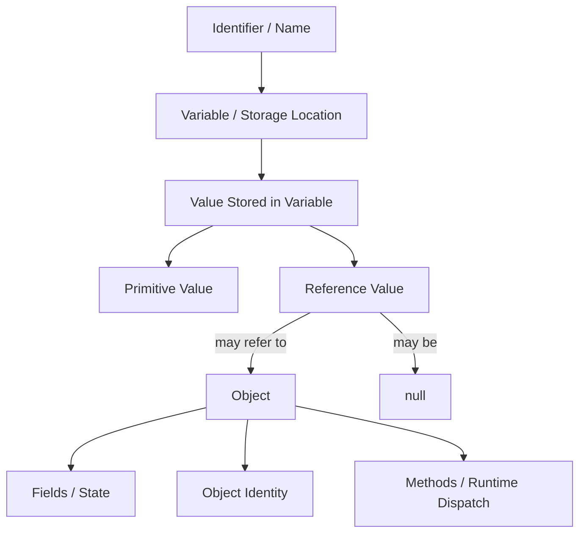
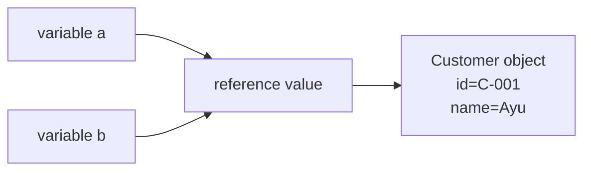
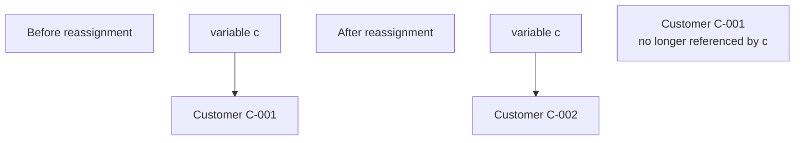
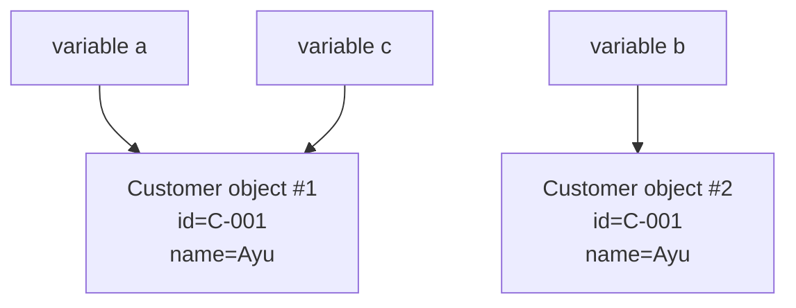
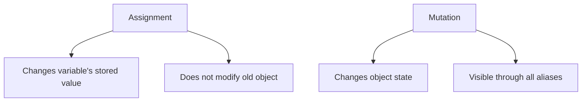
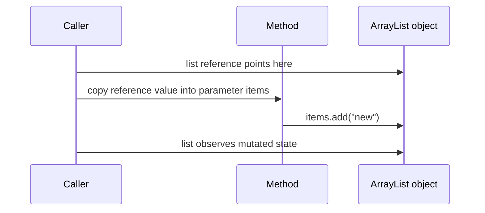
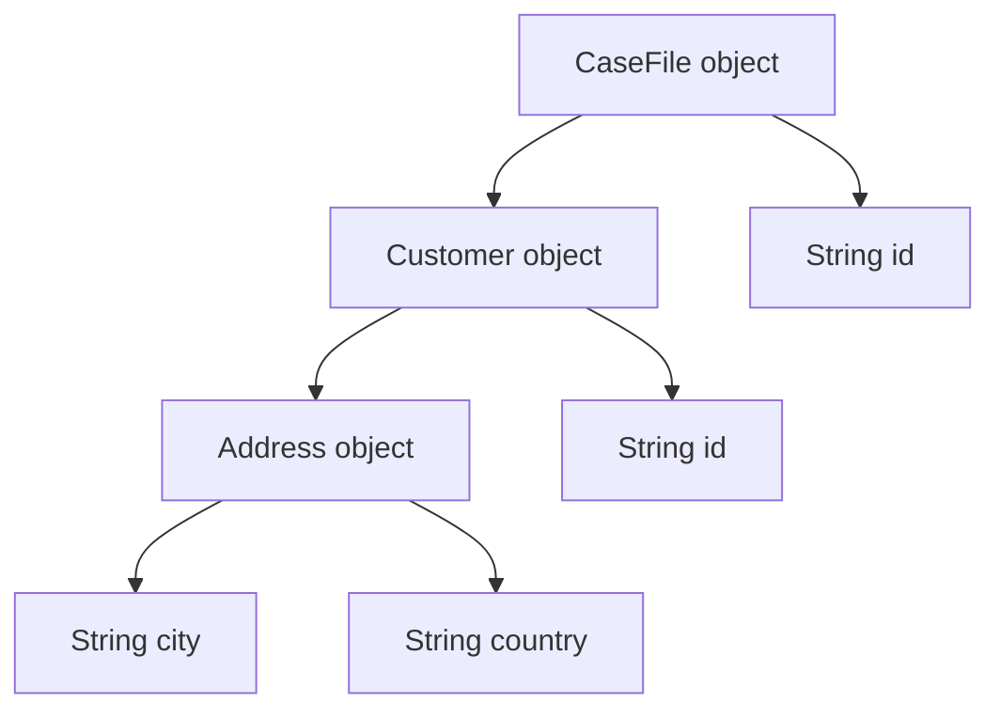
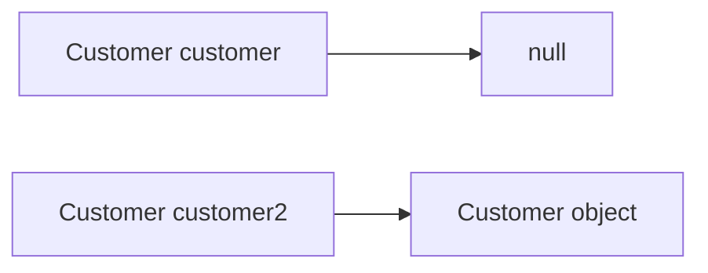
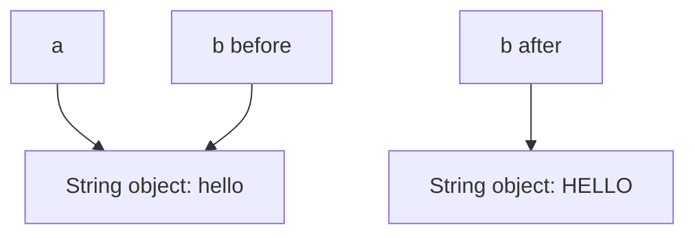
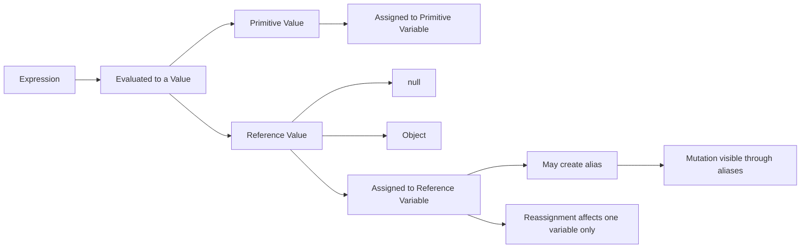

------
title: Learn Java Core Types, Data Model & Data APIs - Part 003
description: Deep mental model of values, variables, references, objects, identity, aliasing, assignment, and Java's pass-by-value semantics.
series: learn-java-core-types
seriesTitle: Learn Java Core Types, Data Model & Data APIs
order: 3
partTitle: Values, Variables, References, and Objects
tags:
- java
- core-types
- data-model
- references
- objects
- identity
- advanced
date: 2026-06-27
---

# Values, Variables, References, and Objects

> Target Part 003: kamu harus bisa membaca kode Java dan langsung membedakan **nama**, **storage location**, **value**, **reference value**, **object**, **identity**, dan **aliasing**. Banyak bug Java senior-level bukan berasal dari tidak tahu syntax, tetapi dari mencampur konsep-konsep ini.

Part ini adalah fondasi dari seluruh seri. Sebelum membahas primitive, boxing, collections, streams, records, equality, atau time, kita harus punya vocabulary yang presisi.

Di Java, pertanyaan seperti ini harus bisa dijawab tanpa ragu:

- `x` itu variable atau object?
- `new Customer(...)` menghasilkan apa?
- `customer` menyimpan object atau reference?
- Saat method dipanggil, object dikirim atau value dikopi?
- Kenapa method bisa mengubah isi object tetapi tidak bisa mengganti variable caller?
- Kenapa dua variable bisa “mengarah” ke object yang sama?
- Apa bedanya equality, identity, dan state equivalence?

Kalau jawaban atas pertanyaan-pertanyaan ini kabur, maka topik setelah ini akan terasa seperti hafalan API.

---

## 1. Mental Model Inti

Java adalah bahasa yang **strongly typed** dan **statically typed**. Setiap expression punya type pada compile time, dan runtime punya aturan sendiri untuk object, reference, conversion, dispatch, dan check tertentu.

Dalam konteks data model, pembedaan paling penting adalah:



Penjelasan singkat:

| Konsep | Arti | Contoh |
|---|---|---|
| Name | Identifier di source code | `count`, `customer`, `args` |
| Variable | Storage location yang punya type | local variable, field, parameter, array component |
| Value | Isi yang disimpan variable | `42`, `true`, reference ke object |
| Primitive value | Nilai langsung dari primitive type | `10`, `'A'`, `3.14`, `false` |
| Reference value | Nilai yang menunjuk/merujuk ke object atau `null` | reference ke `Customer`, `String`, array |
| Object | Entity runtime di heap secara konseptual | instance class atau array |
| Identity | Keunikan object sebagai object tertentu | `a == b` untuk reference |
| State | Data internal object | fields |
| Behavior | Method yang bisa dipanggil | `customer.name()` |

Satu kalimat paling penting:

> Variable tidak menyimpan object. Variable reference type menyimpan **reference value** yang dapat merujuk ke object.

Ini bukan sekadar istilah akademik. Ini menentukan cara kita memahami parameter passing, mutation, aliasing, equality, garbage collection, collections, dan concurrency.

---

## 2. Jangan Samakan Nama dengan Data

Perhatikan kode berikut:

```java
int count = 10;
Customer customer = new Customer("C-001", "Ayu");
```

Di sini:

- `count` adalah nama variable;
- variable `count` punya type `int`;
- value yang disimpan adalah primitive value `10`;
- `customer` adalah nama variable;
- variable `customer` punya type `Customer`;
- value yang disimpan adalah reference value;
- reference value itu merujuk ke object hasil `new Customer(...)`.

`customer` bukan object. `customer` adalah nama variable yang menyimpan reference value.

Ini terlihat remeh, tetapi bedanya sangat besar ketika terjadi assignment:

```java
Customer a = new Customer("C-001", "Ayu");
Customer b = a;
```

Setelah `b = a`, bukan berarti object Customer disalin. Yang disalin adalah reference value.



Artinya `a` dan `b` adalah dua variable berbeda yang menyimpan reference value yang merujuk ke object yang sama.

---

## 3. Variable sebagai Typed Storage Location

Variable adalah lokasi penyimpanan yang punya type. Dalam Java, variable dapat muncul dalam beberapa bentuk:

| Jenis variable | Contoh | Lifetime umum |
|---|---|---|
| Local variable | `int n = 1;` di method | Selama eksekusi block/method |
| Parameter | `void f(Customer c)` | Selama eksekusi method |
| Field | `private Customer owner;` | Selama object/class hidup |
| Array component | `items[0]` | Selama array hidup |
| Exception parameter | `catch (IOException e)` | Selama catch block |
| Lambda parameter | `x -> x + 1` | Selama invocation lambda |

Variable penting karena variable adalah tempat **assignment** bekerja.

```java
int x = 10;
x = 20;
```

Assignment mengganti value yang disimpan di variable `x`.

Untuk reference type:

```java
Customer c = new Customer("C-001", "Ayu");
c = new Customer("C-002", "Budi");
```

Assignment kedua tidak mengubah object pertama. Ia mengganti reference value yang disimpan variable `c`.



Kalau tidak ada reference lain ke object pertama, object itu menjadi eligible for garbage collection. Tetapi timing garbage collection bukan bagian dari semantic yang boleh diandalkan untuk logic aplikasi.

---

## 4. Primitive Value vs Reference Value

Java membagi type ke dua keluarga besar:

1. primitive type;
2. reference type.

Variable primitive type menyimpan primitive value.

```java
int quantity = 5;
boolean active = true;
double ratio = 0.25;
char codeUnit = 'A';
```

Variable reference type menyimpan reference value atau `null`.

```java
String name = "Ayu";
List<String> tags = List.of("urgent", "fraud");
Customer customer = null;
```

Perbedaan mental model:

| Aspek | Primitive value | Reference value |
|---|---|---|
| Bisa `null`? | Tidak | Ya |
| Merujuk ke object? | Tidak | Ya, kecuali `null` |
| Punya identity object? | Tidak | Object yang dirujuk punya identity |
| Bisa dipakai generic type parameter langsung? | Tidak, perlu wrapper | Ya |
| Assignment menyalin apa? | Primitive value | Reference value |
| `==` membandingkan apa? | Nilai primitive | Reference identity, kecuali special case tertentu seperti `String` tidak mengubah aturan `==` |

Contoh:

```java
int a = 10;
int b = a;
b = 20;

System.out.println(a); // 10
System.out.println(b); // 20
```

Untuk primitive, `b = a` menyalin value `10`. Mengubah `b` tidak mengubah `a`.

Untuk reference:

```java
List<String> a = new ArrayList<>();
List<String> b = a;

b.add("urgent");

System.out.println(a); // [urgent]
System.out.println(b); // [urgent]
```

Di sini `b = a` menyalin reference value. `a` dan `b` merujuk ke object `ArrayList` yang sama. `b.add(...)` memutasi object yang sama, sehingga hasilnya terlihat melalui `a`.

---

## 5. Object: Runtime Entity dengan Identity, State, dan Behavior

Object adalah entity runtime yang dibuat dari class instance creation atau array creation. Secara konseptual, object punya:

- identity;
- runtime class;
- state;
- behavior melalui method dispatch;
- lifetime yang dikelola runtime;
- monitor untuk synchronization pada reference object.

Contoh:

```java
var account = new Account("A-001", 100_000);
```

`new Account(...)` membuat object. Variable `account` menyimpan reference value ke object itu.

Object dapat memiliki state:

```java
final class Account {
    private final String id;
    private long balance;

    Account(String id, long balance) {
        this.id = id;
        this.balance = balance;
    }

    void deposit(long amount) {
        this.balance += amount;
    }
}
```

State object adalah fields-nya. Method `deposit` mengubah field `balance` pada object yang dipanggil.

```java
Account a = new Account("A-001", 100_000);
Account b = a;

b.deposit(50_000);
```

Setelah `b.deposit`, object yang sama berubah. `a` dan `b` tetap variable yang berbeda, tetapi keduanya merujuk object yang sama.

---

## 6. Identity: Object yang Sama vs Data yang Sama

Identity menjawab pertanyaan:

> Apakah dua reference merujuk ke object runtime yang sama?

Di Java, `==` pada reference type membandingkan reference identity.

```java
Customer a = new Customer("C-001", "Ayu");
Customer b = new Customer("C-001", "Ayu");
Customer c = a;

System.out.println(a == b); // false
System.out.println(a == c); // true
```

Meskipun `a` dan `b` mungkin berisi data yang sama, keduanya object berbeda.



Equality logis berbeda dari identity:

```java
record Customer(String id, String name) {}

Customer a = new Customer("C-001", "Ayu");
Customer b = new Customer("C-001", "Ayu");

System.out.println(a == b);      // false
System.out.println(a.equals(b)); // true
```

Untuk record, `equals` yang dihasilkan membandingkan component values. Untuk class biasa, `equals` default dari `Object` bersifat identity-based kecuali dioverride.

Part 012 akan membahas equality secara detail. Untuk sekarang, mental modelnya cukup:

- `==` pada reference: object identity;
- `equals`: equality contract sesuai implementasi;
- “data sama” tidak otomatis berarti “object sama”.

---

## 7. Aliasing: Sumber Banyak Bug Production

Aliasing terjadi ketika lebih dari satu reference dapat mencapai object mutable yang sama.

```java
List<String> original = new ArrayList<>();
original.add("A");

List<String> alias = original;
alias.add("B");

System.out.println(original); // [A, B]
```

Aliasing bukan bug. Aliasing adalah konsekuensi normal reference semantics. Bug muncul ketika aliasing tidak disadari.

Contoh API yang bocor:

```java
final class CaseFile {
    private final List<String> notes = new ArrayList<>();

    List<String> notes() {
        return notes; // leak internal mutable state
    }
}
```

Pemanggil bisa mengubah state internal object tanpa melewati invariant:

```java
CaseFile file = new CaseFile();
file.notes().add("tampered");
```

Versi lebih aman:

```java
final class CaseFile {
    private final List<String> notes = new ArrayList<>();

    List<String> notes() {
        return List.copyOf(notes);
    }

    void addNote(String note) {
        if (note == null || note.isBlank()) {
            throw new IllegalArgumentException("note must not be blank");
        }
        notes.add(note);
    }
}
```

Pada level engineering handbook, setiap API yang mengembalikan object mutable harus menjawab:

- Apakah caller boleh memutasi object ini?
- Apakah object ini milik caller, callee, atau shared?
- Apakah mutation harus melewati invariant?
- Apakah perlu defensive copy?
- Apakah cukup unmodifiable view?
- Apakah deep copy diperlukan?

---

## 8. Assignment Tidak Sama dengan Mutation

Ini salah satu pembedaan paling penting.

Assignment mengganti value dalam variable.

```java
customer = anotherCustomer;
```

Mutation mengganti state object.

```java
customer.rename("Ayu Pratama");
```

Contoh:

```java
final class Box {
    int value;

    Box(int value) {
        this.value = value;
    }
}

Box box = new Box(10);
Box alias = box;

alias = new Box(20);

System.out.println(box.value);   // 10
System.out.println(alias.value); // 20
```

`alias = new Box(20)` tidak mengubah object lama. Ia hanya mengganti reference value di variable `alias`.

Berbeda dengan:

```java
Box box = new Box(10);
Box alias = box;

alias.value = 20;

System.out.println(box.value);   // 20
System.out.println(alias.value); // 20
```

Di sini, object yang sama dimutasi.



Engineering consequence:

- Saat review code, cari apakah line tertentu adalah assignment atau mutation.
- Jangan menyebut `a = b` sebagai “copy object” kecuali object benar-benar dicopy eksplisit.
- Jangan mengembalikan mutable internal object tanpa ownership contract.

---

## 9. Java Parameter Passing: Always Pass-by-Value

Java selalu pass-by-value.

Yang dikopi ke parameter adalah value dari argument expression:

- untuk primitive: primitive value;
- untuk reference type: reference value.

Contoh primitive:

```java
static void increment(int x) {
    x++;
}

int n = 10;
increment(n);
System.out.println(n); // 10
```

Parameter `x` adalah variable baru. Ia menerima copy dari value `10`. Mengubah `x` tidak mengubah `n`.

Contoh reference reassignment:

```java
static void replace(List<String> items) {
    items = new ArrayList<>();
    items.add("new");
}

List<String> list = new ArrayList<>();
list.add("old");

replace(list);

System.out.println(list); // [old]
```

Parameter `items` menerima copy dari reference value. Reassignment `items = new ArrayList<>()` hanya mengganti variable parameter `items`, bukan variable `list` di caller.

Contoh reference mutation:

```java
static void append(List<String> items) {
    items.add("new");
}

List<String> list = new ArrayList<>();
list.add("old");

append(list);

System.out.println(list); // [old, new]
```

Kenapa mutation terlihat di caller? Karena `items` dan `list` menyimpan reference value yang merujuk object `ArrayList` yang sama.



Kalimat yang benar:

> Java tidak pass-by-reference. Java pass-by-value, dan untuk reference type, value yang dipass adalah reference value.

Kalimat yang salah tetapi sering terdengar:

> Object dipass by reference.

Lebih presisi:

> Reference value ke object dikopi ke parameter. Object yang dirujuk tetap object yang sama, sehingga mutation terlihat melalui alias lain.

---

## 10. `final` pada Variable Reference Tidak Membuat Object Immutable

`final` pada variable mencegah reassignment variable. Ia tidak otomatis membuat object yang dirujuk immutable.

```java
final List<String> tags = new ArrayList<>();

tags.add("urgent"); // valid
tags = List.of();   // compile-time error
```

`final` berarti variable `tags` hanya boleh menerima assignment sekali. Object `ArrayList` tetap mutable.

Untuk primitive:

```java
final int limit = 10;
limit = 20; // compile-time error
```

Untuk field:

```java
final class CaseFile {
    private final List<String> notes;

    CaseFile(List<String> notes) {
        this.notes = notes;
    }
}
```

Field `notes` final, tetapi list yang dirujuk bisa saja mutable. Bahkan lebih buruk, caller mungkin masih punya alias:

```java
List<String> input = new ArrayList<>();
CaseFile file = new CaseFile(input);
input.add("changed outside");
```

Solusi umum:

```java
final class CaseFile {
    private final List<String> notes;

    CaseFile(List<String> notes) {
        this.notes = List.copyOf(notes);
    }

    List<String> notes() {
        return notes;
    }
}
```

Tetapi hati-hati: `List.copyOf` membuat collection unmodifiable dan memutus alias terhadap struktur list, tetapi tidak membuat element di dalamnya deep immutable.

```java
record Note(StringBuilder text) {}

List<Note> notes = List.copyOf(List.of(new Note(new StringBuilder("A"))));
notes.get(0).text().append("B"); // element state still mutable
```

Part 014 akan membahas immutability dan defensive copying lebih dalam.

---

## 11. Object Creation: `new` Membuat Object Baru, Literal Bisa Punya Aturan Khusus

Untuk class instance biasa:

```java
Customer a = new Customer("C-001", "Ayu");
Customer b = new Customer("C-001", "Ayu");

System.out.println(a == b); // false
```

Setiap `new Customer(...)` membuat object baru.

Untuk array:

```java
int[] xs = new int[3];
String[] names = new String[3];
```

Array juga object. Maka variable `xs` dan `names` menyimpan reference value.

```java
int[] a = {1, 2, 3};
int[] b = a;
b[0] = 99;

System.out.println(a[0]); // 99
```

String literal memiliki aturan khusus terkait string interning:

```java
String a = "java";
String b = "java";
String c = new String("java");

System.out.println(a == b); // true, same interned literal object
System.out.println(a == c); // false, new object
System.out.println(a.equals(c)); // true
```

Aturan `==` tidak berubah. Yang berubah adalah bagaimana object string literal disediakan oleh runtime. Karena itu, production code tetap tidak boleh memakai `==` untuk logical string comparison.

---

## 12. Object Lifetime dan Reachability

Java tidak memberi kamu operasi manual `free`. Object hidup selama masih reachable dari root tertentu secara konseptual. Ketika tidak reachable, object eligible for garbage collection.

Contoh:

```java
Customer c = new Customer("C-001", "Ayu");
c = null;
```

Setelah `c = null`, object lama mungkin tidak lagi reachable jika tidak ada reference lain.

Tetapi jangan menulis logic yang bergantung pada kapan garbage collection terjadi.

Salah:

```java
resource = null;
// berharap file/socket/database connection langsung tertutup
```

Benar:

```java
try (var connection = dataSource.getConnection()) {
    // use connection
}
```

Garbage collection mengelola memory object. Resource eksternal seperti file descriptor, socket, DB connection, lock, native memory, dan thread pool perlu lifecycle eksplisit.

Engineering checklist:

- Object memory: dikelola GC.
- External resource: tutup eksplisit, biasanya `try-with-resources`.
- Cache: pastikan reference tidak menahan object lebih lama dari kebutuhan.
- Listener/callback: unregister jika lifecycle berbeda.
- ThreadLocal: clear bila thread reused.

---

## 13. Object Graph, Bukan Object Tunggal

Production data jarang hanya satu object. Biasanya object membentuk graph.

```java
record Address(String city, String country) {}
record Customer(String id, Address address) {}
record CaseFile(String id, Customer customer) {}
```

Graph konseptual:



Kalau object dalam graph immutable, reasoning mudah. Kalau object dalam graph mutable, aliasing bisa kompleks.

Contoh mutable graph:

```java
final class Address {
    String city;

    Address(String city) {
        this.city = city;
    }
}

record Customer(String id, Address address) {}

Address shared = new Address("Jakarta");
Customer a = new Customer("C-001", shared);
Customer b = new Customer("C-002", shared);

b.address().city = "Bandung";

System.out.println(a.address().city); // Bandung
```

`a` dan `b` berbeda customer, tetapi berbagi object `Address` yang sama. Mutation lewat satu path terlihat lewat path lain.

Dalam desain domain, tanyakan:

- Apakah sub-object boleh shared?
- Apakah sub-object immutable?
- Apakah update harus copy-on-write?
- Apakah aggregate root harus mengontrol mutation?
- Apakah DTO boleh berbagi nested mutable object?

---

## 14. Reference Nullability

Variable reference type dapat berisi `null` kecuali kamu membuat kontrak eksternal yang melarangnya.

```java
Customer customer = null;
```

`null` bukan object. `null` adalah null reference.

Konsekuensi:

```java
customer.name(); // NullPointerException
```

NPE terjadi karena operasi instance membutuhkan object, sedangkan reference value adalah `null`.

Model mental:



`null` harus diperlakukan sebagai bagian dari model data, bukan sekadar exception teknis. Di boundary production, `null` dapat berarti banyak hal:

- field belum diisi;
- data tidak diketahui;
- data tidak berlaku;
- data sengaja dikosongkan;
- data hilang saat mapping;
- bug di upstream;
- optional relationship;
- backward compatibility payload lama.

Part 013 akan membahas absence modeling lebih dalam. Untuk sekarang, pegang aturan:

> Jangan biarkan `null` membawa banyak makna domain yang berbeda tanpa model eksplisit.

---

## 15. Static Type vs Runtime Class

Variable punya declared/static type. Object punya runtime class.

```java
List<String> names = new ArrayList<>();
```

- static type variable `names`: `List<String>`;
- runtime class object: `ArrayList`.

Static type menentukan apa yang boleh dipanggil compiler:

```java
names.add("Ayu"); // valid, method ada di List
names.ensureCapacity(100); // compile-time error, not in List
```

Padahal runtime object adalah `ArrayList`, tetapi compiler melihat variable sebagai `List<String>`.

Kamu bisa mengubah static view dengan cast:

```java
if (names instanceof ArrayList<String> arrayList) {
    arrayList.ensureCapacity(100);
}
```

Namun cast bukan mengubah object. Cast hanya mengatakan kepada compiler/runtime bahwa reference value diperlakukan sebagai type tertentu jika valid.

```java
Object x = "hello";
String s = (String) x; // valid
Integer n = (Integer) x; // ClassCastException
```

Object yang dirujuk tetap object `String`.

---

## 16. Declared Type adalah API Boundary

Pilihan declared type adalah keputusan desain.

```java
ArrayList<String> names = new ArrayList<>();
```

vs

```java
List<String> names = new ArrayList<>();
```

Kalau variable/API menggunakan `ArrayList`, kamu mengekspos detail implementasi. Kalau menggunakan `List`, kamu mengekspos contract: ordered sequence yang bisa diakses dengan index.

API design:

```java
// Too specific
void process(ArrayList<String> tags) { ... }

// Better
void process(List<String> tags) { ... }

// Maybe even better if only iteration needed
void process(Collection<String> tags) { ... }

// Maybe best if streaming pipeline only
void process(Stream<String> tags) { ... }
```

Declared type harus mencerminkan operasi yang benar-benar dibutuhkan.

Checklist:

| Kebutuhan | Type parameter/input yang masuk akal |
|---|---|
| Hanya iterasi | `Iterable<T>` |
| Butuh size dan membership | `Collection<T>` |
| Butuh index/order sequence | `List<T>` |
| Butuh uniqueness | `Set<T>` |
| Butuh key lookup | `Map<K,V>` |
| Butuh FIFO/LIFO-ish operations | `Queue<T>` / `Deque<T>` |
| Butuh implementation-specific tuning | Implementation concrete, tetapi biasanya lokal/internal |

---

## 17. Array Components adalah Variable

Array bukan primitive. Array adalah object. Setiap element/component array adalah variable.

```java
int[] xs = new int[3];
xs[0] = 10;
xs[1] = xs[0];
xs[1] = 20;

System.out.println(xs[0]); // 10
```

Untuk primitive array, component menyimpan primitive value.

Untuk reference array:

```java
Customer[] customers = new Customer[2];
customers[0] = new Customer("C-001", "Ayu");
customers[1] = customers[0];
```

`customers[0]` dan `customers[1]` adalah dua array component variable yang menyimpan reference value ke object yang sama.

```mermaid
graph TD
    Array[Customer[] object]
    Array --> C0[component 0]
    Array --> C1[component 1]
    C0 --> O[Customer object]
    C1 --> O
```

Array assignment:

```java
customers[1] = new Customer("C-002", "Budi");
```

Mengganti component 1 saja. Object component 0 tidak berubah.

Array sangat penting untuk memahami:

- object graph;
- mutability;
- defensive copy;
- covariance;
- varargs;
- bridge antara Java dan low-level data;
- collections internal implementation.

---

## 18. String sebagai Reference Type yang Immutable

`String` sering membuat pemula bingung karena terasa seperti primitive. Secara type system, `String` adalah reference type. Object `String` immutable.

```java
String a = "hello";
String b = a;

b = b.toUpperCase();

System.out.println(a); // hello
System.out.println(b); // HELLO
```

`toUpperCase()` tidak mengubah object string lama. Ia menghasilkan string baru.



Karena `String` immutable, aliasing terhadap string aman dari mutation. Namun bukan berarti semua reference type aman. `StringBuilder`, `ArrayList`, `HashMap`, array, dan banyak domain object bisa mutable.

---

## 19. Wrapper Object dan Identity Trap

Wrapper seperti `Integer`, `Long`, `Boolean`, `Double` adalah object. Mereka digunakan ketika primitive value perlu diperlakukan sebagai reference type, misalnya di generics.

```java
Integer a = 100;
Integer b = 100;
Integer c = 1000;
Integer d = 1000;

System.out.println(a == b); // often true due to cache rules for certain values
System.out.println(c == d); // often false
System.out.println(c.equals(d)); // true
```

Untuk production rule:

> Jangan gunakan `==` untuk membandingkan wrapper numeric secara logis. Gunakan unboxing eksplisit dengan hati-hati atau `equals`, sesuai nullability contract.

Wrapper juga bisa `null`:

```java
Integer count = null;
int n = count; // NullPointerException due to unboxing
```

Part 024 akan membahas boxing/unboxing secara detail. Di part ini, intinya:

- `int` adalah primitive value;
- `Integer` adalah reference type;
- variable `Integer` menyimpan reference value;
- object wrapper punya identity, meskipun sebaiknya diperlakukan sebagai value-like;
- unboxing `null` adalah failure mode umum.

---

## 20. Local Variable Type Inference `var` Tidak Mengubah Semantic

`var` hanya membuat compiler menginfer static type local variable dari initializer.

```java
var name = "Ayu";               // inferred String
var names = new ArrayList<String>(); // inferred ArrayList<String>
```

`var` bukan dynamic typing.

```java
var x = 10;
x = "hello"; // compile-time error
```

Hati-hati dengan declared type yang terlalu spesifik karena `var` mengikuti initializer.

```java
var tags = new ArrayList<String>();
```

Static type `tags` adalah `ArrayList<String>`, bukan `List<String>`.

Jika kamu ingin boundary lokal tetap pada interface:

```java
List<String> tags = new ArrayList<>();
```

Rule praktis:

- gunakan `var` ketika initializer membuat type jelas dan tidak merusak abstraction;
- hindari `var` ketika interface contract lebih penting daripada concrete implementation;
- jangan gunakan `var` untuk menyembunyikan type domain yang penting untuk review.

---

## 21. Copy: Shallow, Deep, Structural, dan Semantic

Karena assignment reference tidak menyalin object, kita perlu vocabulary untuk copy.

### 21.1 Reference Copy

```java
List<String> a = new ArrayList<>();
List<String> b = a;
```

Yang disalin hanya reference value. Tidak ada object baru untuk list.

### 21.2 Shallow Copy

```java
List<StringBuilder> a = new ArrayList<>();
a.add(new StringBuilder("A"));

List<StringBuilder> b = new ArrayList<>(a);
b.get(0).append("B");

System.out.println(a.get(0)); // AB
```

List object baru dibuat, tetapi element reference masih sama.

### 21.3 Deep Copy

```java
List<StringBuilder> b = a.stream()
    .map(sb -> new StringBuilder(sb.toString()))
    .toList();
```

Container dan element mutable disalin.

### 21.4 Semantic Copy

Kadang copy bukan sekadar clone fields. Dalam domain, copy harus menjawab:

- Apakah ID tetap sama?
- Apakah audit trail ikut?
- Apakah version berubah?
- Apakah status reset?
- Apakah timestamps baru?
- Apakah ownership berubah?

Contoh:

```java
record CaseDraft(
    String templateId,
    String createdBy,
    List<String> allegations
) {}
```

Membuat case baru dari template bukan deep copy mentah. Itu operasi domain:

```java
CaseFile createFromTemplate(CaseTemplate template, User actor, Clock clock) {
    return new CaseFile(
        CaseId.newId(),
        template.defaultTitle(),
        List.copyOf(template.defaultAllegations()),
        actor.id(),
        Instant.now(clock),
        CaseStatus.DRAFT
    );
}
```

---

## 22. State Sharing vs Data Sharing

Tidak semua sharing buruk. Yang berbahaya adalah sharing mutable state tanpa contract.

Aman:

```java
String country = "ID";
Customer a = new Customer("C-001", country);
Customer b = new Customer("C-002", country);
```

`String` immutable, sharing aman.

Relatif aman:

```java
List<String> tags = List.of("urgent", "fraud");
```

List unmodifiable dan elements `String` immutable.

Berbahaya:

```java
List<StringBuilder> notes = List.of(new StringBuilder("A"));
```

List tidak bisa ditambah/dikurangi, tetapi element mutable.

Lebih berbahaya:

```java
Map<String, Object> payload = new HashMap<>();
```

`Object` value membuat contract kabur:

- siapa owner value?
- type sebenarnya apa?
- boleh dimutasi?
- equality-nya apa?
- serialization-nya bagaimana?

Dalam sistem besar, sharing harus eksplisit:

| Bentuk sharing | Kelayakan |
|---|---|
| Immutable value sharing | Sangat baik |
| Read-only view dengan mutable backing | Hati-hati, bisa berubah dari belakang |
| Shared mutable object dengan synchronization | Bisa, tetapi mahal secara reasoning |
| Shared mutable object tanpa protocol | Sumber bug |
| Copy-on-write | Baik untuk read-heavy, write-light |
| Ownership transfer | Baik bila contract jelas |

---

## 23. Identity Object vs Value Object

Part ini belum membahas domain-driven design secara penuh, tetapi distinction ini penting.

Identity object/entity:

```java
final class CustomerAccount {
    private final AccountId id;
    private long balance;
}
```

Object ini penting karena “account yang sama” tetap sama meskipun balance berubah. Identity-nya domain-level.

Value object:

```java
record Money(String currency, BigDecimal amount) {}
```

`Money("IDR", 1000)` sama secara value dengan money lain yang punya currency dan amount sama. Identity object runtime tidak penting.

Java reference object tetap punya runtime identity, bahkan untuk value object yang kita modelkan dengan record. Tetapi desain API harus memperlakukan value object berdasarkan equality, bukan identity.

Rule:

- Entity: identity domain stabil, state dapat berubah dengan lifecycle.
- Value object: equality berdasarkan value, idealnya immutable.
- DTO: data carrier lintas boundary, jangan beri domain invariant yang salah tempat.
- Event: fakta masa lalu, sebaiknya immutable.
- Command: request intention, biasanya immutable.

---

## 24. Debugging Mental Model

Saat melihat bug mutation/reference, gunakan urutan pertanyaan ini:

1. Variable mana yang berubah value-nya?
2. Object mana yang berubah state-nya?
3. Apakah ada alias ke object yang sama?
4. Apakah method melakukan reassignment atau mutation?
5. Apakah field final tetapi object mutable?
6. Apakah collection dicopy shallow saja?
7. Apakah array bocor dari internal state?
8. Apakah `null` masuk dari boundary?
9. Apakah static type menyembunyikan runtime class?
10. Apakah equality yang dipakai identity atau logical equality?

Contoh bug:

```java
record WorkflowConfig(List<String> allowedTransitions) {}

class WorkflowService {
    private final WorkflowConfig config;

    WorkflowService(WorkflowConfig config) {
        this.config = config;
    }

    boolean canTransition(String transition) {
        return config.allowedTransitions().contains(transition);
    }
}
```

Terlihat immutable karena `record`, tetapi tidak aman jika list mutable dari luar:

```java
List<String> transitions = new ArrayList<>(List.of("DRAFT->SUBMITTED"));
WorkflowConfig config = new WorkflowConfig(transitions);
WorkflowService service = new WorkflowService(config);

transitions.clear();

System.out.println(service.canTransition("DRAFT->SUBMITTED")); // false
```

Fix:

```java
record WorkflowConfig(List<String> allowedTransitions) {
    WorkflowConfig {
        allowedTransitions = List.copyOf(allowedTransitions);
    }
}
```

---

## 25. Production Failure Modes

### 25.1 Accidental Shared Mutable List

```java
class CaseTemplate {
    private final List<String> defaultTags;

    CaseTemplate(List<String> defaultTags) {
        this.defaultTags = defaultTags;
    }
}
```

Problem: caller still owns alias.

Fix:

```java
this.defaultTags = List.copyOf(defaultTags);
```

### 25.2 Mutating Input Parameter Unexpectedly

```java
void normalize(List<String> tags) {
    tags.replaceAll(String::trim);
}
```

Problem: method name may not imply mutation.

Better:

```java
List<String> normalized(List<String> tags) {
    return tags.stream()
        .map(String::trim)
        .toList();
}
```

Atau rename eksplisit:

```java
void normalizeInPlace(List<String> tags) { ... }
```

### 25.3 Reference Equality for Domain Data

```java
if (status == new String("APPROVED")) { ... }
```

Salah. Untuk string/domain value gunakan `.equals`, enum, atau typed value.

### 25.4 Hidden Null Unboxing

```java
Integer retryCount = config.retryCount();
if (retryCount > 3) { ... } // NPE if null
```

Fix dengan explicit absence policy:

```java
int retryCount = config.retryCount().orElse(0);
```

atau:

```java
Integer retryCount = config.retryCount();
if (retryCount != null && retryCount > 3) { ... }
```

Lebih baik: jangan modelkan config numeric optional sebagai nullable wrapper tanpa policy.

### 25.5 Mutable Key in HashMap

```java
record Key(StringBuilder id) {}

Map<Key, String> map = new HashMap<>();
Key key = new Key(new StringBuilder("A"));
map.put(key, "value");

key.id().append("B");

System.out.println(map.get(key)); // may fail logically
```

Part 012 dan Part 031 akan membahas ini lebih detail. Akar masalahnya: object yang dipakai sebagai key harus punya equality/hashCode stabil selama berada di map.

---

## 26. Worked Example: Regulatory Case Assignment

Misal kita punya assignment case:

```java
record OfficerId(String value) {}
record CaseId(String value) {}

enum CaseStatus {
    DRAFT,
    ASSIGNED,
    IN_REVIEW,
    CLOSED
}

final class CaseFile {
    private final CaseId id;
    private CaseStatus status;
    private OfficerId assignedOfficer;

    CaseFile(CaseId id) {
        this.id = id;
        this.status = CaseStatus.DRAFT;
    }

    void assignTo(OfficerId officerId) {
        if (status != CaseStatus.DRAFT) {
            throw new IllegalStateException("Only draft cases can be assigned");
        }
        this.assignedOfficer = officerId;
        this.status = CaseStatus.ASSIGNED;
    }
}
```

Pertanyaan semantic:

- `CaseFile` adalah entity dengan identity domain `CaseId`.
- `CaseStatus` adalah enum value domain tertutup.
- `OfficerId` adalah value object kecil.
- `assignTo` memutasi state object `CaseFile`.
- Caller yang punya reference ke object `CaseFile` yang sama akan melihat status berubah.

Jika ingin model immutable:

```java
record CaseFileSnapshot(
    CaseId id,
    CaseStatus status,
    OfficerId assignedOfficer
) {
    CaseFileSnapshot assignTo(OfficerId officerId) {
        if (status != CaseStatus.DRAFT) {
            throw new IllegalStateException("Only draft cases can be assigned");
        }
        return new CaseFileSnapshot(id, CaseStatus.ASSIGNED, officerId);
    }
}
```

Di versi immutable:

- `assignTo` tidak memutasi object lama;
- ia menghasilkan object baru;
- caller harus memakai hasil return.

```java
CaseFileSnapshot oldCase = new CaseFileSnapshot(id, CaseStatus.DRAFT, null);
CaseFileSnapshot newCase = oldCase.assignTo(officerId);
```

Trade-off:

| Model | Kelebihan | Risiko |
|---|---|---|
| Mutable entity | Natural untuk lifecycle domain, mudah dengan ORM | Aliasing, concurrency, hidden mutation |
| Immutable snapshot | Reasoning mudah, audit/event friendly | Allocation, harus jelas versioning dan persistence strategy |

---

## 27. Worked Example: Method That “Does Not Work”

Bug umum:

```java
static void approve(CaseStatus status) {
    status = CaseStatus.CLOSED;
}

CaseStatus status = CaseStatus.IN_REVIEW;
approve(status);
System.out.println(status); // IN_REVIEW
```

Kenapa? Karena `status` parameter adalah variable baru. Assignment di dalam method tidak mengubah variable caller.

Untuk mengubah state, harus ada object yang dimutasi:

```java
final class CaseFile {
    private CaseStatus status = CaseStatus.IN_REVIEW;

    void close() {
        this.status = CaseStatus.CLOSED;
    }
}

static void approve(CaseFile file) {
    file.close();
}
```

Atau return value baru:

```java
static CaseStatus approve(CaseStatus status) {
    if (status != CaseStatus.IN_REVIEW) {
        throw new IllegalStateException();
    }
    return CaseStatus.CLOSED;
}

status = approve(status);
```

Design question:

- Apakah operasi ini harus mutation-based?
- Atau transition function yang return state baru?
- Apakah status berdiri sendiri cukup, atau harus melekat ke aggregate dengan invariant?

---

## 28. Review Heuristics ala Senior Engineer

Saat membaca pull request Java, jangan hanya cek syntax. Cek semantic data movement.

### 28.1 Constructor

```java
User(List<Role> roles) {
    this.roles = roles;
}
```

Tanya:

- Apakah `roles` bisa dimutasi caller setelah constructor?
- Apakah `Role` immutable?
- Apakah null allowed?
- Apakah duplicate allowed?
- Apakah order significant?

### 28.2 Getter

```java
List<Role> roles() {
    return roles;
}
```

Tanya:

- Apakah ini membocorkan mutable list?
- Apakah caller boleh mutate?
- Kalau tidak, return `List.copyOf`, unmodifiable list, atau immutable internal representation?

### 28.3 Method Parameter

```java
void apply(Map<String, Object> changes)
```

Tanya:

- Type information hilang di mana?
- Siapa validasi value type?
- Apakah mutation terhadap map berdampak ke caller?
- Apakah key string punya schema?
- Apakah ini harus record/command typed?

### 28.4 Reassignment vs Mutation

```java
void reset(User user) {
    user = new User();
}
```

Tanya:

- Apakah author berpikir ini mengubah caller?
- Jika iya, bug.
- Harus return value atau mutate object yang dirujuk.

---

## 29. Diagram Ringkas: Data Movement in Java



---

## 30. Mini Practice

### Practice 1 — Predict Output

```java
static void f(List<String> xs) {
    xs.add("B");
    xs = new ArrayList<>();
    xs.add("C");
}

public static void main(String[] args) {
    List<String> xs = new ArrayList<>();
    xs.add("A");
    f(xs);
    System.out.println(xs);
}
```

Jawaban: `[A, B]`.

Reasoning:

- parameter `xs` menerima copy reference value;
- `xs.add("B")` memutasi object caller;
- `xs = new ArrayList<>()` mengganti variable parameter saja;
- `xs.add("C")` memutasi list baru yang tidak dilihat caller.

### Practice 2 — Fix Aliasing

Kode:

```java
record Report(List<String> lines) {}
```

Masalah: record tidak mencegah list mutable dari luar.

Fix:

```java
record Report(List<String> lines) {
    Report {
        lines = List.copyOf(lines);
    }
}
```

### Practice 3 — Identify Identity vs Equality

```java
record CaseId(String value) {}

CaseId a = new CaseId("C-001");
CaseId b = new CaseId("C-001");

System.out.println(a == b);
System.out.println(a.equals(b));
```

Output:

```text
false
true
```

Reasoning:

- dua object record berbeda;
- generated `equals` membandingkan component value.

---

## 31. Latihan 20 Jam untuk Part Ini

Karena ini part fondasi, latihan bukan banyak API. Latihannya adalah membaca dan memprediksi semantic.

### Sesi 1 — Assignment vs Mutation

Buat 20 contoh kecil dengan kombinasi:

- primitive assignment;
- reference assignment;
- object mutation;
- array component mutation;
- list mutation;
- reassignment parameter.

Untuk setiap contoh, tulis diagram reference sebelum menjalankan kode.

### Sesi 2 — Aliasing Audit

Ambil 5 class dari codebase atau latihan. Tandai:

- field mutable;
- constructor yang menyimpan reference input;
- getter yang mengembalikan mutable internal;
- method yang memutasi parameter;
- object graph shared.

### Sesi 3 — Refactor ke Value Object

Ubah stringly-typed ID menjadi record:

```java
record CaseId(String value) {}
record OfficerId(String value) {}
```

Lihat bug apa yang bisa dicegah compiler.

### Sesi 4 — Immutable Boundary

Buat `CaseSnapshot` immutable dengan record dan `List.copyOf`. Uji bahwa mutation dari input list tidak memengaruhi object.

### Sesi 5 — Mutation Contract

Ambil method yang menerima collection. Buat dua versi:

- `normalizeInPlace(List<String> input)`;
- `normalized(List<String> input)`.

Bandingkan API clarity.

---

## 32. Checklist Akhir Part 003

Sebelum lanjut ke Part 004, pastikan kamu bisa menjawab:

- Apa bedanya name, variable, value, reference value, dan object?
- Apa yang disalin saat assignment primitive?
- Apa yang disalin saat assignment reference?
- Mengapa Java disebut pass-by-value?
- Mengapa method bisa memutasi object caller tetapi tidak bisa reassign variable caller?
- Apa itu aliasing?
- Apa bedanya assignment dan mutation?
- Apa arti `final` pada variable reference?
- Mengapa `String` reference type tetapi terasa value-like?
- Mengapa record dengan `List` component belum tentu immutable?
- Apa bedanya identity dan logical equality?
- Apa risiko mengembalikan mutable internal collection?
- Bagaimana cara membaca object graph sederhana?

Jika checklist ini sudah jelas, kamu siap masuk ke Part 004: **Primitive Types and Literals**.

---

## Referensi Resmi dan Bacaan

- Java Language Specification, Java SE 25 Edition — Chapter 4, *Types, Values, and Variables*.
- Java Language Specification, Java SE 25 Edition — Chapter 5, *Conversions and Contexts*.
- Java Language Specification, Java SE 25 Edition — Chapter 15, *Expressions*.
- Java SE 25 API Documentation — `java.lang.Object`.
- Java SE 25 API Documentation — `java.lang.String`.
- Java SE 25 API Documentation — `java.util.List`.
