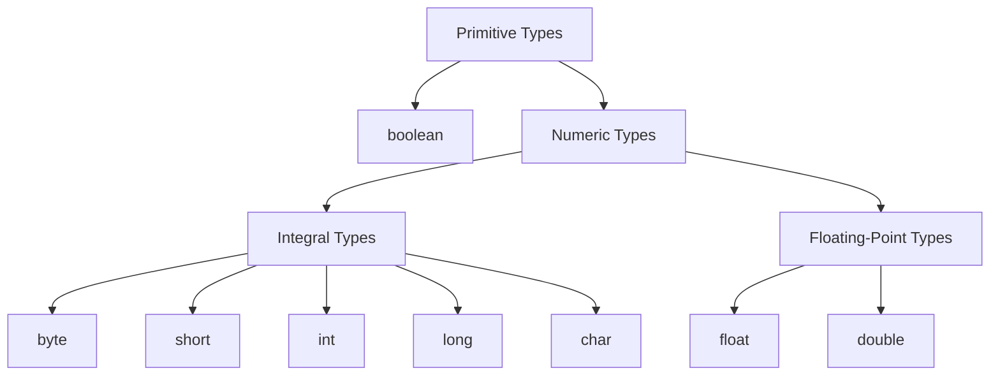

------
title: Learn Java Core Types, Data Model & Data APIs - Part 004
description: Comprehensive treatment of Java primitive types, literals, compile-time constants, default values, numeric/text/null literals, and practical production implications.
series: learn-java-core-types
seriesTitle: Learn Java Core Types, Data Model & Data APIs
order: 4
partTitle: Primitive Types and Literals
tags:
- java
- primitive-types
- literals
- data-model
- numeric
- text
- advanced
date: 2026-06-27
---

# Primitive Types and Literals

> Target Part 004: kamu harus bisa membaca setiap literal dan primitive declaration di Java lalu mengetahui type, range, default, conversion risk, compile-time behavior, dan production implication-nya.

Part sebelumnya membedakan variable, value, reference value, dan object. Sekarang kita masuk ke keluarga pertama type Java: **primitive types**.

Primitive terlihat sederhana. Namun banyak bug production berasal dari detail seperti:

- `byte + byte` menghasilkan `int`;
- integer overflow tidak otomatis error;
- `char` bukan “karakter manusia”;
- `double` tidak cocok untuk uang;
- `null` bukan value primitive;
- `final` constant bisa di-inline;
- numeric literal bisa berubah type karena suffix;
- integer literal underscore hanya separator visual;
- string literal adalah object `String`, bukan primitive;
- text block punya newline/indentation semantics;
- wrapper type bukan primitive dan bisa `null`.

Di part ini, kita fokus pada primitive types dan literal sebagai sumber value dalam source code.

---

## 1. Mental Model: Primitive Type adalah Value Type Bawaan Bahasa

Java memiliki delapan primitive type:

| Kategori | Type |
|---|---|
| Boolean | `boolean` |
| Integral numeric | `byte`, `short`, `int`, `long`, `char` |
| Floating-point numeric | `float`, `double` |

Primitive type bukan class, bukan object, dan tidak memiliki identity object.

```java
int count = 10;
boolean active = true;
double ratio = 0.25;
char codeUnit = 'A';
```

Variable primitive menyimpan primitive value secara langsung menurut semantic Java. Kamu tidak dapat memanggil method pada primitive value:

```java
int x = 10;
// x.toString(); // compile-time error
```

Kalau primitive perlu diperlakukan sebagai object, Java menggunakan wrapper class:

| Primitive | Wrapper |
|---|---|
| `boolean` | `Boolean` |
| `byte` | `Byte` |
| `short` | `Short` |
| `int` | `Integer` |
| `long` | `Long` |
| `char` | `Character` |
| `float` | `Float` |
| `double` | `Double` |

Wrapper bukan primitive. Wrapper adalah reference type dan bisa `null`. Detail boxing/unboxing dibahas di Part 024.

---

## 2. Primitive Type Taxonomy



Pembedaan ini penting karena operator, conversion, promotion, dan literal typing mengikuti kategori tersebut.

---

## 3. Range dan Default Value

Primitive variables punya range tertentu. Field primitive juga punya default value jika tidak diinisialisasi eksplisit.

| Type | Size konseptual | Range / Value | Default field/array component |
|---|---:|---|---|
| `boolean` | JVM-defined representation | `true` atau `false` | `false` |
| `byte` | 8-bit signed | -128 sampai 127 | `0` |
| `short` | 16-bit signed | -32,768 sampai 32,767 | `0` |
| `int` | 32-bit signed | -2^31 sampai 2^31-1 | `0` |
| `long` | 64-bit signed | -2^63 sampai 2^63-1 | `0L` |
| `char` | 16-bit unsigned code unit | `\u0000` sampai `\uffff` | `\u0000` |
| `float` | 32-bit floating-point | finite values, infinities, NaN | `0.0f` |
| `double` | 64-bit floating-point | finite values, infinities, NaN | `0.0d` |

Local variables tidak punya default value yang bisa digunakan. Local variable harus definitely assigned sebelum dibaca.

```java
class Defaults {
    int count;       // default 0
    boolean active;  // default false
    String name;     // default null because reference type

    void example() {
        int local;
        // System.out.println(local); // compile-time error
    }
}
```

Array components punya default value:

```java
int[] numbers = new int[3];
System.out.println(numbers[0]); // 0

String[] names = new String[3];
System.out.println(names[0]); // null
```

Production rule:

> Jangan menyamakan default value dengan domain value yang valid tanpa niat eksplisit.

Contoh buruk:

```java
class Payment {
    long amountInCents; // default 0
}
```

Apakah `0` berarti:

- belum diisi?
- pembayaran gratis?
- bug mapping?
- amount memang nol?

Lebih jelas:

```java
record MoneyAmount(long cents) {
    MoneyAmount {
        if (cents < 0) {
            throw new IllegalArgumentException("cents must be non-negative");
        }
    }
}
```

Atau jika absence valid:

```java
Optional<MoneyAmount> amount
```

---

## 4. Literals: Source Code Representation of Values

Literal adalah representasi value langsung di source code.

```java
int n = 42;              // integer literal
long id = 42L;           // integer literal with long suffix
float ratio = 0.5f;      // floating-point literal with float suffix
double pi = 3.14159;     // floating-point literal, default double
boolean active = true;   // boolean literal
char letter = 'A';       // character literal
String name = "Ayu";     // string literal
String sql = """
    select * from cases
    where status = 'OPEN'
    """;                // text block
Object none = null;      // null literal
```

Literal categories:

| Literal | Produces |
|---|---|
| Integer literal | integral primitive value, usually `int` or `long` depending suffix/range/context |
| Floating-point literal | `double` by default, `float` with suffix |
| Boolean literal | `boolean` value |
| Character literal | `char` value |
| String literal | reference to `String` object |
| Text block | reference to `String` object |
| Null literal | null reference |

Important distinction:

- `42` is not an object;
- `'A'` is a `char` primitive value;
- `"A"` is a `String` object reference;
- `null` is not a primitive value.

---

## 5. Integer Literals

Integer literals can be written in several bases:

```java
int decimal = 123;
int hex = 0x7B;
int binary = 0b0111_1011;
int octal = 0173;
```

| Form | Prefix | Example | Decimal value |
|---|---|---|---:|
| Decimal | none | `123` | 123 |
| Hexadecimal | `0x` / `0X` | `0x7B` | 123 |
| Binary | `0b` / `0B` | `0b0111_1011` | 123 |
| Octal | leading `0` | `0173` | 123 |

Octal is dangerous because it looks like decimal with leading zero:

```java
int a = 10;
int b = 010;

System.out.println(a); // 10
System.out.println(b); // 8
```

Production rule:

> Avoid octal literals in application code unless you are intentionally working with legacy permission-like notation and the context is obvious.

### 5.1 Underscores in Numeric Literals

Underscore improves readability:

```java
int oneMillion = 1_000_000;
long accountMask = 0b1111_0000_1010_0101L;
int hexColor = 0xFF_EC_DE_5E;
```

Underscore has no runtime meaning.

Bad placements are compile-time errors:

```java
// int x = _100;     // invalid
// int y = 100_;     // invalid
// int z = 0_xFF;    // invalid
// double d = 1_.0;  // invalid
```

Use underscore to communicate grouping:

```java
long millisPerDay = 86_400_000L;
int mask = 0b1111_0000;
```

Do not overuse it:

```java
int unreadable = 1_2_3_4_5;
```

### 5.2 `int` vs `long` Literals

Integer literal without suffix is generally `int` if it fits. Use `L` or `l` for long, but prefer uppercase `L` because lowercase `l` looks like `1`.

```java
long id = 9_000_000_000L;
```

Without `L`:

```java
// long id = 9_000_000_000; // compile-time error: integer number too large
```

Even if target variable is `long`, the literal itself must be valid.

### 5.3 The `Integer.MIN_VALUE` Trap

`-2147483648` is parsed as unary minus applied to literal `2147483648`, with a special rule allowing this value only in that context. In practical terms:

```java
int min = -2147483648;
int min2 = Integer.MIN_VALUE;
```

Use named constants for clarity:

```java
int min = Integer.MIN_VALUE;
long max = Long.MAX_VALUE;
```

Production rule:

> Boundary values should usually be named constants, not magic literals.

---

## 6. Integral Types: `byte`, `short`, `int`, `long`, `char`

### 6.1 `byte`

`byte` is 8-bit signed integer.

```java
byte min = -128;
byte max = 127;
```

Use cases:

- binary data;
- network protocols;
- file formats;
- compact arrays;
- encoding/decoding boundaries.

Avoid using `byte` for normal business quantities just to “save memory” unless you measured and data volume justifies it.

Pitfall:

```java
byte a = 1;
byte b = 2;
// byte c = a + b; // compile-time error, result is int
byte c = (byte) (a + b);
```

Arithmetic on smaller integral types usually promotes to `int`.

### 6.2 `short`

`short` is 16-bit signed integer.

```java
short portLike = 8080;
```

Use cases are relatively rare in business code:

- binary protocol fields;
- interop with native/legacy formats;
- memory-sensitive arrays.

Do not use `short` for “small number” by default.

### 6.3 `int`

`int` is the default integral workhorse.

```java
int count = 42;
```

Use `int` for:

- counts within range;
- indexes;
- sizes;
- loop counters;
- many enum-like numeric protocol fields.

Be aware of overflow:

```java
int max = Integer.MAX_VALUE;
System.out.println(max + 1); // -2147483648
```

Overflow for integer arithmetic wraps around according to Java semantics; it does not throw automatically.

For critical arithmetic, use checked helpers:

```java
int result = Math.addExact(a, b);
```

`Math.addExact`, `subtractExact`, `multiplyExact`, and similar methods throw `ArithmeticException` on overflow.

### 6.4 `long`

`long` is 64-bit signed integer.

```java
long id = 9_000_000_000L;
long epochMillis = System.currentTimeMillis();
```

Use cases:

- large counts;
- epoch milliseconds/nanos representation when appropriate;
- database identifiers if numeric;
- money in minor units when range fits;
- monotonic sequence numbers.

Pitfall:

```java
long micros = 1_000_000 * 60 * 60 * 24 * 365;
System.out.println(micros); // overflow occurred in int arithmetic before widening
```

Fix:

```java
long micros = 1_000_000L * 60 * 60 * 24 * 365;
```

Because one operand is `long`, the expression is promoted to long.

### 6.5 `char`

`char` is a 16-bit unsigned UTF-16 code unit, not a full human character.

```java
char letter = 'A';
char newline = '\n';
char unicode = '\u0041'; // A
```

Use `char` carefully. It can represent many BMP code units, but not every Unicode character as a single user-perceived character.

Example:

```java
String emoji = "😀";
System.out.println(emoji.length()); // 2, because surrogate pair in UTF-16
```

Do not design text processing around `char` unless you truly mean UTF-16 code units. Text model is expanded in Part 008.

---

## 7. Floating-Point Types: `float` and `double`

### 7.1 `double` Default

Floating-point literal without suffix is `double`:

```java
double x = 0.1;
// float y = 0.1; // compile-time error: possible lossy conversion
float z = 0.1f;
```

Use `double` by default for general scientific/measurement calculations unless domain requires otherwise.

### 7.2 `float`

`float` is 32-bit floating-point.

Use cases:

- graphics;
- ML/data arrays where memory matters;
- interoperability with APIs requiring float;
- large numeric arrays with measured memory/performance constraints.

Avoid `float` for business calculations.

### 7.3 `double`

`double` is 64-bit floating-point.

It is not decimal exact arithmetic.

```java
System.out.println(0.1 + 0.2); // 0.30000000000000004
```

Use `BigDecimal` or integer minor units for money-like domains.

### 7.4 Special Values

Floating-point supports:

- positive infinity;
- negative infinity;
- NaN;
- positive zero;
- negative zero.

```java
System.out.println(1.0 / 0.0);   // Infinity
System.out.println(-1.0 / 0.0);  // -Infinity
System.out.println(0.0 / 0.0);   // NaN
System.out.println(-0.0 == 0.0); // true
System.out.println(Double.NaN == Double.NaN); // false
```

Production implication:

- Validate numeric input at boundaries.
- Decide whether NaN/infinity are allowed domain values.
- Be careful with sorting and equality.
- Do not use floating-point as map key unless semantics are deliberately handled.

Part 006 will go deeper into floating-point.

---

## 8. `boolean`

`boolean` has only two values:

```java
boolean active = true;
boolean deleted = false;
```

Java does not have C-style truthiness:

```java
int count = 1;
// if (count) { } // compile-time error

if (count != 0) {
    // explicit
}
```

This is good. It prevents many accidental condition bugs.

But boolean can still produce poor domain modeling.

```java
record User(boolean active) {}
```

Question: active relative to what lifecycle?

Maybe better:

```java
enum UserStatus {
    PENDING_VERIFICATION,
    ACTIVE,
    SUSPENDED,
    DELETED
}
```

Boolean is best when the domain is truly binary and stable:

```java
boolean isEmpty()
boolean hasPermission(Permission permission)
boolean isExpired(Instant now)
```

Avoid boolean parameters that hide meaning:

```java
sendNotification(user, true, false);
```

Better:

```java
sendNotification(user, DeliveryMode.IMMEDIATE, AuditPolicy.SKIP_AUDIT);
```

Part 007 covers boolean semantics and boolean blindness.

---

## 9. Character Literals and Escape Sequences

Character literal uses single quotes:

```java
char a = 'A';
char newline = '\n';
char tab = '\t';
char quote = '\'';
char backslash = '\\';
char unicodeA = '\u0041';
```

Common escapes:

| Escape | Meaning |
|---|---|
| `\b` | backspace |
| `\t` | tab |
| `\n` | line feed |
| `\f` | form feed |
| `\r` | carriage return |
| `\"` | double quote |
| `\'` | single quote |
| `\\` | backslash |

Be careful with Unicode escapes. They are processed early in lexical translation, before normal tokenization. This can create surprising behavior.

Example to avoid:

```java
// String path = "C:\users\new"; // bad escaping and potential confusion
String path = "C:\\users\\new";
```

For paths, prefer `Path` API rather than manual string concatenation:

```java
Path path = Path.of("C:", "users", "new");
```

---

## 10. String Literals

String literal uses double quotes:

```java
String name = "Ayu";
```

`String` is not primitive. It is a reference type. The literal results in a reference to a `String` object.

String literals are interned:

```java
String a = "java";
String b = "java";

System.out.println(a == b); // true due to literal interning
```

But do not use `==` for logical string comparison:

```java
String c = new String("java");
System.out.println(a == c);      // false
System.out.println(a.equals(c)); // true
```

Production rule:

> Use `.equals` for string content equality; use enum or typed value when the string represents closed domain values.

Bad:

```java
if (status.equals("APPROVED")) { ... }
```

Better for closed domain:

```java
enum CaseStatus {
    APPROVED,
    REJECTED
}
```

Better for external string boundary:

```java
CaseStatus parseStatus(String raw) {
    return switch (raw) {
        case "APPROVED" -> CaseStatus.APPROVED;
        case "REJECTED" -> CaseStatus.REJECTED;
        default -> throw new IllegalArgumentException("Unknown status: " + raw);
    };
}
```

---

## 11. Text Blocks

Text block is a multi-line string literal:

```java
String sql = """
    select id, status
    from cases
    where status = ?
    order by created_at desc
    """;
```

Text blocks are useful for:

- SQL snippets;
- JSON examples;
- test fixtures;
- multi-line messages;
- generated code templates;
- documentation-like strings.

They still produce `String` objects.

Important concerns:

- incidental indentation;
- trailing newline;
- escaping rules;
- readability in code review;
- avoiding embedding unsafe unparameterized SQL.

Bad:

```java
String sql = """
    select * from users where name = '%s'
    """.formatted(userInput);
```

Better:

```java
String sql = """
    select * from users where name = ?
    """;
```

Use prepared statements or framework parameter binding.

Text block is not a license to build unsafe dynamic SQL, JSON, HTML, or shell commands.

---

## 12. Null Literal

`null` is the null literal. It can be assigned to reference types, not primitive types.

```java
String name = null;
Object value = null;
List<String> tags = null;

// int count = null; // compile-time error
```

`null` has special type behavior. Practically, it means “no object reference”.

Do not confuse:

```java
String empty = "";
String missing = null;
```

These are not equivalent.

| Value | Meaning candidate |
|---|---|
| `null` | absence/no reference/unknown/not provided depending contract |
| `""` | empty string, explicitly present but empty |
| `" "` | whitespace string |
| `Optional.empty()` | explicit absence in API return style |

Production rule:

> Normalize absence at boundaries and use explicit domain modeling. Do not let `null`, empty string, missing JSON field, and blank string silently mean the same thing.

---

## 13. Compile-Time Constants

A constant variable is a `final` variable of primitive type or `String` initialized with a compile-time constant expression.

```java
static final int MAX_RETRIES = 3;
static final String DEFAULT_REGION = "ID";
```

These can be used in places requiring compile-time constants, such as `case` labels:

```java
static final int STATUS_OPEN = 1;

switch (status) {
    case STATUS_OPEN -> handleOpen();
    default -> handleOther();
}
```

But:

```java
static final Integer BOXED_STATUS_OPEN = 1;
// not a primitive/String constant variable in the same way
```

Compile-time constants have binary compatibility implications: clients may inline them at compile time. Changing a public constant value in a library may not affect already-compiled clients until they are recompiled.

Bad library API:

```java
public static final int TIMEOUT_SECONDS = 30;
```

If downstream code compiles against 30, then library changes to 60 may not affect that downstream binary until recompilation.

Better when value may change:

```java
public static int timeoutSeconds() {
    return 60;
}
```

Use public constants only when they are truly stable semantic constants, not configuration.

---

## 14. Constant Expressions and Folding

Java compiler can evaluate certain expressions at compile time.

```java
static final int SECONDS_PER_MINUTE = 60;
static final int MINUTES_PER_HOUR = 60;
static final int SECONDS_PER_HOUR = SECONDS_PER_MINUTE * MINUTES_PER_HOUR;
```

This is fine for true constants.

But beware of accidental integer arithmetic:

```java
static final long YEAR_MICROS = 1_000_000 * 60 * 60 * 24 * 365;
```

This expression performs `int` arithmetic before assignment to `long`, causing overflow.

Fix:

```java
static final long YEAR_MICROS = 1_000_000L * 60 * 60 * 24 * 365;
```

Or better, use time API for time concepts:

```java
static final Duration ONE_DAY = Duration.ofDays(1);
```

Do not model calendar semantics with hand-rolled integer constants unless the domain truly requires fixed duration units.

---

## 15. Primitive Initialization and Definite Assignment

Fields and array components get default values. Local variables do not.

```java
class Example {
    int field;

    void method(boolean condition) {
        int local;
        if (condition) {
            local = 10;
        }
        // System.out.println(local); // compile-time error, maybe not assigned
    }
}
```

Compiler performs definite assignment analysis.

Correct:

```java
int local;
if (condition) {
    local = 10;
} else {
    local = 20;
}
System.out.println(local);
```

This matters for robust code because it forces initialization paths to be explicit.

For fields, relying on defaults can hide missing initialization:

```java
class RetryPolicy {
    private int maxRetries; // default 0, maybe not intended
}
```

Prefer constructor-enforced invariant:

```java
record RetryPolicy(int maxRetries) {
    RetryPolicy {
        if (maxRetries < 0) {
            throw new IllegalArgumentException("maxRetries must not be negative");
        }
    }
}
```

---

## 16. Literal Type Context

The same literal can be accepted differently depending on assignment context.

```java
byte b = 100;     // allowed: constant int value fits in byte
short s = 100;    // allowed
char c = 65;      // allowed, represents 'A'

// byte b2 = 128; // compile-time error
```

But expression involving variables promotes:

```java
byte a = 1;
byte b = 2;
// byte c = a + b; // error, a + b is int
```

Constant expression can fit:

```java
byte c = 1 + 2; // allowed, compile-time constant fits in byte
```

This distinction matters in code generation, annotation values, switch cases, and low-level binary code.

---

## 17. Numeric Promotion Preview

Full numeric promotion is covered later, but you need the basic rule now:

> Arithmetic on `byte`, `short`, and `char` generally promotes to `int`.

Examples:

```java
byte b = 1;
short s = 2;
char c = 'A';

int x = b + s;
int y = c + 1;
```

For mixed numeric types:

```java
int i = 1;
long l = 2L;
float f = 3.0f;
double d = 4.0;

long a = i + l;
float b = l + f;
double c = f + d;
```

Production failure:

```java
int total = priceInCents * quantity;
```

If both are `int`, overflow can happen before assignment or return.

Safer:

```java
long total = Math.multiplyExact((long) priceInCents, quantity);
```

Or model money with a domain type.

---

## 18. Primitive vs Domain Scalar

Primitive is a storage representation, not necessarily a domain model.

Bad:

```java
void assign(String caseId, String officerId, int priority, long dueAt) { ... }
```

Problems:

- parameter swap risk;
- unclear time unit for `dueAt`;
- priority range unknown;
- no validation boundary;
- domain meaning hidden.

Better:

```java
record CaseId(String value) {}
record OfficerId(String value) {}
record Priority(int value) {
    Priority {
        if (value < 1 || value > 5) {
            throw new IllegalArgumentException("priority must be 1..5");
        }
    }
}

void assign(CaseId caseId, OfficerId officerId, Priority priority, Instant dueAt) { ... }
```

Primitive obsession happens when primitive values carry domain meaning without a type.

Use primitives for:

- local arithmetic;
- low-level representation;
- indexes and sizes;
- data structures internals;
- performance-sensitive paths after profiling.

Use domain scalar/value objects for:

- IDs;
- money;
- quantities with unit;
- status/code values;
- priority/severity;
- time units;
- external protocol fields with constraints.

---

## 19. Choosing Between Primitive and Wrapper

Use primitive when:

- value is required;
- no absence state;
- performance matters;
- used in tight loops or arrays;
- default value is acceptable or initialization is explicit.

Use wrapper when:

- reference type is required by API/generics;
- absence via `null` is intentionally allowed at boundary;
- framework requires object type;
- you need `Optional<T>` style composition but primitive Optional specializations may be limited.

But avoid nullable wrappers internally when absence should be explicit.

Bad:

```java
Integer retryCount; // null means default? unset? disabled?
```

Better:

```java
record RetryPolicy(int maxRetries) {}
```

or:

```java
sealed interface RetryPolicy {
    record Disabled() implements RetryPolicy {}
    record Limited(int maxRetries) implements RetryPolicy {}
}
```

or, for simple return values:

```java
OptionalInt retryCount()
```

Part 024 expands boxing/unboxing and wrapper traps.

---

## 20. Primitive Arrays

Primitive arrays store primitive values in array components.

```java
int[] counts = new int[3];
counts[0] = 10;
```

Reference arrays store reference values:

```java
Integer[] boxedCounts = new Integer[3];
boxedCounts[0] = 10;
```

Key differences:

| Aspect | `int[]` | `Integer[]` |
|---|---|---|
| Component value | primitive `int` | reference to `Integer` or `null` |
| Default component | `0` | `null` |
| Boxing needed | no | yes for primitive assignment |
| Memory locality | generally better | references + objects |
| Null risk | no | yes |

For large numeric data, primitive arrays often matter more than micro-optimizing variable types.

Example failure:

```java
Integer[] counts = new Integer[3];
int first = counts[0]; // NPE due to unboxing null
```

---

## 21. Primitive Streams Preview

Collections cannot hold primitives directly:

```java
List<int> xs; // invalid
List<Integer> ys; // valid, boxed
```

Streams provide primitive specializations:

```java
IntStream.range(0, 10)
    .map(x -> x * x)
    .sum();
```

Primitive stream types:

- `IntStream`
- `LongStream`
- `DoubleStream`

They avoid boxing overhead and provide numeric operations like `sum`, `average`, `min`, and `max`.

Part 032 covers streams deeply. For now:

- use primitive streams for numeric pipelines;
- avoid unnecessary boxing in hot paths;
- do not sacrifice readability for micro-optimizations without profiling.

---

## 22. Literals in API and Test Code

Literals are not only syntax. They communicate assumptions.

Bad test:

```java
assertEquals(3, service.calculate("A", 2, true));
```

Better:

```java
var request = new PricingRequest(
    ProductCode.of("A"),
    Quantity.of(2),
    DiscountPolicy.APPLY
);

assertEquals(Money.idr(3_000), service.calculate(request));
```

Magic literals hide meaning:

```java
if (status == 3) { ... }
```

Better:

```java
if (status == CaseStatus.CLOSED) { ... }
```

Or at protocol boundary:

```java
private static final int CLOSED_STATUS_CODE = 3;
```

Even better:

```java
enum ExternalCaseStatusCode {
    OPEN(1),
    IN_REVIEW(2),
    CLOSED(3);

    private final int code;

    ExternalCaseStatusCode(int code) {
        this.code = code;
    }
}
```

Use literals directly when they are locally obvious:

```java
for (int i = 0; i < items.size(); i++) { ... }
```

Avoid literals when they encode domain policy:

```java
if (retryCount > 3) { ... } // Why 3?
```

Better:

```java
private static final int MAX_RETRIES = 3;
```

or configuration/domain type.

---

## 23. Boundary Values and Sentinel Values

Primitive code often uses sentinel values:

```java
int index = -1;
```

This is common and sometimes acceptable for local algorithms. But in domain APIs, sentinel values can be dangerous.

Bad:

```java
record Assignment(long assignedAtEpochMillis) {
    boolean isAssigned() {
        return assignedAtEpochMillis != -1;
    }
}
```

Better:

```java
record Assignment(Optional<Instant> assignedAt) {}
```

or a sealed model:

```java
sealed interface AssignmentState {
    record Unassigned() implements AssignmentState {}
    record Assigned(Instant at, OfficerId officerId) implements AssignmentState {}
}
```

Sentinel value checklist:

- Is the sentinel impossible in the real domain?
- Is it documented near the type?
- Can compiler enforce it?
- Will it survive serialization/deserialization?
- Will downstream analytics misinterpret it?
- Would Optional/sealed type be clearer?

---

## 24. Primitive Type Selection Framework

Use this decision flow:

```mermaid
flowchart TD
    Q1[What are you modeling?] --> Q2{Is it true/false only?}
    Q2 -->|Yes| B[boolean]
    Q2 -->|No| Q3{Is it integer count/index/code?}
    Q3 -->|Yes| Q4{Can int range overflow?}
    Q4 -->|No| I[int]
    Q4 -->|Yes| L[long or BigInteger/domain type]
    Q3 -->|No| Q5{Is it decimal precise money/quantity?}
    Q5 -->|Yes| BD[BigDecimal or integer minor unit domain type]
    Q5 -->|No| Q6{Is it approximate measurement?}
    Q6 -->|Yes| D[double, sometimes float]
    Q6 -->|No| Q7{Is it binary data?}
    Q7 -->|Yes| BY[byte / byte[]]
    Q7 -->|No| Q8{Is it text?}
    Q8 -->|Yes| S[String/code point API, not primitive char by default]
    Q8 -->|No| Domain[Create domain type]
```

Practical defaults:

| Need | Default choice |
|---|---|
| General integer | `int` |
| Large integer/count/time unit representation | `long` |
| Money | `BigDecimal` or `long` minor units wrapped in domain type |
| Approximate numeric calculation | `double` |
| Binary payload | `byte[]`, `ByteBuffer` |
| Single UTF-16 code unit | `char` |
| Human text | `String` / Unicode-aware APIs |
| Optional primitive return | `OptionalInt`, `OptionalLong`, `OptionalDouble`, or domain model |
| Required field | primitive or non-null domain type |
| Nullable boundary field | wrapper temporarily, normalized quickly |

---

## 25. Common Production Failure Modes

### 25.1 Integer Overflow in Aggregation

```java
int total = 0;
for (Order order : orders) {
    total += order.amountInCents();
}
```

If data grows, overflow silently corrupts result.

Better:

```java
long total = 0L;
for (Order order : orders) {
    total = Math.addExact(total, order.amountInCents());
}
```

Better still:

```java
Money total = orders.stream()
    .map(Order::amount)
    .reduce(Money.zero("IDR"), Money::plus);
```

### 25.2 Floating Money

```java
double amount = 0.1 + 0.2;
```

Do not use floating-point for money.

Use:

```java
BigDecimal amount = new BigDecimal("0.30");
```

or:

```java
record Money(long cents, Currency currency) {}
```

### 25.3 Wrong Time Unit

```java
void expireAfter(long timeout) { ... }
```

Milliseconds? seconds? minutes?

Better:

```java
void expireAfter(Duration timeout) { ... }
```

### 25.4 Char-Based Text Bugs

```java
boolean isOneChar(String s) {
    return s.length() == 1;
}
```

This counts UTF-16 code units, not user-perceived characters.

### 25.5 Nullable Wrapper Unboxing

```java
Boolean enabled = config.enabled();
if (enabled) { ... } // NPE if null
```

Better:

```java
boolean enabled = Boolean.TRUE.equals(config.enabled());
```

or better, normalize config into a non-null domain model.

### 25.6 Octal Literal Accident

```java
int month = 08; // invalid octal digit
int mode = 010; // decimal 8, not 10
```

Avoid leading zero integer literals.

### 25.7 Public Constant Inlining

```java
public static final int DEFAULT_LIMIT = 100;
```

If a library changes this value, downstream compiled code may still use old value until recompilation.

Use method/config for non-eternal values.

---

## 26. Worked Example: Case Priority

Naive design:

```java
record CaseCommand(String caseId, int priority, boolean urgent) {}
```

Problems:

- What range is priority?
- Can priority be 0?
- Does urgent duplicate priority?
- Is `caseId` any string?
- Is `boolean urgent` stable as domain grows?

Better:

```java
record CaseId(String value) {
    CaseId {
        if (value == null || value.isBlank()) {
            throw new IllegalArgumentException("case id must not be blank");
        }
    }
}

record Priority(int value) {
    Priority {
        if (value < 1 || value > 5) {
            throw new IllegalArgumentException("priority must be 1..5");
        }
    }
}

enum Urgency {
    NORMAL,
    URGENT,
    CRITICAL
}

record CaseCommand(CaseId caseId, Priority priority, Urgency urgency) {}
```

Primitive `int` still exists internally inside `Priority`, but domain boundary is now explicit.

This is the mindset of advanced Java data modeling:

> Use primitives for representation; use domain types for meaning.

---

## 27. Worked Example: Byte-Oriented Protocol Field

Suppose an external protocol gives one byte status code.

Naive:

```java
byte status = payload[0];
if (status == 1) { ... }
```

Better:

```java
enum ProtocolStatus {
    ACCEPTED((byte) 1),
    REJECTED((byte) 2),
    PENDING((byte) 3);

    private final byte code;

    ProtocolStatus(byte code) {
        this.code = code;
    }

    static ProtocolStatus fromCode(byte code) {
        return switch (code) {
            case 1 -> ACCEPTED;
            case 2 -> REJECTED;
            case 3 -> PENDING;
            default -> throw new IllegalArgumentException("Unknown status code: " + code);
        };
    }
}
```

The byte is still used at the boundary, but internal code works with enum domain values.

---

## 28. Worked Example: Literal-Driven Bug in Time Calculation

Bad:

```java
long retentionMillis = 30 * 24 * 60 * 60 * 1000;
```

This is int arithmetic first. For 30 days, it overflows `int` before assignment to `long`.

Fix:

```java
long retentionMillis = 30L * 24 * 60 * 60 * 1000;
```

Better:

```java
Duration retention = Duration.ofDays(30);
```

Best depends on domain:

- If you need exact duration: `Duration`.
- If you need calendar period: `Period`.
- If you need business-day retention: domain-specific calendar logic.

Do not model human calendar policy as raw primitive unless you are at a low-level boundary.

---

## 29. Mini Practice

### Practice 1 — Predict Type

For each expression, identify likely compile-time type:

```java
1
1L
1.0
1.0f
'a'
"a"
null
1 + 2L
1 + 2.0f
(byte) 1 + (byte) 2
```

Expected:

| Expression | Type |
|---|---|
| `1` | `int` |
| `1L` | `long` |
| `1.0` | `double` |
| `1.0f` | `float` |
| `'a'` | `char` |
| `"a"` | `String` reference |
| `null` | null type / assignable to reference types |
| `1 + 2L` | `long` |
| `1 + 2.0f` | `float` |
| `(byte) 1 + (byte) 2` | `int` |

### Practice 2 — Find Bugs

```java
record Invoice(long amount, String currency) {}

long yearly = 1_000_000 * 60 * 60 * 24 * 365;
boolean enabled = config.getEnabled();
if (status == "CLOSED") { ... }
```

Bugs/potential issues:

- `amount` unit unclear;
- `yearly` may overflow due to int arithmetic;
- `config.getEnabled()` might return nullable `Boolean` depending API;
- string compared by reference identity;
- `status` should likely be enum or typed value.

### Practice 3 — Refactor Primitive Obsession

Input:

```java
void escalate(String caseId, int level, long deadline, boolean notify) { ... }
```

Refactor:

```java
record CaseId(String value) {}
record EscalationLevel(int value) {}
record Deadline(Instant value) {}

enum NotificationPolicy {
    NOTIFY,
    DO_NOT_NOTIFY
}

void escalate(
    CaseId caseId,
    EscalationLevel level,
    Deadline deadline,
    NotificationPolicy notificationPolicy
) { ... }
```

Then add validation to each domain type.

---

## 30. Latihan 20 Jam untuk Part Ini

### Sesi 1 — Literal Classification

Ambil 100 literal dari project/code sample. Klasifikasikan:

- integer;
- floating;
- boolean;
- char;
- string;
- text block;
- null.

Untuk numeric literal, tulis type dan risiko overflow/conversion.

### Sesi 2 — Primitive Boundary Audit

Cari method dengan parameter:

- `String id`;
- `int status`;
- `long time`;
- `boolean flag`;
- `double amount`.

Tentukan apakah harus tetap primitive/string atau diangkat menjadi domain type.

### Sesi 3 — Overflow Tests

Tulis JUnit untuk:

- `Integer.MAX_VALUE + 1`;
- `Math.addExact(Integer.MAX_VALUE, 1)`;
- `30 * 24 * 60 * 60 * 1000`;
- `30L * 24 * 60 * 60 * 1000`.

Tujuannya bukan hafalan, tetapi merasakan failure mode.

### Sesi 4 — Text Literal Safety

Tulis text block untuk SQL/JSON test fixture. Lalu identifikasi:

- apakah trailing newline penting?
- apakah indentation memengaruhi expected string?
- apakah user input disisipkan tidak aman?

### Sesi 5 — Domain Scalar Refactor

Ambil satu command/service method dan refactor primitive obsession menjadi record/enum/domain scalar.

---

## 31. Checklist Akhir Part 004

Sebelum lanjut ke Part 005, pastikan kamu bisa menjawab:

- Apa delapan primitive type Java?
- Apa bedanya primitive type dan wrapper class?
- Apa default value field untuk setiap primitive?
- Mengapa local variable tidak bisa dibaca sebelum definitely assigned?
- Apa type default integer literal?
- Apa type default floating-point literal?
- Mengapa `byte + byte` menghasilkan `int`?
- Mengapa `long x = 1_000_000 * 60 * 60 * 24 * 365` bisa salah?
- Mengapa `char` bukan “satu karakter manusia”?
- Mengapa `String` bukan primitive?
- Apa risiko `null` sebagai domain absence?
- Apa itu compile-time constant?
- Mengapa public static final primitive/String constants bisa punya efek binary compatibility?
- Kapan primitive cukup, dan kapan harus membuat domain scalar?

Jika checklist ini sudah jelas, kamu siap masuk ke Part 005: **Integral Types: byte, short, int, long, char**.

---

## Referensi Resmi dan Bacaan

- Java Language Specification, Java SE 25 Edition — Chapter 3, *Lexical Structure*.
- Java Language Specification, Java SE 25 Edition — Section 3.10, *Literals*.
- Java Language Specification, Java SE 25 Edition — Chapter 4, *Types, Values, and Variables*.
- Java Language Specification, Java SE 25 Edition — Chapter 5, *Conversions and Contexts*.
- Java SE 25 API Documentation — `java.lang.Integer`, `java.lang.Long`, `java.lang.Math`.
- Java SE 25 API Documentation — `java.lang.String`, `java.lang.Character`.
- Java SE 25 API Documentation — `java.time.Duration`, `java.time.Period`.
