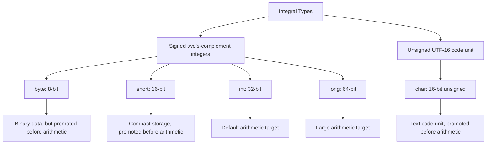
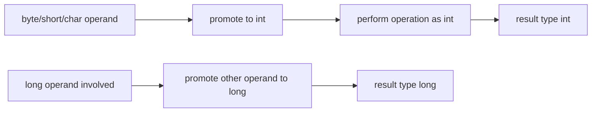

------
title: Learn Java Core Types, Data Model & Data APIs - Part 005
description: Deep engineering treatment of Java integral types: byte, short, int, long, char, two's-complement ranges, numeric promotion, overflow, bitwise operations, shifts, unsigned helpers, and production failure modes.
series: learn-java-core-types
seriesTitle: Learn Java Core Types, Data Model & Data APIs
order: 5
partTitle: Integral Types: byte, short, int, long, char
tags:
- java
- integral-types
- byte
- short
- int
- long
- char
- numeric-promotion
- overflow
- bitwise
- advanced
date: 2026-06-27
---

# Integral Types: `byte`, `short`, `int`, `long`, `char`

> Target Part 005: kamu harus bisa membaca, mendesain, dan men-debug operasi integral Java tanpa tertipu oleh range, overflow, promotion, sign extension, `char`, bitwise operation, dan casting.

Integral type terlihat seperti topik dasar. Di production, topik ini justru sering menjadi sumber bug yang sulit dilacak:

- counter overflow setelah traffic naik;
- `byte` protocol parsing rusak karena sign extension;
- `char` dianggap karakter manusia, padahal hanya UTF-16 code unit;
- `short + short` menghasilkan `int`;
- `int * int` overflow sebelum assignment ke `long`;
- shift operator tidak memakai seluruh nilai shift distance;
- ID numerik berubah karena narrowing atau JSON/DB boundary;
- checksum, hash, bit mask, permission flag, dan binary protocol salah karena salah mental model.

Part ini membahas **integral types** sebagai primitive numeric model yang dipakai Java untuk integer arithmetic, byte-level data, indexing, hashing, flags, counters, dan sebagian besar API internal.

---

## 1. Mental Model: Integral Type adalah Fixed-Width Numeric Value

Java memiliki lima integral types:

| Type | Width | Signed? | Range utama | Typical use |
|---|---:|---|---|---|
| `byte` | 8-bit | signed | -128..127 | raw binary unit, byte array, protocol payload |
| `short` | 16-bit | signed | -32,768..32,767 | compact numeric field, legacy/binary protocol |
| `int` | 32-bit | signed | about ±2.1 billion | default integer arithmetic, index, size, count |
| `long` | 64-bit | signed | about ±9.22e18 | large counter, epoch time, ID, duration nanos |
| `char` | 16-bit | unsigned | 0..65,535 | UTF-16 code unit, not human character |

JLS menyatakan `byte`, `short`, `int`, dan `long` adalah signed two's-complement integers, sedangkan `char` adalah unsigned 16-bit integer yang merepresentasikan UTF-16 code unit.

Mental model ringkas:



Yang penting: **width type bukan selalu width operasi**. Banyak operasi pada `byte`, `short`, dan `char` dipromosikan ke `int` lebih dulu.

---

## 2. Range dan Two's-Complement

Java mendefinisikan range integral secara fixed, bukan bergantung CPU/platform.

| Type | Minimum | Maximum | Constant |
|---|---:|---:|---|
| `byte` | -128 | 127 | `Byte.MIN_VALUE`, `Byte.MAX_VALUE` |
| `short` | -32,768 | 32,767 | `Short.MIN_VALUE`, `Short.MAX_VALUE` |
| `int` | -2,147,483,648 | 2,147,483,647 | `Integer.MIN_VALUE`, `Integer.MAX_VALUE` |
| `long` | -9,223,372,036,854,775,808 | 9,223,372,036,854,775,807 | `Long.MIN_VALUE`, `Long.MAX_VALUE` |
| `char` | 0 | 65,535 | `Character.MIN_VALUE`, `Character.MAX_VALUE` |

Two's-complement punya konsekuensi penting:

```java
System.out.println(Integer.MAX_VALUE);      // 2147483647
System.out.println(Integer.MAX_VALUE + 1);  // -2147483648

System.out.println(Integer.MIN_VALUE);      // -2147483648
System.out.println(-Integer.MIN_VALUE);     // -2147483648, still negative!
```

Kenapa `-Integer.MIN_VALUE` tetap `Integer.MIN_VALUE`?

Karena range `int` tidak simetris. Ada satu nilai negatif ekstra:

- positive max: `+2_147_483_647`
- negative min: `-2_147_483_648`

Tidak ada nilai positif `+2_147_483_648` di `int`.

### Production implication

Jangan menulis validasi absolute value seperti ini untuk semua `int`:

```java
static boolean withinLimit(int value, int limit) {
    return Math.abs(value) <= limit;
}
```

Untuk `Integer.MIN_VALUE`, `Math.abs(Integer.MIN_VALUE)` tetap negatif.

Versi lebih defensible:

```java
static boolean withinLimit(int value, int limit) {
    if (limit < 0) {
        throw new IllegalArgumentException("limit must be non-negative");
    }
    return value >= -limit && value <= limit;
}
```

Atau gunakan `long` untuk intermediate calculation:

```java
static boolean withinLimit(int value, int limit) {
    return Math.abs((long) value) <= limit;
}
```

---

## 3. Default Integer Type: `int`

Di Java, integer literal tanpa suffix biasanya bertype `int` jika nilainya muat.

```java
var a = 10;  // int
var b = 10L; // long
```

Bahkan ketika kamu memakai `byte` atau `short`, banyak operasi langsung naik ke `int`:

```java
byte x = 10;
byte y = 20;

// byte z = x + y; // compile-time error: x + y is int
int z = x + y;
```

Ini bukan kekurangan Java. Ini adalah aturan numeric promotion.

Mental model:



### Kenapa Java melakukan ini?

Ada beberapa alasan historis dan teknis:

1. CPU umumnya lebih efisien melakukan arithmetic pada word-size seperti 32-bit/64-bit dibanding 8-bit/16-bit.
2. `byte` dan `short` lebih berguna sebagai storage/interop type daripada arithmetic type.
3. Promosi ke `int` mengurangi banyak overflow kecil dalam operasi sederhana.
4. Bahasa menjadi lebih konsisten: operasi integer kecil punya result type yang dapat memuat lebih banyak hasil intermediate.

Namun konsekuensinya: **type kecil tidak berarti arithmetic kecil**.

---

## 4. Literal Integral: Type, Suffix, Base, Underscore

Java mendukung literal integer dalam beberapa bentuk:

```java
int decimal = 1_000_000;
int hex = 0xFF;
int binary = 0b1010_1100;
int octal = 012; // decimal 10, avoid in business code
long big = 3_000_000_000L;
```

### 4.1 Suffix `L`

Gunakan `L`, bukan `l`:

```java
long good = 10L;
long badLooking = 10l; // legal, but visually poor
```

`l` mudah tertukar dengan angka `1`.

### 4.2 Literal besar wajib diberi `L`

```java
// long x = 3_000_000_000;  // compile-time error: int literal too large
long y = 3_000_000_000L;
```

Literal tanpa suffix harus valid sebagai `int` terlebih dahulu, kecuali konteks tertentu seperti assignment constant yang representable.

### 4.3 Underscore hanya separator visual

```java
int amount = 1_000_000;
int mask = 0b1111_0000;
```

Underscore tidak mengubah nilai. Gunakan untuk readability pada:

- amount besar;
- bit mask;
- ID mock/test;
- magic constant yang perlu dibaca manusia.

Hindari underscore yang misleading:

```java
int confusing = 10_00_00; // legal, but style buruk
```

### 4.4 Hati-hati octal literal

```java
int a = 10; // decimal 10
int b = 010; // octal 10 == decimal 8
```

Di business code, hindari integer literal dengan leading zero kecuali memang sengaja octal. Untuk formatting angka, gunakan string.

---

## 5. Assignment ke `byte`, `short`, dan `char`

Compile-time constant yang representable boleh langsung diassign:

```java
byte b = 127;
short s = 32_767;
char c = 65;
```

Tapi expression non-constant menghasilkan `int`:

```java
byte a = 10;
byte b = 20;

// byte c = a + b; // error
byte c = (byte) (a + b); // explicit narrowing
```

Constant expression punya perlakuan khusus:

```java
byte ok = 10 + 20; // compile-time constant, value 30 fits byte

int x = 10;
// byte fail = x + 20; // not compile-time constant
```

`final` bisa membuat expression menjadi constant jika semua syarat terpenuhi:

```java
final int base = 10;
byte ok = base + 20; // compile-time constant
```

Tapi `final` object atau value runtime bukan compile-time constant:

```java
final Integer boxed = 10;
// byte fail = boxed + 20; // unboxing/runtime expression, not constant expression
```

---

## 6. Numeric Promotion: Aturan yang Wajib Diingat

Aturan paling praktis:

1. Jika ada `double`, hasil operasi numeric menjadi `double`.
2. Jika tidak ada `double` tapi ada `float`, hasil menjadi `float`.
3. Jika tidak ada `double/float` tapi ada `long`, hasil menjadi `long`.
4. Selain itu, `byte`, `short`, `char`, dan `int` diproses sebagai `int`.

Contoh:

```java
byte b = 1;
short s = 2;
char c = 'A';
int i = 3;
long l = 4L;

var r1 = b + s; // int
var r2 = c + i; // int
var r3 = i + l; // long
var r4 = l + 1.0; // double
```

### `char + int` bukan string

```java
char c = 'A';
System.out.println(c + 1);     // 66
System.out.println(c + "1");   // A1
System.out.println((char)(c + 1)); // B
```

`+` menjadi string concatenation hanya jika salah satu operand adalah `String`.

---

## 7. Overflow: Silent, Deterministic, Dangerous

JLS menyatakan integer operators tidak memberi indikasi overflow/underflow. Artinya tidak ada exception otomatis.

```java
int max = Integer.MAX_VALUE;
System.out.println(max + 1); // -2147483648
```

Bug klasik:

```java
int priceCents = 1_500_000_000;
int quantity = 2;
long total = priceCents * quantity;

System.out.println(total); // negative/wrong, because multiplication happened as int
```

Fix:

```java
long total = (long) priceCents * quantity;
```

Yang penting: casting setelah operasi terlambat.

```java
long wrong = (long) (priceCents * quantity); // overflow already happened
long right = (long) priceCents * quantity;
```

### Checked arithmetic

Untuk domain yang tidak boleh overflow, gunakan `Math.*Exact`:

```java
int sum = Math.addExact(a, b);
int product = Math.multiplyExact(a, b);
long next = Math.incrementExact(current);
```

Jika overflow, method ini melempar `ArithmeticException`.

### Decision rule

| Situation | Recommended approach |
|---|---|
| Counter kecil, overflow tidak mungkin secara domain | `int` dengan invariant jelas |
| Counter bisa tumbuh besar | `long` |
| Overflow harus menjadi error | `Math.addExact`, `multiplyExact`, etc. |
| Uang | biasanya `long` minor unit atau `BigDecimal`, bukan `int` sembarang |
| Aggregation besar | promote ke `long` sebelum operasi |
| Security/token/hash | treat sebagai binary/unsigned representation, bukan signed business number |

---

## 8. Division dan Remainder

Integer division membuang fractional part menuju nol:

```java
System.out.println(5 / 2);    // 2
System.out.println(-5 / 2);   // -2
System.out.println(5 / -2);   // -2
System.out.println(-5 / -2);  // 2
```

Remainder mengikuti relasi:

```text
(a / b) * b + (a % b) == a
```

Contoh:

```java
System.out.println(5 % 2);    // 1
System.out.println(-5 % 2);   // -1
System.out.println(5 % -2);   // 1
System.out.println(-5 % -2);  // -1
```

Untuk modulo matematis non-negative, jangan langsung pakai `%` jika input bisa negatif:

```java
static int positiveModulo(int value, int mod) {
    return Math.floorMod(value, mod);
}
```

Contoh:

```java
System.out.println(-1 % 10);          // -1
System.out.println(Math.floorMod(-1, 10)); // 9
```

### Failure mode: bucket indexing

```java
int bucket = key.hashCode() % bucketCount;
array[bucket] = value; // can be negative index
```

Lebih aman:

```java
int bucket = Math.floorMod(key.hashCode(), bucketCount);
```

Atau bila `bucketCount` power of two dan kamu paham bit semantics:

```java
int bucket = key.hashCode() & (bucketCount - 1);
```

---

## 9. `byte`: Binary Data, Bukan Unsigned Byte

`byte` Java signed:

```java
byte b = (byte) 0xFF;
System.out.println(b); // -1
```

Namun dalam binary protocol, kamu sering ingin melihat `byte` sebagai 0..255.

Gunakan:

```java
int unsigned = Byte.toUnsignedInt(b);
```

Atau manual masking:

```java
int unsigned = b & 0xFF;
```

### Sign extension problem

```java
byte b = (byte) 0x80; // -128
int x = b;
System.out.println(Integer.toHexString(x)); // ffffff80
```

Karena `byte` dipromosikan ke signed `int`, sign bit diperluas.

Untuk binary parsing:

```java
int x = b & 0xFF;
System.out.println(Integer.toHexString(x)); // 80
```

### Parsing multi-byte integer

Buruk:

```java
static int readU16Bad(byte hi, byte lo) {
    return (hi << 8) | lo;
}
```

Jika `hi` atau `lo` negatif sebagai signed byte, hasil rusak.

Benar:

```java
static int readU16BigEndian(byte hi, byte lo) {
    return ((hi & 0xFF) << 8) | (lo & 0xFF);
}
```

Atau gunakan `ByteBuffer` bila cocok:

```java
ByteBuffer buffer = ByteBuffer.wrap(bytes).order(ByteOrder.BIG_ENDIAN);
int unsignedShort = Short.toUnsignedInt(buffer.getShort());
```

---

## 10. `short`: Jarang untuk Domain, Berguna untuk Interop

`short` juga signed dan juga dipromosikan ke `int`.

```java
short a = 1;
short b = 2;
// short c = a + b; // error
int c = a + b;
```

Gunakan `short` ketika:

- format binary memang 16-bit signed;
- memory layout array besar benar-benar penting;
- API native/interop menuntut short;
- kamu membaca/writing protocol field.

Jangan gunakan `short` hanya karena domain “angka kecil”. Untuk business domain, `int` sering lebih sederhana dan lebih aman.

### Unsigned short

```java
short raw = (short) 0xFFFF;
System.out.println(raw); // -1
System.out.println(Short.toUnsignedInt(raw)); // 65535
```

---

## 11. `int`: Default Workhorse

`int` adalah default integer type dalam Java.

Gunakan `int` untuk:

- index array/list;
- size/count yang mustahil melampaui `Integer.MAX_VALUE`;
- small domain scalar;
- loop counter;
- enum code internal kecil;
- hash code;
- local arithmetic yang aman.

Namun jangan gunakan `int` untuk:

- monetary amount tanpa analisis range;
- global counter high traffic;
- epoch milliseconds;
- ID dari sistem eksternal yang bisa 64-bit;
- jumlah record/batch jangka panjang yang bisa besar;
- aggregation tanpa overflow analysis.

### Range analysis sebelum memilih `int`

Tanyakan:

1. Nilai maksimum domain sekarang berapa?
2. Nilai maksimum dalam 5-10 tahun berapa?
3. Apakah sistem menerima input eksternal yang bisa lebih besar?
4. Apakah ada multiplication/addition aggregation?
5. Apakah overflow harus error atau wrap-around?
6. Apakah nilai ini disimpan di DB, JSON, Kafka, log, metric?

Kalau kamu tidak bisa menjawab, default ke `long` untuk data persisted/cross-boundary lebih sering aman.

---

## 12. `long`: Large Integer, Time, ID, Counter

`long` sering dipakai untuk:

- ID numerik;
- epoch milliseconds/nanos;
- duration count;
- high-volume counter;
- monetary minor unit;
- bit mask besar;
- database bigint mapping.

```java
long id = 9_000_000_000L;
long timestampMillis = System.currentTimeMillis();
```

### `long` juga bisa overflow

```java
long max = Long.MAX_VALUE;
System.out.println(max + 1); // Long.MIN_VALUE
```

Untuk overflow-sensitive domain:

```java
long result = Math.multiplyExact(amount, quantity);
```

### `int * int` assigned to `long`

Bug paling sering:

```java
int days = 365;
int millisPerDay = 24 * 60 * 60 * 1000;
long yearMillis = days * millisPerDay; // int multiplication first
```

Lebih aman:

```java
long millisPerDay = 24L * 60 * 60 * 1000;
long yearMillis = days * millisPerDay;
```

Atau gunakan `Duration` untuk time domain:

```java
long yearMillis = Duration.ofDays(365).toMillis();
```

---

## 13. `char`: UTF-16 Code Unit, Bukan Character Manusia

`char` adalah unsigned 16-bit integer. Ia merepresentasikan **UTF-16 code unit**, bukan Unicode character secara penuh.

```java
char c = 'A';
System.out.println((int) c); // 65
```

Banyak karakter Unicode berada di luar Basic Multilingual Plane dan membutuhkan dua `char` dalam UTF-16: surrogate pair.

```java
String s = "😀";
System.out.println(s.length());       // 2, UTF-16 code units
System.out.println(s.codePointCount(0, s.length())); // 1, Unicode code point
```

### Jangan gunakan `char` untuk “satu karakter user”

Gunakan:

- `String` untuk text user;
- `int` code point untuk Unicode scalar/code point processing;
- library text segmentation untuk grapheme cluster jika butuh user-perceived character.

### `char` arithmetic

```java
char c = 'A';
int next = c + 1;
char nextChar = (char) (c + 1);

System.out.println(next);     // 66
System.out.println(nextChar); // B
```

Karena `char + int` dipromosikan ke `int`.

### `char` unsigned behavior

```java
char max = Character.MAX_VALUE;
System.out.println((int) max); // 65535

char zero = 0;
// char negative = -1; // compile-time error unless cast
char wrapped = (char) -1;
System.out.println((int) wrapped); // 65535
```

---

## 14. Bitwise Operators

Java menyediakan operator bitwise untuk integral types:

| Operator | Meaning |
|---|---|
| `&` | bitwise AND |
| `|` | bitwise OR |
| `^` | bitwise XOR |
| `~` | bitwise complement |
| `<<` | left shift |
| `>>` | signed right shift |
| `>>>` | unsigned right shift |

Contoh flag:

```java
static final int CAN_READ = 1 << 0;   // 0001
static final int CAN_WRITE = 1 << 1;  // 0010
static final int CAN_DELETE = 1 << 2; // 0100

int permissions = CAN_READ | CAN_WRITE;

boolean canWrite = (permissions & CAN_WRITE) != 0;
permissions |= CAN_DELETE;      // add
permissions &= ~CAN_WRITE;      // remove
permissions ^= CAN_READ;        // toggle
```

### Kapan bit mask masuk akal?

Masuk akal untuk:

- low-level protocol;
- compact permission internal;
- performance-sensitive flags;
- interop dengan native/system APIs;
- enum set-like compact representation.

Tidak selalu cocok untuk business model yang perlu auditability dan readability. Untuk domain business, `EnumSet` sering lebih jelas.

```java
enum Permission { READ, WRITE, DELETE }

EnumSet<Permission> permissions = EnumSet.of(Permission.READ, Permission.WRITE);
```

---

## 15. Shift Operators: Detail yang Sering Terlupakan

Shift operators:

```java
int x = 1;
System.out.println(x << 3); // 8
```

### `>>` vs `>>>`

`>>` mempertahankan sign bit:

```java
int negative = -8;
System.out.println(negative >> 1);  // -4
```

`>>>` mengisi dengan zero:

```java
int negative = -8;
System.out.println(negative >>> 1); // large positive number
```

### Shift distance dimasking

Untuk `int`, hanya 5 bit rendah dari shift distance yang dipakai. Artinya shift distance efektif modulo 32.

```java
System.out.println(1 << 32); // 1, not 0
System.out.println(1 << 33); // 2
```

Untuk `long`, hanya 6 bit rendah yang dipakai. Efektif modulo 64.

```java
System.out.println(1L << 64); // 1
```

### Failure mode

```java
int mask = 1 << bitIndex;
```

Jika `bitIndex` bisa 32, hasilnya bukan overflow error, tapi kembali ke bit 0. Validasi range:

```java
static int singleBitMask(int bitIndex) {
    if (bitIndex < 0 || bitIndex >= Integer.SIZE) {
        throw new IllegalArgumentException("bitIndex out of range: " + bitIndex);
    }
    return 1 << bitIndex;
}
```

---

## 16. Cast dan Narrowing: Explicit Tidak Berarti Aman

Cast dari type besar ke type kecil membuang high-order bits.

```java
int value = 300;
byte b = (byte) value;
System.out.println(b); // 44
```

Kenapa 44?

`300` dalam binary memiliki low 8 bits yang merepresentasikan 44.

### Cast sebagai signal, bukan validasi

Buruk:

```java
byte age = (byte) inputAge;
```

Lebih baik:

```java
static byte toAgeByte(int inputAge) {
    if (inputAge < 0 || inputAge > 120) {
        throw new IllegalArgumentException("invalid age: " + inputAge);
    }
    return (byte) inputAge;
}
```

Untuk general exact narrowing, Java menyediakan beberapa helper:

```java
int value = Math.toIntExact(longValue); // throws if out of int range
```

Untuk `byte`/`short`, kamu bisa buat guard sendiri.

---

## 17. Unsigned Helpers

Java integral primitives signed kecuali `char`, tapi wrapper menyediakan beberapa unsigned helper:

```java
int ub = Byte.toUnsignedInt((byte) 0xFF);     // 255
int us = Short.toUnsignedInt((short) 0xFFFF); // 65535
long ui = Integer.toUnsignedLong(-1);         // 4294967295
```

Ada juga unsigned comparison/division/remainder untuk `int` dan `long`:

```java
int cmp = Integer.compareUnsigned(a, b);
int div = Integer.divideUnsigned(a, b);
int rem = Integer.remainderUnsigned(a, b);
```

### Kapan unsigned helper dipakai?

- network protocol;
- binary file format;
- hash treatment;
- ID dari sistem unsigned eksternal;
- checksum/CRC;
- interoperability dengan C/C++/Go/Rust APIs.

Jangan gunakan unsigned helper untuk menyembunyikan model domain yang tidak jelas.

---

## 18. API Design: Memilih Integral Type

### 18.1 Jangan pilih type berdasarkan “hemat memori” secara prematur

Untuk field tunggal di object, `byte`/`short` belum tentu menghemat sesuai bayangan karena object layout, padding, alignment, dan reference overhead.

Gunakan `byte`/`short` bila ada alasan jelas:

- array besar;
- wire/storage format;
- native interop;
- compact memory layout yang sudah diukur.

Untuk domain biasa, `int` atau domain-specific wrapper lebih jelas.

### 18.2 Buat semantic type bila scalar punya aturan domain

Buruk:

```java
void approveCase(long caseId, int priority, int riskScore) { ... }
```

Lebih kuat:

```java
record CaseId(long value) {
    CaseId {
        if (value <= 0) throw new IllegalArgumentException("caseId must be positive");
    }
}

record RiskScore(int value) {
    RiskScore {
        if (value < 0 || value > 100) throw new IllegalArgumentException("riskScore must be 0..100");
    }
}
```

Manfaat:

- menghindari parameter tertukar;
- invariant dekat data;
- audit lebih mudah;
- serialization boundary lebih eksplisit;
- future change lebih mudah.

### 18.3 Pilih `long` untuk persisted ID/counter kecuali ada constraint kuat

Banyak sistem awalnya memakai `int` untuk ID, lalu migrasi menyakitkan saat data tumbuh. Untuk ID/counter persisted, `long` lebih defensible.

---

## 19. Integral Types di Boundary: DB, JSON, Messaging, Metrics

### DB

Mapping umum:

| Java | SQL-ish |
|---|---|
| `int` | `INTEGER` |
| `long` | `BIGINT` |
| `short` | `SMALLINT` |
| `byte` | `TINYINT` atau binary byte tergantung DB |

Masalah muncul ketika DB unsigned atau driver mapping berbeda.

### JSON

JSON number tidak membawa type Java. Parser bisa memilih `Integer`, `Long`, `BigInteger`, `Double`, atau `BigDecimal` tergantung library/config.

Jangan mengandalkan “kelihatannya kecil” dari payload.

```json
{ "id": 9007199254740993 }
```

Nilai ini juga melewati safe integer JavaScript. Kalau ID harus presisi lintas frontend, sering lebih aman dikirim sebagai string.

### Metrics

Counter metrics sering `long`/double tergantung library. Pastikan conversion tidak memotong nilai.

### Kafka/message schema

Avro/Protobuf/JSON Schema punya tipe numeric sendiri. Mapping Java harus eksplisit, terutama untuk `int32`, `int64`, unsigned, fixed bytes, dan logical types.

---

## 20. Failure Modes yang Harus Kamu Kenali Cepat

### 20.1 Overflow before widening

```java
long total = intA * intB;
```

Fix:

```java
long total = (long) intA * intB;
```

### 20.2 Negative modulo for bucket

```java
int bucket = hash % size;
```

Fix:

```java
int bucket = Math.floorMod(hash, size);
```

### 20.3 Signed byte treated as unsigned payload

```java
int value = bytes[i];
```

Fix:

```java
int value = bytes[i] & 0xFF;
```

### 20.4 `char` used as user-visible character

```java
char first = text.charAt(0);
```

Fix depends on requirement:

```java
int cp = text.codePointAt(0);
```

For grapheme cluster, use proper text segmentation; code point still may not equal user-perceived character.

### 20.5 Shift distance not validated

```java
int mask = 1 << bitIndex;
```

Fix:

```java
if (bitIndex < 0 || bitIndex >= Integer.SIZE) throw ...;
```

### 20.6 Cast mistaken as validation

```java
short code = (short) externalCode;
```

Fix:

```java
if (externalCode < Short.MIN_VALUE || externalCode > Short.MAX_VALUE) throw ...;
short code = (short) externalCode;
```

---

## 21. Worked Example: Binary Protocol Header

Misal format header 4 byte:

```text
byte 0: version, unsigned 0..255
byte 1: flags
byte 2-3: payload length, unsigned 16-bit big-endian
```

Implementation:

```java
record Header(int version, int flags, int payloadLength) {
    Header {
        if (version < 0 || version > 255) throw new IllegalArgumentException("version");
        if (flags < 0 || flags > 255) throw new IllegalArgumentException("flags");
        if (payloadLength < 0 || payloadLength > 65_535) throw new IllegalArgumentException("payloadLength");
    }
}

static Header parseHeader(byte[] bytes) {
    if (bytes.length < 4) {
        throw new IllegalArgumentException("header requires 4 bytes");
    }

    int version = bytes[0] & 0xFF;
    int flags = bytes[1] & 0xFF;
    int payloadLength = ((bytes[2] & 0xFF) << 8) | (bytes[3] & 0xFF);

    return new Header(version, flags, payloadLength);
}
```

Kenapa `int` untuk `version` dan `flags`, bukan `byte`?

Karena domain ingin 0..255. Java `byte` tidak bisa merepresentasikan 128..255 sebagai positive integer. `int` lebih jujur untuk API internal.

---

## 22. Worked Example: Safe Counter Increment

Buruk:

```java
class Sequence {
    private int value;

    int next() {
        return ++value;
    }
}
```

Masalah:

- overflow silent;
- thread-safety tidak dibahas di sini, tapi juga problem;
- tidak ada policy saat habis.

Lebih defensible untuk single-thread/domain object:

```java
class Sequence {
    private int value;

    int next() {
        value = Math.incrementExact(value);
        return value;
    }
}
```

Dengan policy eksplisit:

```java
class Sequence {
    private int value;
    private final int max;

    Sequence(int initial, int max) {
        if (max <= 0) throw new IllegalArgumentException("max must be positive");
        if (initial < 0 || initial > max) throw new IllegalArgumentException("initial out of range");
        this.value = initial;
        this.max = max;
    }

    int next() {
        if (value == max) {
            throw new IllegalStateException("sequence exhausted");
        }
        return ++value;
    }
}
```

Top engineer tidak hanya memilih type. Ia juga memilih **failure policy**.

---

## 23. Review Checklist untuk Integral Code

Saat review PR yang menyentuh integer/integral data, tanyakan:

- Apakah type merepresentasikan domain range dengan benar?
- Apakah operasi bisa overflow sebelum assignment?
- Apakah overflow harus silent, checked, atau impossible by invariant?
- Apakah ada `byte` yang sebenarnya unsigned payload?
- Apakah ada `char` yang dianggap user-visible character?
- Apakah `%` dipakai untuk modulo dengan input negatif?
- Apakah cast dipakai sebagai validasi palsu?
- Apakah shift distance divalidasi?
- Apakah ID/counter persisted memakai range yang future-proof?
- Apakah boundary DB/JSON/message schema menjaga presisi?
- Apakah `Math.*Exact` atau guard dibutuhkan?
- Apakah domain scalar sebaiknya dibungkus record/value object?

---

## 24. Practice Drill

### Drill 1 — Predict the type

Tentukan type dari setiap expression:

```java
byte b = 1;
short s = 2;
char c = 'A';
int i = 3;
long l = 4L;

var a = b + s;
var x = c + i;
var y = i + l;
var z = b << 2;
```

Expected:

```java
a -> int
x -> int
y -> long
z -> int
```

### Drill 2 — Fix the overflow

```java
int itemPriceCents = 1_800_000_000;
int quantity = 2;
long total = itemPriceCents * quantity;
```

Fix:

```java
long total = (long) itemPriceCents * quantity;
```

Atau:

```java
long total = Math.multiplyExact((long) itemPriceCents, quantity);
```

### Drill 3 — Parse unsigned byte

```java
byte raw = (byte) 0xFE;
int value = raw;
```

Fix:

```java
int value = raw & 0xFF;
```

### Drill 4 — Detect negative bucket bug

```java
int bucket = key.hashCode() % bucketCount;
```

Fix:

```java
int bucket = Math.floorMod(key.hashCode(), bucketCount);
```

### Drill 5 — Explain `char` length bug

```java
String emoji = "😀";
System.out.println(emoji.length());
```

Jawaban: `length()` menghitung UTF-16 code units, bukan user-perceived characters atau Unicode code points. Emoji tersebut memakai surrogate pair sehingga length bernilai `2`.

---

## 25. Summary

Integral type Java bukan sekadar “angka bulat”. Ia adalah model fixed-width dengan aturan promotion dan overflow yang spesifik.

Yang harus tertanam:

- `byte`, `short`, `int`, `long` adalah signed two's-complement.
- `char` adalah unsigned 16-bit UTF-16 code unit.
- Arithmetic kecil (`byte`, `short`, `char`) naik ke `int`.
- Overflow integer silent.
- Casting narrowing eksplisit tetapi tidak otomatis aman.
- `byte` sering perlu unsigned interpretation di protocol/binary data.
- `%` bukan modulo non-negative untuk nilai negatif.
- Shift distance dimasking.
- `long` lebih defensible untuk ID/counter persisted.
- Domain scalar sering lebih baik dibungkus record dengan invariant.

Di part berikutnya, kita akan membahas keluarga numeric kedua: **floating-point types**. Di sana bug-nya berbeda: bukan overflow silent integer, melainkan precision, rounding, `NaN`, infinity, signed zero, dan equality semantics.

---

## References

- Java Language Specification, Java SE 25, Chapter 4: Types, Values, and Variables — `https://docs.oracle.com/javase/specs/jls/se25/html/jls-4.html`
- Java Language Specification, Java SE 25, Chapter 5: Conversions and Contexts — `https://docs.oracle.com/javase/specs/jls/se25/html/jls-5.html`
- Java Language Specification, Java SE 25, Chapter 15: Expressions — `https://docs.oracle.com/javase/specs/jls/se25/html/jls-15.html`
- Java SE 25 API: `Byte`, `Short`, `Integer`, `Long`, `Character`, `Math`
