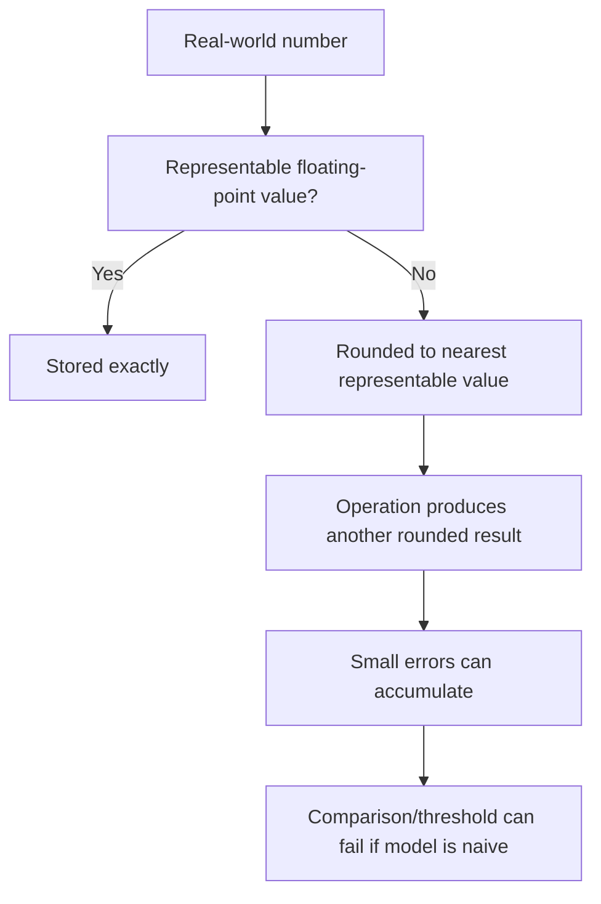

------
title: Learn Java Core Types, Data Model & Data APIs - Part 006
description: Deep engineering treatment of Java floating-point types: float, double, IEEE 754 semantics, precision, rounding, NaN, infinity, signed zero, comparison, strict floating-point behavior, and production decision rules.
series: learn-java-core-types
seriesTitle: Learn Java Core Types, Data Model & Data APIs
order: 6
partTitle: Floating-Point Types: float and double
tags:
- java
- floating-point
- float
- double
- ieee-754
- nan
- infinity
- precision
- rounding
- advanced
date: 2026-06-27
---

# Floating-Point Types: `float` and `double`

> Target Part 006: kamu harus bisa memakai `float` dan `double` secara sadar: kapan cocok, kapan berbahaya, bagaimana comparison bekerja, bagaimana `NaN`/infinity/signed zero memengaruhi logic, dan kapan harus memakai `BigDecimal`, integer minor unit, atau domain-specific type.

Floating-point bukan “angka decimal dengan koma”. Floating-point adalah representasi binary fixed-size untuk mendekati bilangan real dengan trade-off antara range, precision, dan performance.

Di production, bug floating-point sering muncul dalam bentuk:

- `0.1 + 0.2 != 0.3`;
- sorting aneh karena `NaN`;
- division menghasilkan infinity, bukan exception;
- `-0.0` lolos equality tetapi memengaruhi division;
- aggregation metric drift;
- uang dihitung dengan `double`;
- threshold comparison flapping;
- JSON/DB boundary mengubah precision;
- machine-learning/scoring result tidak reproducible karena order accumulation.

Part ini membangun mental model floating-point Java dari sisi engineering, bukan matematika abstrak.

---

## 1. Mental Model: Floating-Point adalah Approximation Engine

Java memiliki dua primitive floating-point types:

| Type | Format concept | Approx bits of precision | Typical use |
|---|---|---:|---|
| `float` | IEEE 754 binary32 | about 24 binary digits | graphics, ML tensor, compact numeric arrays, interop |
| `double` | IEEE 754 binary64 | about 53 binary digits | default scientific/measurement/statistical calculation |

JLS Java SE 25 menyatakan `float` sesuai dengan 32-bit IEEE 754 binary32 dan `double` sesuai dengan 64-bit IEEE 754 binary64.

Mental model:



Floating-point cocok ketika:

- approximation acceptable;
- range besar lebih penting dari exact decimal precision;
- operasi numerik banyak dan performance penting;
- domain memang measurement/scientific/statistical;
- input/output tidak perlu exact decimal identity.

Floating-point tidak cocok ketika:

- uang harus exact;
- audit/reconciliation harus exact;
- legal/regulatory calculation harus explainable decimal rounding;
- ID/code harus presisi;
- equality exact punya semantic business;
- decimal scale adalah bagian domain.

---

## 2. `float` vs `double`: Default ke `double` Kecuali Ada Alasan Kuat

Literal decimal tanpa suffix bertype `double`:

```java
var x = 1.0;  // double
var y = 1.0f; // float
```

Assignment ke `float` butuh suffix atau cast:

```java
float a = 1.0f;
float b = (float) 1.0;
// float c = 1.0; // compile-time error
```

### Kapan memakai `float`?

Gunakan `float` bila:

- API/library membutuhkan `float`;
- array sangat besar dan memory bandwidth penting;
- graphics/audio/signal processing/tensor data memakai format float;
- precision `float` cukup berdasarkan analisis domain.

Jangan memakai `float` hanya karena “lebih hemat”. Untuk business application biasa, `double` lebih aman dan lebih natural.

### Kapan memakai `double`?

Gunakan `double` untuk:

- measurement approximate;
- scoring/ranking approximate;
- metrics/statistics;
- geometry sederhana;
- probability;
- general numeric calculation yang tidak butuh exact decimal.

Namun `double` tetap bukan exact decimal.

---

## 3. Floating-Point Literals

Contoh literal:

```java
double a = 1.0;
double b = 1.;
double c = .5;
double d = 1e3;
double e = 1.0e-3;
float f = 1.0f;
double hex = 0x1.0p3; // 8.0, hexadecimal floating-point literal
```

Suffix:

| Suffix | Type |
|---|---|
| none | `double` |
| `f`/`F` | `float` |
| `d`/`D` | `double` |

Gunakan suffix lowercase/uppercase konsisten. Banyak style guide memilih `f` untuk `float` dan tanpa suffix untuk `double`.

### Hex floating-point literal

Hex floating literal jarang dipakai di business code, tapi berguna untuk representasi binary-exact floating constant.

```java
double x = 0x1.0p-1; // 0.5
```

`p` menunjukkan exponent base-2, bukan base-10.

---

## 4. Kenapa `0.1 + 0.2 != 0.3`?

Banyak decimal fraction tidak punya representasi finite dalam binary floating-point.

```java
double x = 0.1 + 0.2;
System.out.println(x);          // 0.30000000000000004
System.out.println(x == 0.3);   // false
```

Ini bukan bug Java. Ini konsekuensi representasi binary.

Analoginya: `1/3` tidak bisa direpresentasikan finite dalam decimal:

```text
1 / 3 = 0.3333333333...
```

Dalam binary, `0.1` punya masalah serupa.

### Engineering rule

Jangan bandingkan result floating-point approximate dengan `==` kecuali kamu benar-benar mencari bit-level/numeric exact equality untuk kasus yang terkendali.

Gunakan tolerance/epsilon yang sesuai domain:

```java
static boolean nearlyEqual(double a, double b, double tolerance) {
    return Math.abs(a - b) <= tolerance;
}
```

Namun tolerance juga harus didesain. `1e-9` universal adalah smell.

---

## 5. Designing Tolerance: Absolute vs Relative

Absolute tolerance cocok untuk nilai dengan skala tetap:

```java
static boolean closeAbsolute(double a, double b) {
    return Math.abs(a - b) <= 0.001;
}
```

Relative tolerance cocok untuk nilai dengan skala bervariasi:

```java
static boolean closeRelative(double a, double b, double relTol) {
    double diff = Math.abs(a - b);
    double scale = Math.max(Math.abs(a), Math.abs(b));
    return diff <= scale * relTol;
}
```

Gabungan absolute + relative sering lebih robust:

```java
static boolean close(double a, double b, double absTol, double relTol) {
    double diff = Math.abs(a - b);
    if (diff <= absTol) return true;
    double scale = Math.max(Math.abs(a), Math.abs(b));
    return diff <= scale * relTol;
}
```

Namun fungsi di atas perlu policy untuk `NaN` dan infinity.

```java
static boolean closeFinite(double a, double b, double absTol, double relTol) {
    if (!Double.isFinite(a) || !Double.isFinite(b)) {
        return false;
    }
    double diff = Math.abs(a - b);
    if (diff <= absTol) return true;
    double scale = Math.max(Math.abs(a), Math.abs(b));
    return diff <= scale * relTol;
}
```

---

## 6. Special Values: `NaN`, Infinity, Signed Zero

IEEE 754 floating-point mencakup nilai khusus:

- positive infinity;
- negative infinity;
- positive zero;
- negative zero;
- `NaN` atau Not-a-Number.

Java menyediakan constants:

```java
Double.NaN
Double.POSITIVE_INFINITY
Double.NEGATIVE_INFINITY
Float.NaN
Float.POSITIVE_INFINITY
Float.NEGATIVE_INFINITY
```

### 6.1 `NaN`

`NaN` muncul dari operasi invalid:

```java
double x = 0.0 / 0.0;
System.out.println(x); // NaN
```

Aturan penting:

```java
double nan = Double.NaN;

System.out.println(nan == nan); // false
System.out.println(nan != nan); // true
System.out.println(nan < 1.0);  // false
System.out.println(nan > 1.0);  // false
System.out.println(nan <= 1.0); // false
System.out.println(nan >= 1.0); // false
```

Jangan cek `NaN` dengan `==`.

```java
Double.isNaN(nan); // true
```

### 6.2 Infinity

Floating division by zero tidak selalu exception:

```java
System.out.println(1.0 / 0.0);  // Infinity
System.out.println(-1.0 / 0.0); // -Infinity
```

Berbeda dengan integer division:

```java
// System.out.println(1 / 0); // ArithmeticException
```

Cek:

```java
Double.isInfinite(value);
Double.isFinite(value);
```

### 6.3 Signed zero

```java
System.out.println(0.0 == -0.0); // true
System.out.println(1.0 / 0.0);   // Infinity
System.out.println(1.0 / -0.0);  // -Infinity
```

Signed zero bisa muncul di numerical algorithms, geometry, complex math, dan formatting edge cases.

---

## 7. Floating-Point Comparison and Ordering

Operator comparison punya behavior khusus terhadap `NaN`:

```java
static int naiveCompare(double a, double b) {
    if (a < b) return -1;
    if (a > b) return 1;
    return 0;
}
```

Jika `a` atau `b` adalah `NaN`, semua `<` dan `>` false sehingga function mengembalikan `0`, seolah equal. Ini berbahaya untuk sorting.

Gunakan:

```java
int cmp = Double.compare(a, b);
```

`Double.compare` punya total ordering yang cocok untuk comparator.

```java
List<Double> values = new ArrayList<>(List.of(1.0, Double.NaN, -1.0));
values.sort(Double::compare);
```

### Equality untuk wrapper

```java
Double a = Double.NaN;
Double b = Double.NaN;

System.out.println(a == b);      // reference comparison, don't rely
System.out.println(a.equals(b)); // true for canonical Double NaN semantics
```

Primitive `==` dan wrapper `equals` punya semantics berbeda pada `NaN` dan signed zero. Jangan mencampur tanpa memahami contract.

---

## 8. Arithmetic Semantics: Overflow, Underflow, Rounding

### 8.1 Overflow menghasilkan infinity

```java
double d = Double.MAX_VALUE;
System.out.println(d * 2); // Infinity
```

### 8.2 Underflow menuju zero/subnormal

```java
double tiny = Double.MIN_VALUE;
System.out.println(tiny / 2); // 0.0
```

`Double.MIN_VALUE` adalah positive nonzero value terkecil, bukan nilai paling negatif. Untuk nilai paling negatif:

```java
-Double.MAX_VALUE
```

Ini naming trap yang sering muncul saat interview dan production code review.

### 8.3 Rounding terjadi di banyak operasi

```java
double a = 1e16;
double b = 1.0;
System.out.println((a + b) - a); // 0.0, not 1.0
```

Karena pada magnitude besar, increment kecil bisa hilang.

### 8.4 Non-associativity

Floating-point addition tidak associative secara praktis:

```java
double a = 1e16;
double b = -1e16;
double c = 1.0;

System.out.println((a + b) + c); // 1.0
System.out.println(a + (b + c)); // 0.0
```

Ini penting untuk parallel aggregation, stream reduction, distributed computation, dan metrics.

---

## 9. Numeric Promotion dengan Floating-Point

Aturan praktis:

1. Jika ada `double`, operasi menjadi `double`.
2. Jika tidak ada `double` tapi ada `float`, operasi menjadi `float`.
3. Integral operand dipromosikan ke floating type terkait.

```java
int i = 10;
float f = 3.0f;
double d = 2.0;

var a = i / 3;    // int, result 3
var b = i / 3.0;  // double, result 3.333...
var c = i / f;    // float
var e = f + d;    // double
```

### Trap: integer division before assignment

```java
double ratio = 1 / 2;
System.out.println(ratio); // 0.0
```

Fix:

```java
double ratio = 1.0 / 2;
```

Atau:

```java
double ratio = (double) numerator / denominator;
```

---

## 10. Casting Floating-Point to Integral

Casting floating-point ke integer melakukan narrowing conversion.

```java
System.out.println((int) 12.9);  // 12
System.out.println((int) -12.9); // -12
```

Bagian fractional dibuang menuju nol.

### `NaN` cast

```java
System.out.println((int) Double.NaN); // 0
```

### Infinity/saturation-like behavior

```java
System.out.println((int) Double.POSITIVE_INFINITY); // Integer.MAX_VALUE
System.out.println((int) Double.NEGATIVE_INFINITY); // Integer.MIN_VALUE
```

### Range overflow during cast

```java
System.out.println((int) 1e20); // Integer.MAX_VALUE
```

Jangan gunakan cast sebagai validasi numeric input.

Lebih defensible:

```java
static int toIntChecked(double value) {
    if (!Double.isFinite(value)) {
        throw new IllegalArgumentException("not finite: " + value);
    }
    if (value < Integer.MIN_VALUE || value > Integer.MAX_VALUE) {
        throw new IllegalArgumentException("out of int range: " + value);
    }
    if (value != Math.rint(value)) {
        throw new IllegalArgumentException("not an integer: " + value);
    }
    return (int) value;
}
```

---

## 11. Why Money Must Not Use `double`

Uang biasanya membutuhkan:

- decimal precision;
- rounding policy eksplisit;
- auditability;
- deterministic reconciliation;
- exact equality pada amount setelah rounding;
- scale/currency semantics.

`double` tidak memenuhi kebutuhan tersebut.

Buruk:

```java
double price = 0.10;
double total = price * 3;
System.out.println(total); // 0.30000000000000004
```

Pilihan lebih baik:

### 11.1 Minor unit dengan `long`

```java
record MoneyCents(long cents) {
    MoneyCents plus(MoneyCents other) {
        return new MoneyCents(Math.addExact(this.cents, other.cents));
    }
}
```

Cocok bila:

- currency scale tetap;
- calculation sederhana;
- performance penting;
- rounding terjadi di boundary tertentu.

### 11.2 `BigDecimal`

```java
BigDecimal price = new BigDecimal("0.10");
BigDecimal total = price.multiply(new BigDecimal("3"));
```

Gunakan string constructor atau `BigDecimal.valueOf(double)` dengan hati-hati, bukan `new BigDecimal(0.1)`.

`BigDecimal` akan dibahas mendalam di Part 026.

---

## 12. `Math`, `StrictMath`, and Strict Floating-Point

Java menyediakan:

- `java.lang.Math`
- `java.lang.StrictMath`

Untuk sebagian besar aplikasi, `Math` cukup. `StrictMath` dirancang untuk hasil yang lebih reproducible sesuai definisi tertentu lintas platform untuk fungsi numerik tertentu.

Sejak JEP 306, Java mengembalikan always-strict floating-point semantics, sehingga perbedaan lama terkait relaxed/default floating-point semantics tidak lagi menjadi concern seperti era historis. Keyword `strictfp` menjadi jauh kurang relevan untuk kode modern.

### Practical rule

Gunakan:

```java
Math.sin(x)
Math.sqrt(x)
Math.fma(a, b, c)
```

Pilih `StrictMath` bila requirement benar-benar menuntut reproducibility lintas platform sesuai contract `StrictMath`.

---

## 13. Accumulation: Sum Tidak Sesederhana Loop

Naive sum:

```java
static double sum(double[] values) {
    double result = 0.0;
    for (double value : values) {
        result += value;
    }
    return result;
}
```

Masalah:

- order memengaruhi result;
- nilai kecil bisa hilang ketika ditambah ke accumulator besar;
- parallel sum bisa berbeda dari sequential sum;
- distributed aggregation bisa tidak deterministic.

### Kahan summation sederhana

```java
static double kahanSum(double[] values) {
    double sum = 0.0;
    double compensation = 0.0;

    for (double value : values) {
        double y = value - compensation;
        double t = sum + y;
        compensation = (t - sum) - y;
        sum = t;
    }

    return sum;
}
```

Ini bukan silver bullet, tapi menunjukkan bahwa numerical aggregation punya algorithmic dimension.

### Production implication

Untuk metrics approximate, naive sum mungkin cukup.

Untuk finance/regulatory/scientific calculation, pilih representation dan algorithm dengan deliberate design, bukan “pakai double karena mudah”.

---

## 14. Stream dan Parallel Stream Caveat

```java
double total = values.parallelStream()
    .mapToDouble(Double::doubleValue)
    .sum();
```

Parallel aggregation dapat mengubah order addition. Karena floating-point addition tidak associative, hasil bisa berbeda sedikit dari sequential.

Ini bukan berarti parallel stream salah. Artinya kamu harus tahu apakah domain menerima nondeterministic tiny differences.

Decision:

| Domain | Parallel floating reduction? |
|---|---|
| dashboard approximate | mungkin acceptable |
| alert threshold sensitif | hati-hati, pakai tolerance/hysteresis |
| finance | biasanya tidak |
| scientific reproducibility | perlu design khusus |
| ranking ML approximate | tergantung tolerance dan model validation |

---

## 15. Serialization, JSON, and DB Boundary

### JSON

JSON number tidak membedakan `float`, `double`, decimal, integer, atau BigDecimal. Parser/library menentukan mapping.

Masalah:

- precision berubah saat JavaScript consumer membaca number;
- `NaN` dan infinity bukan JSON number standar;
- formatting bisa mengubah readability;
- large decimal exact values bisa berubah jika diparse sebagai double.

Untuk public API:

- kirim uang sebagai string decimal atau integer minor unit;
- jangan kirim `NaN`/infinity sebagai numeric JSON;
- dokumentasikan precision dan scale;
- gunakan schema contract.

### Database

Mapping:

| Java | DB concept |
|---|---|
| `float` | REAL/FLOAT, driver-specific |
| `double` | DOUBLE PRECISION/FLOAT, driver-specific |
| `BigDecimal` | DECIMAL/NUMERIC |

Untuk exact decimal, gunakan DECIMAL/NUMERIC + `BigDecimal`, bukan floating column.

---

## 16. Domain Modeling: Measurement vs Amount vs Score

### Measurement

```java
record TemperatureCelsius(double value) {
    TemperatureCelsius {
        if (!Double.isFinite(value)) throw new IllegalArgumentException("temperature must be finite");
    }
}
```

Measurement biasanya approximate. `double` masuk akal.

### Money

```java
record MoneyMinor(long amountMinor, String currency) {
    MoneyMinor {
        if (currency == null || currency.isBlank()) throw new IllegalArgumentException("currency");
    }
}
```

Money butuh exact representation.

### Score/probability

```java
record Probability(double value) {
    Probability {
        if (!Double.isFinite(value) || value < 0.0 || value > 1.0) {
            throw new IllegalArgumentException("probability must be finite and within 0..1");
        }
    }
}
```

Score/probability sering cocok dengan `double`, tetapi invariant harus eksplisit.

---

## 17. Designing Floating-Point APIs

Buruk:

```java
boolean isHighRisk(double score) {
    return score > 0.8;
}
```

Lebih baik:

```java
record RiskScore(double value) {
    RiskScore {
        if (!Double.isFinite(value) || value < 0.0 || value > 1.0) {
            throw new IllegalArgumentException("risk score must be finite and within 0..1");
        }
    }

    boolean isHighRisk() {
        return value >= 0.8;
    }
}
```

Lebih kuat bila threshold perlu policy:

```java
record RiskThreshold(double highRiskFrom) {
    RiskThreshold {
        if (!Double.isFinite(highRiskFrom) || highRiskFrom < 0.0 || highRiskFrom > 1.0) {
            throw new IllegalArgumentException("threshold must be finite and within 0..1");
        }
    }

    boolean isHighRisk(RiskScore score) {
        return score.value() >= highRiskFrom;
    }
}
```

Pertanyaan review:

- Apakah `NaN` boleh masuk?
- Apakah infinity boleh masuk?
- Apakah signed zero penting?
- Apakah threshold inclusive atau exclusive?
- Apakah comparison butuh tolerance?
- Apakah result harus reproducible?
- Apakah serialization boundary menjaga representation?

---

## 18. Common Failure Modes

### 18.1 Exact equality pada approximate calculation

```java
if (actual == expected) { ... }
```

Fix:

```java
if (closeFinite(actual, expected, 1e-9, 1e-12)) { ... }
```

Tetapkan tolerance berdasarkan domain.

### 18.2 `NaN` masuk ke ranking/sorting

```java
items.sort((a, b) -> a.score() < b.score() ? -1 : 1);
```

Fix:

```java
items.sort(Comparator.comparingDouble(Item::score));
```

Lalu tentukan policy `NaN` jika perlu.

### 18.3 Money dengan `double`

```java
double total = unitPrice * quantity;
```

Fix: gunakan `long` minor unit atau `BigDecimal`.

### 18.4 Integer division sebelum double assignment

```java
double ratio = passed / total;
```

Jika `passed` dan `total` adalah `int`, result integer division.

Fix:

```java
double ratio = (double) passed / total;
```

### 18.5 Tidak mengecek finite value di boundary

```java
record Coordinate(double x, double y) {}
```

Fix:

```java
record Coordinate(double x, double y) {
    Coordinate {
        if (!Double.isFinite(x) || !Double.isFinite(y)) {
            throw new IllegalArgumentException("coordinate must be finite");
        }
    }
}
```

### 18.6 Naive comparator

```java
Comparator<Double> bad = (a, b) -> a < b ? -1 : a > b ? 1 : 0;
```

Fix:

```java
Comparator<Double> good = Double::compare;
```

---

## 19. Worked Example: Robust Percentage

Buruk:

```java
static double percentage(int part, int whole) {
    return part / whole * 100;
}
```

Masalah:

- integer division;
- division by zero;
- negative input unclear;
- overflow mungkin jika expression berubah;
- no finite policy.

Lebih defensible:

```java
static double percentage(long part, long whole) {
    if (whole <= 0) {
        throw new IllegalArgumentException("whole must be positive");
    }
    if (part < 0 || part > whole) {
        throw new IllegalArgumentException("part must be within 0..whole");
    }
    return ((double) part / (double) whole) * 100.0;
}
```

Lebih domain-specific:

```java
record Percentage(double value) {
    Percentage {
        if (!Double.isFinite(value) || value < 0.0 || value > 100.0) {
            throw new IllegalArgumentException("percentage must be finite and within 0..100");
        }
    }

    static Percentage of(long part, long whole) {
        if (whole <= 0) throw new IllegalArgumentException("whole must be positive");
        if (part < 0 || part > whole) throw new IllegalArgumentException("part out of range");
        return new Percentage(((double) part / whole) * 100.0);
    }
}
```

---

## 20. Worked Example: Alert Threshold with Hysteresis

Floating comparison pada threshold bisa flapping:

```java
if (cpuUsage > 0.80) {
    alert();
} else {
    recover();
}
```

Jika nilai berosilasi di sekitar `0.80`, alert bisa naik turun.

Tambahkan hysteresis:

```java
final class ThresholdState {
    private boolean alerting;

    boolean update(double value) {
        if (!Double.isFinite(value) || value < 0.0 || value > 1.0) {
            throw new IllegalArgumentException("value must be finite ratio 0..1");
        }

        if (!alerting && value >= 0.80) {
            alerting = true;
        } else if (alerting && value <= 0.75) {
            alerting = false;
        }

        return alerting;
    }
}
```

Ini bukan hanya floating-point issue, tetapi floating imprecision + noisy measurement membuat hysteresis sering penting di monitoring/risk scoring.

---

## 21. Review Checklist untuk Floating-Point Code

Saat review PR yang memakai `float`/`double`, tanyakan:

- Apakah domain memang approximate?
- Apakah uang/decimal exact memakai `double` secara keliru?
- Apakah `NaN` dan infinity divalidasi?
- Apakah comparison exact (`==`) benar-benar diinginkan?
- Apakah tolerance dirancang berdasarkan domain?
- Apakah threshold inclusive/exclusive jelas?
- Apakah signed zero penting?
- Apakah comparator memakai `Double.compare`/`Comparator.comparingDouble`?
- Apakah aggregation order bisa memengaruhi hasil?
- Apakah parallel stream acceptable?
- Apakah serialization boundary menerima special values?
- Apakah cast ke integral melakukan validasi range dan integer-ness?
- Apakah `float` dipakai karena alasan valid, bukan prematur optimization?

---

## 22. Practice Drill

### Drill 1 — Predict output

```java
System.out.println(0.1 + 0.2 == 0.3);
System.out.println(0.0 == -0.0);
System.out.println(1.0 / -0.0);
System.out.println(Double.NaN == Double.NaN);
System.out.println(Double.isNaN(Double.NaN));
```

Expected:

```text
false
true
-Infinity
false
true
```

### Drill 2 — Fix integer division

```java
int passed = 1;
int total = 2;
double ratio = passed / total;
```

Fix:

```java
double ratio = (double) passed / total;
```

### Drill 3 — Guard finite measurement

Buat record `DistanceMeters(double value)` dengan invariant:

- finite;
- non-negative.

Jawaban:

```java
record DistanceMeters(double value) {
    DistanceMeters {
        if (!Double.isFinite(value) || value < 0.0) {
            throw new IllegalArgumentException("distance must be finite and non-negative");
        }
    }
}
```

### Drill 4 — Design money representation

Jangan:

```java
record Money(double amount, String currency) {}
```

Lebih baik untuk minor unit:

```java
record MoneyMinor(long amountMinor, String currency) {
    MoneyMinor {
        if (currency == null || currency.isBlank()) throw new IllegalArgumentException("currency");
    }
}
```

Atau nanti gunakan `BigDecimal` dengan scale/rounding policy eksplisit.

### Drill 5 — Comparator

Ganti comparator buruk:

```java
Comparator<Double> bad = (a, b) -> a < b ? -1 : a > b ? 1 : 0;
```

Dengan:

```java
Comparator<Double> good = Double::compare;
```

---

## 23. Summary

Floating-point Java adalah alat approximation yang kuat, cepat, dan sangat berguna, tetapi bukan exact decimal arithmetic.

Yang harus tertanam:

- `float` adalah binary32, `double` adalah binary64.
- Literal decimal default adalah `double`.
- Banyak decimal fraction tidak representable secara exact.
- Floating-point memiliki `NaN`, infinity, dan signed zero.
- `NaN` tidak equal dengan dirinya sendiri pada primitive `==`.
- Floating division by zero bisa menghasilkan infinity, bukan exception.
- Floating arithmetic tidak associative secara praktis.
- Jangan gunakan `double` untuk uang atau decimal exact domain.
- Validasi `Double.isFinite` di boundary domain object.
- Gunakan `Double.compare` untuk ordering.
- Gunakan tolerance yang didesain, bukan angka magic universal.

Part berikutnya akan membahas `boolean` dan branch semantics: topik yang terlihat kecil, tetapi sangat penting untuk predicate design, boolean blindness, tri-state modeling, dan logic correctness.

---

## References

- Java Language Specification, Java SE 25, Chapter 4: Types, Values, and Variables — `https://docs.oracle.com/javase/specs/jls/se25/html/jls-4.html`
- Java Language Specification, Java SE 25, Chapter 5: Conversions and Contexts — `https://docs.oracle.com/javase/specs/jls/se25/html/jls-5.html`
- Java Language Specification, Java SE 25, Chapter 15: Expressions — `https://docs.oracle.com/javase/specs/jls/se25/html/jls-15.html`
- JEP 306: Restore Always-Strict Floating-Point Semantics — `https://openjdk.org/jeps/306`
- Java SE 25 API: `Float`, `Double`, `Math`, `StrictMath`, `BigDecimal`
