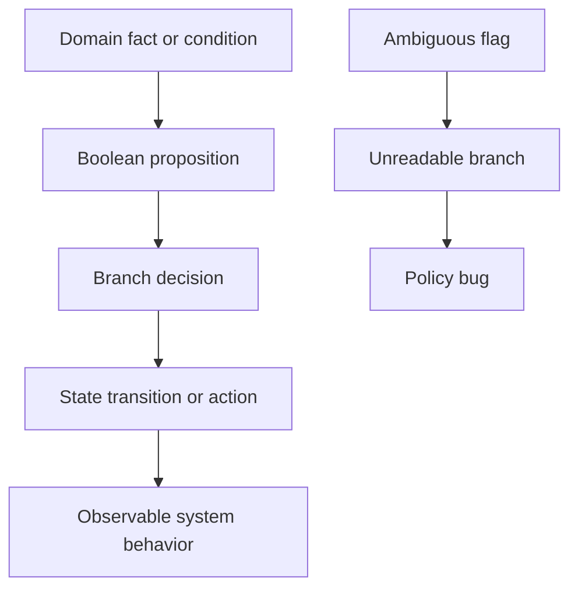
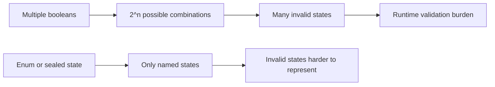

------
title: Learn Java Core Types, Data Model & Data APIs - Part 007
description: Deep engineering treatment of Java boolean semantics, branch logic, predicates, short-circuit evaluation, boolean blindness, tri-state modeling, and production-safe decision design.
series: learn-java-core-types
seriesTitle: Learn Java Core Types, Data Model & Data APIs
order: 7
partTitle: boolean and Branch Semantics
tags:
- java
- boolean
- branching
- predicates
- control-flow
- domain-modeling
- invariants
- advanced
date: 2026-06-27
---

# Part 007 — boolean and Branch Semantics

`boolean` terlihat paling sederhana: hanya `true` atau `false`.

Justru karena terlihat sederhana, ia sering dipakai terlalu bebas sampai model domain menjadi kabur:

```java
submit(caseId, true, false, true);
```

Kode seperti itu compile, tetapi pembacanya harus menebak:

- `true` pertama artinya force submit?
- `false` artinya skip validation?
- `true` terakhir artinya notify supervisor?

Pada sistem kecil, ini hanya masalah readability. Pada sistem regulatory, payment, entitlement, moderation, workflow, atau case management, ini bisa menjadi bug kebijakan.

Part ini membahas `boolean` bukan sebagai tipe kecil, tetapi sebagai **kontrak keputusan**.

Tujuannya bukan sekadar tahu `if`, `&&`, dan `||`. Tujuannya adalah mampu mendesain branching yang:

1. eksplisit;
2. testable;
3. stabil terhadap perubahan requirement;
4. aman terhadap null, race condition, dan ambiguity;
5. tidak menyembunyikan state domain dalam flag anonim.

---

## 1. Kaufman Deconstruction

Skill besar pada part ini:

> Mampu menggunakan `boolean` sebagai representasi keputusan yang benar tanpa merusak domain model.

Sub-skill yang harus dikuasai:

| Sub-skill | Yang perlu dikuasai |
|---|---|
| Boolean type semantics | `true`, `false`, literal, expression result |
| Branch semantics | `if`, loop condition, ternary, guard clause |
| Logical operators | `!`, `&&`, `||`, `&`, `|`, `^` untuk boolean |
| Short-circuit reasoning | kapan expression kanan dievaluasi dan kapan tidak |
| Predicate design | naming, polarity, composability |
| Boolean blindness | kapan flag harus diganti enum/object |
| Tri-state modeling | true/false/unknown tanpa mengacaukan invariant |
| Domain decision modeling | rules, policy gate, workflow transition |
| Failure modeling | null wrapper, race flag, hidden side-effect |

Praktik 20 jam untuk topik ini tidak berarti menulis 20 jam `if`. Yang dilatih adalah **membuat keputusan kode menjadi eksplisit dan auditable**.

---

## 2. Core Mental Model

`boolean` adalah tipe untuk jawaban terhadap satu proposisi.

Contoh proposisi yang baik:

```java
boolean eligible = applicant.age() >= 18;
boolean expired = now.isAfter(token.expiresAt());
boolean hasOpenViolation = violations.stream().anyMatch(Violation::isOpen);
```

Setiap variable boolean yang baik harus bisa dibaca sebagai kalimat:

- “applicant is eligible”
- “token is expired”
- “case has open violation”

Jika tidak bisa dibaca sebagai proposisi yang jelas, biasanya ia bukan boolean yang baik.

Buruk:

```java
boolean mode;
boolean type;
boolean status;
boolean flag;
boolean process;
boolean check;
```

Lebih baik:

```java
boolean expedited;
boolean manualReviewRequired;
boolean notificationSuppressed;
boolean escalationAllowed;
boolean evidenceComplete;
```

Mental model:



Dalam sistem serius, boolean bukan sekadar “nilai kecil”. Ia adalah **gerbang aksi**.

---

## 3. Java `boolean` Is Not Numeric

Java memiliki primitive type `boolean` dengan dua literal: `true` dan `false`.

Tidak seperti C, Java tidak punya implicit numeric truthiness.

Ini tidak valid:

```java
int count = 1;

if (count) {          // does not compile
    System.out.println("has count");
}
```

Harus eksplisit:

```java
if (count > 0) {
    System.out.println("has count");
}
```

Ini salah satu keputusan desain Java yang baik: branch harus memakai expression bertipe `boolean`.

Artinya, Java memaksa developer menjawab pertanyaan:

> Kondisi apa tepatnya yang membuat branch ini berjalan?

Contoh:

```java
if (users.size() > 0) { }
if (!users.isEmpty()) { }
```

Keduanya benar, tetapi yang kedua lebih jelas sebagai predicate domain koleksi.

---

## 4. Boolean Expressions

Boolean expression adalah expression yang menghasilkan `boolean`.

Sumber umum boolean expression:

```java
// comparison
int score = 87;
boolean passed = score >= 70;

// equality
String status = "OPEN";
boolean open = status.equals("OPEN");

// method predicate
List<String> names = List.of("Ayu", "Bima");
boolean empty = names.isEmpty();

// logical combination
boolean eligible = passed && !empty;

// pattern of domain predicate
boolean canEscalate = caseFile.isOpen() && caseFile.hasAssignedOfficer();
```

Comparison operators menghasilkan boolean:

```java
==
!=
<
<=
>
>=
```

Logical operators untuk boolean:

```java
!
&&
||
&
|
^
```

Ternary conditional juga memakai boolean condition:

```java
String label = overdue ? "OVERDUE" : "ON_TIME";
```

Loop condition juga harus boolean:

```java
while (cursor.hasNext()) {
    process(cursor.next());
}
```

---

## 5. `&&` and `||`: Short-Circuit Operators

`&&` dan `||` adalah short-circuit operators.

Artinya, expression kanan belum tentu dievaluasi.

```java
if (user != null && user.isActive()) {
    allowAccess(user);
}
```

Jika `user != null` bernilai `false`, maka `user.isActive()` tidak dieksekusi.

Ini aman.

Sebaliknya:

```java
if (user.isActive() && user != null) { // possible NPE
    allowAccess(user);
}
```

Urutan operand penting.

### 5.1 `&&` Evaluation

```java
boolean result = left && right;
```

| `left` | Apakah `right` dievaluasi? | Hasil |
|---|---:|---|
| `false` | Tidak | `false` |
| `true` | Ya | nilai `right` |

### 5.2 `||` Evaluation

```java
boolean result = left || right;
```

| `left` | Apakah `right` dievaluasi? | Hasil |
|---|---:|---|
| `true` | Tidak | `true` |
| `false` | Ya | nilai `right` |

Contoh aman:

```java
if (request == null || request.body() == null) {
    return BadRequest.emptyBody();
}
```

Jika `request == null`, maka `request.body()` tidak dipanggil.

---

## 6. `&`, `|`, and `^` for boolean

Java juga mengizinkan `&`, `|`, dan `^` pada boolean.

Bedanya:

- `&&` short-circuit;
- `||` short-circuit;
- `&` selalu mengevaluasi kedua sisi;
- `|` selalu mengevaluasi kedua sisi;
- `^` berarti exclusive-or.

Contoh:

```java
boolean a = validateHeader(request);
boolean b = validateBody(request);

if (a & b) {
    accept(request);
}
```

Di sini `validateBody` tetap dipanggil meskipun `validateHeader` false.

Ini kadang berguna jika kedua validasi harus dijalankan untuk mengumpulkan semua error.

Tetapi untuk branch biasa, preferensi default:

```java
if (a && b) { }
if (a || b) { }
```

Gunakan `&` dan `|` untuk boolean hanya jika Anda memang butuh evaluasi kedua sisi.

### 6.1 Exclusive-Or

`^` bernilai true jika tepat satu operand true.

```java
boolean exactlyOne = hasEmail ^ hasPhone;
```

Ini bisa berguna untuk invariant “pilih salah satu”.

Namun untuk domain penting, sering lebih jelas menulis method:

```java
boolean hasExactlyOneContactMethod() {
    return hasEmail() ^ hasPhone();
}
```

Atau validasi eksplisit:

```java
if (hasEmail == hasPhone) {
    throw new IllegalArgumentException("Exactly one contact method is required");
}
```

---

## 7. Truth Tables as Engineering Tool

Untuk logic yang kompleks, gunakan truth table.

Misalnya rule:

> Case boleh dieskalasi jika case open, evidence complete, dan belum assigned ke supervisor.

```java
boolean canEscalate = open && evidenceComplete && !assignedToSupervisor;
```

Truth table ringkas:

| open | evidenceComplete | assignedToSupervisor | canEscalate |
|---:|---:|---:|---:|
| false | false | false | false |
| false | true | false | false |
| true | false | false | false |
| true | true | false | true |
| true | true | true | false |

Untuk aturan regulatory, truth table bukan akademik. Ia menjadi alat audit.

Jika rule mulai punya banyak boolean:

```java
if (open && evidenceComplete && !assigned && !suspended && withinDeadline && hasJurisdiction) {
    escalate(caseFile);
}
```

Itu tanda bahwa rule perlu diekstrak.

```java
if (caseFile.canBeEscalatedAt(now)) {
    escalationService.escalate(caseFile.id());
}
```

Atau:

```java
EscalationDecision decision = escalationPolicy.evaluate(caseFile, now);

if (decision.allowed()) {
    escalationService.escalate(caseFile.id());
}
```

---

## 8. Boolean Naming

Boolean naming adalah bagian dari type design.

Gunakan nama yang bisa dibaca sebagai pertanyaan ya/tidak.

Baik:

```java
boolean active;
boolean expired;
boolean eligible;
boolean locked;
boolean authorized;
boolean reviewRequired;
boolean retryable;
boolean idempotent;
```

Lebih eksplisit dengan prefix:

```java
boolean isActive;
boolean hasEvidence;
boolean canSubmit;
boolean shouldNotify;
boolean requiresApproval;
boolean supportsRetry;
boolean allowsOverride;
```

### 8.1 Prefix Semantics

| Prefix | Makna umum | Contoh |
|---|---|---|
| `is` | sifat/status | `isClosed`, `isValid` |
| `has` | kepemilikan/keberadaan | `hasAttachment`, `hasPermission` |
| `can` | kapabilitas/izin | `canEscalate`, `canRetry` |
| `should` | rekomendasi/keputusan policy | `shouldNotify`, `shouldArchive` |
| `requires` | kewajiban | `requiresApproval` |
| `allows` | aturan permissive | `allowsManualOverride` |
| `supports` | kemampuan teknis | `supportsBatching` |

Jangan asal memilih prefix. `canSubmit` dan `shouldSubmit` berbeda:

```java
boolean canSubmit = validation.passed() && user.hasPermission(SUBMIT);
boolean shouldSubmit = canSubmit && schedule.isDue(now);
```

`can` adalah permission/capability. `should` adalah recommendation/decision.

---

## 9. Avoid Negative Boolean Names

Nama negatif membuat branch sulit dibaca.

Buruk:

```java
boolean notExpired = !token.isExpired();

if (!notExpired) {
    reject();
}
```

Pembaca harus melakukan double negation.

Lebih baik:

```java
boolean expired = token.isExpired();

if (expired) {
    reject();
}
```

Contoh buruk lain:

```java
boolean disableNotification;
boolean skipValidation;
boolean noRetry;
boolean notEligible;
```

Kadang nama negatif memang domain language yang sah, misalnya `disabled`, `suspended`, `revoked`. Tetapi hati-hati ketika dipakai dengan `!`.

```java
if (!account.isDisabled()) { }
```

Masih wajar.

Yang mulai berbahaya:

```java
if (!config.disableNotification()) { }
```

Lebih baik:

```java
if (config.notificationEnabled()) { }
```

---

## 10. Guard Clauses

Boolean sering lebih jelas jika dipakai sebagai guard clause, bukan nested `if`.

Buruk:

```java
void submit(CaseFile caseFile) {
    if (caseFile != null) {
        if (caseFile.isOpen()) {
            if (caseFile.hasEvidence()) {
                submitOpenCase(caseFile);
            }
        }
    }
}
```

Lebih baik:

```java
void submit(CaseFile caseFile) {
    Objects.requireNonNull(caseFile, "caseFile");

    if (!caseFile.isOpen()) {
        throw new IllegalStateException("Only open cases can be submitted");
    }

    if (!caseFile.hasEvidence()) {
        throw new IllegalStateException("Case evidence is incomplete");
    }

    submitOpenCase(caseFile);
}
```

Guard clause membuat invariant terbaca satu per satu.

Untuk business decision, jangan selalu throw. Bisa return decision object:

```java
SubmitDecision evaluate(CaseFile caseFile) {
    if (!caseFile.isOpen()) {
        return SubmitDecision.rejected("Case is not open");
    }

    if (!caseFile.hasEvidence()) {
        return SubmitDecision.rejected("Evidence is incomplete");
    }

    return SubmitDecision.allowed();
}
```

Boolean cocok untuk pertanyaan sederhana. Untuk keputusan yang butuh alasan, gunakan object.

---

## 11. Boolean Blindness

Boolean blindness terjadi ketika `true`/`false` tidak membawa konteks.

Contoh klasik:

```java
repository.findCases(true);
```

Apa arti `true`?

- include closed cases?
- only active cases?
- lock rows?
- bypass cache?

Lebih baik:

```java
repository.findCases(CaseFilter.openOnly());
```

Atau:

```java
repository.findCases(new CaseQuery(
    CaseStatusFilter.OPEN_ONLY,
    IncludeArchived.NO,
    LockMode.NONE
));
```

### 11.1 Boolean Parameter Smell

Boolean parameter sering menjadi smell jika:

1. method public;
2. method dipanggil dari banyak tempat;
3. `true` dan `false` mengubah alur besar;
4. caller tidak jelas tanpa membaca signature;
5. nantinya mungkin muncul opsi ketiga.

Buruk:

```java
void sendEmail(User user, boolean urgent) { }
void exportReport(LocalDate date, boolean includeDrafts) { }
void approve(CaseId id, boolean notifyApplicant) { }
```

Mungkin masih acceptable untuk method private kecil, tetapi pada API boundary sebaiknya hindari.

Lebih baik:

```java
void sendEmail(User user, Priority priority) { }
void exportReport(LocalDate date, DraftInclusion draftInclusion) { }
void approve(CaseId id, NotificationPolicy notificationPolicy) { }
```

Enum kecil bisa mengubah API dari anonim menjadi self-documenting:

```java
enum NotificationPolicy {
    NOTIFY_APPLICANT,
    SUPPRESS_NOTIFICATION
}
```

Pemanggilan menjadi jelas:

```java
approve(caseId, NotificationPolicy.NOTIFY_APPLICANT);
```

---

## 12. When Boolean Is the Right Type

Jangan salah paham: boolean bukan musuh.

Boolean tepat jika domain benar-benar binary dan stabil.

Contoh baik:

```java
boolean active;
boolean deleted;
boolean expired;
boolean verified;
boolean enabled;
boolean locked;
```

Namun tetap pikirkan domain.

`deleted` mungkin cukup untuk soft delete sederhana.

Tetapi untuk sistem audit, mungkin perlu:

```java
enum DeletionState {
    ACTIVE,
    PENDING_DELETION,
    DELETED,
    RESTORED
}
```

`verified` mungkin cukup untuk email verification.

Tetapi untuk KYC/regulatory domain, mungkin perlu:

```java
enum VerificationStatus {
    NOT_STARTED,
    PENDING_REVIEW,
    VERIFIED,
    REJECTED,
    EXPIRED
}
```

Decision rule:

> Jika business bertanya “true/false ini artinya apa saja?”, mungkin itu bukan boolean.

---

## 13. Tri-State Modeling

Banyak domain tidak binary:

- yes/no/unknown;
- allowed/denied/not evaluated;
- eligible/ineligible/pending;
- approved/rejected/manual review;
- present/absent/not applicable.

Jangan memaksa tri-state menjadi boolean.

Buruk:

```java
Boolean approved; // true approved, false rejected, null pending?
```

Ini compile, tetapi semantics tersembunyi.

Lebih baik:

```java
enum ApprovalStatus {
    PENDING,
    APPROVED,
    REJECTED
}
```

Atau jika butuh alasan:

```java
record ApprovalDecision(
    ApprovalOutcome outcome,
    String reason
) { }

enum ApprovalOutcome {
    PENDING,
    APPROVED,
    REJECTED
}
```

### 13.1 `Boolean` Wrapper Is Not a Good Domain Tri-State by Default

`Boolean` bisa null karena ia reference type.

```java
Boolean eligible = null;
```

Tetapi `null` tidak menjelaskan apa-apa.

Apakah artinya:

- not loaded?
- not evaluated?
- not applicable?
- unknown?
- system error?

Jika null punya arti domain, jadikan arti itu eksplisit.

```java
enum EligibilityStatus {
    NOT_EVALUATED,
    ELIGIBLE,
    INELIGIBLE,
    NOT_APPLICABLE
}
```

Gunakan `Boolean` nullable terutama untuk boundary teknis yang memang menyediakan nullable boolean, misalnya JSON, database legacy, atau external API. Setelah masuk domain, normalisasi ke type eksplisit.

---

## 14. `Boolean` Wrapper Pitfalls

Selain primitive `boolean`, Java punya wrapper `Boolean`.

```java
boolean primitive = true;
Boolean wrapper = Boolean.TRUE;
```

Wrapper diperlukan saat:

- generic type butuh reference type;
- collection menyimpan boolean values;
- nullability harus direpresentasikan di boundary;
- API reflection/framework memakai object.

Tetapi wrapper membawa risiko null.

```java
Boolean enabled = config.enabled();

if (enabled) { // possible NullPointerException due to unboxing
    start();
}
```

Aman:

```java
if (Boolean.TRUE.equals(enabled)) {
    start();
}
```

Atau normalisasi lebih awal:

```java
boolean enabled = Boolean.TRUE.equals(config.enabled());
```

Hati-hati juga dengan parsing.

```java
Boolean.parseBoolean("true");  // true
Boolean.parseBoolean("TRUE");  // true
Boolean.parseBoolean("yes");   // false
Boolean.parseBoolean(null);     // false
```

`Boolean.parseBoolean` hanya true jika string equal-ignore-case dengan `"true"`. Semua selain itu false. Ini bisa berbahaya untuk config.

Untuk konfigurasi production, lebih baik validasi eksplisit:

```java
static boolean parseRequiredBoolean(String value) {
    if ("true".equalsIgnoreCase(value)) {
        return true;
    }
    if ("false".equalsIgnoreCase(value)) {
        return false;
    }
    throw new IllegalArgumentException("Expected true or false, got: " + value);
}
```

Jangan tertukar:

```java
Boolean.getBoolean("feature.enabled")
```

Method ini tidak parse string biasa. Ia membaca system property dengan nama tersebut.

---

## 15. Boolean and Null Boundaries

Boundary umum yang sering menghasilkan nullable boolean:

- database column nullable;
- JSON field optional;
- form field checkbox yang tidak dikirim;
- external API;
- message schema lama;
- cache payload lama;
- spreadsheet import.

Jangan biarkan nullable boolean menyebar ke core domain.

Buruk:

```java
record Applicant(Boolean politicallyExposedPerson) { }
```

Lebih defensible:

```java
record Applicant(PepStatus pepStatus) { }

enum PepStatus {
    NOT_DECLARED,
    DECLARED_NO,
    DECLARED_YES,
    REQUIRES_REVIEW
}
```

Atau jika field benar-benar optional input:

```java
record ApplicantInput(Optional<Boolean> politicallyExposedPerson) { }
```

Namun hati-hati: `Optional<Boolean>` tetap kurang ekspresif dibanding enum jika ada domain state lebih dari absent/present.

---

## 16. Predicate Methods

Predicate method adalah method yang mengembalikan boolean.

Contoh:

```java
boolean isOpen() { }
boolean hasEvidence() { }
boolean canEscalate(User user) { }
boolean requiresManualReview() { }
```

Predicate yang baik:

1. tidak mengubah state;
2. murah atau setidaknya predictable;
3. namanya jelas;
4. tidak menyembunyikan side effect;
5. tidak terlalu banyak dependency global.

Buruk:

```java
boolean isEligible() {
    auditLog.write("eligibility checked");
    remoteService.refreshApplicantData(id);
    return calculateEligibility();
}
```

Nama `isEligible` terdengar seperti query murni, tetapi ternyata melakukan I/O dan mutasi.

Lebih baik:

```java
EligibilityDecision evaluateEligibility(Applicant applicant) { }
```

Jika method boolean melakukan proses mahal, namanya harus menunjukkan itu.

```java
boolean canReachFraudService(Duration timeout) { }
boolean verifiesAgainstRegistry(Applicant applicant) { }
```

Namun untuk API domain, return object sering lebih baik:

```java
RegistryVerificationResult verifyAgainstRegistry(Applicant applicant) { }
```

---

## 17. Composing Predicates

Boolean logic sering lebih maintainable jika predicate dipecah.

Buruk:

```java
if (caseFile.status() == CaseStatus.OPEN
        && caseFile.assignee() != null
        && caseFile.evidence().stream().anyMatch(Evidence::isVerified)
        && !caseFile.flags().contains(CaseFlag.SUSPENDED)
        && now.isBefore(caseFile.deadline())) {
    escalate(caseFile);
}
```

Lebih baik:

```java
boolean open = caseFile.isOpen();
boolean assigned = caseFile.hasAssignee();
boolean hasVerifiedEvidence = caseFile.hasVerifiedEvidence();
boolean notSuspended = !caseFile.isSuspended();
boolean withinDeadline = caseFile.isBeforeDeadline(now);

if (open && assigned && hasVerifiedEvidence && notSuspended && withinDeadline) {
    escalate(caseFile);
}
```

Lebih baik lagi jika ini domain rule:

```java
if (caseFile.canBeEscalatedAt(now)) {
    escalate(caseFile);
}
```

Atau policy object:

```java
EscalationDecision decision = escalationPolicy.evaluate(caseFile, now);

if (decision.allowed()) {
    escalate(caseFile);
}
```

Rule of thumb:

| Kondisi | Bentuk yang cocok |
|---|---|
| Satu predicate sederhana | Inline boolean expression |
| Beberapa predicate teknis lokal | Local boolean variables |
| Business rule reusable | Domain method |
| Business rule butuh alasan/audit | Decision object |
| Rule berubah berdasarkan policy/version | Policy/service object |

---

## 18. Boolean as State Is Often Too Small

Boolean sering dipakai untuk state:

```java
boolean closed;
boolean approved;
boolean rejected;
boolean escalated;
```

Masalahnya, beberapa boolean bisa menghasilkan kombinasi state mustahil.

```java
record CaseState(
    boolean open,
    boolean approved,
    boolean rejected,
    boolean escalated
) { }
```

Kombinasi invalid:

| open | approved | rejected | escalated | Masalah |
|---:|---:|---:|---:|---|
| true | true | true | false | approved dan rejected sekaligus |
| false | false | false | true | escalated tetapi case tidak jelas statusnya |
| true | false | false | false | mungkin valid, mungkin pending |

Lebih baik:

```java
enum CaseStatus {
    DRAFT,
    OPEN,
    UNDER_REVIEW,
    APPROVED,
    REJECTED,
    CLOSED
}
```

Jika state machine kompleks, sealed type atau explicit transition model lebih baik. Itu akan dibahas lagi pada Part 018 dan Part 019.

Mental model:



Top 1% engineer tidak hanya menulis validasi untuk state invalid. Ia berusaha mendesain type agar state invalid sulit dibuat.

---

## 19. Decision Object Instead of Bare Boolean

Jika jawaban boolean tidak cukup, jangan memaksa.

Buruk:

```java
boolean allowed = policy.canSubmit(caseFile);

if (!allowed) {
    return Response.forbidden(); // why?
}
```

Lebih baik:

```java
SubmitDecision decision = policy.evaluateSubmission(caseFile, user, now);

if (!decision.allowed()) {
    return Response.forbidden(decision.reason());
}
```

Contoh record:

```java
record SubmitDecision(
    boolean allowed,
    SubmitRejectionReason rejectionReason
) {
    static SubmitDecision allowed() {
        return new SubmitDecision(true, null);
    }

    static SubmitDecision rejected(SubmitRejectionReason reason) {
        return new SubmitDecision(false, Objects.requireNonNull(reason));
    }
}
```

Bisa lebih kuat dengan sealed type:

```java
sealed interface SubmitDecision permits SubmitDecision.Allowed, SubmitDecision.Rejected {
    record Allowed() implements SubmitDecision { }
    record Rejected(SubmitRejectionReason reason) implements SubmitDecision { }
}
```

Dengan sealed type, tidak ada `allowed=true` tetapi `reason != null` yang aneh.

---

## 20. Boolean and Exceptions

Jangan campur dua gaya tanpa alasan:

```java
boolean validate(CaseFile caseFile) throws ValidationException { }
```

Apa artinya return false jika exception juga bisa dilempar?

Lebih jelas:

```java
void validateOrThrow(CaseFile caseFile) throws ValidationException { }
```

Atau:

```java
ValidationResult validate(CaseFile caseFile) { }
```

Gunakan boolean untuk pertanyaan normal.

Gunakan exception untuk kondisi abnormal atau kontrak yang dilanggar.

Gunakan result object untuk validasi/domain decision yang perlu alasan.

| Bentuk | Cocok untuk |
|---|---|
| `boolean isValid()` | predicate sederhana tanpa alasan |
| `void validateOrThrow()` | fail-fast internal invariant |
| `ValidationResult validate()` | user-facing validation dengan daftar error |
| `Decision evaluate()` | policy/domain decision |

---

## 21. Branching and Side Effects

Short-circuit expression dengan side effect bisa membingungkan.

Buruk:

```java
if (isValid(input) && audit(input)) {
    process(input);
}
```

Apakah `audit` hanya dilakukan jika valid? Mungkin iya, mungkin bug.

Lebih jelas:

```java
boolean valid = isValid(input);

if (valid) {
    audit(input);
    process(input);
}
```

Lebih buruk:

```java
if (cache.containsKey(key) || loadIntoCache(key)) {
    return cache.get(key);
}
```

Ini mungkin clever, tetapi sulit dibaca dan rawan concurrency issue.

Lebih jelas:

```java
if (!cache.containsKey(key)) {
    loadIntoCache(key);
}

return cache.get(key);
```

Boolean expression idealnya bebas side effect.

---

## 22. De Morgan's Laws

Boolean simplification penting untuk readability.

De Morgan:

```java
!(a && b) == !a || !b
!(a || b) == !a && !b
```

Contoh:

```java
if (!(caseFile.isOpen() && caseFile.hasEvidence())) {
    reject();
}
```

Bisa dibuat lebih jelas:

```java
if (!caseFile.isOpen() || !caseFile.hasEvidence()) {
    reject();
}
```

Namun lebih baik jika reason perlu dibedakan:

```java
if (!caseFile.isOpen()) {
    return rejected("Case is not open");
}

if (!caseFile.hasEvidence()) {
    return rejected("Evidence is incomplete");
}
```

Jangan mengejar expression paling pendek. Kejar invariant paling jelas.

---

## 23. Boolean in Collections and Streams

Predicate sering muncul di stream.

```java
boolean hasOverdueCases = cases.stream()
    .anyMatch(CaseFile::isOverdue);
```

Common terminal predicate:

| Method | Makna |
|---|---|
| `anyMatch` | minimal satu match |
| `allMatch` | semua match |
| `noneMatch` | tidak ada yang match |

Hati-hati dengan empty stream:

```java
List<CaseFile> cases = List.of();

boolean allClosed = cases.stream().allMatch(CaseFile::isClosed); // true
boolean noneOpen = cases.stream().noneMatch(CaseFile::isOpen);   // true
boolean anyOpen = cases.stream().anyMatch(CaseFile::isOpen);     // false
```

Secara logic, `allMatch` pada empty stream bernilai true karena tidak ada counterexample. Ini disebut vacuous truth.

Dalam domain, itu bisa mengejutkan.

Jika business rule mengharuskan minimal satu case:

```java
boolean allCasesClosed = !cases.isEmpty()
    && cases.stream().allMatch(CaseFile::isClosed);
```

---

## 24. Boolean and Concurrency

`boolean` primitive tidak otomatis aman untuk koordinasi thread.

Buruk:

```java
class Worker {
    private boolean running = true;

    void stop() {
        running = false;
    }

    void runLoop() {
        while (running) {
            doWork();
        }
    }
}
```

Dalam program multi-thread, perubahan `running` dari thread lain mungkin tidak terlihat tepat waktu tanpa memory visibility guarantee.

Lebih baik:

```java
class Worker {
    private volatile boolean running = true;

    void stop() {
        running = false;
    }

    void runLoop() {
        while (running) {
            doWork();
        }
    }
}
```

Atau:

```java
class Worker {
    private final AtomicBoolean running = new AtomicBoolean(true);

    void stop() {
        running.set(false);
    }

    void runLoop() {
        while (running.get()) {
            doWork();
        }
    }
}
```

`volatile boolean` cocok untuk simple visibility flag.

`AtomicBoolean` cocok jika butuh atomic compare-and-set:

```java
if (started.compareAndSet(false, true)) {
    startExactlyOnce();
}
```

Concurrency akan punya pembahasan khusus di seri lain, tetapi untuk part ini cukup pegang invariant:

> Boolean flag antar-thread harus memiliki memory visibility semantics yang eksplisit.

---

## 25. Boolean in Database and API Boundaries

Boolean di boundary sering punya mismatch.

Database bisa menyimpan:

- `BOOLEAN`;
- `TINYINT(1)`;
- `CHAR(1)` dengan `Y/N`;
- nullable column;
- legacy values `0/1/2`;
- string `true/false`;
- string `yes/no`.

External API bisa mengirim:

```json
{ "active": true }
```

atau:

```json
{ "active": "Y" }
```

atau field tidak ada:

```json
{ }
```

Jangan menyamakan semua bentuk itu.

Boundary mapper harus menormalisasi:

```java
ActivationStatus mapActivation(String value) {
    return switch (value) {
        case "Y" -> ActivationStatus.ACTIVE;
        case "N" -> ActivationStatus.INACTIVE;
        case null -> ActivationStatus.UNKNOWN;
        default -> throw new IllegalArgumentException("Unknown activation value: " + value);
    };
}
```

Untuk Java version tanpa switch null support yang sesuai, gunakan guard eksplisit.

Domain sebaiknya menerima type yang sudah bersih.

---

## 26. Regulatory Case Example

Misalnya ada requirement:

> Case dapat dieskalasi jika terbuka, severity minimal HIGH, belum pernah dieskalasi, evidence lengkap, dan user punya permission escalation.

Implementasi langsung:

```java
if (caseFile.isOpen()
        && caseFile.severity().atLeast(Severity.HIGH)
        && !caseFile.isEscalated()
        && caseFile.hasCompleteEvidence()
        && user.hasPermission(Permission.ESCALATE_CASE)) {
    escalationService.escalate(caseFile.id());
}
```

Ini acceptable untuk satu tempat. Tetapi jika rule penting, extract:

```java
EscalationDecision decision = escalationPolicy.evaluate(caseFile, user, now);

if (decision.allowed()) {
    escalationService.escalate(caseFile.id());
} else {
    audit.rejectedEscalation(caseFile.id(), decision.reason());
}
```

Model:

```java
record EscalationDecision(
    boolean allowed,
    EscalationRejectionReason rejectionReason
) {
    static EscalationDecision allowed() {
        return new EscalationDecision(true, null);
    }

    static EscalationDecision rejected(EscalationRejectionReason reason) {
        return new EscalationDecision(false, Objects.requireNonNull(reason));
    }
}
```

Lebih kuat:

```java
sealed interface EscalationDecision {
    record Allowed() implements EscalationDecision { }
    record Rejected(EscalationRejectionReason reason) implements EscalationDecision { }
}
```

Kemudian caller dipaksa menangani dua bentuk:

```java
switch (decision) {
    case EscalationDecision.Allowed ignored -> escalationService.escalate(caseFile.id());
    case EscalationDecision.Rejected rejected -> audit.rejectedEscalation(caseFile.id(), rejected.reason());
}
```

Pada sistem audit, `boolean allowed` mungkin terlalu kecil. Decision object membawa alasan.

---

## 27. Branch Design Checklist

Gunakan checklist ini saat review kode:

1. Apakah nama boolean bisa dibaca sebagai proposisi?
2. Apakah boolean benar-benar binary?
3. Apakah ada opsi ketiga yang mulai muncul?
4. Apakah `Boolean` nullable bocor ke domain?
5. Apakah boolean parameter membuat caller tidak jelas?
6. Apakah expression terlalu panjang untuk diaudit?
7. Apakah side effect tersembunyi di expression?
8. Apakah `&&`/`||` bergantung pada urutan aman?
9. Apakah empty collection membuat `allMatch`/`noneMatch` memberi hasil mengejutkan?
10. Apakah flag dipakai antar-thread tanpa `volatile`/atomic/synchronization?
11. Apakah decision butuh reason, bukan hanya true/false?
12. Apakah beberapa boolean menciptakan invalid state combinations?

---

## 28. Practice Drill

### Drill 1 — Rename Predicates

Refactor kode berikut:

```java
boolean flag = user.role().equals("ADMIN") && !caseFile.closed();

if (flag) {
    approve(caseFile);
}
```

Target:

- nama boolean jelas;
- tidak ada string role mentah jika bisa dihindari;
- branch bisa dibaca sebagai domain rule.

Contoh solusi:

```java
boolean canApproveCase = user.hasRole(Role.ADMIN) && caseFile.isOpen();

if (canApproveCase) {
    approve(caseFile);
}
```

### Drill 2 — Remove Boolean Blindness

Refactor:

```java
reportService.generate(month, true, false);
```

Kemungkinan solusi:

```java
reportService.generate(
    month,
    new ReportOptions(
        DraftInclusion.INCLUDE_DRAFTS,
        NotificationPolicy.SUPPRESS_NOTIFICATION
    )
);
```

### Drill 3 — Replace Nullable Boolean

Refactor:

```java
record Review(Boolean approved) { }
```

Jika `null` berarti pending, ganti menjadi:

```java
record Review(ReviewStatus status) { }

enum ReviewStatus {
    PENDING,
    APPROVED,
    REJECTED
}
```

### Drill 4 — Extract Decision Object

Mulai dari:

```java
boolean canEscalate(CaseFile caseFile, User user) { }
```

Ubah menjadi:

```java
EscalationDecision evaluateEscalation(CaseFile caseFile, User user, Instant now) { }
```

Decision harus bisa menjawab:

- allowed or rejected;
- jika rejected, alasannya apa;
- rule mana yang gagal.

---

## 29. Common Interview and Review Questions

### Q1. Apakah `boolean` bisa dikonversi ke `int`?

Tidak. Java tidak punya implicit conversion dari `boolean` ke numeric type atau sebaliknya.

### Q2. Apa bedanya `&&` dan `&` pada boolean?

`&&` short-circuit. `&` selalu mengevaluasi kedua operand.

### Q3. Apakah `Boolean` aman dipakai di `if`?

Aman hanya jika non-null. Jika null, unboxing ke `boolean` akan menyebabkan `NullPointerException`.

### Q4. Kapan boolean parameter buruk?

Saat caller menjadi tidak jelas atau saat `true`/`false` mengubah behavior besar. Gunakan enum, options object, atau method berbeda.

### Q5. Kapan return boolean tidak cukup?

Saat caller perlu alasan, audit trail, error detail, atau alternative outcome. Gunakan result/decision object.

---

## 30. Summary

`boolean` adalah tipe kecil dengan dampak desain besar.

Yang perlu diingat:

- Java `boolean` bukan numeric.
- Branch condition harus boolean expression.
- `&&` dan `||` melakukan short-circuit.
- `&` dan `|` pada boolean mengevaluasi kedua sisi.
- Nama boolean harus berbentuk proposisi yang jelas.
- Hindari boolean parameter pada API penting jika maknanya tidak jelas.
- Jangan gunakan nullable `Boolean` sebagai domain tri-state tanpa alasan kuat.
- Beberapa boolean dapat menciptakan kombinasi state invalid.
- Jika keputusan butuh alasan, gunakan decision object.
- Untuk concurrency, boolean flag butuh visibility semantics yang eksplisit.

Top 1% engineer tidak hanya bertanya:

> “Apakah ini true atau false?”

Tetapi:

> “Apakah dunia domain ini memang hanya punya dua kemungkinan, dan apakah kode ini membuat keputusan itu eksplisit?”

---

## Official References

- Java Language Specification, Java SE 25, Chapter 4 — Types, Values, and Variables: https://docs.oracle.com/javase/specs/jls/se25/html/jls-4.html
- Java Language Specification, Java SE 25, Chapter 15 — Expressions: https://docs.oracle.com/javase/specs/jls/se25/html/jls-15.html
- Java SE 25 API, `java.lang.Boolean`: https://docs.oracle.com/en/java/javase/25/docs/api/java.base/java/lang/Boolean.html
