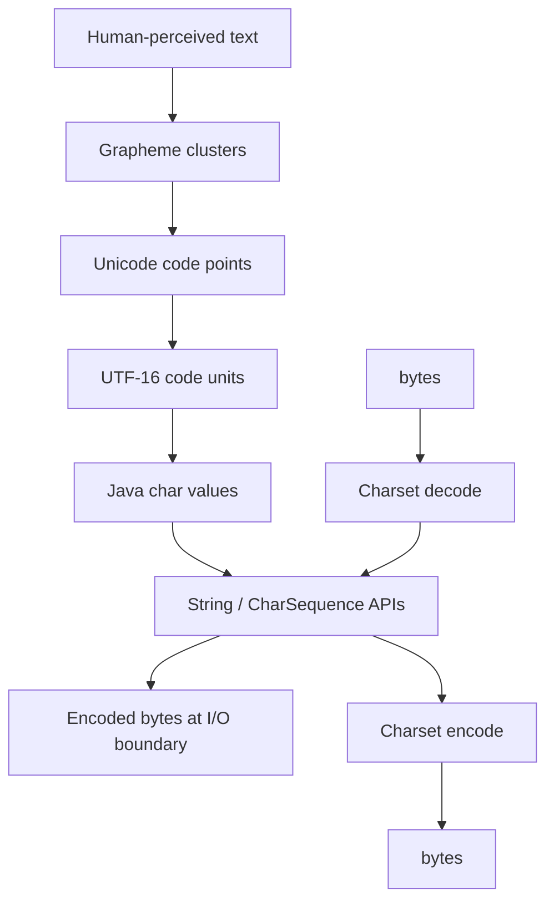
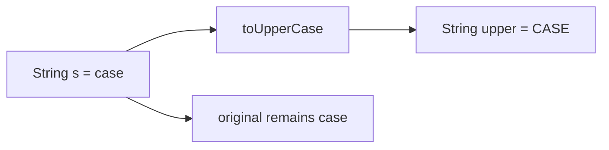

------
title: Learn Java Core Types, Data Model & Data APIs - Part 008
description: Deep engineering treatment of Java text model: char, String, Unicode, UTF-16 code units, code points, surrogate pairs, immutability, interning, CharSequence, StringBuilder, and production text failure modes.
series: learn-java-core-types
seriesTitle: Learn Java Core Types, Data Model & Data APIs
order: 8
partTitle: char, String, Unicode, and the Java Text Model
tags:
- java
- string
- char
- unicode
- utf-16
- text
- code-point
- code-unit
- advanced
date: 2026-06-27
---

# Part 008 — char, String, Unicode, and the Java Text Model

Text looks simple until production data arrives.

A user enters:

```text
Ayu 😊
```

A regulator uploads a company name with combining marks:

```text
Café
```

A payment system receives an identifier with invisible whitespace.

A fraud system compares names across locales.

A search index counts “characters” differently from the UI.

Suddenly this innocent line becomes dangerous:

```java
if (name.length() <= 10) { }
```

Why? Because in Java, `String.length()` counts UTF-16 code units, not user-perceived characters.

This part builds a precise mental model for text in Java:

- `char` is a 16-bit code unit, not always a complete character;
- `String` is an immutable sequence of characters/code units at the API level;
- Unicode code points may require one or two Java `char` values;
- user-perceived characters may require multiple code points;
- text equality, length, substring, indexing, casing, and normalization are domain-sensitive.

Part 009 will cover parsing, formatting, and regex. This part focuses on the underlying text model.

---

## 1. Kaufman Deconstruction

Skill besar pada part ini:

> Mampu memilih dan menggunakan Java text APIs tanpa salah memahami `char`, `String`, Unicode, length, equality, and mutation semantics.

Sub-skill:

| Sub-skill | Yang perlu dikuasai |
|---|---|
| `char` model | 16-bit unsigned UTF-16 code unit |
| Unicode code point | abstract Unicode scalar-ish value range used by Java APIs |
| Surrogate pair | dua `char` untuk code point supplementary |
| `String` model | immutable text value at API level |
| `String.length()` | jumlah UTF-16 code units |
| `codePointCount` | jumlah code points pada range tertentu |
| `CharSequence` | interface readable sequence of `char` values |
| `StringBuilder` | mutable builder untuk konstruksi text |
| Interning | literal sharing dan identity trap |
| Equality | content equality vs reference equality |
| Text boundary | encoding, normalization, locale, validation |

Mental target:

> Jangan pernah lagi menyamakan `char`, character, code point, glyph, byte, dan user-perceived character.

---

## 2. The Core Text Stack

Text di Java bisa dipahami sebagai beberapa lapisan:



Kesalahan umum terjadi saat developer memakai operasi pada satu lapisan untuk menjawab pertanyaan di lapisan lain.

Contoh:

| Pertanyaan | API yang sering salah dipakai | Masalah |
|---|---|---|
| Berapa byte payload? | `string.length()` | length bukan byte count |
| Berapa karakter user? | `string.length()` | length adalah code units |
| Potong 10 karakter tampilan | `substring(0, 10)` | bisa memotong surrogate pair/grapheme |
| Case-insensitive global compare | `toLowerCase()` default locale | locale-sensitive bug |
| Sama secara visual? | `equals` | normalization berbeda bisa tidak equal |

---

## 3. `char` Is Not Always a Character

Java `char` adalah primitive type 16-bit unsigned.

Secara historis, banyak orang menyebut `char` sebagai “character”. Untuk Basic Multilingual Plane, sering cukup. Tetapi Unicode modern lebih besar dari 16 bit.

Java API membedakan:

- **code unit**: unit encoding 16-bit dalam UTF-16; ini cocok dengan `char`;
- **code point**: nilai Unicode, biasanya ditulis `U+XXXX`;
- **surrogate pair**: dua code unit untuk merepresentasikan satu code point di luar BMP.

Contoh:

```java
String s = "A";

System.out.println(s.length());      // 1
System.out.println(s.charAt(0));     // A
System.out.println(s.codePointAt(0)); // 65
```

Untuk emoji:

```java
String s = "😊";

System.out.println(s.length());                    // 2
System.out.println(s.codePointCount(0, s.length())); // 1
System.out.println(Integer.toHexString(s.codePointAt(0))); // 1f60a
```

`"😊"` membutuhkan dua `char` values karena ia adalah supplementary code point.

Jika Anda melakukan:

```java
char c = "😊".charAt(0);
```

Anda tidak mendapatkan “emoji”. Anda mendapatkan high surrogate, yaitu separuh representasi UTF-16.

---

## 4. Code Unit, Code Point, Grapheme Cluster

Tiga istilah ini wajib dipisahkan.

### 4.1 Code Unit

Code unit adalah unit encoding.

Dalam Java string APIs, banyak operasi bekerja pada index `char`, yaitu index code unit UTF-16.

```java
String text = "ABC";

text.length();  // 3 code units
text.charAt(1); // 'B'
```

### 4.2 Code Point

Code point adalah nilai Unicode.

Contoh:

```text
A     -> U+0041
😊    -> U+1F60A
```

Java menyediakan method code point:

```java
int cp = text.codePointAt(index);
int count = text.codePointCount(0, text.length());
```

Code point direpresentasikan sebagai `int`, bukan `char`, karena range Unicode lebih besar dari 16 bit.

### 4.3 Grapheme Cluster

Grapheme cluster adalah unit yang cenderung dilihat user sebagai satu karakter.

Contoh:

```text
é
```

Bisa direpresentasikan sebagai:

1. single code point `U+00E9`; atau
2. `e` plus combining acute accent `U+0065 U+0301`.

Keduanya bisa terlihat sama, tetapi `String.equals` dapat menganggapnya berbeda.

Contoh lain: emoji dengan skin tone atau family emoji dapat terdiri dari beberapa code points yang tampil sebagai satu glyph.

Java core `String` API tidak otomatis memberi “jumlah karakter yang user lihat”. Untuk itu, Anda perlu memahami domain UI, normalization, dan kadang library text boundary yang lebih spesifik.

---

## 5. `String` Is Immutable

`String` adalah class final dan immutable secara API: nilainya tidak berubah setelah dibuat.

```java
String s = "case";
String upper = s.toUpperCase();

System.out.println(s);     // case
System.out.println(upper); // CASE
```

`toUpperCase()` tidak mengubah `s`. Ia mengembalikan string baru, kecuali implementation melakukan optimisasi internal yang tidak boleh Anda andalkan.

Mental model:



Immutability membuat `String` aman untuk sharing:

```java
String a = "OPEN";
String b = a;
```

Tidak ada caller yang bisa mengubah isi `a` menjadi `CLOSED`.

Ini sangat penting untuk:

- map key;
- class name;
- enum name;
- security token representation;
- cache key;
- log message;
- thread sharing;
- class loading;
- reflection;
- framework metadata.

---

## 6. String Literals and Interning

String literal seperti ini:

```java
String a = "OPEN";
String b = "OPEN";
```

Biasanya mengacu pada interned string yang sama.

```java
System.out.println(a == b);      // true, for literals
System.out.println(a.equals(b)); // true
```

Tetapi jangan memakai `==` untuk membandingkan isi string.

```java
String a = "OPEN";
String b = new String("OPEN");

System.out.println(a == b);      // false
System.out.println(a.equals(b)); // true
```

Rule:

> Gunakan `equals` untuk content equality. Gunakan `==` hanya jika Anda memang membandingkan identity/reference.

Untuk string constant di kiri, gunakan:

```java
if ("OPEN".equals(status)) {
    // null-safe
}
```

Atau lebih baik, jangan pakai raw string untuk domain status:

```java
if (caseFile.status() == CaseStatus.OPEN) {
    // enum identity is intended
}
```

---

## 7. `String.length()` Counts UTF-16 Code Units

Ini salah satu aturan paling penting.

```java
String ascii = "ABC";
String emoji = "😊";

System.out.println(ascii.length()); // 3
System.out.println(emoji.length()); // 2
```

`length()` tidak menjawab:

- jumlah byte;
- jumlah Unicode code points secara umum;
- jumlah glyph;
- jumlah karakter yang dilihat user.

Ia menjawab:

> Berapa banyak UTF-16 code units dalam string ini?

Untuk code point count:

```java
int codePoints = emoji.codePointCount(0, emoji.length());
```

Untuk byte count pada encoding tertentu:

```java
int utf8Bytes = emoji.getBytes(StandardCharsets.UTF_8).length;
```

Pertanyaan engineering yang benar:

| Requirement | Yang dihitung |
|---|---|
| Database column `VARCHAR(50)` | tergantung DB collation/encoding/semantics |
| HTTP payload max 1 MB | bytes after encoding |
| UI max 50 displayed characters | grapheme/user-perceived units |
| Protocol max 20 UTF-16 units | `length()` mungkin cocok |
| SMS-like billing | domain-specific encoding segments |

Jangan memakai `length()` sebelum tahu requirement menghitung apa.

---

## 8. Indexing and `charAt`

`charAt(index)` mengembalikan `char` pada UTF-16 code unit index.

```java
String s = "A😊B";

System.out.println(s.length()); // 4

System.out.println(s.charAt(0)); // A
System.out.println(Integer.toHexString(s.charAt(1))); // d83d high surrogate
System.out.println(Integer.toHexString(s.charAt(2))); // de0a low surrogate
System.out.println(s.charAt(3)); // B
```

Jika ingin iterasi code point:

```java
String s = "A😊B";

for (int i = 0; i < s.length(); ) {
    int codePoint = s.codePointAt(i);
    System.out.println(Integer.toHexString(codePoint));
    i += Character.charCount(codePoint);
}
```

Atau:

```java
s.codePoints()
    .forEach(cp -> System.out.println(Integer.toHexString(cp)));
```

Hati-hati dengan `chars()`:

```java
s.chars();      // IntStream of char values/code units
s.codePoints(); // IntStream of Unicode code points
```

Untuk text Unicode modern, `codePoints()` sering lebih benar daripada `chars()`.

---

## 9. Surrogate Pairs

UTF-16 merepresentasikan supplementary code point dengan dua code units:

- high surrogate;
- low surrogate.

Java menyediakan helper:

```java
char high = Character.highSurrogate(0x1F60A);
char low = Character.lowSurrogate(0x1F60A);

System.out.println(Character.isHighSurrogate(high)); // true
System.out.println(Character.isLowSurrogate(low));   // true
```

Membuat string dari code point:

```java
String smile = new String(Character.toChars(0x1F60A));
```

Atau append ke builder:

```java
StringBuilder builder = new StringBuilder();
builder.appendCodePoint(0x1F60A);
String smile = builder.toString();
```

Jika Anda memotong string sembarangan pada code unit boundary, Anda bisa memisahkan surrogate pair.

Buruk:

```java
String s = "😊";
String broken = s.substring(0, 1); // high surrogate only
```

Ini menghasilkan ill-formed text secara konseptual. Banyak API tetap bisa membawa string seperti itu, tetapi output/encoding/comparison dapat bermasalah.

---

## 10. Substring Is Code Unit Based

`substring(begin, end)` memakai index code unit.

```java
String s = "A😊B";

System.out.println(s.substring(0, 1)); // A
System.out.println(s.substring(1, 3)); // 😊
System.out.println(s.substring(3, 4)); // B
```

Tetapi:

```java
String broken = s.substring(1, 2); // only high surrogate
```

Untuk substring berdasarkan code point, Anda harus mengonversi index code point ke index code unit:

```java
static String substringByCodePoints(String s, int beginCodePoint, int endCodePoint) {
    int begin = s.offsetByCodePoints(0, beginCodePoint);
    int end = s.offsetByCodePoints(0, endCodePoint);
    return s.substring(begin, end);
}
```

Namun ini masih bukan grapheme-safe. Untuk user-visible truncation, code point saja belum tentu cukup.

---

## 11. `StringBuilder` and `StringBuffer`

Karena `String` immutable, concatenation berulang bisa menghasilkan banyak intermediate object jika tidak dioptimalkan.

Untuk membangun string dalam loop, gunakan `StringBuilder`.

```java
StringBuilder builder = new StringBuilder();

for (CaseFile caseFile : cases) {
    builder.append(caseFile.id())
        .append(':')
        .append(caseFile.status())
        .append('\n');
}

String report = builder.toString();
```

`StringBuilder` mutable dan tidak thread-safe.

`StringBuffer` mirip tetapi synchronized; jarang menjadi pilihan default pada kode modern kecuali Anda memang butuh kompatibilitas/API lama.

Rule:

| Situation | Prefer |
|---|---|
| Few concatenations | `+` is fine |
| Loop construction | `StringBuilder` |
| Concurrent mutation | usually redesign; rarely `StringBuffer` |
| Joining collection | `String.join`, `Collectors.joining` |
| Formatting values | `String.format` or formatter, with care |

Contoh join:

```java
String ids = caseIds.stream()
    .map(CaseId::value)
    .collect(Collectors.joining(","));
```

---

## 12. `CharSequence`

`CharSequence` adalah interface untuk readable sequence of `char` values.

Implementasi umum:

- `String`
- `StringBuilder`
- `StringBuffer`
- `CharBuffer`

Signature seperti ini lebih fleksibel:

```java
boolean isBlank(CharSequence value) { }
```

Tetapi ada trade-off.

`CharSequence` tidak menjamin immutability.

```java
void store(CharSequence value) {
    this.value = value; // dangerous if caller passes StringBuilder
}
```

Jika object Anda perlu menyimpan text stabil, convert ke `String`:

```java
void store(CharSequence value) {
    this.value = value == null ? null : value.toString();
}
```

API design rule:

| API role | Type yang cocok |
|---|---|
| Menerima input read-only sementara | `CharSequence` bisa cocok |
| Menyimpan value jangka panjang | `String` |
| Butuh mutation internal | `StringBuilder` |
| Boundary bytes/text | `byte[]` + `Charset`, bukan `String` saja |

---

## 13. Text Blocks

Java mendukung text block untuk multi-line string literal.

```java
String json = """
    {
      "status": "OPEN",
      "priority": "HIGH"
    }
    """;
```

Text block tetap menghasilkan `String`.

Gunakan untuk:

- sample JSON;
- SQL query;
- test fixture;
- template kecil;
- documentation snippets.

Tetapi hati-hati:

- indentation normalization;
- trailing newline;
- escaping;
- security jika dipakai menyusun SQL manual;
- jangan menjadi template engine improvisasi.

Untuk SQL production, tetap gunakan prepared statement/query builder/ORM sesuai konteks.

---

## 14. Equality and Ordering

### 14.1 Content Equality

Gunakan `equals`:

```java
if (status.equals("OPEN")) { }
```

Null-safe constant-first:

```java
if ("OPEN".equals(status)) { }
```

### 14.2 Case-Insensitive Equality

```java
if ("open".equalsIgnoreCase(status)) { }
```

Ini kadang cukup untuk protocol token ASCII.

Untuk human language, case-insensitive matching lebih kompleks dan locale-sensitive.

### 14.3 Ordering

`String.compareTo` melakukan lexicographic comparison berdasarkan Unicode values, bukan natural human collation.

Untuk human sorting, gunakan `Collator` dengan locale yang tepat. Ini akan dibahas lebih dalam pada Part 009.

---

## 15. Normalization

Dua string bisa terlihat sama tetapi beda representasi Unicode.

Contoh konseptual:

```text
é                  single code point
\u0065\u0301       e + combining accent
```

`equals` bisa false jika sequence code point berbeda.

Untuk domain seperti names, search, deduplication, dan identity matching, Anda perlu strategi normalization.

Java menyediakan `java.text.Normalizer`.

```java
String normalized = Normalizer.normalize(input, Normalizer.Form.NFC);
```

Tetapi normalization bukan silver bullet.

Anda harus menentukan:

- kapan normalize;
- form apa yang dipakai;
- apakah original value tetap disimpan;
- apakah comparison memakai normalized shadow field;
- apakah audit butuh raw input;
- apakah normalization bisa mengubah makna legal nama.

Untuk regulatory systems, biasanya simpan raw input dan normalized/search key secara terpisah.

```java
record LegalName(
    String raw,
    String normalizedForSearch
) { }
```

---

## 16. Whitespace Is Not Just Space

`" "` bukan satu-satunya whitespace.

Ada:

- tab;
- newline;
- carriage return;
- non-breaking space;
- ideographic space;
- zero-width characters;
- line separators;
- Unicode whitespace variants.

Java `String` punya methods seperti:

```java
isBlank()
strip()
stripLeading()
stripTrailing()
trim()
```

Perbedaan penting:

- `trim()` historically removes characters <= U+0020;
- `strip()` uses Unicode-aware whitespace logic.

Contoh:

```java
String input = "  Ayu  ";
String cleaned = input.strip();
```

Namun jangan asal strip untuk semua domain. Pada beberapa identifier, whitespace bisa invalid dan harus ditolak, bukan dibersihkan diam-diam.

---

## 17. Text vs Bytes

`String` bukan byte array.

Text di boundary harus selalu punya charset.

Buruk:

```java
byte[] bytes = input.getBytes(); // platform default charset
String output = new String(bytes); // platform default charset
```

Lebih baik:

```java
byte[] bytes = input.getBytes(StandardCharsets.UTF_8);
String output = new String(bytes, StandardCharsets.UTF_8);
```

Jangan menganggap:

```java
input.length() == input.getBytes(UTF_8).length
```

Contoh:

```java
String s = "é";

System.out.println(s.length()); // could be 1 or 2 depending representation
System.out.println(s.getBytes(StandardCharsets.UTF_8).length); // depends on representation too
```

Untuk payload limit, hitung bytes setelah encoding.

```java
boolean fitsPayloadLimit(String s, int maxBytes) {
    return s.getBytes(StandardCharsets.UTF_8).length <= maxBytes;
}
```

Untuk streaming besar, jangan selalu materialize seluruh string hanya untuk menghitung byte. Gunakan encoder/streaming strategy jika perlu.

---

## 18. Compact Strings Are Implementation Detail

Sejak JDK 9, banyak implementasi JDK memakai compact string internal representation untuk menghemat memory, misalnya Latin-1 atau UTF-16 internal storage. Namun ini implementation detail.

Sebagai developer aplikasi, jangan menulis kode yang bergantung pada layout internal `String`.

API contract tetap:

- `String` adalah immutable sequence text;
- indexing banyak API berdasarkan UTF-16 code units;
- method code point tersedia untuk Unicode-aware traversal.

Top-level rule:

> Depend on Java API semantics, not VM implementation detail.

---

## 19. Domain Modeling Text

Jangan semua text dibiarkan sebagai raw `String` di domain.

Buruk:

```java
record Applicant(String name, String email, String phone, String countryCode) { }
```

Ini compile, tetapi semua invariant tersembunyi.

Lebih baik:

```java
record Applicant(
    LegalName legalName,
    EmailAddress email,
    PhoneNumber phone,
    CountryCode countryCode
) { }
```

Contoh value object:

```java
record CountryCode(String value) {
    CountryCode {
        Objects.requireNonNull(value, "value");
        value = value.strip().toUpperCase(Locale.ROOT);

        if (!value.matches("[A-Z]{2}")) {
            throw new IllegalArgumentException("Expected ISO-like alpha-2 country code");
        }
    }
}
```

Catatan: penggunaan regex dan locale akan dibahas lebih rinci di Part 009. Di sini poinnya adalah: `String` sering terlalu umum untuk domain penting.

---

## 20. Case Conversion

Case conversion terlihat sederhana:

```java
String normalized = input.toLowerCase();
```

Namun default locale bisa berdampak.

Untuk protocol, enum-like token, HTTP-ish header names, country code, atau internal key, gunakan `Locale.ROOT`.

```java
String key = input.toLowerCase(Locale.ROOT);
```

Untuk human language, gunakan locale yang sesuai domain.

```java
String display = input.toUpperCase(locale);
```

Jangan menyamakan normalization untuk machine key dan display text.

| Use case | Strategy |
|---|---|
| Machine key | `Locale.ROOT` |
| User display | user/domain locale |
| Legal name | avoid destructive case conversion unless requirement says so |
| Search index | explicit normalization pipeline |

---

## 21. String Concatenation and Null

String concatenation dengan `+` mengonversi null menjadi string literal `"null"`.

```java
String name = null;
String message = "Hello " + name;

System.out.println(message); // Hello null
```

Ini kadang membantu logging, tetapi bisa mencemari output user atau serialized payload.

Untuk user-facing text, handle absence eksplisit:

```java
String displayName = name == null ? "<unknown>" : name;
```

Atau gunakan domain type yang tidak nullable.

---

## 22. Text in Logs and Audit

Text untuk logs/audit punya requirement berbeda dari UI.

Perlu dipikirkan:

- raw input vs normalized input;
- escaping newline agar log tidak rusak;
- redaction PII;
- invisible characters;
- control characters;
- max length;
- encoding sink;
- audit evidence preservation.

Contoh sederhana sanitizer untuk log:

```java
static String singleLineForLog(String input) {
    if (input == null) {
        return "<null>";
    }
    return input.replace('\n', ' ')
        .replace('\r', ' ');
}
```

Untuk production-grade logging, jangan berhenti di contoh ini. Gunakan structured logging dan redaction policy.

---

## 23. Security-Relevant Text Issues

Text bugs bisa menjadi security bugs.

Contoh risiko:

- visually confusable characters;
- mixed scripts;
- invisible characters;
- normalization mismatch;
- path traversal hidden by Unicode variant;
- log injection via newline;
- authorization key mismatch karena case/normalization;
- signature verification gagal karena encoding berbeda;
- token compare yang tidak constant-time untuk secret.

Untuk secret/token, `String` kadang bukan representasi ideal karena immutable dan bisa tinggal di memory sampai GC. Tetapi banyak Java API tetap memakai `String`. Untuk high-security material, pertimbangkan `char[]` atau byte array dengan lifecycle eksplisit, sambil memahami trade-off dan library expectations.

Namun jangan over-engineer semua text. Bedakan:

| Text | Security sensitivity |
|---|---|
| display label | low |
| legal name | high audit sensitivity |
| email | PII |
| password | secret |
| API token | secret |
| case narrative | PII/regulatory evidence |
| protocol key | correctness/security boundary |

---

## 24. Practical Example: Safe Case Title

Requirement:

- title required;
- strip surrounding whitespace;
- reject blank;
- max 120 Unicode code points;
- preserve original normalized display;
- not silently truncate.

Implementation:

```java
record CaseTitle(String value) {
    private static final int MAX_CODE_POINTS = 120;

    CaseTitle {
        Objects.requireNonNull(value, "value");
        value = value.strip();

        if (value.isBlank()) {
            throw new IllegalArgumentException("Case title must not be blank");
        }

        int codePoints = value.codePointCount(0, value.length());
        if (codePoints > MAX_CODE_POINTS) {
            throw new IllegalArgumentException("Case title exceeds " + MAX_CODE_POINTS + " code points");
        }
    }
}
```

Caveat:

- ini menghitung code points, bukan grapheme clusters;
- jika requirement UI adalah displayed characters, perlu mekanisme lain;
- jika title harus NFC-normalized, tambahkan `Normalizer.normalize` secara eksplisit;
- jika title adalah evidence, jangan ubah raw input tanpa menyimpan original.

---

## 25. Practical Example: Protocol Status Token

Untuk protocol token ASCII:

```java
record StatusToken(String value) {
    StatusToken {
        Objects.requireNonNull(value, "value");
        value = value.strip().toUpperCase(Locale.ROOT);

        if (!value.matches("[A-Z_]+")) {
            throw new IllegalArgumentException("Invalid status token: " + value);
        }
    }
}
```

Tetapi untuk finite status, enum lebih baik:

```java
enum CaseStatus {
    OPEN,
    UNDER_REVIEW,
    CLOSED
}
```

Boundary mapper:

```java
static CaseStatus parseStatus(String raw) {
    Objects.requireNonNull(raw, "raw");
    return CaseStatus.valueOf(raw.strip().toUpperCase(Locale.ROOT));
}
```

Di production, lebih baik handle error dengan pesan controlled, bukan membocorkan exception mentah.

---

## 26. Common Failure Modes

### 26.1 Using `length()` for User Character Limit

```java
if (input.length() <= 10) { }
```

Mungkin salah untuk emoji atau combining marks.

### 26.2 Splitting Surrogate Pair

```java
String broken = input.substring(0, 1);
```

Jika input dimulai supplementary character, ini bisa memotong separuh pair.

### 26.3 Comparing Strings with `==`

```java
if (status == "OPEN") { }
```

Harus:

```java
if ("OPEN".equals(status)) { }
```

Atau enum.

### 26.4 Default Charset

```java
new String(bytes);
input.getBytes();
```

Harus explicit charset.

### 26.5 Default Locale Case Conversion

```java
input.toLowerCase();
```

Untuk machine key:

```java
input.toLowerCase(Locale.ROOT);
```

### 26.6 Assuming Visual Equality Means `equals`

Normalization bisa membuat string terlihat sama tetapi tidak equal.

### 26.7 Treating `CharSequence` as Immutable

```java
CharSequence cs = new StringBuilder("OPEN");
```

Jika disimpan langsung, caller bisa mutate builder.

---

## 27. Review Checklist

Saat review kode text-heavy, tanyakan:

1. Apakah ini text atau bytes?
2. Jika bytes, charset-nya eksplisit?
3. Jika menghitung panjang, panjang apa: code unit, code point, byte, atau grapheme?
4. Apakah `substring` bisa memotong surrogate pair?
5. Apakah `charAt` benar-benar aman untuk domain ini?
6. Apakah comparison harus normalization-aware?
7. Apakah case conversion memakai locale yang benar?
8. Apakah `String` terlalu umum untuk domain value ini?
9. Apakah raw input perlu disimpan untuk audit?
10. Apakah output log aman dari newline/control character injection?
11. Apakah secret disimpan sebagai `String` tanpa pertimbangan lifecycle?
12. Apakah `CharSequence` disimpan tanpa copy ke `String`?
13. Apakah equality memakai `equals`, bukan `==`?
14. Apakah string literal status sebaiknya enum?
15. Apakah trimming/stripping diam-diam mengubah makna legal data?

---

## 28. Practice Drill

### Drill 1 — Predict Length

Tentukan output:

```java
String a = "A";
String b = "😊";
String c = "A😊B";

System.out.println(a.length());
System.out.println(b.length());
System.out.println(c.length());
System.out.println(c.codePointCount(0, c.length()));
```

Expected:

```text
1
2
4
3
```

### Drill 2 — Code Point Iteration

Tulis method:

```java
static List<Integer> codePointsOf(String input) { }
```

Requirement:

- reject null;
- return list of code points;
- do not split surrogate pairs.

Possible solution:

```java
static List<Integer> codePointsOf(String input) {
    Objects.requireNonNull(input, "input");
    return input.codePoints().boxed().toList();
}
```

### Drill 3 — Safe Title Value Object

Buat `CaseTitle` dengan requirement:

- required;
- strip surrounding whitespace;
- reject blank;
- max 80 code points;
- store as `String`.

### Drill 4 — Replace Raw String Status

Refactor:

```java
record CaseFile(String status) { }

if ("OPEN".equals(caseFile.status())) {
    process(caseFile);
}
```

Target:

```java
record CaseFile(CaseStatus status) { }

enum CaseStatus {
    OPEN,
    CLOSED
}
```

### Drill 5 — Boundary Charset

Refactor:

```java
String payload = new String(bytes);
byte[] output = payload.getBytes();
```

Target:

```java
String payload = new String(bytes, StandardCharsets.UTF_8);
byte[] output = payload.getBytes(StandardCharsets.UTF_8);
```

---

## 29. Mini Decision Framework

### 29.1 Which Type Should I Use?

| Need | Type |
|---|---|
| Single UTF-16 code unit | `char` |
| Unicode code point | `int` |
| Stable text value | `String` |
| Mutable text construction | `StringBuilder` |
| Flexible read-only parameter | `CharSequence` |
| Encoded data | `byte[]` / `ByteBuffer` + `Charset` |
| Finite symbolic text domain | `enum` |
| Domain text with invariant | value object wrapping `String` |

### 29.2 Which Operation Should I Use?

| Need | Operation |
|---|---|
| Content equality | `equals` |
| Null-safe literal compare | `"X".equals(value)` |
| Machine-token lowercase | `toLowerCase(Locale.ROOT)` |
| Remove Unicode surrounding whitespace | `strip` |
| Check blank Unicode-ish whitespace | `isBlank` |
| Count UTF-16 units | `length` |
| Count code points | `codePointCount` |
| Iterate code points | `codePoints` |
| Encode bytes | `getBytes(charset)` |
| Decode bytes | `new String(bytes, charset)` |
| Build in loop | `StringBuilder` |

---

## 30. Summary

Java text model is precise but easy to misuse.

Key points:

- `char` is a 16-bit UTF-16 code unit.
- A Unicode code point may require one or two Java `char` values.
- A user-perceived character may contain multiple code points.
- `String.length()` counts UTF-16 code units.
- `charAt` and `substring` are code-unit based.
- Use `codePoints()` or `codePointCount()` when code point semantics matter.
- `String` is immutable and safe to share.
- Use `equals`, not `==`, for content equality.
- Be explicit about charset at byte boundaries.
- Be explicit about locale during case conversion.
- Consider value objects instead of raw `String` for domain-critical text.
- Preserve raw input when audit/legal evidence matters.

Top 1% Java engineer does not ask only:

> “Is this a String?”

They ask:

> “At which layer of text am I operating: bytes, code units, code points, graphemes, normalized domain value, or display representation?”

That question prevents entire classes of production bugs.

---

## Official References

- Java Language Specification, Java SE 25, Chapter 3 — Lexical Structure: https://docs.oracle.com/javase/specs/jls/se25/html/jls-3.html
- Java Language Specification, Java SE 25, Chapter 4 — Types, Values, and Variables: https://docs.oracle.com/javase/specs/jls/se25/html/jls-4.html
- Java SE 25 API, `java.lang.String`: https://docs.oracle.com/en/java/javase/25/docs/api/java.base/java/lang/String.html
- Java SE 25 API, `java.lang.Character`: https://docs.oracle.com/en/java/javase/25/docs/api/java.base/java/lang/Character.html
- Java SE 25 API, `java.lang.CharSequence`: https://docs.oracle.com/en/java/javase/25/docs/api/java.base/java/lang/CharSequence.html
- Java SE 25 API, `java.nio.charset.Charset`: https://docs.oracle.com/en/java/javase/25/docs/api/java.base/java/nio/charset/Charset.html
