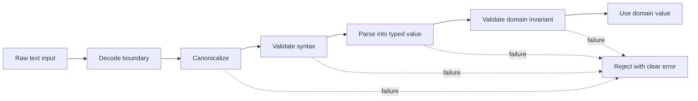
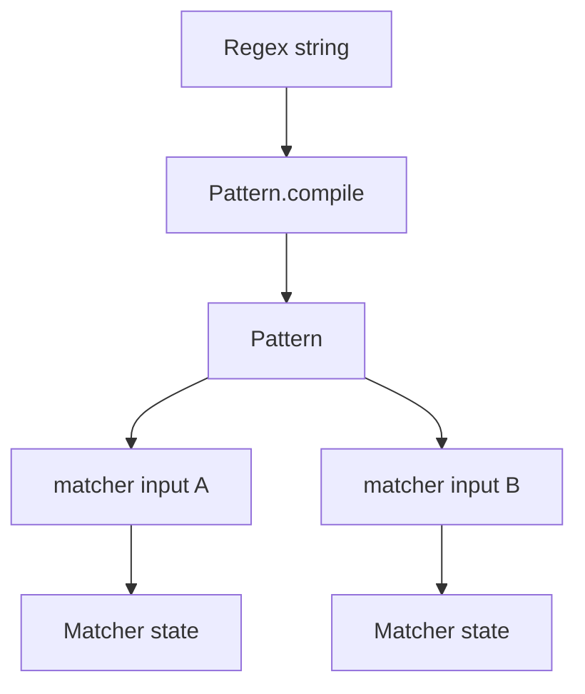
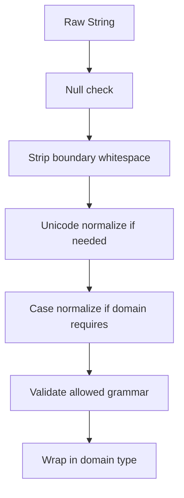
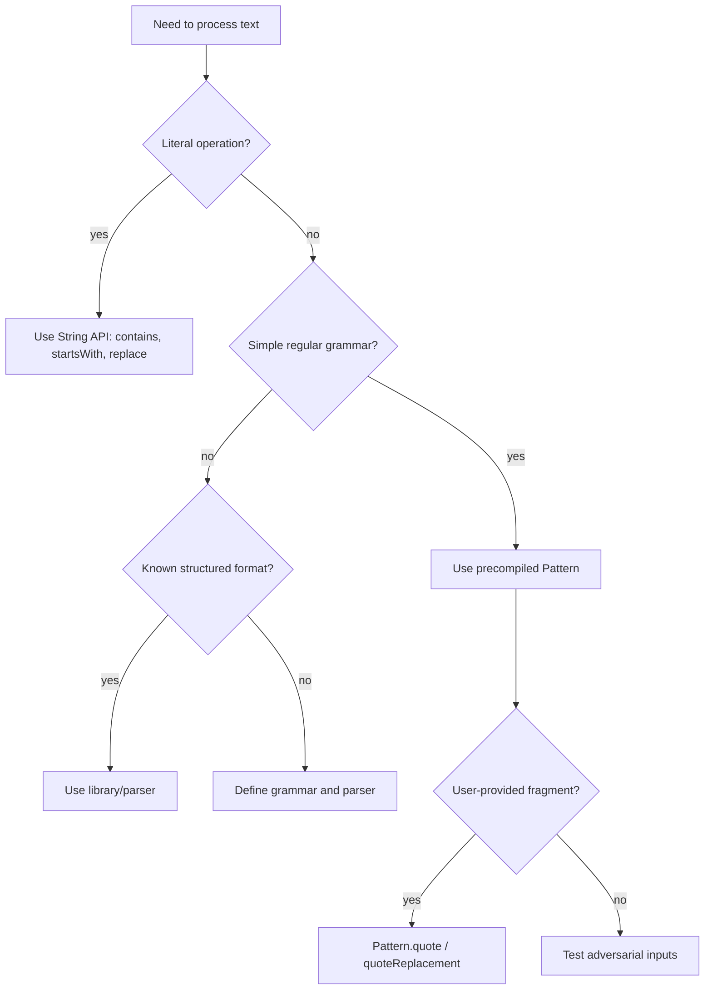

------
title: Learn Java Core Types, Data Model & Data APIs - Part 009
description: Deep engineering treatment of Java text parsing, formatting, regex, locale-sensitive rendering, canonicalization, validation boundaries, and production failure modes.
series: learn-java-core-types
seriesTitle: Learn Java Core Types, Data Model & Data APIs
order: 9
partTitle: Text Parsing, Formatting, and Regex
tags:
- java
- string
- regex
- parsing
- formatting
- locale
- canonicalization
- validation
- advanced
date: 2026-06-27
---

# Part 009 — Text Parsing, Formatting, and Regex

Part 008 built the low-level model: `char`, `String`, Unicode, UTF-16 code units, code points, surrogate pairs, immutability, and text identity.

Now we move one layer up: text as input, output, and protocol boundary.

This is where many production bugs appear:

```java
String[] parts = line.split(".");
```

The developer wanted to split by a dot. Java interpreted `.` as a regex metacharacter matching any character.

Or:

```java
String normalized = name.toLowerCase();
```

The developer wanted stable case normalization. The runtime default locale may disagree.

Or:

```java
if (input.matches("[A-Z]+")) { ... }
```

The developer thought they had a safe validation rule. They actually created a full-regex match with ASCII-only assumptions.

This part focuses on the operational layer of text:

- splitting;
- matching;
- extracting;
- replacing;
- formatting;
- parsing;
- canonicalizing;
- validating;
- avoiding locale, regex, and protocol failure modes.

We will not turn this into a full compiler/parser theory course. The goal is practical Java engineering judgment: know when `String`, regex, `Formatter`, `MessageFormat`, or a real parser is the right tool.

---

## 1. Kaufman Deconstruction

Skill besar pada part ini:

> Mampu memproses text input/output di Java secara aman, eksplisit, dan predictable di boundary production.

Sub-skill:

| Sub-skill | Yang perlu dikuasai |
|---|---|
| Splitting | memahami `String.split`, regex delimiter, `limit`, trailing empty strings |
| Regex model | `Pattern`, `Matcher`, full match vs find, groups, replacement rules |
| Formatting | `String.format`, `Formatter`, locale, number/date rendering |
| Message formatting | `MessageFormat`, placeholders, quoting rules, localization |
| Canonicalization | trim/strip, normalize, case, whitespace, identifier policy |
| Validation | boundary validation vs domain validation |
| Parsing | fail-fast, strict grammar, error reporting |
| Security/performance | regex injection, catastrophic backtracking, allocation pressure |

Target 20 jam:

| Jam | Fokus latihan |
|---:|---|
| 1-2 | eksperimen `split`, `limit`, regex delimiter |
| 3-5 | `Pattern`/`Matcher`, group extraction, named groups |
| 6-8 | replacement, escaping, `quote`, `quoteReplacement` |
| 9-11 | locale-sensitive formatting/parsing |
| 12-14 | canonicalization pipeline untuk input user |
| 15-17 | regex performance and ReDoS-style pitfalls |
| 18-20 | build mini text ingestion pipeline dengan tests |

---

## 2. Mental Model: Text Processing Is a Boundary Problem

Text processing hampir selalu berada di boundary:

- HTTP request;
- CSV export/import;
- log line;
- database value;
- message queue payload;
- user form;
- file path;
- configuration;
- audit note;
- external regulator data;
- payment reference;
- report template.

Boundary berarti:

1. data berasal dari luar kontrol kita;
2. format sering tidak sebersih asumsi kita;
3. failure perlu dijelaskan;
4. transformation perlu deterministic;
5. bug bisa menjadi data corruption, security issue, atau compliance issue.

Gunakan pipeline mental berikut:



Kesalahan umum adalah langsung memakai raw `String` sebagai domain value.

```java
record CustomerName(String value) { }
```

Itu belum salah, tapi belum cukup. Pertanyaannya:

- Apakah leading/trailing whitespace boleh?
- Apakah empty string valid?
- Apakah invisible characters valid?
- Apakah case-sensitive?
- Apakah Unicode normalization dibutuhkan?
- Apakah value ini identifier atau display text?
- Apakah value ini harus round-trip persis?

Jawaban tiap domain berbeda. Karena itu text processing harus eksplisit.

---

## 3. `String.split`: Small API, Many Traps

`String.split(regex)` menerima regular expression, bukan literal delimiter.

```java
"a.b.c".split(".");       // wrong for literal dot
"a.b.c".split("\\.");    // works
"a.b.c".split(Pattern.quote(".")); // clearer for dynamic delimiter
```

Jika delimiter berasal dari user/config, jangan interpolate langsung sebagai regex kecuali memang tujuannya regex.

```java
String delimiter = config.delimiter();
String[] columns = line.split(Pattern.quote(delimiter));
```

### 3.1 `split` Without Limit Drops Trailing Empty Strings

```java
System.out.println(Arrays.toString("a,b,".split(",")));
// [a, b]
```

Trailing empty token hilang.

Untuk format kolom, ini sering bug. Gunakan negative limit:

```java
System.out.println(Arrays.toString("a,b,".split(",", -1)));
// [a, b, ]
```

Rule praktis:

| Use case | Gunakan |
|---|---|
| human convenience splitting | `split(regex)` mungkin cukup |
| protocol/CSV/fixed columns | `split(regex, -1)` atau parser khusus |
| dynamic literal delimiter | `split(Pattern.quote(delimiter), -1)` |
| large repeated split | precompile `Pattern` |

### 3.2 Limit Semantics

`limit` mengontrol jumlah aplikasi pattern dan trailing empty strings.

```java
"a,b,c".split(",", 2);  // [a, b,c]
"a,b,c".split(",", 3);  // [a, b, c]
"a,b,".split(",", 0);  // [a, b]
"a,b,".split(",", -1); // [a, b, ]
```

Mental model:

- positive limit: maksimal panjang result;
- zero limit: trailing empty strings dibuang;
- negative limit: pattern diterapkan sebanyak mungkin, trailing empty strings dipertahankan.

### 3.3 Splitting CSV Is Not CSV Parsing

Ini bukan parser CSV:

```java
String[] columns = line.split(",", -1);
```

Karena CSV dapat berisi quoted comma:

```text
"ACME, Inc",ACTIVE,2026-06-27
```

Hasil naive split salah:

```text
["ACME,  Inc", ACTIVE, 2026-06-27]
```

Gunakan parser CSV jika formatnya CSV sungguhan.

Rule engineering:

> Regex/split cocok untuk delimiter sederhana. Untuk grammar dengan quoting, escaping, nesting, atau comments, pakai parser.

---

## 4. Regex Mental Model

Java regex memakai dua object utama:

- `Pattern`: compiled representation dari regular expression;
- `Matcher`: stateful engine untuk input tertentu.

```java
Pattern pattern = Pattern.compile("(?<area>\\d{3})-(?<number>\\d{4})");
Matcher matcher = pattern.matcher("555-1234");

if (matcher.matches()) {
    String area = matcher.group("area");
    String number = matcher.group("number");
}
```

`Pattern` bisa dishare. `Matcher` tidak boleh dianggap stateless.



### 4.1 `matches` vs `find` vs `lookingAt`

| Method | Meaning |
|---|---|
| `matches()` | seluruh input harus match |
| `find()` | cari subsequence berikutnya yang match |
| `lookingAt()` | match harus mulai dari awal input, tetapi tidak harus habis |

Example:

```java
Pattern p = Pattern.compile("\\d+");

p.matcher("123").matches();    // true
p.matcher("abc123").matches(); // false
p.matcher("abc123").find();    // true
p.matcher("123abc").lookingAt(); // true
```

Failure mode:

```java
if (input.matches("\\d+")) { ... }
```

`String.matches` recompiles regex every call. Untuk hot path, gunakan `Pattern`.

```java
private static final Pattern DIGITS = Pattern.compile("\\d+");

boolean isDigits(String input) {
    return DIGITS.matcher(input).matches();
}
```

---

## 5. Regex Escaping: Java String Layer + Regex Layer

Ada dua level escaping:

1. Java string literal;
2. regex syntax.

Untuk regex digit `\d`, Java source harus menulis:

```java
"\\d"
```

Untuk literal backslash, lebih banyak lagi:

```java
Pattern.compile("\\\\"); // regex for one literal backslash
```

Rule:

| Tujuan | Java source |
|---|---|
| digit class | `"\\d"` |
| whitespace class | `"\\s"` |
| word class | `"\\w"` |
| literal dot | `"\\."` |
| literal pipe | `"\\|"` |
| literal backslash | `"\\\\"` |

Jika ingin literal user input:

```java
Pattern literal = Pattern.compile(Pattern.quote(userInput));
```

Jika ingin replacement literal:

```java
String safe = matcher.replaceAll(Matcher.quoteReplacement(replacement));
```

Karena replacement string punya aturan khusus untuk `$1`, `\`, dan group reference.

---

## 6. Groups, Named Groups, and Extraction

Regex bukan hanya untuk true/false. Ia juga bisa mengekstrak struktur.

```java
private static final Pattern CASE_REF = Pattern.compile(
    "(?<prefix>[A-Z]{2})-(?<year>\\d{4})-(?<seq>\\d{6})"
);

record CaseReference(String prefix, int year, long sequence) {
    static CaseReference parse(String raw) {
        Matcher m = CASE_REF.matcher(raw);
        if (!m.matches()) {
            throw new IllegalArgumentException("Invalid case reference: " + raw);
        }
        return new CaseReference(
            m.group("prefix"),
            Integer.parseInt(m.group("year")),
            Long.parseLong(m.group("seq"))
        );
    }
}
```

Named groups membuat extraction lebih defensible daripada index.

Kurang jelas:

```java
String year = m.group(2);
```

Lebih jelas:

```java
String year = m.group("year");
```

### 6.1 Avoid Regex-as-Domain

Jangan sebarkan regex ke seluruh codebase.

Buruk:

```java
if (caseRef.matches("[A-Z]{2}-\\d{4}-\\d{6}")) { ... }
```

Lebih baik:

```java
CaseReference ref = CaseReference.parse(caseRef);
```

Regex adalah implementation detail dari value object/domain scalar.

---

## 7. Replacement Semantics

`replace` dan `replaceAll` berbeda.

```java
"a.b".replace(".", "-");       // a-b, literal replacement
"a.b".replaceAll(".", "-");    // ---, regex replacement
"a.b".replaceAll("\\.", "-"); // a-b
```

Gunakan:

| Kebutuhan | API |
|---|---|
| literal char sequence replacement | `replace` |
| regex replacement | `replaceAll` / `Matcher.replaceAll` |
| replace first regex match | `replaceFirst` |
| loop with custom replacement | `Matcher.appendReplacement` + `appendTail` |

### 7.1 Replacement Group References

```java
String input = "2026-06-27";
String output = input.replaceAll("(\\d{4})-(\\d{2})-(\\d{2})", "$3/$2/$1");
// 27/06/2026
```

Jika replacement berasal dari user, escape:

```java
String output = input.replaceAll(regex, Matcher.quoteReplacement(userReplacement));
```

Tanpa ini, `$` atau `\` dalam replacement dapat mengubah meaning atau menyebabkan exception.

---

## 8. Character Classes and Unicode Awareness

Regex sederhana sering ASCII-centric:

```java
[A-Za-z]+
```

Ini tidak mencakup nama seperti:

```text
José
Søren
李
Αλέξανδρος
```

Pertanyaan penting:

- Domain memang hanya ASCII?
- Atau kita hanya tidak sadar input global?
- Apakah identifier internal berbeda dari display name?

Untuk identifier internal, ASCII mungkin masuk akal:

```java
private static final Pattern INTERNAL_CODE = Pattern.compile("[A-Z0-9_]{3,40}");
```

Untuk human name, regex biasanya bukan validasi domain yang baik. Banyak sistem cukup menerapkan constraints teknis:

- tidak null;
- tidak blank;
- length wajar;
- tidak mengandung control characters tertentu;
- normalized;
- audit-safe.

Jangan over-validate human names.

---

## 9. `trim`, `strip`, Blankness, and Whitespace

`trim()` adalah API lama berbasis karakter `<= U+0020`.

`strip()` lebih Unicode-aware karena memakai konsep whitespace dari `Character`.

```java
String raw = "  hello  ";
raw.trim();  // "hello"
raw.strip(); // "hello"
```

Untuk input modern, prefer `strip()` kecuali Anda sengaja butuh behavior historis `trim()`.

Gunakan `isBlank()` untuk whitespace-only text:

```java
if (input == null || input.isBlank()) {
    throw new IllegalArgumentException("Name is required");
}
```

Namun jangan otomatis strip semua domain.

| Domain | Strip? |
|---|---|
| user display name | biasanya yes di boundary |
| password/passphrase | biasanya no |
| cryptographic token | no, kecuali protocol menyatakan trimming |
| free-form note | mungkin preserve, mungkin normalize line endings |
| identifier/code | yes lalu validate strict |

---

## 10. Canonicalization Pipeline

Canonicalization adalah membuat representasi input menjadi bentuk standar sebelum validation/domain use.

Example untuk internal code:

```java
record InternalCode(String value) {
    private static final Pattern VALID = Pattern.compile("[A-Z][A-Z0-9_]{2,39}");

    InternalCode {
        Objects.requireNonNull(value, "value");
        value = value.strip().toUpperCase(Locale.ROOT);
        if (!VALID.matcher(value).matches()) {
            throw new IllegalArgumentException("Invalid internal code: " + value);
        }
    }
}
```

Perhatikan `Locale.ROOT`.

Jangan gunakan default locale untuk canonicalization yang harus stabil lintas mesin:

```java
String code = raw.toUpperCase(); // depends on default locale
```

Gunakan:

```java
String code = raw.toUpperCase(Locale.ROOT);
```

Pipeline:



### 10.1 Do Not Canonicalize Blindly

Canonicalization bisa merusak meaning.

| Transformation | Bisa salah jika |
|---|---|
| `strip()` | whitespace meaningful, password/token |
| `toLowerCase` | display text harus preserve case |
| Unicode normalization | byte-for-byte audit payload harus preserved |
| remove punctuation | punctuation part of legal name/reference |
| collapse spaces | free-form text, address, quoted legal entity |

Rule:

> Canonicalize only when the domain has a canonical form.

---

## 11. Formatting: Data to Text

Formatting adalah proses mengubah typed value menjadi text.

```java
String s = String.format("Case %s has %d documents", caseId, count);
```

`String.format` memakai `Formatter`.

### 11.1 Locale Matters

```java
double amount = 12345.67;

String us = String.format(Locale.US, "%,.2f", amount);
String de = String.format(Locale.GERMANY, "%,.2f", amount);
```

Hasil bisa berbeda:

```text
12,345.67
12.345,67
```

Rule:

| Output target | Locale |
|---|---|
| user-facing UI | user locale |
| machine protocol | fixed locale or no locale-dependent format |
| logs/metrics | `Locale.ROOT` or structured data |
| audit/report localized | explicit business locale |

Jangan rely pada default locale untuk output yang harus deterministic.

```java
String line = String.format(Locale.ROOT, "amount=%.2f", amount);
```

### 11.2 Formatting Is Not Serialization

Ini sering keliru:

```java
String payload = String.format("%s|%s|%s", id, name, status);
```

Jika `name` berisi `|`, format rusak.

Untuk machine data, gunakan serialization format yang jelas:

- JSON;
- CSV library;
- protobuf;
- Avro;
- fixed-width format dengan rules eksplisit;
- domain protocol parser.

`String.format` cocok untuk rendering, bukan protocol tanpa escape rules.

---

## 12. `MessageFormat`: Human Messages, Not `printf`

`MessageFormat` berguna untuk localized user-facing messages.

```java
MessageFormat mf = new MessageFormat(
    "Case {0} has {1,number,integer} open tasks",
    Locale.US
);
String message = mf.format(new Object[] { "ENF-2026-000123", 5 });
```

Namun quoting rules-nya berbeda dari `Formatter`. Single quote punya arti khusus.

```java
MessageFormat.format("User '{0}'", "Ayu");
```

Bisa menghasilkan output yang tidak diharapkan jika quote tidak dipahami.

Rule:

- gunakan `MessageFormat` untuk localization templates;
- gunakan `Formatter`/`String.format` untuk printf-style formatting;
- jangan campur placeholder styles;
- test message templates dengan sample values;
- berhati-hati dengan single quote.

---

## 13. Parsing: Text to Typed Value

Parsing adalah kebalikan formatting, tapi tidak selalu simetris.

```java
int count = Integer.parseInt(raw);
LocalDate date = LocalDate.parse(raw);
UUID id = UUID.fromString(raw);
```

Parsing yang baik punya ciri:

1. menerima grammar yang jelas;
2. menolak input ambigu;
3. menghasilkan typed value;
4. menyimpan error yang actionable;
5. tidak diam-diam memperbaiki input berbahaya.

### 13.1 Avoid Exception-Driven Hot Loops When Possible

Exception wajar untuk parse failure di boundary, tetapi jangan jadikan exception sebagai kontrol normal pada hot path besar jika bisa pre-check dengan murah.

Namun jangan juga menulis pre-check yang salah.

Buruk:

```java
if (raw.matches("\\d+")) {
    int x = Integer.parseInt(raw);
}
```

Masih bisa overflow.

Lebih baik:

```java
try {
    int x = Integer.parseInt(raw);
} catch (NumberFormatException ex) {
    // invalid int representation or out of range
}
```

Untuk API domain, bungkus error:

```java
static OptionalInt tryParsePositiveInt(String raw) {
    try {
        int value = Integer.parseInt(raw);
        return value > 0 ? OptionalInt.of(value) : OptionalInt.empty();
    } catch (NumberFormatException ex) {
        return OptionalInt.empty();
    }
}
```

---

## 14. Validation: Syntax vs Domain Invariant

Pisahkan syntax validation dan domain validation.

Example:

```java
record EnforcementCaseId(String value) {
    private static final Pattern SYNTAX = Pattern.compile("ENF-\\d{4}-\\d{6}");

    EnforcementCaseId {
        Objects.requireNonNull(value, "value");
        value = value.strip().toUpperCase(Locale.ROOT);
        if (!SYNTAX.matcher(value).matches()) {
            throw new IllegalArgumentException("Invalid case id syntax");
        }
    }
}
```

Ini syntax.

Domain invariant bisa lain:

- year tidak boleh sebelum regulator berdiri;
- sequence harus exist di database;
- case ID harus milik organization tertentu;
- case ID status tidak boleh archived untuk action tertentu.

Jangan masukkan database check ke value object constructor jika itu membuat constructor blocking, impure, dan sulit dites.

---

## 15. Regex Performance and Catastrophic Backtracking

Regex bisa menjadi bottleneck atau vulnerability jika pattern buruk dan input hostile.

Classic issue:

```java
Pattern.compile("(a+)+b");
```

Input:

```text
aaaaaaaaaaaaaaaaaaaaaaaaaaaaaa
```

Engine dapat mencoba banyak kombinasi sebelum gagal.

Safer thinking:

- hindari nested unbounded quantifier;
- anchor pattern jika validasi full input;
- batasi panjang input sebelum regex;
- precompile regex;
- gunakan parser/manual scanner untuk grammar kompleks;
- test dengan adversarial input.

### 15.1 Validate Length Before Regex

```java
static final Pattern REF = Pattern.compile("[A-Z0-9_-]{1,64}");

static boolean isValidReference(String raw) {
    if (raw == null || raw.length() > 64) {
        return false;
    }
    return REF.matcher(raw).matches();
}
```

Length check mengurangi attack surface.

---

## 16. Regex Injection

Jika user input digabung ke regex, user input bisa mengubah pattern.

Buruk:

```java
Pattern p = Pattern.compile("^" + userPrefix + ".*$");
```

Jika `userPrefix` mengandung `.*`, meaning berubah.

Aman untuk literal:

```java
Pattern p = Pattern.compile("^" + Pattern.quote(userPrefix) + ".*$");
```

Atau jangan regex:

```java
boolean ok = text.startsWith(userPrefix);
```

Rule:

> Jangan pakai regex untuk operasi literal yang sudah punya API jelas.

---

## 17. Parsing Lines and Logs

Log parsing sering terlihat sederhana:

```java
String[] parts = line.split(" ");
```

Tetapi logs biasanya mengandung:

- quoted strings;
- stack traces;
- optional fields;
- timestamp dengan spaces;
- escaped delimiters;
- structured values.

Prefer structured logs jika bisa:

```json
{"caseId":"ENF-2026-000123","status":"OPEN","durationMs":17}
```

Jika harus parsing legacy logs:

- define grammar;
- test malformed lines;
- track parse failures;
- jangan silently skip fields;
- simpan raw line untuk forensic.

---

## 18. Text Boundaries in Regulatory/Case Systems

Untuk sistem enforcement lifecycle, text data sering punya konsekuensi defensibility.

Contoh field:

- case reference;
- legal entity name;
- officer note;
- violation code;
- submission ID;
- document title;
- address;
- audit reason;
- escalation comment.

Setiap field butuh policy berbeda.

| Field | Suggested handling |
|---|---|
| case reference | strip, uppercase `Locale.ROOT`, strict syntax, typed wrapper |
| legal entity name | strip boundary, preserve case, avoid over-validation |
| officer note | preserve content, normalize line endings optionally, length cap |
| violation code | strict ASCII/domain code grammar |
| document title | strip, remove/deny control chars, length cap |
| audit reason | required, preserve text, no silent truncation |
| token | no trim unless protocol says so, constant-time compare if secret |

Rule:

> Text policy belongs to domain boundary, not random controllers.

---

## 19. A Production-Grade Text Value Object

```java
import java.text.Normalizer;
import java.util.Locale;
import java.util.Objects;
import java.util.regex.Pattern;

public record ViolationCode(String value) {
    private static final int MAX_LENGTH = 32;
    private static final Pattern VALID = Pattern.compile("[A-Z][A-Z0-9_]*(\\.[A-Z0-9_]+)*");

    public ViolationCode {
        Objects.requireNonNull(value, "value");

        value = value.strip();
        value = Normalizer.normalize(value, Normalizer.Form.NFKC);
        value = value.toUpperCase(Locale.ROOT);

        if (value.isEmpty()) {
            throw new IllegalArgumentException("Violation code is required");
        }
        if (value.length() > MAX_LENGTH) {
            throw new IllegalArgumentException("Violation code is too long");
        }
        if (!VALID.matcher(value).matches()) {
            throw new IllegalArgumentException("Invalid violation code: " + value);
        }
    }
}
```

Kapan ini masuk akal?

- code adalah identifier internal;
- domain ingin canonical uppercase;
- Unicode compatibility normalization diinginkan;
- punctuation policy jelas;
- value dipakai sebagai key/map/index.

Kapan ini tidak cocok?

- legal display name;
- free-form note;
- password;
- raw evidence text;
- forensic/audit payload yang harus byte-for-byte preserved.

---

## 20. Testing Text Processing

Minimal tests untuk text pipeline:

```java
import static org.junit.jupiter.api.Assertions.*;
import org.junit.jupiter.api.Test;

class ViolationCodeTest {
    @Test
    void canonicalizesWhitespaceAndCase() {
        assertEquals("AML.KYC_01", new ViolationCode(" aml.kyc_01 ").value());
    }

    @Test
    void rejectsBlank() {
        assertThrows(IllegalArgumentException.class, () -> new ViolationCode("   "));
    }

    @Test
    void rejectsIllegalCharacters() {
        assertThrows(IllegalArgumentException.class, () -> new ViolationCode("AML/KYC"));
    }

    @Test
    void rejectsTooLongInputBeforeHeavyWork() {
        assertThrows(IllegalArgumentException.class, () -> new ViolationCode("A".repeat(100)));
    }
}
```

Add adversarial tests:

- empty string;
- whitespace-only;
- leading/trailing whitespace;
- lowercase;
- combining marks;
- emoji;
- zero-width characters;
- very long input;
- delimiter inside field;
- regex metacharacters;
- invalid escape characters.

---

## 21. Decision Framework



Practical rules:

1. Use `String` APIs for literal operations.
2. Use regex for small, regular grammars.
3. Use parser/library for CSV, JSON, XML, SQL, programming language fragments, nested data, or quoted/escaped formats.
4. Precompile regex in hot paths.
5. Use `Locale.ROOT` for machine canonicalization.
6. Use explicit user/business locale for user-facing formatting.
7. Keep raw input if auditability matters.
8. Wrap important parsed text as domain types.

---

## 22. Common Failure Modes

| Failure | Cause | Prevention |
|---|---|---|
| split by `.` returns nonsense | `.` is regex wildcard | `Pattern.quote(".")` or `"\\."` |
| missing trailing empty column | `split` default limit discards trailing empty strings | use `split(regex, -1)` |
| locale-specific casing bug | default locale | `Locale.ROOT` for machine text |
| regex injection | unescaped user fragment | `Pattern.quote` |
| replacement bug with `$` | replacement has group syntax | `Matcher.quoteReplacement` |
| slow regex | catastrophic backtracking | simpler pattern, length limit, parser |
| wrong human name validation | ASCII-only assumptions | avoid over-validation |
| CSV parse bug | naive split | CSV parser |
| protocol corruption | `String.format` without escaping | real serialization format |
| silent data loss | truncation/canonicalization without policy | explicit boundary policy |

---

## 23. Practice Drill

Build `CaseReferenceParser`.

Requirement:

Input examples:

```text
 enf-2026-000123 
ENF-2026-000124
INV-2025-999999
```

Rules:

- leading/trailing whitespace ignored;
- prefix must be `ENF` or `INV`;
- year must be `2020..2099`;
- sequence must be exactly 6 digits;
- canonical output uppercase;
- invalid input must explain which rule failed;
- no default locale usage;
- no raw regex scattered outside parser;
- parser returns typed record.

Suggested model:

```java
record CaseReference(String prefix, int year, int sequence) {
    @Override
    public String toString() {
        return "%s-%04d-%06d".formatted(prefix, year, sequence);
    }
}
```

Add tests for:

- valid lowercase input;
- blank;
- invalid prefix;
- invalid year;
- invalid sequence length;
- delimiter metacharacters;
- trailing spaces;
- very long input.

---

## 24. Review Checklist

Before approving text-processing Java code, ask:

- Is this operation literal or regex?
- Is user input being interpolated into regex or replacement?
- Are delimiters simple enough for `split`?
- Does `split` need `limit = -1`?
- Is the locale explicit?
- Are we preserving or canonicalizing case intentionally?
- Is whitespace policy explicit?
- Are we over-validating human text?
- Are we under-validating internal identifiers?
- Are regex patterns precompiled when reused?
- Are long/hostile inputs bounded before expensive processing?
- Are parse errors actionable?
- Are important strings wrapped in domain types?
- Is formatting being misused as serialization?
- Do tests include Unicode, empty, blank, long, delimiter, and malformed cases?

---

## 25. Summary

Text processing in Java is not just string manipulation.

It is boundary engineering.

Key takeaways:

- `String.split` uses regex, not literal delimiters.
- `split(regex)` drops trailing empty strings; use `split(regex, -1)` for column-like data.
- Use `Pattern`/`Matcher` for reusable regex and structured extraction.
- Escape regex fragments with `Pattern.quote`.
- Escape replacement text with `Matcher.quoteReplacement`.
- Use literal `String` APIs when regex is unnecessary.
- Use explicit locale for formatting and case conversion.
- Do not parse real CSV/JSON/protocols with naive split.
- Canonicalization must be domain-specific.
- Important text concepts deserve typed wrappers.

Next part: bytes, binary data, charset encoding/decoding, buffers, Base64, hex, endianness, and the boundary between text and raw data.
