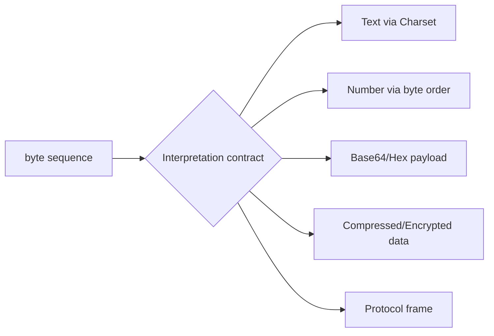
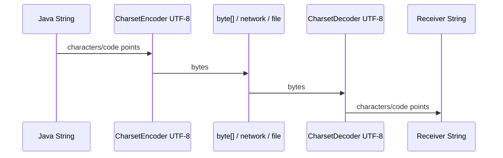
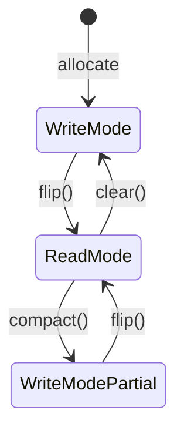

------
title: Learn Java Core Types, Data Model & Data APIs - Part 010
description: Deep engineering treatment of Java bytes, binary data, charset encoding/decoding, ByteBuffer, heap vs direct buffers, endianness, Base64, hex, and production I/O failure modes.
series: learn-java-core-types
seriesTitle: Learn Java Core Types, Data Model & Data APIs
order: 10
partTitle: Bytes, Binary Data, and Buffering
tags:
- java
- byte
- binary
- charset
- utf-8
- bytebuffer
- nio
- base64
- hex
- encoding
- advanced
date: 2026-06-27
---

# Part 010 — Bytes, Binary Data, and Buffering

Text is not bytes.

This sounds obvious, but many production bugs come from code that acts as if it were not true.

```java
byte[] bytes = input.getBytes();
String again = new String(bytes);
```

This code depends on the platform default charset. It might work on your machine and corrupt data elsewhere.

Or:

```java
ByteBuffer buffer = ByteBuffer.allocate(8);
buffer.putLong(42L);
socket.write(buffer); // bug: position is at end unless flipped
```

Or:

```java
int b = bytes[i]; // sign extension surprise when treating byte as unsigned
```

This part explains how Java models binary data:

- `byte` and `byte[]`;
- signed byte vs unsigned byte interpretation;
- text encoding and decoding;
- charset correctness;
- `ByteBuffer` position/limit/capacity;
- heap vs direct buffer;
- endianness;
- Base64 and hex;
- binary protocol failure modes.

---

## 1. Kaufman Deconstruction

Skill besar pada part ini:

> Mampu mendesain dan membaca boundary binary/text Java secara eksplisit tanpa encoding bugs, buffer state bugs, atau signed-byte surprises.

Sub-skill:

| Sub-skill | Yang perlu dikuasai |
|---|---|
| Byte model | `byte` signed 8-bit, but often interpreted as unsigned octet |
| Binary container | `byte[]`, `ByteBuffer`, streams, channels |
| Encoding | `String` <-> `byte[]` via `Charset` |
| Charset safety | avoid default charset, use `StandardCharsets` |
| Buffer state | capacity, position, limit, mark, flip, clear, compact |
| Endianness | byte order for multi-byte numeric values |
| Base64/hex | binary-to-text representation |
| Protocol thinking | framing, partial reads, length prefix, validation |

Target 20 jam:

| Jam | Fokus latihan |
|---:|---|
| 1-2 | signed byte experiments and unsigned conversion |
| 3-5 | encode/decode UTF-8, UTF-16, ISO-8859-1 examples |
| 6-8 | `CharsetEncoder`/`CharsetDecoder` error handling |
| 9-11 | `ByteBuffer` position/limit/flip/compact drills |
| 12-14 | endianness and binary integer serialization |
| 15-17 | Base64/hex encode/decode utilities |
| 18-20 | build a small binary framed message parser |

---

## 2. Mental Model: Bytes Are Raw, Meaning Comes From Interpretation

A byte sequence has no inherent meaning.

```text
48 65 6C 6C 6F
```

Possible interpretations:

- ASCII/UTF-8 text: `Hello`
- hex-encoded bytes;
- part of compressed data;
- part of encrypted data;
- binary protocol frame;
- image data;
- integer fields;
- serialized object payload.

Meaning comes from a contract:



When the contract is implicit, bugs appear.

---

## 3. Java `byte`: Signed Storage, Unsigned Use Cases

Java `byte` is signed and ranges from `-128` to `127`.

But many binary protocols define bytes as unsigned octets from `0` to `255`.

```java
byte b = (byte) 0xFF;
System.out.println(b); // -1
```

To interpret as unsigned:

```java
int unsigned = Byte.toUnsignedInt(b);
System.out.println(unsigned); // 255
```

Or:

```java
int unsigned = b & 0xFF;
```

Prefer named API for clarity:

```java
int value = Byte.toUnsignedInt(buffer[index]);
```

### 3.1 Sign Extension Pitfall

```java
byte b = (byte) 0xFE;
int x = b;
System.out.println(x); // -2
```

Widening from `byte` to `int` preserves signed value.

If you need unsigned octet:

```java
int x = b & 0xFF;
System.out.println(x); // 254
```

### 3.2 Byte Literals and Casting

```java
byte a = 127;       // ok, constant fits
byte b = (byte)128; // -128 after narrowing
byte c = (byte)255; // -1 after narrowing
```

Rule:

> `byte` is a signed Java primitive. Treating it as unsigned is an interpretation step, not its native type behavior.

---

## 4. `byte[]`: The Basic Binary Container

`byte[]` is the simplest binary data container.

```java
byte[] payload = new byte[] { 0x48, 0x65, 0x6C, 0x6C, 0x6F };
```

It is mutable.

```java
record DocumentHash(byte[] bytes) { }
```

This record is dangerous because callers can mutate the array after construction.

```java
byte[] raw = {1, 2, 3};
DocumentHash h = new DocumentHash(raw);
raw[0] = 99; // mutates h.bytes() content
```

Defensive copy:

```java
import java.util.Arrays;

public final class DocumentHash {
    private final byte[] bytes;

    public DocumentHash(byte[] bytes) {
        this.bytes = Arrays.copyOf(bytes, bytes.length);
    }

    public byte[] bytes() {
        return Arrays.copyOf(bytes, bytes.length);
    }
}
```

For records:

```java
public record BinaryPayload(byte[] bytes) {
    public BinaryPayload {
        bytes = bytes.clone();
    }

    @Override
    public byte[] bytes() {
        return bytes.clone();
    }
}
```

But remember: generated record `equals` for arrays uses reference equality, not content equality. For binary value objects, class may be better than record unless you override `equals`, `hashCode`, and `toString` carefully.

---

## 5. Text Encoding: `String` to `byte[]`

A `String` is text. A `byte[]` is bytes. Encoding converts text to bytes.

```java
byte[] bytes = text.getBytes(StandardCharsets.UTF_8);
```

Decoding converts bytes to text.

```java
String text = new String(bytes, StandardCharsets.UTF_8);
```

Avoid:

```java
text.getBytes();
new String(bytes);
```

Because these use the default charset.

### 5.1 StandardCharsets

Use `StandardCharsets`:

```java
import java.nio.charset.StandardCharsets;

byte[] utf8 = text.getBytes(StandardCharsets.UTF_8);
String decoded = new String(utf8, StandardCharsets.UTF_8);
```

Common standard charsets:

| Charset | Use case |
|---|---|
| `UTF_8` | default modern text interchange |
| `UTF_16` | Java/Unicode interop when explicitly required |
| `US_ASCII` | strict ASCII protocols |
| `ISO_8859_1` | legacy single-byte Latin-1 systems |

Rule:

> For new protocols and storage, prefer UTF-8 unless a contract says otherwise.

---

## 6. Encoding Is Not Always Lossless

Some characters cannot be represented in some charsets.

```java
String text = "Ayu 😊";
byte[] ascii = text.getBytes(StandardCharsets.US_ASCII);
String decoded = new String(ascii, StandardCharsets.US_ASCII);
System.out.println(decoded); // likely Ayu ?
```

Default encoding methods may replace unmappable characters.

If you need strict failure, use `CharsetEncoder`.

```java
import java.nio.ByteBuffer;
import java.nio.CharBuffer;
import java.nio.charset.*;

CharsetEncoder encoder = StandardCharsets.US_ASCII
    .newEncoder()
    .onMalformedInput(CodingErrorAction.REPORT)
    .onUnmappableCharacter(CodingErrorAction.REPORT);

try {
    ByteBuffer encoded = encoder.encode(CharBuffer.wrap("Ayu 😊"));
} catch (CharacterCodingException ex) {
    // input cannot be represented as US-ASCII
}
```

Rule:

| Boundary | Error strategy |
|---|---|
| user-facing import | report invalid encoding clearly |
| logs/debug output | replacement may be acceptable |
| legal/audit records | strict preservation and explicit errors |
| security tokens | bytes, not text; no charset conversion unless specified |
| protocol payload | strict contract |

---

## 7. Charset Boundary Diagram



The sender and receiver must agree on charset.

If sender uses UTF-8 and receiver assumes ISO-8859-1, text may corrupt.

This corruption is often called mojibake.

---

## 8. `ByteBuffer`: State Machine, Not Just a Byte Array

`ByteBuffer` is central in Java NIO.

It has:

- capacity;
- position;
- limit;
- mark;
- byte order;
- backing storage, optionally.

```java
ByteBuffer buffer = ByteBuffer.allocate(8);
```

Initial state:

```text
capacity = 8
position = 0
limit = 8
```

After writing a long:

```java
buffer.putLong(42L);
```

State:

```text
position = 8
limit = 8
```

To read what you wrote, call `flip()`:

```java
buffer.flip();
long value = buffer.getLong();
```

`flip()` prepares for reading:

```text
limit = old position
position = 0
```

### 8.1 Buffer State Diagram



### 8.2 `clear` Does Not Erase Data

```java
buffer.clear();
```

This resets position/limit for writing. It does not zero the memory.

If buffer contains secrets, `clear()` is not secure erasure.

### 8.3 `compact` Preserves Unread Bytes

`compact()` is useful after partial reads:

1. unread bytes move to beginning;
2. position set after moved bytes;
3. limit set to capacity;
4. ready for more writing.

Typical socket pattern:

```java
ByteBuffer buffer = ByteBuffer.allocate(8192);

int read = channel.read(buffer);
buffer.flip();

while (canReadFrame(buffer)) {
    Frame frame = readFrame(buffer);
    process(frame);
}

buffer.compact(); // preserve incomplete frame
```

---

## 9. Relative vs Absolute Buffer Operations

Relative operations use and update position:

```java
buffer.put((byte) 1);
byte b = buffer.get();
```

Absolute operations use index and do not update position:

```java
buffer.put(0, (byte) 1);
byte b = buffer.get(0);
```

Rule:

| Operation style | Use when |
|---|---|
| relative | sequential protocol read/write |
| absolute | inspect/update known offset |
| duplicate/slice | pass sub-view without copying |

Be careful: slices and duplicates can share content.

---

## 10. Heap vs Direct ByteBuffer

```java
ByteBuffer heap = ByteBuffer.allocate(1024);
ByteBuffer direct = ByteBuffer.allocateDirect(1024);
```

Heap buffer:

- backed by Java heap array;
- easier for GC visibility;
- often has accessible array;
- good general default.

Direct buffer:

- memory outside normal Java heap;
- useful for native I/O interactions;
- allocation/deallocation more expensive;
- can reduce copying in some I/O scenarios;
- not always faster by default.

Decision:

| Need | Prefer |
|---|---|
| ordinary small data processing | heap `byte[]` or heap `ByteBuffer` |
| NIO channel high-throughput I/O | consider direct buffer |
| simple encode/decode | `byte[]` often enough |
| native interop | direct buffer may help |
| many short-lived buffers | avoid direct allocation churn |

Rule:

> Do not use direct buffers as a cargo-cult performance optimization. Measure and understand allocation lifetime.

---

## 11. Endianness: Byte Order for Multi-Byte Values

A single byte has no endianness. Multi-byte values do.

Example integer `0x01020304`:

Big-endian:

```text
01 02 03 04
```

Little-endian:

```text
04 03 02 01
```

Java `ByteBuffer` defaults to big-endian.

```java
ByteBuffer buffer = ByteBuffer.allocate(4);
buffer.putInt(0x01020304);
```

Explicit little-endian:

```java
ByteBuffer buffer = ByteBuffer.allocate(4)
    .order(ByteOrder.LITTLE_ENDIAN);
buffer.putInt(0x01020304);
```

Always specify byte order in binary protocols.

```java
record FrameHeader(int version, int length) {
    static FrameHeader read(ByteBuffer buffer) {
        buffer.order(ByteOrder.BIG_ENDIAN);
        int version = Byte.toUnsignedInt(buffer.get());
        int length = buffer.getInt();
        return new FrameHeader(version, length);
    }
}
```

Better: set order once at buffer creation/boundary and document protocol order.

---

## 12. Base64: Binary as Text

Base64 encodes binary data into text-safe representation.

Use cases:

- JSON payload containing bytes;
- email/MIME;
- tokens;
- HTTP basic credentials format;
- embedding binary in text protocols.

Java API:

```java
String encoded = Base64.getEncoder().encodeToString(bytes);
byte[] decoded = Base64.getDecoder().decode(encoded);
```

URL-safe variant:

```java
String token = Base64.getUrlEncoder().withoutPadding().encodeToString(bytes);
byte[] raw = Base64.getUrlDecoder().decode(token);
```

Important:

- Base64 is encoding, not encryption.
- It increases size by roughly 33%.
- Padding policy must match receiver expectations.
- URL-safe Base64 differs from basic Base64.

### 12.1 Base64 Is Not a Charset

Do not do this conceptually:

```java
String s = new String(binaryBytes, StandardCharsets.UTF_8); // wrong for arbitrary binary
```

Do this:

```java
String s = Base64.getEncoder().encodeToString(binaryBytes);
```

Base64 converts arbitrary bytes to ASCII-ish text safely.

---

## 13. Hex Encoding

Hex is often used for diagnostics, hashes, signatures, binary IDs.

Java 17 introduced `HexFormat`.

```java
import java.util.HexFormat;

String hex = HexFormat.of().formatHex(bytes);
byte[] parsed = HexFormat.of().parseHex(hex);
```

Uppercase:

```java
String hex = HexFormat.of().withUpperCase().formatHex(bytes);
```

With delimiter:

```java
String hex = HexFormat.ofDelimiter(":").formatHex(bytes);
```

Hex trade-off:

| Encoding | Pros | Cons |
|---|---|---|
| Hex | readable, stable, easy debug | 2x size |
| Base64 | compact text encoding | less readable, padding variants |

For hashes in logs, hex is often friendlier.

---

## 14. Binary Protocol Framing

Network/file reads may be partial.

Never assume one read equals one message.

Bad mental model:

```text
read() -> whole message
```

Correct mental model:

```text
read() -> some bytes
parser -> zero or more complete frames + maybe incomplete remainder
```

Length-prefixed frame example:

```text
[4-byte length][payload bytes]
```

Parser sketch:

```java
static boolean canReadFrame(ByteBuffer buffer) {
    if (buffer.remaining() < Integer.BYTES) {
        return false;
    }

    buffer.mark();
    int length = buffer.getInt();
    buffer.reset();

    if (length < 0 || length > 1_000_000) {
        throw new IllegalArgumentException("Invalid frame length: " + length);
    }

    return buffer.remaining() >= Integer.BYTES + length;
}

static byte[] readFrame(ByteBuffer buffer) {
    int length = buffer.getInt();
    byte[] payload = new byte[length];
    buffer.get(payload);
    return payload;
}
```

Production concerns:

- maximum frame size;
- negative length;
- integer overflow in length calculations;
- partial reads;
- buffer compaction;
- timeout;
- backpressure;
- malformed payload metrics;
- audit/logging without dumping secrets.

---

## 15. Byte Array Equality and Hashing

Arrays do not use content equality.

```java
byte[] a = {1, 2, 3};
byte[] b = {1, 2, 3};

System.out.println(a.equals(b)); // false
```

Use:

```java
Arrays.equals(a, b);
Arrays.hashCode(a);
```

For nested arrays:

```java
Arrays.deepEquals(...);
Arrays.deepHashCode(...);
```

For cryptographic comparisons, use appropriate constant-time comparison APIs where relevant.

Do not log secrets or raw tokens.

---

## 16. Binary Value Object Example

```java
import java.util.Arrays;
import java.util.HexFormat;
import java.util.Objects;

public final class Sha256Hash {
    private static final int LENGTH = 32;
    private static final HexFormat HEX = HexFormat.of();

    private final byte[] bytes;

    public Sha256Hash(byte[] bytes) {
        Objects.requireNonNull(bytes, "bytes");
        if (bytes.length != LENGTH) {
            throw new IllegalArgumentException("SHA-256 hash must be 32 bytes");
        }
        this.bytes = bytes.clone();
    }

    public static Sha256Hash fromHex(String hex) {
        Objects.requireNonNull(hex, "hex");
        return new Sha256Hash(HEX.parseHex(hex));
    }

    public byte[] bytes() {
        return bytes.clone();
    }

    public String toHex() {
        return HEX.formatHex(bytes);
    }

    @Override
    public boolean equals(Object o) {
        return this == o || (o instanceof Sha256Hash other && Arrays.equals(bytes, other.bytes));
    }

    @Override
    public int hashCode() {
        return Arrays.hashCode(bytes);
    }

    @Override
    public String toString() {
        return toHex();
    }
}
```

Why class, not record?

Because record-generated equality for `byte[]` would compare array references. For binary value semantics, explicit implementation is clearer.

---

## 17. Text vs Binary Decision Framework

```mermaid
flowchart TD
    A[Data payload] --> B{Human-readable text?}
    B -- yes --> C{External boundary?}
    C -- yes --> D[Specify charset explicitly]
    C -- no --> E[String APIs]
    B -- no --> F{Needs text transport?}
    F -- yes --> G[Base64 or Hex]
    F -- no --> H[byte[] / ByteBuffer]
    H --> I{Multi-byte numeric fields?}
    I -- yes --> J[Specify ByteOrder]
    I -- no --> K[Raw binary operations]
```

Rules:

1. Text crossing byte boundary needs a charset.
2. Arbitrary binary must not be forced into `String`.
3. Binary-as-text needs Base64 or hex.
4. Multi-byte binary numbers need byte order.
5. Buffer state must be managed explicitly.
6. Mutable byte arrays need defensive copies.

---

## 18. I/O Streams and Bytes

Classic byte streams:

```java
InputStream in;
OutputStream out;
```

Read loop:

```java
byte[] buffer = new byte[8192];
int n;
while ((n = in.read(buffer)) != -1) {
    out.write(buffer, 0, n);
}
```

Do not ignore `n`.

Wrong:

```java
out.write(buffer); // writes entire buffer, including stale bytes
```

Correct:

```java
out.write(buffer, 0, n);
```

For text:

```java
try (Reader reader = new InputStreamReader(in, StandardCharsets.UTF_8)) {
    // character stream
}
```

Boundary distinction:

| API | Data level |
|---|---|
| `InputStream` / `OutputStream` | bytes |
| `Reader` / `Writer` | characters/text |
| `InputStreamReader` | byte -> char bridge via charset |
| `OutputStreamWriter` | char -> byte bridge via charset |

---

## 19. File Reading/Writing: Explicit Charset

Text file:

```java
String content = Files.readString(path, StandardCharsets.UTF_8);
Files.writeString(path, content, StandardCharsets.UTF_8);
```

Binary file:

```java
byte[] bytes = Files.readAllBytes(path);
Files.write(path, bytes);
```

Do not read binary data as string just to pass it around.

Bad:

```java
String image = Files.readString(imagePath); // wrong for binary
```

Good:

```java
byte[] image = Files.readAllBytes(imagePath);
```

If binary must go to JSON:

```java
String base64 = Base64.getEncoder().encodeToString(image);
```

---

## 20. Memory and Allocation Concerns

Binary-heavy code often stresses memory.

Common issues:

- copying large `byte[]` repeatedly;
- converting bytes to Base64 strings unnecessarily;
- keeping full file in memory;
- direct buffer allocation churn;
- unbounded frame length;
- logging giant payloads;
- retaining buffer slices longer than expected.

Engineering mitigations:

| Issue | Mitigation |
|---|---|
| large payload | stream instead of load-all |
| repeated concat | use buffers/streams |
| unbounded input | enforce max size |
| debug logs huge | log length/hash/sample, not full payload |
| mutable ownership | copy at boundary or document ownership |
| direct buffer churn | pool carefully or allocate long-lived buffers |

---

## 21. Binary Data in APIs

Do not expose raw `byte[]` casually.

Bad:

```java
class Attachment {
    byte[] content;
}
```

Better:

```java
final class AttachmentContent {
    private final byte[] bytes;

    AttachmentContent(byte[] bytes) {
        this.bytes = bytes.clone();
    }

    int size() {
        return bytes.length;
    }

    InputStream openStream() {
        return new ByteArrayInputStream(bytes);
    }

    byte[] copyBytes() {
        return bytes.clone();
    }
}
```

For very large content, avoid storing in memory:

```java
interface BlobRef {
    long size();
    InputStream openStream() throws IOException;
}
```

Data representation decision depends on size and ownership.

---

## 22. Common Failure Modes

| Failure | Cause | Prevention |
|---|---|---|
| mojibake | mismatched/default charset | explicit `StandardCharsets.UTF_8` |
| data loss on encode | unmappable characters replaced | strict `CharsetEncoder` with `REPORT` |
| signed byte bug | treating `byte` as 0..255 | `Byte.toUnsignedInt` |
| buffer writes nothing | forgot `flip()` before read/write | manage buffer state |
| stale bytes written | ignored read count | write `0..n` only |
| wrong integer value | endianness mismatch | explicit `ByteOrder` |
| binary corrupted as text | arbitrary bytes converted to `String` | Base64/hex or keep bytes |
| mutable binary value | exposed `byte[]` | defensive copy |
| array equality bug | `byte[].equals` reference equality | `Arrays.equals` |
| memory pressure | load huge payloads | streaming, max size |
| partial read bug | assumes one read = one message | frame parser |

---

## 23. Practice Drill: Framed UTF-8 Message Parser

Build a parser for this protocol:

```text
[4-byte big-endian length][UTF-8 JSON-like text payload]
```

Rules:

- length is signed Java `int` but valid range is `0..1_000_000`;
- parser receives arbitrary chunks;
- one chunk may contain half a frame;
- one chunk may contain multiple frames;
- payload must decode as valid UTF-8;
- malformed length fails fast;
- malformed UTF-8 fails clearly;
- parser preserves incomplete bytes for next read.

Suggested public API:

```java
final class FramedUtf8Parser {
    List<String> feed(byte[] chunk);
}
```

Test cases:

- one complete frame;
- two frames in one chunk;
- frame split across chunks;
- negative length;
- length above max;
- incomplete length prefix;
- invalid UTF-8;
- zero-length payload.

---

## 24. Review Checklist

Before approving Java binary/text boundary code, ask:

- Is this text or binary?
- Where is the charset specified?
- Are default charset APIs avoided?
- Are arbitrary bytes ever converted to `String`?
- If binary is transported as text, is Base64/hex used intentionally?
- Are `byte` values interpreted as signed or unsigned intentionally?
- Are mutable `byte[]` values defensively copied?
- Does equality use content equality?
- Is byte order specified for multi-byte numeric fields?
- Does `ByteBuffer` code handle `flip`, `clear`, and `compact` correctly?
- Are partial reads handled?
- Are frame sizes bounded?
- Is strict decoding required?
- Are secrets/tokens excluded from logs?
- Are large payloads streamed instead of fully loaded?

---

## 25. Summary

Binary data in Java is simple only when the boundary contract is explicit.

Key takeaways:

- `byte` is signed; unsigned interpretation requires conversion.
- `byte[]` is mutable; defensive copy is often required.
- `String` to bytes requires a `Charset`.
- Avoid default charset APIs at production boundaries.
- Use `CharsetEncoder`/`CharsetDecoder` for strict error handling.
- `ByteBuffer` is a state machine with position, limit, capacity, and byte order.
- Always `flip()` before reading data you wrote into a buffer.
- Specify endianness for binary protocols.
- Use Base64 or hex for binary-as-text.
- Do not assume one I/O read equals one full message.
- Treat binary value objects carefully because arrays use reference equality.

Next part: `Object`, `Class`, runtime type, identity-sensitive operations, and how Java's root object model affects debugging, frameworks, and domain modeling.
