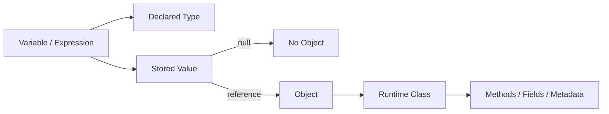
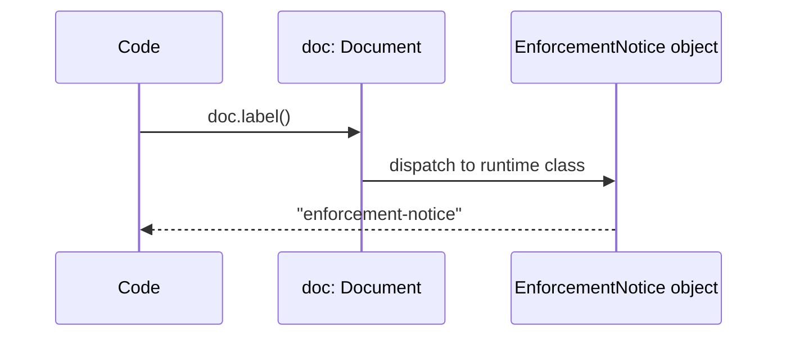
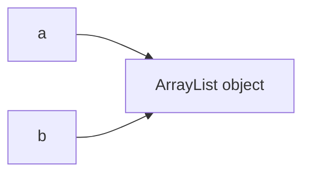
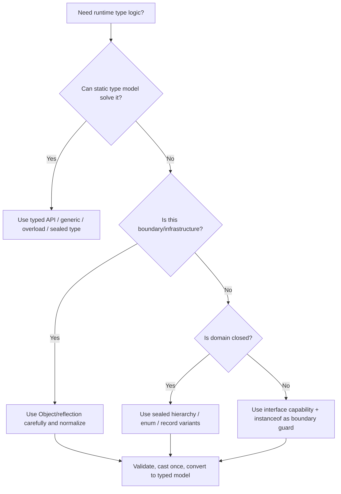

------
title: Learn Java Core Types, Data Model & Data APIs - Part 011
description: Deep engineering treatment of Java Object, Class, runtime type, identity, Object methods, casting, reflection boundaries, arrays as objects, and production failure modes around runtime type reasoning.
series: learn-java-core-types
seriesTitle: Learn Java Core Types, Data Model & Data APIs
order: 11
partTitle: Object, Class, and Runtime Type
tags:
- java
- object
- class
- runtime-type
- identity
- reflection
- casting
- inheritance
- advanced
date: 2026-06-27
---

# Part 011 — Object, Class, and Runtime Type

Di Java, banyak bug besar tidak muncul karena developer tidak tahu syntax. Bug muncul karena developer mencampuradukkan beberapa hal yang tampak mirip:

- declared type;
- runtime class;
- object identity;
- logical equality;
- reference value;
- cast;
- reflection;
- proxy/framework-generated object;
- array object;
- `Object` sebagai root hierarchy.

Contoh sederhana:

```java
Object value = "REG-2026-0001";

if (value instanceof String s) {
    System.out.println(s.length());
}
```

Kode ini terlihat trivial. Tetapi ia mengandung banyak konsep:

1. variable `value` punya declared type `Object`;
2. nilai di dalam variable adalah reference value;
3. reference itu menunjuk ke object runtime class `java.lang.String`;
4. `instanceof` mengecek kompatibilitas runtime;
5. pattern variable `s` punya type lebih spesifik;
6. method dispatch berjalan berdasarkan runtime object.

Part ini membangun mental model yang presisi tentang object dan runtime type. Ini akan dipakai kembali pada:

- equality dan hash-based collections;
- generics dan type erasure;
- casting dan pattern matching;
- records/enums/sealed types;
- serialization/deserialization;
- ORM dan proxy;
- framework reflection;
- debugging production object graphs.

---

## 1. Kaufman Deconstruction

Skill besar pada part ini:

> Mampu membaca dan mendesain kode Java dengan memisahkan declared type, runtime type, reference value, object identity, dan behavior polymorphic secara akurat.

Sub-skill yang harus dikuasai:

| Sub-skill | Yang harus dipahami |
|---|---|
| `Object` root hierarchy | semua class biasa secara langsung/tidak langsung adalah subtype `Object` |
| Reference value | nilai variable reference adalah reference atau `null`, bukan object itu sendiri |
| Runtime class | object punya class aktual saat runtime |
| Declared type | compiler melihat variable/expression melalui type statis |
| Method dispatch | instance method dipilih secara dinamis berdasarkan runtime object |
| Field access | field tidak polymorphic seperti method |
| `getClass()` | mengambil runtime `Class<?>` object |
| `Class<T>` | representasi runtime untuk class/interface/array/primitive/void |
| `instanceof` | mengecek kompatibilitas runtime secara aman |
| Cast | memberi instruksi runtime check, bukan mengubah object |
| Identity | dua reference bisa menunjuk object yang sama |
| `Object` methods | `equals`, `hashCode`, `toString`, `getClass`, `wait`, `notify`, `clone`, legacy `finalize` |
| Array as object | array adalah object dengan runtime class khusus |
| Reflection boundary | kemampuan introspeksi dan pemanggilan dinamis dengan cost/risk |

Practice goal:

> Setelah part ini, setiap kali melihat `Object`, cast, `instanceof`, `getClass`, atau framework proxy, Anda bisa menjelaskan apa yang terjadi tanpa menebak.

---

## 2. Core Mental Model

Model dasar:



Contoh:

```java
CharSequence text = "case-001";
```

Yang terjadi:

| Konsep | Nilai |
|---|---|
| Variable name | `text` |
| Declared type | `CharSequence` |
| Stored value | reference value |
| Referenced object | String object |
| Runtime class | `java.lang.String` |
| Method yang bisa dipanggil langsung | method yang terlihat melalui `CharSequence` |
| Method yang dipanggil saat dispatch | override pada runtime class |

`text` bukan object. `text` adalah variable. Isi variable adalah reference value. Reference itu menunjuk ke object `String`.

Inilah sumber banyak kebingungan:

```java
Object x = "abc";

// Compile error: Object tidak punya method length()
// int n = x.length();

// Runtime object-nya String, tetapi compiler hanya melihat Object.
```

Compiler tidak membaca pikiran kita. Compiler memakai declared type dan flow-sensitive type information yang tersedia.

---

## 3. `Object` sebagai Root Hierarchy

`java.lang.Object` adalah root dari class hierarchy Java. Hampir semua class yang Anda tulis mewarisi `Object`, secara eksplisit atau implisit.

```java
class CaseFile {
}
```

Secara konseptual mirip:

```java
class CaseFile extends Object {
}
```

Tetapi Anda tidak menulis `extends Object` karena compiler menyediakannya secara implisit.

Contoh:

```java
CaseFile c = new CaseFile();
Object o = c;
```

Assignment ini valid karena `CaseFile` adalah subtype dari `Object`.

Namun kebalikannya tidak otomatis valid:

```java
Object o = new CaseFile();

// Compile error tanpa cast
// CaseFile c = o;

CaseFile c = (CaseFile) o;
```

Cast diperlukan karena tidak semua `Object` adalah `CaseFile`.

---

## 4. Declared Type vs Runtime Type

Declared type adalah type yang diketahui compiler untuk variable/expression.

Runtime type adalah class aktual dari object yang direferensikan saat program berjalan.

```java
Object a = "hello";
CharSequence b = "hello";
String c = "hello";
```

Ketiganya dapat menunjuk ke object runtime class yang sama-sama `String`, tetapi kemampuan compile-time berbeda.

```java
Object a = "hello";
CharSequence b = "hello";
String c = "hello";

// a.length();      // compile error
int n1 = b.length();
int n2 = c.length();
String upper = c.toUpperCase();
```

`CharSequence` punya `length()`, sehingga `b.length()` valid. `Object` tidak punya `length()`, sehingga `a.length()` invalid, walaupun object aktualnya `String`.

### Rule

> Declared type menentukan apa yang boleh Anda tulis. Runtime type menentukan implementasi method instance mana yang dijalankan.

---

## 5. Runtime Method Dispatch

Java instance method bersifat virtual by default, kecuali method `static`, `private`, `final`, constructor, dan beberapa kasus khusus.

```java
class Document {
    String label() {
        return "document";
    }
}

class EnforcementNotice extends Document {
    @Override
    String label() {
        return "enforcement-notice";
    }
}

Document doc = new EnforcementNotice();
System.out.println(doc.label()); // enforcement-notice
```

Declared type `doc` adalah `Document`, tetapi runtime object adalah `EnforcementNotice`. Method `label()` yang berjalan adalah override di `EnforcementNotice`.



### Field Tidak Berperilaku Sama

Field access tidak polymorphic seperti method.

```java
class Parent {
    String name = "parent";
}

class Child extends Parent {
    String name = "child";
}

Parent p = new Child();
System.out.println(p.name); // parent
```

Field dipilih berdasarkan declared type, bukan runtime dispatch.

Karena itu, field hiding hampir selalu membuat kode membingungkan. Untuk data model serius, hindari deklarasi field dengan nama sama di superclass dan subclass.

---

## 6. Reference Identity

Dua variable dapat menyimpan reference ke object yang sama.

```java
List<String> a = new ArrayList<>();
List<String> b = a;

b.add("case-1");

System.out.println(a.size()); // 1
```

`a` dan `b` adalah variable berbeda, tetapi keduanya menyimpan reference ke object `ArrayList` yang sama.



Inilah aliasing.

Aliasing tidak salah. Tetapi aliasing harus disengaja. Jika tidak, mutasi dari satu jalur kode dapat mengejutkan jalur kode lain.

Contoh failure:

```java
final class CaseSummary {
    private final List<String> violations;

    CaseSummary(List<String> violations) {
        this.violations = violations; // leak ownership
    }

    List<String> violations() {
        return violations; // leak mutability
    }
}
```

Client bisa mengubah state internal:

```java
List<String> input = new ArrayList<>();
input.add("late-reporting");

CaseSummary summary = new CaseSummary(input);
input.clear(); // state summary berubah tanpa melalui summary
```

Part tentang mutability akan membahas defensive copying lebih jauh, tetapi model identity-nya dimulai di sini.

---

## 7. `==` pada Reference

Untuk reference type, operator `==` mengecek apakah dua reference menunjuk object yang sama, bukan apakah isi object sama.

```java
String a = new String("case");
String b = new String("case");

System.out.println(a == b);      // false
System.out.println(a.equals(b)); // true
```

`a` dan `b` menunjuk object berbeda. Isi text-nya sama, tetapi identity-nya beda.

Untuk enum, `==` aman dan idiomatis karena enum constants adalah singleton per enum constant dalam class loader yang sama:

```java
enum Status { OPEN, CLOSED }

Status s = Status.OPEN;
if (s == Status.OPEN) {
    // idiomatic
}
```

Untuk object domain biasa, gunakan `equals` jika maksudnya logical equality. Part berikutnya membahas kontraknya secara detail.

---

## 8. `getClass()` dan `Class<?>`

Setiap object punya runtime class. Anda bisa mengakses representasi runtime itu melalui `getClass()`.

```java
Object value = "abc";
Class<?> type = value.getClass();

System.out.println(type.getName()); // java.lang.String
```

`Class<?>` adalah object yang merepresentasikan type runtime. Ia bukan class source code. Ia adalah metadata runtime.

Contoh class literals:

```java
Class<String> stringType = String.class;
Class<Integer> intBoxType = Integer.class;
Class<int[]> intArrayType = int[].class;
Class<int> primitiveIntType = int.class;
Class<Void> voidType = void.class;
```

Primitive type juga punya `Class` object:

```java
System.out.println(int.class.isPrimitive());     // true
System.out.println(Integer.class.isPrimitive()); // false
```

### `getClass()` Tidak Bisa Dipanggil pada `null`

```java
Object value = null;

// NullPointerException
// value.getClass();
```

Jika reference `null`, tidak ada object dan tidak ada runtime class object yang bisa diambil dari reference itu.

---

## 9. `instanceof`: Safe Runtime Type Check

`instanceof` mengecek apakah object runtime kompatibel dengan type tertentu.

```java
Object value = "case-001";

if (value instanceof String s) {
    System.out.println(s.length());
}
```

Dengan pattern matching, variable `s` hanya tersedia di branch tempat check berhasil.

Tanpa pattern matching:

```java
if (value instanceof String) {
    String s = (String) value;
    System.out.println(s.length());
}
```

Dengan pattern matching, cast manual dihilangkan.

### `instanceof` dan `null`

```java
Object value = null;

System.out.println(value instanceof String); // false
```

`null instanceof SomeType` selalu `false`.

Ini membuat pattern seperti berikut aman:

```java
if (value instanceof String s && !s.isBlank()) {
    process(s);
}
```

Jika `value` null, branch tidak masuk.

---

## 10. Cast Tidak Mengubah Object

Cast sering disalahpahami sebagai operasi yang “mengubah object menjadi type lain”. Itu salah.

Cast pada reference type hanya memberi tahu compiler dan runtime:

> Periksa apakah reference ini kompatibel dengan target type. Jika ya, izinkan saya memperlakukannya sebagai target type. Jika tidak, lempar `ClassCastException`.

Contoh valid:

```java
Object value = "abc";
String s = (String) value;
```

Object runtime memang `String`.

Contoh invalid:

```java
Object value = 123;
String s = (String) value; // ClassCastException
```

`Integer` tidak berubah menjadi `String` hanya karena dicast.

Jika perlu conversion, gunakan conversion API:

```java
Object value = 123;
String s = String.valueOf(value);
```

Cast adalah runtime type assertion. Conversion adalah pembuatan nilai baru atau representasi baru.

---

## 11. `Object` Methods: Peta Besar

`Object` menyediakan method dasar yang diwarisi semua object biasa.

| Method | Kegunaan utama | Catatan engineering |
|---|---|---|
| `getClass()` | runtime class metadata | final, tidak bisa dioverride |
| `equals(Object)` | logical equality hook | default-nya identity equality |
| `hashCode()` | hash bucket contract | harus konsisten dengan `equals` |
| `toString()` | representasi text/debug | jangan bocorkan secret |
| `wait()` | intrinsic monitor wait | low-level concurrency primitive |
| `notify()` | wake one waiter | jarang dipakai langsung di kode modern |
| `notifyAll()` | wake all waiters | lebih aman dari `notify` pada banyak kondisi |
| `clone()` | legacy shallow copying hook | desain modern biasanya menghindari `Cloneable` |
| `finalize()` | legacy finalization | jangan gunakan; gunakan cleaner/try-with-resources sesuai konteks |

Part ini fokus pada `getClass`, runtime type, identity, dan lifecycle mental model. `equals`, `hashCode`, `toString` akan dibahas lebih dalam pada Part 012 dan beberapa part lanjutan.

---

## 12. Default `toString()` dan Identity String

Default `Object.toString()` secara konseptual menghasilkan:

```java
getClass().getName() + "@" + Integer.toHexString(hashCode())
```

Contoh output:

```text
com.example.CaseFile@6d06d69c
```

Ini bukan alamat memory yang stabil. Jangan membuat logic berdasarkan output ini.

Untuk debugging, `toString()` baik bila:

1. ringkas;
2. tidak menyebabkan lazy loading berbahaya;
3. tidak memanggil service/DB;
4. tidak membocorkan secret/token/PII;
5. tidak membuat recursion tak terbatas pada object graph dua arah.

Contoh `toString` buruk:

```java
@Override
public String toString() {
    return "User{" +
            "email='" + email + '\'' +
            ", passwordHash='" + passwordHash + '\'' +
            ", resetToken='" + resetToken + '\'' +
            '}';
}
```

Contoh lebih aman:

```java
@Override
public String toString() {
    return "User{id=" + id + ", email=" + mask(email) + "}";
}
```

`toString()` adalah API observability. Perlakukan ia sebagai boundary keamanan.

---

## 13. `hashCode()` Bukan Identity Selalu

Default `Object.hashCode()` sering tampak seperti identity hash, tetapi kontrak Java hanya menjamin hal-hal tertentu. Subclass bebas override.

```java
String a = new String("abc");
String b = new String("abc");

System.out.println(a.hashCode() == b.hashCode()); // true, karena String override
```

Jika Anda butuh identity-based hash, Java menyediakan:

```java
int idHash = System.identityHashCode(a);
```

Tetapi ini jarang menjadi kebutuhan domain. Biasanya, jika Anda tergoda memakai identity hash, Anda sedang membangun cache, graph traversal, object tracking, atau debugging tool.

Untuk domain model, hash harus mengikuti logical equality. Part 012 membahas ini.

---

## 14. Object Identity dan Monitor

Setiap object Java biasa dapat dipakai sebagai monitor untuk synchronization:

```java
Object lock = new Object();

synchronized (lock) {
    // critical section
}
```

Monitor berhubungan dengan object identity. Dua object yang logical-equal tetap monitor berbeda.

```java
Object a = new Object();
Object b = new Object();

synchronized (a) {
    synchronized (b) {
        // two different monitors
    }
}
```

Jangan gunakan object value-based atau object yang identity-nya tidak Anda kontrol sebagai lock.

Contoh buruk:

```java
synchronized (customerId.toString()) {
    // dangerous: string interning / accidental sharing / unclear ownership
}
```

Contoh lebih baik:

```java
private final Object lock = new Object();

void update() {
    synchronized (lock) {
        // protected state
    }
}
```

Untuk concurrency modern, sering lebih baik memakai `java.util.concurrent` primitives daripada raw monitor. Namun memahami monitor penting karena `Object.wait/notify` ada di root object model.

---

## 15. Arrays Are Objects

Array di Java adalah object.

```java
int[] numbers = {1, 2, 3};
Object o = numbers;

System.out.println(o.getClass().getName()); // [I
```

String aneh seperti `[I` adalah internal class name untuk `int[]`.

Contoh array reference type:

```java
String[] names = {"a", "b"};
Object array = names;
Object[] objectArray = names;
```

Array memiliki runtime component type. Karena array covariant, ini compile:

```java
String[] strings = new String[1];
Object[] objects = strings;
objects[0] = 123; // ArrayStoreException
```

Array covariance adalah salah satu alasan generics Java didesain invariant. Topik ini dibahas lagi pada part arrays/generics/reifiability.

Mental model:

```mermaid
flowchart TD
    S[String array object] --> C[Runtime component type: String]
    O[Object[] reference] --> S
    Put[objects[0] = Integer] --> Check[Runtime store check]
    Check -->|Integer not assignable to String| E[ArrayStoreException]
```

---

## 16. `Object` sebagai Container Type: Kapan Boleh, Kapan Berbahaya

`Object` sering dipakai sebagai “container universal”. Kadang tepat, sering berbahaya.

### Boleh Dipakai

1. Framework-level API:

```java
interface Serializer {
    byte[] serialize(Object value);
}
```

2. Logging/debugging:

```java
logger.info("Processed {}", value);
```

3. Heterogeneous map di infrastructure layer yang sangat terkontrol:

```java
Map<String, Object> attributes = new HashMap<>();
```

4. Reflection bridge:

```java
Object result = method.invoke(target, args);
```

### Berbahaya Dipakai

1. Domain field:

```java
class CaseAttribute {
    String name;
    Object value; // domain ambiguity
}
```

2. Method parameter yang seharusnya typed:

```java
void approve(Object caseId) { ... }
```

3. Return type yang memaksa caller cast:

```java
Object findCase(String id) { ... }
```

4. JSON-like blob yang menyembunyikan schema:

```java
Map<String, Object> payload;
```

Jika `Object` keluar dari infrastructure boundary dan masuk domain core, biasanya Anda kehilangan compile-time safety.

---

## 17. Reflection Boundary

Reflection memungkinkan program membaca metadata dan memanggil member secara dinamis.

```java
Class<?> type = Class.forName("com.example.CaseFile");
Object instance = type.getDeclaredConstructor().newInstance();
```

Reflection berguna untuk:

- dependency injection;
- serialization/deserialization;
- ORM mapping;
- test frameworks;
- annotation processing at runtime;
- plugin systems;
- general tooling.

Tetapi reflection membawa risiko:

| Risiko | Dampak |
|---|---|
| Compile-time safety berkurang | error berpindah ke runtime |
| Encapsulation bisa ditembus | invariant bisa rusak |
| Refactoring lebih rapuh | rename method/class bisa gagal runtime |
| Performance overhead | terutama pada path panas bila tidak dicache |
| Security boundary | akses reflective perlu dikontrol |
| Native image/AOT compatibility | metadata harus dikonfigurasi |

Contoh reflection yang fragile:

```java
Method m = type.getMethod("approve", String.class);
m.invoke(instance, "CASE-1");
```

Jika method rename, compile tetap sukses, runtime gagal.

Untuk production engineering, reflection sebaiknya ditempatkan di boundary framework/infrastructure, bukan di domain logic utama.

---

## 18. Runtime Type dan ClassLoader Identity

Class identity di Java bukan hanya nama fully-qualified class. Secara runtime, class identity juga melibatkan class loader.

Secara konseptual:

```text
runtime class identity = (binary name, defining class loader)
```

Dua class dengan nama sama tetapi dimuat oleh class loader berbeda dapat dianggap berbeda oleh JVM.

Ini penting di:

- application server lama;
- plugin system;
- OSGi/module-like environment;
- test isolation;
- hot reload/dev tools;
- agent/instrumentation;
- complex build/runtime systems.

Failure mode:

```text
com.example.Plugin cannot be cast to com.example.Plugin
```

Pesan itu tampak mustahil, tetapi bisa terjadi jika dua `com.example.Plugin` berasal dari class loader berbeda.

Untuk banyak aplikasi biasa, Anda jarang menyentuh ini. Untuk platform engineering, plugin runtime, test harness, dan framework work, ini sangat penting.

---

## 19. Framework Proxy dan Runtime Type Surprise

Framework dapat membuat subclass/proxy runtime.

Contoh konseptual:

```java
CaseService service = framework.getBean(CaseService.class);
System.out.println(service.getClass().getName());
```

Output bisa bukan:

```text
com.example.CaseService
```

Melainkan:

```text
com.example.CaseService$$SpringCGLIB$$0
```

atau dynamic proxy class.

Implikasi:

1. `getClass() == CaseService.class` bisa gagal;
2. equality berbasis `getClass()` bisa bermasalah pada entity/proxy;
3. annotation lookup perlu mempertimbangkan proxy target;
4. method visibility memengaruhi proxying;
5. final class/method bisa membatasi subclass proxy;
6. reflection terhadap runtime class bisa melihat synthetic/bridge/proxy members.

Contoh risk:

```java
if (service.getClass() == CaseService.class) {
    // mungkin tidak pernah masuk di runtime framework
}
```

Lebih baik jika maksudnya capability:

```java
if (service instanceof CaseService) {
    // compatible with proxy subtype
}
```

Untuk domain value object final, `getClass()` equality biasanya aman. Untuk ORM/proxy entity, perlu desain khusus.

---

## 20. `clone()` dan Copying

`Object.clone()` adalah mekanisme legacy untuk membuat copy. Ia memiliki banyak caveat:

- protected di `Object`;
- membutuhkan marker interface `Cloneable` untuk default behavior;
- default clone bersifat shallow;
- constructor tidak dipanggil seperti object creation normal;
- invariant bisa sulit dijaga;
- deep copy harus ditulis manual;
- desain API-nya historis dan sering dihindari.

Contoh shallow copy problem:

```java
class CaseBundle implements Cloneable {
    List<String> caseIds = new ArrayList<>();

    @Override
    protected CaseBundle clone() throws CloneNotSupportedException {
        return (CaseBundle) super.clone();
    }
}
```

`caseIds` di object hasil clone masih menunjuk list yang sama.

Desain modern lebih sering memakai:

```java
CaseBundle copy = new CaseBundle(original.caseIds());
```

atau static factory/copy constructor:

```java
final class CaseBundle {
    private final List<String> caseIds;

    CaseBundle(Collection<String> caseIds) {
        this.caseIds = List.copyOf(caseIds);
    }

    static CaseBundle copyOf(CaseBundle other) {
        return new CaseBundle(other.caseIds);
    }
}
```

---

## 21. Finalization: Legacy Lifecycle Hook yang Harus Dihindari

`finalize()` adalah mekanisme lama yang memungkinkan object menjalankan logic sebelum garbage collection. Dalam praktik modern, finalization tidak boleh menjadi fondasi resource management.

Masalah finalization:

- tidak deterministik;
- bisa tidak pernah berjalan sebelum process exit;
- memperlambat GC;
- membuka risiko resurrection object;
- membuat lifecycle sulit diprediksi;
- tidak cocok untuk file/socket/DB connection.

Gunakan pola deterministik:

```java
try (InputStream in = Files.newInputStream(path)) {
    // use resource
}
```

atau API cleanup yang memang didesain untuk use case tersebut. Untuk kebanyakan aplikasi bisnis, rule-nya sederhana:

> Jangan desain domain/resource lifecycle dengan `finalize()`.

---

## 22. `Object` dan Serialization/Deserialization Boundary

Ketika data melewati JSON, database, message broker, atau HTTP boundary, runtime type sering hilang atau berubah.

Contoh:

```json
{
  "caseId": "CASE-1",
  "amount": 1000,
  "status": "OPEN"
}
```

Saat masuk Java, framework harus memilih:

- class apa yang dibuat;
- constructor/factory mana yang dipakai;
- apakah field final bisa diisi;
- apakah missing field menjadi null/default;
- bagaimana nested object dibuat;
- bagaimana polymorphic type direkonstruksi.

Jika domain model terlalu bergantung pada runtime class tanpa explicit schema, boundary ini rapuh.

Prinsip:

1. untuk inbound data, validasi explicit;
2. untuk polymorphic data, gunakan discriminator yang jelas;
3. jangan percaya `Map<String, Object>` tanpa normalization;
4. jangan biarkan deserializer bypass invariant domain;
5. bedakan DTO boundary dan domain object.

---

## 23. Runtime Type Decision Framework

Gunakan pertanyaan berikut ketika Anda ingin memakai `Object`, `getClass`, `instanceof`, atau cast.



Rule praktis:

> Cast sedini mungkin di boundary, lalu lanjutkan dengan typed domain model. Jangan sebarkan cast ke seluruh codebase.

Buruk:

```java
void process(Map<String, Object> payload) {
    String caseId = (String) payload.get("caseId");
    Integer severity = (Integer) payload.get("severity");
    // cast menyebar di domain logic
}
```

Lebih baik:

```java
record IncomingCase(String caseId, int severity) {}

IncomingCase parse(Map<String, Object> payload) {
    return new IncomingCase(
            requireString(payload, "caseId"),
            requireInt(payload, "severity")
    );
}

void process(IncomingCase command) {
    // typed from here
}
```

---

## 24. Production Failure Modes

### 24.1 Cast Illusion

```java
Object id = 123L;
String s = (String) id; // ClassCastException
```

Cast bukan conversion.

Correct:

```java
String s = String.valueOf(id);
```

atau lebih baik, jangan simpan ID sebagai `Object`.

### 24.2 `getClass()` Terlalu Ketat

```java
if (handler.getClass() == BaseHandler.class) {
    // subclass/proxy tidak diterima
}
```

Jika maksudnya capability, gunakan polymorphism atau `instanceof`.

### 24.3 Runtime Type Branching Menggantikan Polymorphism

```java
if (event instanceof CaseOpened) {
    handleOpened((CaseOpened) event);
} else if (event instanceof CaseClosed) {
    handleClosed((CaseClosed) event);
}
```

Ini kadang benar di boundary. Tetapi jika terus tumbuh, pertimbangkan sealed hierarchy + switch pattern, visitor, atau polymorphic behavior.

### 24.4 `Object` Payload Menyembunyikan Schema

```java
Map<String, Object> context = new HashMap<>();
context.put("daysOverdue", "30");

int days = (Integer) context.get("daysOverdue"); // fail
```

Normalize boundary, jangan biarkan map liar masuk domain core.

### 24.5 `toString()` yang Mahal atau Berbahaya

```java
@Override
public String toString() {
    return "Customer{" + orders.size() + "}"; // bisa trigger lazy load
}
```

Di ORM context, `toString` bisa memicu query. Di security context, bisa bocorkan data. Di graph cyclic, bisa stack overflow.

### 24.6 Array Runtime Store Check

```java
Object[] xs = new String[1];
xs[0] = new Object(); // ArrayStoreException
```

Array menyimpan runtime component type.

### 24.7 ClassLoader Confusion

```text
ClassCastException: com.example.Plugin cannot be cast to com.example.Plugin
```

Nama sama, class loader berbeda.

---

## 25. Worked Example: Boundary Normalization

Misal kita menerima attribute dari external rule engine:

```java
Map<String, Object> raw = Map.of(
        "caseId", "CASE-001",
        "severity", "3",
        "urgent", "true"
);
```

Jangan sebarkan cast:

```java
void route(Map<String, Object> raw) {
    String caseId = (String) raw.get("caseId");
    int severity = (Integer) raw.get("severity"); // bug
    boolean urgent = (Boolean) raw.get("urgent"); // bug
}
```

Buat parser boundary:

```java
record RoutingCommand(String caseId, int severity, boolean urgent) {}

final class RoutingCommandParser {
    static RoutingCommand parse(Map<String, Object> raw) {
        return new RoutingCommand(
                requireString(raw, "caseId"),
                requireIntLike(raw, "severity"),
                requireBooleanLike(raw, "urgent")
        );
    }

    private static String requireString(Map<String, Object> raw, String key) {
        Object value = raw.get(key);
        if (value instanceof String s && !s.isBlank()) {
            return s;
        }
        throw new IllegalArgumentException("Expected non-blank string for " + key);
    }

    private static int requireIntLike(Map<String, Object> raw, String key) {
        Object value = raw.get(key);
        if (value instanceof Integer i) {
            return i;
        }
        if (value instanceof String s) {
            try {
                return Integer.parseInt(s);
            } catch (NumberFormatException e) {
                throw new IllegalArgumentException("Expected int-like string for " + key, e);
            }
        }
        throw new IllegalArgumentException("Expected int for " + key);
    }

    private static boolean requireBooleanLike(Map<String, Object> raw, String key) {
        Object value = raw.get(key);
        if (value instanceof Boolean b) {
            return b;
        }
        if (value instanceof String s) {
            if (s.equalsIgnoreCase("true")) return true;
            if (s.equalsIgnoreCase("false")) return false;
        }
        throw new IllegalArgumentException("Expected boolean for " + key);
    }
}
```

Setelah parse:

```java
void route(RoutingCommand command) {
    if (command.urgent() || command.severity() >= 3) {
        escalate(command.caseId());
    }
}
```

Boundary memakai runtime type check. Domain logic memakai typed object.

---

## 26. Engineering Heuristics

### Heuristic 1 — Jangan Menyebarkan `Object`

`Object` boleh di boundary. Jangan jadikan ia bahasa utama domain.

### Heuristic 2 — Cast Sekali, Validasi Sekali

Setelah inbound data divalidasi, ubah ke typed model.

### Heuristic 3 — Pilih `instanceof` untuk Capability, `getClass` untuk Exact Runtime Class

```java
value instanceof CharSequence
```

berarti “apakah value bisa diperlakukan sebagai CharSequence?”

```java
value.getClass() == String.class
```

berarti “apakah runtime class tepat String, bukan subclass?”

### Heuristic 4 — `toString()` untuk Observability, Bukan Serialization

Jangan parse output `toString()` sebagai protocol.

### Heuristic 5 — Jangan Pakai Object yang Tidak Anda Own sebagai Lock

Buat private lock object jika memang memakai intrinsic lock.

### Heuristic 6 — Framework Runtime Class Bisa Berbeda dari Source Class

Proxy, instrumentation, subclass generation, dan class loader dapat mengubah asumsi runtime type.

### Heuristic 7 — Array Punya Runtime Type Check

Array tidak sama dengan generic collection. Array membawa component type runtime.

---

## 27. Practice Drill

### Drill 1 — Declared vs Runtime Type

Prediksi mana yang compile dan output-nya apa.

```java
Object x = "abc";
CharSequence y = "abc";
String z = "abc";

System.out.println(x.getClass().getName());
System.out.println(y.length());
System.out.println(z.toUpperCase());

// System.out.println(x.length());
```

### Drill 2 — Cast vs Conversion

Jelaskan bedanya:

```java
Object a = 42;
String b = String.valueOf(a);
String c = (String) a;
```

Mana yang jalan? Mana yang gagal? Kenapa?

### Drill 3 — Aliasing

Apa output kode ini?

```java
List<String> a = new ArrayList<>();
List<String> b = a;

b.add("x");
a.add("y");

System.out.println(b);
```

### Drill 4 — Array Runtime Type

Kenapa kode ini compile tetapi gagal runtime?

```java
String[] strings = new String[1];
Object[] objects = strings;
objects[0] = 10;
```

### Drill 5 — Proxy-Aware Thinking

Apa masalah dari kode ini di framework yang memakai proxy?

```java
if (service.getClass() == PaymentService.class) {
    audit(service);
}
```

Refactor agar maksudnya lebih jelas.

---

## 28. Review Checklist

Gunakan checklist ini saat review kode:

- Apakah `Object` hanya dipakai di boundary/infrastructure?
- Apakah cast diikuti validasi error yang jelas?
- Apakah cast sebenarnya harus conversion?
- Apakah `instanceof` dipakai untuk capability, bukan menggantikan desain type yang lebih baik?
- Apakah `getClass()` dipakai dengan sadar dan tidak merusak proxy/subclass behavior?
- Apakah `toString()` aman dari secret, lazy loading, dan recursion?
- Apakah object mutable tidak bocor lewat aliasing?
- Apakah array covariance tidak menciptakan runtime store risk?
- Apakah lock object private dan owned?
- Apakah framework/reflection logic terisolasi dari domain core?

---

## 29. Key Takeaways

1. `Object` adalah root class hierarchy, tetapi bukan alasan untuk menghapus type safety.
2. Variable reference menyimpan reference value atau `null`, bukan object secara langsung.
3. Declared type menentukan apa yang compile; runtime class menentukan dispatch method instance.
4. Cast tidak mengubah object; cast hanya melakukan runtime type check.
5. `getClass()` memberi exact runtime class; `instanceof` mengecek compatibility.
6. `==` pada reference mengecek identity, bukan logical equality.
7. Arrays adalah objects dan membawa runtime component type.
8. Reflection dan proxy membuat runtime type lebih kompleks daripada source code.
9. `Object` bagus di boundary, buruk jika menjadi model domain utama.
10. Setelah boundary runtime check, normalisasi ke typed model secepat mungkin.

---

## 30. References

- Java SE 25 API Specification — `java.lang.Object`
- Java SE 25 API Specification — `java.lang.Class`
- Java SE 25 API Specification — `java.lang.System#identityHashCode`
- Java SE 25 API Specification — `java.util.Objects`
- Java Language Specification Java SE 25 — Types, Values, and Variables
- Java Language Specification Java SE 25 — Classes
- Java Language Specification Java SE 25 — Run-Time Evaluation of Expressions
