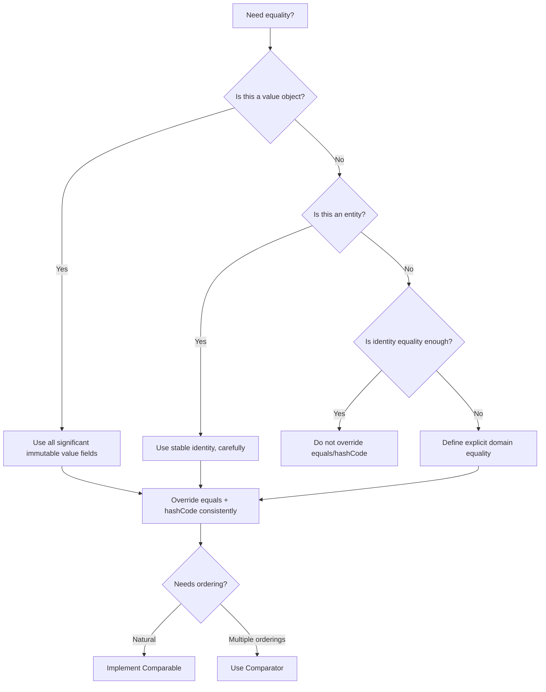
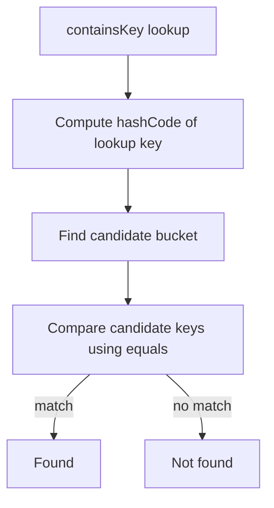
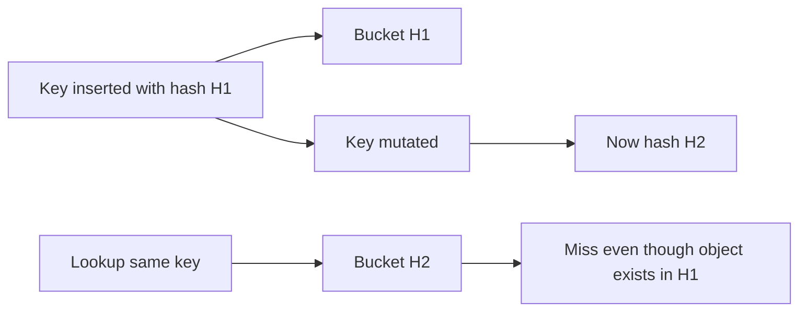

------
title: Learn Java Core Types, Data Model & Data APIs - Part 012
description: Deep engineering treatment of Java equality, Object.equals, hashCode, Comparable, Comparator, identity vs logical equality, value objects, entities, records, hash-based collections, sorted collections, and production failure modes.
series: learn-java-core-types
seriesTitle: Learn Java Core Types, Data Model & Data APIs
order: 12
partTitle: Equality, hashCode, Comparable, and Comparator
tags:
- java
- equality
- hashcode
- comparable
- comparator
- collections
- domain-modeling
- value-objects
- advanced
date: 2026-06-27
---

# Part 012 — Equality, hashCode, Comparable, and Comparator

Equality adalah salah satu area Java yang tampak sederhana tetapi dampaknya sangat besar.

Satu implementasi `equals` yang salah dapat merusak:

- `HashMap`;
- `HashSet`;
- `ConcurrentHashMap`;
- cache;
- deduplication;
- persistence identity;
- domain invariant;
- sorting;
- reconciliation;
- audit comparison;
- testing;
- record/value object semantics;
- ORM entity behavior.

Contoh bug yang terlihat tidak masuk akal:

```java
Set<CaseId> ids = new HashSet<>();
ids.add(new CaseId("CASE-1"));

System.out.println(ids.contains(new CaseId("CASE-1"))); // false?
```

Jika `equals`/`hashCode` tidak benar, `HashSet` gagal menemukan value yang secara domain sama.

Part ini membahas equality bukan sebagai boilerplate IDE, tetapi sebagai **kontrak domain dan collection semantics**.

---

## 1. Kaufman Deconstruction

Skill besar pada part ini:

> Mampu merancang dan mengimplementasikan equality, hashing, dan ordering yang benar untuk value object, entity, record, collection key, dan sorted data structure.

Sub-skill:

| Sub-skill | Yang harus dikuasai |
|---|---|
| Identity equality | `==` pada reference |
| Logical equality | `equals(Object)` |
| Hash contract | relasi `equals` dan `hashCode` |
| Natural ordering | `Comparable<T>` |
| External ordering | `Comparator<T>` |
| Consistency with equals | efek pada sorted set/map |
| Value object equality | equality berdasarkan semua significant fields |
| Entity equality | equality berdasarkan identity yang stabil |
| Record equality | generated equality berdasarkan components |
| Mutable key risk | mengubah key setelah masuk hash collection |
| Arrays equality | `Arrays.equals` vs reference equality |
| Floating equality | `NaN`, signed zero, tolerance strategy |
| BigDecimal caveat | `equals` mempertimbangkan scale, `compareTo` tidak sama persis |
| Proxy/entity caveat | `getClass` vs `instanceof` dalam framework |

Practice target:

> Anda bisa melihat sebuah class dan menjawab: “Apa equality semantics class ini? Apakah aman sebagai key? Apakah aman disortir? Apakah aman untuk ORM/proxy? Apakah konsisten dengan domain?”

---

## 2. Mental Model: Empat Pertanyaan Equality

Saat mendesain equality, jangan mulai dari IDE generate. Mulai dari empat pertanyaan:

1. **Apa yang dianggap sama oleh domain?**
2. **Apakah object ini punya identity sendiri atau hanya value?**
3. **Apakah field yang menentukan equality immutable?**
4. **Apakah object ini akan dipakai sebagai key/set element/sorted element?**

Diagram:



---

## 3. Identity Equality vs Logical Equality

### Identity Equality

`==` pada reference type mengecek apakah dua reference menunjuk object yang sama.

```java
CaseFile a = new CaseFile("CASE-1");
CaseFile b = new CaseFile("CASE-1");
CaseFile c = a;

System.out.println(a == b); // false
System.out.println(a == c); // true
```

### Logical Equality

`equals` mengecek apakah dua object dianggap sama menurut logic class tersebut.

```java
record CaseId(String value) {}

CaseId a = new CaseId("CASE-1");
CaseId b = new CaseId("CASE-1");

System.out.println(a == b);      // false
System.out.println(a.equals(b)); // true
```

Record menghasilkan `equals` otomatis berdasarkan record components.

---

## 4. Default `Object.equals`

Default `Object.equals` pada dasarnya identity equality:

```java
public boolean equals(Object obj) {
    return this == obj;
}
```

Secara konseptual, jika class Anda tidak override `equals`, maka dua object berbeda dianggap tidak equal walaupun field-nya sama.

```java
final class CaseId {
    private final String value;

    CaseId(String value) {
        this.value = value;
    }
}

CaseId a = new CaseId("CASE-1");
CaseId b = new CaseId("CASE-1");

System.out.println(a.equals(b)); // false
```

Jika `CaseId` adalah value object, ini salah. Jika `CaseId` adalah object identity-sensitive unik, mungkin benar. Domain menentukan.

---

## 5. `equals` Contract

`equals` harus memenuhi kontrak berikut:

| Rule | Makna |
|---|---|
| Reflexive | `x.equals(x)` harus `true` |
| Symmetric | jika `x.equals(y)`, maka `y.equals(x)` |
| Transitive | jika `x.equals(y)` dan `y.equals(z)`, maka `x.equals(z)` |
| Consistent | hasil tidak berubah selama significant state tidak berubah |
| Non-null | `x.equals(null)` harus `false` |

Contoh violation symmetry:

```java
class CaseId {
    final String value;

    CaseId(String value) {
        this.value = value;
    }

    @Override
    public boolean equals(Object other) {
        if (other instanceof CaseId c) {
            return value.equals(c.value);
        }
        if (other instanceof String s) {
            return value.equals(s);
        }
        return false;
    }
}
```

Masalah:

```java
CaseId id = new CaseId("CASE-1");
String s = "CASE-1";

System.out.println(id.equals(s)); // true
System.out.println(s.equals(id)); // false
```

Symmetry rusak.

Rule praktis:

> `equals` sebaiknya membandingkan object dengan type domain yang sama, bukan sembarang representasi yang “mirip”.

Gunakan conversion/normalization sebelum equality.

---

## 6. `hashCode` Contract

Jika dua object equal menurut `equals`, maka `hashCode` keduanya harus sama.

```java
if (a.equals(b)) {
    assert a.hashCode() == b.hashCode();
}
```

Kebalikannya tidak wajib:

```java
if (a.hashCode() == b.hashCode()) {
    // belum tentu a.equals(b)
}
```

Hash collision valid. Hash collection harus menangani collision.

### Failure: Override `equals` Tanpa `hashCode`

```java
final class CaseId {
    private final String value;

    CaseId(String value) {
        this.value = value;
    }

    @Override
    public boolean equals(Object other) {
        return other instanceof CaseId c && value.equals(c.value);
    }
}
```

Bug:

```java
Set<CaseId> ids = new HashSet<>();
ids.add(new CaseId("CASE-1"));

System.out.println(ids.contains(new CaseId("CASE-1"))); // likely false
```

Karena `hashCode` masih identity-based dari `Object`.

Correct:

```java
final class CaseId {
    private final String value;

    CaseId(String value) {
        if (value == null || value.isBlank()) {
            throw new IllegalArgumentException("value must be non-blank");
        }
        this.value = value;
    }

    @Override
    public boolean equals(Object other) {
        return other instanceof CaseId c && value.equals(c.value);
    }

    @Override
    public int hashCode() {
        return value.hashCode();
    }
}
```

---

## 7. Value Object Equality

Value object tidak punya identity independen. Ia didefinisikan oleh nilai field signifikan.

Contoh:

```java
record CaseId(String value) {
    CaseId {
        if (value == null || value.isBlank()) {
            throw new IllegalArgumentException("value must be non-blank");
        }
    }
}
```

Dua `CaseId("CASE-1")` equal karena value-nya sama.

```java
CaseId a = new CaseId("CASE-1");
CaseId b = new CaseId("CASE-1");

System.out.println(a.equals(b)); // true
```

Untuk value object modern, record sering menjadi pilihan kuat jika:

- data transparan;
- components cukup merepresentasikan state;
- shallow immutability cukup atau bisa dikontrol;
- tidak perlu inheritance class;
- equality berdasarkan components memang benar.

Namun hati-hati dengan mutable component:

```java
record CaseTags(List<String> tags) {}
```

Record ini belum benar-benar immutable. `equals` membandingkan list contents, tetapi list bisa berubah.

Lebih baik:

```java
record CaseTags(List<String> tags) {
    CaseTags {
        tags = List.copyOf(tags);
    }
}
```

---

## 8. Entity Equality

Entity punya identity yang berbeda dari atributnya.

Contoh:

```java
final class CaseFile {
    private final CaseId id;
    private String title;
    private CaseStatus status;
}
```

Dua case dengan ID sama biasanya dianggap entity yang sama, walaupun title/status berubah.

Tetapi entity equality tricky, terutama jika ID baru tersedia setelah persistence.

### Problem: Generated ID Belum Ada

```java
class CaseEntity {
    private Long id; // generated by database

    @Override
    public boolean equals(Object other) {
        return other instanceof CaseEntity c && Objects.equals(id, c.id);
    }

    @Override
    public int hashCode() {
        return Objects.hash(id);
    }
}
```

Jika dua entity baru sama-sama `id == null`:

```java
CaseEntity a = new CaseEntity();
CaseEntity b = new CaseEntity();

System.out.println(a.equals(b)); // true? dangerous
```

Itu biasanya salah.

### Better Rule

Untuk entity, equality harus memakai identity yang:

1. stabil;
2. tidak berubah selama object berada dalam hash collection;
3. tersedia cukup awal;
4. unik dalam domain boundary yang relevan.

Jika memakai database-generated ID, jangan masukkan transient entity ke `HashSet` sebelum ID stabil.

Alternatif: gunakan domain-generated ID sejak awal.

```java
record CaseId(UUID value) {}

final class CaseEntity {
    private final CaseId id;

    CaseEntity(CaseId id) {
        this.id = Objects.requireNonNull(id);
    }

    @Override
    public boolean equals(Object other) {
        return other instanceof CaseEntity c && id.equals(c.id);
    }

    @Override
    public int hashCode() {
        return id.hashCode();
    }
}
```

---

## 9. `getClass` vs `instanceof` dalam `equals`

Ada dua style umum.

### Style 1 — Exact Class dengan `getClass()`

```java
@Override
public boolean equals(Object other) {
    if (this == other) return true;
    if (other == null || getClass() != other.getClass()) return false;
    CaseId caseId = (CaseId) other;
    return value.equals(caseId.value);
}
```

Cocok untuk:

- final value class;
- record-like classes;
- class hierarchy yang tidak ingin equality lintas subclass;
- object yang equality-nya exact type.

### Style 2 — Compatible Type dengan `instanceof`

```java
@Override
public boolean equals(Object other) {
    return other instanceof CaseId c && value.equals(c.value);
}
```

Cocok untuk:

- final class sederhana;
- interface-like equality yang sengaja menerima subtype;
- beberapa domain model dengan proxy consideration.

### Subclass Risk

Jika class tidak final dan equality menggunakan `instanceof`, subclass dapat merusak symmetry/transitivity.

```java
class Point {
    final int x;
    final int y;

    Point(int x, int y) {
        this.x = x;
        this.y = y;
    }

    @Override
    public boolean equals(Object other) {
        return other instanceof Point p && x == p.x && y == p.y;
    }

    @Override
    public int hashCode() {
        return Objects.hash(x, y);
    }
}

class ColoredPoint extends Point {
    final String color;

    ColoredPoint(int x, int y, String color) {
        super(x, y);
        this.color = color;
    }

    @Override
    public boolean equals(Object other) {
        return other instanceof ColoredPoint p
                && x == p.x
                && y == p.y
                && color.equals(p.color);
    }
}
```

Symmetry problem:

```java
Point p = new Point(1, 2);
ColoredPoint cp = new ColoredPoint(1, 2, "red");

System.out.println(p.equals(cp));  // true
System.out.println(cp.equals(p));  // false
```

Rule praktis:

> Untuk value object, buat class `final` atau gunakan record. Hindari equality rumit di inheritance hierarchy.

---

## 10. Equality untuk Records

Record secara otomatis menghasilkan:

- accessor untuk setiap component;
- `equals`;
- `hashCode`;
- `toString`.

```java
record ViolationCode(String value) {}

ViolationCode a = new ViolationCode("LATE_REPORT");
ViolationCode b = new ViolationCode("LATE_REPORT");

System.out.println(a.equals(b)); // true
```

Record equality berdasarkan record components.

Jika component mutable, equality dapat berubah:

```java
List<String> list = new ArrayList<>();
list.add("A");

record Tags(List<String> values) {}

Tags tags = new Tags(list);
Set<Tags> set = new HashSet<>();
set.add(tags);

list.add("B");

System.out.println(set.contains(tags)); // bisa false/undefined behavior secara koleksi
```

Correct:

```java
record Tags(List<String> values) {
    Tags {
        values = List.copyOf(values);
    }
}
```

Record bukan magic immutability. Record membuat field component `final`, tetapi object yang direferensikan component bisa mutable.

---

## 11. Equality untuk Arrays

Array tidak override `equals` untuk content equality. Array memakai identity equality dari `Object`.

```java
int[] a = {1, 2, 3};
int[] b = {1, 2, 3};

System.out.println(a.equals(b));        // false
System.out.println(Arrays.equals(a, b)); // true
```

Untuk nested arrays:

```java
String[][] x = {{"a"}, {"b"}};
String[][] y = {{"a"}, {"b"}};

System.out.println(Arrays.equals(x, y));     // false untuk nested content
System.out.println(Arrays.deepEquals(x, y)); // true
```

Jika record memiliki array component:

```java
record Digest(byte[] bytes) {}
```

Default record equality akan memakai `Objects.equals(bytes1, bytes2)`, yang untuk array berarti reference equality.

Jika butuh content equality, jangan naif memakai array component langsung. Opsi:

1. defensive copy + custom `equals/hashCode`;
2. wrap sebagai immutable list/byte string type;
3. gunakan library/domain type yang tepat;
4. expose copy, bukan array internal.

Contoh custom:

```java
record Digest(byte[] bytes) {
    Digest {
        bytes = bytes.clone();
    }

    @Override
    public byte[] bytes() {
        return bytes.clone();
    }

    @Override
    public boolean equals(Object other) {
        return other instanceof Digest d && Arrays.equals(bytes, d.bytes);
    }

    @Override
    public int hashCode() {
        return Arrays.hashCode(bytes);
    }
}
```

---

## 12. Mutable Key Disaster

Hash collections bergantung pada hash bucket. Jika field yang menentukan `hashCode` berubah setelah object masuk `HashMap`/`HashSet`, object bisa “hilang”.

```java
final class MutableCaseKey {
    private String id;

    MutableCaseKey(String id) {
        this.id = id;
    }

    void rename(String id) {
        this.id = id;
    }

    @Override
    public boolean equals(Object other) {
        return other instanceof MutableCaseKey k && Objects.equals(id, k.id);
    }

    @Override
    public int hashCode() {
        return Objects.hash(id);
    }
}
```

Bug:

```java
MutableCaseKey key = new MutableCaseKey("CASE-1");
Set<MutableCaseKey> set = new HashSet<>();
set.add(key);

key.rename("CASE-2");

System.out.println(set.contains(key)); // often false
```

Object masih ada dalam set, tetapi berada di bucket lama.

Rule:

> Object yang dipakai sebagai key atau set element harus punya equality/hash fields yang immutable selama berada di collection.

---

## 13. `Comparable<T>`: Natural Ordering

`Comparable<T>` mendefinisikan natural ordering class.

```java
record CasePriority(int level) implements Comparable<CasePriority> {
    @Override
    public int compareTo(CasePriority other) {
        return Integer.compare(this.level, other.level);
    }
}
```

Kontrak `compareTo`:

- return negative jika `this < other`;
- return zero jika equivalent dalam ordering;
- return positive jika `this > other`.

Jangan implement dengan subtraction jika berpotensi overflow:

```java
// Bad
return this.level - other.level;
```

Gunakan:

```java
return Integer.compare(this.level, other.level);
```

### Natural Ordering Harus Natural

Implement `Comparable` hanya jika ada satu ordering default yang jelas.

Contoh cocok:

- `LocalDate` berdasarkan timeline calendar date;
- `Integer` berdasarkan numeric value;
- `String` berdasarkan lexicographic order;
- `CasePriority` jika domain sepakat level lebih kecil/besar punya urutan natural.

Contoh kurang cocok:

```java
class CaseFile implements Comparable<CaseFile> {
    // order by createdAt? priority? id? status? title?
}
```

Jika ada banyak ordering valid, jangan paksa `Comparable`; gunakan `Comparator`.

---

## 14. `Comparator<T>`: External Ordering

`Comparator` merepresentasikan ordering eksternal.

```java
Comparator<CaseFile> byPriority = Comparator.comparing(CaseFile::priority);
Comparator<CaseFile> byCreatedAt = Comparator.comparing(CaseFile::createdAt);
Comparator<CaseFile> byStatusThenPriority = Comparator
        .comparing(CaseFile::status)
        .thenComparing(CaseFile::priority);
```

Comparator cocok untuk:

- sorting UI;
- report;
- query result in memory;
- multiple business views;
- custom null ordering;
- ordering berdasarkan derived fields.

### Null Handling

```java
Comparator<CaseFile> byDueDate = Comparator.comparing(
        CaseFile::dueDate,
        Comparator.nullsLast(Comparator.naturalOrder())
);
```

Tanpa null handling, sorting bisa NPE jika key null.

---

## 15. Consistency with Equals

Ordering dikatakan consistent with equals jika:

```java
compare(a, b) == 0
```

memiliki makna yang sama dengan:

```java
a.equals(b)
```

Tidak semua class memenuhi ini. Contoh penting: `BigDecimal`.

```java
BigDecimal a = new BigDecimal("1.0");
BigDecimal b = new BigDecimal("1.00");

System.out.println(a.equals(b));    // false
System.out.println(a.compareTo(b)); // 0
```

Dampak pada `TreeSet`:

```java
Set<BigDecimal> set = new TreeSet<>();
set.add(new BigDecimal("1.0"));
set.add(new BigDecimal("1.00"));

System.out.println(set.size()); // 1
```

Karena `TreeSet` memakai ordering untuk menentukan uniqueness.

HashSet berbeda:

```java
Set<BigDecimal> set = new HashSet<>();
set.add(new BigDecimal("1.0"));
set.add(new BigDecimal("1.00"));

System.out.println(set.size()); // 2
```

Rule:

> Jika memakai sorted set/map, pastikan comparator equality sesuai dengan uniqueness yang Anda inginkan.

---

## 16. Comparator yang Merusak Set Semantics

Contoh comparator hanya berdasarkan length:

```java
Comparator<String> byLength = Comparator.comparingInt(String::length);

Set<String> set = new TreeSet<>(byLength);
set.add("ab");
set.add("cd");

System.out.println(set);      // [ab]
System.out.println(set.size()); // 1
```

`"ab"` dan `"cd"` tidak equal menurut `String.equals`, tetapi comparator menganggap keduanya sama karena length sama.

Jika maksudnya sort by length lalu lexicographic:

```java
Comparator<String> byLengthThenValue = Comparator
        .comparingInt(String::length)
        .thenComparing(Comparator.naturalOrder());
```

Sekarang:

```java
Set<String> set = new TreeSet<>(byLengthThenValue);
set.add("ab");
set.add("cd");

System.out.println(set.size()); // 2
```

---

## 17. Floating-Point Equality

`double` dan `float` punya edge cases:

- rounding approximation;
- `NaN`;
- signed zero;
- infinity.

```java
double a = 0.1 + 0.2;
double b = 0.3;

System.out.println(a == b); // false
```

Untuk domain measurement, sering dipakai tolerance:

```java
static boolean closeTo(double a, double b, double epsilon) {
    return Math.abs(a - b) <= epsilon;
}
```

Tetapi tolerance equality tidak selalu transitive.

Contoh:

```text
a close to b
b close to c
belum tentu a close to c
```

Karena `equals` harus transitive, jangan sembarangan memakai tolerance dalam `equals` object yang akan masuk collection.

Untuk money/decimal presisi, gunakan `BigDecimal` atau domain scalar yang sesuai, bukan `double`.

---

## 18. `Objects.equals` dan `Objects.hash`

`java.util.Objects` membantu null-safe equality:

```java
Objects.equals(a, b)
```

Artinya:

- true jika keduanya null;
- false jika satu null;
- kalau tidak, `a.equals(b)`.

Contoh:

```java
@Override
public boolean equals(Object other) {
    if (this == other) return true;
    if (!(other instanceof CaseOwner c)) return false;
    return Objects.equals(teamId, c.teamId)
            && Objects.equals(userId, c.userId);
}
```

`Objects.hash` nyaman tetapi membuat varargs array internal dan bisa punya overhead kecil.

```java
@Override
public int hashCode() {
    return Objects.hash(teamId, userId);
}
```

Untuk path biasa, ini baik. Untuk object sangat banyak atau hot path, manual hash bisa lebih efisien:

```java
@Override
public int hashCode() {
    int result = teamId.hashCode();
    result = 31 * result + userId.hashCode();
    return result;
}
```

Jangan optimize terlalu dini. Tetapi pahami trade-off.

---

## 19. Equality dan Inheritance: Avoid When Possible

Equality dalam inheritance hierarchy adalah area rawan.

Masalah umum:

- subclass menambah significant field;
- superclass memakai `instanceof`;
- subclass memakai exact class;
- symmetry/transitivity rusak;
- ORM proxy menambah subclass runtime;
- equality domain tidak sama antara parent/child.

Untuk model data modern, pilihan yang lebih aman:

1. gunakan `final` class untuk value object;
2. gunakan record;
3. gunakan sealed hierarchy dengan equality per concrete final subtype;
4. hindari membuat superclass equality yang terlalu umum;
5. pakai composition daripada inheritance untuk data value.

Contoh sealed:

```java
sealed interface CaseEvent permits CaseOpened, CaseClosed {}

record CaseOpened(CaseId caseId) implements CaseEvent {}
record CaseClosed(CaseId caseId, String reason) implements CaseEvent {}
```

Equality record masing-masing concrete type jelas.

---

## 20. Equality dan ORM/Proxy Caveat

Entity persistence framework dapat membuat proxy subclass untuk lazy loading.

Jika equality memakai exact `getClass()`, proxy bisa tidak equal dengan entity asli walaupun ID sama.

```java
@Override
public boolean equals(Object other) {
    if (other == null || getClass() != other.getClass()) return false;
    CaseEntity that = (CaseEntity) other;
    return id.equals(that.id);
}
```

Jika `other` adalah proxy subclass, check class bisa gagal.

Namun memakai `instanceof` juga punya risiko jika hierarchy kompleks.

Tidak ada satu jawaban universal untuk semua ORM. Prinsipnya:

1. entity equality harus mengikuti guideline framework yang dipakai;
2. identity yang dipakai harus stabil;
3. jangan masukkan transient entity yang ID-nya belum stabil ke hash collection;
4. value object embeddable lebih cocok memakai record/final class equality biasa;
5. test equality dengan proxy jika framework menghasilkan proxy.

Untuk domain core non-ORM, final class/record sering lebih sederhana.

---

## 21. `equals` Implementation Templates

### 21.1 Final Value Class

```java
public final class CaseId {
    private final String value;

    public CaseId(String value) {
        if (value == null || value.isBlank()) {
            throw new IllegalArgumentException("value must be non-blank");
        }
        this.value = value;
    }

    public String value() {
        return value;
    }

    @Override
    public boolean equals(Object other) {
        if (this == other) return true;
        return other instanceof CaseId caseId
                && value.equals(caseId.value);
    }

    @Override
    public int hashCode() {
        return value.hashCode();
    }

    @Override
    public String toString() {
        return value;
    }
}
```

Karena class `final`, `instanceof CaseId` tidak punya subclass symmetry problem.

### 21.2 Record Value Object

```java
public record CaseId(String value) {
    public CaseId {
        if (value == null || value.isBlank()) {
            throw new IllegalArgumentException("value must be non-blank");
        }
    }
}
```

Jika record components sudah benar, ini lebih kecil dan lebih aman.

### 21.3 Entity dengan Stable Domain ID

```java
public final class CaseFile {
    private final CaseId id;
    private String title;
    private CaseStatus status;

    public CaseFile(CaseId id, String title) {
        this.id = Objects.requireNonNull(id);
        this.title = Objects.requireNonNull(title);
        this.status = CaseStatus.OPEN;
    }

    public CaseId id() {
        return id;
    }

    @Override
    public boolean equals(Object other) {
        if (this == other) return true;
        return other instanceof CaseFile caseFile
                && id.equals(caseFile.id);
    }

    @Override
    public int hashCode() {
        return id.hashCode();
    }
}
```

Catatan: jika class tidak final dan framework proxy terlibat, template harus disesuaikan.

---

## 22. Comparator Composition Patterns

### 22.1 One Field

```java
Comparator<CaseFile> byCreatedAt = Comparator.comparing(CaseFile::createdAt);
```

### 22.2 Multiple Fields

```java
Comparator<CaseFile> byPriorityThenAge = Comparator
        .comparing(CaseFile::priority)
        .thenComparing(CaseFile::createdAt);
```

### 22.3 Reverse Order

```java
Comparator<CaseFile> newestFirst = Comparator
        .comparing(CaseFile::createdAt)
        .reversed();
```

Hati-hati: `reversed()` membalik seluruh comparator sebelumnya.

Jika hanya ingin satu field descending:

```java
Comparator<CaseFile> byStatusThenNewest = Comparator
        .comparing(CaseFile::status)
        .thenComparing(CaseFile::createdAt, Comparator.reverseOrder());
```

### 22.4 Nulls Last

```java
Comparator<CaseFile> byDueDate = Comparator.comparing(
        CaseFile::dueDate,
        Comparator.nullsLast(Comparator.naturalOrder())
);
```

### 22.5 Primitive Comparators

Gunakan primitive comparator untuk menghindari boxing:

```java
Comparator<CaseFile> bySeverity = Comparator.comparingInt(CaseFile::severity);
Comparator<CaseFile> byScore = Comparator.comparingDouble(CaseFile::riskScore);
```

---

## 23. HashMap Lookup Mental Model

Hash-based lookup secara konseptual:



Karena itu dua hal harus benar:

1. equal objects harus punya hash sama;
2. equals harus mampu menemukan match dalam bucket.

Jika `hashCode` berubah setelah insert:



---

## 24. Testing Equality

Jangan hanya test happy path.

Checklist test untuk value object:

```java
@Test
void equalObjectsHaveEqualHashCode() {
    CaseId a = new CaseId("CASE-1");
    CaseId b = new CaseId("CASE-1");

    assertEquals(a, b);
    assertEquals(a.hashCode(), b.hashCode());
}
```

Test non-equality:

```java
@Test
void differentValuesAreNotEqual() {
    assertNotEquals(new CaseId("CASE-1"), new CaseId("CASE-2"));
}
```

Test null:

```java
@Test
void notEqualToNull() {
    assertNotEquals(new CaseId("CASE-1"), null);
}
```

Test different type:

```java
@Test
void notEqualToRawString() {
    assertNotEquals(new CaseId("CASE-1"), "CASE-1");
}
```

Test set behavior:

```java
@Test
void worksInHashSet() {
    Set<CaseId> ids = new HashSet<>();
    ids.add(new CaseId("CASE-1"));

    assertTrue(ids.contains(new CaseId("CASE-1")));
}
```

Test sorted behavior:

```java
@Test
void sortedSetKeepsDistinctValues() {
    Comparator<String> comparator = Comparator
            .comparingInt(String::length)
            .thenComparing(Comparator.naturalOrder());

    Set<String> values = new TreeSet<>(comparator);
    values.add("ab");
    values.add("cd");

    assertEquals(2, values.size());
}
```

---

## 25. Production Failure Modes

### 25.1 `equals` Overloaded, Not Overridden

Bug:

```java
class CaseId {
    private final String value;

    boolean equals(CaseId other) {
        return value.equals(other.value);
    }
}
```

Ini overload, bukan override. Collections memanggil `equals(Object)`, bukan `equals(CaseId)`.

Correct:

```java
@Override
public boolean equals(Object other) {
    return other instanceof CaseId c && value.equals(c.value);
}
```

Gunakan `@Override` selalu.

### 25.2 Hash Code Tidak Konsisten dengan Equals

```java
@Override
public boolean equals(Object other) {
    return other instanceof CaseId c && value.equalsIgnoreCase(c.value);
}

@Override
public int hashCode() {
    return value.hashCode(); // bug jika case-insensitive equality
}
```

Correct:

```java
@Override
public int hashCode() {
    return value.toLowerCase(Locale.ROOT).hashCode();
}
```

Lebih baik normalize di constructor:

```java
record CaseId(String value) {
    CaseId {
        value = value.toUpperCase(Locale.ROOT);
    }
}
```

### 25.3 Comparator Tidak Total

Comparator yang tidak transitive dapat membuat sort gagal atau hasil tidak stabil.

Bad:

```java
Comparator<CaseFile> unstable = (a, b) -> {
    if (Math.random() > 0.5) return 1;
    return -1;
};
```

Comparator harus deterministic dan transitive.

### 25.4 Subtraction Comparator Overflow

```java
Comparator<Integer> bad = (a, b) -> a - b;
```

Overflow bisa membalik hasil.

Correct:

```java
Comparator<Integer> good = Integer::compare;
```

### 25.5 TreeSet Deduplication Surprise

```java
Set<String> set = new TreeSet<>(Comparator.comparingInt(String::length));
set.add("aa");
set.add("bb");
```

Size menjadi 1 karena comparator menganggap keduanya equivalent.

### 25.6 Mutable Record Component

```java
record Tags(List<String> values) {}
```

Record equality berubah jika list berubah. Gunakan `List.copyOf`.

### 25.7 Array Component dalam Record

```java
record Digest(byte[] bytes) {}
```

Default equality bukan content equality. Override atau pakai type lain.

---

## 26. Domain Modeling Decision Table

| Model | Equality yang biasanya benar | Catatan |
|---|---|---|
| Value object | semua significant immutable fields | record/final class cocok |
| Entity | stable identity | hati-hati generated ID/proxy |
| DTO | sering component equality | record cocok jika shallow immutability cukup |
| Command | all command data | record cocok |
| Event | all event facts + event id tergantung domain | immutable sangat disarankan |
| Enum | identity equality | `==` idiomatis |
| Collection key | immutable fields only | jangan mutable |
| Cache key | canonical immutable representation | normalize input |
| Money amount | amount + currency + scale policy | jangan `double` |
| Binary digest | content bytes | jangan default array equality |
| Case lifecycle state | enum/sealed type identity/value | tergantung model |

---

## 27. Worked Example: Regulatory Case Deduplication

Misal kita ingin deduplicate incoming case signal.

Bad model:

```java
final class IncomingSignal {
    String regulator;
    String externalId;
    String receivedAt;
}
```

Tidak ada equality. HashSet tidak bisa deduplicate secara domain.

Better:

```java
record RegulatorCode(String value) {
    RegulatorCode {
        if (value == null || value.isBlank()) {
            throw new IllegalArgumentException("regulator code must be non-blank");
        }
        value = value.toUpperCase(Locale.ROOT);
    }
}

record ExternalCaseId(String value) {
    ExternalCaseId {
        if (value == null || value.isBlank()) {
            throw new IllegalArgumentException("external case id must be non-blank");
        }
        value = value.trim();
    }
}

record IncomingSignalKey(RegulatorCode regulator, ExternalCaseId externalId) {}

record IncomingSignal(
        IncomingSignalKey key,
        Instant receivedAt,
        String payloadHash
) {}
```

Deduplication:

```java
Set<IncomingSignalKey> seen = new HashSet<>();

for (IncomingSignal signal : signals) {
    if (!seen.add(signal.key())) {
        auditDuplicate(signal);
        continue;
    }
    process(signal);
}
```

Keuntungan:

1. equality diletakkan pada key yang eksplisit;
2. `receivedAt` tidak ikut equality karena bukan identity signal;
3. normalization terjadi di value object;
4. hash collection bekerja sesuai domain;
5. review lebih mudah.

---

## 28. Review Checklist

Saat review equality/order code, tanyakan:

- Apakah class ini value object, entity, DTO, atau service object?
- Apakah override `equals` selalu ditemani `hashCode`?
- Apakah `@Override` dipakai?
- Apakah equality fields immutable atau stabil selama object dipakai sebagai key?
- Apakah `equals(null)` false?
- Apakah symmetry dan transitivity aman?
- Apakah inheritance membuat equality berisiko?
- Apakah record components semuanya punya equality semantics yang benar?
- Apakah array component dibandingkan dengan content equality jika perlu?
- Apakah comparator transitive dan deterministic?
- Apakah comparator consistent with equals jika dipakai untuk `TreeSet`/`TreeMap` uniqueness?
- Apakah null ordering explicit?
- Apakah BigDecimal scale semantics dipahami?
- Apakah floating tolerance tidak dimasukkan sembarangan ke `equals`?
- Apakah entity ID stabil sebelum masuk hash collection?
- Apakah ORM/proxy behavior sudah dipertimbangkan?

---

## 29. Practice Drill

### Drill 1 — Fix Broken CaseId

Perbaiki class ini agar aman untuk `HashSet`:

```java
class CaseId {
    private final String value;

    CaseId(String value) {
        this.value = value;
    }

    boolean equals(CaseId other) {
        return value.equals(other.value);
    }
}
```

Target:

- validasi null/blank;
- override `equals(Object)`;
- override `hashCode`;
- test `HashSet.contains`.

### Drill 2 — Comparator Deduplication

Apa output?

```java
Set<String> set = new TreeSet<>(Comparator.comparingInt(String::length));
set.add("ab");
set.add("cd");
set.add("efg");

System.out.println(set);
```

Refactor agar semua string tetap masuk, tetapi urut berdasarkan panjang lalu alfabetis.

### Drill 3 — Mutable Key

Jelaskan kenapa ini berbahaya:

```java
record Key(List<String> parts) {}
```

Lalu buat versi aman.

### Drill 4 — Entity Equality

Anda punya entity dengan database-generated `Long id`. Apa risiko jika `equals/hashCode` langsung memakai `id`, sementara object bisa berada di `HashSet` sebelum `persist`?

Tulis minimal dua strategi mitigasi.

### Drill 5 — BigDecimal Set

Prediksi output:

```java
Set<BigDecimal> a = new HashSet<>();
a.add(new BigDecimal("1.0"));
a.add(new BigDecimal("1.00"));

Set<BigDecimal> b = new TreeSet<>();
b.add(new BigDecimal("1.0"));
b.add(new BigDecimal("1.00"));

System.out.println(a.size());
System.out.println(b.size());
```

Jelaskan kenapa.

---

## 30. Key Takeaways

1. Equality adalah keputusan domain, bukan boilerplate IDE.
2. `==` pada reference mengecek identity; `equals` mengecek logical equality.
3. Jika override `equals`, override `hashCode`.
4. Equal objects wajib punya hash code sama.
5. Hash collision boleh; unequal objects boleh punya hash sama.
6. Value object sebaiknya immutable dan equality berdasarkan significant fields.
7. Entity equality harus memakai identity yang stabil.
8. Mutable object berbahaya sebagai key/set element.
9. Record equality bagus jika components punya equality semantics yang benar.
10. Array default equality adalah reference equality, bukan content equality.
11. `Comparable` untuk natural ordering; `Comparator` untuk external/multiple ordering.
12. Comparator yang mengembalikan `0` menentukan uniqueness di `TreeSet`/`TreeMap`.
13. Comparator harus deterministic, transitive, dan sebaiknya explicit terhadap null.
14. Floating-point tolerance jangan sembarangan dipakai dalam `equals`.
15. Equality di inheritance hierarchy sulit; final class/record/sealed concrete types lebih aman.

---

## 31. References

- Java SE 25 API Specification — `java.lang.Object#equals`
- Java SE 25 API Specification — `java.lang.Object#hashCode`
- Java SE 25 API Specification — `java.lang.Comparable`
- Java SE 25 API Specification — `java.util.Comparator`
- Java SE 25 API Specification — `java.util.Objects`
- Java SE 25 API Specification — `java.util.Arrays`
- Java SE 25 API Specification — `java.util.HashMap`, `HashSet`, `TreeMap`, `TreeSet`
- Java Language Specification Java SE 25 — Classes, Inheritance, and Method Overriding
