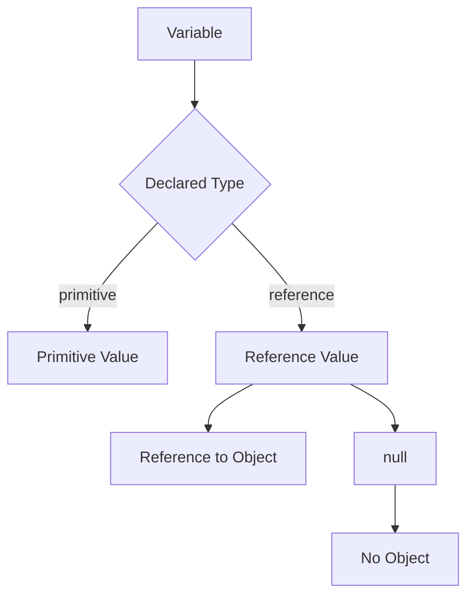
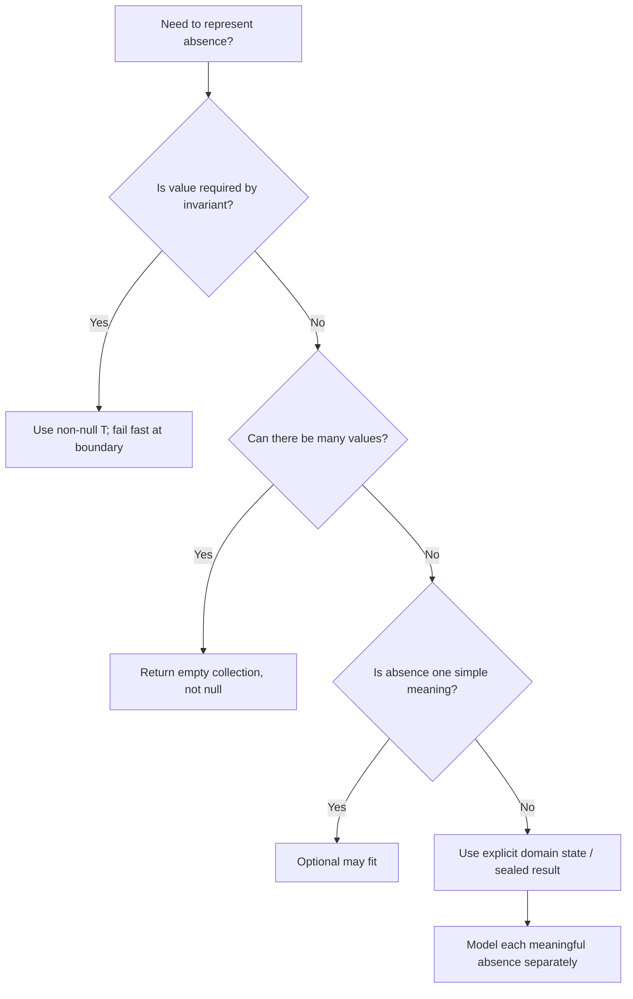
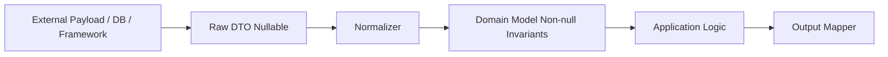

------
title: Learn Java Core Types, Data Model & Data APIs - Part 013
description: Deep engineering treatment of null, the null type, NullPointerException, Optional, absence modeling, boundary normalization, static null-safety discipline, API contracts, and production failure modes.
series: learn-java-core-types
seriesTitle: Learn Java Core Types, Data Model & Data APIs
order: 13
partTitle: null, Optional, and Absence Modeling
tags:
- java
- null
- optional
- absence-modeling
- api-design
- domain-modeling
- defensive-programming
- advanced
date: 2026-06-27
---

# Part 013 — null, Optional, and Absence Modeling

`null` adalah salah satu konsep Java yang paling kecil secara syntax, tetapi paling besar efeknya pada desain sistem.

Bug yang muncul sering tidak terlihat sebagai bug desain. Ia terlihat sebagai:

- `NullPointerException` di production;
- field JSON hilang;
- database column nullable tetapi domain object menganggap required;
- `Optional.get()` gagal;
- string kosong dipakai sebagai sentinel;
- cache membedakan `not found`, `not loaded`, dan `loaded but empty` secara ambigu;
- service mengirim `null` untuk field yang sebelumnya selalu ada;
- DTO framework mengisi field tanpa constructor invariant;
- test lolos karena data fixture terlalu bersih.

Part ini bukan sekadar “hindari null”. Itu terlalu dangkal. Kita akan membangun mental model yang lebih kuat:

> `null` adalah representasi teknis untuk ketiadaan reference, tetapi absence dalam domain harus dimodelkan secara eksplisit sesuai maknanya.

Dengan kata lain, pertanyaan engineering yang benar bukan:

> “Boleh pakai null atau tidak?”

Pertanyaan yang benar adalah:

> “Ketiadaan ini berarti apa, siapa yang boleh menghasilkannya, siapa yang wajib menanganinya, dan apakah sistem bisa membedakan semua state penting?”

---

## 1. Kaufman Deconstruction

Skill besar pada part ini:

> Mampu merancang model absence yang jelas, aman, mudah diuji, dan tidak menyebabkan ambiguity di boundary internal maupun external.

Sub-skill:

| Sub-skill | Yang harus dikuasai |
|---|---|
| Null mechanics | Apa itu `null`, null type, null reference, assignment compatibility |
| NPE mechanics | Kapan `NullPointerException` terjadi dan bagaimana membacanya |
| Contract design | Menentukan parameter/return/field boleh null atau tidak |
| Optional design | Kapan `Optional<T>` cocok dan kapan tidak cocok |
| Boundary normalization | Mengubah input nullable dari DB/API/framework menjadi domain model eksplisit |
| Domain absence | Membedakan unknown, not applicable, not found, empty, pending, redacted |
| Sentinel avoidance | Menghindari `""`, `0`, `-1`, `false`, atau dummy object yang ambigu |
| Annotation discipline | Memakai `@Nullable`/`@NonNull` secara konsisten bila tersedia |
| Static analysis | Memahami benefit dan limit checker null-safety |
| Failure modeling | Menguji null path, missing field, optional emptiness, partial payload |

Target setelah part ini:

- bisa membaca `null` sebagai **contract smell** atau **valid boundary representation**;
- bisa menentukan apakah return method lebih baik `T`, `Optional<T>`, empty collection, exception, sealed result, atau explicit status;
- bisa membuat constructor/factory yang mengunci invariant non-null;
- bisa membedakan absence teknis dari absence domain;
- bisa mencegah NPE bukan dengan defensive `if (x != null)` di mana-mana, tetapi dengan desain data flow yang benar.

---

## 2. Java Null Model

Dalam Java, `null` adalah literal khusus. `null` bukan object. `null` tidak punya class. `null` tidak punya method. `null` dapat menjadi value dari variable bertipe reference.

Contoh:

```java
String name = null;
Object value = null;
List<String> items = null;
```

Semua variable di atas berisi **null reference**.

Yang tidak bisa:

```java
int count = null;       // compile error
boolean active = null;  // compile error
double amount = null;   // compile error
```

Primitive type tidak bisa berisi `null` karena primitive menyimpan primitive value, bukan reference value.

Mental model:



Makna penting:

- variable reference dapat berisi reference ke object;
- variable reference juga dapat berisi `null`;
- `null` berarti tidak ada object yang direferensikan;
- karena tidak ada object, operasi instance pada `null` gagal.

---

## 3. Null Type

JLS menyebut adanya **null type**. Null type tidak memiliki nama yang bisa ditulis programmer.

Kita tidak bisa menulis:

```java
null x = null; // tidak ada syntax seperti ini
```

Namun compiler memperlakukan `null` sebagai value yang bisa dikonversi ke reference type mana pun.

```java
String s = null;
Integer i = null;
Runnable r = null;
Object o = null;
```

Karena itu `null` sering disebut “bottom-like” untuk reference types: ia bisa masuk ke banyak tempat, tetapi tidak membawa informasi type runtime.

Contoh penting:

```java
String s = null;
System.out.println(s instanceof String); // false
```

`instanceof` terhadap `null` selalu false karena tidak ada object runtime yang bisa diuji.

---

## 4. Null Is Not Empty

Salah satu kesalahan desain paling umum adalah menyamakan `null` dengan empty.

```java
List<String> names = null;       // no list
List<String> names = List.of();  // list exists, but has no elements
```

Dua state ini berbeda.

| State | Makna teknis | Kemungkinan makna domain |
|---|---|---|
| `null` list | tidak ada object list | belum di-load, tidak dikirim, tidak diketahui, bug |
| empty list | list ada, size 0 | diketahui tidak ada item |
| list with elements | list ada dan berisi data | ada item |

Untuk return value, empty collection sering lebih baik daripada `null` karena caller bisa langsung melakukan operasi collection tanpa null check:

```java
public List<Violation> findViolations(CaseId caseId) {
    return repository.findByCaseId(caseId); // must return empty list, not null
}
```

Caller:

```java
for (Violation violation : findViolations(caseId)) {
    process(violation);
}
```

Jika method mengembalikan `null`, caller dipaksa menebak:

```java
List<Violation> violations = findViolations(caseId);
if (violations != null) {
    for (Violation violation : violations) {
        process(violation);
    }
}
```

Ini terlihat aman, tetapi sering menyembunyikan bug: apakah `null` berarti “tidak ada violation” atau “repository gagal mengisi data”?

---

## 5. NullPointerException Mechanics

`NullPointerException` terjadi ketika program mencoba memakai `null` dalam konteks yang membutuhkan object.

Contoh umum:

### 5.1 Memanggil instance method pada null

```java
String name = null;
name.length(); // NPE
```

### 5.2 Mengakses field pada null

```java
Customer customer = null;
customer.name(); // NPE jika name() instance method record/class
```

### 5.3 Mengakses array length dari null

```java
String[] names = null;
int n = names.length; // NPE
```

### 5.4 Mengakses slot array dari null

```java
String[] names = null;
String first = names[0]; // NPE
```

### 5.5 Unboxing null

```java
Integer count = null;
int n = count; // NPE
```

Ini sangat penting. NPE tidak hanya terjadi karena `x.method()`. Ia juga bisa terjadi karena autounboxing.

Contoh production bug:

```java
record RuleConfig(Boolean enabled) {}

boolean shouldRun(RuleConfig config) {
    return config.enabled(); // NPE jika enabled null
}
```

Karena `Boolean` di-unbox menjadi `boolean`.

Solusi yang lebih jelas:

```java
record RuleConfig(boolean enabled) {}
```

Jika absence memang valid:

```java
record RuleConfig(Optional<Boolean> enabledOverride) {}
```

Atau lebih domain-specific:

```java
enum RuleSwitch {
    ENABLED,
    DISABLED,
    INHERIT_DEFAULT
}
```

---

## 6. Helpful NullPointerException

Java modern dapat memberikan pesan NPE yang lebih informatif, misalnya menunjukkan bagian expression mana yang null.

Contoh expression:

```java
caseFile.owner().department().name().toUpperCase();
```

Tanpa informasi tambahan, NPE hanya memberi tahu bahwa terjadi null dereference. Dengan helpful NPE, pesan bisa mengarah ke expression yang null.

Namun ini bukan alasan untuk membiarkan chain panjang.

```java
caseFile.owner().department().name().toUpperCase();
```

Masalah desainnya tetap ada:

- apakah `owner` boleh tidak ada?
- apakah `department` optional?
- apakah `name` bisa null?
- apakah uppercase harus locale-aware?
- apakah missing department harus menjadi error, empty output, atau fallback?

Helpful NPE memperbaiki observability. Ia tidak memperbaiki model domain.

---

## 7. Absence Is a Domain Concept

Ketiadaan data bisa memiliki banyak arti.

| Representation buruk | Masalah |
|---|---|
| `null` | terlalu umum |
| `""` | empty string bisa valid |
| `0` | zero bisa valid |
| `-1` | sentinel tersembunyi |
| `false` | tidak membedakan false vs unknown |
| empty collection | tidak membedakan not loaded vs loaded empty |

Contoh regulatory/case management:

```java
record EnforcementCase(
    CaseId id,
    OfficerId assignedOfficerId
) {}
```

Jika `assignedOfficerId` bisa null, apa artinya?

- case belum diassign;
- assignment sedang diproses;
- assignment dihapus;
- officer redacted karena permission;
- data corrupt;
- migration belum selesai;
- external system belum mengirim field.

Semua kemungkinan ini tidak boleh dipaksa menjadi satu `null` jika konsekuensi prosesnya berbeda.

Model yang lebih baik:

```java
sealed interface AssignmentStatus permits Unassigned, Assigned, AssignmentPending, AssignmentRedacted {}

record Unassigned() implements AssignmentStatus {}
record Assigned(OfficerId officerId) implements AssignmentStatus {}
record AssignmentPending(WorkflowId workflowId) implements AssignmentStatus {}
record AssignmentRedacted(RedactionReason reason) implements AssignmentStatus {}
```

Sekarang logic downstream bisa exhaustive:

```java
String label(AssignmentStatus status) {
    return switch (status) {
        case Unassigned ignored -> "Unassigned";
        case Assigned assigned -> "Assigned to " + assigned.officerId();
        case AssignmentPending pending -> "Assignment pending";
        case AssignmentRedacted redacted -> "Restricted";
    };
}
```

Ini jauh lebih kuat daripada:

```java
if (caseFile.assignedOfficerId() == null) {
    return "Unassigned";
}
```

Karena `null` telah menghapus informasi domain.

---

## 8. Absence Decision Matrix

Gunakan matrix ini saat mendesain return type.

| Situasi | Representasi yang biasanya tepat | Contoh |
|---|---|---|
| Required value, absence adalah bug | `T` + fail fast | `Customer.name()` |
| Optional single value | `Optional<T>` | `findPrimaryEmail()` |
| Zero or more values | empty collection | `findViolations()` |
| Operation bisa gagal karena alasan domain | sealed result / result object | `ValidateOutcome` |
| Data belum di-load | explicit state | `NotLoaded`, `Loaded<T>` |
| Unauthorized/redacted | explicit state | `Redacted<T>` |
| Not found di repository | `Optional<T>` | `findById()` |
| Command gagal | exception atau domain result | `approve(caseId)` |
| External payload nullable | boundary DTO nullable, domain normalized | JSON input |

Mermaid decision flow:



---

## 9. Method Parameter Nullability

Parameter adalah API boundary. Setiap parameter harus punya contract:

- required non-null;
- nullable with explicit meaning;
- optional but not represented as `Optional` parameter;
- collection must be non-null but may be empty;
- collection may not contain null elements.

Bad:

```java
void assign(CaseId caseId, OfficerId officerId) {
    // no contract
}
```

Better:

```java
void assign(CaseId caseId, OfficerId officerId) {
    this.caseId = Objects.requireNonNull(caseId, "caseId");
    this.officerId = Objects.requireNonNull(officerId, "officerId");
}
```

But still better is to centralize invariant in constructor/factory:

```java
record Assignment(CaseId caseId, OfficerId officerId) {
    Assignment {
        Objects.requireNonNull(caseId, "caseId");
        Objects.requireNonNull(officerId, "officerId");
    }
}
```

Now every `Assignment` instance is valid.

Do not spread null checks randomly. Place them at boundaries where invalid data enters the trusted model.

---

## 10. `Objects.requireNonNull`

`Objects.requireNonNull` is useful when non-null is an invariant, not merely a preference.

```java
public CaseFile(CaseId id, CaseStatus status) {
    this.id = Objects.requireNonNull(id, "id");
    this.status = Objects.requireNonNull(status, "status");
}
```

Benefits:

- fail fast;
- localizes blame;
- documents invariant;
- prevents invalid object construction;
- improves debugging;
- avoids later NPE far from root cause.

Bad pattern:

```java
void process(CaseFile caseFile) {
    if (caseFile != null) {
        // silently skip null
        route(caseFile);
    }
}
```

This hides caller bugs.

Better:

```java
void process(CaseFile caseFile) {
    Objects.requireNonNull(caseFile, "caseFile");
    route(caseFile);
}
```

If null is valid input, do not pretend it is invalid. Model it:

```java
void process(Optional<CaseFile> maybeCaseFile) {
    maybeCaseFile.ifPresent(this::route);
}
```

Or better:

```java
sealed interface CaseInput permits NoCaseProvided, CaseProvided {}
record NoCaseProvided() implements CaseInput {}
record CaseProvided(CaseFile caseFile) implements CaseInput {}
```

Use the simplest model that preserves the business distinction.

---

## 11. Return Value Nullability

Returning `null` is more dangerous than accepting `null`, because it pushes uncertainty to every caller.

Bad:

```java
Customer findCustomer(CustomerId id) {
    return repository.find(id); // may be null
}
```

Caller must know hidden contract:

```java
Customer customer = service.findCustomer(id);
customer.name(); // maybe NPE
```

Better for not found:

```java
Optional<Customer> findCustomer(CustomerId id) {
    return repository.find(id);
}
```

Better for required lookup:

```java
Customer getCustomer(CustomerId id) {
    return repository.find(id)
        .orElseThrow(() -> new CustomerNotFoundException(id));
}
```

Naming convention matters:

| Method prefix | Suggested semantics |
|---|---|
| `getX` | usually expected to return value or throw |
| `findX` | may not find; `Optional<T>` often fits |
| `lookupX` | must document semantics clearly |
| `requireX` | returns value or throws |
| `tryX` | may return result object or optional |

Do not make callers infer absence behavior from implementation.

---

## 12. Field Nullability

Fields are the long-term memory of your object. A nullable field means every method in the class must consider two states.

Bad:

```java
final class CaseFile {
    private CaseId id;
    private CaseStatus status;
    private OfficerId assignedOfficerId; // nullable?
}
```

This class has hidden state space:

```text
id null/non-null
status null/non-null
assignedOfficerId null/non-null
```

Even with only 3 fields, there are 8 combinations. Most are invalid.

Better:

```java
record CaseFile(
    CaseId id,
    CaseStatus status,
    AssignmentStatus assignmentStatus
) {
    CaseFile {
        Objects.requireNonNull(id, "id");
        Objects.requireNonNull(status, "status");
        Objects.requireNonNull(assignmentStatus, "assignmentStatus");
    }
}
```

Now nullability is removed from internal state. Absence is represented as a domain state.

---

## 13. Optional Mental Model

`Optional<T>` is a container that may hold one non-null value or no value.

```java
Optional<String> maybeName = Optional.of("Alice");
Optional<String> missing = Optional.empty();
```

Important rules:

```java
Optional.of(null);        // throws NPE
Optional.ofNullable(null); // Optional.empty()
```

`Optional<T>` is best understood as a return-type signal:

> “The method may legitimately not have a value, and caller must handle that possibility.”

Good:

```java
Optional<Officer> findAssignedOfficer(CaseId caseId) {
    return assignmentRepository.findOfficer(caseId);
}
```

Caller:

```java
String label = findAssignedOfficer(caseId)
    .map(Officer::displayName)
    .orElse("Unassigned");
```

This is better than:

```java
Officer officer = findAssignedOfficer(caseId); // may be null
String label = officer == null ? "Unassigned" : officer.displayName();
```

Because the type itself forces caller to acknowledge absence.

---

## 14. Optional Is Not a Universal Null Replacement

`Optional` is useful, but overusing it creates noise.

### 14.1 Avoid Optional fields in many domain models

This is often not ideal:

```java
record Customer(
    CustomerId id,
    Optional<EmailAddress> primaryEmail
) {}
```

It can be acceptable in some codebases, but it has trade-offs:

- awkward serialization;
- ORM/framework friction;
- nested optional risk;
- field-level absence may be better as explicit domain state;
- may encourage `Optional` storage instead of boundary signaling.

Often better:

```java
record Customer(
    CustomerId id,
    EmailStatus emailStatus
) {}

sealed interface EmailStatus permits NoEmail, VerifiedEmail, UnverifiedEmail {}
record NoEmail() implements EmailStatus {}
record VerifiedEmail(EmailAddress address) implements EmailStatus {}
record UnverifiedEmail(EmailAddress address) implements EmailStatus {}
```

If absence has exactly one simple meaning, a nullable internal field can still be worse than an `Optional` return accessor:

```java
final class Customer {
    private final EmailAddress primaryEmail; // nullable internally due to persistence mapping

    Optional<EmailAddress> primaryEmail() {
        return Optional.ofNullable(primaryEmail);
    }
}
```

But ideally normalize at construction and avoid nullable internals.

### 14.2 Avoid Optional parameters

Usually avoid:

```java
void assign(Optional<OfficerId> officerId) {
    ...
}
```

Caller friction:

```java
assign(Optional.of(officerId));
assign(Optional.empty());
```

Better with overloads or explicit command:

```java
void assign(OfficerId officerId) { ... }
void unassign() { ... }
```

Or:

```java
sealed interface AssignmentCommand permits Assign, Unassign {}
record Assign(OfficerId officerId) implements AssignmentCommand {}
record Unassign() implements AssignmentCommand {}
```

### 14.3 Avoid `Optional.get()` without guard

Bad:

```java
Officer officer = findOfficer(id).get();
```

This is just NPE-style failure with a different exception.

Better:

```java
Officer officer = findOfficer(id)
    .orElseThrow(() -> new OfficerNotFoundException(id));
```

Or handle absence:

```java
findOfficer(id).ifPresent(this::notifyOfficer);
```

### 14.4 Avoid wrapping collections in Optional

Usually bad:

```java
Optional<List<Violation>> findViolations(CaseId caseId)
```

Why? You now have two absence channels:

- `Optional.empty()`;
- `Optional.of(List.of())`.

If both mean “no violations”, return empty list:

```java
List<Violation> findViolations(CaseId caseId)
```

If they mean different things, model the distinction:

```java
sealed interface ViolationLoadResult permits NotLoaded, LoadedViolations {}
record NotLoaded(Reason reason) implements ViolationLoadResult {}
record LoadedViolations(List<Violation> violations) implements ViolationLoadResult {}
```

---

## 15. Optional Operations

`Optional` becomes useful when you use it as a small pipeline.

```java
Optional<String> emailDomain(Customer customer) {
    return customer.primaryEmail()
        .map(EmailAddress::value)
        .map(v -> v.substring(v.indexOf('@') + 1));
}
```

Common operations:

| Operation | Meaning |
|---|---|
| `map` | transform contained value |
| `flatMap` | transform to another optional without nesting |
| `filter` | keep value only if predicate matches |
| `orElse` | provide eager fallback value |
| `orElseGet` | provide lazy fallback supplier |
| `orElseThrow` | fail explicitly |
| `ifPresent` | side-effect if present |
| `ifPresentOrElse` | side-effect for present/empty |
| `stream` | convert optional to 0/1 element stream |

Important difference:

```java
String value = optional.orElse(expensiveFallback());
String value = optional.orElseGet(this::expensiveFallback);
```

`orElse` evaluates its argument eagerly. `orElseGet` calls supplier only when optional is empty.

---

## 16. `map` vs `flatMap`

If mapper returns plain value:

```java
Optional<String> name = maybeCustomer.map(Customer::name);
```

If mapper returns optional:

```java
Optional<EmailAddress> email = maybeCustomer.flatMap(Customer::primaryEmail);
```

Without `flatMap`, you get nested optional:

```java
Optional<Optional<EmailAddress>> nested = maybeCustomer.map(Customer::primaryEmail);
```

Nested optional is usually a sign you failed to flatten absence semantics.

---

## 17. Null and Optional Interop

At boundaries, you often receive nullable data.

```java
String rawEmail = externalPayload.email(); // may be null
Optional<String> maybeEmail = Optional.ofNullable(rawEmail);
```

But do not let nullable raw values spread inward.

Bad:

```java
record ExternalCustomerDto(String id, String email) {}

void process(ExternalCustomerDto dto) {
    // email may be null everywhere
}
```

Better:

```java
record ExternalCustomerDto(String id, String email) {}

record CustomerInput(CustomerId id, EmailInput email) {}

sealed interface EmailInput permits MissingEmail, ProvidedEmail {}
record MissingEmail() implements EmailInput {}
record ProvidedEmail(EmailAddress address) implements EmailInput {}

CustomerInput normalize(ExternalCustomerDto dto) {
    Objects.requireNonNull(dto, "dto");
    return new CustomerInput(
        new CustomerId(requireText(dto.id(), "id")),
        normalizeEmail(dto.email())
    );
}
```

Now null is handled once at boundary.

---

## 18. Boundary Normalization Pattern

A robust Java service often has layers like this:



Rule:

> Let `null` exist at boundary only. Convert it into explicit domain state before business logic.

Example:

```java
record CasePayload(
    String id,
    String status,
    String assignedOfficerId
) {}
```

Payload from JSON may have nulls.

Normalize:

```java
CaseFile toDomain(CasePayload payload) {
    Objects.requireNonNull(payload, "payload");

    CaseId id = new CaseId(requireText(payload.id(), "id"));
    CaseStatus status = CaseStatus.parse(requireText(payload.status(), "status"));
    AssignmentStatus assignment = normalizeAssignment(payload.assignedOfficerId());

    return new CaseFile(id, status, assignment);
}

private AssignmentStatus normalizeAssignment(String rawOfficerId) {
    if (rawOfficerId == null || rawOfficerId.isBlank()) {
        return new Unassigned();
    }
    return new Assigned(new OfficerId(rawOfficerId));
}

private String requireText(String value, String field) {
    if (value == null || value.isBlank()) {
        throw new InvalidPayloadException(field + " is required");
    }
    return value;
}
```

Now the rest of the application does not need `if (x == null)` everywhere.

---

## 19. DTO vs Domain Nullability

Do not force external messiness into domain classes.

DTO can be nullable because it represents transport reality:

```java
record CasePayload(
    String id,
    String status,
    String assignedOfficerId
) {}
```

Domain should encode invariant:

```java
record CaseFile(
    CaseId id,
    CaseStatus status,
    AssignmentStatus assignmentStatus
) {
    CaseFile {
        Objects.requireNonNull(id, "id");
        Objects.requireNonNull(status, "status");
        Objects.requireNonNull(assignmentStatus, "assignmentStatus");
    }
}
```

Do not prematurely make DTO “beautiful” if the actual incoming payload is messy. But do not let DTO shape infect core domain.

---

## 20. Null in Records

Records do not automatically reject null.

```java
record Customer(String name) {}

Customer c = new Customer(null); // allowed unless constructor checks
```

Generated `equals`, `hashCode`, and `toString` handle null safely in many cases, but that does not mean null is domain-valid.

Use compact constructor:

```java
record Customer(String name) {
    Customer {
        Objects.requireNonNull(name, "name");
        if (name.isBlank()) {
            throw new IllegalArgumentException("name must not be blank");
        }
    }
}
```

For optional domain state:

```java
record Customer(CustomerId id, EmailStatus emailStatus) {
    Customer {
        Objects.requireNonNull(id, "id");
        Objects.requireNonNull(emailStatus, "emailStatus");
    }
}
```

---

## 21. Null in Collections

Collections can be null. Collection elements can also be null depending on implementation and factory.

Bad:

```java
List<String> names = Arrays.asList("A", null, "C");
```

This creates downstream ambiguity:

```java
for (String name : names) {
    send(name.toUpperCase()); // NPE for null element
}
```

A good collection contract should state:

- collection object itself is non-null;
- collection may be empty;
- elements are non-null;
- mutation is allowed or not allowed;
- ordering semantics are clear.

Example:

```java
record ReviewBatch(List<ReviewItem> items) {
    ReviewBatch {
        Objects.requireNonNull(items, "items");
        items = List.copyOf(items); // rejects null elements
    }
}
```

`List.copyOf` is useful because it creates an unmodifiable list and rejects null elements.

---

## 22. Null and Map Lookups

`Map.get(key)` has a classic ambiguity.

```java
Map<CaseId, CaseFile> cases = new HashMap<>();
CaseFile caseFile = cases.get(caseId);
```

If `caseFile == null`, it may mean:

- key not present;
- key present with null value, if map permits null values.

Use `containsKey` if null values are possible:

```java
if (cases.containsKey(caseId)) {
    CaseFile caseFile = cases.get(caseId);
}
```

Better: avoid null values in maps.

```java
Map<CaseId, CaseFile> cases = new HashMap<>(); // values must be non-null by convention
```

For computed lookup:

```java
Optional<CaseFile> findCase(CaseId id) {
    return Optional.ofNullable(cases.get(id));
}
```

Only valid if map does not store null values.

---

## 23. Null and Boolean Wrappers

`Boolean` is often dangerous when domain expects a real yes/no.

```java
Boolean enabled = config.enabled();
if (enabled) { // NPE if enabled null
    run();
}
```

If there are only two states, use primitive:

```java
record FeatureFlag(boolean enabled) {}
```

If there are three states, do not use nullable `Boolean` silently.

Bad:

```java
record FeatureFlag(Boolean enabled) {}
```

Better:

```java
enum FeatureDecision {
    ENABLED,
    DISABLED,
    INHERIT
}
```

Now logic is explicit:

```java
boolean effectiveValue(FeatureDecision decision, boolean defaultValue) {
    return switch (decision) {
        case ENABLED -> true;
        case DISABLED -> false;
        case INHERIT -> defaultValue;
    };
}
```

---

## 24. Null and Numeric Wrappers

`Integer`, `Long`, `BigDecimal`, and other reference numeric types can be null.

```java
Integer retryCount = null;
int retries = retryCount; // NPE
```

Do not use null numeric wrappers for sentinel meanings.

Bad:

```java
Integer maxAttempts; // null means unlimited?
```

Better:

```java
sealed interface AttemptLimit permits UnlimitedAttempts, LimitedAttempts {}
record UnlimitedAttempts() implements AttemptLimit {}
record LimitedAttempts(int maxAttempts) implements AttemptLimit {
    LimitedAttempts {
        if (maxAttempts < 1) {
            throw new IllegalArgumentException("maxAttempts must be positive");
        }
    }
}
```

Now the domain meaning is not hidden inside `null`.

---

## 25. Null Object Pattern, Carefully

Sometimes a special object can represent “no behavior”.

```java
interface Notifier {
    void notify(String message);
}

final class NoOpNotifier implements Notifier {
    @Override
    public void notify(String message) {
        // intentionally no-op
    }
}
```

Then:

```java
class WorkflowService {
    private final Notifier notifier;

    WorkflowService(Notifier notifier) {
        this.notifier = Objects.requireNonNull(notifier, "notifier");
    }
}
```

This removes null checks.

But do not use null object when absence has business meaning.

Bad idea:

```java
Officer unassigned = Officer.none();
```

This can create fake officer data that leaks into audit logs, permissions, assignment counts, or reports.

Use null object only when:

- behavior truly can be no-op;
- absence does not need to be audited as domain state;
- fake object cannot be confused with real object;
- metrics and observability remain correct.

---

## 26. Exception vs Optional vs Empty Result

Choosing between exception and optional is about semantics.

### Use exception when absence violates expectation

```java
CaseFile requireCase(CaseId id) {
    return repository.findById(id)
        .orElseThrow(() -> new CaseNotFoundException(id));
}
```

Good for command paths where case must exist.

### Use Optional when absence is expected

```java
Optional<CaseFile> findCase(CaseId id) {
    return repository.findById(id);
}
```

Good for query paths where not found is normal.

### Use empty collection for zero or more

```java
List<CaseFile> findCasesByOfficer(OfficerId officerId) {
    return repository.findByOfficer(officerId); // empty if none
}
```

### Use result object when multiple outcomes matter

```java
sealed interface AssignmentResult permits AssignmentAccepted, CaseClosed, OfficerUnavailable, PermissionDenied {}

record AssignmentAccepted(Assignment assignment) implements AssignmentResult {}
record CaseClosed(CaseId caseId) implements AssignmentResult {}
record OfficerUnavailable(OfficerId officerId) implements AssignmentResult {}
record PermissionDenied(UserId userId) implements AssignmentResult {}
```

Do not force all non-success paths into `Optional.empty()`.

---

## 27. Sentinel Values Are Usually Design Debt

Bad:

```java
long assignedOfficerId = -1; // -1 means unassigned
```

Problems:

- not type-safe;
- not self-documenting;
- may collide with future valid values;
- leaks into database/reporting;
- arithmetic/comparison may accidentally include sentinel;
- caller must know convention.

Better:

```java
sealed interface Assignment permits Unassigned, AssignedToOfficer {}
record Unassigned() implements Assignment {}
record AssignedToOfficer(OfficerId officerId) implements Assignment {}
```

Bad:

```java
String middleName = ""; // empty means none
```

Maybe empty string is acceptable. Maybe it is invalid. Maybe missing data should be redacted. Decide explicitly.

---

## 28. Nullability Annotations

Java language itself does not have built-in non-null reference types. Many teams use annotations such as:

- `@Nullable`;
- `@NonNull`;
- `@NotNull`;
- package-level non-null defaults;
- checker-specific annotations.

These can improve static analysis, IDE hints, and review clarity.

Example style:

```java
Optional<Customer> findCustomer(CustomerId id); // no @Nullable needed

void assign(@NonNull CaseId caseId, @NonNull OfficerId officerId);

@Nullable String externalMiddleName(); // boundary DTO only
```

Rules for annotation discipline:

1. Pick one annotation ecosystem per codebase.
2. Prefer non-null by default if toolchain supports it.
3. Do not annotate randomly.
4. Treat nullable annotations as part of API contract.
5. Validate external boundaries even if annotated.
6. Add tests for null behavior on public APIs.

Annotations are not a substitute for domain modeling.

---

## 29. Static Null Analysis

Static null analysis can catch many bugs before runtime.

Tools vary, but the basic idea is:

- infer or check which references may be null;
- warn on unsafe dereference;
- enforce annotations;
- reduce production NPEs;
- make contracts explicit.

However, static analysis has limits:

- reflection;
- frameworks;
- generated code;
- serialization/deserialization;
- raw collections;
- concurrency races;
- unchecked casts;
- legacy code;
- suppression misuse;
- external libraries without annotations.

Practical approach:

```text
Boundary validation + non-null domain model + static checker + tests
```

Do not rely on any single layer.

---

## 30. Builder and Null Safety

Builders often accidentally allow partially initialized objects.

Bad:

```java
CaseFile file = CaseFile.builder()
    .id(caseId)
    // forgot status
    .build();
```

If `build()` does not validate, invalid object enters domain.

Better:

```java
final class CaseFileBuilder {
    private CaseId id;
    private CaseStatus status;
    private AssignmentStatus assignmentStatus = new Unassigned();

    CaseFile build() {
        return new CaseFile(
            Objects.requireNonNull(id, "id"),
            Objects.requireNonNull(status, "status"),
            Objects.requireNonNull(assignmentStatus, "assignmentStatus")
        );
    }
}
```

Even better for required fields: make them constructor parameters of the builder/factory.

```java
static CaseFileBuilder newCase(CaseId id, CaseStatus status) {
    return new CaseFileBuilder(id, status);
}
```

Builder does not remove invariant responsibility. It just moves it.

---

## 31. Null and JSON/API Design

External APIs often distinguish:

- field missing;
- field present with null;
- field present with empty string;
- field present with empty array;
- field present with value.

These are not always equivalent.

Example JSON:

```json
{}
```

```json
{ "assignedOfficerId": null }
```

```json
{ "assignedOfficerId": "" }
```

```json
{ "assignedOfficerId": "OFF-123" }
```

A patch API may need to distinguish:

- missing field = do not change assignment;
- null = clear assignment;
- value = set assignment.

Do not map all three into one Java field without preserving intent.

Better:

```java
sealed interface PatchField<T> permits MissingField, NullField, ValueField {}
record MissingField<T>() implements PatchField<T> {}
record NullField<T>() implements PatchField<T> {}
record ValueField<T>(T value) implements PatchField<T> {}
```

Then:

```java
record CasePatch(PatchField<OfficerId> assignedOfficerId) {}
```

Now patch semantics are explicit.

---

## 32. Null and Database Design

Database `NULL` does not automatically mean Java `null` should leak into domain.

Database null can mean:

- unknown;
- not applicable;
- not yet migrated;
- optional relationship absent;
- deleted relationship;
- external system did not provide value;
- no value allowed by current status.

Domain should define meaning.

Example:

```sql
assigned_officer_id NULL
```

Java repository can map:

```java
AssignmentStatus mapAssignment(ResultSet rs) throws SQLException {
    String officerId = rs.getString("assigned_officer_id");
    if (officerId == null) {
        return new Unassigned();
    }
    return new Assigned(new OfficerId(officerId));
}
```

If DB null has multiple meanings, schema may need another column:

```sql
assignment_status VARCHAR(32) NOT NULL,
assigned_officer_id VARCHAR(64) NULL
```

Then domain invariant can enforce:

```java
record AssignmentRow(String status, String assignedOfficerId) {}
```

Normalize into sealed domain type.

---

## 33. Null and Concurrency

Null bugs can be caused by unsafe publication or partially initialized state.

Bad:

```java
class Registry {
    private Map<String, Handler> handlers;

    void initialize() {
        handlers = loadHandlers();
    }

    Handler handler(String name) {
        return handlers.get(name); // handlers may be null if called before initialize
    }
}
```

Better:

```java
final class Registry {
    private final Map<String, Handler> handlers;

    Registry(Map<String, Handler> handlers) {
        this.handlers = Map.copyOf(Objects.requireNonNull(handlers, "handlers"));
    }

    Optional<Handler> handler(String name) {
        return Optional.ofNullable(handlers.get(name));
    }
}
```

Initialize objects fully before sharing them. Prefer final fields for required dependencies.

---

## 34. Anti-pattern: Defensive Null Checks Everywhere

Bad style:

```java
void approve(CaseFile caseFile) {
    if (caseFile != null && caseFile.status() != null && caseFile.id() != null) {
        // approve
    }
}
```

This creates several problems:

- invalid data is silently ignored;
- caller bug is hidden;
- logs may not show root cause;
- domain invariant is not enforced;
- code becomes noisy;
- test coverage becomes unclear.

Better:

```java
void approve(CaseFile caseFile) {
    Objects.requireNonNull(caseFile, "caseFile");

    if (!caseFile.status().canApprove()) {
        throw new InvalidCaseStateException(caseFile.id(), caseFile.status());
    }

    approvalRepository.save(Approval.forCase(caseFile.id()));
}
```

The method assumes `CaseFile` is valid because the domain type enforces it.

---

## 35. Anti-pattern: `Optional` as Control Flow Decoration

Bad:

```java
Optional<CaseFile> maybeCase = Optional.ofNullable(caseFile);
maybeCase.ifPresent(c -> process(c));
```

If `caseFile` should never be null, this hides a bug.

Better:

```java
process(Objects.requireNonNull(caseFile, "caseFile"));
```

Use `Optional` to express legitimate absence, not to avoid deciding whether null is valid.

---

## 36. Anti-pattern: Returning Null from Optional Method

Very bad:

```java
Optional<Customer> findCustomer(CustomerId id) {
    if (id == null) {
        return null;
    }
    return repository.find(id);
}
```

A method returning `Optional<T>` must never return null.

Correct:

```java
Optional<Customer> findCustomer(CustomerId id) {
    Objects.requireNonNull(id, "id");
    return repository.find(id);
}
```

If null id means no search:

```java
Optional<Customer> findCustomerIfIdProvided(CustomerId id) {
    return id == null ? Optional.empty() : repository.find(id);
}
```

But this should be rare and clearly named.

---

## 37. Production Review Rubric

Use this checklist in code review.

### Parameter contract

- Are required parameters validated at boundary?
- Are nullable parameters documented or modeled explicitly?
- Are optional parameters replaced with overloads or command types where clearer?

### Return contract

- Does method return `null`?
- Would `Optional<T>` be clearer?
- Would empty collection be clearer?
- Are multiple absence meanings being collapsed into `Optional.empty()`?

### Field contract

- Can object exist in invalid state?
- Are record components validated?
- Are nullable fields isolated to DTO/persistence boundary?

### Collection contract

- Can collection itself be null?
- Can elements be null?
- Is empty collection used instead of null?

### Boundary contract

- Are external nulls normalized before domain logic?
- Are missing/null/empty differences preserved where important?
- Are database nulls mapped to domain state intentionally?

### Failure contract

- Does absence produce correct error, fallback, or state?
- Are NPEs fail-fast and local, or delayed and mysterious?

---

## 38. Worked Example: Case Assignment

Bad domain:

```java
record CaseFile(
    String id,
    String status,
    String assignedOfficerId
) {}
```

Problems:

- `id` can be null;
- `status` can be null or invalid;
- `assignedOfficerId` null has unclear meaning;
- stringly typed domain;
- no invariant;
- downstream logic must check everything.

Better domain:

```java
record CaseId(String value) {
    CaseId {
        Objects.requireNonNull(value, "value");
        if (value.isBlank()) {
            throw new IllegalArgumentException("case id must not be blank");
        }
    }
}

record OfficerId(String value) {
    OfficerId {
        Objects.requireNonNull(value, "value");
        if (value.isBlank()) {
            throw new IllegalArgumentException("officer id must not be blank");
        }
    }
}

enum CaseStatus {
    OPEN,
    UNDER_REVIEW,
    CLOSED
}

sealed interface AssignmentStatus permits Unassigned, Assigned {}
record Unassigned() implements AssignmentStatus {}
record Assigned(OfficerId officerId) implements AssignmentStatus {
    Assigned {
        Objects.requireNonNull(officerId, "officerId");
    }
}

record CaseFile(
    CaseId id,
    CaseStatus status,
    AssignmentStatus assignmentStatus
) {
    CaseFile {
        Objects.requireNonNull(id, "id");
        Objects.requireNonNull(status, "status");
        Objects.requireNonNull(assignmentStatus, "assignmentStatus");
    }
}
```

Now approval logic becomes clearer:

```java
boolean canAutoAssign(CaseFile file) {
    return file.status() == CaseStatus.OPEN
        && file.assignmentStatus() instanceof Unassigned;
}
```

No null checks. The model carries meaning.

---

## 39. Practice Drill

Create a small Java project and implement these exercises.

### Drill 1 — Replace nullable return

Start with:

```java
Customer findCustomer(String id) {
    return null;
}
```

Refactor into:

- `CustomerId` value object;
- `Optional<Customer> findCustomer(CustomerId id)`;
- `Customer requireCustomer(CustomerId id)`;
- tests for found and not found.

### Drill 2 — Replace nullable field

Start with:

```java
record CaseFile(String id, String assignedOfficerId) {}
```

Refactor into:

- `CaseId`;
- `OfficerId`;
- sealed `AssignmentStatus`;
- compact constructor validation;
- tests for invalid input.

### Drill 3 — Patch semantics

Model a PATCH request where:

- missing `assignedOfficerId` means do not change;
- null means unassign;
- string value means assign.

Implement `PatchField<T>`.

### Drill 4 — Optional discipline

Find five methods in an existing codebase that return null. Categorize each as:

- required value;
- optional single value;
- zero/more values;
- domain result;
- bug.

Refactor one method from each category.

### Drill 5 — NPE root cause

Write code that triggers NPE through:

- method call on null;
- array length on null;
- autounboxing null;
- throwing null;
- synchronized on null.

Explain each failure.

---

## 40. Core Takeaways

- `null` is a technical absence of reference, not a domain model.
- Primitive variables cannot contain `null`; reference variables can.
- `NullPointerException` often reveals a contract failure, not merely a missing guard.
- Empty collection usually beats null collection for “zero elements”.
- `Optional<T>` is best as return type for simple legitimate absence.
- `Optional` should not be used to hide undecided null semantics.
- If absence has multiple meanings, use explicit domain state, often sealed types.
- Normalize null at system boundaries.
- Keep domain model non-null where possible.
- Fail fast for invalid required values.
- Avoid sentinel values unless the sentinel is part of a well-defined protocol and cannot leak.

The deeper rule:

> A top-tier Java engineer does not merely avoid NPE. They design data flow so that invalid absence cannot enter the core model unnoticed.

---

## 41. References

- Java Language Specification, Java SE 25 — Chapter 4: Types, Values, and Variables
- Java SE 25 API — `java.lang.NullPointerException`
- Java SE 25 API — `java.util.Optional`
- Java SE 25 API — `java.util.Objects`
- Java SE 25 API — `java.util.List`
- JEP 358 — Helpful NullPointerExceptions
