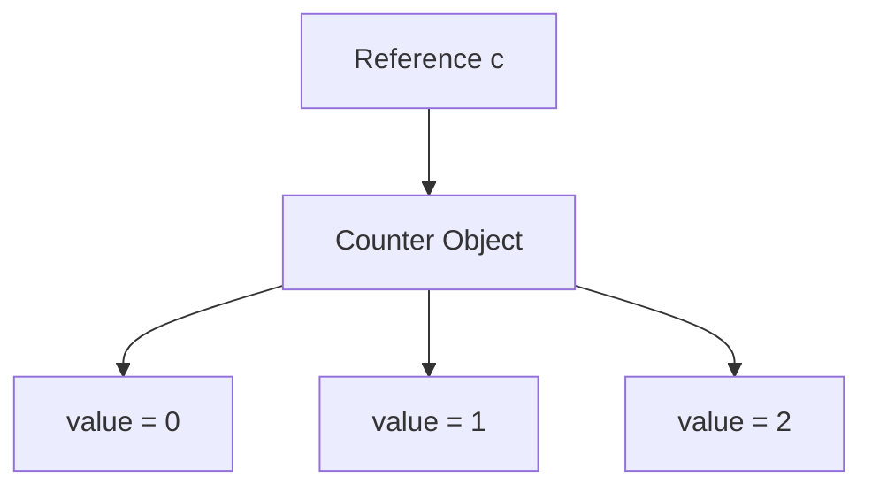
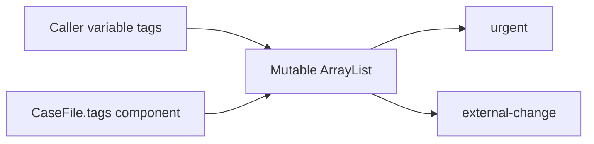
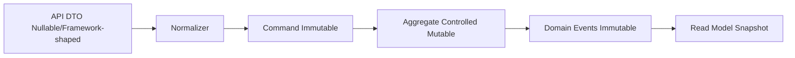

------
title: Learn Java Core Types, Data Model & Data APIs - Part 014
description: Deep engineering treatment of mutability, immutability, shallow vs deep immutability, final fields, defensive copying, collection views, records with mutable components, ownership, safe publication, and production failure modes.
series: learn-java-core-types
seriesTitle: Learn Java Core Types, Data Model & Data APIs
order: 14
partTitle: Mutability, Immutability, and Defensive Copying
tags:
- java
- mutability
- immutability
- defensive-copying
- records
- collections
- concurrency
- api-design
- advanced
date: 2026-06-27
---

# Part 014 — Mutability, Immutability, and Defensive Copying

Mutability adalah salah satu sumber bug paling mahal di Java karena bug-nya sering tidak terlihat saat object dibuat. Object tampak valid, test awal lolos, lalu beberapa baris atau beberapa thread kemudian state berubah tanpa sepengetahuan pemilik invariant.

Contoh kecil:

```java
List<String> tags = new ArrayList<>();
tags.add("urgent");

CaseFile file = new CaseFile(tags);
tags.clear();

System.out.println(file.tags()); // [] ?
```

Jika `CaseFile` menyimpan reference langsung ke list input, caller masih bisa mengubah internal state `CaseFile` dari luar.

Ini bukan bug syntax. Ini bug **ownership**.

Part ini membahas mutability bukan sebagai “gunakan `final`”, tetapi sebagai desain data ownership:

> Siapa yang boleh mengubah data, kapan perubahan boleh terjadi, siapa yang dapat melihat perubahan itu, dan invariant apa yang tetap harus benar setelah perubahan?

---

## 1. Kaufman Deconstruction

Skill besar pada part ini:

> Mampu merancang object dan API Java yang menjaga invariant melalui kontrol mutability, immutability, defensive copying, dan ownership boundary.

Sub-skill:

| Sub-skill | Yang harus dikuasai |
|---|---|
| Mutability model | Object state bisa berubah setelah dibuat |
| Immutability model | Object state tidak berubah secara observably setelah dibuat |
| `final` semantics | Reference tidak bisa diganti, object belum tentu immutable |
| Shallow vs deep immutability | Top-level immutable belum tentu isi graph immutable |
| Defensive copy | Copy saat menerima dan/atau mengembalikan mutable data |
| Unmodifiable vs immutable | View read-only berbeda dari snapshot immutable |
| Ownership | Siapa pemilik mutable object |
| Aliasing | Dua reference menunjuk object yang sama |
| Record caveat | Record tidak otomatis deeply immutable |
| Collection safety | `List.copyOf`, `Set.copyOf`, `Map.copyOf`, unmodifiable wrappers |
| Array safety | Array selalu mutable |
| Concurrency impact | Mutable shared state butuh synchronization atau isolation |
| API design | Dokumentasi mutability sebagai bagian dari contract |

Target setelah part ini:

- bisa membedakan `final`, unmodifiable, immutable, persistent, thread-safe;
- bisa melihat aliasing bug dari constructor dan accessor;
- bisa membuat record yang aman meskipun component input mutable;
- bisa memutuskan kapan copy diperlukan dan kapan tidak;
- bisa menulis API yang tidak membocorkan mutable state;
- bisa menilai collection factory mana yang memberi snapshot dan mana yang hanya view.

---

## 2. Mental Model: State, Identity, and Change

Object Java memiliki identity dan state. Jika state bisa berubah setelah object dibuat, object itu mutable.

```java
final class MutableCounter {
    private int value;

    void increment() {
        value++;
    }

    int value() {
        return value;
    }
}
```

Object `MutableCounter` memiliki identity yang sama, tetapi state berubah.

```java
MutableCounter c = new MutableCounter();
c.increment();
c.increment();
```

`c` masih reference ke object yang sama. Yang berubah adalah field `value` di dalam object.

Mental model:



Untuk immutable object, perubahan tidak terjadi pada object yang sama. Operasi menghasilkan object baru.

```java
record Money(BigDecimal amount, Currency currency) {
    Money add(Money other) {
        return new Money(amount.add(other.amount), currency);
    }
}
```

---

## 3. `final` Is Not Immutability

`final` pada variable atau field berarti reference tidak bisa diganti setelah assignment.

```java
final List<String> tags = new ArrayList<>();
tags.add("urgent"); // allowed
// tags = new ArrayList<>(); // not allowed
```

`final` melindungi binding reference, bukan object yang direferensikan.

Contoh field:

```java
final class CaseFile {
    private final List<String> tags;

    CaseFile(List<String> tags) {
        this.tags = tags;
    }
}
```

Field `tags` tidak bisa diarahkan ke list lain setelah constructor selesai. Tetapi list itu sendiri masih bisa mutable.

```java
List<String> input = new ArrayList<>();
CaseFile file = new CaseFile(input);
input.add("changed from outside");
```

Jika `CaseFile` menyimpan reference langsung, state object berubah dari luar.

Rule:

> `final` adalah bahan penting untuk immutability, tetapi bukan immutability itu sendiri.

---

## 4. Aliasing: The Root of Many Mutability Bugs

Aliasing terjadi ketika dua atau lebih reference menunjuk object yang sama.

```java
List<String> a = new ArrayList<>();
List<String> b = a;

b.add("x");
System.out.println(a); // [x]
```

Dalam API, aliasing sering tidak terlihat:

```java
record CaseFile(List<String> tags) {}

List<String> tags = new ArrayList<>();
tags.add("urgent");

CaseFile file = new CaseFile(tags);
tags.add("external-change");

System.out.println(file.tags());
```

Record hanya menyimpan reference. Record tidak otomatis membuat copy.

Mermaid:



Aliasing bukan selalu buruk. Aliasing intentional dipakai untuk shared cache, shared service, shared immutable object, dan flyweight. Tetapi aliasing mutable tanpa ownership jelas adalah bug generator.

---

## 5. Defensive Copying

Defensive copy berarti membuat copy untuk mencegah pihak lain mengubah state yang seharusnya kita kontrol.

Ada dua titik penting:

1. copy saat menerima input mutable;
2. copy atau unmodifiable snapshot saat mengembalikan internal data.

### 5.1 Copy on input

Bad:

```java
record ReviewBatch(List<ReviewItem> items) {}
```

Better:

```java
record ReviewBatch(List<ReviewItem> items) {
    ReviewBatch {
        items = List.copyOf(items);
    }
}
```

`List.copyOf` menghasilkan unmodifiable list dan menolak null elements.

### 5.2 Copy on output

Bad:

```java
final class ReviewBatch {
    private final List<ReviewItem> items = new ArrayList<>();

    List<ReviewItem> items() {
        return items;
    }
}
```

Caller bisa mengubah internal list:

```java
batch.items().clear();
```

Better:

```java
List<ReviewItem> items() {
    return List.copyOf(items);
}
```

Or expose unmodifiable view if internal mutation should be reflected intentionally:

```java
List<ReviewItem> itemsView() {
    return Collections.unmodifiableList(items);
}
```

But understand the difference between snapshot and view.

---

## 6. Unmodifiable View vs Immutable Snapshot

These are different.

### 6.1 Unmodifiable view

```java
List<String> mutable = new ArrayList<>();
mutable.add("a");

List<String> view = Collections.unmodifiableList(mutable);
mutable.add("b");

System.out.println(view); // [a, b]
```

`view` cannot be modified through `view.add(...)`, but it reflects changes to `mutable`.

### 6.2 Snapshot copy

```java
List<String> mutable = new ArrayList<>();
mutable.add("a");

List<String> snapshot = List.copyOf(mutable);
mutable.add("b");

System.out.println(snapshot); // [a]
```

`snapshot` does not reflect later changes to `mutable`.

Decision:

| Need | Use |
|---|---|
| Prevent caller from mutating through returned reference, but reflect internal changes | unmodifiable view |
| Freeze state at construction/output time | copy/snapshot |
| Share safely across threads | immutable snapshot plus safe publication |
| Preserve live read-only projection | unmodifiable view, carefully documented |

For most domain objects, prefer snapshot.

---

## 7. Shallow vs Deep Immutability

`List.copyOf` protects the list structure, not the objects inside it.

```java
record ReviewItem(String id, List<String> notes) {}

List<ReviewItem> items = List.copyOf(inputItems);
```

The list cannot add/remove/replace elements, but each `ReviewItem` must itself be immutable for deep safety.

If element is mutable:

```java
final class ReviewItem {
    private String note;

    void changeNote(String note) {
        this.note = note;
    }
}
```

Then unmodifiable list does not protect object internals:

```java
items.get(0).changeNote("changed");
```

Immutability levels:

| Level | Meaning |
|---|---|
| Reference finality | field reference cannot be reassigned |
| Structural immutability | collection structure cannot change |
| Shallow immutability | object fields cannot change, but referenced objects may |
| Deep immutability | whole reachable object graph cannot change |
| Observational immutability | external behavior appears immutable even if internal cache changes |

Deep immutability is harder. Aim for enough immutability to protect your invariants.

---

## 8. Records Are Not Deeply Immutable

Records are transparent carriers. Their components are final, but component objects can be mutable.

Bad:

```java
record CaseSnapshot(List<String> tags) {}

List<String> tags = new ArrayList<>();
tags.add("urgent");

CaseSnapshot snapshot = new CaseSnapshot(tags);
tags.clear();

System.out.println(snapshot.tags()); // []
```

Fix:

```java
record CaseSnapshot(List<String> tags) {
    CaseSnapshot {
        tags = List.copyOf(tags);
    }
}
```

Now constructor takes ownership by copying.

But if elements are mutable, you may need element-level copy:

```java
record CaseSnapshot(List<Tag> tags) {
    CaseSnapshot {
        tags = tags.stream()
            .map(Tag::copy)
            .toList();
    }
}
```

Or make `Tag` immutable.

---

## 9. Arrays Are Always Mutable

Arrays are mutable even when reference is final.

```java
record Digest(byte[] bytes) {}

byte[] raw = {1, 2, 3};
Digest digest = new Digest(raw);
raw[0] = 99;

System.out.println(digest.bytes()[0]); // 99
```

Fix with copy on input and output:

```java
record Digest(byte[] bytes) {
    Digest {
        bytes = bytes.clone();
    }

    @Override
    public byte[] bytes() {
        return bytes.clone();
    }
}
```

This is one of the rare cases where overriding a record accessor is important.

Alternative: use an immutable wrapper if available in your codebase, or represent as hex/base64 string if that is the domain representation.

---

## 10. Mutable Keys Break Hash-Based Collections

This connects directly to Part 012.

Bad:

```java
final class CaseKey {
    private String id;

    CaseKey(String id) {
        this.id = id;
    }

    void changeId(String id) {
        this.id = id;
    }

    @Override
    public boolean equals(Object o) {
        return o instanceof CaseKey other && Objects.equals(id, other.id);
    }

    @Override
    public int hashCode() {
        return Objects.hash(id);
    }
}
```

Usage:

```java
CaseKey key = new CaseKey("CASE-1");
Map<CaseKey, String> map = new HashMap<>();
map.put(key, "value");

key.changeId("CASE-2");

System.out.println(map.get(key)); // likely null
```

The key moved hash bucket logically, but HashMap did not re-index it.

Rule:

> Fields used in `equals` and `hashCode` must not mutate while object is used as hash key.

Best: make keys immutable.

```java
record CaseKey(String id) {
    CaseKey {
        Objects.requireNonNull(id, "id");
    }
}
```

---

## 11. Mutability and Sorted Collections

Mutable fields used by `compareTo` or `Comparator` can break `TreeSet` and `TreeMap`.

```java
record Task(String id, int priority) implements Comparable<Task> {
    @Override
    public int compareTo(Task other) {
        return Integer.compare(priority, other.priority);
    }
}
```

Record is immutable enough here. But if priority were mutable:

```java
final class Task {
    private int priority;
    void setPriority(int priority) { this.priority = priority; }
}
```

Then a `TreeSet<Task>` may have invalid ordering after mutation.

Rule:

> Do not mutate fields that determine collection placement while object is inside the collection.

Operational pattern:

1. remove object from collection;
2. mutate or create new object;
3. reinsert.

Immutable approach:

```java
record Task(String id, int priority) {
    Task withPriority(int newPriority) {
        return new Task(id, newPriority);
    }
}
```

---

## 12. Immutable Object Construction

A robust immutable class usually has:

- `final` class, or controlled inheritance;
- private final fields;
- constructor validation;
- defensive copy of mutable inputs;
- no mutator methods;
- no leaking mutable internals;
- immutable or defensively copied components;
- clear equality semantics.

Example:

```java
public final class CaseSummary {
    private final CaseId id;
    private final CaseStatus status;
    private final List<Violation> violations;

    public CaseSummary(CaseId id, CaseStatus status, List<Violation> violations) {
        this.id = Objects.requireNonNull(id, "id");
        this.status = Objects.requireNonNull(status, "status");
        this.violations = List.copyOf(violations);
    }

    public CaseId id() {
        return id;
    }

    public CaseStatus status() {
        return status;
    }

    public List<Violation> violations() {
        return violations;
    }
}
```

Returning `violations` directly is safe if it is an unmodifiable snapshot and `Violation` is immutable.

If `Violation` is mutable, deeper copying is required.

---

## 13. Mutable Object with Controlled Invariants

Not every object should be immutable. Some domain objects model lifecycle transitions.

```java
final class CaseAggregate {
    private final CaseId id;
    private CaseStatus status;
    private final List<DomainEvent> pendingEvents = new ArrayList<>();

    CaseAggregate(CaseId id) {
        this.id = Objects.requireNonNull(id, "id");
        this.status = CaseStatus.OPEN;
    }

    void close(UserId closedBy) {
        if (status == CaseStatus.CLOSED) {
            throw new InvalidCaseStateException(id, status);
        }
        status = CaseStatus.CLOSED;
        pendingEvents.add(new CaseClosed(id, closedBy));
    }

    List<DomainEvent> pullEvents() {
        List<DomainEvent> snapshot = List.copyOf(pendingEvents);
        pendingEvents.clear();
        return snapshot;
    }
}
```

This object is mutable, but mutation is controlled:

- fields are private;
- operations enforce invariants;
- no mutable list leaks;
- transitions are named methods;
- invalid state is rejected.

Good mutable design is not “anything can change”. It is **controlled state transition**.

---

## 14. Mutability Decision Matrix

| Use case | Recommended model |
|---|---|
| Value object | immutable record/class |
| Identifier | immutable record/class |
| DTO snapshot | immutable record with defensive copy |
| Domain aggregate lifecycle | controlled mutable object or immutable event-sourced model |
| Configuration | immutable snapshot |
| Cache | mutable internally, safe external API |
| Collection return | empty/unmodifiable snapshot |
| Binary value | defensive copy array or immutable wrapper |
| Concurrent shared state | immutable, concurrent structure, or synchronized ownership |
| Builder | mutable temporary object, validates at build |

Rule of thumb:

> Prefer immutable data for values and boundaries. Use mutability only where it represents real lifecycle or performance need, and hide it behind invariant-preserving operations.

---

## 15. Ownership Model

Ownership answers:

- who created the object?
- who may mutate it?
- who may observe mutation?
- who is responsible for preserving invariant?
- when is object safe to share?

Common ownership patterns:

| Pattern | Description |
|---|---|
| Caller retains ownership | callee must copy if storing |
| Callee takes ownership | caller must not mutate after passing; hard to enforce without copy |
| Shared immutable | safe if truly immutable |
| Internal mutable, external immutable view | common in services/caches |
| Builder owns mutation until build | result should be immutable or controlled |

Because Java reference passing does not encode ownership, defensive copy is often the simplest enforcement.

---

## 16. Copy on Input vs Trust Caller

When should you copy input?

Copy when:

- object stores input beyond method call;
- input is mutable;
- caller is outside trust boundary;
- object invariant depends on input not changing;
- object may cross thread boundary;
- data is security-sensitive;
- object participates in equality/hash;
- object represents snapshot.

Maybe do not copy when:

- method uses input only during call;
- input is known immutable by type/convention;
- performance is critical and ownership contract is explicit;
- input comes from private helper and does not escape;
- object is internal to a tightly controlled package.

Example no-store case:

```java
int totalLength(List<String> values) {
    Objects.requireNonNull(values, "values");
    return values.stream().mapToInt(String::length).sum();
}
```

No copy needed because method does not store list.

Example store case:

```java
record Batch(List<String> values) {
    Batch {
        values = List.copyOf(values);
    }
}
```

Copy needed because object stores list.

---

## 17. Copy on Output vs Return Internal Reference

Return internal reference only if it is safe.

Safe:

```java
record CaseSummary(List<Violation> violations) {
    CaseSummary {
        violations = List.copyOf(violations);
    }
}
```

Accessor returns unmodifiable snapshot stored at construction.

Unsafe:

```java
final class CaseAggregate {
    private final List<Violation> violations = new ArrayList<>();

    List<Violation> violations() {
        return violations;
    }
}
```

Fix options:

```java
List<Violation> violations() {
    return List.copyOf(violations);
}
```

or:

```java
Stream<Violation> violations() {
    return violations.stream();
}
```

Even stream can be risky if source mutates concurrently. But it prevents direct structural mutation by caller.

---

## 18. `Collections.unmodifiableX` vs `List.copyOf`

`Collections.unmodifiableList(list)` creates an unmodifiable view.

```java
List<String> source = new ArrayList<>();
List<String> view = Collections.unmodifiableList(source);
```

`List.copyOf(source)` creates an unmodifiable list containing a snapshot of elements at copy time.

```java
List<String> snapshot = List.copyOf(source);
```

Differences:

| Aspect | `Collections.unmodifiableList` | `List.copyOf` |
|---|---|---|
| Type | view wrapper | unmodifiable list instance |
| Reflects source changes | yes | no |
| Rejects null elements | no, if source already contains null | yes |
| Good for | live read-only view | immutable-ish snapshot |
| Domain object constructor | usually no | usually yes |

For domain snapshots, prefer `List.copyOf`.

---

## 19. `Stream.toList()` vs Collectors

Modern Java has `Stream.toList()`, which returns an unmodifiable list. But understand your API contract.

```java
List<String> names = people.stream()
    .map(Person::name)
    .toList();
```

This is good for result snapshots.

If you need mutable list:

```java
List<String> names = people.stream()
    .map(Person::name)
    .collect(Collectors.toCollection(ArrayList::new));
```

Do not rely on incidental implementation details. State whether returned collection is mutable or not.

---

## 20. Mutable Components in Records

Example:

```java
record SearchResult(List<CaseFile> cases, Map<CaseStatus, Long> counts) {}
```

This record is unsafe unless constructor copies.

Better:

```java
record SearchResult(List<CaseFile> cases, Map<CaseStatus, Long> counts) {
    SearchResult {
        cases = List.copyOf(cases);
        counts = Map.copyOf(counts);
    }
}
```

If `CaseFile` is mutable, `SearchResult` is only structurally immutable.

For true snapshot, map each element:

```java
record SearchResult(List<CaseSnapshot> cases, Map<CaseStatus, Long> counts) {
    SearchResult {
        cases = cases.stream()
            .map(CaseSnapshot::from)
            .toList();
        counts = Map.copyOf(counts);
    }
}
```

---

## 21. Legacy Mutable Date Types

Old Java date/time APIs such as `java.util.Date` are mutable.

Bad:

```java
final class AuditRecord {
    private final Date createdAt;

    AuditRecord(Date createdAt) {
        this.createdAt = createdAt;
    }

    Date createdAt() {
        return createdAt;
    }
}
```

Caller can mutate:

```java
Date now = new Date();
AuditRecord record = new AuditRecord(now);
now.setTime(0L);

record.createdAt().setTime(123L);
```

Fix:

```java
final class AuditRecord {
    private final Date createdAt;

    AuditRecord(Date createdAt) {
        this.createdAt = new Date(Objects.requireNonNull(createdAt, "createdAt").getTime());
    }

    Date createdAt() {
        return new Date(createdAt.getTime());
    }
}
```

Better: use `java.time.Instant`, `LocalDate`, `ZonedDateTime`, etc. These are immutable value-based time types.

```java
record AuditRecord(Instant createdAt) {
    AuditRecord {
        Objects.requireNonNull(createdAt, "createdAt");
    }
}
```

---

## 22. Mutable BigDecimal? No, But Watch Scale

`BigDecimal` is immutable. Operations return new instances.

```java
BigDecimal amount = new BigDecimal("10.00");
amount.add(new BigDecimal("1.00"));
System.out.println(amount); // 10.00
```

Need assign result:

```java
amount = amount.add(new BigDecimal("1.00"));
```

Immutability does not remove semantic caveats. `BigDecimal.equals` considers scale, so `10.0` and `10.00` are not equal by `equals` even if numerically comparable. This will be covered deeper in Part 026.

---

## 23. Immutable Does Not Mean Thread-Safe Enough for Everything

Immutable objects are generally safe to share after proper construction and publication.

```java
record CaseSummary(CaseId id, List<Violation> violations) {
    CaseSummary {
        violations = List.copyOf(violations);
    }
}
```

If `Violation` is immutable, `CaseSummary` can be safely shared conceptually.

But if immutable object contains reference to mutable object, thread safety breaks.

```java
record UnsafeSummary(List<MutableViolation> violations) {
    UnsafeSummary {
        violations = List.copyOf(violations);
    }
}
```

The list structure is immutable, but each element can mutate.

Concurrency rule:

> Safe sharing requires the reachable state used by readers to be stable or properly synchronized.

---

## 24. Safe Publication and Final Fields

Final fields help make immutable objects safely published when constructor completes properly.

```java
final class ConfigSnapshot {
    private final Map<String, String> values;

    ConfigSnapshot(Map<String, String> values) {
        this.values = Map.copyOf(values);
    }

    String value(String key) {
        return values.get(key);
    }
}
```

Avoid leaking `this` during construction:

```java
final class Bad {
    Bad(EventBus bus) {
        bus.register(this); // this escapes before constructor completes
    }
}
```

If another thread observes the object before construction completes, invariants may not be visible as expected.

Keep constructors simple and non-leaky.

---

## 25. Mutable Shared State Needs a Strategy

Options:

| Strategy | Description |
|---|---|
| Avoid sharing | each thread/request owns data |
| Immutable snapshot | share read-only object |
| Synchronization | protect mutable state with lock |
| Concurrent collections | use specialized concurrent data structures |
| Actor/queue ownership | one owner mutates, others send messages |
| Copy-on-write | readers get stable snapshot, writers copy |

Bad:

```java
class CaseCache {
    private final Map<CaseId, CaseFile> cases = new HashMap<>();

    void put(CaseFile file) {
        cases.put(file.id(), file);
    }

    CaseFile get(CaseId id) {
        return cases.get(id);
    }
}
```

Problems:

- not thread-safe;
- returns mutable `CaseFile` if mutable;
- internal map can be corrupted under concurrent writes.

Better options depend on semantics:

```java
class CaseCache {
    private final ConcurrentMap<CaseId, CaseSnapshot> cases = new ConcurrentHashMap<>();

    void put(CaseSnapshot file) {
        cases.put(file.id(), file);
    }

    Optional<CaseSnapshot> find(CaseId id) {
        return Optional.ofNullable(cases.get(id));
    }
}
```

Still must ensure `CaseSnapshot` is immutable enough.

---

## 26. Builder Pattern and Mutability Boundary

Builder is intentionally mutable.

```java
final class CaseFileBuilder {
    private CaseId id;
    private CaseStatus status;
    private final List<Violation> violations = new ArrayList<>();

    CaseFileBuilder id(CaseId id) {
        this.id = id;
        return this;
    }

    CaseFileBuilder status(CaseStatus status) {
        this.status = status;
        return this;
    }

    CaseFileBuilder addViolation(Violation violation) {
        violations.add(Objects.requireNonNull(violation, "violation"));
        return this;
    }

    CaseSnapshot build() {
        return new CaseSnapshot(
            Objects.requireNonNull(id, "id"),
            Objects.requireNonNull(status, "status"),
            violations
        );
    }
}
```

`CaseSnapshot` must still copy:

```java
record CaseSnapshot(CaseId id, CaseStatus status, List<Violation> violations) {
    CaseSnapshot {
        Objects.requireNonNull(id, "id");
        Objects.requireNonNull(status, "status");
        violations = List.copyOf(violations);
    }
}
```

Builder mutation must not leak into built object.

Test:

```java
CaseFileBuilder builder = new CaseFileBuilder()
    .id(id)
    .status(CaseStatus.OPEN)
    .addViolation(v1);

CaseSnapshot snapshot = builder.build();
builder.addViolation(v2);

assertEquals(1, snapshot.violations().size());
```

---

## 27. Snapshot vs Live View in APIs

Suppose you have a workflow engine:

```java
interface WorkflowRuntime {
    List<CaseId> activeCases();
}
```

Does this return:

- live view of active cases?
- snapshot at call time?
- mutable list caller can modify?
- sorted list?
- eventually consistent result?

Better naming:

```java
List<CaseId> activeCaseSnapshot();
```

Or documentation:

```java
/**
 * Returns an unmodifiable snapshot of active case IDs at the time of the call.
 */
List<CaseId> activeCases();
```

For live stream/event model:

```java
Flow.Publisher<CaseEvent> caseEvents();
```

Do not use collection return type to hide streaming/live semantics.

---

## 28. Mutability in Layered Architecture

A robust Java system often uses different mutability profiles per layer.



Typical design:

| Layer | Mutability profile |
|---|---|
| API DTO | may be mutable/nullable due to framework |
| Command | immutable, validated |
| Domain aggregate | controlled mutation |
| Domain event | immutable |
| Read model | immutable snapshot |
| Persistence entity | may be mutable due to ORM |
| Cache value | immutable snapshot preferred |

Do not force one mutability style everywhere. Choose based on role.

---

## 29. ORM and Framework Caveat

Some frameworks expect:

- no-arg constructor;
- mutable fields;
- setters;
- proxies;
- lazy-loaded collections.

This can conflict with immutable domain modeling.

Common strategy:

```text
Persistence Entity != Domain Model
```

Example persistence entity:

```java
class CaseEntity {
    String id;
    String status;
    String assignedOfficerId;
}
```

Domain model:

```java
record CaseFile(CaseId id, CaseStatus status, AssignmentStatus assignmentStatus) {}
```

Mapper normalizes:

```java
CaseFile toDomain(CaseEntity entity) {
    return new CaseFile(
        new CaseId(entity.id),
        CaseStatus.valueOf(entity.status),
        entity.assignedOfficerId == null
            ? new Unassigned()
            : new Assigned(new OfficerId(entity.assignedOfficerId))
    );
}
```

This prevents framework mutability from leaking into business logic.

---

## 30. Performance Trade-offs of Copying

Defensive copying has cost:

- allocation;
- iteration;
- memory pressure;
- GC impact;
- deep copy complexity.

But not copying has risk:

- invariant corruption;
- security bug;
- data race;
- flaky tests;
- wrong audit/report;
- collection corruption;
- long debugging sessions.

Engineering trade-off:

| Situation | Copy bias |
|---|---|
| Public API boundary | strong copy bias |
| Domain value object | strong copy bias |
| Internal hot loop | measure first |
| Large immutable input | avoid redundant copy if contract reliable |
| Security-sensitive bytes | always copy |
| Cross-thread handoff | immutable snapshot or synchronization |

Do not guess performance. Measure with realistic data before weakening invariants.

---

## 31. Escape Analysis: Useful But Not a Design Contract

JVM may optimize allocations through escape analysis. For example, short-lived objects may be scalar-replaced or stack-allocated internally by the JIT.

But application code should not depend on this for correctness.

Good design:

```java
record Point(int x, int y) {}
```

Using many small immutable values is often acceptable, especially if it improves correctness. If performance becomes a problem, profile. Do not prematurely make everything mutable.

Rule:

> Design for correct ownership first. Optimize measured hotspots second.

---

## 32. Copy Depth Strategy

When copying an object graph, choose required depth.

| Copy type | Meaning | Example |
|---|---|---|
| No copy | share same object | internal trusted helper |
| Shallow copy | copy collection structure only | `List.copyOf(items)` |
| Element copy | copy each element | `items.stream().map(Item::copy).toList()` |
| Deep copy | recursively copy object graph | complex aggregate snapshot |
| Serialization copy | copy via serialization/deserialization | usually slow and brittle |

Example element copy:

```java
record MutableLineItem(String sku, int quantity) {
    MutableLineItem withQuantity(int quantity) {
        return new MutableLineItem(sku, quantity);
    }
}

record OrderSnapshot(List<MutableLineItem> items) {
    OrderSnapshot {
        items = items.stream()
            .map(item -> new MutableLineItem(item.sku(), item.quantity()))
            .toList();
    }
}
```

Better: make `LineItem` immutable and avoid copying elements.

---

## 33. Designing Immutable Value Objects

Example value object:

```java
public record EmailAddress(String value) {
    public EmailAddress {
        Objects.requireNonNull(value, "value");
        value = value.trim();
        if (!value.contains("@")) {
            throw new IllegalArgumentException("invalid email address");
        }
        value = value.toLowerCase(Locale.ROOT);
    }
}
```

Properties:

- canonicalizes input;
- rejects invalid data;
- final component;
- no mutator;
- equality based on canonical value.

Note: email normalization is domain-sensitive. The example is simplified; real systems may need more careful handling.

Immutable value object checklist:

- validates required fields;
- canonicalizes representation;
- uses immutable components;
- copies mutable inputs;
- exposes no mutable internals;
- implements equality consistent with domain;
- avoids identity-sensitive behavior.

---

## 34. Designing Controlled Mutable Aggregates

Example aggregate:

```java
final class EnforcementCase {
    private final CaseId id;
    private CaseStatus status;
    private AssignmentStatus assignmentStatus;
    private final List<DomainEvent> pendingEvents;

    EnforcementCase(CaseId id) {
        this.id = Objects.requireNonNull(id, "id");
        this.status = CaseStatus.OPEN;
        this.assignmentStatus = new Unassigned();
        this.pendingEvents = new ArrayList<>();
    }

    void assign(OfficerId officerId) {
        Objects.requireNonNull(officerId, "officerId");
        if (status == CaseStatus.CLOSED) {
            throw new InvalidCaseStateException(id, status);
        }
        assignmentStatus = new Assigned(officerId);
        pendingEvents.add(new CaseAssigned(id, officerId));
    }

    CaseSnapshot snapshot() {
        return new CaseSnapshot(id, status, assignmentStatus);
    }

    List<DomainEvent> pullPendingEvents() {
        List<DomainEvent> copy = List.copyOf(pendingEvents);
        pendingEvents.clear();
        return copy;
    }
}
```

Properties:

- mutation only through methods;
- methods enforce lifecycle rules;
- no setter soup;
- no internal list leak;
- snapshot is immutable;
- pending events are drained safely.

This is mutable design with clear boundaries.

---

## 35. API Documentation for Mutability

Document mutability when ambiguity matters.

Bad:

```java
List<Violation> violations();
```

Better:

```java
/**
 * Returns an unmodifiable snapshot of violations at the time this object was created.
 * The returned list contains no null elements.
 */
List<Violation> violations();
```

Or encode in name:

```java
List<Violation> violationSnapshot();
```

For mutable result:

```java
/**
 * Returns a mutable copy. Changes to the returned list do not affect this object.
 */
List<Violation> mutableViolationCopy();
```

API users should not need to inspect source code to know whether mutation is safe.

---

## 36. Common Failure Modes

### 36.1 Constructor stores mutable input

```java
this.items = items;
```

Fix:

```java
this.items = List.copyOf(items);
```

### 36.2 Accessor leaks mutable internal list

```java
return items;
```

Fix:

```java
return List.copyOf(items);
```

or return precomputed unmodifiable snapshot.

### 36.3 Record component is mutable

```java
record Payload(byte[] data) {}
```

Fix:

```java
record Payload(byte[] data) {
    Payload { data = data.clone(); }
    @Override public byte[] data() { return data.clone(); }
}
```

### 36.4 Unmodifiable view mistaken for immutable snapshot

```java
this.items = Collections.unmodifiableList(items);
```

If `items` changes elsewhere, `this.items` changes.

Fix:

```java
this.items = List.copyOf(items);
```

### 36.5 Mutable key in HashMap

Fields used in hash change after insertion.

Fix: immutable key.

### 36.6 Mutable object shared across threads

No synchronization or immutable boundary.

Fix: immutable snapshot, concurrent structure, or explicit lock.

---

## 37. Testing Mutability Contracts

Test mutability explicitly.

### Test constructor copy

```java
@Test
void constructorCopiesInputList() {
    List<String> input = new ArrayList<>();
    input.add("a");

    Tags tags = new Tags(input);
    input.add("b");

    assertEquals(List.of("a"), tags.values());
}
```

### Test accessor safety

```java
@Test
void accessorDoesNotAllowMutation() {
    Tags tags = new Tags(List.of("a"));

    assertThrows(UnsupportedOperationException.class, () -> tags.values().add("b"));
}
```

### Test array copy

```java
@Test
void digestCopiesArrayOnInputAndOutput() {
    byte[] raw = {1, 2};
    Digest digest = new Digest(raw);

    raw[0] = 9;
    assertArrayEquals(new byte[] {1, 2}, digest.bytes());

    byte[] exposed = digest.bytes();
    exposed[0] = 7;
    assertArrayEquals(new byte[] {1, 2}, digest.bytes());
}
```

### Test builder isolation

```java
@Test
void builtObjectIsIndependentFromBuilder() {
    CaseFileBuilder builder = new CaseFileBuilder().addTag("a");
    CaseSnapshot snapshot = builder.build();

    builder.addTag("b");

    assertEquals(List.of("a"), snapshot.tags());
}
```

---

## 38. Code Review Rubric

Use this rubric for Java model classes.

### Constructor/factory

- Does it store mutable input directly?
- Does it validate non-null required fields?
- Does it reject null collection elements?
- Does it canonicalize input if needed?

### Fields

- Are required fields final where possible?
- Are mutable fields private?
- Are fields used in equality/hash immutable?
- Is lifecycle mutation controlled?

### Accessors

- Do accessors expose mutable internals?
- Is returned collection snapshot or live view?
- Is mutability documented?

### Records

- Are mutable components defensively copied?
- Are array components cloned on input/output?
- Are record components deeply immutable enough?

### Collections

- Is `List.copyOf`/`Set.copyOf`/`Map.copyOf` appropriate?
- Is `Collections.unmodifiableX` accidentally used where snapshot is required?
- Are null elements allowed intentionally?

### Concurrency

- Can object cross thread boundary?
- Is shared mutable state protected?
- Is safe publication considered?

### Performance

- Is copying on hot path measured?
- Is correctness being sacrificed based on unproven assumptions?

---

## 39. Practice Drill

### Drill 1 — Fix a leaking record

Start:

```java
record Report(List<String> lines) {}
```

Requirements:

- constructor rejects null list;
- constructor rejects null elements;
- external mutation of input list does not affect report;
- returned list cannot be modified.

Implement and test.

### Drill 2 — Fix byte array value object

Start:

```java
record Signature(byte[] bytes) {}
```

Requirements:

- clone input;
- clone output;
- validate length;
- implement hex display method;
- test input/output mutation.

### Drill 3 — Mutable aggregate with immutable snapshot

Implement:

- `EnforcementCase` mutable aggregate;
- `CaseSnapshot` immutable record;
- assignment transition;
- close transition;
- pending event list;
- `snapshot()` method;
- tests proving no internal list leaks.

### Drill 4 — Unmodifiable view vs snapshot

Write two examples:

- one using `Collections.unmodifiableList`;
- one using `List.copyOf`.

Mutate the original list and explain different output.

### Drill 5 — Mutable key disaster

Create mutable key class, insert into `HashMap`, mutate it, observe lookup failure. Then refactor to immutable record.

---

## 40. Core Takeaways

- Mutability is about who can change state and who can observe that change.
- `final` prevents reassignment, not mutation of referenced objects.
- Aliasing mutable objects without ownership clarity creates hidden coupling.
- Records are not deeply immutable by default.
- Arrays are always mutable; clone on input and output for value objects.
- `Collections.unmodifiableList` is a view; `List.copyOf` is a snapshot-like unmodifiable copy.
- Shallow immutability may be enough for some invariants, but not all.
- Mutable keys can break hash-based and sorted collections.
- Controlled mutable aggregates are valid when mutation represents lifecycle transitions.
- Immutable snapshots are excellent for boundaries, events, read models, cache values, and cross-thread sharing.
- Defensive copying is a correctness tool first and a performance trade-off second.

The deeper rule:

> A top-tier Java engineer treats mutability as an explicit API contract, not an implementation accident.

---

## 41. References

- Java SE 25 API — `java.util.List`
- Java SE 25 API — `java.util.Set`
- Java SE 25 API — `java.util.Map`
- Java SE 25 API — `java.util.Collections`
- Java SE 25 API — `java.util.Objects`
- Java SE 25 API — `java.time` package
- Java Language Specification, Java SE 25 — Classes, fields, final variables, and records
