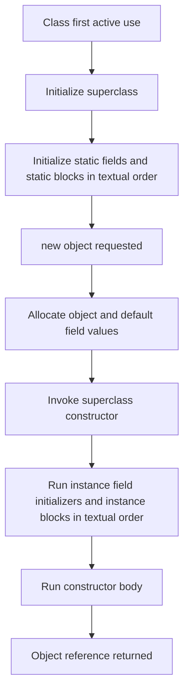
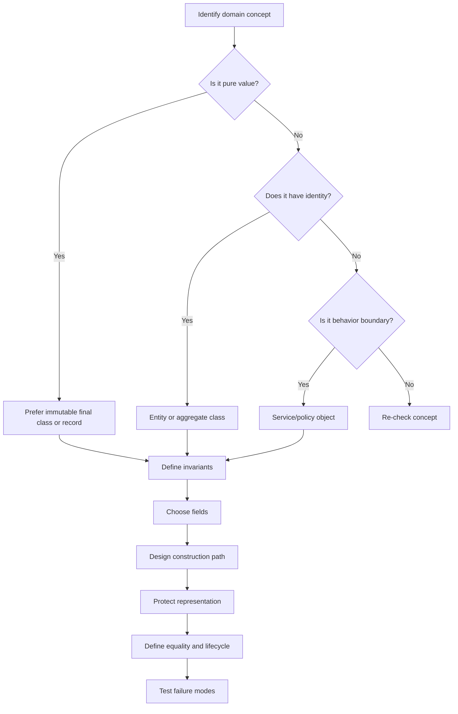

------
title: Learn Java Core Types, Data Model & Data APIs - Part 015
description: Deep engineering treatment of class as a data model in Java: fields, constructors, initialization, invariants, representation hiding, identity, factories, validation, lifecycle, and production failure modes.
series: learn-java-core-types
seriesTitle: Learn Java Core Types, Data Model & Data APIs
order: 15
partTitle: Class as a Data Model
tags:
- java
- class
- object-model
- data-modeling
- invariants
- constructors
- api-design
- encapsulation
- advanced
date: 2026-06-27
---

# Part 015 — Class as a Data Model

> Target skill: mampu menggunakan `class` bukan sekadar sebagai wadah field dan method, tetapi sebagai **unit representasi data yang menjaga invariant, lifecycle, ownership, mutability, identity, dan boundary API**.

Kita sudah membahas:

- value, variable, reference, object;
- primitive/reference type;
- null dan absence;
- mutability dan defensive copying;
- equality dan comparison.

Sekarang kita masuk ke bentuk paling fleksibel dalam Java: `class`.

Class adalah alat yang sangat kuat. Justru karena terlalu fleksibel, class juga mudah berubah menjadi:

- DTO bocor tanpa invariant;
- service object yang menyimpan state global diam-diam;
- entity yang equality-nya salah;
- mutable aggregate yang tidak jelas ownership-nya;
- object yang validasinya tersebar di controller, service, repository, dan UI.

Top engineer tidak melihat class sebagai “template object”. Mereka melihat class sebagai **boundary tempat data mentah berubah menjadi model yang punya aturan**.

---

## 1. Kaufman Deconstruction

Dalam gaya Josh Kaufman, skill “menguasai class sebagai data model” kita pecah menjadi sub-skill kecil:

| Sub-skill | Yang harus dikuasai |
|---|---|
| Representation | Field apa yang disimpan, field apa yang dihitung, field apa yang tidak boleh ada |
| Construction | Bagaimana object masuk ke state valid sejak awal |
| Invariant | Kondisi apa yang selalu benar sepanjang umur object |
| Encapsulation | Bagaimana internal representation disembunyikan dari caller |
| Identity | Object ini value object, entity, aggregate, service, atau policy? |
| Mutability | State berubah atau tidak; jika berubah, siapa yang boleh mengubahnya |
| Lifecycle | State transition apa yang legal |
| Equality | Equality berbasis identity, logical value, atau database identity |
| Boundary | Bagaimana class berinteraksi dengan JSON, DB, framework, dan API layer |
| Failure modeling | Apa bug yang terjadi jika class dipakai salah |

Tujuan part ini bukan “bisa membuat class”. Itu sudah basic.

Tujuan part ini adalah bisa menjawab:

> “Apakah representasi data ini membuat illegal state impossible, atau justru memindahkan kompleksitas ke semua pemanggil?”

---

## 2. Mental Model: Class as Invariant Boundary

Class yang baik bukan hanya menyimpan data.

Class yang baik menjaga agar object berada di state yang masuk akal.

```java
final class EmailAddress {
    private final String value;

    public EmailAddress(String value) {
        if (value == null || value.isBlank()) {
            throw new IllegalArgumentException("email is required");
        }
        if (!value.contains("@")) {
            throw new IllegalArgumentException("invalid email: " + value);
        }
        this.value = value.toLowerCase(Locale.ROOT);
    }

    public String value() {
        return value;
    }
}
```

Class ini melakukan tiga hal:

1. menerima input yang mungkin buruk;
2. menolak input yang tidak valid;
3. menyimpan representation yang sudah normal.

Setelah constructor selesai, object berada dalam invariant:

```text
EmailAddress.value != null
EmailAddress.value is not blank
EmailAddress.value contains '@'
EmailAddress.value is normalized with Locale.ROOT
```

Itulah inti class sebagai data model.

---

## 3. Class Is More Than a Record

Record cocok untuk transparent data carrier.

Class cocok ketika kita butuh kontrol lebih besar atas:

- identity;
- lifecycle;
- inheritance;
- lazy computation;
- mutable internal state;
- non-transparent representation;
- framework compatibility;
- multiple constructors atau factory methods;
- subclassing strategy;
- serialization compatibility;
- encapsulation yang tidak ingin “membuka” semua komponen data.

Contoh:

```java
record Money(BigDecimal amount, Currency currency) {}
```

Record ini terlihat ringkas, tapi masih punya masalah:

- `amount` bisa null;
- `currency` bisa null;
- scale `BigDecimal` bisa tidak normal;
- amount negatif mungkin tidak legal untuk beberapa domain;
- rounding rule tidak jelas.

Class memberi ruang untuk menyembunyikan representation:

```java
public final class Money {
    private final BigDecimal amount;
    private final Currency currency;

    private Money(BigDecimal amount, Currency currency) {
        this.amount = amount;
        this.currency = currency;
    }

    public static Money of(BigDecimal amount, Currency currency) {
        Objects.requireNonNull(amount, "amount");
        Objects.requireNonNull(currency, "currency");

        BigDecimal normalized = amount.setScale(currency.getDefaultFractionDigits(), RoundingMode.UNNECESSARY);
        return new Money(normalized, currency);
    }

    public BigDecimal amount() {
        return amount;
    }

    public Currency currency() {
        return currency;
    }
}
```

Sekarang caller tidak bebas membuat `Money` dalam state sembarang.

---

## 4. Anatomy of a Data-Oriented Class

Secara teknis, class declaration bisa memiliki:

- modifier;
- type parameter;
- superclass;
- implemented interfaces;
- fields;
- methods;
- constructors;
- instance initializers;
- static initializers;
- nested classes/interfaces/records/enums.

Secara engineering, data-oriented class biasanya punya struktur seperti ini:

```java
public final class CustomerId {
    private final UUID value;

    private CustomerId(UUID value) {
        this.value = value;
    }

    public static CustomerId of(UUID value) {
        return new CustomerId(Objects.requireNonNull(value, "value"));
    }

    public static CustomerId parse(String raw) {
        Objects.requireNonNull(raw, "raw");
        return of(UUID.fromString(raw));
    }

    public UUID value() {
        return value;
    }

    @Override
    public boolean equals(Object other) {
        return other instanceof CustomerId that && value.equals(that.value);
    }

    @Override
    public int hashCode() {
        return value.hashCode();
    }

    @Override
    public String toString() {
        return value.toString();
    }
}
```

Perhatikan keputusan desainnya:

| Keputusan | Dampak |
|---|---|
| `final class` | Tidak ada subclass yang bisa melemahkan invariant |
| `private final UUID value` | Representation tidak bocor |
| private constructor | Semua pembuatan lewat factory |
| `parse(String)` | Boundary text dibuat eksplisit |
| `of(UUID)` | Boundary typed dibuat eksplisit |
| equality override | Value object equality |
| no setter | Immutable |

Ini bukan “pattern”. Ini representasi data yang defensible.

---

## 5. Field as Representation, Not Just Storage

Field adalah internal representation.

Kesalahan umum: field dianggap sebagai “kolom data”. Padahal field adalah keputusan desain.

```java
public final class PeriodRange {
    private final LocalDate startInclusive;
    private final LocalDate endExclusive;
}
```

Mengapa `endExclusive`, bukan `endInclusive`?

Karena interval half-open sering lebih mudah untuk:

- menghitung durasi;
- menggabungkan range;
- menghindari double-count boundary;
- membuat query database `>= start AND < end`;
- menangani waktu tanpa membuat “akhir hari” palsu.

Field name adalah dokumentasi invariant.

Buruk:

```java
private LocalDate start;
private LocalDate end;
```

Lebih baik:

```java
private final LocalDate startInclusive;
private final LocalDate endExclusive;
```

Nama field harus membantu reviewer memahami rule, bukan hanya tipe.

---

## 6. Field Categories

Dalam class data model, field biasanya masuk kategori berikut:

| Kategori | Contoh | Catatan |
|---|---|---|
| Intrinsic state | `customerId`, `createdAt` | Bagian inti object |
| Derived state | `totalAmount` dari line items | Bisa dihitung, hati-hati cache |
| Cached state | computed hash, parsed form | Butuh invalidation jika mutable |
| Configuration | `Clock`, `RoundingMode` | Bisa dependency, bukan domain state |
| Technical state | version, lock token | Perlu dipisahkan dari business meaning |
| Framework state | ORM id, audit fields | Jangan mencemari domain rule bila bisa diisolasi |

Rule penting:

> Jangan menyimpan field jika field itu bisa dihitung murah, kecuali ada alasan performa, consistency, atau boundary snapshot.

Contoh buruk:

```java
final class Order {
    private final List<OrderLine> lines;
    private BigDecimal total; // rawan stale
}
```

Jika `lines` berubah tapi `total` tidak ikut berubah, object rusak.

Pilihan lebih aman:

```java
final class Order {
    private final List<OrderLine> lines;

    BigDecimal total() {
        return lines.stream()
                .map(OrderLine::subtotal)
                .reduce(BigDecimal.ZERO, BigDecimal::add);
    }
}
```

Atau jika harus cache:

```java
final class Order {
    private final List<OrderLine> lines;
    private final BigDecimal total;

    Order(List<OrderLine> lines) {
        this.lines = List.copyOf(lines);
        this.total = calculateTotal(this.lines);
    }
}
```

Cache immutable lebih aman daripada cache mutable.

---

## 7. Access Modifiers as Boundary Design

Access modifier bukan detail syntax. Ia adalah arsitektur boundary.

| Modifier | Meaning dalam desain |
|---|---|
| `private` | Internal representation, tidak untuk caller |
| package-private | Kolaborasi dalam modul/paket yang sama |
| `protected` | Extension hook; sangat hati-hati |
| `public` | Kontrak stabil untuk external caller |

Default yang baik:

```java
private final Field field;
```

Bukan:

```java
public Field field;
```

Public field membuat invariant tidak bisa dijaga.

```java
public class Account {
    public BigDecimal balance;
}
```

Caller bisa melakukan ini:

```java
account.balance = new BigDecimal("-999999999");
```

Jika balance punya rule, class harus menjaga rule itu:

```java
public final class Account {
    private BigDecimal balance;

    public void deposit(BigDecimal amount) {
        requirePositive(amount);
        balance = balance.add(amount);
    }

    public void withdraw(BigDecimal amount) {
        requirePositive(amount);
        if (balance.compareTo(amount) < 0) {
            throw new IllegalStateException("insufficient funds");
        }
        balance = balance.subtract(amount);
    }
}
```

---

## 8. Constructor Is the First Invariant Gate

Constructor adalah gate pertama.

Setelah constructor selesai, object seharusnya valid.

Buruk:

```java
public final class DateRange {
    private final LocalDate start;
    private final LocalDate end;

    public DateRange(LocalDate start, LocalDate end) {
        this.start = start;
        this.end = end;
    }
}
```

Masalah:

- `start` bisa null;
- `end` bisa null;
- `end` bisa sebelum `start`;
- inclusivity tidak jelas.

Lebih baik:

```java
public final class DateRange {
    private final LocalDate startInclusive;
    private final LocalDate endExclusive;

    public DateRange(LocalDate startInclusive, LocalDate endExclusive) {
        this.startInclusive = Objects.requireNonNull(startInclusive, "startInclusive");
        this.endExclusive = Objects.requireNonNull(endExclusive, "endExclusive");

        if (!startInclusive.isBefore(endExclusive)) {
            throw new IllegalArgumentException("startInclusive must be before endExclusive");
        }
    }
}
```

Invariant:

```text
startInclusive != null
endExclusive != null
startInclusive < endExclusive
```

---

## 9. Constructor Should Not Do Too Much

Constructor harus membuat object valid, tapi bukan berarti constructor boleh melakukan semua hal.

Hindari constructor yang:

- melakukan network call;
- membaca file;
- query database;
- menjalankan logic lama;
- publish `this` ke thread lain;
- memanggil method overridable;
- mendaftarkan object ke global registry;
- memulai background thread.

Buruk:

```java
public class CustomerProfile {
    public CustomerProfile(String customerId) {
        this.customer = apiClient.fetchCustomer(customerId); // side effect besar
    }
}
```

Lebih baik pisahkan acquisition dari representation:

```java
public final class CustomerProfile {
    private final CustomerId customerId;
    private final String displayName;

    public CustomerProfile(CustomerId customerId, String displayName) {
        this.customerId = Objects.requireNonNull(customerId);
        this.displayName = requireNonBlank(displayName);
    }
}
```

Fetching dilakukan service/factory di luar:

```java
CustomerDto dto = api.fetch(id);
CustomerProfile profile = mapper.toProfile(dto);
```

Class data model sebaiknya tidak diam-diam melakukan I/O.

---

## 10. Initialization Order

Untuk class non-trivial, initialization order penting.

Secara mental:



Contoh:

```java
class Example {
    private final int a = initA();
    private final int b;

    {
        System.out.println("instance block");
    }

    Example(int b) {
        this.b = b;
    }

    private int initA() {
        return 10;
    }
}
```

Urutan untuk object baru:

1. memory dialokasikan;
2. field mendapat default value (`0`, `null`, `false`);
3. superclass constructor berjalan;
4. field initializer dan instance initializer berjalan sesuai urutan teks;
5. constructor body berjalan.

Practical rule:

> Untuk data model, lebih mudah audit jika semua validasi dan assignment utama ada di constructor/factory, bukan tersebar di initializer block.

---

## 11. Default Values Are Dangerous for Domain State

Sebelum constructor body berjalan, field punya default value.

| Type field | Default value |
|---|---|
| numeric primitive | `0` atau `0.0` |
| `boolean` | `false` |
| `char` | `\u0000` |
| reference | `null` |

Default value bisa berbahaya jika dianggap domain value.

```java
class Penalty {
    private int count; // default 0
}
```

Apakah `0` berarti:

- belum dihitung?
- tidak ada penalty?
- data missing?
- default sistem?

Jika state penting, buat eksplisit:

```java
final class PenaltyCount {
    private final int value;

    PenaltyCount(int value) {
        if (value < 0) {
            throw new IllegalArgumentException("penalty count cannot be negative");
        }
        this.value = value;
    }
}
```

---

## 12. Static State Is Class-Level State

Static field bukan milik object. Ia milik class.

Baik:

```java
private static final Pattern EMAIL_PATTERN = Pattern.compile("^[^@]+@[^@]+$");
```

Buruk:

```java
public static List<String> errors = new ArrayList<>();
```

Static mutable state menimbulkan:

- shared global state;
- test pollution;
- race condition;
- order-dependent behavior;
- hidden dependency;
- memory leak.

Jika butuh constant, pastikan benar-benar immutable:

```java
public static final Set<String> SUPPORTED_COUNTRIES = Set.of("ID", "SG", "MY");
```

Hati-hati:

```java
public static final List<String> VALUES = new ArrayList<>(); // final reference, mutable object
```

`final` hanya membuat reference tidak bisa diganti, bukan object tidak bisa berubah.

---

## 13. `this` Escapes During Construction

Jangan biarkan `this` keluar sebelum constructor selesai.

Buruk:

```java
public class ListenerHolder {
    public ListenerHolder(EventBus bus) {
        bus.register(this);
    }
}
```

Masalah:

- event bisa diterima sebelum object lengkap;
- subclass belum initialized;
- final field semantics bisa terganggu secara konseptual;
- invariant belum stabil.

Lebih aman:

```java
public final class ListenerHolder {
    private final EventBus bus;

    public ListenerHolder(EventBus bus) {
        this.bus = Objects.requireNonNull(bus);
    }

    public void start() {
        bus.register(this);
    }
}
```

Pisahkan construction dari activation.

---

## 14. Do Not Call Overridable Methods from Constructors

Ini bug klasik.

```java
class Base {
    Base() {
        validate();
    }

    void validate() {}
}

class Child extends Base {
    private final String name;

    Child(String name) {
        this.name = name;
    }

    @Override
    void validate() {
        System.out.println(name.length()); // name masih null saat Base constructor berjalan
    }
}
```

Saat `Base()` memanggil `validate()`, dynamic dispatch mengarah ke `Child.validate()`, padahal field `Child` belum initialized.

Rule:

> Constructor sebaiknya hanya memanggil private/final/static helper yang tidak overridable.

```java
public final class UserName {
    private final String value;

    public UserName(String value) {
        this.value = normalizeAndValidate(value);
    }

    private static String normalizeAndValidate(String raw) {
        String normalized = Objects.requireNonNull(raw).trim();
        if (normalized.isEmpty()) {
            throw new IllegalArgumentException("username is required");
        }
        return normalized;
    }
}
```

---

## 15. Factory Methods as Named Construction Paths

Constructor punya keterbatasan: namanya selalu sama dengan class.

Factory method memberi nama pada intent.

```java
public final class CaseId {
    private final UUID value;

    private CaseId(UUID value) {
        this.value = value;
    }

    public static CaseId of(UUID value) {
        return new CaseId(Objects.requireNonNull(value));
    }

    public static CaseId random() {
        return new CaseId(UUID.randomUUID());
    }

    public static CaseId parse(String raw) {
        return of(UUID.fromString(raw));
    }
}
```

Keuntungan:

- nama construction path eksplisit;
- bisa return subtype atau cached object;
- bisa validasi dan normalisasi;
- bisa menyembunyikan constructor;
- bisa membedakan `of`, `from`, `parse`, `random`, `existing`, `newDraft`, dll.

Gunakan constructor publik jika pembuatan object sederhana dan tidak ambigu.

Gunakan factory jika:

- ada beberapa cara membuat object;
- perlu nama intent;
- ada validation path berbeda;
- representation ingin disembunyikan;
- object mungkin cached/singleton;
- ingin menghindari overload dengan parameter type sama.

---

## 16. Constructor Overload Can Hide Ambiguity

Buruk:

```java
public final class TimeWindow {
    public TimeWindow(LocalDateTime start, LocalDateTime end) {}
    public TimeWindow(Instant start, Instant end) {}
    public TimeWindow(String start, String end) {}
}
```

Caller mungkin tidak tahu semantic-nya.

Lebih eksplisit:

```java
public final class TimeWindow {
    public static TimeWindow local(LocalDateTime start, LocalDateTime end, ZoneId zone) {}
    public static TimeWindow instant(Instant start, Instant end) {}
    public static TimeWindow parseIsoInstantRange(String start, String end) {}
}
```

Factory method mengurangi ambiguity karena nama membawa semantic.

---

## 17. Invariant Taxonomy

Invariant bisa bermacam-macam.

| Jenis invariant | Contoh |
|---|---|
| Nullability | `id != null` |
| Range | `amount >= 0` |
| Ordering | `start < end` |
| Cardinality | `items.size() >= 1` |
| Format | email memiliki `@` |
| Normalization | country code uppercase |
| Cross-field | `closedAt != null` hanya jika status closed |
| Lifecycle | closed case tidak bisa reopened kecuali rule tertentu |
| Ownership | list internal tidak bisa dimodifikasi caller |
| Temporal | due date tidak boleh sebelum created date |

Class adalah tempat ideal untuk invariant yang melekat pada data.

---

## 18. Make Illegal States Unrepresentable

Bandingkan dua model.

Model lemah:

```java
public final class EnforcementCase {
    private final String status;
    private final Instant submittedAt;
    private final Instant approvedAt;
    private final Instant rejectedAt;
}
```

Masalah:

- `status = "APPROVED"` tapi `approvedAt = null`;
- `approvedAt` dan `rejectedAt` sama-sama terisi;
- status typo;
- rule lifecycle tersebar.

Lebih kuat:

```java
enum CaseStatus {
    DRAFT,
    SUBMITTED,
    APPROVED,
    REJECTED
}

public final class EnforcementCase {
    private final CaseId id;
    private final CaseStatus status;
    private final Instant submittedAt;
    private final Instant terminalAt;

    private EnforcementCase(CaseId id, CaseStatus status, Instant submittedAt, Instant terminalAt) {
        this.id = Objects.requireNonNull(id);
        this.status = Objects.requireNonNull(status);
        this.submittedAt = submittedAt;
        this.terminalAt = terminalAt;
        validateState();
    }

    private void validateState() {
        if (status == CaseStatus.DRAFT && submittedAt != null) {
            throw new IllegalArgumentException("draft case cannot have submittedAt");
        }
        if ((status == CaseStatus.APPROVED || status == CaseStatus.REJECTED) && terminalAt == null) {
            throw new IllegalArgumentException("terminal case must have terminalAt");
        }
    }
}
```

Lebih kuat lagi nanti bisa memakai sealed hierarchy, tapi class biasa pun sudah bisa menjaga banyak invariant.

---

## 19. Lifecycle Methods Should Preserve Invariants

Jika class mutable atau transition-oriented, method harus menjaga invariant.

Buruk:

```java
caseObj.setStatus(CaseStatus.APPROVED);
caseObj.setApprovedAt(clock.instant());
```

Jika call kedua gagal, object setengah approved.

Lebih baik:

```java
public EnforcementCase approve(Actor actor, Clock clock) {
    requireSubmitted();
    return new EnforcementCase(
            id,
            CaseStatus.APPROVED,
            submittedAt,
            clock.instant()
    );
}
```

Atau mutable controlled:

```java
public void approve(Actor actor, Clock clock) {
    requireSubmitted();
    this.status = CaseStatus.APPROVED;
    this.terminalAt = clock.instant();
}
```

Kuncinya: satu method harus melakukan transition atomik pada level object invariant.

---

## 20. Command Methods Beat Generic Setters

Generic setters melemahkan model.

Buruk:

```java
caseObj.setStatus(CaseStatus.REJECTED);
caseObj.setTerminalAt(now);
caseObj.setRejectionReason(reason);
```

Lebih baik:

```java
caseObj.reject(reason, actor, clock);
```

Command method bisa menegakkan:

- hanya submitted case yang bisa rejected;
- reason wajib;
- actor punya role;
- terminal time diambil dari `Clock`;
- audit event dibuat.

Setter hanya mengubah field. Command method mengubah state berdasarkan rule.

---

## 21. Getter Is Not Always Harmless

Getter bisa membocorkan representation.

Buruk:

```java
public List<OrderLine> getLines() {
    return lines;
}
```

Caller bisa:

```java
order.getLines().clear();
```

Lebih baik:

```java
public List<OrderLine> lines() {
    return List.copyOf(lines);
}
```

Atau jika internal sudah immutable:

```java
private final List<OrderLine> lines;

public Order(List<OrderLine> lines) {
    this.lines = List.copyOf(lines);
}

public List<OrderLine> lines() {
    return lines;
}
```

Karena `lines` sudah snapshot unmodifiable, return langsung aman secara mutability boundary.

---

## 22. JavaBeans Are Boundary Shape, Not Domain Model by Default

JavaBeans style sering dipakai framework:

```java
public class CustomerDto {
    private String id;
    private String name;

    public CustomerDto() {}

    public String getId() { return id; }
    public void setId(String id) { this.id = id; }

    public String getName() { return name; }
    public void setName(String name) { this.name = name; }
}
```

Ini cocok untuk:

- serialization;
- deserialization;
- UI binding;
- framework mapping;
- generated schema;
- external boundary.

Tapi sebagai domain model, JavaBean sering lemah:

- object bisa dibuat kosong;
- field bisa diubah sembarang;
- invariant tidak dijaga;
- invalid state mudah muncul.

Boundary DTO boleh lemah jika segera dikonversi ke domain object kuat.

```java
CustomerDto dto = json.read(...);
Customer customer = Customer.create(CustomerId.parse(dto.getId()), Name.of(dto.getName()));
```

Jangan biarkan DTO bocor menjadi domain model utama.

---

## 23. Value Object with Class

Value object tidak harus record.

Class lebih baik jika:

- representation ingin disembunyikan;
- constructor/factory logic kompleks;
- equality custom;
- caching diperlukan;
- normalisasi non-trivial;
- future compatibility penting.

Contoh:

```java
public final class CountryCode {
    private final String value;

    private CountryCode(String value) {
        this.value = value;
    }

    public static CountryCode of(String raw) {
        String normalized = Objects.requireNonNull(raw, "raw").trim().toUpperCase(Locale.ROOT);
        if (!normalized.matches("[A-Z]{2}")) {
            throw new IllegalArgumentException("country code must be ISO-like 2 uppercase letters");
        }
        return new CountryCode(normalized);
    }

    public String value() {
        return value;
    }

    @Override
    public boolean equals(Object o) {
        return o instanceof CountryCode that && value.equals(that.value);
    }

    @Override
    public int hashCode() {
        return value.hashCode();
    }
}
```

Value object rule:

- equality by value;
- immutable atau effectively immutable;
- no observable identity;
- valid after construction;
- small and composable.

---

## 24. Entity with Class

Entity berbeda dari value object.

Entity punya identity yang bertahan meskipun attribute berubah.

```java
public final class CaseFile {
    private final CaseId id;
    private CaseStatus status;
    private String title;

    public CaseFile(CaseId id, String title) {
        this.id = Objects.requireNonNull(id);
        this.title = requireNonBlank(title);
        this.status = CaseStatus.DRAFT;
    }

    public CaseId id() {
        return id;
    }

    public void rename(String newTitle) {
        this.title = requireNonBlank(newTitle);
    }
}
```

Equality untuk entity harus dipikirkan hati-hati.

Jika `id` stabil sejak object dibuat, equality by id bisa masuk akal.

Jika `id` baru ada setelah persist, equality by id bisa menimbulkan bug untuk transient entity.

Ini alasan DTO, entity, dan value object harus dibedakan.

---

## 25. Aggregate-Like Class

Tanpa masuk terlalu jauh ke DDD, class sering menjadi aggregate boundary: object yang menjaga consistency dari beberapa child object.

```java
public final class InvestigationCase {
    private final CaseId id;
    private final List<Evidence> evidence;
    private CaseStatus status;

    public InvestigationCase(CaseId id) {
        this.id = Objects.requireNonNull(id);
        this.evidence = new ArrayList<>();
        this.status = CaseStatus.DRAFT;
    }

    public void addEvidence(Evidence item) {
        requireNotClosed();
        evidence.add(Objects.requireNonNull(item));
    }

    public List<Evidence> evidence() {
        return List.copyOf(evidence);
    }

    private void requireNotClosed() {
        if (status == CaseStatus.APPROVED || status == CaseStatus.REJECTED) {
            throw new IllegalStateException("terminal case cannot be modified");
        }
    }
}
```

Class ini bukan sekadar list wrapper. Ia menjaga rule:

> Evidence tidak bisa ditambah setelah case terminal.

---

## 26. Representation Hiding

Class boleh menyimpan data dalam representation yang berbeda dari API publik.

```java
public final class Tags {
    private final Set<String> normalized;

    public Tags(Collection<String> rawTags) {
        this.normalized = rawTags.stream()
                .map(String::trim)
                .map(s -> s.toLowerCase(Locale.ROOT))
                .filter(s -> !s.isBlank())
                .collect(Collectors.toUnmodifiableSet());
    }

    public boolean contains(String tag) {
        return normalized.contains(tag.trim().toLowerCase(Locale.ROOT));
    }

    public List<String> sorted() {
        return normalized.stream().sorted().toList();
    }
}
```

Caller tidak perlu tahu bahwa internal representation adalah `Set<String>`.

Besok class bisa mengganti representation menjadi trie, bloom filter, atau precomputed map tanpa mengubah API.

---

## 27. Avoid Primitive Obsession

Primitive obsession terjadi ketika domain concept penting direpresentasikan sebagai primitive/string mentah.

Buruk:

```java
void assignCase(String caseId, String officerId, int priority, String country) {}
```

Lebih kuat:

```java
void assignCase(CaseId caseId, OfficerId officerId, Priority priority, CountryCode country) {}
```

Typed scalar memberi manfaat:

- validasi terpusat;
- parameter tidak tertukar;
- dokumentasi type-level;
- equality lebih jelas;
- boundary parsing eksplisit.

Class kecil sering bernilai besar.

---

## 28. Validation Placement

Pertanyaan penting:

> Validasi diletakkan di mana?

Jawaban praktis:

| Lokasi | Cocok untuk |
|---|---|
| DTO validation | shape external input, required field, schema-like rule |
| Domain class constructor | invariant intrinsic |
| Domain method | lifecycle transition rule |
| Service/application layer | cross-aggregate, authorization, external dependency |
| Database constraint | last line of defense, uniqueness, referential integrity |

Contoh:

```java
public final class Priority {
    private final int value;

    public Priority(int value) {
        if (value < 1 || value > 5) {
            throw new IllegalArgumentException("priority must be 1..5");
        }
        this.value = value;
    }
}
```

Rule `1..5` intrinsic ke `Priority`, jadi masuk class.

Rule “officer tidak boleh assign case ke dirinya sendiri” mungkin butuh context user dan case, jadi masuk service/domain method lebih tinggi.

---

## 29. Checked Exception from Constructors?

Constructor boleh throw exception.

Tapi untuk data validation, biasanya `IllegalArgumentException` lebih tepat daripada checked exception.

```java
public EmailAddress(String value) {
    if (!isValid(value)) {
        throw new IllegalArgumentException("invalid email");
    }
}
```

Checked exception lebih cocok jika constructor melakukan operation yang benar-benar recoverable dan external, tapi data model constructor sebaiknya tidak melakukan I/O.

Untuk parsing dari text, ada dua style:

```java
public static CaseId parse(String raw) {
    return new CaseId(UUID.fromString(raw));
}
```

Atau safe parser:

```java
public static Optional<CaseId> tryParse(String raw) {
    try {
        return Optional.of(parse(raw));
    } catch (RuntimeException ex) {
        return Optional.empty();
    }
}
```

Pilih berdasarkan boundary: internal code boleh fail-fast; external user input sering butuh error accumulation.

---

## 30. Error Accumulation vs Fail Fast

Constructor fail-fast bagus untuk invariant.

Tapi form/API input sering butuh semua error sekaligus.

Jangan paksakan domain class mengumpulkan semua error jika itu membuat model rumit.

Pattern praktis:

1. raw DTO diterima;
2. validator mengumpulkan error;
3. jika valid, domain class dibuat;
4. domain class tetap melakukan validation sebagai safety net.

```java
ValidationResult result = validator.validate(request);
if (!result.isValid()) {
    return badRequest(result.errors());
}

CaseTitle title = CaseTitle.of(request.title());
```

Domain constructor tidak boleh hanya percaya validator luar.

---

## 31. `final` Class vs Extensible Class

Untuk data model, default yang aman adalah `final`.

```java
public final class CaseTitle { ... }
```

Mengapa?

- invariant tidak bisa dilemahkan subclass;
- equality lebih mudah;
- constructor safety lebih baik;
- reasoning lebih lokal;
- performance optimization lebih mudah bagi JVM;
- API contract lebih jelas.

Class extensible perlu desain ekstra:

- constructor calling rules;
- protected state;
- override contract;
- equals across subclasses;
- binary compatibility;
- security/invariant preservation.

Jika tidak mendesain untuk inheritance, cegah inheritance.

---

## 32. Inheritance and Data Models

Inheritance sering menggoda untuk data model:

```java
class Person {}
class Employee extends Person {}
class Customer extends Person {}
```

Tapi domain sering berubah:

- seseorang bisa employee dan customer;
- status berubah seiring waktu;
- role tergantung context;
- hierarchy menjadi kaku.

Composition sering lebih baik:

```java
final class Person {
    private final PersonId id;
    private final Set<Role> roles;
}
```

Gunakan inheritance untuk:

- true substitutability;
- stable taxonomy;
- framework contracts;
- sealed hierarchy yang domainnya benar-benar closed.

Jangan gunakan inheritance hanya untuk “menghemat field”.

---

## 33. Class and Thread Safety

Class data model perlu jelas thread-safety-nya.

Kategori:

| Kategori | Meaning |
|---|---|
| Immutable | Aman dibagi jika komponennya juga aman |
| Thread-confined mutable | Aman jika hanya satu thread yang mengakses |
| Externally synchronized | Caller wajib synchronize |
| Internally synchronized | Class menjaga sendiri concurrency |
| Lock-free/atomic | Menggunakan atomic primitives/structures |

Contoh immutable:

```java
public final class Snapshot {
    private final List<String> items;

    public Snapshot(List<String> items) {
        this.items = List.copyOf(items);
    }

    public List<String> items() {
        return items;
    }
}
```

Contoh mutable tidak thread-safe:

```java
public final class Counter {
    private int value;

    public void increment() {
        value++;
    }
}
```

Jika class mutable, dokumentasikan ownership dan threading expectation.

---

## 34. Class and Frameworks

Framework sering butuh:

- no-arg constructor;
- non-final class;
- non-final fields;
- setter;
- reflection access;
- proxy subclass;
- annotations;
- serialization shape.

Ini bisa bertabrakan dengan domain model yang kuat.

Strategi:

### Strategy A — Separate persistence model

```java
@Entity
class CaseEntityJpa {
    @Id
    String id;
    String status;
}

public final class CaseFile {
    private final CaseId id;
    private final CaseStatus status;
}
```

Mapping eksplisit menjaga domain tetap kuat.

### Strategy B — Framework-compatible domain

Kadang dipilih demi simplicity.

Jika begitu:

- batasi setter visibility;
- gunakan protected no-arg constructor;
- validasi di factory/method;
- jangan expose collection mutable;
- test framework hydration path.

---

## 35. Serialization Boundary

Class internal tidak harus sama dengan JSON shape.

Buruk:

```java
public final class CaseFile {
    public String id;
    public String status;
    public String createdAt;
}
```

Lebih baik:

```java
record CaseResponse(String id, String status, String createdAt) {}
```

Domain:

```java
public final class CaseFile {
    private final CaseId id;
    private final CaseStatus status;
    private final Instant createdAt;
}
```

Mapper:

```java
CaseResponse toResponse(CaseFile c) {
    return new CaseResponse(
            c.id().toString(),
            c.status().name(),
            c.createdAt().toString()
    );
}
```

External shape berubah lebih sering daripada invariant domain.

---

## 36. Class Naming

Nama class harus merepresentasikan konsep domain, bukan bentuk teknis saja.

Buruk:

```java
class Data {}
class Info {}
class Manager {}
class Helper {}
class Utils {}
```

Lebih baik:

```java
final class CaseAssignment {}
final class PenaltyAmount {}
final class ReviewDeadline {}
final class EvidenceBundle {}
final class EnforcementDecision {}
```

Nama yang baik memberi tahu:

- apa yang direpresentasikan;
- boundary-nya apa;
- invariant apa yang mungkin ada;
- operasi apa yang masuk akal.

---

## 37. Method Naming in Data Classes

Untuk value accessors, Java modern sering memakai style record-like:

```java
public CaseId id() { return id; }
public CaseStatus status() { return status; }
```

JavaBeans style masih cocok untuk framework:

```java
public CaseId getId() { return id; }
```

Command method harus memakai bahasa domain:

```java
submit(actor, clock)
approve(decision, clock)
reject(reason, clock)
assignTo(officer)
reopen(reason)
```

Hindari:

```java
setStatus(...)
updateData(...)
process(...)
handle(...)
```

Kecuali konteksnya benar-benar jelas.

---

## 38. Class Design Flow

Gunakan flow ini saat membuat class data model:



---

## 39. Worked Example: Case Deadline

Raw version:

```java
public class CaseDeadline {
    public LocalDateTime dueDate;
    public String timezone;
}
```

Masalah:

- `timezone` bisa invalid;
- due date lokal tanpa zone ambigu;
- field public;
- null mungkin;
- tidak ada rule overdue;
- tidak jelas apakah due inclusive/exclusive.

Better model:

```java
public final class CaseDeadline {
    private final ZonedDateTime dueAt;

    private CaseDeadline(ZonedDateTime dueAt) {
        this.dueAt = dueAt;
    }

    public static CaseDeadline at(ZonedDateTime dueAt) {
        return new CaseDeadline(Objects.requireNonNull(dueAt, "dueAt"));
    }

    public static CaseDeadline local(LocalDate date, LocalTime time, ZoneId zone) {
        Objects.requireNonNull(date, "date");
        Objects.requireNonNull(time, "time");
        Objects.requireNonNull(zone, "zone");
        return at(ZonedDateTime.of(date, time, zone));
    }

    public boolean isOverdue(Clock clock) {
        return clock.instant().isAfter(dueAt.toInstant());
    }

    public ZonedDateTime dueAt() {
        return dueAt;
    }
}
```

Keputusan:

- use `ZonedDateTime` untuk human schedule;
- compare menggunakan `Instant` via `Clock`;
- factory menamai construction mode;
- immutable;
- no public field.

---

## 40. Worked Example: Enforcement Decision

Raw DTO-like model:

```java
class Decision {
    String result;
    String reason;
    Instant decidedAt;
}
```

Model lebih kuat:

```java
public final class EnforcementDecision {
    private final DecisionResult result;
    private final String reason;
    private final Instant decidedAt;

    private EnforcementDecision(DecisionResult result, String reason, Instant decidedAt) {
        this.result = Objects.requireNonNull(result);
        this.reason = requireReason(result, reason);
        this.decidedAt = Objects.requireNonNull(decidedAt);
    }

    public static EnforcementDecision approve(Instant decidedAt) {
        return new EnforcementDecision(DecisionResult.APPROVED, "", decidedAt);
    }

    public static EnforcementDecision reject(String reason, Instant decidedAt) {
        return new EnforcementDecision(DecisionResult.REJECTED, reason, decidedAt);
    }

    private static String requireReason(DecisionResult result, String reason) {
        if (result == DecisionResult.REJECTED && (reason == null || reason.isBlank())) {
            throw new IllegalArgumentException("rejection reason is required");
        }
        return reason == null ? "" : reason.trim();
    }
}
```

Factory method membuat rule eksplisit:

- approve tidak butuh reason;
- reject wajib reason;
- decidedAt wajib;
- result tidak string liar.

---

## 41. Common Failure Modes

### 41.1 Public mutable field

```java
public List<Item> items;
```

Caller bisa merusak invariant.

### 41.2 Constructor stores mutable input

```java
this.items = items;
```

Caller masih memegang reference dan bisa mengubah object dari luar.

### 41.3 Getter returns mutable internal collection

```java
return items;
```

Invariant bocor lewat accessor.

### 41.4 Setters create invalid intermediate states

```java
setStart(date);
setEnd(date);
```

Object bisa invalid di antara dua call.

### 41.5 Static mutable state

```java
static Map<String, Object> cache = new HashMap<>();
```

Global state tanpa concurrency/ownership rule.

### 41.6 Constructor does I/O

Membuat object menjadi unpredictable dan sulit dites.

### 41.7 Overloaded constructors ambiguous

Parameter sama-sama `String`, semantic tidak jelas.

### 41.8 Entity equality based on mutable fields

Hash collection rusak jika field berubah.

### 41.9 Framework hydration bypasses constructor

ORM/reflection bisa membuat object tanpa melewati invariant normal.

### 41.10 `final` misunderstood

`final List<X>` bukan immutable list.

---

## 42. Testing Class Invariants

Test bukan hanya happy path.

### Constructor rejects null

```java
@Test
void rejectsNullTitle() {
    assertThrows(NullPointerException.class, () -> new CaseTitle(null));
}
```

### Constructor rejects invalid range

```java
@Test
void rejectsEndBeforeStart() {
    LocalDate start = LocalDate.parse("2026-06-10");
    LocalDate end = LocalDate.parse("2026-06-09");

    assertThrows(IllegalArgumentException.class, () -> new DateRange(start, end));
}
```

### Defensive copy on input

```java
@Test
void copiesInputList() {
    List<String> raw = new ArrayList<>(List.of("a"));
    Tags tags = new Tags(raw);

    raw.add("b");

    assertFalse(tags.contains("b"));
}
```

### Accessor does not leak mutable state

```java
@Test
void accessorDoesNotLeakList() {
    Order order = new Order(List.of(line("a")));

    assertThrows(UnsupportedOperationException.class, () -> order.lines().clear());
}
```

### Lifecycle transition guards state

```java
@Test
void cannotApproveDraftCase() {
    EnforcementCase c = EnforcementCase.draft(CaseId.random());

    assertThrows(IllegalStateException.class, () -> c.approve(actor, clock));
}
```

---

## 43. Code Review Rubric

Saat review class data model, tanyakan:

### Identity

- Apakah class ini value object, entity, DTO, service, policy, atau aggregate?
- Equality-nya sesuai identity category?

### Construction

- Apakah object valid setelah constructor/factory selesai?
- Apakah constructor terlalu banyak side effect?
- Apakah overloaded constructor ambigu?

### Fields

- Apakah setiap field benar-benar perlu disimpan?
- Apakah field name mengandung semantic boundary?
- Apakah ada derived field yang bisa stale?

### Invariants

- Apakah null/range/ordering/cardinality/cross-field rule dijaga?
- Apakah setter membuat invalid intermediate state?
- Apakah lifecycle transition atomik?

### Encapsulation

- Apakah internal collection/array bocor?
- Apakah mutable input dicopy?
- Apakah static mutable state digunakan tanpa alasan kuat?

### Framework boundary

- Apakah framework bisa bypass invariant?
- Apakah DTO dan domain dipisahkan?
- Apakah persistence concern mencemari domain model?

### Threading

- Apakah class immutable, thread-confined, atau synchronized?
- Apakah contract-nya jelas?

---

## 44. Practice Drill

### Drill 1 — Convert primitive obsession

Ubah method ini:

```java
void assign(String caseId, String officerId, int priority) {}
```

Menjadi API dengan typed scalar:

- `CaseId`
- `OfficerId`
- `Priority`

Tambahkan validasi minimal.

### Drill 2 — Fix leaking collection

Refactor class ini:

```java
class EvidenceBundle {
    private final List<Evidence> items;

    EvidenceBundle(List<Evidence> items) {
        this.items = items;
    }

    List<Evidence> items() {
        return items;
    }
}
```

Target:

- copy on input;
- no leak on output;
- reject empty bundle.

### Drill 3 — Replace setters with command method

Refactor:

```java
caseFile.setStatus(APPROVED);
caseFile.setApprovedAt(now);
caseFile.setApprovedBy(user);
```

Menjadi:

```java
caseFile.approve(user, clock);
```

Pastikan transition atomic.

### Drill 4 — Constructor vs factory

Desain `Money` dengan:

- `of(BigDecimal, Currency)`;
- `zero(Currency)`;
- scale normalization;
- reject null;
- no double constructor.

### Drill 5 — Framework boundary

Buat dua class:

- `CaseEntityJpa` untuk persistence;
- `CaseFile` untuk domain.

Tulis mapper dua arah dan jelaskan invariant mana yang dijaga domain.

---

## 45. Core Takeaways

1. Class adalah boundary invariant, bukan hanya syntax untuk membuat object.
2. Field adalah internal representation; jangan samakan dengan external shape.
3. Constructor/factory harus membuat object valid sejak awal.
4. Factory method memberi nama pada construction intent.
5. Public field dan generic setter sering melemahkan model.
6. Command method lebih baik daripada setter untuk lifecycle transition.
7. DTO boleh lemah, tetapi domain model harus kuat.
8. `final` class adalah default aman untuk value/data model yang tidak didesain untuk inheritance.
9. Static mutable state hampir selalu perlu dicurigai.
10. Class yang baik membuat illegal state sulit atau mustahil direpresentasikan.

---

## 46. References

- Java Language Specification, Java SE 25, Chapter 8: Classes.
- Java Language Specification, Java SE 25, Chapter 12: Execution.
- Java SE 25 API Documentation: `java.lang.Object`, `java.lang.Class`, `java.util.Objects`.
- Effective Java style guidance: static factories, immutability, defensive copying, avoiding unnecessary mutability.
- Previous parts in this series: Part 011, Part 012, Part 013, Part 014.
